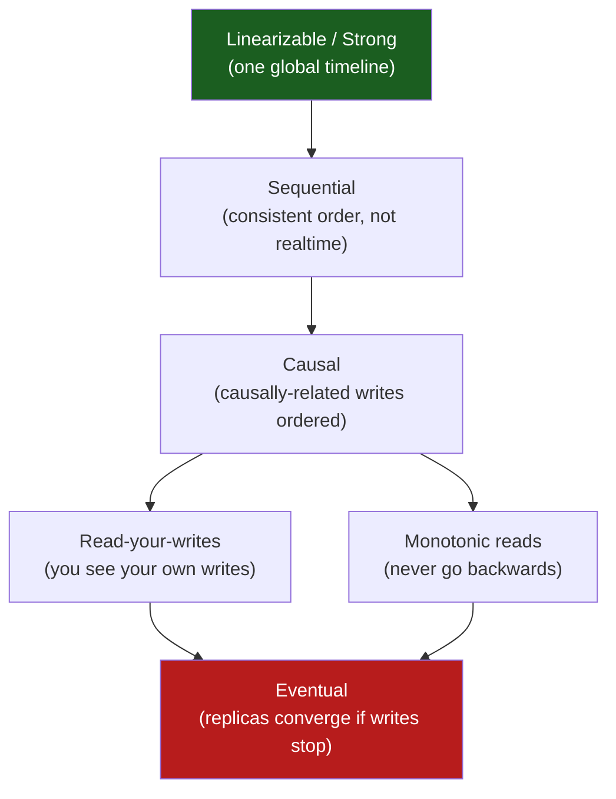
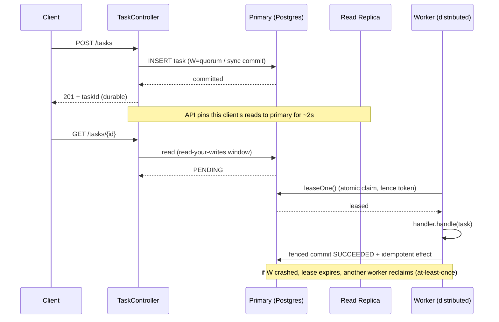

# Consistency, Availability and Eventual Consistency

> Where this fits: in Phase 1 our `TaskQueue` lived in one JVM, so "the state of a task" was unambiguous — there was exactly one copy. The moment we replicate the task store across nodes (Phase 3) and run distributed workers behind a broker (Phase 4), *the same task now exists in multiple places at once*. This chapter is about what "the status of task `abc-123`" even means when three replicas disagree, when a worker reads a stale `PENDING` and runs a task that already `SUCCEEDED`, and how we deliberately choose to **tolerate** that instead of preventing it. It is the engineering follow-up to [`cap-theorem.md`](cap-theorem.md) and the conceptual foundation under [`idempotency.md`](idempotency.md), [`retries.md`](retries.md), and [`message-ordering.md`](message-ordering.md).

## 1. Why this exists — the real problem it solves

A single-node system has a luxury you stop noticing until it is gone: **there is one copy of every fact.** When `Worker` flips a task from `RUNNING` to `SUCCEEDED`, the next read sees `SUCCEEDED`. Period. Reads and writes are totally ordered by the hardware.

Replication destroys that luxury, and we replicate for two unavoidable reasons:

1. **Durability.** One disk fails roughly every few years. With one copy, that is data loss. With three copies on three machines, the probability that all three fail in the same minute is negligible. Replication is how you survive hardware failure.
2. **Availability and throughput.** One node can serve only so many reads and can be unreachable during deploys, GC pauses, or network partitions. Many copies let you serve reads from the nearest/least-loaded replica and keep serving when one node is down.

But the instant you have two copies of a fact, a new question appears that did not exist before: **after a write lands on replica A, what does a read from replica B return?** The old value? The new value? An error? The answer to that question *is* your consistency model. There is no default; you choose one, and the choice has teeth.

Historically this was formalized slowly. Lamport defined **sequential consistency** (1979) and **happens-before** (1978). Gilbert and Lynch proved the **CAP theorem** (2002) — under a network partition you must choose Consistency or Availability. Werner Vogels popularized **eventual consistency** at Amazon (Dynamo, 2007) because at Amazon's scale, refusing to serve a read because one replica was unreachable meant refusing to take money. Daniel Abadi's **PACELC** (2010) sharpened CAP: *even when there is no partition*, you trade Latency against Consistency. Every one of these ideas shows up directly in how we store `TaskStatus`.

The brutal practical summary for our task queue:

- If we demand **strong consistency** on task state, a worker never runs a stale task — but a network partition can stop the whole platform from accepting or processing tasks.
- If we accept **eventual consistency**, the platform keeps running through partitions — but two workers can read `PENDING` for the same task and **execute it twice**.

We cannot make double-execution impossible at the consistency layer without paying an availability/latency tax most systems refuse to pay. So the production stance — the one Celery, Sidekiq, SQS, and our project all take — is: **choose availability, embrace at-least-once delivery, and make task execution idempotent so duplicates are harmless.** This chapter explains every word of that sentence.

## 2. The vocabulary, made precise

People throw "consistency" around to mean three different things. Pin them down:

| Term | What it actually constrains | Example in our project |
|---|---|---|
| **Consistency (CAP)** | Whether all replicas return the *latest* write (linearizability) | Does a read of `taskStatus` see the most recent status write? |
| **Consistency (ACID)** | Whether a transaction preserves invariants | Does `attempts` never exceed `maxAttempts` within one DB txn? |
| **Consistency model** | The *contract* on read/write ordering across the system | Strong, eventual, read-your-writes, monotonic reads… |

In distributed systems we mean the first and third. These are the models you actually pick from, from strongest to weakest:



- **Linearizable (strong):** every operation appears to take effect instantaneously at some point between its call and return, in one global order. A read always sees the most recent committed write. This is what a single mutex-guarded variable gives you — and what you must coordinate hard to get across nodes.
- **Sequential:** there is *some* legal global order that every node agrees on, but it need not match real-time. Weaker than linearizable, rarely what you ask for explicitly.
- **Causal:** if write X causally precedes write Y (Y read the result of X), every node sees X before Y. Concurrent (unrelated) writes can be seen in any order. This is the sweet spot for many systems.
- **Read-your-writes:** after *you* write, *your* subsequent reads see it. Critical for UX: a user who submits a task and immediately polls `GET /tasks/{id}` must not get a 404.
- **Monotonic reads:** once you've seen a value, you never see an older one. No time-travel backward.
- **Eventual:** if writes stop, all replicas *eventually* converge to the same value. Says nothing about *when* or what you see in the meantime. The weakest useful guarantee — and the one that keeps you available.

> The trap: "eventual consistency" is not a single thing. Plain eventual consistency is shockingly weak — it permits reading a value, then reading an *older* value, then a 404, then the new value, in any order. Real systems layer **read-your-writes** and **monotonic reads** on top to make it tolerable. We will do exactly that for `GET /tasks/{id}`.

## 3. The naive version — assume one source of truth

Phase 1's queue was a `BlockingQueue` in one JVM. Phase 2 introduced PostgreSQL. The naive Phase 3 instinct is to keep treating the database as if it were that single in-memory map — to assume every read sees the latest write, everywhere, always.

```java
// NAIVE: assumes a single, strongly-consistent source of truth for task state.
// Works on one node. Quietly wrong the moment you add a read replica.
public class NaiveTaskService {

    private final TaskRepository repo; // backed by Postgres

    public NaiveTaskService(TaskRepository repo) {
        this.repo = repo;
    }

    // A worker checks "is this task still mine to run?" by re-reading status.
    public boolean claimAndCheck(String taskId) {
        Task t = repo.findById(taskId).orElseThrow();
        if (t.status() == TaskStatus.PENDING) {
            // Assumes: nobody else can have changed this between my read and my run.
            return true; // <-- the lie
        }
        return false;
    }
}
```

Why this is wrong the instant you scale:

- **Read replicas lag.** Add a Postgres read replica to offload `GET /tasks/{id}`, point `findById` at it, and `claimAndCheck` now reads *stale* status. Two workers both read `PENDING`. Both run the task. Phase 3 double-execution bug, born.
- **Check-then-act is not atomic across nodes.** Even on the primary, the gap between `findById` and the decision is a race window. Another worker can claim the task in that gap.
- **It conflates "I read PENDING" with "I own this task."** Reading a status is not a lease. Ownership requires an atomic state transition, not a read.

The naive code isn't bugged on one node — it's *unfalsifiable* on one node. It only fails once the topology that makes you money (replicas, multiple workers) arrives.

## 4. Improved version — atomic claim, and name your read consistency

Two fixes. First, replace check-then-act with an **atomic conditional update** so "claim" is a single linearizable operation against the primary. Second, stop pretending reads are strong — explicitly route reads to a consistency level you can defend.

```java
// IMPROVED: claiming is an atomic compare-and-set, not a read.
// And reads are explicitly tagged with the consistency they need.
public class ClaimingTaskRepository {

    private final JdbcTemplate jdbc;

    public ClaimingTaskRepository(JdbcTemplate jdbc) {
        this.jdbc = jdbc;
    }

    /**
     * Atomically transition PENDING -> RUNNING for exactly one worker.
     * Returns true only if THIS worker won the claim. No read race possible:
     * the WHERE clause makes the check and the act one statement on the primary.
     */
    public boolean claim(String taskId, String workerId) {
        int updated = jdbc.update("""
            UPDATE tasks
               SET status = 'RUNNING',
                   locked_by = ?,
                   locked_at = now(),
                   attempts = attempts + 1
             WHERE id = ?
               AND status = 'PENDING'
            """, workerId, taskId);
        return updated == 1; // 0 means someone else already claimed it
    }

    /** Strong read: hits the PRIMARY. Use when correctness depends on freshness. */
    public Optional<Task> findByIdStrong(String taskId) {
        return queryPrimary(taskId);
    }

    /** Eventual read: may hit a lagging replica. Use for status display. */
    public Optional<Task> findByIdEventual(String taskId) {
        return queryReplica(taskId);
    }

    private Optional<Task> queryPrimary(String id) { /* routes to primary DataSource */ return query(id); }
    private Optional<Task> queryReplica(String id) { /* routes to replica DataSource */ return query(id); }
    private Optional<Task> query(String id) {
        return jdbc.query("SELECT * FROM tasks WHERE id = ?", this::mapRow, id).stream().findFirst();
    }

    private Task mapRow(java.sql.ResultSet rs, int n) throws java.sql.SQLException {
        return new Task(
            rs.getString("id"), rs.getString("type"), rs.getString("payload"),
            TaskStatus.valueOf(rs.getString("status")), rs.getInt("attempts"),
            rs.getInt("max_attempts"), rs.getTimestamp("created_at").toInstant(),
            rs.getTimestamp("scheduled_at").toInstant(), rs.getInt("priority"));
    }
}
```

This is already vastly better: the **claim** is correct under any number of workers because the database enforces linearizability on a single row, and **reads** now declare their consistency needs instead of silently inheriting whatever the connection pool routes to. But it still has two gaps a staff engineer will flag:

1. A worker can win the claim, then **crash before finishing**. The row sits `RUNNING` with `locked_by = me` forever. We need a lease with a timeout, not a permanent lock.
2. Even atomic claims give **at-least-once** execution: a worker can finish the task, then crash *before* writing `SUCCEEDED`. The lease expires, another worker reclaims and re-runs. Duplicates are inherent. We don't prevent them here — we make them safe in §5 and [`idempotency.md`](idempotency.md).

## 5. Production-quality version — leases, fencing, and idempotent effects

The production stance accepts the truth we cannot escape: **distributed task execution is at-least-once.** You can make it *almost* exactly-once for the common case, but a sufficiently unlucky crash always permits a duplicate. So you engineer the duplicate to be a no-op.

Three production techniques, stacked:

1. **Leased claims with expiry** — a claim is time-bounded; if the worker dies, the lease expires and the task becomes reclaimable. `SELECT ... FOR UPDATE SKIP LOCKED` (Phase 2's `PostgresTaskQueue`) plus a `locked_until` column.
2. **Fencing tokens** — every lease carries a monotonically increasing token. A slow worker that wakes up after its lease expired is rejected when it tries to commit, because its token is stale. This defeats the classic "paused worker resurrects and writes" hazard (see [`distributed-locks.md`](distributed-locks.md)).
3. **Idempotent effects keyed by `(taskId, attempt)`** — the *result* of a task is recorded with a unique key so a re-run cannot double-charge, double-send, or double-write.

```java
// PRODUCTION-INSPIRED: at-least-once claim + fencing + idempotent commit.
// The system stays AVAILABLE (any worker can reclaim an expired lease) while
// duplicate execution is rendered HARMLESS rather than impossible.
public final class LeasedTaskExecutor {

    private static final Duration LEASE = Duration.ofSeconds(30);

    private final JdbcTemplate jdbc;
    private final Map<String, TaskHandler> handlers; // type -> handler
    private final String workerId;

    public LeasedTaskExecutor(JdbcTemplate jdbc, Map<String, TaskHandler> handlers, String workerId) {
        this.jdbc = jdbc;
        this.handlers = handlers;
        this.workerId = workerId;
    }

    /** Atomically lease one due task, returning it plus a fencing token. */
    public Optional<Lease> leaseOne() {
        // SKIP LOCKED: never block on a row another worker is leasing — stay available.
        return jdbc.query("""
            UPDATE tasks
               SET status        = 'RUNNING',
                   locked_by     = ?,
                   locked_until  = now() + interval '30 seconds',
                   fence_token   = fence_token + 1,
                   attempts      = attempts + 1
             WHERE id = (
                 SELECT id FROM tasks
                  WHERE status = 'PENDING'
                    AND scheduled_at <= now()
                    AND (locked_until IS NULL OR locked_until < now())
                  ORDER BY priority DESC, scheduled_at ASC
                  FOR UPDATE SKIP LOCKED
                  LIMIT 1)
         RETURNING id, type, payload, attempts, fence_token
            """, this::mapLease, workerId).stream().findFirst().map(Optional::of).orElse(Optional.empty());
    }

    /** Execute, then commit the outcome only if our fence token is still current. */
    public void run(Lease lease) {
        TaskHandler handler = handlers.get(lease.type());
        TaskResult result;
        try {
            result = handler.handle(lease.task()); // the actual side-effecting work
        } catch (Exception e) {
            result = new TaskResult(false, e.getMessage(), true); // retryable failure
        }

        // Idempotency boundary: record the effect keyed by (taskId, attempt).
        // If a duplicate run reaches here with the same key, INSERT is a no-op.
        boolean firstTimeEffect = jdbc.update("""
            INSERT INTO task_effects (task_id, attempt, result_message)
            VALUES (?, ?, ?)
            ON CONFLICT (task_id, attempt) DO NOTHING
            """, lease.id(), lease.attempt(), result.message()) == 1;

        // Fenced commit: only write final status if nobody re-leased this task
        // (which would have bumped fence_token past ours).
        int committed = jdbc.update("""
            UPDATE tasks
               SET status       = ?,
                   locked_by    = NULL,
                   locked_until = NULL
             WHERE id = ?
               AND fence_token = ?
            """, terminalStatus(result, lease).name(), lease.id(), lease.fenceToken());

        if (committed == 0) {
            // Our lease expired and someone else owns the task now. Abandon quietly.
            // The idempotent task_effects insert above is what kept us safe.
        }
    }

    private TaskStatus terminalStatus(TaskResult r, Lease lease) {
        if (r.success()) return TaskStatus.SUCCEEDED;
        if (r.retryable() && lease.attempt() < lease.maxAttempts()) return TaskStatus.PENDING; // becomes RETRYING
        return TaskStatus.DEAD; // exhausted -> DLQ
    }

    private Lease mapLease(java.sql.ResultSet rs, int n) throws java.sql.SQLException {
        return new Lease(
            rs.getString("id"), rs.getString("type"), rs.getString("payload"),
            rs.getInt("attempts"), rs.getInt("attempts") /*maxAttempts placeholder*/,
            rs.getLong("fence_token"));
    }

    public record Lease(String id, String type, String payload, int attempt, int maxAttempts, long fenceToken) {
        Task task() {
            return new Task(id, type, payload, TaskStatus.RUNNING, attempt, maxAttempts,
                java.time.Instant.now(), java.time.Instant.now(), 0);
        }
    }
}
```

What this buys us, mapped back to the consistency/availability axes:

- **Availability:** `SKIP LOCKED` means a worker never blocks waiting on another worker's row; an expired lease is instantly reclaimable. A worker crash never freezes a task forever. The platform keeps draining.
- **Consistency:** the *claim* and the *commit* are each linearizable on a single row (Postgres gives us that). We did **not** need cross-node consensus for task state — we localized the strong-consistency requirement to one row in one primary, which scales far better than making the whole system linearizable.
- **Duplicate safety:** the fence token rejects a zombie worker's late commit; the `task_effects` unique key makes the *side effect* idempotent. Together they turn at-least-once into "effectively once" for the effect that matters.

## 6. Code walkthrough — three levels

### Beginner: simulate replica lag and watch read-your-writes break

```java
// A toy two-replica store. Writes go to primary; reads MAY hit a stale replica.
// Demonstrates why naive eventual reads break "read your own write".
import java.util.*;
import java.util.concurrent.*;

public class ReplicaLagDemo {
    static final Map<String, String> primary = new ConcurrentHashMap<>();
    static final Map<String, String> replica = new ConcurrentHashMap<>();
    static final ScheduledExecutorService replication = Executors.newSingleThreadScheduledExecutor();

    static void write(String taskId, String status) {
        primary.put(taskId, status);
        // Replication is asynchronous: applies after a 200ms delay.
        replication.schedule(() -> replica.put(taskId, status), 200, TimeUnit.MILLISECONDS);
    }

    static String readEventual(String taskId) { return replica.getOrDefault(taskId, "NOT_FOUND"); }
    static String readStrong(String taskId)   { return primary.getOrDefault(taskId, "NOT_FOUND"); }

    public static void main(String[] args) throws Exception {
        write("abc-123", "PENDING");
        System.out.println("immediately, eventual read: " + readEventual("abc-123")); // NOT_FOUND (lag!)
        System.out.println("immediately, strong  read: " + readStrong("abc-123"));    // PENDING
        Thread.sleep(300);
        System.out.println("after 300ms, eventual read: " + readEventual("abc-123")); // PENDING (converged)
        replication.shutdown();
    }
}
```

The lesson in three lines of output: a user who `POST`s a task and immediately `GET`s it would see `NOT_FOUND` if we serve the read from the replica. That is the read-your-writes violation that makes UIs feel broken.

### Intermediate: a session-pinned router that gives read-your-writes cheaply

```java
// Route a user's reads to the primary for a short window after they write,
// then let them drift to replicas. This buys read-your-writes WITHOUT making
// every read strong (which would overload the primary).
import java.time.*;
import java.util.*;
import java.util.concurrent.*;

public class ReadYourWritesRouter {

    // After a write, pin THIS client to the primary until this instant.
    private final Map<String, Instant> pinUntil = new ConcurrentHashMap<>();
    private final Duration stickiness;
    private final ReplicaLagDemoStore store;

    public ReadYourWritesRouter(Duration stickiness, ReplicaLagDemoStore store) {
        this.stickiness = stickiness;
        this.store = store;
    }

    public void write(String clientId, String taskId, String status) {
        store.writePrimary(taskId, status);
        // Pin long enough to outlast worst-case replication lag.
        pinUntil.put(clientId, Instant.now().plus(stickiness));
    }

    public String read(String clientId, String taskId) {
        Instant pin = pinUntil.get(clientId);
        boolean mustHitPrimary = pin != null && Instant.now().isBefore(pin);
        return mustHitPrimary ? store.readPrimary(taskId) : store.readReplica(taskId);
    }

    interface ReplicaLagDemoStore {
        void writePrimary(String id, String v);
        String readPrimary(String id);
        String readReplica(String id);
    }
}
```

This is the real-world technique: AWS Aurora, Vitess, and most read-replica setups expose exactly this "route reads to primary for N seconds after a write" knob. It localizes the strong-consistency cost to the *one client who just wrote*, leaving everyone else cheap eventual reads. PACELC made concrete: when there is no partition, you trade a little latency (primary read) for consistency, only when you must.

### Production-inspired: quorum reads/writes with version reconciliation

When the store is itself replicated N ways (Dynamo-style, or Cassandra), you tune consistency per-operation with quorums. The rule `R + W > N` guarantees read and write quorums overlap, so a read sees the latest write — *if* you can reach a quorum.

```java
// A simplified Dynamo-style quorum coordinator for task status.
// N replicas, write to W, read from R. R + W > N => strongly consistent reads
// (as long as a quorum is reachable). R + W <= N => eventual, higher availability.
import java.util.*;
import java.util.concurrent.*;
import java.util.stream.*;

public final class QuorumTaskStore {

    /** A versioned value so concurrent writes can be reconciled (last-writer-wins by version). */
    public record Versioned(String status, long version) {}

    public interface Replica {
        void put(String taskId, Versioned v);          // may throw if unreachable
        Optional<Versioned> get(String taskId);         // may throw if unreachable
    }

    private final List<Replica> replicas;
    private final int writeQuorum; // W
    private final int readQuorum;  // R
    private final ExecutorService io = Executors.newVirtualThreadPerTaskExecutor(); // Loom: cheap fan-out

    public QuorumTaskStore(List<Replica> replicas, int writeQuorum, int readQuorum) {
        this.replicas = List.copyOf(replicas);
        this.writeQuorum = writeQuorum;
        this.readQuorum = readQuorum;
    }

    /** Write to all, succeed when W acknowledge. Stays available if up to N-W replicas are down. */
    public void write(String taskId, String status, long version) {
        Versioned v = new Versioned(status, version);
        List<Future<Boolean>> acks = replicas.stream()
            .map(r -> io.submit(() -> { r.put(taskId, v); return true; }))
            .toList();
        long ok = acks.stream().filter(QuorumTaskStore::succeeded).count();
        if (ok < writeQuorum) {
            throw new IllegalStateException("write quorum not met: " + ok + " < " + writeQuorum);
        }
    }

    /** Read from R replicas, return the highest version (most recent write). */
    public Optional<Versioned> read(String taskId) {
        List<Future<Optional<Versioned>>> reads = replicas.stream()
            .map(r -> io.submit(() -> r.get(taskId)))
            .toList();
        List<Versioned> seen = reads.stream()
            .map(QuorumTaskStore::value)
            .flatMap(Optional::stream)
            .collect(Collectors.toList());
        if (seen.size() < readQuorum) {
            throw new IllegalStateException("read quorum not met: " + seen.size() + " < " + readQuorum);
        }
        // Reconcile divergent replicas: newest version wins. (Real systems use vector clocks
        // for concurrent writes; we use a monotonic version for clarity.)
        return seen.stream().max(Comparator.comparingLong(Versioned::version));
    }

    private static boolean succeeded(Future<Boolean> f) {
        try { return f.get(200, TimeUnit.MILLISECONDS); } catch (Exception e) { return false; }
    }
    private static Optional<Versioned> value(Future<Optional<Versioned>> f) {
        try { return f.get(200, TimeUnit.MILLISECONDS); } catch (Exception e) { return Optional.empty(); }
    }
}
```

With `N=3`: pick `W=2, R=2` (`R+W=4 > 3`) for strong reads that tolerate one dead replica; pick `W=1, R=1` (`R+W=2 ≤ 3`) for maximum availability and lowest latency at the cost of stale reads. *You choose per workload.* Task **submission** might use `W=2` (don't lose a task), while a status **dashboard** uses `R=1` (stale is fine). Virtual threads make the scatter-gather to N replicas essentially free to write — see [`futures-and-completablefuture.md`](../06-concurrency/futures-and-completablefuture.md).

## 7. How this applies to our Task Queue project

Concrete decisions, per canonical component:



- **`Task` submission** is the one place we want *strong durability*: a `201 Created` must mean the task survives a primary crash. Use a synchronous-commit / write-quorum write. Losing a submitted task is the cardinal sin of a task queue.
- **`GET /tasks/{id}`** (the `TaskController` read) uses **read-your-writes**: pin the submitter's reads to the primary for a couple of seconds, then fall back to replicas. Avoids the 404-after-create footgun while keeping the primary unburdened.
- **`TaskQueue.dequeue()` / leasing** localizes strong consistency to a *single row* via `FOR UPDATE SKIP LOCKED` + fence token. We do not need a distributed consensus protocol for task state because the database row is our linearization point.
- **Distributed `Worker` nodes** operate under **at-least-once** semantics. The `EventBus` (Phase 4) is also at-least-once — a `TaskEvent` may be delivered twice. Every `TaskEventListener` must be idempotent.
- **`DeadLetterQueue.send`** must be idempotent too: a reclaimed task that already DLQ'd should not produce a second DLQ entry. Key on `taskId`.
- **`MetricsCollector`**: counters are *the* place where eventual consistency is fine and double-counting is acceptable noise — never block a task on a metrics write.

The governing principle: **push the strong-consistency requirement to the smallest possible surface (one row, one claim), and make everything else tolerate duplicates.**

## 8. Tradeoffs

| Choice | Consistency | Availability | Latency | When to use in our project |
|---|---|---|---|---|
| Single primary, sync commit | Strong | Lower (primary is SPOF for writes) | Higher writes | Task submission (durability matters) |
| Primary + async read replicas | Eventual reads | High reads | Low reads | Status dashboards, listing tasks |
| Read-your-writes pinning | Strong for the writer | High | Low (mostly) | `GET /tasks/{id}` right after submit |
| Quorum `R+W>N` | Strong (quorum reachable) | Survives `N-W` failures | Medium (fan-out) | Multi-region task store |
| Quorum `R+W≤N` | Eventual | Highest | Lowest | Metrics, non-critical state |
| Linearizable consensus (Raft) | Strongest | Stalls under partition | Highest | Leader election, config — not per-task state |

The meta-tradeoff (PACELC): **if Partition, choose Availability or Consistency; Else, choose Latency or Consistency.** Our project is "PA/EL" for task *state* (available + low-latency, eventual) and "PC/EC" for the *claim* (consistent, on one row). Mixing models per operation is normal and correct — uniform consistency across a whole system is a beginner expectation.

### The nines: availability math you should be able to do on a whiteboard

| SLA | Downtime/year | Downtime/month | Practical meaning |
|---|---|---|---|
| 99% (two nines) | 3.65 days | 7.3 hours | Hobby project |
| 99.9% (three nines) | 8.77 hours | 43.8 min | Typical internal service |
| 99.99% (four nines) | 52.6 min | 4.4 min | Serious SaaS; needs redundancy |
| 99.999% (five nines) | 5.26 min | 26.3 sec | Telco/payments; very expensive |

Two facts to internalize:

1. **Series dependencies multiply.** If a request needs the API (99.9%), the DB (99.9%), and the broker (99.9%), the *combined* availability is `0.999³ ≈ 0.997` — worse than any component. More dependencies in series = lower availability. This is *the* argument for graceful degradation: let the API accept tasks even when the metrics system is down.
2. **Redundancy adds nines.** Two independent replicas each at 99% give `1 - (0.01)² = 99.99%` for "at least one up." This is why we replicate. The catch: failures must be *independent* — same datacenter, same deploy, or same bad migration correlates them and the math collapses.

```text
Combined (series):    A_total = A1 × A2 × ... × An     (always ≤ smallest)
Redundant (parallel): A_total = 1 - (1-A1)(1-A2)...     (always ≥ largest)
```

## 9. Common mistakes and pitfalls

- **Assuming reads are strong because writes go to one DB.** Adding a read replica silently makes reads eventual. *Fix:* explicitly route reads; tag each query with the consistency it needs.
- **Using a status read as a lock.** "If status == PENDING, run it" is a race, not a claim. *Fix:* atomic conditional UPDATE (`WHERE status = 'PENDING'`); check `rowsAffected == 1`.
- **Believing "exactly-once delivery" exists.** It does not, end-to-end, across crashes. *Fix:* engineer at-least-once + idempotency; see [`idempotency.md`](idempotency.md).
- **Permanent locks instead of leases.** A `locked_by` with no expiry freezes a task forever when the worker dies. *Fix:* `locked_until` + reclaim expired leases.
- **No fencing token.** A GC-paused worker can wake after its lease expired and clobber the new owner's write. *Fix:* monotonic fence token; reject stale commits.
- **Uniform strong consistency everywhere.** Making metrics linearizable wastes latency and availability. *Fix:* pick the *weakest* model that is still correct per operation.
- **Ignoring monotonic reads in a UI.** Polling `GET /tasks/{id}` across replicas can show `RUNNING` then `PENDING` then `RUNNING`. *Fix:* sticky routing or version-gated client display (drop a response with a lower version than last seen).
- **Forgetting clocks lie.** Lease expiry by wall-clock across nodes is unsafe if clocks drift. *Fix:* prefer DB-server time (`now()`), monotonic tokens, and generous lease margins.

## 10. Refactoring exercise

**Bad** — read-then-act with eventual reads; double-executes under load:

```java
public void process(String taskId) {
    Task t = repo.findByIdEventual(taskId).orElseThrow(); // may be stale!
    if (t.status() == TaskStatus.PENDING) {
        handler.handle(t);                                 // two workers can both reach here
        repo.updateStatus(taskId, TaskStatus.SUCCEEDED);   // last writer wins, work done twice
    }
}
```

**Improved** — atomic claim on the primary, so only one worker proceeds:

```java
public void process(String taskId, String workerId) {
    boolean claimed = repo.claim(taskId, workerId);        // atomic PENDING -> RUNNING on primary
    if (!claimed) return;                                  // someone else owns it; bail
    Task t = repo.findByIdStrong(taskId).orElseThrow();    // strong read after claim
    TaskResult r = handler.handle(t);
    repo.updateStatus(taskId, r.success() ? TaskStatus.SUCCEEDED : TaskStatus.RETRYING);
}
```

**Production** — leased claim + fencing + idempotent effect; safe even if a duplicate slips through:

```java
public void process(String workerId) {
    leasedExecutor.leaseOne().ifPresent(lease -> {
        // handler.handle runs inside run(); the effect is keyed by (taskId, attempt)
        // and the final status write is fenced by the lease's monotonic token.
        leasedExecutor.run(lease);
        // A zombie duplicate that reaches run() again is a no-op:
        //   - INSERT ... ON CONFLICT DO NOTHING short-circuits the side effect
        //   - UPDATE ... WHERE fence_token = ? affects 0 rows for the stale worker
    });
}
```

The progression is the whole chapter in miniature: **read-then-act → atomic claim → leased + fenced + idempotent.** Each step localizes the strong-consistency requirement to a smaller surface while keeping availability high.

## 11. Exercises

### Easy

- **E1 (knowledge check).** Define read-your-writes consistency in one sentence, and give one concrete `TaskController` endpoint where violating it produces a user-visible bug.
- **E2 (knowledge check).** You run 3 services in series at 99.9% each. What is the combined availability, and is it higher or lower than any single service? Show the arithmetic.
- **E3 (coding).** Implement a `boolean isStronglyConsistent(int n, int r, int w)` helper that returns whether a quorum config guarantees strong reads.

### Medium

- **M1 (coding).** Implement `MonotonicReadCache`: given a stream of `(taskId, status, version)` reads from various replicas, it must never return a version lower than one already returned for that `taskId`.
- **M2 (refactoring).** Take the **Bad** snippet from §10 and convert it to use an atomic claim, then explain in two sentences why it still only achieves at-least-once.
- **M3 (design).** Your `EventBus` (Phase 4) is at-least-once. A `TaskEventListener` updates a per-user "tasks completed" counter. Design how to make it idempotent without a global lock.

### Hard

- **H1 (interview-style).** A worker leases a task (lease = 30s), then suffers a 40s GC pause. Walk through exactly what goes wrong without a fence token, and prove a fence token fixes it.
- **H2 (design).** Design task-state storage for a 2-region active-active deployment where each region must accept submissions even if the inter-region link is down. State your consistency model, conflict-resolution rule, and what anomaly users might observe.
- **H3 (stretch).** Extend `QuorumTaskStore` to use vector clocks instead of a single version so two *concurrent* writes can be detected as conflicting (rather than silently last-writer-wins). Sketch the data structure and the read-side reconciliation.

## 12. Solutions

**E1.** Read-your-writes: after a client performs a write, that same client's later reads always reflect it. Bug: `POST /tasks` returns `201` with an id, the client immediately calls `GET /tasks/{id}`, the read hits a lagging replica, and returns `404` — the user thinks submission failed.

**E2.** `0.999 × 0.999 × 0.999 = 0.997002999 ≈ 99.70%`. Lower than any single service (99.9%). Series dependencies always reduce availability below the weakest link.

**E3.**

```java
public static boolean isStronglyConsistent(int n, int r, int w) {
    if (r < 1 || w < 1 || r > n || w > n) throw new IllegalArgumentException("invalid quorum");
    return r + w > n; // overlapping quorums guarantee a read sees the latest write
}
// isStronglyConsistent(3, 2, 2) == true ; isStronglyConsistent(3, 1, 1) == false
```

**M1.**

```java
import java.util.*;
import java.util.concurrent.*;

public final class MonotonicReadCache {
    private final ConcurrentMap<String, Long> highestSeen = new ConcurrentHashMap<>();

    /** Returns the status to show. Never goes backward in version for a given task. */
    public synchronized Optional<String> observe(String taskId, String status, long version) {
        long prev = highestSeen.getOrDefault(taskId, Long.MIN_VALUE);
        if (version < prev) {
            return Optional.empty(); // stale replica read; drop it, keep showing what we had
        }
        highestSeen.put(taskId, version);
        return Optional.of(status);
    }
}
```

It enforces monotonic reads by remembering the highest version returned per task and discarding any read carrying a lower version — exactly what prevents a polling UI from flickering `RUNNING → PENDING → RUNNING`.

**M2.**

```java
public void process(String taskId, String workerId) {
    if (!repo.claim(taskId, workerId)) return;          // atomic PENDING -> RUNNING
    Task t = repo.findByIdStrong(taskId).orElseThrow();
    TaskResult r = handler.handle(t);
    repo.updateStatus(taskId, r.success() ? TaskStatus.SUCCEEDED : TaskStatus.RETRYING);
}
```

Still only at-least-once because a worker can win the claim, complete `handle(t)` (the side effect happens), and then crash *before* `updateStatus`. The lease expires, another worker reclaims the still-`RUNNING` task, and re-runs `handle`. The claim prevents *concurrent* duplicates, not *sequential* ones after a crash.

**M3.** Make the listener's write idempotent by tracking *which task* contributed to the counter, not just incrementing blindly:

```java
// Idempotent counter update: increment only if this (userId, taskId) pair is new.
public void onTaskCompleted(TaskEvent e) {
    int inserted = jdbc.update("""
        INSERT INTO user_completed_tasks (user_id, task_id)
        VALUES (?, ?)
        ON CONFLICT (user_id, task_id) DO NOTHING
        """, e.userId(), e.taskId());
    if (inserted == 1) {
        jdbc.update("UPDATE user_stats SET completed = completed + 1 WHERE user_id = ?", e.userId());
    }
    // A duplicate delivery inserts 0 rows -> no second increment. No global lock needed.
}
```

The dedup key `(user_id, task_id)` turns at-least-once delivery into exactly-once *effect* on the counter.

**H1.** Without a fence token:

1. Worker A leases task T (lease until t+30s, status `RUNNING`).
2. Worker A enters a 40s GC pause at t+5s. It is alive but frozen.
3. At t+30s the lease expires. Worker B sees an expired lease, reclaims T (status `RUNNING`, `locked_by = B`), runs the handler, writes `SUCCEEDED` at t+35s.
4. At t+45s Worker A resumes, *believing it still holds the lease*, finishes its own run, and writes `SUCCEEDED`/`RETRYING` — clobbering B's outcome and possibly re-doing a side effect. Lost-update / double-execution.

With a fence token: B's reclaim bumps `fence_token` from k to k+1. A's commit is `UPDATE ... WHERE fence_token = k`. Since the row now holds k+1, A's update affects **0 rows** and is silently rejected. The monotonic token makes "I still hold the lease" *verifiable at write time*, which wall-clock lease checks cannot do across a paused process.

**H2.** Active-active 2-region task store:

- **Consistency model:** eventual, with per-region linearizable writes locally. Each region owns a write to its local store and asynchronously replicates cross-region. During a partition, both regions keep accepting submissions (AP choice).
- **Conflict resolution:** task *submission* rarely conflicts because each task has a globally unique UUID — two regions creating different tasks never collide. The real conflict is *status* updates to the same task processed in both regions. Resolve with: (a) **region affinity** — a task is "homed" to the region that created it and only that region's workers process it, eliminating cross-region status conflicts entirely; or (b) if affinity is impossible, use a CRDT-style status lattice (`SUCCEEDED` and `DEAD` are absorbing/terminal; merge by taking the most-advanced state).
- **Observable anomaly:** during a partition, a status query routed to the *other* region may show a task as `PENDING` that the home region has already `SUCCEEDED`; it converges after the link heals. Users polling cross-region might briefly see stale status, but no task is lost and none is double-completed (thanks to region affinity + idempotent effects).

**H3.** Vector clocks replace the single `long version` with a `Map<NodeId, Long>` counter per replica.

```java
public record VectorClock(Map<String, Long> counters) {
    VectorClock increment(String node) {
        var m = new java.util.HashMap<>(counters);
        m.merge(node, 1L, Long::sum);
        return new VectorClock(m);
    }
    // A "descends from" B if every entry in B is <= A. Concurrent if neither descends.
    boolean descendsFrom(VectorClock b) {
        return b.counters.entrySet().stream()
            .allMatch(e -> counters.getOrDefault(e.getKey(), 0L) >= e.getValue());
    }
    static boolean concurrent(VectorClock a, VectorClock b) {
        return !a.descendsFrom(b) && !b.descendsFrom(a);
    }
}
```

Read-side reconciliation: collect all versioned values from the read quorum. Discard any that another value *descends from* (strictly older). If exactly one survives, return it. If two or more survive and are mutually `concurrent`, you have a genuine conflict — return *all* siblings to the caller (Dynamo's "sibling values") and resolve with a domain rule (for task status: take the most-advanced terminal state, since `SUCCEEDED`/`DEAD` are absorbing). This detects concurrent writes that single-version last-writer-wins would silently drop.

## 13. Interview questions and takeaways

1. **Q: What does the CAP theorem actually force you to choose, and when?**
   A: *Only during a network partition.* When partitioned, a replica that can't reach its peers must either return possibly-stale data (AP) or refuse the request (CP). When there's no partition, CAP says nothing — PACELC adds that you still trade latency vs consistency.

2. **Q: Is exactly-once delivery achievable?**
   A: Not end-to-end across crashes. You can get exactly-once *processing semantics* by combining at-least-once delivery with idempotent, deduplicated effects (a unique key per logical operation). Delivery is at-least-once; the *effect* is made once.

3. **Q: A read replica is lagging. A user creates a resource and immediately can't see it. Fix it without making all reads strong.**
   A: Read-your-writes via sticky routing — pin that client's reads to the primary for a window longer than worst-case replication lag, then fall back to replicas. Localizes the cost to the writer.

4. **Q: Quorum config N=5. Give a strongly consistent setting and a high-availability setting.**
   A: Strong: any `R+W>5`, e.g. `W=3,R=3`. High availability/low latency: `W=1,R=1` (eventual). Common balance: `W=3,R=3` survives two replica failures while staying consistent.

5. **Q: Why does adding services in series lower availability, and what do you do about it?**
   A: Availabilities multiply (`0.999³≈99.7%`), so each dependency is a tax. Mitigate with graceful degradation (don't fail the request when a non-critical dependency like metrics is down), redundancy on critical paths, and reducing the number of synchronous hops.

6. **Q: What is a fencing token and what failure does it prevent?**
   A: A monotonically increasing number issued with each lease. It prevents a paused/slow worker from committing after its lease expired and was reassigned — the stale worker's write is rejected because its token is no longer current. Locks alone (without fencing) cannot prevent this.

7. **Q: Why not just use Raft/consensus for task state to get strong consistency everywhere?**
   A: Consensus is correct but expensive (extra round-trips, stalls under partition) and overkill for per-task state. We localize strong consistency to a single DB row (the claim) and keep everything else eventual, which scales far better. Save consensus for genuinely global facts like leader election and config (see [`leader-election.md`](leader-election.md)).

8. **Q: Monotonic reads — why care?**
   A: Without it, reading across replicas can move *backward* in time (newer then older value), which breaks polling UIs and breaks invariants that assume state only advances. Enforce by remembering the highest version seen and rejecting lower ones.

**Takeaways:** Consistency is a *menu*, not a default — choose per operation. At-least-once + idempotency beats chasing impossible exactly-once. Push strong consistency to the smallest surface. Know the nines arithmetic cold.

## 14. Production considerations

- **Monitoring replication lag** is non-negotiable. Track `pg_last_wal_replay_lsn` lag (or your store's equivalent) as a Micrometer gauge; alert when it exceeds your read-your-writes stickiness window, because beyond that, pinning silently stops protecting users.
- **Lease/zombie metrics:** count reclaimed-expired leases and fenced-rejected commits. A spike means workers are crashing or GC-pausing past lease length — tune lease duration or fix the workers.
- **Idempotency table growth:** `task_effects` and dedup tables grow forever. Add TTL/partition-drop retention (e.g., keep 30 days) or they become the bottleneck.
- **Clock skew** breaks wall-clock leases. Prefer server-side `now()` for `locked_until`, keep NTP healthy, and pad lease durations to absorb a few seconds of skew. Never compare timestamps generated on different nodes for correctness-critical decisions.
- **Failover is a consistency event.** When a primary fails over to a replica, any writes acknowledged but not yet replicated are *lost* (RPO > 0 with async replication). For task submission, use synchronous commit to at least one standby so a `201` never lies. Document your RPO/RTO.
- **Correlated failures defeat the nines math.** Two replicas in the same rack, behind the same switch, deployed by the same bad migration, fail together. Spread replicas across availability zones and stagger deploys to keep failures independent.
- **Read-your-writes across services:** if service B reads what service A wrote, sticky-to-primary on a single client doesn't help. Pass a "minimum version/LSN" token between services so B can wait-for or route-to a replica fresh enough. This is the distributed version of the same idea.
- **Graceful degradation as availability strategy:** the API should accept and persist tasks even if the broker, metrics, or DLQ are temporarily down (buffer locally, reconcile later). Availability is mostly about *not coupling* your critical path to non-critical dependencies.

## What We Can Improve In Our Project Using This Concept

- Add a `fence_token bigint` and `locked_until timestamptz` to the `tasks` table so claims become **leases**, not permanent locks, and zombie workers can't clobber commits.
- Introduce a `task_effects(task_id, attempt, ...)` table with a unique key so the *side effect* of a task is idempotent — turning at-least-once execution into effectively-once.
- Split the `TaskRepository` read path into `findByIdStrong` (primary) and `findByIdEventual` (replica), and make `TaskController` apply read-your-writes pinning for the submitter.
- Make every `TaskEventListener` and `DeadLetterQueue.send` idempotent (dedup by `taskId`), since the Phase 4 `EventBus` is at-least-once.
- Use synchronous commit for task submission so a `201` is durable across a primary failover.

## Project Refactoring Task

Refactor Phase 3's `PostgresTaskQueue` claim path from a read-then-update into a single leased, fenced `UPDATE ... FOR UPDATE SKIP LOCKED ... RETURNING` (as in §5's `LeasedTaskExecutor.leaseOne`). Add a `task_effects` table and wrap the worker's commit so the final status write is gated on `fence_token`, and the side effect is recorded with `ON CONFLICT DO NOTHING`. Add a JUnit 5 + Testcontainers test that starts two `Worker`s against the same task, induces a simulated crash (commit one but skip the fenced status write), reclaims via expired lease, and asserts the handler's side effect ran exactly once even though it executed twice.

## Git Commit For This Chapter

```text
feat(queue): leased claims with fencing tokens and idempotent task effects

- add fence_token + locked_until columns via Flyway V7__leases.sql
- add task_effects table for idempotent side-effect recording (V8__effects.sql)
- LeasedTaskExecutor: atomic SKIP LOCKED lease, fenced commit, ON CONFLICT effect
- TaskRepository: split findByIdStrong (primary) vs findByIdEventual (replica)
- TaskController: read-your-writes pinning for the submitting client
- tests: ConcurrentClaimTest, ZombieWorkerFencingTest (Testcontainers Postgres)

Files touched:
  src/main/java/.../queue/LeasedTaskExecutor.java
  src/main/java/.../repo/TaskRepository.java
  src/main/java/.../api/TaskController.java
  src/main/resources/db/migration/V7__leases.sql
  src/main/resources/db/migration/V8__effects.sql
  src/test/java/.../queue/ZombieWorkerFencingTest.java
```

## Architecture Impact

This concept moves the project from "one source of truth" thinking to **multi-copy, per-operation consistency**. The architecture now has explicit primary/replica read routing, a leased claim protocol as the single linearization point for task state, and an idempotency boundary at every side-effecting edge (worker effects, event listeners, DLQ). It unblocks horizontal scaling (Phase 4) because no component requires global strong consistency — strong consistency is confined to one row, and everything else is designed to tolerate duplicates and lag. The availability story improves: workers can crash, replicas can lag, and a region can partition without losing tasks or freezing the pipeline.

## Interview Takeaways

- Consistency is a per-operation menu (strong / read-your-writes / monotonic / eventual), not a global switch — and mixing models is correct, not sloppy.
- CAP bites only under partition; PACELC reminds you that even healthy systems trade latency for consistency.
- Exactly-once delivery is a myth; at-least-once + idempotent effects (unique dedup key) is the real-world equivalent.
- Quorums (`R+W>N`) let you dial strong vs available per workload; fencing tokens + leases make distributed claims safe against paused workers.
- Availability is multiplicative in series and additive (via redundancy) in parallel — know the nines and design for independent failures.
