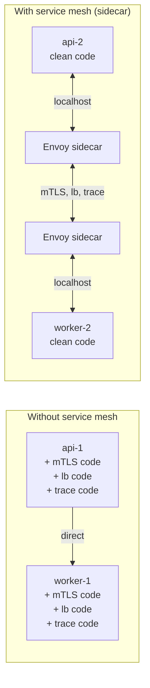
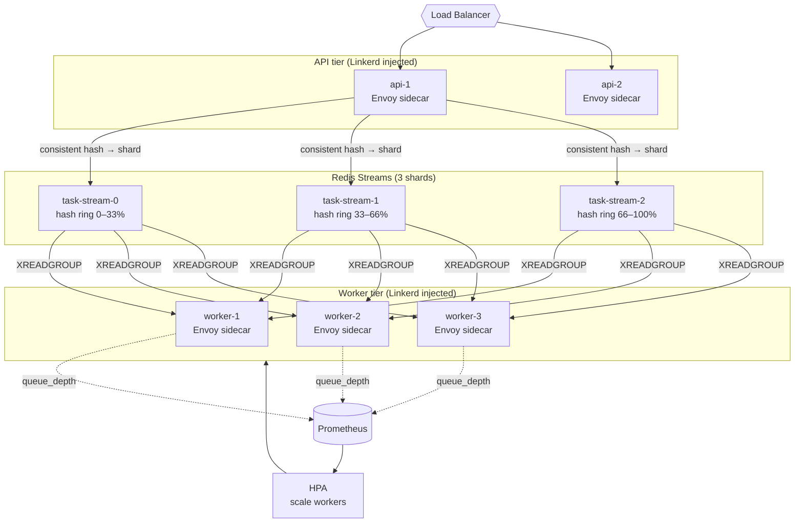

# Consistent Hashing and Service Mesh

> Where this fits in the project: [sharding.md](./sharding.md) says "partition by task-id hash." But *which* hash function, and why does the choice matter when you add or remove worker nodes? That's consistent hashing. And [service-discovery-and-scaling.md](./service-discovery-and-scaling.md) covers scaling the number of nodes — but once you have N worker containers talking to each other and to Postgres, Redis, and a broker, who handles auth between them, load balancing, retries, circuit breaking, and distributed tracing at the network layer? That's the service mesh. This chapter covers both: the **routing math** (consistent hashing) and the **wiring infrastructure** (service mesh / sidecar), which together make Phase 4's horizontal topology actually operational.

---

## 1. Why this exists

### Consistent hashing

In a single-process program there is no routing — you just call a function. In a distributed task queue with N worker nodes consuming from M broker partitions, you need to assign partitions to workers. The naive approach is **modular hashing**: `partition = hash(task.id) % N`. This works perfectly — until you add or remove a node.

With `% N`, changing N from 3 to 4 remaps nearly every key:

```
N=3: hash("task-abc") % 3 = 1  → worker-1
N=4: hash("task-abc") % 4 = 3  → worker-3   ← completely different!
```

If nearly every key remaps, you get a **reshuffling storm**: every worker drops its current assignments and picks up new ones simultaneously, thrashing caches, flushing in-flight state, and temporarily making the whole cluster unavailable. For a stateless task worker this is a performance problem; for a stateful cache or session store, it's data loss.

**Consistent hashing** bounds the remapping: when you add one node, only `1/N` of keys move (to the new node). When you remove one node, only `1/N` of keys move (to the remaining nodes). Everything else stays exactly where it was.

### Service mesh

Once you have N worker containers + M API containers + Postgres + Redis + a broker, you have `O(N²)` service-to-service connections to secure, observe, and control. Doing this in application code means every service must implement:

- **mTLS** (mutual TLS): authenticate that you're talking to the right service, not a rogue container
- **Load balancing**: which instance of worker-service do I call?
- **Retries and circuit breakers**: at the network level, not just the application level
- **Distributed tracing**: attach a trace ID to every inter-service call
- **Rate limiting**: per-service quotas
- **Canary routing**: send 10% of traffic to the new version

A service mesh moves all of this into a **sidecar proxy** (Envoy, Linkerd) running alongside each container. The application talks to localhost; the sidecar handles everything else. The application code becomes simpler; the mesh operator controls policy centrally.



---

## 2. The naive version

**Modular hashing** — correct with a fixed cluster, breaks on resize:

```java
// BAD for dynamic clusters. Fine for static partition assignment.
public int partitionFor(String taskId, int numPartitions) {
    return Math.abs(taskId.hashCode()) % numPartitions;
}

// The problem: add one worker node (numPartitions 3 → 4),
// and ~75% of keys remap. Every worker drops its current work.
```

**Direct service calls with hardcoded URLs** — the pre-mesh approach:

```java
// BAD: hardcoded URLs, no mTLS, no retry, no trace context propagation.
public TaskResult callHandler(Task task) throws Exception {
    HttpClient client = HttpClient.newHttpClient();
    HttpRequest req = HttpRequest.newBuilder()
            .uri(URI.create("http://worker-service:8080/handle"))  // hardcoded!
            .POST(HttpRequest.BodyPublishers.ofString(toJson(task)))
            .build();
    HttpResponse<String> resp = client.send(req, HttpResponse.BodyHandlers.ofString());
    return fromJson(resp.body());
    // No mTLS, no circuit breaker, no trace ID, no lb across 10 worker instances.
}
```

Both approaches work in the simplest possible setup and fail in production under load or topology changes.

---

## 3. Improved version

**Consistent hashing with a virtual node ring:**

```java
import java.security.MessageDigest;
import java.util.SortedMap;
import java.util.TreeMap;

/**
 * Consistent hash ring using virtual nodes (replicas per physical node).
 * Virtual nodes improve distribution when node count is small (e.g., 3 workers).
 * Without them, the ring has hot spots: one node might own 60% of the keyspace.
 * With 150 virtual nodes per physical node, distribution is nearly uniform.
 */
public final class ConsistentHashRing<N> {

    private final SortedMap<Long, N> ring = new TreeMap<>();
    private final int virtualNodesPerNode;

    public ConsistentHashRing(int virtualNodesPerNode) {
        this.virtualNodesPerNode = virtualNodesPerNode;
    }

    /** Add a node to the ring at virtualNodesPerNode positions. */
    public void addNode(N node) {
        for (int i = 0; i < virtualNodesPerNode; i++) {
            long position = hash(node.toString() + "-vnode-" + i);
            ring.put(position, node);
        }
    }

    /** Remove a node and all its virtual positions. */
    public void removeNode(N node) {
        for (int i = 0; i < virtualNodesPerNode; i++) {
            long position = hash(node.toString() + "-vnode-" + i);
            ring.remove(position);
        }
    }

    /**
     * Find the node responsible for this key.
     * Walk clockwise on the ring from the key's position; the first node encountered owns it.
     * When we add a node X between A and B: only the keys that were going to B
     * and now "see" X first are remapped. That's exactly 1/N of the keyspace.
     */
    public N nodeFor(String key) {
        if (ring.isEmpty()) throw new IllegalStateException("ring is empty");
        long position = hash(key);
        SortedMap<Long, N> tail = ring.tailMap(position);
        // If no node has a position >= key's hash, wrap around to the start of the ring.
        Long nodePosition = tail.isEmpty() ? ring.firstKey() : tail.firstKey();
        return ring.get(nodePosition);
    }

    /** MD5-based hash collapsed to a long. Deterministic across JVM restarts. */
    private long hash(String key) {
        try {
            MessageDigest md = MessageDigest.getInstance("MD5");
            byte[] digest = md.digest(key.getBytes(java.nio.charset.StandardCharsets.UTF_8));
            long h = 0;
            for (int i = 0; i < 8; i++) h = (h << 8) | (digest[i] & 0xFFL);
            return h;
        } catch (java.security.NoSuchAlgorithmException e) {
            throw new RuntimeException(e);
        }
    }
}
```

**Service discovery — dynamic URL resolution instead of hardcoded addresses:**

```java
import java.util.List;
import java.util.concurrent.CopyOnWriteArrayList;

/**
 * Simple client-side load balancer backed by a service registry.
 * In Phase 4 this is replaced by the service mesh sidecar, but the interface stays the same.
 * Workers register themselves on startup; the API tier discovers them here.
 */
public final class WorkerRegistry {

    private final CopyOnWriteArrayList<String> endpoints = new CopyOnWriteArrayList<>();
    private final ConsistentHashRing<String> ring = new ConsistentHashRing<>(150);
    private int roundRobinIndex = 0;

    public void register(String endpoint) {
        endpoints.add(endpoint);
        ring.addNode(endpoint);
    }

    public void deregister(String endpoint) {
        endpoints.remove(endpoint);
        ring.removeNode(endpoint);
    }

    /** Route a task to the worker responsible for its id (affinity routing). */
    public String workerForTask(String taskId) {
        return ring.nodeFor(taskId);
    }

    /** Round-robin across all workers (stateless load balancing). */
    public synchronized String nextWorker() {
        if (endpoints.isEmpty()) throw new IllegalStateException("no workers registered");
        return endpoints.get(roundRobinIndex++ % endpoints.size());
    }
}
```

---

## 4. Production-quality version

### 4.1 Task-id-based partition assignment with consistent hashing

In the Phase 4 Kafka adapter, partitions are assigned by `task.type()` as the key. But for Redis Streams with multiple streams (one per shard), consistent hashing routes each task to the correct shard:

```java
/**
 * ShardedRedisTaskQueue: consistent-hashed across multiple Redis Streams.
 * When a new shard is added, only tasks that hash into the new shard's range
 * are remapped. Existing tasks in flight on other shards are unaffected.
 */
public final class ShardedRedisTaskQueue implements AckableTaskQueue {

    private final List<RedisStreamTaskQueue> shards;
    private final ConsistentHashRing<Integer> ring;

    public ShardedRedisTaskQueue(List<RedisStreamTaskQueue> shards) {
        this.shards = shards;
        this.ring = new ConsistentHashRing<>(150);
        for (int i = 0; i < shards.size(); i++) ring.addNode(i);
    }

    @Override
    public void enqueue(Task t) {
        int shardIndex = ring.nodeFor(t.id());          // consistent hash → shard
        shards.get(shardIndex).enqueue(t);
    }

    @Override
    public Optional<Lease> poll(Duration block) throws InterruptedException {
        // Each worker polls its assigned shard(s) — determined by the consumer group
        // assignment in Redis Streams' XREADGROUP. We round-robin here for simplicity.
        for (RedisStreamTaskQueue shard : shards) {
            Optional<Lease> lease = shard.poll(Duration.ZERO);
            if (lease.isPresent()) return lease;
        }
        Thread.sleep(block.toMillis());
        return Optional.empty();
    }

    @Override
    public void ack(Lease lease)    { shardFor(lease).ack(lease); }

    @Override
    public void nack(Lease lease)   { shardFor(lease).nack(lease); }

    @Override
    public List<Lease> reclaimStale(Duration olderThan, int max) {
        return shards.stream()
                .flatMap(s -> s.reclaimStale(olderThan, max / shards.size()).stream())
                .toList();
    }

    @Override
    public Task dequeue() throws InterruptedException {
        return poll(Duration.ofSeconds(5)).map(Lease::task).orElse(null);
    }

    @Override
    public long size() {
        return shards.stream().mapToLong(RedisStreamTaskQueue::size).sum();
    }

    private RedisStreamTaskQueue shardFor(Lease lease) {
        return shards.get(ring.nodeFor(lease.task().id()));
    }
}
```

### 4.2 Service mesh sidecar integration (Envoy / Linkerd)

In a Kubernetes deployment, the service mesh is injected automatically — you add an annotation to the pod spec and the mesh control plane injects the sidecar. Your Java code never changes.

```yaml
# kubernetes/worker-deployment.yaml
apiVersion: apps/v1
kind: Deployment
metadata:
  name: task-worker
spec:
  replicas: 3
  template:
    metadata:
      annotations:
        # Linkerd: inject the sidecar proxy into every pod in this deployment
        linkerd.io/inject: enabled
        # Enables distributed tracing through the mesh
        config.linkerd.io/trace-collector: jaeger-collector:55678
    spec:
      containers:
      - name: task-worker
        image: taskqueue/worker:latest
        ports:
        - containerPort: 8080
        env:
        - name: WORKER_ID
          valueFrom:
            fieldRef:
              fieldPath: metadata.name   # pod name = unique worker id
        # The worker talks to localhost:4140 (Linkerd outbound proxy).
        # The proxy handles: mTLS, lb, retries, circuit breaking, tracing.
        - name: HTTP_PROXY
          value: "http://localhost:4140"
---
# Linkerd ServiceProfile: defines retry and timeout policy at the mesh level
apiVersion: linkerd.io/v1alpha2
kind: ServiceProfile
metadata:
  name: task-api.default.svc.cluster.local
spec:
  routes:
  - name: POST /tasks
    condition:
      method: POST
      pathRegex: /tasks
    responseClasses:
    - condition:
        status:
          min: 500
          max: 599
      isFailure: true
    retryBudget:
      retryRatio: 0.2          # max 20% of requests can be retries
      minRetriesPerSecond: 10
      ttl: 10s
    timeout: 5s
```

The Java code for the worker itself is completely unaware of the mesh:

```java
// Worker code: no TLS, no retry, no trace propagation — the sidecar handles all of it.
@RestController
public class WorkerController {

    private final HandlerRegistry handlers;
    private final TaskRepository repository;

    @PostMapping("/handle")
    public ResponseEntity<TaskResult> handle(@RequestBody Task task,
                                              @RequestHeader("X-Request-Id") String traceId) {
        // traceId was attached by the mesh sidecar and propagated via headers.
        // We pass it to our logger for correlation — no tracing SDK needed.
        MDC.put("traceId", traceId);
        try {
            TaskResult result = handlers.dispatch(task);
            return ResponseEntity.ok(result);
        } finally {
            MDC.remove("traceId");
        }
    }
}
```

### 4.3 Autoscaling on queue depth (HPA + custom metrics)

The service mesh exposes queue depth as a Prometheus metric; Kubernetes HPA scales workers based on it:

```yaml
# kubernetes/worker-hpa.yaml
apiVersion: autoscaling/v2
kind: HorizontalPodAutoscaler
metadata:
  name: task-worker-hpa
spec:
  scaleTargetRef:
    apiVersion: apps/v1
    kind: Deployment
    name: task-worker
  minReplicas: 2
  maxReplicas: 20
  metrics:
  - type: External
    external:
      metric:
        # Custom metric: Redis Streams pending message count (exposed via Prometheus adapter)
        name: redis_stream_pending_messages
        selector:
          matchLabels:
            stream: task-stream
      target:
        type: AverageValue
        averageValue: "100"    # scale up when avg pending > 100 per worker
```

```java
// Expose queue depth as a Micrometer gauge (Prometheus scrapes it → HPA uses it)
@Component
public class QueueDepthMetrics {

    private final AckableTaskQueue queue;
    private final MeterRegistry registry;

    public QueueDepthMetrics(AckableTaskQueue queue, MeterRegistry registry) {
        this.queue = queue;
        Gauge.builder("queue_depth", queue, AckableTaskQueue::size)
                .description("Number of pending messages in the task stream")
                .tag("stream", "task-stream")
                .register(registry);
    }
}
```

---

## 5. Code walkthrough

### Beginner: visualize consistent hashing remapping

```java
public class ConsistentHashDemo {
    public static void main(String[] args) {
        String[] tasks = {"task-1", "task-2", "task-3", "task-4", "task-5",
                          "task-6", "task-7", "task-8", "task-9", "task-10"};

        // Modular hashing: N=3 → N=4
        System.out.println("=== Modular hashing (% N) ===");
        System.out.println("N=3:");
        for (String t : tasks)
            System.out.printf("  %s → worker-%d%n", t, Math.abs(t.hashCode()) % 3);

        System.out.println("N=4 (add one worker):");
        int remapped = 0;
        for (String t : tasks) {
            int old3 = Math.abs(t.hashCode()) % 3;
            int new4 = Math.abs(t.hashCode()) % 4;
            if (old3 != new4) remapped++;
            System.out.printf("  %s → worker-%d %s%n", t, new4,
                    old3 != new4 ? "← REMAPPED" : "");
        }
        System.out.printf("%d/%d tasks remapped (~75%%)%n%n", remapped, tasks.length);

        // Consistent hashing: N=3 → N=4
        System.out.println("=== Consistent hashing ===");
        ConsistentHashRing<String> ring = new ConsistentHashRing<>(150);
        ring.addNode("worker-0"); ring.addNode("worker-1"); ring.addNode("worker-2");

        System.out.println("N=3:");
        java.util.Map<String, String> before = new java.util.HashMap<>();
        for (String t : tasks) {
            String w = ring.nodeFor(t);
            before.put(t, w);
            System.out.printf("  %s → %s%n", t, w);
        }

        ring.addNode("worker-3");
        System.out.println("N=4 (add worker-3):");
        int consistentRemapped = 0;
        for (String t : tasks) {
            String w = ring.nodeFor(t);
            boolean moved = !before.get(t).equals(w);
            if (moved) consistentRemapped++;
            System.out.printf("  %s → %s %s%n", t, w, moved ? "← REMAPPED" : "");
        }
        System.out.printf("%d/%d tasks remapped (~25%%)%n", consistentRemapped, tasks.length);
    }
}
```

### Intermediate: health check endpoint (what the mesh uses to detect dead pods)

```java
// Spring Actuator health check — the service mesh (and Kubernetes liveness/readiness probes)
// call this endpoint. If it returns 200, the pod is alive and eligible for traffic.
// If it returns non-200, the mesh stops routing traffic to it.
@Component
public class TaskQueueHealthIndicator implements HealthIndicator {

    private final AckableTaskQueue queue;
    private final TaskRepository repository;

    @Override
    public Health health() {
        try {
            // Check 1: Redis Streams accessible?
            long depth = queue.size();

            // Check 2: Postgres accessible?
            repository.findById("healthcheck-probe");

            // Check 3: queue not excessively backed up?
            if (depth > 100_000) {
                return Health.degraded()
                        .withDetail("queue_depth", depth)
                        .withDetail("reason", "queue backed up — accepting less traffic")
                        .build();
            }

            return Health.up()
                    .withDetail("queue_depth", depth)
                    .build();
        } catch (Exception e) {
            return Health.down()
                    .withException(e)
                    .build();
        }
    }
}
```

### Production: mTLS with Spring Boot (before or without a mesh)

```java
// application.yml — mutual TLS between worker and API without a mesh sidecar.
// With a mesh, these settings move to the sidecar and this block is removed entirely.
```
```yaml
server:
  ssl:
    enabled: true
    key-store: classpath:worker-keystore.p12
    key-store-type: PKCS12
    key-store-password: ${SSL_KEYSTORE_PASSWORD}
    trust-store: classpath:ca-truststore.p12
    trust-store-type: PKCS12
    trust-store-password: ${SSL_TRUSTSTORE_PASSWORD}
    client-auth: need          # require client cert — this is the "mutual" in mTLS
```

```java
// RestTemplate configured for mTLS calls from API to worker (pre-mesh approach)
@Bean
public RestTemplate workerClient(SslBundles sslBundles) throws Exception {
    SSLContext sslContext = sslBundles.getBundle("worker-client").createSslContext();
    CloseableHttpClient httpClient = HttpClients.custom()
            .setSSLContext(sslContext)
            .build();
    HttpComponentsClientHttpRequestFactory factory =
            new HttpComponentsClientHttpRequestFactory(httpClient);
    return new RestTemplate(factory);
}
```

---

## 6. How this applies to our Task Queue project

| Concept | Phase | Where it shows up |
|---|---|---|
| **Consistent hashing** | 4 | `ShardedRedisTaskQueue`: routes each task to the correct Redis Stream shard by `task.id` hash. When a shard is added, only ~1/N tasks remigrate. |
| **Virtual nodes** | 4 | `ConsistentHashRing(150)`: 150 virtual nodes per physical shard prevents hot spots when the cluster is small (3–5 shards). |
| **Kafka partition key** | 4 | `KafkaTaskQueue.enqueue()` sets key = `task.type()` → all tasks of the same type go to the same partition → per-type ordering maintained |
| **Service mesh sidecar** | 4 | Linkerd/Envoy sidecar handles mTLS between API and worker containers, lb across 10 worker replicas, and trace context propagation |
| **HPA autoscaling** | 4 | `QueueDepthMetrics` exposes `queue_depth` as a Prometheus gauge; HPA scales workers when avg pending > 100/worker |
| **Health checks** | 4 | `TaskQueueHealthIndicator` — Kubernetes liveness and readiness probes call this; the mesh stops routing to degraded pods |



---

## 7. Tradeoffs

| Decision | Option A | Option B | Our choice & why |
|---|---|---|---|
| Partition routing | Modular hash `% N` | Consistent hashing | **Consistent hashing** whenever the cluster size can change; modular hash only for fixed-size setups |
| Virtual nodes | None | 150 per node | **150 virtual nodes** — with 3 real nodes and no virtual nodes, distribution variance is ~33%; with 150 virtual nodes it's ~2% |
| Service mesh | None (app-layer everything) | Sidecar proxy (Envoy/Linkerd) | **Mesh** in Phase 4 — eliminates ~300 lines of boilerplate (mTLS, lb, retry, tracing) from every service; ops tradeoff: a new component to run |
| mTLS | Optional (behind VPC firewall) | Mandatory | **Mandatory** in multi-tenant or regulated environments; **optional** in single-tenant internal deployments |
| Autoscaling trigger | CPU/memory | Queue depth | **Queue depth** — an I/O-bound task worker can have idle CPU and a huge backlog simultaneously; CPU is the wrong signal |
| Mesh implementation | Envoy (Istio/Linkerd2-proxy) | Linkerd (Linkerd2-proxy, Rust) | **Linkerd** for simplicity; **Istio** when you need advanced traffic management (A/B, mirroring) |

---

## 8. Common mistakes and pitfalls

- **Using `% N` for a dynamically sized cluster.** Works in tests (fixed node count), fails in production when you add a node at 2am during a traffic spike. *Fix: consistent hashing from day one if topology can change.*
- **Consistent hashing without virtual nodes.** With 3 physical nodes and no virtual nodes, one node may own 50% of the keyspace — effectively double the load. *Fix: ≥100 virtual nodes per physical node.*
- **Hardcoding shard count.** If you hard-code 4 shards and later need 8, you must either rehash everything or run a migration. *Fix: over-provision shards (e.g., 64 logical shards) and map multiple logical shards to each physical node. Adding a node remaps some logical shards, not task keys.*
- **Health check that doesn't reflect real readiness.** A worker that returns 200 on `/health` but has a deadlocked thread pool still receives traffic. *Fix: health check must probe the actual work path — queue connectivity, DB connectivity, and queue depth.*
- **Injecting the mesh sidecar into everything including the DB.** Postgres is not a mesh-aware service. *Fix: exempt DB pods from sidecar injection; the mesh handles service-to-service, not service-to-database.*
- **Not propagating trace headers manually in the worker.** The mesh attaches trace headers to incoming requests; you must forward them on outbound calls (to Redis, to the DB client) or the trace breaks at the first hop. *Fix: use OpenTelemetry auto-instrumentation (Java agent) or manually extract + inject W3C `traceparent` headers.*
- **Scaling on CPU for I/O-bound workers.** A worker blocked waiting on SMTP responses has ~0% CPU but is completely saturated. *Fix: scale on queue depth (pending messages per worker), not CPU.*

---

## 9. Refactoring exercise

**Bad** — modular hash, hardcoded URL, no health awareness:

```java
// BAD
public void route(Task task) {
    int shard = Math.abs(task.id().hashCode()) % 3;  // breaks when shards change
    String url = "http://worker-" + shard + ":8080/handle"; // hardcoded
    client.post(url, task);  // no mTLS, no retry, no trace
}
```

**Improved** — consistent hash, service registry, health check aware:

```java
// IMPROVED
public void route(Task task) {
    String worker = registry.workerForTask(task.id());  // consistent hash ring
    if (!healthMonitor.isHealthy(worker)) {
        worker = registry.nextHealthyWorker();  // skip degraded workers
    }
    client.post(worker + "/handle", task);
}
```

**Production** — consistent hash over Redis shards + Linkerd mesh handles routing/mTLS/tracing:

```java
// PRODUCTION
// ShardedRedisTaskQueue.enqueue(task) → consistent hash → correct Redis Streams shard
// Linkerd sidecar handles: mTLS between all pods, lb across replicas, trace propagation
// HPA scales workers based on queue_depth Prometheus metric
queue.enqueue(task);  // that's literally it — the rest is infrastructure
```

---

## 10. Exercises

### Easy

**E1.** With `% N` and N changing from 5 to 6, what fraction of keys remap? With consistent hashing (150 virtual nodes)? Show the math.

**E2.** A service mesh is sometimes described as "moving cross-cutting concerns from the library layer to the infrastructure layer." Name three concerns that move, and one that cannot (must stay in the application).

### Medium

**M1.** Implement `ConsistentHashRing.addNode()` and `nodeFor()` and write a test proving: adding one node to a 4-node ring remaps at most 30% of 1000 randomly generated keys.

**M2.** Design the health check for `TaskQueueHealthIndicator` such that: (a) it returns `UP` when both Redis and Postgres are accessible, (b) it returns `DEGRADED` when queue depth > 100k (still accepting traffic but alerting), (c) it returns `DOWN` when either Redis or Postgres is unreachable (stop routing traffic). Write the Spring test.

### Hard

**H1.** The consistent hash ring currently routes by `task.id`. A customer requirement comes in: all tasks of `type = "charge-card"` must always go to the same worker (for in-memory rate limiting). Design a routing strategy that satisfies both requirements without breaking the existing consistent hash approach.

**H2.** Design the shard rebalancing procedure when you go from 4 Redis Stream shards to 6. Which tasks need to be migrated? What is the migration window? How do you ensure no task is lost or processed twice during the migration? Sketch the operational runbook.

---

## 11. Solutions

**E1.** Modular hash `% N`: when N changes from 5 to 6, the fraction of keys that remap is approximately `1 - 1/6 = 5/6 ≈ 83%` (most keys, because `hash(k) % 5 ≠ hash(k) % 6` for most k). Consistent hashing: adding 1 node to a 5-node ring means the new node takes `1/(5+1) ≈ 17%` of keys from its predecessor(s); all other keys are untouched. With 150 virtual nodes the actual deviation from exactly 1/6 is small (~2%).

**E2.** Three concerns that move to the mesh: mTLS (certificate rotation, mutual authentication), retries (retry budget, exponential backoff at the network level), and distributed tracing (trace ID propagation, span creation). One that cannot move to the mesh: **business-level idempotency** — the mesh can retry a failed HTTP call, but it cannot know that a `charge-card` task running twice is a double charge. Business idempotency must live in application code (the `IdempotentHandler` with the `processed_tasks` unique key).
