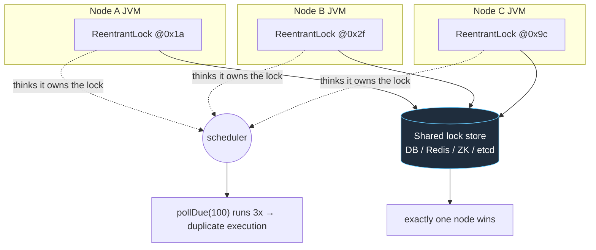
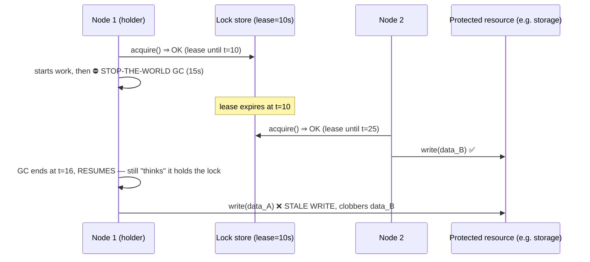
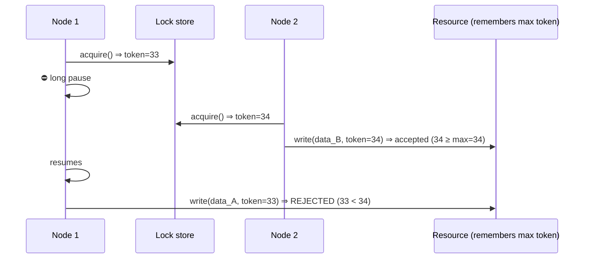

# Distributed Locks

> Where this fits: our Task Queue platform scales horizontally to many API/worker nodes (Phase 4). Some work must run on **exactly one** node at a time — a singleton scheduler that scans `pollDue` and releases due tasks, a nightly DLQ-replay job, a per-tenant rate-limit reset. A `ReentrantLock` only coordinates threads *inside one JVM*. Across nodes you need a **distributed lock**: a coordination primitive that lives outside any single process. This chapter builds one correctly, shows why the naive versions are subtly broken, and explains the uncomfortable truth — **a distributed lock is never a substitute for correctness at the protected resource.**

---

## 1. Why this exists

In [`../06-concurrency/locks.md`](../06-concurrency/locks.md) we used `synchronized` and `ReentrantLock` to give one thread exclusive access to shared state. Those work because every thread shares the same heap and the same memory model. The lock is a word in memory; the JVM's happens-before rules make acquire/release visible to all threads.

None of that holds across machines.

When our platform runs three replicas of the scheduler service behind a load balancer, there are three separate JVMs, three separate heaps, three separate `ReentrantLock` instances — each thinking it owns "the" lock. The result: all three call `repository.pollDue(100)`, all three claim overlapping due tasks, and the same `Task` runs three times. For an idempotent handler that's wasted work; for a non-idempotent one (charge a card, send an email) it's a production incident.

So we need a lock whose state lives in a place all nodes can see: a **shared store** — a database row, a Redis key, a ZooKeeper/etcd node. That store becomes the single arbiter of "who holds the lock."



> **Mental model:** an in-process lock protects memory; a distributed lock coordinates *processes*. The hard part is not acquiring it — it's reasoning about what happens when the holder dies, pauses (GC, VM migration), or the network partitions while it still believes it holds the lock.

Two distinct goals are often conflated, and the distinction drives every design choice below:

- **Efficiency lock** — "don't do the same expensive work twice." Occasional double execution is *acceptable* (idempotent, or just wasteful). You want this lock to be cheap and available.
- **Correctness lock** — "this work must happen at most once, ever." Double execution corrupts data. This is the hard case, and — spoiler — **a lease-based distributed lock alone cannot give you this.** You need **fencing** (Section 5) or the protected resource itself must reject stale writers.

Keep that split in your head for the whole chapter.

---

## 2. The naive version — `synchronized` (or a local `ReentrantLock`)

Here is the singleton scheduler as a new Java engineer first writes it.

```java
// NAIVE: works on one node, silently broken on three.
public final class SchedulerLoop {
    private final TaskRepository repository;
    private final TaskQueue queue;
    private final Object lock = new Object();   // a per-JVM monitor

    public SchedulerLoop(TaskRepository repository, TaskQueue queue) {
        this.repository = repository;
        this.queue = queue;
    }

    public void tick() {
        synchronized (lock) {                   // ← only excludes threads in THIS JVM
            for (Task due : repository.pollDue(100)) {
                queue.enqueue(due.withStatus(TaskStatus.PENDING));
            }
        }
    }
}
```

**Why it's broken across nodes:**

- `lock` is a heap object. Each replica has its own. The `synchronized` block excludes *threads*, not *processes*.
- Scale to N replicas → N concurrent `pollDue` → up to N× duplicate enqueues per tick.
- It *looks* correct in a single-node integration test, which is exactly why this bug ships. It only manifests under horizontal scaling — the thing you added precisely to handle load.

A first instinct is "use a `static` lock." That changes nothing: `static` is per-classloader, which is per-JVM. The state must leave the process.

---

## 3. Improved version — a database row as the lock

The cheapest correct-ish distributed lock uses infrastructure we already run in Phase 2: PostgreSQL. The idea: a single row whose presence (or a column on it) means "held." Acquisition is an atomic `INSERT`/`UPDATE`; the database serializes concurrent writers for us.

```sql
-- Flyway migration: V7__locks.sql
CREATE TABLE distributed_lock (
    name        TEXT PRIMARY KEY,           -- e.g. 'scheduler'
    owner       TEXT NOT NULL,              -- node id / token
    acquired_at TIMESTAMPTZ NOT NULL,
    expires_at  TIMESTAMPTZ NOT NULL        -- lease expiry (Section 4)
);
```

```java
// IMPROVED: a lease-based lock backed by a single Postgres row.
public final class JdbcDistributedLock {
    private final DataSource ds;
    private final String name;          // the lock name, e.g. "scheduler"
    private final String owner;         // unique per process, e.g. host:pid:uuid
    private final Duration ttl;         // lease length

    public JdbcDistributedLock(DataSource ds, String name, String owner, Duration ttl) {
        this.ds = ds;
        this.name = name;
        this.owner = owner;
        this.ttl = ttl;
    }

    /** @return true if THIS process now holds the lock. */
    public boolean tryAcquire() {
        var sql = """
            INSERT INTO distributed_lock(name, owner, acquired_at, expires_at)
            VALUES (?, ?, now(), now() + ? * interval '1 second')
            ON CONFLICT (name) DO UPDATE
              SET owner = EXCLUDED.owner,
                  acquired_at = EXCLUDED.acquired_at,
                  expires_at = EXCLUDED.expires_at
            WHERE distributed_lock.expires_at < now()   -- only steal if expired
            """;
        try (var c = ds.getConnection(); var ps = c.prepareStatement(sql)) {
            ps.setString(1, name);
            ps.setString(2, owner);
            ps.setLong(3, ttl.toSeconds());
            return ps.executeUpdate() == 1;   // 1 row affected ⇒ we won
        } catch (SQLException e) {
            return false;                     // fail closed: assume we don't hold it
        }
    }

    /** Extend the lease while still holding it (heartbeat). */
    public boolean renew() {
        var sql = """
            UPDATE distributed_lock
               SET expires_at = now() + ? * interval '1 second'
             WHERE name = ? AND owner = ? AND expires_at > now()
            """;
        try (var c = ds.getConnection(); var ps = c.prepareStatement(sql)) {
            ps.setLong(1, ttl.toSeconds());
            ps.setString(2, name);
            ps.setString(3, owner);
            return ps.executeUpdate() == 1;
        } catch (SQLException e) {
            return false;
        }
    }

    public void release() {
        var sql = "DELETE FROM distributed_lock WHERE name = ? AND owner = ?";
        try (var c = ds.getConnection(); var ps = c.prepareStatement(sql)) {
            ps.setString(1, name);
            ps.setString(2, owner);
            ps.executeUpdate();               // owner check prevents releasing someone else's lock
        } catch (SQLException ignored) { }
    }
}
```

Three things make this correct enough to ship:

1. **The `PRIMARY KEY` + `ON CONFLICT` is the atomic primitive.** The database serializes concurrent `INSERT`s of the same `name`; exactly one wins. This is the *same trick* the [idempotency](./idempotency.md) chapter uses for dedup — `INSERT ... ON CONFLICT` is the distributed-systems engineer's compare-and-set.
2. **The lease (`expires_at`).** If the holder dies, nobody is left to `release()`. Without a lease the lock is held forever — a classic outage. The `WHERE distributed_lock.expires_at < now()` clause lets a *different* node steal an expired lock. (Section 4.)
3. **The owner check on `release`/`renew`.** You may only delete or extend a lock you actually own. This is the first line of defense against the most dangerous bug in distributed locking — releasing a lock that has *already been reassigned* to someone else.

> **Alternative DB primitive — advisory locks.** Postgres offers `pg_advisory_lock(key)` / `pg_try_advisory_lock(key)`, a built-in session-scoped lock keyed by a `bigint`. It auto-releases when the session ends (great for crash safety, no TTL plumbing) but it's tied to a *connection*, doesn't survive across connection-pool churn cleanly, and gives you **no fencing token**. The explicit-table approach is more code but more controllable — you own the schema, the TTL, and (crucially) you can attach a monotonically increasing **fencing token** (Section 5). For a singleton scheduler we want the token, so we prefer the table.

**Limitations of the DB lock**, in order of severity:

- **Clock dependency.** `expires_at` is compared with `now()` on the *server*, so there's a single clock — good. But the application's *renew interval* depends on the app clock; long GC pauses can make the app think the lease is alive when it isn't (Section 4).
- **Throughput.** Every acquire/renew is a round-trip to the primary. Fine for one scheduler ticking every few seconds; a poor fit for a lock acquired thousands of times per second.
- **It still cannot give you a pure correctness lock without fencing.** Even here, a paused holder can wake up after the lease expired and act. Section 5.

---

## 4. Production-quality version — leases, heartbeats, and the GC-pause trap

A staff engineer wraps the raw lock in a *lifecycle* that holds the lease, heartbeats to renew it, surrenders cleanly, and — most importantly — refuses to run protected work once it suspects it lost the lease.

### The leased-singleton runner

```java
public final class SingletonRunner implements AutoCloseable {

    private final JdbcDistributedLock lock;
    private final Duration heartbeat;        // e.g. ttl / 3
    private final ScheduledExecutorService hb =
            Executors.newSingleThreadScheduledExecutor(Thread.ofVirtual().factory());
    private final AtomicBoolean held = new AtomicBoolean(false);
    private volatile Runnable onLost = () -> {};

    public SingletonRunner(JdbcDistributedLock lock, Duration ttl) {
        this.lock = lock;
        this.heartbeat = ttl.dividedBy(3);   // renew ~3x per lease ⇒ tolerate 2 misses
    }

    /** Try to become the singleton. Returns true if we are now the leader-of-one. */
    public boolean tryBecomeLeader() {
        if (!lock.tryAcquire()) return false;
        held.set(true);
        hb.scheduleAtFixedRate(this::beat, heartbeat.toMillis(),
                               heartbeat.toMillis(), TimeUnit.MILLISECONDS);
        return true;
    }

    private void beat() {
        if (!held.get()) return;
        if (!lock.renew()) {              // lost the lease (expired, stolen, or DB error)
            if (held.compareAndSet(true, false)) {
                onLost.run();             // STOP doing protected work immediately
            }
        }
    }

    /** Run protected work ONLY while we believe we hold the lease. */
    public boolean runIfLeader(Consumer<Long> work, long fencingToken) {
        if (!held.get()) return false;
        work.accept(fencingToken);
        return true;
    }

    public boolean isLeader() { return held.get(); }
    public SingletonRunner onLeadershipLost(Runnable r) { this.onLost = r; return this; }

    @Override public void close() {
        hb.shutdownNow();
        if (held.compareAndSet(true, false)) lock.release();   // surrender gracefully
    }
}
```

### The GC-pause trap (why leases are not enough)

Here is the canonical failure that breaks naive lease-based locks, drawn straight from Martin Kleppmann's critique. Walk it carefully — it is the single most important idea in this chapter.



Node 1 was paused — by a 15-second GC, a hypervisor stealing the vCPU, a paged-out process, a network blip on the heartbeat — *longer than the lease*. The lock store correctly handed the lease to Node 2. But Node 1 has no idea time passed; it resumes mid-method and writes, corrupting what Node 2 wrote. **No amount of lease tuning fixes this**, because you can never prove a paused process will check its `held` flag before it touches the resource. The check and the write are not atomic with respect to an arbitrary-length pause.

This is why we pass a `fencingToken` through `runIfLeader` and into the resource — Section 5 is the actual fix. The lease keeps the *common case* live; fencing makes the *pathological case* safe.

---

## 5. Fencing tokens — the only thing that makes lock-based correctness real

A **fencing token** is a monotonically increasing number the lock store issues on each successful acquisition. The holder includes it with every write to the protected resource, and **the resource rejects any write carrying a token smaller than the largest it has already seen.**



Now Node 1's stale write is *fenced off* — refused by the resource itself — regardless of how long it was paused or what it believes. Correctness no longer depends on the lock being mutually exclusive; it depends on the resource enforcing monotonic tokens. That is a property you can actually guarantee.

In our DB lock, the token comes for free if we add a sequence:

```sql
ALTER TABLE distributed_lock ADD COLUMN fence BIGINT NOT NULL DEFAULT 0;
```

```java
/** Acquire and return a monotonically increasing fencing token, or empty. */
public OptionalLong tryAcquireFenced() {
    var sql = """
        INSERT INTO distributed_lock(name, owner, acquired_at, expires_at, fence)
        VALUES (?, ?, now(), now() + ? * interval '1 second', 1)
        ON CONFLICT (name) DO UPDATE
          SET owner = EXCLUDED.owner,
              acquired_at = EXCLUDED.acquired_at,
              expires_at = EXCLUDED.expires_at,
              fence = distributed_lock.fence + 1   -- bump on every (re)acquire
          WHERE distributed_lock.expires_at < now()
        RETURNING fence
        """;
    try (var c = ds.getConnection(); var ps = c.prepareStatement(sql)) {
        ps.setString(1, name);
        ps.setString(2, owner);
        ps.setLong(3, ttl.toSeconds());
        try (var rs = ps.executeQuery()) {
            return rs.next() ? OptionalLong.of(rs.getLong("fence")) : OptionalLong.empty();
        }
    } catch (SQLException e) {
        return OptionalLong.empty();
    }
}
```

The resource side — here, the table the scheduler writes a "last run" marker into — enforces monotonicity:

```sql
UPDATE scheduler_state
   SET last_tick = now(), last_fence = :token
 WHERE name = 'scheduler' AND last_fence < :token;   -- reject stale token
```

> **The hard truth, stated plainly:** *if the protected resource cannot accept and enforce a fencing token, then no distributed lock — DB, Redis, ZooKeeper, etcd — can give you at-most-once correctness.* It can only give you an efficiency lock: "usually one, sometimes two." Design for that. The single most common production mistake is treating a lease lock as a correctness lock when the downstream can't fence. (See Section 9.)

---

## 6. Code walkthrough — beginner, intermediate, production

### Beginner: see in-process exclusion succeed, cross-process fail

```java
// A ReentrantLock excludes threads in ONE JVM — and only that.
public class InProcessDemo {
    private static final ReentrantLock lock = new ReentrantLock();
    static int counter = 0;

    public static void main(String[] args) throws InterruptedException {
        Runnable inc = () -> {
            for (int i = 0; i < 100_000; i++) {
                lock.lock();
                try { counter++; } finally { lock.unlock(); }
            }
        };
        Thread t1 = new Thread(inc), t2 = new Thread(inc);
        t1.start(); t2.start(); t1.join(); t2.join();
        System.out.println(counter);   // exactly 200000 — works because SAME heap
    }
}
// Run this `main` in two separate JVMs against a shared file/DB counter and you
// get lost updates: each JVM has its own `lock`. That gap is what we're closing.
```

### Intermediate: a spin-with-timeout acquire loop

Most callers want "try for up to N seconds, then give up." Wrap `tryAcquire` with bounded backoff so we don't hammer the DB.

```java
public final class BlockingAcquire {

    /** Spin on tryAcquire with jittered backoff until success or timeout. */
    public static boolean acquire(JdbcDistributedLock lock, Duration timeout)
            throws InterruptedException {
        long deadline = System.nanoTime() + timeout.toNanos();
        long backoffMs = 25;
        while (System.nanoTime() < deadline) {
            if (lock.tryAcquire()) return true;
            // jitter avoids a thundering herd of nodes retrying in lockstep
            long jittered = backoffMs / 2 + ThreadLocalRandom.current().nextLong(backoffMs / 2 + 1);
            Thread.sleep(Math.min(jittered, 500));
            backoffMs = Math.min(backoffMs * 2, 500);   // capped exponential backoff
        }
        return false;
    }
}
```

The jitter mirrors the [`ExponentialBackoffRetryPolicy`](./retries.md) we use for task retries — uncoordinated nodes that retry on the exact same cadence create a periodic thundering herd against the lock store.

### Production-inspired: the singleton scheduler, fully wired

```java
/** Runs pollDue → enqueue on EXACTLY ONE node, with lease + heartbeat + fencing. */
public final class SingletonScheduler implements AutoCloseable {

    private static final System.Logger LOG = System.getLogger(SingletonScheduler.class.getName());

    private final JdbcDistributedLock lock;
    private final TaskRepository repository;
    private final TaskQueue queue;
    private final ScheduledExecutorService loop =
            Executors.newSingleThreadScheduledExecutor(Thread.ofVirtual().factory());
    private final SingletonRunner runner;
    private volatile long fence = -1;

    public SingletonScheduler(DataSource ds, String owner, TaskRepository repo,
                              TaskQueue queue, Duration ttl) {
        this.lock = new JdbcDistributedLock(ds, "scheduler", owner, ttl);
        this.repository = repo;
        this.queue = queue;
        this.runner = new SingletonRunner(lock, ttl)
                .onLeadershipLost(() -> LOG.log(System.Logger.Level.WARNING,
                        "lost scheduler leadership; standing down"));
    }

    public void start() {
        // Every node runs this loop; only the lock holder does real work.
        loop.scheduleAtFixedRate(this::tick, 0, 2, TimeUnit.SECONDS);
    }

    private void tick() {
        try {
            if (!runner.isLeader()) {
                var token = lock.tryAcquireFenced();
                if (token.isPresent()) {
                    fence = token.getAsLong();
                    runner.tryBecomeLeader();
                    LOG.log(System.Logger.Level.INFO, "became scheduler leader, fence={0}", fence);
                } else {
                    return;   // a healthy leader holds the lease; do nothing
                }
            }
            runner.runIfLeader(this::releaseDueTasks, fence);
        } catch (RuntimeException e) {
            LOG.log(System.Logger.Level.ERROR, "scheduler tick failed", e);
        }
    }

    /** The protected work. The fence travels with the state write so stale leaders are rejected. */
    private void releaseDueTasks(long fencingToken) {
        List<Task> due = repository.pollDue(100);   // FOR UPDATE SKIP LOCKED inside
        for (Task t : due) {
            queue.enqueue(t.withStatus(TaskStatus.PENDING));
        }
        if (!due.isEmpty()) {
            repository.markTickFenced("scheduler", fencingToken);   // WHERE last_fence < token
        }
    }

    @Override public void close() {
        loop.shutdownNow();
        runner.close();   // releases the lease so the next node takes over instantly
    }
}
```

Note the shape: **every node runs the loop, but only the lease holder mutates state.** Non-leaders cheaply confirm "someone else holds it" and return. When the leader dies, its lease expires within `ttl`, and the next tick on another node steals it and bumps the fence. This is, in effect, a one-slot [leader election](./leader-election.md) — the lock *is* the election.

---

## 7. How this applies to our Task Queue project

| Canonical component | How distributed locking touches it |
| --- | --- |
| `TaskScheduler` / `pollDue` | Must run on one node. The lease lock around `releaseDueTasks` is the whole point of this chapter. |
| `TaskRepository.pollDue(int n)` | Combine with `SELECT ... FOR UPDATE SKIP LOCKED` so even *without* a top-level lock, multiple workers don't grab the same row. Two layers of defense. |
| `DeadLetterQueue` replay job | A nightly "re-drive dead tasks" job is a singleton; wrap it in the same lock. Replay must be idempotent — see [`./idempotency.md`](./idempotency.md). |
| `RateLimiter` (`TokenBucketRateLimiter`) | A *global* token bucket whose refill must tick once per window. The refresh job is a singleton; the bucket counter itself lives in shared store. See [`./rate-limiting.md`](./rate-limiting.md). |
| `WorkerPool` | Workers themselves are *not* singletons — we want many. Don't lock the worker loop; lock only genuinely single-instance coordination tasks. |
| `EventBus` (Phase 4) | Publishing a periodic "sweep" event is singleton work; consuming it scales out. |

> **Design rule for the project:** prefer `FOR UPDATE SKIP LOCKED` (per-row, fine-grained, no global bottleneck) over a coarse distributed lock *whenever the work is naturally per-row*. Reserve the distributed lock for genuinely global, must-be-one work like the scheduler tick and cron-style jobs. Most "I need a distributed lock" problems are actually "I need row-level locking or idempotency."

---

## 8. Tradeoffs

### Choosing a lock backend

| Backend | Acquire latency | Crash recovery | Fencing token | Operational cost | Best for |
| --- | --- | --- | --- | --- | --- |
| **DB row (`ON CONFLICT`)** | ms (a query) | TTL/lease | Yes (sequence column) | Reuse existing Postgres | Low-frequency singletons (our scheduler) |
| **Postgres advisory lock** | ms | Session end (auto) | No | Zero extra schema | Quick, connection-scoped mutual exclusion |
| **Redis (single, `SET NX PX`)** | sub-ms | TTL | Yes (`INCR` a counter) | Run Redis | High-frequency efficiency locks |
| **Redlock (multi-Redis)** | sub-ms | TTL across N nodes | **No native fencing** | Run N independent Redis | Contested; see critique below |
| **ZooKeeper (ephemeral seq node)** | ms | Session/heartbeat (auto) | Yes (zxid / node seq) | Run/operate a ZK ensemble | Correctness locks, leader election |
| **etcd (lease + txn)** | ms | Lease keep-alive | Yes (mod_revision) | Run an etcd cluster | Correctness locks, k8s-native |

### Redis and Redlock — the famous debate

Single-instance Redis lock (`SET resource owner NX PX 30000`) is the standard fast efficiency lock: atomic set-if-absent with a TTL, released with a Lua compare-and-delete that checks the owner. Simple and very fast.

**Redlock** extends this to N independent Redis masters to survive a single Redis failure: acquire on a majority within a time bound, accounting for clock drift. Martin Kleppmann's well-known [critique](#) argues Redlock is **unsafe as a correctness lock** because:

1. It relies on bounded clock drift and bounded pauses — assumptions a real async network/JVM violate (the GC-pause trap of Section 4).
2. It provides **no fencing token**, so a paused old holder's stale write cannot be rejected.

Antirez (Redis's author) rebutted on the clock-drift specifics. The pragmatic resolution the industry reached:

- For an **efficiency lock**, single-Redis or Redlock is fine — occasional double work is acceptable.
- For a **correctness lock**, do not rely on *any* lease lock's mutual exclusion. Use **fencing** at the resource (Section 5), or a system whose ordering is built in (ZooKeeper zxid, etcd revision), and even then the resource must enforce the token.

> The takeaway is not "Redlock bad." It's "**lock-based correctness is a property of the protected resource, not of the lock.**" A perfect lock with a non-fencing resource is still unsafe.

### Lease-length tradeoff

| Short lease (e.g. 5s) | Long lease (e.g. 60s) |
| --- | --- |
| Fast failover when holder dies | Slow failover — work stalls up to 60s |
| More heartbeat traffic | Less load on the lock store |
| More likely to expire under a GC pause → spurious failover | Tolerates longer pauses, but a zombie holds it longer |

Rule of thumb: lease = several × the heartbeat interval; heartbeat = a few × your p99 GC pause. We use `ttl/3` for the heartbeat so two consecutive missed beats still don't lose the lease.

---

## 9. Common mistakes and pitfalls

- **Using `synchronized`/`ReentrantLock` for cross-node coordination.** Per-JVM only. *Fix:* externalize the lock state. (Section 2.)
- **A lock with no TTL.** Holder crashes → lock held forever → permanent outage. *Fix:* always lease; design for the holder vanishing. (Section 3.)
- **Releasing by name, not by owner.** You expire, someone else acquires, you wake and `DELETE WHERE name=...`, unlocking *their* lock. *Fix:* `WHERE name=? AND owner=?` on release/renew, and check the result is exactly 1 row. (Section 3.)
- **Treating a lease lock as a correctness lock.** The GC-pause / stale-write bug. *Fix:* fencing tokens enforced at the resource, or accept it's only an efficiency lock. (Sections 4–5.)
- **Trusting `System.currentTimeMillis()` for lease math across nodes.** Wall clocks drift and jump (NTP step, leap smear). *Fix:* compare expiry on the *store's* clock; use monotonic `System.nanoTime()` for local durations only.
- **No jitter on retry.** N nodes retry in lockstep → periodic thundering herd on the store. *Fix:* jittered, capped exponential backoff. (Section 6.)
- **Holding the lock across slow I/O.** A 30s downstream call inside a 10s lease means you lose the lock mid-operation without noticing. *Fix:* keep critical sections short; re-check `held` (and re-fence) after any blocking call.
- **Forgetting to release on shutdown.** Graceful shutdown should surrender the lease so failover is instant, not after a full TTL. *Fix:* `release()` in `close()` / a shutdown hook.
- **Locking work that should scale out.** Wrapping the whole `WorkerPool` in a lock defeats horizontal scaling. *Fix:* lock only genuinely-singleton coordination; use `SKIP LOCKED`/idempotency for per-item work.

---

## 10. Refactoring exercise

### Bad — local lock, no lease, releases by name

```java
public class CronJob {
    private static final Object LOCK = new Object();   // per-JVM, useless across nodes
    void runNightly() {
        synchronized (LOCK) {                          // excludes threads, not nodes
            replayDeadTasks();                         // runs on every replica → N× replay
        }
    }
}
```

### Improved — DB lock with a lease and owner-checked release

```java
public class CronJob {
    private final JdbcDistributedLock lock;
    CronJob(DataSource ds, String owner) {
        this.lock = new JdbcDistributedLock(ds, "dlq-replay", owner, Duration.ofMinutes(2));
    }
    void runNightly() {
        if (!lock.tryAcquire()) return;     // another node owns it (lease-protected)
        try {
            replayDeadTasks();
        } finally {
            lock.release();                 // WHERE name=? AND owner=?
        }
    }
}
```

Better — won't double-run on the happy path, recovers if a holder crashes (lease expires). Still vulnerable to a GC pause exceeding the 2-minute lease.

### Production-quality — fenced, heartbeated, resource enforces the token

```java
public final class CronJob implements AutoCloseable {
    private final JdbcDistributedLock lock;
    private final SingletonRunner runner;
    private final DeadLetterReplayer replayer;
    private final Duration ttl = Duration.ofMinutes(2);

    public CronJob(DataSource ds, String owner, DeadLetterReplayer replayer) {
        this.lock = new JdbcDistributedLock(ds, "dlq-replay", owner, ttl);
        this.runner = new SingletonRunner(lock, ttl);
        this.replayer = replayer;
    }

    public void runNightly() {
        var token = lock.tryAcquireFenced();
        if (token.isEmpty()) return;
        long fence = token.getAsLong();
        runner.tryBecomeLeader();          // starts the heartbeat
        try {
            // The replayer stamps each re-driven task with `fence`; the tasks table
            // accepts a replay row only WHERE last_replay_fence < fence. A paused old
            // CronJob that wakes up is fenced off at the resource — no double replay.
            runner.runIfLeader(replayer::replayAll, fence);
        } finally {
            runner.close();                // stop heartbeat + release lease
        }
    }

    @Override public void close() { runner.close(); }
}
```

The progression is the chapter in miniature: **local → leased → fenced.** Each step closes a failure mode the previous one couldn't.

---

## 11. Exercises

### Easy

**E1 (knowledge check).** Explain in two sentences why a `static ReentrantLock` does *not* coordinate two replicas of a service.

**E2 (coding).** Add a `boolean isHeldByCurrentOwner()` method to `JdbcDistributedLock` that returns true iff this `owner` holds the lock *and* the lease has not expired. Write the SQL and the Java.

### Medium

**M1 (coding).** Implement a single-instance Redis lock with `SET NX PX` for acquire and a Lua compare-and-delete for release (release only if the value equals your owner token). Use any Redis client interface you like (a stub is fine).

**M2 (refactoring).** The `SingletonScheduler.tick()` calls `repository.pollDue(100)` then `markTickFenced`. A reviewer worries that between those two calls the lease could expire. Refactor so the fence is re-validated *atomically with the state write* rather than trusting the in-memory `held` flag.

### Hard

**H1 (design).** Design a distributed lock for a job that must run on exactly one node but whose critical section legitimately takes 10 minutes (a big migration). Leases of 10+ minutes mean slow failover; short leases expire mid-job. Describe your scheme (heartbeat cadence, fencing, what the resource enforces, what happens on a 30s GC pause at minute 7).

**H2 (interview-style).** A colleague says "we use Redlock, so our `pollDue` can never double-run." Walk them through the exact sequence where it *does* double-run, and state the one change that actually fixes it.

---

## 12. Solutions

**E1.** `static` makes the field one-per-classloader, and each replica is a separate JVM with its own classloader and heap — so each replica has its *own* `ReentrantLock` object. `synchronized`/`lock()` only establishes happens-before and mutual exclusion among threads sharing that one object, which never spans process boundaries.

**E2.**

```sql
SELECT 1 FROM distributed_lock
 WHERE name = ? AND owner = ? AND expires_at > now();
```

```java
public boolean isHeldByCurrentOwner() {
    var sql = "SELECT 1 FROM distributed_lock WHERE name=? AND owner=? AND expires_at > now()";
    try (var c = ds.getConnection(); var ps = c.prepareStatement(sql)) {
        ps.setString(1, name);
        ps.setString(2, owner);
        try (var rs = ps.executeQuery()) { return rs.next(); }
    } catch (SQLException e) {
        return false;   // fail closed: if we can't confirm, assume we don't hold it
    }
}
```

The "fail closed" default matters: when in doubt about lock ownership, behave as if you *don't* hold it. The opposite (assume held on error) is how stale writes happen.

**M1.**

```java
public final class RedisLock {
    interface Redis {
        boolean setNxPx(String key, String val, long ttlMs);    // SET key val NX PX ttl
        Object eval(String lua, List<String> keys, List<String> args);
    }
    private static final String RELEASE = """
        if redis.call('get', KEYS[1]) == ARGV[1]
        then return redis.call('del', KEYS[1])
        else return 0 end
        """;
    private final Redis redis;
    private final String key, owner;
    private final long ttlMs;

    public RedisLock(Redis redis, String key, String owner, long ttlMs) {
        this.redis = redis; this.key = key; this.owner = owner; this.ttlMs = ttlMs;
    }
    public boolean tryAcquire() { return redis.setNxPx(key, owner, ttlMs); }
    public boolean release() {
        Object r = redis.eval(RELEASE, List.of(key), List.of(owner));
        return Long.valueOf(1L).equals(r);   // 1 ⇒ we deleted our own key
    }
}
```

The Lua script makes get-then-delete atomic on the Redis server, closing the "I expired, you acquired, I delete yours" race that a non-atomic `GET`+`DEL` would open.

**M2.** Don't split the decision from the write. Make the *state write itself* carry the fence and let the database reject a stale token in one statement — this is the only thing that's actually atomic with respect to a pause:

```java
private void releaseDueTasks(long fencingToken) {
    // pollDue uses FOR UPDATE SKIP LOCKED, so even a brief overlap is safe per-row.
    List<Task> due = repository.pollDue(100);
    for (Task t : due) queue.enqueue(t.withStatus(TaskStatus.PENDING));
    // The fence guard is in the SQL: WHERE last_fence < :token. If our lease was
    // stolen and someone bumped the fence past us, this UPDATE affects 0 rows and
    // we know to stand down — we never trusted the in-memory flag for correctness.
    int rows = repository.markTickFenced("scheduler", fencingToken);
    if (rows == 0) runner.standDown();   // we are a zombie leader; stop.
}
```

The in-memory `held` flag is an *optimization* (avoid pointless work); the SQL fence guard is the *correctness* boundary.

**H1.** Use a short lease (e.g. 30s) with a heartbeat every 10s, decoupled from the job's duration. The 10-minute job is driven by a separate worker thread; the heartbeat thread renews the lease independently. Crucially, the job **checkpoints fenced progress**: each unit of migration work writes its rows guarded by `WHERE fence = :token` (or `fence <= :token` for idempotent re-apply), so a stale leader's writes are rejected. On a 30s GC pause at minute 7: the heartbeat misses, the lease (30s) may expire, another node may acquire with a higher fence and resume from the last checkpoint. When the paused node wakes, its next checkpoint write carries the *old* fence and is rejected — it detects this (0 rows), realizes it lost leadership, and aborts. Failover is fast (30s) and correctness comes from per-checkpoint fencing, not from the lease covering the whole job.

**H2.** The double-run sequence: Node A acquires the Redlock and starts `pollDue`. A stop-the-world GC (or VM pause) freezes Node A for longer than the lease. Redlock correctly expires the lease and Node B acquires it; B runs `pollDue` and enqueues the due tasks. Node A's GC ends; A *still believes it holds the lock* (it never got a chance to observe the expiry), resumes mid-method, and enqueues the same due tasks again — double execution. Redlock provides no token to distinguish A's stale action from B's valid one. The one change that fixes it: a **fencing token** issued on acquire and enforced at the resource — `pollDue`'s enqueue/markTick must reject any token lower than the highest seen (or, simpler in our project, rely on `FOR UPDATE SKIP LOCKED` + idempotent enqueue so the resource is safe regardless of the lock). The lock alone, however good, cannot provide this.

---

## 13. Interview questions and takeaways

1. **"Why can't you use a `ReentrantLock` to coordinate two services?"** — It's a per-JVM heap object; `synchronized`/`lock()` only orders threads sharing that object. Cross-process coordination needs the lock state in a shared store (DB/Redis/ZK/etcd).

2. **"How does a database make a correct distributed lock?"** — A `PRIMARY KEY` plus `INSERT ... ON CONFLICT` is an atomic compare-and-set; the DB serializes concurrent acquirers so exactly one wins. Add a lease (`expires_at`) for crash recovery and an owner column so only the holder can release/renew.

3. **"What is a fencing token and why do you need it?"** — A monotonically increasing number issued per acquisition, carried on every write, and enforced by the resource (reject lower tokens). It's the only mechanism that makes a stale, paused holder's write *rejectable*, which is what real correctness requires — leases alone can't, because a process can pause arbitrarily long between checking the lock and acting.

4. **"Is Redlock safe?"** — As an *efficiency* lock, yes. As a *correctness* lock, no — it assumes bounded clocks/pauses and provides no fencing token, so a paused old holder can clobber a new one's write. Correctness must be enforced at the resource via fencing or built-in ordering.

5. **"What lease length do you choose?"** — Long enough to survive your p99 pause/GC, short enough for acceptable failover. Heartbeat at a fraction (≈ttl/3) so a couple of missed beats don't lose the lease. There is no universally right number; it's a failover-latency vs. spurious-loss tradeoff.

6. **"How do you avoid releasing someone else's lock?"** — Tag the lock with a unique owner token; release/renew with `WHERE owner = ?` (or a Lua compare-and-delete in Redis) and check exactly one row changed.

7. **"DB lock vs ZooKeeper/etcd?"** — DB reuses infra and is fine for low-frequency singletons but every op hits the primary and you bolt on the lease yourself. ZK/etcd give ephemeral nodes/leases with built-in heartbeats, automatic release on session loss, and native ordering (zxid / mod_revision) — better for high-stakes leader election, at the cost of running another stateful system.

8. **"When would you *not* reach for a distributed lock at all?"** — When the work is per-item: use `SELECT ... FOR UPDATE SKIP LOCKED` or idempotency keys instead. A coarse global lock serializes work that could run in parallel and becomes a scaling bottleneck.

**Takeaways:** local locks don't cross processes; externalize state. Always lease (assume the holder vanishes). Fencing — enforced at the resource — is the line between an efficiency lock and a correctness lock. The lock's quality matters less than what the protected resource does with a stale token.

---

## 14. Production considerations

- **The lock store is a SPOF / contention point.** A single Postgres primary means scheduler coordination dies if the primary is down (you can't acquire). Acceptable for a scheduler — the tasks wait. For higher availability, ZK/etcd quorums survive a minority of node failures. Monitor lock-store availability as a first-class dependency.
- **Observe the lock lifecycle.** Emit through the `MetricsCollector` / Micrometer registry: `lock.acquired{name}`, `lock.contended{name}` (acquire failed because held), `lock.lease.lost{name}` (heartbeat failed), `lock.held.duration` (timer), and a gauge for current holder. A spike in `lease.lost` is your early warning of GC pressure or store latency before it becomes duplicate execution. See [`../10-system-design/observability-and-ops.md`](../10-system-design/observability-and-ops.md).
- **Alert on "no leader."** If *no* node holds the scheduler lock for more than a few lease periods, due tasks stop being released — a silent stall. Alert on `lock.acquired` not firing on any node within N×ttl.
- **GC and pauses are real in production.** A G1/ZGC full pause, a noisy-neighbor vCPU steal, or a `STW` from a heap dump can exceed a short lease. ZGC's sub-millisecond pauses help, but never *assume* bounded pauses for correctness — that's what fencing is for. Size leases against observed p99.9 pauses, not averages.
- **Clock hygiene.** Compare expiry on the store's clock; never mix two nodes' wall clocks in lease math. Run NTP, watch for leap-second smearing. Use `nanoTime()` only for local intervals.
- **Graceful failover.** On rolling deploys, the leaving node should `release()` so the next node takes over in milliseconds instead of after a full `ttl`. Wire it into the shutdown hook / `SmartLifecycle`.
- **Reentrancy and self-deadlock.** Most distributed locks are *not* reentrant. If the same owner "re-acquires," you may extend rather than nest; don't assume recursive acquisition works. Keep critical sections flat.
- **Test the pause.** Add a chaos test that injects a `Thread.sleep` longer than the lease inside the critical section (simulating a GC pause) on two nodes and asserts the resource rejected the stale writer via fencing. If your test suite never exercises the pause, you don't actually know your lock is safe.

---

## What We Can Improve In Our Project Using This Concept

Today the scheduler tick (`pollDue` → enqueue) is implicitly assumed to run on one node — which is false the moment we add a second replica in Phase 4. We can make the `SingletonScheduler` from Section 6 the only component that releases due tasks, guarded by a fenced DB lease. We can apply the same pattern to the nightly `DeadLetterQueue` replay job and the global `TokenBucketRateLimiter` refill. Per-row work (the `WorkerPool` draining the queue) stays lock-free via `FOR UPDATE SKIP LOCKED`, so we add coordination *only* where work is genuinely singleton, avoiding a global bottleneck.

## Project Refactoring Task

1. Add Flyway migration `V7__locks.sql` with the `distributed_lock` table (including the `fence BIGINT` column) and a `scheduler_state(name, last_tick, last_fence)` table.
2. Implement `JdbcDistributedLock` with `tryAcquireFenced`, `renew`, and owner-checked `release`.
3. Implement `SingletonRunner` (lease + heartbeat + leadership-lost callback) and refactor the scheduler into `SingletonScheduler`, threading the fencing token into `repository.markTickFenced` (guarded by `WHERE last_fence < :token`).
4. Add Micrometer metrics: `lock.acquired`, `lock.contended`, `lock.lease.lost`, `lock.held.duration`.
5. Add a Testcontainers integration test with two `SingletonScheduler` instances against the same Postgres, asserting exactly one releases tasks; add a chaos test that injects a pause longer than the lease and asserts the stale writer is fenced.

## Git Commit For This Chapter

```text
feat(scheduler): fenced single-leader scheduler via Postgres lease lock

- add V7__locks.sql: distributed_lock(name,owner,acquired_at,expires_at,fence)
  and scheduler_state(name,last_tick,last_fence)
- add JdbcDistributedLock with tryAcquireFenced/renew/owner-checked release
- add SingletonRunner (lease + heartbeat + onLeadershipLost)
- refactor SchedulerLoop -> SingletonScheduler; thread fencing token into
  TaskRepository.markTickFenced (WHERE last_fence < token)
- micrometer: lock.acquired/contended/lease.lost/held.duration
- tests: two-node Testcontainers exclusivity + GC-pause chaos/fencing test

Files: db/migration/V7__locks.sql, lock/JdbcDistributedLock.java,
lock/SingletonRunner.java, scheduler/SingletonScheduler.java,
repo/TaskRepository.java, metrics/MetricsCollector.java,
test/SingletonSchedulerIT.java
```

## Architecture Impact

The platform gains a coordination layer: a shared lock store (Postgres now, swappable for etcd/ZK later) becomes a dependency of singleton jobs. This unblocks safe horizontal scaling of the API/worker tier (more replicas, still one scheduler) and is a stepping stone to full [leader election](./leader-election.md) and the distributed-worker model of Phase 4. It introduces a new failure mode (lock-store unavailability stalls scheduling) that must be monitored and alerted, and it establishes the **fencing** discipline that every must-be-once operation downstream will reuse — including [DLQ](./dlq.md) replay and [rate-limiter](./rate-limiting.md) resets.

## Interview Takeaways

- A distributed lock externalizes lock state to a shared store; in-process locks ([`../06-concurrency/locks.md`](../06-concurrency/locks.md)) cannot coordinate across JVMs.
- Always lease (TTL) so a dead holder doesn't deadlock the system; heartbeat to renew; release by *owner*, not by name.
- The GC-pause / stale-write problem proves leases alone can't give correctness — **fencing tokens enforced at the resource** are the real fix. Redlock is an efficiency lock, not a correctness lock.
- Prefer fine-grained `FOR UPDATE SKIP LOCKED` or [idempotency](./idempotency.md) over a coarse global lock whenever the work is per-item; reserve distributed locks for genuinely singleton coordination like our scheduler.
