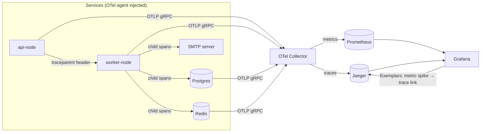

# Distributed Observability: Traces, Spans, and OpenTelemetry

> Where this fits in the project: Phase 3 adds `MetricsCollector` (Micrometer → Prometheus → Grafana) — that covers **metrics** (aggregated numbers: how many tasks succeeded, average latency). But when a task takes 4 seconds instead of 200ms, metrics tell you *that* it's slow. They cannot tell you *where* — was it waiting in the queue? Was it the SMTP call? Was it the Postgres UPDATE? In a distributed system (Phase 4: N API nodes, M worker containers, Redis, Postgres, a broker), a single task execution crosses 5–6 service boundaries. **Distributed tracing** follows a single request across all of them. This chapter covers OpenTelemetry, trace propagation, span creation, and wiring it into the task queue so a slow task is debuggable in seconds, not hours.

---

## 1. Why this exists

In a single-process program, when something is slow you attach a profiler and get a flamegraph. The whole call stack is right there.

In the Phase 4 task queue, a single task execution looks like this:

```
HTTP POST /tasks         (api-node-2)
  → Postgres INSERT task  (api-node-2 → postgres)
  → Postgres INSERT outbox (api-node-2 → postgres)
  → outbox relay picks it up (outbox-relay-node, 250ms later)
  → Redis XADD             (outbox-relay → redis)
  → Worker XREADGROUP      (worker-node-3)
  → Redis SETNX rate limit  (worker-node-3 → redis)
  → handler.handle(task)   (worker-node-3)
    → SMTP call            (worker-node-3 → external SMTP)
  → Postgres UPDATE status (worker-node-3 → postgres)
  → EventBus publish       (worker-node-3)
  → MetricsEventListener   (worker-node-3)
```

That's 10 hops across 4 different processes. If the p99 latency is 4 seconds, which hop is slow? Metrics give you per-service histograms, but they cannot correlate the hops of a specific slow request. Logs give you text per service, but correlating log lines across 4 pods by timestamp is a manual nightmare.

**Distributed tracing** solves this with three ideas:

1. **Trace ID:** a random UUID generated at the first entry point (the HTTP POST). Propagated in every downstream call header. Every span from every service that belongs to this request shares the same trace ID.
2. **Span:** one unit of work (one service → one downstream call). Has a start time, duration, service name, operation name, and the trace ID.
3. **Parent span:** each span records the ID of the span that created it. This lets the tracing backend reconstruct the full call tree (the "waterfall" diagram).

```mermaid
gantt
    title Distributed trace for one task submission (4s total)
    dateFormat  x
    axisFormat  %Lms

    section api-node-2
    POST /tasks          :a1, 0, 20
    Postgres INSERT task :a2, 5, 15

    section outbox-relay
    poll outbox rows     :b1, 250, 10
    Redis XADD           :b2, 260, 5

    section worker-node-3
    XREADGROUP           :c1, 265, 5
    rate limit check     :c2, 270, 2
    handler.handle       :c3, 272, 3500
    SMTP call            :crit, c4, 280, 3480
    Postgres UPDATE      :c5, 3760, 30
    EventBus publish     :c6, 3790, 10
```



The waterfall immediately shows: the SMTP call (3480ms) is the bottleneck. No log grep needed.

---

## 2. The naive version

**Manual correlation with log IDs** — what most teams do before they add tracing:

```java
// BAD: manual correlation, brittle, not cross-process.
public TaskResult handle(Task task) throws Exception {
    String reqId = task.id();   // use task id as a poor man's "trace id"
    log.info("[{}] handler started", reqId);

    String smtpResult = smtpClient.send(task);      // how long did THIS take?
    log.info("[{}] SMTP done: {}", reqId, smtpResult); // you'd have to diff timestamps manually

    TaskResult result = buildResult(smtpResult);
    log.info("[{}] handler done: {}", reqId, result);
    return result;
}
```

Problems:
- The log ID is not propagated to the SMTP client or to Postgres — you can't see those hops.
- Timing is manual (diff between log timestamps) and has no structure.
- No parent-child relationship between the API span and the worker span.
- Nothing connects `api-node-2`'s logs to `worker-node-3`'s logs — they're in different log streams.
- At 1,000 tasks/second, finding the relevant log lines for one slow task means grepping 1 million lines per minute.

---

## 3. Improved version: structured logging with trace IDs

Before full tracing, at least propagate a correlation ID through MDC (Mapped Diagnostic Context):

```java
import org.slf4j.MDC;
import java.util.UUID;

/**
 * MDC-based correlation: every log line for a task carries the task id and a request id.
 * This is not distributed tracing (no spans, no parent-child, no waterfall) but it
 * makes log correlation across one service's log stream feasible.
 */
@Component
public class CorrelatingWorker {

    private final HandlerRegistry handlers;

    public TaskResult execute(Task task) {
        String traceId = task.id();     // or extract from incoming header
        MDC.put("traceId", traceId);
        MDC.put("taskType", task.type());
        try {
            log.info("task execution started");   // logback appends traceId automatically
            TaskResult result = handlers.dispatch(task);
            log.info("task execution finished: success={}", result.success());
            return result;
        } catch (Exception e) {
            log.error("task execution failed", e);
            throw new RuntimeException(e);
        } finally {
            MDC.clear();  // ALWAYS clear MDC on pooled threads — never leak context
        }
    }

    private static final org.slf4j.Logger log =
            org.slf4j.LoggerFactory.getLogger(CorrelatingWorker.class);
}
```

```xml
<!-- logback.xml: include traceId in every log line automatically -->
<configuration>
  <appender name="JSON" class="ch.qos.logback.core.ConsoleAppender">
    <encoder class="net.logstash.logback.encoder.LogstashEncoder">
      <includeMdcKeyName>traceId</includeMdcKeyName>
      <includeMdcKeyName>taskType</includeMdcKeyName>
    </encoder>
  </appender>
  <root level="INFO"><appender-ref ref="JSON"/></root>
</configuration>
```

Better — now every log line carries `traceId` and you can grep across one service's logs. But cross-service correlation still requires manual work.

---

## 4. Production-quality version

### 4.1 OpenTelemetry: the industry standard

OpenTelemetry (OTel) is the CNCF standard for distributed observability. It provides:
- **API**: instrument your code (`Tracer.spanBuilder()`, `span.setAttribute()`)
- **SDK**: configures how spans are exported (to Jaeger, Zipkin, Grafana Tempo, Datadog, etc.)
- **Auto-instrumentation**: a Java agent that instruments Spring Boot, JDBC, Redis, HTTP clients — **zero application code changes**

The W3C `traceparent` header is the cross-process propagation standard:

```
traceparent: 00-{traceId-32hex}-{spanId-16hex}-{flags}
Example:      00-0af7651916cd43dd8448eb211c80319c-b7ad6b7169203331-01
```

Every service that supports OTel (Spring Boot with the OTel agent, Redis client, JDBC wrapper) reads this header on ingress and writes it on egress. The trace is assembled in the backend (Jaeger) by joining on the traceId.

### 4.2 OTel with the Java agent (zero-code auto-instrumentation)

```bash
# Add the OTel Java agent to the JVM command line. No code changes needed.
# The agent instruments: Spring Boot HTTP, JDBC, Lettuce (Redis), Kafka, etc.
java \
  -javaagent:/opt/otel/opentelemetry-javaagent.jar \
  -Dotel.service.name=task-worker \
  -Dotel.exporter.otlp.endpoint=http://jaeger:4317 \
  -Dotel.exporter.otlp.protocol=grpc \
  -Dotel.propagators=tracecontext,baggage \
  -Dotel.resource.attributes=deployment.environment=production,service.version=1.4.2 \
  -jar taskqueue-worker.jar
```

With this, the agent automatically creates spans for:
- Every incoming HTTP request (`POST /tasks` → span named `POST /tasks`)
- Every JDBC query (`SELECT * FROM tasks WHERE id = ?` → span named `tasks SELECT`)
- Every Lettuce Redis command (`XREADGROUP` → span named `XREADGROUP`)
- Every Spring `@Scheduled` invocation

The `traceparent` header is read from incoming HTTP requests and propagated to outgoing JDBC, Redis, and HTTP calls automatically.

### 4.3 Manual instrumentation for business-critical spans

The agent handles infrastructure. For business logic (the handler execution, rate limit decision, retry path), add manual spans:

```java
import io.opentelemetry.api.GlobalOpenTelemetry;
import io.opentelemetry.api.trace.Span;
import io.opentelemetry.api.trace.StatusCode;
import io.opentelemetry.api.trace.Tracer;
import io.opentelemetry.context.Scope;

/**
 * TracedWorker: wraps the Worker's execution loop with explicit OTel spans
 * for the business operations the auto-agent doesn't know about.
 */
public final class TracedWorker implements Runnable {

    private static final Tracer TRACER =
            GlobalOpenTelemetry.getTracer("com.taskqueue.worker", "1.0.0");

    private final AckableTaskQueue queue;
    private final HandlerRegistry handlers;
    private final RetryDecider retry;
    private final TaskRepository repository;

    @Override
    public void run() {
        while (!Thread.currentThread().isInterrupted()) {
            AckableTaskQueue.Lease lease;
            try {
                lease = queue.poll(Duration.ofSeconds(5)).orElse(null);
                if (lease == null) continue;
            } catch (InterruptedException e) {
                Thread.currentThread().interrupt();
                return;
            }
            execute(lease);
        }
    }

    private void execute(AckableTaskQueue.Lease lease) {
        Task task = lease.task();

        // Create a span for the entire task execution — child of whatever span is in context
        // (the OTel agent propagated the context from the Redis XREADGROUP span automatically).
        Span span = TRACER.spanBuilder("task.execute")
                .setAttribute("task.id",       task.id())
                .setAttribute("task.type",     task.type())
                .setAttribute("task.attempts", task.attempts())
                .setAttribute("task.priority", task.priority())
                .startSpan();

        try (Scope scope = span.makeCurrent()) {
            // All spans created inside this try block are children of span.
            TaskResult result = executeHandler(task);

            if (result.success()) {
                span.setAttribute("task.outcome", "success");
                queue.ack(lease);
                repository.save(task.markSucceeded());
            } else if (result.retryable()) {
                span.setAttribute("task.outcome", "retryable_failure");
                span.setAttribute("task.retry_reason", result.message());
                retry.onFailure(task, true, result.message());
                queue.ack(lease);
            } else {
                span.setAttribute("task.outcome", "permanent_failure");
                span.setStatus(StatusCode.ERROR, result.message());
                retry.onFailure(task, false, result.message());
                queue.ack(lease);
            }
        } catch (Exception e) {
            span.recordException(e);
            span.setStatus(StatusCode.ERROR, e.getMessage());
            retry.onFailure(task, false, e.toString());
            queue.nack(lease);
        } finally {
            span.end();   // ALWAYS end the span — even on exception
        }
    }

    private TaskResult executeHandler(Task task) throws Exception {
        // This is a child span — automatically a child of "task.execute" because of makeCurrent()
        Span handlerSpan = TRACER.spanBuilder("handler." + task.type())
                .setAttribute("handler.class",
                        handlers.handlerFor(task.type()).getClass().getSimpleName())
                .startSpan();
        try (Scope s = handlerSpan.makeCurrent()) {
            return handlers.dispatch(task);
        } catch (Exception e) {
            handlerSpan.recordException(e);
            handlerSpan.setStatus(StatusCode.ERROR, e.getMessage());
            throw e;
        } finally {
            handlerSpan.end();
        }
    }
}
```

### 4.4 Trace context propagation through the outbox

The tricky part: when the API writes the outbox row, the trace context must be stored in the row so the relay can resume the same trace (same traceId, with the relay's span as a child of the API span):

```java
/**
 * Store the W3C traceparent in the outbox row so the relay can
 * resume the trace when it processes the row — creating a causal
 * link: API span → outbox relay span → worker span, all under one traceId.
 */
@Service
public class TracedTaskSubmissionService {

    private final JdbcTemplate jdbc;
    private final TaskRepository tasks;
    private static final Tracer TRACER =
            GlobalOpenTelemetry.getTracer("com.taskqueue.api", "1.0.0");

    @Transactional
    public String submit(Task task) {
        Span span = TRACER.spanBuilder("task.submit")
                .setAttribute("task.id", task.id())
                .setAttribute("task.type", task.type())
                .startSpan();
        try (Scope scope = span.makeCurrent()) {
            tasks.save(task);

            // Extract the current traceparent to store in the outbox row
            io.opentelemetry.api.trace.propagation.W3CTraceContextPropagator propagator =
                    io.opentelemetry.api.trace.propagation.W3CTraceContextPropagator.getInstance();
            java.util.Map<String, String> carrier = new java.util.HashMap<>();
            propagator.inject(io.opentelemetry.context.Context.current(), carrier,
                    (map, k, v) -> map.put(k, v));
            String traceparent = carrier.getOrDefault("traceparent", "");

            jdbc.update("""
                INSERT INTO outbox (id, aggregate_id, payload, traceparent, published_at)
                VALUES (?, ?, ?::jsonb, ?, NULL)
                """,
                    UUID.randomUUID().toString(), task.id(),
                    serialize(task), traceparent);

            return task.id();
        } finally {
            span.end();
        }
    }

    private String serialize(Object o) {
        try { return new com.fasterxml.jackson.databind.ObjectMapper().writeValueAsString(o); }
        catch (Exception e) { throw new RuntimeException(e); }
    }
}

// In the OutboxRelay: restore the trace context from the stored traceparent
public class TracedOutboxRelay {

    private static final Tracer TRACER =
            GlobalOpenTelemetry.getTracer("com.taskqueue.outbox", "1.0.0");

    @Scheduled(fixedDelay = 250)
    public void relay() {
        List<OutboxRow> rows = fetchUnpublished(100);
        for (OutboxRow row : rows) {
            // Restore the original API span's context → relay span becomes its child
            io.opentelemetry.context.Context parentCtx =
                    io.opentelemetry.api.trace.propagation.W3CTraceContextPropagator.getInstance()
                            .extract(io.opentelemetry.context.Context.root(),
                                    java.util.Map.of("traceparent", row.traceparent()),
                                    (map, key) -> map.get(key));

            Span span = TRACER.spanBuilder("outbox.relay")
                    .setParent(parentCtx)   // child of the original API span
                    .setAttribute("outbox.id", row.id())
                    .setAttribute("task.id", row.aggregateId())
                    .startSpan();
            try (Scope scope = span.makeCurrent()) {
                queue.enqueue(deserialize(row.payload()));
                markPublished(row.id());
            } catch (Exception e) {
                span.recordException(e);
                span.setStatus(StatusCode.ERROR, e.getMessage());
            } finally {
                span.end();
            }
        }
    }

    record OutboxRow(String id, String aggregateId, String payload, String traceparent) {}
    // fetchUnpublished, markPublished, deserialize omitted for brevity
}
```

### 4.5 Observability stack wiring (docker-compose)

```yaml
# docker-compose additions for Phase 4 observability
services:
  jaeger:
    image: jaegertracing/all-in-one:1.57
    ports:
      - "16686:16686"    # Jaeger UI
      - "4317:4317"      # OTLP gRPC receiver
      - "4318:4318"      # OTLP HTTP receiver
    environment:
      COLLECTOR_OTLP_ENABLED: "true"

  prometheus:
    image: prom/prometheus:v2.51.0
    volumes:
      - ./prometheus.yml:/etc/prometheus/prometheus.yml
    ports:
      - "9090:9090"

  grafana:
    image: grafana/grafana:10.4.0
    ports:
      - "3000:3000"
    environment:
      GF_FEATURE_TOGGLES_ENABLE: traceqlEditor
    volumes:
      - ./grafana/provisioning:/etc/grafana/provisioning
      # Grafana provisioned with both Prometheus (metrics) and Jaeger (traces) datasources
      # Allows "Exemplars": clicking a slow metric point → jumps to the trace for that request
```

---

## 5. Code walkthrough

### Beginner: understand what a span looks like

```java
// Standalone OTel demo — run this to see what a trace looks like in code.
public class SpanDemo {
    private static final Tracer TRACER =
            GlobalOpenTelemetry.getTracer("demo", "1.0.0");

    public static void main(String[] args) throws Exception {
        // Root span — no parent
        Span root = TRACER.spanBuilder("root-operation")
                .setAttribute("key", "value")
                .startSpan();

        try (Scope rootScope = root.makeCurrent()) {
            Thread.sleep(10);

            // Child span — automatically a child of root because of makeCurrent()
            Span child = TRACER.spanBuilder("child-operation").startSpan();
            try (Scope childScope = child.makeCurrent()) {
                Thread.sleep(20);

                // Grandchild span
                Span grandchild = TRACER.spanBuilder("grandchild-operation")
                        .setAttribute("db.statement", "SELECT * FROM tasks")
                        .startSpan();
                try (Scope gc = grandchild.makeCurrent()) {
                    Thread.sleep(5);
                } finally {
                    grandchild.end();
                }
            } finally {
                child.end();
            }
        } finally {
            root.end();
        }
        // In Jaeger UI: root (35ms) → child (25ms) → grandchild (5ms)
        // Waterfall shows exactly where time is spent.
    }
}
```

### Intermediate: custom span attributes for task queue domain

```java
// Domain-specific attributes make traces meaningful to your team, not just to OTel.
// Define them as constants so they're consistent across all services.
public final class TaskAttributes {
    // OTel semantic conventions + task-queue-specific
    public static final io.opentelemetry.api.common.AttributeKey<String>
            TASK_ID       = io.opentelemetry.api.common.AttributeKey.stringKey("task.id"),
            TASK_TYPE     = io.opentelemetry.api.common.AttributeKey.stringKey("task.type"),
            TASK_OUTCOME  = io.opentelemetry.api.common.AttributeKey.stringKey("task.outcome"),
            TASK_REASON   = io.opentelemetry.api.common.AttributeKey.stringKey("task.failure_reason"),
            WORKER_ID     = io.opentelemetry.api.common.AttributeKey.stringKey("worker.id"),
            SHARD_INDEX   = io.opentelemetry.api.common.AttributeKey.stringKey("queue.shard");

    public static final io.opentelemetry.api.common.AttributeKey<Long>
            TASK_ATTEMPTS = io.opentelemetry.api.common.AttributeKey.longKey("task.attempts"),
            TASK_PRIORITY = io.opentelemetry.api.common.AttributeKey.longKey("task.priority"),
            QUEUE_DEPTH   = io.opentelemetry.api.common.AttributeKey.longKey("queue.depth");

    private TaskAttributes() {}
}

// Usage:
span.setAttribute(TaskAttributes.TASK_ID, task.id())
    .setAttribute(TaskAttributes.TASK_TYPE, task.type())
    .setAttribute(TaskAttributes.TASK_ATTEMPTS, (long) task.attempts())
    .setAttribute(TaskAttributes.TASK_OUTCOME, "success");
```

### Production: Exemplars — connecting a slow metric to its trace

```java
/**
 * Exemplars: attach a traceId to a Prometheus histogram observation.
 * In Grafana, clicking a latency spike in the histogram jumps directly
 * to the Jaeger trace for that specific slow request. This is the
 * "metrics → traces" correlation that makes observability actionable.
 */
@Component
public class ExemplarAwareMetrics {

    private final MeterRegistry registry;

    // Micrometer 1.13+ with OTel supports exemplars automatically when
    // the OTel Java agent is attached. For manual exemplar support:
    public void recordTaskDuration(String taskType, long durationMs, String traceId) {
        registry.timer("task.duration",
                "type", taskType)
                // Micrometer will attach the current OTel span's traceId as an exemplar
                // if the OTel agent is present — no manual code needed.
                .record(durationMs, java.util.concurrent.TimeUnit.MILLISECONDS);
    }

    // If NOT using the OTel agent, attach exemplar manually via DistributionSummary:
    public void recordManually(String taskType, long durationMs) {
        Span currentSpan = Span.current();
        String traceId = currentSpan.getSpanContext().getTraceId();

        registry.summary("task.duration.manual", "type", taskType)
                // io.prometheus.client exemplar API (if using Prometheus client directly)
                // Not available in Micrometer directly — use OTel agent for automatic exemplars.
                .record(durationMs);
    }
}
```

---

## 6. How this applies to our Task Queue project

| Signal | Tool | What it tells you |
|---|---|---|
| **Metrics** (Phase 3+) | Micrometer → Prometheus → Grafana | How many tasks/sec, p99 latency per type, retry rate, DLQ rate, GC pauses |
| **Traces** (Phase 4) | OTel Java agent + Jaeger | Which hop in a slow task's journey is slow; which SMTP call timed out; how long the task waited in Redis before a worker picked it up |
| **Logs** (all phases) | MDC `traceId` + logstash JSON | Detailed error messages correlated to a specific trace |
| **Exemplars** (Phase 4) | Micrometer + OTel + Grafana | Click a latency spike in Grafana → jump to the Jaeger trace for that exact slow request |



**The Three Pillars of Observability:**

| Pillar | Tool | Use when |
|---|---|---|
| **Metrics** | Prometheus + Grafana | Alerting, capacity planning, SLO tracking |
| **Traces** | OTel + Jaeger | Debugging a specific slow/failing request |
| **Logs** | JSON logs + MDC + Loki | Detailed error context for a known bad request |

They are complementary, not alternatives. A production incident typically goes: metric alert fires → look at the trace for a slow request → read the logs for that trace's error.

---

## 7. Tradeoffs

| Decision | Option A | Option B | Our choice & why |
|---|---|---|---|
| Instrumentation | Manual OTel SDK | OTel Java agent | **Agent** first — zero code change, instruments Spring/JDBC/Redis automatically; add manual spans only for business logic the agent doesn't understand |
| Trace backend | Jaeger | Zipkin / Grafana Tempo | **Jaeger** (CNCF-hosted, Kubernetes-native, native OTel support); Tempo when you want to store traces in object storage (cheaper at scale) |
| Sampling | 100% (trace everything) | Head-based sampling (N% of requests) | **100%** in development; **head-based 10–20%** in production (tracing is not free — each span is a network write to the collector) |
| Tail-based sampling | No | Yes (trace slow requests always) | **Tail-based** when you want 100% coverage of errors and slow requests without the cost of tracing every fast happy-path request |
| Propagation format | OTel `traceparent` (W3C) | Zipkin `X-B3-TraceId` | **W3C traceparent** — the open standard; supported by all modern tools; use Zipkin only if your existing stack requires it |
| Metrics + traces correlation | Manual (copy-paste trace ID) | Exemplars | **Exemplars** with Grafana — one click from a metric anomaly to the trace, no manual correlation |

---

## 8. Common mistakes and pitfalls

- **Not ending spans.** A span that is never `.end()`-ed leaks memory in the OTel SDK's buffer and never appears in the trace backend. *Fix: always `span.end()` in a `finally` block.*
- **Creating a span but not calling `makeCurrent()`.** Child spans created inside the block won't have the right parent — they'll appear as disconnected root spans. *Fix: always use `try (Scope scope = span.makeCurrent())`.*
- **Using `Scope` without try-with-resources.** If `scope.close()` is not called, the span context leaks on pooled threads (the next task reuses the thread and inherits the previous task's span context). *Fix: always try-with-resources for `Scope`.*
- **Tracing at 100% in production with no sampling.** At 1,000 tasks/sec, 100% sampling = 1,000 traces/sec × 10 spans each = 10,000 span writes/sec to the collector. Collector becomes the bottleneck. *Fix: head-based sampling 10–20% for happy-path; tail-based sampling for errors and slow requests.*
- **Forgetting to propagate `traceparent` through async boundaries.** When a task goes through Redis (API → outbox → relay → worker), the `traceparent` must be stored in the outbox row and restored by the relay. Without this, the trace breaks at the async boundary — the worker's span appears as a disconnected root. *Fix: store `traceparent` in the outbox row; restore it in the relay as shown in §4.4.*
- **Adding too many span attributes.** Every attribute is stored for the lifetime of the trace. 50 attributes per span × 10 spans × 1,000 traces/sec = substantial storage and memory. *Fix: trace the business-critical attributes only (task.id, task.type, task.outcome); leave chatty details to logs.*
- **Treating traces as logs.** Spans are not log lines — they represent a unit of work with a duration. `span.addEvent("did thing")` is appropriate for notable events within a span; for detailed error messages, log them and let the OTel agent correlate via the traceId in the MDC.*

---

## 9. Refactoring exercise

**Bad** — no tracing, no correlation, timing is manual log diff:

```java
// BAD
public TaskResult handle(Task task) throws Exception {
    log.info("handling " + task.id());
    TaskResult r = smtpClient.send(task);  // slow? you'll never know which call
    log.info("done " + task.id());
    return r;
}
```

**Improved** — MDC correlation, no spans yet:

```java
// IMPROVED
public TaskResult handle(Task task) throws Exception {
    MDC.put("traceId", task.id());
    try {
        log.info("handling task type={}", task.type());
        TaskResult r = smtpClient.send(task);
        log.info("task complete success={}", r.success());
        return r;
    } finally {
        MDC.clear();  // critical on pooled threads
    }
}
```

**Production** — OTel spans for every hop, exemplars link metrics to traces:

```java
// PRODUCTION (with OTel Java agent)
// The agent auto-instruments Spring HTTP, JDBC, Lettuce, so you only add business spans:
public TaskResult handle(Task task) throws Exception {
    Span span = TRACER.spanBuilder("handler." + task.type())
            .setAttribute(TaskAttributes.TASK_ID, task.id())
            .startSpan();
    try (Scope scope = span.makeCurrent()) {
        TaskResult r = smtpClient.send(task);  // OTel agent auto-instruments the HTTP call
        span.setAttribute(TaskAttributes.TASK_OUTCOME, r.success() ? "success" : "failure");
        return r;
    } catch (Exception e) {
        span.recordException(e);
        span.setStatus(StatusCode.ERROR, e.getMessage());
        throw e;
    } finally {
        span.end();
    }
}
// Result: Jaeger shows task.execute → handler.email.send → HTTP POST smtp.example.com (3480ms)
// Exemplar in Grafana: the p99 latency spike links to THIS trace.
```

---

## 10. Exercises

### Easy

**E1.** What are the Three Pillars of Observability, and which tool in the Phase 4 stack covers each one?

**E2.** Why must `Scope.close()` always be called on a pooled thread? What happens if it is not?

### Medium

**M1.** Add a child span inside `EmailTaskHandler.handle()` that traces the SMTP call specifically: it should have attributes `smtp.host`, `smtp.to`, and `smtp.result`. Write the code and explain where the span appears in the Jaeger waterfall relative to the parent `task.execute` span.

**M2.** Implement the outbox row's `traceparent` propagation: store the current trace context in the outbox INSERT, then restore it in `OutboxRelay.relay()` and verify (via a unit test with an in-memory OTel SDK exporter) that the relay span's parent trace ID matches the submit span's trace ID.

### Hard

**H1.** Design a tail-based sampling strategy for the task queue: 100% of requests with `task.outcome=failure`, 100% with latency > 2s, 10% of everything else. Describe the architecture (where does the sampling decision happen, and what data does the sampler need to see?) and explain why head-based sampling alone cannot implement this.

**H2.** The task queue processes 5,000 tasks/sec in Phase 4. At 100% trace sampling with 12 spans per trace and 500 bytes per span, calculate the storage required for 7 days of traces. Then design a sampling + retention strategy that keeps storage under 500GB while retaining 100% of traces for errors and slow requests (>1s).

---

## 11. Solutions

**E1.** Metrics (Micrometer → Prometheus → Grafana): aggregate numbers, SLO tracking, alerting. Traces (OTel + Jaeger): end-to-end request journey across services, latency breakdown per hop. Logs (JSON + MDC + Loki/ELK): detailed event context for a specific known request. They are complementary: a metric alert tells you something is wrong; the trace tells you where; the log tells you exactly what happened.

**E2.** Worker threads come from a pool — they are reused across multiple tasks. If `Scope.close()` is not called, the span context from task A's execution remains in the thread's context when task B starts running on the same thread. Task B's spans become children of task A's trace — wrong parent, corrupted traces, impossible to debug. `MDC.clear()` has the same requirement for the same reason.
