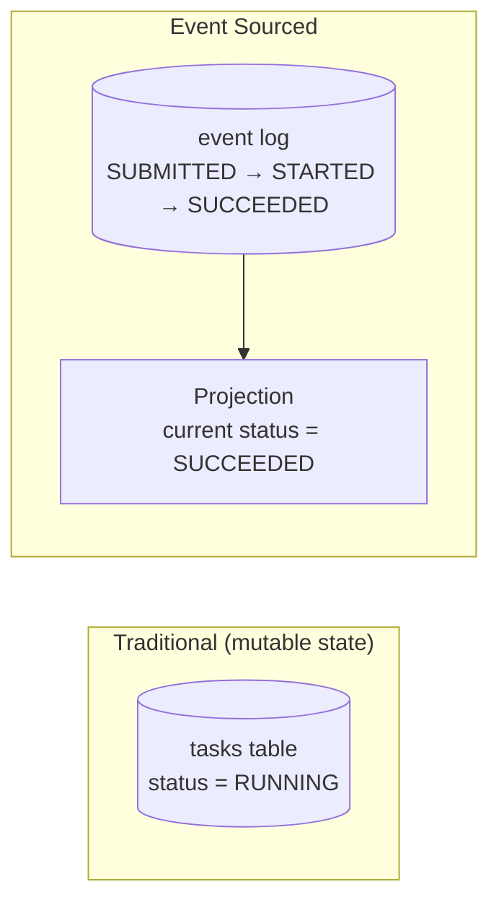
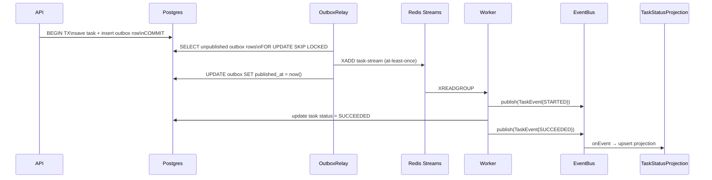

# Distributed Transactions and Event Sourcing

> Where this fits in the project: Phase 4 introduces the **transactional outbox** — write the task and an outbox row in one Postgres transaction, then relay to the broker. That outbox pattern is specifically a way to *avoid* distributed transactions (2PC). And the EventBus in Phase 4, where every lifecycle change produces an immutable `TaskEvent` that downstream systems subscribe to, is a lightweight version of **event sourcing** — using events as the source of truth rather than mutable state. This chapter gives you the theory that explains why the outbox exists, what it is replacing, and how event sourcing connects to it.

---

## 1. Why this exists

In a single-process program, updating two things atomically is trivial:

```java
connection.setAutoCommit(false);
tasks.save(task);          // write 1
notifications.queue(task); // write 2
connection.commit();        // both or neither
```

One database, one transaction, one commit. ACID gives you atomicity for free.

Now you have two systems — Postgres for the task state, Redis Streams for the work queue. You need to write to both. The moment you do, you face three problems that have no perfect solution:

**Problem 1 — The dual-write problem.** You cannot commit to two separate systems atomically. If you write to Postgres and then the process dies before writing to Redis, the task is persisted but never queued — it silently vanishes from the execution pipeline.

**Problem 2 — The reference problem.** You could use 2PC (Two-Phase Commit) to coordinate both systems. But 2PC holds locks across both systems for the duration of the commit protocol, has a single coordinator that becomes a failure point, and blocks indefinitely if the coordinator dies mid-commit (the "in-doubt transaction" problem).

**Problem 3 — The audit problem.** If you update state in place (a task row goes from PENDING → RUNNING → SUCCEEDED), you lose the history. You can see the current state; you cannot reconstruct what happened, when it happened, or why. This matters for billing reconciliation, audit trails, debugging, and replaying events to rebuild projections.

Event sourcing flips the model: instead of storing *current state*, store *what happened* (a log of immutable events). Current state is a derived projection, recomputed by replaying events. The EventBus in Phase 4 is a micro-version of this.



---

## 2. The naive version

**2PC attempt** — the classic textbook answer to cross-system atomicity:

```java
// BAD: Two-Phase Commit in pseudo-code. Do not ship this for a task queue.
public void submitTask(Task task) throws Exception {
    // Phase 1: Prepare — ask both systems if they can commit
    boolean pgReady    = postgres.prepare(task);   // Postgres PREPARE TRANSACTION
    boolean redisReady = redis.prepare(task);       // Redis has no real prepare → already broken

    if (pgReady && redisReady) {
        // Phase 2: Commit — tell both to commit
        postgres.commit();
        redis.commit();
    } else {
        postgres.rollback();
        redis.rollback();
    }
}
```

What's broken:

- **Redis doesn't support 2PC.** Redis has no `PREPARE TRANSACTION`. Most message brokers don't. 2PC requires XA support on every participant — a luxury the modern broker ecosystem doesn't provide.
- **Blocking locks.** Between PREPARE and COMMIT, Postgres holds locks on the prepared rows. If the coordinator JVM crashes mid-protocol, those rows are locked indefinitely until a DBA manually resolves the in-doubt transaction.
- **Coordinator as single point of failure.** The JVM that sends COMMIT to both systems is the coordinator. If it crashes after committing Postgres but before committing Redis: Postgres committed, Redis did not. Inconsistency despite 2PC.
- **Throughput.** 2PC requires two round trips to each participant per commit. A task queue submitting 1,000 tasks/s cannot afford 4× the latency.

**The naive direct write** — what most people ship before they know better:

```java
// BAD: the classic dual-write race.
public String submit(Task task) {
    taskRepository.save(task);     // Postgres commit: task is durable
    taskQueue.enqueue(task);       // Redis write: may fail, may be lost
    return task.id();              // caller thinks it's done — it may not be
}
```

If the process dies between line 2 and line 3, the task is in Postgres (queryable via GET /tasks/{id}) but never in Redis — it never executes. The user sees status `PENDING` forever.

---

## 3. Improved version: the transactional outbox

The fix: write the task **and** a "please publish this" record in **one Postgres transaction**. A separate relay reads committed outbox records and publishes them to the broker. The publish is now a *consequence* of the commit, not an independent operation.

```sql
-- V4__outbox.sql
CREATE TABLE outbox (
    id           UUID PRIMARY KEY,
    aggregate_id TEXT        NOT NULL,   -- task.id
    event_type   TEXT        NOT NULL,   -- 'TASK_SUBMITTED'
    payload      JSONB       NOT NULL,   -- serialized Task or TaskEvent
    created_at   TIMESTAMPTZ NOT NULL DEFAULT now(),
    published_at TIMESTAMPTZ            -- NULL until relay ships it
);
CREATE INDEX idx_outbox_unpublished ON outbox (created_at) WHERE published_at IS NULL;
```

```java
@Transactional          // both writes commit or roll back together
public String submit(Task task) {
    taskRepository.save(task);   // ─┐ ONE Postgres transaction
    outbox.insert(OutboxRecord   // ─┘
            .forTask(task, "TASK_SUBMITTED"));
    return task.id();
}
```

**Delivery guarantee:** At-least-once. The relay may publish an outbox row more than once (crash after publish, before `published_at` is marked). Consumers must be idempotent (see [idempotency.md](./idempotency.md)).

---

## 4. Production-quality version

### 4.1 Full outbox with saga-style failure handling

A **Saga** is the alternative to 2PC for multi-step operations that span services: instead of one atomic transaction, you run a sequence of local transactions, and each step publishes an event. If a step fails, **compensating transactions** undo the previous steps.

Applied to the task queue — a "submit task, notify billing, reserve inventory" flow:

```java
/**
 * Saga coordinator for a complex task submission that touches multiple services.
 * Each step publishes an event to the outbox; downstream services react and publish
 * their own events. If billing fails, a compensating TASK_CANCELLED event is published.
 *
 * This is the choreography-based saga pattern: no central orchestrator holds state;
 * each service listens for events and reacts. The alternative (orchestration) uses
 * a saga orchestrator that sends commands — see tradeoffs in section 7.
 */
@Service
public class TaskSubmissionSaga {

    private final TaskRepository tasks;
    private final OutboxRepository outbox;
    private final JdbcTemplate jdbc;

    @Transactional
    public String initiateSubmit(Task task, BillingInfo billing) {
        // Step 1: save the task + emit TASK_SUBMITTED event
        tasks.save(task.withStatus(TaskStatus.PENDING));
        outbox.insert(new OutboxRecord(
                UUID.randomUUID().toString(), task.id(),
                "TASK_SUBMITTED", serialize(task), null));

        // Step 2: reserve billing (still in same transaction — local atomicity)
        // If this throws, the whole transaction rolls back — clean state.
        billingReservation(billing, task.id(), jdbc);

        // Step 3: emit BILLING_RESERVED event
        outbox.insert(new OutboxRecord(
                UUID.randomUUID().toString(), task.id(),
                "BILLING_RESERVED", serialize(billing), null));
        return task.id();
        // On commit: both outbox rows will be relayed to the broker.
        // BillingService listens to BILLING_RESERVED and confirms the charge.
        // If it fails, it publishes BILLING_FAILED, which triggers a compensating
        // TASK_CANCELLED event from this service's TaskEventListener.
    }

    // Compensating transaction: called when downstream billing fails
    @Transactional
    public void cancelTask(String taskId, String reason) {
        tasks.findById(taskId).ifPresent(t -> {
            tasks.save(t.withStatus(TaskStatus.DEAD));
            outbox.insert(new OutboxRecord(
                    UUID.randomUUID().toString(), taskId,
                    "TASK_CANCELLED", """
                    {"reason":"%s"}""".formatted(reason), null));
        });
    }

    private void billingReservation(BillingInfo b, String taskId, JdbcTemplate jdbc) {
        // Insert into billing_reservations table (same Postgres, same transaction)
        jdbc.update("INSERT INTO billing_reservations (task_id, amount) VALUES (?, ?)",
                taskId, b.amount());
    }

    private String serialize(Object o) {
        try { return new com.fasterxml.jackson.databind.ObjectMapper().writeValueAsString(o); }
        catch (Exception e) { throw new RuntimeException(e); }
    }
}
```

### 4.2 Event sourcing — store events, derive state

Event sourcing stores **what happened** rather than current state. The `TaskEventStore` is the source of truth; `Task` current state is a projection.

```java
/**
 * TaskEventStore: the append-only log of everything that happened to a task.
 * Reading: replay events to get current state (fold/reduce).
 * Writing: append a new event, never update old ones.
 */
@Repository
public class TaskEventStore {

    private final JdbcTemplate jdbc;
    private final ObjectMapper mapper;

    // Append-only: events are immutable facts, never overwritten.
    @Transactional
    public void append(String taskId, TaskEventType type, Object payload) {
        jdbc.update("""
            INSERT INTO task_events (id, task_id, type, payload, occurred_at)
            VALUES (?, ?, ?, ?::jsonb, now())
            """,
                UUID.randomUUID().toString(), taskId, type.name(),
                serialize(payload));
    }

    // Replay: reduce all events for a task into its current state.
    public Optional<Task> replayToPresent(String taskId) {
        List<PersistedEvent> events = jdbc.query("""
            SELECT type, payload, occurred_at FROM task_events
            WHERE task_id = ?
            ORDER BY occurred_at ASC, id ASC
            """,
                (rs, i) -> new PersistedEvent(
                        TaskEventType.valueOf(rs.getString("type")),
                        rs.getString("payload"),
                        rs.getTimestamp("occurred_at").toInstant()),
                taskId);

        if (events.isEmpty()) return Optional.empty();
        return Optional.of(TaskProjector.project(taskId, events));
    }

    // Replay to a point-in-time: audit what state the task was in at any past moment.
    public Optional<Task> replayTo(String taskId, Instant asOf) {
        List<PersistedEvent> events = jdbc.query("""
            SELECT type, payload, occurred_at FROM task_events
            WHERE task_id = ? AND occurred_at <= ?
            ORDER BY occurred_at ASC
            """,
                (rs, i) -> new PersistedEvent(
                        TaskEventType.valueOf(rs.getString("type")),
                        rs.getString("payload"),
                        rs.getTimestamp("occurred_at").toInstant()),
                taskId, java.sql.Timestamp.from(asOf));

        if (events.isEmpty()) return Optional.empty();
        return Optional.of(TaskProjector.project(taskId, events));
    }

    record PersistedEvent(TaskEventType type, String payload, java.time.Instant occurredAt) {}

    private String serialize(Object o) {
        try { return mapper.writeValueAsString(o); }
        catch (Exception e) { throw new RuntimeException(e); }
    }
}

/**
 * TaskProjector: reduces a list of events into a Task snapshot.
 * This is the "fold" / "reduce" step of event sourcing.
 * Each event type mutates a builder; the final build() yields the current state.
 */
public final class TaskProjector {

    public static Task project(String taskId, List<TaskEventStore.PersistedEvent> events) {
        // Start with no state; each event layer builds on the last.
        String type = null; String payload = null; TaskStatus status = null;
        int attempts = 0; int maxAttempts = 5; int priority = 5;
        java.time.Instant createdAt = null; java.time.Instant scheduledAt = null;

        for (var event : events) {
            switch (event.type()) {
                case SUBMITTED -> {
                    // Parse initial state from SUBMITTED event payload
                    status = TaskStatus.PENDING;
                    createdAt = event.occurredAt();
                }
                case STARTED    -> { status = TaskStatus.RUNNING;    }
                case SUCCEEDED  -> { status = TaskStatus.SUCCEEDED;  }
                case FAILED     -> { status = TaskStatus.FAILED;     }
                case RETRY_SCHEDULED -> {
                    status = TaskStatus.RETRYING;
                    attempts++;
                }
                case DEAD_LETTERED -> { status = TaskStatus.DEAD; }
            }
        }
        return new Task(taskId, type, payload, status,
                attempts, maxAttempts, createdAt, scheduledAt, priority);
    }
}
```

### 4.3 Projections and read models

Event sourcing separates write (append to event log) from read (query projections). A projection is a denormalized, queryable view updated by consuming the event log:

```java
/**
 * TaskStatusProjection: a materialized view of current task states.
 * Updated asynchronously by the EventBus. Reads are fast O(1) table lookups.
 * This is the CQRS (Command Query Responsibility Segregation) pattern —
 * writes go to the event log, reads go to the projection.
 */
@Component
public class TaskStatusProjection implements TaskEventListener {

    private final JdbcTemplate jdbc;

    public TaskStatusProjection(JdbcTemplate jdbc) { this.jdbc = jdbc; }

    @Override
    public void onEvent(TaskEvent e) {
        // Upsert the projection row when any event arrives
        jdbc.update("""
            INSERT INTO task_status_projection (task_id, status, attempts, updated_at)
            VALUES (?, ?, ?, ?)
            ON CONFLICT (task_id) DO UPDATE
                SET status = EXCLUDED.status,
                    attempts = EXCLUDED.attempts,
                    updated_at = EXCLUDED.updated_at
            """,
                e.taskId(), e.status().name(), e.attempts(), java.sql.Timestamp.from(e.occurredAt()));
    }

    // Fast O(1) read — no event replay needed
    public Optional<TaskStatus> currentStatus(String taskId) {
        try {
            return Optional.ofNullable(
                    jdbc.queryForObject(
                            "SELECT status FROM task_status_projection WHERE task_id = ?",
                            String.class, taskId))
                    .map(TaskStatus::valueOf);
        } catch (org.springframework.dao.EmptyResultDataAccessException e) {
            return Optional.empty();
        }
    }
}
```

---

## 5. Code walkthrough

### Beginner: understand the dual-write failure with a simple test

```java
// Visualize the window where data loss occurs.
public class DualWriteRaceDemo {

    static boolean processKilledAfterPostgres = true; // simulates crash

    public static void main(String[] args) {
        System.out.println("=== Dual write (broken) ===");
        try {
            save("task-1");                   // Postgres commit: succeeds
            if (processKilledAfterPostgres) throw new RuntimeException("CRASH!");
            enqueue("task-1");                // Redis: never reached
        } catch (RuntimeException e) {
            System.out.println("task-1 is in Postgres but NOT in Redis. Silent loss.");
        }

        System.out.println("\n=== Outbox (fixed) ===");
        saveWithOutbox("task-2");             // ONE transaction: both or neither
        relay();                              // separate process, safe to retry
        System.out.println("task-2 is delivered exactly once (at-least-once + idempotent consumer).");
    }

    static void save(String id)               { System.out.println("Postgres: saved " + id); }
    static void enqueue(String id)            { System.out.println("Redis:    enqueued " + id); }
    static void saveWithOutbox(String id)     { System.out.println("Postgres tx: saved + outbox for " + id); }
    static void relay()                       { System.out.println("Relay: Postgres outbox → Redis, marked published"); }
}
```

### Intermediate: the outbox relay with SKIP LOCKED (concurrent relay safety)

```java
@Component
public class OutboxRelay {

    private final JdbcTemplate jdbc;
    private final AckableTaskQueue queue;
    private final LeaderElector leader;
    private final ObjectMapper mapper;

    @Scheduled(fixedDelay = 250)  // runs every 250ms
    public void relay() {
        if (!leader.isLeader()) return; // only the leader relays
        List<OutboxRecord> batch = fetchBatch(100);
        for (OutboxRecord r : batch) {
            try {
                Task t = mapper.readValue(r.payload(), Task.class);
                queue.enqueue(t);           // at-least-once: relay may publish twice on crash
                markPublished(r.id());      // mark AFTER enqueue: safe direction
            } catch (Exception e) {
                // leave unpublished — will be retried on next scan
            }
        }
    }

    private List<OutboxRecord> fetchBatch(int limit) {
        // FOR UPDATE SKIP LOCKED: if two relay threads race, they grab different rows.
        return jdbc.query("""
            SELECT id, aggregate_id, payload FROM outbox
            WHERE published_at IS NULL
            ORDER BY created_at
            LIMIT ?
            FOR UPDATE SKIP LOCKED
            """,
                (rs, i) -> new OutboxRecord(
                        rs.getString("id"),
                        rs.getString("aggregate_id"),
                        rs.getString("payload")),
                limit);
    }

    private void markPublished(String id) {
        jdbc.update("UPDATE outbox SET published_at = now() WHERE id = ?", id);
    }

    record OutboxRecord(String id, String aggregateId, String payload) {}
}
```

### Production: snapshots for event-sourced aggregates (avoiding full replay)

```java
/**
 * Once a task has accumulated many events, replaying all of them is slow.
 * The fix: snapshot the current state periodically; replay only events since the snapshot.
 */
@Repository
public class SnapshottingTaskEventStore {

    private final TaskEventStore baseStore;
    private final JdbcTemplate jdbc;
    private final int snapshotEvery = 50; // snapshot after every 50 events

    public Optional<Task> replayToPresent(String taskId) {
        // Load the latest snapshot (if any)
        Optional<SnapshotRow> snap = loadLatestSnapshot(taskId);

        if (snap.isPresent()) {
            // Only replay events AFTER the snapshot
            List<TaskEventStore.PersistedEvent> delta = eventsAfter(taskId, snap.get().eventSeq());
            Task base = snap.get().task();
            return Optional.of(TaskProjector.applyDelta(base, delta));
        }
        return baseStore.replayToPresent(taskId);
    }

    public void maybeSnapshot(String taskId) {
        long eventCount = jdbc.queryForObject(
                "SELECT count(*) FROM task_events WHERE task_id = ?", Long.class, taskId);
        if (eventCount % snapshotEvery == 0) {
            baseStore.replayToPresent(taskId).ifPresent(task ->
                    saveSnapshot(taskId, task, eventCount));
        }
    }

    private Optional<SnapshotRow> loadLatestSnapshot(String taskId) { /* jdbc query */ return Optional.empty(); }
    private List<TaskEventStore.PersistedEvent> eventsAfter(String taskId, long seq) { return java.util.List.of(); }
    private void saveSnapshot(String taskId, Task task, long seq) { /* jdbc insert */ }

    record SnapshotRow(Task task, long eventSeq) {}
}
```

---

## 6. How this applies to our Task Queue project

| Concept | Phase | Where it shows up |
|---|---|---|
| **Dual-write problem** | 4 | The reason `TaskSubmissionService` uses `@Transactional` to write task + outbox row atomically |
| **2PC avoided** | 4 | We deliberately chose outbox over 2PC — outbox is simpler, broker-independent, and doesn't require XA |
| **Outbox relay** | 4 | `OutboxRelay` — leader-elected, polls unpublished outbox rows, relays to Redis Streams |
| **Saga (choreography)** | 4 | `TaskEventListener` subscribers react to `TaskEvent`s; no central orchestrator |
| **Event sourcing (lightweight)** | 4 | `EventBus.publish(TaskEvent)` produces immutable events; `TaskStatusProjection` is the read model |
| **CQRS** | 4 | Writes: `TaskEventStore.append()`. Reads: `TaskStatusProjection.currentStatus()`. Separate paths. |
| **Compensating transaction** | 4 | `TaskSubmissionSaga.cancelTask()` is the compensating action when billing fails after task was saved |



---

## 7. Tradeoffs

| Decision | Option A | Option B | Our choice & why |
|---|---|---|---|
| Cross-system atomicity | 2PC / XA | Outbox pattern | **Outbox** — no XA support on Redis/Kafka; outbox is simpler, at-least-once + idempotent consumers handles the rest |
| Multi-step operations | Distributed transaction | Saga | **Saga** (choreography) — sagas are more available and composable; distributed transactions block across systems |
| State storage | Mutable table | Event log | **Mutable** in P1-3, **events via EventBus** in P4 (lightweight, not full event sourcing) |
| Read model | Replay on every read | Materialized projection | **Projection** — replay is for audit/debug; hot reads need the O(1) projection |
| Saga style | Choreography | Orchestration | **Choreography** — each service reacts to events independently; orchestration adds a coordinator that becomes a bottleneck and single point of failure |

---

## 8. Common mistakes and pitfalls

- **The dual-write in the wrong order.** Writing to Redis first, then Postgres — if Postgres fails, you have a message in the queue with no persistent task. Always write to the durable store first (or use the outbox to make order irrelevant).
- **The relay without SKIP LOCKED.** Two relay threads race, both publish the same outbox row, the consumer gets it twice. *Fix: `FOR UPDATE SKIP LOCKED` in the fetch query.*
- **Marking outbox as published BEFORE enqueuing.** If the process dies after `published_at = now()` but before `XADD`, the row is lost. *Fix: enqueue first, then mark published. Idempotent consumer handles the rare double-publish.*
- **Saga without a timeout.** A saga that waits forever for `BILLING_CONFIRMED` that never comes leaves tasks stuck in PENDING. *Fix: saga timeout event triggers the compensating `cancelTask`.*
- **Event sourcing without snapshots.** A task with 10,000 events takes 10,000 row reads on every status query. *Fix: snapshot every N events; replay only the delta.*
- **Mutable events.** Events are immutable facts. Never `UPDATE` an event row — append a new corrective event instead. Mutating history breaks replay correctness.
- **Using event sourcing for everything.** Tasks with simple CRUD semantics do not benefit from full event sourcing. The EventBus + projection approach in Phase 4 is the right balance for this use case.

---

## 9. Refactoring exercise

**Bad** — dual write, no atomicity, silent loss on crash:

```java
// BAD
public void submit(Task task) {
    db.save(task);          // commit 1
    redis.enqueue(task);    // commit 2: crash here = lost task
}
```

**Improved** — outbox in one transaction:

```java
// IMPROVED
@Transactional
public void submit(Task task) {
    tasks.save(task);
    outbox.insert(OutboxRecord.forTask(task));
    // relay picks it up asynchronously
}
```

**Production** — full saga with compensation + event-sourced audit + CQRS projection:

```java
// PRODUCTION
@Transactional
public String submit(Task task, BillingInfo billing) {
    tasks.save(task.withStatus(TaskStatus.PENDING));
    billingReservation(billing, task.id(), jdbc);     // local, same TX
    eventStore.append(task.id(), TaskEventType.SUBMITTED, task);
    outbox.insert(OutboxRecord.forEvent(task.id(), "TASK_SUBMITTED", task));
    outbox.insert(OutboxRecord.forEvent(task.id(), "BILLING_RESERVED", billing));
    return task.id();
    // On commit: relay ships both outbox rows; downstream services react choreographically.
}
```

---

## 10. Exercises

### Easy

**E1.** Draw the sequence diagram for the crash scenario: process dies after Postgres commit, before Redis XADD. Show what the outbox relay does on restart.

**E2.** Why is the compensating transaction in a Saga NOT the same as a rollback? What can it not undo?

### Medium

**M1.** Implement `TaskEventStore.append()` and `TaskProjector.project()` and write a test that: submits a task, starts it, fails it once, retries it, then succeeds it — and verifies the final projected state has `status=SUCCEEDED, attempts=1`.

**M2.** The outbox relay publishes a row twice (crash between XADD and `published_at` update). Show that `IdempotentHandler` (from [phase-4.md](../09-project/phase-4.md)) suppresses the duplicate execution using the `processed_tasks` unique key.

### Hard

**H1.** Design a choreography-based saga for: submit task → reserve inventory → charge billing → confirm task. Handle all failure paths with compensating transactions. Draw the event flow diagram and list every event type needed.

**H2.** Compare full event sourcing vs the Phase 4 outbox+EventBus approach for this task queue. Under what scale or compliance requirement would you migrate to full event sourcing? What would you have to change in the data model?

---

## 11. Solutions

**E1.** Crash scenario: (1) Postgres commits task + outbox row (both durable). (2) Process dies — Redis never receives XADD. (3) On restart, the relay finds the outbox row with `published_at IS NULL`, publishes it to Redis, then marks it published. The task is delivered exactly as if the crash hadn't happened. The consumer uses its idempotency key (`task.id`) so if the relay somehow published before the crash AND after restart, the consumer deduplicates.

**E2.** A compensating transaction undoes the *business effect* of a step but cannot undo side effects that have already left the system. If step 2 sent a confirmation email, the compensating transaction can cancel the order in the DB but cannot un-send the email. Sagas are only safe for side effects that are either reversible (DB writes, reservations) or idempotently re-applicable (charges with full refunds). This is why saga design starts with "which effects are irreversible?" and those steps go last.
