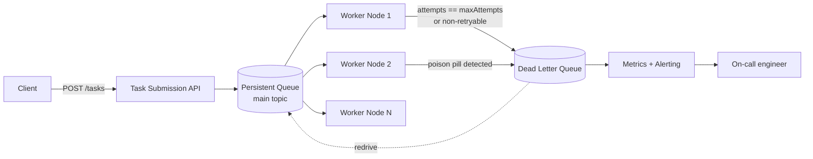
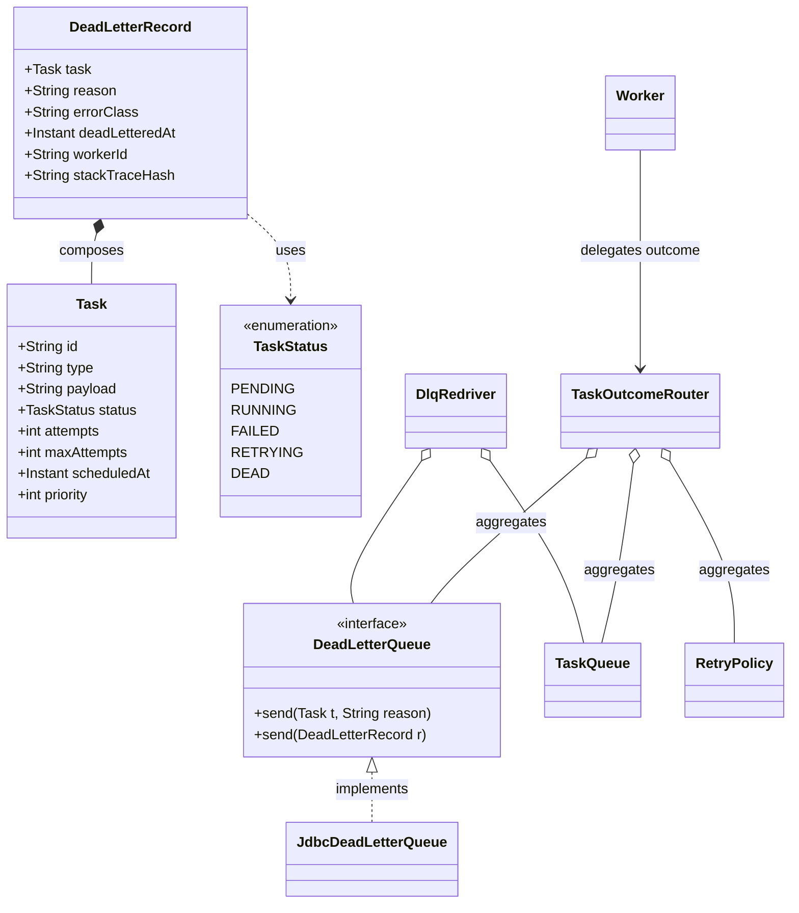

# Dead Letter Queues in Distributed Systems

> Where this fits in the project: in Phase 3/4 our platform runs many worker nodes pulling from a persistent broker. A `DeadLetterQueue` is the holding pen for tasks that exhausted retries, hit a non-retryable error, or are *poison pills* that crash every worker that touches them. This chapter takes the single-process `DeadLetterQueue` from [the queues module](../07-queues-and-messaging/dead-letter-queues.md) and makes it survive partial failure, scale to millions of dead tasks, and become operable on-call.

The queues-module chapter answered "what is a DLQ and how do I put a failed task into one." This chapter answers the harder distributed questions: *Who owns the DLQ when there are 40 workers and 3 broker partitions? How do I detect a poison pill before it takes down a node? How do I redrive 2 million dead tasks without re-melting the system? What do I page on, and what does the on-call engineer actually do at 3am?*

---

## 1. Why this exists

A retry policy with a bound (see [retries.md](./retries.md)) guarantees that some tasks will eventually stop being retried. The question is *what happens to them*. Three bad answers and one good one:

| Approach | What happens | Why it's bad |
| --- | --- | --- |
| Drop silently | Task vanishes after `maxAttempts` | Data loss, no audit trail, silent SLA violations |
| Retry forever | No `maxAttempts` cap | A poison pill pins a worker forever; backlog grows unbounded |
| Log and move on | `log.error(...)` then discard | Logs are not a queue; you can't *reprocess* a log line |
| **Dead Letter Queue** | Move the task to a separate, durable queue with metadata | Preserves the message, isolates the failure, enables redrive |

The DLQ is the **failure boundary** of an asynchronous system. It converts an unbounded, system-threatening failure (a task that will never succeed and keeps consuming a worker) into a bounded, observable, *recoverable* state. The same way exceptions separate the happy path from the error path in code, the DLQ separates the healthy queue from the failed-message path in infrastructure.

Historical note: the term comes from message-oriented middleware (IBM MQ's "dead-letter queue", JMS's backout queues). AWS SQS popularized the modern shape: a `RedrivePolicy` with a `maxReceiveCount` that, when exceeded, moves the message to a configured DLQ. RabbitMQ does it with a per-queue `x-dead-letter-exchange`. Kafka has no native DLQ — you build one as a topic and a consumer convention (Kafka Connect's `errors.deadletterqueue.topic.name` formalizes this). The semantics differ in important ways we cover in §7.



---

## 2. The naive version

Here is the DLQ most people write first. It's a single in-memory list, and the worker calls it when retries run out.

```java
// NAIVE — single process, in-memory, no metadata, no durability.
public final class InMemoryDeadLetterQueue implements DeadLetterQueue {
    private final List<Task> dead = new ArrayList<>(); // not thread-safe!

    @Override
    public void send(Task t, String reason) {
        dead.add(t); // reason is dropped on the floor
    }
}
```

And the worker that uses it:

```java
// NAIVE worker outcome handling
TaskResult r = handler.handle(task);
if (!r.success()) {
    if (task.attempts() >= task.maxAttempts()) {
        dlq.send(task, r.message());  // give up
    } else {
        queue.enqueue(task.withStatus(TaskStatus.RETRYING)); // requeue
    }
}
```

Limitations, in order of how badly they bite in production:

- **No durability.** A worker node restarts; every dead task in memory is gone. The "safety net" loses the messages it was built to save.
- **The `reason` is discarded.** When you redrive, you have no idea *why* anything died — was it a bad payload, a downstream outage, or a code bug?
- **No poison-pill protection.** If `handler.handle(task)` throws an `Error` (e.g., `StackOverflowError`) or the JVM hangs, the task is never marked failed and `attempts` never increments. It will be redelivered and crash the next worker too. The DLQ never sees it.
- **Not thread-safe.** Multiple workers call `send` concurrently; `ArrayList.add` corrupts.
- **No ownership in a distributed system.** Forty worker nodes each have their own `List<Task>`. There is no single DLQ.
- **No observability.** You learn the DLQ is full when a customer asks where their job went.

---

## 3. Improved version

Make the DLQ durable, carry metadata, and be safe under concurrency. We model a dead-letter *record* (the task plus the forensic envelope) and back the queue with the same persistence we use for the main queue (Postgres in Phase 2, the broker in Phase 4).

```java
// IMPROVED — durable record with forensic metadata.
public record DeadLetterRecord(
        Task task,
        String reason,          // human-readable: "downstream 503 after 5 attempts"
        String errorClass,      // e.g. "java.net.SocketTimeoutException" or "VALIDATION"
        Instant deadLetteredAt,
        String workerId,        // which node gave up
        String stackTraceHash   // group identical failures without storing full traces
) {}
```

```java
public interface DeadLetterQueue {
    void send(Task t, String reason);                 // keep the canonical signature
    default void send(DeadLetterRecord record) {      // richer overload
        send(record.task(), record.reason());
    }
}
```

A JDBC-backed implementation (Phase 2 onward) that writes atomically and is safe across nodes because the database is the single source of truth:

```java
public final class JdbcDeadLetterQueue implements DeadLetterQueue {
    private final JdbcTemplate jdbc;

    public JdbcDeadLetterQueue(JdbcTemplate jdbc) { this.jdbc = jdbc; }

    @Override
    public void send(Task t, String reason) {
        send(new DeadLetterRecord(
                t, reason, "UNKNOWN", Instant.now(),
                System.getenv("WORKER_ID"), "-"));
    }

    @Override
    public void send(DeadLetterRecord r) {
        jdbc.update("""
            INSERT INTO dead_letter_tasks
              (id, type, payload, reason, error_class, attempts,
               dead_lettered_at, worker_id, stack_trace_hash, status)
            VALUES (?, ?, ?::jsonb, ?, ?, ?, ?, ?, ?, 'DEAD')
            ON CONFLICT (id) DO NOTHING
            """,
            r.task().id(), r.task().type(), r.task().payload(),
            r.reason(), r.errorClass(), r.task().attempts(),
            Timestamp.from(r.deadLetteredAt()), r.workerId(), r.stackTraceHash());
    }
}
```

`ON CONFLICT (id) DO NOTHING` makes `send` **idempotent** (see [idempotency.md](./idempotency.md)): if two workers both decide the same task is dead (which happens during a rebalance), we don't create duplicates. The task's status transitions to `DEAD` in the canonical [`TaskStatus`](../07-queues-and-messaging/task-queues.md) enum.

This is durable and forensic, but it still doesn't *detect* poison pills proactively, and it has no story for redrive at scale. That's the production version.

---

## 4. Production-quality version

A staff-engineer DLQ in a distributed system has five responsibilities, not one:

1. **Classify** the failure: retryable transient vs non-retryable vs poison pill.
2. **Quarantine** atomically with the consumer offset/ack (no double-processing, no loss).
3. **Enrich** with forensic metadata for later triage.
4. **Expose** metrics, depth gauges, and age so it's observable.
5. **Support redrive** — selective, rate-limited, idempotent reprocessing.

Here is the worker-side decision logic — the part that decides *whether* something is dead and *why*. It distinguishes the three failure classes and treats poison pills (anything that throws an unexpected `Throwable`, including `Error`) specially.

```java
public final class TaskOutcomeRouter {
    private static final Logger log = LoggerFactory.getLogger(TaskOutcomeRouter.class);

    private final DeadLetterQueue dlq;
    private final TaskQueue mainQueue;
    private final RetryPolicy retryPolicy;
    private final MeterRegistry metrics;
    private final String workerId;

    public TaskOutcomeRouter(DeadLetterQueue dlq, TaskQueue mainQueue,
                             RetryPolicy retryPolicy, MeterRegistry metrics, String workerId) {
        this.dlq = dlq;
        this.mainQueue = mainQueue;
        this.retryPolicy = retryPolicy;
        this.metrics = metrics;
        this.workerId = workerId;
    }

    /** Returns true if the message may be acked (it is fully handled). */
    public boolean route(Task task, TaskHandler handler) {
        Task attempted = task.withAttempts(task.attempts() + 1);
        try {
            TaskResult result = handler.handle(attempted);
            if (result.success()) {
                metrics.counter("tasks.succeeded", "type", task.type()).increment();
                return true;                                   // ack; done
            }
            return routeFailure(attempted, result.message(),
                    "BUSINESS", result.retryable());
        } catch (Exception e) {
            // Known exception path: retryable unless explicitly marked otherwise.
            return routeFailure(attempted, e.toString(), classify(e), isRetryable(e), e);
        } catch (Throwable fatal) {
            // POISON PILL: Error/unchecked fatal. Never retry — it will recur and may
            // take down the node. Quarantine immediately.
            log.error("Poison pill detected for task {} type {}",
                    task.id(), task.type(), fatal);
            metrics.counter("tasks.poison_pill", "type", task.type()).increment();
            deadLetter(attempted, "poison pill: " + fatal, "POISON_PILL", fatal);
            return true; // ack so it stops being redelivered
        }
    }

    private boolean routeFailure(Task task, String reason, String errorClass,
                                 boolean retryable) {
        return routeFailure(task, reason, errorClass, retryable, null);
    }

    private boolean routeFailure(Task task, String reason, String errorClass,
                                 boolean retryable, Throwable cause) {
        boolean attemptsLeft = task.attempts() < task.maxAttempts();
        if (retryable && attemptsLeft) {
            Optional<Duration> delay = retryPolicy.nextDelay(task.attempts());
            if (delay.isPresent()) {
                metrics.counter("tasks.retried", "type", task.type()).increment();
                mainQueue.enqueue(task
                        .withStatus(TaskStatus.RETRYING)
                        .withScheduledAt(Instant.now().plus(delay.get())));
                return true; // we re-enqueued a copy; original may be acked
            }
        }
        // Either non-retryable, out of attempts, or retry policy gave up.
        String why = !retryable ? "non-retryable: " + reason
                   : "exhausted " + task.maxAttempts() + " attempts: " + reason;
        deadLetter(task, why, errorClass, cause);
        return true;
    }

    private void deadLetter(Task task, String reason, String errorClass, Throwable cause) {
        Task dead = task.withStatus(TaskStatus.DEAD);
        metrics.counter("tasks.dead_lettered", "type", task.type(),
                "error_class", errorClass).increment();
        dlq.send(new DeadLetterRecord(
                dead, reason, errorClass, Instant.now(), workerId,
                cause == null ? "-" : stackHash(cause)));
    }

    /** Map known exceptions to a coarse class for grouping/alerting. */
    private String classify(Exception e) {
        return switch (e) {
            case java.net.SocketTimeoutException ignored -> "TIMEOUT";
            case java.net.ConnectException ignored       -> "CONNECT";
            case IllegalArgumentException ignored        -> "VALIDATION";
            default -> e.getClass().getSimpleName();
        };
    }

    private boolean isRetryable(Exception e) {
        // Validation/business errors are permanent; IO/timeouts are transient.
        return !(e instanceof IllegalArgumentException
              || e instanceof IllegalStateException);
    }

    /** Stable hash of the top stack frames, so identical bugs group together. */
    private static String stackHash(Throwable t) {
        var sb = new StringBuilder(t.getClass().getName());
        var frames = t.getStackTrace();
        for (int i = 0; i < Math.min(5, frames.length); i++) {
            sb.append('|').append(frames[i].getClassName())
              .append('#').append(frames[i].getMethodName());
        }
        return Integer.toHexString(sb.toString().hashCode());
    }
}
```

Key production decisions encoded here:

- **`catch (Throwable)` for poison pills.** A `StackOverflowError` or a `NoClassDefFoundError` from a bad deploy must not be retried. Catching `Throwable` is normally an anti-pattern, but a worker *boundary* is exactly the place where you isolate failure so one bad task can't kill the node. We re-throw nothing; we quarantine and ack.
- **Ack semantics.** `route` returns whether the broker message may be acknowledged. We ack even on dead-letter, because the *copy* is now safely in the DLQ. The one thing we never do is ack before the DLQ write is durable — see the ordering discussion in §7.
- **`stackTraceHash` groups failures.** 50,000 dead tasks with the same hash means one bug, not 50,000 problems. This is the single most useful field on-call.
- **Error classification drives alerting.** `error_class=TIMEOUT` spiking means a downstream is sick (transient, will redrive cleanly). `error_class=VALIDATION` spiking means a producer shipped bad data (redriving won't help — fix the producer).

### Poison-pill circuit breaker per node

Even with `catch (Throwable)`, a subtle poison pill (an infinite loop, an OOM, a task that wedges a connection pool) can degrade a node before it ever dead-letters. Defense in depth: wrap handler execution with a timeout and a per-node consecutive-failure breaker.

```java
public final class GuardedExecution {
    private final ExecutorService timeoutPool =
            Executors.newVirtualThreadPerTaskExecutor(); // Loom: cheap per-task threads
    private final AtomicInteger consecutiveFatal = new AtomicInteger();
    private final int breakerThreshold;
    private final Duration perTaskTimeout;

    public GuardedExecution(int breakerThreshold, Duration perTaskTimeout) {
        this.breakerThreshold = breakerThreshold;
        this.perTaskTimeout = perTaskTimeout;
    }

    public TaskResult run(Task t, TaskHandler h) throws Exception {
        Future<TaskResult> f = timeoutPool.submit(() -> h.handle(t));
        try {
            TaskResult r = f.get(perTaskTimeout.toMillis(), TimeUnit.MILLISECONDS);
            consecutiveFatal.set(0);
            return r;
        } catch (TimeoutException te) {
            f.cancel(true);
            if (consecutiveFatal.incrementAndGet() >= breakerThreshold) {
                throw new NodeUnhealthyException(
                    "breaker open: " + consecutiveFatal.get() + " consecutive timeouts");
            }
            throw new TaskTimeoutException(t.id(), perTaskTimeout);
        }
    }
}
```

When `NodeUnhealthyException` fires, the node stops pulling new work and reports itself unhealthy to the orchestrator (see [service-discovery-and-scaling.md](./service-discovery-and-scaling.md)) so traffic drains away while it's investigated — that is the [circuit breaker](./circuit-breakers.md) pattern applied at the *node* level rather than the *dependency* level.

---

## 5. Code walkthrough — three examples

### Beginner: a thread-safe in-memory DLQ that keeps the reason

The smallest correct DLQ: thread-safe and metadata-preserving. Good for tests and Phase 1.

```java
public final class InMemoryDeadLetterQueue implements DeadLetterQueue {
    private final BlockingQueue<DeadLetterRecord> q = new LinkedBlockingQueue<>();

    @Override
    public void send(Task t, String reason) {
        send(new DeadLetterRecord(
                t, reason, "UNKNOWN", Instant.now(), "local", "-"));
    }

    @Override
    public void send(DeadLetterRecord r) {
        q.offer(r); // unbounded LinkedBlockingQueue: offer always succeeds
    }

    public int size() { return q.size(); }
    public List<DeadLetterRecord> drain() {
        var out = new ArrayList<DeadLetterRecord>();
        q.drainTo(out);
        return out;
    }
}
```

> Why `BlockingQueue` and not a synchronized `ArrayList`? `LinkedBlockingQueue` gives us thread safety, a `size()` we can gauge on, and `drainTo` for batch redrive — all in the standard library. See [blocking-queue.md](../06-concurrency/blocking-queue.md).

### Intermediate: redrive with rate limiting and a cap

Redrive is the dangerous operation. Naively, you dump 2M dead tasks back into the main queue and instantly re-break whatever was broken (a "redrive storm"). The intermediate version rate-limits and bounds the batch using the canonical [`RateLimiter`](./rate-limiting.md).

```java
public final class DlqRedriver {
    private final DeadLetterQueue dlq;       // source
    private final TaskQueue mainQueue;       // destination
    private final TaskRepository repo;       // to flip status back to PENDING
    private final RateLimiter limiter;       // TokenBucketRateLimiter, e.g. 50/sec

    public DlqRedriver(DeadLetterQueue dlq, TaskQueue mainQueue,
                       TaskRepository repo, RateLimiter limiter) {
        this.dlq = dlq;
        this.mainQueue = mainQueue;
        this.repo = repo;
        this.limiter = limiter;
    }

    /** Redrive up to {@code max} dead tasks matching {@code filter}. Returns count redriven. */
    public int redrive(Predicate<DeadLetterRecord> filter, int max) {
        int redriven = 0;
        for (DeadLetterRecord r : fetchDead(max)) {
            if (!filter.test(r)) continue;
            while (!limiter.tryAcquire()) {          // backpressure: wait for a token
                Thread.onSpinWait();
            }
            Task revived = r.task()
                    .withStatus(TaskStatus.PENDING)
                    .withAttempts(0);                // give it a fresh budget
            repo.save(revived);                      // durable state change first
            mainQueue.enqueue(revived);              // then make it visible to workers
            removeFromDlq(r.task().id());            // finally clear from DLQ
            redriven++;
        }
        return redriven;
    }

    private List<DeadLetterRecord> fetchDead(int max) { /* SELECT ... LIMIT max */ return List.of(); }
    private void removeFromDlq(String id) { /* DELETE FROM dead_letter_tasks WHERE id = ? */ }
}
```

The ordering — `repo.save` → `enqueue` → `removeFromDlq` — is deliberate. If we crash mid-redrive, the worst case is a task that exists in both the main queue and the DLQ; the worker's idempotent `dlq.send(... ON CONFLICT DO NOTHING)` and idempotent task execution (see [idempotency.md](./idempotency.md)) absorb that. The opposite order would risk *losing* a task on a crash, which violates the DLQ's entire reason to exist.

### Production-inspired: SQS-style redrive endpoint with selective filters

A real platform exposes redrive through the API so on-call doesn't SSH into a box and run raw SQL at 3am. The `TaskController` gains an admin endpoint.

```java
@RestController
@RequestMapping("/admin/dlq")
public class DlqAdminController {

    private final DlqRedriver redriver;
    private final DeadLetterRepository deadRepo;
    private final MeterRegistry metrics;

    public DlqAdminController(DlqRedriver redriver, DeadLetterRepository deadRepo,
                              MeterRegistry metrics) {
        this.redriver = redriver;
        this.deadRepo = deadRepo;
        this.metrics = metrics;
    }

    /** Inspect: what is in the DLQ, grouped by error class and stack hash. */
    @GetMapping("/summary")
    public List<DlqGroup> summary() {
        return deadRepo.groupByErrorClassAndHash(); // SQL GROUP BY
    }

    /** Redrive a bounded, filtered batch. Rate-limited inside DlqRedriver. */
    @PostMapping("/redrive")
    public RedriveResponse redrive(@RequestBody RedriveRequest req) {
        Predicate<DeadLetterRecord> filter = r ->
                (req.type() == null || req.type().equals(r.task().type())) &&
                (req.errorClass() == null || req.errorClass().equals(r.errorClass())) &&
                (req.stackHash() == null || req.stackHash().equals(r.stackTraceHash()));

        long start = System.nanoTime();
        int n = redriver.redrive(filter, req.max());
        metrics.timer("dlq.redrive.duration").record(
                Duration.ofNanos(System.nanoTime() - start));
        metrics.counter("dlq.redriven", "error_class",
                req.errorClass() == null ? "all" : req.errorClass()).increment(n);
        return new RedriveResponse(n);
    }

    public record RedriveRequest(String type, String errorClass,
                                 String stackHash, int max) {}
    public record RedriveResponse(int redriven) {}
}
```

This mirrors AWS's `StartMessageMoveTask` API: you redrive *selectively* (only `error_class=TIMEOUT` now that the downstream recovered) and *boundedly* (`max=10000` per call), and every redrive is metered. Validation-class failures are deliberately *not* redriven here — you'd fix the producer and replay, not loop the same bad payload.

---

## 6. How this applies to our Task Queue project

Mapping to the canonical model:



- `Task.status` reaches `DEAD` (the terminal-but-recoverable state in our [`TaskStatus`](../07-queues-and-messaging/task-queues.md) enum). `DEAD` is distinct from `FAILED`: `FAILED` is a per-attempt outcome; `DEAD` means "no more attempts, parked in DLQ."
- `Worker` no longer contains failure logic inline — it delegates to `TaskOutcomeRouter`, which decides retry vs dead-letter. This keeps `Worker` focused on the pull/execute loop and makes the routing logic unit-testable in isolation (good cohesion — see [cohesion.md](../04-oop-and-ood/cohesion.md)).
- The DLQ shares the `Task` model exactly, so a redriven task is byte-identical to a freshly submitted one. No second schema, no translation layer.
- In Phase 4, `JdbcDeadLetterQueue` is swapped for a broker-native DLQ (an SQS DLQ, a RabbitMQ dead-letter exchange, or a Kafka `*.DLT` topic) behind the same `DeadLetterQueue` interface — a clean [Strategy](../05-design-patterns/strategy.md) substitution.

---

## 7. Tradeoffs

### Where the DLQ lives

| Option | Durability | Redrive | Ordering preserved | Best for |
| --- | --- | --- | --- | --- |
| In-memory (`BlockingQueue`) | None (lost on restart) | Trivial | N/A | Tests, Phase 1 |
| Postgres table (`JdbcDeadLetterQueue`) | Strong, transactional | SQL filters, easy | Yes (by column) | Phase 2/3, <10M dead rows |
| SQS DLQ | Strong (AWS-managed) | `StartMessageMoveTask` | **No** (SQS is unordered) | AWS-native, huge volume |
| RabbitMQ DLX | Strong | Shovel/consume + republish | Per-queue | RabbitMQ shops |
| Kafka `.DLT` topic | Strong, replayable | Re-consume + produce to source | Per-partition | Kafka, replay-heavy |

### Semantic tradeoffs that bite in distributed mode

- **At-least-once means duplicates in the DLQ are normal.** During a consumer-group rebalance, a task can be processed by two consumers; both may dead-letter it. Idempotent `send` (the `ON CONFLICT`) and a unique `id` make this harmless. Designing for exactly-once dead-lettering is usually not worth it.
- **DLQ ordering is usually *not* preserved** across the move (SQS) or only per-partition (Kafka). If your tasks have ordering constraints, redriving them out of order can violate invariants. Mitigation: include a `sequence`/`version` in the payload and let idempotent handlers reject stale ones.
- **`maxReceiveCount` vs `maxAttempts`.** Broker-native DLQs (SQS) count *deliveries* (`maxReceiveCount`), which include redeliveries from visibility-timeout expiry — not just your application's `attempts`. A task can hit the DLQ via `maxReceiveCount` *before* your `maxAttempts`, if the visibility timeout is shorter than processing time. Tune the visibility timeout to exceed p99 processing time, or your DLQ fills with tasks that simply ran slow.
- **DLQ-of-DLQ.** Redrive can itself fail repeatedly. Decide: do you cap redrive attempts and leave permanently-dead tasks in the DLQ flagged `permanently_dead`, or chain a second DLQ? Most teams cap and flag; a DLQ chain is rarely worth the complexity.
- **Retention.** A DLQ is not a graveyard. SQS DLQ messages expire after the queue's retention (max 14 days) and are then *gone*. If you need longer, archive dead records to object storage (S3/blob) before retention bites.

---

## 8. Common mistakes and pitfalls

- **Acking before the DLQ write is durable.** Worker: ack → crash before `dlq.send` commits → task lost. *Fix:* write to DLQ first (or in the same transaction as the offset commit), then ack. The DLQ write is the new source of truth.
- **No poison-pill protection.** Catching only `Exception`, not `Throwable`. An `Error` is redelivered and crashes the next node. *Fix:* `catch (Throwable)` at the worker boundary and quarantine.
- **Redrive storms.** Bulk-redriving everything the instant a downstream recovers, re-saturating it. *Fix:* rate-limited, filtered, bounded redrive (the `DlqRedriver`).
- **Redriving non-retryable failures.** Looping validation errors back through the system; they fail identically and re-dead-letter, wasting capacity. *Fix:* filter by `error_class`; redrive only transient classes; fix-and-replay the rest.
- **Treating the DLQ as a log.** Sending to a DLQ but never reading it. A silently growing DLQ is a silent outage. *Fix:* alert on depth and age (next section).
- **Losing the failure reason.** Dropping `reason`/`errorClass`/stack hash. *Fix:* the `DeadLetterRecord` envelope.
- **Unbounded DLQ.** No retention or archival; the DLQ table grows until it harms the main DB. *Fix:* archive + purge, or use a broker DLQ with retention.
- **`attempts` never resets on redrive.** Redriving with `attempts == maxAttempts` means it dead-letters again on the first failure. *Fix:* reset `attempts` to 0 (or to `maxAttempts - 1` for a single cautious retry) on redrive.

---

## 9. Refactoring exercise

**Bad** — failure handling inline in the worker, no metadata, no poison-pill protection, not durable:

```java
public class Worker implements Runnable {
    public void run() {
        while (running) {
            Task t = queue.dequeue();
            try {
                TaskResult r = handlers.get(t.type()).handle(t);
                if (!r.success() && t.attempts() >= t.maxAttempts()) {
                    deadList.add(t);            // in-memory, no reason
                } else if (!r.success()) {
                    queue.enqueue(t);           // immediate requeue, no backoff
                }
            } catch (Exception e) {
                deadList.add(t);                // Errors slip through; no metadata
            }
        }
    }
}
```

**Improved** — extract a `TaskOutcomeRouter`, add backoff and a durable DLQ, keep the reason:

```java
public class Worker implements Runnable {
    private final TaskQueue queue;
    private final Map<String, TaskHandler> handlers;
    private final TaskOutcomeRouter router;

    public void run() {
        while (running) {
            try {
                Task t = queue.dequeue();
                TaskHandler h = handlers.get(t.type());
                if (h == null) {
                    router.deadLetterUnknownType(t);   // no handler == dead, not retry
                    continue;
                }
                router.route(t, h);                    // retry/backoff/dead-letter inside
            } catch (InterruptedException ie) {
                Thread.currentThread().interrupt();
                return;
            }
        }
    }
}
```

**Production** — add poison-pill timeout guarding, idempotent durable DLQ writes, metrics, and an explicit ack contract. The worker pulls, guards execution, and routes; the router (from §4) classifies and quarantines; the `GuardedExecution` (from §4) bounds runtime so a wedged task can't pin the node:

```java
public final class Worker implements Runnable {
    private final TaskQueue queue;
    private final Map<String, TaskHandler> handlers;
    private final TaskOutcomeRouter router;
    private final GuardedExecution guard;
    private final MeterRegistry metrics;
    private volatile boolean running = true;

    public Worker(TaskQueue queue, Map<String, TaskHandler> handlers,
                  TaskOutcomeRouter router, GuardedExecution guard, MeterRegistry metrics) {
        this.queue = queue; this.handlers = handlers; this.router = router;
        this.guard = guard; this.metrics = metrics;
    }

    @Override
    public void run() {
        while (running) {
            Task t;
            try { t = queue.dequeue(); }
            catch (InterruptedException ie) { Thread.currentThread().interrupt(); return; }

            TaskHandler h = handlers.get(t.type());
            if (h == null) { router.deadLetterUnknownType(t); continue; }

            TaskHandler guarded = task -> guard.run(task, h);   // timeout wrapper
            try {
                metrics.timer("task.exec", "type", t.type()).record(
                        () -> router.route(t, guarded));        // route handles all outcomes
            } catch (NodeUnhealthyException nue) {
                running = false;                                // breaker open: stop pulling
                reportUnhealthy(nue);                           // drain traffic away
            }
        }
    }

    public void stop() { running = false; }
    private void reportUnhealthy(NodeUnhealthyException e) { /* flip readiness probe */ }
}
```

The progression: failure logic moved out of the worker (cohesion), failures became durable and described (forensics), and the node defends itself against poison pills (resilience).

---

## 10. Exercises

### Easy

**E1 (knowledge check).** In one sentence each, distinguish `FAILED`, `RETRYING`, and `DEAD` in our `TaskStatus` enum, and explain why a DLQ needs `DEAD` to be distinct from `FAILED`.

**E2 (coding).** Implement `InMemoryDeadLetterQueue.purgeOlderThan(Duration age)` that removes records whose `deadLetteredAt` is older than `now - age`, returning the count purged. It must be thread-safe.

### Medium

**M1 (coding).** Implement `DeadLetterRepository.groupByErrorClassAndHash()` returning a `List<DlqGroup>` where `DlqGroup` is `record DlqGroup(String errorClass, String stackHash, long count, Instant oldest)`. Use a single SQL `GROUP BY`. This powers the `/admin/dlq/summary` endpoint.

**M2 (refactoring).** The naive worker in §9 immediately requeues failed tasks with no backoff, causing a tight retry loop that hammers a sick downstream. Refactor it to apply `ExponentialBackoffRetryPolicy` and to dead-letter when `RetryPolicy.nextDelay` returns empty. Show the diff.

### Hard

**H1 (design).** Design poison-pill detection that survives a worker being *killed mid-task* (SIGKILL, OOM). You can't catch `Throwable` if the process dies. Sketch the broker-level mechanism (hint: delivery counting and visibility timeouts) and the table/columns you'd add to make it work with `JdbcDeadLetterQueue`. Specify the exact rule that converts a repeatedly-redelivered-but-never-acked task into a `DEAD` record.

**H2 (interview-style).** You arrive on-call to a DLQ growing at 5,000 tasks/min. Walk through your diagnosis and remediation in order, naming the metrics you'd look at and the decision criteria for "redrive now" vs "hold and fix the producer."

---

## 11. Solutions

**E1.** `FAILED` = a single execution attempt returned unsuccessfully (transient state, may be retried). `RETRYING` = scheduled for another attempt after a backoff delay. `DEAD` = attempts exhausted (or non-retryable/poison), now parked in the DLQ awaiting human/redrive action. The DLQ needs `DEAD` distinct from `FAILED` because `FAILED` recurs every attempt and would make "how many tasks are actually parked" unanswerable; `DEAD` is the terminal-but-recoverable marker the DLQ and its depth gauge key off.

**E2.**

```java
public int purgeOlderThan(Duration age) {
    Instant cutoff = Instant.now().minus(age);
    var removed = new ArrayList<DeadLetterRecord>();
    // drain, partition, refill keeps the operation atomic w.r.t. the queue
    synchronized (q) {
        var keep = new ArrayList<DeadLetterRecord>();
        DeadLetterRecord r;
        while ((r = q.poll()) != null) {
            if (r.deadLetteredAt().isBefore(cutoff)) removed.add(r);
            else keep.add(r);
        }
        q.addAll(keep);
    }
    return removed.size();
}
```

> A `synchronized` block over the queue is the simplest correct approach here because purge is a compound read-modify-write. For high-churn DLQs, prefer the JDBC version: `DELETE FROM dead_letter_tasks WHERE dead_lettered_at < ?` — one atomic statement, no app-side locking.

**M1.**

```java
public List<DlqGroup> groupByErrorClassAndHash() {
    return jdbc.query("""
        SELECT error_class,
               stack_trace_hash,
               COUNT(*)             AS cnt,
               MIN(dead_lettered_at) AS oldest
        FROM dead_letter_tasks
        WHERE status = 'DEAD'
        GROUP BY error_class, stack_trace_hash
        ORDER BY cnt DESC
        """,
        (rs, i) -> new DlqGroup(
            rs.getString("error_class"),
            rs.getString("stack_trace_hash"),
            rs.getLong("cnt"),
            rs.getTimestamp("oldest").toInstant()));
}
```

The `ORDER BY cnt DESC` puts the biggest single failure mode at the top — exactly what on-call needs first. One bug with 50,000 dead tasks becomes one row.

**M2.**

```diff
- if (!r.success() && t.attempts() >= t.maxAttempts()) {
-     deadList.add(t);
- } else if (!r.success()) {
-     queue.enqueue(t);                 // tight loop, no backoff
- }
+ if (!r.success()) {
+     Optional<Duration> delay = retryPolicy.nextDelay(t.attempts());
+     if (delay.isPresent() && t.attempts() < t.maxAttempts()) {
+         queue.enqueue(t.withStatus(TaskStatus.RETRYING)
+                        .withScheduledAt(Instant.now().plus(delay.get())));
+     } else {
+         dlq.send(t.withStatus(TaskStatus.DEAD),
+                  "exhausted retries: " + r.message());   // durable, with reason
+     }
+ }
```

The backoff (`ExponentialBackoffRetryPolicy` with jitter) spreads retries so a recovering downstream isn't re-saturated, and the empty-`Optional` case from `nextDelay` becomes the dead-letter trigger — the retry policy owns the "give up" decision, not the worker.

**H1.** When a worker is SIGKILLed, `catch (Throwable)` can't run, so detection must move to the broker. Mechanism:

- Use **delivery counting**: each redelivery increments a counter the broker maintains (SQS `ApproximateReceiveCount`, Kafka via a header you bump on each consume, RabbitMQ `x-death`).
- Set a **visibility timeout** > p99 processing time. A killed worker never acks; after the timeout the message reappears with an incremented delivery count.
- Rule: **`deliveryCount > maxAttempts` ⇒ DEAD**, even though the application's `attempts` field was never persisted past the crash. The broker's count is the source of truth for "how many times did we try and never finish."

For `JdbcDeadLetterQueue`, add to the main `tasks` table a `lease_owner` (worker id), `lease_expires_at` (timestamp), and `delivery_count` (int). The dequeue is an atomic claim:

```sql
UPDATE tasks
SET status = 'RUNNING',
    lease_owner = :worker,
    lease_expires_at = now() + interval '60 seconds',
    delivery_count = delivery_count + 1
WHERE id = (
    SELECT id FROM tasks
    WHERE status IN ('PENDING','RETRYING')
       OR (status = 'RUNNING' AND lease_expires_at < now())  -- reclaim crashed leases
    ORDER BY priority DESC, scheduled_at
    FOR UPDATE SKIP LOCKED
    LIMIT 1)
RETURNING *;
```

A sweeper job then moves any row where `delivery_count > maxAttempts` to the DLQ with `reason = "lease expired " + delivery_count + " times without ack (suspected poison pill / crash loop)"`. `FOR UPDATE SKIP LOCKED` is the same pattern our `PostgresTaskQueue` uses for safe multi-worker dequeue.

**H2.** Diagnosis and remediation order:

1. **Confirm scope.** Look at `tasks.dead_lettered` rate split by `error_class` and `type`. Is it one class/type or broad? Broad ⇒ likely platform (DB/broker); narrow ⇒ one dependency or one producer.
2. **Read the top DLQ group** (`/admin/dlq/summary`, ordered by count). One dominant `stack_trace_hash` ⇒ a single bug or one sick downstream.
3. **Classify the dominant failure:**
   - `error_class=TIMEOUT/CONNECT` ⇒ transient downstream outage. Check that dependency's health/latency dashboards. **Decision: hold redrive until the downstream recovers, then rate-limited redrive filtered to that class.** Redriving now just re-fills the DLQ.
   - `error_class=VALIDATION` ⇒ a producer shipped bad data. **Decision: do NOT redrive** (it will fail identically). Find and roll back the producer; the dead tasks are likely unrecoverable or need a data fix + targeted replay.
   - `error_class=POISON_PILL` ⇒ a code/deploy bug. **Decision: roll back the bad worker deploy first**, then redrive once a fixed version is live.
4. **Stop the bleeding.** If the rate threatens the main queue or DB, pause the producer or shed load (see [backpressure.md](./backpressure.md) and [rate-limiting.md](./rate-limiting.md)) while you fix root cause.
5. **Redrive deliberately** once root cause is fixed: filtered (`error_class`/`stack_hash`), bounded (`max`), rate-limited (`TokenBucketRateLimiter`), watching `dlq.redriven` and the destination queue depth so you don't storm.

The decision criterion in one line: **redrive only when the failure was transient AND the cause is now resolved; otherwise fix the source first** — because a DLQ redrive replays the exact same task, so anything deterministic will fail the exact same way.

---

## 12. Interview questions and takeaways

**Q1. What is a dead letter queue and why not just retry forever?**
A separate durable queue holding messages that can't be processed (exhausted retries, non-retryable, or poison). Retrying forever pins a worker on a message that will never succeed, grows the backlog unbounded, and turns one bad message into a system-wide outage. The DLQ bounds the blast radius and makes the failure observable and recoverable.

**Q2. How do you detect and handle a poison pill?**
At the worker boundary, catch `Throwable` (not just `Exception`) so `Error`s don't slip through, classify it as `POISON_PILL`, and quarantine immediately without retry. Defense in depth: a per-task timeout (so a wedged task can't pin a node) and a broker-level delivery-count rule (`deliveryCount > maxAttempts ⇒ DEAD`) to catch pills that SIGKILL the process before any catch block runs.

**Q3. What's the difference between SQS `maxReceiveCount` and your app's `maxAttempts`?**
`maxReceiveCount` counts *deliveries*, including redeliveries caused by visibility-timeout expiry, not just your application's logical attempts. If the visibility timeout is shorter than processing time, a slow-but-healthy task gets redelivered and can hit the DLQ before your `maxAttempts`. Set visibility timeout > p99 processing time.

**Q4. How do you safely redrive millions of dead messages?**
Filtered (only the transient error class), bounded per call (`max`), rate-limited (token bucket), idempotent (reset `attempts`, idempotent handlers), and metered. Crucially, redrive only after the root cause is fixed — otherwise you re-fill the DLQ (a redrive storm). Order the writes destination-first so a crash duplicates rather than loses.

**Q5. Why might DLQ message ordering not be preserved, and when does it matter?**
Most brokers don't preserve order across a DLQ move (SQS is unordered; Kafka is per-partition). It matters when tasks have ordering invariants (e.g., apply-then-cancel). Mitigation: carry a sequence/version in the payload and make handlers reject stale versions, so out-of-order redrive is safe.

**Q6. Where should the DLQ write happen relative to the message ack?**
Before the ack (ideally in the same transaction as the offset/visibility commit). If you ack first and crash before the DLQ write, the message is lost — defeating the DLQ's purpose. The DLQ write becoming durable is the precondition for acking.

**Q7. What do you alert on for a DLQ?**
Depth (absolute and rate of growth), oldest-message age, dead-letter *rate* split by error class/type, and redrive success rate. A growing DLQ nobody reads is a silent outage.

Takeaways: a DLQ is a *failure boundary*, not a graveyard; durability-before-ack is non-negotiable; classify failures because the class dictates whether redrive helps; and redrive is a controlled, filtered, rate-limited operation, never a bulk dump.

---

## 13. Production considerations

**What breaks at scale.**
- **DLQ-in-the-hot-DB.** A Postgres DLQ table sharing the cluster with the main queue can, at tens of millions of rows, slow the main queue's `pollDue`. Partition the DLQ table by `dead_lettered_at` (monthly), index `(error_class, stack_trace_hash)`, and archive old partitions to object storage.
- **Redrive storms.** Already covered — the failure mode that turns a recovery into a second outage.
- **Retention cliffs.** Broker DLQs expire (SQS ≤14 days). Past that, dead messages are gone. Archive before retention if you need durable forensics or long-tail replay.
- **Cardinality explosions in metrics.** Tagging `dlq.dead_lettered` by `task.id` or full error message creates millions of time series and kills Prometheus. Tag by *bounded* labels: `type`, `error_class`. Never by `id`.

**Monitoring and alerting (Micrometer → Prometheus).**

```java
// Gauge DLQ depth so it shows on a dashboard and can fire alerts.
Gauge.builder("dlq.depth", deadRepo, DeadLetterRepository::count)
     .description("Number of tasks currently parked in the DLQ")
     .register(meterRegistry);

Gauge.builder("dlq.oldest_age_seconds", deadRepo,
        r -> Duration.between(r.oldestDeadLetteredAt(), Instant.now()).toSeconds())
     .description("Age of the oldest DLQ entry")
     .register(meterRegistry);
```

```yaml
# Prometheus alerting rules
groups:
  - name: dlq
    rules:
      - alert: DlqGrowingFast
        expr: rate(tasks_dead_lettered_total[5m]) > 100
        for: 10m
        labels: { severity: page }
        annotations:
          summary: "DLQ growing >100/min for 10m"
          runbook: "https://runbooks/dlq#growing"
      - alert: DlqOldEntries
        expr: dlq_oldest_age_seconds > 86400   # >24h unattended
        for: 30m
        labels: { severity: ticket }
        annotations:
          summary: "DLQ has entries older than 24h — nobody is triaging"
      - alert: DlqDepthHigh
        expr: dlq_depth > 100000
        for: 15m
        labels: { severity: page }
```

**On-call runbook for a growing DLQ.** (Pin this where on-call can find it.)

```text
ALERT: DlqGrowingFast / DlqDepthHigh

1. SCOPE      Open the DLQ summary dashboard (tasks_dead_lettered_total by
              error_class, type). One dominant class/type, or broad?
2. INSPECT    GET /admin/dlq/summary — note the top stack_trace_hash and count.
3. CLASSIFY   TIMEOUT/CONNECT -> transient downstream. Check that dep's health.
              VALIDATION      -> bad producer data. DO NOT redrive.
              POISON_PILL     -> bad code/deploy. Roll back the worker first.
              UNKNOWN_TYPE    -> handler missing/renamed. Deploy the handler.
4. STOP BLEED If depth threatens main queue/DB: pause producer or enable load
              shedding (backpressure). Page the owning team for the failing dep.
5. FIX SOURCE Resolve root cause (recover dependency / roll back / fix data).
6. VERIFY     Confirm tasks_dead_lettered_total rate has dropped to baseline.
7. REDRIVE    POST /admin/dlq/redrive with {errorClass, max: 10000}. Watch
              dlq_depth fall and destination queue depth. Repeat in batches.
              NEVER bulk-redrive everything at once.
8. ARCHIVE    For permanently-dead (VALIDATION) tasks: export to S3, then purge.
9. POSTMORTEM If it paged: write up root cause, add a metric/alert gap if any.
```

---

## What We Can Improve In Our Project Using This Concept

Our current `Worker` (Phase 1/2) handles failures inline with an in-memory list and no metadata. We can:
- Introduce the `DeadLetterRecord` envelope (`reason`, `errorClass`, `workerId`, `stackTraceHash`) so dead tasks are triageable.
- Extract `TaskOutcomeRouter` so retry-vs-dead-letter logic is cohesive and unit-testable, decoupled from the worker loop.
- Back the DLQ with Postgres (`JdbcDeadLetterQueue`) using idempotent `ON CONFLICT` writes, making it durable across node restarts.
- Add poison-pill protection (`catch (Throwable)` + `GuardedExecution` timeout) so one bad task can't take down a worker node.
- Expose `/admin/dlq/summary` and `/admin/dlq/redrive` so on-call operates the DLQ through the API, not raw SQL.
- Wire `dlq.depth`, `dlq.oldest_age_seconds`, and `tasks.dead_lettered` to Micrometer/Prometheus with the alerting rules above.

## Project Refactoring Task

1. Add the `dead_letter_tasks` table via a Flyway migration (`V7__dead_letter_tasks.sql`) with columns from §3 and an index on `(error_class, stack_trace_hash)`.
2. Implement `JdbcDeadLetterQueue` and `DeadLetterRepository` (`count`, `oldestDeadLetteredAt`, `groupByErrorClassAndHash`).
3. Extract `TaskOutcomeRouter` from `Worker`; cover retry, non-retryable, exhausted, and poison-pill paths with JUnit 5 + AssertJ tests (use a fake `DeadLetterQueue` and assert the `DeadLetterRecord` fields).
4. Add `GuardedExecution` with a per-task timeout and a node breaker; assert a hanging handler dead-letters rather than pinning the worker.
5. Implement `DlqRedriver` with a `TokenBucketRateLimiter`; add the `DlqAdminController` endpoints.
6. Register the DLQ gauges and ship the Prometheus alert rules; commit the runbook to `/docs/runbooks/dlq.md`.

## Git Commit For This Chapter

```text
feat(dlq): durable distributed dead-letter queue with redrive and observability

- add dead_letter_tasks table (Flyway V7) + DeadLetterRepository
- introduce DeadLetterRecord envelope (reason, errorClass, workerId, stackTraceHash)
- implement JdbcDeadLetterQueue with idempotent ON CONFLICT writes
- extract TaskOutcomeRouter from Worker; classify retryable/non-retryable/poison
- add GuardedExecution timeout + per-node poison-pill breaker
- add DlqRedriver (rate-limited, filtered, bounded) + /admin/dlq endpoints
- register dlq.depth / dlq.oldest_age_seconds gauges + Prometheus alerts
- add on-call runbook docs/runbooks/dlq.md

Files touched:
  src/main/resources/db/migration/V7__dead_letter_tasks.sql
  src/main/java/.../dlq/DeadLetterRecord.java
  src/main/java/.../dlq/JdbcDeadLetterQueue.java
  src/main/java/.../dlq/DeadLetterRepository.java
  src/main/java/.../dlq/DlqRedriver.java
  src/main/java/.../worker/TaskOutcomeRouter.java
  src/main/java/.../worker/GuardedExecution.java
  src/main/java/.../api/DlqAdminController.java
  src/main/java/.../metrics/DlqMetrics.java
  src/test/java/.../worker/TaskOutcomeRouterTest.java
  docs/runbooks/dlq.md
```

## Architecture Impact

The DLQ adds a dedicated *failure boundary* to the pipeline. The main queue stays clean and fast (no permanently-failing tasks looping in it), while dead tasks are isolated, described, and recoverable. The `Worker` loses cohesion-breaking failure logic to `TaskOutcomeRouter`, and a new admin/ops surface (`/admin/dlq/*`) appears. In Phase 4 the `DeadLetterQueue` interface lets us swap the Postgres-backed DLQ for a broker-native one (SQS DLQ / RabbitMQ DLX / Kafka `.DLT`) without touching the worker or the redriver — a clean Strategy substitution. The cost is operational surface area (a table/topic to monitor, alerts to tune, a runbook to maintain) and a redrive path that must be rate-limited to avoid re-saturating recovering dependencies.

## Interview Takeaways

- A DLQ is a **failure boundary**: it converts an unbounded, system-threatening failure into a bounded, observable, recoverable state.
- **Durability before ack** is non-negotiable — ack only after the DLQ write commits, or you lose the message you tried to save.
- **Poison pills** need both `catch (Throwable)` at the worker boundary and a broker-level delivery-count rule for crashes that bypass catch blocks.
- **Classify failures** (`TIMEOUT` vs `VALIDATION` vs `POISON_PILL`): the class decides whether redrive helps at all.
- **Redrive is a controlled operation** — filtered, bounded, rate-limited, idempotent, and only after the root cause is fixed; bulk redrive causes a second outage.
- **A DLQ nobody monitors is a silent outage**: alert on depth, growth rate, and oldest-entry age.
