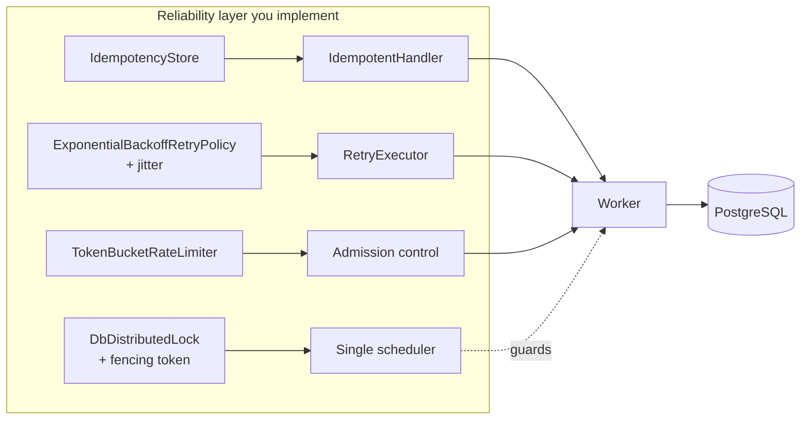
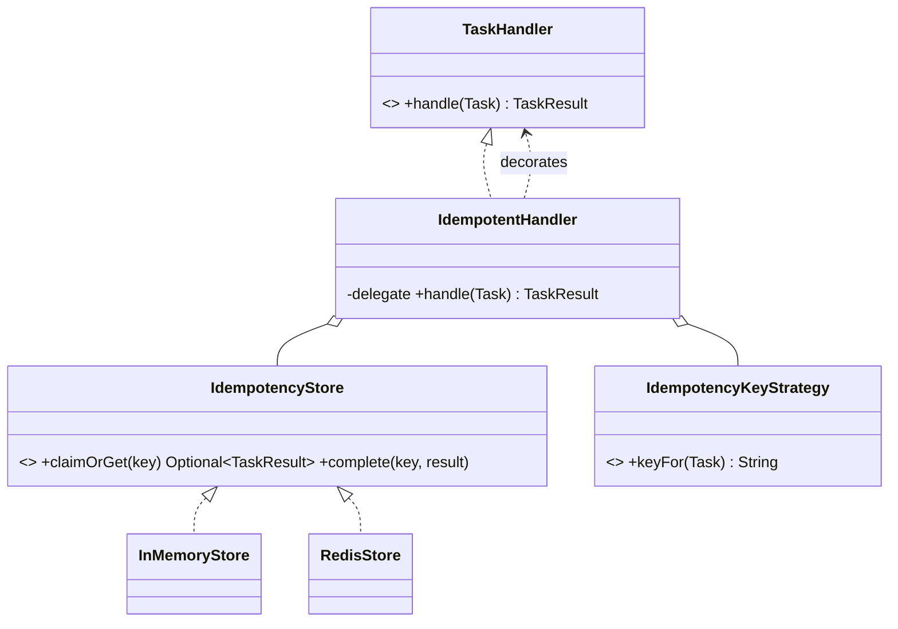
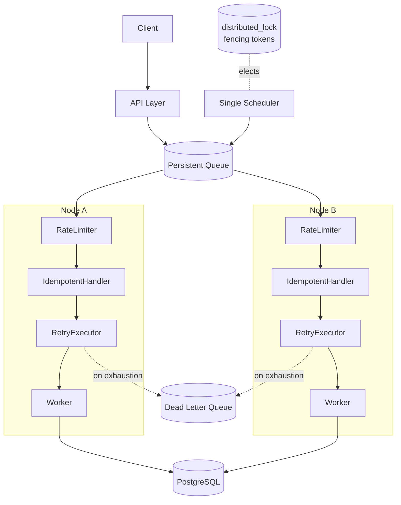

# Distributed Systems: Exercises

> Where this fits: this is the module-wide problem set for the **distributed-systems layer** of the Task Queue platform. Each chapter in `08-distributed-systems/` taught one survival skill for a system that runs on more than one box — CAP and the consistency/availability split, idempotency, retries with backoff, dead-letter queues, rate limiting, backpressure, circuit breakers, sharding, distributed locks, leader election, service discovery, and message ordering. Here you stop reading and start *building* the pieces that keep a multi-node worker fleet correct: an **idempotent handler**, **exponential backoff with jitter**, a **token-bucket rate limiter**, a **database-backed distributed lock with fencing tokens**, and a set of **CAP failure-scenario** reasoning drills. Solutions live in **[./solutions.md](./solutions.md)** — write each one yourself before you peek.

These exercises assume you have read, or can refer back to:

- [./cap-theorem.md](./cap-theorem.md) — the partition tradeoff, why "consistent" and "available" become a choice during a partition.
- [./consistency-and-availability.md](./consistency-and-availability.md) — the spectrum from linearizable to eventual, read-your-writes, tunable quorums.
- [./idempotency.md](./idempotency.md) — idempotency keys, dedup stores, making "effectively-once" out of "at-least-once".
- [./retries.md](./retries.md) — retry budgets, retry storms, backoff, jitter, the retryable/non-retryable split.
- [./dlq.md](./dlq.md) — parking poison tasks, redrive, alerting on the dead-letter rate.
- [./rate-limiting.md](./rate-limiting.md) — token bucket, leaky bucket, fixed/sliding windows, distributed limits.
- [./backpressure.md](./backpressure.md) — bounded buffers, shedding, the difference between flow control and rate limiting.
- [./circuit-breakers.md](./circuit-breakers.md) — closed/open/half-open, failure thresholds, Resilience4j.
- [./sharding.md](./sharding.md) — partitioning work, hash vs range, consistent hashing, hot shards.
- [./distributed-locks.md](./distributed-locks.md) — mutual exclusion across nodes, leases, **fencing tokens**, the Redlock debate.
- [./message-ordering.md](./message-ordering.md) — per-key ordering, ordering vs parallelism, sequence numbers.

It leans heavily on the concurrency module — [../06-concurrency/atomics-and-thread-safety.md](../06-concurrency/atomics-and-thread-safety.md), [../06-concurrency/locks.md](../06-concurrency/locks.md), and [../06-concurrency/blocking-queue.md](../06-concurrency/blocking-queue.md) — and on the queue layer in [../07-queues-and-messaging/dead-letter-queues.md](../07-queues-and-messaging/dead-letter-queues.md). The distributed lock exercises tie directly to Phase 3 and Phase 4 of the project in [../09-project/architecture.md](../09-project/architecture.md).

---

## How to use this file

- Exercises are numbered by **category prefix + sequence**: `K` = Knowledge-Check, `C` = Coding, `R` = Refactoring, `D` = Design, `I` = Interview, `S` = Stretch. The solutions file references these exact IDs (`K3`, `C5`, `D2`, …).
- Each is tagged **Easy / Medium / Hard**. Work top-to-bottom within a category, or jump straight to the skill you want to drill.
- **No solutions here.** They live in [./solutions.md](./solutions.md). The whole point is to write the code yourself first; only then diff against the reference.
- The Coding problems are deliberately cumulative. By the end of Part 2 you will have a coherent, testable slice of the platform's reliability layer: an idempotent execution wrapper, a backoff calculator, a rate limiter, and a fenced lock — all wired to the canonical `Task` model.
- Everything targets **Java 21**. Use records, sealed types, switch pattern matching, virtual threads, and `java.time` where they fit. Tests are JUnit 5 + AssertJ; the DB exercises assume PostgreSQL (Testcontainers later).

### The shared model slice

The canonical domain model is shared across the whole repo. The slice you need for this module:

```java
// The slice of the canonical model used throughout these exercises.
// Do NOT change these signatures unless an exercise explicitly says to.
enum TaskStatus { PENDING, SCHEDULED, RUNNING, SUCCEEDED, FAILED, RETRYING, DEAD }

record Task(String id, String type, String payload, TaskStatus status,
            int attempts, int maxAttempts,
            java.time.Instant createdAt, java.time.Instant scheduledAt, int priority) {

    Task withStatus(TaskStatus s)        { return new Task(id, type, payload, s, attempts, maxAttempts, createdAt, scheduledAt, priority); }
    Task withAttempts(int a)             { return new Task(id, type, payload, status, a, maxAttempts, createdAt, scheduledAt, priority); }
    Task incremented()                   { return withAttempts(attempts + 1); }
}

@FunctionalInterface
interface TaskHandler { TaskResult handle(Task task) throws Exception; }

record TaskResult(boolean success, String message, boolean retryable) {
    static TaskResult ok()                       { return new TaskResult(true,  "ok",  false); }
    static TaskResult retry(String why)          { return new TaskResult(false, why,  true);  }
    static TaskResult fail(String why)           { return new TaskResult(false, why,  false); }
}

interface RetryPolicy { java.util.Optional<java.time.Duration> nextDelay(int attempt); }

interface RateLimiter { boolean tryAcquire(); }

interface DeadLetterQueue { void send(Task t, String reason); }
```

### What you build in the Coding section



Every piece below plugs into the `Worker` / `WorkerPool` from earlier modules. By the end you can run a Phase-3-style demo where multiple worker nodes pull tasks, respect a shared rate limit, retry with backoff, deduplicate, and elect a single scheduler via a fenced lock.

---

## Part 1 — Knowledge-Check (conceptual, short answers)

Answer in two or three sentences. These check that you can *reason* about the failure modes, not just recite definitions.

### K1 (Easy) — at-least-once forces idempotency
Our queue delivers **at-least-once**. Explain in one sentence why that single fact makes idempotency non-optional for any handler that has side effects (charges a card, sends an email, writes a row).

### K2 (Easy) — natural vs synthetic idempotency key
For a `Task` of type `charge-customer`, what would you use as the idempotency key, and why is the random `Task.id` (a fresh UUID per submission) *not* automatically safe as that key when a client retries a submission?

### K3 (Easy) — why jitter
Two sentences: what is a *retry storm* (thundering herd), and how does adding jitter to exponential backoff defuse it?

### K4 (Easy) — token bucket vs leaky bucket
In one or two sentences, contrast a **token bucket** and a **leaky bucket**: which one allows short bursts above the steady rate, and which one strictly smooths output?

### K5 (Medium) — retryable vs non-retryable
`TaskResult` carries a `retryable` flag. Give one concrete failure that should set `retryable=true` and one that should set `retryable=false`, and explain why retrying the second is actively harmful.

### K6 (Medium) — the lease/lock expiry hazard
A worker acquires a 30-second distributed lock, then a GC pause (or a slow disk write) freezes it for 40 seconds. Describe exactly what can now go wrong, and name the mechanism that prevents the resulting corruption.

### K7 (Medium) — what a fencing token actually does
Explain how a monotonically increasing fencing token lets a *downstream resource* (the database) reject a write from a stale lock holder, even though that holder genuinely believes it still owns the lock. Why must the check live at the resource, not in the lock client?

### K8 (Medium) — CAP is about partitions only
A teammate says "we picked CP, so our system is always consistent and never available." Correct them: when does the C-vs-A choice actually bite, and what does the system do when there is *no* partition?

### K9 (Medium) — rate limit vs backpressure
Both reject or delay work. In two sentences, distinguish a **rate limiter** (protecting a *downstream* dependency) from **backpressure** (protecting *yourself* from an overfull queue). See [./backpressure.md](./backpressure.md) if you need to refresh.

### K10 (Hard) — idempotency window
Your dedup store keeps idempotency keys for 24 hours, then evicts them. Describe the exact sequence of events under which a duplicate slips through *after* eviction, and how you would size the window relative to your max retry horizon.

### K11 (Hard) — quorum math
You run a replicated metadata store with `N=5` replicas. You want reads to always see the latest acknowledged write. Give a `(W, R)` pair that guarantees this, show the inequality it satisfies, and state how many node failures the write path can tolerate.

### K12 (Hard) — clocks and Redlock
Why is a distributed lock built purely on wall-clock TTLs (and nothing else) unsafe in the presence of clock skew and process pauses, and what single addition makes the *protected operation* safe regardless of how badly the lock itself misbehaves? (This is the crux of the Redlock debate — see [./distributed-locks.md](./distributed-locks.md).)

---

## Part 2 — Coding exercises (build the reliability layer)

Each exercise lists the **signature you must implement** and the **tests it must pass** (described, not given — write the JUnit yourself). Keep everything in package `com.taskqueue.reliability`.

### C1 (Easy) — `IdempotencyStore` port + in-memory implementation
Define the port and a thread-safe in-memory implementation backed by a `ConcurrentHashMap`.

```java
/** Records the outcome of a logical operation so a replay can be detected and short-circuited. */
interface IdempotencyStore {
    /**
     * Atomically claim the key for first-time processing.
     * @return Optional.empty() if this caller won the claim (must execute);
     *         Optional.of(prior) if the key was already processed (return prior result, do NOT execute).
     */
    java.util.Optional<TaskResult> claimOrGet(String key);

    /** Record the final result for a key after the side effect succeeded. */
    void complete(String key, TaskResult result);
}
```

Requirements:
- `claimOrGet` must be atomic: under concurrent calls with the same key, **exactly one** caller receives `Optional.empty()`.
- Use a sentinel "in-progress" marker so a second caller arriving *before* `complete` is told to wait/retry rather than executing. (Model the in-progress state explicitly; do not let two callers both think they won.)
- Tests: single key claimed once across 100 virtual threads; `complete` then `claimOrGet` returns the stored result; two different keys are independent.

### C2 (Medium) — `IdempotentHandler` decorator
Wrap any `TaskHandler` so that re-delivering the same logical task does not re-run the side effect. Use the **Decorator** pattern (see [../05-design-patterns/decorator.md](../05-design-patterns/decorator.md)).

```java
final class IdempotentHandler implements TaskHandler {
    private final TaskHandler delegate;
    private final IdempotencyStore store;
    private final java.util.function.Function<Task, String> keyFn;  // derive the idempotency key

    IdempotentHandler(TaskHandler delegate, IdempotencyStore store,
                      java.util.function.Function<Task, String> keyFn) { /* ... */ }

    @Override public TaskResult handle(Task task) throws Exception { /* ... */ }
}
```

Requirements:
- On first delivery: claim, run `delegate.handle`, `complete` with the result, return it.
- On replay (key already complete): return the stored result **without** calling `delegate`.
- If `delegate` throws, you must **not** mark the key complete (a transient failure should still be retryable). Decide and document what `claimOrGet` should do for the *next* attempt — releasing the in-progress claim on failure is the simplest correct choice.
- Choose `keyFn` so two submissions of the *same logical task* collide but two *genuinely different* tasks do not. Default it to `t -> t.type() + ":" + t.id()` and explain in a comment why a caller-supplied business key is better.
- Tests: a counting handler is invoked exactly once across 3 deliveries of the same task; a delegate exception leaves the key unclaimed so a later delivery re-executes.

### C3 (Medium) — `ExponentialBackoffRetryPolicy` with full jitter
Implement `RetryPolicy` with exponential backoff, a cap, a max-attempt limit, and **full jitter** (AWS-style).

```java
final class ExponentialBackoffRetryPolicy implements RetryPolicy {
    private final java.time.Duration base;   // e.g. 100ms
    private final java.time.Duration cap;     // e.g. 30s
    private final int maxAttempts;            // beyond this -> Optional.empty()
    private final double multiplier;          // e.g. 2.0
    private final java.util.random.RandomGenerator rng;

    @Override public java.util.Optional<java.time.Duration> nextDelay(int attempt) { /* ... */ }
}
```

Requirements:
- For `attempt` (1-based), the *uncapped* delay is `base * multiplier^(attempt-1)`, capped at `cap`.
- **Full jitter:** return a uniformly random duration in `[0, cappedDelay]`. (Also implement `FixedDelayRetryPolicy` for comparison and a knowledge note on *equal jitter* vs *full jitter*.)
- Return `Optional.empty()` once `attempt > maxAttempts` — this is the signal to dead-letter.
- No overflow: clamp the exponentiation before it overflows `long` nanos (multiplying durations grows fast; guard it).
- Tests: delays never exceed `cap`; with a seeded RNG, output is deterministic and within `[0, expectedCap]`; `attempt = maxAttempts + 1` yields empty; monotonic *upper bound* growth until the cap.

### C4 (Medium) — `RetryExecutor` that ties backoff to the task lifecycle
Drive a single task through attempts using the policy, sleeping (use a `ScheduledExecutorService` or virtual-thread `sleep`) between tries, and transitioning `TaskStatus` correctly.

```java
final class RetryExecutor {
    RetryExecutor(RetryPolicy policy, DeadLetterQueue dlq) { /* ... */ }

    /** Runs the handler with retries. Returns the terminal Task (SUCCEEDED or DEAD). */
    Task runToCompletion(Task task, TaskHandler handler) throws InterruptedException { /* ... */ }
}
```

Requirements:
- Success -> `SUCCEEDED`, return immediately.
- A `retryable` failure (or thrown exception) -> increment `attempts`, set `RETRYING`, ask the policy for `nextDelay(attempts)`. If present, sleep then loop; if empty, dead-letter and set `DEAD`.
- A non-retryable failure (`TaskResult.fail`) -> dead-letter immediately, set `DEAD`, **no** more attempts.
- Respect `task.maxAttempts()` as a hard ceiling independent of the policy.
- Tests: a handler that fails twice then succeeds ends `SUCCEEDED` with `attempts == 3`; an always-failing retryable handler ends `DEAD` and calls `dlq.send` exactly once; a non-retryable failure dead-letters on attempt 1.

### C5 (Hard) — `TokenBucketRateLimiter`
Build a lock-free-ish token bucket that refills continuously based on elapsed time. This is the canonical `RateLimiter` from the spec.

```java
final class TokenBucketRateLimiter implements RateLimiter {
    /**
     * @param ratePerSecond steady-state permits per second (refill rate)
     * @param burst         bucket capacity (max tokens that can accumulate)
     * @param clock         injected for testability (Instant supplier / nanoTime)
     */
    TokenBucketRateLimiter(double ratePerSecond, long burst, java.time.Clock clock) { /* ... */ }

    @Override public boolean tryAcquire() { /* acquire 1 permit, non-blocking */ }
    boolean tryAcquire(int permits)       { /* acquire N, all-or-nothing */ }
}
```

Requirements:
- Refill is **lazy/continuous**: on each call, compute tokens earned since the last refill from elapsed time, add (clamped to `burst`), then try to deduct.
- Thread-safe under concurrent `tryAcquire` from many workers. Prefer a single `synchronized` block or a CAS loop over `AtomicLong` token state; justify your choice in a comment. (See [../06-concurrency/atomics-and-thread-safety.md](../06-concurrency/atomics-and-thread-safety.md).)
- Inject a `Clock` (or a `LongSupplier` over `nanoTime`) so tests can advance time deterministically without sleeping.
- Tests: a fresh bucket of burst 10 grants exactly 10 then denies the 11th within the same instant; after advancing the clock by `1s` at rate 5, exactly 5 more are granted; `tryAcquire(int)` is all-or-nothing; 1000 concurrent acquires never over-grant (the count granted must equal what the bucket could afford).

### C6 (Hard) — `DbDistributedLock` with fencing tokens
Implement a Postgres-backed distributed lock with a TTL lease **and a monotonically increasing fencing token**. This is the centerpiece of the module.

Schema:

```sql
CREATE TABLE distributed_lock (
    lock_name     TEXT PRIMARY KEY,
    owner         TEXT        NOT NULL,   -- node/instance id
    fencing_token BIGINT      NOT NULL,   -- monotonic, increments on every successful acquire
    acquired_at   TIMESTAMPTZ NOT NULL,
    expires_at    TIMESTAMPTZ NOT NULL
);
```

Java port:

```java
interface DistributedLock {
    /** @return a Lease if acquired (now or by taking over an expired lease), else empty. */
    java.util.Optional<Lease> tryAcquire(String lockName, String owner, java.time.Duration ttl);
    boolean renew(Lease lease, java.time.Duration ttl);   // extend if still owner & not expired
    void release(Lease lease);                            // best-effort; safe if already lost
}

record Lease(String lockName, String owner, long fencingToken, java.time.Instant expiresAt) {}
```

Requirements:
- `tryAcquire` succeeds if the row does not exist, **or** the existing lease is expired (`expires_at < now()`). On a successful steal/acquire it **increments `fencing_token`** and stamps the new owner. Do this in a *single* atomic SQL statement (an `INSERT ... ON CONFLICT ... DO UPDATE ... WHERE expires_at < now()` with `RETURNING fencing_token`, or an equivalent `UPDATE ... WHERE`). Two nodes racing must not both win.
- `renew` only extends if `owner` and `fencing_token` still match and the lease has not already expired; it does **not** bump the token.
- The fencing token must be **strictly increasing** across all acquisitions of a given `lock_name`, even after takeovers. Prove it with a test: acquire, let it expire, acquire from a second owner — the second token is greater.
- Write the *protected resource* contract: any guarded write must carry the fencing token, and the resource must reject a token `<=` the highest it has already accepted. Implement a tiny `FencedResource` (an in-memory cell with a `write(value, token)` that throws on stale tokens) and a test proving a paused old holder's late write is rejected.
- Tests (use Testcontainers Postgres): exclusive acquisition under contention (only one of N concurrent `tryAcquire` wins); expired lease is stealable; renew by a non-owner fails; stale fenced write is rejected.

### C7 (Hard) — `SingleSchedulerGuard`: put it together
Use `DbDistributedLock` to ensure **exactly one** node in the fleet runs the scheduler loop (`pollDue` + enqueue) at a time, with automatic failover. This is the Phase-4 use case.

```java
final class SingleSchedulerGuard implements AutoCloseable {
    SingleSchedulerGuard(DistributedLock lock, String lockName, String nodeId,
                         java.time.Duration ttl, java.time.Duration renewEvery) { /* ... */ }

    /** Run `work` only while we hold the lease; renew in the background; yield on loss. */
    void runWhileLeader(java.util.function.LongConsumer work);  // work receives the current fencing token
    @Override public void close();
}
```

Requirements:
- Acquire on start; if acquisition fails, *do not* run `work` (stay a standby).
- A background renewer (virtual thread) renews every `renewEvery`. If a renew fails, immediately stop running `work` and drop to standby — do **not** keep scheduling.
- Hand the current fencing token to `work` so every enqueue/claim it performs can be fenced.
- Test the failover narrative: node A leads; kill A's renewer; after `ttl`, node B acquires with a higher token and takes over; A's late `work` (if any) is fenced out.

---

## Part 3 — Refactoring exercises (fix broken reliability code)

Each comes with deliberately broken code. Diagnose the distributed-systems bug, then rewrite it. State the failure scenario in one line before you fix.

### R1 (Easy) — check-then-act idempotency race
```java
// BROKEN: two concurrent deliveries both see "not seen yet" and both charge the card.
boolean alreadyDone = store.contains(key);   // read
if (!alreadyDone) {
    chargeCard(task);                        // side effect
    store.add(key);                          // write
}
```
Identify the TOCTOU race. Refactor to an **atomic claim** (the `claimOrGet` shape from C1) so the side effect runs at most once across threads and across nodes.

### R2 (Easy) — backoff with no jitter and no cap
```java
// BROKEN: synchronized lockstep retries -> thundering herd; unbounded delay -> 17-minute waits.
long delayMs = 100L * (1L << attempt);   // 100, 200, 400, ... no cap, no jitter
Thread.sleep(delayMs);
```
What happens when 5,000 workers all hit attempt 6 at the same wall-clock second after a downstream blip? Refactor to capped exponential backoff with full jitter (reuse C3).

### R3 (Medium) — fixed-window limiter that allows 2× bursts
```java
// BROKEN: a "100 req/min" fixed window lets 100 through at 00:59 and 100 more at 01:00.
class FixedWindowLimiter {
    int count; long windowStart;
    synchronized boolean tryAcquire(int limit, long windowMs) {
        long now = System.currentTimeMillis();
        if (now - windowStart >= windowMs) { windowStart = now; count = 0; }
        return count++ < limit;
    }
}
```
Explain the **boundary burst** (up to 2× the limit across a window edge). Refactor to a token bucket (C5) or a sliding-window-log/counter, and argue which you'd ship and why.

### R4 (Medium) — lock with TTL but no fencing
```java
// BROKEN: trusts the lock blindly; a paused holder corrupts the resource after takeover.
if (lock.tryAcquire("scheduler", node, Duration.ofSeconds(30)).isPresent()) {
    // ... 40-second GC pause happens here; lease expires; node B takes over ...
    db.write(result);   // stale write lands AFTER node B already moved on
}
```
Walk the exact timeline that corrupts data. Refactor so the write carries a fencing token and the resource rejects stale tokens (reuse C6's `FencedResource`).

### R5 (Medium) — retry on a non-retryable error
```java
// BROKEN: retries a validation failure 5 times with backoff -> wasted budget, delayed DLQ.
for (int i = 0; i < 5; i++) {
    try { return handler.handle(task); }
    catch (Exception e) { Thread.sleep(backoff(i)); }   // catches EVERYTHING
}
```
This retries `IllegalArgumentException` (bad payload) the same as a `SocketTimeoutException`. Refactor to honor `TaskResult.retryable` and to classify exceptions (a non-retryable set vs everything else), dead-lettering non-retryable failures on attempt 1.

### R6 (Hard) — "exactly-once" that is really at-most-once
```java
// BROKEN: marks the key done BEFORE the side effect. A crash between the two loses the work silently.
store.complete(key, TaskResult.ok());   // claim as done
sendEmail(task);                        // crash here -> email never sent, but replay is suppressed
```
This converts a duplicate-suppression mechanism into a *work-loss* mechanism. Refactor to the correct ordering (claim in-progress -> side effect -> complete) and discuss why true exactly-once needs the side effect and the dedup record to commit in the **same transaction** (or the side effect to itself be idempotent). Cross-reference [./idempotency.md](./idempotency.md).

---

## Part 4 — Design exercises (object modeling & tradeoffs)

Produce a short design doc: a Mermaid diagram, the interfaces, the key tradeoff, and one paragraph defending your choice. No full implementation required (unless noted).

### D1 (Easy) — model the lock lease lifecycle as a state machine
Draw a `stateDiagram-v2` for a single node's view of the lease: `STANDBY -> ACQUIRING -> LEADER -> (renew loop) -> LOST -> STANDBY`, plus the `release` path. Mark which transitions bump the fencing token and which do not. Identify the one transition where "I think I'm leader but I'm not" can occur, and how fencing makes it harmless.

### D2 (Medium) — design the idempotency layer's ports
Design the ports so the dedup store can be swapped (in-memory for tests, Redis for prod, Postgres for strong consistency) without touching the handler. Specify: the `IdempotencyStore` interface, the key-derivation strategy (interface, not a lambda buried in code), the TTL/eviction policy, and how `IdempotentHandler` composes with `RetryExecutor` and `RateLimiter` in the `Worker`. Give the `classDiagram`.


Extend this diagram with your own additions and write the interfaces. Defend in-memory-vs-Redis-vs-Postgres for the dedup store under our at-least-once delivery.

### D3 (Medium) — choose the consistency model for two data classes
Our platform has two stores: (a) **task state** (status transitions, attempts) and (b) **metrics counters** (tasks processed per minute). For each, pick a point on the consistency spectrum (linearizable / read-your-writes / eventual) and justify it against availability under a partition. Reference [./consistency-and-availability.md](./consistency-and-availability.md). Present as a two-row table with columns: store, chosen model, what we sacrifice, why it's acceptable.

### D4 (Hard) — distributed lock: DB vs Redis vs ZooKeeper/etcd
Design the lock abstraction so the backend is pluggable behind the `DistributedLock` port, then compare three implementations (Postgres row-lock/lease, Redis SET NX PX / Redlock, ZooKeeper/etcd ephemeral node) across: correctness under partition, latency, operational cost, and whether fencing tokens are natural. Recommend one for **our** scheduler-election use case and one you would *not* use, with reasons. Cross-reference [./distributed-locks.md](./distributed-locks.md).

### D5 (Hard) — CAP failure-scenario catalog
This is the reasoning centerpiece. For our **Phase-4** topology (API layer → persistent queue → distributed workers → event bus → Postgres, replicated), enumerate **four** concrete partition/failure scenarios and decide, for each, whether the affected component should behave as **CP** (refuse, stay correct) or **AP** (serve, reconcile later). For each scenario state: what partitions from what, the CP behavior, the AP behavior, your choice, and the user-visible consequence. Suggested scenarios — extend with your own:

1. Worker node can't reach the **dedup store** mid-task (can't check idempotency).
2. The **scheduler-election lock** backend (Postgres) is unreachable from the current leader.
3. A client `POST /tasks` arrives while the API can't reach the **persistent queue**.
4. Two workers, on opposite sides of a partition, both believe they hold the **per-key ordering lease** for the same key.

Render the topology and one partition cut as a Mermaid graph, then the four-scenario table.

### D6 (Medium) — rate limiter placement
Where does the `TokenBucketRateLimiter` live: per-worker (local), per-node, or **global** (shared in Redis)? Model all three, and explain why N nodes each with a local "100/s" limiter does *not* give you a global 100/s. Sketch the Redis token-bucket (Lua script for atomic refill+deduct) at a high level and state its failure mode if Redis is down (fail-open vs fail-closed — pick one and defend it). See [./rate-limiting.md](./rate-limiting.md).

---

## Part 5 — Interview exercises (whiteboard / discussion style)

Practice saying these out loud in 3–5 minutes each. Aim for: restate the problem, name the tradeoff, sketch the design, then stress-test it with a failure.

### I1 (Easy) — "Make this handler idempotent."
Given a handler that sends a confirmation email, walk the interviewer from at-least-once delivery to an idempotent design. Name the key, the store, the ordering of side effect vs record, and what happens on a crash between them.

### I2 (Medium) — "Design exponential backoff with jitter, and tell me why jitter matters."
Whiteboard `nextDelay(attempt)`, draw the thundering-herd graph with and without jitter, and explain full vs equal jitter. State how a retry budget bounds the blast radius.

### I3 (Medium) — "Build a token-bucket rate limiter."
Derive the lazy-refill formula on the board (`tokens += elapsed * rate`, clamp to burst). Discuss thread safety, the `Clock` injection for testing, and burst vs steady-state. Then extend to a *distributed* limiter and name the atomicity problem.

### I4 (Hard) — "Why isn't a Redis lock with a TTL safe, and how do you fix it?"
This is the Redlock conversation. Explain the GC-pause/clock-skew failure, why TTLs alone can't save you, and how a fencing token moves the safety check to the resource. End with: "a lock for *efficiency* (avoid duplicate work) tolerates the bug; a lock for *correctness* (never double-write) requires fencing."

### I5 (Hard) — "Walk me through a CAP tradeoff you actually made."
Use D5's scenarios. Pick the scheduler-election case: when Postgres is partitioned from the leader, do you keep scheduling (AP, risk split-brain double-enqueue) or stop (CP, tasks pile up until failover)? Defend the choice, then show how idempotent enqueue + fencing makes even a brief split-brain non-corrupting.

### I6 (Hard) — "We're seeing duplicate side effects in production. Debug it."
Drive the diagnosis: at-least-once is expected → is the handler idempotent? → is the idempotency key stable across retries? → is the dedup window longer than the retry horizon? → is `complete` committed in the same transaction as the side effect? Name the instrumentation (duplicate-suppression counter, key-collision rate) you'd add.

---

## Part 6 — Stretch challenges (extended, multi-concept)

Bigger builds. Each combines several chapters and is worth a weekend.

### S1 (Hard) — Distributed leasing queue with fenced claims (`SKIP LOCKED` + fencing)
Build a Postgres-backed `TaskQueue.dequeue()` that uses `SELECT ... FOR UPDATE SKIP LOCKED` to claim a task, stamps a fencing token and a `claimed_by` / `claim_expires_at`, and lets a reaper reclaim expired claims. Prove that a paused worker's late completion is fenced out by a newer claimant. Ties together [./distributed-locks.md](./distributed-locks.md), [./idempotency.md](./idempotency.md), and the leasing pattern from [../07-queues-and-messaging/dead-letter-queues.md](../07-queues-and-messaging/dead-letter-queues.md).

### S2 (Hard) — Global distributed rate limiter in Redis
Implement the token bucket as a single atomic Redis **Lua script** (read tokens + last-refill, compute refill, deduct, write back, all atomically). Wire `TokenBucketRateLimiter` to delegate to Redis when configured, falling back to the local limiter if Redis is unreachable. Load-test that N nodes share one global rate. Decide and document fail-open vs fail-closed on Redis outage.

### S3 (Hard) — Circuit breaker around a flaky dependency
Wrap a `TaskHandler` whose side effect calls an unreliable external service in a circuit breaker (closed/open/half-open). When open, fail fast and let `RetryExecutor` back off instead of hammering the dependency. Implement it yourself first, then swap in **Resilience4j** and compare. Show how breaker + backoff + DLQ compose. See [./circuit-breakers.md](./circuit-breakers.md).

### S4 (Hard) — Full reliability pipeline + chaos test
Compose **everything**: `Worker` = rate-limit admission → idempotent handler → retry executor with backoff → DLQ on exhaustion, all running on virtual threads across 3 simulated nodes electing one scheduler via the fenced DB lock. Then write a chaos harness that randomly (a) pauses a worker past its lease, (b) kills the leader, (c) drops the rate-limiter backend, and assert the invariants: **no task executes more than once observably**, **no task is lost**, **the global rate is respected**, **exactly one scheduler runs at a time**.

### S5 (Medium) — Idempotency window vs retry horizon, measured
Instrument the dedup store with a Micrometer counter for suppressed duplicates and a gauge for stored keys. Run a workload where retries can span longer than the dedup TTL, and *measure* a duplicate slipping through. Then fix it by sizing the window to `>= maxAttempts * maxBackoff + slack` and re-measure. Deliver a short write-up with the before/after numbers.

---

## Self-check rubric

Before opening [./solutions.md](./solutions.md), score yourself. You are "done" with a problem when:

| Dimension | What "good" looks like |
|---|---|
| Correctness under concurrency | Idempotent claim and rate-limit deduction are atomic; no over-grant, no double-execute, proven by a multi-thread test. |
| Correctness under partition/pause | The fenced lock makes a stale holder's write harmless; you can name the exact timeline it defends. |
| Backoff hygiene | Capped, jittered, attempt-limited; no overflow; non-retryable failures skip retries entirely. |
| Testability | Clocks and RNGs are injected; tests advance time instead of sleeping; DB tests use Testcontainers. |
| Lifecycle correctness | `TaskStatus` transitions match the spec (`RETRYING`, `DEAD`, `SUCCEEDED`); DLQ called exactly once on exhaustion. |
| Tradeoff articulation | You can state, in one sentence each, the CAP choice, the fail-open/closed choice, and the dedup-window sizing. |

If you cannot tick a row, that is the exercise to redo — not the one to skip.

---

## What We Can Improve In Our Project Using This Concept

These exercises *are* the gap list between a single-node Phase-1 toy and a fleet-ready Phase-3/4 platform. Concretely, finishing this set lets us:

- Replace the naive "run the handler" worker with a **rate-limit → idempotent → retry-with-backoff → DLQ** pipeline, so at-least-once delivery stops causing duplicate side effects and downstream overload.
- Run **multiple worker nodes** safely: a DB-backed fenced lock elects a single scheduler, so we don't double-enqueue due tasks during failover.
- Give every guarded write a **fencing token**, so a paused or partitioned node can never corrupt task state after a takeover.
- Make every reliability component **time-injectable and broker-pluggable**, so the same code runs in unit tests, against Testcontainers Postgres, and against prod Redis.

## Project Refactoring Task

Wire the Part-2 components into the `Worker` execution path. The target shape:

```java
TaskResult outcome;
if (!admissionLimiter.tryAcquire()) {
    requeueWithBackpressure(task);            // shed/delay, don't drop — see backpressure.md
} else {
    var fenced = idempotentHandler;           // decorates the real handler
    outcome = retryExecutor.runToCompletion(task, fenced);  // backoff + DLQ on exhaustion
    metrics.record(task.type(), outcome);
}
```

And gate the scheduler loop behind `SingleSchedulerGuard.runWhileLeader(token -> pollDueAndEnqueue(token))` so only the lease holder schedules, passing the fencing token into every enqueue.

## Git Commit For This Chapter

```text
feat(reliability): add idempotent handler, jittered backoff, token bucket, and fenced DB lock

- IdempotencyStore (in-memory) + IdempotentHandler decorator (effectively-once over at-least-once)
- ExponentialBackoffRetryPolicy with full jitter, cap, and attempt limit; RetryExecutor wires it to TaskStatus + DLQ
- TokenBucketRateLimiter with injectable Clock and continuous lazy refill
- DbDistributedLock with TTL leases + monotonic fencing tokens; FencedResource rejects stale writes
- SingleSchedulerGuard elects one scheduler node with automatic failover

Files:
  08-distributed-systems/exercises.md
  src/main/java/com/taskqueue/reliability/IdempotencyStore.java
  src/main/java/com/taskqueue/reliability/IdempotentHandler.java
  src/main/java/com/taskqueue/reliability/ExponentialBackoffRetryPolicy.java
  src/main/java/com/taskqueue/reliability/RetryExecutor.java
  src/main/java/com/taskqueue/reliability/TokenBucketRateLimiter.java
  src/main/java/com/taskqueue/reliability/DbDistributedLock.java
  src/main/java/com/taskqueue/reliability/SingleSchedulerGuard.java
  src/main/resources/db/migration/V5__distributed_lock.sql
  src/test/java/com/taskqueue/reliability/*Test.java
```

## Architecture Impact



This module's components turn the worker from a single-threaded executor into a **horizontally scalable, partition-aware** processing tier: rate limiting protects downstreams, idempotency neutralizes at-least-once duplicates, fencing tokens make leader failover non-corrupting, and the DLQ + backoff bound the blast radius of poison and transient failures.

## Interview Takeaways

- **At-least-once delivery makes idempotency mandatory** for any side-effecting handler — the key must be stable across retries, and the dedup record should commit with the side effect.
- **Backoff without jitter just resynchronizes the herd.** Cap it, jitter it (full or equal), bound it with attempts, and split retryable from non-retryable failures.
- **Token bucket = bursts allowed up to capacity, smoothed to a steady rate**, with lazy time-based refill; inject the clock to test it without sleeping.
- **A TTL lock is not safe by itself.** Process pauses and clock skew defeat it; a **fencing token checked at the resource** is what makes the protected operation correct — that is the whole point of the Redlock debate.
- **CAP is a per-partition, per-component choice**, not a global label. Be able to walk a concrete partition scenario and say what each component does (refuse vs serve-and-reconcile) and why.
