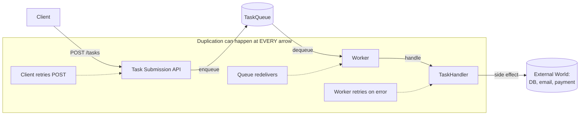
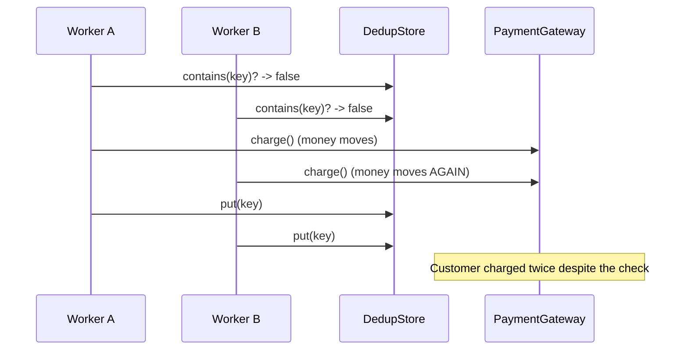
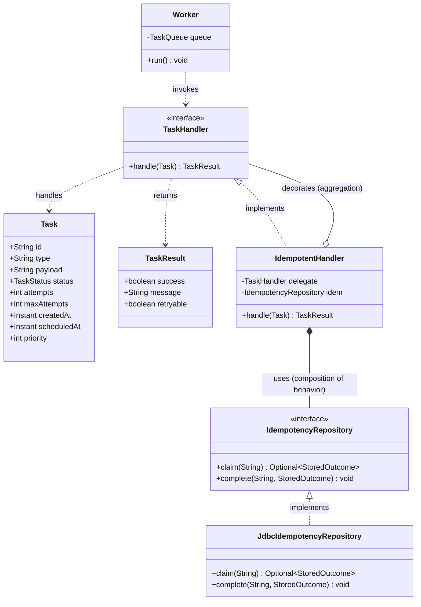

# Idempotency

> Where this fits: in our Distributed Task Queue, every delivery path — the submission API, the queue, and the worker pool — can deliver the *same task more than once*. Idempotency is the single discipline that lets us absorb those duplicates without double-charging a customer, double-sending an email, or corrupting state. If you internalize one distributed-systems concept for this project, make it this one.

---

## 1. Why this exists

A function is **idempotent** if applying it once produces the same observable state as applying it many times. In math: `f(f(x)) == f(x)`. In systems: replaying the same operation must not change the world a second time.

This sounds academic until you accept a brutal fact about distributed systems:

> **Exactly-once *delivery* is impossible.** Exactly-once *effect* is achievable — but only by making handlers idempotent.

Why is delivery impossible to make exactly-once? Consider a worker that pulls a task, runs it, and must then tell the queue "I'm done so you can delete it." Two things can fail:

1. The worker **crashes after processing but before acknowledging.** The queue never hears "done," its visibility timeout expires, and it redelivers the task to another worker. The side effect runs **twice**.
2. The worker **acknowledges first, then processes.** If it crashes after the ack but before processing, the task is gone forever. The side effect runs **zero times**.

You must pick a failure mode. Every serious queue (SQS, Kafka, RabbitMQ, our own `InMemoryTaskQueue` once it gains acks) chooses option 1: **at-least-once delivery**. Better to do something twice than to silently drop it. That choice pushes the deduplication responsibility *onto the consumer*. The consumer — our `TaskHandler` — must be idempotent.

Historical note: the term comes from abstract algebra (an idempotent element satisfies `x·x = x`). HTTP formalized it in RFC 7231: `GET`, `PUT`, and `DELETE` are defined as idempotent, `POST` is not. The same RFC distinguishes idempotency from *safety* (no side effects at all). A `DELETE` is idempotent but not safe — it changes state, just not on the second call. Stripe popularized the modern API pattern of client-supplied **idempotency keys** around 2016, and it is now table stakes for any payments-grade API.



Notice that duplicates can be injected at *three independent layers*: the client retrying the HTTP call, the queue redelivering after a missed ack, and our own [retry logic](./retries.md) re-running a transiently failed task. Idempotency is the only defense that works regardless of *which* layer duplicated the work.

---

## 2. The naive version

Here is a `TaskHandler` for charging a customer. It is the version everyone writes first.

```java
// NAIVE: not idempotent. A redelivery charges the customer twice.
public final class ChargeCustomerHandler implements TaskHandler {

    private final PaymentGateway gateway;
    private final LedgerRepository ledger;

    public ChargeCustomerHandler(PaymentGateway gateway, LedgerRepository ledger) {
        this.gateway = gateway;
        this.ledger = ledger;
    }

    @Override
    public TaskResult handle(Task task) throws Exception {
        var cmd = ChargeCommand.fromJson(task.payload());   // {customerId, amountCents}
        var receipt = gateway.charge(cmd.customerId(), cmd.amountCents()); // <-- money moves
        ledger.append(receipt);                                            // <-- state changes
        return new TaskResult(true, "charged " + receipt.id(), false);
    }
}
```

What's wrong:

- If the worker crashes *after* `gateway.charge(...)` returns but *before* the queue records the ack, the task is redelivered and the customer is charged **again**.
- If our retry policy re-runs the task because `ledger.append` threw a transient DB error, the customer is **charged again** even though the payment already succeeded.
- There is no record that "this task already produced its effect," so the handler cannot tell a first attempt from a replay.

This code is correct in the happy path and catastrophic under the failure modes that *define* distributed systems. It will pass every unit test and lose you a customer in production.

---

## 3. Improved version

The first real improvement: introduce an **idempotency key** and a **dedup table**. Before doing the work, check whether we have already done it for this key. The key must be **deterministic** for a given logical operation — the same `Task` retried must produce the same key.

For our model the natural key is the `Task.id` (a UUID assigned once at submission and stable across every redelivery). Sometimes you want a *business* key instead — e.g. `"charge:" + orderId` so that two different tasks for the same order also dedupe. We will support both.

```java
// IMPROVED: check-then-act against a dedup table.
public final class ChargeCustomerHandler implements TaskHandler {

    private final PaymentGateway gateway;
    private final LedgerRepository ledger;
    private final DedupStore dedup;

    public ChargeCustomerHandler(PaymentGateway gateway, LedgerRepository ledger, DedupStore dedup) {
        this.gateway = gateway;
        this.ledger = ledger;
        this.dedup = dedup;
    }

    @Override
    public TaskResult handle(Task task) {
        String key = idempotencyKey(task);

        if (dedup.contains(key)) {                      // (1) already done?
            return new TaskResult(true, "duplicate ignored: " + key, false);
        }

        var cmd = ChargeCommand.fromJson(task.payload());
        var receipt = gateway.charge(cmd.customerId(), cmd.amountCents());
        ledger.append(receipt);

        dedup.put(key);                                  // (2) remember we did it
        return new TaskResult(true, "charged " + receipt.id(), false);
    }

    private String idempotencyKey(Task task) {
        return "charge:" + task.id();
    }
}
```

This is better — and still broken. The bug is the **time-of-check / time-of-use (TOCTOU) race** between lines (1) and (2):



Two workers (or two redeliveries handled concurrently) both read "not present," both charge, both write. The dedup table did nothing because the check and the act were not atomic. We need the *claim* of the key and the *effect* to be linked so that only one attempt can win.

---

## 4. Production-quality version

A staff engineer ships idempotency with three properties:

1. **Atomic claim.** Use a unique constraint / conditional insert so that exactly one attempt claims the key. Losers detect the conflict and short-circuit. There is no check-then-act window.
2. **Effect and claim in one transaction (where the effect is a DB write).** This gives **exactly-once effect** for the database: either both the business write *and* the dedup row commit, or neither does. This is the heart of "exactly-once is achievable for idempotent writes."
3. **Cached response for non-DB effects.** When the effect is external (a payment, an email), you cannot transactionally bind it to your DB. Instead you record the *outcome* under the key so a replay returns the stored result instead of re-doing the external call. For the external call itself you forward the key to the provider (Stripe's `Idempotency-Key` header), making *them* dedupe.

Here is the production handler. The dedup row and the ledger write commit together; the external charge is made idempotent by forwarding the key.

```java
// PRODUCTION: atomic claim + transactional effect + provider-forwarded key.
public final class ChargeCustomerHandler implements TaskHandler {

    private final PaymentGateway gateway;
    private final TransactionTemplate tx;     // Spring: runs the body in a single DB transaction
    private final IdempotencyRepository idem;
    private final LedgerRepository ledger;

    public ChargeCustomerHandler(PaymentGateway gateway, TransactionTemplate tx,
                                 IdempotencyRepository idem, LedgerRepository ledger) {
        this.gateway = gateway;
        this.tx = tx;
        this.idem = idem;
        this.ledger = ledger;
    }

    @Override
    public TaskResult handle(Task task) {
        String key = "charge:" + task.id();
        var cmd = ChargeCommand.fromJson(task.payload());

        // (1) Atomic claim. Returns the prior outcome if the key already exists.
        Optional<StoredOutcome> prior = idem.claim(key);
        if (prior.isPresent()) {
            StoredOutcome o = prior.get();
            // Replay returns the original result. retryable=false: never re-run.
            return new TaskResult(o.success(), "replayed: " + o.message(), false);
        }

        // (2) External effect, made idempotent by forwarding the key to the provider.
        Receipt receipt = gateway.charge(cmd.customerId(), cmd.amountCents(), /* idempotencyKey */ key);

        // (3) Effect-of-record + finalize the claim, atomically.
        tx.executeWithoutResult(status -> {
            ledger.append(receipt);
            idem.complete(key, new StoredOutcome(true, receipt.id()));
        });

        return new TaskResult(true, "charged " + receipt.id(), false);
    }
}
```

The `claim` method is where the atomicity lives. In Postgres:

```sql
-- A pending row is inserted; if the key already exists, no row is inserted.
INSERT INTO idempotency_keys (key, status, created_at)
VALUES (:key, 'PENDING', now())
ON CONFLICT (key) DO NOTHING
RETURNING key;
-- 0 rows returned  -> key already claimed by someone else (look up its outcome)
-- 1 row returned   -> we are the unique winner, proceed
```

```java
public final class JdbcIdempotencyRepository implements IdempotencyRepository {
    private final JdbcTemplate jdbc;

    public JdbcIdempotencyRepository(JdbcTemplate jdbc) { this.jdbc = jdbc; }

    @Override
    public Optional<StoredOutcome> claim(String key) {
        int inserted = jdbc.update("""
            INSERT INTO idempotency_keys (key, status, created_at)
            VALUES (?, 'PENDING', now())
            ON CONFLICT (key) DO NOTHING
            """, key);

        if (inserted == 1) {
            return Optional.empty();          // we won the claim; caller does the work
        }
        // Someone else owns the key. Return its recorded outcome (may still be PENDING).
        return jdbc.query("""
            SELECT status, success, message FROM idempotency_keys WHERE key = ?
            """, rs -> rs.next()
                ? Optional.of(new StoredOutcome(rs.getBoolean("success"), rs.getString("message")))
                : Optional.empty(),
            key);
    }

    @Override
    public void complete(String key, StoredOutcome outcome) {
        jdbc.update("""
            UPDATE idempotency_keys
               SET status = 'COMPLETED', success = ?, message = ?, completed_at = now()
             WHERE key = ?
            """, outcome.success(), outcome.message(), key);
    }
}
```

The `ON CONFLICT DO NOTHING` (backed by a `PRIMARY KEY (key)` or `UNIQUE` index) is the atomic primitive. The database serializes concurrent inserts of the same key; exactly one wins. This is the **same trick** the [distributed-locks](./distributed-locks.md) chapter uses, applied to dedup.

> **In-flight duplicates:** the `PENDING` state matters. If a second attempt arrives while the first is still running, `claim` returns a `PENDING` outcome. You then choose a policy: (a) treat it as "in progress, do not run" and let the queue redeliver later, or (b) block briefly. We model (a) below in the project integration — returning `retryable=true` so the [retry handler](./retries.md) backs off and tries again after the first attempt finishes.

---

## 5. Code walkthrough — three examples

### Beginner: an idempotent set operation vs a non-idempotent increment

The cleanest mental model: prefer **set** semantics over **delta** semantics. Setting a value is naturally idempotent; incrementing is not.

```java
// NON-idempotent: replaying doubles the count.
balance.addAndGet(amount);          // +amount each time it runs

// IDEMPOTENT: replaying is a no-op.
status.set(TaskStatus.SUCCEEDED);   // same final state no matter how many times
```

Applied to our `Task`: marking a task `SUCCEEDED` is idempotent (re-marking changes nothing). "Append +1 to attempts" is *not* idempotent — which is exactly why `attempts` must be incremented inside the same atomic claim, never on every redelivery.

### Intermediate: deterministic idempotency keys

A key derived from request *content* lets you dedupe even when the client did not send an explicit key. Use a stable hash of the canonical payload.

```java
import java.security.MessageDigest;
import java.util.HexFormat;
import java.nio.charset.StandardCharsets;

public final class IdempotencyKeys {

    private IdempotencyKeys() {}

    /** Stable key: prefer the task id; fall back to a content hash. */
    public static String forTask(Task task) {
        return "task:" + task.id();
    }

    /** Content-derived key for client requests that omit an explicit key. */
    public static String fromPayload(String type, String canonicalPayload) {
        try {
            var md = MessageDigest.getInstance("SHA-256");
            md.update(type.getBytes(StandardCharsets.UTF_8));
            md.update((byte) 0);                       // separator
            md.update(canonicalPayload.getBytes(StandardCharsets.UTF_8));
            return "sha256:" + HexFormat.of().formatHex(md.digest());
        } catch (Exception e) {
            throw new IllegalStateException("SHA-256 unavailable", e);
        }
    }
}
```

> Pitfall: the payload must be **canonicalized** before hashing — sorted JSON keys, no insignificant whitespace, stable number formatting. `{"a":1,"b":2}` and `{"b":2,"a":1}` are the same operation but hash differently unless you canonicalize. Jackson's `ObjectMapper` with `SerializationFeature.ORDER_MAP_ENTRIES_BY_KEYS` plus `JsonNode` normalization handles this.

### Production-inspired: the outbox pattern (exactly-once *publish*)

Idempotent *handling* solves duplicate consumption. The mirror problem is duplicate (or lost) *production*: when a handler both writes to the DB and publishes an event, the two can diverge. If you publish then commit and the commit fails, you've announced something that didn't happen. If you commit then publish and the publish fails, you've hidden something that did. This is the **dual-write problem**, and the fix is the **transactional outbox**.

Write the event into an `outbox` table *in the same transaction* as the business change. A separate relay polls the outbox and publishes to the [event bus](../07-queues-and-messaging/message-queues.md) / broker, marking rows as sent. Because the publish is at-least-once, every consumer must be idempotent — which closes the loop with everything above.

```java
// One transaction: business write + outbox insert commit atomically.
@Service
public final class TaskCompletionService {

    private final JdbcTemplate jdbc;
    private final TransactionTemplate tx;

    public TaskCompletionService(JdbcTemplate jdbc, TransactionTemplate tx) {
        this.jdbc = jdbc;
        this.tx = tx;
    }

    public void markSucceeded(Task task, String resultMessage) {
        tx.executeWithoutResult(status -> {
            jdbc.update("UPDATE tasks SET status = 'SUCCEEDED' WHERE id = ?", task.id());
            jdbc.update("""
                INSERT INTO outbox (id, aggregate_id, type, payload, created_at, sent)
                VALUES (?, ?, 'TaskSucceeded', ?, now(), false)
                """, UUID.randomUUID().toString(), task.id(),
                """
                {"taskId":"%s","message":"%s"}""".formatted(task.id(), resultMessage));
        });
        // No publish here. The relay below handles it, decoupled from this transaction.
    }
}
```

```java
// The relay: polls unsent outbox rows and publishes. At-least-once by design.
@Component
public final class OutboxRelay {

    private final JdbcTemplate jdbc;
    private final EventBus eventBus;

    public OutboxRelay(JdbcTemplate jdbc, EventBus eventBus) {
        this.jdbc = jdbc;
        this.eventBus = eventBus;
    }

    @Scheduled(fixedDelay = 500)   // poll every 500ms; use logical decoding (CDC) at scale
    public void drain() {
        var rows = jdbc.query("""
            SELECT id, aggregate_id, type, payload FROM outbox
             WHERE sent = false ORDER BY created_at LIMIT 100 FOR UPDATE SKIP LOCKED
            """, (rs, i) -> new OutboxRow(
                rs.getString("id"), rs.getString("aggregate_id"),
                rs.getString("type"), rs.getString("payload")));

        for (OutboxRow row : rows) {
            eventBus.publish(new TaskEvent(row.aggregateId(), row.type(), row.payload()));
            jdbc.update("UPDATE outbox SET sent = true, sent_at = now() WHERE id = ?", row.id());
            // Crash between publish and update -> row re-published later. Consumers dedupe. OK.
        }
    }
}
```

```mermaid
sequenceDiagram
    participant S as Service
    participant DB as Postgres (tasks + outbox)
    participant R as OutboxRelay
    participant B as EventBus / Broker
    participant C as Consumer (idempotent)

    S->>DB: BEGIN; UPDATE tasks; INSERT outbox; COMMIT
    Note over S,DB: One atomic transaction. No event published yet.
    R->>DB: SELECT ... WHERE sent=false FOR UPDATE SKIP LOCKED
    R->>B: publish(TaskSucceeded)
    R->>DB: UPDATE outbox SET sent=true
    B->>C: deliver (possibly more than once)
    C->>C: claim(key) -> dedup -> apply once
```

`FOR UPDATE SKIP LOCKED` lets multiple relay instances drain the outbox in parallel without stepping on each other — the same horizontal-scaling pattern used by `PostgresTaskQueue.pollDue` (see [phase-2](../09-project/phase-2.md)).

---

## 6. How this applies to our Task Queue project

Every layer of the platform leans on idempotency. Concretely:

- **`TaskHandler` becomes idempotent.** This is the headline change. Each handler that has a non-trivial side effect wraps it in a claim against `idempotency_keys`, keyed by `Task.id`. We will add an `IdempotentHandler` decorator so individual handlers stay focused on business logic.
- **`Worker` provides at-least-once semantics.** Once `InMemoryTaskQueue` and later `PostgresTaskQueue` gain visibility timeouts and acks, the `Worker` *will* occasionally re-run a task. Idempotent handlers make that safe.
- **`RetryPolicy` re-runs tasks on transient failure.** `FixedDelayRetryPolicy` and `ExponentialBackoffRetryPolicy` deliberately re-execute `handle`. Without idempotency, retries are dangerous; with it, they are free.
- **`TaskScheduler` can fire a delayed task more than once** after a process restart if the schedule store is not perfectly exactly-once. Idempotent handling absorbs the duplicate.
- **`DeadLetterQueue` and the [DLQ chapter](./dlq.md)** rely on idempotency for *replay*: re-driving a dead task through the pipeline must not double-apply its already-partial effects.
- **`EventBus` (Phase 4)** publishes via the outbox; every `TaskEventListener` must be idempotent because the bus is at-least-once.

Here is the canonical-model UML showing where idempotency machinery slots in.



The `IdempotentHandler` is a [decorator](../05-design-patterns/decorator.md): it adds dedup behavior around any `TaskHandler` without the handler knowing. The `Worker` wires every registered handler through it.

```java
// The decorator that makes ANY handler idempotent. Single point of dedup logic.
public final class IdempotentHandler implements TaskHandler {

    private final TaskHandler delegate;
    private final IdempotencyRepository idem;

    public IdempotentHandler(TaskHandler delegate, IdempotencyRepository idem) {
        this.delegate = delegate;
        this.idem = idem;
    }

    @Override
    public TaskResult handle(Task task) throws Exception {
        String key = "task:" + task.id();

        Optional<StoredOutcome> prior = idem.claim(key);
        if (prior.isPresent()) {
            StoredOutcome o = prior.get();
            if (o.pending()) {
                // Another attempt is mid-flight. Ask the retry handler to try later.
                return new TaskResult(false, "in-flight, will retry: " + key, true);
            }
            return new TaskResult(o.success(), "deduped: " + o.message(), false);
        }

        try {
            TaskResult result = delegate.handle(task);
            idem.complete(key, StoredOutcome.of(result.success(), result.message()));
            return result;
        } catch (Exception e) {
            // The work failed; release the claim so a genuine retry can re-attempt.
            idem.release(key);
            throw e;
        }
    }
}
```

> Releasing the claim on failure is subtle but essential. If the *external effect* might have partially succeeded, you must NOT blindly release — you risk double-applying. The rule: release only when you are certain no side effect occurred (e.g. the delegate threw *before* touching the external system), or when the external call itself was made idempotent via a forwarded key. When in doubt, keep the claim and surface the task to the [DLQ](./dlq.md) for human review.

---

## 7. Tradeoffs

| Dimension | Idempotency keys + dedup table | "Just don't duplicate" (exactly-once delivery) | At-most-once (ack first) |
| --- | --- | --- | --- |
| Achievable in practice | Yes | No (FLP / two-generals) | Yes |
| Data loss risk | None | n/a | High — drops on crash |
| Duplicate-effect risk | None (if keys correct) | n/a | None |
| Extra storage | Dedup table grows; needs TTL/pruning | n/a | None |
| Latency cost | +1 indexed write/read per task | n/a | None |
| Complexity | Moderate (claims, TTL, in-flight policy) | Impossible to build correctly | Trivial |
| Failure mode you accept | Slightly more storage + a write | n/a | Lost work |

| Key source | Pros | Cons |
| --- | --- | --- |
| `Task.id` (UUID) | Stable, simple, always present | Doesn't dedupe two *different* tasks for the same business action |
| Business key (`"charge:"+orderId`) | Dedupes logically-equal operations | Requires the domain to expose a natural key |
| Content hash of payload | Works when no key is supplied | Needs canonicalization; brittle if payload changes meaning |
| Client-supplied `Idempotency-Key` header | Lets clients safely retry POST | Trust boundary — must scope per-client, validate, expire |

**Storage vs correctness:** the dedup table is pure overhead in the happy path. You pay one indexed insert and one lookup per task to buy correctness under duplication. At our project's scale this is negligible; at millions of tasks/day you add a TTL and partition the table by day so pruning is a `DROP PARTITION` instead of a giant `DELETE`.

**Latency vs safety:** the claim adds a synchronous round-trip to the database before any work begins. For low-latency paths, a Redis `SET key val NX EX ttl` claim (O(1), sub-millisecond) is a faster first-line dedup, with the Postgres table as the durable backstop for effects that must be transactional.

---

## 8. Common mistakes and pitfalls

- **Check-then-act instead of atomic claim.** `if (!dedup.contains(k)) { work(); dedup.put(k); }` has a TOCTOU race (Section 3). Fix: use `INSERT ... ON CONFLICT DO NOTHING` or `SET NX`.
- **Non-deterministic keys.** Generating a fresh UUID *inside* the handler means every retry gets a new key and nothing dedupes. Fix: derive the key from stable inputs (`Task.id`, business id, or canonicalized content).
- **Recording the dedup row in a separate transaction from the effect.** A crash between them either loses the effect or double-applies it. Fix: same transaction for DB effects; forwarded provider key + stored outcome for external effects.
- **Delta-based effects.** `balance += amount` and `attempts++` are not idempotent. Fix: prefer set semantics, or move the increment inside the atomic claim so it happens exactly once.
- **Forgetting in-flight duplicates.** Two concurrent attempts where one is still running. Fix: a `PENDING` status with an explicit policy (retry-later vs short block) and a stale-claim reaper so a crashed in-flight claim does not block forever.
- **Unbounded dedup table.** Keys accumulate forever, the index bloats, lookups slow down. Fix: TTL + partition-by-day + scheduled pruning.
- **Mismatched key scope.** Trusting a client `Idempotency-Key` globally lets one tenant collide with another. Fix: scope the key as `(tenantId, clientKey)`.
- **Assuming idempotency removes ordering needs.** Idempotency dedupes; it does not order. If operation B must follow A, you still need [message ordering](./message-ordering.md). They are orthogonal guarantees.

---

## 9. Refactoring exercise

**Bad** — sends a "your task is done" email; redelivery spams the user.

```java
public final class NotifyHandler implements TaskHandler {
    private final EmailClient email;
    public NotifyHandler(EmailClient email) { this.email = email; }

    @Override
    public TaskResult handle(Task task) {
        var n = Notification.fromJson(task.payload());
        email.send(n.to(), n.subject(), n.body());   // duplicate -> duplicate email
        return new TaskResult(true, "sent", false);
    }
}
```

**Improved** — guards with a dedup lookup, but still races (check-then-act).

```java
public final class NotifyHandler implements TaskHandler {
    private final EmailClient email;
    private final DedupStore dedup;
    public NotifyHandler(EmailClient email, DedupStore dedup) {
        this.email = email; this.dedup = dedup;
    }

    @Override
    public TaskResult handle(Task task) {
        String key = "notify:" + task.id();
        if (dedup.contains(key)) return new TaskResult(true, "duplicate", false);
        email.send(task);            // <-- still races between contains() and put()
        dedup.put(key);
        return new TaskResult(true, "sent", false);
    }
}
```

**Production** — atomic claim wins the race; provider message-id forwarded; outcome stored so replays return the original result without re-sending.

```java
public final class NotifyHandler implements TaskHandler {
    private final EmailClient email;
    private final IdempotencyRepository idem;

    public NotifyHandler(EmailClient email, IdempotencyRepository idem) {
        this.email = email; this.idem = idem;
    }

    @Override
    public TaskResult handle(Task task) {
        String key = "notify:" + task.id();

        Optional<StoredOutcome> prior = idem.claim(key);   // atomic INSERT ... ON CONFLICT
        if (prior.isPresent()) {
            return new TaskResult(true, "deduped: " + prior.get().message(), false);
        }

        var n = Notification.fromJson(task.payload());
        // Forward the key so the provider also dedupes (defense in depth).
        String messageId = email.send(n.to(), n.subject(), n.body(), /* idempotencyKey */ key);

        idem.complete(key, StoredOutcome.of(true, messageId));
        return new TaskResult(true, "sent " + messageId, false);
    }
}
```

The transformation: from "fire and pray," to "guard but race," to "claim atomically, forward the key, store the outcome." Each step removes one duplication path.

---

## 10. Exercises

### Easy

**E1 (knowledge check).** Which of `GET`, `POST`, `PUT`, `DELETE` are idempotent by the HTTP spec, and why is `DELETE` idempotent even though it changes state?

**E2 (coding).** Implement an in-memory `IdempotencyRepository` using a `ConcurrentHashMap` whose `claim` is atomic (no check-then-act). Hint: there is a single `ConcurrentHashMap` method that does exactly this.

### Medium

**E3 (coding).** Write `canonicalize(String json)` so that `{"a":1,"b":2}` and `{ "b": 2, "a": 1 }` produce identical output, then use it in `IdempotencyKeys.fromPayload`. Use Jackson.

**E4 (refactoring).** Take the racy `NotifyHandler` from Section 9's "Improved" stage and convert it to use your atomic in-memory repository from E2. No SQL.

### Hard

**E5 (design).** Design the `idempotency_keys` table and its lifecycle for 50M tasks/day with a 7-day dedup window. Address: schema, indexing, in-flight (`PENDING`) handling, stale-claim recovery, and pruning. Give DDL.

**E6 (interview-style).** Explain why the outbox pattern is necessary and walk through the exact failure scenario it prevents. Then explain why the outbox *still* requires consumers to be idempotent.

---

## 11. Solutions

**S1.** `GET`, `PUT`, `DELETE` are idempotent; `POST` is not. `GET` is also *safe* (no side effects). `DELETE` is idempotent because the *effect* of deleting resource X is "X no longer exists" — repeating it leaves the world in the same state (the second call is a no-op, typically returning 404 or 204, but the resource is gone either way). `PUT` replaces the whole resource with the same body, so repeating yields the same state. `POST` typically *creates* a new resource each call, so two `POST`s create two resources — not idempotent.

**S2.**

```java
import java.util.Optional;
import java.util.concurrent.ConcurrentHashMap;

public final class InMemoryIdempotencyRepository implements IdempotencyRepository {

    private final ConcurrentHashMap<String, StoredOutcome> store = new ConcurrentHashMap<>();
    private static final StoredOutcome PENDING = StoredOutcome.pending();

    @Override
    public Optional<StoredOutcome> claim(String key) {
        // putIfAbsent is atomic: returns null iff WE inserted (won the claim).
        StoredOutcome existing = store.putIfAbsent(key, PENDING);
        return Optional.ofNullable(existing);   // empty -> we won; present -> someone else has it
    }

    @Override
    public void complete(String key, StoredOutcome outcome) {
        store.put(key, outcome);
    }

    @Override
    public void release(String key) {
        store.remove(key, PENDING);   // only remove if still pending (our failed attempt)
    }
}
```

`putIfAbsent` collapses check-then-act into one atomic CAS-backed operation, closing the TOCTOU window from Section 3.

**S3.**

```java
import com.fasterxml.jackson.databind.JsonNode;
import com.fasterxml.jackson.databind.ObjectMapper;
import com.fasterxml.jackson.databind.SerializationFeature;

public final class JsonCanonical {
    private static final ObjectMapper MAPPER = new ObjectMapper()
        .enable(SerializationFeature.ORDER_MAP_ENTRIES_BY_KEYS);

    public static String canonicalize(String json) {
        try {
            JsonNode tree = MAPPER.readTree(json);           // parse (ignores whitespace)
            return MAPPER.writeValueAsString(tree);          // re-emit with sorted keys
        } catch (Exception e) {
            throw new IllegalArgumentException("invalid JSON", e);
        }
    }
}
```

`readTree` discards insignificant whitespace; `ORDER_MAP_ENTRIES_BY_KEYS` sorts object keys on write. Both inputs in the prompt normalize to `{"a":1,"b":2}`. (For nested objects Jackson sorts recursively. Arrays preserve order, which is correct — array order *is* significant.)

**S4.**

```java
public final class NotifyHandler implements TaskHandler {
    private final EmailClient email;
    private final IdempotencyRepository idem;

    public NotifyHandler(EmailClient email, IdempotencyRepository idem) {
        this.email = email; this.idem = idem;
    }

    @Override
    public TaskResult handle(Task task) {
        String key = "notify:" + task.id();
        Optional<StoredOutcome> prior = idem.claim(key);
        if (prior.isPresent()) {
            return new TaskResult(true, "deduped", false);
        }
        try {
            var n = Notification.fromJson(task.payload());
            String id = email.send(n.to(), n.subject(), n.body(), key);
            idem.complete(key, StoredOutcome.of(true, id));
            return new TaskResult(true, "sent " + id, false);
        } catch (RuntimeException e) {
            idem.release(key);     // failed before/at send with forwarded key -> safe to retry
            throw e;
        }
    }
}
```

**S5.**

```sql
-- Partition by day so pruning is DROP PARTITION, not a billion-row DELETE.
CREATE TABLE idempotency_keys (
    key          TEXT        NOT NULL,
    status       TEXT        NOT NULL DEFAULT 'PENDING',  -- PENDING | COMPLETED
    success      BOOLEAN,
    message      TEXT,
    created_at   TIMESTAMPTZ NOT NULL DEFAULT now(),
    completed_at TIMESTAMPTZ,
    PRIMARY KEY (key, created_at)
) PARTITION BY RANGE (created_at);

-- One partition per day (created by a scheduled job / pg_partman).
CREATE TABLE idempotency_keys_2026_06_10
    PARTITION OF idempotency_keys
    FOR VALUES FROM ('2026-06-10') TO ('2026-06-11');

-- Find and reclaim stale in-flight claims (worker crashed mid-flight).
-- Run periodically; threshold > max handler runtime + safety margin.
UPDATE idempotency_keys
   SET status = 'PENDING', completed_at = NULL
 WHERE status = 'PENDING'
   AND created_at < now() - interval '15 minutes';
-- (In practice a reaper DELETEs the stale PENDING row so the next attempt can re-claim.)
```

Design notes:

- **Claim:** `INSERT ... ON CONFLICT (key, created_at) DO NOTHING`. Because the PK includes `created_at`, scope the conflict on `key` via a separate `UNIQUE (key)` global index if you need cross-day dedup; for a 7-day window most teams accept per-day uniqueness plus an application check against the prior 7 partitions, or use a global unique index on `key` and accept that pruning becomes a ranged `DELETE`. State the tradeoff explicitly in review.
- **In-flight:** a `PENDING` row means "someone is working on it." A second attempt reads `PENDING` and returns `retryable=true`; the [retry policy](./retries.md) backs off.
- **Stale claims:** a reaper deletes `PENDING` rows older than `max_handler_runtime + margin` so a crashed worker doesn't deadlock the key forever.
- **Pruning:** `DROP TABLE idempotency_keys_2026_06_03` once it ages past the 7-day window. O(1), no vacuum storm. At 50M/day with ~200 bytes/row that's ~10GB/day, ~70GB resident — cheap and bounded.

**S6.** The outbox prevents the **dual-write** failure. Suppose a handler must (a) mark a task `SUCCEEDED` in Postgres and (b) publish a `TaskSucceeded` event to Kafka. There is no distributed transaction across Postgres and Kafka, so you must order them:

- *Publish then commit:* if the DB commit fails, you've announced a success that never persisted — downstream systems act on a lie.
- *Commit then publish:* if the publish fails (or the process crashes between), the DB says succeeded but no event was ever emitted — downstream never finds out.

The outbox collapses (a) and (b)'s *intent* into one transaction: the business update and an `outbox` row commit atomically. A separate relay reads the outbox and publishes. If the relay crashes after publishing but before marking the row sent, it re-publishes later — hence **at-least-once**, hence consumers **must be idempotent**. The outbox guarantees *at-least-once delivery of the event that matches committed state*; idempotent consumers turn that at-least-once into exactly-once *effect*. The two patterns are partners: outbox fixes the producer side, idempotency fixes the consumer side.

---

## 12. Interview questions and takeaways

1. **"Why can't we just have exactly-once delivery?"** Because of the two-generals/FLP results: between any two processes, an acknowledgment can always be lost, so the sender cannot know whether to retry. You must choose at-least-once (retry, risk duplicates) or at-most-once (don't retry, risk loss). Production systems pick at-least-once and dedupe at the consumer. Exactly-once *delivery* is impossible; exactly-once *effect* is achievable via idempotency.

2. **"What's the difference between idempotent and safe?"** Safe = no side effects (e.g. `GET`). Idempotent = repeating produces the same state (e.g. `PUT`, `DELETE`). All safe methods are idempotent; not all idempotent methods are safe.

3. **"How do you make a payment charge idempotent?"** Atomic claim on a deterministic key (`charge:<orderId>`), forward that key to the payment provider so they dedupe, and store the receipt under the key so replays return the original result instead of re-charging. Never use a fresh UUID generated inside the handler.

4. **"Walk me through the TOCTOU bug in a naive dedup."** `contains(k)` then `put(k)` has a window where two attempts both see "absent," both do the work, both write. Fix with an atomic primitive: `INSERT ... ON CONFLICT DO NOTHING` or `SET k v NX`.

5. **"What is the outbox pattern and what problem does it solve?"** It solves the dual-write problem: writing to the DB and publishing an event can't share a transaction. Write the event to an `outbox` table in the same transaction as the business change, then relay it asynchronously. Delivery is at-least-once, so consumers stay idempotent.

6. **"How do you keep the dedup table from growing forever?"** TTL aligned to the maximum possible duplication window (queue redelivery + retry horizon), partition by day, and `DROP PARTITION` to prune. Keys older than the window can never be replayed, so they're safe to delete.

7. **"Idempotency vs ordering — same thing?"** No. Idempotency removes duplicates; ordering controls sequence. You can be idempotent and still process out of order. If order matters, you also need partitioned keys / sequence numbers (see [message ordering](./message-ordering.md)).

**Takeaways:**

- At-least-once delivery is the only realistic choice, and it *mandates* idempotent consumers.
- The atomic claim (`ON CONFLICT DO NOTHING` / `SET NX`) is the load-bearing primitive — never check-then-act.
- Bind the dedup record to the effect: same transaction for DB writes; forwarded key + stored outcome for external calls.
- Outbox handles the producer side; idempotency handles the consumer side; together they yield exactly-once *effect*.

---

## 13. Production considerations

- **Clock skew and TTLs.** Size the dedup TTL by the *maximum* duplication window across all layers: queue visibility timeout × max redeliveries + retry backoff horizon + scheduler slop. Too short and a late duplicate sneaks through; too long and the table bloats. For our project, with exponential backoff capped at, say, an hour and up to `maxAttempts` retries, a 24-hour window is comfortable; 7 days is generous.
- **Hot-key contention.** If one business key (`charge:<orderId>`) is hammered, all attempts serialize on its row. Usually fine; if it becomes a bottleneck, shard by hashing into N sibling keys or move the first-line claim to Redis.
- **Reaper for stale PENDING claims.** A worker that crashes mid-flight leaves a `PENDING` row that blocks the key forever. A scheduled reaper must reclaim rows older than `max handler runtime + margin`. Get this threshold wrong (too low) and you reclaim a key whose work is still running — re-introducing duplicates. Tie it to a hard handler timeout.
- **Observability.** Emit metrics through the `MetricsCollector` / Micrometer registry: `idempotency.claims.won`, `idempotency.duplicates.deduped`, `idempotency.inflight.conflicts`, `outbox.lag.seconds`. A sudden spike in `deduped` signals upstream retry storms or a broker redelivery problem; rising `outbox.lag` means the relay is falling behind. See [observability-and-ops](../10-system-design/observability-and-ops.md).
- **Outbox relay scaling.** Single-relay polling is simplest but caps throughput and adds latency. At scale switch to change-data-capture (Postgres logical decoding / Debezium) to stream outbox inserts to Kafka with sub-second lag and no polling. `FOR UPDATE SKIP LOCKED` lets you run multiple pollers in the interim.
- **Provider key limits.** External providers expire idempotency keys (Stripe: 24 hours). If your retry horizon exceeds the provider's key lifetime, a late retry past expiry will *not* be deduped by them — your own dedup table must then be the source of truth and you must short-circuit before calling the provider.
- **Schema migrations.** The `idempotency_keys` and `outbox` tables ship via Flyway. Never drop the unique constraint in a migration — it is the correctness guarantee, not just a performance index.
- **Testing.** Use Testcontainers to spin a real Postgres and assert that two concurrent `handle()` calls with the same `Task.id` produce exactly one side effect. Inject a crash *between* effect and `complete()` and assert the replay returns the stored outcome rather than re-doing the work.

---

## What We Can Improve In Our Project Using This Concept

Today our `TaskHandler` implementations run their side effects unconditionally, and our `Worker` + `RetryPolicy` can each cause re-execution. We can:

- Introduce `IdempotencyRepository` (in-memory for Phase 1, JDBC-backed for Phase 2) and an `IdempotentHandler` decorator that wraps every registered handler, keyed by `Task.id`.
- Make the at-least-once delivery of `InMemoryTaskQueue`/`PostgresTaskQueue` safe by construction, unlocking aggressive retries without fear of double effects.
- Add the transactional **outbox** so Phase 4's `EventBus` publishes events that always match committed state.

## Project Refactoring Task

1. Add `IdempotencyRepository` with `claim`, `complete`, `release`, plus `StoredOutcome` (record with `success`, `message`, `pending()` factory).
2. Implement `InMemoryIdempotencyRepository` (Phase 1, from solution S2) and `JdbcIdempotencyRepository` (Phase 2, `ON CONFLICT DO NOTHING`).
3. Write `IdempotentHandler` (Section 6) and have `Worker` resolve each handler *through* it.
4. Add a Flyway migration `V5__idempotency_and_outbox.sql` creating `idempotency_keys` (unique on `key`) and `outbox`.
5. Convert `ChargeCustomerHandler` and `NotifyHandler` to forward the key to their providers and store the outcome.
6. Add a Testcontainers test asserting exactly-once effect under concurrent duplicate `Task.id`s.

## Git Commit For This Chapter

```text
feat(idempotency): make TaskHandler idempotent via dedup table and outbox

- add IdempotencyRepository + StoredOutcome; in-memory and JDBC impls
- add IdempotentHandler decorator wired through Worker
- add Flyway V5__idempotency_and_outbox.sql (idempotency_keys, outbox)
- forward idempotency key to payment/email providers; store outcomes
- add OutboxRelay (FOR UPDATE SKIP LOCKED) for at-least-once event publish
- Testcontainers: assert exactly-once effect under duplicate Task.id

Files touched:
  src/main/java/.../idempotency/IdempotencyRepository.java
  src/main/java/.../idempotency/StoredOutcome.java
  src/main/java/.../idempotency/InMemoryIdempotencyRepository.java
  src/main/java/.../idempotency/JdbcIdempotencyRepository.java
  src/main/java/.../handler/IdempotentHandler.java
  src/main/java/.../worker/Worker.java
  src/main/java/.../outbox/OutboxRelay.java
  src/main/resources/db/migration/V5__idempotency_and_outbox.sql
  src/test/java/.../idempotency/ExactlyOnceEffectIT.java
```

## Architecture Impact

The platform moves from "hope nothing duplicates" to "duplicates are expected and harmless." The `Worker`/queue layer can now adopt visibility timeouts and at-least-once acks (a prerequisite for the [distributed workers](./service-discovery-and-scaling.md) in Phase 4) without risking double effects. The outbox decouples state change from event emission, which is the foundation for the Phase 4 `EventBus` and any future read-model / CDC consumers. Idempotency also de-risks the [DLQ](./dlq.md) replay path and lets [retries](./retries.md) be aggressive instead of conservative.

## Interview Takeaways

- "Exactly-once delivery is impossible; exactly-once *effect* via idempotent writes is the real goal."
- The atomic claim (`INSERT ... ON CONFLICT DO NOTHING` / Redis `SET NX`) beats check-then-act and is the one line that actually makes you correct.
- Bind dedup to the effect (same transaction, or forwarded provider key + stored outcome).
- Outbox + idempotent consumers = exactly-once effect end-to-end; they are complementary, not alternatives.
