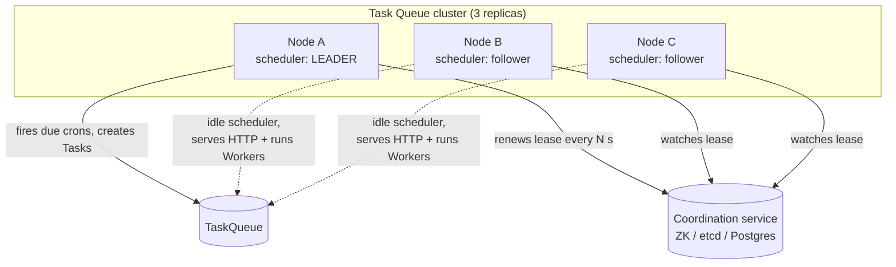
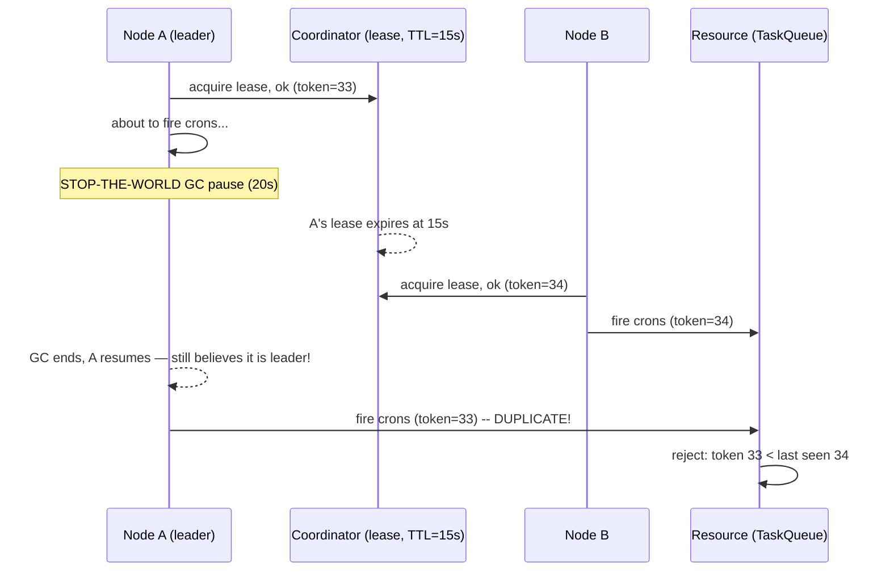
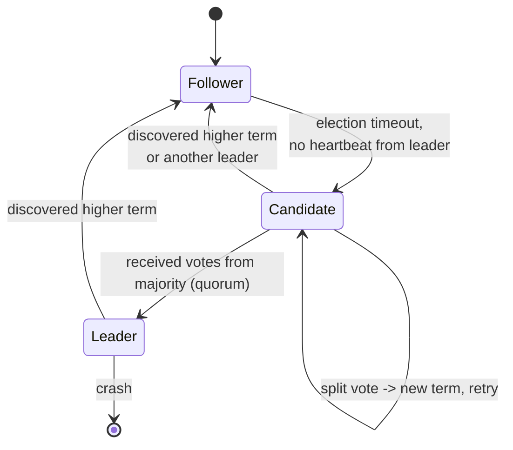
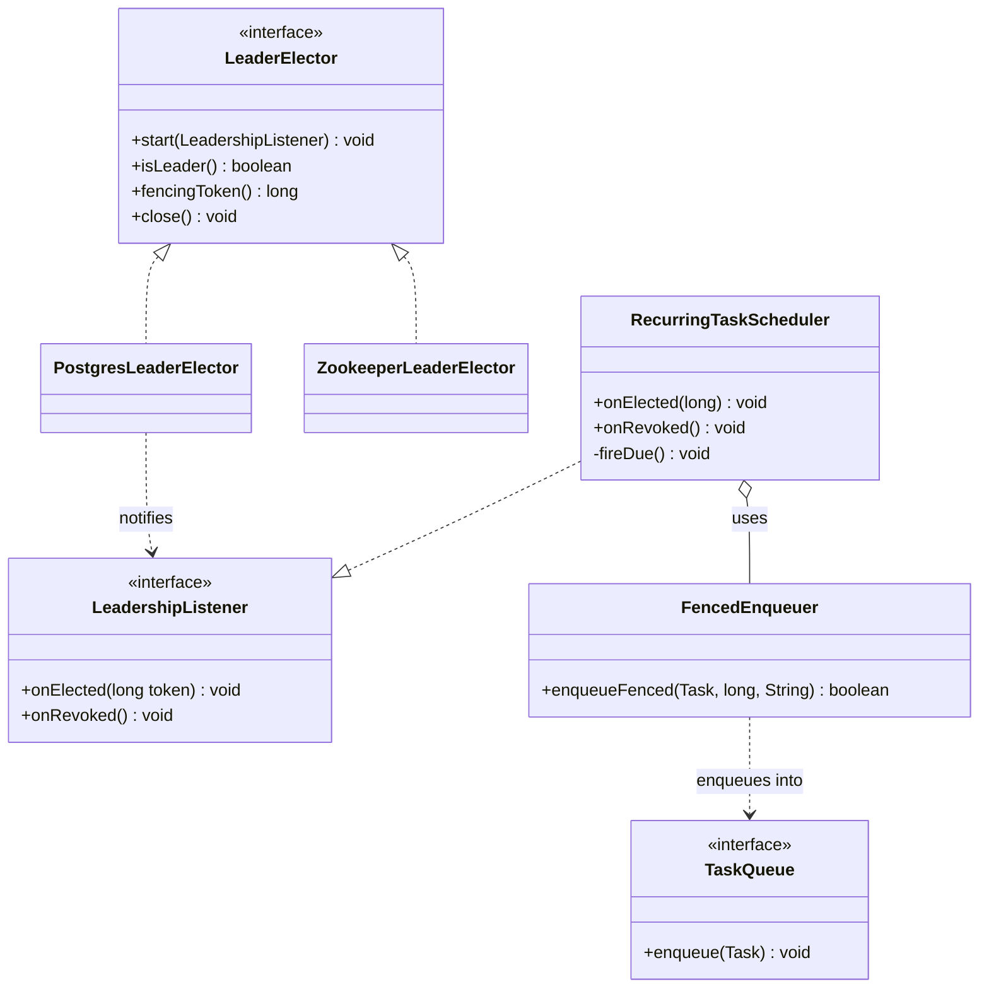

# Leader Election

> Where this fits in the project: by Phase 4 our Task Queue runs as **N identical replicas** for availability and throughput. Most of the system *wants* every replica doing the same work in parallel — accepting HTTP, pulling tasks, executing handlers. But a few jobs must run on **exactly one** node at a time: the recurring-task scheduler (the thing that turns a cron expression into a `Task`), the DLQ reaper, the orphaned-`RUNNING`-task recovery sweep. If all N replicas run the scheduler, a job scheduled for `*/5 * * * *` fires N times every five minutes. Leader election is how we pick one node to own those singleton duties, detect when it dies, and hand the duty to someone else — **without ever having two leaders at once**.

---

## 1. Why this exists

In a single-process program there is exactly one of everything. One scheduler thread, one `ScheduledExecutorService`, one clock. When you write `scheduler.scheduleAtFixedRate(this::fireDueCrons, 0, 1, MINUTES)` it runs once a minute. Done.

Now scale out. You run three replicas of the same JAR behind a load balancer because one box can't handle the traffic and because you want to survive a box dying. Suddenly that *same line of code* runs on all three. Three schedulers. Every cron fires three times. A "send daily report" task emails every user three times. A "reconcile billing" task triple-charges. The bug is not in your scheduler — it's in the assumption that "run this app" means "run this app once."

You have three options:

1. **Designate a special node by config.** Mark one replica `scheduler.enabled=true`, the rest `false`. Simple, and it works until that node dies — then crons stop firing and nobody notices until the daily report is missing. No failover. This is a static, manual leader.
2. **Coordinate at runtime so exactly one node *elects itself* leader.** If the leader dies, the survivors notice and elect a new one within seconds. This is **leader election**, and it is the only option that gives you both "runs once" and "survives failure."
3. **Make every job idempotent and let them all run.** Sometimes possible (see [idempotency.md](./idempotency.md)) but for *scheduling* it's usually not enough: idempotency stops duplicate *effects*, but you still pay N times the work, N times the DB contention, and you still need a way to dedupe the N generated tasks. Election is cleaner for "fire once" semantics.

> The core problem: in a group of equal peers with no shared memory and an unreliable network, get them to **agree on a single coordinator**, keep that agreement as nodes join and leave, and guarantee that at no instant do two nodes both believe they are the leader.

That last clause is the hard part. The failure mode where two nodes both think they're leader is called **split brain**, and most of this chapter is about why naive election produces split brain and how real systems (ZooKeeper, etcd, Consul, Raft) prevent it.



---

## 2. The naive version

First attempt: "whoever can grab a row in the database is the leader." We add a `leader_election` table and have each node try to `INSERT` its id. First writer wins.

```sql
CREATE TABLE leader_election (
    role        TEXT PRIMARY KEY,   -- e.g. 'scheduler'
    node_id     TEXT NOT NULL,
    acquired_at TIMESTAMPTZ NOT NULL DEFAULT now()
);
```

```java
// BAD: do not ship this.
public boolean tryBecomeLeader(String role, String nodeId) {
    try {
        jdbc.update(
            "INSERT INTO leader_election(role, node_id) VALUES (?, ?)",
            role, nodeId);
        return true;   // I inserted the row, I am the leader, forever
    } catch (DuplicateKeyException e) {
        return false;  // someone else already leader
    }
}
```

```java
// In the scheduler bootstrap:
if (election.tryBecomeLeader("scheduler", NODE_ID)) {
    scheduler.start();   // I'm the leader, fire crons
}
```

What's wrong? Almost everything that matters:

- **No failover.** The leader's row never expires. If node A wins the row and then the JVM crashes, the row stays forever pointing at a dead node. Crons stop. The cluster is leaderless until a human runs a `DELETE`. This is option 1 in disguise — a static leader with extra steps.
- **No liveness.** "Holds the row" is not the same as "is alive and healthy." A GC-paused, network-partitioned, or deadlocked node still "holds" the row.
- **It conflates acquisition with ownership.** Leadership is not a one-time event. It's a *lease* you must keep renewing, and that you can *lose*.

The naive version fails at the one job we built it for: surviving the leader's death.

---

## 3. Improved version: a TTL lease with renewal

Leadership is not a fact, it's a **rental agreement**. You hold it only for a bounded time (the lease TTL), and you must keep paying rent (renewing) or you lose it. If the leader dies, it stops renewing, the lease expires, and a follower can claim it.

We replace "insert a permanent row" with "hold a row with an expiry, and refresh the expiry on a heartbeat."

```sql
CREATE TABLE leader_lease (
    role        TEXT PRIMARY KEY,
    node_id     TEXT NOT NULL,
    expires_at  TIMESTAMPTZ NOT NULL
);
```

The acquire/renew is a single atomic SQL statement. This is the crux — it must be **compare-and-set**, not read-then-write:

```sql
-- Acquire-or-renew in ONE atomic upsert.
-- :now, :ttl, :node, :role are bound parameters.
INSERT INTO leader_lease (role, node_id, expires_at)
VALUES (:role, :node, :now + :ttl)
ON CONFLICT (role) DO UPDATE
    SET node_id    = :node,
        expires_at = :now + :ttl
    WHERE leader_lease.expires_at < :now           -- lease expired: anyone may take it
       OR leader_lease.node_id   = :node;          -- I already hold it: renew
-- If the row exists, is unexpired, and held by someone else,
-- the WHERE blocks the update and 0 rows change -> we are NOT leader.
```

```java
public class DbLeaderLease {
    private final JdbcTemplate jdbc;
    private final String role;
    private final String nodeId;
    private final Duration ttl;

    public DbLeaderLease(JdbcTemplate jdbc, String role, String nodeId, Duration ttl) {
        this.jdbc = jdbc;
        this.role = role;
        this.nodeId = nodeId;
        this.ttl = ttl;
    }

    /** Returns true iff this node holds the lease after the call. */
    public boolean acquireOrRenew() {
        int rows = jdbc.update("""
            INSERT INTO leader_lease (role, node_id, expires_at)
            VALUES (?, ?, now() + (? * interval '1 millisecond'))
            ON CONFLICT (role) DO UPDATE
                SET node_id = excluded.node_id,
                    expires_at = excluded.expires_at
                WHERE leader_lease.expires_at < now()
                   OR leader_lease.node_id = excluded.node_id
            """, role, nodeId, ttl.toMillis());
        return rows == 1;
    }
}
```

A background thread calls `acquireOrRenew()` every `ttl / 3`. The math matters: if TTL is 15s and you renew every 5s, you tolerate two missed renewals (GC pauses, a slow query) before losing leadership. The leader keeps winning because the `node_id = excluded.node_id` branch lets the *current* holder renew freely. A follower only wins when `expires_at < now()` — i.e. the leader stopped renewing.

This survives leader death: leader crashes → renewals stop → after ≤ TTL the lease expires → a follower's `acquireOrRenew()` finds `expires_at < now()` and wins. Failover time is bounded by the TTL.

**But it is not yet split-brain-safe.** More on that in section 4 and especially section 5 — clock skew and GC pauses can still produce two nodes that both believe they hold the lease at the same wall-clock instant. The fix is **fencing**, and you cannot get fencing from the lease alone.

---

## 4. Production-quality version: lease + fencing token + dedicated coordinator

A staff engineer ships three things together:

1. **A lease** (section 3) so leadership expires and fails over.
2. **A fencing token** — a monotonically increasing number handed out on every leadership change — so that even if two nodes *think* they're leader, the resource they act on can reject the stale one.
3. **A dedicated coordination service** (ZooKeeper, etcd, or Consul) instead of your application database, because these are *built* for this: they give you sessions with reliable expiry, linearizable compare-and-swap, watches for instant failover, and a consensus core (ZAB/Raft) that won't lie to you during a partition.

### 4a. Why fencing is mandatory

Here's the scenario the lease alone cannot stop, made famous by Martin Kleppmann's "How to do distributed locking":



Node A acquired the lease, then paused for a full-GC longer than the TTL. While A was frozen, its lease expired and B took over. A wakes up *with no idea time passed* and proceeds to act as leader. For a brief window **both A and B are leaders.** No lease, no TTL, no heartbeat can prevent this, because the frozen node cannot check anything while it's frozen.

The only defense is **fencing at the resource**: every leadership grant carries a strictly increasing token, and every write to the protected resource includes the token. The resource remembers the highest token it has seen and **rejects any write with a lower token.** When A wakes with token 33 and tries to write, the resource has already seen 34 from B and rejects A. Split brain is *contained* even though it briefly *existed*.

> Mantra: **a lock that can expire is useless for correctness unless the protected resource is fenced.** Election gives you "usually one leader." Fencing gives you "the stale leader cannot do damage."

### 4b. Production election with ZooKeeper (the canonical recipe)

ZooKeeper provides **ephemeral sequential znodes**, which give you election almost for free, plus a fencing token for free (the znode's `czxid` / sequence number).

The classic recipe:

1. Each candidate creates an **ephemeral sequential** znode under `/election/scheduler/`, e.g. `/election/scheduler/n_0000000037`.
2. The candidate with the **lowest sequence number** is the leader.
3. A non-leader watches *only the next-lower znode* (not the leader — watching the leader causes a "herd effect" where every node wakes on every change). When that predecessor disappears, the watcher re-checks whether it's now lowest.
4. **Ephemeral** means the znode vanishes automatically when the candidate's ZK session expires (its TCP connection drops and the session times out). That is your failure detection: leader dies → session expires → znode gone → next node becomes lowest → it's the new leader.

```java
import org.apache.curator.framework.CuratorFramework;
import org.apache.curator.framework.recipes.leader.LeaderSelector;
import org.apache.curator.framework.recipes.leader.LeaderSelectorListenerAdapter;

/**
 * Production-grade election using Apache Curator's LeaderSelector,
 * which implements the ephemeral-sequential recipe correctly,
 * including the watch-your-predecessor optimization.
 */
public class SchedulerLeadership extends LeaderSelectorListenerAdapter implements AutoCloseable {

    private final LeaderSelector selector;
    private final RecurringTaskScheduler scheduler;   // our singleton duty
    private final String nodeId;

    public SchedulerLeadership(CuratorFramework client,
                               RecurringTaskScheduler scheduler,
                               String nodeId) {
        this.scheduler = scheduler;
        this.nodeId = nodeId;
        this.selector = new LeaderSelector(client, "/election/scheduler", this);
        this.selector.autoRequeue();   // re-enter the race after losing leadership
    }

    public void start() {
        selector.start();
    }

    /**
     * Curator calls this ONLY on the elected leader. The method must BLOCK
     * for as long as we want to hold leadership. Returning (or throwing)
     * relinquishes leadership and re-queues us as a follower.
     */
    @Override
    public void takeLeadership(CuratorFramework client) throws Exception {
        // Fencing token: monotonically increasing across leadership changes.
        long fencingToken = client.checkExists().forPath("/election/scheduler").getCzxid();
        scheduler.startAsLeader(fencingToken);
        try {
            // Block until we are interrupted (we lost the ZK session / leadership).
            synchronized (this) {
                while (!Thread.currentThread().isInterrupted()) {
                    wait();
                }
            }
        } finally {
            scheduler.stopAsLeader();   // we are no longer leader; stop firing crons
        }
    }

    @Override
    public void close() {
        selector.close();
    }
}
```

> **Curator handles the part that trips everyone up: connection loss.** If ZK signals `SUSPENDED` or `LOST`, Curator interrupts `takeLeadership`. Our `finally` stops the scheduler *before* another node can take over. This is the application side of fencing — relinquish *fast and first*, then let someone else claim leadership. `LeaderSelectorListenerAdapter` wires the `SUSPENDED`/`LOST` -> interrupt behavior for you.

### 4c. The same idea with etcd

etcd does the same thing with a different primitive: a **lease** (a TTL kept alive by `KeepAlive`) plus a **transaction** on a key. The election API is `clientv3/concurrency.Election`. A campaign creates a key tied to your lease; the lowest revision wins; the lease's `KeepAlive` is your heartbeat; the key's **mod-revision is your fencing token**. etcd's linearizable, Raft-backed writes mean the compare-and-swap is correct under partition: a minority partition cannot win the campaign because it cannot reach a quorum to commit the write.

### 4d. And with Raft directly

ZooKeeper (ZAB) and etcd (Raft) are *built on* a consensus algorithm whose leader election is the real thing under the hood. In Raft:

- Time is divided into **terms** (monotonic integers — the fencing token at the consensus layer).
- A follower that hears no heartbeat from the leader within a randomized **election timeout** becomes a **candidate**, increments the term, votes for itself, and requests votes.
- A candidate that collects votes from a **majority (quorum)** becomes leader for that term.
- The **majority requirement is what prevents split brain at the consensus layer**: two leaders would each need a majority, and two majorities of the same cluster must overlap in at least one node, who would have voted only once per term. So at most one leader per term, full stop.

You rarely implement Raft yourself — you run etcd/ZooKeeper/Consul and consume their election. But understanding *why quorum prevents two leaders* is what lets you reason about your own TTL-lease version's weaknesses.



---

## 5. Code walkthrough

### Beginner: a self-contained, single-JVM "election" to build intuition

Before any network, the *shape* of the problem is visible in one JVM with multiple threads competing for one `AtomicReference`. Whoever CAS-es their id in first is the leader. This is not a real distributed election (no failure detection, no partitions) — it's a mental model.

```java
import java.util.concurrent.atomic.AtomicReference;

public class InProcessLeader {
    private final AtomicReference<String> leader = new AtomicReference<>(null);

    /** Compare-and-set: succeeds for exactly one caller when leader is null. */
    public boolean tryBecomeLeader(String nodeId) {
        return leader.compareAndSet(null, nodeId);
    }

    public boolean isLeader(String nodeId) {
        return nodeId.equals(leader.get());
    }

    public void resign(String nodeId) {
        leader.compareAndSet(nodeId, null);   // only resign if I'm the leader
    }

    public static void main(String[] args) throws InterruptedException {
        InProcessLeader e = new InProcessLeader();
        Runnable candidate = () -> {
            String me = Thread.currentThread().getName();
            if (e.tryBecomeLeader(me)) System.out.println(me + " WON leadership");
            else System.out.println(me + " is a follower");
        };
        Thread.ofVirtual().name("A").start(candidate);
        Thread.ofVirtual().name("B").start(candidate);
        Thread.ofVirtual().name("C").start(candidate);
        Thread.sleep(100);
        System.out.println("Leader = " + e.leader.get());
    }
}
```

The lesson: **election reduces to an atomic compare-and-set on shared state.** A distributed election is "the same CAS, but the shared state is a quorum-replicated key, and the hard parts are detecting that the holder died and preventing the holder from acting after it 'died.'"

### Intermediate: a `LeaderElector` abstraction with a TTL lease and listeners

We define an interface so the scheduler doesn't care *how* leadership is decided — Postgres in Phase 2/3, ZooKeeper/etcd in Phase 4.

```java
import java.time.Duration;

/** A pluggable leader-election strategy for a named role. */
public interface LeaderElector extends AutoCloseable {

    /** Begin participating in the election; callbacks fire on state changes. */
    void start(LeadershipListener listener);

    /** True if THIS node currently believes it is the leader. */
    boolean isLeader();

    /**
     * The fencing token for the current leadership term. Strictly increases
     * on every leadership change. Throws if this node is not the leader.
     */
    long fencingToken();

    @Override void close();
}

/** Notified when this node gains or loses leadership. Implementations must be fast & non-blocking. */
public interface LeadershipListener {
    void onElected(long fencingToken);   // start the singleton duty
    void onRevoked();                    // stop the singleton duty IMMEDIATELY
}
```

A Postgres-backed implementation built on the section-3 lease, plus a renewal loop and listener callbacks:

```java
import java.time.Duration;
import java.util.concurrent.Executors;
import java.util.concurrent.ScheduledExecutorService;
import java.util.concurrent.TimeUnit;
import java.util.concurrent.atomic.AtomicBoolean;
import java.util.concurrent.atomic.AtomicLong;

public class PostgresLeaderElector implements LeaderElector {

    private final DbLeaderLease lease;        // from section 3, returns boolean
    private final FencingTokenSource tokens;  // monotonic counter table (see below)
    private final Duration ttl;
    private final String role;

    private final ScheduledExecutorService renewer =
            Executors.newSingleThreadScheduledExecutor(r -> {
                Thread t = new Thread(r, "leader-renewer");
                t.setDaemon(true);
                return t;
            });

    private final AtomicBoolean leader = new AtomicBoolean(false);
    private final AtomicLong currentToken = new AtomicLong(0);
    private volatile LeadershipListener listener;

    public PostgresLeaderElector(DbLeaderLease lease, FencingTokenSource tokens,
                                 Duration ttl, String role) {
        this.lease = lease;
        this.tokens = tokens;
        this.ttl = ttl;
        this.role = role;
    }

    @Override
    public void start(LeadershipListener listener) {
        this.listener = listener;
        long period = Math.max(1, ttl.toMillis() / 3);   // renew at 1/3 TTL
        renewer.scheduleAtFixedRate(this::tick, 0, period, TimeUnit.MILLISECONDS);
    }

    private void tick() {
        boolean held;
        try {
            held = lease.acquireOrRenew();
        } catch (Exception e) {
            // DB unreachable: we CANNOT prove we still hold the lease. Assume the worst.
            held = false;
        }
        boolean was = leader.get();
        if (held && !was) {
            // Just gained leadership: mint a NEW fencing token (always increases).
            long token = tokens.next(role);
            currentToken.set(token);
            leader.set(true);
            safeCall(() -> listener.onElected(token));
        } else if (!held && was) {
            // Just lost leadership: stop the duty before anyone else can start it.
            leader.set(false);
            safeCall(listener::onRevoked);
        }
        // held && was  -> still leader, nothing to announce
        // !held && !was -> still follower, nothing to announce
    }

    private void safeCall(Runnable r) {
        try { r.run(); } catch (RuntimeException ex) { /* log; never let listener kill the renewer */ }
    }

    @Override public boolean isLeader() { return leader.get(); }

    @Override
    public long fencingToken() {
        if (!leader.get()) throw new IllegalStateException("not the leader");
        return currentToken.get();
    }

    @Override
    public void close() {
        renewer.shutdownNow();
        if (leader.getAndSet(false)) safeCall(listener::onRevoked);
    }
}
```

`FencingTokenSource.next(role)` is a single atomic `UPDATE ... RETURNING`:

```sql
-- One row per role; returns a strictly increasing token every call.
UPDATE fencing_token SET token = token + 1 WHERE role = :role RETURNING token;
```

> Note the `catch` block: when the DB is unreachable we set `held = false`. We would rather **wrongly demote ourselves** (and have a few seconds with no leader) than **wrongly keep acting** as leader while unable to prove we still hold the lease. This is the safe direction for a CP-leaning duty. Combined with fencing, even if we're wrong, the resource rejects our stale token.

### Production-inspired: wiring the elector into the recurring-task scheduler so cron fires once

This is the payoff. The scheduler turns cron expressions into `Task` rows. It must only run on the leader, and every `Task` it creates carries the fencing token so a stale leader's tasks can be rejected at the boundary.

```java
import java.time.Instant;
import java.util.List;
import java.util.UUID;
import java.util.concurrent.Executors;
import java.util.concurrent.ScheduledExecutorService;
import java.util.concurrent.TimeUnit;
import java.util.concurrent.atomic.AtomicLong;

/**
 * Generates Tasks from recurring (cron-like) schedules. Runs ONLY when this
 * node is the leader. Each generated Task carries the fencing token so the
 * enqueue path can reject tasks minted by a stale (deposed) leader.
 */
public class RecurringTaskScheduler implements LeadershipListener {

    private final List<CronSchedule> schedules;       // e.g. daily-report, billing-reconcile
    private final TaskQueue queue;                    // canonical TaskQueue
    private final FencedEnqueuer enqueuer;            // checks token at the boundary
    private final AtomicLong myToken = new AtomicLong(-1);

    private volatile ScheduledExecutorService ticker;

    public RecurringTaskScheduler(List<CronSchedule> schedules,
                                  TaskQueue queue, FencedEnqueuer enqueuer) {
        this.schedules = schedules;
        this.queue = queue;
        this.enqueuer = enqueuer;
    }

    @Override
    public synchronized void onElected(long fencingToken) {
        myToken.set(fencingToken);
        ticker = Executors.newSingleThreadScheduledExecutor(r -> {
            Thread t = new Thread(r, "cron-ticker");
            t.setDaemon(true);
            return t;
        });
        // Evaluate cron schedules once per second; fire any that are due.
        ticker.scheduleAtFixedRate(this::fireDue, 0, 1, TimeUnit.SECONDS);
    }

    @Override
    public synchronized void onRevoked() {
        // Stop FIRST, before any new leader starts. Never fire after revocation.
        ScheduledExecutorService t = ticker;
        ticker = null;
        myToken.set(-1);
        if (t != null) t.shutdownNow();   // interrupt in-flight fireDue
    }

    private void fireDue() {
        long token = myToken.get();
        if (token < 0) return;   // revoked between scheduling and running
        Instant now = Instant.now();
        for (CronSchedule s : schedules) {
            if (s.isDue(now)) {
                Task task = new Task(
                        UUID.randomUUID().toString(),
                        s.taskType(),
                        s.payload(),
                        TaskStatus.PENDING,
                        0,                       // attempts
                        s.maxAttempts(),
                        now,                     // createdAt
                        now,                     // scheduledAt = fire now
                        s.priority());
                // Fence at the boundary: enqueue ONLY if our token is still the highest.
                boolean accepted = enqueuer.enqueueFenced(task, token, s.dedupeKey(now));
                if (accepted) s.markFired(now);
                // If rejected, we are a stale leader; onRevoked will run shortly.
            }
        }
    }
}
```

The fenced enqueuer is where split brain is *contained*. It does two things atomically: rejects stale tokens, and dedupes by a per-fire key so even a token race can't double-insert.

```java
public class FencedEnqueuer {
    private final JdbcTemplate jdbc;
    private final TaskRepository repo;
    private final String role = "scheduler";

    public FencedEnqueuer(JdbcTemplate jdbc, TaskRepository repo) {
        this.jdbc = jdbc; this.repo = repo;
    }

    /**
     * Accept the task iff (a) the caller's token >= the highest token the DB
     * has seen for this role (fencing), and (b) this dedupeKey hasn't fired
     * before (idempotency). Both checks happen in one transaction.
     */
    public boolean enqueueFenced(Task task, long callerToken, String dedupeKey) {
        // Atomic fence check: store the max token ever seen; reject if caller is stale.
        int fenced = jdbc.update("""
            UPDATE fencing_token SET token = ?
            WHERE role = ? AND token <= ?
            """, callerToken, role, callerToken);
        if (fenced == 0) return false;   // a higher token exists -> caller is a deposed leader

        // Idempotent insert keyed on (role, dedupeKey): unique index makes the dup a no-op.
        int inserted = jdbc.update("""
            INSERT INTO cron_fired (role, dedupe_key, fired_at) VALUES (?, ?, now())
            ON CONFLICT (role, dedupe_key) DO NOTHING
            """, role, dedupeKey);
        if (inserted == 0) return false;  // already fired this tick (some leader beat us)

        repo.save(task);                  // canonical TaskRepository.save
        return true;
    }
}
```

> Two layers of defense, deliberately. **Election** makes split brain *rare*. **Fencing** (the token check) makes a stale leader's writes *impossible*. **Idempotency** (the dedupe key) makes even a token-equal race a no-op. Defense in depth, because at scale "rare" happens every day.

---

## 6. How this applies to our Task Queue project

| Duty | Singleton? | Why | Mechanism |
|---|---|---|---|
| HTTP `TaskController` (POST/GET) | No | Stateless; scale horizontally | All replicas |
| `Worker` / `WorkerPool` task execution | No | Many workers *should* pull in parallel; the `TaskQueue` arbitrates | All replicas |
| `RecurringTaskScheduler` (cron) | **Yes** | A cron must fire once, not once-per-replica | Leader only |
| DLQ reaper (re-drive `DEAD` tasks on schedule) | **Yes** | Re-drives must not be duplicated | Leader only |
| Orphan recovery (reset stuck `RUNNING` -> `PENDING`) | **Yes** | One sweeper, or tasks flap | Leader only |
| Metrics aggregation rollups | **Yes** (or idempotent) | Avoid N× double-counting | Leader only |

The canonical model barely changes — leadership is a *cross-cutting* concern that *gates* existing components. The `TaskScheduler` interface gains a leader-aware wrapper; the `TaskQueue.enqueue` path is wrapped by `FencedEnqueuer` only on the scheduler side.



(Inheritance: the two electors *realize* `LeaderElector`. Aggregation: `RecurringTaskScheduler` holds a `FencedEnqueuer` but doesn't own its lifecycle. Dependency: the elector *notifies* a listener; the enqueuer *uses* the queue.)

---

## 7. Tradeoffs

| Approach | Failover | Split-brain safety | Ops cost | Latency to elect | When to use |
|---|---|---|---|---|---|
| Static config leader | None (manual) | N/A (only one ever runs) | Trivial | N/A | Throwaway, dev, or truly tolerant of downtime |
| DB TTL lease (Postgres) | ≤ TTL | **Only with fencing** | None extra (reuse DB) | TTL-bounded (5–30s) | You already have Postgres and want zero new infra |
| Redis lease (`SET NX PX` + token) | ≤ TTL | Needs fencing; Redlock is contested | Low | TTL-bounded | Already have Redis; accept its consistency caveats |
| ZooKeeper (Curator `LeaderSelector`) | Seconds (session timeout) | Strong (ephemeral znode + czxid token) | Run a 3/5-node ensemble | ~ session timeout / a few s | JVM shops, Kafka-adjacent stacks |
| etcd (`concurrency.Election`) | Seconds (lease TTL) | Strong (Raft + mod-revision token) | Run a 3/5-node cluster | ~ lease TTL | Kubernetes-native, gRPC stacks |
| Raft in-process (e.g. via a lib) | Sub-second (heartbeat) | Strongest (term = token) | You own the cluster | Heartbeat-bounded | You're building the storage layer itself |

Key tensions:

- **Failover speed vs. false failovers.** Short TTL = fast failover but a transient blip (GC, slow query) flips leadership unnecessarily, causing churn. Long TTL = stable but slow to recover. Typical: 10–30s TTL, renew at 1/3.
- **Reuse infra vs. correctness.** A DB/Redis lease adds no new system but you *must* add fencing yourself and you inherit that store's consistency. ZK/etcd are correct out of the box but are a new stateful cluster to run.
- **CP vs AP at election.** ZK/etcd are CP: during a partition the minority side *cannot* elect or renew (no quorum), so it correctly stops being leader. A naive Redis/DB lease can let a partitioned node keep "renewing" against its own replica — exactly why fencing is non-negotiable for those. See [cap-theorem.md](./cap-theorem.md).

---

## 8. Common mistakes and pitfalls

- **Electing a leader but never fencing the resource.** The single most common and most dangerous mistake. The lease "works" in every test (no GC pause during the test) and corrupts data in production. *Fix: every protected write carries a monotonic token; the resource rejects lower tokens.*
- **Trusting `isLeader()` and then doing slow work without re-checking.** Between the check and the act, your lease may have expired. *Fix: fence the actual write, not just the decision to write. The token is the source of truth, not the boolean.*
- **Renewing at the TTL boundary.** Renew every TTL? One slow renewal and you're out. *Fix: renew at TTL/3; tolerate ≥2 misses.*
- **Watching the leader's znode in ZK (herd effect).** Every follower wakes on every leader change and they all stampede ZK. *Fix: watch only your immediate predecessor (Curator does this for you).*
- **Doing heavy work inside `onElected`/`takeLeadership` synchronously.** Blocking the callback delays relinquishment on revoke. *Fix: callbacks just flip a flag / start-stop a thread; do the work elsewhere and keep revoke instant.*
- **Forgetting to stop the duty on `SUSPENDED`/connection loss.** You think you're leader but ZK has lost your session. *Fix: treat connection loss as "demote immediately"; rejoin the race after.*
- **Relying on wall-clock TTL across nodes with skewed clocks.** Node clocks drift; "expires_at < now()" compares across machines. *Fix: prefer the coordinator's monotonic notion (ZK session, etcd lease, DB `now()` evaluated server-side) over per-node clocks.*
- **A single-node ZK/etcd "cluster."** One node = no quorum = no fault tolerance, and worse, no split-brain protection. *Fix: always 3 or 5 nodes (odd, for clean majorities).*

---

## 9. Refactoring exercise

**Bad** — checks leadership once, then loops forever firing crons with no re-check, no token, no failover:

```java
// BAD
public void runScheduler() {
    if (!db.tryInsertLeaderRow("scheduler", nodeId)) return;   // not leader, give up forever
    while (true) {
        for (CronSchedule s : schedules) if (s.isDue(Instant.now())) queue.enqueue(s.toTask());
        Thread.sleep(1000);   // never re-checks leadership; row never expires
    }
}
```

**Improved** — TTL lease with renewal and re-check each tick, so leadership can be lost and regained:

```java
// IMPROVED
public void runScheduler() {
    var renewer = Executors.newSingleThreadScheduledExecutor();
    renewer.scheduleAtFixedRate(() -> {
        boolean leader = lease.acquireOrRenew();   // TTL-based, can flip
        if (leader) {
            for (CronSchedule s : schedules)
                if (s.isDue(Instant.now())) queue.enqueue(s.toTask());
        }
    }, 0, lease.ttl().toMillis() / 3, TimeUnit.MILLISECONDS);
}
```

Better — failover works now. But still **not split-brain-safe**: a GC-paused old leader can fire after a new one takes over, and there's no dedupe.

**Production** — fencing token + dedupe key, leadership state machine via the `LeaderElector`, instant relinquish on revoke:

```java
// PRODUCTION (uses PostgresLeaderElector + FencedEnqueuer from section 5)
LeaderElector elector = new PostgresLeaderElector(lease, tokens, Duration.ofSeconds(15), "scheduler");
RecurringTaskScheduler scheduler = new RecurringTaskScheduler(schedules, queue, fencedEnqueuer);
elector.start(scheduler);          // onElected -> start ticker w/ token; onRevoked -> stop instantly
// Each fired Task is enqueued via enqueueFenced(task, token, dedupeKey):
//   - rejects writes from a deposed leader (stale token)
//   - dedupes by (role, dedupeKey) so even a tie can't double-fire
```

The progression is the whole lesson: **single-check → TTL lease (failover) → lease + fencing + dedupe (correctness under partition and GC).**

---

## 10. Exercises

### Easy

**E1 (knowledge check).** Three replicas each run the recurring scheduler with no coordination. A task is scheduled `0 9 * * *` (9am daily). How many times does it fire, and what one-line change to the *deployment* (not the code) would reduce it to once? What does that change give up?

**E2 (coding).** Implement `CronSchedule.isDue(Instant now)` for a fixed-rate schedule (every N seconds) such that it returns `true` at most once per window even if `isDue` is polled multiple times per second. Track `lastFired` internally.

**E3 (knowledge check).** Why must a coordination cluster (ZK/etcd) have an **odd** number of nodes, and why is 2 strictly worse than 1 for availability?

### Medium

**M1 (coding).** Implement the `acquireOrRenew()` lease method against an in-memory map that simulates the atomic SQL upsert (compare `expires_at` to a supplied `now`). Then write a test that proves: (a) only one of two competing nodes wins, (b) after the winner stops renewing and the TTL passes, the loser wins.

**M2 (refactoring).** Take the **Improved** scheduler from section 9 and add a fencing token so a stale leader's enqueue is rejected. You may assume a `FencedEnqueuer.enqueueFenced(task, token, key)`. Show the diff and explain which line closes the split-brain window.

**M3 (design).** Your DB-lease scheduler renews every 5s with a 15s TTL. A `STOP-THE-WORLD` GC pause of 22s hits the leader. Walk through, second by second, what each of the three nodes believes and does. Where exactly is the dangerous window, and which mechanism contains the damage?

### Hard

**H1 (interview-style).** Design leader election for the scheduler such that failover is **under 2 seconds** *and* false failovers (flapping) are rare, on a cluster where p99 GC pause is 800ms and network blips last up to 1s. Pick TTL, renew interval, and failure-detection mechanism; justify the numbers; state the failover-time formula.

**H2 (coding).** Implement a minimal Raft-style leader election for 3 in-JVM nodes communicating via queues: randomized election timeouts, terms, request-vote, majority wins, step-down on higher term. Prove via a test that two leaders never coexist in the same term even when an old leader "comes back."

**H3 (stretch).** Extend `FencedEnqueuer` so that the fencing check and the task insert are **strictly serializable** under concurrent calls from two nodes that briefly share the same token (a tie). The system must guarantee a cron fires exactly once even in the tie. Identify the isolation level / constraint you rely on and why a unique index alone is or isn't sufficient.

---

## 11. Solutions

**E1.** It fires **3 times** (once per replica). Deployment fix: scale the scheduler to **a single replica** (or run it as a separate `Deployment`/process with `replicas: 1`, or use a sidecar with a `leader-election` flag enabled on one). What you give up: **failover** — if that single replica dies, crons stop until it restarts, with no automatic handoff. That is precisely why runtime election beats a static singleton.

**E2.**

```java
import java.time.Duration;
import java.time.Instant;

public final class FixedRateSchedule {
    private final Duration period;
    private volatile Instant lastFired = Instant.EPOCH;

    public FixedRateSchedule(Duration period) { this.period = period; }

    /** True at most once per period, regardless of poll frequency. */
    public synchronized boolean isDue(Instant now) {
        if (!now.isBefore(lastFired.plus(period))) {   // now >= lastFired + period
            lastFired = now;
            return true;
        }
        return false;
    }
}
```

Polling 10x/second still fires once per `period` because `lastFired` advances on the first `true` and the window check rejects the rest.

**E3.** A consensus cluster makes progress only with a **majority (quorum)**: for `2f+1` nodes you tolerate `f` failures. Odd sizes give the best failure tolerance per node and avoid ambiguous splits. **2 is worse than 1**: with 2 nodes the majority is 2, so a *single* failure leaves 1 node which is not a majority — the cluster halts. You added a node and *reduced* availability (now any one failure stops you, vs. a single node that at least serves while up). 3 nodes tolerate 1 failure; that's the first useful size.

**M1.**

```java
import java.time.Duration;
import java.time.Instant;
import java.util.HashMap;
import java.util.Map;

public class InMemoryLease {
    private record Entry(String node, Instant expiresAt) {}
    private final Map<String, Entry> table = new HashMap<>();

    /** Atomic acquire-or-renew, mirroring the SQL upsert with a WHERE guard. */
    public synchronized boolean acquireOrRenew(String role, String node, Instant now, Duration ttl) {
        Entry e = table.get(role);
        boolean canTake = (e == null)                       // no holder
                || !e.expiresAt().isAfter(now)              // expired (expiresAt <= now)
                || e.node().equals(node);                   // I already hold it -> renew
        if (canTake) {
            table.put(role, new Entry(node, now.plus(ttl)));
            return true;
        }
        return false;
    }
}
```

```java
import org.junit.jupiter.api.Test;
import java.time.Duration;
import java.time.Instant;
import static org.assertj.core.api.Assertions.assertThat;

class InMemoryLeaseTest {
    @Test void onlyOneWinnerThenFailover() {
        var lease = new InMemoryLease();
        Instant t0 = Instant.parse("2026-06-07T00:00:00Z");
        Duration ttl = Duration.ofSeconds(15);

        // (a) two nodes race at t0: exactly one wins.
        boolean aWon = lease.acquireOrRenew("scheduler", "A", t0, ttl);
        boolean bWon = lease.acquireOrRenew("scheduler", "B", t0, ttl);
        assertThat(aWon).isTrue();
        assertThat(bWon).isFalse();

        // A keeps renewing at t0+5: B still loses.
        assertThat(lease.acquireOrRenew("scheduler", "A", t0.plusSeconds(5), ttl)).isTrue();
        assertThat(lease.acquireOrRenew("scheduler", "B", t0.plusSeconds(5), ttl)).isFalse();

        // (b) A stops renewing. At t0+21 (> last expiry t0+5+15=t0+20) B wins.
        assertThat(lease.acquireOrRenew("scheduler", "B", t0.plusSeconds(21), ttl)).isTrue();
    }
}
```

**M2.** Add the token and route the enqueue through fencing:

```java
// IMPROVED + FENCING
public void runScheduler() {
    var renewer = Executors.newSingleThreadScheduledExecutor();
    renewer.scheduleAtFixedRate(() -> {
        boolean leader = lease.acquireOrRenew();
        if (!leader) return;
        long token = lease.currentToken();            // <-- token for this leadership term
        Instant now = Instant.now();
        for (CronSchedule s : schedules) {
            if (s.isDue(now)) {
                Task t = s.toTask(now);
                fencedEnqueuer.enqueueFenced(t, token, s.dedupeKey(now));  // <-- fenced write
            }
        }
    }, 0, lease.ttl().toMillis() / 3, TimeUnit.MILLISECONDS);
}
```

The line that closes the split-brain window is `enqueueFenced(t, token, ...)`, specifically its internal `UPDATE fencing_token SET token=? WHERE role=? AND token <= ?`. A deposed leader's `token` is lower than the new leader's already-recorded token, so the `WHERE` matches 0 rows and the enqueue is rejected. The `if (leader)` check alone does **not** close it — the leader could pass that check, GC-pause, and act after losing the lease.

**M3.** Timeline (TTL 15s, renew @5s):

- `t=0` A renews, lease valid to `t=15`. A is leader.
- `t=5` A renews, lease valid to `t=20`.
- `t=6` A enters a 22s STW GC pause. A is frozen — cannot renew, cannot check, cannot fire.
- `t=20` lease expires (last renewal was `t=5`). No renewal arrives.
- `t=20→25` B's renewal loop runs `acquireOrRenew`, sees `expires_at < now`, **wins**. B is leader, valid to `~t=40`. B starts firing crons. **(C remains follower throughout — it keeps losing the race.)**
- `t=28` A's GC ends. A *resumes mid-`fireDue`* believing it is still leader (it never saw time pass). **This is the dangerous window: `t=28` until A's next failed renewal.** A tries to enqueue.
- **Containment:** A's fenced write carries its *old* token; B already advanced the stored token on its first fenced write, so A's `UPDATE ... WHERE token <= oldToken` matches 0 rows → **rejected.** Additionally A's next `acquireOrRenew` at ~`t=29` finds the lease held by B (unexpired) → returns false → `onRevoked` stops A's ticker. Damage contained by **fencing**; leadership corrected by the **lease**.

**H1.** Target failover < 2s, p99 GC 800ms, blips ≤ 1s.

- Use a **session/heartbeat detector** (ZK ephemeral node or etcd lease) rather than a coarse DB-poll, because it reacts on TCP/session loss rather than waiting a full poll interval.
- Choose **session timeout = 2s**, **heartbeat = 600ms** (≈ session/3, so 3 missed heartbeats trigger expiry). 3 × 600ms = 1.8s < 2s target.
- A 1s network blip costs at most ~2 missed heartbeats → survives without false failover. An 800ms GC pause costs ~1 missed heartbeat → survives.
- **Failover-time formula:** `T_failover ≈ session_timeout + watch_notify_latency + duty_start_time`. With 2s session, sub-100ms notify, and a near-instant `onElected` (just start a ticker), `T_failover ≈ 2.1s`. To hit a hard <2s you'd drop session to ~1.5s and heartbeat to 500ms, accepting slightly more false-failover risk from the worst-case blip. The tradeoff is explicit: there is **no setting that is both ≤ blip-duration for failover and > blip-duration for stability** — you choose where to sit, and fencing makes the occasional false failover *safe* rather than *catastrophic*.

**H2.**

```java
import java.util.*;
import java.util.concurrent.*;
import java.util.concurrent.atomic.AtomicBoolean;

/** Minimal Raft-style leader election over in-JVM message queues. */
public class MiniRaft {
    enum Role { FOLLOWER, CANDIDATE, LEADER }
    record Msg(String kind, int term, int from, int to, boolean granted) {}

    static class Node implements Runnable {
        final int id;
        final int n;                          // cluster size
        final Map<Integer, BlockingQueue<Msg>> mailboxes;
        volatile Role role = Role.FOLLOWER;
        volatile int term = 0;
        volatile Integer votedFor = null;
        volatile long lastHeartbeat = System.nanoTime();
        final long electionTimeoutMs;
        final AtomicBoolean running = new AtomicBoolean(true);

        Node(int id, int n, Map<Integer, BlockingQueue<Msg>> mb) {
            this.id = id; this.n = n; this.mailboxes = mb;
            this.electionTimeoutMs = 150 + new Random(id).nextInt(150); // randomized 150-300ms
        }

        void send(int to, Msg m) { mailboxes.get(to).offer(m); }
        void broadcast(Msg m) {
            for (int p = 0; p < n; p++) if (p != id) send(p, new Msg(m.kind, m.term, id, p, m.granted));
        }

        public void run() {
            BlockingQueue<Msg> inbox = mailboxes.get(id);
            while (running.get()) {
                try {
                    Msg m = inbox.poll(20, TimeUnit.MILLISECONDS);
                    if (m != null) handle(m);
                    long idleMs = (System.nanoTime() - lastHeartbeat) / 1_000_000;
                    if (role != Role.LEADER && idleMs > electionTimeoutMs) startElection();
                    if (role == Role.LEADER) {            // send heartbeats
                        broadcast(new Msg("HEARTBEAT", term, id, -1, false));
                        Thread.sleep(40);
                    }
                } catch (InterruptedException e) { return; }
            }
        }

        synchronized void startElection() {
            role = Role.CANDIDATE; term++; votedFor = id; lastHeartbeat = System.nanoTime();
            int votes = 1;                                 // vote for self
            // collect votes synchronously for brevity
            List<Integer> grantedBy = new ArrayList<>(); grantedBy.add(id);
            for (int p = 0; p < n; p++) {
                if (p == id) continue;
                send(p, new Msg("REQUEST_VOTE", term, id, p, false));
            }
            // votes are tallied in handle(...) via VOTE messages
        }

        synchronized void handle(Msg m) {
            if (m.term > term) { term = m.term; role = Role.FOLLOWER; votedFor = null; } // step down
            switch (m.kind) {
                case "REQUEST_VOTE" -> {
                    boolean grant = m.term >= term && (votedFor == null || votedFor == m.from);
                    if (grant) { votedFor = m.from; lastHeartbeat = System.nanoTime(); }
                    send(m.from, new Msg("VOTE", term, id, m.from, grant));
                }
                case "VOTE" -> {
                    if (role == Role.CANDIDATE && m.term == term && m.granted) {
                        votesReceived.merge(term, 1, Integer::sum);
                        if (votesReceived.get(term) + 1 > n / 2) role = Role.LEADER; // +1 self
                    }
                }
                case "HEARTBEAT" -> {
                    if (m.term >= term) { term = m.term; role = Role.FOLLOWER; lastHeartbeat = System.nanoTime(); }
                }
                default -> {}
            }
        }
        final Map<Integer,Integer> votesReceived = new ConcurrentHashMap<>();
    }
}
```

```java
import org.junit.jupiter.api.Test;
import java.util.*;
import java.util.concurrent.*;
import static org.assertj.core.api.Assertions.assertThat;

class MiniRaftTest {
    @Test void neverTwoLeadersInSameTerm() throws Exception {
        int n = 3;
        Map<Integer, BlockingQueue<MiniRaft.Msg>> mb = new ConcurrentHashMap<>();
        for (int i = 0; i < n; i++) mb.put(i, new LinkedBlockingQueue<>());
        List<MiniRaft.Node> nodes = new ArrayList<>();
        for (int i = 0; i < n; i++) nodes.add(new MiniRaft.Node(i, n, mb));
        var pool = Executors.newFixedThreadPool(n);
        nodes.forEach(pool::submit);

        // Let an election settle.
        Thread.sleep(800);
        // Invariant: for any term, at most one LEADER.
        Map<Integer, Long> leadersPerTerm = new HashMap<>();
        for (var node : nodes)
            if (node.role == MiniRaft.Node.Role.LEADER)
                leadersPerTerm.merge(node.term, 1L, Long::sum);
        assertThat(leadersPerTerm.values()).allMatch(c -> c <= 1);

        // Simulate an "old leader returns": force one node's term down. It must step down,
        // because any heartbeat/vote at the higher current term flips it to FOLLOWER.
        var maybeLeader = nodes.stream().filter(x -> x.role == MiniRaft.Node.Role.LEADER).findFirst();
        maybeLeader.ifPresent(l -> l.term = 0);   // stale
        Thread.sleep(400);
        leadersPerTerm.clear();
        for (var node : nodes)
            if (node.role == MiniRaft.Node.Role.LEADER)
                leadersPerTerm.merge(node.term, 1L, Long::sum);
        assertThat(leadersPerTerm.values()).allMatch(c -> c <= 1);

        nodes.forEach(x -> x.running.set(false));
        pool.shutdownNow();
    }
}
```

Why two leaders can't coexist in a term: a leader needs `> n/2` votes; each node grants at most one vote *per term*; two would-be leaders in the same term would each need a majority, and two majorities of the same set must overlap, but the overlapping node only voted once. The `m.term > term` step-down guarantees a returning stale leader immediately demotes on contact with the current term.

**H3.** A unique index on `(role, dedupe_key)` makes the *insert* idempotent — that alone guarantees **at-most-once** even in a tie, because the second insert hits `ON CONFLICT DO NOTHING`. The fencing `UPDATE ... WHERE token <= ?` plus the unique insert, both inside one transaction at **READ COMMITTED**, are sufficient here: the unique constraint is enforced regardless of isolation level (it's a physical invariant), so concurrent equal-token callers serialize on the index — one inserts, the other conflicts. You'd reach for **SERIALIZABLE** only if the *decision logic* depended on a range read (e.g., "fire only if no task of this type ran in the last hour"), where phantom reads could let both proceed; then SERIALIZABLE (or an explicit advisory lock / `SELECT ... FOR UPDATE` on the role row) is required. For the simple exactly-once-per-key case, **the unique index is the correctness anchor; fencing prevents a *stale* leader from inserting a *different* key for the same logical tick.** Both are needed: the index stops duplicates of the same key; fencing stops a deposed leader from minting work at all.

---

## 12. Interview questions and takeaways

1. **"Why isn't a TTL lease enough to prevent two leaders?"** Because a node can pause (GC, scheduler starvation) longer than the TTL, lose the lease without knowing, and resume acting as leader. The lease guarantees *eventual* single leadership, not *instantaneous* mutual exclusion. You need **fencing** at the resource to contain the overlap window.

2. **"What is a fencing token and where does it live?"** A monotonically increasing number issued on each leadership change. It lives *with the protected resource*: every write carries it, the resource records the highest seen, and rejects lower ones. ZK gives it via znode `czxid`; etcd via mod-revision; Raft via term; a DB via a counter row.

3. **"How does quorum prevent split brain?"** A leader needs votes from a majority. Two majorities of one cluster must share at least one member, and a member votes once per term, so two leaders can't both win the same term. A minority partition can't reach quorum, so it can't elect or renew — it correctly stops leading.

4. **"ZooKeeper vs etcd for election?"** Same guarantees (CP, consensus-backed, fencing token available). ZK: ephemeral sequential znodes + watches, Curator recipes, strong in JVM/Kafka ecosystems. etcd: leases + transactions, Kubernetes-native, gRPC. Pick by ecosystem; both are correct.

5. **"How do you choose TTL and renew interval?"** Renew at ~TTL/3 to tolerate ≥2 missed renewals. Short TTL → fast failover but flappy; long TTL → stable but slow recovery. Common: 10–30s TTL. Failover time ≈ TTL + notify latency + duty start.

6. **"Your scheduler runs on 3 nodes and a cron fired 3×. What happened and how do you fix it?"** No election — every replica ran the scheduler. Fix: elect a leader; only the leader fires; fence the enqueue with a token and dedupe by a per-fire key so even a transition can't double-fire.

7. **"Can you do leader election with just Redis?"** Yes for *liveness*-style locks (`SET NX PX` + token), but Redlock's correctness is contested under partitions and clock skew; for a singleton scheduler you must add fencing and accept Redis's consistency model. For correctness-critical singletons, prefer a CP coordinator.

**Takeaways:** Election decides *who*; fencing decides *who can act*. Never ship one without the other. Quorum is the reason real coordinators are safe; TTL + renewal is the reason they fail over; the token is the reason a zombie leader can't corrupt your data.

---

## 13. Production considerations

- **What breaks at scale:** the coordinator becomes a dependency for a critical path. If ZK/etcd is down, you can't elect — design the duty to *degrade*, not crash (e.g., scheduler simply doesn't fire until a leader exists; tasks aren't lost, just delayed). Never make request-path latency depend on the election cluster.
- **Monitoring (Micrometer/Prometheus):** expose `leader_election_is_leader{role}` as a **gauge** (1 on the leader, 0 elsewhere — the sum across replicas should be **exactly 1**; alert if it's 0 or ≥2), `leader_election_transitions_total` as a **counter** (a spike = flapping), `leader_lease_renew_latency` as a **timer**, and `cron_fired_total{schedule}` (must match expected cadence). The "sum of is_leader != 1" alert is your split-brain / leaderless canary.
- **Flapping detection:** alert when `rate(leader_election_transitions_total[5m])` exceeds, say, 1/min — it means your TTL is too tight for your GC/network reality.
- **Clock discipline:** if you use a wall-clock TTL, run NTP/chrony and *still* prefer server-evaluated `now()` (one clock) over per-node clocks. Better: use the coordinator's own expiry (ZK session, etcd lease) which doesn't depend on app-node clocks.
- **Graceful shutdown:** on SIGTERM the leader must `close()` the elector *first* (relinquish, stop the ticker) so a successor takes over cleanly during a rolling deploy — otherwise you wait a full TTL with no leader on every deploy.
- **Testing in CI:** use Testcontainers to spin a real 3-node etcd/ZK and a fault-injection test that kills the leader mid-cron and asserts (a) a successor elects within the SLO and (b) `cron_fired_total` increments exactly once across the transition. Election bugs *never* show up in single-node tests.
- **Cold start / thundering herd:** when the whole cluster boots, all replicas race at once. ZK/etcd handle this, but add small randomized jitter before the first campaign to avoid synchronized retries hammering the coordinator.

---

## What We Can Improve In Our Project Using This Concept

Right now (through Phase 3) our `TaskScheduler` and any recurring/cron logic implicitly assume a single process. The moment we run multiple replicas in Phase 4, recurring tasks fire once per replica, the DLQ reaper double-drives, and orphan recovery races. We can:

- Introduce a `LeaderElector` interface (Postgres-backed first, ZooKeeper/etcd-backed in Phase 4) that gates the `RecurringTaskScheduler`, DLQ reaper, and orphan-recovery sweep.
- Add a `FencedEnqueuer` so the scheduler's writes carry a fencing token and a per-fire dedupe key, making "cron fires exactly once" robust to GC pauses and failover.
- Emit `leader_election_is_leader`, `..._transitions_total`, and `cron_fired_total` so we can *prove* single-leader behavior in Grafana.

## Project Refactoring Task

1. Define `LeaderElector` and `LeadershipListener` (section 5).
2. Implement `PostgresLeaderElector` on the section-3 lease plus a `fencing_token` counter row.
3. Make `RecurringTaskScheduler` implement `LeadershipListener`: start the cron ticker in `onElected(token)`, stop it instantly in `onRevoked()`.
4. Route the scheduler's enqueues through `FencedEnqueuer.enqueueFenced(task, token, dedupeKey)`.
5. Wire the same elector to gate the DLQ reaper (see [dlq.md](./dlq.md)) and orphan-recovery sweep.
6. Add the three metrics and a Grafana alert on `sum(leader_election_is_leader) != 1`.
7. Add a Testcontainers test that kills the leader mid-cron and asserts exactly-once firing across failover.

## Git Commit For This Chapter

```text
feat(scheduler): elect a single leader for recurring-task scheduling with fencing

- add LeaderElector/LeadershipListener interfaces and PostgresLeaderElector (TTL lease + renewal)
- add FencingTokenSource and FencedEnqueuer to make cron fire exactly once across replicas
- gate RecurringTaskScheduler, DLQ reaper, and orphan-recovery sweep on leadership
- emit leader_election_is_leader gauge, transitions counter, cron_fired_total
- Flyway: leader_lease, fencing_token, cron_fired tables

Files touched:
  src/main/java/.../election/LeaderElector.java
  src/main/java/.../election/LeadershipListener.java
  src/main/java/.../election/PostgresLeaderElector.java
  src/main/java/.../election/DbLeaderLease.java
  src/main/java/.../scheduler/RecurringTaskScheduler.java
  src/main/java/.../scheduler/FencedEnqueuer.java
  src/main/resources/db/migration/V12__leader_election.sql
  src/test/java/.../election/LeaderFailoverTest.java
```

## Architecture Impact

Leadership becomes a **cross-cutting gate** over the singleton duties without changing the stateless data path. The API and `WorkerPool` remain fully horizontal (all replicas), while the scheduler/reaper/recovery move behind the elector. We gain a new external dependency (the coordination service, or a reuse of Postgres) on the *control* path but explicitly keep it off the *request* path, so an election outage delays cron firing but never rejects user submissions. The fencing token threads a new, small invariant through the enqueue boundary — every singleton write is now token-checked.

## Interview Takeaways

- Election answers *who is the single leader*; fencing answers *why a stale leader cannot act* — ship both, always.
- Quorum (majority) is the structural reason ZK/etcd/Raft can't have two leaders in a term; TTL+renewal is why they fail over; the monotonic token is why a zombie can't corrupt state.
- The classic split-brain trigger is a GC pause longer than the lease — defend at the resource (token + dedupe), not just at the lock.
- For a singleton scheduler: leader-only execution + fencing token + per-fire dedupe key = cron fires exactly once, even across failover.

> Related: [distributed-locks.md](./distributed-locks.md) (the lock primitive underneath a DB lease), [consistency-and-availability.md](./consistency-and-availability.md) (CP coordinators during partitions), [cap-theorem.md](./cap-theorem.md) (why a minority can't elect), [idempotency.md](./idempotency.md) (the dedupe layer behind fencing), [scheduling-queues.md](../07-queues-and-messaging/scheduling-queues.md) (the queue the scheduler feeds), and [executor-service.md](../06-concurrency/executor-service.md) (the `ScheduledExecutorService` the ticker uses).
