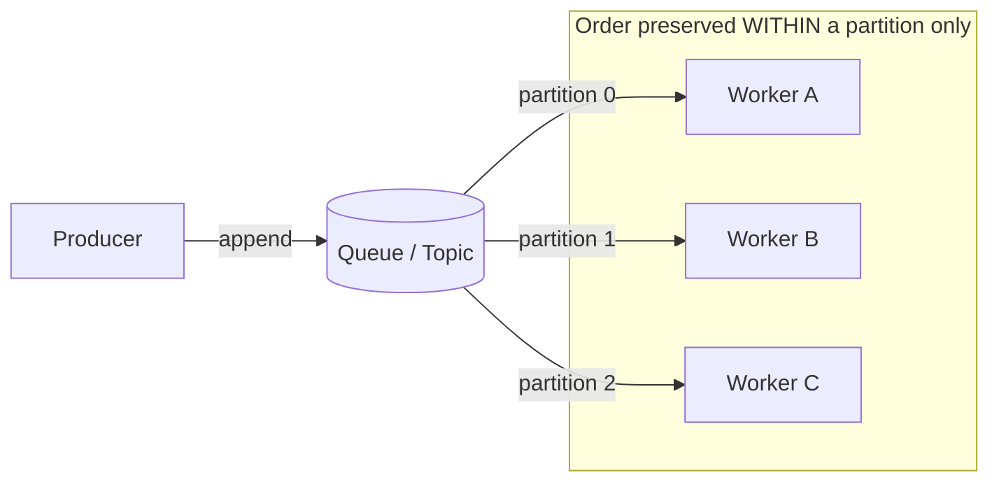
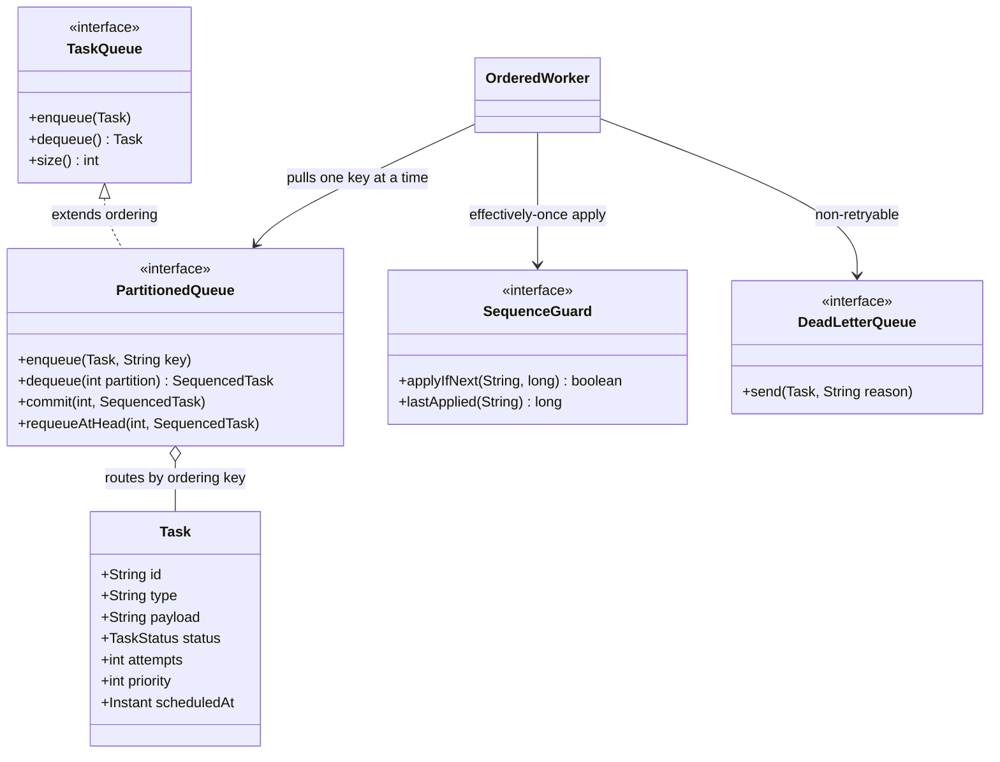

# Message Ordering and Delivery Guarantees

> Where this fits: our Distributed Task Queue accepts tasks, fans them out to a worker pool, and (in Phases 3–4) spreads them across partitions and worker nodes. The moment we add parallelism and a network, two questions appear that did not exist in the single-threaded version: *in what order do tasks get processed?* and *how many times does each task actually run?* This chapter answers both, and explains why you usually cannot have strict ordering, full parallelism, and exactly-once all at the same time.

---

## 1. Why this exists — the real problem

In Phase 1, our `InMemoryTaskQueue` wraps a single `BlockingQueue`. One producer, one queue, a pool of workers. If you submit task A then task B, and a worker is free, A is *usually* picked up first — but the instant two workers run in parallel, A and B can finish in either order. That is fine for independent tasks ("send email", "resize image"). It is catastrophic for dependent tasks:

- `account.created` must be processed before `account.charged`.
- `order.placed` must precede `order.cancelled`.
- Two `balance.adjust(+50)` and `balance.adjust(-30)` events on the same account must apply in submission order if the handler is not commutative.

The naive instinct is "just keep everything ordered." But strict global ordering means **one consumer at a time**, which kills throughput. The entire history of message brokers is a search for the cheapest ordering guarantee that is still *correct enough* for the workload.

There are two orthogonal concerns people constantly conflate:

| Concern | Question it answers | Knob |
|---|---|---|
| **Ordering** | In what *sequence* are messages delivered/processed? | Global vs partition vs none |
| **Delivery guarantee** | *How many times* is each message delivered? | At-most-once / at-least-once / exactly-once |

They interact (exactly-once is much easier to reason about when ordering is fixed), but they are separate dials. We will turn each one deliberately.



The hard truth in one sentence: **a distributed queue can give you order, or parallelism, but only buys you both by partitioning — and partitioning only orders messages that share a key.**

---

## 2. The naive version — "the queue keeps order, right?"

Here is a first-cut consumer that assumes the queue hands tasks back in submission order, and that each task runs exactly once.

```java
// NAIVE: assumes global order + exactly-once. Both assumptions are false at scale.
public class NaiveWorker implements Runnable {
    private final TaskQueue queue;
    private final Map<String, TaskHandler> handlers;

    public NaiveWorker(TaskQueue queue, Map<String, TaskHandler> handlers) {
        this.queue = queue;
        this.handlers = handlers;
    }

    @Override
    public void run() {
        while (!Thread.currentThread().isInterrupted()) {
            try {
                Task task = queue.dequeue();             // (1) assumes FIFO global order
                TaskHandler handler = handlers.get(task.type());
                handler.handle(task);                    // (2) assumes runs exactly once
            } catch (InterruptedException e) {
                Thread.currentThread().interrupt();
                return;
            } catch (Exception e) {
                // (3) on failure we... lose the task? retry? duplicate?
            }
        }
    }
}
```

Why this breaks:

1. **No global order across workers.** Even a perfect FIFO queue only controls *dequeue* order. Once `task A` is on Worker 1 and `task B` is on Worker 2, the OS scheduler decides who commits first. Submission order ≠ completion order.
2. **No exactly-once.** A crash *after* `handle()` succeeds but *before* we acknowledge means redelivery → the task runs twice. A crash before `handle()` and a lost ack means it runs zero times if we ack-before-process.
3. **Failure handling is undefined**, so we silently pick at-most-once or at-least-once by accident, not by design.

This code is correct for *independent, idempotent, fire-and-forget* tasks and wrong for everything else.

---

## 3. Improved version — partition by an ordering key

The first real improvement: stop pretending we need *global* order. Almost nobody does. What you actually need is **per-entity order** — all events for *account 42* in order, all events for *order 99* in order — and those entities are independent of each other.

So we route by an **ordering key** (the entity id). Messages with the same key always land on the same partition and are processed by a single consumer for that partition. Different keys run fully in parallel.

```java
// IMPROVED: hash the ordering key to a fixed partition.
public final class PartitionRouter {
    private final int partitionCount;

    public PartitionRouter(int partitionCount) {
        if (partitionCount <= 0) throw new IllegalArgumentException("partitions must be > 0");
        this.partitionCount = partitionCount;
    }

    /** Stable, non-negative partition for a key. Same key -> same partition, always. */
    public int partitionFor(String orderingKey) {
        // Math.floorMod keeps the result non-negative even for negative hashCodes.
        return Math.floorMod(orderingKey.hashCode(), partitionCount);
    }
}
```

We give `Task` an ordering key. For our model we derive it from the payload (e.g. the account id) or fall back to the task id (which means "this task is independent — order does not matter").

```java
// We do NOT change the canonical Task record's shape; we derive the key.
public final class OrderingKeys {
    private OrderingKeys() {}

    /**
     * Tasks that must be ordered relative to each other share a key.
     * Independent tasks use their own UUID, so they never serialize behind each other.
     */
    public static String forTask(Task task, String entityIdFromPayload) {
        return entityIdFromPayload != null ? entityIdFromPayload : task.id();
    }
}
```

Now each partition has exactly one consumer, so *within a partition* order is preserved while *across partitions* we keep full parallelism. The number of partitions is the upper bound on consumer parallelism for ordered work — a fundamental tradeoff we will revisit.

> **Key insight:** Ordering and parallelism are in direct tension. Partitioning resolves the tension by declaring which messages are *allowed* to be reordered (different keys) and which are not (same key). You are not eliminating the conflict; you are scoping it.

---

## 4. Production-quality version — sequence numbers, single-active consumer, and idempotent commit

The improved version preserves order *if* exactly one consumer ever owns a partition and *if* it processes strictly in offset order. In production three things can still wreck order:

1. **Redelivery + retry.** If task #5 fails and we retry it later, but #6 already ran, the effective order is 6 then 5. Per-partition order is broken by out-of-band retries.
2. **Consumer rebalancing.** When a worker dies, another takes over its partition. If the hand-off is sloppy, two consumers briefly own the same partition → reordering and duplicates.
3. **Concurrent in-flight messages.** Fetching a batch and handing messages to a thread pool reorders them even within one partition.

The staff-engineer version addresses all three with: a monotonic **sequence number** per ordering key, a **single in-flight message per key** discipline, and an **idempotent, offset-committing** apply step so redelivery is harmless.

```java
// PRODUCTION-INSPIRED: ordered, at-least-once delivery made effectively-once
// at the apply boundary via a per-key sequence guard.

public record SequencedTask(Task task, String orderingKey, long sequence) {}

/**
 * Tracks the highest sequence successfully applied per ordering key.
 * Rejects out-of-order or duplicate applies. Backed by Postgres in Phase 2+
 * so the guard survives restarts (see TaskRepository).
 */
public interface SequenceGuard {
    /** @return true if this sequence is the next expected one and was recorded. */
    boolean applyIfNext(String orderingKey, long sequence);

    long lastApplied(String orderingKey);
}

public final class InMemorySequenceGuard implements SequenceGuard {
    // ConcurrentHashMap so different keys progress without contending.
    private final ConcurrentHashMap<String, Long> highWater = new ConcurrentHashMap<>();

    @Override
    public boolean applyIfNext(String orderingKey, long sequence) {
        // compute() is atomic per key: classic check-and-set without external locks.
        var result = new boolean[1];
        highWater.compute(orderingKey, (k, last) -> {
            long expected = (last == null ? 0L : last) + 1;
            if (sequence == expected) {          // exactly the next one -> accept
                result[0] = true;
                return sequence;
            }
            if (last != null && sequence <= last) {
                result[0] = false;               // duplicate / already applied -> drop
                return last;
            }
            result[0] = false;                   // gap (future seq) -> reject, wait for predecessor
            return last;
        });
        return result[0];
    }

    @Override
    public long lastApplied(String orderingKey) {
        return highWater.getOrDefault(orderingKey, 0L);
    }
}
```

The ordered worker pulls from *its* partition only, processes strictly one key at a time, and uses the guard to make redelivery idempotent:

```java
public final class OrderedWorker implements Runnable {
    private final PartitionedQueue queue;     // dequeue(partition) -> SequencedTask
    private final int partition;
    private final Map<String, TaskHandler> handlers;
    private final SequenceGuard guard;
    private final DeadLetterQueue dlq;

    public OrderedWorker(PartitionedQueue queue, int partition,
                         Map<String, TaskHandler> handlers,
                         SequenceGuard guard, DeadLetterQueue dlq) {
        this.queue = queue;
        this.partition = partition;
        this.handlers = handlers;
        this.guard = guard;
        this.dlq = dlq;
    }

    @Override
    public void run() {
        while (!Thread.currentThread().isInterrupted()) {
            try {
                SequencedTask st = queue.dequeue(partition);   // strictly in-offset order
                Task task = st.task();

                // Redelivery / duplicate? Drop without re-running side effects.
                if (st.sequence() <= guard.lastApplied(st.orderingKey())) {
                    queue.commit(partition, st);                // ack the duplicate, move on
                    continue;
                }

                TaskHandler handler = handlers.get(task.type());
                TaskResult result = handler.handle(task);

                if (result.success()) {
                    boolean accepted = guard.applyIfNext(st.orderingKey(), st.sequence());
                    // accepted==false here means a concurrent apply already advanced the
                    // high-water mark; the side effect is idempotent so we still ack.
                    queue.commit(partition, st);
                } else if (result.retryable()) {
                    // Re-enqueue at the SAME partition to preserve per-key order on retry.
                    queue.requeueAtHead(partition, st);
                } else {
                    dlq.send(task, "non-retryable: " + result.message());
                    queue.commit(partition, st);
                }
            } catch (InterruptedException e) {
                Thread.currentThread().interrupt();
                return;
            } catch (Exception e) {
                // Treat unexpected exceptions as retryable but bounded by maxAttempts elsewhere.
            }
        }
    }
}
```

Why this is the version a staff engineer ships:

- **One in-flight message per partition** (we `dequeue` then process then `commit`, never prefetch a batch into a thread pool for ordered topics). Order cannot be scrambled.
- **The `SequenceGuard` makes at-least-once behave like effectively-once** at the *apply* boundary — the only place that matters. We never claim true exactly-once over the network; we make duplicates harmless, which is the achievable thing. This is the direct bridge to [idempotency](idempotency.md).
- **Retries re-enqueue at the head of the same partition**, so a failed #5 blocks #6 (head-of-line blocking) rather than letting #6 jump ahead and corrupt order. That blocking is a *deliberate* cost of strict ordering, not a bug.

---

## 5. Code walkthrough — three examples

### Beginner: showing that parallel workers reorder

```java
// Demonstrates that a FIFO queue does NOT give ordered processing under parallelism.
import java.util.concurrent.*;

public class ReorderDemo {
    public static void main(String[] args) throws Exception {
        BlockingQueue<Integer> q = new LinkedBlockingQueue<>();
        for (int i = 1; i <= 6; i++) q.add(i);          // enqueued 1..6 in order

        ExecutorService pool = Executors.newFixedThreadPool(3);
        for (int w = 0; w < 3; w++) {
            pool.submit(() -> {
                Integer n;
                while ((n = q.poll()) != null) {
                    // random work time => completion order is non-deterministic
                    try { Thread.sleep((long) (Math.random() * 50)); }
                    catch (InterruptedException e) { return; }
                    System.out.println("processed " + n + " on " + Thread.currentThread().getName());
                }
            });
        }
        pool.shutdown();
        pool.awaitTermination(5, TimeUnit.SECONDS);
        // Output is NOT 1,2,3,4,5,6. FIFO dequeue != FIFO completion.
    }
}
```

### Intermediate: route by ordering key so same-key tasks serialize

```java
import java.util.*;
import java.util.concurrent.*;

public class PartitionedDispatch {
    private final List<BlockingQueue<Task>> partitions;
    private final ExecutorService pool;

    public PartitionedDispatch(int partitionCount) {
        this.partitions = new ArrayList<>();
        for (int i = 0; i < partitionCount; i++) partitions.add(new LinkedBlockingQueue<>());
        this.pool = Executors.newFixedThreadPool(partitionCount);
    }

    public void submit(Task task, String orderingKey) {
        int p = Math.floorMod(orderingKey.hashCode(), partitions.size());
        partitions.get(p).add(task);                    // same key -> same partition -> same consumer
    }

    public void start(Map<String, TaskHandler> handlers) {
        for (int i = 0; i < partitions.size(); i++) {
            BlockingQueue<Task> mine = partitions.get(i);
            pool.submit(() -> {
                try {
                    while (true) {
                        Task t = mine.take();           // strictly in order within this partition
                        handlers.get(t.type()).handle(t);
                    }
                } catch (InterruptedException e) {
                    Thread.currentThread().interrupt();
                } catch (Exception e) {
                    // delegate to retry/DLQ in the real implementation
                }
            });
        }
    }
}
```

### Production-inspired: Kafka-style keyed producer + idempotent consumer

```java
// Phase 4: Kafka as the broker. The partition key IS the ordering key.
import org.apache.kafka.clients.producer.*;
import org.apache.kafka.clients.consumer.*;
import java.time.Duration;
import java.util.*;

public class KafkaOrderedPipeline {

    /** Producer: enabling idempotence + acks=all gives ordered, no-duplicate appends per partition. */
    static KafkaProducer<String, String> producer(String bootstrap) {
        Properties p = new Properties();
        p.put(ProducerConfig.BOOTSTRAP_SERVERS_CONFIG, bootstrap);
        p.put(ProducerConfig.KEY_SERIALIZER_CLASS_CONFIG,
              "org.apache.kafka.common.serialization.StringSerializer");
        p.put(ProducerConfig.VALUE_SERIALIZER_CLASS_CONFIG,
              "org.apache.kafka.common.serialization.StringSerializer");
        p.put(ProducerConfig.ENABLE_IDEMPOTENCE_CONFIG, true);   // no producer-side dupes
        p.put(ProducerConfig.ACKS_CONFIG, "all");                // wait for ISR
        p.put(ProducerConfig.MAX_IN_FLIGHT_REQUESTS_PER_CONNECTION, 5); // safe w/ idempotence
        return new KafkaProducer<>(p);
    }

    /** Send with the ordering key so all events for an entity share a partition. */
    static void send(KafkaProducer<String, String> prod, Task task, String orderingKey) {
        prod.send(new ProducerRecord<>("tasks", orderingKey, task.payload()));
    }

    /** Consumer: manual commit AFTER apply => at-least-once. Idempotency guard makes it safe. */
    static void consume(String bootstrap, SequenceGuard guard, Map<String, TaskHandler> handlers) {
        Properties c = new Properties();
        c.put(ConsumerConfig.BOOTSTRAP_SERVERS_CONFIG, bootstrap);
        c.put(ConsumerConfig.GROUP_ID_CONFIG, "task-workers");
        c.put(ConsumerConfig.ENABLE_AUTO_COMMIT_CONFIG, false);  // we commit only after success
        c.put(ConsumerConfig.KEY_DESERIALIZER_CLASS_CONFIG,
              "org.apache.kafka.common.serialization.StringDeserializer");
        c.put(ConsumerConfig.VALUE_DESERIALIZER_CLASS_CONFIG,
              "org.apache.kafka.common.serialization.StringDeserializer");

        try (KafkaConsumer<String, String> consumer = new KafkaConsumer<>(c)) {
            consumer.subscribe(List.of("tasks"));
            while (true) {
                var records = consumer.poll(Duration.ofMillis(500));
                for (ConsumerRecord<String, String> r : records) {
                    String key = r.key();
                    long seq = r.offset();               // offset is the per-partition sequence
                    if (guard.applyIfNext(key, seq) || seq <= guard.lastApplied(key)) {
                        Task t = TaskCodec.fromJson(r.value());
                        try { handlers.get(t.type()).handle(t); }
                        catch (Exception e) { /* retry/DLQ */ }
                    }
                    // commit synchronously per record only for strict ordering topics;
                    // batch-commit for throughput when order is relaxed.
                    consumer.commitSync(Map.of(
                        new org.apache.kafka.common.TopicPartition(r.topic(), r.partition()),
                        new OffsetAndMetadata(r.offset() + 1)));
                }
            }
        }
    }
}
```

The Kafka offset *is* the per-partition sequence number — you do not invent your own; you piggyback on the log. That is the whole point of a log-structured broker: ordering is free *within a partition* because the log is append-only.

---

## 6. How this applies to our Task Queue project

Mapping to the canonical model:



Concrete decisions for each phase:

- **Phase 1 (`InMemoryTaskQueue`):** no ordering guarantee beyond FIFO dequeue. We document that handlers must be order-independent. This is honest and cheap.
- **Phase 2 (`PostgresTaskQueue` + `TaskRepository`):** `pollDue(n)` with `SELECT ... FOR UPDATE SKIP LOCKED ORDER BY priority, created_at`. Order is best-effort by `created_at`; the `SequenceGuard` high-water mark lives in a `task_sequence(ordering_key, last_seq)` table so it survives restarts and de-dupes redelivered tasks.
- **Phase 3:** the rate limiter and DLQ slot in. A `TokenBucketRateLimiter` per partition keeps ordered throughput predictable; the DLQ receives tasks whose per-key sequence is permanently stuck (poison message at head-of-line).
- **Phase 4:** Kafka/RabbitMQ as the broker. The ordering key becomes the partition key. We choose **at-least-once + idempotent apply**, never advertise exactly-once, and pin strict-order topics to single-in-flight consumers.

The relationship to [idempotency](idempotency.md) is load-bearing: we *relax* ordering wherever we can (most tasks are independent), and where we cannot relax it we lean on idempotent handlers + sequence guards so redelivery from [retries](retries.md) and the [DLQ](dlq.md) is safe.

---

## 7. Tradeoffs

| Ordering model | Parallelism | Throughput | Complexity | When to use |
|---|---|---|---|---|
| **None** | Unlimited | Highest | Lowest | Independent, commutative, or idempotent tasks (most of them) |
| **Partition (per-key)** | = partition count for a hot key | High | Medium | Per-entity workflows: account, order, user session |
| **Global (single consumer)** | 1 | Lowest | Medium | Tiny volume, a true global ledger, schema migrations |

| Delivery guarantee | Cost | Failure mode | How we get it |
|---|---|---|---|
| **At-most-once** | Cheapest | Silent message loss | Ack before processing |
| **At-least-once** | Moderate | Duplicates | Ack after processing |
| **Exactly-once (effectively)** | Highest | Throughput + state cost | At-least-once + idempotent apply / dedup store |

The two tables multiply: "ordered + exactly-once" is the most expensive cell in the whole grid. Real systems pick "partition order + at-least-once + idempotent apply" for ~95% of workloads because it is the cheapest cell that is still *correct*.

> **Opinion:** True end-to-end exactly-once across a network boundary is a marketing claim. What vendors sell as "exactly-once" (Kafka transactions, EOS) is exactly-once *within the broker's transactional boundary* — the moment a side effect leaves that boundary (an HTTP call, an email), you are back to at-least-once and need idempotency. Design for duplicates; do not design against them.

---

## 8. Common mistakes and pitfalls

- **Prefetching a batch into a thread pool on an ordered topic.** This silently reorders within a partition. Fix: single in-flight message per key for strict-order topics.
- **Using a non-deterministic ordering key** (e.g. `task.id()` for tasks that *should* be ordered, or a key that includes a timestamp). Same entity must always hash to the same partition. Fix: derive the key from a stable entity id.
- **Changing the partition count later.** `floorMod(hash, N)` remaps almost every key when `N` changes, breaking ordering across the resize. Fix: pick partition count generously up front, or use consistent hashing (see [sharding](sharding.md)).
- **Retrying out of band.** Sending a failed message to a delay queue while later messages proceed reorders the stream. Fix: requeue at the head of the same partition, or accept the reorder explicitly.
- **Assuming at-least-once means "rarely twice."** Under rebalancing and timeouts, duplicates are routine, not rare. Fix: idempotent handlers, always.
- **Committing the offset before the side effect completes.** That is at-most-once with extra steps — you will silently drop work on crash. Fix: commit after apply.
- **Ignoring head-of-line blocking.** A poison message at the head of a partition stalls *every* later message for that partition. Fix: bounded retries then DLQ the poison message so the partition drains.

---

## 9. Refactoring exercise

**Bad** — acks before processing (silent loss) and no ordering key:

```java
public void consume() throws InterruptedException {
    Task t = queue.dequeue();
    queue.ack(t);                 // BUG: acked before work -> crash loses the task
    handlers.get(t.type()).handle(t);   // and no notion of per-entity order
}
```

**Improved** — ack after processing (at-least-once) and route by key:

```java
public void consume(int partition) throws Exception {
    SequencedTask st = queue.dequeue(partition);
    handlers.get(st.task().type()).handle(st.task());
    queue.commit(partition, st);  // at-least-once: survives crash before commit
}
```

**Production-quality** — at-least-once + idempotent apply + ordered retry:

```java
public void consume(int partition) {
    try {
        SequencedTask st = queue.dequeue(partition);
        String key = st.orderingKey();

        if (st.sequence() <= guard.lastApplied(key)) {   // duplicate redelivery
            queue.commit(partition, st);
            return;
        }
        TaskResult r = handlers.get(st.task().type()).handle(st.task());
        if (r.success()) {
            guard.applyIfNext(key, st.sequence());        // record high-water mark
            queue.commit(partition, st);
        } else if (r.retryable() && st.task().attempts() < st.task().maxAttempts()) {
            queue.requeueAtHead(partition, st);           // keep per-key order on retry
        } else {
            dlq.send(st.task(), r.message());             // drain poison from head
            queue.commit(partition, st);
        }
    } catch (InterruptedException e) {
        Thread.currentThread().interrupt();
    } catch (Exception e) {
        // fall through; bounded by maxAttempts -> eventually DLQ
    }
}
```

---

## 10. Exercises

### Easy

1. **Knowledge check.** Explain in two sentences why a FIFO `BlockingQueue` does not give you FIFO *processing* once you have more than one worker.
2. **Coding.** Implement `PartitionRouter.partitionFor(String)` so that `null` keys throw and same key always maps to the same non-negative partition. Write a JUnit 5 + AssertJ test proving determinism.

### Medium

3. **Refactoring.** Take the `NaiveWorker` from §2 and refactor it to at-least-once with per-key ordering using a `SequencedTask`. State explicitly where you commit.
4. **Design.** You have 4 partitions and one "celebrity" account producing 60% of all events (a hot key). Describe two strategies to keep that partition from becoming a bottleneck without breaking ordering for the other accounts.

### Hard

5. **Interview-style.** Design exactly-once *email sending* on top of an at-least-once queue. Sending an email is a non-idempotent external side effect. Walk through your dedup store, its TTL, and the failure window.
6. **Stretch.** Implement a `SequenceGuard` backed by Postgres (`task_sequence(ordering_key TEXT PRIMARY KEY, last_seq BIGINT)`) using a single `INSERT ... ON CONFLICT DO UPDATE ... WHERE` so that the apply is atomic and out-of-order/duplicate sequences are rejected at the database. Provide the SQL and the JDBC call.

---

## 11. Solutions

**1.** A FIFO queue only fixes *dequeue* order. Once two workers each hold a dequeued task, the OS scheduler and variable work durations decide which `handle()` returns first, so completion order is independent of enqueue order.

**2.**

```java
public final class PartitionRouter {
    private final int partitionCount;
    public PartitionRouter(int partitionCount) {
        if (partitionCount <= 0) throw new IllegalArgumentException("partitions > 0");
        this.partitionCount = partitionCount;
    }
    public int partitionFor(String key) {
        Objects.requireNonNull(key, "ordering key must not be null");
        return Math.floorMod(key.hashCode(), partitionCount);
    }
}
```

```java
import static org.assertj.core.api.Assertions.*;
import org.junit.jupiter.api.Test;

class PartitionRouterTest {
    @Test void sameKeyAlwaysSamePartition() {
        var router = new PartitionRouter(8);
        int first = router.partitionFor("account-42");
        for (int i = 0; i < 1000; i++)
            assertThat(router.partitionFor("account-42")).isEqualTo(first);
    }
    @Test void nonNegativeAndInRange() {
        var router = new PartitionRouter(4);
        assertThat(router.partitionFor("anything")).isBetween(0, 3);
    }
    @Test void nullKeyRejected() {
        var router = new PartitionRouter(4);
        assertThatThrownBy(() -> router.partitionFor(null))
            .isInstanceOf(NullPointerException.class);
    }
}
```

**3.**

```java
public final class OrderedAtLeastOnceWorker implements Runnable {
    private final PartitionedQueue queue;
    private final int partition;
    private final Map<String, TaskHandler> handlers;

    OrderedAtLeastOnceWorker(PartitionedQueue q, int p, Map<String, TaskHandler> h) {
        this.queue = q; this.partition = p; this.handlers = h;
    }

    @Override public void run() {
        while (!Thread.currentThread().isInterrupted()) {
            try {
                SequencedTask st = queue.dequeue(partition); // ordered within partition
                handlers.get(st.task().type()).handle(st.task());
                queue.commit(partition, st);                 // COMMIT AFTER apply = at-least-once
            } catch (InterruptedException e) {
                Thread.currentThread().interrupt(); return;
            } catch (Exception e) {
                // no commit -> message redelivered later (at-least-once)
            }
        }
    }
}
```

The commit happens *after* `handle()` returns. A crash before commit causes redelivery, which is at-least-once by construction.

**4.** (a) **Sub-key splitting:** if the hot account's events are themselves partly independent (e.g. distinct sub-resources), append a sub-key so ordering is only required within the truly dependent subset, spreading the rest across partitions. (b) **Pipelined single-writer with a local ordering buffer:** keep one consumer for the hot key but let it batch and apply in a tight loop with a write-behind buffer, so it is CPU/IO-bound rather than queue-latency-bound. Other accounts' partitions are unaffected either way because they hash elsewhere.

**5.** Use a dedup store keyed by a deterministic message id (e.g. `hash(recipient + template + entity-version)`). Flow: (1) `INSERT` the id with status `SENDING` — if the row already exists, another attempt owns it, so skip. (2) Call the email provider. (3) On success, `UPDATE` to `SENT`. The failure window is between sending and recording `SENT`: a crash there can resend once, so use the provider's idempotency key header to make the *provider* dedupe too. TTL the dedup rows to a few days (longer than your max retry horizon) so the table does not grow unbounded. Net result: at-least-once transport, effectively-once delivery, with one well-understood residual window covered by the provider key.

**6.**

```sql
INSERT INTO task_sequence (ordering_key, last_seq)
VALUES (?, ?)
ON CONFLICT (ordering_key) DO UPDATE
SET last_seq = EXCLUDED.last_seq
WHERE task_sequence.last_seq = EXCLUDED.last_seq - 1   -- only advance by exactly one
RETURNING last_seq;
```

```java
public boolean applyIfNext(String key, long seq) throws SQLException {
    try (PreparedStatement ps = conn.prepareStatement("""
            INSERT INTO task_sequence (ordering_key, last_seq)
            VALUES (?, ?)
            ON CONFLICT (ordering_key) DO UPDATE
            SET last_seq = EXCLUDED.last_seq
            WHERE task_sequence.last_seq = EXCLUDED.last_seq - 1
            RETURNING last_seq
            """)) {
        ps.setString(1, key);
        ps.setLong(2, seq);
        try (ResultSet rs = ps.executeQuery()) {
            return rs.next();   // a row returned => the apply was accepted (next in sequence)
        }
    }
}
```

A `RETURNING`-less zero-row result means the sequence was a duplicate (`seq <= last`) or a gap (`seq > last + 1`) — both correctly rejected by the `WHERE` guard. The first-ever insert (no conflict) accepts `seq = 1` when the row is absent; pin the very first expected sequence to `1` in your producer so the initial insert matches.

---

## 12. Interview questions and takeaways

1. **"What is the difference between at-least-once and exactly-once?"** At-least-once means a message is delivered one or more times; you must dedupe. Exactly-once means delivered and applied precisely once — only achievable *effectively*, by combining at-least-once transport with idempotent apply or a transactional dedup store. There is no free network-level exactly-once.

2. **"Why can't Kafka give you global ordering across a topic?"** Ordering is guaranteed only within a partition because each partition is a single append-only log with its own offset. Across partitions there is no shared clock, so messages can interleave arbitrarily. Global order would require a single partition (one consumer), eliminating parallelism.

3. **"How do you preserve order under retries?"** Retry in place: re-enqueue the failed message at the head of the same partition so successors wait, accepting head-of-line blocking. The alternative — out-of-band delayed retry — reorders the stream and is only acceptable when order does not matter.

4. **"What is an ordering key and how do you choose one?"** A stable identifier for the entity whose events must be ordered (account id, order id). It must be deterministic and independent of time. Choose the *coarsest* key that still captures the real dependency, to maximize parallelism.

5. **"How does idempotency relate to ordering?"** Idempotency lets you safely relax ordering and accept duplicates. Where strict order is required you still want idempotent handlers so redelivery during rebalancing/retries does not double-apply. Order reduces the *need* for dedup; idempotency makes dedup *unnecessary to be perfect*.

6. **"What breaks when you increase partition count?"** `hash % N` remaps nearly every key, so a key that was on partition 2 may move to partition 5 while its old in-flight messages are still on 2 — temporary reordering and possible duplicates. Mitigate with consistent hashing or by over-provisioning partitions.

7. **"At-most-once vs at-least-once — which would you default to for a task queue?"** At-least-once, because losing tasks silently is almost always worse than running a task twice, and the latter is fixable with idempotency. At-most-once is only for telemetry/metrics where loss is tolerable and dedup cost is not worth it.

---

## 13. Production considerations

- **Monitoring.** Track per-partition consumer lag (offset committed vs log end), per-key sequence gaps, duplicate-apply counter, and DLQ rate. A rising lag on *one* partition is the classic hot-key signature. Export these via Micrometer to Prometheus and alert on `lag > threshold for 5m`.
- **Rebalancing storms.** Frequent consumer restarts cause partition reassignment; each reassignment risks brief double-ownership. Use `static membership` / `cooperative-sticky` assignment and a long enough `session.timeout.ms` to avoid spurious rebalances.
- **Poison messages.** A non-retryable message at the head of an ordered partition halts everything behind it. Cap attempts and DLQ the poison message so the partition drains — strict ordering plus a poison pill is a guaranteed stall without this.
- **Clock skew.** Never order by wall-clock timestamps across machines; use broker offsets or a logical sequence. NTP drift of tens of milliseconds is enough to reorder a high-rate stream.
- **Dedup store growth.** Exactly-once-effective relies on a dedup/sequence table; it must have a TTL or partitioned retention or it becomes the bottleneck it was meant to prevent.
- **Throughput math.** For a strict-order topic, max ordered throughput for a single hot key ≈ `1 / per-message-apply-latency`. If a key emits 5k msgs/s and apply takes 1 ms, you are at the edge (1k/s headroom gone) — you must shrink apply latency, not add consumers.

---

## What We Can Improve In Our Project Using This Concept

- Add an **ordering key** derived from the task payload (entity id) with a fallback to `task.id()` for independent tasks, so we only pay for ordering where it is genuinely required.
- Introduce a `PartitionedQueue` extending `TaskQueue`, plus a `SequenceGuard` (in-memory for Phase 1, Postgres-backed for Phase 2+) to make redelivery effectively-once.
- Document per-phase delivery guarantees explicitly in `architecture.md`: Phase 1 = at-least-once, no ordering; Phase 4 = at-least-once + partition order + idempotent apply.

## Project Refactoring Task

Refactor `Worker` into an `OrderedWorker` variant that pulls from a single partition, processes one ordering key at a time, and commits after apply. Add `SequenceGuard` with the Postgres `INSERT ... ON CONFLICT` implementation from Solution 6. Wire retries to `requeueAtHead(partition, st)` so per-key order survives failures, and DLQ poison messages so partitions never stall permanently. Add Micrometer gauges for per-partition lag and a counter for dropped duplicates.

## Git Commit For This Chapter

```text
feat(queue): add partition ordering and effectively-once delivery

- introduce PartitionedQueue extending TaskQueue with per-key routing
- add SequenceGuard (in-memory + Postgres) for idempotent ordered apply
- OrderedWorker: single in-flight per partition, requeueAtHead on retry
- DLQ poison messages to prevent head-of-line stalls
- metrics: per-partition consumer lag gauge, duplicate-apply counter

Files: queue/PartitionedQueue.java, queue/PartitionRouter.java,
       worker/OrderedWorker.java, ordering/SequenceGuard.java,
       ordering/InMemorySequenceGuard.java, ordering/PostgresSequenceGuard.java,
       db/migration/V7__task_sequence.sql
```

## Architecture Impact

Adding partition ordering changes the topology from "one queue, N workers" to "P partitions, one consumer each for ordered topics." Parallelism for ordered work is now capped at the partition count, and partition count becomes a deliberate capacity-planning parameter (see [sharding](sharding.md) and [service discovery and scaling](service-discovery-and-scaling.md)). The `SequenceGuard` introduces a new shared state store on the apply path, which must be sized and monitored like any hot dependency. Delivery semantics become an explicit, documented contract rather than an accident of the runtime.

## Interview Takeaways

- Ordering and parallelism conflict; partitioning by an ordering key scopes the conflict instead of removing it.
- Global order = one consumer = no parallelism; partition order is the practical default.
- Exactly-once is achievable only *effectively*: at-least-once transport + idempotent apply or a dedup/sequence store.
- Per-partition offsets are your free sequence numbers; never order by wall-clock time across machines.
- Preserve order under retries by requeueing at the head of the same partition, and DLQ poison messages to avoid head-of-line stalls.
