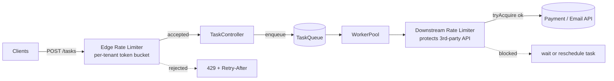
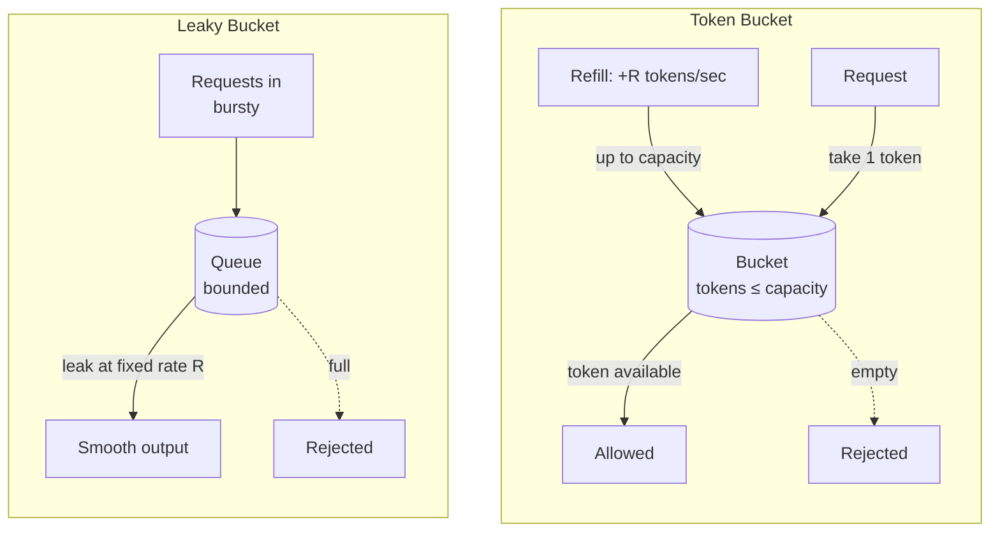
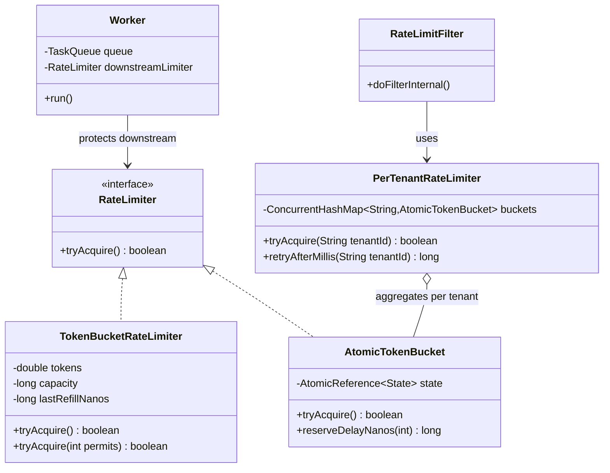

# Rate Limiting

> Where this fits: in our Distributed Task Queue, rate limiting is the valve that protects everything downstream of an open door. The submission API (`TaskController.POST /tasks`) faces the public internet and a careless client can flood it. Our worker pool calls flaky third-party APIs that have their own quotas. A single noisy tenant can starve every other tenant. Rate limiting is how we say "this much, no more" at each of these boundaries — and how we say it *fairly*, *cheaply*, and *across many machines*.

---

## 1. Why this exists

A system has finite capacity. A database handles maybe 5,000 writes/second before tail latency explodes. A downstream payment API grants you 100 requests/second by contract. Your worker pool has 32 threads. When demand exceeds capacity, you do not get graceful slowdown — you get **collapse**: queues grow unbounded, memory fills, GC thrashes, latency spikes, health checks fail, the load balancer evicts the instance, traffic shifts to the survivors, and they fall over too. This is a *cascading failure*, and it is the single most common way distributed systems die.

Rate limiting is the deliberate, *early* rejection of work you cannot serve, so that the work you *do* accept is served well. The contract is blunt and honest: **"I would rather tell you 'no' in 1 millisecond than tell you 'maybe' for 30 seconds and then time out."** A fast `429 Too Many Requests` is a feature, not a failure.

Three distinct problems hide under the single word "rate limiting," and conflating them causes most production incidents:

1. **Admission control** — protecting *yourself* from too much inbound traffic at the API edge.
2. **Fairness / quota enforcement** — giving each tenant their contracted share so one cannot starve the rest (multi-tenancy).
3. **Downstream protection** — never exceeding the quota a *dependency* grants you, so you stay a good citizen and avoid being banned.

> Historical note: token bucket and leaky bucket come from 1990s telecom traffic shaping (ATM networks needed to police bursty cells onto fixed-rate links). The vocabulary — "conforming" vs "non-conforming" cells, "committed information rate" — is still baked into the algorithms. The web rediscovered them: NGINX `limit_req` is leaky bucket, Stripe and GitHub use token bucket variants, and every API gateway ships one of these four algorithms.



There are two limiters in this picture and they have *opposite jobs*. The edge limiter (`RL1`) **rejects** excess demand — it sheds load. The downstream limiter (`RL2`) **delays** our own work — it shapes our output so we never overrun a dependency. Same `RateLimiter` interface, very different policy on a `false` return.

---

## 2. The four core algorithms

You will meet exactly four algorithms in interviews and in production. Know the tradeoffs cold.

| Algorithm | Allows bursts? | Memory/key | Smoothness | Boundary bug? | Typical use |
|---|---|---|---|---|---|
| **Fixed window** | Yes (2x at boundary) | 1 counter | Bursty | **Yes** — 2x burst at window edge | Crude quota, cheap |
| **Sliding window log** | Configurable | O(N) timestamps | Exact | No | Low-volume, exactness needed |
| **Sliding window counter** | Mild | 2 counters | Good | No | Edge gateways (Cloudflare-style) |
| **Leaky bucket** | **No** — strictly smooths | 1 counter + queue | Perfectly smooth output | No | Shaping output to a fixed-rate downstream |
| **Token bucket** | **Yes, bounded** | 2 numbers (tokens, ts) | Bursty up to capacity | No | The default; API edges |

### Fixed window and its fatal boundary bug

Count requests per calendar window (e.g. "100 per minute, reset on the minute"). Dead simple, one integer per key. The bug: a client can send 100 requests at `12:00:59.9` and another 100 at `12:01:00.1` — **200 requests in 200 milliseconds**, because the counter reset on the minute boundary. You configured "100/min" and got a 2x burst. For a downstream with a hard quota, this gets you banned.

### Sliding window log

Store the timestamp of every request in the last window; to admit a new one, drop timestamps older than `now - window` and check the count. Exact, but O(N) memory per key — 10,000 req/min/tenant means 10,000 timestamps held per tenant. Fine for low-volume, ruinous at scale.

### Sliding window counter

The pragmatic fix for the boundary bug. Keep the current window's count and the previous window's count, and weight the previous window by how far you are into the current one:

```text
estimate = current_count + previous_count * (1 - elapsed_fraction_of_current_window)
```

Two integers per key, no 2x boundary burst, no O(N) log. This is what most CDNs ship.

### Leaky bucket vs token bucket — the key mental model

This distinction trips up almost everyone, so anchor it:

- **Leaky bucket** = requests pour into a bucket with a hole; they **leak out at a constant rate**. Output is *perfectly smooth* — a fixed-rate pipe. If the bucket overflows, requests are dropped. It does **not** allow bursts on the output side. Use it when the *downstream* needs a steady stream (e.g. "exactly 100 req/s to the payment API, never 101").
- **Token bucket** = tokens are **added** at a constant rate into a bucket of fixed capacity; a request must take a token or be rejected. Because tokens *accumulate* up to `capacity` while you are idle, you can **burst** up to `capacity` instantly, then you are throttled to the refill rate. Use it when you want to *reward* idle clients with burst headroom — the natural choice for an API edge.



The one-line summary: **token bucket throttles the input but permits bursts; leaky bucket smooths the output and forbids bursts.** Token bucket is the default for our `RateLimiter` interface because API clients legitimately come in bursts and we want to allow that up to a ceiling.

---

## 3. The naive version

Here is the first thing everyone writes, and it is wrong in three different ways.

```java
// NAIVE — do not ship this.
public class NaiveRateLimiter {
    private int count = 0;
    private long windowStart = System.currentTimeMillis();
    private final int limit;          // e.g. 100
    private final long windowMs;      // e.g. 60_000

    public NaiveRateLimiter(int limit, long windowMs) {
        this.limit = limit;
        this.windowMs = windowMs;
    }

    public boolean tryAcquire() {
        long now = System.currentTimeMillis();
        if (now - windowStart > windowMs) {   // reset window
            windowStart = now;
            count = 0;
        }
        if (count < limit) {
            count++;
            return true;
        }
        return false;
    }
}
```

What is wrong:

1. **Not thread-safe.** `count++` is a read-modify-write race. Under our `WorkerPool`'s 32 threads, two workers read `count == 99`, both increment, both pass — the limit is silently violated. This is the classic lost-update bug.
2. **Fixed-window boundary burst.** As shown above, this admits up to 2x `limit` across a window boundary.
3. **Global, not per-tenant.** One `count` for the whole system means a single tenant's traffic exhausts everyone's budget. There is no fairness.

It compiles, it passes a single-threaded test, and it lies to you in production. Let us fix it properly.

---

## 4. Improved version — a correct token bucket

We switch to token bucket (allows bounded bursts, smooth refill, O(1) memory) and make it thread-safe with a lock. We compute tokens **lazily**: instead of a background thread topping up the bucket, we calculate how many tokens *should* have been added since the last call, based on elapsed time. This is the standard trick — no timer thread, exact accounting.

```java
import java.util.concurrent.locks.ReentrantLock;

public class TokenBucketRateLimiter implements RateLimiter {
    private final long capacity;          // max tokens (burst size)
    private final double refillPerNano;   // tokens added per nanosecond
    private final ReentrantLock lock = new ReentrantLock();

    private double tokens;                 // current tokens (fractional)
    private long lastRefillNanos;

    public TokenBucketRateLimiter(long capacity, double refillPerSecond) {
        this.capacity = capacity;
        this.refillPerNano = refillPerSecond / 1_000_000_000.0;
        this.tokens = capacity;            // start full: idle client gets a burst
        this.lastRefillNanos = System.nanoTime();
    }

    @Override
    public boolean tryAcquire() {
        return tryAcquire(1);
    }

    public boolean tryAcquire(int permits) {
        lock.lock();
        try {
            refill();
            if (tokens >= permits) {
                tokens -= permits;
                return true;
            }
            return false;
        } finally {
            lock.unlock();
        }
    }

    private void refill() {
        long now = System.nanoTime();
        double added = (now - lastRefillNanos) * refillPerNano;
        if (added > 0) {
            tokens = Math.min(capacity, tokens + added);
            lastRefillNanos = now;
        }
    }
}
```

Why this is correct:

- **Thread-safe** — the lock makes `refill` + check + decrement atomic.
- **No boundary burst** — tokens refill continuously, not in a step at a window edge. The most you can ever release in a burst is `capacity`, by design.
- **Lazy refill** — no timer thread, no `ScheduledExecutorService`, no garbage. Time is the source of truth via `System.nanoTime()` (monotonic, immune to wall-clock jumps and NTP adjustments — never use `System.currentTimeMillis()` for elapsed-time math).

It is still global (one bucket). We fix per-tenant fairness next.

> Matching our `RateLimiter` interface: the canonical model declares `interface RateLimiter { boolean tryAcquire(); }`. We keep that exact signature and add an overload for multi-permit acquisition, which is useful when a single task costs more than one unit of downstream quota (e.g. a batch task that makes 5 API calls).

```java
public interface RateLimiter {
    boolean tryAcquire();
}
```

---

## 5. Production-quality version

A staff engineer ships three things the improved version lacks: **per-tenant isolation**, a **lock-free fast path** (CAS instead of a global lock so unrelated tenants never contend), and a way to **tell the caller how long to wait** so the API can emit a correct `Retry-After`.

### 5.1 Lock-free token bucket with CAS

Under heavy load, a single `ReentrantLock` per bucket serializes every `tryAcquire`. We can do better with a compare-and-swap loop over an `AtomicLong` that packs both tokens and the last-refill timestamp. Here is a clean version that keeps tokens and timestamp in one immutable snapshot swapped atomically.

```java
import java.util.concurrent.atomic.AtomicReference;

public final class AtomicTokenBucket implements RateLimiter {

    private record State(double tokens, long lastNanos) {}

    private final long capacity;
    private final double refillPerNano;
    private final AtomicReference<State> state;

    public AtomicTokenBucket(long capacity, double refillPerSecond) {
        this.capacity = capacity;
        this.refillPerNano = refillPerSecond / 1_000_000_000.0;
        this.state = new AtomicReference<>(new State(capacity, System.nanoTime()));
    }

    @Override
    public boolean tryAcquire() {
        return tryAcquire(1);
    }

    public boolean tryAcquire(int permits) {
        while (true) {                       // CAS retry loop
            State cur = state.get();
            long now = System.nanoTime();
            double refilled = Math.min(capacity,
                    cur.tokens() + (now - cur.lastNanos()) * refillPerNano);
            if (refilled < permits) {
                return false;                // no tokens; do not even attempt CAS
            }
            State next = new State(refilled - permits, now);
            if (state.compareAndSet(cur, next)) {
                return true;
            }
            // lost the race; another thread won — retry with fresh state
        }
    }

    /** Nanoseconds the caller should wait before {@code permits} would be available. 0 if available now. */
    public long reserveDelayNanos(int permits) {
        State cur = state.get();
        long now = System.nanoTime();
        double refilled = Math.min(capacity,
                cur.tokens() + (now - cur.lastNanos()) * refillPerNano);
        if (refilled >= permits) return 0L;
        double deficit = permits - refilled;
        return (long) (deficit / refillPerNano);
    }
}
```

The CAS loop is *lock-free*: no thread can block another indefinitely, and contention only causes a cheap retry. `reserveDelayNanos` is what powers `Retry-After` — it answers "how long until you'd succeed?" without consuming a token.

### 5.2 Per-tenant registry

We never want a global limiter. Each tenant gets its own bucket, created on first sight and capped by an eviction policy so a flood of one-shot tenants cannot leak memory.

```java
import java.util.concurrent.ConcurrentHashMap;
import java.util.function.Function;

public final class PerTenantRateLimiter {
    private final ConcurrentHashMap<String, AtomicTokenBucket> buckets =
            new ConcurrentHashMap<>();
    private final Function<String, AtomicTokenBucket> bucketFactory;

    public PerTenantRateLimiter(Function<String, AtomicTokenBucket> bucketFactory) {
        this.bucketFactory = bucketFactory;   // tenant -> bucket (per-tier config)
    }

    public boolean tryAcquire(String tenantId) {
        return buckets.computeIfAbsent(tenantId, bucketFactory).tryAcquire();
    }

    public long retryAfterMillis(String tenantId) {
        AtomicTokenBucket b = buckets.get(tenantId);
        return b == null ? 0 : b.reserveDelayNanos(1) / 1_000_000;
    }
}
```

`computeIfAbsent` is atomic on `ConcurrentHashMap`, so two concurrent first-requests for the same tenant create exactly one bucket. The `bucketFactory` lets the *free tier* get `10 req/s, burst 20` while *enterprise* gets `1000 req/s, burst 2000`:

```java
Function<String, AtomicTokenBucket> byTier = tenantId -> switch (tierOf(tenantId)) {
    case FREE       -> new AtomicTokenBucket(20,   10);
    case PRO        -> new AtomicTokenBucket(200,  100);
    case ENTERPRISE -> new AtomicTokenBucket(2000, 1000);
};
```

> Memory note: an unbounded `ConcurrentHashMap` keyed by tenant is a slow leak if tenant IDs are unbounded (e.g. per-IP limiting on the open internet). In production wrap it in a size-bounded cache with time eviction — Caffeine's `expireAfterAccess` is the standard choice. We revisit this in [Production considerations](#14-production-considerations).

---

## 6. Code walkthrough

### Beginner — one global limiter guarding a loop

```java
public class BeginnerDemo {
    public static void main(String[] args) throws InterruptedException {
        // 5 tokens capacity, refills 2 tokens/second.
        RateLimiter limiter = new TokenBucketRateLimiter(5, 2.0);

        for (int i = 1; i <= 12; i++) {
            boolean ok = limiter.tryAcquire();
            System.out.printf("request %2d -> %s%n", i, ok ? "ALLOWED" : "throttled");
            Thread.sleep(200);   // 5 req/s arriving; limiter allows ~2/s after burst
        }
    }
}
```

Expected shape of output: the first ~5 fly through (the initial burst), then you settle into roughly 2 allowed per second as tokens refill. This makes the burst-then-steady behavior of token bucket visible.

### Intermediate — per-tenant limiting in front of the queue

```java
import java.util.List;

public class TenantDemo {
    record Submission(String tenantId, Task task) {}

    public static void main(String[] args) {
        var limiter = new PerTenantRateLimiter(t -> new AtomicTokenBucket(3, 3));
        var queue = new InMemoryTaskQueue();   // BlockingQueue-backed (Phase 1)

        List<Submission> incoming = List.of(
            new Submission("acme", task("email")),
            new Submission("acme", task("email")),
            new Submission("acme", task("email")),
            new Submission("acme", task("email")),   // 4th acme -> throttled
            new Submission("globex", task("report")) // different tenant -> allowed
        );

        for (Submission s : incoming) {
            if (limiter.tryAcquire(s.tenantId())) {
                queue.enqueue(s.task());
                System.out.println("enqueued for " + s.tenantId());
            } else {
                System.out.printf("throttled %s, retry after %d ms%n",
                        s.tenantId(), limiter.retryAfterMillis(s.tenantId()));
            }
        }
    }

    static Task task(String type) {
        return new Task(java.util.UUID.randomUUID().toString(), type, "{}",
                TaskStatus.PENDING, 0, 3, java.time.Instant.now(), null, 5);
    }
}
```

The point: `acme`'s 4th request is throttled while `globex`'s first request sails through. One tenant's burst cannot consume another's budget — that is fairness, and it is impossible with the naive global counter.

### Production-inspired — Spring Boot edge filter returning 429 + Retry-After

This is the real shape of an admission-control limiter at the `TaskController` edge in Phase 2 onward. A Spring `OncePerRequestFilter` runs before the controller, extracts the tenant, checks the limiter, and either passes through or short-circuits with a correct `429`.

```java
import jakarta.servlet.FilterChain;
import jakarta.servlet.http.HttpServletRequest;
import jakarta.servlet.http.HttpServletResponse;
import org.springframework.stereotype.Component;
import org.springframework.web.filter.OncePerRequestFilter;
import java.io.IOException;

@Component
public class RateLimitFilter extends OncePerRequestFilter {

    private final PerTenantRateLimiter limiter;

    public RateLimitFilter(PerTenantRateLimiter limiter) {
        this.limiter = limiter;
    }

    @Override
    protected void doFilterInternal(HttpServletRequest req,
                                    HttpServletResponse res,
                                    FilterChain chain) throws IOException, java.io.IOException, jakarta.servlet.ServletException {
        String tenant = tenantOf(req);   // from API key / JWT claim / header

        if (limiter.tryAcquire(tenant)) {
            chain.doFilter(req, res);
            return;
        }

        long retryAfterMs = limiter.retryAfterMillis(tenant);
        long retryAfterSec = Math.max(1, (retryAfterMs + 999) / 1000);   // ceil, min 1

        res.setStatus(429);                                  // 429 Too Many Requests
        res.setHeader("Retry-After", Long.toString(retryAfterSec));
        res.setHeader("X-RateLimit-Limit", "200");
        res.setHeader("X-RateLimit-Remaining", "0");
        res.setContentType("application/json");
        res.getWriter().write(
            "{\"error\":\"rate_limited\",\"retryAfterSeconds\":" + retryAfterSec + "}");
    }

    private String tenantOf(HttpServletRequest req) {
        String key = req.getHeader("X-Api-Key");
        return key != null ? key : req.getRemoteAddr();      // fall back to IP
    }
}
```

The three things that make this *production-grade* rather than a toy:

1. It returns **HTTP 429**, not 503 or 500. 429 specifically means "you, the client, sent too many requests" — it tells well-behaved clients (and SDKs) to back off rather than retry instantly.
2. It sets **`Retry-After`** in seconds, derived from the bucket's real deficit. A client honoring this header will not hammer you, and your own retry logic in [retries.md](./retries.md) should *read* this header rather than blindly using exponential backoff.
3. It sets **`X-RateLimit-*`** informational headers so clients can self-pace *before* hitting the wall — the kindest form of rate limiting is the one clients never trip.

---

## 7. How this applies to our Task Queue project

The canonical model gives us `interface RateLimiter { boolean tryAcquire(); }` and `class TokenBucketRateLimiter`. We wire limiters at two boundaries with opposite responses to `false`:



The `Worker` (which `implements Runnable`, pulls from a `TaskQueue`, looks up a `TaskHandler`, and executes) gets a `RateLimiter` guarding its *downstream* call. When `tryAcquire()` returns `false`, the worker does **not** drop the task — it reschedules it:

```java
public class Worker implements Runnable {
    private final TaskQueue queue;
    private final RateLimiter downstreamLimiter;   // protects the 3rd-party API
    private final TaskScheduler scheduler;
    private final java.util.Map<String, TaskHandler> handlers;

    @Override
    public void run() {
        try {
            while (!Thread.currentThread().isInterrupted()) {
                Task task = queue.dequeue();        // blocks
                if (!downstreamLimiter.tryAcquire()) {
                    // Do NOT fail the task. Push it back with a small delay.
                    scheduler.schedule(task, java.time.Duration.ofMillis(100));
                    continue;
                }
                TaskHandler handler = handlers.get(task.type());
                TaskResult result = handler.handle(task);
                // ... handle SUCCEEDED / FAILED / RETRYING as usual
            }
        } catch (InterruptedException e) {
            Thread.currentThread().interrupt();
        } catch (Exception e) {
            // route to retry / DLQ per policy
        }
    }
}
```

This is the crucial distinction from edge limiting: **at the edge we shed load (429); inside the pipeline we shape load (reschedule).** A throttled downstream call must never become a `FAILED` task that burns a retry attempt — that would conflate "the downstream is fine but I'm pacing myself" with "the downstream rejected the work."

---

## 8. Tradeoffs

### Local vs distributed rate limiting

This is the tradeoff that separates a single-process toy from a horizontally scaled platform (Phase 4). When you run **N** API instances behind a load balancer, a *local* per-instance limiter of "100/s" means the system as a whole admits **N × 100/s**. If you autoscale from 3 to 30 instances, your effective limit silently 10x'd — and your downstream gets crushed.

| Dimension | Local (per-instance) | Distributed (shared store, e.g. Redis) |
|---|---|---|
| Correctness with N instances | Limit multiplied by N | Globally exact |
| Latency added | ~0 (in-memory) | 0.2–1 ms (Redis round trip) |
| Failure mode | None (process-local) | Redis down → fail-open or fail-closed? |
| Burst fairness across instances | Poor | Good |
| Operational cost | Zero | A Redis cluster to run |
| Best for | Downstream protection where each instance has its *own* quota slice | Global per-tenant quota, autoscaled fleets |

A common production pattern is **two-tier**: a generous *local* limiter catches the obvious floods in-memory with zero latency, and a tighter *distributed* limiter enforces the true global quota. The local tier absorbs 99% of abuse without touching Redis.

### Algorithm tradeoffs (recap with a decision rule)

- Need to **allow bursts** (API edge, human-facing)? → **Token bucket**.
- Need a **perfectly smooth output** to a fixed-rate downstream? → **Leaky bucket**.
- Need **exactness at low volume**? → **Sliding window log**.
- Need **cheap, good-enough, no boundary bug at high volume**? → **Sliding window counter**.
- Need **dead simple and don't care about the 2x burst**? → **Fixed window** (and only then).

### Fail-open vs fail-closed

When the distributed store is unreachable, you must choose: **fail-open** (allow traffic, risk overload) or **fail-closed** (reject traffic, risk a self-inflicted outage). For *admission control* protecting yourself, fail-open is usually right — a Redis blip should not take down your whole API. For *downstream protection* where exceeding quota gets you *banned*, fail-closed (or fall back to a conservative local limit) is safer. There is no universal answer; decide per limiter and write it down.

---

## 9. Common mistakes and pitfalls

- **Using `System.currentTimeMillis()` for elapsed time.** Wall-clock time can jump backward (NTP correction, leap second), making `now - last` negative and your refill math explode. Always use `System.nanoTime()` for durations.
- **A non-atomic `count++`.** The lost-update race quietly admits more than the limit under concurrency. Use a lock, CAS, or an atomic Lua script in Redis.
- **One global bucket instead of per-tenant.** One abusive tenant starves everyone. Always key by tenant/API-key/IP as appropriate.
- **Fixed window in front of a hard-quota downstream.** The 2x boundary burst gets you rate-limited *by them*. Use token or sliding window.
- **Returning 503 instead of 429.** 503 means "service unavailable" and signals a server fault; clients and proxies may retry aggressively or trip *their* circuit breakers. 429 specifically means "slow down."
- **Omitting `Retry-After`.** Without it, clients guess — usually too aggressively — and you get a retry storm. Always send it.
- **Throttling = failing a task.** Inside the pipeline, a throttled downstream call must reschedule, not consume a [retry attempt](./retries.md) or land in the [DLQ](./dlq.md).
- **Unbounded per-tenant map.** Keying by raw IP on the public internet leaks memory forever. Use a size/time-bounded cache (Caffeine).
- **Distributed limiter with read-then-write race.** Doing `GET tokens` then `SET tokens-1` in two round trips re-introduces the lost-update race across the network. The decrement *must* be atomic — a single Lua script or `INCR`-based design.
- **Ignoring clock skew across nodes.** A distributed token bucket that trusts each node's wall clock to compute refill will drift. Anchor refill to the store's own time (Redis `TIME`) or use a logical, INCR-based window.

---

## 10. Refactoring exercise

### Bad

```java
// Global, racy, fixed-window, leaks the 2x boundary burst, no Retry-After.
class Limiter {
    static int count = 0;
    static long window = System.currentTimeMillis() / 60000;
    static boolean allow() {
        long w = System.currentTimeMillis() / 60000;
        if (w != window) { window = w; count = 0; }
        return count++ < 100;
    }
}
```

### Improved

```java
// Per-tenant token bucket, thread-safe via lock, no boundary burst.
public class ImprovedLimiter {
    private final java.util.concurrent.ConcurrentHashMap<String, TokenBucketRateLimiter> buckets
        = new java.util.concurrent.ConcurrentHashMap<>();

    public boolean allow(String tenant) {
        return buckets.computeIfAbsent(tenant,
                t -> new TokenBucketRateLimiter(100, 100.0 / 60.0)).tryAcquire();
    }
}
```

### Production-quality

```java
// Lock-free CAS bucket, per-tenant, tier-aware config, exposes Retry-After,
// and is wrapped behind the canonical RateLimiter contract for downstream use.
public final class ProductionLimiter {
    private final PerTenantRateLimiter perTenant;

    public ProductionLimiter() {
        this.perTenant = new PerTenantRateLimiter(tenant -> switch (Tier.of(tenant)) {
            case FREE       -> new AtomicTokenBucket(20,   100.0 / 60.0);
            case PRO        -> new AtomicTokenBucket(200,  200);
            case ENTERPRISE -> new AtomicTokenBucket(2000, 1000);
        });
    }

    /** Admission decision plus a ready-to-use Retry-After in seconds. */
    public Decision admit(String tenant) {
        if (perTenant.tryAcquire(tenant)) {
            return Decision.allowed();
        }
        long retryMs = perTenant.retryAfterMillis(tenant);
        return Decision.rejected(Math.max(1, (retryMs + 999) / 1000));
    }

    public record Decision(boolean allowed, long retryAfterSeconds) {
        static Decision allowed()              { return new Decision(true, 0); }
        static Decision rejected(long seconds) { return new Decision(false, seconds); }
    }

    enum Tier {
        FREE, PRO, ENTERPRISE;
        static Tier of(String tenant) { return PRO; /* look up from DB/cache */ }
    }
}
```

The trajectory: global→per-tenant (fairness), fixed-window→token-bucket (no boundary bug), racy→lock-free CAS (concurrency), silent→`Retry-After` (client cooperation), inline→interface (testable, swappable for the distributed version).

---

## 11. Exercises

### Easy

**E1 (knowledge check).** A client sends 100 requests in the last 100 ms of a minute and 100 more in the first 100 ms of the next minute, under a "100 requests/minute" limit. Which algorithm lets all 200 through, and what is that failure called?

**E2 (knowledge check).** You want a downstream payment API to receive a *perfectly smooth* 50 req/s — never 51 — even though your workers produce bursty traffic. Token bucket or leaky bucket? Why?

**E3 (coding).** Write a single-threaded `tryAcquire(int permits)` test for `TokenBucketRateLimiter(capacity=10, refill=5/s)` that asserts: 10 permits succeed immediately, the 11th fails, and after sleeping 1 second exactly 5 more succeed.

### Medium

**M1 (coding).** Implement a `SlidingWindowCounter` rate limiter (two integer counters, weighted previous window) that does not have the fixed-window boundary bug. Expose `boolean tryAcquire()`.

**M2 (refactoring).** Take the `NaiveRateLimiter` from §3 and make it thread-safe *without* changing it to token bucket — i.e. fix only the concurrency bug while keeping fixed-window semantics. Then explain in one sentence why this is still not what you'd ship.

**M3 (design).** Design the HTTP contract for a throttled `POST /tasks`: status code, headers, and body. Justify each choice and describe what a *good* client SDK does with the response.

### Hard

**H1 (coding/distributed).** Implement a distributed token bucket in Redis using a single atomic Lua script (no read-then-write race). The script must take `capacity`, `refillPerSec`, `nowMs`, and `permits`, refill lazily based on stored `tokens` + `lastMs`, and return whether the request is allowed plus the millis-until-next-token. Provide the Java side that calls it.

**H2 (interview-style).** You run 3 API instances, each with a local "100 req/s" token bucket, and you autoscale to 30 under load. A downstream that grants you 100 req/s starts returning 429s and threatens to ban you. Diagnose the bug and propose two fixes with their tradeoffs.

**H3 (stretch).** Extend the per-tenant limiter so that within a tenant, *task priority* matters: high-priority tasks (our `Task.priority`) may borrow from a reserved fraction of the bucket that low-priority tasks cannot touch. Sketch the data structure and the acquire logic.

---

## 12. Solutions

### E1

**Fixed window** lets all 200 through, because the counter resets exactly on the minute boundary. The failure is the **fixed-window boundary burst** — you configured 100/min and got a 2x (200) burst in a 200 ms span. Sliding window counter, sliding window log, token bucket, and leaky bucket all prevent it.

### E2

**Leaky bucket.** It leaks at a constant rate, producing a perfectly smooth output stream regardless of how bursty the input is — exactly the "never 51" guarantee. Token bucket would *allow* a burst up to `capacity` the moment the downstream went idle, which violates "never 51."

### E3

```java
import org.junit.jupiter.api.Test;
import static org.assertj.core.api.Assertions.assertThat;

class TokenBucketTest {
    @Test
    void burstThenRefill() throws InterruptedException {
        var limiter = new TokenBucketRateLimiter(10, 5.0);   // cap 10, 5/s
        for (int i = 0; i < 10; i++) {
            assertThat(limiter.tryAcquire(1)).as("permit %d", i).isTrue();
        }
        assertThat(limiter.tryAcquire(1)).as("11th").isFalse();

        Thread.sleep(1_000);                                  // ~5 tokens refill
        int granted = 0;
        for (int i = 0; i < 10; i++) {
            if (limiter.tryAcquire(1)) granted++;
        }
        assertThat(granted).isBetween(4, 6);   // ~5, allow scheduling slack
    }
}
```

We assert a range `[4,6]` rather than exactly 5 because `Thread.sleep` and scheduler jitter make exact token counts brittle. Time-based tests should always tolerate small slack or, better, inject a fake clock.

### M1

```java
import java.util.concurrent.locks.ReentrantLock;

public class SlidingWindowCounter implements RateLimiter {
    private final int limit;
    private final long windowMs;
    private final ReentrantLock lock = new ReentrantLock();

    private long currentWindow;     // window index = now / windowMs
    private int currentCount;
    private int previousCount;

    public SlidingWindowCounter(int limit, long windowMs) {
        this.limit = limit;
        this.windowMs = windowMs;
        this.currentWindow = System.currentTimeMillis() / windowMs;
    }

    @Override
    public boolean tryAcquire() {
        lock.lock();
        try {
            long now = System.currentTimeMillis();
            long window = now / windowMs;
            if (window == currentWindow + 1) {
                previousCount = currentCount;     // slide by one
                currentCount = 0;
                currentWindow = window;
            } else if (window > currentWindow + 1) {
                previousCount = 0;                // gap bigger than a window
                currentCount = 0;
                currentWindow = window;
            }
            double elapsedFraction = (now % windowMs) / (double) windowMs;
            double estimate = currentCount + previousCount * (1 - elapsedFraction);
            if (estimate < limit) {
                currentCount++;
                return true;
            }
            return false;
        } finally {
            lock.unlock();
        }
    }
}
```

The weighted previous-window term smooths the boundary: just after a window flips, `elapsedFraction ≈ 0`, so the previous window counts almost fully, preventing the 2x burst. As you move through the window, its weight decays linearly to zero.

### M2

```java
public class FixedWindowThreadSafe {
    private final int limit;
    private final long windowMs;
    private final java.util.concurrent.atomic.AtomicLong window;
    private final java.util.concurrent.atomic.AtomicInteger count =
            new java.util.concurrent.atomic.AtomicInteger();

    public FixedWindowThreadSafe(int limit, long windowMs) {
        this.limit = limit;
        this.windowMs = windowMs;
        this.window = new java.util.concurrent.atomic.AtomicLong(
                System.currentTimeMillis() / windowMs);
    }

    public boolean tryAcquire() {
        long w = System.currentTimeMillis() / windowMs;
        long cur = window.get();
        if (w != cur && window.compareAndSet(cur, w)) {
            count.set(0);                       // exactly one thread resets
        }
        return count.incrementAndGet() <= limit;   // atomic increment
    }
}
```

`incrementAndGet` removes the lost-update race; the CAS on `window` ensures exactly one thread resets the counter at a boundary. **Still not shippable** because it keeps fixed-window semantics — it permits the 2x boundary burst that can get you banned by a hard-quota downstream.

### M3

- **Status:** `429 Too Many Requests`. Specifically signals client-side over-sending, distinct from `503` (server fault) so clients/proxies back off instead of retrying instantly.
- **Headers:** `Retry-After: <seconds>` (when to retry), `X-RateLimit-Limit`, `X-RateLimit-Remaining`, `X-RateLimit-Reset` (let clients self-pace before hitting the wall).
- **Body:** small JSON `{"error":"rate_limited","retryAfterSeconds":N}` so non-header-reading clients still get the signal.
- **A good SDK** reads `Retry-After`, sleeps that long (plus jitter to avoid a synchronized retry storm), and surfaces remaining quota so the application can throttle itself proactively. It does **not** retry immediately, and it does **not** trip its own circuit breaker on a 429.

### H1

```lua
-- token_bucket.lua  — KEYS[1] = bucket key
-- ARGV: capacity, refillPerSec, nowMs, permits
local cap     = tonumber(ARGV[1])
local rate    = tonumber(ARGV[2])     -- tokens per second
local now     = tonumber(ARGV[3])     -- ms
local permits = tonumber(ARGV[4])

local data    = redis.call('HMGET', KEYS[1], 'tokens', 'ts')
local tokens  = tonumber(data[1])
local ts      = tonumber(data[2])
if tokens == nil then tokens = cap; ts = now end

local delta   = math.max(0, now - ts) / 1000.0
tokens        = math.min(cap, tokens + delta * rate)

local allowed = 0
local waitMs  = 0
if tokens >= permits then
    tokens  = tokens - permits
    allowed = 1
else
    local deficit = permits - tokens
    waitMs = math.ceil(deficit / rate * 1000)
end

redis.call('HMSET', KEYS[1], 'tokens', tokens, 'ts', now)
redis.call('PEXPIRE', KEYS[1], math.ceil(cap / rate * 1000) + 1000)  -- idle keys expire
return { allowed, waitMs }
```

```java
import org.springframework.data.redis.core.StringRedisTemplate;
import org.springframework.data.redis.core.script.DefaultRedisScript;
import java.util.List;

public final class RedisTokenBucket implements RateLimiter {
    private final StringRedisTemplate redis;
    private final DefaultRedisScript<List> script;
    private final String key;
    private final long capacity;
    private final double refillPerSec;

    public RedisTokenBucket(StringRedisTemplate redis, String key,
                            long capacity, double refillPerSec, String luaBody) {
        this.redis = redis;
        this.key = key;
        this.capacity = capacity;
        this.refillPerSec = refillPerSec;
        this.script = new DefaultRedisScript<>(luaBody, List.class);
    }

    @Override
    public boolean tryAcquire() {
        List<?> r = redis.execute(script, List.of(key),
                Long.toString(capacity),
                Double.toString(refillPerSec),
                Long.toString(System.currentTimeMillis()),
                "1");
        return ((Number) r.get(0)).intValue() == 1;
    }
}
```

Why this is correct: the entire refill-check-decrement runs **inside one Lua script**, which Redis executes atomically (single-threaded), eliminating the network read-then-write race. Refill is anchored to `nowMs` passed in (use Redis `TIME` if you cannot trust caller clocks across nodes). `PEXPIRE` evicts idle tenant keys so the keyspace does not grow without bound — the distributed analogue of the Caffeine eviction we use locally.

### H2

**Diagnosis:** each instance has its *own* local "100/s" bucket, so the fleet's aggregate admission rate is `instances × 100/s`. At 30 instances that is 3000/s hitting a downstream that grants 100/s — a 30x overrun. Local limiters do not coordinate, and the limit scaled with the fleet.

**Fix A — distributed limiter (Redis token bucket, H1).** One shared bucket of 100/s for the *whole fleet*, regardless of instance count. Correct and global. Tradeoff: adds a Redis round trip (~0.5 ms) to every downstream call, and you must decide fail-open vs fail-closed when Redis is unreachable (here, fail-*closed* / conservative local fallback, because exceeding quota gets you banned).

**Fix B — divide the budget locally.** Give each instance `100 / currentInstanceCount` req/s, recomputed as the fleet scales (via service discovery / config). No Redis dependency, zero added latency. Tradeoff: it is approximate during scaling transitions (an instance starting or dying briefly skews the divisor), and bursty per-instance traffic wastes budget that idle instances hold — poorer utilization than the shared bucket. Most teams choose A for hard external quotas and B for soft internal ones.

### H3

```java
// Reserve a fraction of capacity for high-priority tasks only.
public final class PriorityAwareBucket {
    private final AtomicTokenBucket shared;     // usable by ALL priorities
    private final AtomicTokenBucket reserved;   // usable by HIGH priority only

    // e.g. total=100/s: shared=80/s, reserved=20/s
    public PriorityAwareBucket(double total, double reservedFraction) {
        double reservedRate = total * reservedFraction;
        this.shared   = new AtomicTokenBucket((long) (total - reservedRate),
                                              total - reservedRate);
        this.reserved = new AtomicTokenBucket((long) reservedRate, reservedRate);
    }

    public boolean tryAcquire(int priority) {
        // Low priority may use ONLY the shared pool.
        if (priority < 8) {
            return shared.tryAcquire();
        }
        // High priority tries shared first, then dips into its reserve.
        return shared.tryAcquire() || reserved.tryAcquire();
    }
}
```

Two buckets: a `shared` pool everyone draws from and a `reserved` pool only high-priority (`Task.priority >= 8`) tasks may touch after the shared pool is exhausted. This guarantees that a flood of low-priority tasks can never fully starve high-priority work of throughput, because low-priority requests are structurally barred from the reserve. The acquire logic for high-priority is "shared first, reserve as fallback," preserving the reserve until genuinely needed.

---

## 13. Interview questions and takeaways

**Q1. Token bucket vs leaky bucket — when do you pick each?**
Token bucket allows bursts up to capacity then throttles to refill rate; pick it for API edges where bursty clients are legitimate. Leaky bucket produces a perfectly smooth fixed-rate output and forbids bursts; pick it to shape traffic to a downstream that demands a steady rate.

**Q2. What is the fixed-window boundary bug and how do you fix it?**
A counter that resets on a wall-clock boundary lets up to 2x the limit pass across the boundary. Fix with a sliding window (log for exactness, counter for cheapness) or token bucket, which refill continuously rather than in a step.

**Q3. How do you rate limit across N instances behind a load balancer?**
Local limiters multiply the limit by N and break under autoscaling. Use a shared store (Redis token bucket via an atomic Lua script) for a global limit, or divide the budget by instance count for an approximate local solution. Two-tier (local + distributed) is common.

**Q4. Why 429 and not 503? What headers matter?**
429 means "you sent too many requests" (client should back off); 503 means "server unavailable" (may trigger aggressive retries and downstream circuit breakers). Send `Retry-After` plus `X-RateLimit-*` so clients self-pace.

**Q5. Why is `tryAcquire` returning `false` handled differently at the edge vs inside the pipeline?**
At the edge it sheds load (reject with 429). Inside the worker it shapes load (reschedule the task with a small delay) — a throttle is not a failure and must not consume a retry attempt or land in the DLQ.

**Q6. How do you keep a token bucket correct under concurrency without a global lock?**
Pack tokens + last-refill timestamp in an immutable snapshot and swap it with `compareAndSet` in a retry loop — lock-free, no thread blocks another, contention only costs a cheap retry.

**Q7. Why use `nanoTime` not `currentTimeMillis` for refill?**
`nanoTime` is monotonic; wall-clock time can jump backward on NTP correction, producing negative elapsed time and corrupting token math.

**Q8. How do you prevent the per-tenant limiter from leaking memory?**
Bound the keyspace: a time/size-evicting cache (Caffeine `expireAfterAccess`) locally, `PEXPIRE` on idle keys in Redis. Unbounded maps keyed by IP on the open internet leak forever.

---

## 14. Production considerations

- **Memory and key cardinality.** Per-tenant or per-IP limiters create one entry per key. On the public internet, IP cardinality is effectively unbounded — always evict. Locally use Caffeine `expireAfterAccess(10, MINUTES)`; in Redis set a TTL on each bucket key (`PEXPIRE`).
- **Clock skew across nodes.** A distributed token bucket that computes refill from each node's wall clock drifts when clocks disagree. Anchor refill to the store's own clock (Redis `TIME`) or use an `INCR`-based logical window that needs no per-node time.
- **Redis as a single point of failure.** A distributed limiter adds a dependency. Decide fail-open vs fail-closed *per limiter* and test it: kill Redis in staging and watch what happens. For self-protection, fail-open with a conservative local fallback; for ban-risk downstreams, fail-closed.
- **Hot keys.** A single huge tenant can make one Redis key a hotspot, serializing all its requests through one shard. Shard the bucket (e.g. `tenant:{0..9}`) and divide the limit, or pin the tenant to a dedicated limiter.
- **Observability.** Emit metrics via Micrometer: a `Counter` for allowed vs throttled (tagged by tenant and limiter name), a `Gauge` for current tokens, and a `Timer` for limiter latency (especially the Redis round trip). Alert when the *throttle rate* for a tenant crosses a threshold — it is an early signal of either abuse or an undersized quota. This ties into [observability tooling](../10-system-design/observability-and-ops.md).
- **Retry storms.** If many clients are throttled simultaneously and all honor the same `Retry-After`, they retry in a synchronized wave. Add jitter to `Retry-After` (or have clients add it) so the wave spreads out. This is the same anti-thundering-herd discipline as in [retries.md](./retries.md).
- **Interaction with circuit breakers.** Rate limiting (proactive, "I won't send more than X") and circuit breaking (reactive, "the downstream is failing, stop calling it") are complementary, not redundant. The limiter paces a *healthy* downstream; the breaker protects a *failing* one. Run both.
- **Testing.** Time-based tests are flaky. Inject a clock (`LongSupplier nanoTime`) so tests advance time deterministically instead of `Thread.sleep`-ing — faster and non-flaky.

---

## What We Can Improve In Our Project Using This Concept

Right now our Phase 1 `WorkerPool` calls downstream handlers as fast as it can dequeue, and the Phase 2 `TaskController` accepts every `POST /tasks` unconditionally. Both are unprotected. We can:

- Add an **edge limiter** (`RateLimitFilter` + `PerTenantRateLimiter`) in front of `TaskController` so one tenant cannot flood submission, returning proper `429 + Retry-After`.
- Add a **downstream limiter** (`RateLimiter` injected into `Worker`) so we never overrun a third-party API; on `false`, reschedule via `TaskScheduler` instead of failing the task.
- Promote to a **distributed Redis token bucket** in Phase 4 so the limit stays correct when we horizontally scale the API and worker fleets.
- Make limits **tier-aware** so free/pro/enterprise tenants get different burst and rate budgets via the `bucketFactory`.

## Project Refactoring Task

1. Define the `RateLimiter` interface (`boolean tryAcquire()`) and implement `TokenBucketRateLimiter` (lock-based) and `AtomicTokenBucket` (CAS, with `reserveDelayNanos`).
2. Implement `PerTenantRateLimiter` over a `ConcurrentHashMap`, wrapped in a Caffeine cache with `expireAfterAccess`.
3. Add `RateLimitFilter` (`OncePerRequestFilter`) emitting `429` + `Retry-After` + `X-RateLimit-*`.
4. Inject a `RateLimiter` into `Worker`; on a throttled downstream call, `scheduler.schedule(task, Duration.ofMillis(100))` rather than marking it `FAILED`.
5. Add a `RedisTokenBucket` (atomic Lua script) and a Spring profile that swaps the local limiter for the distributed one in Phase 4.
6. Wire Micrometer counters for allowed/throttled tagged by tenant.

## Git Commit For This Chapter

```text
feat(rate-limiting): add token-bucket rate limiting at API edge and worker downstream

- add RateLimiter interface and TokenBucketRateLimiter (lock-based)
- add AtomicTokenBucket (lock-free CAS) with reserveDelayNanos for Retry-After
- add PerTenantRateLimiter backed by a bounded Caffeine cache
- add RateLimitFilter returning 429 + Retry-After + X-RateLimit-* headers
- inject RateLimiter into Worker; reschedule throttled tasks instead of failing
- add RedisTokenBucket (atomic Lua) behind a Spring profile for Phase 4

Files touched:
  src/main/java/queue/ratelimit/RateLimiter.java
  src/main/java/queue/ratelimit/TokenBucketRateLimiter.java
  src/main/java/queue/ratelimit/AtomicTokenBucket.java
  src/main/java/queue/ratelimit/PerTenantRateLimiter.java
  src/main/java/queue/ratelimit/RedisTokenBucket.java
  src/main/java/queue/web/RateLimitFilter.java
  src/main/java/queue/worker/Worker.java
  src/main/resources/lua/token_bucket.lua
  src/test/java/queue/ratelimit/TokenBucketRateLimiterTest.java
```

## Architecture Impact

Rate limiting introduces a new cross-cutting **policy layer** at two boundaries. At the edge it converts the API from "accept everything and collapse" to "accept what we can serve, reject the rest in 1 ms" — load shedding that keeps tail latency bounded under overload. Inside the pipeline it makes the `Worker` a *good citizen* of its dependencies, shaping output to fit external quotas. Promoting to a distributed limiter in Phase 4 is what makes horizontal scaling *safe*: without it, adding API instances silently multiplies the load on shared downstreams. The limiter sits naturally alongside [backpressure](./backpressure.md) (which slows producers when the queue fills) and [circuit breakers](./circuit-breakers.md) (which stop calls to a failing dependency) — three complementary defenses against overload.

## Interview Takeaways

- Four algorithms, one decision tree: token bucket (bursty edge), leaky bucket (smooth downstream), sliding window counter (cheap + correct), fixed window (only if you don't care about the 2x boundary burst).
- Local limiters multiply by instance count and break under autoscaling — use a distributed limiter (atomic Redis Lua) or divide the budget.
- 429 not 503; always send `Retry-After`; add jitter to avoid retry storms.
- Throttle at the edge = reject; throttle inside the pipeline = reschedule, never fail.
- Make it thread-safe (CAS), monotonic-clock-based (`nanoTime`), per-tenant, and memory-bounded (evict idle keys).
