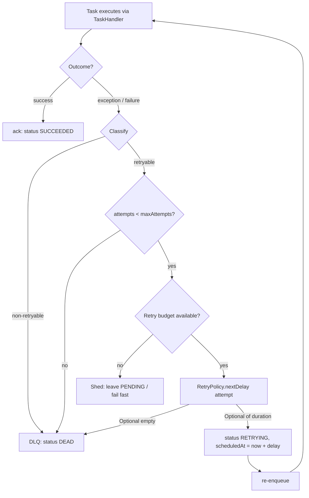
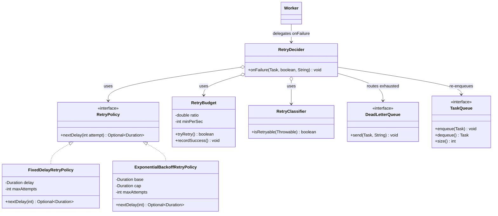
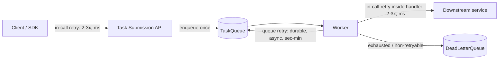

# Retries and Backoff

> Where this fits in the project: retries are the seam between the `Worker`, the `TaskQueue`, and the `DeadLetterQueue`. When a `TaskHandler` fails, *something* must decide whether to try again, how long to wait, and when to give up. That decision is the `RetryPolicy`, and getting it wrong is how a single slow downstream turns a healthy task queue into a self-inflicted denial-of-service.

---

## 1. Why this exists

In a single-process program, when a function call fails you either propagate the exception or you don't. There is no third option, because there is no network, no flaky disk, no overloaded peer, no "it'll probably work next time."

Distributed systems are different. The dominant failure mode is not "this is permanently broken" — it is **transient failure**: a connection reset, a 503 from a service that is restarting, a `deadlock detected` from Postgres, a timeout because GC paused the peer for 400ms. These failures clear on their own. Retrying is often the *correct* and cheapest fix.

But retries are a loaded gun pointed at your own infrastructure. The history of production outages is littered with **retry storms**: a downstream service slows down, every caller retries, the retries triple the load, the downstream falls over completely, and now the retries are hammering a dead service while also starving the callers' own thread pools. The 2015 AWS DynamoDB outage, countless internal "thundering herd" postmortems, and the reason every serious RPC framework (gRPC, Finagle, Envoy) ships **retry budgets** all trace back to the same lesson:

> Naive retries do not add resilience. They add a positive feedback loop. A retry policy is a control system, and an uncontrolled control system oscillates and explodes.

This chapter builds a real `RetryPolicy` for our Task Queue: exponential backoff with **full jitter**, a **cap**, a **retry budget**, a **retryable vs non-retryable classification**, and the integration with **idempotency** (so retries are safe) and the **dead-letter queue** (so giving up is observable). We also answer the architecture question almost everyone gets wrong on the first try: *where do retries live — client, server, or queue?*



---

## 2. The naive version

Here is the retry code almost everyone writes first. It lives inside the `Worker`, it loops, and it sleeps.

```java
// BAD: do not ship this.
public void process(Task task) {
    int attempt = 0;
    while (true) {
        try {
            TaskHandler handler = registry.get(task.type());
            TaskResult result = handler.handle(task);
            if (result.success()) {
                markSucceeded(task);
                return;
            }
            throw new RuntimeException(result.message());
        } catch (Exception e) {
            attempt++;
            if (attempt >= 3) {
                markFailed(task);   // just give up, silently
                return;
            }
            try {
                Thread.sleep(1000); // fixed 1s, on the worker thread
            } catch (InterruptedException ie) {
                Thread.currentThread().interrupt();
                return;
            }
        }
    }
}
```

Everything that can be wrong with retries is wrong here:

- **It blocks a worker thread while sleeping.** With a pool of 16 workers and a downstream that takes 1s to fail, three retries pin a worker for 3+ seconds per task. Throughput collapses precisely when the system is already struggling. (Virtual threads help with the *cost* of the blocked thread — see [`../06-concurrency/futures-and-completablefuture.md`](../06-concurrency/futures-and-completablefuture.md) — but not with the underlying problem of in-process synchronous retry.)
- **Fixed delay = synchronized retries.** Every failing task waits exactly 1000ms, so they all retry at the same instant. That is a thundering herd by construction.
- **No classification.** A `400 Bad Request` (the payload is malformed and will *never* succeed) is retried three times just like a `503`. You waste capacity on hopeless work.
- **No cap, no budget.** If `maxAttempts` were larger this loop could retry forever; nothing limits the *aggregate* retry rate across all tasks.
- **`markFailed` then nothing.** The task vanishes. No dead-letter, no reason, no operator visibility.
- **Retry logic is welded into the worker.** You cannot test it, swap it per task type, or reason about it independently.

---

## 3. Improved version

First fix: pull the timing decision out of the worker and behind the canonical `RetryPolicy` interface, and stop blocking — instead of `Thread.sleep`, re-enqueue the task with a future `scheduledAt` so the **queue** owns the delay (see [`../07-queues-and-messaging/delayed-queues.md`](../07-queues-and-messaging/delayed-queues.md)).

```java
public interface RetryPolicy {
    /**
     * @param attempt the number of attempts already made (1 = first attempt just failed)
     * @return Optional.empty() to stop retrying; otherwise the delay before the next attempt.
     */
    Optional<Duration> nextDelay(int attempt);
}
```

A first, honest implementation: fixed delay with a maximum attempt count.

```java
public final class FixedDelayRetryPolicy implements RetryPolicy {
    private final Duration delay;
    private final int maxAttempts;

    public FixedDelayRetryPolicy(Duration delay, int maxAttempts) {
        if (delay.isNegative()) throw new IllegalArgumentException("delay must be >= 0");
        if (maxAttempts < 1) throw new IllegalArgumentException("maxAttempts must be >= 1");
        this.delay = delay;
        this.maxAttempts = maxAttempts;
    }

    @Override
    public Optional<Duration> nextDelay(int attempt) {
        return attempt >= maxAttempts ? Optional.empty() : Optional.of(delay);
    }
}
```

And the worker now *decides* but does not *wait*:

```java
void onFailure(Task task, RetryPolicy policy, TaskQueue queue, DeadLetterQueue dlq, String reason) {
    int attempted = task.attempts() + 1;
    Optional<Duration> delay = policy.nextDelay(attempted);
    if (delay.isEmpty()) {
        dlq.send(task.withStatus(TaskStatus.DEAD), reason);   // exhausted
        return;
    }
    Instant when = Instant.now().plus(delay.get());
    Task retrying = task.toBuilder()
            .attempts(attempted)
            .status(TaskStatus.RETRYING)
            .scheduledAt(when)
            .build();
    queue.enqueue(retrying);   // the queue, not the worker, waits
}
```

This is a real improvement: the worker thread is freed immediately, the policy is testable in isolation, and exhaustion routes to the DLQ with a reason. But fixed delay still synchronizes retries, and we still retry non-retryable failures. We fix both next.

---

## 4. Production-quality version

The version a staff engineer ships has four properties the naive code lacked:

1. **Exponential backoff** so delays grow (`base * 2^(attempt-1)`), spacing out repeated failures instead of hammering on a fixed cadence.
2. **Full jitter** so two tasks that fail at the same instant do *not* retry at the same instant. This is the single most important and most-skipped detail.
3. **A cap** on the maximum delay, so backoff cannot grow to absurd values (1 hour, 1 day) that effectively lose the task.
4. A clean separation between **per-task limits** (`maxAttempts`, lives on the `Task`) and the **policy** (timing, lives in `RetryPolicy`), plus a **retry budget** layered on top to bound *aggregate* retry rate.

### Exponential backoff with full jitter

The canonical reference is the AWS Architecture Blog's "Exponential Backoff And Jitter." Their experiment compared four strategies under contention. The result, paraphrased: **full jitter wins.** "No jitter" creates clustered retries; "equal jitter" (`half + random(half)`) is better but still clusters; **full jitter** — pick a uniformly random delay in `[0, cappedExponential]` — gives the lowest contention and competitive completion time.

```java
import java.time.Duration;
import java.util.Optional;
import java.util.concurrent.ThreadLocalRandom;

public final class ExponentialBackoffRetryPolicy implements RetryPolicy {
    private final Duration base;     // e.g. 200ms
    private final Duration cap;      // e.g. 30s — backoff never exceeds this
    private final int maxAttempts;   // e.g. 6

    public ExponentialBackoffRetryPolicy(Duration base, Duration cap, int maxAttempts) {
        if (base.isNegative() || base.isZero()) throw new IllegalArgumentException("base must be > 0");
        if (cap.compareTo(base) < 0) throw new IllegalArgumentException("cap must be >= base");
        if (maxAttempts < 1) throw new IllegalArgumentException("maxAttempts must be >= 1");
        this.base = base;
        this.cap = cap;
        this.maxAttempts = maxAttempts;
    }

    @Override
    public Optional<Duration> nextDelay(int attempt) {
        if (attempt >= maxAttempts) {
            return Optional.empty();              // signal: stop, send to DLQ
        }
        // Exponential ceiling, capped. Compute in millis with overflow-safe shifting.
        long baseMs = base.toMillis();
        long capMs = cap.toMillis();
        // attempt is 1-based; first retry uses 2^0 = 1x base.
        int shift = Math.min(attempt - 1, 30);   // 2^30 ms ~= 12 days; clamp to avoid overflow
        long exponential = (shift >= 62) ? capMs : Math.min(capMs, baseMs << shift);
        // FULL JITTER: uniformly random in [0, exponential].
        long jittered = ThreadLocalRandom.current().nextLong(exponential + 1);
        return Optional.of(Duration.ofMillis(jittered));
    }
}
```

> Why `[0, exponential]` and not `exponential` exactly? Because if 10,000 tasks fail at `t=0`, "exponential exactly" makes all 10,000 retry at `t=200ms`, then all at `t=400ms`, forever in lockstep. Full jitter spreads those 10,000 retries uniformly across the window, so the downstream sees a smooth trickle instead of a wall.

### Retryable vs non-retryable classification

`nextDelay` answers *when*. It does not answer *whether*. Some failures must never be retried no matter how many attempts remain. We model retryability on the `TaskResult` (the handler knows best) and back it with an exception classifier (for failures the handler didn't anticipate).

```java
// Canonical model — the handler tells us whether a failure is worth retrying.
public record TaskResult(boolean success, String message, boolean retryable) {
    public static TaskResult ok()                 { return new TaskResult(true, "ok", false); }
    public static TaskResult retry(String why)    { return new TaskResult(false, why, true); }
    public static TaskResult fatal(String why)    { return new TaskResult(false, why, false); }
}
```

For raw exceptions, classify by *category*, never by message string:

```java
public final class RetryClassifier {

    /** True if the failure is transient and worth retrying. */
    public boolean isRetryable(Throwable t) {
        return switch (t) {
            // Transient: network and overload conditions clear on their own.
            case java.net.SocketTimeoutException ignored -> true;
            case java.net.ConnectException ignored      -> true;
            case java.sql.SQLTransientException ignored -> true;
            // Deterministic / caller errors: retrying changes nothing.
            case IllegalArgumentException ignored       -> false;
            case com.example.tq.PayloadValidationException ignored -> false;
            case java.sql.SQLIntegrityConstraintViolationException ignored -> false;
            default -> false;   // FAIL CLOSED: unknown => non-retryable.
        };
    }
}
```

> The default arm returns `false`. Unknown failures are treated as non-retryable. This is the safe default: an unclassified bug that retries forever is far more damaging than one that dead-letters and pages a human. You whitelist *into* retryability, you do not blacklist out of it.

A useful rule of thumb, mapped to HTTP since most downstreams speak it:

| Symptom | Example | Retryable? | Why |
|---|---|---|---|
| Connection/timeout | `SocketTimeoutException`, `ConnectException` | Yes | Peer was momentarily unreachable |
| Overload | HTTP 429, 503 | Yes (honor `Retry-After`) | Backpressure signal, not a defect |
| Server error | HTTP 500, 502, 504 | Yes, cautiously | Often transient; bound with budget |
| Deadlock / serialization | Postgres `40P01`, `40001` | Yes | Re-running resolves the conflict |
| Bad request | HTTP 400, 422 | No | Same input fails identically |
| Auth | HTTP 401, 403 | No (unless token refresh) | Retrying spends quota for nothing |
| Not found | HTTP 404 | Usually no | Resource isn't going to appear |
| Constraint violation | unique key conflict | No (often *already done* — idempotent) | Retrying repeats the same failure |

### Retry budgets — bounding aggregate retry rate

`maxAttempts` bounds retries *per task*. It does nothing to bound retries *across all tasks at once*. If a downstream goes hard down, every in-flight task burns all its attempts simultaneously — and the retry traffic can be several multiples of the original traffic. A **retry budget** caps retries as a fraction of successful traffic (Finagle popularized "retries may be at most X% of requests"):

```java
import java.util.concurrent.atomic.LongAdder;

/**
 * Token-style retry budget: allow retries up to {@code ratio} of recent successes,
 * plus a small minimum so a cold system can still retry. Thread-safe, allocation-free.
 */
public final class RetryBudget {
    private final double ratio;       // e.g. 0.2 => retries <= 20% of successes
    private final int minPerSec;      // floor so low-traffic systems can still retry
    private final LongAdder successes = new LongAdder();
    private final LongAdder retries   = new LongAdder();

    public RetryBudget(double ratio, int minPerSec) {
        this.ratio = ratio;
        this.minPerSec = minPerSec;
    }

    public void recordSuccess() { successes.add(1); }

    /** @return true if a retry token is available (and consumes it). */
    public boolean tryRetry() {
        long ok = successes.sum();
        long used = retries.sum();
        long allowed = minPerSec + (long) (ok * ratio);
        if (used < allowed) {
            retries.add(1);
            return true;
        }
        return false;   // budget exhausted: shed the retry, fail fast
    }
}
```

In production you would window these counters (e.g. a sliding 10s window via a ring buffer or Micrometer) rather than accumulate forever, but the control law is the same: **when the downstream is broken, the budget runs out, retries stop, and you fail fast to the DLQ instead of amplifying the outage.**

### Tying it together: the retry decision

```java
public final class RetryDecider {
    private final RetryPolicy policy;
    private final RetryBudget budget;
    private final RetryClassifier classifier;
    private final DeadLetterQueue dlq;
    private final TaskQueue queue;

    public RetryDecider(RetryPolicy policy, RetryBudget budget, RetryClassifier classifier,
                        DeadLetterQueue dlq, TaskQueue queue) {
        this.policy = policy; this.budget = budget; this.classifier = classifier;
        this.dlq = dlq; this.queue = queue;
    }

    /** Called by the Worker when a Task fails. Never blocks; never sleeps. */
    public void onFailure(Task task, boolean retryableHint, String reason) {
        int attempted = task.attempts() + 1;

        if (!retryableHint) {                       // non-retryable: straight to DLQ
            dlq.send(task.withStatus(TaskStatus.DEAD), "non-retryable: " + reason);
            return;
        }
        Optional<Duration> delay = policy.nextDelay(attempted);
        if (delay.isEmpty()) {                      // attempts exhausted
            dlq.send(task.withStatus(TaskStatus.DEAD), "max attempts reached: " + reason);
            return;
        }
        if (!budget.tryRetry()) {                   // aggregate budget blown: shed
            dlq.send(task.withStatus(TaskStatus.DEAD), "retry budget exhausted: " + reason);
            return;
        }
        Instant when = Instant.now().plus(delay.get());
        queue.enqueue(task.toBuilder()
                .attempts(attempted)
                .status(TaskStatus.RETRYING)
                .scheduledAt(when)
                .build());
    }
}
```

Note what this gives us: the worker thread returns to the pool in microseconds, retries are jittered and capped, hopeless work is dead-lettered immediately, and a downstream outage drains the budget and stops the storm. That is the whole point.

---

## 5. Code walkthrough

### Beginner: a standalone retry helper (understand the loop, then never write it this way in the worker)

```java
import java.time.Duration;
import java.util.Optional;

public final class Retry {
    /** Synchronous retry — fine for a CLI or a startup probe, NOT for a hot worker path. */
    public static <T> T withRetry(java.util.concurrent.Callable<T> action, RetryPolicy policy)
            throws Exception {
        int attempt = 0;
        Exception last = null;
        while (true) {
            attempt++;
            try {
                return action.call();
            } catch (Exception e) {
                last = e;
                Optional<Duration> delay = policy.nextDelay(attempt);
                if (delay.isEmpty()) throw last;        // give up, surface the cause
                Thread.sleep(delay.get().toMillis());   // OK to block here: not a pooled worker
            }
        }
    }
}
```

```java
// Usage: probe a dependency at startup, retrying transient connection failures.
String version = Retry.withRetry(
        () -> jdbc.queryForObject("SELECT version()", String.class),
        new ExponentialBackoffRetryPolicy(Duration.ofMillis(200), Duration.ofSeconds(5), 6));
System.out.println("DB ready: " + version);
```

> Use synchronous retry only on cold paths (startup, one-shot scripts) where blocking the calling thread is acceptable. On a worker pool it is poison — the *queue* must own the delay.

### Intermediate: a `Worker` that delegates the decision

```java
public final class Worker implements Runnable {
    private final TaskQueue queue;
    private final HandlerRegistry registry;
    private final RetryDecider retry;
    private final MetricsCollector metrics;
    private volatile boolean running = true;

    public Worker(TaskQueue queue, HandlerRegistry registry,
                  RetryDecider retry, MetricsCollector metrics) {
        this.queue = queue; this.registry = registry;
        this.retry = retry; this.metrics = metrics;
    }

    @Override
    public void run() {
        while (running) {
            Task task;
            try {
                task = queue.dequeue();               // blocks until a due task arrives
            } catch (InterruptedException e) {
                Thread.currentThread().interrupt();
                return;
            }
            execute(task);
        }
    }

    private void execute(Task task) {
        TaskHandler handler = registry.get(task.type());
        var timer = metrics.startTimer();
        try {
            TaskResult result = handler.handle(task);
            if (result.success()) {
                metrics.counter("task.succeeded", "type", task.type()).increment();
                retry.budget().recordSuccess();       // feed the budget on success
                queue.ack(task.withStatus(TaskStatus.SUCCEEDED));
            } else {
                metrics.counter("task.failed", "type", task.type()).increment();
                retry.onFailure(task, result.retryable(), result.message());
            }
        } catch (Exception e) {
            metrics.counter("task.errored", "type", task.type()).increment();
            boolean retryable = new RetryClassifier().isRetryable(e);
            retry.onFailure(task, retryable, e.toString());
        } finally {
            timer.stop(metrics.timer("task.duration", "type", task.type()));
        }
    }

    public void stop() { running = false; }
}
```

The worker is now blissfully simple. It executes, classifies the outcome, and hands the retry decision to `RetryDecider`. It never sleeps, never loops on a single task, never silently drops work.

### Production-inspired: a Spring-wired, composable retry stack with Resilience4j interop

In Phase 3 we adopt Resilience4j for circuit breaking (see [`circuit-breakers.md`](circuit-breakers.md)). The crucial design point is that **our `RetryPolicy` and Resilience4j's `Retry` solve different layers** and compose:

- Resilience4j `Retry` wraps a *single downstream call* inside one `handle()` invocation (e.g. an HTTP call to a payment provider). It retries *in-process, fast, a couple of times* for blips lasting milliseconds.
- Our `RetryPolicy` retries *the whole task* across the *queue*, over seconds-to-minutes, surviving worker restarts. It is durable and asynchronous.

```java
import io.github.resilience4j.retry.Retry;
import io.github.resilience4j.retry.RetryConfig;
import io.github.resilience4j.retry.RetryRegistry;
import org.springframework.context.annotation.Bean;
import org.springframework.context.annotation.Configuration;
import java.time.Duration;

@Configuration
public class RetryConfiguration {

    /** Queue-level (durable, async) retry policy used by RetryDecider. */
    @Bean
    public RetryPolicy taskRetryPolicy() {
        return new ExponentialBackoffRetryPolicy(
                Duration.ofMillis(500),   // base
                Duration.ofSeconds(30),   // cap
                6);                       // maxAttempts default; Task.maxAttempts can override
    }

    @Bean
    public RetryBudget retryBudget() {
        return new RetryBudget(0.2, 10);  // retries <= 20% of successes + 10/sec floor
    }

    /** In-call (fast, in-process) retry for a flaky HTTP downstream, used INSIDE a handler. */
    @Bean
    public Retry httpCallRetry() {
        RetryConfig cfg = RetryConfig.custom()
                .maxAttempts(3)
                .intervalFunction(io.github.resilience4j.core.IntervalFunction
                        .ofExponentialRandomBackoff(Duration.ofMillis(50), 2.0, 0.5)) // jitter
                .retryOnException(t ->
                        t instanceof java.net.SocketTimeoutException
                     || t instanceof java.net.ConnectException)
                .build();
        return RetryRegistry.of(cfg).retry("http-call");
    }
}
```

A handler using the *in-call* retry, while the *queue-level* retry remains the outer safety net:

```java
@Component("charge-card")
public final class ChargeCardHandler implements TaskHandler {
    private final PaymentClient client;
    private final Retry httpCallRetry;

    public ChargeCardHandler(PaymentClient client, Retry httpCallRetry) {
        this.client = client;
        this.httpCallRetry = httpCallRetry;
    }

    @Override
    public TaskResult handle(Task task) {
        var charge = ChargeRequest.fromJson(task.payload());
        try {
            // Idempotency key = task.id so an in-call retry never double-charges.
            var decorated = Retry.decorateCheckedSupplier(httpCallRetry,
                    () -> client.charge(charge, /* idempotencyKey */ task.id()));
            ChargeResult r = decorated.get();
            return r.approved() ? TaskResult.ok() : TaskResult.fatal("declined: " + r.code());
        } catch (java.net.SocketTimeoutException | java.net.ConnectException e) {
            return TaskResult.retry("transient: " + e.getMessage()); // hand back to the queue
        } catch (Exception e) {
            return TaskResult.fatal("unexpected: " + e);
        }
    }
}
```

> The `task.id()` is the idempotency key threaded all the way to the payment provider. That is what makes retries — at *both* layers — safe. Without it, every retry risks a double charge. See [`idempotency.md`](idempotency.md).

---

## 6. How this applies to our Task Queue project



Concrete mapping to the canonical model:

- **`Task.attempts` / `Task.maxAttempts`** — `attempts` is incremented on each failure; `maxAttempts` is the per-task ceiling. `RetryPolicy` enforces a *default* ceiling, but the `Task`'s own `maxAttempts` should win when smaller (a "send welcome email" task might allow 10 attempts; a "charge card" task might allow 2).
- **`TaskStatus.RETRYING`** — the state a task occupies between a retryable failure and its next execution. `SCHEDULED` is for future-dated work in general; `RETRYING` is specifically the retry path, which lets dashboards distinguish "scheduled jobs" from "things that are failing."
- **`TaskResult.retryable`** — the handler's authoritative signal. `RetryClassifier` is the fallback for raw exceptions the handler didn't catch.
- **`RetryPolicy.nextDelay(int) -> Optional<Duration>`** — `Optional.empty()` is the canonical "stop, dead-letter it" signal. This is why the interface returns an `Optional` rather than throwing or returning a sentinel.
- **`DeadLetterQueue.send(Task, String)`** — the terminal sink for `DEAD` tasks, always with a human-readable reason. See [`dlq.md`](dlq.md).
- **`Task.scheduledAt`** — set to `now + delay` so the [delayed queue](../07-queues-and-messaging/delayed-queues.md) releases the task at the right time instead of the worker sleeping.

### Where do retries live? Client vs server vs queue

This is the architecture question. The answer is **all three, at different layers, with strict rules** — and the dangerous mistake is **stacked retries** (each layer multiplies the one below it).



| Layer | What it retries | Timescale | Durable? | Rule |
|---|---|---|---|---|
| **Client** | The HTTP `POST /tasks` submission | milliseconds | No | Use an idempotency key on submit so a retried submit doesn't create duplicate tasks |
| **Handler (in-call)** | A single downstream RPC inside `handle()` | milliseconds | No | 2–3 attempts max; never retry across queue boundaries here |
| **Queue (task-level)** | The whole task | seconds–minutes | Yes | This is the *primary* retry mechanism; survives crashes |

> The cardinal sin is **multiplicative retries**: client retries 3x, each submission's task retries 6x at the queue, and the handler retries 3x per attempt = up to 54 calls to the downstream for one logical request. The discipline is: **retry at exactly one layer for any given failure class, and disable retries at every layer below it.** In our platform, transient *downstream* failures retry at the *queue* (durable), and the handler's in-call retry is reserved only for sub-second blips that aren't worth re-queuing.

---

## 7. Tradeoffs

| Decision | Option A | Option B | When to pick which |
|---|---|---|---|
| Backoff shape | Fixed delay | Exponential | Fixed for predictable, low-volume retries (cron-like); exponential for anything facing a shared downstream |
| Jitter | No jitter | Full jitter | Always full jitter under concurrency; "no jitter" is acceptable only for a single non-concurrent retrier |
| Retry location | In worker (`Thread.sleep`) | In queue (`scheduledAt`) | Queue, always, for pooled workers; in-thread sleep only on cold/startup paths |
| Limit | `maxAttempts` only | `maxAttempts` + retry budget | Budget once you have a shared downstream and real traffic; `maxAttempts` alone for a closed system |
| Classification | Retry everything | Whitelist retryable | Whitelist in production; "retry everything" wastes capacity on hopeless work and masks bugs |
| Idempotency | Best-effort | Enforced via key | Enforced whenever at-least-once delivery + side effects (payments, emails) |
| Stop signal | Throw / sentinel | `Optional.empty()` | `Optional` — explicit, type-safe, forces the caller to handle exhaustion |

Concrete numbers worth memorizing: with base 200ms and cap 30s, attempts land around (full-jitter, so *up to*): 0.2s, 0.4s, 0.8s, 1.6s, 3.2s, 6.4s, ... clamped at 30s. Six attempts span roughly a minute of real time — enough to ride out a typical deploy/restart of a downstream, short enough that an operator still gets paged promptly when it truly fails.

---

## 8. Common mistakes and pitfalls

- **No jitter.** Synchronized retries are a self-inflicted thundering herd. *Fix:* full jitter, `random(0, cappedExp)`.
- **Retrying non-retryable failures.** A 400/validation error retried 6 times wastes 6x capacity and never succeeds. *Fix:* classify and fail closed; route non-retryable straight to the DLQ.
- **Sleeping on the worker thread.** Blocks the pool exactly when it's most contended. *Fix:* re-enqueue with `scheduledAt`; let the delayed queue wait.
- **No cap.** Exponential backoff without a cap eventually schedules retries hours or days out, effectively losing the task. *Fix:* clamp to `cap`.
- **No retry budget.** Per-task limits don't stop an aggregate storm during a downstream outage. *Fix:* a `RetryBudget` keyed off success rate.
- **Retrying without idempotency.** At-least-once + retries = duplicate side effects (double charges, double emails). *Fix:* idempotency keys, `task.id` threaded to downstreams; see [`idempotency.md`](idempotency.md).
- **Stacked/multiplicative retries.** Client × handler × queue retries explode call counts. *Fix:* retry one layer per failure class; disable below it.
- **Counting attempts off-by-one.** Confusing "attempts made" with "attempt number about to run" causes either one-too-few or one-too-many tries. *Fix:* fix a convention (here: `attempt` = attempts already made) and test the boundary.
- **Swallowing the final cause.** Giving up without recording *why* makes DLQ triage impossible. *Fix:* always pass a reason string to `DeadLetterQueue.send`.
- **Ignoring `Retry-After`.** A 429/503 often tells you exactly how long to wait; ignoring it fights the server. *Fix:* honor `Retry-After` when present, overriding computed backoff.

---

## 9. Refactoring exercise

**Bad** — the failure handler welds timing, limits, and routing into one untestable blob:

```java
void handleFailure(Task task) {
    if (task.attempts() < 3) {
        Thread.sleep(1000 * (task.attempts() + 1)); // linear, no jitter, blocks
        task = task.withAttempts(task.attempts() + 1);
        queue.enqueue(task);
    } else {
        log.error("giving up on " + task.id());     // lost: no DLQ, no reason
    }
}
```

**Improved** — extract the policy, stop blocking, add the DLQ:

```java
void handleFailure(Task task, RetryPolicy policy) {
    int attempted = task.attempts() + 1;
    Optional<Duration> delay = policy.nextDelay(attempted);
    if (delay.isEmpty()) {
        dlq.send(task.withStatus(TaskStatus.DEAD), "max attempts");
        return;
    }
    queue.enqueue(task.toBuilder()
            .attempts(attempted)
            .status(TaskStatus.RETRYING)
            .scheduledAt(Instant.now().plus(delay.get()))
            .build());
}
```

**Production-quality** — classification, budget, idempotent dedupe, and observability, all composed:

```java
public void handleFailure(Task task, Throwable cause, TaskResult resultOrNull) {
    boolean retryable = (resultOrNull != null)
            ? resultOrNull.retryable()
            : classifier.isRetryable(cause);
    String reason = (resultOrNull != null) ? resultOrNull.message() : String.valueOf(cause);
    int attempted = task.attempts() + 1;
    int ceiling = Math.min(task.maxAttempts(), policyMaxAttempts);

    if (!retryable || attempted >= ceiling) {
        metrics.counter("task.deadlettered", "type", task.type(),
                "cause", retryable ? "exhausted" : "non-retryable").increment();
        dlq.send(task.withStatus(TaskStatus.DEAD), reason);
        return;
    }
    Optional<Duration> delay = policy.nextDelay(attempted);
    if (delay.isEmpty() || !budget.tryRetry()) {
        dlq.send(task.withStatus(TaskStatus.DEAD),
                 delay.isEmpty() ? "policy exhausted: " + reason : "budget exhausted: " + reason);
        return;
    }
    metrics.counter("task.retried", "type", task.type(), "attempt", String.valueOf(attempted))
           .increment();
    queue.enqueue(task.toBuilder()
            .attempts(attempted)
            .status(TaskStatus.RETRYING)
            .scheduledAt(Instant.now().plus(delay.get()))
            .build());
}
```

---

## 10. Exercises

> Solutions are in [section 11](#11-solutions). Try each before peeking.

### Easy

1. **(Knowledge check)** Explain in two sentences why "full jitter" beats "no jitter" for retries, and give one scenario where jitter doesn't matter at all.
2. **(Coding)** Implement `LinearBackoffRetryPolicy` where the delay is `step * attempt`, capped at `maxAttempts`. It must satisfy the `RetryPolicy` contract (return `Optional.empty()` when exhausted).

### Medium

3. **(Coding)** Implement `nextDelay` for `ExponentialBackoffRetryPolicy` with full jitter and a cap, and write three JUnit 5 + AssertJ tests proving: (a) it returns empty at `maxAttempts`, (b) the delay never exceeds the cap, (c) two consecutive calls at the same attempt are (almost surely) different.
4. **(Refactoring)** Given a `Worker` that calls `Thread.sleep` to retry, refactor it to re-enqueue with `scheduledAt` and delegate the decision to a `RetryDecider`. State which property of the worker pool this fixes.

### Hard

5. **(Design)** Design a windowed `RetryBudget` that limits retries to 20% of successes over a sliding 10-second window (not all-time). Sketch the data structure and the concurrency strategy.
6. **(Interview-style)** A downstream payment provider has a 3-minute outage. Walk through exactly what happens to 50,000 in-flight `charge-card` tasks under (a) the naive policy from section 2, and (b) the production stack from section 4. Quantify the load multiplier and explain why the system survives in case (b).
7. **(Stretch)** Add `Retry-After` support: when a handler returns a retryable failure carrying a server-suggested delay, that delay must override the computed backoff. Extend `TaskResult` minimally and thread it through `RetryDecider`. Discuss the precedence rule when both a budget limit and a `Retry-After` apply.

---

## 11. Solutions

### Solution 1 (Knowledge check)

Full jitter randomizes each retry's delay across `[0, cappedExponential]`, so tasks that failed simultaneously retry at *different* moments, smoothing load on the downstream; "no jitter" makes them all retry at the same instant, recreating the thundering herd backoff was meant to prevent. Jitter doesn't matter when there is exactly **one** retrier with no concurrency (e.g. a single-threaded startup probe) — there is no herd to spread out.

### Solution 2 (Linear backoff)

```java
import java.time.Duration;
import java.util.Optional;

public final class LinearBackoffRetryPolicy implements RetryPolicy {
    private final Duration step;
    private final int maxAttempts;

    public LinearBackoffRetryPolicy(Duration step, int maxAttempts) {
        if (step.isNegative()) throw new IllegalArgumentException("step >= 0");
        if (maxAttempts < 1) throw new IllegalArgumentException("maxAttempts >= 1");
        this.step = step;
        this.maxAttempts = maxAttempts;
    }

    @Override
    public Optional<Duration> nextDelay(int attempt) {
        if (attempt >= maxAttempts) return Optional.empty();
        return Optional.of(step.multipliedBy(attempt));  // attempt-th retry waits step*attempt
    }
}
```

### Solution 3 (Exponential + tests)

The implementation is `ExponentialBackoffRetryPolicy` from section 4. Tests:

```java
import org.junit.jupiter.api.Test;
import java.time.Duration;
import java.util.Optional;
import static org.assertj.core.api.Assertions.assertThat;

class ExponentialBackoffRetryPolicyTest {

    private final RetryPolicy policy =
            new ExponentialBackoffRetryPolicy(Duration.ofMillis(200), Duration.ofSeconds(30), 6);

    @Test
    void returnsEmptyAtMaxAttempts() {
        assertThat(policy.nextDelay(6)).isEmpty();
        assertThat(policy.nextDelay(7)).isEmpty();
    }

    @Test
    void neverExceedsTheCap() {
        for (int attempt = 1; attempt < 6; attempt++) {
            for (int i = 0; i < 1000; i++) {
                Optional<Duration> d = policy.nextDelay(attempt);
                assertThat(d).isPresent();
                assertThat(d.get()).isLessThanOrEqualTo(Duration.ofSeconds(30));
                assertThat(d.get()).isGreaterThanOrEqualTo(Duration.ZERO);
            }
        }
    }

    @Test
    void jitterProducesVariation() {
        // Across many samples at the same attempt, we should see more than one distinct value.
        long distinct = java.util.stream.IntStream.range(0, 200)
                .mapToObj(i -> policy.nextDelay(4).orElseThrow().toMillis())
                .distinct()
                .count();
        assertThat(distinct).isGreaterThan(1);
    }
}
```

### Solution 4 (Refactor away `Thread.sleep`)

See the **improved** and **production-quality** snippets in section 9. The property fixed: **worker-pool throughput / liveness under failure**. Sleeping holds a pool thread for the entire backoff, so a downstream that fails slowly serializes the pool's effective capacity to `poolSize / backoff`. Re-enqueuing returns the thread immediately, so the pool keeps draining healthy tasks while failed ones wait *in the queue*, not in a thread.

### Solution 5 (Windowed retry budget design)

Use a **ring buffer of per-second counters** (a `long[] successes` and `long[] retries`, each length 10) indexed by `epochSecond % 10`. On each record, if the current second's slot is stale (its stored second differs from `now`), reset it to zero before adding — this lazily rolls the window without a background thread. `tryRetry()` sums the 10 success slots and 10 retry slots, computes `allowed = minPerSec*10 + ratio*successSum`, and admits if `retrySum < allowed`. Concurrency: use `AtomicLongArray` for the counters plus an `AtomicLongArray` of "owning second" per slot; the reset-on-stale uses a CAS on the owning-second slot so only one thread zeroes a rolled bucket. This is allocation-free, lock-free, and bounded in memory. (For most systems, Micrometer's `Counter` over a `MeterRegistry` with a rate query in Prometheus is simpler and good enough — reach for the hand-rolled ring only when you need the decision *in-process and synchronous*.)

### Solution 6 (Outage walkthrough)

**(a) Naive (section 2):** Each of 50,000 tasks blocks a worker for ~1s per attempt × 3 attempts with fixed 1s sleeps, all retrying in lockstep. With, say, 64 workers, the pool is fully saturated by ~64 sleeping tasks at a time; effective throughput drops toward zero, the queue backs up, and every retry hits the dead provider at synchronized instants — peak downstream load is up to **3× original** and *clustered*. When the outage clears, the backlog dumps all at once (no jitter) and may knock the provider over again. Tasks that exhaust 3 attempts are silently dropped — **data loss, no DLQ**.

**(b) Production (section 4):** Workers never sleep — they re-enqueue with jittered `scheduledAt`, so the 64 threads keep draining other work. Retries spread uniformly across the backoff window (full jitter), so the provider sees a *smooth* trickle, not a wall. As failures pile up, the `RetryBudget` (20% of successes) exhausts within seconds because successes drop to ~0 during the outage; further retries are **shed to the DLQ** instead of amplifying. Peak downstream load stays bounded near `minPerSec + 0.2×successRate` ≈ the floor, i.e. roughly **1× or less**, not 3×. When the provider recovers, DLQ'd tasks can be **replayed deliberately** (rate-limited) rather than stampeding. The system survives because the budget converts an unbounded positive feedback loop into a bounded, self-limiting one, and because nothing is lost — exhausted work is in the DLQ with a reason.

### Solution 7 (Retry-After)

Extend `TaskResult` with an optional server-suggested delay; keep the canonical 3-arg form as a delegating constructor so existing code compiles unchanged:

```java
public record TaskResult(boolean success, String message, boolean retryable, Duration retryAfter) {
    public TaskResult(boolean success, String message, boolean retryable) {
        this(success, message, retryable, null);   // backwards-compatible
    }
    public Optional<Duration> retryAfterOpt() { return Optional.ofNullable(retryAfter); }
    public static TaskResult retryAfter(String why, Duration d) {
        return new TaskResult(false, why, true, d);
    }
}
```

In `RetryDecider.onFailure`, `Retry-After` overrides the computed backoff but is still gated by the budget:

```java
Optional<Duration> serverHint = resultOrNull == null
        ? Optional.empty() : resultOrNull.retryAfterOpt();
Optional<Duration> computed = policy.nextDelay(attempted);
if (computed.isEmpty()) { dlq.send(task.withStatus(TaskStatus.DEAD), "exhausted"); return; }
if (!budget.tryRetry()) { dlq.send(task.withStatus(TaskStatus.DEAD), "budget"); return; }
Duration delay = serverHint.orElse(computed.get());   // precedence: server hint wins on timing
queue.enqueue(task.toBuilder().attempts(attempted)
        .status(TaskStatus.RETRYING)
        .scheduledAt(Instant.now().plus(delay)).build());
```

**Precedence rule:** `Retry-After` governs *when* the next attempt happens (the server knows its own recovery window better than our exponential guess), but the *budget* and *maxAttempts* still govern *whether* a retry happens at all. A server saying "retry in 2s" does not earn you a retry token if the budget is blown — otherwise a misbehaving downstream could force unlimited retries by always returning a `Retry-After`.

---

## 12. Interview questions and takeaways

1. **Why is exponential backoff alone insufficient — what must you add?** Jitter. Without it, clients that fail together retry together; backoff spaces *successive* retries but not *concurrent* ones. Add a cap too, so delays don't grow unbounded.

2. **What is a retry storm and how do you prevent it?** A positive feedback loop where retries from many callers amplify load on a degraded downstream until it fully fails. Prevent it with full jitter (decorrelate timing), capped exponential backoff (limit cadence), retry budgets (limit aggregate rate), and circuit breakers (stop calling a known-dead dependency).

3. **How do you decide retryable vs non-retryable?** By failure *category*, not message text. Transient (timeouts, connection resets, 429/503, deadlocks) are retryable; deterministic (400/422 validation, 401/403 auth, constraint violations) are not. Fail closed: unknown → non-retryable.

4. **Where should retries live — client, server, or queue?** All three at different layers, but each failure class retries at exactly one layer with retries disabled below it, to avoid multiplicative blowup. In a task queue, the durable, async queue retry is primary; in-call handler retries are reserved for sub-second blips.

5. **Why do retries require idempotency?** At-least-once delivery plus retries means a side effect can execute more than once. Without idempotency keys, retries cause double charges/emails/writes. The `task.id` is the natural idempotency key.

6. **What's the difference between `maxAttempts` and a retry budget?** `maxAttempts` bounds retries per task; a retry budget bounds retries in aggregate across all tasks. You need both — per-task limits don't stop a fleet-wide storm during an outage.

7. **Why return `Optional<Duration>` from `nextDelay` instead of throwing or returning `null`?** `Optional.empty()` is an explicit, type-checked "stop retrying, dead-letter it" signal that forces the caller to handle exhaustion. `null` invites NPEs; exceptions conflate control flow with errors.

8. **How do retries interact with circuit breakers?** They're complementary: the breaker stops calling a downstream that's failing *fast* (saving capacity and latency), while retries handle *isolated* transient failures. When the breaker is open, you skip the retry entirely and fail fast or dead-letter. See [`circuit-breakers.md`](circuit-breakers.md).

---

## 13. Production considerations

- **Observe the retry pipeline.** Counters for `task.retried{type,attempt}`, `task.deadlettered{cause}`, gauge for `retry.budget.remaining`, and a histogram of `attempts_until_terminal`. A rising retry rate with flat success is the leading indicator of a downstream problem — page on it before users notice. (Micrometer/Prometheus; see [`../10-system-design/observability-and-ops.md`](../10-system-design/observability-and-ops.md).)
- **Cap total time, not just attempts.** A task with 10 attempts at 30s cap can live for minutes; if there's an SLA, enforce a wall-clock deadline (`createdAt + maxLifetime`) in addition to `maxAttempts`, dead-lettering on whichever comes first.
- **Persist `attempts` and `scheduledAt` durably.** In Phase 2 these are columns in Postgres so a worker crash mid-retry doesn't reset the count or lose the schedule. In-memory state evaporates on restart.
- **Beware retry amplification across service hops.** If service A retries calls to B, and B retries calls to C, A's 3 × B's 3 = 9 calls hit C. Document and enforce "retry at the edge nearest the failure" across team boundaries.
- **Make DLQ replay rate-limited and idempotent.** When you replay dead-lettered tasks after fixing a downstream, replay through the same `RateLimiter` (see [`rate-limiting.md`](rate-limiting.md)) so you don't recreate the storm you just escaped — and rely on idempotency keys so replays don't double-apply.
- **Honor `Retry-After` and clock skew.** Trust the server's suggested delay for *timing*, but clamp it to a sane maximum so a buggy downstream can't park your tasks for hours.
- **Test the boundaries.** The attempt-count off-by-one and the "cap reached" transition are the two bugs that ship most often. Cover them explicitly; Testcontainers lets you simulate a flapping Postgres for integration tests.

---

## What We Can Improve In Our Project Using This Concept

Today (Phase 1) our `InMemoryTaskQueue` already consults a `RetryPolicy` in `nack`, but the policy is a `FixedDelayRetryPolicy` with no jitter, no classification, and no budget. Applying this chapter we: (1) ship `ExponentialBackoffRetryPolicy` with **full jitter and a cap** as the default; (2) introduce a `RetryClassifier` plus an authoritative `TaskResult.retryable` so non-retryable work dead-letters immediately instead of burning attempts; (3) add a `RetryBudget` to bound aggregate retry rate during downstream outages; (4) consolidate the decision into a single testable `RetryDecider` that the `Worker` delegates to; (5) thread `task.id` as an idempotency key into handlers so retries are safe. Nothing outside the failure path changes, because everything routes through `RetryPolicy`, `TaskQueue`, and `DeadLetterQueue`.

## Project Refactoring Task

1. Add `ExponentialBackoffRetryPolicy` (base 500ms, cap 30s, maxAttempts 6) and make it the default `RetryPolicy` bean.
2. Add `RetryClassifier` and wire it into `Worker.execute` for raw exceptions; have handlers return `TaskResult.retry(...)` / `TaskResult.fatal(...)` explicitly.
3. Add `RetryBudget(0.2, 10)`, feed it `recordSuccess()` on success and gate retries through `tryRetry()`.
4. Extract `RetryDecider.onFailure(Task, boolean, String)`; replace inline `nack` retry logic with a call to it.
5. Emit `task.retried`, `task.deadlettered`, and `retry.budget.remaining` metrics.
6. Add JUnit 5 + AssertJ tests covering the cap, the empty-at-max boundary, jitter variation, and the non-retryable → DLQ path.

## Git Commit For This Chapter

```text
feat(retries): exponential backoff with full jitter, retry budget, and classification

- add ExponentialBackoffRetryPolicy (capped, full-jitter) as default RetryPolicy
- add RetryClassifier and TaskResult.retryable for retryable/non-retryable routing
- add RetryBudget to bound aggregate retry rate during downstream outages
- extract RetryDecider; Worker delegates onFailure (no more Thread.sleep)
- route exhausted/non-retryable tasks to DeadLetterQueue with a reason
- emit task.retried / task.deadlettered / retry.budget.remaining metrics

Files:
  src/main/java/com/example/tq/retry/RetryPolicy.java
  src/main/java/com/example/tq/retry/ExponentialBackoffRetryPolicy.java
  src/main/java/com/example/tq/retry/FixedDelayRetryPolicy.java
  src/main/java/com/example/tq/retry/RetryClassifier.java
  src/main/java/com/example/tq/retry/RetryBudget.java
  src/main/java/com/example/tq/retry/RetryDecider.java
  src/main/java/com/example/tq/worker/Worker.java
  src/main/java/com/example/tq/model/TaskResult.java
  src/test/java/com/example/tq/retry/ExponentialBackoffRetryPolicyTest.java
  src/test/java/com/example/tq/retry/RetryDeciderTest.java
```

## Architecture Impact

The retry decision becomes a first-class, isolated component (`RetryDecider`) sitting between the `Worker`, the `TaskQueue`, and the `DeadLetterQueue`. Because timing lives in `RetryPolicy` and routing lives in `RetryDecider`, the worker stays trivial and storage-agnostic, and the same retry behavior carries unchanged from the in-memory Phase 1 queue to the Postgres Phase 2 queue to the broker-backed Phase 4 queue. The `RetryBudget` introduces a system-wide control loop that converts a potential positive-feedback failure mode (retry storm) into a bounded, self-limiting one — a property that, combined with [`circuit-breakers.md`](circuit-breakers.md) and [`rate-limiting.md`](rate-limiting.md), defines the platform's resilience posture.

## Interview Takeaways

- Naive retries amplify outages; a retry policy is a control system and must be capped, jittered, and budgeted.
- **Full jitter** is the non-negotiable detail most people miss — it decorrelates concurrent retries.
- Classify failures by category and **fail closed**; never retry deterministic errors.
- Retries belong at **one layer per failure class**; stacked retries multiply load.
- Retries are only safe with **idempotency**; the `task.id` is the natural key, and exhausted work goes to the **DLQ**, never `/dev/null`.
