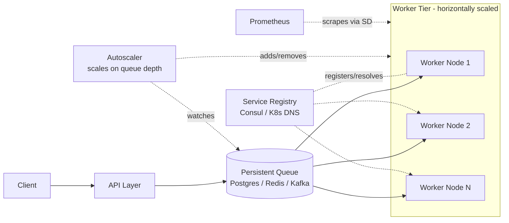
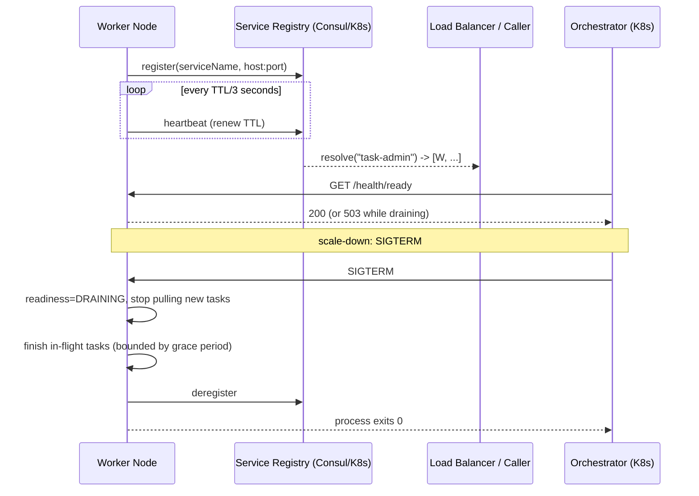
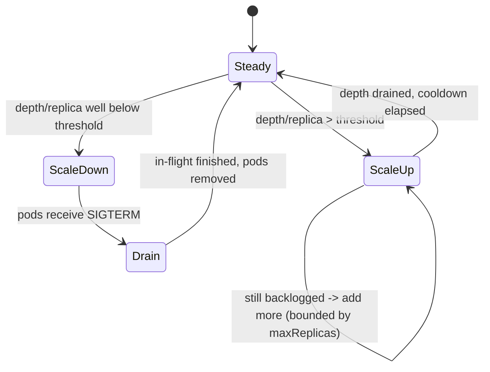
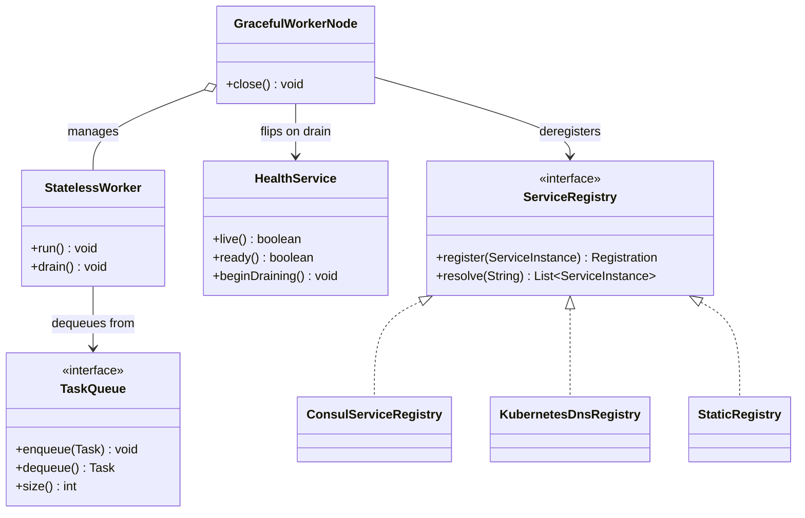

# Service Discovery and Horizontal Scaling

> Where this fits: in **Phase 4** of our Distributed Task Queue, we stop running one worker process and start running *N* interchangeable worker nodes that find each other, the queue, and the metrics backend dynamically — and scale up or down based on how deep the queue is.

Up to now, our `WorkerPool` has scaled *vertically*: more threads inside one JVM. That works until one box's CPU, memory, or network saturates. This chapter is about scaling *horizontally* — running many `Worker` processes across many machines — and the infrastructure problem that immediately follows: **how does anything find anything when instances come and go every few seconds?**

---

## 1. Why this exists — the real problem

A single-node `WorkerPool` (Phase 1) has one fatal property: its capacity is fixed by the machine it runs on. When 50,000 tasks/sec arrive but one box can drain 5,000/sec, the queue grows without bound, latency explodes, and `scheduledAt` deadlines are missed. Vertical scaling (a bigger box) buys you maybe 8–16x and then stops — there is no 4096-core commodity server, and even if there were, it's a single point of failure.

Horizontal scaling fixes capacity *and* availability: run 10 worker processes, each draining 5,000/sec, and you have 50,000/sec with headroom to lose a node. But horizontal scaling is only easy if you solve three problems that don't exist on one box:

1. **Statelessness.** If a worker keeps task state in its own heap, you can't move work between workers or kill a worker safely. Workers must be *interchangeable*.
2. **Service discovery.** Worker A on `10.0.3.17:8080` died; the orchestrator started worker B on `10.0.7.42:8080`. The metrics scraper, the load balancer, and the admin API all need to find B *without a human editing a config file*. Hardcoded IPs were fine in 1999 with one mainframe. They are unworkable when instances live for minutes.
3. **Elasticity.** Traffic is bursty. You want 3 workers at 3 a.m. and 40 at the Black Friday peak, automatically, driven by a real signal — for us, **queue depth**.

> Historical note: the industry went from hand-edited `/etc/hosts` → DNS (1983) → client-side load balancers with static server lists → dynamic service registries (ZooKeeper ~2008, Consul/Eureka ~2014) → orchestrator-native discovery (Kubernetes Services + DNS, ~2016). Each step removed a human from the path of "instance changed, update the routing." Kubernetes is where most of us land today, so we'll use it as the concrete substrate while keeping the abstractions portable.



---

## 2. The naive version — hardcoded peers and a fat worker

Here is the first cut a developer writes when asked to "run more than one worker." It works on a laptop and falls over the moment infrastructure is dynamic.

```java
// NAIVE: a worker that knows its peers by hardcoded address and holds task state on its heap.
public class NaiveWorkerNode {

    // Problem 1: hardcoded peer list. Edit + redeploy every topology change.
    private static final List<String> PEERS =
            List.of("10.0.3.17:8080", "10.0.3.18:8080", "10.0.3.19:8080");

    // Problem 2: per-node mutable state. This worker "owns" these tasks in memory.
    // Kill this process and these in-flight tasks vanish — they are not interchangeable.
    private final Map<String, Task> inFlight = new ConcurrentHashMap<>();

    public void run() {
        while (true) {
            Task t = pullFromLocalQueue();        // local, non-shared queue
            inFlight.put(t.id(), t);
            process(t);
            inFlight.remove(t.id());
        }
    }

    // Problem 3: no health check, no graceful drain. SIGTERM = instant death.
    // Problem 4: load is balanced by... nothing. Each node pulls from its own queue.
}
```

What's wrong, concretely:

- **Hardcoded `PEERS`** breaks the instant an instance is rescheduled to a new IP. Cloud IPs are ephemeral.
- **`inFlight` on the heap** makes the worker *stateful*. You cannot kill it without losing work, cannot rebalance, cannot autoscale safely.
- **No health endpoint** means the load balancer and orchestrator can't tell a hung JVM (deadlocked, GC-thrashing) from a healthy one.
- **No graceful shutdown** means scaling *down* — the whole point of elasticity — drops in-flight tasks and corrupts your success metrics.

---

## 3. Improved version — stateless workers behind shared state + a registry

The key refactor: **push all task state into the shared queue and database; keep the worker's heap disposable.** A worker that crashes mid-task must leave the task recoverable by *any other* worker.

```java
// IMPROVED: the worker owns nothing durable. State lives in the TaskQueue + TaskRepository.
public class StatelessWorker implements Runnable {

    private final TaskQueue queue;            // shared, persistent (Phase 2+: Postgres/broker)
    private final TaskRepository repo;        // source of truth for Task status
    private final Map<String, TaskHandler> handlers;
    private volatile boolean draining = false;

    public StatelessWorker(TaskQueue queue, TaskRepository repo,
                           Map<String, TaskHandler> handlers) {
        this.queue = queue;
        this.repo = repo;
        this.handlers = handlers;
    }

    @Override
    public void run() {
        while (!draining) {
            try {
                Task task = queue.dequeue();                 // blocks; lease semantics in queue
                Task running = task.withStatus(TaskStatus.RUNNING);
                repo.save(running);                          // durable: any node can see this
                TaskResult result = handlers.get(task.type()).handle(running);
                repo.save(running.withStatus(
                        result.success() ? TaskStatus.SUCCEEDED : TaskStatus.FAILED));
            } catch (InterruptedException e) {
                Thread.currentThread().interrupt();
                return;
            } catch (Exception e) {
                // Task remains visible/recoverable because state is durable, not on our heap.
            }
        }
    }

    void drain() { this.draining = true; }
}
```

Now any node is interchangeable. Two pieces remain: nodes must **register** so they can be discovered, and the system must **scale** them. We add a registry abstraction so we aren't married to one vendor.

```java
// Vendor-neutral discovery seam. Implementations: ConsulRegistry, KubernetesDnsRegistry, StaticRegistry.
public interface ServiceRegistry {
    /** Announce that this instance is alive and ready to serve. */
    Registration register(ServiceInstance self);

    /** Resolve all currently-healthy instances of a named service. */
    List<ServiceInstance> resolve(String serviceName);

    /** AutoCloseable handle; close() = deregister. Used in shutdown hooks. */
    interface Registration extends AutoCloseable {}
}

public record ServiceInstance(String serviceName, String id, String host, int port,
                              Map<String, String> metadata) {}
```

---

## 4. Production-quality version — registry + health + load balancing + drain

A staff engineer ships four things together, because they only make sense as a set: a **registry client** with TTL heartbeats, **health checks** the orchestrator and load balancer consume, a **client-side load balancer** that reads the registry, and a **graceful drain** wired to the platform's shutdown signal.



### 4.1 Health checks: liveness vs readiness

These are *different questions* and conflating them is the most common production bug in this area.

| Probe | Question it answers | Failure action | When it must report "bad" |
|---|---|---|---|
| **Liveness** | "Is this process wedged beyond recovery?" | Orchestrator **kills & restarts** the pod | Deadlock, JVM heap death-spiral, event loop stuck |
| **Readiness** | "Should traffic / work be routed here *right now*?" | Removed from LB / load pool, **not killed** | Still warming caches, DB pool not up, **draining** |

```java
public enum HealthState { STARTING, READY, DRAINING, UNHEALTHY }

public final class HealthService {
    private final AtomicReference<HealthState> state = new AtomicReference<>(HealthState.STARTING);
    private final DataSource dataSource;     // we are "ready" only if dependencies are reachable

    public HealthService(DataSource dataSource) { this.dataSource = dataSource; }

    public void markReady()    { state.compareAndSet(HealthState.STARTING, HealthState.READY); }
    public void beginDraining(){ state.set(HealthState.DRAINING); }

    /** Liveness: only false if the process is unrecoverable. Draining is still "alive". */
    public boolean live() { return state.get() != HealthState.UNHEALTHY; }

    /** Readiness: true only when we should receive new work AND deps are healthy. */
    public boolean ready() {
        if (state.get() != HealthState.READY) return false;   // STARTING/DRAINING/UNHEALTHY -> not ready
        try (Connection c = dataSource.getConnection()) {
            return c.isValid(1);                              // shallow dependency probe
        } catch (SQLException e) {
            return false;
        }
    }
}
```

Spring Boot exposes these as Actuator endpoints (`/actuator/health/liveness`, `/actuator/health/readiness`). Wire them to Kubernetes probes:

```yaml
# k8s deployment snippet: probes drive both restart and traffic decisions
livenessProbe:
  httpGet: { path: /actuator/health/liveness, port: 8080 }
  initialDelaySeconds: 20
  periodSeconds: 10
  failureThreshold: 3          # 3 misses (~30s) before kill — avoid flapping on GC pauses
readinessProbe:
  httpGet: { path: /actuator/health/readiness, port: 8080 }
  periodSeconds: 5
  failureThreshold: 2          # react fast: pull from LB quickly when not ready
```

### 4.2 A Consul-style registry client with TTL heartbeats

```java
public final class ConsulServiceRegistry implements ServiceRegistry {

    private final ConsulClient consul;                 // thin HTTP wrapper over Consul's agent API
    private final ScheduledExecutorService heartbeats =
            Executors.newSingleThreadScheduledExecutor(Thread.ofVirtual().factory());
    private final Duration ttl;

    public ConsulServiceRegistry(ConsulClient consul, Duration ttl) {
        this.consul = consul;
        this.ttl = ttl;
    }

    @Override
    public Registration register(ServiceInstance self) {
        consul.registerService(self.serviceName(), self.id(), self.host(), self.port(),
                self.metadata(), ttl);                 // TTL check: registry expires us if we go silent
        // Renew at TTL/3 so two missed beats don't evict a healthy node.
        var handle = heartbeats.scheduleAtFixedRate(
                () -> safePass(self.id()), 0, ttl.toMillis() / 3, TimeUnit.MILLISECONDS);
        return () -> {                                  // AutoCloseable: close() deregisters cleanly
            handle.cancel(true);
            consul.deregister(self.id());
        };
    }

    private void safePass(String id) {
        try { consul.passCheck("service:" + id); }     // "I'm alive" -> resets TTL
        catch (Exception e) { /* log; next beat retries; registry evicts us if we stay down */ }
    }

    @Override
    public List<ServiceInstance> resolve(String serviceName) {
        return consul.healthyInstances(serviceName);   // Consul returns only passing instances
    }
}
```

> Heartbeat cadence rule of thumb: renew at **TTL/3**. With a 30s TTL you renew every 10s, so it takes *three* consecutive failures (~30s of true silence) to be evicted — robust against a single GC pause or network blip, while still removing genuinely dead nodes within the TTL window.

### 4.3 Client-side load balancing over the registry

When a caller (e.g., the admin API fanning out to worker nodes) needs to pick an instance, it reads the registry and balances itself. This avoids a central LB hop and is how Eureka/Ribbon and modern service meshes work.

```java
public final class RegistryLoadBalancer {

    private final ServiceRegistry registry;
    private final AtomicInteger cursor = new AtomicInteger();

    public RegistryLoadBalancer(ServiceRegistry registry) { this.registry = registry; }

    /** Round-robin over currently-healthy instances. */
    public ServiceInstance pick(String serviceName) {
        List<ServiceInstance> live = registry.resolve(serviceName);  // already health-filtered
        if (live.isEmpty()) throw new NoHealthyInstanceException(serviceName);
        int i = Math.floorMod(cursor.getAndIncrement(), live.size());
        return live.get(i);
    }

    /** Power-of-two-choices: sample 2, pick the less loaded. Far flatter tail latency than RR. */
    public ServiceInstance pickP2C(String serviceName, ToIntFunction<ServiceInstance> load) {
        List<ServiceInstance> live = registry.resolve(serviceName);
        if (live.isEmpty()) throw new NoHealthyInstanceException(serviceName);
        if (live.size() == 1) return live.get(0);
        var rnd = ThreadLocalRandom.current();
        ServiceInstance a = live.get(rnd.nextInt(live.size()));
        ServiceInstance b = live.get(rnd.nextInt(live.size()));
        return load.applyAsInt(a) <= load.applyAsInt(b) ? a : b;
    }
}
```

> Note: our *workers* are mostly **pull-based** — they dequeue from a shared `TaskQueue`, so they self-balance load automatically (a free worker grabs the next task; a busy one doesn't). Load balancing matters most for the *push* paths: API → workers for admin/RPC calls, and the metrics scraper → workers. Pull-based work distribution is one of the great simplifications of a queue architecture: **the queue is the load balancer.**

### 4.4 Graceful drain on shutdown

```java
public final class GracefulWorkerNode implements AutoCloseable {

    private final List<StatelessWorker> workers;
    private final ExecutorService pool;
    private final HealthService health;
    private final ServiceRegistry.Registration registration;
    private final Duration gracePeriod;

    public GracefulWorkerNode(List<StatelessWorker> workers, ExecutorService pool,
                              HealthService health, ServiceRegistry.Registration registration,
                              Duration gracePeriod) {
        this.workers = workers;
        this.pool = pool;
        this.health = health;
        this.registration = registration;
        this.gracePeriod = gracePeriod;
        // Wire SIGTERM (what K8s sends on scale-down) to a clean drain.
        Runtime.getRuntime().addShutdownHook(new Thread(this::shutdown, "drain-hook"));
    }

    /** Called on SIGTERM. Stop accepting new work, finish in-flight, then exit. */
    @Override
    public void close() { shutdown(); }

    private void shutdown() {
        // 1) Flip readiness so the LB/registry stops routing NEW work here immediately.
        health.beginDraining();
        try { registration.close(); } catch (Exception ignored) {}   // deregister from discovery

        // 2) Ask each worker to stop pulling after its current task.
        workers.forEach(StatelessWorker::drain);

        // 3) Let in-flight tasks finish, bounded by the grace period.
        pool.shutdown();
        try {
            if (!pool.awaitTermination(gracePeriod.toSeconds(), TimeUnit.SECONDS)) {
                pool.shutdownNow();   // hard cut for stragglers; their tasks are durable + recoverable
            }
        } catch (InterruptedException e) {
            pool.shutdownNow();
            Thread.currentThread().interrupt();
        }
    }
}
```

The crucial sequencing — **deregister/flip-readiness BEFORE you stop processing** — closes the race where the platform still routes work to a node that's about to die. Pair this with a Kubernetes `terminationGracePeriodSeconds` that exceeds your in-flight task budget:

```yaml
spec:
  terminationGracePeriodSeconds: 60   # must be > max expected single-task duration
  containers:
    - name: worker
      lifecycle:
        preStop:
          exec: { command: ["sh", "-c", "sleep 5"] }  # let LB observe NotReady before SIGTERM lands
```

---

## 5. Code walkthrough — three levels

### Beginner: a `StaticRegistry` so the abstraction is testable without a cluster

```java
public final class StaticRegistry implements ServiceRegistry {
    private final Map<String, List<ServiceInstance>> table = new ConcurrentHashMap<>();

    @Override
    public Registration register(ServiceInstance self) {
        table.computeIfAbsent(self.serviceName(), k -> new CopyOnWriteArrayList<>()).add(self);
        return () -> table.getOrDefault(self.serviceName(), List.of()).remove(self);
    }

    @Override
    public List<ServiceInstance> resolve(String serviceName) {
        return List.copyOf(table.getOrDefault(serviceName, List.of()));
    }
}
```

### Intermediate: Kubernetes DNS-based discovery (zero client library)

In Kubernetes you often don't need a registry *client* at all — a `Service` gives you a stable DNS name, and a *headless* `Service` resolves to the set of live pod IPs. Discovery becomes a DNS lookup.

```java
// Resolve all live worker pods behind a headless Service via DNS SRV/A records.
public final class KubernetesDnsRegistry implements ServiceRegistry {

    private final String namespace;     // e.g. "task-queue"
    private final int port;             // container port workers expose

    public KubernetesDnsRegistry(String namespace, int port) {
        this.namespace = namespace;
        this.port = port;
    }

    @Override
    public Registration register(ServiceInstance self) {
        // No-op: in K8s the kubelet + readiness probe handle registration/deregistration.
        // A pod becomes an Endpoint when Ready, and is removed when NotReady or terminating.
        return () -> {};
    }

    @Override
    public List<ServiceInstance> resolve(String serviceName) {
        try {
            // Headless service DNS: <service>.<namespace>.svc.cluster.local -> A record per ready pod.
            String fqdn = serviceName + "." + namespace + ".svc.cluster.local";
            InetAddress[] addrs = InetAddress.getAllByName(fqdn);
            return Arrays.stream(addrs)
                    .map(a -> new ServiceInstance(serviceName, a.getHostAddress(),
                            a.getHostAddress(), port, Map.of()))
                    .toList();
        } catch (UnknownHostException e) {
            return List.of();   // no ready pods right now
        }
    }
}
```

```yaml
# Headless service: clusterIP: None makes DNS return one A record per Ready pod.
apiVersion: v1
kind: Service
metadata:
  name: task-worker
  namespace: task-queue
spec:
  clusterIP: None
  selector: { app: task-worker }
  ports:
    - port: 8080
      targetPort: 8080
```

> Tradeoff: K8s DNS discovery is *operationally free* (no extra system to run) but only returns instances that pass the readiness probe, and DNS TTLs add a few seconds of staleness. Consul gives richer metadata, multi-datacenter, and faster propagation — at the cost of running and operating Consul. **Use what your platform already gives you before adding a moving part.**

### Production-inspired: a worker `main` that registers, serves health, and drains

```java
public final class WorkerMain {
    public static void main(String[] args) throws Exception {
        var config = Config.fromEnv();                       // host, port, queue/db URLs from env
        var dataSource = Datasources.pooled(config.dbUrl()); // shared source of truth
        var queue = new PostgresTaskQueue(dataSource);       // Phase 2 queue; Phase 4 may be a broker
        var repo  = new JdbcTaskRepository(dataSource);
        var handlers = Handlers.registry();                  // type -> TaskHandler

        var health = new HealthService(dataSource);

        // 1) Build a stateless worker pool (virtual threads: cheap, blocking-friendly).
        var pool = Executors.newThreadPerTaskExecutor(Thread.ofVirtual().factory());
        var workers = IntStream.range(0, config.concurrency())
                .mapToObj(i -> new StatelessWorker(queue, repo, handlers))
                .toList();
        workers.forEach(pool::submit);

        // 2) Register for discovery + start TTL heartbeats.
        var registry = new ConsulServiceRegistry(ConsulClient.fromEnv(), Duration.ofSeconds(30));
        var self = new ServiceInstance("task-worker", UUID.randomUUID().toString(),
                config.host(), config.port(), Map.of("version", config.version()));
        var registration = registry.register(self);

        // 3) Expose /health endpoints (Spring Actuator or a tiny HTTP server) and mark ready.
        HealthEndpoints.serve(config.port(), health);
        health.markReady();

        // 4) Drain cleanly on SIGTERM (scale-down or rolling deploy).
        new GracefulWorkerNode(workers, pool, health, registration, Duration.ofSeconds(45));
        Thread.currentThread().join();                        // block main; shutdown hook does the work
    }
}
```

---

## 6. Autoscaling on queue depth

CPU-based autoscaling is the default and the *wrong* signal for a task queue. A worker waiting on a slow downstream HTTP call uses ~0% CPU while the backlog grows. The signal that actually correlates with "we need more workers" is **queue depth**, and better still, **queue depth per worker** (the per-replica backlog).

The clean target metric is **estimated drain time**:

```text
drainSeconds = queueDepth / (workers × perWorkerThroughput)
```

Scale so `drainSeconds` stays under your SLO (say, 60s). Expose the queue depth as a Prometheus gauge from the API/queue layer, and let a **KEDA** scaler (Kubernetes Event-Driven Autoscaler) read it.

```java
// Publish queue depth so the autoscaler has a real signal. Uses our MetricsCollector / Micrometer.
@Component
public final class QueueDepthGauge {
    public QueueDepthGauge(TaskQueue queue, MeterRegistry registry) {
        Gauge.builder("task_queue_depth", queue, TaskQueue::size)
             .description("Pending tasks awaiting a worker")
             .register(registry);
    }
}
```

```yaml
# KEDA ScaledObject: scale the worker Deployment on Prometheus queue-depth.
apiVersion: keda.sh/v1alpha1
kind: ScaledObject
metadata:
  name: task-worker-scaler
  namespace: task-queue
spec:
  scaleTargetRef: { name: task-worker }
  minReplicaCount: 3            # always-warm floor; avoids cold-start latency on the first burst
  maxReplicaCount: 40          # cap to protect downstream DB/connection pools
  cooldownPeriod: 120          # wait before scaling to zero/down — damps flapping
  triggers:
    - type: prometheus
      metadata:
        serverAddress: http://prometheus.monitoring:9090
        query: sum(task_queue_depth)           # total backlog
        threshold: "500"                         # ~500 pending tasks per replica target
```



> Guardrails that separate a toy autoscaler from a production one: a **non-zero `minReplicaCount`** (cold JVM starts are slow — keep a warm floor), a **`maxReplicaCount`** that respects your database connection-pool and downstream rate limits (40 workers × 10 DB connections = 400 connections; your Postgres `max_connections` had better allow it — see [`../08-distributed-systems/rate-limiting.md`](rate-limiting.md) and [`../08-distributed-systems/backpressure.md`](backpressure.md)), and a **cooldown** to stop thrash where the cluster oscillates every few seconds.

---

## 7. How this applies to our Task Queue project

| Canonical model element | Role in horizontal scaling |
|---|---|
| `Worker` (Runnable) | Becomes a *stateless* consumer; holds no durable state on its heap |
| `WorkerPool` | Per-node thread/virtual-thread manager; we now run *N* pools across *N* nodes |
| `TaskQueue` (`PostgresTaskQueue` / broker) | The shared substrate that makes pull-based load balancing free; it *is* the load balancer |
| `TaskRepository` | Source of truth so a dead node's `RUNNING` tasks are recoverable by a peer |
| `TaskStatus` | A task stuck `RUNNING` past a lease timeout is reclaimed → re-`PENDING` for another node |
| `MetricsCollector` / `MeterRegistry` | Publishes `task_queue_depth`, the autoscaling signal, scraped via service discovery |
| `RateLimiter` (`TokenBucketRateLimiter`) | Must be *shared/distributed* across nodes, or each new node multiplies your downstream rate |

The single most important project rule: **state lives in the `TaskQueue` and `TaskRepository`, never in the `Worker`.** A node is a fungible compute unit. Killing it loses nothing; the durable queue and repository can hand its work to a peer.



---

## 8. Tradeoffs

| Decision | Option A | Option B | When to pick which |
|---|---|---|---|
| Scaling axis | Vertical (bigger box) | Horizontal (more nodes) | Vertical first for simplicity; horizontal once you need >1 box of capacity or HA |
| Discovery | DNS (K8s Service) | Registry (Consul/Eureka) | DNS if your platform provides it; registry for rich metadata, multi-DC, faster churn |
| Load balancing | Server-side LB (one hop) | Client-side (registry-aware) | Server-side is simplest; client-side cuts a hop and gives smarter algorithms (P2C) |
| Autoscale signal | CPU / memory | Queue depth | **Queue depth** for I/O-bound task workers; CPU only for CPU-bound work |
| Work distribution | Push (LB assigns) | Pull (workers dequeue) | **Pull** for task queues — self-balancing, no hot-spotting, simplest |
| Rate limiter scope | Per-node | Distributed (shared) | Distributed once N>1, or your downstream limit gets multiplied by N |

Honest costs of horizontal scaling: you trade *one process to reason about* for *a fleet plus the discovery, health, and orchestration machinery to manage it*. Distributed state means you now confront idempotency ([`idempotency.md`](idempotency.md)), retries and at-least-once delivery ([`retries.md`](retries.md)), and lease/visibility timeouts. Don't pay this complexity tax until one box genuinely isn't enough — but architect the seams (`ServiceRegistry`, stateless workers) early so the migration isn't a rewrite.

---

## 9. Common mistakes and pitfalls

- **Conflating liveness and readiness.** A draining or warming node fails *readiness* (stop routing) but passes *liveness* (don't kill). Returning 503 from a liveness probe during a deploy makes Kubernetes kill perfectly healthy pods in a restart loop. **Fix:** two distinct probes with distinct meanings.
- **Stateful workers.** Any in-memory task state makes nodes non-fungible and breaks scale-down. **Fix:** push state to `TaskQueue`/`TaskRepository`; the worker heap is disposable.
- **No graceful drain.** Scale-down or rolling deploy then drops in-flight tasks. **Fix:** SIGTERM → deregister/flip-readiness → finish in-flight within the grace period → exit.
- **Deregistering *after* you stop processing.** Opens a race where work is routed to a dying node. **Fix:** deregister/flip-readiness *first*, then drain.
- **Autoscaling on CPU for I/O-bound workers.** Backlog grows while CPU sits at 5% and nothing scales. **Fix:** scale on queue depth / drain-time.
- **`minReplicaCount: 0` with slow JVM start.** First burst eats a 10–30s cold-start latency hit. **Fix:** keep a warm floor (`minReplicaCount: 2–3`).
- **No `maxReplicaCount`.** A runaway producer scales workers until they exhaust the DB connection pool and take the database down. **Fix:** cap replicas to what downstream can absorb; add [backpressure](backpressure.md).
- **Per-node rate limiter.** 10 nodes each allowing 100 req/s = 1000 req/s to a downstream that allows 100. **Fix:** distributed token bucket.
- **Heartbeat at TTL (not TTL/3).** One missed beat evicts a healthy node. **Fix:** renew at TTL/3.

---

## 10. Refactoring exercise

**Bad** — stateful, hardcoded, instant-death worker:

```java
public class Worker {
    static final String[] PEERS = {"10.0.0.1", "10.0.0.2"};   // hardcoded
    final Map<String, Task> mine = new HashMap<>();           // heap state
    public void loop() {
        while (true) {
            Task t = localQueue.poll();
            mine.put(t.id(), t);
            run(t);                                            // no drain, no health, no discovery
            mine.remove(t.id());
        }
    }
}
```

**Improved** — stateless against a shared queue/repo, with a drain flag:

```java
public class Worker implements Runnable {
    private final TaskQueue queue; private final TaskRepository repo;
    private final Map<String, TaskHandler> handlers;
    private volatile boolean draining;
    public Worker(TaskQueue q, TaskRepository r, Map<String, TaskHandler> h) {
        this.queue = q; this.repo = r; this.handlers = h;
    }
    public void run() {
        while (!draining) {
            try {
                Task t = queue.dequeue();
                repo.save(t.withStatus(TaskStatus.RUNNING));
                TaskResult res = handlers.get(t.type()).handle(t);
                repo.save(t.withStatus(res.success() ? TaskStatus.SUCCEEDED : TaskStatus.FAILED));
            } catch (InterruptedException e) { Thread.currentThread().interrupt(); return; }
        }
    }
    public void drain() { draining = true; }
}
```

**Production** — add discovery, health, and a wired-up drain:

```java
public final class WorkerNode implements AutoCloseable {
    private final List<Worker> workers; private final ExecutorService pool;
    private final HealthService health; private final ServiceRegistry.Registration reg;
    private final Duration grace;

    public WorkerNode(TaskQueue q, TaskRepository r, Map<String, TaskHandler> h,
                      ServiceRegistry registry, ServiceInstance self,
                      HealthService health, int concurrency, Duration grace) {
        this.health = health; this.grace = grace;
        this.pool = Executors.newThreadPerTaskExecutor(Thread.ofVirtual().factory());
        this.workers = IntStream.range(0, concurrency)
                .mapToObj(i -> new Worker(q, r, h)).toList();
        workers.forEach(pool::submit);
        this.reg = registry.register(self);     // discoverable
        health.markReady();                      // now accepting work
        Runtime.getRuntime().addShutdownHook(new Thread(this::close, "drain"));
    }

    @Override public void close() {
        health.beginDraining();                  // stop NEW routing first
        try { reg.close(); } catch (Exception ignored) {}
        workers.forEach(Worker::drain);
        pool.shutdown();
        try {
            if (!pool.awaitTermination(grace.toSeconds(), TimeUnit.SECONDS)) pool.shutdownNow();
        } catch (InterruptedException e) { pool.shutdownNow(); Thread.currentThread().interrupt(); }
    }
}
```

---

## 11. Exercises

### Easy

**E1 (knowledge check).** A pod is rolling-deployed. During the swap it briefly can't serve traffic but is otherwise fine. Which probe should fail and what does the orchestrator do?

**E2 (coding).** Implement `StaticRegistry.resolve` so it never returns a deregistered instance, even under concurrent `register`/deregister. Provide a JUnit 5 + AssertJ test proving it.

### Medium

**M1 (coding).** Implement a `LeaseReclaimer` that finds tasks stuck in `RUNNING` longer than a lease timeout (their owning node likely died) and flips them back to `PENDING` so another node can pick them up. Make it idempotent.

**M2 (refactoring).** Given a worker that deregisters *after* draining, reorder it to deregister *first*, and explain the race it closes.

### Hard

**H1 (design).** Design queue-depth autoscaling that won't (a) flap, (b) cold-start every burst, or (c) overrun the DB pool. Specify the metric, thresholds, floor/ceiling, and cooldown, with numbers.

**H2 (interview-style).** You scaled workers from 5 to 50 and your *downstream* payment API started returning 429s even though each worker is well-behaved. Why, and how do you fix it without removing workers?

---

## 12. Solutions

**E1.** **Readiness** fails (returns 503); the orchestrator removes the pod from the Service Endpoints so no new traffic routes to it, but **does not kill** it. Liveness must keep passing — the process is healthy, just temporarily not ready. Failing liveness here would trigger a needless restart loop.

**E2.**

```java
public final class StaticRegistry implements ServiceRegistry {
    private final Map<String, CopyOnWriteArrayList<ServiceInstance>> table = new ConcurrentHashMap<>();
    public Registration register(ServiceInstance self) {
        table.computeIfAbsent(self.serviceName(), k -> new CopyOnWriteArrayList<>()).add(self);
        return () -> table.getOrDefault(self.serviceName(), new CopyOnWriteArrayList<>()).remove(self);
    }
    public List<ServiceInstance> resolve(String serviceName) {
        return List.copyOf(table.getOrDefault(serviceName, new CopyOnWriteArrayList<>()));
    }
}
```

```java
class StaticRegistryTest {
    @Test void deregisteredInstanceIsNotResolved() {
        var reg = new StaticRegistry();
        var a = new ServiceInstance("w", "a", "h1", 8080, Map.of());
        var b = new ServiceInstance("w", "b", "h2", 8080, Map.of());
        var ra = reg.register(a); reg.register(b);
        assertThat(reg.resolve("w")).containsExactlyInAnyOrder(a, b);
        try { ra.close(); } catch (Exception ignored) {}
        assertThat(reg.resolve("w")).containsExactly(b);   // 'a' gone, snapshot is immutable
    }
}
```

`CopyOnWriteArrayList` gives lock-free reads and consistent snapshots; `List.copyOf` returns an immutable view so callers can't mutate the registry. Reads never see a half-removed instance.

**M1.**

```java
public final class LeaseReclaimer {
    private final TaskRepository repo;
    private final Duration leaseTimeout;
    public LeaseReclaimer(TaskRepository repo, Duration leaseTimeout) {
        this.repo = repo; this.leaseTimeout = leaseTimeout;
    }
    /** Reclaim tasks whose owner died: RUNNING past the lease -> back to PENDING. */
    public int reclaim(Instant now) {
        Instant cutoff = now.minus(leaseTimeout);
        List<Task> stale = repo.pollStaleRunning(cutoff);   // status=RUNNING AND updatedAt < cutoff
        int reclaimed = 0;
        for (Task t : stale) {
            // Idempotent: conditional update only flips rows still RUNNING (CAS on status).
            boolean changed = repo.compareAndSetStatus(
                    t.id(), TaskStatus.RUNNING, TaskStatus.PENDING);
            if (changed) reclaimed++;
        }
        return reclaimed;
    }
}
```

Idempotency comes from the **compare-and-set on status**: if two reclaimers (or a reclaimer and the original worker) race, only the one that finds the row still `RUNNING` succeeds; the loser is a harmless no-op. Run this on a timer (e.g., every 30s). The lease timeout must exceed your longest legitimate task duration, or you'll reclaim tasks that are merely slow. See [`idempotency.md`](idempotency.md) and [`retries.md`](retries.md).

**M2.** Correct order: `beginDraining()` (flip readiness → LB/registry stop routing new work) and deregister **first**, *then* `drain()` the workers and await termination. The race it closes: if you deregister *after* draining, there's a window where you've stopped pulling/serving but the registry still advertises you, so the LB or queue dispatcher routes new work to a node that will never process it — those requests time out or those tasks stall until a lease reclaimer rescues them. Flip the routing signal off before you stop doing work.

**H1.**
- **Metric:** `sum(task_queue_depth)` exported as a Micrometer gauge; target ~500 pending tasks *per replica* (KEDA divides total by target to compute desired replicas).
- **Floor:** `minReplicaCount: 3` — keeps warm JVMs so the first burst doesn't eat a cold-start penalty; also gives HA across node failures.
- **Ceiling:** `maxReplicaCount: 40` — chosen so `40 × perReplicaDbConnections (10) = 400 ≤ Postgres max_connections (500)`, leaving headroom for the API tier.
- **Cooldown:** `cooldownPeriod: 120s` plus HPA stabilization windows so a transient dip doesn't immediately scale down and a transient spike doesn't immediately scale to the ceiling — this damps flapping.
- **Drain-time framing:** target `drainSeconds = depth / (replicas × throughput) < 60s` (your SLO). Solve for replicas: this *is* what "500 per replica" encodes given your measured per-replica throughput.

**H2.** You scaled the *consumers* but the downstream payment API has a *global* rate limit (say 200 req/s). With 5 workers each doing 40 req/s you were at 200; at 50 workers you're at 2000 and the API sheds load with 429s. Each worker is individually polite — the limit is *shared*, and per-node limiting doesn't compose. **Fix:** a **distributed rate limiter** in front of the payment call — a shared token bucket in Redis so all 50 workers draw from one 200-token-per-second pool, regardless of replica count. Add a circuit breaker ([`circuit-breakers.md`](circuit-breakers.md)) so that when 429s do occur, workers back off instead of hammering, and apply [backpressure](backpressure.md) so the queue holds tasks rather than burning retries. See [`rate-limiting.md`](rate-limiting.md).

---

## 13. Interview questions and takeaways

1. **Liveness vs readiness — what's the difference and why does it matter?**
   Liveness asks "is the process unrecoverable?" → failure restarts it. Readiness asks "should I route work here now?" → failure removes it from the pool without killing it. Conflating them causes restart loops during deploys (readiness conditions wrongly tied to liveness) or routing to dead nodes (no readiness gate).

2. **What makes a worker "stateless," and why is it required for horizontal scaling?**
   It keeps no durable task state on its heap — all state lives in the shared queue and repository. This makes nodes fungible: you can add, remove, or kill any one without losing work, which is the precondition for safe scale-up *and* scale-down.

3. **CPU-based vs queue-depth autoscaling for task workers — which and why?**
   Queue depth. Task workers are usually I/O-bound (DB, downstream HTTP); CPU stays low while backlog grows, so CPU autoscaling under-provisions exactly when you need capacity. Queue depth (or drain-time) directly measures unmet demand.

4. **Walk through a graceful shutdown on scale-down.**
   SIGTERM → flip readiness to DRAINING and deregister from discovery (stop new routing) → signal workers to stop pulling → let in-flight tasks finish within `terminationGracePeriodSeconds` → deregister TTL/heartbeat cancelled → process exits 0. Durable state means any stragglers killed by a hard cut are recoverable by peers.

5. **DNS-based vs registry-based service discovery — tradeoffs?**
   DNS (K8s headless Service) is operationally free and readiness-aware but has TTL staleness and thin metadata. A registry (Consul/Eureka) propagates faster, carries rich metadata, and supports multi-datacenter — at the cost of running and operating another system.

6. **You added more workers and downstream errors went up. Diagnose.**
   You scaled consumers past a shared downstream limit; per-node rate limits don't compose. Introduce a distributed rate limiter (shared token bucket) and a circuit breaker so aggregate request rate is bounded regardless of replica count.

7. **How do you avoid autoscaler flapping?**
   Cooldown/stabilization windows, a non-zero floor (warm capacity), hysteresis between scale-up and scale-down thresholds, and a sensible per-replica target so small fluctuations don't cross the boundary.

8. **Why is pull-based work distribution attractive in a queue system?**
   The queue *is* the load balancer: a free worker grabs the next task, a busy one doesn't, so load self-balances with no hot-spotting and no central dispatcher to scale or fail. It removes an entire class of load-balancing problems.

---

## 14. Production considerations

- **Thundering herd on scale-up:** 30 cold JVMs starting at once can stampede the DB/connection pool. Stagger startup (readiness gates new pods until warm) and keep a warm floor.
- **Connection-pool math is a real ceiling:** `replicas × pool_size` must fit downstream limits. Autoscaling without this math takes down your database, not your latency.
- **Lease/visibility timeouts:** with at-least-once delivery, a node that dies mid-task leaves it `RUNNING`; a reclaimer must reset it. Tune the lease above your p99 task duration to avoid double-processing — and make handlers idempotent regardless.
- **Heartbeat propagation lag:** discovery is eventually consistent. Resolvers must tolerate a just-died instance lingering for one TTL; callers need retry + fast-fail on `NoHealthyInstanceException`.
- **Graceful-period vs task duration:** if `terminationGracePeriodSeconds` < longest task, scale-down kills in-flight work. Size the grace period to your p99 task time (or longer for long jobs, with lease-based recovery as backstop).
- **Observability per replica:** scrape each pod (via discovery) for per-worker throughput, in-flight count, and drain state. A fleet-level average hides a single wedged node. Watch `task_queue_depth`, replica count, and drain-time together — see [`../10-system-design/observability-and-ops.md`](../10-system-design/observability-and-ops.md).
- **Rolling deploys are autoscaling's cousin:** the same drain logic protects both. Test by sending SIGTERM under load and asserting zero dropped tasks.

---

## What We Can Improve In Our Project Using This Concept

Today our `WorkerPool` is single-process and our `Worker` is implicitly stateful (it holds the task it's processing only in local variables, which is fine, but the process owns no recovery story). We can:

- Make `Worker` provably stateless: all status transitions go through `TaskRepository`, so a peer can recover a dead node's `RUNNING` tasks.
- Introduce a `ServiceRegistry` seam with a `StaticRegistry` for tests and a `KubernetesDnsRegistry`/`ConsulServiceRegistry` for prod.
- Add a `HealthService` with separate liveness/readiness, exposed via Spring Actuator.
- Wrap shutdown in a `GracefulWorkerNode` that drains on SIGTERM.
- Export `task_queue_depth` from the queue layer and wire a KEDA `ScaledObject`.
- Promote `TokenBucketRateLimiter` to a distributed (Redis-backed) limiter so scaling consumers doesn't multiply downstream load.

## Project Refactoring Task

Refactor the Phase 4 worker tier ([`../09-project/phase-4.md`](../09-project/phase-4.md)) to run as *N* interchangeable nodes:
1. Extract `ServiceRegistry` + `ServiceInstance`; provide `StaticRegistry` and `KubernetesDnsRegistry`.
2. Add `HealthService` (liveness/readiness) and expose Actuator probes.
3. Wrap the pool in `GracefulWorkerNode` with a SIGTERM-driven drain and a grace period > p99 task time.
4. Add a `LeaseReclaimer` scheduled job that resets stale `RUNNING` tasks to `PENDING`.
5. Publish `task_queue_depth` via Micrometer and add a KEDA `ScaledObject` (floor 3, ceiling sized to the DB pool, cooldown 120s).
6. Replace the per-node rate limiter with a distributed one.
Add Testcontainers tests: spin up 3 worker containers, kill one mid-task, assert no task is lost (reclaimed and SUCCEEDED).

## Git Commit For This Chapter

```text
feat(workers): make worker tier horizontally scalable with discovery, health, and drain

- Add ServiceRegistry seam (StaticRegistry, KubernetesDnsRegistry, ConsulServiceRegistry)
- Add HealthService with separate liveness/readiness; expose via Actuator
- Wrap WorkerPool in GracefulWorkerNode (SIGTERM-driven drain, grace period)
- Make Worker stateless; add LeaseReclaimer for crashed-node task recovery
- Export task_queue_depth gauge; add KEDA ScaledObject for queue-depth autoscaling
- Switch to a distributed TokenBucketRateLimiter

Files touched:
  src/main/java/.../discovery/ServiceRegistry.java
  src/main/java/.../discovery/{StaticRegistry,KubernetesDnsRegistry,ConsulServiceRegistry}.java
  src/main/java/.../health/HealthService.java
  src/main/java/.../worker/{StatelessWorker,GracefulWorkerNode,LeaseReclaimer}.java
  src/main/java/.../metrics/QueueDepthGauge.java
  k8s/{deployment.yaml,service.yaml,scaledobject.yaml}
  src/test/java/.../worker/WorkerNodeFailoverTest.java
```

## Architecture Impact

The worker tier moves from a fixed-capacity single process to an elastic fleet. The `TaskQueue` becomes the load balancer (pull-based distribution), the `ServiceRegistry` becomes the source of truth for "who's alive," and queue depth becomes the control signal for capacity. New cross-cutting dependencies appear: discovery, health, autoscaling, and distributed rate limiting — each a seam we now own. The blast radius of a single node failure drops to "tasks reclaimed within one lease timeout," and deploys become rolling and zero-loss.

## Interview Takeaways

- Horizontal scaling requires **stateless** workers; state belongs in the queue/repository, not the heap.
- **Liveness ≠ readiness** — one restarts, one reroutes; never conflate them.
- Autoscale task workers on **queue depth / drain-time**, not CPU.
- **Graceful drain** order: stop new routing (deregister + readiness off) → finish in-flight → exit.
- The **queue is the load balancer** in pull-based systems — a major simplification.
- Scaling consumers past a **shared downstream limit** needs a **distributed** rate limiter; per-node limits don't compose.
