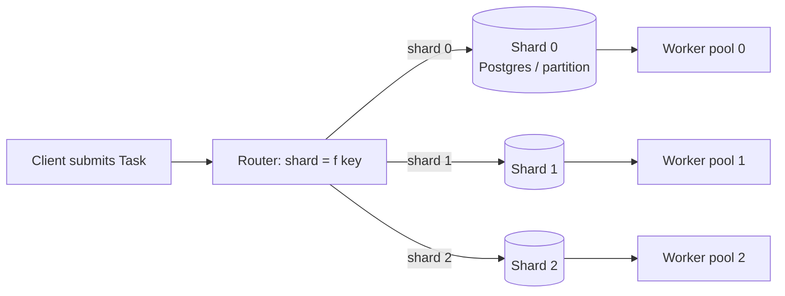
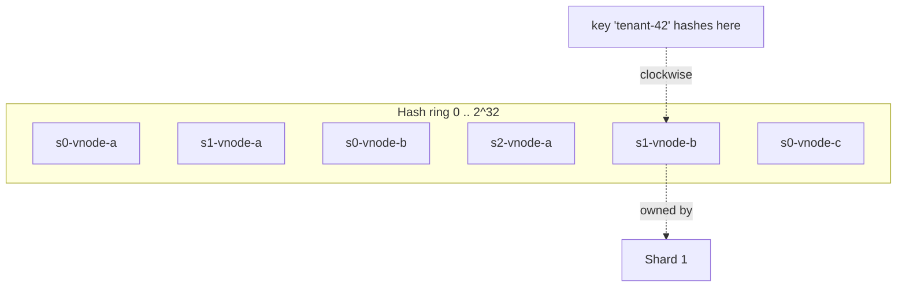
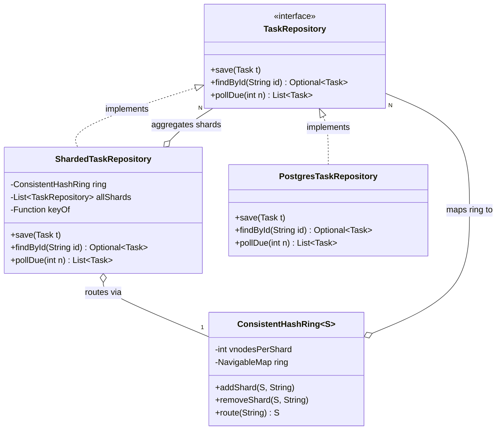

# Sharding and Partitioning

> Where this fits in the project: by Phase 3 and Phase 4 our Task Queue must scale past a single Postgres instance and a single broker partition. Sharding is how we split one logical `TaskQueue` / `TaskRepository` across many physical nodes so throughput and storage grow horizontally — without losing the two properties the platform depends on: **finding a task by id** and **processing tasks of the same key in order**.

---

## 1. Why this exists

A single machine has a ceiling. One Postgres instance tops out somewhere around tens of thousands of writes per second before WAL flush, lock contention, and a single CPU's worth of query planning become the wall. One Kafka partition is processed by exactly one consumer at a time — so a single-partition topic can never go faster than one worker. A single `InMemoryTaskQueue` lives inside one JVM's heap and dies when that JVM dies.

Vertical scaling (a bigger box) buys you time, not infinity. It is also a single point of failure and a single blast radius. The moment your task submission rate, your stored-task volume, or your fan-out exceeds what one node can hold, you have exactly one structural option:

> **Sharding** (a.k.a. **horizontal partitioning**): split one logical dataset/stream into N disjoint subsets, each owned by a different physical node, addressed by a deterministic function of a **partition key**.

The word "partition" is overloaded, so pin it down:

- **Partitioning** = the general act of splitting data into subsets ("partitions").
- **Sharding** = partitioning across **separate machines/databases** (each subset = a "shard"). Every shard is a partition; not every partition is a shard (a single Postgres table can be range-partitioned on disk inside one box).
- **Replication** is the orthogonal concern: copies of *the same* partition for availability. Sharding splits; replication copies. You almost always do both. This chapter is about splitting; see [`consistency-and-availability.md`](consistency-and-availability.md) for the copying.

Sharding is the price of admission for scale, and it is not free: you give up cheap cross-shard transactions, cheap global ordering, cheap `JOIN`s, and cheap "scan everything" queries. The engineering is in choosing a **partition key** and a **partitioning function** that keep the data and the load *evenly* spread while keeping the queries you actually run *local to one shard*.



---

## 2. The naive version

Here is the first thing almost everyone writes. We have three shards, so we mod the task id by three.

```java
// BAD: do not ship this.
public final class NaiveShardRouter {

    private final List<TaskRepository> shards; // size = 3

    public NaiveShardRouter(List<TaskRepository> shards) {
        this.shards = shards;
    }

    private TaskRepository shardFor(Task task) {
        int h = Math.abs(task.id().hashCode());
        return shards.get(h % shards.size());   // hash % N
    }

    public void save(Task task) {
        shardFor(task).save(task);
    }

    public Optional<Task> findById(String id) {
        // we DON'T have the Task here, only the id — recompute the same hash
        int h = Math.abs(id.hashCode());
        return shards.get(h % shards.size()).findById(id);
    }
}
```

It works in a demo. Here is everything wrong with it, and these are the exact failures that show up in production:

1. **`hash % N` reshuffles almost everything when N changes.** Add a fourth shard (`N` goes 3 → 4) and on average **3 out of 4 keys** move to a different shard. For a database that means rewriting most of your rows; for a Kafka-style queue it means breaking ordering for nearly every key during the migration. Resharding becomes a catastrophic, all-at-once data movement.
2. **`Math.abs(hashCode())` is biased and can be negative.** `Math.abs(Integer.MIN_VALUE)` is still `Integer.MIN_VALUE` (negative), so `% N` can return a negative index and throw `IndexOutOfBoundsException`. Java's `String.hashCode()` is also not uniformly distributed for short, structured ids.
3. **The partition key is wrong for our access pattern.** We keyed on `task.id()`. That spreads load beautifully but it means **all tasks for one tenant are scattered across every shard**, and tasks that must run *in order* for a given entity (e.g. all events for `order-42`) land on different shards and lose ordering entirely.
4. **No notion of a hot partition.** If one tenant submits 80% of traffic, keying by tenant would melt one shard; keying by id hides it — until you need per-tenant ordering and can't have it.

The naive version conflates three independent decisions that you must make separately: **what is the key**, **what is the function**, and **how do we change N without moving everything**.

---

## 3. Improved version

First, fix the function and the bias. Use a strong, stable hash (not `Object.hashCode`, which can vary across JVM versions and is weak), make it unsigned, and — critically — choose the key deliberately.

```java
import java.nio.charset.StandardCharsets;
import java.util.zip.CRC32;

public final class HashShardRouter {

    private final TaskRepository[] shards;

    public HashShardRouter(TaskRepository[] shards) {
        if (shards.length == 0) throw new IllegalArgumentException("need >= 1 shard");
        this.shards = shards.clone();
    }

    /** Stable across JVMs and runs, unsigned, well-distributed enough for routing. */
    static int stableHash(String key) {
        CRC32 crc = new CRC32();
        crc.update(key.getBytes(StandardCharsets.UTF_8));
        // CRC32 returns a long in [0, 2^32); fold to a non-negative int.
        return (int) (crc.getValue() & 0x7fffffff);
    }

    private int indexFor(String partitionKey) {
        return stableHash(partitionKey) % shards.length;
    }

    /** Partition key is chosen by the caller, NOT hard-coded to task.id(). */
    public TaskRepository shardFor(String partitionKey) {
        return shards[indexFor(partitionKey)];
    }
}
```

Now the **partition key** is a parameter. For our Task Queue the right key depends on the query:

- If the dominant query is "find/ack a task by its id" and we never need cross-task ordering → key by `task.id()`. Uniform, simple.
- If we need **per-tenant isolation and per-tenant ordering** → key by `tenantId`. All of a tenant's tasks live on one shard, so we get cheap tenant-scoped queries and we can order within the tenant.
- If we need **per-entity ordering** (all events for `order-42` processed in submission order) → key by the **ordering key** (e.g. `order-42`), so the same entity always maps to the same shard/partition and a single consumer drains it in order.

This is genuinely better, but it still has the resharding problem: `% shards.length` still moves most keys when `length` changes. That is what consistent hashing solves, and it is the production version.

---

## 4. Production-quality version: consistent hashing with virtual nodes

The goal: **when you add or remove a shard, move only ~1/N of the keys, not ~all of them.** Consistent hashing achieves this by mapping both shards and keys onto the same circular hash space (the "ring"). A key is owned by the first shard found going clockwise from the key's position. Adding a shard only steals the arc between it and its predecessor — every other key stays put.

The naive ring places one point per shard, which produces lopsided arcs and therefore uneven load. The fix that every real implementation (Cassandra, DynamoDB, Riak, Envoy's `ring_hash`) uses is **virtual nodes (vnodes)**: place each physical shard at *many* points on the ring (e.g. 150). More points → smoother distribution and, as a bonus, when a shard dies its load is spread across *all* survivors instead of dumped entirely onto one neighbor.



```java
import java.nio.charset.StandardCharsets;
import java.security.MessageDigest;
import java.security.NoSuchAlgorithmException;
import java.util.*;

/**
 * Consistent hash ring with virtual nodes.
 * Generic over the shard type S so it works for TaskRepository, broker
 * partitions, or cache nodes alike.
 */
public final class ConsistentHashRing<S> {

    private final int vnodesPerShard;
    // Sorted map from ring position -> physical shard. NavigableMap gives us
    // O(log V) "first node clockwise" via ceilingEntry / firstEntry.
    private final NavigableMap<Long, S> ring = new TreeMap<>();
    private final Set<S> shards = new HashSet<>();

    public ConsistentHashRing(int vnodesPerShard) {
        if (vnodesPerShard < 1) throw new IllegalArgumentException("vnodes >= 1");
        this.vnodesPerShard = vnodesPerShard;
    }

    public synchronized void addShard(S shard, String shardId) {
        if (!shards.add(shard)) return; // already present
        for (int i = 0; i < vnodesPerShard; i++) {
            ring.put(hash(shardId + "#" + i), shard);
        }
    }

    public synchronized void removeShard(S shard, String shardId) {
        if (!shards.remove(shard)) return;
        for (int i = 0; i < vnodesPerShard; i++) {
            ring.remove(hash(shardId + "#" + i));
        }
    }

    /** Find the shard that owns this partition key. O(log V). */
    public synchronized S route(String partitionKey) {
        if (ring.isEmpty()) throw new IllegalStateException("no shards");
        long h = hash(partitionKey);
        Map.Entry<Long, S> e = ring.ceilingEntry(h); // first vnode clockwise
        if (e == null) e = ring.firstEntry();         // wrap around the ring
        return e.getValue();
    }

    /** 128-bit MD5 folded to a long: good distribution, deterministic. */
    private static long hash(String key) {
        try {
            byte[] d = MessageDigest.getInstance("MD5")
                    .digest(key.getBytes(StandardCharsets.UTF_8));
            long h = 0;
            for (int i = 0; i < 8; i++) {
                h = (h << 8) | (d[i] & 0xffL);
            }
            return h;
        } catch (NoSuchAlgorithmException ex) {
            throw new IllegalStateException(ex); // MD5 is always present
        }
    }
}
```

Wire it into a sharded repository that preserves our `TaskRepository` contract:

```java
import java.util.*;
import java.util.stream.Collectors;

/**
 * A TaskRepository facade over N shard repositories addressed by a consistent
 * hash ring. The partition-key extractor is injected so the SAME router serves
 * "shard by tenant" or "shard by id" without code changes.
 */
public final class ShardedTaskRepository implements TaskRepository {

    private final ConsistentHashRing<TaskRepository> ring;
    private final List<TaskRepository> allShards;     // for fan-out queries
    private final java.util.function.Function<Task, String> keyOf;

    public ShardedTaskRepository(ConsistentHashRing<TaskRepository> ring,
                                 List<TaskRepository> allShards,
                                 java.util.function.Function<Task, String> keyOf) {
        this.ring = ring;
        this.allShards = List.copyOf(allShards);
        this.keyOf = keyOf;
    }

    @Override
    public void save(Task t) {
        ring.route(keyOf.apply(t)).save(t);
    }

    @Override
    public Optional<Task> findById(String id) {
        // If we shard by id, this is a single-shard lookup. If we shard by
        // tenant, id alone can't locate the shard, so we must scatter-gather.
        // We make the trade explicit instead of hiding it.
        return allShards.stream()
                .map(s -> s.findById(id))
                .filter(Optional::isPresent)
                .map(Optional::get)
                .findFirst();
    }

    @Override
    public List<Task> pollDue(int n) {
        // Fan out: ask each shard for its due tasks, merge, cap at n.
        // Each shard polls independently so no global lock is needed.
        int perShard = Math.max(1, n / Math.max(1, allShards.size()));
        return allShards.stream()
                .flatMap(s -> s.pollDue(perShard).stream())
                .sorted(Comparator.comparingInt(Task::priority).reversed()
                        .thenComparing(Task::scheduledAt))
                .limit(n)
                .collect(Collectors.toList());
    }
}
```

Why a staff engineer ships this:

- **Resharding moves ~1/N of keys**, not all of them, so adding capacity is an incremental, online operation rather than a downtime-inducing rewrite.
- **Vnodes give even load** and graceful failure spreading; the number (100–256) is a tunable, not magic.
- **The partition key is injected**, so the same machinery serves "by id", "by tenant", or "by ordering key" — we pick per workload, not per code path.
- **The trade-offs are explicit in the code.** `findById` honestly does a scatter-gather when we shard by tenant, instead of silently doing the wrong thing.

---

## 5. Hash vs range vs consistent hashing — the core decision

This is the comparison interviewers and design docs care about. Pick the partitioning scheme to match your queries and your resharding tolerance.

| Scheme | How a key maps to a shard | Range/prefix queries | Hot-spot risk | Resharding cost | Used by |
|---|---|---|---|---|---|
| **Hash (`hash % N`)** | `hash(key) % N` | No — adjacent keys scatter | Low (uniform) | **Catastrophic** (≈ all keys move when N changes) | Naive sharding, simple Kafka default partitioner |
| **Range** | key falls in `[lo, hi)` of a shard | **Yes** — adjacent keys colocate | **High** (sequential keys, e.g. timestamps, hit one shard) | Cheap to split a single hot range | HBase, Bigtable, Postgres range partitions, MongoDB ranged |
| **Consistent hashing (+ vnodes)** | first vnode clockwise on the ring | No | Low–medium | **Cheap** (≈ 1/N keys move) | Cassandra, DynamoDB, Riak, Envoy, memcached clients |

Rules of thumb:

- **Need range scans** (`WHERE created_at BETWEEN ...`, "next 7 days of scheduled tasks")? → **range partitioning** on that column. But never range-partition on a monotonically increasing key (auto-increment id, `now()`), or every write lands on the last shard — the classic **"hot last partition"**. Salt the key or hash a prefix.
- **Need elastic capacity** (add/remove nodes online, frequent autoscaling)? → **consistent hashing**. The whole reason it exists is cheap membership change.
- **Fixed N and uniform access by exact key** (a cache, an id-keyed store you'll never reshape)? → plain **hash** is fine and simplest.

A common production hybrid: **hash the high bits to choose a shard, range within the shard.** You get uniform shard load *and* local range scans inside each shard (DynamoDB's partition-key + sort-key is exactly this).

---

## 6. Code walkthrough

### Beginner: partition keys and a fixed hash split

```java
import java.util.List;

/** Minimal: route a Task to one of N in-memory queues by partition key. */
public final class FixedHashPartitioner {

    private final List<InMemoryTaskQueue> partitions;

    public FixedHashPartitioner(List<InMemoryTaskQueue> partitions) {
        this.partitions = List.copyOf(partitions);
    }

    public int partitionFor(String partitionKey) {
        // (h % n + n) % n guarantees a non-negative index even if h < 0.
        int n = partitions.size();
        int h = partitionKey.hashCode();
        return ((h % n) + n) % n;
    }

    public void enqueue(Task task, String partitionKey) {
        partitions.get(partitionFor(partitionKey)).enqueue(task);
    }
}
```

The lesson: the **partition key**, not the message, decides placement. Key by `task.type()` and all tasks of a type colocate; key by `task.id()` and they spread. Same code, different behavior — choose intentionally.

### Intermediate: range partitioning the scheduled queue, with hot-spot awareness

Our `TaskScheduler` deals with `scheduledAt` timestamps. Range-partitioning by time is natural for "give me everything due today", but raw timestamps create a hot tail. We salt with a bucket.

```java
import java.time.*;
import java.util.*;

/** Range partitions by day; each day is split into BUCKETS to avoid a hot tail. */
public final class TimeRangePartitioner {

    private static final int BUCKETS = 8;

    /** e.g. "2026-06-10/3" — day range + salt bucket from the ordering key. */
    public String partitionKey(Task task) {
        LocalDate day = task.scheduledAt().atZone(ZoneOffset.UTC).toLocalDate();
        int bucket = Math.floorMod(task.id().hashCode(), BUCKETS);
        return day + "/" + bucket;
    }

    /** All partition keys we must scan to find tasks due in [from, to]. */
    public List<String> keysForRange(LocalDate from, LocalDate to) {
        List<String> keys = new ArrayList<>();
        for (LocalDate d = from; !d.isAfter(to); d = d.plusDays(1)) {
            for (int b = 0; b < BUCKETS; b++) keys.add(d + "/" + b);
        }
        return keys; // scan these partitions in parallel; merge results
    }
}
```

Without the bucket salt, every task scheduled for "today" hammers a single partition and a single worker — a textbook hot partition. With 8 buckets the load spreads 8 ways while range queries still touch a bounded, predictable set of partitions.

### Production-inspired: tenant sharding with per-tenant ordering and a rebalance path

In Phase 4 the broker is partitioned and each partition is drained in order by one worker. We shard by `tenantId` so each tenant's tasks are ordered, and we expose a controlled rebalance.

```java
import java.util.*;
import java.util.concurrent.ConcurrentHashMap;

/**
 * Tenant-sharded broker view. Each tenant maps (via the ring) to exactly one
 * partition; a single Worker drains a partition in FIFO order, so tasks for a
 * given tenant are processed in submission order. Rebalancing moves whole
 * tenants between partitions atomically from the router's perspective.
 */
public final class TenantShardedQueue {

    private final ConsistentHashRing<TaskQueue> ring;
    private final Map<String, TaskQueue> overrides = new ConcurrentHashMap<>();

    public TenantShardedQueue(ConsistentHashRing<TaskQueue> ring) {
        this.ring = ring;
    }

    private String partitionKey(Task task) {
        // payload carries tenantId in JSON; in real code parse once and cache.
        return extractTenantId(task.payload());
    }

    public void enqueue(Task task) {
        String tenant = partitionKey(task);
        TaskQueue target = overrides.getOrDefault(tenant, ring.route(tenant));
        target.enqueue(task);
    }

    /**
     * Pin a hot tenant to a dedicated partition (manual rebalance / isolation).
     * New tasks go to the override; in-flight tasks drain from the old one,
     * preserving ordering during the cutover (no key is ever live on two
     * partitions at the same time for NEW writes).
     */
    public void pinTenant(String tenantId, TaskQueue dedicated) {
        overrides.put(tenantId, dedicated);
    }

    public void unpin(String tenantId) {
        overrides.remove(tenantId);
    }

    private static String extractTenantId(String json) {
        // Production: use a JSON library. Sketch for the chapter:
        int i = json.indexOf("\"tenantId\"");
        if (i < 0) return "__default__";
        int colon = json.indexOf(':', i);
        int start = json.indexOf('"', colon + 1) + 1;
        int end = json.indexOf('"', start);
        return json.substring(start, end);
    }
}
```

This is the realistic shape: ordering is a property of "one key → one partition → one consumer", and rebalancing a *hot tenant* is a first-class operation (pin it to its own partition) rather than something you hope the hash gods grant you.

---

## 7. How this applies to our Task Queue project

Concrete mappings to the canonical model:

- **`TaskRepository`** (Phase 2, JDBC/Postgres) becomes `ShardedTaskRepository` over several Postgres instances, each a shard. `save` routes by key; `findById` is single-shard if we shard by id, scatter-gather if we shard by tenant; `pollDue(n)` fans out across shards. See [`../09-project/phase-2.md`](../09-project/phase-2.md).
- **`TaskQueue`** (Phase 4, broker-backed) is partitioned. The partition count is the unit of consumer parallelism: one partition is drained by at most one `Worker`, so partitions ≥ desired worker concurrency for that stream.
- **`Task.id`** (UUID) is the natural key for uniform spreading and for the [`idempotency.md`](idempotency.md) dedupe key. A `tenantId` in `payload` is the natural key for isolation and ordering.
- **`WorkerPool`** sizing follows from partition count: N partitions support up to N concurrent in-order consumers per tenant/key. Over-provisioning workers beyond partitions just leaves workers idle.
- **`Worker`** processing one partition in order is exactly how we honor "events for `order-42` run in submission order" — covered in depth in [`message-ordering.md`](message-ordering.md).
- **Ordering within a partition** is the only ordering guarantee we get cheaply. There is **no cheap global order across shards** — design features to need only per-key order.



(The diamond/`o--` is aggregation: shards live independently of the router and can outlive it; the router holds references but does not own their lifecycle.)

---

## 8. Tradeoffs

| Decision | You gain | You pay |
|---|---|---|
| Shard at all | Horizontal scale of writes + storage; smaller blast radius per node | No cheap cross-shard `JOIN`/transaction/global order; routing complexity |
| Key by `task.id` | Perfectly uniform load; single-shard `findById` | No per-tenant/per-entity ordering; per-tenant queries fan out |
| Key by `tenantId` | Tenant isolation, per-tenant ordering, local tenant queries | Hot tenant = hot shard; `findById(id)` must scatter-gather |
| Hash partitioning | Uniform distribution, trivial routing | Resharding moves ~all keys; no range scans |
| Range partitioning | Cheap range scans; cheap split of one hot range | Sequential keys create hot partitions; manual range management |
| Consistent hashing | Online resharding moves ~1/N keys; smooth with vnodes | More moving parts; still no range scans; vnode count tuning |
| More shards | More parallelism, smaller per-shard data | More cross-shard fan-out, more connections, more operational surface |

The meta-tradeoff: **sharding trades query flexibility for scale.** You shard exactly when one node can't cope, and you choose the key that makes your *hot* queries single-shard, accepting fan-out for your *rare* queries.

---

## 9. Common mistakes and pitfalls

- **`hash % N` for a system that will ever add nodes.** Resharding becomes a full rewrite. Fix: consistent hashing, or pre-create far more partitions than nodes (e.g. 1024 partitions on 4 nodes) and move whole partitions when you scale ("fixed-partition" sharding, used by Kafka and Elasticsearch).
- **`Math.abs(hashCode())` for the index.** Can be negative (`Integer.MIN_VALUE`) and biased. Fix: `Math.floorMod(h, n)` or a proper unsigned hash (CRC32/Murmur).
- **Range-partitioning on a monotonic key** (auto-increment id, `created_at`). All writes hit the last partition. Fix: hash-prefix or salt the key.
- **Choosing the key for distribution while ignoring ordering needs** (or vice versa). The key controls *both* load spread *and* what can be ordered together. Decide both before picking it.
- **Assuming global ordering across shards is cheap.** It is not. Fix: design for per-key ordering only, and add a sequencer/total-order broadcast only if a feature genuinely needs it.
- **Ignoring hot partitions** until one shard is at 100% CPU and the rest idle. Fix: monitor per-shard QPS/CPU, key-skew metrics; isolate/pin hot keys (the `pinTenant` pattern).
- **Cross-shard transactions via two-phase commit sprinkled everywhere.** Slow and fragile. Fix: model aggregates so one transaction touches one shard; use the outbox/saga pattern across shards.
- **Vnode count too low** (e.g. 1–4). Distribution is lumpy and failures dump load on one neighbor. Fix: 100–256 vnodes per shard.

---

## 10. Refactoring exercise

**Bad** — `hash % N` baked into the worker, key hard-coded, negative-index bug:

```java
public class TaskRouter {
    private final TaskRepository[] shards;
    public TaskRouter(TaskRepository[] shards) { this.shards = shards; }

    public void route(Task t) {
        int i = t.id().hashCode() % shards.length; // can be negative!
        shards[i].save(t);                          // and reshards everything on resize
    }
}
```

**Improved** — non-negative index, stable hash, injected key, but still `% N`:

```java
import java.util.function.Function;
import java.util.zip.CRC32;
import java.nio.charset.StandardCharsets;

public final class TaskRouter {
    private final TaskRepository[] shards;
    private final Function<Task, String> keyOf;

    public TaskRouter(TaskRepository[] shards, Function<Task, String> keyOf) {
        this.shards = shards.clone();
        this.keyOf = keyOf;
    }

    public void route(Task t) {
        shards[indexFor(keyOf.apply(t))].save(t);
    }

    private int indexFor(String key) {
        CRC32 c = new CRC32();
        c.update(key.getBytes(StandardCharsets.UTF_8));
        return (int) (c.getValue() % shards.length); // stable, non-negative
    }
}
```

**Production** — consistent hashing so adding a shard moves ~1/N keys, key injected, online membership change:

```java
import java.util.*;
import java.util.function.Function;

public final class TaskRouter {
    private final ConsistentHashRing<TaskRepository> ring; // from section 4
    private final Function<Task, String> keyOf;
    private final Map<TaskRepository, String> ids = new LinkedHashMap<>();

    public TaskRouter(Function<Task, String> keyOf) {
        this.ring = new ConsistentHashRing<>(150);
        this.keyOf = keyOf;
    }

    public void addShard(TaskRepository shard, String id) {
        ids.put(shard, id);
        ring.addShard(shard, id);     // online: only ~1/N keys move
    }

    public void removeShard(TaskRepository shard) {
        String id = ids.remove(shard);
        if (id != null) ring.removeShard(shard, id);
    }

    public void route(Task t) {
        ring.route(keyOf.apply(t)).save(t);
    }
}
```

The progression: fix the index bug → make the key a policy decision → make membership change cheap.

---

## 11. Exercises

### Easy

**E1 (knowledge check).** Explain in two sentences why `hash(key) % N` is a poor choice for a system that autoscales its database shards, and name the scheme that fixes it.

**E2 (coding).** Implement `floorModIndex(String key, int n)` returning a shard index in `[0, n)` that is *never* negative and is stable across JVM restarts (do not use `Object.hashCode()`).

### Medium

**M1 (coding).** Add a `Map<S, Integer> distribution(List<String> sampleKeys)` method to `ConsistentHashRing` that returns how many sample keys land on each shard. Use it to assert that with 150 vnodes and 4 shards, no shard owns more than 1.5× the average.

**M2 (refactoring).** Given a `PostgresTaskRepository.pollDue(int n)` that runs `SELECT ... LIMIT n FOR UPDATE SKIP LOCKED`, refactor `ShardedTaskRepository.pollDue` so it polls shards **in parallel** with virtual threads and respects a global cap of `n`.

### Hard

**H1 (design).** Design an **online resharding** procedure to grow from 4 to 6 Postgres shards with zero downtime and no lost/duplicated tasks. Address: dual-write window, backfill, cutover, and how `findById` behaves mid-migration. One page max.

**H2 (interview-style).** Tenant `acme` is 70% of traffic and is melting its shard while the other three idle. You shard by `tenantId` and need per-tenant ordering. What are your options, and what does each cost? Pick one and justify it.

---

## 12. Solutions

**E1.** When N changes, `hash(key) % N` remaps roughly `(N-1)/N` of all keys to different shards, forcing a near-total data migration (and breaking per-key ordering during it). **Consistent hashing with virtual nodes** fixes it by moving only about `1/N` of keys per membership change.

**E2.**

```java
import java.nio.charset.StandardCharsets;
import java.util.zip.CRC32;

public final class ShardMath {
    public static int floorModIndex(String key, int n) {
        if (n <= 0) throw new IllegalArgumentException("n > 0");
        CRC32 c = new CRC32();
        c.update(key.getBytes(StandardCharsets.UTF_8));
        long h = c.getValue();                 // unsigned 32-bit in a long
        return (int) Math.floorMod(h, (long) n); // always in [0, n)
    }
}
```

`CRC32` is stable across JVMs (unlike `String.hashCode`, which is specified but `Object.hashCode` is not), and `Math.floorMod` guarantees a non-negative result.

**M1.**

```java
import java.util.*;

// add inside ConsistentHashRing<S>:
public synchronized Map<S, Integer> distribution(List<String> sampleKeys) {
    Map<S, Integer> counts = new HashMap<>();
    for (S s : shards) counts.put(s, 0);
    for (String k : sampleKeys) counts.merge(route(k), 1, Integer::sum);
    return counts;
}
```

```java
// test sketch (JUnit 5 + AssertJ):
var ring = new ConsistentHashRing<String>(150);
ring.addShard("s0", "s0"); ring.addShard("s1", "s1");
ring.addShard("s2", "s2"); ring.addShard("s3", "s3");
var keys = new ArrayList<String>();
for (int i = 0; i < 100_000; i++) keys.add("key-" + i);
var dist = ring.distribution(keys);
double avg = 100_000.0 / 4;
dist.values().forEach(c ->
    org.assertj.core.api.Assertions.assertThat(c).isLessThan((int) (avg * 1.5)));
```

With 150 vnodes the spread is typically within a few percent of the mean; the 1.5× bound is comfortably satisfied. Lower vnode counts widen the spread, which is the point of the exercise.

**M2.**

```java
import java.util.*;
import java.util.concurrent.*;
import java.util.stream.Collectors;

@Override
public List<Task> pollDue(int n) {
    int perShard = Math.max(1, n / Math.max(1, allShards.size()));
    try (var executor = Executors.newVirtualThreadPerTaskExecutor()) {
        List<Future<List<Task>>> futures = allShards.stream()
                .map(s -> executor.submit(() -> s.pollDue(perShard)))
                .toList();
        return futures.stream()
                .flatMap(f -> get(f).stream())
                .limit(n)                       // global cap across shards
                .collect(Collectors.toList());
    }
}

private static List<Task> get(Future<List<Task>> f) {
    try { return f.get(); }
    catch (InterruptedException e) { Thread.currentThread().interrupt(); return List.of(); }
    catch (ExecutionException e) { return List.of(); } // shard failed: degrade, don't crash
}
```

Virtual threads make per-shard blocking JDBC calls cheap to run concurrently; `SELECT ... FOR UPDATE SKIP LOCKED` per shard avoids cross-shard locking; `limit(n)` enforces the global cap. A failed shard degrades to an empty contribution rather than failing the whole poll.

**H1 (online resharding 4 → 6).**

1. **Add shards as members, not yet routable for writes.** Stand up shard 4 and 5. Compute, for the *new* ring (6 members), which key ranges (vnode arcs) move *from* an old shard *to* a new one. Only those keys are affected.
2. **Dual-write window.** Flip the router to consistent-hash over 6 members for **new writes**. For keys that moved, writes now go to the new shard. Old in-flight tasks for moved keys still exist on the old shard — so during the window, **reads must check both** the new owner and the previous owner (compute the predecessor in the old ring). This is the only correctness-critical bit.
3. **Backfill.** Stream the moved key-ranges from old shards to new shards (`WHERE shard_key IN movedRanges`), idempotently keyed on `task.id` so re-runs don't duplicate. Tasks already terminal (`SUCCEEDED`/`DEAD`) can be skipped or copied for history.
4. **Cutover.** Once backfill catches up and the moved ranges are drained of non-terminal tasks on the old shards, drop the dual-read fallback. The new ring is now authoritative.
5. **`findById` mid-migration.** If sharding by id, look up on the new-owner shard, then fall back to the old-owner shard for moved ranges until cutover. If sharding by tenant, it was already a scatter-gather, so no change — it just transiently includes the two extra shards.

No task is lost (writes always land on exactly one authoritative shard; reads cover both during the window) and none is duplicated (backfill is idempotent on `task.id`; the [`idempotency.md`](idempotency.md) dedupe key protects execution).

**H2 (hot tenant `acme`).** Options:

- **(a) Pin `acme` to a dedicated shard/partition** (the `pinTenant` override). Cost: bespoke routing entry, one fat shard, but preserves per-tenant ordering and isolates blast radius. Cheapest and most common.
- **(b) Sub-shard `acme` by a secondary key** (`acme:<orderId>`), giving parallelism for `acme`. Cost: you lose *global* per-tenant ordering and keep only per-`orderId` ordering — acceptable if `acme`'s real requirement is per-entity, not per-tenant, order. This is usually the right answer because "order all of a tenant's tasks globally" is rarely a true requirement.
- **(c) Buy a bigger box for `acme`'s shard** (vertical). Cost: temporary, hits the same wall later, but zero code change — fine as a stopgap.

**Recommendation: (b)** when the ordering requirement is really per-entity (it almost always is), falling back to **(a)** when global per-tenant order is contractually required. Spreading 70% of traffic across many partitions is the only durable fix; pinning just moves the ceiling.

---

## 13. Interview questions and takeaways

1. **Q: Why is consistent hashing better than `hash % N`?**
   A: Changing N in `hash % N` remaps ≈`(N-1)/N` of keys; consistent hashing remaps only ≈`1/N`, because adding a node only steals the arc between it and its predecessor on the ring. That makes online scaling cheap.

2. **Q: What are virtual nodes and why use them?**
   A: Each physical shard is placed at many points on the ring. They smooth out distribution (one point per shard gives lopsided arcs) and, on failure, spread a dead shard's load across *all* survivors instead of dumping it on one neighbor.

3. **Q: When do you choose range over hash partitioning?**
   A: When range/prefix scans are a hot path (time ranges, lexicographic prefixes). The cost is hot partitions on sequential keys, which you mitigate by salting or hash-prefixing the key.

4. **Q: How do you pick a partition key?**
   A: It must serve two masters: even load distribution and the colocation your queries/ordering need. Key by id for uniformity, by tenant/entity for isolation and ordering. The key decides what can be ordered together and what stays single-shard.

5. **Q: What is a hot partition and how do you detect/fix it?**
   A: A shard receiving disproportionate load due to key skew (one dominant tenant, a monotonic key). Detect via per-shard QPS/CPU and key-frequency metrics; fix by salting, sub-sharding the hot key, or pinning it to a dedicated shard.

6. **Q: Can you guarantee global ordering across shards?**
   A: Not cheaply. Each shard/partition orders its own keys; across shards you'd need a sequencer or total-order broadcast, which serializes throughput. Design for per-key ordering and avoid needing global order.

7. **Q: How do cross-shard transactions work?**
   A: They don't, cheaply. Either model aggregates so one transaction touches one shard, or use sagas/outbox with idempotent steps and compensating actions. Two-phase commit across shards is slow and fragile.

8. **Q: How many shards/partitions should you start with?**
   A: Over-provision partitions relative to nodes (e.g. 256 partitions on 4 nodes) so you can scale by moving whole partitions without rehashing keys — the "fixed-partition" approach Kafka and Elasticsearch use.

---

## 14. Production considerations

- **Skew is the default, not the exception.** Real key distributions are power-law (a few tenants dominate). Always ship per-shard load and per-key frequency metrics (Micrometer gauges per shard) before you ship sharding; see [`../10-system-design/observability-and-ops.md`](../10-system-design/observability-and-ops.md).
- **Connection fan-out.** Sharding multiplies connection pools. Scatter-gather queries hold connections on every shard at once — bound concurrency and pool sizes or you will exhaust Postgres `max_connections`.
- **Resharding is the riskiest operation you will run.** Rehearse it in staging, make backfill idempotent on `task.id`, keep a dual-read window, and have a rollback (the old ring) ready.
- **Tail latency follows the slowest shard.** A scatter-gather query is as slow as its slowest shard, so one degraded shard slows *every* fan-out query. Use per-shard timeouts and degrade (return partial results) rather than block — pair with [`backpressure.md`](backpressure.md) and [`circuit-breakers.md`](circuit-breakers.md).
- **Rebalancing must not violate ordering.** A key must never be live on two partitions for *new* writes simultaneously. Drain-then-cut, or route new writes to the new owner while old in-flight work finishes on the old owner — never both at once.
- **Partition count is hard to change for some brokers.** Kafka can add partitions but that re-keys the hash partitioner and breaks per-key ordering for existing keys. Plan partition count up front; over-provision.
- **Monitoring checklist:** per-shard QPS/CPU/disk, key-skew ratio (top-key share), cross-shard query rate and tail latency, resharding progress/lag, and connection-pool saturation per shard.

---

## What We Can Improve In Our Project Using This Concept

Our current `TaskRepository` and `TaskQueue` assume a single backing store. By introducing a `ConsistentHashRing` and a `ShardedTaskRepository`/`TenantShardedQueue` facade behind the **same interfaces**, we scale Phase 2's Postgres and Phase 4's broker horizontally without touching `Worker`, `WorkerPool`, or `TaskController`. We make the partition key an injected policy so we can shard by `task.id` (uniform) or `tenantId` (isolated + ordered) per workload, and we get a real, online resharding path instead of a downtime-inducing `hash % N` rewrite.

## Project Refactoring Task

1. Add `ConsistentHashRing<S>` (vnodes = 150) under `com.example.tq.shard`.
2. Add `ShardedTaskRepository implements TaskRepository` with an injected `Function<Task,String>` key extractor; implement `save` (single-shard), `findById` (single-shard or scatter-gather), and `pollDue` (parallel fan-out via virtual threads, global cap `n`).
3. Add `TenantShardedQueue` with a `pinTenant`/`unpin` override for hot-tenant isolation.
4. Emit per-shard Micrometer gauges: `shard.tasks.enqueued{shard}`, `shard.qps{shard}`, `shard.skew.topKeyShare`.
5. Tests: distribution within 1.5× of mean at 150 vnodes; only ~1/N keys move when adding a shard; ordering preserved per key across a `pinTenant` cutover; `pollDue` respects the global cap and degrades on one failed shard.

## Git Commit For This Chapter

```text
feat(shard): consistent-hash sharding for TaskRepository and TaskQueue

- add ConsistentHashRing<S> with virtual nodes (150/shard) for online resharding
- add ShardedTaskRepository: routed save, scatter-gather findById, parallel pollDue
- add TenantShardedQueue with pinTenant override for hot-tenant isolation
- inject partition-key extractor so we shard by id or tenant per workload
- emit per-shard QPS / enqueued / key-skew metrics for hot-partition detection

Files:
  src/main/java/com/example/tq/shard/ConsistentHashRing.java
  src/main/java/com/example/tq/shard/ShardedTaskRepository.java
  src/main/java/com/example/tq/shard/TenantShardedQueue.java
  src/main/java/com/example/tq/shard/ShardMath.java
  src/main/java/com/example/tq/metrics/ShardMetrics.java
  src/test/java/com/example/tq/shard/ConsistentHashRingTest.java
  src/test/java/com/example/tq/shard/ShardedTaskRepositoryTest.java
```

## Architecture Impact

Sharding turns the storage and queue layers from single-node bottlenecks into horizontally scalable tiers while preserving the `TaskRepository`/`TaskQueue` contracts, so the worker and API layers are untouched. The partition key becomes a load-bearing architectural decision: it fixes both load distribution and the ordering guarantee (per-key, never global). Consistent hashing makes capacity changes incremental and online, bounding migration cost to ~1/N of keys. Combined with [`message-ordering.md`](message-ordering.md) (per-partition order), [`backpressure.md`](backpressure.md), and [`circuit-breakers.md`](circuit-breakers.md) (tail-latency containment for scatter-gather), this is the structural change that lets the platform scale beyond one node or one database.

## Interview Takeaways

- Sharding = horizontal partitioning across machines; it trades query flexibility (no cheap cross-shard joins/transactions/global order) for scale.
- Prefer **consistent hashing with virtual nodes** over `hash % N`: membership changes move ~1/N keys, not ~all, and load spreads/recovers smoothly.
- The **partition key** decides both load distribution and what can be ordered together — pick it to make hot queries single-shard.
- **Range** partitioning enables scans but invites hot partitions on monotonic keys; salt or hash-prefix them.
- Order is only cheap **within a partition**; design for per-key ordering, isolate hot keys, and treat resharding as a rehearsed, idempotent, dual-read operation.
