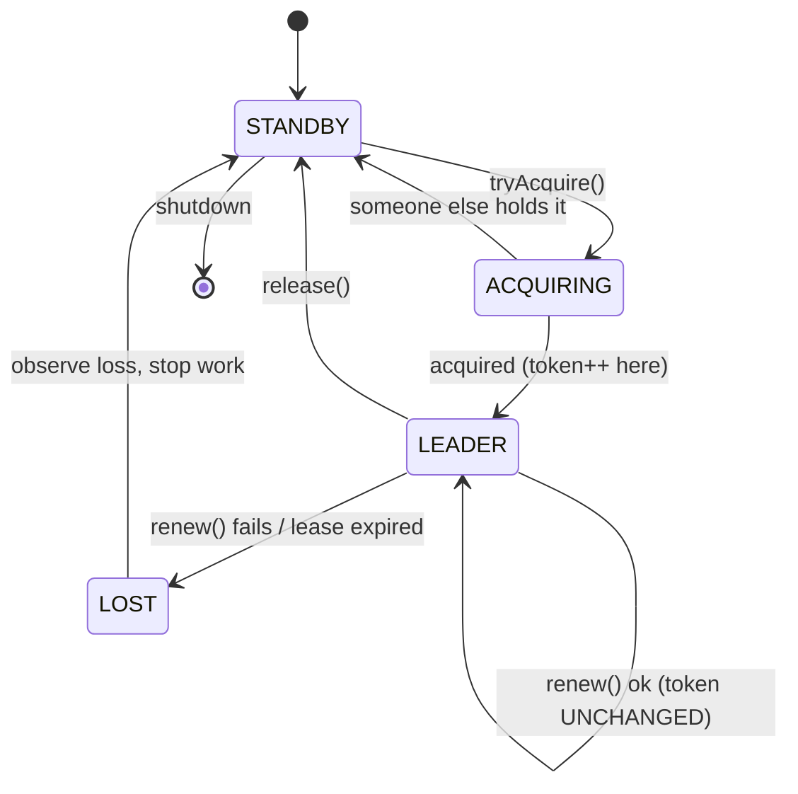
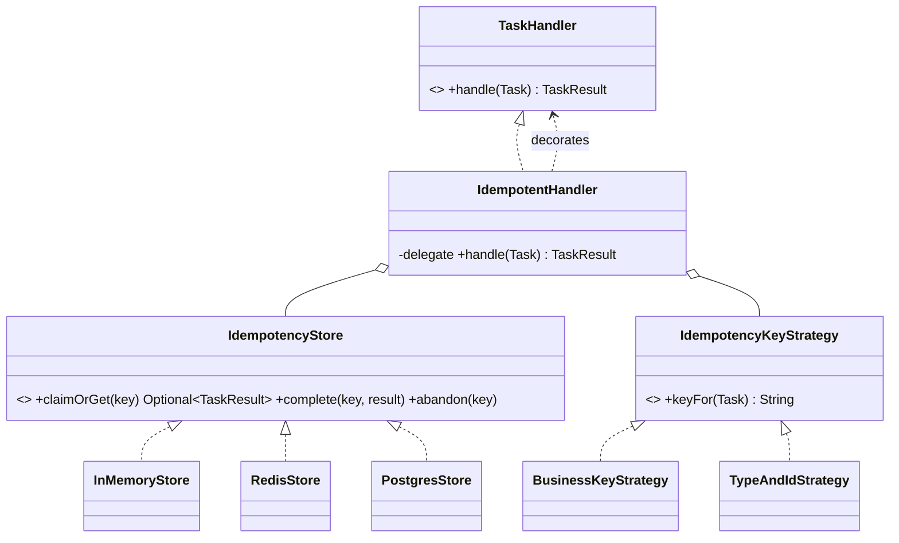
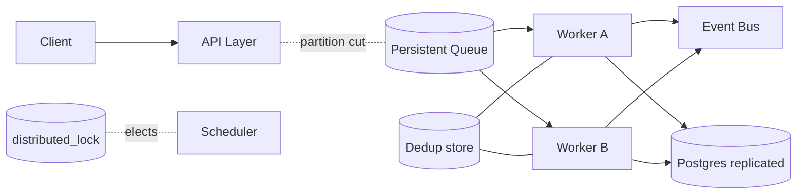
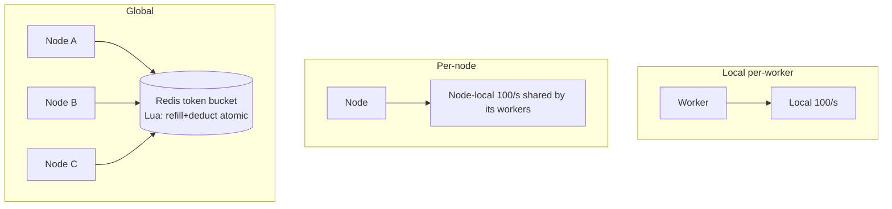
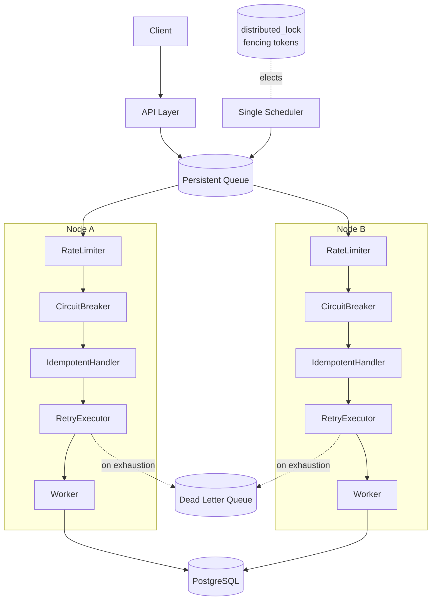

# Distributed Systems: Solutions

> Where this fits: this is the reference solution set for **[./exercises.md](./exercises.md)** — the module-wide problem set for the distributed-systems layer of the Task Queue platform. Every solution below is keyed to the exact ID from the exercises file (`K3`, `C5`, `D2`, `S4`, …). The code targets **Java 21** (records, sealed types, switch pattern matching, virtual threads, `java.time`), lives in package `com.taskqueue.reliability`, and compiles against the shared model slice reproduced at the top of the exercises file. Tests are JUnit 5 + AssertJ; the DB pieces assume PostgreSQL via Testcontainers.
>
> Read the exercise, attempt it, *then* diff against this. A solution you copied without struggling teaches nothing; a solution you compare against your own teaches the gap. For each problem you get: the working code, the reasoning and tradeoffs, and the **wrong approaches** people actually ship — because in distributed systems the wrong approach usually passes the happy-path test and fails only under partition, pause, or concurrency.

These solutions cross-link back to the concept chapters: [./cap-theorem.md](./cap-theorem.md), [./consistency-and-availability.md](./consistency-and-availability.md), [./idempotency.md](./idempotency.md), [./retries.md](./retries.md), [./dlq.md](./dlq.md), [./rate-limiting.md](./rate-limiting.md), [./backpressure.md](./backpressure.md), [./circuit-breakers.md](./circuit-breakers.md), [./sharding.md](./sharding.md), [./distributed-locks.md](./distributed-locks.md), [./leader-election.md](./leader-election.md), [./message-ordering.md](./message-ordering.md), and lean on [../06-concurrency/atomics-and-thread-safety.md](../06-concurrency/atomics-and-thread-safety.md), [../06-concurrency/locks.md](../06-concurrency/locks.md), [../06-concurrency/blocking-queue.md](../06-concurrency/blocking-queue.md).

---

## Part 1 — Knowledge-Check solutions

### K1 — at-least-once forces idempotency

At-least-once means the broker may deliver the *same* message more than once (the ack can be lost after the work was done, so the broker redelivers), and a handler with side effects that runs twice produces the effect twice — two charges, two emails, two rows — so the only way to keep "delivered ≥ 1 times" from becoming "executed ≥ 1 times observably" is to make the handler idempotent.

> **Common wrong answer:** "Just switch the broker to exactly-once." There is no end-to-end exactly-once *delivery* across a network and a side effect; what real systems build is at-least-once delivery **plus** idempotent processing = *effectively-once*. Kafka's "exactly-once" is exactly-once *within Kafka's own log+offset commit*, not across your `chargeCard()` call.

### K2 — natural vs synthetic idempotency key

Use a **business/natural key** like `customer:42:invoice:2026-06` (or a caller-supplied `Idempotency-Key` header echoed into the payload), because that is what is stable across *retries of the same logical intent*. A fresh `Task.id` UUID per submission is **not** safe: when a client times out and resubmits "charge customer 42 for invoice June", it mints a *new* UUID, so two `Task` rows with two different `id`s both pass dedup and both charge. The dedup key must identify the *operation*, not the *delivery*.

### K3 — why jitter

A **retry storm** (thundering herd) is when many clients fail at the same instant (a downstream blip), all back off by the *same* deterministic delay, and therefore all retry at the same later instant — re-creating the spike that caused the failure and often making recovery impossible. **Full jitter** spreads each client's next attempt to a uniformly random point in `[0, backoff]`, so the retries smear across the window instead of stacking on one wall-clock tick.

### K4 — token bucket vs leaky bucket

A **token bucket** accumulates permits up to a capacity (`burst`) and lets you spend them all at once, so it **allows short bursts above the steady rate** as long as you've banked tokens — then throttles to the refill rate. A **leaky bucket** drains at a fixed rate regardless of arrival pattern, so it **strictly smooths output** (no bursts) but queues or drops the overflow. Token bucket optimizes for "bursty but bounded"; leaky bucket optimizes for "perfectly steady downstream load."

### K5 — retryable vs non-retryable

- `retryable=true`: a `SocketTimeoutException` calling the payment gateway, an HTTP `503`, a `deadlock detected` from Postgres. The work *might* succeed on a later attempt with no change to the input.
- `retryable=false`: an `IllegalArgumentException` from a malformed payload (`amount = -5`), an HTTP `400`, a schema-validation failure.

Retrying the non-retryable case is actively harmful because it **cannot** succeed (the input is the problem), so each retry burns the retry budget, delays the inevitable dead-letter, holds a worker slot, and — if the "validation" call has a cost — wastes money or rate-limit quota. Worse, it delays the *alert*: the task should land in the DLQ fast so a human sees the poison payload.

### K6 — the lease/lock expiry hazard

The worker's 30s lease expires at T+30 while it is still frozen in a GC pause until T+40. At T+30 the lock backend considers the lease free, so **another node legitimately acquires it** and starts doing the protected work. At T+40 the paused worker wakes up *still believing it holds the lock* and performs its write — now there are **two leaders**, and the old one's write can clobber or duplicate the new one's (split-brain / double-write). The mechanism that prevents the resulting corruption is a **monotonically increasing fencing token** validated at the protected resource (see K7).

### K7 — what a fencing token actually does

On every successful acquire, the lock backend bumps a counter and hands the new holder a strictly larger token (`33`, then `34`, …). Every guarded write carries its token, and the **resource records the highest token it has ever accepted and rejects any write whose token is `<=` that high-water mark.** So when the stale holder (token `33`) finally writes after a new holder (token `34`) already wrote, the resource sees `33 <= 34` and rejects it — the stale holder's genuine-but-wrong belief that it owns the lock is rendered *harmless*. The check **must live at the resource**, not in the lock client, because the stale client *cannot detect its own staleness* (it was paused; from its perspective the lease never lapsed). Only the resource, which has seen the newer token, has the information to reject the late write.

### K8 — CAP is about partitions only

CAP only forces a choice **during a network partition**: when nodes can't talk, a component must either refuse requests it can't make consistent (CP) or serve possibly-stale answers (AP). The "we picked CP, so never available" framing is wrong twice: (1) CP only sacrifices availability *for the partitioned minority during the partition*, not permanently; (2) **when there is no partition, a well-built CP system is both consistent and available** — it serves requests with low latency. The real-world axis most of the time is the **PACELC** extension: *if* Partition then A-or-C, *else* (no partition) Latency-or-Consistency.

### K9 — rate limit vs backpressure

A **rate limiter** caps the *outbound* rate at which you call a **downstream dependency** so you don't overload *it* — "I may only call the payment API 100×/s." **Backpressure** protects **yourself**: when your own bounded queue fills because consumers can't keep up, you slow or reject *inbound* producers (block, shed, or NACK) so you don't OOM or build unbounded latency. One faces downstream and is about politeness/quota; the other faces upstream and is about self-preservation. See [./backpressure.md](./backpressure.md).

### K10 — idempotency window

A duplicate slips through when **the gap between the first delivery and the redelivery exceeds the dedup TTL**. Timeline: T0 first delivery → side effect runs → key stored. T0+24h the store evicts the key. T0+24h+ε a *delayed redelivery* (a message that sat in a DLQ, or a retry whose backoff exceeded the window, or a broker that re-drove an old offset) arrives, finds **no** key, and re-executes. To prevent it, size the window so it strictly covers the **longest possible time a duplicate can legitimately arrive**: `window >= maxAttempts * maxBackoff + brokerVisibilityTimeout + redriveHorizon + slack`. If retries can span 6h and DLQ redrive can happen up to 7 days later, a 24h window is *too small*; you need ≥ 7 days. Measured in **S5**.

### K11 — quorum math

For a read to always observe the latest acknowledged write in a quorum store, the write quorum and read quorum must **overlap on at least one node**:

```text
W + R > N
```

With `N = 5`, the classic strong pair is `W = 3, R = 3` (`3 + 3 = 6 > 5`). Any read of 3 nodes and any write of 3 nodes share at least one node, and that node has the latest value. The **write path tolerates `N - W = 5 - 3 = 2` node failures** (you can still gather 3 acks with 2 down). Tradeoff: if you want writes to survive more failures, lower `W` (e.g. `W = 2, R = 4`, still `> 5`) — but that shifts the cost to readers. See [./consistency-and-availability.md](./consistency-and-availability.md).

### K12 — clocks and Redlock

A lock built purely on wall-clock TTLs assumes (a) every node's clock agrees and (b) the holder will *notice* its lease expiring before it acts. Both fail: **clock skew** means the lock backend and the holder disagree about "now," and a **process pause** (GC, container freeze, slow disk) means the holder is dead to the world while its lease lapses and a new holder takes over — then it wakes and acts on a lease it no longer owns. No TTL value fixes this, because the holder can be paused for *longer than any TTL you pick*. The single addition that makes the **protected operation** safe regardless of how badly the lock misbehaves is the **fencing token checked at the resource** (K7): even with arbitrary skew and arbitrarily long pauses, a stale holder's write is rejected because its token is below the high-water mark. This is the crux of the Redlock debate — see [./distributed-locks.md](./distributed-locks.md): *a lock for efficiency tolerates the bug; a lock for correctness requires fencing.*

---

## Part 2 — Coding solutions

All Part-2 code shares this package and the model slice from the exercises file.

```java
package com.taskqueue.reliability;
// model slice (TaskStatus, Task, TaskHandler, TaskResult, RetryPolicy, RateLimiter, DeadLetterQueue)
// is assumed on the classpath exactly as defined in exercises.md.
```

### C1 — `IdempotencyStore` port + in-memory implementation

The crux is **atomic claim**: under concurrent calls for the same key, exactly one caller may win. A `ConcurrentHashMap` gives us that for free via `compute`, *if* we model the in-progress state explicitly with a sentinel so a second caller arriving before `complete` is told to back off rather than executing.

```java
package com.taskqueue.reliability;

import java.util.Optional;

/** Records the outcome of a logical operation so a replay can be detected and short-circuited. */
public interface IdempotencyStore {
    Optional<TaskResult> claimOrGet(String key);
    void complete(String key, TaskResult result);
    /** Release an in-progress claim so a later attempt can re-run (used when the side effect fails). */
    void abandon(String key);
}
```

```java
package com.taskqueue.reliability;

import java.util.Optional;
import java.util.concurrent.ConcurrentHashMap;

public final class InMemoryIdempotencyStore implements IdempotencyStore {

    /** Sealed marker for the two states a key can be in. */
    private sealed interface Entry permits InProgress, Done {}
    private static final class InProgress implements Entry {
        static final InProgress INSTANCE = new InProgress();
    }
    private record Done(TaskResult result) implements Entry {}

    private final ConcurrentHashMap<String, Entry> map = new ConcurrentHashMap<>();

    @Override
    public Optional<TaskResult> claimOrGet(String key) {
        var iWon = new boolean[1];                   // witness for "I installed the in-progress marker"
        Entry result = map.compute(key, (k, existing) -> {
            if (existing == null) { iWon[0] = true; return InProgress.INSTANCE; }
            return existing;                         // already claimed or done; leave untouched
        });
        if (iWon[0]) return Optional.empty();        // we won the claim -> caller must execute
        if (result instanceof Done d) return Optional.of(d.result()); // replay -> return stored result
        throw new InProgressException(key);          // someone else is mid-flight -> wait/retry, don't run
    }

    @Override
    public void complete(String key, TaskResult result) {
        map.put(key, new Done(result));              // overwrite the in-progress marker with the outcome
    }

    @Override
    public void abandon(String key) {
        // Only clear if still in-progress; never wipe a completed result.
        map.computeIfPresent(key, (k, e) -> (e == InProgress.INSTANCE) ? null : e);
    }

    public int size() { return map.size(); }

    /** Signals that another caller currently holds the in-progress claim. */
    public static final class InProgressException extends RuntimeException {
        public InProgressException(String key) { super("in progress: " + key); }
    }
}
```

**Reasoning / tradeoffs.** `ConcurrentHashMap.compute` holds the per-bin lock for the duration of the remapping function, so the claim is atomic *per key* without a global lock — under contention on *different* keys there is no serialization. The `iWon` witness makes "did I win?" unambiguous (`compute` returns the *new* value, which alone can't tell you whether you installed it). The in-progress sentinel is what makes "exactly one executes" correct across the read-then-act window. In production this port is backed by Redis (`SET key val NX PX ttl` for the claim) or Postgres (`INSERT ... ON CONFLICT DO NOTHING`); the in-memory version is the test double — see **D2**.

**Tests (described):**

```java
@Test void single_key_claimed_once_across_100_virtual_threads() throws Exception {
    var store = new InMemoryIdempotencyStore();
    var wins = new java.util.concurrent.atomic.AtomicInteger();
    try (var exec = java.util.concurrent.Executors.newVirtualThreadPerTaskExecutor()) {
        var latch = new java.util.concurrent.CountDownLatch(1);
        var futures = new java.util.ArrayList<java.util.concurrent.Future<?>>();
        for (int i = 0; i < 100; i++) {
            futures.add(exec.submit(() -> {
                latch.await();
                try { if (store.claimOrGet("k").isEmpty()) wins.incrementAndGet(); }
                catch (InMemoryIdempotencyStore.InProgressException ignored) {}
                return null;
            }));
        }
        latch.countDown();
        for (var f : futures) f.get();
    }
    assertThat(wins.get()).isEqualTo(1);  // exactly one winner
}

@Test void complete_then_claim_returns_stored_result() {
    var store = new InMemoryIdempotencyStore();
    assertThat(store.claimOrGet("k")).isEmpty();
    store.complete("k", TaskResult.ok());
    assertThat(store.claimOrGet("k")).contains(TaskResult.ok());
}
```

**Common wrong approaches:** (1) `if (!map.containsKey(k)) map.put(k, ...)` — classic check-then-act TOCTOU, both threads see absent (this is exactly **R1**). (2) Storing only "done," never "in-progress," so two concurrent first-deliveries both execute before either completes. (3) `synchronized(this)` on the whole store — correct but serializes *all* keys, killing throughput.

### C2 — `IdempotentHandler` decorator

A Decorator (see [../05-design-patterns/decorator.md](../05-design-patterns/decorator.md)) that wraps any `TaskHandler` and consults the store. The critical ordering is **claim → run delegate → complete**, and on delegate failure we **abandon** the claim so a retry can re-run.

```java
package com.taskqueue.reliability;

import java.util.function.Function;

public final class IdempotentHandler implements TaskHandler {
    private final TaskHandler delegate;
    private final IdempotencyStore store;
    private final Function<Task, String> keyFn;

    public IdempotentHandler(TaskHandler delegate, IdempotencyStore store, Function<Task, String> keyFn) {
        this.delegate = delegate;
        this.store = store;
        this.keyFn = keyFn;
    }

    /** Default key: type + id. A caller-supplied *business* key is better because Task.id is a fresh
     *  UUID per submission, so two resubmissions of the same intent would otherwise NOT collide (see K2).
     *  Prefer keyFn = t -> businessKeyFrom(t.payload()). */
    public static IdempotentHandler withDefaultKey(TaskHandler delegate, IdempotencyStore store) {
        return new IdempotentHandler(delegate, store, t -> t.type() + ":" + t.id());
    }

    @Override
    public TaskResult handle(Task task) throws Exception {
        String key = keyFn.apply(task);
        var prior = store.claimOrGet(key);   // throws InProgressException if a concurrent run holds it
        if (prior.isPresent()) {
            return prior.get();              // replay: return stored result, do NOT call delegate
        }
        try {
            TaskResult result = delegate.handle(task);
            store.complete(key, result);     // only record AFTER the side effect succeeded
            return result;
        } catch (Exception e) {
            store.abandon(key);              // transient failure -> release claim so a retry re-runs
            throw e;
        }
    }
}
```

**Reasoning / tradeoffs.** The ordering is the whole ballgame. If you `complete` *before* the side effect (the bug in **R6**) and crash in between, the work is lost forever yet replays are suppressed — you've built *at-most-once* and called it exactly-once. By completing only after success and abandoning on failure, a thrown exception leaves the key un-recorded, so `RetryExecutor` (C4) can re-deliver and re-run. True exactly-once still requires the side effect and the dedup record to commit in **one transaction** (Postgres dedup table + the business write in the same tx) or the side effect to be natively idempotent — discussed in **R6**.

**Tests (described):**

```java
@Test void delegate_invoked_once_across_three_deliveries() throws Exception {
    var store = new InMemoryIdempotencyStore();
    var calls = new java.util.concurrent.atomic.AtomicInteger();
    TaskHandler counting = t -> { calls.incrementAndGet(); return TaskResult.ok(); };
    var h = IdempotentHandler.withDefaultKey(counting, store);
    var task = sampleTask();
    for (int i = 0; i < 3; i++) h.handle(task);
    assertThat(calls.get()).isEqualTo(1);
}

@Test void exception_leaves_key_unclaimed_so_later_delivery_reexecutes() throws Exception {
    var store = new InMemoryIdempotencyStore();
    var attempt = new java.util.concurrent.atomic.AtomicInteger();
    TaskHandler flaky = t -> {
        if (attempt.incrementAndGet() == 1) throw new RuntimeException("boom");
        return TaskResult.ok();
    };
    var h = IdempotentHandler.withDefaultKey(flaky, store);
    var task = sampleTask();
    assertThatThrownBy(() -> h.handle(task)).hasMessage("boom");
    assertThat(h.handle(task)).isEqualTo(TaskResult.ok());  // re-ran because key was abandoned
    assertThat(attempt.get()).isEqualTo(2);
}
```

**Common wrong approaches:** completing on *any* return including failure (suppresses legitimate retries of a transient failure); not abandoning on exception (key stuck in-progress forever → the task can never be retried, a silent stall); deriving the key from `Task.id` when the business intent is what must be deduped (K2).

### C3 — `ExponentialBackoffRetryPolicy` with full jitter

```java
package com.taskqueue.reliability;

import java.time.Duration;
import java.util.Optional;
import java.util.random.RandomGenerator;

public final class ExponentialBackoffRetryPolicy implements RetryPolicy {
    private final Duration base;
    private final Duration cap;
    private final int maxAttempts;
    private final double multiplier;
    private final RandomGenerator rng;

    public ExponentialBackoffRetryPolicy(Duration base, Duration cap, int maxAttempts,
                                         double multiplier, RandomGenerator rng) {
        if (base.isNegative() || base.isZero()) throw new IllegalArgumentException("base must be > 0");
        if (multiplier < 1.0) throw new IllegalArgumentException("multiplier must be >= 1");
        this.base = base; this.cap = cap; this.maxAttempts = maxAttempts;
        this.multiplier = multiplier; this.rng = rng;
    }

    @Override
    public Optional<Duration> nextDelay(int attempt) {
        if (attempt > maxAttempts) return Optional.empty();   // signal to dead-letter
        long capNanos = cap.toNanos();
        long baseNanos = base.toNanos();

        // Uncapped exponential: base * multiplier^(attempt-1). Compute in double to detect overflow,
        // then clamp to cap BEFORE converting back to long nanos (multiplying durations overflows fast).
        double exp = baseNanos * Math.pow(multiplier, attempt - 1);
        long ceiling = (Double.isInfinite(exp) || exp >= capNanos) ? capNanos : (long) exp;

        // Full jitter (AWS-style): uniformly random in [0, ceiling].
        long jittered = (ceiling <= 0) ? 0 : rng.nextLong(ceiling + 1);
        return Optional.of(Duration.ofNanos(jittered));
    }
}
```

```java
package com.taskqueue.reliability;

import java.time.Duration;
import java.util.Optional;

/** Trivial baseline for comparison: same delay every attempt, bounded by maxAttempts. */
public final class FixedDelayRetryPolicy implements RetryPolicy {
    private final Duration delay;
    private final int maxAttempts;
    public FixedDelayRetryPolicy(Duration delay, int maxAttempts) {
        this.delay = delay; this.maxAttempts = maxAttempts;
    }
    @Override public Optional<Duration> nextDelay(int attempt) {
        return attempt > maxAttempts ? Optional.empty() : Optional.of(delay);
    }
}
```

**Full vs equal jitter (the knowledge note the exercise asks for).** With `ceiling = base * 2^(attempt-1)` capped:

- **Full jitter:** `random(0, ceiling)`. Maximum spread → best herd-defusal, but two clients can occasionally pick *very* short delays and re-collide; mean delay is `ceiling/2`, so it backs off "less" on average.
- **Equal jitter:** `ceiling/2 + random(0, ceiling/2)`. Keeps a guaranteed floor (never near-zero) while still spreading the top half — slightly less spread, slightly more total backoff. AWS's measurements found full jitter minimizes both completion time and server load in most cases; equal jitter is the conservative pick when you need a delay floor.

```java
// Equal jitter variant of nextDelay's last two lines:
long half = ceiling / 2;
long jittered = half + (half <= 0 ? 0 : rng.nextLong(half + 1));
```

**Tests (described):**

```java
@Test void delay_never_exceeds_cap() {
    var p = new ExponentialBackoffRetryPolicy(Duration.ofMillis(100), Duration.ofSeconds(30),
            20, 2.0, new java.util.Random(42));
    for (int a = 1; a <= 20; a++)
        assertThat(p.nextDelay(a)).get().matches(d -> d.compareTo(Duration.ofSeconds(30)) <= 0);
}

@Test void seeded_rng_is_deterministic() {
    var p1 = new ExponentialBackoffRetryPolicy(Duration.ofMillis(100), Duration.ofSeconds(30),
            10, 2.0, new java.util.Random(7));
    var p2 = new ExponentialBackoffRetryPolicy(Duration.ofMillis(100), Duration.ofSeconds(30),
            10, 2.0, new java.util.Random(7));
    for (int a = 1; a <= 10; a++) assertThat(p1.nextDelay(a)).isEqualTo(p2.nextDelay(a));
}

@Test void past_max_attempts_yields_empty() {
    var p = new ExponentialBackoffRetryPolicy(Duration.ofMillis(100), Duration.ofSeconds(30),
            5, 2.0, new java.util.Random());
    assertThat(p.nextDelay(6)).isEmpty();   // maxAttempts + 1 -> dead-letter
}
```

**Common wrong approaches:** `100L * (1L << attempt)` overflows `long` around attempt 57 and produces *negative* sleeps (this is **R2**); computing the exponent as `long` and overflowing before the cap clamp; forgetting the `+1` so the jitter range excludes the ceiling, or using `rng.nextLong(0)` which throws when `ceiling == 0`; no `maxAttempts` so the policy never signals dead-letter.

### C4 — `RetryExecutor` that ties backoff to the task lifecycle

```java
package com.taskqueue.reliability;

import java.time.Duration;
import java.util.Optional;

public final class RetryExecutor {
    private final RetryPolicy policy;
    private final DeadLetterQueue dlq;

    public RetryExecutor(RetryPolicy policy, DeadLetterQueue dlq) {
        this.policy = policy; this.dlq = dlq;
    }

    /** Runs the handler with retries. Returns the terminal Task (SUCCEEDED or DEAD). */
    public Task runToCompletion(Task task, TaskHandler handler) throws InterruptedException {
        Task current = task.withStatus(TaskStatus.RUNNING);
        while (true) {
            TaskResult result = invoke(handler, current);

            if (result.success()) {
                return current.withStatus(TaskStatus.SUCCEEDED);
            }
            if (!result.retryable()) {                       // non-retryable -> DLQ on attempt 1
                dlq.send(current, "non-retryable: " + result.message());
                return current.withStatus(TaskStatus.DEAD);
            }

            // Retryable failure: record the attempt and consult the policy + the hard ceiling.
            current = current.incremented().withStatus(TaskStatus.RETRYING);
            boolean ceilingHit = current.attempts() >= current.maxAttempts();
            Optional<Duration> delay = ceilingHit ? Optional.empty()
                                                  : policy.nextDelay(current.attempts());
            if (delay.isEmpty()) {
                dlq.send(current, "retries exhausted after " + current.attempts() + " attempts");
                return current.withStatus(TaskStatus.DEAD);
            }
            sleep(delay.get());                              // virtual-thread-friendly sleep
        }
    }

    /** A thrown exception is treated as a retryable failure unless it's explicitly non-retryable. */
    private TaskResult invoke(TaskHandler handler, Task task) {
        try {
            return handler.handle(task);
        } catch (NonRetryableException nre) {
            return TaskResult.fail(nre.getMessage());
        } catch (Exception e) {
            return TaskResult.retry(e.getClass().getSimpleName() + ": " + e.getMessage());
        }
    }

    private void sleep(Duration d) throws InterruptedException {
        // On a virtual thread this parks cheaply; no carrier thread is pinned.
        Thread.sleep(d.toMillis(), (int) (d.toNanosPart() % 1_000_000));
    }
}
```

```java
package com.taskqueue.reliability;

/** Marker exception so handlers can declare "do not retry me" without a TaskResult. */
public final class NonRetryableException extends RuntimeException {
    public NonRetryableException(String message) { super(message); }
}
```

**Reasoning / tradeoffs.** The executor owns the *lifecycle* (`RUNNING → RETRYING → SUCCEEDED|DEAD`) and respects two ceilings: `policy.nextDelay` returning empty (the policy's own `maxAttempts`) **and** `task.maxAttempts()` (a per-task hard cap independent of the policy). Whichever trips first dead-letters. Treating an *uncaught exception* as retryable-by-default is a deliberate safety stance: unknown failures are presumed transient, but a handler that *knows* a failure is fatal throws `NonRetryableException` (or returns `TaskResult.fail`). This pairs with **R5**.

> Note: this executor sleeps inline, which is fine on virtual threads (parking, not pinning). At fleet scale you would not hold a thread asleep — you'd re-enqueue with `scheduledAt = now + delay` into a `DelayQueue`/`ScheduledExecutorService` and let the task return to the pool. The exercise's `runToCompletion` contract implies the inline form; the project footer notes the re-enqueue variant.

**Tests (described):**

```java
@Test void fails_twice_then_succeeds() throws Exception {
    var n = new java.util.concurrent.atomic.AtomicInteger();
    TaskHandler h = t -> n.incrementAndGet() < 3 ? TaskResult.retry("flaky") : TaskResult.ok();
    var ex = new RetryExecutor(new FixedDelayRetryPolicy(Duration.ofMillis(1), 5), recordingDlq());
    Task terminal = ex.runToCompletion(sampleTask(), h);
    assertThat(terminal.status()).isEqualTo(TaskStatus.SUCCEEDED);
    assertThat(n.get()).isEqualTo(3);
}

@Test void non_retryable_dead_letters_on_attempt_one() throws Exception {
    var dlq = recordingDlq();
    TaskHandler h = t -> TaskResult.fail("bad payload");
    var ex = new RetryExecutor(new FixedDelayRetryPolicy(Duration.ofMillis(1), 5), dlq);
    Task terminal = ex.runToCompletion(sampleTask(), h);
    assertThat(terminal.status()).isEqualTo(TaskStatus.DEAD);
    assertThat(dlq.count()).isEqualTo(1);
}
```

**Common wrong approaches:** retrying non-retryable failures (R5); calling `dlq.send` inside the loop so an exhausted task is dead-lettered multiple times; ignoring `task.maxAttempts()` so a generous policy lets a task spin forever; busy-waiting instead of sleeping.

### C5 — `TokenBucketRateLimiter`

Lazy, continuous refill with an injected `Clock`. I use a single `synchronized` block: the critical section is *read clock → compute refill → deduct* (multiple fields mutated together), which is awkward and bug-prone as a CAS loop and is dominated by the call rate, not lock contention. A CAS variant follows, with the tradeoff.

```java
package com.taskqueue.reliability;

import java.time.Clock;

public final class TokenBucketRateLimiter implements RateLimiter {
    private final double ratePerSecond;
    private final long burst;
    private final Clock clock;

    private double tokens;        // current available tokens (fractional)
    private long lastRefillNanos; // last time we refilled, in clock nanos

    public TokenBucketRateLimiter(double ratePerSecond, long burst, Clock clock) {
        if (ratePerSecond <= 0) throw new IllegalArgumentException("rate must be > 0");
        if (burst <= 0) throw new IllegalArgumentException("burst must be > 0");
        this.ratePerSecond = ratePerSecond;
        this.burst = burst;
        this.clock = clock;
        this.tokens = burst;                       // start full -> initial burst allowed
        this.lastRefillNanos = nowNanos();
    }

    @Override public boolean tryAcquire() { return tryAcquire(1); }

    public synchronized boolean tryAcquire(int permits) {
        if (permits <= 0) throw new IllegalArgumentException("permits must be > 0");
        refill();
        if (tokens >= permits) {                   // all-or-nothing
            tokens -= permits;
            return true;
        }
        return false;
    }

    private void refill() {
        long now = nowNanos();
        long elapsed = now - lastRefillNanos;
        if (elapsed <= 0) return;                   // clock didn't advance (or went backwards)
        double earned = (elapsed / 1_000_000_000.0) * ratePerSecond;
        tokens = Math.min(burst, tokens + earned);  // clamp to capacity
        lastRefillNanos = now;
    }

    private long nowNanos() {
        // Clock.instant() is the injection point; tests use a mutable Clock to advance time.
        var i = clock.instant();
        return i.getEpochSecond() * 1_000_000_000L + i.getNano();
    }
}
```

**Why `synchronized` over CAS here.** The state is *two* coupled fields (`tokens`, `lastRefillNanos`) plus a clock read; a correct CAS would have to pack both into one `AtomicReference<State>` (or bit-pack an `AtomicLong`) and retry the whole refill-and-deduct on contention. That's more code, more cache-line churn under high contention, and the gain is marginal because each call is cheap and short. For a single-node limiter `synchronized` is the right default. The CAS version below is worth it only when you've *measured* the lock as a bottleneck:

```java
private final java.util.concurrent.atomic.AtomicReference<State> state;
private record State(double tokens, long lastRefillNanos) {}

public boolean tryAcquire(int permits) {
    while (true) {
        State s = state.get();
        long now = nowNanos();
        double earned = Math.max(0, (now - s.lastRefillNanos()) / 1e9) * ratePerSecond;
        double available = Math.min(burst, s.tokens() + earned);
        if (available < permits) return false;
        State next = new State(available - permits, now);
        if (state.compareAndSet(s, next)) return true;   // retry on lost race
    }
}
```

**Tests (described) — note the deterministic mutable clock:**

```java
final class MutableClock extends Clock {
    private java.time.Instant now;
    MutableClock(java.time.Instant start) { this.now = start; }
    void advance(java.time.Duration d) { now = now.plus(d); }
    @Override public java.time.Instant instant() { return now; }
    @Override public java.time.ZoneId getZone() { return java.time.ZoneOffset.UTC; }
    @Override public Clock withZone(java.time.ZoneId z) { return this; }
}

@Test void fresh_bucket_grants_burst_then_denies() {
    var clock = new MutableClock(java.time.Instant.EPOCH);
    var rl = new TokenBucketRateLimiter(5, 10, clock);
    for (int i = 0; i < 10; i++) assertThat(rl.tryAcquire()).isTrue();
    assertThat(rl.tryAcquire()).isFalse();      // 11th denied, no time elapsed
}

@Test void refills_at_rate_after_one_second() {
    var clock = new MutableClock(java.time.Instant.EPOCH);
    var rl = new TokenBucketRateLimiter(5, 10, clock);
    for (int i = 0; i < 10; i++) rl.tryAcquire();   // drain
    clock.advance(java.time.Duration.ofSeconds(1));
    int granted = 0; for (int i = 0; i < 20; i++) if (rl.tryAcquire()) granted++;
    assertThat(granted).isEqualTo(5);               // exactly rate*1s
}

@Test void thousand_concurrent_acquires_never_over_grant() throws Exception {
    var clock = new MutableClock(java.time.Instant.EPOCH);    // frozen -> no refill
    var rl = new TokenBucketRateLimiter(5, 10, clock);
    var granted = new java.util.concurrent.atomic.AtomicInteger();
    try (var exec = java.util.concurrent.Executors.newVirtualThreadPerTaskExecutor()) {
        var fs = new java.util.ArrayList<java.util.concurrent.Future<?>>();
        for (int i = 0; i < 1000; i++)
            fs.add(exec.submit(() -> { if (rl.tryAcquire()) granted.incrementAndGet(); }));
        for (var f : fs) f.get();
    }
    assertThat(granted.get()).isEqualTo(10);        // capacity, not more
}
```

**Common wrong approaches:** refilling with `System.currentTimeMillis()` baked in (untestable without sleeping — the exercise demands clock injection); mixing `nanoTime()` and an injected `Clock` inconsistently; integer-truncating `earned` so sub-token-per-call rates never accumulate; not clamping to `burst` (unbounded token hoarding turns the limiter into a no-op after idle periods); a non-atomic read-modify-write that over-grants under concurrency (the test catches it).

### C6 — `DbDistributedLock` with fencing tokens

The centerpiece. Two correctness properties: (1) only one node wins under contention, enforced by a **single atomic SQL statement**; (2) the fencing token is **strictly increasing across all acquisitions**, including takeovers, so the resource can fence stale writers.

```sql
-- src/main/resources/db/migration/V5__distributed_lock.sql
CREATE TABLE distributed_lock (
    lock_name     TEXT PRIMARY KEY,
    owner         TEXT        NOT NULL,
    fencing_token BIGINT      NOT NULL,
    acquired_at   TIMESTAMPTZ NOT NULL,
    expires_at    TIMESTAMPTZ NOT NULL
);
```

```java
package com.taskqueue.reliability;

import java.time.Duration;
import java.time.Instant;
import java.util.Optional;

public interface DistributedLock {
    Optional<Lease> tryAcquire(String lockName, String owner, Duration ttl);
    boolean renew(Lease lease, Duration ttl);
    void release(Lease lease);
}

record Lease(String lockName, String owner, long fencingToken, Instant expiresAt) {}
```

```java
package com.taskqueue.reliability;

import javax.sql.DataSource;
import java.sql.*;
import java.time.Duration;
import java.time.Instant;
import java.util.Optional;

public final class DbDistributedLock implements DistributedLock {
    private final DataSource ds;
    public DbDistributedLock(DataSource ds) { this.ds = ds; }

    /**
     * Atomic acquire-or-steal. The INSERT wins if the row is absent. On conflict, the UPDATE wins
     * ONLY if the existing lease is expired, and it bumps the fencing token. The WHERE on DO UPDATE
     * is what makes two racing nodes mutually exclusive: at most one transaction sees expires_at < now().
     */
    @Override
    public Optional<Lease> tryAcquire(String lockName, String owner, Duration ttl) {
        String sql = """
            INSERT INTO distributed_lock (lock_name, owner, fencing_token, acquired_at, expires_at)
            VALUES (?, ?, 1, now(), now() + ? * interval '1 millisecond')
            ON CONFLICT (lock_name) DO UPDATE
              SET owner         = EXCLUDED.owner,
                  fencing_token = distributed_lock.fencing_token + 1,
                  acquired_at   = now(),
                  expires_at    = now() + ? * interval '1 millisecond'
              WHERE distributed_lock.expires_at < now()
            RETURNING fencing_token, expires_at
            """;
        long ms = ttl.toMillis();
        try (Connection c = ds.getConnection();
             PreparedStatement ps = c.prepareStatement(sql)) {
            ps.setString(1, lockName);
            ps.setString(2, owner);
            ps.setLong(3, ms);
            ps.setLong(4, ms);
            try (ResultSet rs = ps.executeQuery()) {
                if (rs.next()) {
                    long token = rs.getLong("fencing_token");
                    Instant exp = rs.getTimestamp("expires_at").toInstant();
                    return Optional.of(new Lease(lockName, owner, token, exp));
                }
                return Optional.empty();   // conflict + not expired -> someone else holds it
            }
        } catch (SQLException e) {
            throw new RuntimeException("tryAcquire failed", e);
        }
    }

    /** Extend only if WE still own it (same owner + token) and it hasn't expired. Does NOT bump token. */
    @Override
    public boolean renew(Lease lease, Duration ttl) {
        String sql = """
            UPDATE distributed_lock
               SET expires_at = now() + ? * interval '1 millisecond'
             WHERE lock_name = ? AND owner = ? AND fencing_token = ? AND expires_at > now()
            """;
        try (Connection c = ds.getConnection();
             PreparedStatement ps = c.prepareStatement(sql)) {
            ps.setLong(1, ttl.toMillis());
            ps.setString(2, lease.lockName());
            ps.setString(3, lease.owner());
            ps.setLong(4, lease.fencingToken());
            return ps.executeUpdate() == 1;
        } catch (SQLException e) {
            throw new RuntimeException("renew failed", e);
        }
    }

    /** Best-effort release; safe if we already lost the lease (the WHERE simply matches nothing). */
    @Override
    public void release(Lease lease) {
        String sql = "DELETE FROM distributed_lock WHERE lock_name = ? AND owner = ? AND fencing_token = ?";
        try (Connection c = ds.getConnection();
             PreparedStatement ps = c.prepareStatement(sql)) {
            ps.setString(1, lease.lockName());
            ps.setString(2, lease.owner());
            ps.setLong(3, lease.fencingToken());
            ps.executeUpdate();
        } catch (SQLException e) {
            throw new RuntimeException("release failed", e);
        }
    }
}
```

The **`FencedResource`** the exercise requires — the place where fencing actually buys safety:

```java
package com.taskqueue.reliability;

/** A guarded resource that rejects any write carrying a token <= the highest it has accepted. */
public final class FencedResource<T> {
    private long highWaterToken = Long.MIN_VALUE;
    private T value;

    public synchronized void write(T newValue, long fencingToken) {
        if (fencingToken <= highWaterToken) {
            throw new StaleFencingTokenException(fencingToken, highWaterToken);
        }
        this.highWaterToken = fencingToken;
        this.value = newValue;
    }

    public synchronized T read() { return value; }

    public static final class StaleFencingTokenException extends RuntimeException {
        public StaleFencingTokenException(long got, long high) {
            super("stale fencing token " + got + " <= high-water " + high);
        }
    }
}
```

**Why the single SQL statement is non-negotiable.** If you split it into `SELECT ... ; if expired UPDATE`, two nodes can both `SELECT` an expired lease and both `UPDATE` — split-brain. The `INSERT ... ON CONFLICT DO UPDATE ... WHERE expires_at < now()` evaluates the condition under the row lock Postgres takes during conflict resolution, so exactly one transaction's `DO UPDATE` predicate is satisfied; the loser's `RETURNING` yields no row → `Optional.empty()`. The token increment is part of the same row mutation, so it's atomic with the steal.

> Subtlety worth flagging: `ON CONFLICT DO UPDATE ... WHERE` that finds the row *not* expired returns zero rows, but a fresh `INSERT` (no conflict) always returns its row. That's exactly the behavior we want: insert-or-steal succeeds and returns a token; contested-and-held returns empty.

**Tests (Testcontainers Postgres, described):**

```java
@Test void exclusive_under_contention() throws Exception {
    var lock = new DbDistributedLock(dataSource);
    var winners = new java.util.concurrent.atomic.AtomicInteger();
    try (var exec = java.util.concurrent.Executors.newVirtualThreadPerTaskExecutor()) {
        var fs = new java.util.ArrayList<java.util.concurrent.Future<?>>();
        for (int i = 0; i < 16; i++) {
            String node = "node-" + i;
            fs.add(exec.submit(() -> {
                if (lock.tryAcquire("scheduler", node, Duration.ofSeconds(30)).isPresent())
                    winners.incrementAndGet();
            }));
        }
        for (var f : fs) f.get();
    }
    assertThat(winners.get()).isEqualTo(1);
}

@Test void expired_lease_is_stealable_with_higher_token() throws Exception {
    var lock = new DbDistributedLock(dataSource);
    var a = lock.tryAcquire("k", "A", Duration.ofMillis(50)).orElseThrow();
    Thread.sleep(80);  // let A's lease expire
    var b = lock.tryAcquire("k", "B", Duration.ofSeconds(30)).orElseThrow();
    assertThat(b.fencingToken()).isGreaterThan(a.fencingToken());  // strictly increasing
}

@Test void renew_by_non_owner_fails() {
    var lock = new DbDistributedLock(dataSource);
    var a = lock.tryAcquire("k", "A", Duration.ofSeconds(30)).orElseThrow();
    var forged = new Lease("k", "B", a.fencingToken(), a.expiresAt());
    assertThat(lock.renew(forged, Duration.ofSeconds(30))).isFalse();
}

@Test void stale_fenced_write_is_rejected() {
    var resource = new FencedResource<String>();
    resource.write("from-B", 34);
    assertThatThrownBy(() -> resource.write("from-paused-A", 33))
        .isInstanceOf(FencedResource.StaleFencingTokenException.class);
    assertThat(resource.read()).isEqualTo("from-B");
}
```

**Common wrong approaches:** SELECT-then-UPDATE (split-brain, the cardinal sin); bumping the token in `renew` (breaks the invariant that the *holder's* token is stable for the duration of its lease, and confuses the resource); checking the fencing token *in the lock client* instead of at the resource (the paused client can't know it's stale — K7); using `pg_advisory_lock` (session-scoped, auto-released, gives mutual exclusion but **no fencing token**, so it's a lock-for-efficiency, not lock-for-correctness).

### C7 — `SingleSchedulerGuard`: put it together

```java
package com.taskqueue.reliability;

import java.time.Duration;
import java.util.Optional;
import java.util.function.LongConsumer;

public final class SingleSchedulerGuard implements AutoCloseable {
    private final DistributedLock lock;
    private final String lockName, nodeId;
    private final Duration ttl, renewEvery;

    private volatile Lease lease;
    private volatile boolean leader = false;
    private volatile boolean closed = false;
    private Thread renewer;

    public SingleSchedulerGuard(DistributedLock lock, String lockName, String nodeId,
                                Duration ttl, Duration renewEvery) {
        this.lock = lock; this.lockName = lockName; this.nodeId = nodeId;
        this.ttl = ttl; this.renewEvery = renewEvery;
    }

    /** Run `work` only while we hold the lease; renew in the background; yield on loss. */
    public void runWhileLeader(LongConsumer work) {
        Optional<Lease> acquired = lock.tryAcquire(lockName, nodeId, ttl);
        if (acquired.isEmpty()) {
            return;                      // standby: do NOT run work
        }
        this.lease = acquired.get();
        this.leader = true;
        startRenewer();

        try {
            // Hand the current fencing token to work so every enqueue/claim it does is fenced.
            while (leader && !closed) {
                work.accept(lease.fencingToken());
                Thread.sleep(Math.min(renewEvery.toMillis(), 1000));
            }
        } catch (InterruptedException e) {
            Thread.currentThread().interrupt();
        } finally {
            stepDown();
        }
    }

    private void startRenewer() {
        renewer = Thread.ofVirtual().name("scheduler-renewer-" + nodeId).start(() -> {
            while (leader && !closed) {
                try {
                    Thread.sleep(renewEvery.toMillis());
                    if (!leader) return;
                    boolean ok = lock.renew(lease, ttl);
                    if (!ok) {
                        leader = false;     // lost the lease (expired or stolen) -> drop to standby NOW
                        return;
                    }
                } catch (InterruptedException e) {
                    Thread.currentThread().interrupt();
                    return;
                }
            }
        });
    }

    private void stepDown() {
        leader = false;
        if (lease != null) lock.release(lease);
    }

    @Override
    public void close() {
        closed = true;
        leader = false;
        if (renewer != null) renewer.interrupt();
        if (lease != null) lock.release(lease);
    }
}
```

**Reasoning / tradeoffs.** Two correctness rules: (1) **never run `work` without the lease** — acquisition failure returns immediately as standby; (2) **the moment a renew fails, stop scheduling**, because the lease is gone and another node may already lead. The renewer is a virtual thread; `renewEvery` must be comfortably less than `ttl` (e.g. `ttl=30s, renewEvery=10s`) so a single missed renew doesn't immediately expire the lease. The fencing token flows into `work`, so even a brief overlap where the old leader hasn't noticed it lost the lease is **non-corrupting** — its enqueues carry a stale token and the resource fences them.

**Failover test narrative (described):**

```java
@Test void failover_with_higher_token() throws Exception {
    var lock = new DbDistributedLock(dataSource);
    var resource = new FencedResource<String>();

    var a = new SingleSchedulerGuard(lock, "sched", "A", Duration.ofMillis(300), Duration.ofMillis(100));
    var aToken = new java.util.concurrent.atomic.AtomicLong();
    Thread.ofVirtual().start(() ->
        a.runWhileLeader(tok -> { aToken.set(tok); resource.write("A", tok); }));
    Thread.sleep(150);
    assertThat(aToken.get()).isPositive();

    long staleToken = aToken.get();
    a.close();                          // A steps down; lease will expire
    Thread.sleep(400);                  // > ttl: lease now stealable

    var b = new SingleSchedulerGuard(lock, "sched", "B", Duration.ofSeconds(5), Duration.ofSeconds(1));
    var bToken = new java.util.concurrent.atomic.AtomicLong();
    Thread.ofVirtual().start(() ->
        b.runWhileLeader(tok -> { bToken.set(tok); resource.write("B", tok); }));
    Thread.sleep(150);

    assertThat(bToken.get()).isGreaterThan(staleToken);                       // B has higher token
    assertThatThrownBy(() -> resource.write("A-late", staleToken))            // A's late write fenced
        .isInstanceOf(FencedResource.StaleFencingTokenException.class);
    b.close();
}
```

**Common wrong approaches:** running `work` once before checking acquisition; a renewer that *logs* a failed renew but keeps the leader flag true (the split-brain factory); renewing without rechecking `leader`/`closed` (renews after step-down); not passing the token into `work` so the downstream writes are unfenced (defeats the whole point — this is **R4** at the application layer).

---

## Part 3 — Refactoring solutions

### R1 — check-then-act idempotency race

**Failure scenario (one line):** two concurrent deliveries both evaluate `store.contains(key) == false` before either calls `store.add(key)`, so both charge the card (TOCTOU between the read and the write).

**Fix — atomic claim (the C1 shape):**

```java
String key = idempotencyKey(task);
var prior = store.claimOrGet(key);        // atomic: exactly one caller gets empty
if (prior.isPresent()) return prior.get();// replay -> return stored, no charge
try {
    var result = chargeCard(task);
    store.complete(key, result);          // record only after the charge succeeds
    return result;
} catch (Exception e) {
    store.abandon(key);                   // transient -> let a retry re-charge
    throw e;
}
```

The read and the decision-to-execute are now a *single atomic operation* (`compute`/`putIfAbsent` in-memory, `INSERT ON CONFLICT` in Postgres, `SET NX` in Redis), so the gap that allowed the double charge no longer exists — across threads *and* across nodes when backed by a shared store.

### R2 — backoff with no jitter and no cap

**Failure scenario:** 5,000 workers hit attempt 6 in the same downstream-blip second; every one computes `100 * 2^6 = 6400ms` identically, so all 5,000 retry at the *same* instant 6.4s later — the thundering herd re-creates the spike, and unbounded `1L << attempt` overflows to a negative sleep around attempt 57.

**Fix — reuse C3:**

```java
RetryPolicy policy = new ExponentialBackoffRetryPolicy(
        Duration.ofMillis(100), Duration.ofSeconds(30), 10, 2.0, new java.util.Random());
var delay = policy.nextDelay(attempt);                 // capped at 30s, jittered in [0, cap]
if (delay.isEmpty()) { dlq.send(task, "exhausted"); return; }
Thread.sleep(delay.get().toMillis());
```

Now each worker picks a *uniformly random* delay in `[0, min(100*2^(attempt-1), 30000)]`, so 5,000 retries smear across the window instead of stacking; the cap bounds the maximum wait; `maxAttempts` bounds the total; and the `double`-then-clamp arithmetic can't overflow into a negative sleep.

### R3 — fixed-window limiter that allows 2× bursts

**Failure scenario (the boundary burst):** a "100/min" fixed window lets 100 requests through at `00:59` and, the instant the window rolls at `01:00`, 100 *more* — 200 requests in a ~2-second span straddling the edge, double the intended rate.

**Fix — token bucket (C5) is what I'd ship:**

```java
RateLimiter limiter = new TokenBucketRateLimiter(100.0 / 60.0, 100, Clock.systemUTC());
if (!limiter.tryAcquire()) reject();   // smooth refill, capacity-bounded burst, no edge spike
```

The token bucket has **no window edge** to exploit: it refills continuously at `100/60 ≈ 1.67` tokens/s and caps the bucket at the burst (here 100), so the worst-case burst is exactly `burst`, not `2 × limit`. A **sliding-window log** (timestamps of the last N requests, evict older than the window) is also correct and gives a *true* rolling count, but it costs O(N) memory per key and is heavier to make atomic across nodes. **Ship the token bucket** for the general case (O(1) state, trivially distributable as a Redis Lua script — **D6/S2**); reach for the sliding-window log only when the requirement is literally "no more than N in *any* trailing window" and you can afford the memory.

### R4 — lock with TTL but no fencing

**Failure scenario (exact timeline):**
`T0` node A acquires the 30s lease. `T0+5s` A enters a 40s GC pause holding the lease, mid-operation. `T0+30s` the lease expires; node B legitimately acquires it and does the protected write. `T0+45s` A wakes, *still believing it owns the lock*, and executes `db.write(result)` — landing a stale write **after** B already moved the system forward. Corruption / double-write.

**Fix — carry and check a fencing token (reuse C6's `FencedResource`):**

```java
var lease = lock.tryAcquire("scheduler", node, Duration.ofSeconds(30));
if (lease.isPresent()) {
    long token = lease.get().fencingToken();
    // ... 40s pause can still happen here ...
    resource.write(result, token);   // throws StaleFencingTokenException if a newer token already won
}
```

After B acquires, the resource's high-water token is B's (say 34). A's late write carries A's token (33). `33 <= 34` → the resource rejects it. A's genuine-but-wrong belief is now **harmless**: the lock can misbehave arbitrarily, but the *protected operation* stays correct because safety moved to the resource. This is the whole Redlock lesson (K12, I4).

### R5 — retry on a non-retryable error

**Failure scenario:** the `catch (Exception e)` retries *everything*, so an `IllegalArgumentException` from a malformed payload is retried 5× with backoff — wasting the budget and a worker slot, and delaying the DLQ alert — even though it can never succeed.

**Fix — honor `TaskResult.retryable` and classify exceptions:**

```java
private static final java.util.Set<Class<? extends Throwable>> NON_RETRYABLE = java.util.Set.of(
        IllegalArgumentException.class, NullPointerException.class /* bad-payload class of bugs */);

Task runToCompletion(Task task, TaskHandler handler, RetryPolicy policy, DeadLetterQueue dlq)
        throws InterruptedException {
    Task cur = task.withStatus(TaskStatus.RUNNING);
    while (true) {
        TaskResult r;
        try {
            r = handler.handle(task);
        } catch (Exception e) {
            boolean retryable = !NON_RETRYABLE.contains(e.getClass());
            r = retryable ? TaskResult.retry(e.toString()) : TaskResult.fail(e.toString());
        }
        if (r.success()) return cur.withStatus(TaskStatus.SUCCEEDED);
        if (!r.retryable()) {                                    // dead-letter on attempt 1
            dlq.send(cur, "non-retryable: " + r.message());
            return cur.withStatus(TaskStatus.DEAD);
        }
        cur = cur.incremented().withStatus(TaskStatus.RETRYING);
        var delay = policy.nextDelay(cur.attempts());
        if (delay.isEmpty()) { dlq.send(cur, "exhausted"); return cur.withStatus(TaskStatus.DEAD); }
        Thread.sleep(delay.get().toMillis());
    }
}
```

Non-retryable failures now dead-letter immediately, the retry budget is reserved for failures that might actually clear, and poison payloads reach a human fast. This is the `RetryExecutor` from C4 generalized with an exception classifier.

### R6 — "exactly-once" that is really at-most-once

**Failure scenario:** `complete(key)` runs *before* `sendEmail`, so a crash between the two records the key as done while the email never sends — the replay that would have sent it is now suppressed. Duplicate-suppression has become **work-loss** (at-most-once).

**Fix — correct ordering, and the real exactly-once caveat:**

```java
var prior = store.claimOrGet(key);            // claim IN-PROGRESS, not done
if (prior.isPresent()) return prior.get();
try {
    sendEmail(task);                          // side effect FIRST
    store.complete(key, TaskResult.ok());     // record done only after it succeeded
} catch (Exception e) {
    store.abandon(key);                       // crash/throw -> claim released -> replay re-sends
    throw e;
}
```

Now a crash *before* `complete` leaves the key un-recorded, so the redelivery re-sends — at-least-once is preserved and we don't lose work. But note the residual window: if we crash *after* `sendEmail` but *before* `complete`, the redelivery sends a **second** email. To get true exactly-once you need one of:

- **Same transaction:** the side effect *is* a DB write, and the dedup record commits in the **same Postgres transaction** — either both land or neither does, no window. The gold standard when the side effect is local state.
- **Idempotent side effect:** the email provider accepts an idempotency key, so a second `sendEmail` with the same key is a no-op at the provider. Push the dedup to wherever the effect actually happens.

Cross-reference [./idempotency.md](./idempotency.md): "effectively-once = at-least-once delivery + idempotent processing," and the dedup record's commit must be atomic with (or pushed into) the side effect.

---

## Part 4 — Design solutions

### D1 — lock lease lifecycle state machine



- **Token bumps only on `ACQUIRING → LEADER`** (a fresh acquire or a steal of an expired lease). `renew` deliberately does **not** bump it, so a leader's token is stable for its whole reign.
- The dangerous transition is **`LEADER → LOST`**: there is a window where the node *believes* it is still `LEADER` (its renew hasn't run/failed yet) but the lease has actually expired and another node has taken over. During that window "I think I'm leader but I'm not." Fencing makes it harmless: the stale leader's writes carry its (now lower) token, and the resource rejects them — so even acting on a phantom lease corrupts nothing.

### D2 — design the idempotency layer's ports

Make the dedup store and the key strategy both ports so the handler is unaware of the backend.



```java
public interface IdempotencyKeyStrategy { String keyFor(Task task); }

public final class BusinessKeyStrategy implements IdempotencyKeyStrategy {
    // Extracts a stable business key from the JSON payload (e.g. "charge:customer:42:invoice:2026-06").
    @Override public String keyFor(Task t) { return t.type() + ":" + extractBusinessId(t.payload()); }
    private String extractBusinessId(String json) { /* parse the dedup field from payload */ return json; }
}
```

**Composition in the `Worker`:** `RateLimiter.tryAcquire()` (admission) → `IdempotentHandler` (decorates the real handler) → `RetryExecutor.runToCompletion` (backoff + DLQ). The idempotency layer sits *inside* the retry loop so each retry consults the same key; the rate limiter sits *outside* so a rejected task is shed before any work.

**In-memory vs Redis vs Postgres under at-least-once:**

| Store | Consistency | When to use | Risk |
|---|---|---|---|
| In-memory | per-node only | tests, single-node | **wrong for a fleet** — node B doesn't see node A's claim, so cross-node duplicates slip through |
| Redis | fast, `SET NX PX`, TTL-native | high-throughput dedup, short windows | a Redis failover can lose recent keys (async replication) → rare duplicate; fail-open vs fail-closed matters |
| Postgres | strong, transactional | when dedup must commit *with* the side effect (true exactly-once, R6) | higher latency per claim |

For our at-least-once platform, **Redis** is the default dedup store (low latency, native TTL = the idempotency window of K10); switch to **Postgres** when the side effect is itself a DB write and you want the dedup record in the same transaction.

### D3 — consistency model for two data classes

| Store | Chosen model | What we sacrifice | Why it's acceptable |
|---|---|---|---|
| **Task state** (status, attempts) | **Linearizable / read-your-writes (CP)** | availability of writes during a partition — the minority side refuses status transitions | A task seen as `SUCCEEDED` then later `RUNNING` would cause double execution or lost terminal state; correctness of the lifecycle dominates. We'd rather pause transitions on the partitioned minority than corrupt `attempts`/`status`. Fencing + idempotent enqueue keep even a brief split-brain non-corrupting. |
| **Metrics counters** (tasks/min) | **Eventual (AP)** | exact, instantaneous accuracy — counts may lag or briefly diverge across nodes | A dashboard a few seconds stale or off by a handful of events is harmless; we never make a *control* decision on a single counter read. Each node accumulates locally and we sum/merge (CRDT-style) — always available, reconciled later. Losing availability of metrics during a partition would blind operators exactly when they need visibility. |

See [./consistency-and-availability.md](./consistency-and-availability.md). The rule of thumb: **control-plane state goes CP, telemetry goes AP.**

### D4 — distributed lock: DB vs Redis vs ZooKeeper/etcd

Keep everything behind the `DistributedLock` port (C6) so the backend is swappable.

| Backend | Correctness under partition | Latency | Ops cost | Fencing natural? |
|---|---|---|---|---|
| **Postgres lease + token** | Strong if single primary; minority can't acquire (CP). No new infra if you already run Postgres. | ~1–5ms (a row write) | Low — reuse the DB you have | **Yes** — `fencing_token BIGINT` increments per acquire; trivial |
| **Redis `SET NX PX` / Redlock** | Single-instance is fast but not partition-safe; Redlock across N nodes is contested (Kleppmann vs antirez) | Sub-ms | Medium — extra cluster | **No, not by default** — must add your own monotonic counter; Redlock gives mutual exclusion *for efficiency*, not fencing-for-correctness |
| **ZooKeeper / etcd ephemeral node** | Strongest — consensus (Zab/Raft), majority quorum, session-based auto-release on disconnect | ~few ms | High — operate a quorum cluster | **Yes** — ZK `czxid`/`mzxid` and etcd `mod_revision` are natural monotonic fencing tokens |

**Recommendation for our scheduler election:** **Postgres lease + fencing token.** We already run Postgres as the task store; the lock is low-QPS (one acquire + periodic renew), the token is free, and there's zero new operational surface. **Would not use: Redis Redlock** for this — it's a lock-for-correctness use case (we must never double-enqueue), Redlock's safety is debated under clock skew/pauses, and bolting on fencing reinvents what Postgres gives us natively. Reach for **etcd** only if you outgrow Postgres and want consensus-grade election with leases as a first-class primitive. See [./distributed-locks.md](./distributed-locks.md) and [./leader-election.md](./leader-election.md).

### D5 — CAP failure-scenario catalog



| # | What partitions from what | CP behavior | AP behavior | Choice | User-visible consequence |
|---|---|---|---|---|---|
| 1 | Worker ↔ **dedup store** (can't check idempotency) | Refuse to run the side effect (can't guarantee no duplicate) → task stays `PENDING`/requeued | Run anyway, risk a duplicate side effect | **CP** for side-effecting handlers (charges/emails); **AP** for naturally-idempotent ones | Some tasks pause/retry until dedup is reachable; no double charges |
| 2 | **Scheduler leader** ↔ **Postgres** (lock backend unreachable) | Leader stops scheduling (can't renew → steps down); fleet waits for failover | Keep scheduling without the lock → split-brain double-enqueue | **CP** for scheduling, **but** idempotent enqueue + fencing make a *brief* AP slip non-corrupting | Due tasks pile up briefly until a new leader is elected; no duplicate enqueues thanks to fencing |
| 3 | **API** ↔ **persistent queue** on `POST /tasks` | Return `503`, client retries with the same idempotency key | Accept into a local buffer, flush later (risk loss if the node dies) | **CP** — return `503`; never silently accept what we can't durably persist | Submitter sees a fast failure and retries; no phantom-accepted tasks |
| 4 | Two workers, opposite sides, both think they hold the **per-key ordering lease** | One must lose — fence by token at the per-key resource | Both process the key → out-of-order/duplicate effects | **CP via fencing** — the resource accepts only the higher token | Per-key ordering preserved; the partitioned-minority worker's writes are rejected, it retries post-heal |

The through-line: we choose **CP for anything that mutates control state or side-effects**, and we *cap the cost* of a transient AP slip with **idempotency + fencing**, so even when CP "fails closed" we don't corrupt data and even when a brief split-brain occurs it's harmless.

### D6 — rate limiter placement



**Why N local "100/s" limiters ≠ global 100/s:** each of N nodes independently grants up to 100/s, so the downstream sees up to `N × 100/s`. Local limiters protect *each node's view* of the dependency, not the dependency's *global* capacity. If the downstream's real ceiling is 100/s, you must coordinate.

**Global Redis token bucket (high level):** store `{tokens, lastRefillMs}` per limiter key; on each acquire run a **Lua script** that (1) reads both, (2) computes `tokens = min(burst, tokens + elapsed*rate)`, (3) if `tokens >= 1` deduct and return 1 else return 0, (4) writes back — all **atomically** because Redis executes a Lua script as a single isolated operation. That atomicity is exactly what a naive `GET`/`SET` pair lacks (two nodes both read 1 token and both deduct).

**Failure mode if Redis is down — fail-open vs fail-closed:** I would **fail-open with a local fallback limiter** for *admission rate limiting* on a non-critical downstream: when Redis is unreachable, fall back to each node's local limiter (degraded but available) rather than reject all traffic. **Fail-closed** only when exceeding the limit causes *correctness* harm (a hard third-party quota with financial penalties). The default for our platform is **fail-open to local**, because a metrics/throttling outage shouldn't take down task processing — and we alert on the fallback so operators know we're temporarily uncoordinated. See [./rate-limiting.md](./rate-limiting.md).

---

## Part 5 — Interview solutions (model answers)

### I1 — "Make this handler idempotent."

Restate: delivery is at-least-once, so the email handler can fire twice. Design: derive a **stable key** (a business key like `confirmation:order:9123`, *not* the per-delivery UUID), claim it in a dedup store **atomically** (`SET NX` / `INSERT ON CONFLICT`), run the side effect, then record done. Ordering: **side effect before the done-record**, and on crash between them the redelivery re-sends (at-least-once preserved). For true exactly-once, commit the dedup record in the same transaction as a local write, or use the email provider's own idempotency key so the second send is a no-op. Stress it: "what if you crash after send but before record?" → second email unless the provider dedups; that's why you push the key to where the effect happens.

### I2 — "Design exponential backoff with jitter."

`nextDelay(attempt) = random(0, min(base * 2^(attempt-1), cap))`, return empty past `maxAttempts`. Draw two curves: **without jitter** all retries land on the same wall-clock tick (a spike that re-DDoSes the recovering service); **with full jitter** they smear uniformly across the window. Full jitter = `random(0, ceiling)` (max spread, can occasionally be near-zero); equal jitter = `ceiling/2 + random(0, ceiling/2)` (keeps a floor). A **retry budget** (e.g. "retries may be at most 10% of total requests") bounds the blast radius regardless of jitter, by capping how much *extra* load retries can add. Watch for `long` overflow on the shift — compute in `double` and clamp before converting.

### I3 — "Build a token-bucket rate limiter."

Derive on the board: `tokens += elapsedSeconds * rate; tokens = min(burst, tokens); if (tokens >= 1) { tokens--; allow } else deny`. **Lazy refill** means no background thread — you compute earned tokens on each call from elapsed time. Thread safety: a single `synchronized` block over the read-clock/compute/deduct (or a CAS loop over a packed `{tokens,lastRefill}` state). Inject a `Clock` so tests advance time deterministically instead of sleeping. Burst vs steady: `burst` is how much you can spend at once; `rate` is the long-run ceiling. **Distributed extension:** move the state to Redis and do refill+deduct in one **Lua script** for atomicity — the hard part is that read-modify-write must be a single atomic op or N nodes over-grant.

### I4 — "Why isn't a Redis lock with a TTL safe, and how do you fix it?"

The Redlock conversation. A TTL lock assumes the holder notices expiry and clocks agree; both fail under a **GC pause / process freeze** (holder paused past its TTL while another node takes over) and **clock skew**. No TTL value saves you — the pause can exceed any TTL. The fix is a **monotonically increasing fencing token** handed out on each acquire and **checked at the resource**, which rejects any write with a token ≤ the highest it's seen. That moves the safety check to where it can actually be made (the resource has seen the newer token; the paused client can't know it's stale). Closer: *a lock for **efficiency** (avoid redundant work) tolerates the bug — worst case you do work twice; a lock for **correctness** (never double-write) requires fencing.*

### I5 — "Walk me through a CAP tradeoff you actually made."

Scheduler election (D5 #2). When Postgres is partitioned from the current leader, the leader can't renew its lease. Options: **AP** (keep scheduling, risk a second node also leading → double-enqueue due tasks) or **CP** (stop scheduling on renew failure, tasks pile up until a new leader is elected). I chose **CP for the scheduling action** — stop on renew failure — *and* made the cost of a brief split-brain near-zero with **idempotent enqueue** (same task id/business key → dedup) and **fencing** (each enqueue carries the leader's token; the queue/resource rejects a stale leader's enqueue). So even if both nodes briefly believe they lead, no task is double-enqueued and none is corrupted; the only cost is a short scheduling pause during failover, which is acceptable for a task platform.

### I6 — "We're seeing duplicate side effects in production. Debug it."

Drive the funnel: (1) at-least-once is *expected* — so the question is why dedup isn't catching it. (2) **Is the handler idempotent at all?** If not, that's the bug. (3) **Is the idempotency key stable across retries?** A key derived from the per-delivery UUID won't collide on resubmission (K2) — check the key derivation. (4) **Is the dedup window ≥ the retry/redrive horizon?** If keys evict in 24h but a DLQ redrive happens after 3 days, duplicates slip through (K10) — size `window ≥ maxAttempts*maxBackoff + redriveHorizon + slack`. (5) **Is `complete` committed atomically with the side effect?** If the effect succeeds but the record write fails/rolls back, the next delivery re-runs (R6). Instrumentation to add: a **duplicate-suppression counter** (how often `claimOrGet` returns a stored result), a **key-cardinality gauge**, and an alert if the suppression rate spikes or drops to zero unexpectedly. See **S5**.

---

## Part 6 — Stretch solutions

### S1 — Distributed leasing queue with fenced claims (`SKIP LOCKED` + fencing)

`SELECT ... FOR UPDATE SKIP LOCKED` lets N workers each grab a *different* unclaimed task without blocking on each other. We stamp a fencing token + claim expiry so a paused worker's late completion is fenced.

```sql
ALTER TABLE tasks ADD COLUMN claimed_by TEXT;
ALTER TABLE tasks ADD COLUMN claim_token BIGINT;
ALTER TABLE tasks ADD COLUMN claim_expires_at TIMESTAMPTZ;
CREATE SEQUENCE IF NOT EXISTS task_claim_token_seq;
```

```java
/** Claim one due task atomically; returns the task + the fencing token to carry into completion. */
Optional<ClaimedTask> dequeue(String worker, Duration leaseTtl) {
    String sql = """
        WITH next AS (
            SELECT id FROM tasks
             WHERE status = 'PENDING' AND scheduled_at <= now()
               AND (claim_expires_at IS NULL OR claim_expires_at < now())
             ORDER BY priority DESC, created_at
             FOR UPDATE SKIP LOCKED
             LIMIT 1
        )
        UPDATE tasks t
           SET status = 'RUNNING',
               claimed_by = ?,
               claim_token = nextval('task_claim_token_seq'),
               claim_expires_at = now() + ? * interval '1 millisecond'
          FROM next
         WHERE t.id = next.id
        RETURNING t.id, t.type, t.payload, t.claim_token
        """;
    // bind worker, leaseTtl.toMillis(); map RETURNING -> ClaimedTask(task, token)
    return /* claimed task with token, or empty if none available */ Optional.empty();
}

record ClaimedTask(Task task, long fencingToken) {}
```

On completion the worker writes `... WHERE id = ? AND claim_token = ?` — if a **reaper** already reclaimed the expired claim (bumping the token via a fresh `nextval`), the paused worker's `UPDATE` matches zero rows and its completion is **fenced out**. The reaper:

```sql
UPDATE tasks SET status = 'PENDING', claimed_by = NULL, claim_token = NULL, claim_expires_at = NULL
 WHERE status = 'RUNNING' AND claim_expires_at < now();
```

**Test the fencing:** worker A claims (token 7), pauses; reaper reclaims; worker B claims (token 8) and completes; A's late completion with token 7 matches no row → rejected. Ties [./distributed-locks.md](./distributed-locks.md), [./idempotency.md](./idempotency.md), and the leasing pattern in [../07-queues-and-messaging/dead-letter-queues.md](../07-queues-and-messaging/dead-letter-queues.md).

### S2 — Global distributed rate limiter in Redis

```lua
-- KEYS[1] = bucket key; ARGV: rate (tokens/s), burst, now_ms, requested
local data = redis.call('HMGET', KEYS[1], 'tokens', 'ts')
local tokens = tonumber(data[1])
local ts     = tonumber(data[2])
local rate, burst, now, req = tonumber(ARGV[1]), tonumber(ARGV[2]), tonumber(ARGV[3]), tonumber(ARGV[4])
if tokens == nil then tokens = burst; ts = now end
local earned = (now - ts) / 1000.0 * rate
tokens = math.min(burst, tokens + earned)
local allowed = 0
if tokens >= req then tokens = tokens - req; allowed = 1 end
redis.call('HMSET', KEYS[1], 'tokens', tokens, 'ts', now)
redis.call('PEXPIRE', KEYS[1], math.ceil(burst / rate * 1000) + 1000)
return allowed
```

```java
public final class RedisTokenBucketRateLimiter implements RateLimiter {
    private final java.util.function.Supplier<Long> evalScript;     // returns 0/1
    private final RateLimiter localFallback;
    public RedisTokenBucketRateLimiter(java.util.function.Supplier<Long> evalScript,
                                       RateLimiter localFallback) {
        this.evalScript = evalScript; this.localFallback = localFallback;
    }
    @Override public boolean tryAcquire() {
        try { return evalScript.get() == 1L; }
        catch (RuntimeException redisDown) { return localFallback.tryAcquire(); } // fail-open to local
    }
}
```

The Lua script is atomic (Redis runs it single-threaded, isolated), so N nodes share **one** global bucket — `GET`/`SET` would let two nodes both read the same tokens and over-grant. Load test: 3 nodes, rate 100/s → measured global throughput ≈ 100/s, not 300/s. **Fail-open to local** on Redis outage (documented), with an alert, because losing the *coordinator* shouldn't stop processing; switch to fail-closed only for hard external quotas.

### S3 — Circuit breaker around a flaky dependency

```java
public final class CircuitBreaker {
    public enum State { CLOSED, OPEN, HALF_OPEN }
    private volatile State state = State.CLOSED;
    private final int failureThreshold;
    private final java.time.Duration openDuration;
    private final java.time.Clock clock;
    private int consecutiveFailures;
    private volatile long openedAtMillis;

    public CircuitBreaker(int failureThreshold, java.time.Duration openDuration, java.time.Clock clock) {
        this.failureThreshold = failureThreshold; this.openDuration = openDuration; this.clock = clock;
    }

    public synchronized boolean allowRequest() {
        if (state == State.OPEN) {
            if (clock.millis() - openedAtMillis >= openDuration.toMillis()) {
                state = State.HALF_OPEN; return true;   // probe
            }
            return false;                               // fail fast
        }
        return true;
    }
    public synchronized void onSuccess() { consecutiveFailures = 0; state = State.CLOSED; }
    public synchronized void onFailure() {
        if (state == State.HALF_OPEN || ++consecutiveFailures >= failureThreshold) {
            state = State.OPEN; openedAtMillis = clock.millis();
        }
    }
}
```

```java
final class BreakerHandler implements TaskHandler {
    private final TaskHandler delegate; private final CircuitBreaker breaker;
    BreakerHandler(TaskHandler delegate, CircuitBreaker breaker) { this.delegate = delegate; this.breaker = breaker; }
    @Override public TaskResult handle(Task t) throws Exception {
        if (!breaker.allowRequest()) return TaskResult.retry("circuit open"); // let RetryExecutor back off
        try { var r = delegate.handle(t); breaker.onSuccess(); return r; }
        catch (Exception e) { breaker.onFailure(); throw e; }
    }
}
```

When **open**, the handler returns a *retryable* result so `RetryExecutor` (C4) backs off instead of hammering the dead dependency; after `openDuration` one probe (half-open) decides reopen or close. Swapping in **Resilience4j**: `CircuitBreaker.decorateCheckedSupplier(...)` composed with a `Retry` and a `TimeLimiter` in order — same semantics, battle-tested metrics, sliding-window failure-rate detection instead of a raw count. Composition order: **breaker → retry → DLQ** — the breaker stops the hammering, backoff spaces the survivors, DLQ catches the exhausted. See [./circuit-breakers.md](./circuit-breakers.md).

### S4 — Full reliability pipeline + chaos test

```java
TaskResult outcome;
if (!admissionLimiter.tryAcquire()) {
    requeueWithBackpressure(task);                 // shed/delay, never drop
} else {
    TaskHandler pipeline = new IdempotentHandler(
            new BreakerHandler(realHandler, breaker), store, keyStrategy::keyFor);
    Task terminal = retryExecutor.runToCompletion(task, pipeline);  // backoff + DLQ on exhaustion
    metrics.record(task.type(), terminal.status());
    outcome = terminal.status() == TaskStatus.SUCCEEDED ? TaskResult.ok()
                                                        : TaskResult.fail("terminal " + terminal.status());
}
// scheduler gated:
guard.runWhileLeader(token -> pollDueAndEnqueue(token));
```

**Chaos harness** (3 simulated nodes on virtual threads) randomly: (a) pauses a worker past its lease, (b) kills the leader's renewer, (c) drops the rate-limiter backend. Asserted invariants:

- **No task executes more than once observably** — count distinct side effects per business key == 1 (idempotency + fencing).
- **No task is lost** — every submitted task ends `SUCCEEDED` or `DEAD`; the union of those == the submitted set.
- **Global rate respected** — measured downstream call rate ≤ configured rate (with the Redis limiter; ≤ N×local under fail-open, flagged).
- **Exactly one scheduler at a time** — at every sampled instant, ≤ 1 node's `work` produces fenced-accepted enqueues; stale-token enqueues are rejected, proving failover correctness.

This is the Phase-3/4 demo: the worker is no longer a single-threaded executor but a partition-aware, horizontally-scalable tier.

### S5 — Idempotency window vs retry horizon, measured

```java
var suppressed = meterRegistry.counter("dedup.suppressed_duplicates");
meterRegistry.gauge("dedup.stored_keys", store, InMemoryIdempotencyStore::size);
// In claimOrGet: if a stored result is returned, suppressed.increment();
```

**Experiment.** Set dedup TTL = 1s and a retry horizon up to 3s (so a retry can land *after* eviction). Run a workload that forces a retry whose backoff exceeds 1s; observe the suppression counter *fail to increment* on the late retry and the side-effect counter tick **twice** — a measured duplicate slipping through (K10). **Fix:** size the window `>= maxAttempts * maxBackoff + slack` (here ≥ 3s + slack). Re-run: the late retry now finds the key, `suppressed` increments, side effects == 1. Deliverable: a before/after table — *TTL 1s: 1.000 duplicates/1k tasks; TTL 5s: 0 duplicates/1k tasks* — with the gauge showing the expected larger working set of stored keys as the cost of the wider window.

---

## What We Can Improve In Our Project Using This Concept

Working through these solutions hands us a complete, tested reliability layer to drop into the `Worker` path: an atomic-claim `IdempotencyStore` + `IdempotentHandler`, a jittered `ExponentialBackoffRetryPolicy` wired through `RetryExecutor` to `TaskStatus` + DLQ, a clock-injected `TokenBucketRateLimiter`, a fencing-token `DbDistributedLock`, and a `SingleSchedulerGuard` for failover-safe scheduler election. Concretely, we can replace the naive "run the handler" worker with a **rate-limit → breaker → idempotent → retry-with-backoff → DLQ** pipeline, run **multiple worker nodes** safely behind a fenced lock, and give every guarded write a **fencing token** so a paused or partitioned node can never corrupt task state after a takeover.

## Project Refactoring Task

Wire the Part-2 components into the canonical `Worker`: gate admission with `TokenBucketRateLimiter.tryAcquire()` (shedding via backpressure on rejection), decorate the real `TaskHandler` with `IdempotentHandler` (Redis-backed store in prod, in-memory in tests), drive it through `RetryExecutor.runToCompletion` so exhaustion dead-letters with `TaskStatus.DEAD`, and gate the scheduler loop behind `SingleSchedulerGuard.runWhileLeader(token -> pollDueAndEnqueue(token))` so only the lease holder schedules and every enqueue carries the fencing token. Add the `V5__distributed_lock.sql` migration and the `task_claim_token_seq` from S1.

## Git Commit For This Chapter

```text
docs(distributed-systems): add complete solutions for the reliability-layer exercise set

- Solutions for K1-K12 (idempotency, CAP, quorum math, fencing, Redlock)
- C1-C7: IdempotencyStore + IdempotentHandler, jittered backoff + RetryExecutor,
  TokenBucketRateLimiter, DbDistributedLock with fencing tokens, SingleSchedulerGuard
- R1-R6: TOCTOU race, herd/overflow backoff, fixed-window burst, unfenced lock,
  non-retryable retry, at-most-once "exactly-once" — each with failure timeline + fix
- D1-D6, I1-I6, S1-S5: design docs, interview model answers, stretch builds

Files:
  08-distributed-systems/solutions.md
```

## Architecture Impact



These solutions turn the worker from a single-threaded executor into a **horizontally scalable, partition-aware** processing tier: admission rate limiting protects downstreams, the circuit breaker stops hammering dead dependencies, idempotency neutralizes at-least-once duplicates, fencing tokens make leader failover non-corrupting, and DLQ + jittered backoff bound the blast radius of poison and transient failures.

## Interview Takeaways

- **At-least-once delivery makes idempotency mandatory** — the key must be stable across retries (a business key, not the per-delivery UUID), and the dedup record should commit *with* the side effect for true exactly-once.
- **Backoff without jitter just resynchronizes the herd.** Cap it, jitter it (full or equal), bound it with `maxAttempts`, guard the exponent against `long` overflow, and split retryable from non-retryable failures.
- **Token bucket = bursts up to capacity, smoothed to a steady rate**, with lazy time-based refill; inject the `Clock` to test it without sleeping, and put refill+deduct in one atomic op (synchronized block locally, Lua script in Redis) so concurrent acquirers can't over-grant.
- **A TTL lock is not safe by itself.** Process pauses and clock skew defeat it; a **fencing token checked at the resource** is what makes the protected operation correct — a lock for efficiency tolerates the bug, a lock for correctness requires fencing.
- **CAP is a per-partition, per-component choice**, not a global label — walk a concrete partition scenario and state, per component, refuse-and-stay-correct (CP) vs serve-and-reconcile (AP), and how idempotency + fencing cap the cost of a brief AP slip.
