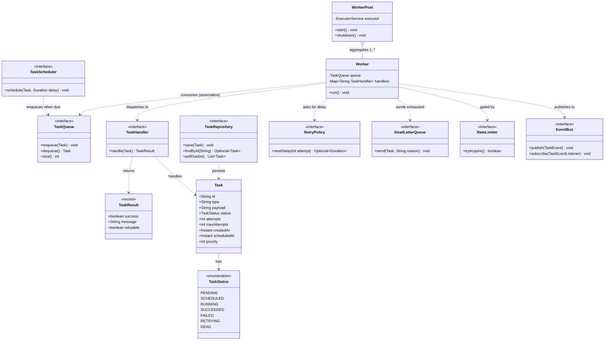
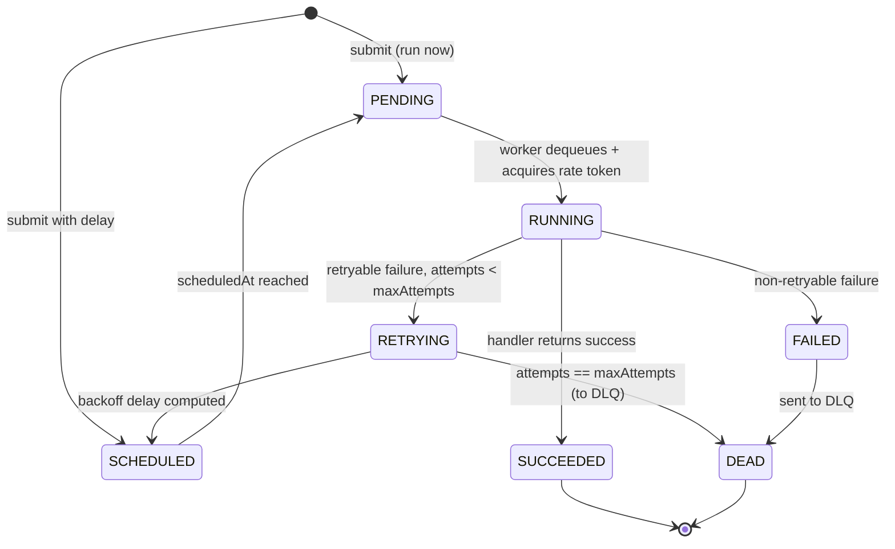
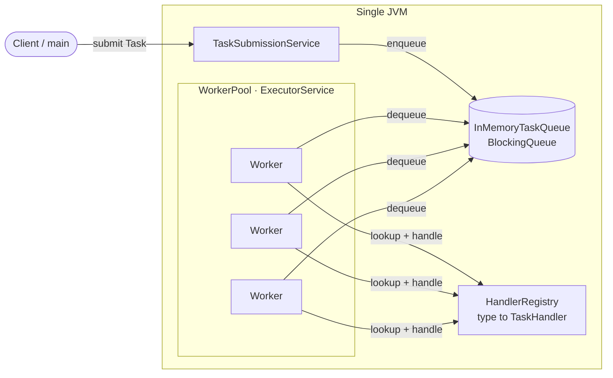
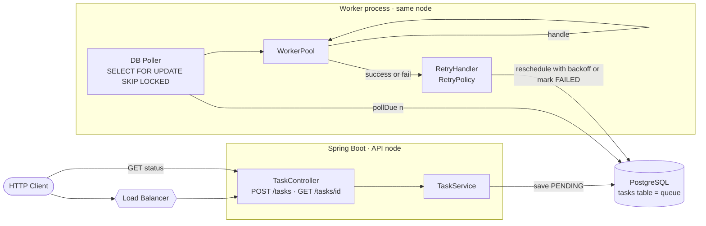
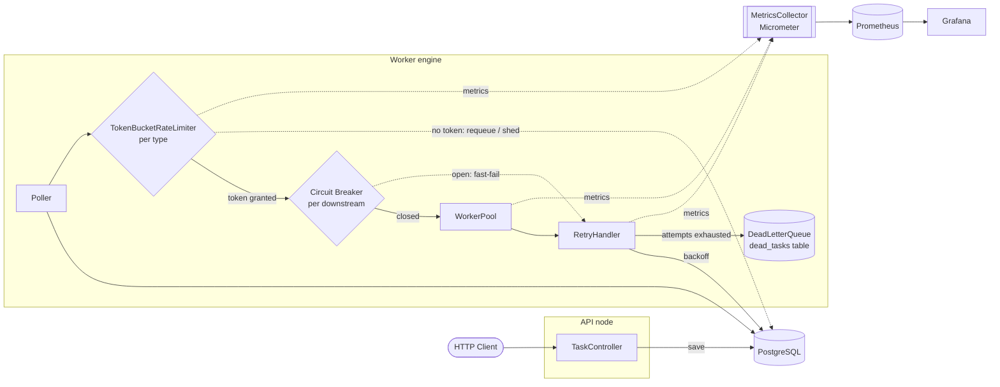
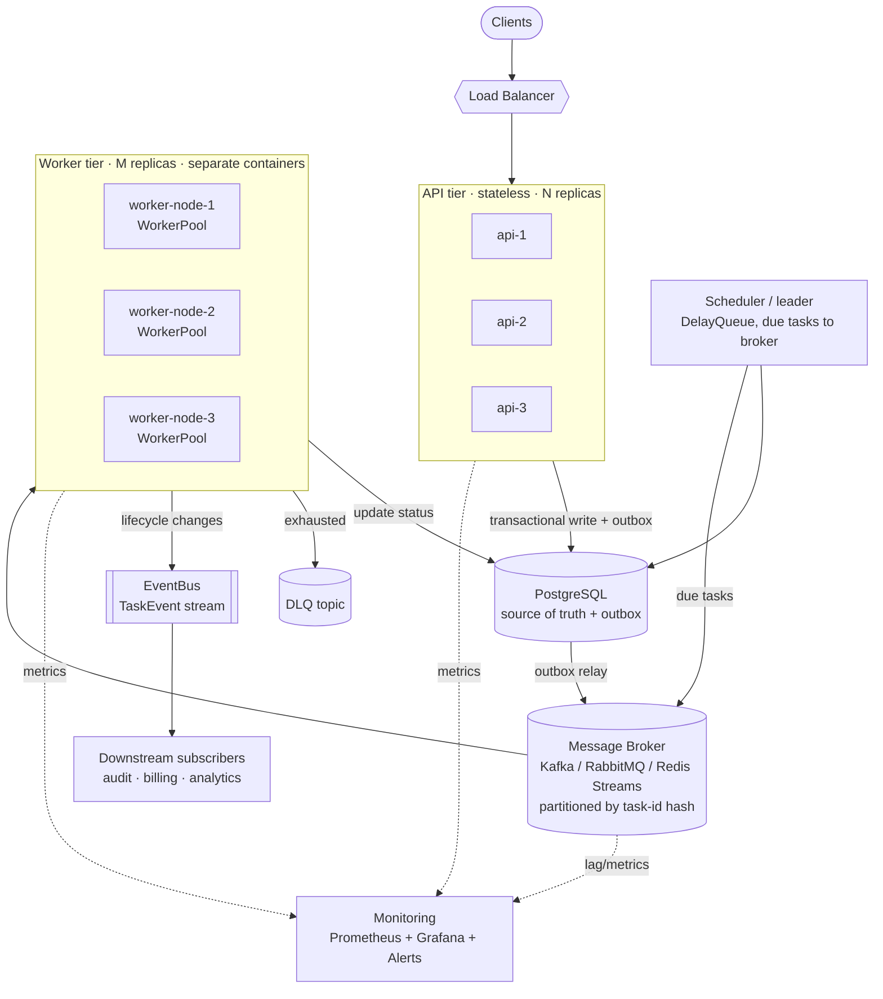
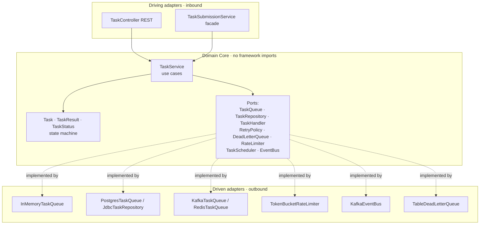
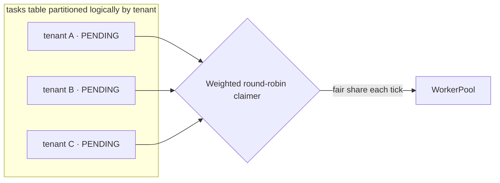

# System Architecture (All Phases)

> The single reference document for the **Distributed Task Queue and Event Processing Platform**. Every phase guide ([phase-1.md](./phase-1.md), [phase-2.md](./phase-2.md), [phase-3.md](./phase-3.md), [phase-4.md](./phase-4.md)) builds *toward* this design. Read this first to see the whole map; read the phase guides to build each leg of the journey.

This is a **system design document** written the way a staff engineer writes a design doc before kicking off a multi-quarter project: requirements first, then capacity math, then architecture, then the API and data contracts, then an explicit **decision log (ADRs)** that records *why* we chose each tradeoff. If you can stand at a whiteboard and reproduce this document, you can pass a senior backend / system-design interview built around a task queue — which is one of the most common prompts in the industry ("design a job scheduler", "design a notification fan-out", "design a rate limiter") because it touches queues, concurrency, persistence, retries, idempotency, and horizontal scaling all at once.

---

## 1. The Problem We Are Solving

Applications constantly need to do work that should **not** happen inside the request/response cycle:

- Send a welcome email after signup.
- Resize an uploaded image into five thumbnails.
- Charge a card, then reconcile with the ledger.
- Re-index a document for search.
- Fan out a "post published" event to 10,000 followers' feeds.

Doing these *synchronously* inside the HTTP request is a design smell:

- The user waits for slow, failure-prone third parties (SMTP, payment gateways, S3).
- A transient failure (a network blip) fails the *whole* request, even though the core action already succeeded.
- You cannot smooth out spikes: 10,000 signups in one minute means 10,000 simultaneous SMTP connections.
- You cannot retry safely, prioritize, schedule for later, or shed load.

The fix is a **task queue** (a.k.a. job queue, work queue): the API accepts a unit of work, **durably records it**, and returns immediately. A pool of **workers** consumes the work asynchronously, with retries, backoff, rate limiting, dead-lettering, scheduling, and observability.

We build exactly that, from a 200-line in-memory prototype to a horizontally scalable, broker-backed, event-driven platform — refactoring the *same* codebase across four phases so the learning is about **evolution under changing requirements**, not greenfield rewrites.

---

## 2. Requirements

### 2.1 Functional requirements

| # | Requirement | First appears |
|---|-------------|---------------|
| F1 | Submit a task via API; get back a task id immediately. | Phase 1 |
| F2 | Each task has a `type` that maps to a handler that knows how to execute it. | Phase 1 |
| F3 | Workers execute tasks asynchronously off a queue. | Phase 1 |
| F4 | Failed tasks are retried with a configurable retry policy (fixed / exponential backoff). | Phase 1 → 2 |
| F5 | Tasks survive process restart (durable persistence). | Phase 2 |
| F6 | Query a task's status by id. | Phase 2 |
| F7 | Tasks can be **scheduled** to run after a delay or at a future time. | Phase 1 (in-memory) → 2 (durable) |
| F8 | Tasks that exhaust retries go to a **dead-letter queue (DLQ)** with a reason. | Phase 3 |
| F9 | Per-type **rate limiting** so one task type cannot starve others or overwhelm a downstream. | Phase 3 |
| F10 | **Priority**: higher-priority tasks run first when capacity is scarce. | Phase 1 (queue) → 2 (DB ordering) |
| F11 | **Observability**: counters, latencies, queue depth, success/failure rates. | Phase 3 |
| F12 | Multiple worker **nodes** (separate processes/containers) consume the same queue. | Phase 4 |
| F13 | Task lifecycle changes **publish events** other systems can subscribe to. | Phase 4 |
| F14 | At-least-once execution with idempotency support (effectively exactly-once). | Phase 2 → 4 |

### 2.2 Non-functional requirements

| Attribute | Target | Why |
|-----------|--------|-----|
| **Durability** | No acknowledged task is ever lost (survives crash). | A "send invoice" task silently vanishing is unacceptable. |
| **Availability** | API and workers tolerate single-node failure; degrade gracefully under load. | Submission must keep working even if a worker dies. |
| **Latency (submit)** | p99 enqueue < 20 ms (Phase 2, single region). | Submission sits on the user's critical path. |
| **Throughput** | 5k tasks/s sustained per shard (Phase 4 target). | See capacity math below. |
| **Delivery semantics** | **At-least-once** by default; idempotent handlers make it effectively exactly-once. | True exactly-once across a process crash *and* an external side effect is impossible without distributed transactions; we choose at-least-once + idempotency (the industry standard). |
| **Ordering** | Best-effort FIFO within a priority band; **no** global total order. | Global ordering kills throughput and most jobs don't need it. |
| **Backpressure** | Bounded queues; reject or shed when full rather than OOM. | Unbounded queues turn a spike into a crash. |
| **Operability** | Metrics, structured logs, health checks, runbooks. | You operate what you ship. |

> **Interview tip:** Separate functional from non-functional requirements out loud, then *name the delivery semantics explicitly*. Saying "at-least-once plus idempotent consumers" in the first two minutes signals seniority.

---

## 3. Capacity Estimation (Back-of-the-Envelope)

Let's size for a mid-size SaaS. These numbers *drive* the architecture; an interviewer wants the **method**, not perfect figures.

**Assumptions**

- 5 million daily tasks (emails, thumbnails, webhooks, re-indexes).
- Spiky: 80% of volume in a 10-hour business window; 3× peak-to-average within that window.

**Submit rate**

```text
avg over 24h      = 5,000,000 / 86,400 s  ≈ 58 tasks/s
avg over 10h busy = 5,000,000 / 36,000 s  ≈ 139 tasks/s
peak (3×)         ≈ 417 tasks/s
headroom (2×)     → design for ~1,000 tasks/s submit
```

A single Spring Boot instance handles ~1k simple POSTs/s comfortably, so 2–3 API instances behind a load balancer give margin. Submission is **not** the bottleneck; **execution** is.

**Storage**

```text
Task row (id, type, status, attempts, timestamps, priority) ≈ 200 bytes metadata
payload (JSON)                                              ≈ 1 KB avg
per task                                                    ≈ 1.2 KB
5M tasks/day × 1.2 KB                                       ≈ 6 GB/day of new rows
retain terminal tasks 7 days, then archive                 ≈ 42 GB hot in Postgres
```

Comfortable for a single Postgres primary with read replicas. At 10× growth (50M/day → 420 GB hot) we **shard by task-id hash** (Phase 4) and archive terminal tasks to cold storage (S3 / Parquet) via a nightly job. See [sharding.md](../08-distributed-systems/sharding.md).

**Execution / worker sizing**

```text
say avg task takes 200 ms wall clock, mostly I/O (SMTP, S3, HTTP)
to sustain 417 tasks/s peak: concurrency = rate × latency = 417 × 0.2 ≈ 84 in-flight
with virtual threads, one JVM holds thousands of in-flight tasks cheaply → 84 is trivial
the real limit is DOWNSTREAM (SMTP / payment) capacity → rate limiting (F9) matters more than CPU
```

> **Key insight that shapes everything:** for an I/O-bound task queue the bottleneck is rarely your CPU or your queue — it is the **downstream dependency** and the **database polling pattern**. That is why Phase 3 adds rate limiting and circuit breakers, and why Phase 4 moves from DB polling to a push-based broker.

**Bandwidth**

```text
417 tasks/s × 1.2 KB ≈ 0.5 MB/s ingest. Negligible.
```

---

## 4. The Canonical Domain Model

Every phase shares this vocabulary. These are the exact names used across the whole curriculum, so internalize them. Domain modeling rationale lives in [domain-modeling.md](../04-oop-and-ood/domain-modeling.md).



Relationship legend (UML): a **filled diamond** is composition (owner controls lifecycle), an **open diamond** (`o--`) is aggregation (`WorkerPool` aggregates `Worker`s — they could exist independently), a **dashed arrow** (`..>`) is a dependency/association. Coverage of these relationships: [association.md](../02-core-oop/chapter-14-association.md), [aggregation.md](../02-core-oop/chapter-15-aggregation.md), [composition.md](../02-core-oop/chapter-16-composition.md).

### 4.1 The model in code

```java
public enum TaskStatus {
    PENDING, SCHEDULED, RUNNING, SUCCEEDED, FAILED, RETRYING, DEAD
}

// Mutable in Phase 1-2 because status/attempts evolve in place; see ADR-009 for why
// we deliberately do NOT use a record for Task even though we use records elsewhere.
public final class Task {
    private final String id;          // UUID, immutable identity
    private final String type;        // routes to a TaskHandler
    private final String payload;     // opaque JSON string
    private volatile TaskStatus status;
    private int attempts;
    private final int maxAttempts;
    private final Instant createdAt;
    private volatile Instant scheduledAt;
    private final int priority;       // higher = runs sooner

    // constructor + accessors + transition methods omitted; see phase-1.md
}

// Immutable value object: records are perfect for outcomes.
public record TaskResult(boolean success, String message, boolean retryable) {
    public static TaskResult ok()                 { return new TaskResult(true, "ok", false); }
    public static TaskResult retry(String why)    { return new TaskResult(false, why, true); }
    public static TaskResult fail(String why)     { return new TaskResult(false, why, false); }
}

// Functional interface: a handler is just "Task in, TaskResult out".
@FunctionalInterface
public interface TaskHandler {
    TaskResult handle(Task task) throws Exception;
}
```

### 4.2 Task lifecycle (state machine)

The status field is not a free-for-all enum; it is a **state machine** with legal transitions. Modeling it as one (see [state.md](../05-design-patterns/state.md)) prevents bugs like "a SUCCEEDED task being retried".



Legal transitions are enforced in one place (a `transitionTo` method or a `TaskStateMachine`) so every adapter — in-memory, Postgres, broker — obeys the same rules.

---

## 5. Architecture Evolution Across Four Phases

The same conceptual pipeline — **submit → durably record → schedule → rate-limit → execute → retry/dead-letter → observe → emit events** — gets progressively more of its boxes implemented for real. Below, each phase has its own diagram. Watch which boxes turn from dashed (deferred) to solid (built).

### 5.1 Phase 1 — In-memory prototype (one JVM)

Goal: nail the **object model** and the **concurrency model**. The "API" is a plain Java facade (`TaskSubmissionService`), the queue is an in-heap `BlockingQueue`, workers are threads in an `ExecutorService`. No persistence, no HTTP. Built on the concurrency primitives in [blocking-queue.md](../06-concurrency/blocking-queue.md) and [executor-service.md](../06-concurrency/executor-service.md).



> **What is fake here:** durability (a crash loses the heap), retries (a failure just marks `FAILED`), DLQ, rate limiting, multi-node. We model the *fields* (`attempts`, `maxAttempts`, `scheduledAt`, `priority`) but do not implement behavior we cannot yet test — YAGNI, see [dry-kiss-yagni.md](../04-oop-and-ood/dry-kiss-yagni.md).

### 5.2 Phase 2 — Durable, REST, retries (one node, real DB)

Goal: survive restarts and add real failure handling. We add **Spring Boot 3** (REST), **PostgreSQL** (durability) with **Flyway** migrations, a `PostgresTaskQueue`/`TaskRepository`, and a `RetryHandler` driven by a `RetryPolicy`. The queue becomes a **table you poll** with `SELECT ... FOR UPDATE SKIP LOCKED`. See [task-queues.md](../07-queues-and-messaging/task-queues.md), [retries.md](../08-distributed-systems/retries.md), [idempotency.md](../08-distributed-systems/idempotency.md).



> **New tradeoff (ADR-005):** the queue *is the database*. Pros: one source of truth, transactional enqueue with your business write (no dual-write problem), trivially durable. Cons: polling has latency and load; `SKIP LOCKED` is the trick that makes it not melt under contention.

### 5.3 Phase 3 — Rate limiting, DLQ, observability (one node, hardened)

Goal: make it *production-survivable*. Add a **token-bucket `RateLimiter`** per task type, a real **`DeadLetterQueue`**, **circuit breakers** (Resilience4j) around flaky downstreams, and **Micrometer → Prometheus → Grafana** metrics. See [rate-limiting.md](../08-distributed-systems/rate-limiting.md), [dead-letter-queues.md](../07-queues-and-messaging/dead-letter-queues.md), [circuit-breakers.md](../08-distributed-systems/circuit-breakers.md), [backpressure.md](../08-distributed-systems/backpressure.md).



> **New tradeoff (ADR-006):** rate limiting protects the *downstream*, not us. When the bucket is empty we must decide: requeue with delay (preserve the task, add latency) or shed (drop and signal backpressure). We **requeue** for durability-critical tasks and only shed at the API edge under extreme load.

### 5.4 Phase 4 — Distributed, broker-backed, event-driven, horizontally scaled

Goal: scale out and decouple. The queue moves from a DB table to a **pluggable broker** (Redis Streams / RabbitMQ / Kafka) so many **worker nodes** in separate containers consume the same stream. Lifecycle changes flow onto an **`EventBus`** so other systems subscribe without coupling. Everything runs in **Docker Compose**, scaled horizontally. See [broker-comparison.md](../07-queues-and-messaging/broker-comparison.md), [message-ordering.md](../08-distributed-systems/message-ordering.md), [service-discovery-and-scaling.md](../08-distributed-systems/service-discovery-and-scaling.md), [leader-election.md](../08-distributed-systems/leader-election.md).



> **New tradeoffs (ADR-007, ADR-008):** moving to a broker buys push delivery (low latency, no polling load) and horizontal scale, but reintroduces the **dual-write problem** (write to DB *and* broker atomically?). We solve it with the **transactional outbox** pattern: write the task and an `outbox` row in one DB transaction, then a relay publishes to the broker. Partition by **task-id hash** to scale while keeping per-task ordering.

### 5.5 Side-by-side: what becomes real each phase

| Capability | P1 | P2 | P3 | P4 |
|---|----|----|----|----|
| Submit API | facade | REST | REST | REST + LB, N replicas |
| Queue | `BlockingQueue` | Postgres table | Postgres table | broker (partitioned) |
| Durability | none | full | full | full + outbox |
| Retries / backoff | none | `RetryPolicy` | + circuit breaker | distributed |
| DLQ | none | none | `DeadLetterQueue` | DLQ topic |
| Rate limiting | bounded queue only | none | `TokenBucketRateLimiter` | distributed token bucket (Redis) |
| Scheduling | in-memory `DelayQueue` | `scheduledAt` poll | `scheduledAt` poll | leader scheduler |
| Observability | logs | logs | Micrometer/Prometheus | + broker lag, distributed traces |
| Workers | threads, 1 JVM | threads, 1 node | threads, 1 node | M nodes, M containers |
| Events | none | none | none | `EventBus` |

---

## 6. Ports and Adapters (Hexagonal Layout)

The reason we can evolve so dramatically *without rewriting* is that the **domain core depends only on interfaces (ports)**, and each phase swaps in a different **adapter** (implementation). This is hexagonal / ports-and-adapters architecture — see [hexagonal-architecture.md](../04-oop-and-ood/hexagonal-architecture.md) and [clean-architecture.md](../04-oop-and-ood/clean-architecture.md). The interfaces are the canonical domain model from §4; the adapters are phase-specific.



The dependency rule: **arrows point inward**. The core never imports Spring, JDBC, or Kafka; adapters depend on the core's interfaces. This is just the Dependency Inversion Principle applied at architecture scale — see [solid.md](../04-oop-and-ood/solid.md) and [dependency-injection.md](../04-oop-and-ood/dependency-injection.md).

```java
// CORE: a use case that knows nothing about HTTP, JDBC, or Kafka.
public final class TaskService {
    private final TaskRepository repo;   // port
    private final TaskQueue queue;       // port
    private final EventBus events;       // port (no-op adapter before Phase 4)

    public TaskService(TaskRepository repo, TaskQueue queue, EventBus events) {
        this.repo = repo; this.queue = queue; this.events = events;
    }

    public String submit(String type, String payload, int priority, Duration delay) {
        var now = Instant.now();
        var task = new Task(
            UUID.randomUUID().toString(), type, payload,
            delay.isZero() ? TaskStatus.PENDING : TaskStatus.SCHEDULED,
            0, 5, now, now.plus(delay), priority);
        repo.save(task);                         // durable (adapter decides how)
        if (delay.isZero()) queue.enqueue(task); // visible to workers
        events.publish(new TaskEvent(task.id(), task.status(), now));
        return task.id();
    }
}
```

Wiring differs per phase, but `TaskService` never changes:

```java
// Phase 1 wiring (plain Java, no framework)
var queue = new InMemoryTaskQueue(10_000);
var repo  = new InMemoryTaskRepository();
var bus   = EventBus.NOOP;
var service = new TaskService(repo, queue, bus);

// Phase 4 wiring (Spring @Configuration)
@Bean TaskService taskService(JdbcTaskRepository repo, KafkaTaskQueue queue, KafkaEventBus bus) {
    return new TaskService(repo, queue, bus);
}
```

> This is the single most valuable architectural idea in the whole project: **the same `TaskService` runs in Phase 1's prototype and Phase 4's cluster** because it depends on ports, not adapters. Be able to explain it cold.

---

## 7. API Contract

The REST surface is small and stable from Phase 2 on. Designed with idempotency and pagination in mind from day one.

### 7.1 Submit a task

```text
POST /tasks
Idempotency-Key: 9f1c...   (optional; dedupes retried client submits)
Content-Type: application/json
```

```json
{
  "type": "send_email",
  "payload": "{\"to\":\"a@b.com\",\"template\":\"welcome\"}",
  "priority": 5,
  "maxAttempts": 5,
  "delaySeconds": 0
}
```

`201 Created`:

```json
{
  "id": "b1e6c4e2-7a3d-4b2f-9c1a-0f2e3d4c5b6a",
  "status": "PENDING",
  "createdAt": "2026-06-07T10:15:30Z"
}
```

### 7.2 Get task status

```text
GET /tasks/{id}
```

`200 OK`:

```json
{
  "id": "b1e6c4e2-7a3d-4b2f-9c1a-0f2e3d4c5b6a",
  "type": "send_email",
  "status": "SUCCEEDED",
  "attempts": 1,
  "maxAttempts": 5,
  "createdAt": "2026-06-07T10:15:30Z",
  "scheduledAt": "2026-06-07T10:15:30Z",
  "priority": 5
}
```

`404 Not Found` if the id is unknown.

### 7.3 Spring controller

```java
@RestController
@RequestMapping("/tasks")
public class TaskController {

    private final TaskService service;

    public TaskController(TaskService service) { this.service = service; }

    @PostMapping
    public ResponseEntity<SubmitResponse> submit(
            @RequestBody @Valid SubmitRequest req,
            @RequestHeader(value = "Idempotency-Key", required = false) String idemKey) {
        String id = service.submit(
            req.type(), req.payload(),
            req.priority(), Duration.ofSeconds(req.delaySeconds()),
            idemKey);
        return ResponseEntity.created(URI.create("/tasks/" + id))
                             .body(new SubmitResponse(id, "PENDING", Instant.now()));
    }

    @GetMapping("/{id}")
    public ResponseEntity<TaskView> get(@PathVariable String id) {
        return service.find(id)
                      .map(TaskView::from)
                      .map(ResponseEntity::ok)
                      .orElseGet(() -> ResponseEntity.notFound().build());
    }
}

// DTOs as records (immutable, validated at the edge — see chapter-08-functional-interfaces.md)
public record SubmitRequest(
    @NotBlank String type,
    @NotNull String payload,
    @Min(0) @Max(9) int priority,
    @Min(1) @Max(20) int maxAttempts,
    @Min(0) long delaySeconds) {}
```

### 7.4 Contract decisions

| Decision | Choice | Rationale |
|---|---|---|
| Idempotent submit | `Idempotency-Key` header → unique index on `idempotency_key` | A client retry must not create two tasks. |
| Payload format | opaque JSON **string**, not a typed body | The queue is generic; handlers parse their own payload. Decouples the platform from task schemas. |
| Status model | return the enum verbatim | Clients can poll or subscribe; no leaky internal codes. |
| Errors | RFC 7807 problem+json | Standard, machine-readable. |
| Versioning | path prefix `/v1` when breaking | Additive changes don't bump the version. |

---

## 8. Data Model

From Phase 2 the **`tasks` table is both the system of record and the queue**. Schema is owned by Flyway migrations.

```sql
-- V1__create_tasks.sql
CREATE TABLE tasks (
    id              UUID PRIMARY KEY,
    type            TEXT        NOT NULL,
    payload         JSONB       NOT NULL,
    status          TEXT        NOT NULL,         -- TaskStatus enum value
    attempts        INT         NOT NULL DEFAULT 0,
    max_attempts    INT         NOT NULL DEFAULT 5,
    priority        INT         NOT NULL DEFAULT 5,
    created_at      TIMESTAMPTZ NOT NULL DEFAULT now(),
    scheduled_at    TIMESTAMPTZ NOT NULL,          -- when it becomes runnable
    locked_at       TIMESTAMPTZ,                   -- worker lease start
    locked_by       TEXT,                          -- worker/node id (visibility)
    idempotency_key TEXT,
    updated_at      TIMESTAMPTZ NOT NULL DEFAULT now()
);

-- The hot path: "give me the N highest-priority due tasks not already taken".
CREATE INDEX idx_tasks_due
    ON tasks (status, scheduled_at, priority DESC)
    WHERE status IN ('PENDING', 'SCHEDULED', 'RETRYING');

-- Idempotent submit
CREATE UNIQUE INDEX idx_tasks_idem ON tasks (idempotency_key)
    WHERE idempotency_key IS NOT NULL;
```

```sql
-- V2__create_dead_tasks.sql  (Phase 3)
CREATE TABLE dead_tasks (
    id           UUID PRIMARY KEY,
    original     JSONB       NOT NULL,   -- full snapshot of the dead Task
    reason       TEXT        NOT NULL,
    failed_at    TIMESTAMPTZ NOT NULL DEFAULT now(),
    attempts     INT         NOT NULL
);
```

```sql
-- V3__create_outbox.sql  (Phase 4: transactional outbox for the EventBus / broker)
CREATE TABLE outbox (
    seq         BIGSERIAL PRIMARY KEY,
    aggregate   TEXT        NOT NULL,    -- 'task'
    payload     JSONB       NOT NULL,    -- serialized TaskEvent
    published   BOOLEAN     NOT NULL DEFAULT false,
    created_at  TIMESTAMPTZ NOT NULL DEFAULT now()
);
CREATE INDEX idx_outbox_unpublished ON outbox (seq) WHERE NOT published;
```

The dequeue query — the heart of the DB-as-queue design — uses `SKIP LOCKED` so concurrent workers never block each other:

```sql
-- pollDue(n): claim up to n due tasks atomically, mark them RUNNING.
UPDATE tasks
SET status = 'RUNNING', locked_at = now(), locked_by = :workerId, updated_at = now()
WHERE id IN (
    SELECT id FROM tasks
    WHERE status IN ('PENDING','SCHEDULED','RETRYING')
      AND scheduled_at <= now()
    ORDER BY priority DESC, scheduled_at ASC
    FOR UPDATE SKIP LOCKED
    LIMIT :n
)
RETURNING *;
```

> **Why `SKIP LOCKED` is the whole trick:** without it, 50 workers running the same `SELECT ... FOR UPDATE` serialize on the same hot rows and your throughput collapses to one worker. `SKIP LOCKED` lets each worker grab a *different* batch. This is how the DB-as-queue pattern scales to a few thousand tasks/s before you need a real broker.

---

## 9. Decision Log (ADRs)

Architecture Decision Records — the *why* behind each major choice. Each is a tradeoff a senior interviewer will probe.

### ADR-001 — Asynchronous queue over synchronous processing
**Status:** Accepted.
**Context:** Slow, failure-prone side effects on the request path.
**Decision:** Accept-and-acknowledge; process off a queue.
**Consequences:** Decoupling, retries, load smoothing, spike absorption. Cost: eventual consistency (the email is "queued", not "sent" when we 201), and a new component to operate.

### ADR-002 — At-least-once + idempotent handlers (not exactly-once)
**Status:** Accepted.
**Context:** F14 wants no lost work and no double-charge.
**Decision:** Guarantee at-least-once delivery; require handlers to be idempotent (dedupe by task id / business key). See [idempotency.md](../08-distributed-systems/idempotency.md).
**Consequences:** Simpler, scalable, robust to crashes. A task may run twice (e.g., worker dies after side effect, before ack), so handlers must tolerate it. True exactly-once across a crash and an external side effect needs distributed transactions we will not pay for.

### ADR-003 — Pull (workers poll) over push, in Phases 1–3
**Status:** Accepted (revisited in ADR-007).
**Context:** Who drives delivery — does the queue push to workers, or do workers pull?
**Decision:** Workers **pull** (poll the queue / DB). See [producer-consumer.md](../07-queues-and-messaging/producer-consumer.md).
**Consequences:** Natural backpressure (a busy worker simply doesn't pull), simple flow control, no need for the broker to track consumer health. Cost: polling latency and DB load — mitigated by `SKIP LOCKED`, adaptive poll intervals, and `LISTEN/NOTIFY` to wake pollers. Phase 4 adds push via a broker for lower latency at scale.

### ADR-004 — Bounded queues and explicit backpressure
**Status:** Accepted.
**Context:** Unbounded queues turn a spike into an OutOfMemoryError.
**Decision:** Every in-memory queue is bounded; when full we block the producer (Phase 1) or shed at the API edge with `429` (Phase 3+). See [backpressure.md](../08-distributed-systems/backpressure.md).
**Consequences:** Predictable memory, graceful degradation. Cost: under sustained overload we *must* reject; capacity planning becomes a first-class concern.

### ADR-005 — Postgres-as-queue in Phase 2 (not a broker yet)
**Status:** Accepted (superseded for scale by ADR-007).
**Context:** We need durability and we already have Postgres.
**Decision:** Use the `tasks` table as the queue with `FOR UPDATE SKIP LOCKED`.
**Consequences:** One source of truth, **transactional enqueue** alongside the business write (no dual-write problem), trivial durability and queryability, no new infra. Cost: polling, write amplification (`UPDATE` per state change), VACUUM pressure, and a throughput ceiling (~few k/s) before a broker wins. Excellent default; most products never outgrow it.

### ADR-006 — Token-bucket rate limiting per task type
**Status:** Accepted.
**Context:** One downstream (SMTP) must not be flooded; one task type must not starve others.
**Decision:** A `TokenBucketRateLimiter` per type (allows bursts up to bucket size, smooths to a refill rate). See [rate-limiting.md](../08-distributed-systems/rate-limiting.md).
**Consequences:** Protects downstreams, fair sharing. Cost: tasks denied a token are requeued with delay (latency) or shed; in Phase 4 the bucket must be **distributed** (Redis) so it limits across all worker nodes, not per node.

### ADR-007 — Move to a pluggable broker in Phase 4
**Status:** Accepted.
**Context:** DB-as-queue ceiling (~few k/s) and the need for many independent worker nodes.
**Decision:** Introduce a `TaskQueue` adapter over a broker (Redis Streams / RabbitMQ / Kafka), chosen per workload. See [broker-comparison.md](../07-queues-and-messaging/broker-comparison.md).
**Consequences:** Push delivery (low latency, no poll load), horizontal scale, partitioned ordering. Cost: a new stateful system to operate, reintroduces the **dual-write problem** (solved by ADR-008), and broker-specific delivery semantics to reason about.

### ADR-008 — Transactional outbox for reliable event publishing
**Status:** Accepted.
**Context:** With a broker, we must write to the DB *and* publish to the broker atomically — but you cannot commit two systems in one transaction.
**Decision:** Write the task + an `outbox` row in **one** DB transaction; a relay process reads unpublished outbox rows and publishes to the broker, marking them published.
**Consequences:** No lost or phantom events; effectively at-least-once publish. Cost: a relay to operate, and consumers must dedupe (which they already do per ADR-002).

### ADR-009 — `Task` is a mutable class, not a record (yet)
**Status:** Accepted.
**Context:** We favor immutability/records everywhere (`TaskResult`, DTOs).
**Decision:** `Task` is a final class with controlled mutation (`status`, `attempts`, `scheduledAt` change in place) guarded by the state machine. Identity fields are `final`.
**Consequences:** Avoids allocating a new object on every state transition in the hot path; mutation is centralized and legal-transition-checked. Cost: must be careful about sharing across threads (`volatile` status, defensive copies at boundaries). See [immutable-objects.md](../03-java-memory-model/immutable-objects.md) for the principle we are trading off and why.

### ADR-010 — Virtual threads for worker concurrency
**Status:** Accepted.
**Context:** Tasks are I/O-bound; classic thread pools cap concurrency at pool size.
**Decision:** Run handlers on **virtual threads** (`Executors.newVirtualThreadPerTaskExecutor()`), bounded by the rate limiter and a semaphore, not by thread count. See [executor-service.md](../06-concurrency/executor-service.md) and [semaphores.md](../06-concurrency/semaphores.md).
**Consequences:** Thousands of in-flight I/O-bound tasks per JVM, cheap blocking. Cost: must avoid pinning (synchronized blocks around blocking I/O) and must still bound concurrency to protect downstreams.

---

## 10. Key Tradeoffs (Interview Gold)

| Tradeoff | Option A | Option B | Our choice & why |
|---|---|---|---|
| Delivery | exactly-once | at-least-once | **B + idempotency** — exactly-once across crash+side-effect needs distributed txns; idempotent handlers get you there cheaply. |
| Delivery driver | push | pull | **Pull P1–3, push P4** — pull gives free backpressure; push gives low latency at scale. |
| Queue substrate | broker now | DB-as-queue | **DB first, broker when needed** — avoid premature infra; outgrow it deliberately. |
| Consistency | strong (sync) | eventual (async) | **Eventual** — the whole point of a queue; surface status via GET. |
| Ordering | global total order | per-key/best-effort | **Per-partition best-effort** — global ordering serializes everything. |
| Memory under spike | unbounded buffer | bounded + shed | **Bounded + shed/backpressure** — never trade a spike for an OOM. |
| Scaling unit | bigger node (vertical) | more nodes (horizontal) | **Horizontal in P4** — partition by task-id hash; stateless API + workers. |
| Rate limiter scope | per node | distributed | **Per node P3, distributed (Redis) P4** — otherwise N nodes = N× the intended rate. |

---

## 11. Bottlenecks and How We Scale Them

| Bottleneck | Symptom | Fix |
|---|---|---|
| DB poll contention | workers fight over hot rows; throughput flat | `SKIP LOCKED`, batch claims, `LISTEN/NOTIFY` to wake pollers (ADR-005) |
| DB write amplification | `UPDATE` per state change, VACUUM lag | fewer transitions, batch acks, partition `tasks` by month, archive terminal rows |
| Single DB primary | write ceiling | shard by task-id hash; read replicas for status GETs ([sharding.md](../08-distributed-systems/sharding.md)) |
| Downstream saturation | SMTP/payment 429s/timeouts | per-type token bucket + circuit breaker (ADR-006, [circuit-breakers.md](../08-distributed-systems/circuit-breakers.md)) |
| Worker concurrency cap | queue depth grows, latency climbs | virtual threads + more worker nodes (ADR-010) |
| Hot task type | one type starves others | per-type queues/partitions + weighted fair scheduling |
| Broker lag (P4) | consumer lag metric climbs | add partitions + worker replicas; alert on lag |
| Scheduler single point | delayed tasks stall if leader dies | leader election with failover ([leader-election.md](../08-distributed-systems/leader-election.md)) |

---

## 12. Failure Modes and Mitigations

| Failure | What happens | Mitigation |
|---|---|---|
| Worker crashes mid-task | task stuck `RUNNING`, leased | **lease + reaper**: `locked_at` older than visibility timeout → reset to `PENDING`; idempotent handler tolerates the re-run (ADR-002) |
| Poison task (always fails) | infinite retries waste capacity | `maxAttempts` → **DLQ** with reason (F8); alert on DLQ growth |
| Thundering herd on retry | all failures retry at the same instant | **exponential backoff with jitter** ([retries.md](../08-distributed-systems/retries.md)) |
| Downstream down | every task fails, retries pile up | **circuit breaker** opens, fast-fails, periodic half-open probe |
| Duplicate submit | two identical tasks | `Idempotency-Key` unique index (ADR-002) |
| DB primary failover | brief write unavailability | retries + bounded queue at API; HA Postgres (replicas + automated failover) |
| Broker partition loss (P4) | some tasks unconsumable | replication factor ≥ 3, min-ISR; consumer rebalance |
| Queue overflow | memory pressure | bounded queue + `429`/shed at edge (ADR-004) |
| Clock skew on `scheduledAt` | task runs early/late across nodes | single time source / DB `now()`; tolerate small skew |

```java
// The lease-and-reaper pattern that makes worker crashes safe (Phase 3+).
// A periodic job resurrects tasks whose lease expired.
@Scheduled(fixedDelay = 30_000)
public void reapStuckTasks() {
    int reset = repo.resetExpiredLeases(Duration.ofMinutes(5)); // locked_at < now()-5m
    if (reset > 0) metrics.counter("tasks.lease.reaped").increment(reset);
}
```

```sql
-- resetExpiredLeases: a crashed worker's tasks become runnable again.
UPDATE tasks
SET status = 'PENDING', locked_at = NULL, locked_by = NULL, updated_at = now()
WHERE status = 'RUNNING' AND locked_at < now() - INTERVAL '5 minutes';
```

---

## 13. How the Real Project Embodies This Design

Trace any concept from this doc to a concrete class in the canonical model:

- **Submit** → `TaskService.submit` → `TaskController` (REST adapter).
- **Durable record** → `TaskRepository.save` → `InMemoryTaskRepository` / `JdbcTaskRepository`.
- **Queue port** → `TaskQueue` → `InMemoryTaskQueue` (P1) → `PostgresTaskQueue` (P2) → broker adapter (P4).
- **Execute** → `Worker` (a `Runnable`) pulls, looks up `TaskHandler` by `type`, runs it, gets a `TaskResult`.
- **Concurrency** → `WorkerPool` owns the `ExecutorService` (virtual threads).
- **Retry** → `RetryPolicy.nextDelay` → `FixedDelayRetryPolicy` / `ExponentialBackoffRetryPolicy`.
- **Dead-letter** → `DeadLetterQueue.send(task, reason)`.
- **Rate limit** → `RateLimiter.tryAcquire` → `TokenBucketRateLimiter`.
- **Schedule** → `TaskScheduler.schedule(task, delay)` → `DelayQueue` / `ScheduledExecutorService`.
- **Events** → `EventBus.publish` / `subscribe` (P4).
- **Metrics** → `MetricsCollector` / Micrometer `MeterRegistry`.

The `Worker` run loop is where it all comes together:

```java
public final class Worker implements Runnable {
    private final TaskQueue queue;
    private final Map<String, TaskHandler> handlers;   // Strategy lookup by type
    private final RetryPolicy retryPolicy;
    private final RateLimiter rateLimiter;
    private final DeadLetterQueue dlq;
    private final EventBus events;
    private final MetricsCollector metrics;
    private volatile boolean running = true;

    @Override public void run() {
        while (running) {
            try {
                Task task = queue.dequeue();                 // pull (ADR-003)
                if (!rateLimiter.tryAcquire()) {             // gate (ADR-006)
                    queue.enqueue(task);                     // requeue, preserve durability
                    continue;
                }
                execute(task);
            } catch (InterruptedException e) {
                Thread.currentThread().interrupt();
                running = false;
            }
        }
    }

    private void execute(Task task) {
        task.transitionTo(TaskStatus.RUNNING);
        events.publish(TaskEvent.of(task));
        var timer = metrics.startTimer(task.type());
        try {
            TaskResult result = handlers.get(task.type()).handle(task);  // dispatch
            if (result.success()) {
                task.transitionTo(TaskStatus.SUCCEEDED);
                metrics.counter("tasks.succeeded").increment();
            } else if (result.retryable() && task.attempts() < task.maxAttempts()) {
                scheduleRetry(task, result.message());                    // backoff
            } else {
                deadLetter(task, result.message());                       // DLQ
            }
        } catch (Exception e) {
            if (task.attempts() < task.maxAttempts()) scheduleRetry(task, e.toString());
            else deadLetter(task, e.toString());
        } finally {
            timer.stop();
            events.publish(TaskEvent.of(task));
        }
    }

    private void scheduleRetry(Task task, String why) {
        task.incrementAttempts();
        Optional<Duration> delay = retryPolicy.nextDelay(task.attempts());  // jittered
        if (delay.isPresent()) {
            task.transitionTo(TaskStatus.RETRYING);
            task.setScheduledAt(Instant.now().plus(delay.get()));
            queue.enqueue(task);
            metrics.counter("tasks.retried").increment();
        } else {
            deadLetter(task, why);
        }
    }

    private void deadLetter(Task task, String reason) {
        task.transitionTo(TaskStatus.DEAD);
        dlq.send(task, reason);
        metrics.counter("tasks.dead").increment();
    }
}
```

Every line maps to an ADR. That is the point: the architecture *is* the code.

---

## 14. How to Present This in an Interview

A repeatable 35–40 minute structure for "design a task queue / job scheduler":

1. **Clarify (3 min).** Volume? Durability requirement? Delivery semantics needed? Scheduling/priority? Multi-tenant? State the F/NF split (§2).
2. **Capacity (3 min).** Do the submit-rate and concurrency math out loud (§3). Land the punchline: *"this is I/O-bound, so the bottleneck is the downstream and the polling pattern, not CPU."*
3. **Define the API and data model (5 min).** `POST /tasks` returns an id immediately; `GET /tasks/{id}`; the `tasks` table doubling as the queue.
4. **Draw the happy path (5 min).** Client → API → durable store → queue → worker pool → handler. Name the **delivery semantics**: at-least-once + idempotent.
5. **Add reliability (8 min).** Retries with exponential backoff + jitter, DLQ after `maxAttempts`, lease + reaper for crashed workers, circuit breaker for dead downstreams.
6. **Add scale (8 min).** Pull → push via a broker, partition by task-id hash, horizontal worker nodes, distributed rate limiter, transactional outbox for events.
7. **Tradeoffs and failure modes (5 min).** Walk §10–§12. Be explicit about what you'd *not* build (exactly-once, global ordering) and why.

> **The three sentences that signal seniority:** (1) "I'll guarantee at-least-once and require idempotent handlers." (2) "I'll start with the DB as the queue using `SKIP LOCKED`, and only move to a broker when I outgrow it." (3) "For events with a broker I'll use the transactional outbox to avoid the dual-write problem." Drop these and the interview is largely won.

Common interviewer follow-ups and crisp answers:

- *"How do you prevent a task running twice?"* — You don't *prevent* it; you make it *safe* via idempotent handlers keyed on task id / business key (ADR-002).
- *"A worker dies mid-task — what happens?"* — The lease expires; a reaper resets it to `PENDING`; the idempotent handler tolerates the re-run.
- *"How do you schedule a task for next Tuesday?"* — `scheduledAt` + a poller that only claims `scheduled_at <= now()`; a leader-elected scheduler in the distributed case.
- *"Why not Kafka from day one?"* — Premature infra; DB-as-queue gives transactional enqueue and durability with zero new systems, and most products never outgrow it.
- *"How does rate limiting work across nodes?"* — Per-node token bucket is wrong at scale (N× rate); use a distributed bucket in Redis.

---

## 15. Tradeoffs Summary Table

| Concern | Phase 1 | Phase 2 | Phase 3 | Phase 4 |
|---|---|---|---|---|
| **Strength** | learn model + concurrency fast | durable + queryable + retries | survivable: DLQ, limits, metrics | scalable, decoupled, event-driven |
| **Weakness** | loses data on crash | DB poll latency, single node | still single node | operational complexity, more infra |
| **Right when** | learning / spike | < few k tasks/s, one team | production hardening | high volume, many consumers |

---

## 16. Common Mistakes and Pitfalls

- **Unbounded queues.** A spike becomes an OOM. Always bound and define a shed policy (ADR-004).
- **Pretending exactly-once is free.** It isn't; design for at-least-once + idempotency or you'll ship double-charges.
- **`SELECT ... FOR UPDATE` without `SKIP LOCKED`.** Workers serialize on hot rows; throughput collapses to one worker.
- **Retrying without jitter.** Synchronized retry storms hammer a recovering downstream right back down.
- **No DLQ.** Poison tasks retry forever, burning capacity and hiding the real failure.
- **Per-node rate limiters at scale.** N nodes silently multiply your intended rate by N.
- **Dual-write to DB and broker without an outbox.** You will eventually drop or phantom an event.
- **Leaking framework into the core.** If `TaskService` imports Spring/JDBC/Kafka, you've lost the ability to evolve adapters (§6).
- **No lease/reaper.** A crashed worker's task is stuck `RUNNING` forever.
- **Treating `status` as a free enum.** Without a state machine you'll retry SUCCEEDED tasks. Model the transitions (§4.2).

---

## 17. Exercises

### Easy

1. **Knowledge check.** Why do we guarantee *at-least-once* rather than *exactly-once*? What requirement on handlers makes at-least-once acceptable in practice?
2. **Knowledge check.** In the `tasks`-as-queue design, what does `SKIP LOCKED` buy you, and what breaks without it?
3. **Reading the model.** List which canonical interfaces (ports) get a *new adapter* in each phase.

### Medium

4. **Coding.** Implement `pollDue(int n)` as a method on a `JdbcTaskRepository` using the `SKIP LOCKED` query from §8. Return a `List<Task>` and mark each row `RUNNING` in the same statement.
5. **Refactoring.** Below is a worker that ignores backpressure and rate limiting. Refactor it to gate on a `RateLimiter` and requeue when denied, without changing its public surface.
6. **Design.** Sketch (in prose + one Mermaid diagram) how you'd add **per-tenant fair scheduling** so no single tenant monopolizes the worker pool.

### Hard

7. **Design / interview.** Move the system from Phase 3 (DB-as-queue) to Phase 4 (broker). Address: the dual-write problem, ordering, the distributed rate limiter, and how status GETs stay consistent. Produce an ADR.
8. **Stretch.** Design **exactly-once *effects*** for a `charge_card` task type, given an at-least-once queue and a payment API that supports idempotency keys. What do you store, where, and how does a retry behave?

---

## 18. Solutions

**1.** True exactly-once across a process crash *and* an external side effect requires a distributed transaction spanning your queue and the external system (e.g., SMTP), which neither offers. At-least-once is cheap and crash-robust. It becomes *effectively* exactly-once when handlers are **idempotent** — keyed on the task id or a business key — so re-running them produces no additional effect (ADR-002).

**2.** `SKIP LOCKED` lets each concurrent worker's claiming `UPDATE ... FOR UPDATE` skip rows another worker has already locked, so N workers grab N *different* batches. Without it, every worker's `SELECT ... FOR UPDATE` targets the same highest-priority rows and they serialize, collapsing throughput to roughly one worker's worth and adding lock-wait latency.

**3.** New adapters by phase:

```text
P1: TaskQueue → InMemoryTaskQueue; TaskRepository → InMemoryTaskRepository
P2: TaskQueue → PostgresTaskQueue; TaskRepository → JdbcTaskRepository;
    RetryPolicy → Fixed/ExponentialBackoff; (REST adapter: TaskController)
P3: DeadLetterQueue → TableDeadLetterQueue; RateLimiter → TokenBucketRateLimiter;
    MetricsCollector → Micrometer adapter
P4: TaskQueue → Kafka/Redis adapter; EventBus → KafkaEventBus; distributed RateLimiter (Redis)
```

**4.**

```java
public final class JdbcTaskRepository implements TaskRepository {
    private final JdbcTemplate jdbc;
    private final String workerId;

    public JdbcTaskRepository(JdbcTemplate jdbc, String workerId) {
        this.jdbc = jdbc; this.workerId = workerId;
    }

    @Override
    public List<Task> pollDue(int n) {
        return jdbc.query("""
            UPDATE tasks
            SET status = 'RUNNING', locked_at = now(), locked_by = ?, updated_at = now()
            WHERE id IN (
                SELECT id FROM tasks
                WHERE status IN ('PENDING','SCHEDULED','RETRYING')
                  AND scheduled_at <= now()
                ORDER BY priority DESC, scheduled_at ASC
                FOR UPDATE SKIP LOCKED
                LIMIT ?
            )
            RETURNING id, type, payload, status, attempts, max_attempts,
                      created_at, scheduled_at, priority
            """,
            ps -> { ps.setString(1, workerId); ps.setInt(2, n); },
            (rs, rowNum) -> new Task(
                rs.getString("id"), rs.getString("type"), rs.getString("payload"),
                TaskStatus.valueOf(rs.getString("status")),
                rs.getInt("attempts"), rs.getInt("max_attempts"),
                rs.getTimestamp("created_at").toInstant(),
                rs.getTimestamp("scheduled_at").toInstant(),
                rs.getInt("priority")));
    }
    // save / findById omitted
}
```

The `UPDATE ... WHERE id IN (SELECT ... FOR UPDATE SKIP LOCKED) RETURNING *` claims and returns the rows atomically — no separate read-then-write race.

**5.**

```java
// BEFORE: ignores rate limiting; can hammer a downstream into the ground.
public void runOnce() throws InterruptedException {
    Task task = queue.dequeue();
    execute(task);
}

// AFTER: gate on the RateLimiter; requeue (preserving durability) when denied.
// Public surface (runOnce, execute) is unchanged.
public void runOnce() throws InterruptedException {
    Task task = queue.dequeue();
    if (!rateLimiter.tryAcquire()) {
        task.setScheduledAt(Instant.now().plusMillis(50)); // brief backoff
        queue.enqueue(task);                                // requeue, don't drop
        metrics.counter("tasks.rate_limited").increment();
        return;
    }
    execute(task);
}
```

We requeue rather than block or drop: blocking would idle the worker, dropping would lose a durable task. A small `scheduledAt` bump avoids a tight busy-requeue loop.

**6. Per-tenant fair scheduling.** Replace the single FIFO claim with **weighted round-robin across per-tenant sub-queues**. Add a `tenant_id` column; the claimer picks tenants in round-robin (optionally weighted by plan tier) so a high-volume tenant cannot monopolize workers.



Implementation: the poller iterates tenants in a rotating order and claims `quota` tasks per tenant per tick (`... WHERE tenant_id = ? AND status = 'PENDING' ... SKIP LOCKED LIMIT quota`), so each active tenant gets a bounded slice regardless of backlog size.

**7. Phase 3 → Phase 4 migration ADR.**

```text
ADR — Adopt a partitioned broker with a transactional outbox

Context: DB-as-queue throughput is capped (~few k/s) and we need many
independent worker nodes plus an event stream for downstream consumers.

Decision:
- Add a TaskQueue adapter over a partitioned broker; partition by hash(task.id)
  so all events for a task land on one partition → per-task ordering preserved,
  cross-task parallelism unbounded.
- Dual-write problem: do NOT publish from the API directly. Write task + outbox
  row in ONE Postgres transaction; a relay publishes outbox rows to the broker
  and marks them published (at-least-once publish; consumers already dedupe).
- Distributed rate limiting: replace per-node TokenBucketRateLimiter with a
  Redis-backed bucket so the limit holds across all worker nodes.
- Status GETs: Postgres remains the source of truth; workers update status
  transactionally. GET /tasks/{id} reads Postgres (or a replica), so status is
  consistent regardless of broker state.

Consequences:
+ Push delivery, horizontal scale, decoupled subscribers.
- Broker + relay to operate; consumers must be idempotent (already true);
  rebalancing and partition-loss handling become operational concerns.
```

**8. Exactly-once *effects* for `charge_card`.** You cannot get exactly-once *delivery*, but you can get exactly-once *effects* by pushing idempotency to the external system and recording the result durably.

```java
public final class ChargeCardHandler implements TaskHandler {
    private final PaymentGateway gateway;       // supports an idempotency key
    private final ChargeLedger ledger;          // durable: task.id -> chargeId

    @Override
    public TaskResult handle(Task task) {
        var req = ChargeRequest.fromJson(task.payload());
        // 1) Already charged on a previous (possibly crashed) run? Done.
        var existing = ledger.findByTaskId(task.id());
        if (existing.isPresent()) return TaskResult.ok();

        // 2) Use the TASK ID as the gateway idempotency key. If this run is a
        //    retry of one that already charged, the gateway returns the SAME
        //    charge instead of charging twice.
        ChargeResult r = gateway.charge(req, /* idempotencyKey */ task.id());

        // 3) Record durably so future retries short-circuit at step 1.
        ledger.record(task.id(), r.chargeId());
        return r.success() ? TaskResult.ok() : TaskResult.retry(r.error());
    }
}
```

Storage: a `charge_ledger(task_id PK, charge_id, charged_at)` row. A retry behaves like this: if the crash happened *after* `gateway.charge` but *before* `ledger.record`, the next run re-calls `gateway.charge` with the same `task.id` idempotency key — the gateway returns the existing charge (no double charge) — and we record it. If the crash happened after `ledger.record`, step 1 short-circuits. Either way the card is charged exactly once. This is the canonical pattern for at-least-once queue + idempotent external API.

---

## 19. Interview Questions and Takeaways

1. **Q: Walk me through what happens from `POST /tasks` to the email being sent.**
   A: API validates, writes a `PENDING` task durably (and an outbox row in P4) in one transaction, returns `201` with an id. A worker claims due tasks with `SKIP LOCKED`, acquires a rate token, dispatches by `type` to the handler, gets a `TaskResult`. Success → `SUCCEEDED`; retryable failure → `RETRYING` with jittered backoff; exhausted → DLQ. Lifecycle events flow to the `EventBus`.
2. **Q: At-least-once vs exactly-once — which and why?** A: At-least-once + idempotent handlers; exactly-once across crash+side-effect needs distributed transactions we won't pay for (ADR-002).
3. **Q: Why start with the DB as the queue?** A: Transactional enqueue with the business write (no dual-write), trivial durability/queryability, zero new infra; move to a broker only when you outgrow ~few k/s (ADR-005/007).
4. **Q: How do you avoid retry storms?** A: Exponential backoff with jitter, plus a circuit breaker that fast-fails while a downstream is down.
5. **Q: A worker dies mid-task. Data loss?** A: No. The task is leased (`locked_at`); a reaper resets expired leases to `PENDING`; the idempotent handler tolerates the re-run.
6. **Q: How do you scale past one node?** A: Stateless API + workers, broker partitioned by task-id hash, more worker replicas, distributed rate limiter, transactional outbox for events.
7. **Q: How do you keep one task type from starving others?** A: Per-type token buckets / per-type partitions and weighted fair scheduling.
8. **Q: How do you publish events reliably with a broker?** A: Transactional outbox — write the event row in the same DB transaction as the state change; a relay publishes it (ADR-008).

**Takeaways:** name your delivery semantics; bound your queues; make handlers idempotent; start simple (DB-as-queue) and outgrow it deliberately; depend on ports, not adapters, so the architecture can evolve without rewrites.

---

## 20. Production Considerations

- **Monitoring (the four golden signals for a queue):** queue depth (gauge), in-flight tasks (gauge), task latency p50/p95/p99 (timer), success/failure/retry/dead rates (counters), and — in P4 — broker consumer lag. Alert on DLQ growth and on queue depth trending up (workers can't keep up). See [observability-and-ops.md](../10-system-design/observability-and-ops.md).
- **Capacity planning:** size worker concurrency from `rate × latency`, but cap it by downstream limits, not CPU (§3).
- **Poison-message handling:** every retryable failure must have a terminal escape (DLQ); page on DLQ rate, build a replay tool.
- **Schema migrations:** Flyway, forward-only, backward-compatible; never lock the hot `tasks` table during peak.
- **Hot-table maintenance:** the `tasks` table is write-heavy; partition by time, archive terminal rows nightly, tune autovacuum.
- **Idempotency keys:** propagate from client through to downstream calls; persist a ledger for effectful tasks (Exercise 8).
- **Graceful shutdown:** on SIGTERM, stop claiming new tasks, let in-flight tasks finish (drain), release leases. `WorkerPool.shutdown()` must drain, not kill.
- **Backpressure end-to-end:** bounded queue → API sheds with `429` + `Retry-After` under sustained overload; never silently buffer to OOM.

---

## What We Can Improve In Our Project Using This Concept

This document *is* the north star, so "improving the project using it" means **closing the gap between any phase's code and this reference**:

- Ensure every phase wires `TaskService` purely through ports (no Spring/JDBC/Kafka leaking into the core) so adapters can be swapped (§6).
- Make the `Task` `status` field obey the §4.2 state machine in one place, used by every adapter.
- Confirm the `pollDue` query uses `SKIP LOCKED` and an index matching `(status, scheduled_at, priority DESC)` (§8).
- Add the lease + reaper job (§12) so crashed workers never strand tasks.
- Standardize metric names across phases so Grafana dashboards work unchanged from P3 to P4.

## Project Refactoring Task

Audit the four phase guides against this architecture and produce a short conformance report:

1. For each phase, list which ports have adapters and confirm the wiring goes through `TaskService`.
2. Verify the `tasks` schema and the `SKIP LOCKED` query match §8 exactly.
3. Verify the API request/response shapes match §7 (especially `Idempotency-Key`).
4. Confirm each ADR in §9 is reflected by real code in the phase where it lands.
5. File one issue per divergence; fix the cheap ones (naming, missing index) immediately.

## Git Commit For This Chapter

```text
docs(project): add end-to-end architecture reference with phase diagrams and ADRs

- requirements (functional + non-functional) and capacity estimation
- per-phase Mermaid architecture diagrams (P1 in-memory → P4 distributed)
- canonical domain model classDiagram + task lifecycle stateDiagram
- ports-and-adapters (hexagonal) layout and dependency rule
- API contract (POST /tasks, GET /tasks/{id}) and Postgres data model
- ADR-001..010 decision log, bottlenecks, failure modes
- interview presentation guide + design exercises with solutions

Files touched:
  09-project/architecture.md
```

## Architecture Impact

This is the **reference architecture** for the entire platform; it has no upstream dependency but every phase guide is downstream of it. Changes here ripple into all four phases. The load-bearing invariants other files must honor: the canonical port interfaces (§4), at-least-once + idempotency (ADR-002), DB-as-queue with `SKIP LOCKED` then broker (ADR-005/007), bounded queues + backpressure (ADR-004), and the transactional outbox for events (ADR-008). Treat a change to any ADR as an API change to the whole curriculum.

## Interview Takeaways

- Lead with the F/NF split and **name your delivery semantics** (at-least-once + idempotent) early.
- Do the capacity math and land the punchline: *I/O-bound → the bottleneck is the downstream and the polling pattern, not CPU.*
- Start with **DB-as-queue + `SKIP LOCKED`**; move to a broker only when you outgrow it; use the **transactional outbox** for events.
- Make crashes safe with **leases + a reaper** and **idempotent handlers**, not with exactly-once delivery.
- Show you can evolve without rewrites by depending on **ports, not adapters** — the same `TaskService` runs in the prototype and the cluster.
