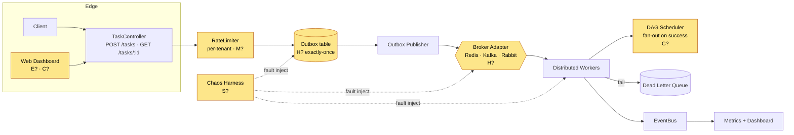
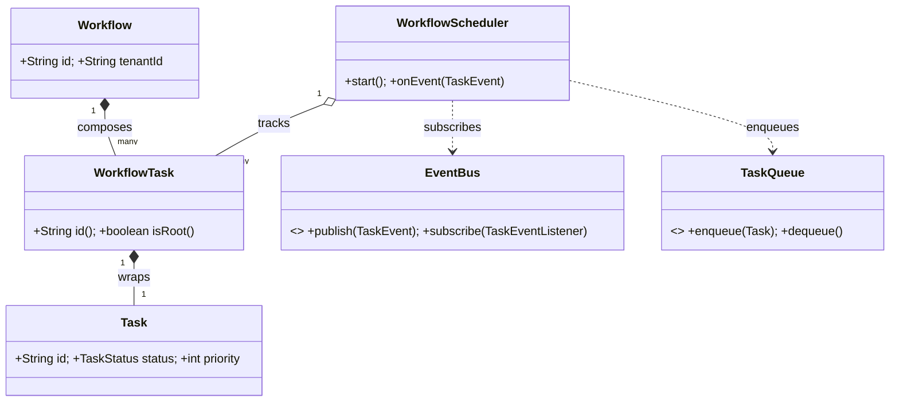
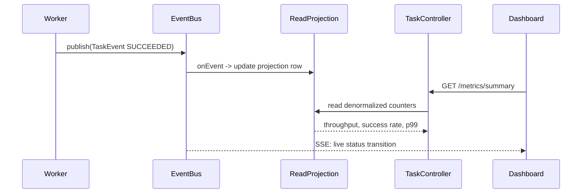

# Project: Extension Exercises

> Where this fits: this is the **capstone problem set** for the whole platform. The four phase files — [./phase-1.md](./phase-1.md), [./phase-2.md](./phase-2.md), [./phase-3.md](./phase-3.md), [./phase-4.md](./phase-4.md) — and the [./architecture.md](./architecture.md) overview built a working Distributed Task Queue. These exercises push it past the syllabus: **DAG workflows, priorities with aging, multi-tenancy, a web dashboard, chaos tests, a pluggable broker adapter, and exactly-once delivery via the transactional outbox.** Each problem extends the *real* system you already have. Solutions live in **[./solutions.md](./solutions.md)** — write your own first.

These are *cross-phase* challenges. They assume you can already stand up the Phase 1–4 stack and lean on the rest of the repo:

- Concurrency: [../06-concurrency/blocking-queue.md](../06-concurrency/blocking-queue.md), [../06-concurrency/executor-service.md](../06-concurrency/executor-service.md), [../06-concurrency/futures-and-completablefuture.md](../06-concurrency/futures-and-completablefuture.md), [../06-concurrency/atomics-and-thread-safety.md](../06-concurrency/atomics-and-thread-safety.md).
- Queues: [../07-queues-and-messaging/priority-queues.md](../07-queues-and-messaging/priority-queues.md), [../07-queues-and-messaging/delayed-queues.md](../07-queues-and-messaging/delayed-queues.md), [../07-queues-and-messaging/dead-letter-queues.md](../07-queues-and-messaging/dead-letter-queues.md), [../07-queues-and-messaging/broker-comparison.md](../07-queues-and-messaging/broker-comparison.md).
- Distributed systems: [../08-distributed-systems/idempotency.md](../08-distributed-systems/idempotency.md), [../08-distributed-systems/retries.md](../08-distributed-systems/retries.md), [../08-distributed-systems/rate-limiting.md](../08-distributed-systems/rate-limiting.md), [../08-distributed-systems/backpressure.md](../08-distributed-systems/backpressure.md), [../08-distributed-systems/message-ordering.md](../08-distributed-systems/message-ordering.md), [../08-distributed-systems/sharding.md](../08-distributed-systems/sharding.md).
- Design: [../04-oop-and-ood/hexagonal-architecture.md](../04-oop-and-ood/hexagonal-architecture.md), [../05-design-patterns/adapter.md](../05-design-patterns/adapter.md), [../05-design-patterns/strategy.md](../05-design-patterns/strategy.md), [../05-design-patterns/observer.md](../05-design-patterns/observer.md).
- System design: [../10-system-design/designing-a-task-queue.md](../10-system-design/designing-a-task-queue.md), [../10-system-design/scaling-the-platform.md](../10-system-design/scaling-the-platform.md), [../10-system-design/observability-and-ops.md](../10-system-design/observability-and-ops.md).

---

## How to use this file

- Exercises are numbered by **category prefix + sequence**: `K` = Knowledge-Check, `C` = Coding, `R` = Refactoring, `D` = Design, `I` = Interview, `S` = Stretch. The solutions file references these exact IDs (`K3`, `C5`, `D2`, …).
- Each is tagged **Easy / Medium / Hard**. The coding problems are *cumulative*: by the end you will have extended the platform with dependencies, multi-tenancy, a dashboard, and exactly-once delivery.
- **No solutions here.** They live in [./solutions.md](./solutions.md). Build first, peek later.
- Where a problem says "ship it," it means: write it, test it (JUnit 5 + AssertJ, Testcontainers where a DB or broker is involved), and produce a conventional-commit message.

### The shared model slice

The canonical domain model is shared across the whole repo. Several exercises *extend* it. Start from this slice and grow it only where an exercise tells you to:

```java
// The canonical slice these exercises build on.
enum TaskStatus { PENDING, SCHEDULED, RUNNING, SUCCEEDED, FAILED, RETRYING, DEAD }

record Task(String id, String type, String payload, TaskStatus status,
            int attempts, int maxAttempts,
            java.time.Instant createdAt, java.time.Instant scheduledAt, int priority) {

    Task withStatus(TaskStatus s)             { return new Task(id, type, payload, s, attempts, maxAttempts, createdAt, scheduledAt, priority); }
    Task withAttempts(int a)                  { return new Task(id, type, payload, status, a, maxAttempts, createdAt, scheduledAt, priority); }
    Task withScheduledAt(java.time.Instant t) { return new Task(id, type, payload, status, attempts, maxAttempts, createdAt, t, priority); }
    Task withPriority(int p)                  { return new Task(id, type, payload, status, attempts, maxAttempts, createdAt, scheduledAt, p); }
}

@FunctionalInterface
interface TaskHandler { TaskResult handle(Task task) throws Exception; }

record TaskResult(boolean success, String message, boolean retryable) {}

interface TaskQueue { void enqueue(Task t); Task dequeue() throws InterruptedException; int size(); }
interface TaskRepository {
    void save(Task t);
    java.util.Optional<Task> findById(String id);
    java.util.List<Task> pollDue(int n);
}
interface RetryPolicy   { java.util.Optional<java.time.Duration> nextDelay(int attempt); }
interface DeadLetterQueue { void send(Task t, String reason); }
interface RateLimiter   { boolean tryAcquire(); }
interface EventBus      { void publish(TaskEvent e); void subscribe(TaskEventListener l); }
```

### The target architecture for this set

These exercises extend the Phase 4 topology. The new pieces you will build are highlighted.



---

# Knowledge-Check Questions

> Short written answers. These confirm you understand *why* each extension is shaped the way it is before you write a line of code.

### K1 — Easy: DAG vs. flat queue
A flat task queue runs every task independently. A **DAG workflow** says "task B starts only after task A succeeds." In one paragraph, explain why you cannot model this purely by setting `scheduledAt` on B at submit time, and what state you must track instead.

### K2 — Easy: priority is not ordering
Our `Task` already has an `int priority`. Explain the difference between *priority* (which task runs next when several are ready) and *ordering* (the sequence two tasks of the same key must run in). Which one does `PriorityBlockingQueue` give you, and which does it explicitly **not**?

### K3 — Easy: what "exactly-once" really means
A teammate says "Kafka gives us exactly-once, so we don't need the outbox." State precisely what *delivery* guarantee a broker can give versus what *processing* (effect) guarantee the application needs, and why the outbox + idempotent consumer pattern is about the latter. Cross-reference [../08-distributed-systems/idempotency.md](../08-distributed-systems/idempotency.md).

### K4 — Medium: tenant isolation dimensions
List the **four** isolation dimensions multi-tenancy must address in a task queue (data, throughput/quota, failure blast-radius, and noisy-neighbor/scheduling fairness). For each, name the concrete mechanism in our stack that enforces it.

### K5 — Medium: the dual-write problem
Draw (in words or a small Mermaid sequence) the failure where the API writes the `Task` row to PostgreSQL **and** publishes to the broker as two separate operations, and a crash lands between them. Give both failure orderings and the bad outcome each produces. Explain how the outbox collapses this into a single transaction.

### K6 — Medium: starvation under priority
With strict priority dequeue, a steady stream of high-priority tasks can starve low-priority ones forever. Explain **priority aging** and write the formula for an effective priority that rises with wait time. How does this interact with the `createdAt` field we already store?

### K7 — Hard: ordering vs. parallelism tradeoff
Per-tenant ordering ("tenant T's tasks of type `email` run in submission order") fundamentally limits parallelism for that tenant. Explain the **partition-key** technique that recovers parallelism *across* keys while preserving order *within* a key, and what it costs you in worker assignment. Tie this to [../08-distributed-systems/message-ordering.md](../08-distributed-systems/message-ordering.md) and [../08-distributed-systems/sharding.md](../08-distributed-systems/sharding.md).

---

# Coding Exercises

> These build the real extensions. Each ships with tests. Keep the canonical signatures intact; only add what the exercise asks for. The coding problems are cumulative — `C1` and `C2` feed `C3`'s DAG scheduler.

### C1 — Easy: extend the model for dependencies and tenancy
Grow `Task` (or wrap it) so a task can declare prerequisites and belong to a tenant — *without breaking any existing call site*. Add a `dependsOn` set of task ids and a `tenantId`. Prefer a new record over mutating the canonical one if it keeps callers compiling.

```java
// Goal: a backward-compatible extension. Existing code that builds Task keeps working.
public record TaskGraphMeta(String tenantId, java.util.Set<String> dependsOn) {
    public static final TaskGraphMeta NONE = new TaskGraphMeta("default", java.util.Set.of());
}

public record WorkflowTask(Task task, TaskGraphMeta meta) {
    public String id()       { return task.id(); }
    public boolean isRoot()  { return meta.dependsOn().isEmpty(); }
}
```

**Do this:**
1. Write a `WorkflowTaskBuilder` fluent builder that produces a `WorkflowTask` with a generated UUID, `status = PENDING`, `attempts = 0`, sensible defaults, and a `dependsOn(String...)` method.
2. Add a validation method `assertAcyclic(Collection<WorkflowTask>)` that throws `IllegalArgumentException` on a cycle. (Hint: Kahn's algorithm or DFS with a recursion stack — you've solved this 1000 times in DSA.)
3. Test: a valid diamond `A -> {B, C} -> D` passes; a cycle `A -> B -> A` is rejected with a message naming the cycle.

### C2 — Easy: a dependency-aware status gate
Add `TaskStatus.BLOCKED` semantics *without* changing the enum (use an in-memory readiness check, since the enum is canonical and shared). Write a pure function:

```java
public final class ReadinessGate {
    /** A task is runnable iff every dependency id maps to a SUCCEEDED task. */
    public static boolean isReady(WorkflowTask t,
                                  java.util.function.Function<String, java.util.Optional<TaskStatus>> statusOf) {
        for (String dep : t.meta().dependsOn()) {
            if (statusOf.apply(dep).orElse(TaskStatus.PENDING) != TaskStatus.SUCCEEDED) return false;
        }
        return true;
    }
}
```

**Do this:** write the table-driven JUnit 5 + AssertJ test covering: no deps (ready), one unmet dep (not ready), all met (ready), a dep that `FAILED` (not ready, stays blocked), and an unknown dep id (not ready). Assert with `assertThat(...).isTrue()/.isFalse()`.

### C3 — Medium: the DAG scheduler (fan-out on success)
Now wire it together. Build a `WorkflowScheduler` that owns a workflow (a set of `WorkflowTask`), enqueues all root tasks immediately, and — on each `TaskEvent` of type `SUCCEEDED` — enqueues any dependents whose dependencies are now all satisfied.

```java
public final class WorkflowScheduler implements TaskEventListener {
    private final TaskQueue queue;
    private final java.util.Map<String, WorkflowTask> byId;
    private final java.util.Map<String, java.util.Set<String>> dependents; // dep id -> tasks waiting on it
    private final java.util.concurrent.ConcurrentMap<String, TaskStatus> statuses = new java.util.concurrent.ConcurrentHashMap<>();

    public WorkflowScheduler(TaskQueue queue, java.util.Collection<WorkflowTask> dag) {
        this.queue = queue;
        this.byId = /* index by id */ null;          // implement
        this.dependents = /* reverse edges */ null;   // implement
    }

    public void start() {
        // enqueue every root; mark non-roots BLOCKED in `statuses`
    }

    @Override public void onEvent(TaskEvent e) {
        // on SUCCEEDED: record status, then for each dependent re-check ReadinessGate.isReady and enqueue if ready
        // on FAILED/DEAD: optionally cancel the subtree (cancellation propagation)
    }
}
```

**Requirements:**
- Thread-safe under concurrent worker callbacks (multiple `SUCCEEDED` events may arrive at once). Use `ConcurrentHashMap` / atomic compute, no coarse `synchronized` blocks around `enqueue`.
- A task is enqueued **exactly once** even if two of its dependencies finish nearly simultaneously (race!). Prove it in a test that fans 50 dependencies into one node and finishes them from a thread pool.
- On a `FAILED`/`DEAD` task, mark the entire downstream subtree `DEAD` and never enqueue it (cancellation propagation).
- Test the diamond `A -> {B, C} -> D`: assert `D` is enqueued exactly once, and only after both `B` and `C` succeed.

### C4 — Medium: priority dequeue with aging
Replace the FIFO `InMemoryTaskQueue` with a `PriorityAgingTaskQueue` that dequeues by **effective priority**, where effective priority rises with wait time so nothing starves.

```java
public final class PriorityAgingTaskQueue implements TaskQueue {
    private final java.time.Clock clock;
    private final double agePerSecond; // priority points gained per second waiting
    // backing structure: a PriorityBlockingQueue<Task> with a comparator over effective priority
    public PriorityAgingTaskQueue(java.time.Clock clock, double agePerSecond) { /* ... */ this.clock = clock; this.agePerSecond = agePerSecond; }

    private double effective(Task t) {
        long waitedSec = java.time.Duration.between(t.createdAt(), clock.instant()).toSeconds();
        return t.priority() + agePerSecond * waitedSec;
    }
    // enqueue / dequeue / size ...
}
```

**Requirements:**
- `dequeue()` blocks when empty (preserve the `TaskQueue` contract) and returns the highest **effective** priority task.
- Use an injected `java.time.Clock` so tests are deterministic — never call `Instant.now()` directly inside the queue.
- Test starvation prevention: enqueue one `priority=0` task, then 1000 `priority=10` tasks; advance the clock; assert the old low-priority task eventually wins. Cross-reference [../07-queues-and-messaging/priority-queues.md](../07-queues-and-messaging/priority-queues.md).
- Note the catch: `PriorityBlockingQueue` does not re-sort when `effective()` changes over time. Decide and document whether you (a) re-evaluate on dequeue only, or (b) periodically rebuild the heap. Implement one and justify it in a comment.

### C5 — Medium: the transactional outbox table and publisher
Implement exactly-once *effect* across the DB→broker boundary. Add an `outbox` table written in the **same transaction** as the `tasks` insert, and a separate publisher that drains it.

```sql
-- Flyway migration: V7__outbox.sql
CREATE TABLE outbox (
    id            UUID PRIMARY KEY,
    aggregate_id  TEXT        NOT NULL,        -- the task id
    event_type    TEXT        NOT NULL,        -- e.g. 'TASK_ENQUEUED'
    payload       JSONB       NOT NULL,
    created_at    TIMESTAMPTZ NOT NULL DEFAULT now(),
    published_at  TIMESTAMPTZ,                 -- NULL until the publisher confirms broker ack
    attempts      INT         NOT NULL DEFAULT 0
);
CREATE INDEX outbox_unpublished_idx ON outbox (created_at) WHERE published_at IS NULL;
```

```java
@org.springframework.transaction.annotation.Transactional
public void submit(Task task) {
    taskRepository.save(task);                                   // INSERT into tasks
    outboxRepository.append(new OutboxRecord(                    // INSERT into outbox — SAME tx
        java.util.UUID.randomUUID().toString(), task.id(), "TASK_ENQUEUED", toJson(task)));
}
```

**Requirements:**
- The `OutboxPublisher` is a scheduled job: `SELECT ... WHERE published_at IS NULL ORDER BY created_at LIMIT n FOR UPDATE SKIP LOCKED`, publish each to the broker, then stamp `published_at`. The `SKIP LOCKED` lets multiple publisher instances run safely — explain why in a comment.
- Publishing is **at-least-once** by design (you may publish then crash before stamping). The consumer must therefore be idempotent (`C6`).
- Test with Testcontainers PostgreSQL: insert a task, assert exactly one outbox row, run the publisher, assert `published_at` is set and the broker received the message. Cross-reference [../08-distributed-systems/idempotency.md](../08-distributed-systems/idempotency.md).

### C6 — Hard: idempotent consumer (the other half of exactly-once)
The outbox guarantees the message is *published at least once*. Now make *processing* effectively-once with a dedup store.

```java
public final class IdempotentWorker implements Runnable {
    private final TaskQueue queue;
    private final java.util.function.Function<String, TaskHandler> handlers;
    private final ProcessedStore processed;   // dedup: has this (taskId, attempt) effect already landed?

    @Override public void run() {
        try {
            Task t = queue.dequeue();
            String key = t.id() + ":" + t.attempts();      // the idempotency key
            if (processed.seen(key)) return;                // skip duplicate delivery
            TaskResult r = handlers.apply(t.type()).handle(t);
            // record the effect and the dedup key in ONE transaction with the business write
            processed.record(key, r);
        } catch (InterruptedException ie) { Thread.currentThread().interrupt(); }
        catch (Exception e) { /* route to retry/DLQ per policy */ }
    }
}
```

**Requirements:**
- Choose the idempotency key deliberately. Discuss in comments why `taskId` alone is wrong when retries re-deliver, and why `taskId + attempt` (or a producer-supplied dedup id) is right. Cross-reference [../08-distributed-systems/retries.md](../08-distributed-systems/retries.md).
- The dedup `record` and the business effect must be **atomic** — a `seen` check followed by a separate `record` has a TOCTOU race under concurrency. Implement it as a single `INSERT ... ON CONFLICT DO NOTHING` and treat "0 rows inserted" as "already processed."
- Test: deliver the same message 100 times from a thread pool; assert the handler's observable effect happened **exactly once** (use an `AtomicInteger` side-effect counter and `assertThat(counter.get()).isEqualTo(1)`).

### C7 — Hard: a pluggable broker adapter (Adapter + Strategy)
Make the broker swappable behind the `TaskQueue` port so the rest of the system never knows whether it's talking to in-memory, Redis, or Kafka. This is the Adapter pattern over the hexagonal port — see [../05-design-patterns/adapter.md](../05-design-patterns/adapter.md) and [../04-oop-and-ood/hexagonal-architecture.md](../04-oop-and-ood/hexagonal-architecture.md).

```java
// One port. Three adapters. Selected by config, not by code.
public interface TaskQueue { void enqueue(Task t); Task dequeue() throws InterruptedException; int size(); }

public final class RedisTaskQueue   implements TaskQueue { /* Lists + BLPOP, JSON codec */ }
public final class KafkaTaskQueue    implements TaskQueue { /* producer + consumer, partition by tenantId */ }
public final class InMemoryTaskQueue implements TaskQueue { /* BlockingQueue — the Phase 1 default */ }

@org.springframework.context.annotation.Configuration
class QueueConfig {
    @org.springframework.context.annotation.Bean
    TaskQueue taskQueue(@org.springframework.beans.factory.annotation.Value("${queue.broker:inmemory}") String broker) {
        return switch (broker) {
            case "redis" -> new RedisTaskQueue(/* ... */);
            case "kafka" -> new KafkaTaskQueue(/* ... */);
            default      -> new InMemoryTaskQueue();
        };
    }
}
```

**Requirements:**
- Write a single `TaskQueueContractTest` (JUnit 5) that any adapter must pass: enqueue→dequeue round-trips the task; `dequeue()` blocks until something arrives; FIFO is preserved within a partition. Run it against `InMemoryTaskQueue` and one real broker via Testcontainers.
- The Kafka adapter must partition by `tenantId` so per-tenant ordering survives (ties into `D2`). Document the serialization/codec choice (JSON now; note Avro/Protobuf as the production upgrade).
- Crucially: no class outside the adapter package may import a Redis or Kafka type. Add an ArchUnit test (or a simple grep-based test) asserting this. Cross-reference [../07-queues-and-messaging/broker-comparison.md](../07-queues-and-messaging/broker-comparison.md).

---

# Refactoring Exercises

> Start from working-but-wrong code lifted from earlier phases. Improve the design, then make it production-grade. Show *bad → improved → final* in your solution.

### R1 — Easy: the dual-write smell
This Phase 2 `submit` "works" in tests and corrupts state in production. Identify the dual-write hazard and refactor it onto the outbox from `C5`.

```java
// BEFORE — two independent writes, no shared transaction.
public void submit(Task task) {
    taskRepository.save(task);   // committed to Postgres
    broker.publish(task);        // if THIS throws, the task is persisted but never runs (or vice versa)
}
```

Refactor to a single transactional boundary (outbox append + task insert), with the publisher decoupled. Explain in your write-up what each crash position now produces.

### R2 — Medium: priority hard-coded into the worker
A junior engineer "added priorities" by sorting inside the worker loop. It's O(n log n) per poll, not thread-safe, and ignores aging. Refactor priority *out* of the worker and *into* the queue (use `C4`).

```java
// BEFORE — priority logic leaking into the worker; mutable shared list; race-prone.
public final class Worker implements Runnable {
    private final java.util.List<Task> shared;             // unsynchronized!
    @Override public void run() {
        while (true) {
            shared.sort(java.util.Comparator.comparingInt(Task::priority).reversed()); // every iteration
            Task t = shared.isEmpty() ? null : shared.remove(0);
            // ...
        }
    }
}
```

The worker should depend only on the `TaskQueue` port and call `dequeue()`. Priority and aging belong behind the port. State the single-responsibility violation you removed (cross-ref [../04-oop-and-ood/cohesion.md](../04-oop-and-ood/cohesion.md)).

### R3 — Medium: tenancy bolted on as a string everywhere
The codebase grew `if (tenantId.equals("acme"))` checks scattered across the controller, the rate limiter, and the metrics. Refactor to a single `TenantContext` carried explicitly (not a `ThreadLocal` you forget to clear), so tenant-aware behavior is composed, not branched.

```java
// BEFORE — tenant logic smeared across layers.
double limit = tenantId.equals("enterprise") ? 1000 : tenantId.equals("free") ? 10 : 100;
meterRegistry.counter("tasks", "tenant", tenantId).increment();
if (tenantId.equals("free") && queue.size() > 50) throw new RejectedException();
```

Introduce a `TenantPlan` record (rate limit, max queue depth, max attempts) loaded from config, and pass a `TenantContext` to the components that need it. Show how the rate limiter becomes per-tenant via a `Map<String, TokenBucketRateLimiter>` (ties into `M2`).

### R4 — Hard: the chaos-fragile retry loop
This retry loop passes unit tests and melts under partial failures: it retries non-retryable errors, has no backoff, no jitter, no cap, and swallows interrupts. Refactor it to use the canonical `RetryPolicy` and route exhausted tasks to the `DeadLetterQueue`.

```java
// BEFORE — a retry loop that causes retry storms and hides bugs.
while (true) {
    try { handler.handle(task); break; }
    catch (Exception e) { /* swallow, loop again immediately, forever */ }
}
```

Refactor so it: honors `TaskResult.retryable`, uses `ExponentialBackoffRetryPolicy` with jitter, caps at `maxAttempts`, transitions through `RETRYING` → `DEAD`, sends to the DLQ with a reason on exhaustion, and propagates `InterruptedException` correctly. Cross-reference [../08-distributed-systems/retries.md](../08-distributed-systems/retries.md) and [../07-queues-and-messaging/dead-letter-queues.md](../07-queues-and-messaging/dead-letter-queues.md).

---

# Design Exercises

> Write-ups, not just code. Produce a short design doc (problem, options, decision, tradeoffs) and at least one diagram. These mirror the design-review bar at a real company.

### D1 — Easy: model task dependencies and workflows (UML)
Design the object model for DAG workflows. Deliver a Mermaid `classDiagram` showing `Workflow`, `WorkflowTask`, `Task`, `WorkflowScheduler`, and `EventBus`, with correct relationship types (a `Workflow` *composes* its `WorkflowTask`s; a `WorkflowScheduler` *uses* an `EventBus` and a `TaskQueue`). Justify composition vs. aggregation for each edge (cross-ref [../02-core-oop/chapter-16-composition.md](../02-core-oop/chapter-16-composition.md) and [../02-core-oop/chapter-15-aggregation.md](../02-core-oop/chapter-15-aggregation.md)).



Extend the diagram yourself to show **cancellation propagation** and the `dependents` reverse-edge index. Explain why the scheduler holds an *aggregation* of `WorkflowTask` (it tracks them) but the `Workflow` holds a *composition* (it owns their lifecycle).

### D2 — Medium: multi-tenancy strategy
Design tenancy end to end. Compare the three classic data-isolation models — **shared schema with `tenant_id` column**, **schema-per-tenant**, **database-per-tenant** — for *this* workload (millions of small tasks, thousands of tenants, strict noisy-neighbor protection). Pick one and defend it. Then design:
1. Per-tenant rate limiting and queue-depth quotas (the fairness dimension).
2. Per-tenant ordering using a partition key (tie to [../08-distributed-systems/message-ordering.md](../08-distributed-systems/message-ordering.md)).
3. Blast-radius isolation: how a poison task from tenant A must not stall tenant B (weighted fair queueing or per-tenant worker shards — see [../08-distributed-systems/sharding.md](../08-distributed-systems/sharding.md)).

Deliverable: a one-page decision doc with a tradeoff table (isolation strength vs. operational cost vs. per-tenant onboarding cost).

### D3 — Medium: the web dashboard
Design the observability dashboard that sits in front of the platform. Specify:
- The read API the `TaskController` must expose: `GET /tasks?status=&tenant=&page=`, `GET /tasks/{id}` with full attempt history, `GET /metrics/summary` (throughput, success rate, DLQ depth, p50/p95/p99 latency from Micrometer timers).
- A WebSocket or SSE stream for live status transitions, fed by an `EventBus` subscriber. Diagram the data flow.
- The read-model question: do you query the `tasks` table directly, or maintain a denormalized read projection updated from `TaskEvent`s (CQRS-lite)? Decide based on read volume and staleness tolerance. Cross-reference [../10-system-design/observability-and-ops.md](../10-system-design/observability-and-ops.md).



### D4 — Hard: exactly-once across the whole pipeline
Design end-to-end effectively-once delivery for: client → API → outbox → broker → worker → side effect (e.g., "charge a card"). Cover every dedup boundary:
1. **Client → API**: client-supplied idempotency key on `POST /tasks` (return the existing task on a key collision).
2. **API → broker**: transactional outbox (`C5`).
3. **Broker → worker**: idempotent consumer with a dedup store (`C6`).
4. **Worker → external side effect**: idempotency token forwarded to the downstream API.

Produce a sequence diagram and explicitly mark, at each hop, whether the guarantee is at-most-once, at-least-once, or effectively-once, and how the *next* hop's dedup compensates. State plainly why true exactly-once *delivery* is impossible and effectively-once *processing* is what you actually ship. Cross-reference [../08-distributed-systems/idempotency.md](../08-distributed-systems/idempotency.md) and [../08-distributed-systems/consistency-and-availability.md](../08-distributed-systems/consistency-and-availability.md).

---

# Interview Exercises

> Timed, spoken-aloud style. Aim for a crisp 5–10 minute answer each, the way you would in a real loop.

### I1 — Easy: "How would you add task priorities to a queue that doesn't have them?"
Walk from `PriorityBlockingQueue` to the starvation problem to aging. Name the data-structure complexity (`O(log n)` insert/poll) and the one production gotcha (heap doesn't re-sort on time-based key changes). 5 minutes.

### I2 — Medium: "Design exactly-once task processing."
The classic. Drive it: define delivery vs. effect, draw the dual-write failure, introduce the outbox, then the idempotent consumer, then choose the idempotency key. Interviewer will push on "what if the outbox publisher publishes twice?" — your answer is the consumer's `ON CONFLICT DO NOTHING`. 10 minutes.

### I3 — Medium: "A single tenant is hammering the system and slowing everyone down. Fix it."
Diagnose (noisy neighbor), then propose per-tenant token buckets, per-tenant queue-depth caps with backpressure, and weighted fair scheduling so one tenant can't monopolize the worker pool. Reference [../08-distributed-systems/backpressure.md](../08-distributed-systems/backpressure.md) and [../08-distributed-systems/rate-limiting.md](../08-distributed-systems/rate-limiting.md). 8 minutes.

### I4 — Hard: "Walk me through making your queue broker-agnostic, then justify Kafka vs. Redis vs. RabbitMQ for this workload."
Lead with the `TaskQueue` port and the Adapter pattern, then do the broker tradeoff: Redis Streams (low latency, simple, weaker durability), RabbitMQ (mature routing, per-message ack, moderate throughput), Kafka (ordered partitions, replay, highest throughput, heavier ops). Pick one per phase and explain the migration path that the port makes cheap. Reference [../07-queues-and-messaging/broker-comparison.md](../07-queues-and-messaging/broker-comparison.md). 10 minutes.

### I5 — Hard: "Your DAG scheduler enqueues a node twice under load. Debug it."
This is the `C3` race. Talk through: two dependencies finishing concurrently both pass `isReady`, both call `enqueue`. The fix is an atomic compare-and-set on a per-task "scheduled" flag (`ConcurrentHashMap.putIfAbsent` / `compute`), making enqueue idempotent. Tie it back to the broader lesson: check-then-act under concurrency is always a bug. Reference [../06-concurrency/atomics-and-thread-safety.md](../06-concurrency/atomics-and-thread-safety.md). 8 minutes.

---

# Stretch Challenges

> Open-ended, multi-day. Each is a portfolio-grade artifact. No hand-holding — these are where you prove staff-level judgment.

### S1 — Hard: a chaos-testing harness
Build a `ChaosTaskQueue` and `ChaosBroker` decorator (Decorator pattern — [../05-design-patterns/decorator.md](../05-design-patterns/decorator.md)) that wraps any `TaskQueue`/broker and injects faults under a configurable policy:

```java
public final class ChaosTaskQueue implements TaskQueue {
    private final TaskQueue delegate;
    private final ChaosPolicy policy;   // p(drop), p(duplicate), latencyDistribution, p(reorder)
    @Override public void enqueue(Task t) {
        policy.maybeLatency();
        if (policy.shouldDrop())      return;                 // silently lose it
        delegate.enqueue(t);
        if (policy.shouldDuplicate()) delegate.enqueue(t);    // deliver twice
    }
    // dequeue / size ...
}
```

**Deliverables:**
- Fault knobs: message loss, duplication, reordering, injected latency, and a "broker partition" mode that blocks for N seconds.
- A `@ChaosTest` JUnit 5 extension that runs your *existing* test suite under chaos and asserts **invariants still hold**: no task is processed twice (idempotency from `C6`), no task is lost (outbox from `C5`), every task ends in a terminal state (`SUCCEEDED`/`DEAD`).
- A report: which invariants survive which faults, and which combination of faults breaks your system. This is how you find the bug *before* production does. Cross-reference [../08-distributed-systems/retries.md](../08-distributed-systems/retries.md) and [../10-system-design/observability-and-ops.md](../10-system-design/observability-and-ops.md).

### S2 — Hard: full DAG workflow engine with cancellation and timeouts
Extend `C3` into a real engine: persistent workflow state (a `workflows` + `workflow_edges` schema with Flyway), per-task timeouts that mark a stuck task `FAILED`, cancellation propagation that marks the whole downstream subtree `DEAD`, and a `GET /workflows/{id}` endpoint returning the live DAG with per-node status. Add a Mermaid `stateDiagram-v2` to your docs for a single node's lifecycle including the BLOCKED→READY transition. Use virtual threads (Project Loom) for per-task supervision so you can supervise thousands of in-flight nodes cheaply.

### S3 — Hard: production-grade multi-tenant dashboard
Build the real dashboard from `D3`: a Spring Boot read API plus a small SPA (or server-rendered) front end showing per-tenant throughput, success/failure/DLQ rates, p50/p95/p99 latency (from Micrometer → Prometheus), live task transitions over SSE, and a DLQ redrive button (`POST /dlq/{id}/redrive`). Wire Prometheus + Grafana via docker-compose. Enforce tenant scoping on every read (a tenant can never see another's tasks). Ship it with an end-to-end Testcontainers test that submits tasks for two tenants and asserts isolation.

### S4 — Stretch: exactly-once with a real broker end-to-end
Combine `C5`, `C6`, and `C7`: run the outbox publisher into Kafka (Testcontainers), consume with the idempotent worker, and prove effectively-once under the `S1` chaos harness with duplication and reordering turned on. Measure: how many duplicate deliveries the consumer absorbed, and the dedup-store hit rate. Write up where the latency went and what you'd shard first to scale to 100k tasks/sec — connect it to [../10-system-design/scaling-the-platform.md](../10-system-design/scaling-the-platform.md) and [../10-system-design/capacity-estimation.md](../10-system-design/capacity-estimation.md).

---

## Tradeoffs to keep in mind across all problems

| Extension | What you gain | What it costs | When NOT to do it |
|---|---|---|---|
| DAG workflows | Express real pipelines, fan-out/fan-in | Scheduler complexity, cancellation edge cases, persistent graph state | When tasks are truly independent — keep the flat queue |
| Priority + aging | SLA control, no starvation | Heap doesn't re-sort on time; rebuild cost; harder reasoning | When all work is equal priority |
| Multi-tenancy | One platform serves many customers | Isolation on 4 axes; quota math; per-tenant ops | Single internal tenant — defer it |
| Web dashboard | Operability, on-call sanity | A read model to maintain; another service to run | Tiny system — logs + Grafana may suffice |
| Chaos tests | Find failure modes before prod | Test infra, flaky-test risk if invariants are sloppy | Before you have invariants worth testing |
| Pluggable broker | Swap infra without rewrites | An extra abstraction layer; contract tests | If you'll only ever run one broker |
| Outbox exactly-once | No lost/duplicated effects | Extra table, a publisher, dedup store, more latency | At-most-once is genuinely fine (e.g., metrics samples) |

---

## Common mistakes and pitfalls

- **Treating exactly-once as a broker feature.** Brokers give *delivery* semantics; your application gives *effect* semantics via outbox + idempotent consumer. Conflating them (`K3`, `I2`) is the most common interview miss.
- **Check-then-act races in the DAG scheduler.** Two dependencies finishing at once both pass `isReady` and double-enqueue (`C3`, `I5`). Make enqueue idempotent with an atomic flag.
- **Calling `Instant.now()` inside the queue.** Makes aging untestable. Inject a `Clock` (`C4`).
- **Tenancy as scattered `if`s.** Smearing `tenantId.equals(...)` across layers (`R3`) instead of a `TenantPlan`/`TenantContext` makes every new tenant a code change.
- **Forgetting the dedup write must be atomic with the business effect.** A `seen()` then `record()` has a TOCTOU window (`C6`). Use `INSERT ... ON CONFLICT DO NOTHING`.
- **Leaking broker types out of the adapter package** (`C7`). The whole point of the port is that the core never imports Kafka — assert it with an architecture test.
- **Chaos tests with no invariants.** Injecting faults without asserting "no task lost, no double effect, all terminal" (`S1`) just produces flaky tests, not confidence.

---

## What We Can Improve In Our Project Using This Concept

These exercises are *the* improvement backlog for the project. Concretely, completing them upgrades the platform from "runs tasks" to "runs **dependent, prioritized, multi-tenant** tasks with **operator visibility**, **fault tolerance you've actually tested**, **broker portability**, and **effectively-once guarantees**." Prioritize by leverage: outbox + idempotent consumer (`C5`/`C6`) first — correctness beats features — then priority aging (`C4`), then the broker adapter (`C7`), then multi-tenancy (`R3`/`D2`), then the dashboard (`D3`/`S3`), with DAG workflows (`C3`/`S2`) as the headline capability and chaos testing (`S1`) as the safety net that validates all of it.

## Project Refactoring Task

Pick the three highest-leverage exercises for your current state and land them as a sequence of focused PRs:
1. **`R1` → `C5` → `C6`**: kill the dual-write, add the outbox and the idempotent consumer. This is the correctness foundation everything else relies on.
2. **`R2` → `C4`**: move priority behind the `TaskQueue` port and add aging so SLAs are real and nothing starves.
3. **`R3` → `D2`** (partial): introduce `TenantPlan`/`TenantContext` and per-tenant rate limiting, even if full data isolation comes later.

Each PR must ship with tests (Testcontainers where a DB/broker is involved) and leave the build green. Resist combining them — small, reviewable PRs are part of the skill.

## Git Commit For This Chapter

```text
docs(09-project): add cross-phase extension exercises (DAG, priority, tenancy, outbox, chaos)

Add the capstone problem set for the project module: graded Easy/Medium/Hard
exercises spanning DAG workflows, priority+aging, multi-tenancy, a web dashboard,
chaos testing, a pluggable broker adapter, and exactly-once via the transactional
outbox. Numbered K/C/R/D/I/S for solutions.md cross-reference.

Files touched:
  backend-engineering-roadmap/09-project/exercises.md  (new)
```

## Architecture Impact

Completing this set reshapes the topology shown in the diagram at the top: a **DAG scheduler** subscribes to the `EventBus` and drives fan-out; an **outbox table** sits between the API transaction and the broker, making the DB→broker hop crash-safe; the broker becomes a **swappable adapter** behind the `TaskQueue` port; **per-tenant rate limiters and quotas** guard the front door; a **read projection** feeds the dashboard; and a **chaos harness** can fault-inject anywhere to validate invariants. The core domain (`Task`, `TaskQueue`, `Worker`, `RetryPolicy`, `DeadLetterQueue`) stays untouched — every extension hangs off a port or an event, which is exactly why the hexagonal design from [../04-oop-and-ood/hexagonal-architecture.md](../04-oop-and-ood/hexagonal-architecture.md) was worth the upfront cost.

## Interview Takeaways

- **Exactly-once = at-least-once delivery + idempotent processing.** Outbox solves the dual-write; the consumer's dedup store (atomic `ON CONFLICT`) solves duplicate delivery. Never claim a broker gives exactly-once effects.
- **Priority without aging starves.** Always pair strict priority with an aging term over `createdAt`, and know that a binary heap won't re-sort on time-based keys.
- **Multi-tenancy isolates four things:** data, throughput/quota, failure blast-radius, and scheduling fairness — name a concrete mechanism for each.
- **Ports + adapters make brokers cheap to swap.** A single contract test that every adapter passes is the artifact that proves it.
- **Check-then-act is a bug under concurrency.** The DAG double-enqueue and the dedup TOCTOU are the same lesson: make the action atomic.
- **You don't trust a system you haven't faulted.** Chaos tests that assert invariants (no loss, no double-effect, all-terminal) are how you earn confidence before production does it for you.
