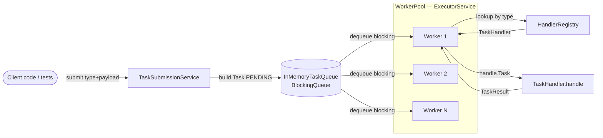
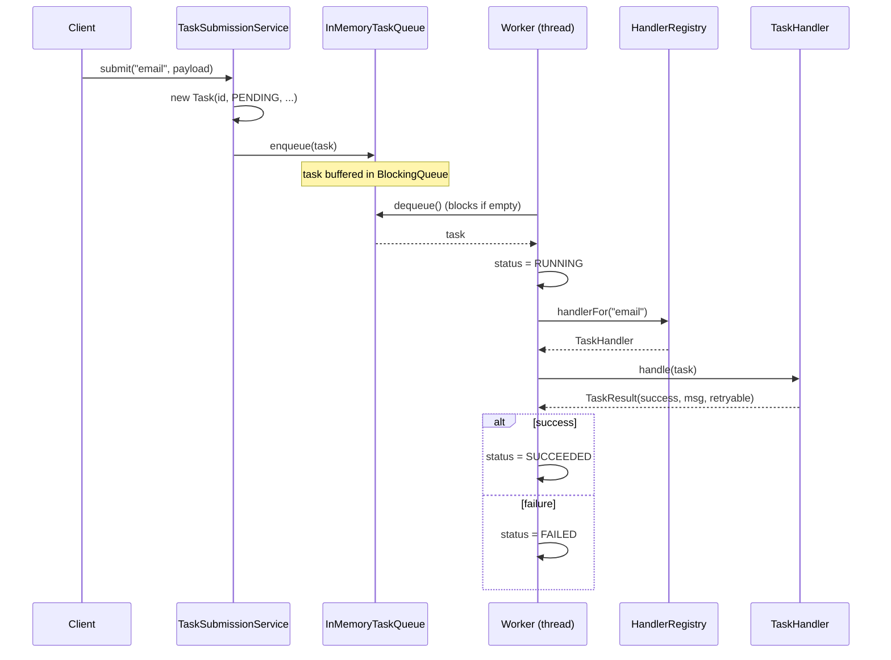
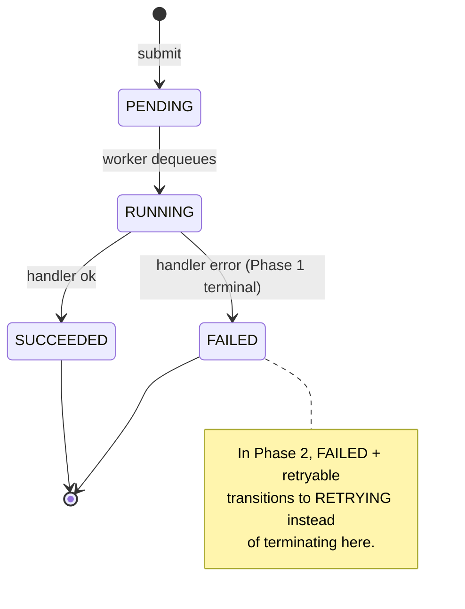
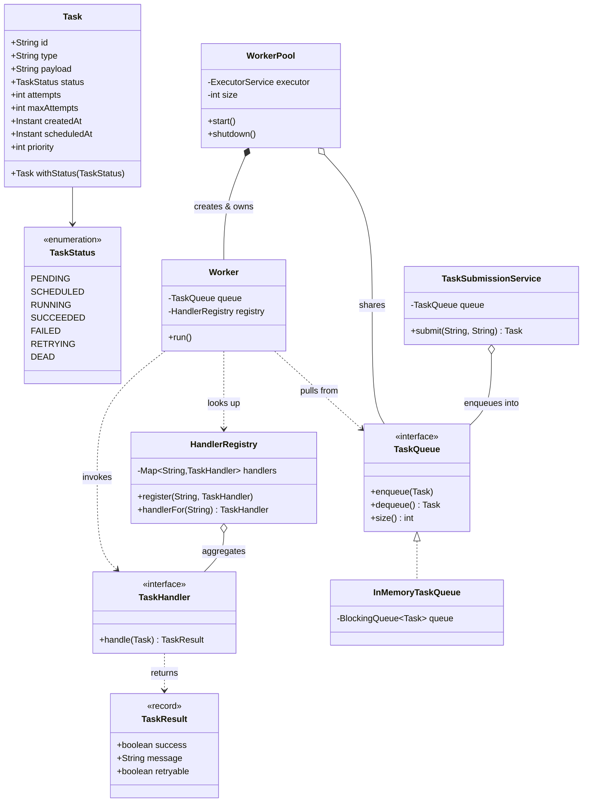
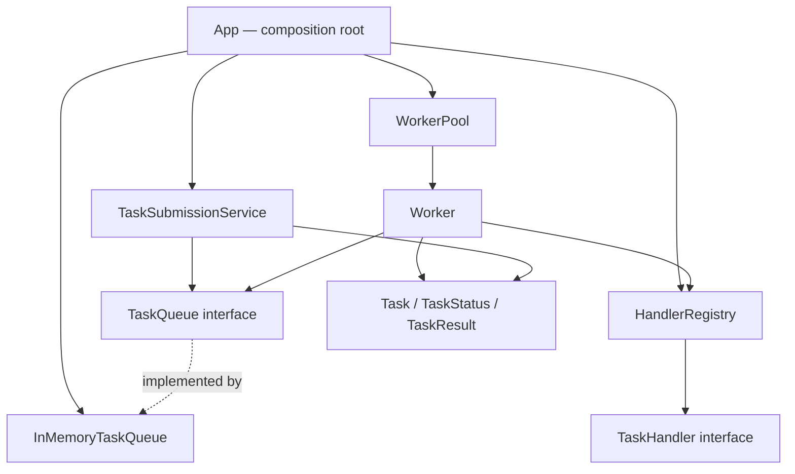

# Phase 1: In-Memory Task Queue with a Worker Pool

> **Where this fits in the project:** This is the foundational milestone of the **Distributed Task Queue and Event Processing Platform**. By the end of Phase 1 you will have a runnable Java 21 application that accepts tasks through a tiny submission API, buffers them in an in-memory `BlockingQueue`, and processes them concurrently with a pool of worker threads driven by an `ExecutorService`. Everything else in this curriculum — persistence, retries, dead-letter queues, rate limiting, distributed workers — is a refactoring of the skeleton you build here.

```text
Phase 1 target:  Client → Task Submission API → InMemoryTaskQueue → WorkerPool → TaskHandler execution
```

---

## 1. Goals and Scope

Phase 1 is deliberately small but **complete**: a real, compilable, tested system you can run from `main`. We are not building a web server yet (that arrives in [Phase 2](./phase-2.md)). The "API" here is a plain Java facade — a `TaskSubmissionService` — because the first thing to get right is the **object model** and the **concurrency model**, not HTTP plumbing.

**What we will build:**

- A canonical domain model: `Task`, `TaskStatus`, `TaskResult`, `TaskHandler`.
- An in-process queue abstraction `TaskQueue` with an `InMemoryTaskQueue` implementation backed by a `BlockingQueue`.
- A handler registry that maps a task `type` to a `TaskHandler` (Strategy pattern).
- A `Worker` (a `Runnable` Command-style executor) and a `WorkerPool` that owns an `ExecutorService`.
- A `TaskSubmissionService` — our stand-in "Task Submission API".
- A full Maven project, JUnit 5 + AssertJ tests, and run instructions.

**What we explicitly do NOT build yet (and why that matters):**

| Deferred capability | Why it is out of scope in Phase 1 | Where it lands |
| --- | --- | --- |
| Persistence (DB) | The queue lives in heap; a crash loses everything. Acceptable to learn the model first. | [Phase 2](./phase-2.md) |
| Retries / backoff | A failed task is simply marked `FAILED`. | [Phase 2](./phase-2.md) |
| Dead-letter queue | Nowhere to send poison tasks yet. | [Phase 3](./phase-3.md) |
| Rate limiting / backpressure tuning | Bounded queue gives us *some* backpressure; real limiter comes later. | [Phase 3](./phase-3.md) |
| Distributed workers / broker | Single JVM only. | [Phase 4](./phase-4.md) |
| Scheduling (delayed tasks) | `scheduledAt` exists on the model but is unused. | [Phase 2](./phase-2.md) / [Phase 4](./phase-4.md) |

> **Engineering principle (YAGNI):** We model the *fields* for future phases (`attempts`, `maxAttempts`, `scheduledAt`, `priority`) so the data shape is stable, but we do not *implement* behavior we cannot yet test. See [dry-kiss-yagni.md](../04-oop-and-ood/dry-kiss-yagni.md).

### Concepts exercised in this phase

This milestone is where the abstract chapters become muscle memory. Each link is a concept you will *apply*, not just read:

- **Java fundamentals:** [classes & objects](../01-java-fundamentals/chapter-01-classes-and-objects.md), [encapsulation](../01-java-fundamentals/chapter-02-encapsulation.md), [generics](../01-java-fundamentals/chapter-04-generics.md), [functional interfaces](../01-java-fundamentals/chapter-08-functional-interfaces.md).
- **Concurrency:** [threads](../06-concurrency/threads.md), [executor service](../06-concurrency/executor-service.md), [blocking queue](../06-concurrency/blocking-queue.md), [atomics & thread safety](../06-concurrency/atomics-and-thread-safety.md).
- **Queues:** [producer-consumer](../07-queues-and-messaging/producer-consumer.md), [task queues](../07-queues-and-messaging/task-queues.md).
- **Patterns:** [Strategy](../05-design-patterns/strategy.md), [Command](../05-design-patterns/command.md).
- **OOD:** [domain modeling](../04-oop-and-ood/domain-modeling.md), [dependency injection](../04-oop-and-ood/dependency-injection.md), [coupling](../04-oop-and-ood/coupling.md), [cohesion](../04-oop-and-ood/cohesion.md).
- **Distributed-systems foreshadowing:** [backpressure](../08-distributed-systems/backpressure.md).

---

## 2. Architecture

The whole of Phase 1 is a single-process **producer–consumer** system. The producer is whoever calls the submission service; the consumers are the worker threads. The `BlockingQueue` is the hand-off point and the source of all thread-safety guarantees.



The control flow of a single task — from submission to terminal status — looks like this:



### The Task lifecycle as a state machine

Even in Phase 1, `TaskStatus` is a small finite-state machine. We only use a subset of the transitions now; the greyed-out ones (`RETRYING`, `DEAD`, `SCHEDULED`) become live in later phases. Modeling the full enum today keeps later migrations additive.



### Class structure (UML)



Read the relationship arrows precisely (this is the OOD vocabulary from [association](../02-core-oop/chapter-14-association.md) / [aggregation](../02-core-oop/chapter-15-aggregation.md) / [composition](../02-core-oop/chapter-16-composition.md)):

- `WorkerPool *-- Worker` is **composition**: the pool creates and owns the workers; they do not outlive it.
- `HandlerRegistry o-- TaskHandler` is **aggregation**: handlers are supplied from outside and could be shared.
- `Worker ..> TaskQueue` is a **dependency/association**: the worker uses a queue it is handed, but does not own it.

---

## 3. Project setup (Maven)

We use **Maven** for the build (Gradle is a fine alternative; the equivalent `build.gradle` is shown at the end of this section). Create the directory layout:

```text
task-queue-phase1/
├── pom.xml
└── src
    ├── main
    │   └── java
    │       └── com/taskqueue
    │           ├── App.java
    │           ├── model
    │           │   ├── Task.java
    │           │   ├── TaskStatus.java
    │           │   └── TaskResult.java
    │           ├── handler
    │           │   ├── TaskHandler.java
    │           │   └── HandlerRegistry.java
    │           ├── queue
    │           │   ├── TaskQueue.java
    │           │   └── InMemoryTaskQueue.java
    │           ├── worker
    │           │   ├── Worker.java
    │           │   └── WorkerPool.java
    │           └── api
    │               └── TaskSubmissionService.java
    └── test
        └── java
            └── com/taskqueue
                ├── InMemoryTaskQueueTest.java
                ├── WorkerTest.java
                ├── WorkerPoolIntegrationTest.java
                └── TaskSubmissionServiceTest.java
```

### `pom.xml`

```xml
<?xml version="1.0" encoding="UTF-8"?>
<project xmlns="http://maven.apache.org/POM/4.0.0"
         xmlns:xsi="http://www.w3.org/2001/XMLSchema-instance"
         xsi:schemaLocation="http://maven.apache.org/POM/4.0.0
                             http://maven.apache.org/xsd/maven-4.0.0.xsd">
    <modelVersion>4.0.0</modelVersion>

    <groupId>com.taskqueue</groupId>
    <artifactId>task-queue-phase1</artifactId>
    <version>0.1.0</version>
    <packaging>jar</packaging>

    <properties>
        <maven.compiler.release>21</maven.compiler.release>
        <project.build.sourceEncoding>UTF-8</project.build.sourceEncoding>
        <junit.version>5.10.2</junit.version>
        <assertj.version>3.25.3</assertj.version>
    </properties>

    <dependencies>
        <!-- Testing only: no runtime dependencies in Phase 1, by design. -->
        <dependency>
            <groupId>org.junit.jupiter</groupId>
            <artifactId>junit-jupiter</artifactId>
            <version>${junit.version}</version>
            <scope>test</scope>
        </dependency>
        <dependency>
            <groupId>org.assertj</groupId>
            <artifactId>assertj-core</artifactId>
            <version>${assertj.version}</version>
            <scope>test</scope>
        </dependency>
    </dependencies>

    <build>
        <plugins>
            <plugin>
                <groupId>org.apache.maven.plugins</groupId>
                <artifactId>maven-surefire-plugin</artifactId>
                <version>3.2.5</version>
            </plugin>
            <plugin>
                <groupId>org.apache.maven.plugins</groupId>
                <artifactId>maven-compiler-plugin</artifactId>
                <version>3.13.0</version>
            </plugin>
        </plugins>
    </build>
</project>
```

> **Note the zero runtime dependencies.** Phase 1 is pure JDK. That is intentional — every concurrency primitive we need (`BlockingQueue`, `ExecutorService`, `AtomicInteger`) ships with Java. Adding Spring now would obscure the mechanics we are here to learn.

<details>
<summary>Equivalent <code>build.gradle</code> (Gradle alternative)</summary>

```groovy
plugins {
    id 'java'
    id 'application'
}

java {
    toolchain { languageVersion = JavaLanguageVersion.of(21) }
}

repositories { mavenCentral() }

dependencies {
    testImplementation 'org.junit.jupiter:junit-jupiter:5.10.2'
    testImplementation 'org.assertj:assertj-core:3.25.3'
}

application { mainClass = 'com.taskqueue.App' }

test { useJUnitPlatform() }
```
</details>

---

## 4. The domain model

We start with the model because every other class depends on it. This is the "stable core" of [domain modeling](../04-oop-and-ood/domain-modeling.md): get the nouns right and the verbs follow.

### `TaskStatus.java` — the state enum

```java
package com.taskqueue.model;

/**
 * The lifecycle states of a task. Phase 1 only drives PENDING, RUNNING,
 * SUCCEEDED, and FAILED. The remaining states are modeled now so that the
 * persistence schema (Phase 2) and the dead-letter logic (Phase 3) do not
 * require a breaking change to this enum later.
 */
public enum TaskStatus {
    PENDING,    // accepted, waiting in the queue
    SCHEDULED,  // accepted, but not due yet (Phase 2+)
    RUNNING,    // a worker is currently executing it
    SUCCEEDED,  // terminal: handler returned success
    FAILED,     // terminal in Phase 1; becomes retryable in Phase 2
    RETRYING,   // failed but will be re-enqueued (Phase 2+)
    DEAD        // exhausted retries; sent to DLQ (Phase 3+)
}
```

### `Task.java` — the central entity

A `Task` is the unit of work. We make it **immutable** and provide copy-on-change "wither" methods. Immutability is a deliberate concurrency decision: a `Task` object is handed from the producer thread to a worker thread through the queue, and an immutable object is trivially safe to publish across threads (see [immutable objects](../03-java-memory-model/immutable-objects.md) and [atomics & thread safety](../06-concurrency/atomics-and-thread-safety.md)).

We use a **class** rather than a `record` here for one reason: the canonical model says `Task` may be a class *or* a record, and we want explicit "wither" methods plus a validating factory. (Phase 2 may switch to a record once the field set stabilizes.)

```java
package com.taskqueue.model;

import java.time.Instant;
import java.util.Objects;
import java.util.UUID;

/**
 * An immutable unit of work. Mutation is done by producing a new Task via
 * the with* methods, which keeps cross-thread publication safe and makes
 * state transitions auditable.
 */
public final class Task {

    private final String id;
    private final String type;
    private final String payload;        // JSON string; opaque to the engine
    private final TaskStatus status;
    private final int attempts;
    private final int maxAttempts;
    private final Instant createdAt;
    private final Instant scheduledAt;   // unused in Phase 1 (== createdAt)
    private final int priority;          // higher == more important (Phase 3+)

    public Task(String id, String type, String payload, TaskStatus status,
                int attempts, int maxAttempts, Instant createdAt,
                Instant scheduledAt, int priority) {
        this.id = Objects.requireNonNull(id, "id");
        this.type = Objects.requireNonNull(type, "type");
        this.payload = Objects.requireNonNull(payload, "payload");
        this.status = Objects.requireNonNull(status, "status");
        if (attempts < 0) throw new IllegalArgumentException("attempts < 0");
        if (maxAttempts < 1) throw new IllegalArgumentException("maxAttempts < 1");
        this.attempts = attempts;
        this.maxAttempts = maxAttempts;
        this.createdAt = Objects.requireNonNull(createdAt, "createdAt");
        this.scheduledAt = Objects.requireNonNull(scheduledAt, "scheduledAt");
        this.priority = priority;
    }

    /** Factory for a freshly submitted task. The single entry point clients use. */
    public static Task newTask(String type, String payload) {
        Instant now = Instant.now();
        return new Task(
                UUID.randomUUID().toString(),
                type,
                payload,
                TaskStatus.PENDING,
                0,            // attempts
                3,            // sensible default maxAttempts; tuned in Phase 2
                now,          // createdAt
                now,          // scheduledAt == now (run immediately)
                0             // default priority
        );
    }

    // --- "wither" methods: copy-on-change, preserve immutability ---

    public Task withStatus(TaskStatus newStatus) {
        return new Task(id, type, payload, newStatus, attempts, maxAttempts,
                createdAt, scheduledAt, priority);
    }

    public Task incrementAttempts() {
        return new Task(id, type, payload, status, attempts + 1, maxAttempts,
                createdAt, scheduledAt, priority);
    }

    // --- accessors ---

    public String id()            { return id; }
    public String type()          { return type; }
    public String payload()       { return payload; }
    public TaskStatus status()    { return status; }
    public int attempts()         { return attempts; }
    public int maxAttempts()      { return maxAttempts; }
    public Instant createdAt()    { return createdAt; }
    public Instant scheduledAt()  { return scheduledAt; }
    public int priority()         { return priority; }

    @Override
    public boolean equals(Object o) {
        if (this == o) return true;
        if (!(o instanceof Task other)) return false;   // pattern matching for instanceof
        return id.equals(other.id);                     // identity by id
    }

    @Override public int hashCode() { return id.hashCode(); }

    @Override
    public String toString() {
        return "Task[id=%s, type=%s, status=%s, attempts=%d/%d]"
                .formatted(id, type, status, attempts, maxAttempts);
    }
}
```

> **Why `equals`/`hashCode` use only `id`:** a task's *identity* never changes, but its *status* does. Two `Task` snapshots with the same `id` are "the same task" even if one is `PENDING` and the other `SUCCEEDED`. This matters the moment we put tasks in sets/maps (Phase 2's repository).

### `TaskResult.java` — the handler's verdict

A `record` is perfect here: it is an immutable value with no identity, exactly what records are for.

```java
package com.taskqueue.model;

/**
 * The outcome a TaskHandler reports. `retryable` is unused in Phase 1
 * (every failure is terminal) but is part of the canonical contract so
 * Phase 2's RetryHandler can consume it without changing handler code.
 */
public record TaskResult(boolean success, String message, boolean retryable) {

    public static TaskResult ok() {
        return new TaskResult(true, "ok", false);
    }

    public static TaskResult ok(String message) {
        return new TaskResult(true, message, false);
    }

    /** A failure the system may retry later (transient: timeout, 503, etc.). */
    public static TaskResult retryableFailure(String message) {
        return new TaskResult(false, message, true);
    }

    /** A failure that will never succeed on retry (bad payload, 400, etc.). */
    public static TaskResult permanentFailure(String message) {
        return new TaskResult(false, message, false);
    }
}
```

---

## 5. The handler abstraction (Strategy pattern)

A `TaskHandler` is a **Strategy**: the queue engine does not know *how* to send an email or resize an image — it only knows that for a task of `type` "email" there exists some object that can `handle` it. This is the single most important extensibility seam in the whole platform. Adding a new task type must never require editing the engine.

`TaskHandler` is a **functional interface** (see [functional interfaces](../01-java-fundamentals/chapter-08-functional-interfaces.md)), so simple handlers can be lambdas.

### `TaskHandler.java`

```java
package com.taskqueue.handler;

import com.taskqueue.model.Task;
import com.taskqueue.model.TaskResult;

/**
 * Strategy interface for executing one kind of task. Functional so trivial
 * handlers can be written as lambdas:
 *
 *   registry.register("noop", task -> TaskResult.ok());
 *
 * `throws Exception` is deliberate: handlers may do I/O. The Worker is the
 * single place that converts a thrown exception into a failure result, so
 * handler authors never have to write try/catch boilerplate.
 */
@FunctionalInterface
public interface TaskHandler {
    TaskResult handle(Task task) throws Exception;
}
```

### `HandlerRegistry.java` — type-to-strategy lookup

The registry maps `type → TaskHandler`. It is shared across all worker threads, so it must be thread-safe for reads concurrent with registration. We use a `ConcurrentHashMap` (see [concurrent collections](../06-concurrency/concurrent-collections.md)). In practice handlers are registered once at startup and then only read, but using a concurrent map costs nothing and removes a whole class of bug.

```java
package com.taskqueue.handler;

import java.util.Map;
import java.util.Objects;
import java.util.concurrent.ConcurrentHashMap;

/**
 * Maps a task `type` to the TaskHandler that knows how to execute it.
 * This is the open/closed seam (SOLID): new task types are added by
 * registering a handler, never by modifying the Worker or the queue.
 */
public final class HandlerRegistry {

    private final Map<String, TaskHandler> handlers = new ConcurrentHashMap<>();

    public void register(String type, TaskHandler handler) {
        Objects.requireNonNull(type, "type");
        Objects.requireNonNull(handler, "handler");
        TaskHandler previous = handlers.putIfAbsent(type, handler);
        if (previous != null) {
            throw new IllegalStateException("handler already registered for type: " + type);
        }
    }

    /** @return the handler for this type, or null if none is registered. */
    public TaskHandler handlerFor(String type) {
        return handlers.get(type);
    }

    public boolean isRegistered(String type) {
        return handlers.containsKey(type);
    }

    public int size() {
        return handlers.size();
    }
}
```

> **Design note (open/closed):** `HandlerRegistry` plus `TaskHandler` is a textbook application of the Open/Closed Principle from [solid.md](../04-oop-and-ood/solid.md). The engine is *closed for modification* (you never touch `Worker`) but *open for extension* (you register new handlers). Compare with the Strategy pattern chapter: [strategy.md](../05-design-patterns/strategy.md).

---

## 6. The queue abstraction (BlockingQueue)

The `TaskQueue` interface is the contract between producer and consumer. By coding workers and the submission service against the *interface* (not the implementation), we make Phase 2's `PostgresTaskQueue` and Phase 4's broker drop-in replacements — this is the Dependency Inversion bit of [SOLID](../04-oop-and-ood/solid.md) and the whole point of [coupling.md](../04-oop-and-ood/coupling.md).

### `TaskQueue.java`

```java
package com.taskqueue.queue;

import com.taskqueue.model.Task;

/**
 * The producer/consumer hand-off contract. Implementations decide *where*
 * tasks live (heap, Postgres, Redis). Callers depend only on this interface.
 */
public interface TaskQueue {

    /** Add a task. Blocks if the implementation is bounded and full (backpressure). */
    void enqueue(Task t) throws InterruptedException;

    /** Remove and return the next task, blocking until one is available. */
    Task dequeue() throws InterruptedException;

    /** Approximate number of buffered tasks (for metrics/tests). */
    int size();
}
```

### `InMemoryTaskQueue.java`

The implementation is a thin wrapper around a `LinkedBlockingQueue`. The wrapper exists so we can (a) bound the queue, (b) add metrics later, and (c) keep callers off the raw JDK type. The `BlockingQueue` does all the heavy concurrency lifting: `put`/`take` are atomic and coordinate producers with consumers using condition variables internally. See [blocking-queue.md](../06-concurrency/blocking-queue.md) for exactly how `take()` parks a thread until an element arrives.

```java
package com.taskqueue.queue;

import com.taskqueue.model.Task;

import java.util.concurrent.BlockingQueue;
import java.util.concurrent.LinkedBlockingQueue;

/**
 * In-memory queue backed by a bounded BlockingQueue.
 *
 * Bounding matters: it gives us *backpressure* for free. If producers
 * outrun consumers, enqueue() blocks instead of letting the heap grow
 * without limit until an OutOfMemoryError. See ../08-distributed-systems/backpressure.md.
 */
public final class InMemoryTaskQueue implements TaskQueue {

    private final BlockingQueue<Task> queue;

    /** Bounded queue: producers block when capacity is reached. */
    public InMemoryTaskQueue(int capacity) {
        if (capacity < 1) throw new IllegalArgumentException("capacity < 1");
        this.queue = new LinkedBlockingQueue<>(capacity);
    }

    /** Unbounded convenience ctor — use only in tests; never in production. */
    public InMemoryTaskQueue() {
        this.queue = new LinkedBlockingQueue<>();
    }

    @Override
    public void enqueue(Task t) throws InterruptedException {
        queue.put(t);   // blocks if full -> backpressure
    }

    @Override
    public Task dequeue() throws InterruptedException {
        return queue.take();   // blocks if empty -> worker idles cheaply
    }

    @Override
    public int size() {
        return queue.size();
    }
}
```

> **Why `put`/`take` and not `offer`/`poll`?** `put` and `take` are the *blocking* variants. A worker calling `take()` on an empty queue is parked by the JVM and consumes no CPU until a task arrives — far better than a busy-wait loop polling `poll()` and burning a core. This is the canonical [producer-consumer](../07-queues-and-messaging/producer-consumer.md) pattern.

---

## 7. The worker (Command-style executor)

A `Worker` is a `Runnable`: a self-contained unit of execution the `ExecutorService` runs on a thread. Each worker loops forever: take a task, mark it `RUNNING`, find its handler, execute, record the outcome. Wrapping "find handler + execute + interpret result" inside the worker is an application of the **Command** pattern — the queued `Task` is the command object, and the worker is the invoker that executes it. See [command.md](../05-design-patterns/command.md).

The trickiest part is correct shutdown via **interruption**. When the pool shuts down, it interrupts the worker threads; a worker blocked in `dequeue()` (i.e. `take()`) wakes with an `InterruptedException`, and the loop must treat that as "stop", restore the interrupt flag, and return.

### `Worker.java`

```java
package com.taskqueue.worker;

import com.taskqueue.handler.HandlerRegistry;
import com.taskqueue.handler.TaskHandler;
import com.taskqueue.model.Task;
import com.taskqueue.model.TaskResult;
import com.taskqueue.model.TaskStatus;
import com.taskqueue.queue.TaskQueue;

import java.util.concurrent.atomic.AtomicInteger;
import java.util.function.Consumer;

/**
 * Pulls tasks from a TaskQueue, looks up the handler by type, executes it,
 * and interprets the outcome. One Worker instance runs on one thread inside
 * the WorkerPool's ExecutorService.
 *
 * Phase 1 has no retries: any failure (handler returns failure OR throws)
 * is terminal -> FAILED. The `retryable` flag is recorded but not acted on.
 */
public final class Worker implements Runnable {

    private final String name;
    private final TaskQueue queue;
    private final HandlerRegistry registry;

    // Observability hooks (real Micrometer metrics arrive in Phase 3).
    private final AtomicInteger processed;
    private final AtomicInteger failed;

    // A sink the worker reports the final task state to. In Phase 1 this is
    // a simple consumer (e.g. a logger or a results list in tests). In Phase 2
    // it becomes TaskRepository.save(...).
    private final Consumer<Task> onComplete;

    public Worker(String name,
                  TaskQueue queue,
                  HandlerRegistry registry,
                  AtomicInteger processed,
                  AtomicInteger failed,
                  Consumer<Task> onComplete) {
        this.name = name;
        this.queue = queue;
        this.registry = registry;
        this.processed = processed;
        this.failed = failed;
        this.onComplete = onComplete;
    }

    @Override
    public void run() {
        // Loop until interrupted (the pool interrupts on shutdownNow()).
        while (!Thread.currentThread().isInterrupted()) {
            Task task;
            try {
                task = queue.dequeue();          // blocks; wakes on interrupt
            } catch (InterruptedException e) {
                Thread.currentThread().interrupt();   // restore the flag, then stop
                break;
            }
            Task finished = process(task);
            onComplete.accept(finished);
        }
    }

    /** Visible for testing: run exactly one task synchronously. */
    Task process(Task task) {
        Task running = task.withStatus(TaskStatus.RUNNING);

        TaskHandler handler = registry.handlerFor(running.type());
        if (handler == null) {
            failed.incrementAndGet();
            // No strategy for this type: terminal failure in Phase 1.
            return running.withStatus(TaskStatus.FAILED);
        }

        try {
            TaskResult result = handler.handle(running);
            if (result.success()) {
                processed.incrementAndGet();
                return running.withStatus(TaskStatus.SUCCEEDED);
            } else {
                failed.incrementAndGet();
                return running.withStatus(TaskStatus.FAILED);
            }
        } catch (Exception ex) {
            // A *thrown* exception is treated as a failure, never propagated:
            // one bad task must not kill the worker thread.
            failed.incrementAndGet();
            return running.withStatus(TaskStatus.FAILED);
        }
    }

    public String name() { return name; }
}
```

> **Critical robustness rule:** the worker's `run()` loop must never let an exception escape. If a handler throws and we did not catch it, the exception would propagate out of `run()`, the thread would die, and the pool would silently lose a worker. We catch *everything* from the handler and convert it to a `FAILED` task. The only thing that stops the loop is interruption. This is the bedrock of a reliable [task queue](../07-queues-and-messaging/task-queues.md).

---

## 8. The worker pool (ExecutorService)

The `WorkerPool` owns the threads. We submit N `Worker` instances to a fixed-size `ExecutorService`. The pool's job is twofold: **start** the workers and **shut them down cleanly**. Clean shutdown is where most home-grown pools get it wrong — see the two-phase shutdown below, which mirrors the canonical recipe from [executor-service.md](../06-concurrency/executor-service.md).

### `WorkerPool.java`

```java
package com.taskqueue.worker;

import com.taskqueue.handler.HandlerRegistry;
import com.taskqueue.model.Task;
import com.taskqueue.queue.TaskQueue;

import java.util.concurrent.ExecutorService;
import java.util.concurrent.Executors;
import java.util.concurrent.ThreadFactory;
import java.util.concurrent.TimeUnit;
import java.util.concurrent.atomic.AtomicInteger;
import java.util.function.Consumer;

/**
 * Owns an ExecutorService and runs `size` Worker instances against a shared
 * TaskQueue and HandlerRegistry. Lifecycle: start() then shutdown().
 */
public final class WorkerPool {

    private final int size;
    private final TaskQueue queue;
    private final HandlerRegistry registry;
    private final Consumer<Task> onComplete;
    private final ExecutorService executor;

    private final AtomicInteger processed = new AtomicInteger();
    private final AtomicInteger failed = new AtomicInteger();

    public WorkerPool(int size, TaskQueue queue, HandlerRegistry registry,
                      Consumer<Task> onComplete) {
        if (size < 1) throw new IllegalArgumentException("size < 1");
        this.size = size;
        this.queue = queue;
        this.registry = registry;
        this.onComplete = onComplete;

        ThreadFactory factory = namedDaemonFactory("worker");
        this.executor = Executors.newFixedThreadPool(size, factory);
    }

    /** Submit `size` workers; each runs its own forever-loop on a thread. */
    public void start() {
        for (int i = 0; i < size; i++) {
            Worker worker = new Worker(
                    "worker-" + i, queue, registry, processed, failed, onComplete);
            executor.submit(worker);
        }
    }

    /**
     * Two-phase, graceful shutdown:
     *   1) shutdown(): stop accepting new work, let in-flight tasks finish.
     *   2) if they don't finish in time, shutdownNow(): interrupt the threads
     *      (which unblocks workers parked in dequeue()).
     */
    public void shutdown(long timeout, TimeUnit unit) {
        executor.shutdown();
        try {
            if (!executor.awaitTermination(timeout, unit)) {
                executor.shutdownNow();   // force-interrupt remaining workers
                if (!executor.awaitTermination(timeout, unit)) {
                    System.err.println("WorkerPool: workers did not terminate cleanly");
                }
            }
        } catch (InterruptedException e) {
            executor.shutdownNow();
            Thread.currentThread().interrupt();
        }
    }

    public int processedCount() { return processed.get(); }
    public int failedCount()    { return failed.get(); }
    public int queueDepth()     { return queue.size(); }

    private static ThreadFactory namedDaemonFactory(String prefix) {
        AtomicInteger counter = new AtomicInteger();
        return runnable -> {
            Thread t = new Thread(runnable, prefix + "-" + counter.getAndIncrement());
            t.setDaemon(true);   // don't keep the JVM alive on their own
            return t;
        };
    }
}
```

> **Why a custom `ThreadFactory`?** Two reasons. First, **named threads** (`worker-0`, `worker-1`...) make thread dumps and logs readable when you are debugging a stuck worker in production. Second, **daemon threads** ensure a forgotten pool cannot keep the JVM alive forever. Naming threads costs nothing and pays for itself the first time you read a stack trace.

> **Virtual threads (Java 21):** because Phase 1 workers are an infinite loop that *blocks* on `dequeue()`, this is exactly the workload [Project Loom](../06-concurrency/threads.md) targets. You could swap `Executors.newFixedThreadPool(size, factory)` for `Executors.newVirtualThreadPerTaskExecutor()` and spawn thousands of cheap workers. We keep a *bounded* fixed pool in Phase 1 because the bound is also our concurrency limit against downstream systems — but note this as a real production lever for Phase 4.

---

## 9. The submission "API"

`TaskSubmissionService` is our stand-in for the HTTP `TaskController` that arrives in [Phase 2](./phase-2.md). It validates input, builds a `PENDING` `Task`, enqueues it, and returns it (so the caller has the generated `id`). Keeping submission behind a service interface today means swapping in a Spring `@RestController` later changes *one* class.

### `TaskSubmissionService.java`

```java
package com.taskqueue.api;

import com.taskqueue.model.Task;
import com.taskqueue.queue.TaskQueue;

import java.util.Objects;

/**
 * The "Task Submission API" for Phase 1: a plain service. In Phase 2 a
 * Spring TaskController (POST /tasks) will delegate to a service shaped
 * exactly like this. Validation lives here so it is shared by every front end.
 */
public final class TaskSubmissionService {

    private final TaskQueue queue;

    public TaskSubmissionService(TaskQueue queue) {
        this.queue = Objects.requireNonNull(queue, "queue");
    }

    /**
     * Accept a task. Returns the created Task (with its generated id and
     * PENDING status). Throws if the calling thread is interrupted while the
     * bounded queue is full (the backpressure signal surfaces to the caller).
     */
    public Task submit(String type, String payload) throws InterruptedException {
        if (type == null || type.isBlank()) {
            throw new IllegalArgumentException("type must not be blank");
        }
        if (payload == null) {
            throw new IllegalArgumentException("payload must not be null");
        }
        Task task = Task.newTask(type, payload);
        queue.enqueue(task);   // may block under backpressure
        return task;
    }
}
```

### `App.java` — wiring it all together (Composition Root)

The `main` method is the **composition root**: the one place where concrete implementations are chosen and dependencies are wired. Every class above takes its collaborators through its constructor (constructor injection), so they are all unit-testable in isolation. This is hand-rolled [dependency injection](../04-oop-and-ood/dependency-injection.md) — exactly what Spring will automate in Phase 2.

```java
package com.taskqueue;

import com.taskqueue.api.TaskSubmissionService;
import com.taskqueue.handler.HandlerRegistry;
import com.taskqueue.model.Task;
import com.taskqueue.model.TaskResult;
import com.taskqueue.queue.InMemoryTaskQueue;
import com.taskqueue.queue.TaskQueue;
import com.taskqueue.worker.WorkerPool;

import java.util.concurrent.TimeUnit;

public final class App {

    public static void main(String[] args) throws InterruptedException {
        // 1. Build the queue (bounded -> backpressure).
        TaskQueue queue = new InMemoryTaskQueue(1_000);

        // 2. Register handlers (the Strategy table).
        HandlerRegistry registry = new HandlerRegistry();
        registry.register("email", task -> {
            System.out.println("Sending email for payload: " + task.payload());
            return TaskResult.ok("email sent");
        });
        registry.register("flaky", task -> {
            // Simulate a transient failure ~half the time.
            if (Math.random() < 0.5) {
                throw new RuntimeException("downstream timeout");
            }
            return TaskResult.ok();
        });

        // 3. Start the pool. onComplete just logs in Phase 1.
        WorkerPool pool = new WorkerPool(
                4, queue, registry,
                finished -> System.out.println("DONE " + finished));
        pool.start();

        // 4. Submit work via the "API".
        TaskSubmissionService api = new TaskSubmissionService(queue);
        for (int i = 0; i < 20; i++) {
            Task t = api.submit("email", "{\"to\":\"user" + i + "@example.com\"}");
            System.out.println("SUBMITTED " + t.id());
        }
        for (int i = 0; i < 10; i++) {
            api.submit("flaky", "{\"n\":" + i + "}");
        }

        // 5. Let workers drain, then shut down gracefully.
        Thread.sleep(500);
        pool.shutdown(5, TimeUnit.SECONDS);

        System.out.printf("processed=%d failed=%d remaining=%d%n",
                pool.processedCount(), pool.failedCount(), pool.queueDepth());
    }
}
```

---

## 10. How the pieces wire together

Reading the dependency graph top-to-bottom clarifies the layering (and why each arrow is one-directional — no cycles, the hallmark of low [coupling](../04-oop-and-ood/coupling.md)):



- The **arrows point toward dependencies**, and nothing points back up. `Worker` depends on the `TaskQueue` *interface*, not `InMemoryTaskQueue`.
- The only class that names concrete implementations is `App`. Swap `InMemoryTaskQueue` for `PostgresTaskQueue` in Phase 2 and *nothing else changes*.
- `Task`, `TaskStatus`, `TaskResult` are the shared kernel everyone depends on; they depend on nothing.

---

## 11. Running it

```bash
# from the project root (task-queue-phase1/)
mvn -q clean package

# run the demo App
mvn -q exec:java -Dexec.mainClass=com.taskqueue.App
# (or, if you built a jar with a Main-Class manifest:)
java -cp target/task-queue-phase1-0.1.0.jar com.taskqueue.App
```

Expected output (order varies — it's concurrent!):

```text
SUBMITTED 6f1c...-a
DONE Task[id=6f1c..., type=email, status=SUCCEEDED, attempts=0/3]
...
DONE Task[id=..., type=flaky, status=FAILED, attempts=0/3]
processed=27 failed=3 remaining=0
```

> The `flaky` tasks that throw show up as `FAILED`. In Phase 1 that is the end of the line — there is no retry. That observation is the seed of Phase 2.

Run the tests:

```bash
mvn -q test
```

---

## 12. Tests (JUnit 5 + AssertJ)

Concurrency code earns its keep through tests. We write three flavors: a **unit** test of the queue, a **unit** test of the worker's single-task logic (using the package-private `process`), and an **integration** test that spins up a real pool and asserts on the aggregate outcome. We use `Awaitility`-style polling with a `CountDownLatch` to avoid flaky `Thread.sleep` assertions.

### `InMemoryTaskQueueTest.java`

```java
package com.taskqueue;

import com.taskqueue.model.Task;
import com.taskqueue.queue.InMemoryTaskQueue;
import com.taskqueue.queue.TaskQueue;
import org.junit.jupiter.api.Test;

import java.util.concurrent.CountDownLatch;
import java.util.concurrent.TimeUnit;

import static org.assertj.core.api.Assertions.assertThat;

class InMemoryTaskQueueTest {

    @Test
    void enqueueThenDequeueReturnsSameTask() throws InterruptedException {
        TaskQueue queue = new InMemoryTaskQueue();
        Task t = Task.newTask("email", "{}");

        queue.enqueue(t);

        assertThat(queue.size()).isEqualTo(1);
        assertThat(queue.dequeue()).isEqualTo(t);
        assertThat(queue.size()).isZero();
    }

    @Test
    void dequeueBlocksUntilAnElementArrives() throws InterruptedException {
        TaskQueue queue = new InMemoryTaskQueue();
        CountDownLatch consumerStarted = new CountDownLatch(1);
        var holder = new Task[1];

        Thread consumer = new Thread(() -> {
            try {
                consumerStarted.countDown();
                holder[0] = queue.dequeue();   // blocks here
            } catch (InterruptedException ignored) {
                Thread.currentThread().interrupt();
            }
        });
        consumer.start();
        consumerStarted.await();               // ensure consumer is parked

        Task t = Task.newTask("email", "{}");
        queue.enqueue(t);
        consumer.join(1_000);

        assertThat(holder[0]).isEqualTo(t);
    }

    @Test
    void boundedQueueBlocksProducerWhenFull() throws InterruptedException {
        TaskQueue queue = new InMemoryTaskQueue(1);   // capacity 1
        queue.enqueue(Task.newTask("a", "{}"));        // fills it

        CountDownLatch blocked = new CountDownLatch(1);
        Thread producer = new Thread(() -> {
            try {
                blocked.countDown();
                queue.enqueue(Task.newTask("b", "{}")); // must block
            } catch (InterruptedException ignored) {
                Thread.currentThread().interrupt();
            }
        });
        producer.start();
        blocked.await();

        // Give it a moment; producer should still be alive (blocked).
        producer.join(100);
        assertThat(producer.isAlive()).isTrue();

        // Draining unblocks it.
        queue.dequeue();
        producer.join(1_000);
        assertThat(producer.isAlive()).isFalse();
    }
}
```

### `WorkerTest.java` — single-task logic, no threads

```java
package com.taskqueue;

import com.taskqueue.handler.HandlerRegistry;
import com.taskqueue.model.Task;
import com.taskqueue.model.TaskResult;
import com.taskqueue.model.TaskStatus;
import com.taskqueue.queue.InMemoryTaskQueue;
import com.taskqueue.worker.Worker;
import org.junit.jupiter.api.Test;

import java.util.concurrent.atomic.AtomicInteger;

import static org.assertj.core.api.Assertions.assertThat;

class WorkerTest {

    private Worker worker(HandlerRegistry reg, AtomicInteger ok, AtomicInteger bad) {
        return new Worker("w", new InMemoryTaskQueue(), reg, ok, bad, t -> {});
    }

    @Test
    void successfulHandlerYieldsSucceeded() {
        var reg = new HandlerRegistry();
        reg.register("email", task -> TaskResult.ok());
        var ok = new AtomicInteger();
        var bad = new AtomicInteger();

        Task result = worker(reg, ok, bad).process(Task.newTask("email", "{}"));

        assertThat(result.status()).isEqualTo(TaskStatus.SUCCEEDED);
        assertThat(ok.get()).isEqualTo(1);
        assertThat(bad.get()).isZero();
    }

    @Test
    void failingHandlerResultYieldsFailed() {
        var reg = new HandlerRegistry();
        reg.register("email", task -> TaskResult.permanentFailure("bad payload"));
        var bad = new AtomicInteger();

        Task result = worker(reg, new AtomicInteger(), bad).process(Task.newTask("email", "{}"));

        assertThat(result.status()).isEqualTo(TaskStatus.FAILED);
        assertThat(bad.get()).isEqualTo(1);
    }

    @Test
    void thrownExceptionIsContainedAndMarksFailed() {
        var reg = new HandlerRegistry();
        reg.register("boom", task -> { throw new RuntimeException("kaboom"); });
        var bad = new AtomicInteger();

        Task result = worker(reg, new AtomicInteger(), bad).process(Task.newTask("boom", "{}"));

        // Key invariant: the exception did NOT escape; it became a FAILED task.
        assertThat(result.status()).isEqualTo(TaskStatus.FAILED);
        assertThat(bad.get()).isEqualTo(1);
    }

    @Test
    void unknownTypeFailsGracefully() {
        var bad = new AtomicInteger();
        Task result = worker(new HandlerRegistry(), new AtomicInteger(), bad)
                .process(Task.newTask("nonexistent", "{}"));

        assertThat(result.status()).isEqualTo(TaskStatus.FAILED);
        assertThat(bad.get()).isEqualTo(1);
    }
}
```

### `WorkerPoolIntegrationTest.java` — real threads, end to end

```java
package com.taskqueue;

import com.taskqueue.api.TaskSubmissionService;
import com.taskqueue.handler.HandlerRegistry;
import com.taskqueue.model.Task;
import com.taskqueue.model.TaskResult;
import com.taskqueue.model.TaskStatus;
import com.taskqueue.queue.InMemoryTaskQueue;
import com.taskqueue.queue.TaskQueue;
import com.taskqueue.worker.WorkerPool;
import org.junit.jupiter.api.Test;

import java.util.Map;
import java.util.concurrent.ConcurrentHashMap;
import java.util.concurrent.CountDownLatch;
import java.util.concurrent.TimeUnit;
import java.util.concurrent.atomic.AtomicInteger;

import static org.assertj.core.api.Assertions.assertThat;

class WorkerPoolIntegrationTest {

    @Test
    void poolProcessesAllSubmittedTasks() throws InterruptedException {
        int taskCount = 200;
        TaskQueue queue = new InMemoryTaskQueue(taskCount);
        HandlerRegistry registry = new HandlerRegistry();

        AtomicInteger handlerInvocations = new AtomicInteger();
        CountDownLatch latch = new CountDownLatch(taskCount);
        Map<String, TaskStatus> finalStatuses = new ConcurrentHashMap<>();

        registry.register("work", task -> {
            handlerInvocations.incrementAndGet();
            return TaskResult.ok();
        });

        WorkerPool pool = new WorkerPool(8, queue, registry, finished -> {
            finalStatuses.put(finished.id(), finished.status());
            latch.countDown();
        });
        pool.start();

        TaskSubmissionService api = new TaskSubmissionService(queue);
        for (int i = 0; i < taskCount; i++) {
            api.submit("work", "{\"i\":" + i + "}");
        }

        // Wait for all callbacks (deterministic, not a sleep).
        boolean drained = latch.await(5, TimeUnit.SECONDS);
        pool.shutdown(5, TimeUnit.SECONDS);

        assertThat(drained).as("all tasks completed in time").isTrue();
        assertThat(handlerInvocations.get()).isEqualTo(taskCount);
        assertThat(finalStatuses).hasSize(taskCount);
        assertThat(finalStatuses.values()).allMatch(s -> s == TaskStatus.SUCCEEDED);
        assertThat(pool.processedCount()).isEqualTo(taskCount);
        assertThat(pool.failedCount()).isZero();
    }

    @Test
    void mixedSuccessAndFailureAreCountedCorrectly() throws InterruptedException {
        int total = 100;
        TaskQueue queue = new InMemoryTaskQueue();
        HandlerRegistry registry = new HandlerRegistry();
        CountDownLatch latch = new CountDownLatch(total);

        AtomicInteger seen = new AtomicInteger();
        // Even -> success, odd -> failure, deterministically.
        registry.register("mixed", task ->
                seen.getAndIncrement() % 2 == 0
                        ? TaskResult.ok()
                        : TaskResult.permanentFailure("nope"));

        WorkerPool pool = new WorkerPool(4, queue, registry, t -> latch.countDown());
        pool.start();

        var api = new TaskSubmissionService(queue);
        for (int i = 0; i < total; i++) api.submit("mixed", "{}");

        assertThat(latch.await(5, TimeUnit.SECONDS)).isTrue();
        pool.shutdown(2, TimeUnit.SECONDS);

        assertThat(pool.processedCount() + pool.failedCount()).isEqualTo(total);
    }
}
```

### `TaskSubmissionServiceTest.java`

```java
package com.taskqueue;

import com.taskqueue.api.TaskSubmissionService;
import com.taskqueue.model.Task;
import com.taskqueue.model.TaskStatus;
import com.taskqueue.queue.InMemoryTaskQueue;
import com.taskqueue.queue.TaskQueue;
import org.junit.jupiter.api.Test;

import static org.assertj.core.api.Assertions.assertThat;
import static org.assertj.core.api.Assertions.assertThatThrownBy;

class TaskSubmissionServiceTest {

    @Test
    void submitCreatesPendingTaskWithGeneratedId() throws InterruptedException {
        TaskQueue queue = new InMemoryTaskQueue();
        var api = new TaskSubmissionService(queue);

        Task t = api.submit("email", "{\"to\":\"a@b.com\"}");

        assertThat(t.id()).isNotBlank();
        assertThat(t.status()).isEqualTo(TaskStatus.PENDING);
        assertThat(t.type()).isEqualTo("email");
        assertThat(queue.size()).isEqualTo(1);
    }

    @Test
    void blankTypeIsRejected() {
        var api = new TaskSubmissionService(new InMemoryTaskQueue());
        assertThatThrownBy(() -> api.submit("  ", "{}"))
                .isInstanceOf(IllegalArgumentException.class)
                .hasMessageContaining("type");
    }

    @Test
    void nullPayloadIsRejected() {
        var api = new TaskSubmissionService(new InMemoryTaskQueue());
        assertThatThrownBy(() -> api.submit("email", null))
                .isInstanceOf(IllegalArgumentException.class);
    }
}
```

> **Why no Testcontainers here?** Testcontainers shines when you have a real external dependency (Postgres, Kafka, Redis). Phase 1 has *none* — the entire system is in-heap. Spinning a Docker container would be ceremony with no payoff. Testcontainers arrives in [Phase 2](./phase-2.md) the moment `PostgresTaskQueue` needs a real database to test against.

---

## 13. Acceptance criteria

Phase 1 is "done" when every one of these is true:

- [ ] `mvn clean package` builds with zero warnings on Java 21.
- [ ] All four test classes pass; `WorkerPoolIntegrationTest` proves all 200 tasks reach `SUCCEEDED`.
- [ ] Submitting a task of an unregistered type yields `FAILED`, not a crash.
- [ ] A handler that **throws** is contained: the task is `FAILED` and the worker thread survives to process the next task.
- [ ] The bounded queue blocks the producer when full (backpressure), proven by `boundedQueueBlocksProducerWhenFull`.
- [ ] `pool.shutdown(...)` returns promptly and leaves no live non-daemon threads (the JVM exits after `main`).
- [ ] `processedCount() + failedCount()` equals the number of submitted tasks — nothing is silently dropped.
- [ ] Adding a new task type requires *only* a `registry.register(...)` call — no edit to `Worker`, `WorkerPool`, or `TaskQueue`.

---

## 14. Design patterns and concepts used (cross-reference map)

| Where in the build | Concept / pattern | Chapter |
| --- | --- | --- |
| `TaskHandler` + `HandlerRegistry` | **Strategy** (pluggable behavior per type) | [strategy.md](../05-design-patterns/strategy.md) |
| Worker executes the queued `Task` | **Command** (task = command, worker = invoker) | [command.md](../05-design-patterns/command.md) |
| `Task` is final + withers | **Immutable objects** | [immutable-objects.md](../03-java-memory-model/immutable-objects.md) |
| `TaskHandler` as a lambda | **Functional interfaces** | [chapter-08-functional-interfaces.md](../01-java-fundamentals/chapter-08-functional-interfaces.md) |
| `BlockingQueue<Task>` | **Generics** | [chapter-04-generics.md](../01-java-fundamentals/chapter-04-generics.md) |
| `LinkedBlockingQueue` hand-off | **Blocking queue** | [blocking-queue.md](../06-concurrency/blocking-queue.md) |
| Queue between producer & workers | **Producer–consumer** | [producer-consumer.md](../07-queues-and-messaging/producer-consumer.md) |
| `WorkerPool` / `ExecutorService` | **Executor service** | [executor-service.md](../06-concurrency/executor-service.md) |
| `AtomicInteger` counters | **Atomics & thread safety** | [atomics-and-thread-safety.md](../06-concurrency/atomics-and-thread-safety.md) |
| `ConcurrentHashMap` registry | **Concurrent collections** | [concurrent-collections.md](../06-concurrency/concurrent-collections.md) |
| Constructor injection in `App` | **Dependency injection** | [dependency-injection.md](../04-oop-and-ood/dependency-injection.md) |
| Bounded queue blocking producers | **Backpressure** | [backpressure.md](../08-distributed-systems/backpressure.md) |
| `TaskQueue` interface seam | **Coupling / DIP** | [coupling.md](../04-oop-and-ood/coupling.md), [solid.md](../04-oop-and-ood/solid.md) |

---

## 15. Tradeoffs

| Decision | Chose | Alternative | Why this choice in Phase 1 |
| --- | --- | --- | --- |
| Queue location | In-memory `BlockingQueue` | Database / broker | Zero deps; teaches the model first. **Cost: total data loss on crash.** |
| Queue bounding | Bounded (capacity 1000) | Unbounded | Bounding gives backpressure and caps memory. Unbounded risks `OutOfMemoryError`. |
| `Task` mutability | Immutable + withers | Mutable setters | Safe cross-thread publication; auditable transitions. Cost: allocation per transition (negligible here). |
| Pool type | Fixed thread pool | Virtual threads / cached pool | Fixed size = explicit concurrency limit. Note virtual threads as a Phase 4 lever. |
| Failure handling | Mark `FAILED`, drop | Retry / DLQ | Keeps Phase 1 honest about scope. **This is the gap that motivates Phase 2.** |
| Handler errors | Catch-all, contain | Let propagate | A propagating exception kills the worker thread — unacceptable for a queue. |
| "API" | Plain service class | Spring `@RestController` | No HTTP machinery to learn yet; the seam is identical for Phase 2. |
| Result sink | `Consumer<Task>` callback | Return `Future` per task | Fire-and-forget matches a queue's async nature; `CompletableFuture` per task comes later for request/response flows. |

---

## 16. Common mistakes and pitfalls

- **Swallowing `InterruptedException`.** Catching it and doing nothing breaks cancellation. *Fix:* restore the flag with `Thread.currentThread().interrupt()` and stop the loop, as `Worker.run()` does.
- **Letting handler exceptions escape `run()`.** One bad task silently kills a worker; the pool slowly bleeds threads until throughput hits zero with no error. *Fix:* the catch-all in `Worker.process`.
- **Using an unbounded queue in production.** Producers can outrun consumers and exhaust the heap. *Fix:* bound the queue; let `put()` apply backpressure.
- **Busy-waiting with `poll()` in a loop.** Burns CPU while idle. *Fix:* block on `take()`/`dequeue()`.
- **Forgetting to shut down the executor.** Non-daemon worker threads keep the JVM alive forever. *Fix:* daemon `ThreadFactory` + explicit two-phase `shutdown`.
- **Mutating a `Task` shared across threads.** Data races on status. *Fix:* immutability + copy-on-change.
- **Calling `shutdownNow()` first.** Drops in-flight tasks. *Fix:* `shutdown()` then await, *then* `shutdownNow()`.
- **Asserting on `Thread.sleep` in tests.** Flaky under CI load. *Fix:* `CountDownLatch`/latched callbacks.
- **Registering two handlers for one type silently.** *Fix:* `putIfAbsent` + throw, as in `HandlerRegistry.register`.

---

## 17. Refactoring exercise: from naive to production

### Step 1 — the naive version (what a beginner writes first)

```java
// BAD: everything in one method, no abstraction, leaks threads, drops failures.
public class NaiveQueue {
    static java.util.Queue<String> tasks = new java.util.LinkedList<>();

    public static void main(String[] args) {
        for (int i = 0; i < 10; i++) tasks.add("task-" + i);

        for (int i = 0; i < 4; i++) {
            new Thread(() -> {
                while (true) {                          // busy-wait!
                    String task = tasks.poll();         // not thread-safe!
                    if (task == null) continue;         // burns CPU
                    System.out.println("doing " + task);
                    // no error handling, no shutdown, no result
                }
            }).start();                                 // unmanaged threads
        }
    }
}
```

**What's wrong:** `LinkedList` is not thread-safe (lost/duplicated tasks under contention); the busy-wait pegs four cores at 100%; threads never stop; failures are not even a concept; no way to add a new task type without editing this method.

### Step 2 — the improved version

```java
// BETTER: thread-safe blocking queue, real pool, but still mixes concerns.
public class ImprovedQueue {
    public static void main(String[] args) throws InterruptedException {
        var queue = new java.util.concurrent.LinkedBlockingQueue<String>(100);
        var pool = java.util.concurrent.Executors.newFixedThreadPool(4);

        for (int i = 0; i < 4; i++) {
            pool.submit(() -> {
                try {
                    while (!Thread.currentThread().isInterrupted()) {
                        String task = queue.take();      // blocks - good
                        System.out.println("doing " + task);
                    }
                } catch (InterruptedException e) {
                    Thread.currentThread().interrupt();
                }
            });
        }
        for (int i = 0; i < 10; i++) queue.put("task-" + i);

        Thread.sleep(200);
        pool.shutdownNow();
    }
}
```

**Better:** thread-safe, blocking (no busy-wait), managed pool, handles interruption. **Still wrong:** no typed tasks, no handler abstraction (can't add behavior without editing the loop), no failure model, no testability — it's all in `main`.

### Step 3 — the production version (what we shipped)

That is the entire `model` / `queue` / `handler` / `worker` / `api` package set above. The improvements over Step 2:

- A typed `Task` with a status lifecycle instead of a bare `String`.
- The **Strategy** seam (`TaskHandler` + `HandlerRegistry`) so new behavior is *registered*, never coded into the loop.
- Failures are **contained** and **counted**, never dropped or fatal.
- Every collaborator is **injected**, so every class is unit-testable.
- Graceful **two-phase shutdown** instead of brute-force `shutdownNow()`.
- Coded against the `TaskQueue` **interface**, so Phase 2's database swap is a one-line change.

---

## 18. Exercises

### Easy

1. **(Knowledge check)** Explain in two sentences why `Worker.run()` calls `take()`/`dequeue()` instead of `poll()` in a loop. What resource does `take()` save?
2. **(Coding)** Add a `count` task type whose handler returns `TaskResult.ok("len=" + task.payload().length())`. Write a unit test asserting the resulting status is `SUCCEEDED`.
3. **(Knowledge check)** Why is `Task` declared `final` with no setters? Name the concurrency property this buys you.

### Medium

4. **(Coding)** Add a `submitAll(List<TaskSpec>)` method to `TaskSubmissionService` that enqueues a batch and returns the list of created `Task`s. Keep validation per-item.
5. **(Refactoring)** Replace the `processed`/`failed` `AtomicInteger`s with a small `WorkerMetrics` value object exposing `processed()`, `failed()`, and `successRate()`. Keep it thread-safe.
6. **(Design)** The `onComplete` callback runs on the *worker thread*. What happens to throughput if a callback does slow I/O (e.g. a 50 ms DB write)? Propose a fix that does not block the worker, and sketch the class change.

### Hard

7. **(Design + coding)** Introduce graceful **drain-on-shutdown**: when `shutdown` is called, finish *every queued* task before stopping (today we stop as soon as the queue is empty *and* workers are interrupted). Hint: a poison-pill sentinel `Task`, or a `volatile boolean draining` plus `poll(timeout)`.
8. **(Interview-style)** You observe that under load, total throughput *drops* as you increase the pool from 8 to 64 workers, even though each task is CPU-light. Give two distinct explanations and how you'd confirm each.
9. **(Stretch)** Swap the fixed pool for `Executors.newVirtualThreadPerTaskExecutor()` and run 50,000 short tasks. Measure wall-clock time and peak thread count versus the fixed pool. Write up which workload characteristics make virtual threads win or lose here.

---

## 19. Solutions

**1.** `take()` blocks and *parks* the thread (it consumes zero CPU while waiting), waking only when an element is available. A `poll()` loop returns `null` immediately on an empty queue, so the thread spins, burning a CPU core for nothing. `take()` saves CPU.

**2.**

```java
registry.register("count", task -> TaskResult.ok("len=" + task.payload().length()));
```

```java
@Test
void countHandlerSucceeds() {
    var reg = new HandlerRegistry();
    reg.register("count", task -> TaskResult.ok("len=" + task.payload().length()));
    var w = new Worker("w", new InMemoryTaskQueue(), reg,
            new AtomicInteger(), new AtomicInteger(), t -> {});
    assertThat(w.process(Task.newTask("count", "{\"x\":1}")).status())
            .isEqualTo(TaskStatus.SUCCEEDED);
}
```

**3.** `Task` is `final` and field-immutable so it can be safely published from the producer thread to a worker thread through the queue with no synchronization on the object's fields. The property is **safe publication / freedom from data races**: an immutable object whose fields are `final` is guaranteed visible and unchanging across threads once constructed.

**4.**

```java
public record TaskSpec(String type, String payload) {}

public List<Task> submitAll(List<TaskSpec> specs) throws InterruptedException {
    List<Task> created = new ArrayList<>(specs.size());
    for (TaskSpec spec : specs) {
        created.add(submit(spec.type(), spec.payload())); // reuses per-item validation
    }
    return List.copyOf(created);
}
```

**5.**

```java
public final class WorkerMetrics {
    private final AtomicInteger processed = new AtomicInteger();
    private final AtomicInteger failed = new AtomicInteger();

    public void recordSuccess() { processed.incrementAndGet(); }
    public void recordFailure() { failed.incrementAndGet(); }
    public int processed() { return processed.get(); }
    public int failed() { return failed.get(); }

    public double successRate() {
        int p = processed.get(), f = failed.get(), total = p + f;
        return total == 0 ? 1.0 : (double) p / total;
    }
}
```

`Worker` and `WorkerPool` take a single `WorkerMetrics` instead of two `AtomicInteger`s. This is the first step toward the `MetricsCollector` / Micrometer registry of [Phase 3](./phase-3.md).

**6.** A slow callback runs *inline on the worker thread*, so while it does 50 ms of I/O that worker cannot pull the next task. With 4 workers you cap at ~`4 / 0.05 = 80` completions/sec regardless of how fast handlers are — the callback becomes the bottleneck. *Fix:* hand the finished `Task` to a *separate*, dedicated single-threaded `ExecutorService` (a "completion executor"), so the worker returns to `dequeue()` immediately:

```java
private final ExecutorService completionPool = Executors.newSingleThreadExecutor();
// in run(): completionPool.submit(() -> onComplete.accept(finished));
```

This is the seed of the event-bus decoupling in [Phase 4](./phase-4.md).

**7.** Poison-pill drain:

```java
// Sentinel that no handler matches; workers stop when they see it.
private static final Task POISON = Task.newTask("__poison__", "");

// Worker.run(): if (task == POISON) { /* re-insert for peers, then */ break; }
// WorkerPool.drainAndStop(): submit `size` poison pills AFTER producers stop,
// so each worker finishes the real backlog first, then consumes one pill and exits.
```

The pills sit *behind* all real work in the FIFO queue, guaranteeing every queued task is processed before any worker sees its pill. Re-inserting on a near-empty queue ensures all workers eventually get one.

**8.** Two explanations: **(a) Context-switch / scheduling overhead** — with 64 threads on, say, 8 cores, the OS thrashes scheduling and cache locality drops; confirm with `vmstat`/`pidstat` showing high involuntary context switches and rising sys-CPU. **(b) Contention on shared state** — `AtomicInteger.incrementAndGet()` and the queue's internal lock become a contention point; under CAS contention, more threads means more retries. Confirm with an async profiler showing time parked on the queue lock / spinning on CAS, or by replacing counters with `LongAdder` and seeing throughput recover.

**9.** *Sketch:* virtual threads win because each Phase 1 worker spends almost all its time **blocked in `dequeue()`** — a parked virtual thread costs ~a few hundred bytes versus ~1 MB of stack for a platform thread, so 50,000 of them are cheap and the scheduler keeps cores busy. They stop winning if handlers become **CPU-bound** (no blocking to yield on) or call **`synchronized` blocks that pin** the carrier thread. Measure: expect similar or better wall-clock with a dramatically lower peak platform-thread count under virtual threads for this I/O-light-but-blocking workload.

---

## 20. Interview questions and takeaways

1. **Q: How does a `BlockingQueue` coordinate producers and consumers without you writing any locks?**
   A: Internally it uses a lock plus condition variables: `take()` awaits a "not empty" condition and `put()` awaits "not full", each signaling the other. You get correct hand-off, backpressure, and parking for free. See [blocking-queue.md](../06-concurrency/blocking-queue.md).

2. **Q: Why prefer `ExecutorService` over `new Thread()` per task?**
   A: It bounds and reuses threads (thread creation is expensive), centralizes lifecycle and shutdown, and decouples *what* runs from *how many* threads run it. See [executor-service.md](../06-concurrency/executor-service.md).

3. **Q: What is the correct way to handle `InterruptedException` in a worker loop?**
   A: Treat it as a shutdown signal: restore the interrupt flag (`Thread.currentThread().interrupt()`) and exit the loop. Never swallow it silently.

4. **Q: A handler throws. What must the queue guarantee?**
   A: The exception must be contained — the worker records a failure and keeps running. A queue that dies on one poison task is useless.

5. **Q: Bounded vs unbounded queue — which and why?**
   A: Bounded in production. It caps memory and provides backpressure (producers slow down when consumers fall behind). Unbounded invites `OutOfMemoryError`. See [backpressure.md](../08-distributed-systems/backpressure.md).

6. **Q: Where does the Strategy pattern appear and what does it buy you?**
   A: `TaskHandler` per task `type`, resolved via `HandlerRegistry`. It satisfies Open/Closed: new task types are *registered*, never coded into the engine.

7. **Q: Why is `Task` immutable?**
   A: Safe cross-thread publication without locks, and auditable state transitions (each transition is a new object). Cost is trivial allocation.

8. **Q: How would you make this survive a crash?**
   A: You can't with an in-heap queue — that's exactly Phase 2: persist tasks to Postgres so the queue is durable and recoverable.

---

## 21. Production considerations

Even though Phase 1 is a teaching skeleton, naming what *would* break in production is the whole point — each gap is a future chapter:

- **Durability:** the queue is in heap. A crash, redeploy, or OOM loses every `PENDING` and in-flight task. There is no at-least-once delivery. *(→ Phase 2 persistence.)*
- **Visibility:** `processedCount()`/`failedCount()` are toy counters with no time series, no per-type breakdown, no latency histogram. You cannot alert on a rising failure rate. *(→ Phase 3 Micrometer/Prometheus.)*
- **Poison tasks:** a permanently-failing task is just marked `FAILED` and forgotten — no record of *why*, no dead-letter store to inspect or replay. *(→ Phase 3 DLQ.)*
- **No retries:** transient failures (a momentary 503) are treated identically to permanent ones. Real systems retry transient failures with backoff. *(→ Phase 2 RetryHandler / RetryPolicy.)*
- **Single point of failure:** one JVM. If the process dies, throughput is zero. No horizontal scaling. *(→ Phase 4 distributed workers + broker.)*
- **Unbounded `payload`:** we never cap payload size; a giant payload bloats the heap. Add a size guard in `submit`.
- **Lost completion on shutdown:** `shutdownNow()` interrupts in-flight tasks, and since nothing is persisted, that work is gone. With persistence, in-flight tasks would be re-queued on restart.
- **Backpressure surfaces as a blocked thread:** when the bounded queue is full, `submit` blocks the *calling* thread. An HTTP front end (Phase 2) must instead return `429 Too Many Requests` rather than hold a request thread hostage.

---

## What We Can Improve In Our Project Using This Concept

Phase 1 establishes the **interface seams** that make every later improvement a localized change rather than a rewrite:

- `TaskQueue` is an interface, so Phase 2 swaps `InMemoryTaskQueue` for `PostgresTaskQueue` without touching `Worker` or `TaskSubmissionService`.
- `TaskHandler` + `HandlerRegistry` (Strategy) means new task types never modify the engine.
- The `Consumer<Task> onComplete` sink is the hook that becomes `TaskRepository.save(...)` in Phase 2 and an `EventBus.publish(...)` in Phase 4.
- The `AtomicInteger` counters are the placeholder that becomes a real `MetricsCollector` / Micrometer registry in Phase 3.

## Project Refactoring Task

Refactor the two raw `AtomicInteger` counters in `Worker`/`WorkerPool` into a single injected `WorkerMetrics` object (see Exercise 5), and route `onComplete` through a dedicated single-thread completion executor (see Exercise 6) so worker throughput is decoupled from completion-side work. These two changes pre-shape the code for Phase 3 metrics and Phase 4 event publishing without changing any external behavior. Verify with the existing `WorkerPoolIntegrationTest` — it should pass unchanged.

## Git Commit For This Chapter

A clean Phase 1 lands as a sequence of focused conventional commits, not one giant blob:

```bash
git commit -m "feat(model): add Task, TaskStatus, TaskResult domain model

Immutable Task with copy-on-change withers; full TaskStatus enum
(only PENDING/RUNNING/SUCCEEDED/FAILED used in Phase 1)."
# files: src/main/java/com/taskqueue/model/{Task,TaskStatus,TaskResult}.java

git commit -m "feat(handler): add TaskHandler strategy interface and HandlerRegistry

Functional TaskHandler; thread-safe ConcurrentHashMap-backed registry
mapping task type -> handler (open/closed seam)."
# files: src/main/java/com/taskqueue/handler/{TaskHandler,HandlerRegistry}.java

git commit -m "feat(queue): add TaskQueue interface and bounded InMemoryTaskQueue

LinkedBlockingQueue-backed implementation; bounded for backpressure."
# files: src/main/java/com/taskqueue/queue/{TaskQueue,InMemoryTaskQueue}.java

git commit -m "feat(worker): add Worker (Runnable) and WorkerPool (ExecutorService)

Worker contains handler exceptions and survives them; pool uses named
daemon threads and two-phase graceful shutdown."
# files: src/main/java/com/taskqueue/worker/{Worker,WorkerPool}.java

git commit -m "feat(api): add TaskSubmissionService and App composition root"
# files: src/main/java/com/taskqueue/api/TaskSubmissionService.java, src/main/java/com/taskqueue/App.java

git commit -m "test: cover queue blocking, worker failure containment, pool integration"
# files: src/test/java/com/taskqueue/*.java

git commit -m "build: add Maven pom for Java 21 with JUnit 5 + AssertJ"
# files: pom.xml
```

## Architecture Impact

Phase 1 fixes the **shape** of the platform: a producer–consumer pipeline with three interface seams (`TaskQueue`, `TaskHandler`, the completion sink) and a domain kernel (`Task`/`TaskStatus`/`TaskResult`) that every later phase reuses unchanged. Because workers, the submission service, and the pool all depend on *interfaces*, the architecture is now "open at the edges": persistence, retries, rate limiting, and a distributed broker each plug into an existing seam rather than forcing a redesign. The single JVM and in-heap queue are the two load-bearing assumptions the next three phases systematically remove.

## Interview Takeaways

- A task queue is fundamentally the **producer–consumer** pattern; a `BlockingQueue` gives you safe hand-off, backpressure, and cheap blocking in one primitive.
- Reliability rule #1: a worker must **contain handler exceptions** and survive them; never let one poison task kill a thread.
- Reliability rule #2: handle `InterruptedException` by restoring the flag and stopping — interruption is the cancellation channel.
- Bound your queues. Unbounded queues trade a clear backpressure signal for a delayed `OutOfMemoryError`.
- Program to interfaces (`TaskQueue`, `TaskHandler`) so infrastructure (in-memory → Postgres → broker) is a swap, not a rewrite — this is Dependency Inversion paying rent.
- The honest limits of Phase 1 — no durability, no retries, no DLQ, single node — are precisely the agenda for [Phase 2](./phase-2.md), [Phase 3](./phase-3.md), and [Phase 4](./phase-4.md).

---

> **Next:** [Phase 2 — REST API, PostgreSQL persistence, and retries](./phase-2.md). We replace the in-heap queue with a durable `PostgresTaskQueue`, put a Spring Boot `TaskController` in front of `TaskSubmissionService`, and turn `FAILED` into a real retry loop driven by a `RetryPolicy`. See also the platform-wide view in [architecture.md](./architecture.md).
