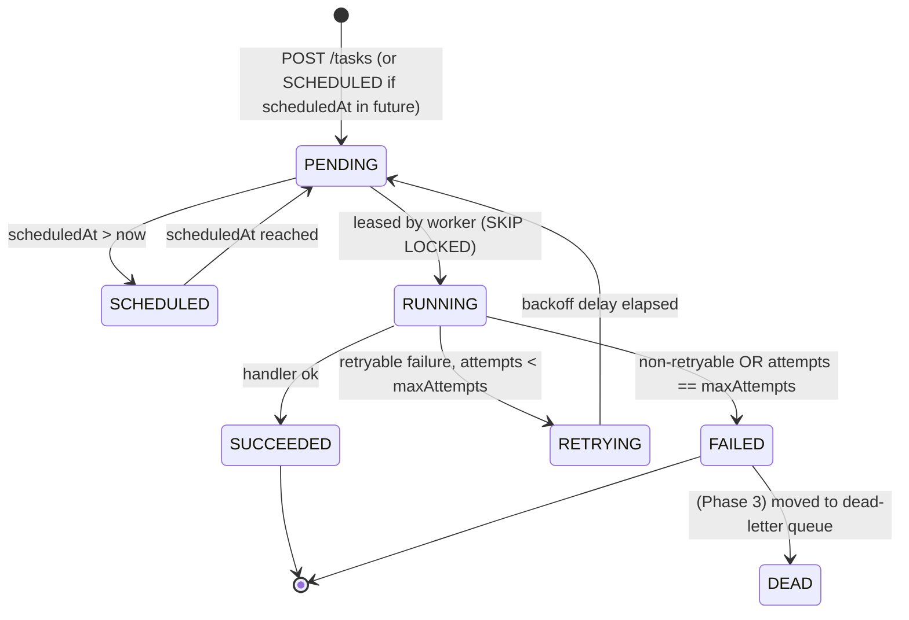
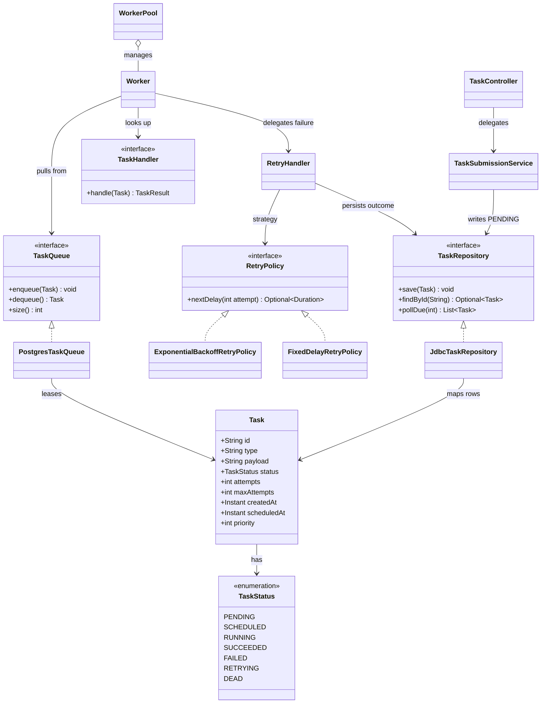

# Phase 2: Persistence, REST API, and Retries

> **Where this fits in the project:** This is the second milestone of the **Distributed Task Queue and Event Processing Platform**. In [Phase 1](./phase-1.md) we built a single-JVM producer–consumer pipeline where the queue lived in heap and a crash lost everything. Phase 2 makes the platform **durable and network-accessible**: we put a Spring Boot REST API in front of task submission, persist every task in PostgreSQL, lease work safely with `SELECT ... FOR UPDATE SKIP LOCKED`, and turn the dead-end `FAILED` state into a real **retry loop** driven by an `ExponentialBackoffRetryPolicy`. By the end you can `curl` a task in, kill the JVM, restart it, and watch the task still run.

```text
Phase 2 target:  Client → REST API (Spring Boot) → PostgreSQL → PostgresTaskQueue → WorkerPool → RetryHandler
```

---

## 1. Goals and Scope

Phase 1 proved the **object model** and the **concurrency model**. Phase 2 proves the **durability model** and the **delivery model**. The single load-bearing change is this: the queue is no longer a `BlockingQueue` in heap — it is a **table in PostgreSQL**, and "dequeue" becomes a transactional lease. Everything else (the REST layer, retries, idempotency) follows from making state survive a restart.

**What we will build:**

- A **Spring Boot 3** application (`Java 21`) exposing `POST /tasks` and `GET /tasks/{id}` via a `TaskController`.
- A **PostgreSQL** schema managed by **Flyway** migrations: a `tasks` table indexed for lease queries.
- A `TaskRepository` (port) with a JDBC-backed adapter using `JdbcTemplate`, implementing `save`, `findById`, and `pollDue(int n)`.
- A `PostgresTaskQueue` implementing our canonical `TaskQueue` interface, where `dequeue()` runs `SELECT ... FOR UPDATE SKIP LOCKED` to **lease** rows so two workers never grab the same task.
- A `RetryPolicy` Strategy (`FixedDelayRetryPolicy`, `ExponentialBackoffRetryPolicy` with jitter) and a `RetryHandler` that decides, on failure, whether to reschedule (`RETRYING`) or give up (`FAILED`).
- An **idempotency** seam (a dedup key) so a client retrying `POST /tasks` does not create duplicate work.
- **Testcontainers** integration tests that spin a real PostgreSQL in Docker — no mocks for the database.
- A sequence of conventional commits and acceptance criteria.

**What we explicitly do NOT build yet (and why):**

| Deferred capability | Why it is out of scope in Phase 2 | Where it lands |
| --- | --- | --- |
| Dead-letter queue | A permanently failed task lands in `FAILED`; there is no quarantine table or operator workflow yet. | [Phase 3](./phase-3.md) |
| Rate limiting / token bucket | We rely on a bounded worker pool and DB `LIMIT`; real per-type limiting comes later. | [Phase 3](./phase-3.md) |
| Circuit breakers | A flaky downstream just keeps retrying; no Resilience4j yet. | [Phase 3](./phase-3.md) |
| Metrics (Micrometer/Prometheus) | We log; we do not yet emit counters/timers/gauges. | [Phase 3](./phase-3.md) |
| Distributed workers across nodes | `SKIP LOCKED` already makes the queue *multi-worker-safe within one DB*, which is the foundation, but cross-node coordination and a real broker come later. | [Phase 4](./phase-4.md) |
| Event bus | No `EventBus`/`TaskEvent` yet; the worker calls handlers directly. | [Phase 4](./phase-4.md) |

> **Engineering principle (YAGNI + stable seams):** We keep the *exact* canonical interfaces from Phase 1 — `Task`, `TaskStatus`, `TaskQueue`, `TaskHandler`, `TaskResult`, `Worker`, `WorkerPool` — and only **swap implementations** behind them. Persistence is an adapter, not a rewrite. This is Dependency Inversion paying rent. See [dependency-injection.md](../04-oop-and-ood/dependency-injection.md) and [hexagonal-architecture.md](../04-oop-and-ood/hexagonal-architecture.md).

### Concepts exercised in this phase

- **OOD / architecture:** [layered architecture](../04-oop-and-ood/layered-architecture.md), [hexagonal architecture](../04-oop-and-ood/hexagonal-architecture.md), [clean architecture](../04-oop-and-ood/clean-architecture.md), [dependency injection](../04-oop-and-ood/dependency-injection.md), [domain modeling](../04-oop-and-ood/domain-modeling.md), [coupling](../04-oop-and-ood/coupling.md), [cohesion](../04-oop-and-ood/cohesion.md), [SOLID](../04-oop-and-ood/solid.md).
- **Patterns:** [Strategy](../05-design-patterns/strategy.md) (the `RetryPolicy`), [Factory Method](../05-design-patterns/factory-method.md) (task construction), [Adapter](../05-design-patterns/adapter.md) (JDBC adapter behind `TaskRepository`).
- **Distributed systems:** [idempotency](../08-distributed-systems/idempotency.md), [retries](../08-distributed-systems/retries.md), [distributed locks](../08-distributed-systems/distributed-locks.md) (row leasing is a database-native lock), [consistency & availability](../08-distributed-systems/consistency-and-availability.md).
- **Concurrency carried over:** [executor service](../06-concurrency/executor-service.md), [blocking queue](../06-concurrency/blocking-queue.md), [atomics & thread safety](../06-concurrency/atomics-and-thread-safety.md).
- **Queues:** [task queues](../07-queues-and-messaging/task-queues.md), [delayed queues](../07-queues-and-messaging/delayed-queues.md) (scheduling via `scheduled_at`).

---

## 2. Architecture

Phase 2 is a classic **layered** application that we deliberately wire as a **hexagon** (ports and adapters). The domain (`Task`, `RetryPolicy`, the service that orchestrates submission and retry) knows nothing about HTTP or JDBC. HTTP is an inbound adapter (`TaskController`); PostgreSQL is an outbound adapter (`JdbcTaskRepository` / `PostgresTaskQueue`).

```mermaid
flowchart TB
    Client([Client / curl]) -->|POST /tasks, GET /tasks/&#123;id&#125;| Ctl[TaskController<br/>inbound adapter]
    Ctl --> Svc[TaskSubmissionService<br/>application service]
    Svc --> Repo[(TaskRepository<br/>port)]
    Repo -.implemented by.-> Jdbc[JdbcTaskRepository<br/>outbound adapter]
    Jdbc --> PG[(PostgreSQL<br/>tasks table)]

    subgraph Polling[Background dispatch]
      Q[PostgresTaskQueue<br/>dequeue = SELECT FOR UPDATE SKIP LOCKED] --> PG
      Pool[WorkerPool — ExecutorService] --> Q
      Pool --> Reg[HandlerRegistry<br/>type to TaskHandler]
      Pool --> Retry[RetryHandler + RetryPolicy]
      Retry --> PG
    end

    Flyway[[Flyway migrations]] -.creates schema.-> PG
```



The two halves communicate **only through the database**. The REST side writes a `PENDING` row; the dispatch side leases and runs it. This decoupling is what lets us, in Phase 4, run the REST tier and the worker tier as *separate horizontally-scaled deployments*.

### State machine

The canonical `TaskStatus` lifecycle becomes real in Phase 2. Phase 1 only used `PENDING → RUNNING → SUCCEEDED/FAILED`. Now `RETRYING` and `SCHEDULED` carry weight, and `DEAD` is reserved for Phase 3.



> **Why model `SCHEDULED` and `RETRYING` separately from `PENDING`?** `pollDue` filters on `scheduled_at <= now()`. A `RETRYING` task and a future-`SCHEDULED` task are both "not ready yet" rows; collapsing them into `PENDING` would lose the operator's ability to see *why* a task is waiting. Distinct states are cheap (one enum value) and make dashboards honest.

### UML class diagram (the seams that stay stable)



Note the relationship arrows: `WorkerPool o-- Worker` is **aggregation** (the pool holds workers but workers are conceptually independent runnables), `RetryHandler --> RetryPolicy` is a **Strategy** association injected at construction, and the `<|..` arrows are **interface realization** — the whole point of the phase is that infrastructure realizes domain ports.

---

## 3. Why this phase exists — the real problem

At the end of Phase 1 you could lose every queued task by pressing `Ctrl-C`. That is not a queue; that is a buffer. A production task queue has two non-negotiable properties Phase 1 lacked:

1. **Durability.** A submitted task must survive process crash, deploy, and OOM. The moment the API returns `202 Accepted`, the work is a *promise* that must be kept. The only honest way to keep that promise on a single machine is to write it to durable storage before acknowledging.
2. **At-least-once delivery with safe concurrency.** Multiple workers must pull from the same durable store without ever running the same task twice *concurrently*, and a worker that dies mid-task must not strand that task forever.

The naive instinct — "just add a database and `SELECT * WHERE status='PENDING'`" — is a trap. Without locking, two workers select the same row and run it twice. With naive `SELECT ... FOR UPDATE` (no `SKIP LOCKED`), workers serialize behind each other and your throughput collapses to one-at-a-time. The whole craft of Phase 2 is the leasing query.

### The naive version (and why it is broken)

```java
// NAIVE: do not ship this. Race condition + double execution.
public Task dequeueNaive(Connection c) throws SQLException {
    try (var ps = c.prepareStatement(
            "SELECT id, type, payload FROM tasks WHERE status = 'PENDING' " +
            "ORDER BY priority DESC, created_at ASC LIMIT 1")) {
        var rs = ps.executeQuery();
        if (!rs.next()) return null;
        String id = rs.getString("id");
        // RACE: between this SELECT and the UPDATE below, another worker
        //    runs the identical SELECT and gets the SAME id.
        try (var up = c.prepareStatement(
                "UPDATE tasks SET status = 'RUNNING' WHERE id = ?")) {
            up.setString(1, id);
            up.executeUpdate();
        }
        return /* build Task ... */ null;
    }
}
```

Two workers select row `X` simultaneously, both flip it to `RUNNING`, both run the handler. If the handler charges a credit card, you just double-charged. This is the canonical **lost-update / double-execution** bug, and it is why we lease inside a single locking query.

### Improved version — `FOR UPDATE` (correct but slow)

```sql
-- Correct: the row is locked so no other tx can read-for-update it.
-- WRONG TRADEOFF: a second worker BLOCKS on the locked row instead of
-- skipping to the next available task. Throughput becomes serial.
SELECT id FROM tasks
 WHERE status = 'PENDING' AND scheduled_at <= now()
 ORDER BY priority DESC, created_at ASC
 LIMIT 1
 FOR UPDATE;
```

This fixes correctness — only one transaction can hold the lock — but it serializes your workers. Worker B's identical query waits for Worker A's transaction to commit before it can even *see* the next row, because it is blocked on the locked row it would have matched.

### Production-quality version — `FOR UPDATE SKIP LOCKED`

```sql
-- The production leasing query. Each worker grabs a DIFFERENT runnable row.
SELECT id, type, payload, status, attempts, max_attempts,
       created_at, scheduled_at, priority
  FROM tasks
 WHERE status IN ('PENDING', 'SCHEDULED', 'RETRYING')
   AND scheduled_at <= now()
 ORDER BY priority DESC, created_at ASC
 LIMIT ?            -- batch size; lease N at once
 FOR UPDATE SKIP LOCKED;
```

`SKIP LOCKED` (PostgreSQL 9.5+, SQL standard since SQL:2016) tells the planner: *if a candidate row is already locked by another transaction, skip it and take the next one.* This converts a serial queue into a concurrent one. Inside the **same transaction** we then `UPDATE ... SET status='RUNNING'` for the leased ids and commit. The lock + status flip together are the lease.

> **This is a distributed lock you already paid for.** A row-level lock acquired by `FOR UPDATE SKIP LOCKED` *is* mutual exclusion over a task — implemented by the database you already run, with no Redis or ZooKeeper. We compare it to true distributed locks in [distributed-locks.md](../08-distributed-systems/distributed-locks.md); for a single-Postgres deployment this is the right tool.

---

## 4. Project layout

We start a fresh module, `task-queue-phase2`, that *reuses the domain kernel* from Phase 1 (same packages, same `Task`/`TaskStatus`/`TaskResult`/`TaskHandler`). New packages appear for persistence, retry, and web.

```text
task-queue-phase2/
├── pom.xml
├── docker-compose.yml                      # local Postgres
└── src
    ├── main
    │   ├── java/com/taskqueue
    │   │   ├── Application.java             # Spring Boot entry point
    │   │   ├── model/
    │   │   │   ├── Task.java                # canonical (unchanged shape)
    │   │   │   ├── TaskStatus.java
    │   │   │   └── TaskResult.java
    │   │   ├── handler/
    │   │   │   ├── TaskHandler.java         # functional interface
    │   │   │   └── HandlerRegistry.java
    │   │   ├── repository/
    │   │   │   ├── TaskRepository.java      # port
    │   │   │   └── JdbcTaskRepository.java  # adapter (JdbcTemplate)
    │   │   ├── queue/
    │   │   │   ├── TaskQueue.java           # canonical interface
    │   │   │   ├── PostgresTaskQueue.java   # SKIP LOCKED leasing
    │   │   │   └── StuckTaskReaper.java     # visibility-timeout recovery
    │   │   ├── retry/
    │   │   │   ├── RetryPolicy.java         # Strategy port
    │   │   │   ├── FixedDelayRetryPolicy.java
    │   │   │   ├── ExponentialBackoffRetryPolicy.java
    │   │   │   └── RetryHandler.java
    │   │   ├── worker/
    │   │   │   ├── Worker.java              # Runnable
    │   │   │   └── WorkerPool.java          # ExecutorService owner
    │   │   ├── service/
    │   │   │   └── TaskSubmissionService.java
    │   │   ├── web/
    │   │   │   ├── TaskController.java      # POST /tasks, GET /tasks/{id}
    │   │   │   ├── SubmitTaskRequest.java
    │   │   │   ├── TaskResponse.java
    │   │   │   └── ApiExceptionHandler.java
    │   │   └── config/
    │   │       └── QueueConfig.java         # @Bean wiring (DI)
    │   └── resources
    │       ├── application.yml
    │       └── db/migration
    │           ├── V1__create_tasks.sql
    │           └── V2__idempotency_key.sql
    └── test/java/com/taskqueue
        ├── PostgresIT.java                  # Testcontainers base
        ├── JdbcTaskRepositoryIT.java
        ├── PostgresTaskQueueIT.java         # SKIP LOCKED concurrency test
        ├── RetryHandlerTest.java            # pure unit
        ├── ExponentialBackoffRetryPolicyTest.java
        └── TaskControllerIT.java            # MockMvc + Testcontainers
```

---

## 5. Build setup — Maven and dependencies

```xml
<!-- pom.xml -->
<?xml version="1.0" encoding="UTF-8"?>
<project xmlns="http://maven.apache.org/POM/4.0.0"
         xmlns:xsi="http://www.w3.org/2001/XMLSchema-instance"
         xsi:schemaLocation="http://maven.apache.org/POM/4.0.0
                             http://maven.apache.org/xsd/maven-4.0.0.xsd">
  <modelVersion>4.0.0</modelVersion>

  <parent>
    <groupId>org.springframework.boot</groupId>
    <artifactId>spring-boot-starter-parent</artifactId>
    <version>3.3.2</version>
    <relativePath/>
  </parent>

  <groupId>com.taskqueue</groupId>
  <artifactId>task-queue-phase2</artifactId>
  <version>0.2.0</version>
  <packaging>jar</packaging>

  <properties>
    <java.version>21</java.version>
    <maven.compiler.release>21</maven.compiler.release>
    <testcontainers.version>1.20.1</testcontainers.version>
  </properties>

  <dependencies>
    <!-- Web layer -->
    <dependency>
      <groupId>org.springframework.boot</groupId>
      <artifactId>spring-boot-starter-web</artifactId>
    </dependency>
    <!-- JdbcTemplate + DataSource auto-config -->
    <dependency>
      <groupId>org.springframework.boot</groupId>
      <artifactId>spring-boot-starter-jdbc</artifactId>
    </dependency>
    <!-- Bean Validation for request DTOs -->
    <dependency>
      <groupId>org.springframework.boot</groupId>
      <artifactId>spring-boot-starter-validation</artifactId>
    </dependency>
    <!-- Flyway schema migrations -->
    <dependency>
      <groupId>org.flywaydb</groupId>
      <artifactId>flyway-core</artifactId>
    </dependency>
    <dependency>
      <groupId>org.flywaydb</groupId>
      <artifactId>flyway-database-postgresql</artifactId>
    </dependency>
    <!-- PostgreSQL JDBC driver -->
    <dependency>
      <groupId>org.postgresql</groupId>
      <artifactId>postgresql</artifactId>
      <scope>runtime</scope>
    </dependency>

    <!-- Tests: JUnit 5 + AssertJ come via spring-boot-starter-test -->
    <dependency>
      <groupId>org.springframework.boot</groupId>
      <artifactId>spring-boot-starter-test</artifactId>
      <scope>test</scope>
    </dependency>
    <!-- Real PostgreSQL in Docker for integration tests -->
    <dependency>
      <groupId>org.testcontainers</groupId>
      <artifactId>postgresql</artifactId>
      <version>${testcontainers.version}</version>
      <scope>test</scope>
    </dependency>
    <dependency>
      <groupId>org.testcontainers</groupId>
      <artifactId>junit-jupiter</artifactId>
      <version>${testcontainers.version}</version>
      <scope>test</scope>
    </dependency>
  </dependencies>

  <build>
    <plugins>
      <plugin>
        <groupId>org.springframework.boot</groupId>
        <artifactId>spring-boot-maven-plugin</artifactId>
      </plugin>
    </plugins>
  </build>
</project>
```

> **Gradle alternative:** the same dependency set in `build.gradle` is `implementation 'org.springframework.boot:spring-boot-starter-web'`, `...-jdbc`, `...-validation`, `org.flywaydb:flyway-core`, `org.flywaydb:flyway-database-postgresql`, `runtimeOnly 'org.postgresql:postgresql'`, and `testImplementation` for `spring-boot-starter-test` plus the two Testcontainers artifacts. We standardize on Maven for this curriculum.

### Local Postgres for running the app

```yaml
# docker-compose.yml
services:
  postgres:
    image: postgres:16
    environment:
      POSTGRES_DB: taskqueue
      POSTGRES_USER: taskqueue
      POSTGRES_PASSWORD: taskqueue
    ports:
      - "5432:5432"
    healthcheck:
      test: ["CMD-SHELL", "pg_isready -U taskqueue"]
      interval: 2s
      timeout: 3s
      retries: 20
```

```yaml
# src/main/resources/application.yml
spring:
  datasource:
    url: jdbc:postgresql://localhost:5432/taskqueue
    username: taskqueue
    password: taskqueue
    hikari:
      maximum-pool-size: 16     # >= worker count; see "Production considerations"
      pool-name: tq-pool
  flyway:
    enabled: true
    locations: classpath:db/migration

taskqueue:
  worker-count: 8
  poll-batch-size: 16
  poll-interval-ms: 200
  default-max-attempts: 5

logging:
  level:
    com.taskqueue: INFO
```

---

## 6. The schema — Flyway migrations

Migrations are versioned, immutable SQL files Flyway applies in order on startup and records in a `flyway_schema_history` table. Never edit an applied migration; add a new one. See the schema-evolution discussion under [domain-modeling.md](../04-oop-and-ood/domain-modeling.md).

```sql
-- src/main/resources/db/migration/V1__create_tasks.sql
CREATE TABLE tasks (
    id            UUID         PRIMARY KEY,
    type          TEXT         NOT NULL,
    payload       JSONB        NOT NULL,
    status        TEXT         NOT NULL,
    attempts      INT          NOT NULL DEFAULT 0,
    max_attempts  INT          NOT NULL DEFAULT 5,
    priority      INT          NOT NULL DEFAULT 0,
    created_at    TIMESTAMPTZ  NOT NULL DEFAULT now(),
    scheduled_at  TIMESTAMPTZ  NOT NULL DEFAULT now(),
    updated_at    TIMESTAMPTZ  NOT NULL DEFAULT now(),
    last_error    TEXT,
    CONSTRAINT chk_status CHECK (
        status IN ('PENDING','SCHEDULED','RUNNING','SUCCEEDED','FAILED','RETRYING','DEAD')
    )
);

-- The single most important index in the whole platform: it makes the
-- leasing query a partial-index range scan instead of a full table scan.
-- We index ONLY the rows a worker would ever lease (runnable states),
-- ordered the way pollDue orders them.
CREATE INDEX idx_tasks_lease
    ON tasks (priority DESC, scheduled_at ASC)
    WHERE status IN ('PENDING','SCHEDULED','RETRYING');

-- Lookups by id are covered by the PK; this index serves status dashboards.
CREATE INDEX idx_tasks_status ON tasks (status);
```

```sql
-- src/main/resources/db/migration/V2__idempotency_key.sql
-- Idempotency: a client that retries POST /tasks with the same key must
-- NOT create a second task. A partial unique index enforces "at most one
-- task per key" cheaply at the database layer.
ALTER TABLE tasks ADD COLUMN idempotency_key TEXT;

CREATE UNIQUE INDEX uq_tasks_idem
    ON tasks (idempotency_key)
    WHERE idempotency_key IS NOT NULL;
```

> **Why `JSONB` for payload?** The canonical model says `String payload (JSON string)`. We store it as `JSONB` so Postgres validates it is well-formed JSON on insert and so Phase 3/4 dashboards can query inside it (`payload->>'userId'`). In Java it stays a `String`; the JDBC adapter casts with `::jsonb`. If you do not need to query into it, `TEXT` is fine and faster to write.

> **Why `TIMESTAMPTZ` not `TIMESTAMP`?** Always store instants in UTC with timezone awareness. `TIMESTAMP` (without zone) silently drops the offset and is a perennial source of "the scheduler fired an hour early after DST" bugs. Our `Instant` fields map cleanly to `TIMESTAMPTZ`.

---

## 7. The domain kernel (carried from Phase 1)

These types keep the **exact** shape from the spec so all files stay consistent. The only addition is a couple of `with*` helpers on `Task` to support immutable state transitions.

```java
// src/main/java/com/taskqueue/model/TaskStatus.java
package com.taskqueue.model;

public enum TaskStatus {
    PENDING, SCHEDULED, RUNNING, SUCCEEDED, FAILED, RETRYING, DEAD
}
```

```java
// src/main/java/com/taskqueue/model/TaskResult.java
package com.taskqueue.model;

/** Outcome of a single handler execution. retryable is advisory. */
public record TaskResult(boolean success, String message, boolean retryable) {
    public static TaskResult ok()                      { return new TaskResult(true, "ok", false); }
    public static TaskResult retryableFailure(String m){ return new TaskResult(false, m, true); }
    public static TaskResult permanentFailure(String m){ return new TaskResult(false, m, false); }
}
```

```java
// src/main/java/com/taskqueue/model/Task.java
package com.taskqueue.model;

import java.time.Instant;
import java.util.UUID;

/**
 * Canonical task. A record gives us value semantics and immutability;
 * state transitions return a NEW Task via the with* helpers, which keeps
 * concurrent reasoning simple (no aliased mutable task shared between threads).
 */
public record Task(
        String id,
        String type,
        String payload,
        TaskStatus status,
        int attempts,
        int maxAttempts,
        Instant createdAt,
        Instant scheduledAt,
        int priority
) {
    /** Factory Method: build a fresh PENDING task with a generated UUID. */
    public static Task create(String type, String payload, int maxAttempts, int priority) {
        Instant now = Instant.now();
        return new Task(UUID.randomUUID().toString(), type, payload,
                TaskStatus.PENDING, 0, maxAttempts, now, now, priority);
    }

    public Task withStatus(TaskStatus newStatus) {
        return new Task(id, type, payload, newStatus, attempts, maxAttempts,
                createdAt, scheduledAt, priority);
    }

    public Task incrementAttemptAndSchedule(TaskStatus newStatus, Instant nextRun) {
        return new Task(id, type, payload, newStatus, attempts + 1, maxAttempts,
                createdAt, nextRun, priority);
    }
}
```

```java
// src/main/java/com/taskqueue/handler/TaskHandler.java
package com.taskqueue.handler;

import com.taskqueue.model.Task;
import com.taskqueue.model.TaskResult;

/** Strategy for executing one task type. Functional: register lambdas. */
@FunctionalInterface
public interface TaskHandler {
    TaskResult handle(Task task) throws Exception;
}
```

```java
// src/main/java/com/taskqueue/handler/HandlerRegistry.java
package com.taskqueue.handler;

import java.util.Map;
import java.util.Optional;
import java.util.concurrent.ConcurrentHashMap;

/** Open/closed seam: map task type -> handler. Thread-safe for hot registration. */
public class HandlerRegistry {
    private final Map<String, TaskHandler> handlers = new ConcurrentHashMap<>();

    public void register(String type, TaskHandler handler) {
        handlers.put(type, handler);
    }

    public Optional<TaskHandler> lookup(String type) {
        return Optional.ofNullable(handlers.get(type));
    }
}
```

---

## 8. The repository port and JDBC adapter

The port is pure domain. The adapter is the only place that knows SQL. This is the **Repository pattern** plus the **Adapter pattern**: the rest of the app depends on `TaskRepository`, never on `JdbcTemplate`.

```java
// src/main/java/com/taskqueue/repository/TaskRepository.java
package com.taskqueue.repository;

import com.taskqueue.model.Task;
import java.util.List;
import java.util.Optional;

/** Outbound port (canonical interface). */
public interface TaskRepository {
    void save(Task t);                  // upsert by id
    Optional<Task> findById(String id);
    List<Task> pollDue(int n);          // up to n runnable tasks, NOT leased

    // Idempotency support, on the port so the application layer never casts to JDBC.
    Optional<String> findIdByIdempotencyKey(String key);
    void saveWithIdempotencyKey(Task t, String key);
}
```

```java
// src/main/java/com/taskqueue/repository/JdbcTaskRepository.java
package com.taskqueue.repository;

import com.taskqueue.model.Task;
import com.taskqueue.model.TaskStatus;
import org.springframework.jdbc.core.JdbcTemplate;
import org.springframework.jdbc.core.RowMapper;
import org.springframework.stereotype.Repository;

import java.sql.Timestamp;
import java.util.List;
import java.util.Optional;
import java.util.UUID;

@Repository
public class JdbcTaskRepository implements TaskRepository {

    private final JdbcTemplate jdbc;

    public JdbcTaskRepository(JdbcTemplate jdbc) {
        this.jdbc = jdbc;
    }

    // Reusable mapper: ResultSet row -> Task. The ::jsonb column reads back as String.
    public static final RowMapper<Task> MAPPER = (rs, n) -> new Task(
            rs.getString("id"),
            rs.getString("type"),
            rs.getString("payload"),
            TaskStatus.valueOf(rs.getString("status")),
            rs.getInt("attempts"),
            rs.getInt("max_attempts"),
            rs.getTimestamp("created_at").toInstant(),
            rs.getTimestamp("scheduled_at").toInstant(),
            rs.getInt("priority"));

    @Override
    public void save(Task t) {
        // Upsert: insert new, or update mutable columns on conflict by id.
        jdbc.update("""
            INSERT INTO tasks (id, type, payload, status, attempts, max_attempts,
                               priority, created_at, scheduled_at, updated_at)
            VALUES (?::uuid, ?, ?::jsonb, ?, ?, ?, ?, ?, ?, now())
            ON CONFLICT (id) DO UPDATE SET
                status       = EXCLUDED.status,
                attempts     = EXCLUDED.attempts,
                scheduled_at = EXCLUDED.scheduled_at,
                updated_at   = now()
            """,
            UUID.fromString(t.id()), t.type(), t.payload(), t.status().name(),
            t.attempts(), t.maxAttempts(), t.priority(),
            Timestamp.from(t.createdAt()), Timestamp.from(t.scheduledAt()));
    }

    @Override
    public Optional<Task> findById(String id) {
        var rows = jdbc.query("""
            SELECT id, type, payload, status, attempts, max_attempts,
                   priority, created_at, scheduled_at
              FROM tasks WHERE id = ?::uuid
            """, MAPPER, UUID.fromString(id));
        return rows.stream().findFirst();
    }

    @Override
    public List<Task> pollDue(int n) {
        // Read-only visibility query (no lease). The actual lease lives in
        // PostgresTaskQueue.dequeue(). Useful for dashboards / scheduling.
        return jdbc.query("""
            SELECT id, type, payload, status, attempts, max_attempts,
                   priority, created_at, scheduled_at
              FROM tasks
             WHERE status IN ('PENDING','SCHEDULED','RETRYING')
               AND scheduled_at <= now()
             ORDER BY priority DESC, created_at ASC
             LIMIT ?
            """, MAPPER, n);
    }

    @Override
    public Optional<String> findIdByIdempotencyKey(String key) {
        var ids = jdbc.query(
            "SELECT id FROM tasks WHERE idempotency_key = ?",
            (rs, i) -> rs.getString("id"), key);
        return ids.stream().findFirst();
    }

    @Override
    public void saveWithIdempotencyKey(Task t, String key) {
        // DO NOTHING on key conflict: a concurrent duplicate request loses the race
        // here and we read back the winner's row in the service layer.
        jdbc.update("""
            INSERT INTO tasks (id, type, payload, status, attempts, max_attempts,
                               priority, created_at, scheduled_at, updated_at, idempotency_key)
            VALUES (?::uuid, ?, ?::jsonb, ?, ?, ?, ?, ?, ?, now(), ?)
            ON CONFLICT (idempotency_key) WHERE idempotency_key IS NOT NULL
            DO NOTHING
            """,
            UUID.fromString(t.id()), t.type(), t.payload(), t.status().name(),
            t.attempts(), t.maxAttempts(), t.priority(),
            Timestamp.from(t.createdAt()), Timestamp.from(t.scheduledAt()), key);
    }
}
```

> **Why upsert in `save`?** Workers call `save` to persist a state transition (`RUNNING → RETRYING`, etc.) on an existing row, while the API calls it to insert a brand-new row. One idempotent upsert serves both, and idempotent writes are exactly what you want when a retry might replay the same `save`.

---

## 9. The leasing queue — `PostgresTaskQueue`

This class is the heart of Phase 2. `dequeue()` opens a transaction, leases up to `batchSize` rows with `SKIP LOCKED`, flips them to `RUNNING`, and commits — atomically. We use Spring's `TransactionTemplate` so the lock-and-flip is one transaction. To keep the canonical `TaskQueue` interface (which returns a single `Task` from `dequeue()`), we lease a batch into an in-memory buffer and hand them out one at a time, refilling when empty. This amortizes the round-trip while preserving the interface.

```java
// src/main/java/com/taskqueue/queue/TaskQueue.java
package com.taskqueue.queue;

import com.taskqueue.model.Task;

/** Canonical queue interface — unchanged from Phase 1. */
public interface TaskQueue {
    void enqueue(Task t);
    Task dequeue() throws InterruptedException;   // null when nothing runnable
    int size();
}
```

```java
// src/main/java/com/taskqueue/queue/PostgresTaskQueue.java
package com.taskqueue.queue;

import com.taskqueue.model.Task;
import com.taskqueue.model.TaskStatus;
import com.taskqueue.repository.JdbcTaskRepository;
import org.springframework.jdbc.core.JdbcTemplate;
import org.springframework.transaction.support.TransactionTemplate;

import java.sql.Timestamp;
import java.util.ArrayDeque;
import java.util.List;
import java.util.Queue;
import java.util.UUID;

/**
 * Durable queue backed by the tasks table. dequeue() leases runnable rows
 * with SELECT ... FOR UPDATE SKIP LOCKED, so N workers across N JVMs never
 * grab the same task. Returns null when no task is currently runnable
 * (the caller polls with a small sleep — see Worker).
 */
public class PostgresTaskQueue implements TaskQueue {

    private final JdbcTemplate jdbc;
    private final TransactionTemplate tx;
    private final int batchSize;

    // Per-thread buffer so each worker leases a batch then drains it locally.
    private final ThreadLocal<Queue<Task>> buffer = ThreadLocal.withInitial(ArrayDeque::new);

    public PostgresTaskQueue(JdbcTemplate jdbc, TransactionTemplate tx, int batchSize) {
        this.jdbc = jdbc;
        this.tx = tx;
        this.batchSize = batchSize;
    }

    @Override
    public void enqueue(Task t) {
        jdbc.update("""
            INSERT INTO tasks (id, type, payload, status, attempts, max_attempts,
                               priority, created_at, scheduled_at, updated_at)
            VALUES (?::uuid, ?, ?::jsonb, ?, ?, ?, ?, ?, ?, now())
            ON CONFLICT (id) DO NOTHING
            """,
            UUID.fromString(t.id()), t.type(), t.payload(), t.status().name(),
            t.attempts(), t.maxAttempts(), t.priority(),
            Timestamp.from(t.createdAt()), Timestamp.from(t.scheduledAt()));
    }

    /**
     * Returns one leased task already flipped to RUNNING, or null if none
     * are currently runnable. Never blocks the DB; the worker decides to wait.
     */
    @Override
    public Task dequeue() {
        Queue<Task> local = buffer.get();
        if (local.isEmpty()) {
            leaseBatchInto(local);
        }
        return local.poll();   // null if still empty
    }

    private void leaseBatchInto(Queue<Task> local) {
        // One transaction: SELECT FOR UPDATE SKIP LOCKED, then UPDATE to RUNNING.
        List<Task> leased = tx.execute(status -> {
            List<Task> picked = jdbc.query("""
                SELECT id, type, payload, status, attempts, max_attempts,
                       priority, created_at, scheduled_at
                  FROM tasks
                 WHERE status IN ('PENDING','SCHEDULED','RETRYING')
                   AND scheduled_at <= now()
                 ORDER BY priority DESC, created_at ASC
                 LIMIT ?
                 FOR UPDATE SKIP LOCKED
                """, JdbcTaskRepository.MAPPER, batchSize);

            for (Task t : picked) {
                jdbc.update(
                    "UPDATE tasks SET status = ?, updated_at = now() WHERE id = ?::uuid",
                    TaskStatus.RUNNING.name(), UUID.fromString(t.id()));
            }
            return picked;
        });

        if (leased != null) {
            for (Task t : leased) {
                local.add(t.withStatus(TaskStatus.RUNNING));
            }
        }
    }

    @Override
    public int size() {
        Integer c = jdbc.queryForObject("""
            SELECT count(*) FROM tasks
             WHERE status IN ('PENDING','SCHEDULED','RETRYING')
            """, Integer.class);
        return c == null ? 0 : c;
    }
}
```

> **Lease batching tradeoff.** `batchSize = 1` gives perfect fairness and minimal stranding if a worker dies (only one in-flight task to recover), but one DB round-trip per task. `batchSize = 16` cuts round-trips 16x at the cost of holding 16 leases per worker — if that worker crashes, those 16 rows sit in `RUNNING` until a reaper resets them. For Phase 2 we pick a small batch (8–16) and add the reaper next.

### Recovering crashed leases (the visibility-timeout reaper)

A worker that dies mid-task leaves its row stuck in `RUNNING` forever — at-least-once delivery requires we *re-deliver* it. The classic fix is a **visibility timeout**: any task `RUNNING` longer than a threshold is presumed dead and reset to `PENDING`. We run this on a schedule.

```java
// src/main/java/com/taskqueue/queue/StuckTaskReaper.java
package com.taskqueue.queue;

import org.slf4j.Logger;
import org.slf4j.LoggerFactory;
import org.springframework.beans.factory.annotation.Value;
import org.springframework.jdbc.core.JdbcTemplate;
import org.springframework.scheduling.annotation.Scheduled;
import org.springframework.stereotype.Component;

import java.time.Duration;

/** Resets tasks that have been RUNNING longer than the visibility timeout. */
@Component
public class StuckTaskReaper {

    private static final Logger log = LoggerFactory.getLogger(StuckTaskReaper.class);

    private final JdbcTemplate jdbc;
    private final Duration visibilityTimeout;

    public StuckTaskReaper(JdbcTemplate jdbc,
                           @Value("${taskqueue.visibility-timeout:PT5M}") Duration visibilityTimeout) {
        this.jdbc = jdbc;
        this.visibilityTimeout = visibilityTimeout;
    }

    @Scheduled(fixedDelayString = "PT30S")   // every 30 seconds
    public void reap() {
        int reset = jdbc.update("""
            UPDATE tasks
               SET status = 'PENDING', updated_at = now()
             WHERE status = 'RUNNING'
               AND updated_at < now() - (? || ' seconds')::interval
            """, visibilityTimeout.toSeconds());
        if (reset > 0) {
            log.warn("Reaped {} stuck RUNNING task(s) back to PENDING", reset);
        }
    }
}
```

> **At-least-once, not exactly-once.** The reaper means a task that *actually finished* but whose worker crashed *before committing the SUCCEEDED update* will run again. This is fundamental: with crash-prone workers you get at-least-once. The defense is **idempotent handlers** — covered below and in [idempotency.md](../08-distributed-systems/idempotency.md).

---

## 10. The retry Strategy and the `RetryHandler`

A failure is a decision point, not an end state. The decision — *retry now, retry later, or give up* — is policy, and policy is a Strategy. The `RetryPolicy` computes the next delay; the `RetryHandler` applies it against the task's attempt budget and persists the outcome.

```java
// src/main/java/com/taskqueue/retry/RetryPolicy.java
package com.taskqueue.retry;

import java.time.Duration;
import java.util.Optional;

/**
 * Strategy: given the attempt number just completed (1-based), return the
 * delay before the next attempt, or empty() to signal "stop retrying".
 */
public interface RetryPolicy {
    Optional<Duration> nextDelay(int attempt);
}
```

```java
// src/main/java/com/taskqueue/retry/FixedDelayRetryPolicy.java
package com.taskqueue.retry;

import java.time.Duration;
import java.util.Optional;

/** Constant delay, capped attempts. Simple and predictable. */
public final class FixedDelayRetryPolicy implements RetryPolicy {
    private final Duration delay;
    private final int maxAttempts;

    public FixedDelayRetryPolicy(Duration delay, int maxAttempts) {
        this.delay = delay;
        this.maxAttempts = maxAttempts;
    }

    @Override
    public Optional<Duration> nextDelay(int attempt) {
        if (attempt >= maxAttempts) return Optional.empty();
        return Optional.of(delay);
    }
}
```

```java
// src/main/java/com/taskqueue/retry/ExponentialBackoffRetryPolicy.java
package com.taskqueue.retry;

import java.time.Duration;
import java.util.Optional;
import java.util.concurrent.ThreadLocalRandom;

/**
 * Exponential backoff with FULL JITTER:
 *   base * 2^(attempt-1), capped at maxDelay, then a uniform random in [0, that].
 * Full jitter spreads retries so a fleet of clients that all failed at the
 * same instant do not retry in a synchronized "thundering herd".
 */
public final class ExponentialBackoffRetryPolicy implements RetryPolicy {
    private final Duration base;
    private final Duration maxDelay;
    private final int maxAttempts;

    public ExponentialBackoffRetryPolicy(Duration base, Duration maxDelay, int maxAttempts) {
        this.base = base;
        this.maxDelay = maxDelay;
        this.maxAttempts = maxAttempts;
    }

    @Override
    public Optional<Duration> nextDelay(int attempt) {
        if (attempt >= maxAttempts) return Optional.empty();
        long baseMs = base.toMillis();
        // 2^(attempt-1) with overflow guard (shift saturates at 30).
        long exp = baseMs * (1L << Math.min(attempt - 1, 30));
        long cap = Math.min(exp, maxDelay.toMillis());
        long jittered = ThreadLocalRandom.current().nextLong(0, Math.max(1, cap + 1));
        return Optional.of(Duration.ofMillis(jittered));
    }
}
```

> **Why full jitter and not just exponential?** Pure exponential backoff keeps every failed client synchronized — they all wait the same `2^n`, then all retry at the same instant, hammering a recovering service in waves. Full jitter (`random(0, cap)`) decorrelates them. AWS's "Exponential Backoff and Jitter" analysis showed full jitter minimizes both contention and completion time. See [retries.md](../08-distributed-systems/retries.md).

```java
// src/main/java/com/taskqueue/retry/RetryHandler.java
package com.taskqueue.retry;

import com.taskqueue.model.Task;
import com.taskqueue.model.TaskResult;
import com.taskqueue.model.TaskStatus;
import com.taskqueue.repository.TaskRepository;
import org.slf4j.Logger;
import org.slf4j.LoggerFactory;

import java.time.Duration;
import java.time.Instant;
import java.util.Optional;

/**
 * Decides the terminal/next state of a task after one execution and persists it.
 * - success                                       -> SUCCEEDED
 * - non-retryable fail                            -> FAILED
 * - retryable fail, budget left, policy allows    -> RETRYING (scheduled later)
 * - retryable fail, budget/policy exhausted       -> FAILED (Phase 3 sends to DLQ)
 */
public class RetryHandler {

    private static final Logger log = LoggerFactory.getLogger(RetryHandler.class);

    private final RetryPolicy policy;
    private final TaskRepository repository;

    public RetryHandler(RetryPolicy policy, TaskRepository repository) {
        this.policy = policy;
        this.repository = repository;
    }

    /** Apply outcome to the leased task; returns the persisted next state. */
    public Task apply(Task running, TaskResult result) {
        if (result.success()) {
            Task done = running.withStatus(TaskStatus.SUCCEEDED);
            repository.save(done);
            log.info("Task {} ({}) SUCCEEDED on attempt {}",
                    running.id(), running.type(), running.attempts() + 1);
            return done;
        }

        if (!result.retryable()) {
            Task failed = running.incrementAttemptAndSchedule(TaskStatus.FAILED, Instant.now());
            repository.save(failed);
            log.warn("Task {} ({}) FAILED permanently: {}",
                    running.id(), running.type(), result.message());
            return failed;
        }

        int completedAttempt = running.attempts() + 1;   // the attempt we just ran
        Optional<Duration> delay = policy.nextDelay(completedAttempt);
        if (delay.isEmpty() || completedAttempt >= running.maxAttempts()) {
            Task failed = running.incrementAttemptAndSchedule(TaskStatus.FAILED, Instant.now());
            repository.save(failed);
            log.warn("Task {} ({}) exhausted retries after {} attempts: {}",
                    running.id(), running.type(), completedAttempt, result.message());
            return failed;     // Phase 3: DeadLetterQueue.send(failed, reason)
        }

        Instant nextRun = Instant.now().plus(delay.get());
        Task retrying = running.incrementAttemptAndSchedule(TaskStatus.RETRYING, nextRun);
        repository.save(retrying);
        log.info("Task {} ({}) RETRYING in {} (attempt {}/{})",
                running.id(), running.type(), delay.get(), completedAttempt, running.maxAttempts());
        return retrying;
    }
}
```

> **`RETRYING` rows re-enter the lease query naturally.** Because `PostgresTaskQueue.dequeue()` includes `RETRYING` in its `status IN (...)` filter and gates on `scheduled_at <= now()`, a retrying task automatically becomes leasable again once its backoff elapses. No separate scheduler thread is needed for retries — the queue *is* the scheduler. This is the `scheduledAt` field from the canonical model finally earning its keep. See [delayed-queues.md](../07-queues-and-messaging/delayed-queues.md).

---

## 11. The worker and pool (now persistence-aware)

The `Worker` keeps the Phase 1 contract — pull, look up handler, execute — but the outcome now flows through the `RetryHandler` and the durable store instead of an in-heap status flip. Because `PostgresTaskQueue.dequeue()` returns `null` when nothing is runnable (rather than blocking), the worker polls with a short backoff.

```java
// src/main/java/com/taskqueue/worker/Worker.java
package com.taskqueue.worker;

import com.taskqueue.handler.HandlerRegistry;
import com.taskqueue.handler.TaskHandler;
import com.taskqueue.model.Task;
import com.taskqueue.model.TaskResult;
import com.taskqueue.queue.TaskQueue;
import com.taskqueue.retry.RetryHandler;
import org.slf4j.Logger;
import org.slf4j.LoggerFactory;

/** Pulls leased tasks, runs the handler, routes the outcome through retry. */
public class Worker implements Runnable {

    private static final Logger log = LoggerFactory.getLogger(Worker.class);

    private final TaskQueue queue;
    private final HandlerRegistry registry;
    private final RetryHandler retryHandler;
    private final long idlePollMs;

    public Worker(TaskQueue queue, HandlerRegistry registry,
                  RetryHandler retryHandler, long idlePollMs) {
        this.queue = queue;
        this.registry = registry;
        this.retryHandler = retryHandler;
        this.idlePollMs = idlePollMs;
    }

    @Override
    public void run() {
        while (!Thread.currentThread().isInterrupted()) {
            Task task;
            try {
                task = queue.dequeue();         // already leased + RUNNING, or null
            } catch (InterruptedException e) {
                Thread.currentThread().interrupt();
                return;
            }
            if (task == null) {
                sleepQuietly(idlePollMs);       // nothing runnable; back off
                continue;
            }
            execute(task);
        }
    }

    private void execute(Task task) {
        TaskHandler handler = registry.lookup(task.type()).orElse(null);
        if (handler == null) {
            // Unknown type is a permanent failure — never retry into a void.
            retryHandler.apply(task,
                TaskResult.permanentFailure("no handler for type " + task.type()));
            return;
        }
        TaskResult result;
        try {
            result = handler.handle(task);      // contain ALL handler failures
        } catch (Exception e) {
            log.error("Handler for {} threw: {}", task.type(), e.toString());
            result = TaskResult.retryableFailure(
                e.getClass().getSimpleName() + ": " + e.getMessage());
        }
        retryHandler.apply(task, result);
    }

    private static void sleepQuietly(long ms) {
        try { Thread.sleep(ms); }
        catch (InterruptedException e) { Thread.currentThread().interrupt(); }
    }
}
```

```java
// src/main/java/com/taskqueue/worker/WorkerPool.java
package com.taskqueue.worker;

import org.slf4j.Logger;
import org.slf4j.LoggerFactory;

import java.util.concurrent.ExecutorService;
import java.util.concurrent.Executors;
import java.util.concurrent.ThreadFactory;
import java.util.concurrent.TimeUnit;
import java.util.concurrent.atomic.AtomicInteger;
import java.util.function.Supplier;

/** Owns the ExecutorService; starts N workers and shuts them down gracefully. */
public class WorkerPool {

    private static final Logger log = LoggerFactory.getLogger(WorkerPool.class);

    private final int workerCount;
    private final Supplier<Worker> workerFactory;
    private ExecutorService executor;

    public WorkerPool(int workerCount, Supplier<Worker> workerFactory) {
        this.workerCount = workerCount;
        this.workerFactory = workerFactory;
    }

    public void start() {
        ThreadFactory tf = namedDaemonFactory("tq-worker-");
        executor = Executors.newFixedThreadPool(workerCount, tf);
        for (int i = 0; i < workerCount; i++) {
            executor.submit(workerFactory.get());
        }
        log.info("WorkerPool started with {} workers", workerCount);
    }

    public void shutdown() {
        if (executor == null) return;
        executor.shutdownNow();   // interrupt workers; they restore the flag and exit
        try {
            if (!executor.awaitTermination(20, TimeUnit.SECONDS)) {
                log.warn("WorkerPool did not terminate within 20s");
            }
        } catch (InterruptedException e) {
            Thread.currentThread().interrupt();
        }
        log.info("WorkerPool shut down");
    }

    private static ThreadFactory namedDaemonFactory(String prefix) {
        AtomicInteger n = new AtomicInteger();
        return r -> {
            Thread t = new Thread(r, prefix + n.incrementAndGet());
            t.setDaemon(true);
            return t;
        };
    }
}
```

> **Why poll instead of block?** Phase 1's `BlockingQueue.take()` blocked the thread until work arrived. A SQL queue cannot push; we must pull. A `null` + short sleep is the simplest correct loop. The cost is idle DB queries when the queue is empty (`worker-count × 1/poll-interval` queries/sec). At 8 workers polling every 200ms that's 40 queries/sec doing nothing — trivial for Postgres but a real waste at scale. Phase 3 adds rate-aware polling and Phase 4 replaces polling with a broker that pushes. For now, simplicity wins.

> Virtual threads (Project Loom) are *not* a free win here: workers block on JDBC I/O, and the JDBC driver and connection pool are the real bottleneck — pinning a virtual thread to a connection gains nothing over a small fixed pool sized to the connection pool. We revisit Loom when work becomes more I/O-fan-out shaped in Phase 4. See [executor-service.md](../06-concurrency/executor-service.md).

---

## 12. The application service and the REST layer

### Application service (orchestration + idempotency)

```java
// src/main/java/com/taskqueue/service/TaskSubmissionService.java
package com.taskqueue.service;

import com.taskqueue.model.Task;
import com.taskqueue.repository.TaskRepository;
import org.springframework.stereotype.Service;

import java.util.Optional;

/**
 * Application service: the use-case boundary. Knows nothing about HTTP.
 * Depends ONLY on the TaskRepository port (no JDBC cast). Enforces idempotency
 * at submission time so a client that retries POST does not enqueue duplicate work.
 */
@Service
public class TaskSubmissionService {

    private final TaskRepository repository;

    public TaskSubmissionService(TaskRepository repository) {
        this.repository = repository;
    }

    /** Submit without an idempotency key — always creates a new task. */
    public Task submit(String type, String payload, int maxAttempts, int priority) {
        Task task = Task.create(type, payload, maxAttempts, priority);
        repository.save(task);
        return task;
    }

    /**
     * Idempotent submit: if the key was seen, return the existing task instead
     * of creating a duplicate. The DB partial-unique index is the hard guarantee;
     * this read-then-write is the fast path, and the unique index resolves races.
     */
    public Task submitIdempotent(String type, String payload, int maxAttempts,
                                 int priority, String idempotencyKey) {
        Optional<String> existing = repository.findIdByIdempotencyKey(idempotencyKey);
        if (existing.isPresent()) {
            return repository.findById(existing.get()).orElseThrow();
        }
        Task task = Task.create(type, payload, maxAttempts, priority);
        repository.saveWithIdempotencyKey(task, idempotencyKey);
        // Re-read: if a concurrent request won the unique index, we get THEIR row.
        return repository.findIdByIdempotencyKey(idempotencyKey)
                .flatMap(repository::findById)
                .orElse(task);
    }

    public Optional<Task> get(String id) {
        return repository.findById(id);
    }
}
```

> **Idempotency intro.** Two clients (or one client retrying) send `POST /tasks` with the same `Idempotency-Key`. The `ON CONFLICT (idempotency_key) DO NOTHING` insert plus a re-read guarantees exactly one task exists for that key, and every caller gets the same task id back. This is the database doing the dedup for us — the cheapest correct idempotency you can build. Deeper treatment (dedup windows, response replay, fencing tokens) is in [idempotency.md](../08-distributed-systems/idempotency.md).

### REST DTOs and controller

```java
// src/main/java/com/taskqueue/web/SubmitTaskRequest.java
package com.taskqueue.web;

import jakarta.validation.constraints.Max;
import jakarta.validation.constraints.Min;
import jakarta.validation.constraints.NotBlank;

/** Inbound DTO — validated at the edge, never leaks into the domain. */
public record SubmitTaskRequest(
        @NotBlank String type,
        @NotBlank String payload,        // must be a JSON string
        @Min(1) @Max(20) Integer maxAttempts,
        @Min(0) @Max(9) Integer priority
) {
    public int maxAttemptsOr(int dflt) { return maxAttempts == null ? dflt : maxAttempts; }
    public int priorityOr(int dflt)    { return priority == null ? dflt : priority; }
}
```

```java
// src/main/java/com/taskqueue/web/TaskResponse.java
package com.taskqueue.web;

import com.taskqueue.model.Task;

/** Outbound DTO — the API contract, decoupled from the persistence shape. */
public record TaskResponse(
        String id, String type, String status,
        int attempts, int maxAttempts, int priority,
        String createdAt, String scheduledAt
) {
    public static TaskResponse from(Task t) {
        return new TaskResponse(t.id(), t.type(), t.status().name(),
                t.attempts(), t.maxAttempts(), t.priority(),
                t.createdAt().toString(), t.scheduledAt().toString());
    }
}
```

```java
// src/main/java/com/taskqueue/web/TaskController.java
package com.taskqueue.web;

import com.taskqueue.model.Task;
import com.taskqueue.service.TaskSubmissionService;
import jakarta.validation.Valid;
import org.springframework.beans.factory.annotation.Value;
import org.springframework.http.HttpStatus;
import org.springframework.http.ResponseEntity;
import org.springframework.web.bind.annotation.*;
import org.springframework.web.servlet.support.ServletUriComponentsBuilder;

import java.net.URI;

@RestController
@RequestMapping("/tasks")
public class TaskController {

    private final TaskSubmissionService service;
    private final int defaultMaxAttempts;

    public TaskController(TaskSubmissionService service,
                          @Value("${taskqueue.default-max-attempts:5}") int defaultMaxAttempts) {
        this.service = service;
        this.defaultMaxAttempts = defaultMaxAttempts;
    }

    /** POST /tasks  -> 202 Accepted with a Location header to GET the task. */
    @PostMapping
    public ResponseEntity<TaskResponse> submit(
            @Valid @RequestBody SubmitTaskRequest req,
            @RequestHeader(value = "Idempotency-Key", required = false) String idemKey) {

        int maxAttempts = req.maxAttemptsOr(defaultMaxAttempts);
        int priority = req.priorityOr(0);

        Task task = (idemKey == null || idemKey.isBlank())
                ? service.submit(req.type(), req.payload(), maxAttempts, priority)
                : service.submitIdempotent(req.type(), req.payload(), maxAttempts, priority, idemKey);

        URI location = ServletUriComponentsBuilder.fromCurrentRequest()
                .path("/{id}").buildAndExpand(task.id()).toUri();
        return ResponseEntity.accepted().location(location).body(TaskResponse.from(task));
    }

    /** GET /tasks/{id} -> 200 with the task, or 404 if unknown. */
    @GetMapping("/{id}")
    public ResponseEntity<TaskResponse> get(@PathVariable String id) {
        return service.get(id)
                .map(TaskResponse::from)
                .map(ResponseEntity::ok)
                .orElseGet(() -> ResponseEntity.status(HttpStatus.NOT_FOUND).build());
    }
}
```

```java
// src/main/java/com/taskqueue/web/ApiExceptionHandler.java
package com.taskqueue.web;

import org.springframework.http.HttpStatus;
import org.springframework.http.ProblemDetail;
import org.springframework.web.bind.MethodArgumentNotValidException;
import org.springframework.web.bind.annotation.ExceptionHandler;
import org.springframework.web.bind.annotation.RestControllerAdvice;

/** Turns validation failures into RFC 7807 problem+json (400). */
@RestControllerAdvice
public class ApiExceptionHandler {

    @ExceptionHandler(MethodArgumentNotValidException.class)
    public ProblemDetail onValidation(MethodArgumentNotValidException ex) {
        ProblemDetail pd = ProblemDetail.forStatus(HttpStatus.BAD_REQUEST);
        pd.setTitle("Invalid task submission");
        pd.setDetail(ex.getBindingResult().getFieldErrors().stream()
                .map(e -> e.getField() + " " + e.getDefaultMessage())
                .reduce((a, b) -> a + "; " + b).orElse("validation failed"));
        return pd;
    }
}
```

> **Why `202 Accepted`, not `201 Created`?** The work is not *done* when we return — it is *promised*. `202` is the honest status for "I durably accepted your request and will process it asynchronously." The `Location` header lets the client poll `GET /tasks/{id}` for the outcome. This is the layered architecture boundary at work: the controller speaks HTTP, the service speaks use-cases, and neither leaks into the other. See [layered-architecture.md](../04-oop-and-ood/layered-architecture.md).

---

## 13. Wiring it together (Dependency Injection)

Spring is the composition root. We declare beans explicitly in a `@Configuration` so the wiring is visible in one place — DI by constructor, infrastructure chosen here, domain untouched. See [dependency-injection.md](../04-oop-and-ood/dependency-injection.md).

```java
// src/main/java/com/taskqueue/config/QueueConfig.java
package com.taskqueue.config;

import com.taskqueue.handler.HandlerRegistry;
import com.taskqueue.model.TaskResult;
import com.taskqueue.queue.PostgresTaskQueue;
import com.taskqueue.queue.TaskQueue;
import com.taskqueue.repository.TaskRepository;
import com.taskqueue.retry.ExponentialBackoffRetryPolicy;
import com.taskqueue.retry.RetryHandler;
import com.taskqueue.retry.RetryPolicy;
import com.taskqueue.worker.Worker;
import com.taskqueue.worker.WorkerPool;
import org.springframework.beans.factory.annotation.Value;
import org.springframework.context.annotation.Bean;
import org.springframework.context.annotation.Configuration;
import org.springframework.jdbc.core.JdbcTemplate;
import org.springframework.scheduling.annotation.EnableScheduling;
import org.springframework.transaction.PlatformTransactionManager;
import org.springframework.transaction.support.TransactionTemplate;

import java.time.Duration;
import java.util.concurrent.ThreadLocalRandom;

@Configuration
@EnableScheduling
public class QueueConfig {

    @Bean
    TransactionTemplate transactionTemplate(PlatformTransactionManager tm) {
        return new TransactionTemplate(tm);
    }

    @Bean
    HandlerRegistry handlerRegistry() {
        HandlerRegistry registry = new HandlerRegistry();
        // Demo handlers. In a real system these are @Component beans auto-registered.
        registry.register("noop", task -> TaskResult.ok());
        registry.register("flaky", task -> {
            if (ThreadLocalRandom.current().nextInt(3) == 0) return TaskResult.ok();
            return TaskResult.retryableFailure("transient downstream error");
        });
        registry.register("poison", task ->
                TaskResult.permanentFailure("malformed payload, never retry"));
        return registry;
    }

    @Bean
    RetryPolicy retryPolicy(@Value("${taskqueue.default-max-attempts:5}") int maxAttempts) {
        return new ExponentialBackoffRetryPolicy(
                Duration.ofSeconds(1), Duration.ofMinutes(2), maxAttempts);
    }

    @Bean
    TaskQueue taskQueue(JdbcTemplate jdbc, TransactionTemplate tx,
                        @Value("${taskqueue.poll-batch-size:16}") int batchSize) {
        return new PostgresTaskQueue(jdbc, tx, batchSize);
    }

    @Bean
    RetryHandler retryHandler(RetryPolicy policy, TaskRepository repository) {
        return new RetryHandler(policy, repository);
    }

    @Bean
    WorkerPool workerPool(TaskQueue queue, HandlerRegistry registry, RetryHandler retryHandler,
                          @Value("${taskqueue.worker-count:8}") int workerCount,
                          @Value("${taskqueue.poll-interval-ms:200}") long pollMs) {
        // Supplier so the pool can create one Worker instance per thread.
        return new WorkerPool(workerCount,
                () -> new Worker(queue, registry, retryHandler, pollMs));
    }
}
```

```java
// src/main/java/com/taskqueue/Application.java
package com.taskqueue;

import com.taskqueue.worker.WorkerPool;
import jakarta.annotation.PreDestroy;
import org.springframework.boot.SpringApplication;
import org.springframework.boot.autoconfigure.SpringBootApplication;
import org.springframework.context.event.ContextRefreshedEvent;
import org.springframework.context.event.EventListener;
import org.springframework.stereotype.Component;

@SpringBootApplication
public class Application {
    public static void main(String[] args) {
        SpringApplication.run(Application.class, args);
    }
}

/** Lifecycle glue: start the pool when the context is ready, stop it on shutdown. */
@Component
class WorkerPoolLifecycle {
    private final WorkerPool pool;
    WorkerPoolLifecycle(WorkerPool pool) { this.pool = pool; }

    @EventListener(ContextRefreshedEvent.class)
    void onStart() { pool.start(); }

    @PreDestroy
    void onStop() { pool.shutdown(); }
}
```

---

## 14. How to run it

```bash
# 1. Start PostgreSQL
docker compose up -d postgres

# 2. Build and run (Flyway applies V1 and V2 on startup)
./mvnw spring-boot:run

# 3. Submit a task
curl -i -X POST http://localhost:8080/tasks \
  -H 'Content-Type: application/json' \
  -d '{"type":"noop","payload":"{\"hello\":\"world\"}","maxAttempts":5,"priority":3}'
# -> HTTP/1.1 202 Accepted
#    Location: http://localhost:8080/tasks/3f9a...-...
#    {"id":"3f9a...","status":"PENDING",...}

# 4. Poll the outcome (a worker should flip it to SUCCEEDED within ~1s)
curl -s http://localhost:8080/tasks/3f9a...-... | jq .
# -> {"id":"3f9a...","status":"SUCCEEDED",...}

# 5. Watch retries: submit a flaky task and poll repeatedly
curl -s -X POST http://localhost:8080/tasks \
  -H 'Content-Type: application/json' \
  -d '{"type":"flaky","payload":"{}"}' | jq -r .id
# poll the returned id; you'll see PENDING -> RUNNING -> RETRYING -> ... -> SUCCEEDED

# 6. Prove durability: submit, then kill the JVM before the worker runs it,
#    restart, and confirm GET still returns the task (it survived the crash).

# 7. Idempotency: same key, two requests, ONE task id back both times
KEY=$(uuidgen)
curl -s -X POST http://localhost:8080/tasks -H "Idempotency-Key: $KEY" \
  -H 'Content-Type: application/json' -d '{"type":"noop","payload":"{}"}' | jq -r .id
curl -s -X POST http://localhost:8080/tasks -H "Idempotency-Key: $KEY" \
  -H 'Content-Type: application/json' -d '{"type":"noop","payload":"{}"}' | jq -r .id
# -> identical id printed twice
```

---

## 15. Tests — JUnit 5, AssertJ, Testcontainers

We test the database against a **real PostgreSQL** in Docker (Testcontainers), never an in-memory H2 — because `SKIP LOCKED`, `JSONB`, and partial indexes are Postgres-specific and H2 lies about them. Pure logic (`RetryPolicy`, `RetryHandler`) is plain unit-tested with a fake repository.

### Shared Testcontainers base

```java
// src/test/java/com/taskqueue/PostgresIT.java
package com.taskqueue;

import org.springframework.boot.test.context.SpringBootTest;
import org.springframework.test.context.DynamicPropertyRegistry;
import org.springframework.test.context.DynamicPropertySource;
import org.testcontainers.containers.PostgreSQLContainer;
import org.testcontainers.junit.jupiter.Container;
import org.testcontainers.junit.jupiter.Testcontainers;

/** Base class: one Postgres container shared by all integration tests. */
@SpringBootTest
@Testcontainers
public abstract class PostgresIT {

    @Container
    static final PostgreSQLContainer<?> POSTGRES =
            new PostgreSQLContainer<>("postgres:16")
                    .withDatabaseName("taskqueue")
                    .withUsername("taskqueue")
                    .withPassword("taskqueue");

    @DynamicPropertySource
    static void datasource(DynamicPropertyRegistry r) {
        r.add("spring.datasource.url", POSTGRES::getJdbcUrl);
        r.add("spring.datasource.username", POSTGRES::getUsername);
        r.add("spring.datasource.password", POSTGRES::getPassword);
    }
}
```

### Repository integration test

```java
// src/test/java/com/taskqueue/JdbcTaskRepositoryIT.java
package com.taskqueue;

import com.taskqueue.model.Task;
import com.taskqueue.model.TaskStatus;
import com.taskqueue.repository.JdbcTaskRepository;
import org.junit.jupiter.api.Test;
import org.springframework.beans.factory.annotation.Autowired;

import java.util.List;

import static org.assertj.core.api.Assertions.assertThat;

class JdbcTaskRepositoryIT extends PostgresIT {

    @Autowired JdbcTaskRepository repo;

    @Test
    void saves_and_finds_by_id() {
        Task t = Task.create("noop", "{\"k\":1}", 5, 0);
        repo.save(t);

        var found = repo.findById(t.id());
        assertThat(found).isPresent();
        assertThat(found.get().type()).isEqualTo("noop");
        assertThat(found.get().status()).isEqualTo(TaskStatus.PENDING);
    }

    @Test
    void save_is_an_upsert_for_state_transitions() {
        Task t = Task.create("noop", "{}", 5, 0);
        repo.save(t);
        repo.save(t.withStatus(TaskStatus.SUCCEEDED));   // same id, new status

        assertThat(repo.findById(t.id()).orElseThrow().status())
                .isEqualTo(TaskStatus.SUCCEEDED);
    }

    @Test
    void pollDue_returns_runnable_tasks_in_priority_then_age_order() {
        Task low  = Task.create("noop", "{}", 5, 1);
        Task high = Task.create("noop", "{}", 5, 9);
        repo.save(low);
        repo.save(high);

        List<Task> due = repo.pollDue(10);
        assertThat(due).extracting(Task::priority).startsWith(9);   // high priority first
    }

    @Test
    void idempotency_key_dedups_inserts() {
        Task a = Task.create("noop", "{}", 5, 0);
        repo.saveWithIdempotencyKey(a, "key-123");
        Task b = Task.create("noop", "{}", 5, 0);     // different id, same key
        repo.saveWithIdempotencyKey(b, "key-123");    // ON CONFLICT DO NOTHING

        assertThat(repo.findIdByIdempotencyKey("key-123")).contains(a.id());
        // b was never inserted
        assertThat(repo.findById(b.id())).isEmpty();
    }
}
```

### The critical test — `SKIP LOCKED` never double-leases

This is the test that proves the phase. Many threads dequeue concurrently from a queue seeded with a known number of tasks; we assert that **every task is leased exactly once** — no duplicates, none lost.

```java
// src/test/java/com/taskqueue/PostgresTaskQueueIT.java
package com.taskqueue;

import com.taskqueue.model.Task;
import com.taskqueue.queue.TaskQueue;
import org.junit.jupiter.api.Test;
import org.springframework.beans.factory.annotation.Autowired;
import org.springframework.jdbc.core.JdbcTemplate;

import java.util.concurrent.*;
import java.util.concurrent.atomic.AtomicInteger;

import static org.assertj.core.api.Assertions.assertThat;

class PostgresTaskQueueIT extends PostgresIT {

    @Autowired TaskQueue queue;
    @Autowired JdbcTemplate jdbc;

    @Test
    void skip_locked_leases_each_task_exactly_once_under_concurrency() throws Exception {
        jdbc.update("TRUNCATE tasks");
        int taskCount = 500;
        for (int i = 0; i < taskCount; i++) {
            queue.enqueue(Task.create("noop", "{}", 5, 0));
        }

        int threads = 16;
        var pool = Executors.newFixedThreadPool(threads);
        var leased = ConcurrentHashMap.<String>newKeySet();   // ids seen across all threads
        var dup = new AtomicInteger(0);
        var latch = new CountDownLatch(threads);

        for (int t = 0; t < threads; t++) {
            pool.submit(() -> {
                try {
                    Task task;
                    while ((task = drainOne()) != null) {
                        if (!leased.add(task.id())) dup.incrementAndGet();  // already seen!
                    }
                } catch (InterruptedException e) {
                    Thread.currentThread().interrupt();
                } finally {
                    latch.countDown();
                }
            });
        }
        latch.await(30, TimeUnit.SECONDS);
        pool.shutdownNow();

        assertThat(dup.get()).as("no task leased twice").isZero();
        assertThat(leased).as("every task leased exactly once").hasSize(taskCount);

        Integer stillRunnable = jdbc.queryForObject(
            "SELECT count(*) FROM tasks WHERE status IN ('PENDING','SCHEDULED','RETRYING')",
            Integer.class);
        assertThat(stillRunnable).isZero();
    }

    /** Helper: dequeue once, tolerating empty leases between batches. */
    private Task drainOne() throws InterruptedException {
        for (int spins = 0; spins < 3; spins++) {
            Task t = queue.dequeue();
            if (t != null) return t;
        }
        return null;
    }
}
```

### Retry policy unit tests (no DB)

```java
// src/test/java/com/taskqueue/ExponentialBackoffRetryPolicyTest.java
package com.taskqueue;

import com.taskqueue.retry.ExponentialBackoffRetryPolicy;
import com.taskqueue.retry.RetryPolicy;
import org.junit.jupiter.api.Test;

import java.time.Duration;

import static org.assertj.core.api.Assertions.assertThat;

class ExponentialBackoffRetryPolicyTest {

    @Test
    void delay_is_bounded_by_cap_and_within_jitter_window() {
        RetryPolicy p = new ExponentialBackoffRetryPolicy(
                Duration.ofSeconds(1), Duration.ofSeconds(30), 10);

        for (int attempt = 1; attempt < 10; attempt++) {
            var d = p.nextDelay(attempt);
            assertThat(d).isPresent();
            assertThat(d.get()).isLessThanOrEqualTo(Duration.ofSeconds(30)); // capped
            assertThat(d.get()).isGreaterThanOrEqualTo(Duration.ZERO);       // full jitter floor
        }
    }

    @Test
    void stops_at_max_attempts() {
        RetryPolicy p = new ExponentialBackoffRetryPolicy(
                Duration.ofSeconds(1), Duration.ofSeconds(30), 3);
        assertThat(p.nextDelay(3)).isEmpty();   // 3rd attempt completed -> stop
        assertThat(p.nextDelay(4)).isEmpty();
    }
}
```

```java
// src/test/java/com/taskqueue/RetryHandlerTest.java
package com.taskqueue;

import com.taskqueue.model.Task;
import com.taskqueue.model.TaskResult;
import com.taskqueue.model.TaskStatus;
import com.taskqueue.repository.TaskRepository;
import com.taskqueue.retry.ExponentialBackoffRetryPolicy;
import com.taskqueue.retry.RetryHandler;
import org.junit.jupiter.api.Test;

import java.time.Duration;
import java.time.Instant;
import java.util.HashMap;
import java.util.List;
import java.util.Map;
import java.util.Optional;
import java.util.UUID;

import static org.assertj.core.api.Assertions.assertThat;

class RetryHandlerTest {

    // In-memory fake repo: no Spring, no DB — fast, deterministic.
    static class FakeRepo implements TaskRepository {
        final Map<String, Task> store = new HashMap<>();
        public void save(Task t) { store.put(t.id(), t); }
        public Optional<Task> findById(String id) { return Optional.ofNullable(store.get(id)); }
        public List<Task> pollDue(int n) { return List.of(); }
        public Optional<String> findIdByIdempotencyKey(String key) { return Optional.empty(); }
        public void saveWithIdempotencyKey(Task t, String key) { store.put(t.id(), t); }
    }

    private RetryHandler handlerWithMaxAttempts(int maxAttempts, FakeRepo repo) {
        return new RetryHandler(new ExponentialBackoffRetryPolicy(
                Duration.ofSeconds(1), Duration.ofSeconds(10), maxAttempts), repo);
    }

    @Test
    void success_marks_SUCCEEDED() {
        var repo = new FakeRepo();
        var h = handlerWithMaxAttempts(5, repo);
        Task running = Task.create("noop", "{}", 5, 0).withStatus(TaskStatus.RUNNING);

        Task out = h.apply(running, TaskResult.ok());

        assertThat(out.status()).isEqualTo(TaskStatus.SUCCEEDED);
        assertThat(repo.findById(running.id()).orElseThrow().status())
                .isEqualTo(TaskStatus.SUCCEEDED);
    }

    @Test
    void non_retryable_failure_marks_FAILED_immediately() {
        var repo = new FakeRepo();
        var h = handlerWithMaxAttempts(5, repo);
        Task running = Task.create("poison", "{}", 5, 0).withStatus(TaskStatus.RUNNING);

        Task out = h.apply(running, TaskResult.permanentFailure("bad payload"));

        assertThat(out.status()).isEqualTo(TaskStatus.FAILED);
        assertThat(out.attempts()).isEqualTo(1);
    }

    @Test
    void retryable_failure_with_budget_marks_RETRYING_and_schedules_future() {
        var repo = new FakeRepo();
        var h = handlerWithMaxAttempts(5, repo);
        Task running = Task.create("flaky", "{}", 5, 0).withStatus(TaskStatus.RUNNING);

        Task out = h.apply(running, TaskResult.retryableFailure("transient"));

        assertThat(out.status()).isEqualTo(TaskStatus.RETRYING);
        assertThat(out.attempts()).isEqualTo(1);
        assertThat(out.scheduledAt()).isAfter(running.createdAt());   // pushed into the future
    }

    @Test
    void retryable_failure_at_attempt_budget_marks_FAILED() {
        var repo = new FakeRepo();
        var h = handlerWithMaxAttempts(2, repo);
        // Build a task already at attempts=1, maxAttempts=2: the next run is the last.
        Task running = new Task(UUID.randomUUID().toString(), "flaky", "{}",
                TaskStatus.RUNNING, 1, 2, Instant.now(), Instant.now(), 0);

        Task out = h.apply(running, TaskResult.retryableFailure("still failing"));

        assertThat(out.status()).isEqualTo(TaskStatus.FAILED);   // budget exhausted
    }
}
```

### Controller integration test (full stack)

```java
// src/test/java/com/taskqueue/TaskControllerIT.java
package com.taskqueue;

import org.junit.jupiter.api.Test;
import org.springframework.beans.factory.annotation.Autowired;
import org.springframework.boot.test.autoconfigure.web.servlet.AutoConfigureMockMvc;
import org.springframework.http.MediaType;
import org.springframework.test.web.servlet.MockMvc;
import org.springframework.test.web.servlet.request.MockHttpServletRequestBuilder;

import static org.assertj.core.api.Assertions.assertThat;
import static org.springframework.test.web.servlet.request.MockMvcRequestBuilders.*;
import static org.springframework.test.web.servlet.result.MockMvcResultMatchers.*;

@AutoConfigureMockMvc
class TaskControllerIT extends PostgresIT {

    @Autowired MockMvc mvc;

    @Test
    void post_returns_202_with_location_and_get_finds_it() throws Exception {
        String body = """
            {"type":"noop","payload":"{\\"k\\":1}","maxAttempts":3,"priority":2}
            """;

        String location = mvc.perform(post("/tasks")
                        .contentType(MediaType.APPLICATION_JSON).content(body))
                .andExpect(status().isAccepted())
                .andExpect(header().exists("Location"))
                .andExpect(jsonPath("$.status").value("PENDING"))
                .andReturn().getResponse().getHeader("Location");

        assertThat(location).isNotNull();
        String id = location.substring(location.lastIndexOf('/') + 1);

        mvc.perform(get("/tasks/{id}", id))
                .andExpect(status().isOk())
                .andExpect(jsonPath("$.id").value(id))
                .andExpect(jsonPath("$.type").value("noop"));
    }

    @Test
    void invalid_submission_returns_400_problem_detail() throws Exception {
        mvc.perform(post("/tasks")
                        .contentType(MediaType.APPLICATION_JSON)
                        .content("{\"type\":\"\",\"payload\":\"\"}"))
                .andExpect(status().isBadRequest())
                .andExpect(jsonPath("$.title").value("Invalid task submission"));
    }

    @Test
    void same_idempotency_key_returns_same_task() throws Exception {
        String body = "{\"type\":\"noop\",\"payload\":\"{}\"}";
        String id1 = idOf(post("/tasks").header("Idempotency-Key", "K1")
                .contentType(MediaType.APPLICATION_JSON).content(body));
        String id2 = idOf(post("/tasks").header("Idempotency-Key", "K1")
                .contentType(MediaType.APPLICATION_JSON).content(body));
        assertThat(id1).isEqualTo(id2);
    }

    private String idOf(MockHttpServletRequestBuilder b) throws Exception {
        var res = mvc.perform(b).andReturn().getResponse().getContentAsString();
        return res.replaceAll(".*\"id\":\"([^\"]+)\".*", "$1");
    }
}
```

> **Testcontainers gotcha:** the container is per-class because `@Container static` is class-scoped. Tests that count rows (the `SKIP LOCKED` test) must `TRUNCATE` first to avoid interference. Prefer per-test isolation via `@Sql` or explicit truncation over relying on test ordering.

---

## 16. Acceptance criteria

This phase is "done" when all of the following hold:

- [ ] `POST /tasks` returns `202 Accepted` with a `Location` header and a persisted `PENDING` row.
- [ ] `GET /tasks/{id}` returns the current status; unknown id returns `404`.
- [ ] Invalid submissions (blank `type`/`payload`, out-of-range `priority`) return `400` problem+json.
- [ ] A submitted `noop` task reaches `SUCCEEDED` without manual intervention.
- [ ] A `flaky` task transitions `PENDING → RUNNING → RETRYING → ... → SUCCEEDED`, with backoff delays visibly increasing (then jittered).
- [ ] A `poison` task goes straight to `FAILED` with no retry.
- [ ] Killing and restarting the JVM does **not** lose tasks (durability).
- [ ] The `SKIP LOCKED` concurrency test passes: 500 tasks, 16 threads, **zero** double-leases.
- [ ] A row stuck in `RUNNING` past the visibility timeout is reaped back to `PENDING`.
- [ ] Two `POST /tasks` with the same `Idempotency-Key` yield exactly one task and the same id.
- [ ] `mvn verify` runs all unit + Testcontainers tests green.

---

## 17. Commit sequence (conventional commits)

```bash
git commit -m "build: bootstrap Spring Boot 3 module on Java 21 with JDBC + Flyway + Testcontainers

Maven parent spring-boot-starter-parent 3.3.2; postgres driver; testcontainers."
# files: pom.xml, docker-compose.yml, src/main/resources/application.yml

git commit -m "feat(db): add Flyway V1 tasks schema with partial lease index

JSONB payload, TIMESTAMPTZ instants, CHECK on status, partial index over
runnable states ordered (priority DESC, scheduled_at ASC)."
# files: src/main/resources/db/migration/V1__create_tasks.sql

git commit -m "feat(model): carry canonical Task/TaskStatus/TaskResult with immutable transitions"
# files: src/main/java/com/taskqueue/model/*.java

git commit -m "feat(repo): add TaskRepository port and JdbcTaskRepository adapter

Upsert save, findById, pollDue, idempotency-key methods; RowMapper reused by the queue."
# files: src/main/java/com/taskqueue/repository/*.java

git commit -m "feat(queue): add PostgresTaskQueue leasing with FOR UPDATE SKIP LOCKED

Transactional lease-then-flip-to-RUNNING; per-worker batch buffer."
# files: src/main/java/com/taskqueue/queue/{TaskQueue,PostgresTaskQueue}.java

git commit -m "feat(queue): add StuckTaskReaper for visibility-timeout recovery

Resets RUNNING rows older than the visibility timeout back to PENDING."
# files: src/main/java/com/taskqueue/queue/StuckTaskReaper.java

git commit -m "feat(retry): add RetryPolicy strategy + RetryHandler

FixedDelay and ExponentialBackoff (full jitter); handler routes outcomes to
SUCCEEDED/RETRYING/FAILED and persists them."
# files: src/main/java/com/taskqueue/retry/*.java

git commit -m "feat(worker): make Worker/WorkerPool persistence-aware (poll + retry routing)"
# files: src/main/java/com/taskqueue/worker/*.java

git commit -m "feat(api): add TaskController POST/GET with DTO validation and 202 semantics"
# files: src/main/java/com/taskqueue/web/*.java, service/TaskSubmissionService.java

git commit -m "feat(db): add V2 idempotency_key with partial unique index"
# files: src/main/resources/db/migration/V2__idempotency_key.sql

git commit -m "feat(config): wire beans (DI) and worker-pool lifecycle"
# files: src/main/java/com/taskqueue/config/QueueConfig.java, Application.java

git commit -m "test: Testcontainers IT for repo, SKIP LOCKED concurrency, controller; unit tests for retry"
# files: src/test/java/com/taskqueue/*.java
```

---

## 18. Tradeoffs

| Decision | Chosen | Alternative | Why we chose it |
| --- | --- | --- | --- |
| Queue substrate | PostgreSQL table | Redis / Kafka / RabbitMQ | One fewer system to operate; transactions give us lease + state-change atomically; "good enough" to ~thousands of tasks/sec. Brokers come in [Phase 4](./phase-4.md). |
| Concurrency control | `FOR UPDATE SKIP LOCKED` | App-level distributed lock | Native, contention-free, no extra infra; the DB already serializes correctly. |
| Delivery semantics | At-least-once | Exactly-once | Exactly-once is unattainable across crash boundaries; we make handlers idempotent instead. |
| Dispatch model | Worker polling | DB `LISTEN/NOTIFY` push | Polling is dead simple and robust; `NOTIFY` adds wakeups but complicates missed-signal handling. We measure first. |
| Data access | `JdbcTemplate` | Spring Data JPA / Hibernate | The leasing query needs precise SQL control; ORMs fight `SKIP LOCKED` and hide the cost model. Explicit SQL is a feature here. |
| Retry timing | Backoff stored as `scheduled_at` | Separate DelayQueue/scheduler thread | The queue already filters on `scheduled_at <= now()`, so retries reuse the dispatch path — fewer moving parts. |
| Backoff shape | Exponential + full jitter | Fixed delay | Decorrelates a fleet of retriers; avoids thundering-herd on a recovering downstream. |
| Task type | `record Task` (immutable) | Mutable entity | Immutable transitions are trivially thread-safe; no aliased mutation across worker threads. |
| Status of POST | `202 Accepted` | `201 Created` | Work is promised, not done; `202` is the honest async contract. |

---

## 19. Common mistakes and pitfalls

- **Forgetting `SKIP LOCKED`.** Plain `FOR UPDATE` is *correct* but serializes workers; without any lock you double-execute. The three-line difference is the whole phase. *Fix:* always `FOR UPDATE SKIP LOCKED` for queue leasing.
- **Leasing outside a transaction.** If the `SELECT FOR UPDATE` and the `UPDATE ... RUNNING` are in different transactions, the lock is released between them and another worker grabs the row. *Fix:* one transaction wraps lease + flip (we use `TransactionTemplate`).
- **No visibility timeout / reaper.** A crashed worker strands tasks in `RUNNING` forever. *Fix:* `StuckTaskReaper` resets stale `RUNNING` rows.
- **Unbounded retries.** `retryable` failures with no attempt cap loop forever and amplify load on a struggling downstream. *Fix:* `maxAttempts` plus `RetryPolicy.nextDelay` returning empty to stop.
- **Pure exponential backoff (no jitter).** Synchronized retries hammer a recovering service. *Fix:* full jitter.
- **Connection pool smaller than worker count.** N workers + 1 reaper + HTTP threads all want connections; if `maximum-pool-size < workers` you deadlock on connection acquisition. *Fix:* size the pool `>= worker-count + headroom` (we set 16 for 8 workers).
- **Testing the DB with H2.** H2 does not faithfully implement `SKIP LOCKED`, `JSONB`, or partial unique indexes; green H2 tests hide red production behavior. *Fix:* Testcontainers with the real Postgres image.
- **Non-idempotent handlers.** With at-least-once delivery, a re-run double-charges/double-sends. *Fix:* handlers must be idempotent (dedup by task id or business key). See [idempotency.md](../08-distributed-systems/idempotency.md).
- **Editing an applied Flyway migration.** Flyway checksums applied scripts; editing one breaks startup. *Fix:* always add a new `V{n}__...sql`.
- **`TIMESTAMP` instead of `TIMESTAMPTZ`.** Drops timezone; scheduling drifts. *Fix:* `TIMESTAMPTZ`, store UTC `Instant`.

---

## 20. Refactoring exercise — from broken to production

**Bad** — race + double execution, no retry, no durability awareness:

```java
// BAD: pull-then-update with no lock; failures are dropped.
public void runOnce(Connection c) throws SQLException {
    var rs = c.createStatement().executeQuery(
        "SELECT id, type FROM tasks WHERE status='PENDING' LIMIT 1");
    if (!rs.next()) return;
    String id = rs.getString("id");
    c.createStatement().executeUpdate("UPDATE tasks SET status='RUNNING' WHERE id='" + id + "'");
    try {
        handlers.get(rs.getString("type")).handle(/* ... */);
        c.createStatement().executeUpdate("UPDATE tasks SET status='SUCCEEDED' WHERE id='" + id + "'");
    } catch (Exception e) {
        // swallowed: task stuck in RUNNING forever, no retry
    }
}
```

Problems: SQL injection via string concat, race (two workers select same row), failure leaves `RUNNING` forever, no retry, no backoff.

**Improved** — parameterized, transactional lease, basic retry:

```java
public void runOnce() {
    tx.executeWithoutResult(s -> {
        var leased = jdbc.query("""
            SELECT id, type, payload, attempts, max_attempts
              FROM tasks WHERE status='PENDING' AND scheduled_at <= now()
              ORDER BY created_at LIMIT 1 FOR UPDATE SKIP LOCKED
            """, MAPPER);
        if (leased.isEmpty()) return;
        Task t = leased.get(0);
        jdbc.update("UPDATE tasks SET status='RUNNING' WHERE id=?::uuid", UUID.fromString(t.id()));
        // ... execute + naive fixed-delay retry on failure ...
    });
}
```

Better: no injection, leasing is safe, failures retry. Still missing: batch leasing, jittered backoff, reaper, idempotency, clean separation of concerns.

**Production** — the design built in this chapter: `PostgresTaskQueue.dequeue()` (transactional batch lease) + `Worker` (containment) + `RetryHandler` + `ExponentialBackoffRetryPolicy` (full jitter) + `StuckTaskReaper` + idempotent submission. Each responsibility lives in its own class behind a stable interface, every failure path is handled, and the whole thing is covered by Testcontainers integration tests. That is the difference between "it ran on my laptop" and "it survives a deploy under load."

---

## 21. Exercises

### Easy

1. **Knowledge check.** Explain in two sentences why `FOR UPDATE SKIP LOCKED` gives higher throughput than plain `FOR UPDATE` for a multi-worker queue. What correctness property would you lose if you dropped `FOR UPDATE` entirely?
2. **Coding.** Add a `GET /tasks?status=FAILED&limit=20` endpoint that lists tasks in a status. Add a `findByStatus(String, int)` repository query and a controller method; cover it with a Testcontainers test.
3. **Config.** The visibility timeout is already injectable via `taskqueue.visibility-timeout`. Add a startup log line that prints the effective value, and add a test asserting a 2-second timeout reaps a row that has been `RUNNING` for 3 seconds (simulate by inserting a row with an old `updated_at`).

### Medium

4. **Refactoring.** Spot any remaining place the application layer knows about JDBC. (We already lifted the idempotency methods onto the port — verify `TaskSubmissionService` depends only on `TaskRepository` and there is no cast.) Then add a `findByStatus` method to the port and route the new endpoint through it, keeping the same discipline. See [law-of-demeter.md](../04-oop-and-ood/law-of-demeter.md).
5. **Coding (scheduling).** Add a `scheduledAt` field to `SubmitTaskRequest`. A task with a future `scheduledAt` should persist as `SCHEDULED` and only become leasable when its time arrives. Verify the lease query already honors it; add a test that a future-scheduled task is *not* returned by `dequeue()` until time passes (use a `scheduledAt` 50ms in the future and poll).
6. **Design.** The reaper resets *all* stale `RUNNING` rows on a fixed schedule. Design a per-task `lease_expires_at` column so each lease has its own deadline, and rewrite the reaper to reset only truly-expired leases. What index do you add? What does this buy you over a global timeout?

### Hard

7. **Interview-style.** A downstream service the `flaky` handler calls is fully down for 10 minutes. With 8 workers and `maxAttempts=5`, exponential backoff base 1s / cap 2m, estimate the wasted retry load on that downstream. How would a circuit breaker (Phase 3) change the math? Sketch the numbers.
8. **Coding (idempotent handler).** Write a `chargeCard` handler that must be idempotent under at-least-once delivery. Use the task `id` as the idempotency key against a `charges(task_id PRIMARY KEY, ...)` table so a re-run is a no-op. Add a test that runs the handler twice on the same task and asserts exactly one charge row.
9. **Stretch.** Replace polling with PostgreSQL `LISTEN/NOTIFY`: emit `NOTIFY task_ready` on insert/retry, have workers `LISTEN` and wake immediately, falling back to a slow poll for missed signals. Measure dispatch latency before/after. Document why "missed signal" handling (the slow poll) is mandatory, not optional.

### Solution sketches

1. `SKIP LOCKED` lets a second worker skip an already-locked candidate row and lease the *next* free one, so N workers progress in parallel instead of queueing behind one lock; dropping `FOR UPDATE` entirely loses mutual exclusion and you double-lease/double-execute.
2. Add `List<Task> findByStatus(String status, int limit)` (`SELECT ... WHERE status=? ORDER BY created_at DESC LIMIT ?`) to the port + adapter and a `@GetMapping` with `@RequestParam`. Test: seed mixed statuses, assert only the requested status returns.
3. Inject the `Duration` (already done) and log it in a `@PostConstruct`; in the test, `INSERT` a `RUNNING` row with `updated_at = now() - interval '3 seconds'`, call `reap()` with a 2s timeout, assert the row is back to `PENDING`.
4. The service already holds only `TaskRepository`; confirm no `(JdbcTaskRepository)` cast remains. Lift `findByStatus` onto the port so the new endpoint depends on the interface, not the adapter.
5. The lease query's `scheduled_at <= now()` already gates future tasks. Persist `status=SCHEDULED` when `scheduledAt > now()`. Test: enqueue with `scheduledAt = now()+50ms`, assert `dequeue()` returns null immediately, sleep 80ms, assert it returns the task.
6. Add `lease_expires_at TIMESTAMPTZ`, set it to `now() + visibility` at lease time, index `(status, lease_expires_at) WHERE status='RUNNING'`; reaper resets `WHERE status='RUNNING' AND lease_expires_at < now()`. Buys per-task deadlines (long tasks can extend their lease) and a cheaper, targeted reaper scan.
7. 8 workers retrying every task up to 5 times with capped 2m backoff means each worker spends most of 10 minutes asleep; the wasted calls are roughly `8 workers × (tasks in flight) × 5 attempts` spread over the window — small per-task but multiplied across a backlog it floods the downstream the instant it recovers (thundering herd). A circuit breaker *opens* after a failure threshold and fails fast for a cool-down window, collapsing thousands of doomed calls into near-zero until a half-open probe succeeds — turning "retry storm" into "one probe per interval." (Phase 3.)
8. Insert into `charges(task_id, ...)` with `ON CONFLICT (task_id) DO NOTHING`; if zero rows inserted, the charge already happened — return `ok()`. Two runs ⇒ one row.
9. `NOTIFY` cuts idle-poll latency from `poll-interval` to near-zero on the happy path, but PostgreSQL only delivers notifications to *currently connected* listeners — a worker reconnecting misses signals fired during the gap, so a periodic slow poll is the safety net that guarantees no task is stranded.

---

## 22. Interview questions and takeaways

1. **Q: How do you build a job queue on a relational database without double-processing?**
   A: Lease rows in a single transaction with `SELECT ... FOR UPDATE SKIP LOCKED`, flip them to `RUNNING`, commit. The row lock is mutual exclusion; `SKIP LOCKED` keeps workers parallel. Add a visibility-timeout reaper to recover crashed leases.

2. **Q: At-least-once vs exactly-once — which do you get and what do you do about it?**
   A: Across crash boundaries you can only guarantee at-least-once (a worker can finish then die before committing `SUCCEEDED`). You make handlers idempotent (dedup by task id / business key) so a re-run is a no-op.

3. **Q: Why exponential backoff with jitter and not fixed delay?**
   A: Fixed delay synchronizes a fleet of failed clients into retry waves that hammer a recovering service. Exponential spreads attempts over time; full jitter decorrelates them, minimizing contention and tail latency.

4. **Q: Where does idempotency live in your API?**
   A: At submission, via an `Idempotency-Key` header backed by a partial unique index; `INSERT ... ON CONFLICT DO NOTHING` plus a re-read guarantees one task per key even under concurrent duplicate requests.

5. **Q: Why `JdbcTemplate` over an ORM here?**
   A: The leasing query needs exact control over locking semantics and the index it hits; ORMs obscure or fight `SKIP LOCKED`, and the queue's hot path benefits from a predictable, hand-written cost model.

6. **Q: Why `202 Accepted` for `POST /tasks`?**
   A: Processing is asynchronous — we durably accepted the request but have not completed it. `202` plus a `Location` header is the honest contract; the client polls `GET /tasks/{id}`.

7. **Q: How do you test database-specific behavior reliably?**
   A: Testcontainers running the real Postgres image, so `SKIP LOCKED`, `JSONB`, and partial indexes behave exactly as in production — never H2.

8. **Q: What's the connection-pool trap with worker pools?**
   A: Workers + reaper + HTTP threads all draw from the pool; if the pool is smaller than the worker count you deadlock waiting for connections. Size the pool above the concurrent demand.

---

## 23. Production considerations

- **Connection pool sizing is the first thing that breaks.** Each polling worker holds a connection during its lease transaction. Size HikariCP `>= worker-count + reaper + peak HTTP concurrency`, and watch `hikaricp_connections_pending`. Under-sizing presents as latency spikes and acquisition timeouts, not obvious errors.
- **Idle polling load.** `worker-count / poll-interval` queries/sec even with an empty queue. At 8 workers / 200ms that's 40 qps of `SKIP LOCKED` scans doing nothing. Harmless at small scale; at 100+ workers it's real DB CPU. Phase 3/4 address this (rate-aware polling, then a push broker).
- **Index health.** The partial lease index is the difference between a range scan and a sequential scan over a growing `tasks` table. As `SUCCEEDED`/`FAILED` rows accumulate, the *table* grows but the *partial index* stays small (it only covers runnable states). Still, plan to archive terminal rows (a nightly `DELETE`/move to history) or the table bloats and `VACUUM` pressure rises.
- **Long transactions block VACUUM.** A worker that leases a row and then runs a 10-minute handler *inside the lease transaction* would hold a transaction open for 10 minutes — blocking autovacuum and bloating the table. Our design commits the lease (`RUNNING` flip) *before* running the handler, so the handler runs outside any DB transaction. Never run slow work inside the lease transaction.
- **Poison tasks.** A task that fails non-retryably, or exhausts retries, currently ends in `FAILED` with no operator workflow. At scale you need a real dead-letter queue and a way to inspect/replay — that's [Phase 3](./phase-3.md).
- **Observability gap.** We log; we don't measure. You can't answer "what's the p99 task latency?" or "how deep is the queue?" without metrics. Phase 3 adds Micrometer counters (enqueued/succeeded/failed), timers (handler duration), and gauges (queue depth).
- **Backpressure.** Nothing throttles submission; a flood of `POST /tasks` fills the table faster than workers drain it, growing latency unboundedly. A token-bucket rate limiter and explicit backpressure are Phase 3 ([backpressure.md](../08-distributed-systems/backpressure.md), [rate-limiting.md](../08-distributed-systems/rate-limiting.md)).
- **Single-database ceiling.** Everything funnels through one Postgres. Vertical scaling and read replicas buy headroom, but the write-heavy lease path is a single-writer bottleneck. Sharding the queue by type/tenant or moving to a purpose-built broker is the Phase 4 conversation ([sharding.md](../08-distributed-systems/sharding.md)).

---

## What We Can Improve In Our Project Using This Concept

Phase 2 removed Phase 1's two fatal limitations — volatility and single-process scope — by making the queue a durable, multi-worker-safe table. Concretely we gained: durability (tasks survive crashes), a real network API with validation and idempotency, a retry loop with jittered backoff, and crash recovery via a visibility-timeout reaper. The seams stayed identical, so persistence and HTTP arrived as *adapters* behind the same `TaskQueue`/`TaskRepository`/`RetryPolicy` interfaces. The remaining gaps — no DLQ, no rate limiting, no metrics, no circuit breaker — are deliberately the agenda for Phase 3.

## Project Refactoring Task

Add a `findByStatus(String status, int limit)` method to the `TaskRepository` port and its JDBC adapter, then expose `GET /tasks?status=&limit=` through the controller so failed tasks are inspectable — the seed of the Phase 3 DLQ workflow. While there, make the lease batch size and visibility timeout fully config-driven (`taskqueue.poll-batch-size`, `taskqueue.visibility-timeout`, both already wired) and assert their effective values in a startup log. Cover the new endpoint and the reaper-timeout behavior with Testcontainers tests. This keeps the application layer depending only on the port, prepares the DLQ inspection workflow, and removes any temptation to reach for `JdbcTemplate` from the service.

## Git Commit For This Chapter

```bash
git commit -m "feat(phase-2): durable Postgres queue, REST API, and retries

- Spring Boot 3 / Java 21 module; Flyway V1/V2 schema (JSONB, partial lease index)
- TaskRepository port + JdbcTaskRepository adapter (upsert, findById, pollDue, idem keys)
- PostgresTaskQueue leasing via SELECT ... FOR UPDATE SKIP LOCKED (per-worker batch)
- StuckTaskReaper visibility-timeout recovery (at-least-once delivery)
- RetryPolicy strategy (Fixed + ExponentialBackoff full jitter) + RetryHandler
- TaskController POST/GET, DTO validation, 202 semantics, idempotency key
- DI wiring + worker-pool lifecycle; Testcontainers IT for repo/queue/controller

Co-Authored-By: Claude Opus 4.8 (1M context) <noreply@anthropic.com>"
# files: pom.xml, docker-compose.yml, src/main/resources/{application.yml,db/migration/*.sql},
#        src/main/java/com/taskqueue/**, src/test/java/com/taskqueue/**
```

## Architecture Impact

Phase 2 splits the platform along the database boundary: an **inbound REST tier** that writes `PENDING` rows and an **asynchronous dispatch tier** that leases and runs them, communicating only through Postgres. That split is the load-bearing decision of the whole curriculum — because the two halves share no in-memory state, Phase 4 can deploy them as independently scaled services. The `SKIP LOCKED` lease makes the queue multi-worker-safe *today* and multi-node-safe *for free* (any number of JVMs can point at the same DB without coordination). The remaining single point of contention — one Postgres writer on the lease path — is the precise bottleneck Phase 4's pluggable broker removes.

## Interview Takeaways

- A relational table plus `SELECT ... FOR UPDATE SKIP LOCKED` is a legitimate, production-grade job queue up to thousands of tasks/sec — reach for Kafka/RabbitMQ only when you outgrow it.
- The lease (lock + status flip) must be **one transaction**; commit it *before* running the handler so slow work never holds a DB transaction open.
- Crash-prone workers give you **at-least-once** delivery; the cure is **idempotent handlers**, not a fantasy of exactly-once.
- A **visibility-timeout reaper** is mandatory, not optional — without it a crashed worker strands tasks forever.
- Retry timing belongs in a **Strategy** (`RetryPolicy`); exponential backoff with **full jitter** is the default that avoids thundering-herd.
- Test database semantics against the **real database** (Testcontainers), because `SKIP LOCKED`/`JSONB`/partial indexes don't exist faithfully in H2.
- What breaks next — no DLQ, no rate limiting, no metrics, idle-poll load, single-DB ceiling — is exactly the Phase 3 and Phase 4 agenda.

---

> **Next:** [Phase 3 — Rate limiting, dead-letter queues, circuit breakers, and metrics](./phase-3.md). We add a `TokenBucketRateLimiter`, a real `DeadLetterQueue` for poison and retry-exhausted tasks, Resilience4j circuit breakers around flaky downstreams, and Micrometer/Prometheus observability — turning "it works" into "we can run it." See also the platform-wide view in [architecture.md](./architecture.md) and the prior milestone in [Phase 1](./phase-1.md).
