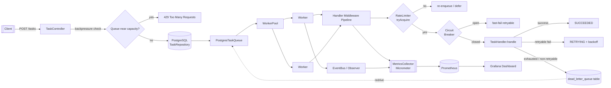
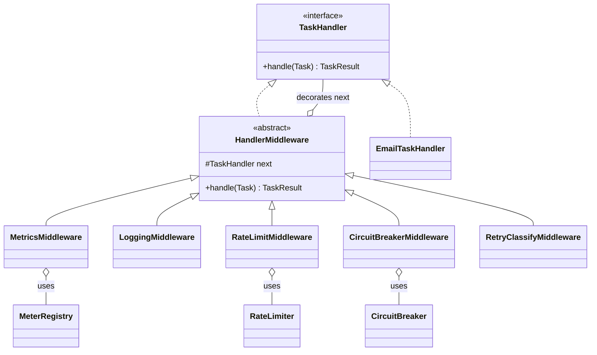
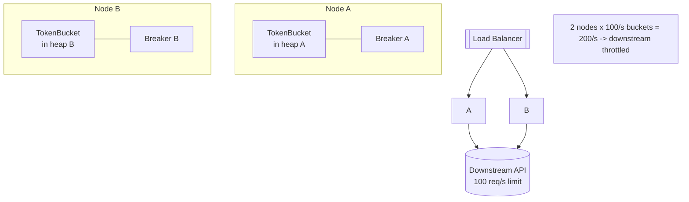

# Phase 3: Rate Limiting, Dead Letter Queue, and Metrics

> Where this fits: this is the third milestone of the **Distributed Task Queue and Event Processing Platform**. Phase 2 gave us durable storage (PostgreSQL + Flyway) and a REST API. Phase 3 turns that durable-but-naive system into something a team would actually run in production: it protects shared resources with **rate limiting**, stops poison messages from spinning forever with a **dead-letter queue (DLQ) + redrive**, makes handler behavior composable with a **decorator/middleware pipeline**, and finally makes everything observable with **Micrometer + Prometheus + Grafana** plus structured logging and tracing.

Phase 3 target architecture:

```text
Client -> API Layer -> Queue Layer -> Rate Limiter -> Worker Nodes -> Dead Letter Queue -> Metrics
```

By the end of this chapter you will have a single-node platform that is *production-shaped*. The cracks that remain — one rate-limiter bucket living in one JVM's heap, one Prometheus scraping one process, one DLQ table that only one node redrives — are exactly what motivates **[Phase 4](./phase-4.md)** (distributed brokers, event bus, horizontal scaling).

---

## 1. Goals and Scope

By the end of Phase 3 you can:

1. Throttle task execution per task `type` with a **token-bucket [rate limiter](../08-distributed-systems/rate-limiting.md)** so a flood of one task type cannot starve others or hammer a downstream API.
2. Route exhausted/poison tasks to a **[dead-letter queue](../07-queues-and-messaging/dead-letter-queues.md)** with a stored `reason`, and **redrive** them back into the main queue on demand.
3. Wrap every `TaskHandler` in a composable **middleware pipeline** built from the **[Decorator](../05-design-patterns/decorator.md)** and **[Chain of Responsibility](../05-design-patterns/chain-of-responsibility.md)** patterns: timing, logging, rate limiting, retry classification, circuit breaking.
4. Protect flaky downstreams with a **[circuit breaker](../08-distributed-systems/circuit-breakers.md)** (Resilience4j).
5. Apply **[backpressure](../08-distributed-systems/backpressure.md)** so the API rejects work when the queue is saturated instead of falling over.
6. Emit **metrics** (counters, timers, gauges) via Micrometer, scrape them with Prometheus, and visualize on a Grafana dashboard.
7. Emit **structured JSON logs** with a correlation/trace id and propagate that id through the worker via MDC.
8. Notify interested components of lifecycle changes through an **[Observer](../05-design-patterns/observer.md)**-based in-process event hook (the seed of the Phase 4 [EventBus](./phase-4.md)).

Non-goals for Phase 3 (deferred to Phase 4): distributed/shared rate limiting across nodes, a real broker (Kafka/RabbitMQ/Redis), cross-node event bus, and horizontal scaling. We will explicitly call out where the single-node design breaks.

---

## 2. Architecture



The crucial structural idea of Phase 3: **the `Worker` no longer calls `TaskHandler.handle` directly.** It calls the *head* of a middleware chain. Each middleware is itself a `TaskHandler` that decorates the next one. This is how cross-cutting concerns (timing, rate limiting, circuit breaking, logging) stay out of business handlers.



> The `o--` (aggregation) from `HandlerMiddleware` to `TaskHandler` is exactly the Decorator relationship: a middleware *has-a* next handler whose lifetime it does not own.

---

## 3. Why each piece exists (the real problems)

### 3.1 Rate limiting — protecting shared and downstream resources

In Phase 2 a worker pool of, say, 16 threads will execute up to 16 `send-email` tasks concurrently *forever*. If the email provider allows 100 requests/second and you suddenly enqueue 50,000 emails, you will:

- get throttled (HTTP 429) or banned by the provider,
- burn retries on tasks that were never going to succeed *right now*,
- and starve every other task type because all workers are stuck on email.

A **token-bucket** rate limiter caps the *rate* (tokens/second) while allowing short **bursts** (bucket capacity). It is the standard algorithm because it is O(1), lock-light, and burst-friendly. See [rate-limiting.md](../08-distributed-systems/rate-limiting.md) for the algorithm derivation.

### 3.2 Dead-letter queue — quarantine poison messages

A *poison* task is one that fails deterministically: malformed payload, a permanently deleted downstream record, a bug. Without a DLQ, the retry handler from Phase 2 will retry it `maxAttempts` times and then... what? In Phase 2 it just sat `FAILED`. A DLQ gives failed work a *home*: a separate table where it is quarantined with a human-readable `reason`, can be inspected, and can be **redriven** (replayed) after a fix. See [dead-letter-queues.md](../07-queues-and-messaging/dead-letter-queues.md) and [dlq.md](../08-distributed-systems/dlq.md).

### 3.3 Middleware pipeline — cross-cutting concerns without copy-paste

Timing, logging, metrics, rate limiting, and circuit breaking apply to *every* handler. If you paste them into each handler you get duplication and drift. The **Decorator** pattern lets you wrap a handler; **Chain of Responsibility** lets you order an arbitrary number of wrappers. The worker only sees one `TaskHandler`.

### 3.4 Metrics, logging, tracing — you cannot operate what you cannot see

Phase 2 had `System.out.println`. In production you need: counters (how many tasks succeeded/failed/dead-lettered), timers (handler latency percentiles), and gauges (queue depth, in-flight workers). Micrometer is the SLF4J-of-metrics: one API, many backends. Prometheus scrapes; Grafana visualizes. Structured logs + a trace id let you follow one task across the API and the worker.

---

## 4. Build order and module layout

We continue the Spring Boot 3 / Java 21 / Maven project from Phase 2. New packages:

```text
src/main/java/com/taskqueue/
  domain/            Task, TaskStatus, TaskResult, TaskHandler           (from Phase 1-2)
  queue/             TaskQueue, PostgresTaskQueue                        (from Phase 2)
  repo/              TaskRepository, JdbcTaskRepository                  (from Phase 2)
  worker/            Worker, WorkerPool                                  (from Phase 2, modified)
  retry/             RetryPolicy, ExponentialBackoffRetryPolicy         (from Phase 2)
  ratelimit/         RateLimiter, TokenBucketRateLimiter                 (NEW)
  dlq/               DeadLetterQueue, JdbcDeadLetterQueue, DlqController (NEW)
  pipeline/          HandlerMiddleware, MetricsMiddleware, LoggingMiddleware,
                     RateLimitMiddleware, CircuitBreakerMiddleware,
                     RetryClassifyMiddleware, HandlerPipelineFactory      (NEW)
  metrics/           MetricsCollector                                    (NEW)
  events/            TaskEvent, TaskEventListener, EventBus, SimpleEventBus (NEW seed for Phase 4)
  api/               TaskController, DlqController                       (modified / NEW)
  config/            PipelineConfig, MetricsConfig, RateLimitProperties  (NEW)
src/main/resources/
  db/migration/      V3__dead_letter_queue.sql                          (NEW)
  application.yml                                                        (modified)
```

New Maven dependencies (added to `pom.xml`):

```xml
<dependencies>
  <!-- Metrics: Micrometer core + Prometheus registry -->
  <dependency>
    <groupId>org.springframework.boot</groupId>
    <artifactId>spring-boot-starter-actuator</artifactId>
  </dependency>
  <dependency>
    <groupId>io.micrometer</groupId>
    <artifactId>micrometer-registry-prometheus</artifactId>
  </dependency>

  <!-- Circuit breaker -->
  <dependency>
    <groupId>io.github.resilience4j</groupId>
    <artifactId>resilience4j-circuitbreaker</artifactId>
    <version>2.2.0</version>
  </dependency>

  <!-- Structured JSON logging -->
  <dependency>
    <groupId>net.logstash.logback</groupId>
    <artifactId>logstash-logback-encoder</artifactId>
    <version>7.4</version>
  </dependency>

  <!-- Test: AssertJ, Mockito, Awaitility, Testcontainers (Phase 2 already pulled JUnit 5) -->
  <dependency>
    <groupId>org.awaitility</groupId>
    <artifactId>awaitility</artifactId>
    <version>4.2.1</version>
    <scope>test</scope>
  </dependency>
  <dependency>
    <groupId>org.testcontainers</groupId>
    <artifactId>postgresql</artifactId>
    <scope>test</scope>
  </dependency>
</dependencies>
```

---

## 5. Rate Limiting

### 5.1 The naive version (and why it is wrong)

A first instinct is "just sleep between tasks":

```java
// NAIVE: do not ship this.
public class SleepyWorker {
    public void run(Task task, TaskHandler handler) throws Exception {
        Thread.sleep(100); // "10 tasks/sec"
        handler.handle(task);
    }
}
```

Problems: it blocks the whole worker thread (a worker that could be doing other types sits idle), it is not burst-friendly, the rate is per-thread not per-type, and `10/sec` is a lie because handler latency varies. We need a real limiter that is cheap to *test* (`tryAcquire()` returns immediately) and shared across workers per task type.

### 5.2 The interface (canonical model)

```java
package com.taskqueue.ratelimit;

/**
 * Non-blocking rate limiter. tryAcquire() returns true if a permit was granted,
 * false otherwise. Callers decide what to do on refusal (defer, reject, requeue).
 */
public interface RateLimiter {
    boolean tryAcquire();

    /** Convenience: try to take {@code permits} at once (default one-at-a-time). */
    default boolean tryAcquire(int permits) {
        for (int i = 0; i < permits; i++) {
            if (!tryAcquire()) return false;
        }
        return true;
    }
}
```

### 5.3 Production-quality `TokenBucketRateLimiter`

A correct token bucket must be **thread-safe** (many workers call it) and must refill **lazily** based on elapsed nanos rather than running a background thread. We use `AtomicLong`-backed compare-and-set so there are no locks on the hot path. See [atomics-and-thread-safety.md](../06-concurrency/atomics-and-thread-safety.md).

```java
package com.taskqueue.ratelimit;

import java.time.Duration;
import java.util.concurrent.atomic.AtomicReference;

/**
 * Lazy, lock-free token bucket.
 *
 * capacity     = max burst size (tokens the bucket can hold)
 * refillPerSec = sustained rate (tokens added per second)
 *
 * Tokens are stored scaled by 1e9 so we can refill with nanosecond precision
 * without floating point in the CAS state.
 */
public final class TokenBucketRateLimiter implements RateLimiter {

    private record State(double tokens, long lastRefillNanos) {}

    private final double capacity;
    private final double refillPerNano;
    private final AtomicReference<State> state;

    public TokenBucketRateLimiter(double capacity, double refillPerSecond) {
        if (capacity <= 0 || refillPerSecond <= 0) {
            throw new IllegalArgumentException("capacity and rate must be > 0");
        }
        this.capacity = capacity;
        this.refillPerNano = refillPerSecond / 1_000_000_000.0;
        this.state = new AtomicReference<>(new State(capacity, System.nanoTime()));
    }

    public static TokenBucketRateLimiter perSecond(int rate, int burst) {
        return new TokenBucketRateLimiter(burst, rate);
    }

    @Override
    public boolean tryAcquire() {
        while (true) {
            State current = state.get();
            long now = System.nanoTime();
            double refilled = Math.min(
                    capacity,
                    current.tokens() + (now - current.lastRefillNanos()) * refillPerNano);

            if (refilled < 1.0) {
                return false; // not enough; do not mutate state needlessly
            }
            State next = new State(refilled - 1.0, now);
            if (state.compareAndSet(current, next)) {
                return true;
            }
            // CAS lost a race with another worker; retry.
        }
    }

    /** Visible for tests / metrics. Approximate; recomputed lazily. */
    public double availableTokens() {
        State s = state.get();
        long now = System.nanoTime();
        return Math.min(capacity, s.tokens() + (now - s.lastRefillNanos()) * refillPerNano);
    }

    public Duration timeUntilNextToken() {
        double avail = availableTokens();
        if (avail >= 1.0) return Duration.ZERO;
        double deficit = 1.0 - avail;
        return Duration.ofNanos((long) (deficit / refillPerNano));
    }
}
```

Why lock-free CAS over `synchronized`? Under a 16-worker pool all hammering one bucket, the `synchronized` version serializes every check. The CAS version only retries on actual contention and never blocks a worker. The tradeoff: on extreme contention CAS can spin; in practice the critical section is nanoseconds, so spins are rare.

### 5.4 Per-type limiters via a registry

We want a *separate* bucket per task `type`. A registry keyed by type, lazily creating buckets from config, fits naturally.

```java
package com.taskqueue.ratelimit;

import java.util.Map;
import java.util.concurrent.ConcurrentHashMap;

/** Holds one RateLimiter per task type. Thread-safe, lazily populated. */
public final class RateLimiterRegistry {

    private final Map<String, RateLimiter> limiters = new ConcurrentHashMap<>();
    private final RateLimiterFactory factory;

    public RateLimiterRegistry(RateLimiterFactory factory) {
        this.factory = factory;
    }

    public RateLimiter forType(String type) {
        return limiters.computeIfAbsent(type, factory::create);
    }

    @FunctionalInterface
    public interface RateLimiterFactory {
        RateLimiter create(String type);
    }
}
```

Config-driven rates (`application.yml`):

```yaml
taskqueue:
  ratelimit:
    default-rate-per-second: 50
    default-burst: 100
    overrides:
      send-email: { rate-per-second: 10, burst: 20 }
      generate-report: { rate-per-second: 2, burst: 2 }
```

```java
package com.taskqueue.config;

import org.springframework.boot.context.properties.ConfigurationProperties;
import java.util.HashMap;
import java.util.Map;

@ConfigurationProperties(prefix = "taskqueue.ratelimit")
public class RateLimitProperties {
    public record Limit(int ratePerSecond, int burst) {}

    private int defaultRatePerSecond = 50;
    private int defaultBurst = 100;
    private Map<String, Limit> overrides = new HashMap<>();

    public Limit limitFor(String type) {
        return overrides.getOrDefault(type, new Limit(defaultRatePerSecond, defaultBurst));
    }
    // getters/setters omitted for brevity (Spring needs them)
    public void setDefaultRatePerSecond(int v) { this.defaultRatePerSecond = v; }
    public void setDefaultBurst(int v) { this.defaultBurst = v; }
    public void setOverrides(Map<String, Limit> v) { this.overrides = v; }
    public int getDefaultRatePerSecond() { return defaultRatePerSecond; }
    public int getDefaultBurst() { return defaultBurst; }
    public Map<String, Limit> getOverrides() { return overrides; }
}
```

---

## 6. Dead Letter Queue + Redrive

### 6.1 Migration

```sql
-- src/main/resources/db/migration/V3__dead_letter_queue.sql
CREATE TABLE dead_letter_queue (
    id            UUID PRIMARY KEY,
    task_id       UUID         NOT NULL,
    type          TEXT         NOT NULL,
    payload       TEXT         NOT NULL,
    attempts      INT          NOT NULL,
    max_attempts  INT          NOT NULL,
    reason        TEXT         NOT NULL,
    failed_at     TIMESTAMPTZ  NOT NULL DEFAULT now(),
    redriven_at   TIMESTAMPTZ
);

CREATE INDEX idx_dlq_type        ON dead_letter_queue (type);
CREATE INDEX idx_dlq_failed_at   ON dead_letter_queue (failed_at);
CREATE INDEX idx_dlq_not_redriven ON dead_letter_queue (redriven_at) WHERE redriven_at IS NULL;
```

We keep a *copy* of the task fields rather than a foreign key only, so the DLQ row remains meaningful even if the original `tasks` row is purged. We also store `attempts` so an operator sees how hard we tried.

### 6.2 Interface (canonical model)

```java
package com.taskqueue.dlq;

import com.taskqueue.domain.Task;

public interface DeadLetterQueue {
    /** Quarantine a task that can no longer be processed, recording why. */
    void send(Task t, String reason);
}
```

### 6.3 JDBC implementation + redrive support

```java
package com.taskqueue.dlq;

import com.taskqueue.domain.Task;
import com.taskqueue.domain.TaskStatus;
import org.springframework.jdbc.core.JdbcTemplate;
import org.springframework.stereotype.Component;

import java.time.Instant;
import java.util.List;
import java.util.UUID;

@Component
public class JdbcDeadLetterQueue implements DeadLetterQueue {

    private final JdbcTemplate jdbc;

    public JdbcDeadLetterQueue(JdbcTemplate jdbc) {
        this.jdbc = jdbc;
    }

    @Override
    public void send(Task t, String reason) {
        jdbc.update("""
            INSERT INTO dead_letter_queue
              (id, task_id, type, payload, attempts, max_attempts, reason, failed_at)
            VALUES (?,?,?,?,?,?,?,?)
            """,
            UUID.randomUUID(), UUID.fromString(t.id()), t.type(), t.payload(),
            t.attempts(), t.maxAttempts(), reason, java.sql.Timestamp.from(Instant.now()));
    }

    public List<DeadLetter> list(int limit) {
        return jdbc.query("""
            SELECT id, task_id, type, payload, attempts, max_attempts, reason, failed_at
            FROM dead_letter_queue
            WHERE redriven_at IS NULL
            ORDER BY failed_at DESC
            LIMIT ?
            """,
            (rs, n) -> new DeadLetter(
                rs.getString("id"), rs.getString("task_id"), rs.getString("type"),
                rs.getString("payload"), rs.getInt("attempts"), rs.getInt("max_attempts"),
                rs.getString("reason"), rs.getTimestamp("failed_at").toInstant()),
            limit);
    }

    /**
     * Rebuild a Task from a DLQ row, reset its status/attempts, and mark the DLQ
     * row redriven. Returns the resurrected Task to be re-enqueued by the caller.
     */
    public Task toRedriveTask(String dlqId) {
        DeadLetter dl = jdbc.queryForObject("""
            SELECT id, task_id, type, payload, attempts, max_attempts, reason, failed_at
            FROM dead_letter_queue WHERE id = ? AND redriven_at IS NULL
            """,
            (rs, n) -> new DeadLetter(
                rs.getString("id"), rs.getString("task_id"), rs.getString("type"),
                rs.getString("payload"), rs.getInt("attempts"), rs.getInt("max_attempts"),
                rs.getString("reason"), rs.getTimestamp("failed_at").toInstant()),
            UUID.fromString(dlqId));

        jdbc.update("UPDATE dead_letter_queue SET redriven_at = now() WHERE id = ?",
                UUID.fromString(dlqId));

        return new Task(
            dl.taskId(), dl.type(), dl.payload(),
            TaskStatus.PENDING, 0, dl.maxAttempts(),
            Instant.now(), Instant.now(), /* priority */ 0);
    }

    public record DeadLetter(
        String id, String taskId, String type, String payload,
        int attempts, int maxAttempts, String reason, Instant failedAt) {}
}
```

### 6.4 Redrive REST endpoint

```java
package com.taskqueue.api;

import com.taskqueue.dlq.JdbcDeadLetterQueue;
import com.taskqueue.dlq.JdbcDeadLetterQueue.DeadLetter;
import com.taskqueue.domain.Task;
import com.taskqueue.queue.TaskQueue;
import org.springframework.web.bind.annotation.*;

import java.util.List;
import java.util.Map;

@RestController
@RequestMapping("/dlq")
public class DlqController {

    private final JdbcDeadLetterQueue dlq;
    private final TaskQueue queue;

    public DlqController(JdbcDeadLetterQueue dlq, TaskQueue queue) {
        this.dlq = dlq;
        this.queue = queue;
    }

    @GetMapping
    public List<DeadLetter> list(@RequestParam(defaultValue = "50") int limit) {
        return dlq.list(Math.min(limit, 500));
    }

    /** Redrive a single dead letter back onto the main queue. */
    @PostMapping("/{id}/redrive")
    public Map<String, String> redrive(@PathVariable String id) {
        Task resurrected = dlq.toRedriveTask(id);
        queue.enqueue(resurrected);
        return Map.of("status", "requeued", "taskId", resurrected.id());
    }
}
```

> **Idempotency note.** Redrive re-enqueues with a fresh `attempts = 0`. Because the original `task_id` is preserved, downstream handlers should be **idempotent** (see [idempotency.md](../08-distributed-systems/idempotency.md)) so a redrive that partially succeeded earlier does not double-charge a customer. We deliberately keep the same `task_id` to make dedup possible.

---

## 7. The Handler Middleware Pipeline

This is the architectural heart of Phase 3. We model cross-cutting concerns as a chain of `TaskHandler` decorators.

### 7.1 Abstract base (Decorator + Chain of Responsibility)

```java
package com.taskqueue.pipeline;

import com.taskqueue.domain.Task;
import com.taskqueue.domain.TaskHandler;
import com.taskqueue.domain.TaskResult;

/**
 * A handler that wraps another handler. Each middleware decides whether/when to
 * call {@code next.handle(task)}. This is Decorator (structural wrapping) used as
 * a Chain of Responsibility (ordered, each may short-circuit).
 */
public abstract class HandlerMiddleware implements TaskHandler {

    protected final TaskHandler next;

    protected HandlerMiddleware(TaskHandler next) {
        this.next = next;
    }

    @Override
    public abstract TaskResult handle(Task task) throws Exception;
}
```

### 7.2 MetricsMiddleware (timer + counters)

```java
package com.taskqueue.pipeline;

import com.taskqueue.domain.Task;
import com.taskqueue.domain.TaskHandler;
import com.taskqueue.domain.TaskResult;
import io.micrometer.core.instrument.MeterRegistry;
import io.micrometer.core.instrument.Tags;
import io.micrometer.core.instrument.Timer;

public final class MetricsMiddleware extends HandlerMiddleware {

    private final MeterRegistry registry;

    public MetricsMiddleware(TaskHandler next, MeterRegistry registry) {
        super(next);
        this.registry = registry;
    }

    @Override
    public TaskResult handle(Task task) throws Exception {
        Timer.Sample sample = Timer.start(registry);
        String outcome = "error";
        try {
            TaskResult result = next.handle(task);
            outcome = result.success() ? "success" : (result.retryable() ? "retryable" : "failed");
            return result;
        } catch (Exception e) {
            outcome = "exception";
            throw e;
        } finally {
            sample.stop(registry.timer("task.handler.duration",
                    Tags.of("type", task.type(), "outcome", outcome)));
            registry.counter("task.handler.invocations",
                    Tags.of("type", task.type(), "outcome", outcome)).increment();
        }
    }
}
```

### 7.3 LoggingMiddleware (structured logging + MDC trace id)

```java
package com.taskqueue.pipeline;

import com.taskqueue.domain.Task;
import com.taskqueue.domain.TaskHandler;
import com.taskqueue.domain.TaskResult;
import org.slf4j.Logger;
import org.slf4j.LoggerFactory;
import org.slf4j.MDC;

public final class LoggingMiddleware extends HandlerMiddleware {

    private static final Logger log = LoggerFactory.getLogger("task.execution");

    public LoggingMiddleware(TaskHandler next) {
        super(next);
    }

    @Override
    public TaskResult handle(Task task) throws Exception {
        MDC.put("taskId", task.id());
        MDC.put("taskType", task.type());
        MDC.put("attempt", String.valueOf(task.attempts() + 1));
        long start = System.nanoTime();
        try {
            log.info("task.start");
            TaskResult result = next.handle(task);
            log.info("task.end success={} retryable={} message={}",
                    result.success(), result.retryable(), result.message());
            return result;
        } catch (Exception e) {
            log.error("task.exception class={} message={}",
                    e.getClass().getSimpleName(), e.getMessage(), e);
            throw e;
        } finally {
            log.info("task.duration_ms={}", (System.nanoTime() - start) / 1_000_000);
            MDC.clear();
        }
    }
}
```

### 7.4 RateLimitMiddleware (backpressure-aware)

```java
package com.taskqueue.pipeline;

import com.taskqueue.domain.Task;
import com.taskqueue.domain.TaskHandler;
import com.taskqueue.domain.TaskResult;
import com.taskqueue.ratelimit.RateLimiterRegistry;

/**
 * If no permit is available for this task type, return a RETRYABLE failure so the
 * retry/backoff machinery defers the task instead of executing it now. This is
 * cooperative backpressure: we slow execution without dropping work.
 */
public final class RateLimitMiddleware extends HandlerMiddleware {

    private final RateLimiterRegistry registry;

    public RateLimitMiddleware(TaskHandler next, RateLimiterRegistry registry) {
        super(next);
        this.registry = registry;
    }

    @Override
    public TaskResult handle(Task task) throws Exception {
        if (!registry.forType(task.type()).tryAcquire()) {
            return new TaskResult(false, "rate-limited:" + task.type(), /*retryable*/ true);
        }
        return next.handle(task);
    }
}
```

### 7.5 CircuitBreakerMiddleware (Resilience4j)

```java
package com.taskqueue.pipeline;

import com.taskqueue.domain.Task;
import com.taskqueue.domain.TaskHandler;
import com.taskqueue.domain.TaskResult;
import io.github.resilience4j.circuitbreaker.CallNotPermittedException;
import io.github.resilience4j.circuitbreaker.CircuitBreaker;
import io.github.resilience4j.circuitbreaker.CircuitBreakerRegistry;

/**
 * Wraps handler execution in a per-type circuit breaker. When a downstream is
 * failing repeatedly the breaker opens and we fast-fail with a retryable result,
 * giving the downstream time to recover instead of piling on load.
 */
public final class CircuitBreakerMiddleware extends HandlerMiddleware {

    private final CircuitBreakerRegistry registry;

    public CircuitBreakerMiddleware(TaskHandler next, CircuitBreakerRegistry registry) {
        super(next);
        this.registry = registry;
    }

    @Override
    public TaskResult handle(Task task) throws Exception {
        CircuitBreaker cb = registry.circuitBreaker(task.type());
        try {
            return cb.executeCallable(() -> next.handle(task));
        } catch (CallNotPermittedException open) {
            return new TaskResult(false, "circuit-open:" + task.type(), /*retryable*/ true);
        }
    }
}
```

### 7.6 RetryClassifyMiddleware (innermost, closest to the handler)

This is the boundary between "the business handler threw" and "what the worker should do." It converts exceptions into a `TaskResult` and decides retryability based on exception type.

```java
package com.taskqueue.pipeline;

import com.taskqueue.domain.Task;
import com.taskqueue.domain.TaskHandler;
import com.taskqueue.domain.TaskResult;

import java.io.IOException;

public final class RetryClassifyMiddleware extends HandlerMiddleware {

    public RetryClassifyMiddleware(TaskHandler next) {
        super(next);
    }

    @Override
    public TaskResult handle(Task task) throws Exception {
        try {
            return next.handle(task);
        } catch (IllegalArgumentException | NullPointerException bug) {
            // Deterministic programmer/data error: never retry; straight to DLQ.
            return new TaskResult(false, "non-retryable:" + bug.getMessage(), false);
        } catch (IOException | java.net.SocketTimeoutException transient_) {
            // Transient I/O: worth retrying.
            return new TaskResult(false, "transient:" + transient_.getMessage(), true);
        }
        // Any other exception propagates and is treated as retryable by the Worker.
    }
}
```

### 7.7 Assembling the chain (factory + ordering)

Order matters. From outermost (runs first) to innermost (closest to handler):

```text
Logging -> Metrics -> RateLimit -> CircuitBreaker -> RetryClassify -> EmailTaskHandler
```

Rationale: we want logging/metrics to observe *everything*, including rate-limit refusals and open circuits. Rate limiting comes before the circuit breaker because there is no point asking the breaker if we are already shedding load. Retry classification is innermost so it only sees exceptions the real handler threw.

```java
package com.taskqueue.pipeline;

import com.taskqueue.domain.TaskHandler;
import com.taskqueue.ratelimit.RateLimiterRegistry;
import io.github.resilience4j.circuitbreaker.CircuitBreakerRegistry;
import io.micrometer.core.instrument.MeterRegistry;

public final class HandlerPipelineFactory {

    private final MeterRegistry meters;
    private final RateLimiterRegistry rateLimiters;
    private final CircuitBreakerRegistry breakers;

    public HandlerPipelineFactory(MeterRegistry meters,
                                  RateLimiterRegistry rateLimiters,
                                  CircuitBreakerRegistry breakers) {
        this.meters = meters;
        this.rateLimiters = rateLimiters;
        this.breakers = breakers;
    }

    /** Wrap a business handler with the full middleware chain. */
    public TaskHandler wrap(TaskHandler businessHandler) {
        TaskHandler chain = new RetryClassifyMiddleware(businessHandler);
        chain = new CircuitBreakerMiddleware(chain, breakers);
        chain = new RateLimitMiddleware(chain, rateLimiters);
        chain = new MetricsMiddleware(chain, meters);
        chain = new LoggingMiddleware(chain);
        return chain;
    }
}
```

Because each wrapper is constructed inside-out, the *last* one constructed (`LoggingMiddleware`) is the *outermost* and runs first. Reading the `wrap` method top-to-bottom gives you the chain in reverse execution order — a common gotcha worth a code comment.

---

## 8. Wiring it into the Worker

The Phase 2 `Worker` looked up a raw handler and called it. Now it looks up the *wrapped* handler and interprets the `TaskResult` to drive status transitions, retries, and DLQ routing.

```java
package com.taskqueue.worker;

import com.taskqueue.domain.*;
import com.taskqueue.dlq.DeadLetterQueue;
import com.taskqueue.events.EventBus;
import com.taskqueue.events.TaskEvent;
import com.taskqueue.queue.TaskQueue;
import com.taskqueue.repo.TaskRepository;
import com.taskqueue.retry.RetryPolicy;

import java.time.Duration;
import java.time.Instant;
import java.util.Map;
import java.util.Optional;

public final class Worker implements Runnable {

    private final TaskQueue queue;
    private final TaskRepository repo;
    private final DeadLetterQueue dlq;
    private final RetryPolicy retryPolicy;
    private final EventBus events;
    /** type -> fully-wrapped (middleware) handler. */
    private final Map<String, TaskHandler> handlers;
    private volatile boolean running = true;

    public Worker(TaskQueue queue, TaskRepository repo, DeadLetterQueue dlq,
                  RetryPolicy retryPolicy, EventBus events,
                  Map<String, TaskHandler> wrappedHandlers) {
        this.queue = queue;
        this.repo = repo;
        this.dlq = dlq;
        this.retryPolicy = retryPolicy;
        this.events = events;
        this.handlers = wrappedHandlers;
    }

    public void stop() { running = false; }

    @Override
    public void run() {
        while (running && !Thread.currentThread().isInterrupted()) {
            Task task;
            try {
                task = queue.dequeue();           // blocks
            } catch (InterruptedException e) {
                Thread.currentThread().interrupt();
                return;
            }
            process(task);
        }
    }

    private void process(Task task) {
        TaskHandler handler = handlers.get(task.type());
        if (handler == null) {
            dlq.send(task, "no-handler-for-type:" + task.type());
            repo.save(task.withStatus(TaskStatus.DEAD));
            events.publish(TaskEvent.deadLettered(task, "no-handler"));
            return;
        }

        Task running = task.withStatus(TaskStatus.RUNNING);
        repo.save(running);
        events.publish(TaskEvent.started(running));

        TaskResult result;
        try {
            result = handler.handle(running);
        } catch (Exception e) {
            result = new TaskResult(false, e.getClass().getSimpleName() + ":" + e.getMessage(), true);
        }

        if (result.success()) {
            repo.save(running.withStatus(TaskStatus.SUCCEEDED));
            events.publish(TaskEvent.succeeded(running));
            return;
        }

        // failure: retry or dead-letter
        Task attempted = running.incrementAttempts();
        boolean exhausted = attempted.attempts() >= attempted.maxAttempts();

        if (!result.retryable() || exhausted) {
            String reason = !result.retryable()
                    ? "non-retryable: " + result.message()
                    : "exhausted after " + attempted.attempts() + " attempts: " + result.message();
            dlq.send(attempted, reason);
            repo.save(attempted.withStatus(TaskStatus.DEAD));
            events.publish(TaskEvent.deadLettered(attempted, reason));
            return;
        }

        Optional<Duration> delay = retryPolicy.nextDelay(attempted.attempts());
        Instant when = Instant.now().plus(delay.orElse(Duration.ZERO));
        Task retrying = attempted.withStatus(TaskStatus.RETRYING).withScheduledAt(when);
        repo.save(retrying);
        events.publish(TaskEvent.retrying(retrying, delay.orElse(Duration.ZERO)));
        // The scheduler / pollDue loop will re-surface it when scheduledAt is due.
    }
}
```

> This assumes the canonical `Task` is an immutable record with `withStatus`, `withScheduledAt`, and `incrementAttempts` helper methods (introduced in Phase 2). If your `Task` is a plain record without them, add small `with*` copy methods — never mutate a `Task` in place, because it may be referenced by the queue and the repo simultaneously. See [immutable-objects.md](../03-java-memory-model/immutable-objects.md).

---

## 9. The Observer seed: in-process EventBus

Phase 4 will turn this into a real, possibly cross-process bus. For Phase 3 we use a synchronous in-process Observer so metrics and (later) listeners can react to lifecycle changes without the worker knowing who is listening.

```java
package com.taskqueue.events;

import com.taskqueue.domain.Task;
import java.time.Duration;

public sealed interface TaskEvent {
    String taskId();
    String type();

    record Started(String taskId, String type) implements TaskEvent {}
    record Succeeded(String taskId, String type) implements TaskEvent {}
    record Retrying(String taskId, String type, Duration delay) implements TaskEvent {}
    record DeadLettered(String taskId, String type, String reason) implements TaskEvent {}

    static TaskEvent started(Task t)              { return new Started(t.id(), t.type()); }
    static TaskEvent succeeded(Task t)            { return new Succeeded(t.id(), t.type()); }
    static TaskEvent retrying(Task t, Duration d) { return new Retrying(t.id(), t.type(), d); }
    static TaskEvent deadLettered(Task t, String r) { return new DeadLettered(t.id(), t.type(), r); }
}
```

```java
package com.taskqueue.events;

@FunctionalInterface
public interface TaskEventListener {
    void onEvent(TaskEvent event);
}
```

```java
package com.taskqueue.events;

public interface EventBus {
    void publish(TaskEvent e);
    void subscribe(TaskEventListener l);
}
```

```java
package com.taskqueue.events;

import org.slf4j.Logger;
import org.slf4j.LoggerFactory;

import java.util.List;
import java.util.concurrent.CopyOnWriteArrayList;

/** Synchronous fan-out. CopyOnWriteArrayList: rare writes (subscribe), hot reads (publish). */
public final class SimpleEventBus implements EventBus {

    private static final Logger log = LoggerFactory.getLogger(SimpleEventBus.class);
    private final List<TaskEventListener> listeners = new CopyOnWriteArrayList<>();

    @Override
    public void publish(TaskEvent e) {
        for (TaskEventListener l : listeners) {
            try {
                l.onEvent(e);
            } catch (RuntimeException ex) {
                // One bad listener must not break the worker or other listeners.
                log.warn("listener failed for event {}", e, ex);
            }
        }
    }

    @Override
    public void subscribe(TaskEventListener l) {
        listeners.add(l);
    }
}
```

A metrics listener subscribes to translate events into gauges/counters that the middleware does not cover (e.g. dead-letter rate by reason):

```java
package com.taskqueue.metrics;

import com.taskqueue.events.EventBus;
import com.taskqueue.events.TaskEvent;
import io.micrometer.core.instrument.MeterRegistry;
import io.micrometer.core.instrument.Tags;
import org.springframework.stereotype.Component;

import jakarta.annotation.PostConstruct;

@Component
public final class MetricsCollector {

    private final MeterRegistry registry;
    private final EventBus eventBus;

    public MetricsCollector(MeterRegistry registry, EventBus eventBus) {
        this.registry = registry;
        this.eventBus = eventBus;
    }

    @PostConstruct
    void wire() {
        eventBus.subscribe(this::record);
    }

    private void record(TaskEvent e) {
        switch (e) {
            case TaskEvent.Started s ->
                registry.counter("task.lifecycle", Tags.of("event", "started", "type", s.type())).increment();
            case TaskEvent.Succeeded s ->
                registry.counter("task.lifecycle", Tags.of("event", "succeeded", "type", s.type())).increment();
            case TaskEvent.Retrying r ->
                registry.counter("task.lifecycle", Tags.of("event", "retrying", "type", r.type())).increment();
            case TaskEvent.DeadLettered d ->
                registry.counter("task.deadletter", Tags.of("type", d.type(), "reason", classify(d.reason()))).increment();
        }
    }

    /** Collapse free-text reasons into a low-cardinality tag to avoid metric explosion. */
    private static String classify(String reason) {
        if (reason.startsWith("non-retryable")) return "non_retryable";
        if (reason.startsWith("exhausted"))     return "exhausted";
        if (reason.startsWith("no-handler"))    return "no_handler";
        return "other";
    }
}
```

> **Cardinality is a production trap.** Never tag a metric with the raw `taskId` or a free-text reason — Prometheus creates one time series per unique tag combination and will OOM. We bucket reasons into a handful of values. Same rule applies to `type`: keep the set of task types bounded.

---

## 10. Backpressure at the API edge

A durable queue can still be overwhelmed if producers outrun consumers forever. We expose queue depth as a gauge and reject new submissions when the backlog crosses a high-water mark, returning HTTP 429 so well-behaved clients back off. See [backpressure.md](../08-distributed-systems/backpressure.md).

```java
package com.taskqueue.api;

import com.taskqueue.domain.Task;
import com.taskqueue.domain.TaskStatus;
import com.taskqueue.queue.TaskQueue;
import com.taskqueue.repo.TaskRepository;
import io.micrometer.core.instrument.MeterRegistry;
import org.springframework.http.HttpStatus;
import org.springframework.http.ResponseEntity;
import org.springframework.web.bind.annotation.*;

import java.time.Instant;
import java.util.Optional;
import java.util.UUID;

@RestController
@RequestMapping("/tasks")
public class TaskController {

    private static final int QUEUE_HIGH_WATER_MARK = 10_000;

    private final TaskQueue queue;
    private final TaskRepository repo;

    public TaskController(TaskQueue queue, TaskRepository repo, MeterRegistry registry) {
        this.queue = queue;
        this.repo = repo;
        // queue depth gauge: continuously reflects size() — perfect gauge use case.
        registry.gauge("task.queue.depth", queue, q -> (double) q.size());
    }

    public record SubmitRequest(String type, String payload, Integer priority, Integer maxAttempts) {}

    @PostMapping
    public ResponseEntity<?> submit(@RequestBody SubmitRequest req) {
        if (queue.size() >= QUEUE_HIGH_WATER_MARK) {
            return ResponseEntity.status(HttpStatus.TOO_MANY_REQUESTS)
                    .header("Retry-After", "5")
                    .body("queue saturated, retry later");
        }
        Task task = new Task(
            UUID.randomUUID().toString(), req.type(), req.payload(),
            TaskStatus.PENDING, 0,
            req.maxAttempts() == null ? 5 : req.maxAttempts(),
            Instant.now(), Instant.now(),
            req.priority() == null ? 0 : req.priority());
        repo.save(task);
        queue.enqueue(task);
        return ResponseEntity.status(HttpStatus.ACCEPTED).body(task);
    }

    @GetMapping("/{id}")
    public ResponseEntity<Task> get(@PathVariable String id) {
        Optional<Task> found = repo.findById(id);
        return found.map(ResponseEntity::ok).orElseGet(() -> ResponseEntity.notFound().build());
    }
}
```

---

## 11. Spring configuration: building the registries and the pipeline

```java
package com.taskqueue.config;

import com.taskqueue.events.EventBus;
import com.taskqueue.events.SimpleEventBus;
import com.taskqueue.pipeline.HandlerPipelineFactory;
import com.taskqueue.ratelimit.*;
import io.github.resilience4j.circuitbreaker.CircuitBreakerConfig;
import io.github.resilience4j.circuitbreaker.CircuitBreakerRegistry;
import io.micrometer.core.instrument.MeterRegistry;
import org.springframework.boot.context.properties.EnableConfigurationProperties;
import org.springframework.context.annotation.Bean;
import org.springframework.context.annotation.Configuration;

import java.time.Duration;

@Configuration
@EnableConfigurationProperties(RateLimitProperties.class)
public class PipelineConfig {

    @Bean
    EventBus eventBus() {
        return new SimpleEventBus();
    }

    @Bean
    RateLimiterRegistry rateLimiterRegistry(RateLimitProperties props) {
        return new RateLimiterRegistry(type -> {
            RateLimitProperties.Limit l = props.limitFor(type);
            return TokenBucketRateLimiter.perSecond(l.ratePerSecond(), l.burst());
        });
    }

    @Bean
    CircuitBreakerRegistry circuitBreakerRegistry() {
        CircuitBreakerConfig cfg = CircuitBreakerConfig.custom()
                .failureRateThreshold(50)                       // open at 50% failures
                .slowCallRateThreshold(80)
                .slowCallDurationThreshold(Duration.ofSeconds(2))
                .waitDurationInOpenState(Duration.ofSeconds(10)) // try half-open after 10s
                .permittedNumberOfCallsInHalfOpenState(3)
                .slidingWindowSize(20)
                .build();
        return CircuitBreakerRegistry.of(cfg);
    }

    @Bean
    HandlerPipelineFactory handlerPipelineFactory(MeterRegistry meters,
                                                  RateLimiterRegistry rateLimiters,
                                                  CircuitBreakerRegistry breakers) {
        return new HandlerPipelineFactory(meters, rateLimiters, breakers);
    }
}
```

The `WorkerPool` wires raw business handlers through the factory at startup:

```java
package com.taskqueue.worker;

import com.taskqueue.domain.TaskHandler;
import com.taskqueue.pipeline.HandlerPipelineFactory;

import java.util.HashMap;
import java.util.Map;
import java.util.concurrent.*;

public final class WorkerPool {

    private final ExecutorService executor;
    private final int size;
    private final Worker prototype; // supplies dependencies; one Worker instance per thread is created below

    private final java.util.List<Worker> workers = new java.util.ArrayList<>();

    public WorkerPool(int size, java.util.function.Supplier<Worker> workerSupplier) {
        this.size = size;
        this.prototype = null;
        // Virtual threads: cheap, and our workers block on dequeue(). See ../06-concurrency/threads.md
        this.executor = Executors.newThreadPerTaskExecutor(
                Thread.ofVirtual().name("worker-", 0).factory());
        for (int i = 0; i < size; i++) {
            workers.add(workerSupplier.get());
        }
    }

    public void start() {
        workers.forEach(executor::submit);
    }

    public void shutdown() {
        workers.forEach(Worker::stop);
        executor.shutdownNow();
        try {
            if (!executor.awaitTermination(10, TimeUnit.SECONDS)) {
                // log: workers did not drain in time
            }
        } catch (InterruptedException e) {
            Thread.currentThread().interrupt();
        }
    }

    /** Helper: build the type->wrapped-handler map once, shared by all workers. */
    public static Map<String, TaskHandler> wrapAll(Map<String, TaskHandler> business,
                                                    HandlerPipelineFactory factory) {
        Map<String, TaskHandler> wrapped = new HashMap<>();
        business.forEach((type, h) -> wrapped.put(type, factory.wrap(h)));
        return Map.copyOf(wrapped);
    }
}
```

---

## 12. Metrics: actuator, Prometheus, Grafana

### 12.1 Expose the Prometheus endpoint

```yaml
# application.yml
management:
  endpoints:
    web:
      exposure:
        include: health, info, prometheus, metrics
  metrics:
    tags:
      application: task-queue
      phase: "3"
  endpoint:
    prometheus:
      access: read_only
```

Now `GET /actuator/prometheus` returns text like:

```text
# HELP task_handler_duration_seconds
# TYPE task_handler_duration_seconds summary
task_handler_duration_seconds_count{type="send-email",outcome="success",application="task-queue"} 1432.0
task_handler_duration_seconds_sum{type="send-email",outcome="success",application="task-queue"} 18.7
task_queue_depth{application="task-queue"} 42.0
task_deadletter_total{type="send-email",reason="exhausted"} 7.0
```

### 12.2 Prometheus scrape config

```yaml
# prometheus.yml
global:
  scrape_interval: 5s
scrape_configs:
  - job_name: task-queue
    metrics_path: /actuator/prometheus
    static_configs:
      - targets: ["host.docker.internal:8080"]
```

### 12.3 docker-compose for the observability stack

```yaml
# docker-compose.observability.yml
services:
  prometheus:
    image: prom/prometheus:v2.54.1
    volumes:
      - ./prometheus.yml:/etc/prometheus/prometheus.yml:ro
    ports: ["9090:9090"]
  grafana:
    image: grafana/grafana:11.2.0
    environment:
      GF_SECURITY_ADMIN_PASSWORD: admin
      GF_AUTH_ANONYMOUS_ENABLED: "true"
    ports: ["3000:3000"]
    depends_on: [prometheus]
```

### 12.4 A starter Grafana dashboard (PromQL panels)

Import these queries as panels (Grafana > New Dashboard > Add visualization):

```text
# Throughput (tasks/sec by outcome)
sum(rate(task_handler_invocations_total[1m])) by (outcome)

# p95 handler latency per type
histogram_quantile(0.95, sum(rate(task_handler_duration_seconds_bucket[5m])) by (le, type))

# Queue depth (gauge)
task_queue_depth

# Dead-letter rate (per 5m) by reason
sum(rate(task_deadletter_total[5m])) by (reason)

# Rate-limited refusals
sum(rate(task_handler_invocations_total{outcome="retryable"}[1m])) by (type)

# Circuit breaker state (Resilience4j auto-exports this)
resilience4j_circuitbreaker_state
```

> To get true latency *histograms* (for `histogram_quantile`), enable percentile histograms on the timer:
> ```java
> registry.config().meterFilter(
>     io.micrometer.core.instrument.config.MeterFilter.maxExpected(
>         "task.handler.duration", Duration.ofSeconds(10)));
> // or per-meter: Timer.builder("task.handler.duration").publishPercentileHistogram()
> ```

---

## 13. Structured logging and tracing

Replace the default Logback pattern with JSON so logs are machine-parseable and the MDC fields (`taskId`, `taskType`, `attempt`) become first-class keys.

```xml
<!-- src/main/resources/logback-spring.xml -->
<configuration>
  <appender name="JSON" class="ch.qos.logback.core.ConsoleAppender">
    <encoder class="net.logstash.logback.encoder.LogstashEncoder">
      <includeMdcKeyName>taskId</includeMdcKeyName>
      <includeMdcKeyName>taskType</includeMdcKeyName>
      <includeMdcKeyName>attempt</includeMdcKeyName>
      <includeMdcKeyName>traceId</includeMdcKeyName>
    </encoder>
  </appender>
  <root level="INFO">
    <appender-ref ref="JSON"/>
  </root>
</configuration>
```

For end-to-end tracing, add a filter that assigns or propagates a `traceId` on the inbound HTTP request and stores it in MDC; the `LoggingMiddleware` already reads MDC, but we set the trace id at the *boundary*:

```java
package com.taskqueue.api;

import jakarta.servlet.*;
import jakarta.servlet.http.HttpServletRequest;
import org.slf4j.MDC;
import org.springframework.stereotype.Component;

import java.io.IOException;
import java.util.UUID;

@Component
public class TraceIdFilter implements Filter {
    @Override
    public void doFilter(ServletRequest req, ServletResponse res, FilterChain chain)
            throws IOException, ServletException {
        String incoming = ((HttpServletRequest) req).getHeader("X-Trace-Id");
        String traceId = (incoming == null || incoming.isBlank()) ? UUID.randomUUID().toString() : incoming;
        MDC.put("traceId", traceId);
        try {
            chain.doFilter(req, res);
        } finally {
            MDC.clear();
        }
    }
}
```

> **Caveat that motivates Phase 4:** the API thread sets `traceId`, but the *worker* runs on a different thread (often much later, after the task sat in PostgreSQL). MDC does not cross threads. To truly trace a task from submission to execution we must persist the `traceId` *on the task* (a column) and re-establish it in the worker. We store it in the payload/metadata in Phase 3 and promote it to a real distributed trace context (W3C `traceparent`) in [Phase 4](./phase-4.md).

---

## 14. How to run it

```bash
# 1. Start Postgres (from Phase 2) + observability stack
docker compose -f docker-compose.yml -f docker-compose.observability.yml up -d

# 2. Run migrations + app
./mvnw spring-boot:run

# 3. Submit a burst of tasks (watch rate limiting kick in)
for i in $(seq 1 500); do
  curl -s -X POST localhost:8080/tasks \
    -H 'Content-Type: application/json' \
    -d '{"type":"send-email","payload":"{\"to\":\"a@b.com\"}","maxAttempts":3}' >/dev/null
done

# 4. Watch metrics
curl -s localhost:8080/actuator/prometheus | grep task_

# 5. Inspect the DLQ
curl -s 'localhost:8080/dlq?limit=20' | jq .

# 6. Redrive one dead letter
curl -s -X POST localhost:8080/dlq/<dlq-id>/redrive | jq .

# 7. Open dashboards
open http://localhost:9090   # Prometheus
open http://localhost:3000   # Grafana (admin/admin)
```

---

## 15. Tests

### 15.1 Unit: token bucket honors rate and burst

```java
package com.taskqueue.ratelimit;

import org.junit.jupiter.api.Test;
import static org.assertj.core.api.Assertions.assertThat;

class TokenBucketRateLimiterTest {

    @Test
    void allowsBurstThenThrottles() {
        // burst=5, rate=1/sec -> 5 immediate, then refusals until refill
        var limiter = TokenBucketRateLimiter.perSecond(1, 5);

        int granted = 0;
        for (int i = 0; i < 20; i++) {
            if (limiter.tryAcquire()) granted++;
        }
        assertThat(granted).isEqualTo(5); // exactly the burst
    }

    @Test
    void refillsOverTime() throws InterruptedException {
        var limiter = TokenBucketRateLimiter.perSecond(100, 1); // 100/sec, tiny burst
        assertThat(limiter.tryAcquire()).isTrue();
        assertThat(limiter.tryAcquire()).isFalse();
        Thread.sleep(50); // ~5 tokens refilled
        assertThat(limiter.tryAcquire()).isTrue();
    }
}
```

### 15.2 Concurrency: bucket never over-grants under contention

```java
package com.taskqueue.ratelimit;

import org.junit.jupiter.api.Test;
import java.util.concurrent.*;
import java.util.concurrent.atomic.AtomicInteger;
import static org.assertj.core.api.Assertions.assertThat;

class TokenBucketConcurrencyTest {

    @Test
    void neverGrantsMoreThanCapacityUnderRace() throws InterruptedException {
        int capacity = 100;
        var limiter = new TokenBucketRateLimiter(capacity, /*rate*/ 0.0001); // negligible refill
        var granted = new AtomicInteger();
        int threads = 32;
        var pool = Executors.newFixedThreadPool(threads);
        var start = new CountDownLatch(1);
        var done = new CountDownLatch(threads);

        for (int t = 0; t < threads; t++) {
            pool.submit(() -> {
                try {
                    start.await();
                    for (int i = 0; i < 1000; i++) {
                        if (limiter.tryAcquire()) granted.incrementAndGet();
                    }
                } catch (InterruptedException ignored) {
                } finally {
                    done.countDown();
                }
            });
        }
        start.countDown();
        done.await(5, TimeUnit.SECONDS);
        pool.shutdownNow();

        // With near-zero refill, total grants must not exceed initial capacity.
        assertThat(granted.get()).isLessThanOrEqualTo(capacity);
    }
}
```

### 15.3 Pipeline: middleware ordering and short-circuit

```java
package com.taskqueue.pipeline;

import com.taskqueue.domain.*;
import com.taskqueue.ratelimit.*;
import io.github.resilience4j.circuitbreaker.CircuitBreakerRegistry;
import io.micrometer.core.instrument.simple.SimpleMeterRegistry;
import org.junit.jupiter.api.Test;

import java.time.Instant;
import java.util.concurrent.atomic.AtomicInteger;
import static org.assertj.core.api.Assertions.assertThat;

class HandlerPipelineFactoryTest {

    private Task task(String type) {
        return new Task("11111111-1111-1111-1111-111111111111", type, "{}",
                TaskStatus.PENDING, 0, 3, Instant.now(), Instant.now(), 0);
    }

    @Test
    void rateLimitShortCircuitsHandler() throws Exception {
        var meters = new SimpleMeterRegistry();
        var calls = new AtomicInteger();
        TaskHandler business = t -> { calls.incrementAndGet(); return new TaskResult(true, "ok", false); };

        // burst of exactly 1
        var rl = new RateLimiterRegistry(type -> TokenBucketRateLimiter.perSecond(1, 1));
        var cbs = CircuitBreakerRegistry.ofDefaults();
        var factory = new HandlerPipelineFactory(meters, rl, cbs);
        TaskHandler chain = factory.wrap(business);

        TaskResult first = chain.handle(task("send-email"));
        TaskResult second = chain.handle(task("send-email"));

        assertThat(first.success()).isTrue();
        assertThat(second.success()).isFalse();
        assertThat(second.retryable()).isTrue();
        assertThat(second.message()).startsWith("rate-limited");
        assertThat(calls.get()).isEqualTo(1); // handler not invoked on the refused call

        // metrics middleware still recorded both invocations
        assertThat(meters.find("task.handler.invocations").counters()).isNotEmpty();
    }

    @Test
    void nonRetryableExceptionGoesToDlqViaResult() throws Exception {
        var meters = new SimpleMeterRegistry();
        TaskHandler business = t -> { throw new IllegalArgumentException("bad payload"); };
        var rl = new RateLimiterRegistry(type -> TokenBucketRateLimiter.perSecond(100, 100));
        var factory = new HandlerPipelineFactory(meters, rl, CircuitBreakerRegistry.ofDefaults());

        TaskResult r = factory.wrap(business).handle(task("send-email"));

        assertThat(r.success()).isFalse();
        assertThat(r.retryable()).isFalse(); // RetryClassifyMiddleware classified it
        assertThat(r.message()).contains("non-retryable");
    }
}
```

### 15.4 Integration: DLQ + redrive against real Postgres (Testcontainers)

```java
package com.taskqueue.dlq;

import com.taskqueue.domain.*;
import org.junit.jupiter.api.*;
import org.springframework.jdbc.core.JdbcTemplate;
import org.springframework.jdbc.datasource.DriverManagerDataSource;
import org.testcontainers.containers.PostgreSQLContainer;
import org.testcontainers.junit.jupiter.*;

import java.time.Instant;
import static org.assertj.core.api.Assertions.assertThat;

@Testcontainers
class JdbcDeadLetterQueueIT {

    @Container
    static PostgreSQLContainer<?> pg = new PostgreSQLContainer<>("postgres:16-alpine");

    static JdbcTemplate jdbc;

    @BeforeAll
    static void setup() {
        var ds = new DriverManagerDataSource(pg.getJdbcUrl(), pg.getUsername(), pg.getPassword());
        jdbc = new JdbcTemplate(ds);
        jdbc.execute("""
            CREATE TABLE dead_letter_queue (
              id UUID PRIMARY KEY, task_id UUID NOT NULL, type TEXT NOT NULL,
              payload TEXT NOT NULL, attempts INT NOT NULL, max_attempts INT NOT NULL,
              reason TEXT NOT NULL, failed_at TIMESTAMPTZ NOT NULL DEFAULT now(),
              redriven_at TIMESTAMPTZ)
            """);
    }

    @Test
    void sendThenRedriveResetsAttemptsAndMarksRedriven() {
        var dlq = new JdbcDeadLetterQueue(jdbc);
        var failed = new Task("22222222-2222-2222-2222-222222222222", "send-email", "{}",
                TaskStatus.DEAD, 3, 3, Instant.now(), Instant.now(), 0);

        dlq.send(failed, "exhausted after 3 attempts");

        var listed = dlq.list(10);
        assertThat(listed).hasSize(1);
        assertThat(listed.get(0).reason()).contains("exhausted");

        Task redriven = dlq.toRedriveTask(listed.get(0).id());
        assertThat(redriven.attempts()).isZero();
        assertThat(redriven.status()).isEqualTo(TaskStatus.PENDING);
        assertThat(redriven.id()).isEqualTo(failed.id()); // same task_id preserved

        // after redrive it no longer appears in the active list
        assertThat(dlq.list(10)).isEmpty();
    }
}
```

### 15.5 End-to-end smoke (Awaitility): poison task lands in DLQ

```java
package com.taskqueue.worker;

import com.taskqueue.domain.*;
import com.taskqueue.dlq.DeadLetterQueue;
import com.taskqueue.events.SimpleEventBus;
import com.taskqueue.queue.TaskQueue;
import com.taskqueue.repo.TaskRepository;
import com.taskqueue.retry.RetryPolicy;
import org.junit.jupiter.api.Test;
import org.mockito.Mockito;

import java.time.Duration;
import java.time.Instant;
import java.util.Map;
import java.util.Optional;
import java.util.concurrent.LinkedBlockingQueue;
import java.util.concurrent.atomic.AtomicReference;

import static org.assertj.core.api.Assertions.assertThat;
import static org.awaitility.Awaitility.await;

class WorkerDeadLetterTest {

    @Test
    void exhaustedTaskIsSentToDlq() {
        var q = new LinkedBlockingQueue<Task>();
        TaskQueue queue = new TaskQueue() {
            public void enqueue(Task t) { q.offer(t); }
            public Task dequeue() throws InterruptedException { return q.take(); }
            public int size() { return q.size(); }
        };
        TaskRepository repo = Mockito.mock(TaskRepository.class);
        var captured = new AtomicReference<String>();
        DeadLetterQueue dlq = (t, reason) -> captured.set(reason);
        // retry policy that always says "no more retries" so the first failure exhausts
        RetryPolicy noRetry = attempt -> Optional.empty();

        // a handler that always fails retryably; maxAttempts=1 -> exhausts immediately
        TaskHandler failing = t -> new TaskResult(false, "boom", true);

        var worker = new Worker(queue, repo, dlq, noRetry, new SimpleEventBus(),
                Map.of("send-email", failing));

        var task = new Task("33333333-3333-3333-3333-333333333333", "send-email", "{}",
                TaskStatus.PENDING, 0, /*maxAttempts*/ 1, Instant.now(), Instant.now(), 0);
        queue.enqueue(task);

        Thread t = Thread.ofVirtual().start(worker);
        await().atMost(Duration.ofSeconds(2)).untilAsserted(() ->
                assertThat(captured.get()).isNotNull().contains("exhausted"));
        worker.stop();
        t.interrupt();
    }
}
```

---

## 16. Acceptance criteria

You have finished Phase 3 when all of these hold:

| # | Criterion | How to verify |
|---|-----------|---------------|
| 1 | Per-type token bucket enforces rate + burst | Burst test passes; under a flood, `outcome="retryable"` (rate-limited) counter climbs |
| 2 | Exhausted/non-retryable tasks land in `dead_letter_queue` with a reason | `GET /dlq` shows rows; status `DEAD` in `tasks` |
| 3 | Redrive re-enqueues with `attempts=0`, same `task_id`, marks `redriven_at` | IT `JdbcDeadLetterQueueIT` passes; manual redrive returns `requeued` |
| 4 | Handler is wrapped by a 5-stage middleware chain, ordered correctly | Pipeline test asserts ordering + short-circuit |
| 5 | Circuit breaker opens on sustained downstream failure and fast-fails retryable | Force failures > threshold; `resilience4j_circuitbreaker_state` shows OPEN |
| 6 | Backpressure: API returns 429 when queue depth ≥ high-water mark | Submit beyond `QUEUE_HIGH_WATER_MARK`; observe 429 + `Retry-After` |
| 7 | Metrics exposed at `/actuator/prometheus`, scraped by Prometheus | `task_handler_duration_seconds*`, `task_queue_depth`, `task_deadletter_total` present |
| 8 | Grafana dashboard shows throughput, p95 latency, queue depth, DLQ rate | Panels render with live data |
| 9 | Logs are JSON with `taskId`, `taskType`, `attempt`, `traceId` | Inspect stdout; one line per lifecycle event |
| 10 | Events fan out via `EventBus`; a failing listener does not break the worker | Unit test with a throwing listener; worker still completes |

---

## 17. Tradeoffs

| Decision | We chose | Alternative | Why / cost |
|----------|----------|-------------|------------|
| Limiter algorithm | Token bucket | Leaky bucket / fixed window | Burst-friendly, O(1); fixed window has edge bursts at boundaries |
| Limiter concurrency | Lock-free CAS | `synchronized` | No worker blocking; cost: rare CAS spins under heavy contention |
| Limiter scope | Per-node, per-type | Distributed (Redis) | Simpler, no network hop; **breaks horizontally — see §19** |
| Rate-limit refusal | Return retryable result (defer) | Block the worker thread | Worker stays free for other types; cost: task churns through retry loop |
| Cross-cutting concerns | Decorator chain | AOP proxies / inline code | Explicit, testable, order is visible; cost: chain construction boilerplate |
| DLQ storage | Postgres table | Separate broker queue | Reuses existing DB, queryable; cost: another table to operate |
| Redrive identity | Same `task_id` | New id | Enables idempotent dedup; cost: handlers must be idempotent |
| Event delivery | Synchronous in-process | Async / real bus | Simple, ordered, no infra; **does not cross processes — Phase 4** |
| Metrics backend | Micrometer + Prometheus pull | StatsD push / vendor | Open standard, Grafana-native; cost: scrape lag (5s) |
| Breaker | Resilience4j per type | Hystrix (EOL) / homegrown | Maintained, sliding-window, half-open built in |

---

## 18. Common mistakes and pitfalls

- **Tagging metrics with `taskId` or raw reasons.** Unbounded cardinality kills Prometheus. Fix: bucket reasons, never tag with high-cardinality ids (use logs/traces for those).
- **Blocking the worker on rate-limit refusal.** A `Thread.sleep` in the limiter freezes a worker that could process other types. Fix: return a retryable result and let the scheduler defer.
- **Building a background-thread refiller for the token bucket.** Unnecessary; lazy refill on read is simpler and exact. Fix: compute tokens from elapsed nanos.
- **Mutating `Task` in place.** The queue and repo may hold the same reference; mutation causes races. Fix: immutable `Task` with `with*` copies.
- **Circuit breaker per *instance* instead of per *type*.** A new breaker per call never accumulates statistics and never opens. Fix: `registry.circuitBreaker(task.type())` returns a shared, named breaker.
- **Forgetting `MDC.clear()` in a `finally`.** Thread-pool reuse leaks the previous task's ids into the next log line. Fix: clear in `finally` in both the filter and `LoggingMiddleware`.
- **Reading the decorator chain top-to-bottom and assuming that's execution order.** It is reverse order. Fix: comment the factory, or build with an explicit ordered list.
- **DLQ without redrive.** A DLQ you cannot replay is a graveyard. Fix: ship the redrive endpoint with the DLQ.
- **`publishPercentileHistogram` omitted, then using `histogram_quantile` in Grafana.** Without buckets the quantile query returns nothing. Fix: enable histogram on the timer.
- **Synchronous event listener that throws.** Kills the worker mid-task. Fix: try/catch per listener in the bus.

---

## 19. What breaks at scale (and why Phase 4 exists)

Phase 3 is a *good single node*. Run two of them behind a load balancer and the cracks appear:



1. **Rate limiting is per-node.** Two nodes each allowing 100/s send 200/s to a downstream that caps at 100/s. You need a *shared* limiter (Redis token bucket / sliding window) so the global rate is enforced. → [Phase 4](./phase-4.md), [distributed-locks.md](../08-distributed-systems/distributed-locks.md).
2. **Circuit breaker state is per-node.** Node A learns the downstream is down; Node B keeps hammering it. Shared breaker state or a service-mesh breaker is needed.
3. **The EventBus is in-process.** Listeners on Node B never see Node A's events. We need a real broker / event bus (Kafka topic, RabbitMQ exchange, Redis stream). → [Phase 4 EventBus](./phase-4.md), [message-queues.md](../07-queues-and-messaging/message-queues.md).
4. **The queue is one Postgres table polled by every node.** `pollDue` + `SELECT ... FOR UPDATE SKIP LOCKED` works for a few nodes but is contention-bound and not a real broker. → pluggable broker in Phase 4, [broker-comparison.md](../07-queues-and-messaging/broker-comparison.md).
5. **Metrics are per-process.** Prometheus scrapes each instance; you need service discovery and aggregation (`sum by`) plus consistent instance labels. → [observability-and-ops.md](../10-system-design/observability-and-ops.md).
6. **Tracing stops at the thread boundary.** MDC doesn't cross the API→DB→worker hop, let alone node boundaries. We need a persisted, propagated trace context (W3C `traceparent`). → Phase 4.
7. **Backpressure is local.** Node A rejecting at 10k queue depth says nothing about global backlog. Need a shared depth signal.

These are exactly the problems **[Phase 4: Persistent Queue, Distributed Workers, Event Bus, Monitoring, Horizontal Scaling](./phase-4.md)** solves.

---

## 20. Exercises

### Easy

**E1 (knowledge check).** Why does `RateLimitMiddleware` return a *retryable* failure instead of throwing, and why does it sit *outside* the circuit breaker in the chain?

**E2 (coding).** Add a `MaxPayloadSizeMiddleware` that rejects (non-retryable) any task whose `payload` exceeds 64 KB, routing it toward the DLQ. Place it correctly in the chain.

**E3 (knowledge check).** Why must metric tags be low-cardinality? Give one tag that is safe and one that is dangerous for our task metrics.

### Medium

**M1 (coding).** Add a `POST /dlq/redrive-all?type=send-email` bulk endpoint that redrives every non-redriven dead letter of a given type, in batches of 100, returning a count. Make it safe to call twice (idempotent on already-redriven rows).

**M2 (refactoring).** The `HandlerPipelineFactory.wrap` hard-codes the order inside-out. Refactor it to take an ordered `List<Function<TaskHandler, TaskHandler>>` so middlewares can be added/removed/reordered via config without touching the factory body.

**M3 (design).** Design a `ScheduledExecutorService`-based job that periodically samples each `RateLimiter.availableTokens()` and publishes it as a Micrometer gauge per type. What cardinality risks exist and how do you bound them?

### Hard

**H1 (coding + concurrency).** Replace the per-node `TokenBucketRateLimiter` with a *shared* limiter backed by Redis using an atomic Lua script (the classic token-bucket Lua). Keep the `RateLimiter` interface unchanged so the rest of the system is untouched. Write a Testcontainers test with a Redis container proving two `RateLimiter` instances share one global budget.

**H2 (design / interview).** The downstream email provider returns `429 Retry-After: 30`. Today our backoff ignores that header. Design a mechanism where a handler can return a `TaskResult` carrying a *suggested* retry delay that overrides the `RetryPolicy`. What changes to `TaskResult`, the `Worker`, and the scheduler are needed? What are the idempotency and ordering implications?

**H3 (stretch).** Implement *adaptive* rate limiting: when the circuit breaker for a type transitions to OPEN, automatically halve that type's token-bucket rate; restore it when the breaker closes. Wire it through the `EventBus` (breaker state-change events) without coupling the breaker to the limiter directly. Discuss oscillation/stability.

---

## 21. Solution sketches

**E1.** Throwing would force every caller into exception handling and would be counted as an `exception` outcome (misleading metrics). A retryable `TaskResult` lets the existing retry/backoff path defer the task naturally — it is *load shedding with memory*, not data loss. It sits outside the breaker because rate limiting is a decision about *us* (our budget), made before we ever consult the downstream's health; if we are already shedding, there is no reason to consume a breaker slot.

**E2.**
```java
public final class MaxPayloadSizeMiddleware extends HandlerMiddleware {
    private final int maxBytes;
    public MaxPayloadSizeMiddleware(TaskHandler next, int maxBytes) { super(next); this.maxBytes = maxBytes; }
    @Override public TaskResult handle(Task task) throws Exception {
        if (task.payload().getBytes(java.nio.charset.StandardCharsets.UTF_8).length > maxBytes) {
            return new TaskResult(false, "payload-too-large", /*retryable*/ false); // -> DLQ
        }
        return next.handle(task);
    }
}
```
Place it just inside `RetryClassify` (innermost-but-one) so logging/metrics still see the rejection, or outermost if you want to reject before spending any other work — outermost is cheaper and preferable for a validation guard.

**E3.** Each unique tag-value combination is a separate time series; Prometheus stores them all in memory. Safe: `type` (bounded set of task types) or `outcome` (success/failed/retryable/exception). Dangerous: `taskId` (unbounded UUIDs) or a raw exception message.

**M1 (sketch).**
```java
@PostMapping("/redrive-all")
public Map<String,Object> redriveAll(@RequestParam String type) {
    int total = 0;
    List<DeadLetter> batch;
    do {
        batch = dlq.listByType(type, 100);          // WHERE redriven_at IS NULL AND type=?
        for (DeadLetter dl : batch) {
            queue.enqueue(dlq.toRedriveTask(dl.id())); // marks redriven_at -> idempotent on re-call
            total++;
        }
    } while (!batch.isEmpty());
    return Map.of("type", type, "redriven", total);
}
```
Idempotency is free because `toRedriveTask` filters `redriven_at IS NULL` and stamps it; a second call sees nothing to redrive.

**M2 (sketch).**
```java
public TaskHandler wrap(TaskHandler business) {
    // order: index 0 = outermost (runs first)
    List<Function<TaskHandler, TaskHandler>> stages = List.of(
        next -> new LoggingMiddleware(next),
        next -> new MetricsMiddleware(next, meters),
        next -> new RateLimitMiddleware(next, rateLimiters),
        next -> new CircuitBreakerMiddleware(next, breakers),
        RetryClassifyMiddleware::new);
    TaskHandler chain = business;
    for (int i = stages.size() - 1; i >= 0; i--) chain = stages.get(i).apply(chain);
    return chain;
}
```
Now ordering is data; you can source `stages` from configuration.

**M3 (sketch).** A `@Scheduled(fixedRate=5000)` method iterates the registry's known types and calls `registry.gauge("ratelimit.available_tokens", Tags.of("type", t), limiter, RateLimiter::availableTokens)` once per type (register the gauge once, not every tick — re-registering churns meters). Cardinality is bounded because the type set is bounded; never add a per-task tag.

**H1 (sketch).** Move the token-bucket math into a Lua script executed via `EVAL` so refill+take is atomic at the Redis level (no round-trip race). Keys: `tokens:{type}`, `ts:{type}`. The script computes `refill = min(capacity, tokens + (now-ts)*rate)`, grants if `refill >= 1`, writes back. The Java `RedisTokenBucketRateLimiter implements RateLimiter` just runs the script. Test: two instances pointing at the same Redis container; assert combined grants ≤ capacity.

**H2 (sketch).** Extend `TaskResult` to `record TaskResult(boolean success, String message, boolean retryable, Optional<Duration> retryAfter)`. The `Worker`, when scheduling a retry, uses `result.retryAfter().orElseGet(() -> retryPolicy.nextDelay(attempts).orElse(ZERO))`. The scheduler already honors `scheduledAt`, so nothing else changes. Idempotency: a provider-suggested delay does not change identity, so dedup still works; ordering across types is unaffected, but within a type a delayed task may be overtaken by newer ones — acceptable for task queues, document it.

**H3 (sketch).** `RateLimiterRegistry` subscribes to the `EventBus`. Emit `BreakerStateChanged(type, OPEN|CLOSED)` events from a Resilience4j `EventConsumer`. On OPEN, swap that type's limiter for one at half rate (`limiters.put(type, halved)`); on CLOSED restore the configured rate. The limiter and breaker stay decoupled — they only share the event channel. Stability: add hysteresis (only adjust on sustained state, not flapping) and cap the minimum rate to avoid total starvation; otherwise a flapping breaker oscillates the rate.

---

## 22. Interview questions and takeaways

1. **Token bucket vs leaky bucket vs fixed window?** Token bucket allows bursts up to capacity and enforces an average rate; leaky bucket smooths to a constant output rate (no bursts); fixed window is simplest but allows 2x bursts at window edges. We chose token bucket for burst tolerance and O(1) cost.
2. **How do you make a rate limiter thread-safe without locks?** Hold the bucket state in a single immutable object behind an `AtomicReference`; compute the next state from elapsed time; `compareAndSet`; retry on loss. No thread ever blocks.
3. **Why a DLQ, and what goes in the row?** To quarantine poison messages so they stop consuming retry budget and can be inspected/replayed. Store enough to reconstruct and explain: original ids, payload, attempts, a human reason, timestamps.
4. **Decorator vs Chain of Responsibility — which is this?** Both. Structurally each stage is a Decorator (wraps a `TaskHandler`, same interface). Behaviorally the ordered stages with short-circuit are a Chain of Responsibility.
5. **What's the difference between a circuit breaker and a rate limiter?** A rate limiter controls *your* outbound rate regardless of downstream health; a circuit breaker reacts to *downstream* failure, fast-failing to let it recover. They compose.
6. **Why are high-cardinality metric tags dangerous?** Each tag-set is a time series held in memory; unbounded cardinality (ids, messages) OOMs the metrics store and slows queries.
7. **Push vs pull metrics?** Prometheus pulls (scrapes), which gives the server control over load and makes targets stateless; push (StatsD) suits short-lived jobs. We pull via actuator.
8. **How does backpressure differ from rate limiting?** Rate limiting caps execution rate; backpressure propagates "I'm full" upstream so producers slow or are rejected (our 429). Both prevent overload; they act at different layers.
9. **Why keep the same `task_id` on redrive?** So idempotent handlers can dedup a replay of work that may have partially completed before failing.
10. **What single-node assumption breaks first at 2 nodes?** The in-heap rate limiter and breaker: global rate doubles and breaker knowledge isn't shared — motivating distributed state in Phase 4.

---

## What We Can Improve In Our Project Using This Concept

- Replace ad-hoc `try/catch` and `System.out.println` scattered in handlers with the **middleware pipeline**, so every concern is centralized, ordered, and unit-tested.
- Stop infinite retries on poison tasks by routing exhausted/non-retryable work to the **DLQ**, and give operators a **redrive** button instead of manual SQL.
- Protect downstream services with **per-type token buckets** and **circuit breakers**, turning provider outages into graceful degradation instead of retry storms.
- Make the platform **observable**: p95 latency, throughput, queue depth, and DLQ rate become dashboards and alertable signals rather than guesswork.
- Introduce the **EventBus** seam now (in-process Observer) so Phase 4 can swap in a real broker without touching worker logic.

## Project Refactoring Task

Refactor the Phase 2 `Worker` so it no longer calls `TaskHandler.handle` directly. Instead:
1. Build the `HandlerPipelineFactory` and wrap every registered handler once at startup.
2. Inject the wrapped map into the `Worker`.
3. Move all timing/logging/rate-limit/breaker logic out of business handlers into middleware.
4. Add DLQ routing + redrive endpoint.
5. Add the actuator/Prometheus dependency and a `logback-spring.xml` JSON encoder.
Acceptance: business handlers shrink to pure business logic; all cross-cutting tests in §15 pass; `GET /actuator/prometheus` exposes the new meters.

## Git Commit For This Chapter

A sequence of conventional commits for this phase:

```text
feat(ratelimit): add token-bucket RateLimiter and per-type registry
  files: ratelimit/RateLimiter.java, ratelimit/TokenBucketRateLimiter.java,
         ratelimit/RateLimiterRegistry.java, config/RateLimitProperties.java,
         test/TokenBucketRateLimiterTest.java, test/TokenBucketConcurrencyTest.java

feat(dlq): add dead-letter queue with redrive
  files: db/migration/V3__dead_letter_queue.sql, dlq/DeadLetterQueue.java,
         dlq/JdbcDeadLetterQueue.java, api/DlqController.java, test/JdbcDeadLetterQueueIT.java

feat(pipeline): introduce handler middleware chain (decorator + CoR)
  files: pipeline/HandlerMiddleware.java, pipeline/MetricsMiddleware.java,
         pipeline/LoggingMiddleware.java, pipeline/RateLimitMiddleware.java,
         pipeline/CircuitBreakerMiddleware.java, pipeline/RetryClassifyMiddleware.java,
         pipeline/HandlerPipelineFactory.java, config/PipelineConfig.java,
         test/HandlerPipelineFactoryTest.java

feat(events): add in-process EventBus (observer) and lifecycle events
  files: events/TaskEvent.java, events/TaskEventListener.java, events/EventBus.java,
         events/SimpleEventBus.java, metrics/MetricsCollector.java

feat(worker): route exhausted/non-retryable tasks to DLQ and publish events
  files: worker/Worker.java, worker/WorkerPool.java, test/WorkerDeadLetterTest.java

feat(api): add backpressure 429 and queue-depth gauge
  files: api/TaskController.java

feat(observability): expose Prometheus, add Grafana dashboard and JSON logs
  files: application.yml, prometheus.yml, docker-compose.observability.yml,
         logback-spring.xml, api/TraceIdFilter.java, pom.xml
```

## Architecture Impact

Phase 3 inserts two new horizontal seams into the data path: a **policy layer** (rate limit + circuit breaker, enforced via the middleware chain) between the queue and the handler, and an **observability layer** (metrics, structured logs, events) that taps every stage. The `Worker` becomes a thin orchestrator that interprets `TaskResult` into status transitions, retries, and DLQ routing. Crucially, the introduction of the `EventBus` decouples *what happened* from *who cares*, which is the exact extension point Phase 4 uses to go cross-process. The system is now single-node-production-ready but still single-node — all stateful protection (buckets, breakers, events) lives in one heap, which is the boundary Phase 4 must cross.

## Interview Takeaways

- Cross-cutting concerns belong in a **composable pipeline** (Decorator + Chain of Responsibility), not copy-pasted into handlers; the order of stages encodes real intent and must be explicit.
- A **token bucket** is the default rate limiter: burst-friendly, O(1), and lock-free with a CAS-on-immutable-state design.
- A DLQ without **redrive** is a graveyard; preserve identity for idempotent replay.
- **Rate limiter ≠ circuit breaker ≠ backpressure** — they protect different things (your rate, downstream health, upstream flow) and compose.
- **Observability is a feature**: low-cardinality metrics, structured logs with correlation ids, and pull-based scraping make the system operable.
- Every single-node convenience (in-heap bucket, in-process event bus, per-node breaker) is a **scaling liability** — naming those liabilities is what motivates the distributed design in [Phase 4](./phase-4.md).
