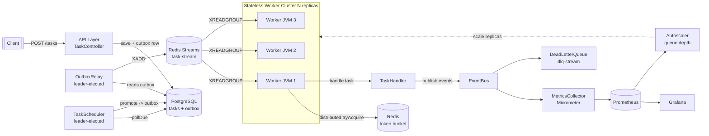

# Phase 4: Distribution, Event Bus, and Horizontal Scaling

> The capstone. We take the single-process platform from [Phase 3](./phase-3.md) and turn it into a horizontally scalable, distributed system: a real broker behind the `TaskQueue` port, stateless workers that scale out, an `EventBus` for event-driven side effects, a leader-elected scheduler, distributed rate limiting and locks, the transactional outbox for exactly-once *effect*, `docker-compose` for the whole topology, queue-depth autoscaling, and full observability.

By the end of this phase you can answer, with running code: *"How do I run twenty workers across five machines, never process a task twice, survive a node dying mid-task, and scale on load?"* That is the difference between someone who has read about distributed systems and someone who has shipped one.

---

## 1. Where This Fits In The Project

Across the four phases the same domain model — `Task`, `TaskStatus`, `TaskHandler`, `TaskQueue`, `Worker`, `WorkerPool`, `RetryPolicy`, `DeadLetterQueue`, `RateLimiter`, `TaskScheduler`, `TaskRepository` — has been refactored, never rewritten. That is the whole point of programming to ports.

| Phase | Queue | Workers | State | Scaling | Reference |
|-------|-------|---------|-------|---------|-----------|
| 1 | `InMemoryTaskQueue` (`ArrayBlockingQueue`) | thread pool in one JVM | none | vertical | [phase-1.md](./phase-1.md) |
| 2 | `PostgresTaskQueue` (`SELECT ... FOR UPDATE SKIP LOCKED`) | thread pool in one JVM | Postgres | vertical | [phase-2.md](./phase-2.md) |
| 3 | Postgres + in-process rate limiter, DLQ, metrics | thread pool, one JVM | Postgres | vertical | [phase-3.md](./phase-3.md) |
| 4 | **Redis Streams / Kafka** behind the port | **N stateless JVMs** | Postgres + Redis | **horizontal** | this file |

The architectural invariant: nothing above the `TaskQueue` interface knows we swapped a `BlockingQueue` for a partitioned log. We change one adapter and a Spring `@Bean`, not the `Worker`.

---

## 2. Goals And Acceptance Criteria

**Goals**

1. Replace the queue with a real broker (we ship a **Redis Streams** adapter as the default and sketch a **Kafka** adapter) behind the existing `TaskQueue` port.
2. Run **stateless workers** as multiple identical containers; killing one loses no committed task.
3. Add an **`EventBus`** so submission, success, failure, and DLQ become first-class events that drive metrics, audit, and notifications.
4. Make the **scheduler leader-elected** so exactly one node promotes due tasks (no thundering herd of duplicate schedules).
5. Make **rate limiting distributed** (a Redis token bucket shared across nodes) and add **distributed locks** for singleton work.
6. Achieve **exactly-once effect** via **idempotency keys + the transactional outbox**, accepting at-least-once delivery underneath.
7. Wire the topology with **docker-compose**; add **autoscaling on queue depth**; expose **Prometheus metrics + Grafana**.

**Acceptance criteria** (these are literally your test assertions)

- [ ] `POST /tasks` returns `202` with a task id; the task is durably enqueued before the response returns.
- [ ] Three worker containers each consume a disjoint subset of tasks; no task runs twice under normal operation.
- [ ] `kill -9` on a worker mid-task causes the task to be redelivered and completed by another worker.
- [ ] A handler that is invoked twice for the same task produces exactly one externally visible effect (idempotency).
- [ ] The distributed rate limiter caps *aggregate* throughput across all workers, not per-node.
- [ ] Exactly one node logs `acquired scheduler leadership`; on its death another acquires it within the lease TTL.
- [ ] Scaling workers from 3 to 9 roughly triples drain rate (until the rate limiter or DB caps it).
- [ ] `/actuator/prometheus` exposes `tasks_processed_total`, `task_duration_seconds`, and `queue_depth`.

---

## 3. Architecture



The data flow in one sentence: the API writes the task and an outbox row in **one Postgres transaction**; a leader-elected **outbox relay** ships outbox rows to the Redis stream; workers in a **consumer group** pull, rate-limit, idempotently execute, and acknowledge; the scheduler (also a leader) promotes due tasks back into the outbox; everything emits events that fan out to metrics and the DLQ.

> Why the outbox at all? Because "save to DB and publish to broker" is two systems and you cannot make two systems atomic without a distributed transaction (which you do not want). The outbox makes the *publish* a consequence of the *commit*. See [idempotency.md](../08-distributed-systems/idempotency.md).

---

## 4. Project Layout And Dependencies

We continue the Maven module from Phase 3. New packages:

```text
src/main/java/com/taskqueue/
  domain/            Task, TaskStatus, TaskResult, TaskEvent, TaskEventType  (unchanged + events)
  port/              TaskQueue, TaskHandler, RetryPolicy, DeadLetterQueue,
                     RateLimiter, TaskScheduler, TaskRepository, EventBus, LeaderElector
  broker/redis/      RedisStreamTaskQueue, RedisStreamDeadLetterQueue
  broker/kafka/      KafkaTaskQueue                          (alternative adapter)
  outbox/            OutboxRecord, OutboxRepository, OutboxRelay
  worker/            Worker, WorkerPool, HandlerRegistry
  ratelimit/         RedisTokenBucketRateLimiter
  lock/              RedisLeaderElector, RedisDistributedLock
  scheduler/         LeaderElectedTaskScheduler
  event/             InProcessEventBus, RedisEventBus, MetricsEventListener
  api/               TaskController, SubmitTaskRequest
  config/            BrokerConfig, RedisConfig, ObservabilityConfig
```

`pom.xml` additions (Phase 4 only):

```xml
<dependencies>
  <!-- carried from earlier phases: spring-boot-starter-web, -data-jdbc, postgresql, flyway, micrometer -->
  <dependency>
    <groupId>org.springframework.boot</groupId>
    <artifactId>spring-boot-starter-data-redis</artifactId>
  </dependency>
  <dependency>
    <groupId>io.micrometer</groupId>
    <artifactId>micrometer-registry-prometheus</artifactId>
  </dependency>
  <dependency>
    <groupId>org.springframework.boot</groupId>
    <artifactId>spring-boot-starter-actuator</artifactId>
  </dependency>
  <!-- Kafka adapter (optional path) -->
  <dependency>
    <groupId>org.springframework.kafka</groupId>
    <artifactId>spring-kafka</artifactId>
  </dependency>
  <!-- tests -->
  <dependency>
    <groupId>org.testcontainers</groupId>
    <artifactId>testcontainers</artifactId>
    <scope>test</scope>
  </dependency>
  <dependency>
    <groupId>com.redis</groupId>
    <artifactId>testcontainers-redis</artifactId>
    <version>2.2.2</version>
    <scope>test</scope>
  </dependency>
  <dependency>
    <groupId>org.testcontainers</groupId>
    <artifactId>postgresql</artifactId>
    <scope>test</scope>
  </dependency>
</dependencies>
```

We use Java 21 with virtual threads for the worker fan-out (see [executor-service.md](../06-concurrency/executor-service.md) and [threads.md](../06-concurrency/threads.md)).

---

## 5. The Domain: Adding Events

The model from earlier phases is unchanged. We add a first-class event so that "what happened to a task" is data, not a side effect buried in log lines.

```java
package com.taskqueue.domain;

import java.time.Instant;

/** Lifecycle events. The EventBus carries these; metrics, DLQ, and audit subscribe. */
public enum TaskEventType {
    SUBMITTED, STARTED, SUCCEEDED, FAILED, RETRY_SCHEDULED, DEAD_LETTERED
}

/**
 * Immutable fact that something happened to a task. A record gives us value
 * semantics for free; events are values, never entities you mutate.
 */
public record TaskEvent(
        String eventId,        // UUID, also the idempotency key for consumers
        String taskId,
        String taskType,
        TaskEventType type,
        TaskStatus status,
        int attempts,
        String detail,
        Instant occurredAt) {

    public static TaskEvent of(Task t, TaskEventType type, String detail) {
        return new TaskEvent(
                java.util.UUID.randomUUID().toString(),
                t.id(), t.type(), type, t.status(), t.attempts(), detail, Instant.now());
    }
}
```

The canonical `Task` (recap from the spec, now an immutable record with copy-style transitions):

```java
package com.taskqueue.domain;

import java.time.Instant;

public record Task(
        String id, String type, String payload, TaskStatus status,
        int attempts, int maxAttempts, Instant createdAt, Instant scheduledAt, int priority) {

    public Task withStatus(TaskStatus s)    { return new Task(id, type, payload, s, attempts, maxAttempts, createdAt, scheduledAt, priority); }
    public Task incrementAttempts()          { return new Task(id, type, payload, status, attempts + 1, maxAttempts, createdAt, scheduledAt, priority); }
    public Task withScheduledAt(Instant at)  { return new Task(id, type, payload, status, attempts, maxAttempts, createdAt, at, priority); }
    public boolean canRetry()                { return attempts < maxAttempts; }
}
```

```java
package com.taskqueue.domain;

public enum TaskStatus { PENDING, SCHEDULED, RUNNING, SUCCEEDED, FAILED, RETRYING, DEAD }
```

---

## 6. The EventBus Port And Two Implementations

### 6.1 Port

```java
package com.taskqueue.port;

import com.taskqueue.domain.TaskEvent;

public interface EventBus {
    void publish(TaskEvent e);
    void subscribe(TaskEventListener l);
}
```

```java
package com.taskqueue.port;

import com.taskqueue.domain.TaskEvent;

@FunctionalInterface
public interface TaskEventListener {
    void onEvent(TaskEvent e);
}
```

### 6.2 In-process implementation (the Phase 1–3 default, kept for tests and single-node mode)

```java
package com.taskqueue.event;

import com.taskqueue.domain.TaskEvent;
import com.taskqueue.port.EventBus;
import com.taskqueue.port.TaskEventListener;
import org.slf4j.Logger;
import org.slf4j.LoggerFactory;
import java.util.concurrent.CopyOnWriteArrayList;

/**
 * Synchronous fan-out within one JVM. This is the Observer pattern
 * (see ../05-design-patterns/observer.md): the bus is the subject,
 * listeners are observers, decoupled from publishers.
 */
public class InProcessEventBus implements EventBus {
    private static final Logger log = LoggerFactory.getLogger(InProcessEventBus.class);
    private final CopyOnWriteArrayList<TaskEventListener> listeners = new CopyOnWriteArrayList<>();

    @Override public void subscribe(TaskEventListener l) { listeners.add(l); }

    @Override
    public void publish(TaskEvent e) {
        for (TaskEventListener l : listeners) {
            try {
                l.onEvent(e);                 // isolate one bad listener from the rest
            } catch (RuntimeException ex) {
                log.error("listener {} failed on event {}", l, e.eventId(), ex);
            }
        }
    }
}
```

> Note the listener loop swallows and logs exceptions. A subscriber must never break the publisher; that is the *whole reason* you introduced an event bus instead of direct method calls. We use `CopyOnWriteArrayList` because subscription is rare and publishing is hot — see [concurrent-collections.md](../06-concurrency/concurrent-collections.md).

### 6.3 Cross-node implementation (Redis pub/sub, so a metrics dashboard on node B sees events from node A)

```java
package com.taskqueue.event;

import com.fasterxml.jackson.databind.ObjectMapper;
import com.taskqueue.domain.TaskEvent;
import com.taskqueue.port.EventBus;
import com.taskqueue.port.TaskEventListener;
import org.springframework.data.redis.connection.Message;
import org.springframework.data.redis.connection.MessageListener;
import org.springframework.data.redis.core.StringRedisTemplate;
import org.springframework.data.redis.listener.ChannelTopic;
import org.springframework.data.redis.listener.RedisMessageListenerContainer;
import java.util.concurrent.CopyOnWriteArrayList;

/** Distributes events to every node via Redis pub/sub, then fans out locally. */
public class RedisEventBus implements EventBus, MessageListener {
    private static final String CHANNEL = "task-events";
    private final StringRedisTemplate redis;
    private final ObjectMapper mapper;
    private final CopyOnWriteArrayList<TaskEventListener> listeners = new CopyOnWriteArrayList<>();

    public RedisEventBus(StringRedisTemplate redis, ObjectMapper mapper,
                         RedisMessageListenerContainer container) {
        this.redis = redis;
        this.mapper = mapper;
        container.addMessageListener(this, new ChannelTopic(CHANNEL));
    }

    @Override public void subscribe(TaskEventListener l) { listeners.add(l); }

    @Override
    public void publish(TaskEvent e) {
        try { redis.convertAndSend(CHANNEL, mapper.writeValueAsString(e)); }
        catch (Exception ex) { throw new RuntimeException("event publish failed", ex); }
    }

    @Override
    public void onMessage(Message message, byte[] pattern) {
        try {
            TaskEvent e = mapper.readValue(message.getBody(), TaskEvent.class);
            for (TaskEventListener l : listeners) {
                try { l.onEvent(e); } catch (RuntimeException ignored) { /* logged inside listener */ }
            }
        } catch (Exception ignored) { /* poison event; do not crash the listener thread */ }
    }
}
```

> Redis pub/sub is **fire-and-forget** — a node that is down misses events. That is fine for metrics and notifications (lossy is acceptable) but **never** for the task pipeline itself. The pipeline uses Redis **Streams** (durable, replayable, consumer groups), not pub/sub. Knowing which guarantee each tool gives you is the core distributed-systems skill — see [message-queues.md](../07-queues-and-messaging/message-queues.md) and [broker-comparison.md](../07-queues-and-messaging/broker-comparison.md).

The metrics listener is a thin adapter from events to counters:

```java
package com.taskqueue.event;

import com.taskqueue.domain.TaskEvent;
import com.taskqueue.port.TaskEventListener;
import io.micrometer.core.instrument.MeterRegistry;

/** Turns lifecycle events into Micrometer counters. One place owns metric naming. */
public class MetricsEventListener implements TaskEventListener {
    private final MeterRegistry registry;
    public MetricsEventListener(MeterRegistry registry) { this.registry = registry; }

    @Override
    public void onEvent(TaskEvent e) {
        registry.counter("task_events_total",
                "type", e.type().name(), "task_type", e.taskType()).increment();
    }
}
```

---

## 7. The TaskQueue Port, Now Backed By Redis Streams

The port is **identical** to Phase 1. That is the payoff of hexagonal architecture ([hexagonal-architecture.md](../04-oop-and-ood/hexagonal-architecture.md)).

```java
package com.taskqueue.port;

import com.taskqueue.domain.Task;

public interface TaskQueue {
    void enqueue(Task t);
    /** Blocks until a task is available or the thread is interrupted. */
    Task dequeue() throws InterruptedException;
    long size();
}
```

But "dequeue" in a distributed broker needs an **acknowledgement** step: you do not delete a message just because you read it; you delete it once you have *processed* it, otherwise a crash between read and process loses the task. So at the broker boundary we widen the port slightly with an explicit ack, while keeping the simple `dequeue()` for in-memory tests.

```java
package com.taskqueue.port;

import com.taskqueue.domain.Task;
import java.util.Optional;

/**
 * Broker-aware queue. dequeue() leases a message (sets it "in-flight");
 * ack() confirms processing and removes it; nack() requeues it.
 * This is at-least-once delivery: a crash after lease, before ack, redelivers.
 */
public interface AckableTaskQueue extends TaskQueue {
    /** A leased message carries the broker entry id so we can ack precisely. */
    record Lease(String entryId, Task task) {}

    Optional<Lease> poll(java.time.Duration block) throws InterruptedException;
    void ack(Lease lease);
    void nack(Lease lease);
    /** Reclaim messages leased by a dead consumer and never acked. */
    java.util.List<Lease> reclaimStale(java.time.Duration olderThan, int max);
}
```

### 7.1 RedisStreamTaskQueue

Redis Streams gives us: durable append (`XADD`), consumer groups with per-consumer in-flight tracking (`XREADGROUP`), explicit ack (`XACK`), and reclaim of abandoned messages (`XAUTOCLAIM`). That is precisely the at-least-once delivery contract we need.

```java
package com.taskqueue.broker.redis;

import com.fasterxml.jackson.databind.ObjectMapper;
import com.taskqueue.domain.Task;
import com.taskqueue.port.AckableTaskQueue;
import org.springframework.data.redis.connection.stream.*;
import org.springframework.data.redis.core.StringRedisTemplate;
import java.time.Duration;
import java.util.*;

/**
 * Redis Streams adapter for the TaskQueue port.
 *
 *  enqueue -> XADD task-stream * data {json}
 *  poll    -> XREADGROUP GROUP workers <consumer> COUNT 1 BLOCK <ms> STREAMS task-stream >
 *  ack     -> XACK task-stream workers <entryId>
 *  reclaim -> XAUTOCLAIM for entries idle longer than the visibility timeout
 */
public class RedisStreamTaskQueue implements AckableTaskQueue {

    private static final String STREAM = "task-stream";
    private static final String GROUP  = "workers";

    private final StringRedisTemplate redis;
    private final ObjectMapper mapper;
    private final String consumerName; // unique per JVM, e.g. hostname-pid

    public RedisStreamTaskQueue(StringRedisTemplate redis, ObjectMapper mapper, String consumerName) {
        this.redis = redis;
        this.mapper = mapper;
        this.consumerName = consumerName;
        ensureGroup();
    }

    private void ensureGroup() {
        try {
            redis.opsForStream().createGroup(STREAM, ReadOffset.from("0"), GROUP);
        } catch (Exception ignore) {
            // group already exists, or stream is auto-created on first XADD with MKSTREAM
        }
    }

    @Override
    public void enqueue(Task t) {
        try {
            Map<String, String> body = Map.of("data", mapper.writeValueAsString(t));
            redis.opsForStream().add(StreamRecords.newRecord().in(STREAM).ofMap(body));
        } catch (Exception e) {
            throw new RuntimeException("enqueue failed for task " + t.id(), e);
        }
    }

    @Override
    public Optional<Lease> poll(Duration block) throws InterruptedException {
        List<MapRecord<String, Object, Object>> records = redis.opsForStream().read(
                Consumer.from(GROUP, consumerName),
                StreamReadOptions.empty().count(1).block(block),
                StreamOffset.create(STREAM, ReadOffset.lastConsumed()));
        if (records == null || records.isEmpty()) return Optional.empty();
        MapRecord<String, Object, Object> rec = records.get(0);
        return Optional.of(toLease(rec));
    }

    private Lease toLease(MapRecord<String, Object, Object> rec) {
        try {
            String json = String.valueOf(rec.getValue().get("data"));
            Task t = mapper.readValue(json, Task.class);
            return new Lease(rec.getId().getValue(), t);
        } catch (Exception e) {
            throw new RuntimeException("deserialize failed for entry " + rec.getId(), e);
        }
    }

    @Override
    public void ack(Lease lease) {
        redis.opsForStream().acknowledge(STREAM, GROUP, lease.entryId());
        // Optional: XDEL to reclaim memory; ack alone removes it from the PEL (pending entries list).
    }

    @Override
    public void nack(Lease lease) {
        // Leave it in the PEL; reclaimStale will hand it to another consumer after the visibility timeout.
        // For an immediate retry you could re-XADD, but that changes ordering; we prefer reclaim.
    }

    @Override
    public List<Lease> reclaimStale(Duration olderThan, int max) {
        var claimed = redis.opsForStream().claim(
                STREAM, GROUP, consumerName,
                org.springframework.data.redis.connection.stream.RedisStreamCommands.XClaimOptions
                        .minIdle(olderThan).ids(pendingIds(max)));
        List<Lease> out = new ArrayList<>();
        for (MapRecord<String, Object, Object> rec : claimed) out.add(toLease(rec));
        return out;
    }

    private String[] pendingIds(int max) {
        PendingMessages pending = redis.opsForStream()
                .pending(STREAM, Consumer.from(GROUP, "*"), Range.unbounded(), max);
        return pending.stream().map(pm -> pm.getId().getValue()).toArray(String[]::new);
    }

    @Override
    public Task dequeue() throws InterruptedException {
        return poll(Duration.ofSeconds(5)).map(Lease::task).orElse(null);
    }

    @Override
    public long size() {
        Long len = redis.opsForStream().size(STREAM);
        return len == null ? 0 : len;
    }
}
```

> **The crash-safety story.** A worker `poll`s (the entry moves to that consumer's *pending entries list*), processes, then `ack`s. If the worker dies before `ack`, the entry sits in the PEL. A background reclaim job calls `reclaimStale(visibilityTimeout, n)` and hands it to a live worker. This is exactly the *visibility timeout* pattern from SQS — see [task-queues.md](../07-queues-and-messaging/task-queues.md) and [dead-letter-queues.md](../07-queues-and-messaging/dead-letter-queues.md).

### 7.2 A Kafka adapter sketch (when ordering-per-key and high fan-out matter)

```java
package com.taskqueue.broker.kafka;

import com.fasterxml.jackson.databind.ObjectMapper;
import com.taskqueue.domain.Task;
import com.taskqueue.port.TaskQueue;
import org.apache.kafka.clients.producer.*;

/**
 * Kafka adapter. Partition by task.type so all tasks of a type keep order on
 * one partition; consumer-group rebalancing distributes partitions across workers.
 * Ack semantics: commit offsets only after processing (enable.auto.commit=false).
 * See ../08-distributed-systems/message-ordering.md.
 */
public class KafkaTaskQueue implements TaskQueue {
    private static final String TOPIC = "tasks";
    private final Producer<String, String> producer;
    private final ObjectMapper mapper;

    public KafkaTaskQueue(Producer<String, String> producer, ObjectMapper mapper) {
        this.producer = producer;
        this.mapper = mapper;
    }

    @Override
    public void enqueue(Task t) {
        try {
            String json = mapper.writeValueAsString(t);
            producer.send(new ProducerRecord<>(TOPIC, t.type(), json));  // key = type => ordered per type
        } catch (Exception e) {
            throw new RuntimeException("kafka enqueue failed", e);
        }
    }

    @Override public Task dequeue() { throw new UnsupportedOperationException("use KafkaListener consumer"); }
    @Override public long size() { return -1; } // Kafka exposes lag via consumer metrics, not a single size
}
```

| Dimension | Redis Streams | Kafka |
|-----------|---------------|-------|
| Ordering | per-stream global | per-partition (key-routed) |
| Throughput | high (single-threaded server) | very high (partitioned) |
| Retention | trim by length/time | long, replayable log |
| Ack model | PEL + XACK + XAUTOCLAIM | committed offsets + rebalance |
| Ops weight | light (often already present for cache/locks) | heavy (ZK/KRaft, brokers, topics) |
| Best for | < ~100k msg/s, want one fewer system | massive scale, event sourcing, multi-consumer fan-out |

We default to Redis Streams because we already run Redis for locks and rate limiting; one fewer system is a real production virtue. Pick Kafka when you need replay, per-key ordering at scale, or multiple independent consumer groups over the same log. See [broker-comparison.md](../07-queues-and-messaging/broker-comparison.md).

---

## 8. The Transactional Outbox: Exactly-Once *Effect*

### 8.1 The naive version (and why it is wrong)

```java
// DO NOT SHIP THIS.
public String submit(Task t) {
    taskRepository.save(t);     // commit 1: Postgres
    taskQueue.enqueue(t);       // commit 2: Redis
    return t.id();
}
```

If the process dies between line 1 and line 2, the task is in Postgres but never in the broker — it never runs (a *lost* task). If you swap the order and die between them, it runs but was never persisted — your read API returns 404 for a task that executed (a *phantom*). Two systems, no atomicity. This is the **dual-write problem** and it is the single most common distributed bug juniors ship.

### 8.2 The outbox

Write the task **and** an outbox row in **one Postgres transaction**. A separate relay reads committed outbox rows and publishes them to the broker, marking each as sent. The publish is now a *consequence* of the commit; if it has not happened yet, the row is still there to retry. Delivery becomes at-least-once (the relay may publish a row twice if it crashes after publishing, before marking sent) — which is exactly why consumers must be idempotent.

```sql
-- Flyway: V4__outbox.sql
CREATE TABLE outbox (
    id           UUID PRIMARY KEY,
    aggregate_id VARCHAR(64) NOT NULL,    -- the task id
    payload      JSONB NOT NULL,          -- serialized Task
    created_at   TIMESTAMPTZ NOT NULL DEFAULT now(),
    published_at TIMESTAMPTZ              -- NULL until the relay ships it
);
CREATE INDEX idx_outbox_unpublished ON outbox (created_at) WHERE published_at IS NULL;
```

```java
package com.taskqueue.outbox;

import java.time.Instant;

public record OutboxRecord(String id, String aggregateId, String payload,
                           Instant createdAt, Instant publishedAt) {}
```

```java
package com.taskqueue.outbox;

import com.fasterxml.jackson.databind.ObjectMapper;
import com.taskqueue.domain.Task;
import com.taskqueue.port.TaskRepository;
import org.springframework.jdbc.core.JdbcTemplate;
import org.springframework.stereotype.Service;
import org.springframework.transaction.annotation.Transactional;
import java.util.UUID;

/** Atomically persists a Task and its outbox row in one transaction. */
@Service
public class TaskSubmissionService {
    private final TaskRepository tasks;
    private final JdbcTemplate jdbc;
    private final ObjectMapper mapper;

    public TaskSubmissionService(TaskRepository tasks, JdbcTemplate jdbc, ObjectMapper mapper) {
        this.tasks = tasks; this.jdbc = jdbc; this.mapper = mapper;
    }

    @Transactional   // both writes commit or roll back together
    public String submit(Task t) {
        try {
            tasks.save(t);
            jdbc.update(
                "INSERT INTO outbox (id, aggregate_id, payload) VALUES (?, ?, ?::jsonb)",
                UUID.randomUUID().toString(), t.id(), mapper.writeValueAsString(t));
            return t.id();
        } catch (Exception e) {
            throw new RuntimeException("submit failed", e); // rolls back the transaction
        }
    }
}
```

### 8.3 The relay (leader-elected, polls the outbox, publishes, marks sent)

```java
package com.taskqueue.outbox;

import com.fasterxml.jackson.databind.ObjectMapper;
import com.taskqueue.domain.Task;
import com.taskqueue.domain.TaskEvent;
import com.taskqueue.domain.TaskEventType;
import com.taskqueue.port.AckableTaskQueue;
import com.taskqueue.port.EventBus;
import com.taskqueue.port.LeaderElector;
import org.slf4j.Logger;
import org.slf4j.LoggerFactory;
import org.springframework.jdbc.core.JdbcTemplate;
import org.springframework.scheduling.annotation.Scheduled;
import org.springframework.stereotype.Component;
import java.sql.Timestamp;
import java.time.Instant;
import java.util.List;

@Component
public class OutboxRelay {
    private static final Logger log = LoggerFactory.getLogger(OutboxRelay.class);
    private final JdbcTemplate jdbc;
    private final AckableTaskQueue queue;
    private final EventBus eventBus;
    private final ObjectMapper mapper;
    private final LeaderElector leader;

    public OutboxRelay(JdbcTemplate jdbc, AckableTaskQueue queue, EventBus eventBus,
                       ObjectMapper mapper, LeaderElector leader) {
        this.jdbc = jdbc; this.queue = queue; this.eventBus = eventBus;
        this.mapper = mapper; this.leader = leader;
    }

    /** Only the leader relays, so an outbox row publishes once per scan cluster-wide. */
    @Scheduled(fixedDelay = 250)
    public void relay() {
        if (!leader.isLeader("outbox-relay")) return;
        List<OutboxRecord> batch = fetchUnpublished(100);
        for (OutboxRecord r : batch) {
            try {
                Task t = mapper.readValue(r.payload(), Task.class);
                queue.enqueue(t);                       // at-least-once: may double-publish on crash
                markPublished(r.id());
                eventBus.publish(TaskEvent.of(t, TaskEventType.SUBMITTED, "outbox->broker"));
            } catch (Exception e) {
                log.error("relay failed for outbox {}", r.id(), e); // leave unpublished; retried next scan
            }
        }
    }

    private List<OutboxRecord> fetchUnpublished(int limit) {
        return jdbc.query("""
                SELECT id, aggregate_id, payload, created_at, published_at
                FROM outbox
                WHERE published_at IS NULL
                ORDER BY created_at
                LIMIT ?
                FOR UPDATE SKIP LOCKED
                """,
            (rs, i) -> new OutboxRecord(rs.getString("id"), rs.getString("aggregate_id"),
                    rs.getString("payload"), rs.getTimestamp("created_at").toInstant(), null),
            limit);
    }

    private void markPublished(String id) {
        jdbc.update("UPDATE outbox SET published_at = ? WHERE id = ?",
                Timestamp.from(Instant.now()), id);
    }
}
```

> `FOR UPDATE SKIP LOCKED` means even if leadership briefly flaps and two relays run, they grab disjoint rows — defense in depth. The leader check is the primary guard; the SQL lock is the backstop. This is the same skip-locked technique the Phase 2 `PostgresTaskQueue` used.

### 8.4 Idempotent consumption: the other half of exactly-once

At-least-once delivery means a handler may run twice. "Exactly-once *effect*" means the **observable result** happens once even if the handler runs twice. You achieve it with an idempotency key and a uniqueness constraint, not with magic broker config (no broker gives you true end-to-end exactly-once across an external side effect).

```sql
-- V5__idempotency.sql
CREATE TABLE processed_tasks (
    task_id    VARCHAR(64) PRIMARY KEY,
    result     TEXT,
    processed_at TIMESTAMPTZ NOT NULL DEFAULT now()
);
```

```java
package com.taskqueue.worker;

import com.taskqueue.domain.Task;
import com.taskqueue.domain.TaskResult;
import com.taskqueue.port.TaskHandler;
import org.springframework.dao.DuplicateKeyException;
import org.springframework.jdbc.core.JdbcTemplate;

/**
 * Decorator (see ../05-design-patterns/decorator.md) that makes any TaskHandler
 * idempotent. The unique PK on processed_tasks is the deduplication boundary:
 * a second execution of the same task fails the INSERT and short-circuits.
 */
public class IdempotentHandler implements TaskHandler {
    private final TaskHandler delegate;
    private final JdbcTemplate jdbc;

    public IdempotentHandler(TaskHandler delegate, JdbcTemplate jdbc) {
        this.delegate = delegate; this.jdbc = jdbc;
    }

    @Override
    public TaskResult handle(Task task) throws Exception {
        // Fast path: already processed?
        Integer seen = jdbc.queryForObject(
                "SELECT count(*) FROM processed_tasks WHERE task_id = ?", Integer.class, task.id());
        if (seen != null && seen > 0) {
            return new TaskResult(true, "duplicate suppressed", false);
        }
        TaskResult result = delegate.handle(task);
        if (result.success()) {
            try {
                jdbc.update("INSERT INTO processed_tasks (task_id, result) VALUES (?, ?)",
                        task.id(), result.message());
            } catch (DuplicateKeyException race) {
                // Two workers processed concurrently; the loser treats it as a dup. Effect still once.
                return new TaskResult(true, "duplicate suppressed (race)", false);
            }
        }
        return result;
    }
}
```

`TaskResult` and `TaskHandler` are unchanged from the spec:

```java
package com.taskqueue.domain;
public record TaskResult(boolean success, String message, boolean retryable) {}
```

```java
package com.taskqueue.port;
import com.taskqueue.domain.Task;
import com.taskqueue.domain.TaskResult;

@FunctionalInterface
public interface TaskHandler {
    TaskResult handle(Task task) throws Exception;
}
```

> The truly bulletproof version makes the side effect itself idempotent (e.g. "charge order X" is a no-op if order X is already charged), so even a non-success that later succeeds is safe. The `processed_tasks` table is the generic fallback for handlers whose effects you cannot make naturally idempotent. See [idempotency.md](../08-distributed-systems/idempotency.md).

---

## 9. Distributed Locks And Leader Election

A `LeaderElector` lets exactly one node run a singleton job (scheduler, outbox relay). We implement it with a Redis lease — a key with a TTL that the leader must keep renewing. This is the lightweight cousin of a real consensus system (ZooKeeper/etcd); good enough when the worst case of a brief double-leader is tolerated *and* guarded by idempotency. See [leader-election.md](../08-distributed-systems/leader-election.md) and [distributed-locks.md](../08-distributed-systems/distributed-locks.md).

```java
package com.taskqueue.port;

public interface LeaderElector {
    /** True if this node currently holds leadership for the named role. */
    boolean isLeader(String role);
}
```

```java
package com.taskqueue.lock;

import com.taskqueue.port.LeaderElector;
import org.springframework.data.redis.core.StringRedisTemplate;
import org.springframework.scheduling.annotation.Scheduled;
import java.time.Duration;
import java.util.Map;
import java.util.concurrent.ConcurrentHashMap;

/**
 * Lease-based leader election on Redis.
 *   acquire/renew:  SET leader:{role} {nodeId} NX PX {ttl}     (NX = only if absent)
 *   renew if owner: a Lua CAS so we only extend our own lease, never steal.
 * If the leader dies, the key expires after ttl and another node acquires it.
 *
 * Correctness caveat: a GC pause longer than the TTL can produce two leaders
 * briefly. That is why every leader job must also be idempotent. There is no
 * lock that is safe under unbounded pauses without fencing tokens.
 */
public class RedisLeaderElector implements LeaderElector {

    private static final Duration TTL = Duration.ofSeconds(10);
    private static final String RENEW_LUA = """
        if redis.call('get', KEYS[1]) == ARGV[1] then
          return redis.call('pexpire', KEYS[1], ARGV[2])
        else
          return 0
        end""";

    private final StringRedisTemplate redis;
    private final String nodeId;                    // unique per JVM
    private final Map<String, Boolean> held = new ConcurrentHashMap<>();

    public RedisLeaderElector(StringRedisTemplate redis, String nodeId) {
        this.redis = redis; this.nodeId = nodeId;
    }

    @Override
    public boolean isLeader(String role) {
        return held.getOrDefault(role, false);
    }

    @Scheduled(fixedDelay = 3000)
    public void heartbeat() {
        for (String role : new String[]{"outbox-relay", "scheduler"}) {
            String key = "leader:" + role;
            if (Boolean.TRUE.equals(held.get(role))) {
                Long renewed = redis.execute(
                        org.springframework.data.redis.core.script.RedisScript.of(RENEW_LUA, Long.class),
                        java.util.List.of(key), nodeId, String.valueOf(TTL.toMillis()));
                held.put(role, renewed != null && renewed == 1L);
            } else {
                Boolean acquired = redis.opsForValue()
                        .setIfAbsent(key, nodeId, TTL);             // SET NX PX
                held.put(role, Boolean.TRUE.equals(acquired));
            }
        }
    }
}
```

A general distributed mutex for one-shot critical sections (e.g. a singleton migration):

```java
package com.taskqueue.lock;

import org.springframework.data.redis.core.StringRedisTemplate;
import java.time.Duration;
import java.util.List;

public class RedisDistributedLock {
    private static final String UNLOCK_LUA = """
        if redis.call('get', KEYS[1]) == ARGV[1] then
          return redis.call('del', KEYS[1]) else return 0 end""";
    private final StringRedisTemplate redis;
    public RedisDistributedLock(StringRedisTemplate redis) { this.redis = redis; }

    /** Runs action under a named lock, or skips if the lock is held elsewhere. */
    public boolean runIfAcquired(String key, Duration ttl, Runnable action) {
        String token = java.util.UUID.randomUUID().toString();
        Boolean ok = redis.opsForValue().setIfAbsent("lock:" + key, token, ttl);
        if (!Boolean.TRUE.equals(ok)) return false;
        try { action.run(); return true; }
        finally {
            redis.execute(org.springframework.data.redis.core.script.RedisScript.of(UNLOCK_LUA, Long.class),
                    List.of("lock:" + key), token);   // delete only if we still own it
        }
    }
}
```

> The unlock is a Lua compare-and-delete so you never delete a lock that has *already expired and been re-acquired by someone else*. The naive `if get==token then del` in two round trips has a race; doing it in one Lua script makes it atomic. This is the famous Redlock subtlety in miniature.

---

## 10. Distributed Rate Limiting

The Phase 3 `TokenBucketRateLimiter` lived in one JVM, so it limited *per node*. With ten nodes you accidentally allowed 10x your intended rate. The fix: a **shared** token bucket in Redis, refilled by elapsed time, decremented atomically in Lua. See [rate-limiting.md](../08-distributed-systems/rate-limiting.md).

```java
package com.taskqueue.port;
public interface RateLimiter {
    boolean tryAcquire();
}
```

```java
package com.taskqueue.ratelimit;

import com.taskqueue.port.RateLimiter;
import org.springframework.data.redis.core.StringRedisTemplate;
import org.springframework.data.redis.core.script.RedisScript;
import java.util.List;

/**
 * Cluster-wide token bucket. State (tokens, last-refill timestamp) lives in Redis.
 * The Lua script reads, refills by elapsed time, and conditionally decrements —
 * all atomically on the Redis server, so concurrent nodes cannot oversubscribe.
 */
public class RedisTokenBucketRateLimiter implements RateLimiter {

    private static final String LUA = """
        local key      = KEYS[1]
        local rate     = tonumber(ARGV[1])   -- tokens per second
        local capacity = tonumber(ARGV[2])
        local now      = tonumber(ARGV[3])   -- ms
        local state    = redis.call('hmget', key, 'tokens', 'ts')
        local tokens   = tonumber(state[1])
        local ts       = tonumber(state[2])
        if tokens == nil then tokens = capacity; ts = now end
        local delta    = math.max(0, now - ts) / 1000.0
        tokens = math.min(capacity, tokens + delta * rate)
        local allowed = 0
        if tokens >= 1 then tokens = tokens - 1; allowed = 1 end
        redis.call('hmset', key, 'tokens', tokens, 'ts', now)
        redis.call('pexpire', key, 60000)
        return allowed""";

    private final StringRedisTemplate redis;
    private final String key;
    private final double ratePerSecond;
    private final int capacity;

    public RedisTokenBucketRateLimiter(StringRedisTemplate redis, String key,
                                       double ratePerSecond, int capacity) {
        this.redis = redis; this.key = key;
        this.ratePerSecond = ratePerSecond; this.capacity = capacity;
    }

    @Override
    public boolean tryAcquire() {
        Long allowed = redis.execute(
                RedisScript.of(LUA, Long.class),
                List.of(key),
                String.valueOf(ratePerSecond), String.valueOf(capacity),
                String.valueOf(System.currentTimeMillis()));
        return allowed != null && allowed == 1L;
    }
}
```

> One round trip, atomic refill-and-take. Doing refill in Java would race: two nodes both read 1 token and both take it. Pushing the read-modify-write into a single Lua eval is the trick that makes any Redis-backed limiter or counter correct.

---

## 11. The Worker: Stateless, Idempotent, Ack-Driven

The `Worker` is the heart of the system, and it is now **stateless** — all state is in Redis/Postgres, so any container can do any task and dying loses nothing committed. It pulls a lease, checks the distributed rate limiter, looks up the handler, executes (through the idempotency decorator), and acks/nacks/dead-letters based on the outcome.

```java
package com.taskqueue.worker;

import com.taskqueue.domain.*;
import com.taskqueue.port.*;
import org.slf4j.Logger;
import org.slf4j.LoggerFactory;
import java.time.Duration;
import java.util.Optional;

public class Worker implements Runnable {

    private static final Logger log = LoggerFactory.getLogger(Worker.class);

    private final AckableTaskQueue queue;
    private final HandlerRegistry handlers;
    private final RateLimiter rateLimiter;
    private final RetryPolicy retryPolicy;
    private final TaskScheduler scheduler;
    private final DeadLetterQueue dlq;
    private final EventBus events;
    private volatile boolean running = true;

    public Worker(AckableTaskQueue queue, HandlerRegistry handlers, RateLimiter rateLimiter,
                  RetryPolicy retryPolicy, TaskScheduler scheduler,
                  DeadLetterQueue dlq, EventBus events) {
        this.queue = queue; this.handlers = handlers; this.rateLimiter = rateLimiter;
        this.retryPolicy = retryPolicy; this.scheduler = scheduler; this.dlq = dlq; this.events = events;
    }

    public void stop() { running = false; }

    @Override
    public void run() {
        while (running && !Thread.currentThread().isInterrupted()) {
            try {
                Optional<AckableTaskQueue.Lease> maybe = queue.poll(Duration.ofSeconds(2));
                if (maybe.isEmpty()) continue;
                process(maybe.get());
            } catch (InterruptedException e) {
                Thread.currentThread().interrupt();
                return;
            } catch (Exception e) {
                log.error("worker loop error", e);   // never let the loop die
            }
        }
    }

    private void process(AckableTaskQueue.Lease lease) {
        Task task = lease.task();

        // Distributed backpressure: if we are over the cluster rate, requeue and slow down.
        if (!rateLimiter.tryAcquire()) {
            queue.nack(lease);                       // reclaim will redeliver later
            sleepQuietly(50);
            return;
        }

        events.publish(TaskEvent.of(task.withStatus(TaskStatus.RUNNING), TaskEventType.STARTED, null));
        TaskHandler handler = handlers.lookup(task.type());
        if (handler == null) {
            dlq.send(task.withStatus(TaskStatus.DEAD), "no handler for type " + task.type());
            queue.ack(lease);                        // remove the poison from the broker
            events.publish(TaskEvent.of(task, TaskEventType.DEAD_LETTERED, "no handler"));
            return;
        }

        try {
            TaskResult result = handler.handle(task);   // handler is wrapped in IdempotentHandler
            if (result.success()) {
                queue.ack(lease);
                events.publish(TaskEvent.of(task.withStatus(TaskStatus.SUCCEEDED), TaskEventType.SUCCEEDED, result.message()));
            } else if (result.retryable() && task.canRetry()) {
                scheduleRetry(task, lease, result.message());
            } else {
                deadLetter(task, lease, result.message());
            }
        } catch (Exception e) {
            if (task.canRetry()) scheduleRetry(task, lease, e.toString());
            else deadLetter(task, lease, e.toString());
        }
    }

    private void scheduleRetry(Task task, AckableTaskQueue.Lease lease, String reason) {
        Task retried = task.incrementAttempts().withStatus(TaskStatus.RETRYING);
        Optional<Duration> delay = retryPolicy.nextDelay(retried.attempts());
        if (delay.isEmpty()) { deadLetter(task, lease, "retry policy exhausted: " + reason); return; }
        scheduler.schedule(retried, delay.get());    // re-enters via outbox when due
        queue.ack(lease);                            // remove current copy; the scheduler owns the retry now
        events.publish(TaskEvent.of(retried, TaskEventType.RETRY_SCHEDULED, reason + " in " + delay.get()));
    }

    private void deadLetter(Task task, AckableTaskQueue.Lease lease, String reason) {
        dlq.send(task.withStatus(TaskStatus.DEAD), reason);
        queue.ack(lease);
        events.publish(TaskEvent.of(task.withStatus(TaskStatus.DEAD), TaskEventType.DEAD_LETTERED, reason));
    }

    private void sleepQuietly(long ms) {
        try { Thread.sleep(ms); } catch (InterruptedException e) { Thread.currentThread().interrupt(); }
    }
}
```

The `WorkerPool` runs N workers on virtual threads and reclaims abandoned leases:

```java
package com.taskqueue.worker;

import com.taskqueue.port.AckableTaskQueue;
import org.slf4j.Logger;
import org.slf4j.LoggerFactory;
import java.time.Duration;
import java.util.List;
import java.util.concurrent.*;
import java.util.function.Supplier;

public class WorkerPool {
    private static final Logger log = LoggerFactory.getLogger(WorkerPool.class);

    private final int size;
    private final Supplier<Worker> workerFactory;
    private final AckableTaskQueue queue;
    private final List<Worker> workers = new CopyOnWriteArrayList<>();
    private ExecutorService executor;
    private ScheduledExecutorService reclaimer;

    public WorkerPool(int size, Supplier<Worker> workerFactory, AckableTaskQueue queue) {
        this.size = size; this.workerFactory = workerFactory; this.queue = queue;
    }

    public void start() {
        // Virtual threads: cheap, blocking-friendly, ideal for IO-bound task handlers (Java 21 Loom).
        executor = Executors.newVirtualThreadPerTaskExecutor();
        for (int i = 0; i < size; i++) {
            Worker w = workerFactory.get();
            workers.add(w);
            executor.submit(w);
        }
        reclaimer = Executors.newSingleThreadScheduledExecutor();
        reclaimer.scheduleAtFixedRate(this::reclaim, 5, 5, TimeUnit.SECONDS);
        log.info("worker pool started with {} workers", size);
    }

    /** Hand abandoned leases (dead-worker PEL entries) back to a live worker by re-enqueueing. */
    private void reclaim() {
        try {
            List<AckableTaskQueue.Lease> stale = queue.reclaimStale(Duration.ofSeconds(30), 50);
            if (!stale.isEmpty()) log.warn("reclaimed {} stale leases", stale.size());
        } catch (Exception e) {
            log.error("reclaim failed", e);
        }
    }

    public void shutdown() {
        workers.forEach(Worker::stop);
        if (reclaimer != null) reclaimer.shutdownNow();
        if (executor != null) {
            executor.shutdown();
            try {
                if (!executor.awaitTermination(30, TimeUnit.SECONDS)) executor.shutdownNow();
            } catch (InterruptedException e) {
                executor.shutdownNow();
                Thread.currentThread().interrupt();
            }
        }
        log.info("worker pool shut down");
    }
}
```

```java
package com.taskqueue.worker;

import com.taskqueue.port.TaskHandler;
import java.util.Map;
import java.util.concurrent.ConcurrentHashMap;

/** Strategy lookup by task type (see ../05-design-patterns/strategy.md). */
public class HandlerRegistry {
    private final Map<String, TaskHandler> handlers = new ConcurrentHashMap<>();
    public void register(String type, TaskHandler h) { handlers.put(type, h); }
    public TaskHandler lookup(String type) { return handlers.get(type); }
}
```

> **Why virtual threads?** Task handlers are usually IO-bound (HTTP calls, DB writes). Platform threads cost ~1MB of stack each, so a few thousand is your ceiling. Virtual threads cost ~kilobytes, so you can run a worker per in-flight task and let the JVM scheduler park blocked ones. This collapses the "how many threads in my pool?" tuning problem. See [executor-service.md](../06-concurrency/executor-service.md).

---

## 12. The Leader-Elected Scheduler

Delayed retries and `scheduledAt` tasks must be promoted to the queue exactly once when due. If every node ran the scheduler you would promote each due task N times. So the scheduler is leader-elected and promotes due tasks into the **outbox** (not directly to the broker), reusing the relay for delivery.

```java
package com.taskqueue.port;
import com.taskqueue.domain.Task;
import java.time.Duration;

public interface TaskScheduler {
    void schedule(Task t, Duration delay);
}
```

```java
package com.taskqueue.scheduler;

import com.fasterxml.jackson.databind.ObjectMapper;
import com.taskqueue.domain.Task;
import com.taskqueue.domain.TaskStatus;
import com.taskqueue.port.LeaderElector;
import com.taskqueue.port.TaskRepository;
import com.taskqueue.port.TaskScheduler;
import org.springframework.jdbc.core.JdbcTemplate;
import org.springframework.scheduling.annotation.Scheduled;
import org.springframework.stereotype.Component;
import org.springframework.transaction.annotation.Transactional;
import java.time.Duration;
import java.time.Instant;
import java.util.List;
import java.util.UUID;

/**
 * Durable, leader-elected scheduler. schedule() persists the task with a future
 * scheduledAt; a leader-only poll promotes due tasks into the outbox in one
 * transaction (so promotion + publish are exactly-once-effect via the outbox).
 */
@Component
public class LeaderElectedTaskScheduler implements TaskScheduler {

    private final TaskRepository tasks;
    private final JdbcTemplate jdbc;
    private final ObjectMapper mapper;
    private final LeaderElector leader;

    public LeaderElectedTaskScheduler(TaskRepository tasks, JdbcTemplate jdbc,
                                      ObjectMapper mapper, LeaderElector leader) {
        this.tasks = tasks; this.jdbc = jdbc; this.mapper = mapper; this.leader = leader;
    }

    @Override
    public void schedule(Task t, Duration delay) {
        Task scheduled = t.withStatus(TaskStatus.SCHEDULED).withScheduledAt(Instant.now().plus(delay));
        tasks.save(scheduled);   // durable; survives a scheduler restart
    }

    @Scheduled(fixedDelay = 500)
    @Transactional
    public void promoteDue() {
        if (!leader.isLeader("scheduler")) return;
        List<Task> due = tasks.pollDue(100);             // SELECT ... WHERE scheduledAt <= now FOR UPDATE SKIP LOCKED
        for (Task t : due) {
            try {
                Task ready = t.withStatus(TaskStatus.PENDING);
                tasks.save(ready);
                jdbc.update("INSERT INTO outbox (id, aggregate_id, payload) VALUES (?, ?, ?::jsonb)",
                        UUID.randomUUID().toString(), ready.id(), mapper.writeValueAsString(ready));
            } catch (Exception e) {
                throw new RuntimeException("promote failed for " + t.id(), e);
            }
        }
    }
}
```

`RetryPolicy` and `DeadLetterQueue` are the spec interfaces; the exponential backoff with jitter from Phase 3 is reused:

```java
package com.taskqueue.port;
import java.time.Duration;
import java.util.Optional;

public interface RetryPolicy {
    /** Empty => give up (dead-letter). */
    Optional<Duration> nextDelay(int attempt);
}
```

```java
package com.taskqueue.retry;

import com.taskqueue.port.RetryPolicy;
import java.time.Duration;
import java.util.Optional;
import java.util.concurrent.ThreadLocalRandom;

public class ExponentialBackoffRetryPolicy implements RetryPolicy {
    private final int maxAttempts;
    private final Duration base;
    private final Duration cap;

    public ExponentialBackoffRetryPolicy(int maxAttempts, Duration base, Duration cap) {
        this.maxAttempts = maxAttempts; this.base = base; this.cap = cap;
    }

    @Override
    public Optional<Duration> nextDelay(int attempt) {
        if (attempt > maxAttempts) return Optional.empty();
        long expMs = (long) (base.toMillis() * Math.pow(2, attempt - 1));
        long cappedMs = Math.min(expMs, cap.toMillis());
        long jittered = ThreadLocalRandom.current().nextLong(cappedMs / 2, cappedMs + 1); // full-ish jitter
        return Optional.of(Duration.ofMillis(jittered));
    }
}
```

```java
package com.taskqueue.port;
import com.taskqueue.domain.Task;
public interface DeadLetterQueue {
    void send(Task t, String reason);
}
```

```java
package com.taskqueue.broker.redis;

import com.fasterxml.jackson.databind.ObjectMapper;
import com.taskqueue.domain.Task;
import com.taskqueue.port.DeadLetterQueue;
import org.springframework.data.redis.connection.stream.StreamRecords;
import org.springframework.data.redis.core.StringRedisTemplate;
import java.time.Instant;
import java.util.Map;

/** Dead tasks land on a separate, durable stream for inspection and manual replay. */
public class RedisStreamDeadLetterQueue implements DeadLetterQueue {
    private static final String DLQ_STREAM = "dlq-stream";
    private final StringRedisTemplate redis;
    private final ObjectMapper mapper;

    public RedisStreamDeadLetterQueue(StringRedisTemplate redis, ObjectMapper mapper) {
        this.redis = redis; this.mapper = mapper;
    }

    @Override
    public void send(Task t, String reason) {
        try {
            Map<String, String> body = Map.of(
                    "data", mapper.writeValueAsString(t),
                    "reason", reason,
                    "deadAt", Instant.now().toString());
            redis.opsForStream().add(StreamRecords.newRecord().in(DLQ_STREAM).ofMap(body));
        } catch (Exception e) {
            throw new RuntimeException("dlq send failed for " + t.id(), e);
        }
    }
}
```

---

## 13. Wiring It Together (Spring Configuration)

```java
package com.taskqueue.config;

import com.fasterxml.jackson.databind.ObjectMapper;
import com.taskqueue.broker.redis.*;
import com.taskqueue.event.*;
import com.taskqueue.lock.RedisLeaderElector;
import com.taskqueue.port.*;
import com.taskqueue.ratelimit.RedisTokenBucketRateLimiter;
import io.micrometer.core.instrument.MeterRegistry;
import org.springframework.context.annotation.*;
import org.springframework.data.redis.connection.RedisConnectionFactory;
import org.springframework.data.redis.core.StringRedisTemplate;
import org.springframework.data.redis.listener.RedisMessageListenerContainer;

@Configuration
public class BrokerConfig {

    /** Unique identity for this JVM: hostname + pid. Used as consumer name and leader node id. */
    @Bean
    public String nodeId() {
        String host;
        try { host = java.net.InetAddress.getLocalHost().getHostName(); }
        catch (Exception e) { host = "unknown"; }
        return host + "-" + ProcessHandle.current().pid();
    }

    @Bean
    public StringRedisTemplate stringRedisTemplate(RedisConnectionFactory f) {
        return new StringRedisTemplate(f);
    }

    @Bean
    public RedisMessageListenerContainer listenerContainer(RedisConnectionFactory f) {
        var c = new RedisMessageListenerContainer();
        c.setConnectionFactory(f);
        return c;
    }

    @Bean
    public AckableTaskQueue taskQueue(StringRedisTemplate redis, ObjectMapper mapper, String nodeId) {
        return new RedisStreamTaskQueue(redis, mapper, nodeId);
    }

    @Bean
    public DeadLetterQueue deadLetterQueue(StringRedisTemplate redis, ObjectMapper mapper) {
        return new RedisStreamDeadLetterQueue(redis, mapper);
    }

    @Bean
    public RateLimiter rateLimiter(StringRedisTemplate redis) {
        // 200 tasks/sec aggregate across the whole cluster, burst of 400.
        return new RedisTokenBucketRateLimiter(redis, "rl:tasks", 200.0, 400);
    }

    @Bean
    public LeaderElector leaderElector(StringRedisTemplate redis, String nodeId) {
        return new RedisLeaderElector(redis, nodeId);
    }

    @Bean
    public EventBus eventBus(StringRedisTemplate redis, ObjectMapper mapper,
                             RedisMessageListenerContainer container, MeterRegistry registry) {
        RedisEventBus bus = new RedisEventBus(redis, mapper, container);
        bus.subscribe(new MetricsEventListener(registry));
        return bus;
    }
}
```

The REST entry point is unchanged in shape from Phase 2/3; only the service behind it now writes the outbox:

```java
package com.taskqueue.api;

import com.taskqueue.domain.Task;
import com.taskqueue.domain.TaskStatus;
import com.taskqueue.outbox.TaskSubmissionService;
import com.taskqueue.port.TaskRepository;
import org.springframework.http.*;
import org.springframework.web.bind.annotation.*;
import java.time.Instant;
import java.util.UUID;

record SubmitTaskRequest(String type, String payload, Integer priority, Integer maxAttempts) {}

@RestController
@RequestMapping("/tasks")
public class TaskController {

    private final TaskSubmissionService submission;
    private final TaskRepository tasks;

    public TaskController(TaskSubmissionService submission, TaskRepository tasks) {
        this.submission = submission; this.tasks = tasks;
    }

    @PostMapping
    public ResponseEntity<?> submit(@RequestBody SubmitTaskRequest req) {
        Task t = new Task(
                UUID.randomUUID().toString(), req.type(), req.payload(),
                TaskStatus.PENDING, 0,
                req.maxAttempts() == null ? 5 : req.maxAttempts(),
                Instant.now(), Instant.now(),
                req.priority() == null ? 0 : req.priority());
        String id = submission.submit(t);                  // task + outbox row, one transaction
        return ResponseEntity.accepted().body(java.util.Map.of("id", id, "status", "PENDING"));
    }

    @GetMapping("/{id}")
    public ResponseEntity<Task> get(@PathVariable String id) {
        return tasks.findById(id)
                .map(ResponseEntity::ok)
                .orElse(ResponseEntity.notFound().build());
    }
}
```

```java
package com.taskqueue.port;
import com.taskqueue.domain.Task;
import java.util.List;
import java.util.Optional;

public interface TaskRepository {
    void save(Task t);
    Optional<Task> findById(String id);
    /** Returns up to n SCHEDULED tasks whose scheduledAt <= now, locked for promotion. */
    List<Task> pollDue(int n);
}
```

---

## 14. docker-compose: The Whole Topology

```yaml
# docker-compose.yml
services:
  postgres:
    image: postgres:16
    environment:
      POSTGRES_DB: taskqueue
      POSTGRES_USER: tq
      POSTGRES_PASSWORD: tq
    ports: ["5432:5432"]
    healthcheck:
      test: ["CMD-SHELL", "pg_isready -U tq"]
      interval: 5s
      retries: 10

  redis:
    image: redis:7
    ports: ["6379:6379"]
    healthcheck:
      test: ["CMD", "redis-cli", "ping"]
      interval: 5s
      retries: 10

  api:
    build: .
    command: ["--app.role=api"]
    environment:
      SPRING_DATASOURCE_URL: jdbc:postgresql://postgres:5432/taskqueue
      SPRING_DATASOURCE_USERNAME: tq
      SPRING_DATASOURCE_PASSWORD: tq
      SPRING_DATA_REDIS_HOST: redis
    ports: ["8080:8080"]
    depends_on:
      postgres: { condition: service_healthy }
      redis: { condition: service_healthy }

  worker:
    build: .
    command: ["--app.role=worker"]
    environment:
      SPRING_DATASOURCE_URL: jdbc:postgresql://postgres:5432/taskqueue
      SPRING_DATASOURCE_USERNAME: tq
      SPRING_DATASOURCE_PASSWORD: tq
      SPRING_DATA_REDIS_HOST: redis
    depends_on:
      postgres: { condition: service_healthy }
      redis: { condition: service_healthy }
    deploy:
      replicas: 3            # scale workers horizontally: docker compose up --scale worker=9

  prometheus:
    image: prom/prometheus:latest
    volumes: ["./prometheus.yml:/etc/prometheus/prometheus.yml:ro"]
    ports: ["9090:9090"]

  grafana:
    image: grafana/grafana:latest
    ports: ["3000:3000"]
    depends_on: [prometheus]
```

```yaml
# prometheus.yml
global:
  scrape_interval: 10s
scrape_configs:
  - job_name: taskqueue
    metrics_path: /actuator/prometheus
    dns_sd_configs:                # discover all worker replicas by service DNS
      - names: ["worker", "api"]
        type: A
        port: 8080
```

The single image runs in one of two roles, decided by `app.role`, so the API and workers share one jar:

```java
package com.taskqueue.config;

import com.taskqueue.worker.WorkerPool;
import org.springframework.boot.context.event.ApplicationReadyEvent;
import org.springframework.context.ApplicationListener;
import org.springframework.context.annotation.*;

@Configuration
public class RoleConfig {

    @Bean
    @Profile("worker")  // activate with --spring.profiles.active=worker or map app.role -> profile
    public ApplicationListener<ApplicationReadyEvent> startWorkers(WorkerPool pool) {
        return event -> pool.start();   // only worker-role pods run the pool; api-role pods just serve HTTP
    }
}
```

> Both roles run the `OutboxRelay`, `RedisLeaderElector`, and `LeaderElectedTaskScheduler` beans, but leadership ensures only one *instance* of each singleton job actually does work. You can also restrict those beans to a dedicated "coordinator" role; we keep them everywhere for resilience (any node can become leader).

---

## 15. Autoscaling On Queue Depth

The right scaling signal for a task queue is **backlog**, not CPU. If `queue_depth / worker_count` exceeds a target, add workers; if it is near zero, remove them. We expose depth as a gauge and let an external controller act on it.

```java
package com.taskqueue.config;

import com.taskqueue.port.AckableTaskQueue;
import io.micrometer.core.instrument.MeterRegistry;
import org.springframework.context.annotation.Bean;
import org.springframework.context.annotation.Configuration;

@Configuration
public class ObservabilityConfig {

    /** queue_depth gauge: the autoscaler's primary input. */
    @Bean
    public Object queueDepthGauge(MeterRegistry registry, AckableTaskQueue queue) {
        registry.gauge("queue_depth", queue, AckableTaskQueue::size);
        return new Object();
    }
}
```

In Kubernetes you wire this to a KEDA `ScaledObject` (or an HPA with a custom metric):

```yaml
# keda-scaledobject.yaml
apiVersion: keda.sh/v1alpha1
kind: ScaledObject
metadata:
  name: taskqueue-workers
spec:
  scaleTargetRef:
    name: worker
  minReplicaCount: 2
  maxReplicaCount: 50
  triggers:
    - type: prometheus
      metadata:
        serverAddress: http://prometheus:9090
        metricName: queue_depth
        threshold: "100"              # add a worker per ~100 backlogged tasks
        query: max(queue_depth)
```

> **Scaling math.** If each task takes 200ms and you want to drain a 10,000-task backlog in 60s, you need `10000 * 0.2 / 60 ≈ 33` concurrent task slots. With virtual threads, that is well within a handful of pods — but the *real* ceiling is your downstream (DB connections, the rate limiter cap, third-party APIs). Scaling workers past the bottleneck just moves the queue from your broker to your database. See [capacity-estimation.md](../10-system-design/capacity-estimation.md) and [scaling-the-platform.md](../10-system-design/scaling-the-platform.md).

---

## 16. Tests

### 16.1 Idempotency unit test

```java
package com.taskqueue.worker;

import com.taskqueue.domain.*;
import com.taskqueue.port.TaskHandler;
import org.junit.jupiter.api.Test;
import org.springframework.jdbc.core.JdbcTemplate;
import java.time.Instant;
import java.util.concurrent.atomic.AtomicInteger;
import static org.assertj.core.api.Assertions.assertThat;
import static org.mockito.Mockito.*;

class IdempotentHandlerTest {

    private Task task() {
        return new Task("t-1", "email", "{}", TaskStatus.PENDING, 0, 5,
                Instant.now(), Instant.now(), 0);
    }

    @Test
    void runs_effect_exactly_once_across_two_deliveries() throws Exception {
        AtomicInteger sideEffects = new AtomicInteger();
        TaskHandler real = t -> { sideEffects.incrementAndGet(); return new TaskResult(true, "ok", false); };

        JdbcTemplate jdbc = mock(JdbcTemplate.class);
        when(jdbc.queryForObject(contains("count"), eq(Integer.class), eq("t-1")))
                .thenReturn(0)      // first delivery: not seen
                .thenReturn(1);     // second delivery: seen
        when(jdbc.update(anyString(), any(), any())).thenReturn(1);

        IdempotentHandler handler = new IdempotentHandler(real, jdbc);

        TaskResult first  = handler.handle(task());
        TaskResult second = handler.handle(task());

        assertThat(first.success()).isTrue();
        assertThat(second.message()).contains("duplicate");
        assertThat(sideEffects.get()).isEqualTo(1);   // the proof: effect happened once
    }
}
```

### 16.2 Redis Streams integration test with Testcontainers

```java
package com.taskqueue.broker.redis;

import com.fasterxml.jackson.databind.ObjectMapper;
import com.redis.testcontainers.RedisContainer;
import com.taskqueue.domain.*;
import com.taskqueue.port.AckableTaskQueue;
import org.junit.jupiter.api.*;
import org.springframework.data.redis.connection.lettuce.LettuceConnectionFactory;
import org.springframework.data.redis.core.StringRedisTemplate;
import org.testcontainers.junit.jupiter.*;
import java.time.Duration;
import java.time.Instant;
import java.util.Optional;
import static org.assertj.core.api.Assertions.assertThat;

@Testcontainers
class RedisStreamTaskQueueTest {

    @Container
    static RedisContainer redis = new RedisContainer("redis:7");

    static StringRedisTemplate template;
    static RedisStreamTaskQueue queue;
    static final ObjectMapper mapper = new ObjectMapper().findAndRegisterModules();

    @BeforeAll
    static void setup() {
        var cf = new LettuceConnectionFactory(redis.getHost(), redis.getFirstMappedPort());
        cf.afterPropertiesSet();
        template = new StringRedisTemplate(cf);
        template.afterPropertiesSet();
        queue = new RedisStreamTaskQueue(template, mapper, "consumer-A");
    }

    private Task task(String id) {
        return new Task(id, "email", "{\"to\":\"x\"}", TaskStatus.PENDING, 0, 5,
                Instant.now(), Instant.now(), 0);
    }

    @Test
    void enqueue_then_poll_then_ack_round_trips() throws InterruptedException {
        queue.enqueue(task("task-100"));
        Optional<AckableTaskQueue.Lease> lease = queue.poll(Duration.ofSeconds(2));
        assertThat(lease).isPresent();
        assertThat(lease.get().task().id()).isEqualTo("task-100");
        queue.ack(lease.get());
        assertThat(queue.size()).isEqualTo(1); // XACK leaves the entry; XDEL would remove it
    }

    @Test
    void unacked_message_is_reclaimable_by_another_consumer() throws InterruptedException {
        queue.enqueue(task("task-200"));
        var consumerA = new RedisStreamTaskQueue(template, mapper, "A");
        var consumerB = new RedisStreamTaskQueue(template, mapper, "B");

        Optional<AckableTaskQueue.Lease> leasedByA = consumerA.poll(Duration.ofSeconds(2));
        assertThat(leasedByA).isPresent();        // A leases, then "crashes" (never acks)

        // After the visibility timeout, B can reclaim A's abandoned entry.
        var reclaimed = consumerB.reclaimStale(Duration.ZERO, 10);
        assertThat(reclaimed).anyMatch(l -> l.task().id().equals("task-200"));
    }
}
```

### 16.3 Distributed rate limiter test

```java
@Test
void aggregate_rate_is_capped_across_simulated_nodes() {
    var limiter = new RedisTokenBucketRateLimiter(template, "rl:test", 5.0, 5); // 5/sec, burst 5
    int granted = 0;
    for (int i = 0; i < 20; i++) if (limiter.tryAcquire()) granted++;
    assertThat(granted).isLessThanOrEqualTo(5); // burst exhausted; refill is time-gated
}
```

### 16.4 Leader election test (only one node leads)

```java
@Test
void exactly_one_node_holds_leadership() {
    var a = new RedisLeaderElector(template, "node-A");
    var b = new RedisLeaderElector(template, "node-B");
    a.heartbeat();
    b.heartbeat();
    long leaders = java.util.stream.Stream.of(a, b)
            .filter(e -> e.isLeader("scheduler")).count();
    assertThat(leaders).isEqualTo(1);
}
```

### 16.5 Outbox dual-write test

```java
@Test
void task_and_outbox_commit_together_or_not_at_all() {
    // With a poison payload that fails serialization mid-transaction, neither the
    // task nor the outbox row should exist afterward. @Transactional rolls both back.
    assertThatThrownBy(() -> submissionService.submit(poisonTask()))
            .isInstanceOf(RuntimeException.class);
    assertThat(countTasks()).isZero();
    assertThat(countOutbox()).isZero();
}
```

Run them:

```bash
mvn -q verify          # unit + Testcontainers integration tests
docker compose up --build --scale worker=3
```

---

## 17. Runbook

```text
RUNBOOK — Distributed Task Queue (Phase 4)

START
  docker compose up --build --scale worker=3
  Wait for: api healthy, "acquired scheduler leadership" in exactly one worker log.

SUBMIT A TASK
  curl -XPOST localhost:8080/tasks \
    -H 'content-type: application/json' \
    -d '{"type":"email","payload":"{\"to\":\"a@b.com\"}","maxAttempts":5}'
  -> 202 {"id":"...","status":"PENDING"}

CHECK STATUS
  curl localhost:8080/tasks/<id>

SCALE WORKERS
  docker compose up -d --scale worker=9
  Watch queue_depth in Grafana fall faster.

SYMPTOM: backlog growing, queue_depth climbing
  1. Check rate limiter: is rl:tasks capped too low? (HGETALL rl:tasks in redis-cli)
  2. Check DB: are workers blocked on connections? (pg_stat_activity)
  3. Scale workers; if depth still climbs, the bottleneck is downstream, not workers.

SYMPTOM: tasks stuck, never completing
  1. redis-cli XPENDING task-stream workers  -> entries idle a long time?
  2. Is any worker alive? If the only worker died mid-lease, reclaim runs every 5s.
  3. Force reclaim by restarting a worker; PEL entries get re-leased.

SYMPTOM: two scheduler leaders in logs (double promotion)
  -> Expected only under a GC pause > lease TTL. Idempotency + skip-locked make it safe.
     If frequent, raise lease TTL or move to etcd-based election.

SYMPTOM: poison task loops the DLQ
  redis-cli XRANGE dlq-stream - +    -> inspect reason
  Fix handler or payload, then replay: re-XADD the data field to task-stream.

DRAIN / SHUTDOWN
  docker compose stop worker     # workers finish in-flight tasks, then exit (graceful shutdown)
  In-flight but unacked tasks are reclaimed on next start. No task is lost.
```

---

## 18. Design Patterns, Concurrency, And Distributed Concepts Used

| Concept | Where | Chapter |
|---------|-------|---------|
| Hexagonal / ports & adapters | `TaskQueue` swapped Redis→Kafka with no core change | [hexagonal-architecture.md](../04-oop-and-ood/hexagonal-architecture.md) |
| Strategy | `HandlerRegistry` selects a `TaskHandler` by type | [strategy.md](../05-design-patterns/strategy.md) |
| Observer | `EventBus` fan-out to listeners | [observer.md](../05-design-patterns/observer.md) |
| Decorator | `IdempotentHandler` wraps any handler | [decorator.md](../05-design-patterns/decorator.md) |
| Adapter | `RedisStreamTaskQueue`, `KafkaTaskQueue` | [adapter.md](../05-design-patterns/adapter.md) |
| Producer–consumer | outbox relay → broker → workers | [producer-consumer.md](../07-queues-and-messaging/producer-consumer.md) |
| Virtual threads / executors | `WorkerPool` | [executor-service.md](../06-concurrency/executor-service.md) |
| Atomics / concurrent collections | `HandlerRegistry`, `InProcessEventBus` | [atomics-and-thread-safety.md](../06-concurrency/atomics-and-thread-safety.md), [concurrent-collections.md](../06-concurrency/concurrent-collections.md) |
| Idempotency | `processed_tasks` + decorator | [idempotency.md](../08-distributed-systems/idempotency.md) |
| Retries + backoff + jitter | `ExponentialBackoffRetryPolicy` | [retries.md](../08-distributed-systems/retries.md) |
| Dead-letter queue | `RedisStreamDeadLetterQueue` | [dlq.md](../08-distributed-systems/dlq.md), [dead-letter-queues.md](../07-queues-and-messaging/dead-letter-queues.md) |
| Distributed rate limiting | `RedisTokenBucketRateLimiter` | [rate-limiting.md](../08-distributed-systems/rate-limiting.md) |
| Backpressure | `nack` + sleep when over rate | [backpressure.md](../08-distributed-systems/backpressure.md) |
| Distributed locks | `RedisDistributedLock` | [distributed-locks.md](../08-distributed-systems/distributed-locks.md) |
| Leader election | `RedisLeaderElector` | [leader-election.md](../08-distributed-systems/leader-election.md) |
| Message ordering | Kafka key = task type | [message-ordering.md](../08-distributed-systems/message-ordering.md) |
| Sharding | stream/partition keying | [sharding.md](../08-distributed-systems/sharding.md) |
| Service discovery / scaling | DNS-SD + KEDA | [service-discovery-and-scaling.md](../08-distributed-systems/service-discovery-and-scaling.md) |

---

## 19. Tradeoffs

| Decision | We chose | Alternative | Why |
|----------|----------|-------------|-----|
| Broker | Redis Streams | Kafka | One fewer system; we already run Redis. Switch to Kafka at replay/scale needs. |
| Delivery | at-least-once + idempotency | strive for exactly-once | True exactly-once across external effects is impossible; idempotency is the real answer. |
| Leader election | Redis lease | ZooKeeper/etcd Raft | Lighter ops; acceptable because jobs are idempotent and skip-locked. |
| Scheduler | DB-backed, leader-promoted | per-node `DelayQueue` | Durable across restarts; avoids N-fold duplicate promotion. |
| Threads | virtual threads | sized platform pool | Cheap blocking; no pool-size tuning for IO-bound handlers. |
| Scaling signal | queue depth | CPU | Backlog is the user-visible latency driver; CPU misses IO-bound waits. |
| Dual write | outbox | distributed transaction (XA) | XA is slow, fragile, and rarely available across Redis+PG. |

> The honest cost of this architecture is **operational surface area**: Redis, Postgres, Prometheus, Grafana, a relay, an election protocol — each can fail and page you. A single-node Phase 3 system is far simpler to run. Distribute only when one box genuinely cannot keep up or cannot meet your availability SLO. Premature distribution is the most expensive form of over-engineering ([dry-kiss-yagni.md](../04-oop-and-ood/dry-kiss-yagni.md)).

---

## 20. Common Mistakes And Pitfalls

- **Ack-on-read instead of ack-on-process.** If you `XACK` right after `XREADGROUP`, a crash loses the task. Always ack *after* successful handling. Fix: the `Worker.process` flow above.
- **Forgetting idempotency under at-least-once.** Redelivery is normal, not exceptional. Every handler must tolerate running twice. Fix: `IdempotentHandler` or naturally idempotent effects.
- **Per-node rate limiting believed to be global.** Ten nodes × a local 100/s limiter = 1000/s. Fix: shared Redis bucket.
- **Naive lock release.** `if get==token then del` in two round trips can delete a lock someone else now holds. Fix: single Lua compare-and-delete.
- **Dual write without outbox.** "save then publish" loses or phantoms tasks on crash. Fix: outbox in one transaction.
- **Running the scheduler on every node.** N-fold duplicate promotion. Fix: leader election + idempotent promotion.
- **Unbounded reclaim creating duplicates.** A too-short visibility timeout reclaims tasks that are merely slow, doubling work. Fix: set the timeout above your p99 handler latency.
- **Scaling workers past the bottleneck.** More workers just move the queue from Redis to Postgres. Fix: scale the actual constraint.
- **Trusting Redis pub/sub for the pipeline.** Pub/sub is lossy; use Streams for anything that must not be dropped.
- **Leader assumed unique under GC pauses.** A long pause can produce two leaders. Fix: keep TTL well above p99 pause, and rely on idempotency as the safety net.

---

## 21. Refactoring Exercise

**Bad** — dual write, ack on read, per-node limiter, scheduler everywhere:

```java
public String submit(Task t) {
    repo.save(t);                 // commit 1
    redis.xadd("task-stream", t); // commit 2 — can be lost on crash between the two
    return t.id();
}

void workerLoop() {
    var lease = queue.poll();
    queue.ack(lease);             // acked before processing — crash loses the task
    if (localLimiter.tryAcquire()) handle(lease.task());  // per-node limiter
}

@Scheduled(fixedDelay = 500)
void promoteDue() {               // runs on EVERY node — N-fold duplicate promotion
    repo.pollDue(100).forEach(t -> redis.xadd("task-stream", t));
}
```

**Improved** — outbox for the write, ack after process, shared limiter:

```java
@Transactional
public String submit(Task t) {
    repo.save(t);
    outbox.insert(t);             // one transaction, no dual write
    return t.id();
}

void workerLoop() {
    var lease = queue.poll();
    if (!sharedLimiter.tryAcquire()) { queue.nack(lease); return; } // shared bucket
    TaskResult r = handle(lease.task());
    if (r.success()) queue.ack(lease);   // ack only after success
    else queue.nack(lease);
}
```

**Production** — full `Worker` + `OutboxRelay` + leader-elected scheduler from sections 8, 11, 12: idempotent handler, retry-with-backoff, dead-letter on exhaustion, reclaim of abandoned leases, and leadership-guarded promotion. That is the version you ship.

---

## 22. Exercises

### Easy

1. **Knowledge check.** Explain why at-least-once delivery plus idempotency yields exactly-once *effect* but not exactly-once *delivery*. What guarantee can no broker give you?
2. **Coding.** Add a `processed_at` lookup endpoint `GET /tasks/{id}/processed` returning whether the task is in `processed_tasks`.
3. **Refactor.** Move the metric name `"task_events_total"` out of `MetricsEventListener` into a constants class so naming is centralized.

### Medium

4. **Extend.** Add a `priority` dimension: route high-priority tasks to a separate `task-stream-high` consumed before the normal stream.
5. **Coding.** Implement `XDEL` after `ack` in `RedisStreamTaskQueue` and add a test that `size()` decreases, then discuss the trade-off vs keeping entries for audit.
6. **Design.** The DLQ is write-only today. Design a `POST /dlq/{taskId}/replay` endpoint. What must be true for replay to be safe?

### Hard

7. **Interview-style.** Your scheduler leader's JVM pauses for 12s (full GC) with a 10s lease TTL. Walk through exactly what happens, what can go wrong, and why the system stays correct. What would fencing tokens add?
8. **Stretch.** Replace the Redis lease leader election with a Kafka-consumer-group-based assignment (the partition owner is the leader). Sketch the design and the failure modes vs the Redis approach.
9. **Stretch.** Add Resilience4j circuit breakers around an outbound HTTP `TaskHandler` so a failing downstream trips open and fast-fails into retries instead of hammering it. Where does the breaker state live in a multi-node deployment?

### Solution Sketches

1. The broker may deliver a message 1+ times (network retries, reclaim). Idempotency makes the *effect* fire once regardless. No broker can guarantee exactly-once *delivery* end-to-end because the consumer's side effect and the ack are two operations on two systems — you can always crash between them. Exactly-once-effect = at-least-once-delivery + dedup at the effect.
2. Query `processed_tasks` by id; return `{processed: true/false}`. One JDBC `count(*)`.
3. Introduce `final class Metrics { static final String EVENTS = "task_events_total"; }`; reference it from the listener and any dashboards-as-code.
4. Two streams, two consumer groups; the worker `poll`s high first with a short block, then normal. Watch for starvation of normal tasks under sustained high load — add a fairness ratio (e.g. serve 1 normal per 5 high).
5. After `ack`, call `XDEL task-stream <entryId>`. `size()` then drops to 0. Trade-off: you lose the ability to inspect/replay completed entries; keep them (and trim by `MAXLEN`/time) if you need an audit trail.
6. Replay must re-`XADD` the original payload to `task-stream`. Safe only if handlers are idempotent (the task id is unchanged, so `processed_tasks` will suppress an already-succeeded one) — which is exactly why we built idempotency first. Reset `attempts` to 0 and status to `PENDING` before replay.
7. During the pause, the lease (10s TTL) expires; another node acquires leadership and may promote due tasks. When the paused node resumes it still believes it is leader for up to one heartbeat → briefly two leaders. Both may promote the same due task, but promotion writes the outbox keyed by a fresh row and the task transition is idempotent (status already `PENDING`), and `FOR UPDATE SKIP LOCKED` keeps them on disjoint rows; the broker delivers, and `IdempotentHandler` dedupes the effect. Fencing tokens (monotonic counters checked by the resource) would let the resource *reject* the stale leader's writes outright, turning "tolerated and deduped" into "prevented."
8. Use a 1-partition control topic; the consumer group assigns that partition to exactly one member — that member is leader. Failure: rebalance latency (seconds) on member death; a paused member can still hold the partition until session timeout, same two-leader window as Redis. Upside: no separate TTL tuning; reuses Kafka you may already run. Downside: rebalances are heavier than a key expiry.
9. Wrap the HTTP call in a Resilience4j `CircuitBreaker`; on open, fast-fail with a `retryable=true` `TaskResult` so the task backs off instead of hammering. In multi-node, breaker state is **per JVM** by default — each node learns independently. For shared state, publish breaker transitions over the `EventBus` or back it with Redis, accepting eventual consistency of the breaker view.

---

## 23. Interview Questions And Takeaways

1. **"How do you avoid processing a task twice in a distributed worker pool?"** You cannot avoid *delivery* twice; you make the *effect* idempotent (dedup table keyed by task id, or naturally idempotent operations). At-least-once + idempotency = exactly-once effect.
2. **"What is the dual-write problem and how does the outbox solve it?"** Writing to a DB and a broker are two non-atomic commits; a crash between them loses or phantoms data. The outbox writes the message into the same DB transaction; a relay ships it afterward, making publish a consequence of commit.
3. **"Why ack after processing, not after read?"** Ack-on-read loses tasks on crash. Ack-on-process gives at-least-once: an unacked, abandoned lease is reclaimed and redelivered.
4. **"How do you rate-limit across many nodes?"** Centralize the token bucket (Redis Lua) so the read-refill-take is atomic and shared. Per-node limiters multiply your real rate by node count.
5. **"How does leader election stay correct under GC pauses?"** It does not stay *unique* — a pause longer than the lease TTL can create two leaders briefly. You make leader work idempotent (and ideally fenced) so a transient double-leader is safe.
6. **"Redis Streams vs Kafka for a task queue?"** Streams: lighter, per-stream order, PEL+XACK reclaim, great under ~100k/s. Kafka: replayable log, per-key order at scale, multiple consumer groups, heavier ops. Pick by replay/scale/ordering needs.
7. **"What do you scale on, and what is the real ceiling?"** Scale on queue depth (backlog), not CPU. The ceiling is the downstream bottleneck (DB connections, rate cap, third-party APIs); past it, you just relocate the queue.
8. **"How do you drain safely during a deploy?"** Graceful shutdown: stop polling, finish in-flight tasks, then exit. Unacked tasks are reclaimed on the next start. No task lost because nothing is acked until done.

**Takeaways:** distribution is mostly about *which guarantee each component gives you* and composing them — durable broker (at-least-once) + idempotent consumer (exactly-once effect) + outbox (no dual write) + leader election (no duplicate singletons) + shared limiter (true global rate). The code is the easy part; the guarantees are the engineering.

---

## 24. Production Considerations

- **Observability.** Beyond counters, add a `task_duration_seconds` timer (histogram) per task type, a `queue_depth` gauge, a `dlq_size` gauge, and a `reclaim_total` counter. Alert on: depth slope (backlog growing), DLQ rate, reclaim rate (indicates worker churn), and leader flaps. See [observability-and-ops.md](../10-system-design/observability-and-ops.md).
- **Backpressure end-to-end.** When the rate limiter or DB saturates, the broker backlog absorbs the burst; if it grows unbounded, shed load at the API (`429`) rather than OOM the broker. See [backpressure.md](../08-distributed-systems/backpressure.md).
- **Poison-task storms.** A handler that always throws will loop until `maxAttempts` then DLQ. Cap retries and alert on DLQ growth so one bad task type does not consume all worker capacity.
- **Hot partitions / hot streams.** With Kafka, one task type can hot-spot a partition. Add a secondary key (e.g. `type#tenantId`) to spread load. See [sharding.md](../08-distributed-systems/sharding.md).
- **Exactly-once edge.** The `processed_tasks` table grows forever; add a retention job (e.g. drop rows older than the max possible redelivery window). Too-aggressive cleanup re-opens the dedup window.
- **Redis as a single point of failure.** Use Redis Sentinel or Cluster; a lone Redis losing the stream loses in-flight (but not Postgres-committed) tasks — the outbox lets you re-publish unprocessed tasks after a Redis wipe.
- **Schema/version skew during rolling deploys.** Two worker versions consume the same stream; keep the `Task` JSON backward-compatible (additive fields only) so an old worker can read a new producer's message.
- **Clock skew.** The Redis Lua limiter uses `System.currentTimeMillis()` per node; pass `now` from the server (`redis.call('TIME')`) inside Lua to avoid skew between nodes setting the refill timestamp.

---

## What We Can Improve In Our Project Using This Concept

The platform is now genuinely distributed but several things are still simplistic and worth hardening:

- The `EventBus` over Redis pub/sub is lossy; for an audit-grade event log, move events onto their own durable Stream with a consumer group, mirroring the task pipeline.
- The `IdempotentHandler` dedup table is unbounded — add the retention job called out above.
- Leader election is a Redis lease; for stronger guarantees migrate the scheduler/relay to etcd or ZooKeeper with fencing tokens.
- The autoscaler reacts to absolute depth; a better signal is *depth per worker* and *drain-rate trend*, which avoids flapping.

## Project Refactoring Task

Refactor the project to make the `TaskQueue` broker selectable by configuration (`app.broker=redis|kafka`) using a Spring `@ConditionalOnProperty` so both adapters compile and the active one is chosen at startup. Add a `BrokerHealthIndicator` (Spring Actuator) that reports stream length / consumer lag, and surface it at `/actuator/health`. Then write a Testcontainers test that runs the *same* acceptance suite against both the Redis and (embedded) Kafka adapters to prove the port abstraction holds.

## Git Commit For This Chapter

```text
feat(phase-4): distribute the platform with redis streams, outbox, and leader election

- broker/redis: RedisStreamTaskQueue (XADD/XREADGROUP/XACK/XAUTOCLAIM) + RedisStreamDeadLetterQueue
- broker/kafka: KafkaTaskQueue adapter sketch behind the same TaskQueue port
- outbox: OutboxRecord/Relay + TaskSubmissionService for transactional dual-write safety
- worker: stateless ack-driven Worker + virtual-thread WorkerPool with stale-lease reclaim
- event: EventBus port, InProcessEventBus, RedisEventBus, MetricsEventListener
- ratelimit: RedisTokenBucketRateLimiter (cluster-wide Lua token bucket)
- lock: RedisLeaderElector (lease) + RedisDistributedLock (Lua CAS unlock)
- scheduler: LeaderElectedTaskScheduler promoting due tasks via the outbox
- worker: IdempotentHandler decorator + processed_tasks for exactly-once effect
- config: BrokerConfig/RoleConfig/ObservabilityConfig wiring; docker-compose + prometheus + keda
- db: V4__outbox.sql, V5__idempotency.sql
- test: Testcontainers integration tests for streams, rate limiter, leader election, outbox

Files touched:
  src/main/java/com/taskqueue/{domain,port,broker,outbox,worker,ratelimit,lock,scheduler,event,api,config}/**
  src/main/resources/db/migration/{V4__outbox.sql,V5__idempotency.sql}
  docker-compose.yml, prometheus.yml, keda-scaledobject.yaml
  src/test/java/com/taskqueue/**
```

## Architecture Impact

We crossed the line from a *single-process server* to a *distributed system*. The `TaskQueue` port absorbed the change so nothing above it moved — proof that the hexagonal investment in Phase 1 paid off. The new failure modes (partial failure, redelivery, split-brain leadership) are now first-class and handled by idempotency, the outbox, and leader election rather than ignored. State moved out of the JVM (into Redis + Postgres), making workers fungible and horizontally scalable. The system's correctness is now a *composition of guarantees* across components, which is the defining mental shift of distributed engineering. See [architecture.md](./architecture.md) for the consolidated picture and [designing-a-task-queue.md](../10-system-design/designing-a-task-queue.md) for the system-design framing.

## Interview Takeaways

- Programming to a port (`TaskQueue`) let us swap a `BlockingQueue` for Redis Streams for Kafka without touching the `Worker` — the single most valuable design decision in the whole project.
- At-least-once delivery + idempotent consumer = exactly-once *effect*; no broker gives you exactly-once *delivery* across an external side effect.
- The outbox is the canonical answer to the dual-write problem; the relay turns publish into a consequence of commit.
- Leader election with a TTL lease is not strictly unique under GC pauses; correctness comes from making leader work idempotent (and fenced), not from the lock alone.
- Distributed rate limiting and locks must be atomic at the shared store (Redis Lua), or concurrent nodes oversubscribe and races corrupt state.
- Scale on backlog (queue depth), and remember the real ceiling is the downstream bottleneck, not the worker count.

---

## What Breaks At Scale, And What Comes Next

This is the capstone of the build, but a real platform never stops evolving. The pressure points that motivate further work:

- **Single Redis.** Even with Streams, one Redis instance caps throughput and is a failure domain. The next step is partitioned streams or a move to Kafka for the hottest task types, with the adapter pattern making it a config change.
- **Global ordering vs throughput.** We traded strict ordering for parallelism. Workloads that need per-entity ordering (e.g. all events for one user in order) need key-based partitioning and per-key single-consumer guarantees — a deeper dive in [message-ordering.md](../08-distributed-systems/message-ordering.md).
- **Multi-region.** Everything here is single-region. Cross-region adds replication lag, conflicting leadership, and data residency — a whole new consistency story ([cap-theorem.md](../08-distributed-systems/cap-theorem.md), [consistency-and-availability.md](../08-distributed-systems/consistency-and-availability.md)).
- **Cost and elasticity.** Autoscaling on depth is reactive; predictive scaling on historical load and scale-to-zero for idle task types are the next efficiency wins ([scaling-the-platform.md](../10-system-design/scaling-the-platform.md)).

From here, the natural progressions are the system-design treatments in [designing-a-task-queue.md](../10-system-design/designing-a-task-queue.md) and [scaling-the-platform.md](../10-system-design/scaling-the-platform.md), and the interview consolidation in [distributed-systems.md](../11-interview-prep/distributed-systems.md). You have now built — not just read about — a horizontally scalable, fault-tolerant, observable distributed task platform. That is the bar for a strong backend engineer.
