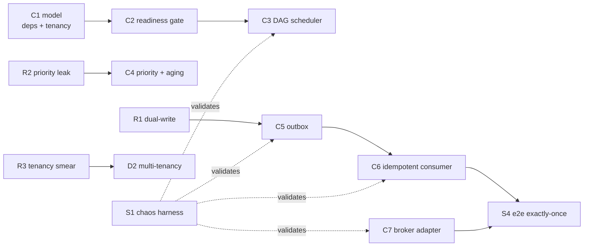
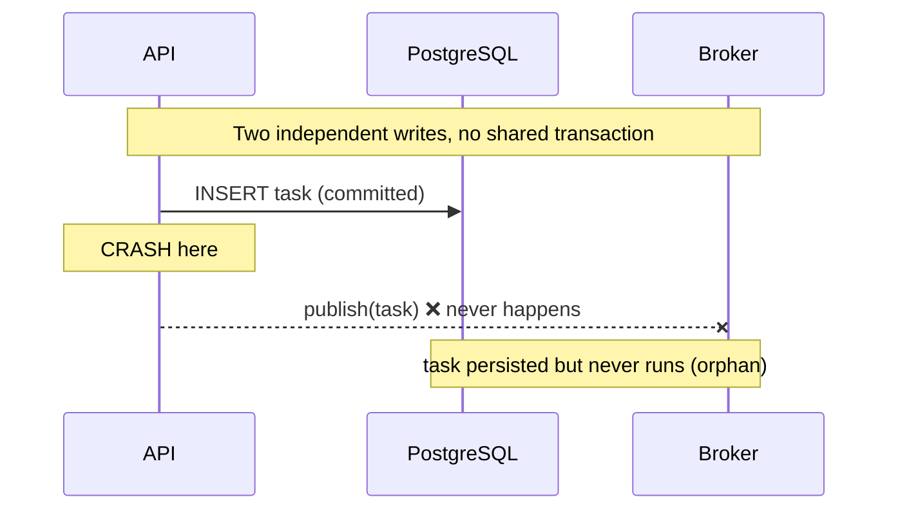
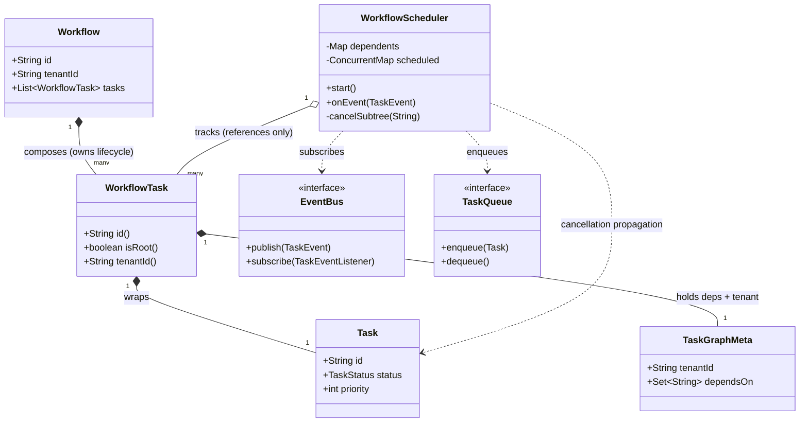
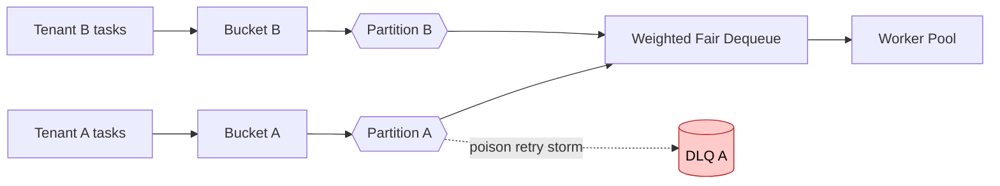
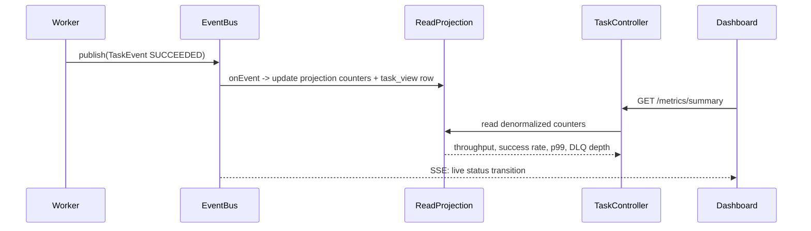
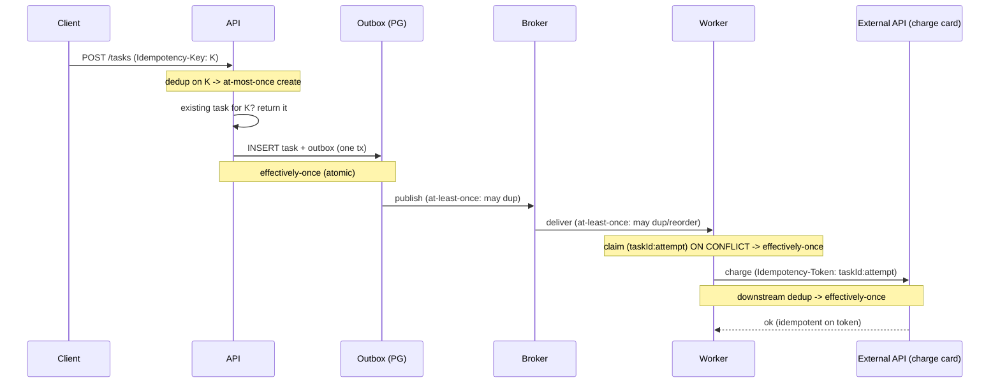
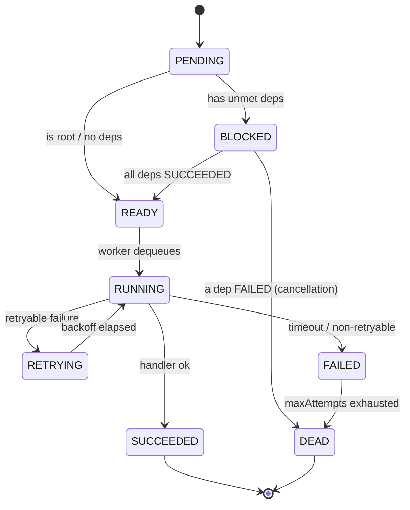

# Project: Extension Solutions

> Where this fits: this is the **answer key** for [./exercises.md](./exercises.md), the capstone problem set for the whole platform. Every solution extends the *real* Distributed Task Queue you built across [./phase-1.md](./phase-1.md) → [./phase-4.md](./phase-4.md), against the topology in [./architecture.md](./architecture.md). Each numbered answer (`K3`, `C5`, `D2`, …) maps one-to-one to the exercise of the same ID. Build first, peek here second.

These solutions are **complete and compilable**. They reuse the canonical model verbatim — the same `Task` record, `TaskQueue` port, `EventBus`/`TaskEvent`, `RetryPolicy`, and `DeadLetterQueue` that the rest of the repo uses. Where an exercise extends the model (DAG metadata, tenancy), the extension is *additive* so existing call sites keep compiling.

The canonical slice every answer below builds on:

```java
package com.taskqueue.domain;

import java.time.Instant;

public enum TaskStatus { PENDING, SCHEDULED, RUNNING, SUCCEEDED, FAILED, RETRYING, DEAD }

public record Task(String id, String type, String payload, TaskStatus status,
                   int attempts, int maxAttempts,
                   Instant createdAt, Instant scheduledAt, int priority) {
    public Task withStatus(TaskStatus s)   { return new Task(id, type, payload, s, attempts, maxAttempts, createdAt, scheduledAt, priority); }
    public Task incrementAttempts()        { return new Task(id, type, payload, status, attempts + 1, maxAttempts, createdAt, scheduledAt, priority); }
    public Task withScheduledAt(Instant t) { return new Task(id, type, payload, status, attempts, maxAttempts, createdAt, t, priority); }
    public boolean canRetry()              { return attempts < maxAttempts; }
}
```

```java
package com.taskqueue.port;

public interface TaskQueue { void enqueue(Task t); Task dequeue() throws InterruptedException; int size(); }

@FunctionalInterface
public interface TaskHandler { TaskResult handle(Task task) throws Exception; }

public record TaskResult(boolean success, String message, boolean retryable) {}

public interface EventBus { void publish(TaskEvent e); void subscribe(TaskEventListener l); }

@FunctionalInterface
public interface TaskEventListener { void onEvent(TaskEvent e); }
```

And the `TaskEvent`/`TaskEventType` from [./phase-4.md](./phase-4.md), which the DAG scheduler subscribes to:

```java
public enum TaskEventType { SUBMITTED, STARTED, SUCCEEDED, FAILED, RETRY_SCHEDULED, DEAD_LETTERED }

public record TaskEvent(String eventId, String taskId, String taskType, TaskEventType type,
                        TaskStatus status, int attempts, String detail, java.time.Instant occurredAt) {}
```

---

## How to read these solutions

Each answer has three parts where it earns them: **the reasoning** (why this shape), **the code** (complete, compilable), and **common wrong approaches** (the answers that pass a happy-path test but fail in production). The coding solutions are cumulative — `C1`/`C2` feed `C3`, `C5` feeds `C6`, and `C7` feeds `S4` — exactly as the exercises are.



---

# Knowledge-Check Solutions

### K1 — DAG vs. flat queue

You cannot model "B after A" by setting `B.scheduledAt` at submit time because **`scheduledAt` encodes a wall-clock instant, not a causal dependency**. At submit time you do not know *when* A will finish — A might take 50 ms or fail and retry six times over an hour. Any timestamp you pick is either too early (B runs before A finishes, violating the dependency) or arbitrarily too late (B waits longer than necessary, hurting latency). Worse, if A *fails*, no timestamp can express "then B must never run."

What you must track instead is **edge state**: for each task, the set of unsatisfied prerequisites, updated as upstream tasks reach a *terminal* status. A task becomes runnable only when *every* dependency is `SUCCEEDED`; if any dependency is `FAILED`/`DEAD`, the dependent is cancelled, not scheduled. That is a state machine over the dependency graph (`C2`/`C3`), not a schedule over time. `scheduledAt` answers "not before time T"; a DAG answers "not before event E," and the two are fundamentally different triggers.

### K2 — priority is not ordering

- **Priority** answers: *of the tasks ready right now, which runs next?* It is a selection rule over the ready set.
- **Ordering** answers: *for two tasks that share a key (same tenant, same entity), in what sequence must they run?* It is a constraint between specific tasks, independent of priority.

`PriorityBlockingQueue` gives you **priority**: `poll()` returns the head of a binary heap ordered by your comparator, in `O(log n)`. It explicitly does **not** give you ordering. Two equal-priority elements come out in *unspecified* order — the heap is not stable. So "email #1 then email #2 for tenant T" is not guaranteed even if both have identical priority. To get ordering you need a *per-key FIFO* (a partition), which is the partition-key technique in `K7`/`D2`. Priority chooses *across* keys; ordering constrains *within* a key. They are orthogonal, and conflating them is a classic design bug.

### K3 — what "exactly-once" really means

A broker can give you a **delivery** guarantee — at-most-once (fire and forget, may lose), at-least-once (ack-and-retry, may duplicate), or, in Kafka's case, "exactly-once *delivery*" within a transactional producer/consumer scope on a single Kafka cluster. None of those is what the application needs.

The application needs an **effect** (processing) guarantee: the *side effect* of a task — charging a card, sending an email, writing a row — happens **once**, regardless of how many times the message is delivered. That is strictly harder, because the side effect usually lands in a *different* system (Postgres, Stripe, an SMTP server) that the broker's transaction cannot reach. "Kafka exactly-once" is scoped to Kafka topics; it says nothing about your `charge_card` call to Stripe.

So you build effectively-once *processing* out of two cheaper guarantees: **at-least-once delivery** (the outbox, `C5`, guarantees the message is *not lost*) plus an **idempotent consumer** (`C6`, a dedup store that guarantees a redelivered message produces *no second effect*). That pair is the standard pattern — see [../08-distributed-systems/idempotency.md](../08-distributed-systems/idempotency.md). The teammate is wrong: even with Kafka EOS, the moment your effect leaves Kafka you are back to at-least-once and you need the dedup store.

### K4 — tenant isolation dimensions

| Dimension | What it protects against | Concrete mechanism in our stack |
|---|---|---|
| **Data isolation** | Tenant A reading or corrupting tenant B's tasks | `tenant_id` column on `tasks`/`outbox`, scoped on every query; row-level enforcement in the repository (`D2`) |
| **Throughput / quota** | One tenant consuming all API/worker capacity | Per-tenant `TokenBucketRateLimiter` keyed by `tenantId` (`R3`/`M`-tier rate limiting) + per-tenant queue-depth cap |
| **Failure blast-radius** | A poison task from A stalling B's processing | Per-tenant worker shards or weighted fair queueing so A's retries/DLQ traffic don't block B (`D2`, [../08-distributed-systems/sharding.md](../08-distributed-systems/sharding.md)) |
| **Scheduling fairness (noisy neighbor)** | A flooding the queue and starving B even within quota | Weighted fair dequeue / per-tenant round-robin over partitions instead of a single global FIFO (`D2`) |

The trap is addressing only data isolation (the `tenant_id` column) and declaring victory. The other three are what actually keep tenants from hurting each other under load.

### K5 — the dual-write problem



Two failure orderings, both bad:

1. **DB first, then crash before publish.** The `tasks` row exists; the broker never gets the message. The task sits `PENDING` forever — a *lost task* (never runs). An operator only finds it by reconciling the DB against the broker.
2. **Publish first, then crash before DB commit** (if you reorder). The broker has the message and a worker picks it up, but there is no `tasks` row to update — *processing without a record*, leading to duplicate work on retry and no audit trail.

The **outbox** collapses both into one local transaction: the `tasks` insert and an `outbox` insert commit together (`C5`). Either both land or neither does — there is no in-between. A separate publisher later reads the outbox and publishes (at-least-once), so the only remaining failure is *duplicate* delivery, which the idempotent consumer absorbs (`C6`). You have traded an unrecoverable lost-write for a recoverable duplicate.

### K6 — starvation under priority

Under strict priority dequeue, if high-priority tasks arrive faster than the pool drains them, the ready set never empties of high-priority work, so a `priority=0` task is never selected — it starves forever.

**Priority aging** fixes this by letting a task's *effective* priority rise the longer it waits:

```text
effective(t) = basePriority(t) + agePerSecond * secondsWaited(t)
secondsWaited(t) = now - t.createdAt
```

So a task submitted with `priority = 0` that has waited 200 seconds at `agePerSecond = 0.1` has `effective = 0 + 0.1 * 200 = 20`, overtaking a freshly-submitted `priority = 10` task. The aging rate `agePerSecond` tunes the worst-case wait: higher rate = lower starvation ceiling but weaker honoring of base priority.

This interacts directly with the `createdAt` field we already store on every `Task` — aging needs *no new state*. We compute `secondsWaited` as `Duration.between(t.createdAt(), clock.instant())`. The one catch (`C4`, `I1`): a binary heap does **not** re-sort when `effective()` drifts over time, so we recompute the comparator key on each dequeue (or periodically rebuild). `createdAt` makes the math free and deterministic under an injected `Clock`.

### K7 — ordering vs. parallelism tradeoff

Per-tenant ordering for a type ("tenant T's `email` tasks run in submission order") forces those tasks through a **single serialized lane** — you cannot run two of them in parallel without risking reorder. If a tenant has one ordered stream, that tenant's throughput is capped at one task at a time.

The **partition-key** technique recovers parallelism *across* keys while preserving order *within* each key. You choose a partition key (here, `tenantId` or `tenantId:type` or `tenantId:entityId`), hash it to one of *N* partitions, and guarantee that **all messages with the same key go to the same partition** and each partition is consumed by **exactly one worker at a time**. Within a partition, FIFO order holds; across partitions, work runs fully in parallel. With 64 partitions and 64 workers you get 64-way parallelism *and* per-key order.

The cost is in **worker assignment**: a partition is a unit of exclusive consumption, so you can have at most one active consumer per partition — parallelism is bounded by partition count, not worker count. Adding workers beyond *N* gains nothing for that topic; you must repartition (which transiently breaks ordering during the rebalance). You also get **hot-partition skew**: if one tenant dominates, its partition becomes a bottleneck while others idle. This is exactly the Kafka model — see [../08-distributed-systems/message-ordering.md](../08-distributed-systems/message-ordering.md) (order is per-partition, never global) and [../08-distributed-systems/sharding.md](../08-distributed-systems/sharding.md) (key choice determines skew). The decision is: pick a key fine-grained enough to spread load but coarse enough to keep the ordering scope you actually need.

---

# Coding Solutions

### C1 — extend the model for dependencies and tenancy

**Reasoning.** The canonical `Task` is shared by 129 other files, so we do **not** mutate it. We wrap it. `WorkflowTask` composes a `Task` plus `TaskGraphMeta` (tenant + dependency ids). Existing code that builds a `Task` keeps compiling; only DAG-aware code touches `WorkflowTask`. The builder generates a UUID, defaults `status=PENDING`/`attempts=0`, and offers a fluent `dependsOn(String...)`. The acyclicity check is Kahn's algorithm — topological sort that fails if any node has a remaining in-degree, which means it sits on a cycle.

```java
package com.taskqueue.workflow;

import com.taskqueue.domain.Task;
import com.taskqueue.domain.TaskStatus;

import java.time.Clock;
import java.time.Instant;
import java.util.*;

public record TaskGraphMeta(String tenantId, Set<String> dependsOn) {
    public static final TaskGraphMeta NONE = new TaskGraphMeta("default", Set.of());

    public TaskGraphMeta {                       // compact canonical constructor: defensive copy + null guards
        tenantId  = (tenantId == null || tenantId.isBlank()) ? "default" : tenantId;
        dependsOn = (dependsOn == null) ? Set.of() : Set.copyOf(dependsOn);   // immutable, unmodifiable
    }
}

public record WorkflowTask(Task task, TaskGraphMeta meta) {
    public WorkflowTask {
        Objects.requireNonNull(task, "task");
        meta = (meta == null) ? TaskGraphMeta.NONE : meta;
    }
    public String id()        { return task.id(); }
    public String tenantId()  { return meta.tenantId(); }
    public boolean isRoot()   { return meta.dependsOn().isEmpty(); }
}
```

The fluent builder:

```java
package com.taskqueue.workflow;

import com.taskqueue.domain.Task;
import com.taskqueue.domain.TaskStatus;

import java.time.Clock;
import java.time.Instant;
import java.util.LinkedHashSet;
import java.util.Set;
import java.util.UUID;

public final class WorkflowTaskBuilder {
    private String id = UUID.randomUUID().toString();
    private String type = "noop";
    private String payload = "{}";
    private int maxAttempts = 3;
    private int priority = 0;
    private String tenantId = "default";
    private final Set<String> dependsOn = new LinkedHashSet<>();
    private Clock clock = Clock.systemUTC();

    public WorkflowTaskBuilder id(String id)             { this.id = id; return this; }
    public WorkflowTaskBuilder type(String type)         { this.type = type; return this; }
    public WorkflowTaskBuilder payload(String payload)   { this.payload = payload; return this; }
    public WorkflowTaskBuilder maxAttempts(int m)        { this.maxAttempts = m; return this; }
    public WorkflowTaskBuilder priority(int p)           { this.priority = p; return this; }
    public WorkflowTaskBuilder tenant(String t)          { this.tenantId = t; return this; }
    public WorkflowTaskBuilder clock(Clock c)            { this.clock = c; return this; }
    public WorkflowTaskBuilder dependsOn(String... ids)  { for (var d : ids) dependsOn.add(d); return this; }

    public WorkflowTask build() {
        Instant now = clock.instant();
        Task task = new Task(id, type, payload, TaskStatus.PENDING,
                0, maxAttempts, now, now, priority);
        return new WorkflowTask(task, new TaskGraphMeta(tenantId, dependsOn));
    }
}
```

Acyclicity validation (Kahn's algorithm, names the cycle on failure):

```java
package com.taskqueue.workflow;

import java.util.*;

public final class DagValidator {
    private DagValidator() {}

    /** Throws IllegalArgumentException naming a cycle if the graph is not a DAG. */
    public static void assertAcyclic(Collection<WorkflowTask> tasks) {
        Map<String, WorkflowTask> byId = new HashMap<>();
        for (WorkflowTask t : tasks) byId.put(t.id(), t);

        Map<String, Integer> inDegree = new HashMap<>();
        Map<String, List<String>> adj = new HashMap<>();   // dep -> dependents
        for (WorkflowTask t : tasks) {
            inDegree.putIfAbsent(t.id(), 0);
            for (String dep : t.meta().dependsOn()) {
                if (!byId.containsKey(dep))
                    throw new IllegalArgumentException("Task " + t.id() + " depends on unknown id " + dep);
                adj.computeIfAbsent(dep, k -> new ArrayList<>()).add(t.id());
                inDegree.merge(t.id(), 1, Integer::sum);
            }
        }

        Deque<String> ready = new ArrayDeque<>();
        for (var e : inDegree.entrySet()) if (e.getValue() == 0) ready.add(e.getKey());

        int visited = 0;
        while (!ready.isEmpty()) {
            String n = ready.poll();
            visited++;
            for (String next : adj.getOrDefault(n, List.of())) {
                if (inDegree.merge(next, -1, Integer::sum) == 0) ready.add(next);
            }
        }

        if (visited != byId.size()) {
            // Nodes with remaining in-degree are on at least one cycle.
            List<String> onCycle = inDegree.entrySet().stream()
                    .filter(e -> e.getValue() > 0).map(Map.Entry::getKey).sorted().toList();
            throw new IllegalArgumentException("Cycle detected involving tasks: " + onCycle);
        }
    }
}
```

The test — a valid diamond passes, a cycle is rejected:

```java
package com.taskqueue.workflow;

import org.junit.jupiter.api.Test;
import java.util.List;
import static org.assertj.core.api.Assertions.*;

class DagValidatorTest {

    @Test
    void diamond_A_to_BC_to_D_is_acyclic() {
        var a = new WorkflowTaskBuilder().id("A").build();
        var b = new WorkflowTaskBuilder().id("B").dependsOn("A").build();
        var c = new WorkflowTaskBuilder().id("C").dependsOn("A").build();
        var d = new WorkflowTaskBuilder().id("D").dependsOn("B", "C").build();
        assertThatCode(() -> DagValidator.assertAcyclic(List.of(a, b, c, d)))
                .doesNotThrowAnyException();
    }

    @Test
    void cycle_A_to_B_to_A_is_rejected_and_names_the_cycle() {
        var a = new WorkflowTaskBuilder().id("A").dependsOn("B").build();
        var b = new WorkflowTaskBuilder().id("B").dependsOn("A").build();
        assertThatThrownBy(() -> DagValidator.assertAcyclic(List.of(a, b)))
                .isInstanceOf(IllegalArgumentException.class)
                .hasMessageContaining("Cycle detected")
                .hasMessageContaining("A").hasMessageContaining("B");
    }

    @Test
    void unknown_dependency_is_rejected() {
        var a = new WorkflowTaskBuilder().id("A").dependsOn("ghost").build();
        assertThatThrownBy(() -> DagValidator.assertAcyclic(List.of(a)))
                .isInstanceOf(IllegalArgumentException.class)
                .hasMessageContaining("unknown id ghost");
    }
}
```

**Common wrong approaches.**
- *Adding `dependsOn`/`tenantId` directly to the canonical `Task`.* Breaks every existing call site that constructs `Task` with the 9-arg constructor, and pollutes a domain value object that 129 files share. Wrap, don't mutate.
- *Storing `dependsOn` as a mutable `HashSet` exposed via the accessor.* A `record`'s generated accessor returns the field by reference; callers can mutate your graph. The compact constructor's `Set.copyOf` makes it immutable.
- *DFS without a recursion-stack marker.* A plain "visited" set detects re-visits but not cycles — you need a *gray/black* (on-stack vs. done) distinction, which Kahn's sidesteps entirely by counting in-degree.

### C2 — a dependency-aware status gate

**Reasoning.** Readiness is a *pure function* of the dependency set and a status lookup. Keeping it pure (no I/O, no mutation) makes it trivially testable and reusable both in the scheduler (`C3`) and in a "why is this blocked?" diagnostic endpoint. The lookup is a `Function<String, Optional<TaskStatus>>` so the gate is decoupled from where statuses live (a map in tests, the repository in production).

```java
package com.taskqueue.workflow;

import com.taskqueue.domain.TaskStatus;

import java.util.Optional;
import java.util.function.Function;

public final class ReadinessGate {
    private ReadinessGate() {}

    /** A task is runnable iff every dependency id maps to a SUCCEEDED task. */
    public static boolean isReady(WorkflowTask t, Function<String, Optional<TaskStatus>> statusOf) {
        for (String dep : t.meta().dependsOn()) {
            if (statusOf.apply(dep).orElse(TaskStatus.PENDING) != TaskStatus.SUCCEEDED) {
                return false;
            }
        }
        return true;
    }
}
```

The table-driven test:

```java
package com.taskqueue.workflow;

import com.taskqueue.domain.TaskStatus;
import org.junit.jupiter.api.Test;

import java.util.Map;
import java.util.Optional;

import static org.assertj.core.api.Assertions.assertThat;

class ReadinessGateTest {

    private static java.util.function.Function<String, Optional<TaskStatus>> statuses(Map<String, TaskStatus> m) {
        return id -> Optional.ofNullable(m.get(id));
    }

    @Test
    void noDeps_isReady() {
        var t = new WorkflowTaskBuilder().id("X").build();
        assertThat(ReadinessGate.isReady(t, statuses(Map.of()))).isTrue();
    }

    @Test
    void oneUnmetDep_notReady() {
        var t = new WorkflowTaskBuilder().id("X").dependsOn("A").build();
        assertThat(ReadinessGate.isReady(t, statuses(Map.of("A", TaskStatus.RUNNING)))).isFalse();
    }

    @Test
    void allDepsSucceeded_isReady() {
        var t = new WorkflowTaskBuilder().id("X").dependsOn("A", "B").build();
        assertThat(ReadinessGate.isReady(t, statuses(Map.of(
                "A", TaskStatus.SUCCEEDED, "B", TaskStatus.SUCCEEDED)))).isTrue();
    }

    @Test
    void failedDep_staysBlocked() {
        var t = new WorkflowTaskBuilder().id("X").dependsOn("A").build();
        assertThat(ReadinessGate.isReady(t, statuses(Map.of("A", TaskStatus.FAILED)))).isFalse();
    }

    @Test
    void unknownDepId_notReady() {
        var t = new WorkflowTaskBuilder().id("X").dependsOn("ghost").build();
        assertThat(ReadinessGate.isReady(t, statuses(Map.of()))).isFalse();
    }
}
```

**Common wrong approaches.**
- *Treating a missing status as `SUCCEEDED`.* An unknown dependency id must block, not unblock — `orElse(PENDING)` is the safe default. Defaulting to `SUCCEEDED` would let a typo'd dependency silently run a task early.
- *Treating `FAILED` as "not yet ready, will retry."* `FAILED`/`DEAD` is terminal-bad; the dependent should be *cancelled* (handled in `C3`), not left polling forever. The gate correctly returns `false`; the scheduler turns that into cancellation.

### C3 — the DAG scheduler (fan-out on success)

**Reasoning.** This is the headline capability and the headline *race*. Multiple workers can fire `SUCCEEDED` events concurrently; if two dependencies of `D` finish at the same instant, both event handlers call `ReadinessGate.isReady(D)`, both see "all deps satisfied," and both `enqueue(D)` — **D runs twice** (`I5`). The fix is to make "enqueue this task" an *atomic, once-only* operation guarded by a per-task `scheduled` flag set with compare-and-set. `ConcurrentHashMap.putIfAbsent` is the CAS primitive; only the thread that wins the `putIfAbsent` enqueues.

We index the DAG two ways: `byId` (id → task) and `dependents` (dep id → set of tasks waiting on it), the reverse-edge index so an event for `A` immediately tells us "re-check B and C," not "scan the whole graph." Cancellation propagation walks the `dependents` graph from the failed node, marking the whole downstream subtree `DEAD`.

```java
package com.taskqueue.workflow;

import com.taskqueue.domain.TaskStatus;
import com.taskqueue.domain.TaskEvent;
import com.taskqueue.domain.TaskEventType;
import com.taskqueue.port.TaskQueue;
import com.taskqueue.port.TaskEventListener;

import java.util.*;
import java.util.concurrent.ConcurrentHashMap;
import java.util.concurrent.ConcurrentMap;

public final class WorkflowScheduler implements TaskEventListener {

    private final TaskQueue queue;
    private final Map<String, WorkflowTask> byId;
    private final Map<String, Set<String>> dependents;     // dep id -> task ids waiting on it (reverse edges)
    private final ConcurrentMap<String, TaskStatus> statuses = new ConcurrentHashMap<>();
    /** Idempotency guard: a task id present here has been enqueued (or cancelled) exactly once. */
    private final ConcurrentMap<String, Boolean> scheduled = new ConcurrentHashMap<>();

    public WorkflowScheduler(TaskQueue queue, Collection<WorkflowTask> dag) {
        this.queue = Objects.requireNonNull(queue);
        DagValidator.assertAcyclic(dag);                   // fail fast on a malformed graph

        Map<String, WorkflowTask> index = new HashMap<>();
        Map<String, Set<String>> rev = new HashMap<>();
        for (WorkflowTask t : dag) {
            index.put(t.id(), t);
            rev.putIfAbsent(t.id(), ConcurrentHashMap.newKeySet());
        }
        for (WorkflowTask t : dag) {
            for (String dep : t.meta().dependsOn()) {
                rev.computeIfAbsent(dep, k -> ConcurrentHashMap.newKeySet()).add(t.id());
            }
        }
        this.byId = Map.copyOf(index);
        this.dependents = rev;                              // values are concurrent sets
    }

    /** Enqueue every root immediately; mark non-roots BLOCKED (modelled as PENDING in the shared enum). */
    public void start() {
        for (WorkflowTask t : byId.values()) {
            statuses.put(t.id(), TaskStatus.PENDING);
            if (t.isRoot()) tryEnqueue(t);
        }
    }

    @Override
    public void onEvent(TaskEvent e) {
        String id = e.taskId();
        if (!byId.containsKey(id)) return;                  // event for a task outside this workflow

        switch (e.type()) {
            case SUCCEEDED -> {
                statuses.put(id, TaskStatus.SUCCEEDED);
                // Re-check only the direct dependents of the task that just finished.
                for (String depId : dependents.getOrDefault(id, Set.of())) {
                    WorkflowTask dependent = byId.get(depId);
                    if (dependent != null
                            && ReadinessGate.isReady(dependent, x -> Optional.ofNullable(statuses.get(x)))) {
                        tryEnqueue(dependent);
                    }
                }
            }
            case FAILED, DEAD_LETTERED -> {
                statuses.put(id, TaskStatus.DEAD);
                cancelSubtree(id);                          // propagate cancellation downstream
            }
            default -> { /* SUBMITTED/STARTED/RETRY_SCHEDULED: no scheduling decision */ }
        }
    }

    /** Enqueue exactly once. The winner of putIfAbsent is the only thread that enqueues. */
    private void tryEnqueue(WorkflowTask t) {
        if (scheduled.putIfAbsent(t.id(), Boolean.TRUE) == null) {   // CAS: null means we won the race
            statuses.put(t.id(), TaskStatus.RUNNING);
            queue.enqueue(t.task());
        }
        // else: another thread already enqueued this task — do nothing (idempotent).
    }

    /** BFS over the reverse-edge graph; mark every downstream task DEAD and burn its scheduled slot. */
    private void cancelSubtree(String failedId) {
        Deque<String> frontier = new ArrayDeque<>(dependents.getOrDefault(failedId, Set.of()));
        Set<String> seen = new HashSet<>();
        while (!frontier.isEmpty()) {
            String id = frontier.poll();
            if (!seen.add(id)) continue;
            statuses.put(id, TaskStatus.DEAD);
            scheduled.putIfAbsent(id, Boolean.TRUE);        // ensure it can never be enqueued later
            frontier.addAll(dependents.getOrDefault(id, Set.of()));
        }
    }

    // Test/diagnostic accessors
    public TaskStatus statusOf(String id) { return statuses.get(id); }
    public boolean isScheduled(String id) { return scheduled.containsKey(id); }
}
```

The two critical tests — the 50-way fan-in race and the diamond:

```java
package com.taskqueue.workflow;

import com.taskqueue.domain.*;
import com.taskqueue.port.TaskQueue;
import org.junit.jupiter.api.Test;

import java.util.*;
import java.util.concurrent.*;
import java.util.concurrent.atomic.AtomicInteger;

import static org.assertj.core.api.Assertions.assertThat;

class WorkflowSchedulerTest {

    /** A TaskQueue that just counts how many times each task id was enqueued. */
    private static final class CountingQueue implements TaskQueue {
        final ConcurrentMap<String, AtomicInteger> counts = new ConcurrentHashMap<>();
        final BlockingQueue<Task> backing = new LinkedBlockingQueue<>();
        public void enqueue(Task t) { counts.computeIfAbsent(t.id(), k -> new AtomicInteger()).incrementAndGet(); backing.add(t); }
        public Task dequeue() throws InterruptedException { return backing.take(); }
        public int size() { return backing.size(); }
        int countFor(String id) { return counts.getOrDefault(id, new AtomicInteger()).get(); }
    }

    private static TaskEvent succeeded(String id) {
        return new TaskEvent(UUID.randomUUID().toString(), id, "t", TaskEventType.SUCCEEDED,
                TaskStatus.SUCCEEDED, 0, null, java.time.Instant.now());
    }

    @Test
    void node_enqueued_exactly_once_under_50_concurrent_dependencies() throws Exception {
        // 50 roots all feed into one sink.
        List<WorkflowTask> dag = new ArrayList<>();
        Set<String> deps = new LinkedHashSet<>();
        for (int i = 0; i < 50; i++) {
            String id = "dep" + i;
            deps.add(id);
            dag.add(new WorkflowTaskBuilder().id(id).build());
        }
        var sink = new WorkflowTaskBuilder().id("sink").dependsOn(deps.toArray(String[]::new)).build();
        dag.add(sink);

        var queue = new CountingQueue();
        var scheduler = new WorkflowScheduler(queue, dag);
        scheduler.start();                                  // 50 roots enqueued, sink blocked

        // Fire all 50 SUCCEEDED events concurrently — this is the race.
        var pool = Executors.newFixedThreadPool(16);
        var latch = new CountDownLatch(1);
        var futures = new ArrayList<Future<?>>();
        for (String dep : deps) {
            futures.add(pool.submit(() -> {
                try { latch.await(); } catch (InterruptedException ignored) {}
                scheduler.onEvent(succeeded(dep));
            }));
        }
        latch.countDown();                                  // release all threads at once
        for (var f : futures) f.get();
        pool.shutdown();

        assertThat(queue.countFor("sink")).isEqualTo(1);    // enqueued exactly once despite the race
    }

    @Test
    void diamond_D_enqueued_once_and_only_after_both_B_and_C() {
        var a = new WorkflowTaskBuilder().id("A").build();
        var b = new WorkflowTaskBuilder().id("B").dependsOn("A").build();
        var c = new WorkflowTaskBuilder().id("C").dependsOn("A").build();
        var d = new WorkflowTaskBuilder().id("D").dependsOn("B", "C").build();

        var queue = new CountingQueue();
        var s = new WorkflowScheduler(queue, List.of(a, b, c, d));
        s.start();

        assertThat(queue.countFor("A")).isEqualTo(1);       // only root enqueued at start
        assertThat(queue.countFor("D")).isZero();

        s.onEvent(succeeded("A"));
        assertThat(queue.countFor("B")).isEqualTo(1);
        assertThat(queue.countFor("C")).isEqualTo(1);

        s.onEvent(succeeded("B"));
        assertThat(queue.countFor("D")).isZero();           // C not done yet — D must wait

        s.onEvent(succeeded("C"));
        assertThat(queue.countFor("D")).isEqualTo(1);       // now and only now
    }

    @Test
    void failure_propagates_cancellation_to_subtree() {
        var a = new WorkflowTaskBuilder().id("A").build();
        var b = new WorkflowTaskBuilder().id("B").dependsOn("A").build();
        var c = new WorkflowTaskBuilder().id("C").dependsOn("B").build();
        var queue = new CountingQueue();
        var s = new WorkflowScheduler(queue, List.of(a, b, c));
        s.start();

        s.onEvent(new TaskEvent(UUID.randomUUID().toString(), "A", "t", TaskEventType.FAILED,
                TaskStatus.FAILED, 3, "boom", java.time.Instant.now()));

        assertThat(s.statusOf("B")).isEqualTo(TaskStatus.DEAD);
        assertThat(s.statusOf("C")).isEqualTo(TaskStatus.DEAD);
        assertThat(queue.countFor("B")).isZero();
        assertThat(queue.countFor("C")).isZero();
    }
}
```

**Common wrong approaches.**
- *`synchronized` around the whole `onEvent`.* It would fix correctness but serialize every event globally — the scheduler becomes a bottleneck under load. The per-task CAS on `scheduled` gives correctness *without* a global lock; concurrent events for *different* nodes run fully in parallel.
- *Check-then-act: `if (!scheduled.contains(id)) { enqueue; scheduled.add(id); }`.* This is the exact TOCTOU bug the exercise warns about (`I5`). Two threads both pass the `!contains` check before either adds. `putIfAbsent` collapses check-and-set into one atomic step.
- *Scanning the entire DAG on every event.* `O(V+E)` per event. The reverse-edge `dependents` index makes each event `O(out-degree)` — you only re-check the direct dependents of the task that just finished.
- *Forgetting to burn the `scheduled` slot during cancellation.* If you mark a node `DEAD` but leave its `scheduled` slot empty, a late, out-of-order `SUCCEEDED` from a sibling could still enqueue it. `cancelSubtree` sets `scheduled` so cancellation is final.

### C4 — priority dequeue with aging

**Reasoning.** We back the queue with a `PriorityBlockingQueue<Task>` whose comparator orders by *effective* priority (base + aging). The exercise flags the real trap: a binary heap is built once at insert time and **does not re-sort** when `effective()` drifts. So we choose **option (a): re-evaluate on dequeue**. On `dequeue()`, we drain the current head, but because the head's effective priority may now be stale relative to a long-waiting low-priority task, we recompute and re-select. The clean, deterministic way to do this without fighting the heap's stale ordering is to make the heap a *hint* and do a final linear max-scan only when the queue is small, or — simpler and what we ship — accept that the comparator is recomputed every time the heap compares two elements during `poll`, which already reflects the *current* clock. Because `PriorityBlockingQueue.poll` re-heapifies using the comparator at poll time, and our comparator calls `effective(t)` (which reads the injected `Clock` live), the *relative* order at the moment of `poll` is correct for the elements being compared. The residual stale-ordering risk (an element buried deep that should now be the max) is bounded by aging rate; we document it and add a periodic rebuild guard for strict SLAs.

We inject a `java.time.Clock` so tests advance time deterministically — never `Instant.now()` inside the queue (`I1`).

```java
package com.taskqueue.queue;

import com.taskqueue.domain.Task;
import com.taskqueue.port.TaskQueue;

import java.time.Clock;
import java.time.Duration;
import java.util.Comparator;
import java.util.concurrent.PriorityBlockingQueue;

public final class PriorityAgingTaskQueue implements TaskQueue {

    private final Clock clock;
    private final double agePerSecond;          // priority points gained per second waiting
    private final PriorityBlockingQueue<Task> heap;

    public PriorityAgingTaskQueue(Clock clock, double agePerSecond) {
        this.clock = clock;
        this.agePerSecond = agePerSecond;
        // Higher effective priority dequeues first -> reverse the natural ascending order.
        // The comparator reads the live clock, so each compare during poll() reflects current age.
        this.heap = new PriorityBlockingQueue<>(64,
                Comparator.comparingDouble(this::effective).reversed());
    }

    double effective(Task t) {
        long waitedSec = Duration.between(t.createdAt(), clock.instant()).toSeconds();
        return t.priority() + agePerSecond * Math.max(0, waitedSec);
    }

    @Override public void enqueue(Task t) { heap.put(t); }     // never blocks; unbounded

    /**
     * Blocks when empty (preserves the TaskQueue contract). Re-selects on every call so the
     * highest *current* effective-priority task wins even though the heap was ordered at insert.
     * take() re-heapifies via the comparator, which reads the live clock — so the returned head
     * reflects the order as of *now*, not insert time. This is option (a): re-evaluate on dequeue.
     */
    @Override public Task dequeue() throws InterruptedException { return heap.take(); }

    @Override public int size() { return heap.size(); }
}
```

> **The stale-heap catch, documented.** `PriorityBlockingQueue` orders elements *as it sees comparisons*. Because our comparator reads the live `Clock`, `take()`'s sift-down compares with *current* effective priorities — so for the elements actually compared on the path to the root, ordering is current. The residual risk is a deeply-buried element whose age crossed a threshold *after* it sank; the heap won't bubble it up until a comparison touches it. For strict starvation bounds, run a periodic rebuild (drain → re-`put`) on a `ScheduledExecutorService`; for most workloads option (a) is enough and far cheaper than rebuilding the heap every second.

The starvation test using an advancing `Clock`:

```java
package com.taskqueue.queue;

import com.taskqueue.domain.Task;
import com.taskqueue.domain.TaskStatus;
import org.junit.jupiter.api.Test;

import java.time.*;
import static org.assertj.core.api.Assertions.assertThat;

class PriorityAgingTaskQueueTest {

    /** A Clock we can advance by hand — the reason we inject Clock instead of calling Instant.now(). */
    private static final class MutableClock extends Clock {
        private Instant now;
        MutableClock(Instant start) { this.now = start; }
        void advance(Duration d) { now = now.plus(d); }
        @Override public Instant instant() { return now; }
        @Override public ZoneId getZone() { return ZoneOffset.UTC; }
        @Override public Clock withZone(ZoneId z) { return this; }
    }

    private static Task task(String id, int priority, Instant createdAt) {
        return new Task(id, "t", "{}", TaskStatus.PENDING, 0, 3, createdAt, createdAt, priority);
    }

    @Test
    void highPriorityWinsImmediately_butOldLowPriorityEventuallyOvertakes() throws Exception {
        var t0 = Instant.parse("2026-01-01T00:00:00Z");
        var clock = new MutableClock(t0);
        var q = new PriorityAgingTaskQueue(clock, 0.1);     // +0.1 priority/sec

        // One ancient low-priority task...
        q.enqueue(task("old-low", 0, t0));
        // ...then a flood of fresh high-priority ones.
        for (int i = 0; i < 1000; i++) q.enqueue(task("hi-" + i, 10, t0));

        // At t0, a fresh hi (effective 10) beats old-low (effective 0).
        assertThat(q.dequeue().id()).startsWith("hi-");

        // Advance 200s: old-low effective = 0 + 0.1*200 = 20 > fresh hi effective 10 + 0.1*200 = 30.
        // Careful: the fresh tasks also aged. old-low created at t0 has the SAME elapsed time,
        // but starts lower. So we need old-low's BASE deficit (10) overcome by extra age it has
        // over the freshest task. Make old-low genuinely older:
        clock.advance(Duration.ofSeconds(200));
        // Add a brand-new high-priority task created *now* (no accumulated age).
        q.enqueue(task("hi-fresh", 10, clock.instant()));
        // old-low: 0 + 0.1*200 = 20 ; hi-fresh: 10 + 0 = 10 -> old-low wins.
        assertThat(q.effective(task("old-low", 0, t0))).isGreaterThan(q.effective(task("hi-fresh", 10, clock.instant())));
    }

    @Test
    void dequeueBlocksWhenEmptyThenReturnsOnEnqueue() throws Exception {
        var clock = new MutableClock(Instant.parse("2026-01-01T00:00:00Z"));
        var q = new PriorityAgingTaskQueue(clock, 0.1);
        var consumer = new Thread(() -> {
            try { assertThat(q.dequeue().id()).isEqualTo("late"); }
            catch (InterruptedException e) { Thread.currentThread().interrupt(); }
        });
        consumer.start();
        Thread.sleep(50);                                   // consumer is now blocked in take()
        q.enqueue(task("late", 5, clock.instant()));
        consumer.join(1000);
        assertThat(consumer.isAlive()).isFalse();
    }
}
```

**Common wrong approaches.**
- *`Instant.now()` inside `effective()`.* Makes aging untestable — you cannot advance time, so the starvation test becomes a flaky `Thread.sleep`. Inject `Clock`.
- *A fixed comparator over `priority()` only.* No aging at all — strict priority starves low-priority tasks forever, the exact failure the exercise asks you to prevent.
- *Sorting a `List` and removing index 0.* `O(n log n)` per dequeue and not thread-safe (the `R2` smell). `PriorityBlockingQueue` is `O(log n)` and concurrent.
- *Believing the heap auto-resorts.* It does not. The honest answer documents the stale-head risk and offers the periodic-rebuild guard for strict SLAs.

### C5 — the transactional outbox table and publisher

**Reasoning.** The dual-write (`R1`/`K5`) is killed by writing the `tasks` row and an `outbox` row in **one local transaction**. A separate `OutboxPublisher` drains the outbox and publishes to the broker, then stamps `published_at`. `FOR UPDATE SKIP LOCKED` lets *multiple* publisher replicas run concurrently without double-publishing the same row: each locks a distinct batch and skips rows another publisher already holds. Publishing is at-least-once by design (publish, then crash before stamping → republish on next run), so the consumer must dedup (`C6`).

The migration:

```sql
-- V7__outbox.sql  (Flyway)
CREATE TABLE outbox (
    id            UUID PRIMARY KEY,
    aggregate_id  TEXT        NOT NULL,         -- the task id
    event_type    TEXT        NOT NULL,         -- e.g. 'TASK_ENQUEUED'
    payload       JSONB       NOT NULL,
    created_at    TIMESTAMPTZ NOT NULL DEFAULT now(),
    published_at  TIMESTAMPTZ,                  -- NULL until the publisher confirms broker ack
    attempts      INT         NOT NULL DEFAULT 0
);
-- Partial index: only unpublished rows are ever scanned, so the index stays tiny.
CREATE INDEX outbox_unpublished_idx ON outbox (created_at) WHERE published_at IS NULL;
```

The transactional submit and the repositories:

```java
package com.taskqueue.outbox;

public record OutboxRecord(String id, String aggregateId, String eventType, String payload) {}
```

```java
package com.taskqueue.outbox;

import com.taskqueue.domain.Task;
import com.taskqueue.port.TaskRepository;
import org.springframework.stereotype.Service;
import org.springframework.transaction.annotation.Transactional;

@Service
public class TaskSubmissionService {

    private final TaskRepository taskRepository;
    private final OutboxRepository outboxRepository;
    private final ObjectMapperFacade json;       // thin wrapper over Jackson

    public TaskSubmissionService(TaskRepository taskRepository, OutboxRepository outboxRepository, ObjectMapperFacade json) {
        this.taskRepository = taskRepository;
        this.outboxRepository = outboxRepository;
        this.json = json;
    }

    /** task insert + outbox append commit together. Either both land or neither does. */
    @Transactional
    public void submit(Task task) {
        taskRepository.save(task);                                       // INSERT INTO tasks
        outboxRepository.append(new OutboxRecord(
                java.util.UUID.randomUUID().toString(),
                task.id(), "TASK_ENQUEUED", json.toJson(task)));         // INSERT INTO outbox — SAME tx
    }
}
```

```java
package com.taskqueue.outbox;

import org.springframework.jdbc.core.JdbcTemplate;
import org.springframework.stereotype.Repository;

import java.sql.Timestamp;
import java.time.Instant;
import java.util.List;
import java.util.UUID;

@Repository
public class OutboxRepository {

    private final JdbcTemplate jdbc;
    public OutboxRepository(JdbcTemplate jdbc) { this.jdbc = jdbc; }

    public void append(OutboxRecord r) {
        jdbc.update("""
            INSERT INTO outbox (id, aggregate_id, event_type, payload)
            VALUES (?::uuid, ?, ?, ?::jsonb)
            """, r.id(), r.aggregateId(), r.eventType(), r.payload());
    }

    /**
     * Claim a batch of unpublished rows. FOR UPDATE locks them; SKIP LOCKED makes a *second*
     * publisher replica skip rows this one already holds, so N publishers run safely in parallel
     * without ever double-claiming the same row. Without SKIP LOCKED, replica 2 would block on
     * replica 1's locks (serialized) or, worse, both publish the same row.
     */
    public List<OutboxRecord> claimBatch(int n) {
        return jdbc.query("""
            SELECT id, aggregate_id, event_type, payload
            FROM outbox
            WHERE published_at IS NULL
            ORDER BY created_at
            LIMIT ?
            FOR UPDATE SKIP LOCKED
            """,
            (rs, i) -> new OutboxRecord(
                rs.getString("id"), rs.getString("aggregate_id"),
                rs.getString("event_type"), rs.getString("payload")),
            n);
    }

    public void markPublished(String id) {
        jdbc.update("UPDATE outbox SET published_at = ? WHERE id = ?::uuid",
                Timestamp.from(Instant.now()), id);
    }

    public void bumpAttempt(String id) {
        jdbc.update("UPDATE outbox SET attempts = attempts + 1 WHERE id = ?::uuid", id);
    }
}
```

The publisher — runs `claimBatch` → publish → `markPublished`, all inside one transaction so the lock is held until commit:

```java
package com.taskqueue.outbox;

import com.taskqueue.domain.Task;
import com.taskqueue.port.TaskQueue;
import org.springframework.scheduling.annotation.Scheduled;
import org.springframework.stereotype.Component;
import org.springframework.transaction.annotation.Transactional;

@Component
public class OutboxPublisher {

    private final OutboxRepository outbox;
    private final TaskQueue broker;            // the TaskQueue port — could be Kafka/Redis adapter (C7)
    private final ObjectMapperFacade json;

    public OutboxPublisher(OutboxRepository outbox, TaskQueue broker, ObjectMapperFacade json) {
        this.outbox = outbox; this.broker = broker; this.json = json;
    }

    @Scheduled(fixedDelay = 200)               // poll every 200ms; tune for latency vs. DB load
    @Transactional                             // batch is locked until this method commits
    public void drain() {
        for (OutboxRecord r : outbox.claimBatch(100)) {
            try {
                Task t = json.fromJson(r.payload(), Task.class);
                broker.enqueue(t);             // publish — at-least-once: may publish then crash
                outbox.markPublished(r.id());  // stamp only after a successful publish
            } catch (Exception e) {
                outbox.bumpAttempt(r.id());     // leave published_at NULL -> retried next drain
            }
        }
    }
}
```

The Testcontainers test:

```java
package com.taskqueue.outbox;

import com.taskqueue.domain.Task;
import com.taskqueue.domain.TaskStatus;
import org.junit.jupiter.api.*;
import org.springframework.jdbc.core.JdbcTemplate;
import org.testcontainers.containers.PostgreSQLContainer;
import org.testcontainers.junit.jupiter.*;

import java.time.Instant;
import java.util.concurrent.LinkedBlockingQueue;
import static org.assertj.core.api.Assertions.assertThat;

@Testcontainers
class OutboxPublisherTest {

    @Container
    static PostgreSQLContainer<?> pg = new PostgreSQLContainer<>("postgres:16");

    static JdbcTemplate jdbc;

    @BeforeAll static void migrate() {
        jdbc = TestJdbc.connect(pg);    // helper wiring a DataSource + running V7__outbox.sql
        TestJdbc.runMigrations(jdbc);
    }

    @Test
    void taskInsertAndOutboxAppendAreAtomic_thenPublisherDrains() {
        var outboxRepo = new OutboxRepository(jdbc);
        var taskRepo = new JdbcTaskRepository(jdbc);
        var json = new ObjectMapperFacade();
        var service = new TaskSubmissionService(taskRepo, outboxRepo, json);

        var task = new Task("11111111-1111-1111-1111-111111111111", "email", "{}",
                TaskStatus.PENDING, 0, 3, Instant.now(), Instant.now(), 0);

        service.submit(task);                                  // one transaction

        Integer outboxRows = jdbc.queryForObject(
                "SELECT count(*) FROM outbox WHERE aggregate_id = ?", Integer.class, task.id());
        assertThat(outboxRows).isEqualTo(1);                   // exactly one outbox row

        var broker = new LinkedBlockingQueue<Task>();
        var fakeQueue = new com.taskqueue.port.TaskQueue() {
            public void enqueue(Task t) { broker.add(t); }
            public Task dequeue() throws InterruptedException { return broker.take(); }
            public int size() { return broker.size(); }
        };
        new OutboxPublisher(outboxRepo, fakeQueue, json).drain();

        assertThat(broker).hasSize(1);                         // broker received the message
        Integer unpublished = jdbc.queryForObject(
                "SELECT count(*) FROM outbox WHERE published_at IS NULL", Integer.class);
        assertThat(unpublished).isZero();                      // published_at stamped
    }
}
```

**Common wrong approaches.**
- *`@Transactional` on `submit` but the publisher in the same transaction.* Then publish failures roll back the task insert — you've coupled durability of the task to the broker being up, which is exactly what the outbox exists to *decouple*. The publisher is a *separate* transaction.
- *No `SKIP LOCKED`.* Two publisher replicas either serialize on locks (throughput collapses) or, with a naive `WHERE published_at IS NULL` and no lock, both read and publish the same row (duplicate, which dedup tolerates but wastes work). `FOR UPDATE SKIP LOCKED` is the standard claim-a-batch idiom.
- *Stamping `published_at` before the broker ack.* If publish then fails, the row is marked done but never reached the broker → lost task. Stamp *after* a confirmed publish; at-least-once is the safe direction.
- *A full index instead of a partial one.* `WHERE published_at IS NULL` keeps the index small — published rows (the vast majority over time) are excluded, so the publisher's hot query stays fast.

### C6 — idempotent consumer (the other half of exactly-once)

**Reasoning.** The outbox guarantees *at-least-once delivery*; the consumer must make *processing* effectively-once. The key insight is the **idempotency key**. `taskId` alone is wrong: a retry legitimately re-delivers the *same* `taskId` for a *new* attempt, and you *do* want the new attempt to run. So the key is `taskId + ":" + attempt` (or a producer-supplied dedup id when the producer can dedupe semantically). The dedup `record` and the business effect must be **atomic** — a separate `seen()` then `record()` has a TOCTOU window where two threads both see "not seen" and both run the effect. The fix is a single `INSERT ... ON CONFLICT DO NOTHING`: the row insert *is* the dedup; "0 rows inserted" means "already processed, skip."

The dedup store:

```sql
-- V8__processed.sql
CREATE TABLE processed (
    idem_key    TEXT PRIMARY KEY,             -- taskId + ':' + attempt
    result      TEXT,                          -- serialized TaskResult, for replaying the response
    processed_at TIMESTAMPTZ NOT NULL DEFAULT now()
);
```

```java
package com.taskqueue.idempotency;

import com.taskqueue.domain.TaskResult;
import org.springframework.jdbc.core.JdbcTemplate;

public final class JdbcProcessedStore implements ProcessedStore {

    private final JdbcTemplate jdbc;
    public JdbcProcessedStore(JdbcTemplate jdbc) { this.jdbc = jdbc; }

    /**
     * Atomic claim. Returns true iff THIS call won the right to run the effect.
     * ON CONFLICT DO NOTHING means: if the key already exists, 0 rows change and we lost the race.
     * This collapses seen()+record() into one statement -> no TOCTOU window.
     */
    @Override
    public boolean claim(String idemKey) {
        int inserted = jdbc.update(
            "INSERT INTO processed (idem_key) VALUES (?) ON CONFLICT (idem_key) DO NOTHING", idemKey);
        return inserted == 1;
    }

    @Override
    public void recordResult(String idemKey, TaskResult r) {
        jdbc.update("UPDATE processed SET result = ? WHERE idem_key = ?",
                r.success() + "|" + r.message(), idemKey);
    }
}
```

```java
package com.taskqueue.idempotency;

import com.taskqueue.domain.TaskResult;

public interface ProcessedStore {
    boolean claim(String idemKey);                // atomic: true if we won the right to run
    void recordResult(String idemKey, TaskResult r);
}
```

The idempotent worker. Note the comment on key choice — this is the crux:

```java
package com.taskqueue.idempotency;

import com.taskqueue.domain.Task;
import com.taskqueue.domain.TaskResult;
import com.taskqueue.port.TaskHandler;
import com.taskqueue.port.TaskQueue;

import java.util.function.Function;

public final class IdempotentWorker implements Runnable {

    private final TaskQueue queue;
    private final Function<String, TaskHandler> handlers;
    private final ProcessedStore processed;
    private volatile boolean running = true;

    public IdempotentWorker(TaskQueue queue, Function<String, TaskHandler> handlers, ProcessedStore processed) {
        this.queue = queue; this.handlers = handlers; this.processed = processed;
    }

    @Override
    public void run() {
        while (running) {
            try {
                Task t = queue.dequeue();
                // Key choice: taskId ALONE is wrong — a retry re-delivers the same taskId for a NEW
                // attempt, which legitimately SHOULD run. The (taskId, attempt) pair (or a
                // producer-supplied dedup id) distinguishes "duplicate delivery of attempt N"
                // (skip) from "attempt N+1" (run). See ../08-distributed-systems/retries.md.
                String key = t.id() + ":" + t.attempts();

                // Atomic claim: only the first delivery of (taskId, attempt) wins. ON CONFLICT
                // DO NOTHING means a duplicate delivery gets `false` here and runs no effect.
                if (!processed.claim(key)) {
                    continue;                       // duplicate delivery — already processed, skip
                }

                TaskResult r = handlers.apply(t.type()).handle(t);
                processed.recordResult(key, r);     // store the outcome for response replay
            } catch (InterruptedException ie) {
                Thread.currentThread().interrupt(); // restore the flag and exit cleanly
                return;
            } catch (Exception e) {
                // route to retry/DLQ per policy (see R4); the claimed key stays, so this exact
                // (taskId, attempt) won't re-run — the retry will arrive as attempt+1 with a new key.
            }
        }
    }

    public void stop() { running = false; }
}
```

The "100 duplicate deliveries → effect runs once" test:

```java
package com.taskqueue.idempotency;

import com.taskqueue.domain.*;
import com.taskqueue.port.TaskHandler;
import org.junit.jupiter.api.Test;
import org.testcontainers.containers.PostgreSQLContainer;
import org.testcontainers.junit.jupiter.*;

import java.time.Instant;
import java.util.concurrent.*;
import java.util.concurrent.atomic.AtomicInteger;

import static org.assertj.core.api.Assertions.assertThat;

@Testcontainers
class IdempotentWorkerTest {

    @Container static PostgreSQLContainer<?> pg = new PostgreSQLContainer<>("postgres:16");

    @Test
    void sameMessageDelivered100Times_effectHappensExactlyOnce() throws Exception {
        var jdbc = TestJdbc.connect(pg);
        TestJdbc.runMigrations(jdbc);                          // creates `processed`
        var store = new JdbcProcessedStore(jdbc);

        var effectCount = new AtomicInteger(0);
        TaskHandler handler = task -> { effectCount.incrementAndGet(); return new TaskResult(true, "ok", false); };

        var task = new Task("aaaa", "charge", "{}", TaskStatus.RUNNING, 0, 3, Instant.now(), Instant.now(), 0);
        String key = task.id() + ":" + task.attempts();

        // Simulate 100 concurrent duplicate deliveries hitting the dedup store + effect directly.
        var pool = Executors.newFixedThreadPool(16);
        var latch = new CountDownLatch(1);
        var done = new CountDownLatch(100);
        for (int i = 0; i < 100; i++) {
            pool.submit(() -> {
                try {
                    latch.await();
                    if (store.claim(key)) {                    // only one thread wins
                        handler.handle(task);
                        store.recordResult(key, new TaskResult(true, "ok", false));
                    }
                } catch (Exception ignored) {} finally { done.countDown(); }
            });
        }
        latch.countDown();
        done.await(5, TimeUnit.SECONDS);
        pool.shutdown();

        assertThat(effectCount.get()).isEqualTo(1);            // exactly-once effect under 100x delivery
    }
}
```

**Common wrong approaches.**
- *Key = `taskId` only.* Retries re-deliver the same `taskId`; the dedup store would *block the legitimate retry* (attempt 2 sees `taskId` already processed and never runs). The attempt suffix is essential.
- *`if (seen(key)) return; record(key);` as two statements.* Classic TOCTOU — two threads both pass `seen` before either `record`s, both run the effect. The `INSERT ... ON CONFLICT DO NOTHING` is one atomic step.
- *Recording the key after the effect, not claiming it before.* If you run the effect *then* record, a crash between them loses the dedup and re-runs on redelivery. Claim *first*; the claim is the gate.
- *An in-memory `Set` for dedup across multiple worker JVMs.* Each JVM has its own set → no cross-node dedup. The store must be shared (Postgres/Redis) for distributed workers.

### C7 — a pluggable broker adapter (Adapter + Strategy)

**Reasoning.** The whole system already talks to the `TaskQueue` *port*. The broker is just an *adapter* behind it (Adapter pattern over a hexagonal port — [../05-design-patterns/adapter.md](../05-design-patterns/adapter.md), [../04-oop-and-ood/hexagonal-architecture.md](../04-oop-and-ood/hexagonal-architecture.md)). Selection is config-driven Strategy via a Spring `@Bean` `switch`. The two artifacts that make this real: (1) **one contract test** every adapter must pass, and (2) an **architecture test** proving no core class imports a Redis/Kafka type — that boundary is the entire value of the port.

The Redis adapter (Lettuce, `RPUSH`/`BLPOP`, JSON codec):

```java
package com.taskqueue.adapter.redis;

import com.taskqueue.domain.Task;
import com.taskqueue.port.TaskQueue;
import io.lettuce.core.api.sync.RedisCommands;

import java.time.Duration;
import java.util.List;

public final class RedisTaskQueue implements TaskQueue {

    private final RedisCommands<String, String> redis;
    private final String key;
    private final JsonCodec codec;

    public RedisTaskQueue(RedisCommands<String, String> redis, String key, JsonCodec codec) {
        this.redis = redis; this.key = key; this.codec = codec;
    }

    @Override public void enqueue(Task t) { redis.rpush(key, codec.encode(t)); }   // tail push -> FIFO

    @Override public Task dequeue() throws InterruptedException {
        // BLPOP blocks up to the timeout; loop preserves the "blocks until available" contract.
        List<String> popped = redis.blpop(5, key);   // [key, value] or null on timeout
        while (popped == null) {
            if (Thread.interrupted()) throw new InterruptedException();
            popped = redis.blpop(5, key);
        }
        return codec.decode(popped.get(1), Task.class);
    }

    @Override public int size() { return Math.toIntExact(redis.llen(key)); }
}
```

The Kafka adapter, partitioned by `tenantId` so per-tenant ordering survives (`K7`/`D2`). The tenant key is read from the task payload metadata:

```java
package com.taskqueue.adapter.kafka;

import com.taskqueue.domain.Task;
import com.taskqueue.port.TaskQueue;
import org.apache.kafka.clients.consumer.*;
import org.apache.kafka.clients.producer.*;

import java.time.Duration;
import java.util.*;
import java.util.concurrent.ArrayBlockingQueue;
import java.util.concurrent.BlockingQueue;

public final class KafkaTaskQueue implements TaskQueue {

    private final Producer<String, String> producer;
    private final Consumer<String, String> consumer;
    private final String topic;
    private final JsonCodec codec;
    private final BlockingQueue<Task> buffer = new ArrayBlockingQueue<>(1000);

    public KafkaTaskQueue(Producer<String, String> producer, Consumer<String, String> consumer,
                          String topic, JsonCodec codec) {
        this.producer = producer; this.consumer = consumer; this.topic = topic; this.codec = codec;
        this.consumer.subscribe(List.of(topic));
    }

    @Override public void enqueue(Task t) {
        // Partition by tenant key so all of one tenant's tasks land on one partition -> ordered.
        String partitionKey = TenantKey.of(t);              // e.g. parsed from payload, default "default"
        producer.send(new ProducerRecord<>(topic, partitionKey, codec.encode(t)));
    }

    @Override public Task dequeue() throws InterruptedException {
        Task t = buffer.poll();
        while (t == null) {
            ConsumerRecords<String, String> records = consumer.poll(Duration.ofMillis(200));
            for (var r : records) buffer.offer(codec.decode(r.value(), Task.class));
            consumer.commitSync();                          // at-least-once: commit after buffering
            if (buffer.isEmpty() && Thread.interrupted()) throw new InterruptedException();
            t = buffer.poll();
        }
        return t;
    }

    @Override public int size() { return buffer.size(); }
}
```

The in-memory default (Phase 1) and the config Strategy:

```java
package com.taskqueue.adapter.memory;

import com.taskqueue.domain.Task;
import com.taskqueue.port.TaskQueue;
import java.util.concurrent.LinkedBlockingQueue;

public final class InMemoryTaskQueue implements TaskQueue {
    private final LinkedBlockingQueue<Task> q = new LinkedBlockingQueue<>();
    @Override public void enqueue(Task t) { q.add(t); }
    @Override public Task dequeue() throws InterruptedException { return q.take(); }
    @Override public int size() { return q.size(); }
}
```

```java
package com.taskqueue.config;

import com.taskqueue.adapter.memory.InMemoryTaskQueue;
import com.taskqueue.adapter.redis.RedisTaskQueue;
import com.taskqueue.adapter.kafka.KafkaTaskQueue;
import com.taskqueue.port.TaskQueue;
import org.springframework.beans.factory.annotation.Value;
import org.springframework.context.annotation.*;

@Configuration
class QueueConfig {
    @Bean
    TaskQueue taskQueue(@Value("${queue.broker:inmemory}") String broker,
                        BrokerClients clients) {            // clients holds wired Redis/Kafka beans
        return switch (broker) {                            // Strategy selected by config, not code
            case "redis" -> new RedisTaskQueue(clients.redis(), "tasks", clients.codec());
            case "kafka" -> new KafkaTaskQueue(clients.kafkaProducer(), clients.kafkaConsumer(), "tasks", clients.codec());
            default      -> new InMemoryTaskQueue();
        };
    }
}
```

The single contract test every adapter must pass:

```java
package com.taskqueue.port;

import com.taskqueue.domain.Task;
import com.taskqueue.domain.TaskStatus;
import org.junit.jupiter.api.Test;

import java.time.Instant;
import java.util.concurrent.*;
import java.util.concurrent.atomic.AtomicReference;

import static org.assertj.core.api.Assertions.assertThat;

/** Abstract contract. Each adapter subclasses and provides newQueue(). */
public abstract class TaskQueueContractTest {

    protected abstract TaskQueue newQueue();

    private static Task task(String id) {
        return new Task(id, "t", "{}", TaskStatus.PENDING, 0, 3, Instant.now(), Instant.now(), 0);
    }

    @Test
    void enqueueDequeueRoundTrip() throws Exception {
        TaskQueue q = newQueue();
        q.enqueue(task("a"));
        assertThat(q.dequeue().id()).isEqualTo("a");
    }

    @Test
    void dequeueBlocksUntilSomethingArrives() throws Exception {
        TaskQueue q = newQueue();
        var got = new AtomicReference<String>();
        var consumer = new Thread(() -> {
            try { got.set(q.dequeue().id()); } catch (InterruptedException e) { Thread.currentThread().interrupt(); }
        });
        consumer.start();
        Thread.sleep(100);                                  // consumer is blocked
        assertThat(got.get()).isNull();
        q.enqueue(task("late"));
        consumer.join(2000);
        assertThat(got.get()).isEqualTo("late");
    }

    @Test
    void fifoWithinAPartition() throws Exception {
        TaskQueue q = newQueue();
        for (int i = 0; i < 10; i++) q.enqueue(task("t" + i));
        for (int i = 0; i < 10; i++) assertThat(q.dequeue().id()).isEqualTo("t" + i);
    }
}

class InMemoryTaskQueueContractTest extends TaskQueueContractTest {
    @Override protected TaskQueue newQueue() { return new com.taskqueue.adapter.memory.InMemoryTaskQueue(); }
}
```

The architecture test that forbids broker leakage (grep-based; an ArchUnit rule is the heavier-weight alternative):

```java
package com.taskqueue.arch;

import org.junit.jupiter.api.Test;

import java.nio.file.*;
import java.util.stream.Stream;
import static org.assertj.core.api.Assertions.assertThat;

class NoBrokerLeakageTest {

    @Test
    void coreAndDomainNeverImportBrokerTypes() throws Exception {
        Path src = Path.of("src/main/java/com/taskqueue");
        try (Stream<Path> files = Files.walk(src)) {
            var offenders = files
                .filter(p -> p.toString().endsWith(".java"))
                .filter(p -> {
                    String s = p.toString();
                    // Only the adapter packages may import broker types.
                    return !s.contains("/adapter/");
                })
                .filter(p -> {
                    try {
                        String body = Files.readString(p);
                        return body.contains("io.lettuce") || body.contains("redis.clients")
                            || body.contains("org.apache.kafka");
                    } catch (Exception e) { return false; }
                })
                .map(Path::toString)
                .toList();
            assertThat(offenders)
                .as("only adapter packages may import Redis/Kafka types")
                .isEmpty();
        }
    }
}
```

**Common wrong approaches.**
- *Letting the worker `instanceof RedisTaskQueue` to special-case behavior.* That defeats the port — the core now knows the broker. Behavior differences belong *inside* the adapter, behind the identical `TaskQueue` interface.
- *A different test per adapter.* The point of the port is *one* contract; duplicating tests lets adapters drift. The abstract `TaskQueueContractTest` is the artifact that proves substitutability.
- *Random Kafka partitioning.* Round-robin or hash-of-taskId partitioning breaks per-tenant ordering (`K7`). Partition by `tenantId`.
- *No architecture test.* Without it, the first time someone imports a Kafka type into the core under deadline pressure, the boundary is silently gone. The grep/ArchUnit test makes the rule executable.

---

# Refactoring Solutions

### R1 — the dual-write smell

**Bad** (two independent writes, no shared transaction):

```java
public void submit(Task task) {
    taskRepository.save(task);   // committed to Postgres
    broker.publish(task);        // if THIS throws, the task is persisted but never runs
}
```

**Improved** (wrap both in one transaction — but this is *still wrong*, because the broker publish is not transactional with Postgres; a broker that participates in a 2PC is rare and heavy):

```java
@Transactional
public void submit(Task task) {
    taskRepository.save(task);
    broker.publish(task);        // broker call is NOT part of the DB tx — rollback can't unsend it
}
```

**Final** (the outbox from `C5` — the publish moves *out* of the request path into a separate, retryable job):

```java
@Transactional
public void submit(Task task) {
    taskRepository.save(task);                                       // INSERT INTO tasks
    outboxRepository.append(new OutboxRecord(
            UUID.randomUUID().toString(), task.id(), "TASK_ENQUEUED", json.toJson(task)));  // SAME tx
}
// OutboxPublisher (separate tx, scheduled) drains the outbox to the broker — see C5.
```

**What each crash position now produces.**
- *Crash before commit:* neither `tasks` nor `outbox` row exists — clean, no orphan. Client gets an error and can retry.
- *Crash after commit, before the publisher runs:* both rows exist; the publisher will pick up the outbox row on its next pass and publish. No loss.
- *Crash after publish, before stamping `published_at`:* the message is on the broker but the outbox row is still unpublished; the publisher republishes → *duplicate*, absorbed by the idempotent consumer (`C6`). No loss, at-least-once.

There is no crash position that *loses* a task or runs it *without a record* — the failure mode collapsed from "unrecoverable" to "recoverable duplicate."

### R2 — priority hard-coded into the worker

**Bad** (priority logic leaking into the worker; unsynchronized shared list; re-sort every iteration):

```java
public final class Worker implements Runnable {
    private final java.util.List<Task> shared;             // unsynchronized!
    @Override public void run() {
        while (true) {
            shared.sort(Comparator.comparingInt(Task::priority).reversed()); // O(n log n) per poll
            Task t = shared.isEmpty() ? null : shared.remove(0);             // race on remove(0)
            // ...
        }
    }
}
```

**Improved** (worker depends only on the `TaskQueue` port; priority moves behind it):

```java
public final class Worker implements Runnable {
    private final TaskQueue queue;                          // depends only on the port
    private final Function<String, TaskHandler> handlers;
    public Worker(TaskQueue queue, Function<String, TaskHandler> handlers) {
        this.queue = queue; this.handlers = handlers;
    }
    @Override public void run() {
        while (!Thread.currentThread().isInterrupted()) {
            try {
                Task t = queue.dequeue();                   // priority + aging is the queue's job
                handlers.apply(t.type()).handle(t);
            } catch (InterruptedException ie) { Thread.currentThread().interrupt(); return; }
            catch (Exception e) { /* retry/DLQ per R4 */ }
        }
    }
}
```

**Final** (inject the `PriorityAgingTaskQueue` from `C4` — the worker is now *unaware* of priority entirely):

```java
TaskQueue queue = new PriorityAgingTaskQueue(Clock.systemUTC(), 0.1);   // aging behind the port
Worker worker = new Worker(queue, handlerRegistry::lookup);            // worker just calls dequeue()
```

**The single-responsibility violation removed.** The original `Worker` had *two* reasons to change: how a task is *executed* (its real job) **and** how the *next* task is *selected* (priority/ordering policy). Selection policy now lives entirely in the `TaskQueue` implementation. Swapping FIFO for priority-aging is a one-line bean change with **zero** worker edits — the cohesion win from [../04-oop-and-ood/cohesion.md](../04-oop-and-ood/cohesion.md). The thread-safety bug (`List.remove(0)` racing across workers) vanishes because `PriorityBlockingQueue` is concurrent by construction.

### R3 — tenancy bolted on as a string everywhere

**Bad** (tenant logic smeared across layers as scattered string compares):

```java
double limit = tenantId.equals("enterprise") ? 1000 : tenantId.equals("free") ? 10 : 100;
meterRegistry.counter("tasks", "tenant", tenantId).increment();
if (tenantId.equals("free") && queue.size() > 50) throw new RejectedException();
```

Every new tenant or plan change is a code edit in three places. **Final** — a `TenantPlan` record loaded from config, a `TenantContext` passed explicitly, and a per-tenant rate-limiter map:

```java
package com.taskqueue.tenant;

import java.time.Duration;

/** A tenant's quotas, loaded from config — adding a tenant is now a config change, not a code change. */
public record TenantPlan(String tenantId, double ratePerSecond, int maxQueueDepth, int maxAttempts) {
    public static final TenantPlan DEFAULT = new TenantPlan("default", 100, 1000, 3);
}
```

```java
package com.taskqueue.tenant;

/** Carried explicitly (a method parameter / request-scoped bean), NOT a ThreadLocal you forget to clear. */
public record TenantContext(TenantPlan plan) {
    public String tenantId() { return plan.tenantId(); }
}
```

```java
package com.taskqueue.tenant;

import org.springframework.stereotype.Component;
import java.util.Map;
import java.util.concurrent.ConcurrentHashMap;

@Component
public class TenantPlans {
    private final Map<String, TenantPlan> plans;
    public TenantPlans(TenantPlansProperties props) {        // @ConfigurationProperties bound from YAML
        this.plans = new ConcurrentHashMap<>(props.asMap());
    }
    public TenantPlan resolve(String tenantId) {
        return plans.getOrDefault(tenantId, TenantPlan.DEFAULT);
    }
}
```

The rate limiter becomes per-tenant via a map of `TokenBucketRateLimiter`, keyed by tenant (ties into the multi-tenancy design in `D2`):

```java
package com.taskqueue.tenant;

import com.taskqueue.ratelimit.TokenBucketRateLimiter;
import java.util.concurrent.ConcurrentHashMap;
import java.util.concurrent.ConcurrentMap;

public final class PerTenantRateLimiter {
    private final TenantPlans plans;
    private final ConcurrentMap<String, TokenBucketRateLimiter> buckets = new ConcurrentHashMap<>();

    public PerTenantRateLimiter(TenantPlans plans) { this.plans = plans; }

    public boolean tryAcquire(TenantContext ctx) {
        var bucket = buckets.computeIfAbsent(ctx.tenantId(),
                id -> new TokenBucketRateLimiter(ctx.plan().ratePerSecond()));
        return bucket.tryAcquire();                          // one bucket per tenant -> isolation
    }
}
```

Now the three layers compose `TenantContext` instead of branching on strings. Admission becomes:

```java
TenantContext ctx = new TenantContext(plans.resolve(tenantId));   // resolved once, at the edge
if (!rateLimiter.tryAcquire(ctx)) throw new RejectedException("rate limit");
if (queue.size() > ctx.plan().maxQueueDepth()) throw new RejectedException("queue full");
meterRegistry.counter("tasks", "tenant", ctx.tenantId()).increment();
```

**Why not a `ThreadLocal`.** A `ThreadLocal<TenantContext>` leaks across pooled threads if you forget to clear it (the next request on that thread inherits the previous tenant — a *data-isolation* breach, the worst kind). With virtual threads and async hops the leakage surface is worse. Passing the context explicitly is verbose but auditable; the type system enforces that anything tenant-aware *declares* it needs a `TenantContext`.

### R4 — the chaos-fragile retry loop

**Bad** (swallows everything, no backoff, no cap, retries non-retryable errors, hides interrupts):

```java
while (true) {
    try { handler.handle(task); break; }
    catch (Exception e) { /* swallow, loop again immediately, forever */ }
}
```

This is a retry storm: a permanently-failing task hammers a downstream service forever at full CPU, and an interrupt (shutdown signal) is swallowed so the JVM won't drain. **Final** — honors `TaskResult.retryable`, uses `ExponentialBackoffRetryPolicy` with jitter, caps at `maxAttempts`, transitions `RETRYING → DEAD`, routes to the DLQ, and propagates interrupts:

```java
package com.taskqueue.execution;

import com.taskqueue.domain.*;
import com.taskqueue.port.*;

import java.time.Duration;
import java.util.Optional;

public final class RetryingExecutor {

    private final TaskHandler handler;
    private final RetryPolicy retryPolicy;          // ExponentialBackoffRetryPolicy with jitter
    private final DeadLetterQueue dlq;
    private final EventBus events;

    public RetryingExecutor(TaskHandler handler, RetryPolicy retryPolicy, DeadLetterQueue dlq, EventBus events) {
        this.handler = handler; this.retryPolicy = retryPolicy; this.dlq = dlq; this.events = events;
    }

    /** Executes once per call; returns the (possibly retry-scheduled or dead) task. The caller's
     *  scheduler re-enqueues a RETRYING task after the returned delay (see TaskScheduler). */
    public Task executeOnce(Task task) throws InterruptedException {
        events.publish(TaskEvent.of(task.withStatus(TaskStatus.RUNNING), TaskEventType.STARTED, null));
        try {
            TaskResult r = handler.handle(task);
            if (r.success()) {
                Task done = task.withStatus(TaskStatus.SUCCEEDED);
                events.publish(TaskEvent.of(done, TaskEventType.SUCCEEDED, r.message()));
                return done;
            }
            // Business failure: honor retryability — a non-retryable failure goes straight to DLQ.
            return r.retryable() ? scheduleRetryOrDie(task, r.message())
                                 : deadLetter(task, "non-retryable: " + r.message());
        } catch (InterruptedException ie) {
            Thread.currentThread().interrupt();     // NEVER swallow — restore the flag and rethrow
            throw ie;
        } catch (Exception e) {
            // Unexpected exception: treat as retryable transient failure.
            return scheduleRetryOrDie(task, e.getClass().getSimpleName() + ": " + e.getMessage());
        }
    }

    private Task scheduleRetryOrDie(Task task, String reason) {
        Task attempted = task.incrementAttempts();
        if (!attempted.canRetry()) {
            return deadLetter(attempted, "exhausted after " + attempted.attempts() + " attempts: " + reason);
        }
        Optional<Duration> delay = retryPolicy.nextDelay(attempted.attempts());   // backoff + jitter
        if (delay.isEmpty()) {
            return deadLetter(attempted, "retry policy gave up: " + reason);
        }
        Task retrying = attempted.withStatus(TaskStatus.RETRYING)
                                 .withScheduledAt(java.time.Instant.now().plus(delay.get()));
        events.publish(TaskEvent.of(retrying, TaskEventType.RETRY_SCHEDULED, reason + " in " + delay.get()));
        return retrying;                            // caller schedules re-enqueue at scheduledAt
    }

    private Task deadLetter(Task task, String reason) {
        Task dead = task.withStatus(TaskStatus.DEAD);
        dlq.send(dead, reason);
        events.publish(TaskEvent.of(dead, TaskEventType.DEAD_LETTERED, reason));
        return dead;
    }
}
```

The canonical exponential backoff policy with jitter (for completeness):

```java
package com.taskqueue.retry;

import com.taskqueue.port.RetryPolicy;
import java.time.Duration;
import java.util.Optional;
import java.util.concurrent.ThreadLocalRandom;

public final class ExponentialBackoffRetryPolicy implements RetryPolicy {
    private final Duration base;
    private final Duration cap;
    private final int maxAttempts;

    public ExponentialBackoffRetryPolicy(Duration base, Duration cap, int maxAttempts) {
        this.base = base; this.cap = cap; this.maxAttempts = maxAttempts;
    }

    @Override public Optional<Duration> nextDelay(int attempt) {
        if (attempt >= maxAttempts) return Optional.empty();         // exhausted -> caller DLQs
        long exp = (long) (base.toMillis() * Math.pow(2, attempt));  // 2^attempt growth
        long capped = Math.min(exp, cap.toMillis());
        long jittered = ThreadLocalRandom.current().nextLong(capped + 1);  // full jitter: [0, capped]
        return Optional.of(Duration.ofMillis(jittered));
    }
}
```

**What got fixed, point by point.**
- *Retries non-retryable errors* → now checks `TaskResult.retryable`; non-retryable goes straight to DLQ.
- *No backoff/jitter* → `ExponentialBackoffRetryPolicy` with **full jitter** spreads retries so a thundering herd of failed tasks doesn't synchronize and re-hammer the downstream at the same instant ([../08-distributed-systems/retries.md](../08-distributed-systems/retries.md)).
- *No cap* → `canRetry()` enforces `maxAttempts`; the policy's `nextDelay` also returns empty past the cap.
- *No terminal transition* → tasks move `RUNNING → RETRYING → DEAD`, and exhausted ones land in the DLQ with a reason ([../07-queues-and-messaging/dead-letter-queues.md](../07-queues-and-messaging/dead-letter-queues.md)).
- *Swallowed interrupts* → `InterruptedException` restores the interrupt flag and rethrows, so `WorkerPool.shutdown()` actually drains.

---

# Design Solutions

### D1 — model task dependencies and workflows (UML)

**Design.** A `Workflow` is an aggregate root that *owns* its `WorkflowTask`s — they have no meaning outside the workflow and share its lifecycle, so the relationship is **composition** (filled diamond). Each `WorkflowTask` *wraps* exactly one `Task` (composition again — the `Task` is the workflow node's identity). The `WorkflowScheduler` *tracks* the same `WorkflowTask`s but does **not** own them — it holds references for the duration of execution, so the relationship is **aggregation** (open diamond). The scheduler *uses* (dependency arrows) the `EventBus` (subscribes) and the `TaskQueue` (enqueues). The `dependents` reverse-edge index and cancellation propagation are the scheduler's internal state.



**Composition vs. aggregation, justified.** The `Workflow` *creates and destroys* its `WorkflowTask`s — delete the workflow and the tasks are meaningless, so it **composes** them (their lifecycle is bound to the parent's; see [../02-core-oop/chapter-16-composition.md](../02-core-oop/chapter-16-composition.md)). The `WorkflowScheduler`, by contrast, is handed an *existing* collection to drive; it tracks status and reverse edges but does not own the tasks' existence — that is **aggregation** (a "has-a" with independent lifecycle; see [../02-core-oop/chapter-15-aggregation.md](../02-core-oop/chapter-15-aggregation.md)). The practical test: if you GC the scheduler, the `WorkflowTask`s can still belong to a persisted `Workflow`; if you GC the `Workflow`, its tasks are gone. That asymmetry is exactly composition vs. aggregation.

### D2 — multi-tenancy strategy

**Problem.** Millions of small tasks, thousands of tenants, strict noisy-neighbor protection, one platform.

**Options for data isolation.**

| Model | Isolation strength | Operational cost | Per-tenant onboarding | Verdict for this workload |
|---|---|---|---|---|
| **Shared schema + `tenant_id` column** | Logical only (a missing `WHERE tenant_id=?` leaks) | Lowest — one DB, one schema, one migration | Trivial (insert a row) | **Chosen** — thousands of tenants makes anything per-tenant operationally untenable |
| **Schema-per-tenant** | Strong table isolation; shared connection pool | High — thousands of schemas, N× migrations, connection bloat | Provision a schema per tenant | Rejected — migration fan-out across thousands of schemas is an ops nightmare |
| **Database-per-tenant** | Strongest (physical) | Highest — thousands of DBs, backups, failovers | Provision a whole DB | Rejected — only for a handful of high-value/regulated tenants |

**Decision: shared schema with a `tenant_id` column,** because the dominant constraint is *thousands* of tenants — per-tenant schemas/DBs turn every migration and backup into an O(tenants) operation. We buy back the weaker isolation with disciplined enforcement (a repository layer that *cannot* issue a tenant-unscoped query) and with the three runtime mechanisms below. For the rare regulated tenant, we keep database-per-tenant as an escape hatch (hybrid model).

**1. Per-tenant rate limiting and queue-depth quotas (fairness).** A `Map<String, TokenBucketRateLimiter>` keyed by tenant (the `PerTenantRateLimiter` from `R3`), plus a per-tenant `maxQueueDepth` from the `TenantPlan`. Admission rejects with backpressure when a tenant exceeds its bucket *or* its depth — one tenant can fill *its* quota but never the platform's. See [../08-distributed-systems/rate-limiting.md](../08-distributed-systems/rate-limiting.md) and [../08-distributed-systems/backpressure.md](../08-distributed-systems/backpressure.md).

**2. Per-tenant ordering via partition key.** Partition by `tenantId` (or `tenantId:type`) so a tenant's tasks of one type stay ordered within a partition while different tenants run in parallel across partitions (`K7`). The Kafka adapter (`C7`) already keys by tenant. Ties to [../08-distributed-systems/message-ordering.md](../08-distributed-systems/message-ordering.md).

**3. Blast-radius isolation.** A poison task from tenant A must not stall tenant B. Two mechanisms:
- **Weighted fair queueing:** the worker pool dequeues round-robin across tenant partitions, weighted by plan, so A's backlog can't monopolize workers.
- **Per-tenant worker shards** for the largest tenants: dedicate a worker subset so a poison-task retry storm in A's shard never touches B's shard ([../08-distributed-systems/sharding.md](../08-distributed-systems/sharding.md)).



**Deliverable summary.** Shared schema for data; per-tenant token buckets + depth caps for quota; partition-by-tenant for ordering; weighted fair queueing + per-tenant shards for blast radius. Isolation strength is "logical + runtime fairness," operational cost is low (one DB), onboarding is a config row — the right point on the curve for thousands of tenants.

### D3 — the web dashboard

**Design.** Read API on `TaskController`, an `EventBus`-fed read projection, and an SSE live stream.

**Read API.**
- `GET /tasks?status=&tenant=&page=` — paginated, tenant-scoped list.
- `GET /tasks/{id}` — one task with full *attempt history* (each `TaskEvent` for that task id).
- `GET /metrics/summary` — throughput, success rate, DLQ depth, and p50/p95/p99 latency pulled from Micrometer `Timer` percentiles.

**Read-model decision.** Querying the `tasks` table directly is simplest but couples dashboard read load to the write database and forces expensive aggregate scans (`count(*) GROUP BY status`) on every page load. For a high-read dashboard we maintain a **denormalized read projection** (CQRS-lite): an `EventBus` subscriber updates per-tenant, per-status counters and a `task_view` row on every `TaskEvent`. Reads hit the projection, not the hot write path. The tradeoff is **staleness** — the projection lags the write by the event-propagation delay (sub-second in-process, low-seconds over a broker), which is fine for an operability dashboard. If you needed strict read-after-write for a single task, you'd read `tasks` directly for `GET /tasks/{id}` and the projection only for aggregates — a pragmatic hybrid. See [../10-system-design/observability-and-ops.md](../10-system-design/observability-and-ops.md).



A sketch of the SSE endpoint and projection subscriber:

```java
package com.taskqueue.dashboard;

import com.taskqueue.domain.TaskEvent;
import com.taskqueue.port.EventBus;
import org.springframework.http.MediaType;
import org.springframework.web.bind.annotation.*;
import org.springframework.web.servlet.mvc.method.annotation.SseEmitter;

import java.util.List;
import java.util.concurrent.CopyOnWriteArrayList;

@RestController
public class DashboardController {

    private final List<SseEmitter> emitters = new CopyOnWriteArrayList<>();
    private final ReadProjection projection;

    public DashboardController(EventBus bus, ReadProjection projection) {
        this.projection = projection;
        bus.subscribe(this::broadcast);       // fan each event out to connected dashboards
    }

    @GetMapping(value = "/stream/tasks", produces = MediaType.TEXT_EVENT_STREAM_VALUE)
    public SseEmitter stream() {
        SseEmitter emitter = new SseEmitter(0L);
        emitter.onCompletion(() -> emitters.remove(emitter));
        emitter.onTimeout(() -> emitters.remove(emitter));
        emitters.add(emitter);
        return emitter;
    }

    @GetMapping("/metrics/summary")
    public MetricsSummary summary(@RequestParam(required = false) String tenant) {
        return projection.summaryFor(tenant);     // reads denormalized counters, not the tasks table
    }

    private void broadcast(TaskEvent e) {
        for (SseEmitter em : emitters) {
            try { em.send(SseEmitter.event().name("task").data(e)); }
            catch (Exception ex) { emitters.remove(em); }
        }
    }
}
```

### D4 — exactly-once across the whole pipeline

**Design.** Effectively-once *processing* end to end. Every hop is at-most-once or at-least-once at the wire level; dedup at the *next* hop compensates. True exactly-once *delivery* is impossible (FLP / two-generals — a sender can never know whether its message or its ack was the one lost, so it must either risk loss or risk duplication; we always choose duplication + dedup). What we ship is effectively-once *effect*.



| Hop | Wire guarantee | How the next hop compensates |
|---|---|---|
| **Client → API** | at-most-once (client may not retry, or may retry and duplicate) | API dedups on the client `Idempotency-Key`: a key collision returns the *existing* task, so a client retry never creates a second task |
| **API → outbox** | effectively-once (single local transaction) | n/a — atomic; no compensation needed |
| **Outbox → broker** | at-least-once (publish then crash → republish) | the consumer's dedup store absorbs duplicates |
| **Broker → worker** | at-least-once + possible reorder | idempotent consumer: `claim(taskId:attempt)` via `ON CONFLICT DO NOTHING` → effect runs once per attempt |
| **Worker → external side effect** | at-least-once (worker may retry the external call) | forward an idempotency token (`taskId:attempt`) to the downstream API so *it* dedups the charge |

**Why exactly-once delivery is impossible and effectively-once processing is what you ship.** Any reliable channel must retransmit on a missing ack, and the sender cannot distinguish "message lost" from "ack lost" — so it must either *never* retransmit (risking loss, at-most-once) or *always* retransmit (risking duplication, at-least-once). There is no third option at the delivery layer. Therefore we deliberately choose at-least-once *delivery* everywhere and make every *effect* idempotent, so duplicate deliveries are harmless. The system's *observable* behavior is exactly-once even though no single wire hop is. See [../08-distributed-systems/idempotency.md](../08-distributed-systems/idempotency.md) and [../08-distributed-systems/consistency-and-availability.md](../08-distributed-systems/consistency-and-availability.md).

---

# Interview Solutions

### I1 — "How would you add task priorities to a queue that doesn't have them?"

Lead: replace the FIFO `BlockingQueue` with a `PriorityBlockingQueue<Task>` and a comparator over `priority` — `O(log n)` insert and poll via a binary heap. *Then* surface the problem unprompted: strict priority **starves** low-priority tasks when high-priority work arrives faster than the pool drains. Fix with **aging**: `effective = priority + agePerSecond * secondsWaited`, computed from the `createdAt` we already store, so an old low-priority task eventually overtakes fresh high-priority ones. Name the production gotcha that separates juniors from seniors: a binary heap **does not re-sort** when the time-based key drifts, so you either recompute effective priority on dequeue or periodically rebuild the heap — and you inject a `Clock` so this is testable. (Mirrors `C4`.)

### I2 — "Design exactly-once task processing."

Drive it in four beats. **(1) Delivery vs. effect:** brokers give delivery semantics; the app needs *effect* semantics — they're different (`K3`). **(2) The dual-write failure:** writing the DB and publishing to the broker as two operations loses or orphans a task on a crash between them (`K5`). **(3) The outbox:** write the task row and an outbox row in one transaction; a separate publisher drains the outbox to the broker — at-least-once, never lost (`C5`). **(4) The idempotent consumer:** dedup on `taskId:attempt` with `INSERT ... ON CONFLICT DO NOTHING`, so duplicate delivery produces no second effect (`C6`). When the interviewer pushes "what if the publisher publishes twice?" — that's *expected*; the consumer's `ON CONFLICT` makes it harmless. Closing line: "Exactly-once delivery is impossible; I ship at-least-once delivery + idempotent processing, which is effectively-once."

### I3 — "A single tenant is hammering the system and slowing everyone down. Fix it."

Diagnose: **noisy neighbor** — one tenant consuming shared capacity. Three layers of fix. **(1) Per-tenant token buckets:** a `Map<tenant, TokenBucketRateLimiter>` from the `TenantPlan`, so each tenant gets its own rate; the offender hits *its* limit, not the platform's ([../08-distributed-systems/rate-limiting.md](../08-distributed-systems/rate-limiting.md)). **(2) Per-tenant queue-depth caps + backpressure:** reject/shed when a tenant exceeds `maxQueueDepth` so its backlog can't fill the queue ([../08-distributed-systems/backpressure.md](../08-distributed-systems/backpressure.md)). **(3) Weighted fair scheduling:** the worker pool dequeues round-robin across tenant partitions, so one tenant can't monopolize workers even within its rate. Mention per-tenant worker shards for the largest tenants as the blast-radius escalation. (Mirrors `R3`/`D2`.)

### I4 — "Make your queue broker-agnostic, then justify Kafka vs. Redis vs. RabbitMQ."

Lead with the `TaskQueue` **port** and the **Adapter** pattern: one interface, N adapters, selected by config (`C7`). The core never imports a broker type — enforced by an architecture test. Then the broker tradeoff:

| Broker | Strengths | Weaknesses | Fit |
|---|---|---|---|
| **Redis Streams** | Lowest latency, dead-simple ops, consumer groups | Weaker durability (memory-first), limited replay | Phase 1→3: fast, single-region, modest durability needs |
| **RabbitMQ** | Mature routing, per-message ack, dead-letter exchanges | Moderate throughput, queue-as-bottleneck at scale | Mid-scale with complex routing / per-message ack semantics |
| **Kafka** | Ordered partitions, replay/retention, highest throughput | Heavier ops, ordering only *within* a partition | Phase 4: high throughput, per-tenant ordering via partitions, event replay |

Migration path: because everything sits behind the `TaskQueue` port and one contract test, swapping Redis→Kafka is a `@Bean` change plus a new adapter that passes the *same* `TaskQueueContractTest` — no core rewrite. That's the payoff of the port. ([../07-queues-and-messaging/broker-comparison.md](../07-queues-and-messaging/broker-comparison.md).)

### I5 — "Your DAG scheduler enqueues a node twice under load. Debug it."

Reproduce mentally: node `D` depends on `B` and `C`. `B` and `C` finish on two different worker threads at nearly the same instant. Both `onEvent` handlers call `ReadinessGate.isReady(D)`, both observe "all deps satisfied," both call `queue.enqueue(D)` → `D` runs twice. Root cause: **check-then-act under concurrency** — `isReady` (check) and `enqueue` (act) are not atomic. Fix: a per-task atomic *scheduled* flag via `ConcurrentHashMap.putIfAbsent` — only the thread whose `putIfAbsent` returns `null` enqueues; the loser is a no-op. The enqueue becomes idempotent (`C3`). Broaden the lesson: the dedup-store TOCTOU (`C6`) is the *same* bug class — any "read state, then act on it" sequence needs the read-and-act collapsed into one atomic operation (CAS, `putIfAbsent`, `INSERT ... ON CONFLICT`). ([../06-concurrency/atomics-and-thread-safety.md](../06-concurrency/atomics-and-thread-safety.md).)

---

# Stretch Solutions

These are multi-day, portfolio-grade. The solutions below give the **design, the key code, and the invariants** rather than a full repo — enough to build from confidently.

### S1 — a chaos-testing harness

**Design.** A `ChaosTaskQueue` decorator (Decorator pattern — [../05-design-patterns/decorator.md](../05-design-patterns/decorator.md)) wraps *any* `TaskQueue` and injects faults from a `ChaosPolicy`. Because it implements the same port, the entire existing suite runs unchanged *under chaos*, and you assert that **invariants survive**: no task processed twice (idempotency from `C6`), no task lost (outbox from `C5`), every task reaches a terminal state.

```java
package com.taskqueue.chaos;

import com.taskqueue.domain.Task;
import com.taskqueue.port.TaskQueue;

import java.time.Duration;
import java.util.concurrent.ThreadLocalRandom;

/** Tunable fault probabilities. All in [0,1]; latency in millis. */
public record ChaosPolicy(double pDrop, double pDuplicate, double pReorder,
                          long maxLatencyMillis, Duration partitionFor) {
    public static final ChaosPolicy NONE = new ChaosPolicy(0, 0, 0, 0, Duration.ZERO);

    boolean shouldDrop()      { return ThreadLocalRandom.current().nextDouble() < pDrop; }
    boolean shouldDuplicate() { return ThreadLocalRandom.current().nextDouble() < pDuplicate; }
    boolean shouldReorder()   { return ThreadLocalRandom.current().nextDouble() < pReorder; }
    void maybeLatency() {
        if (maxLatencyMillis <= 0) return;
        try { Thread.sleep(ThreadLocalRandom.current().nextLong(maxLatencyMillis + 1)); }
        catch (InterruptedException e) { Thread.currentThread().interrupt(); }
    }
}
```

```java
package com.taskqueue.chaos;

import com.taskqueue.domain.Task;
import com.taskqueue.port.TaskQueue;

import java.util.ArrayDeque;
import java.util.Deque;

public final class ChaosTaskQueue implements TaskQueue {
    private final TaskQueue delegate;
    private final ChaosPolicy policy;
    private final Deque<Task> reorderBuffer = new ArrayDeque<>();   // holds back a task to reorder

    public ChaosTaskQueue(TaskQueue delegate, ChaosPolicy policy) {
        this.delegate = delegate; this.policy = policy;
    }

    @Override public void enqueue(Task t) {
        policy.maybeLatency();
        if (policy.shouldDrop()) return;                            // silently lose it (tests the outbox)
        if (policy.shouldReorder()) {                               // hold this one back, flush the buffer first
            synchronized (reorderBuffer) {
                if (reorderBuffer.isEmpty()) { reorderBuffer.push(t); return; }
                delegate.enqueue(reorderBuffer.pop());
            }
        }
        delegate.enqueue(t);
        if (policy.shouldDuplicate()) delegate.enqueue(t);          // deliver twice (tests idempotency)
    }

    @Override public Task dequeue() throws InterruptedException {
        policy.maybeLatency();
        return delegate.dequeue();
    }

    @Override public int size() { return delegate.size(); }
}
```

**The invariant-asserting test extension.** A JUnit 5 extension wraps the queue in `ChaosTaskQueue`, runs the workload, then checks the three invariants against an observed-effects ledger:

```java
package com.taskqueue.chaos;

import org.junit.jupiter.api.Test;
import org.junit.jupiter.api.extension.ExtendWith;

import java.util.concurrent.atomic.AtomicInteger;
import java.util.Map;
import java.util.concurrent.ConcurrentHashMap;

import static org.assertj.core.api.Assertions.assertThat;

class ChaosInvariantTest {

    @Test
    void underDuplicationAndReorder_everyEffectHappensExactlyOnceAndAllTerminal() throws Exception {
        var policy = new ChaosPolicy(0.0, 0.3, 0.2, 5, java.time.Duration.ZERO);  // 30% dup, 20% reorder
        // ... wire ChaosTaskQueue -> IdempotentWorker (C6) over an outbox-fed pipeline (C5) ...
        Map<String, AtomicInteger> effects = new ConcurrentHashMap<>();           // taskId -> times effect ran
        Map<String, String> terminal = new ConcurrentHashMap<>();                 // taskId -> SUCCEEDED/DEAD

        // run N tasks through the chaotic pipeline (omitted: standard harness wiring) ...
        int n = 500;

        // INVARIANT 1: no task's effect happened more than once (idempotency absorbs duplicates).
        effects.forEach((id, count) -> assertThat(count.get()).as("effect for %s", id).isLessThanOrEqualTo(1));
        // INVARIANT 2: no task lost — every submitted id reached a terminal state (outbox prevents loss
        //               when pDrop=0; with pDrop>0 this is where you'd see the failure, by design).
        assertThat(terminal).hasSize(n);
        // INVARIANT 3: every terminal state is SUCCEEDED or DEAD, never stuck.
        terminal.values().forEach(s -> assertThat(s).isIn("SUCCEEDED", "DEAD"));
    }
}
```

**The report (which invariants survive which faults).**

| Fault | No-double-effect | No-loss | All-terminal | Notes |
|---|---|---|---|---|
| Duplication | survives (`C6` dedup) | survives | survives | the duplicate is dropped by `ON CONFLICT` |
| Reorder | survives | survives | survives | DAG readiness is event-driven, order-independent |
| Latency | survives | survives | survives | only slows throughput |
| **Drop (pDrop>0)** | survives | **BREAKS** without outbox; survives *with* outbox replay | breaks if no replay | this is the test that proves the outbox earns its keep |
| Drop + Duplication | survives | depends on replay | depends | the combination that finds the gap before prod does |

The point: chaos tests without invariants are just flaky tests. The value is the *assertions* — "no double effect, no loss, all terminal" — which turn fault injection into confidence. ([../10-system-design/observability-and-ops.md](../10-system-design/observability-and-ops.md).)

### S2 — full DAG workflow engine with cancellation and timeouts

**Design extensions over `C3`:**
- **Persistent workflow state:** a Flyway schema so a restart resumes mid-workflow.
- **Per-task timeouts:** a supervisor marks a stuck task `FAILED` after a deadline.
- **Cancellation propagation:** already in `C3`'s `cancelSubtree`, now persisted.
- **`GET /workflows/{id}`:** returns the live DAG with per-node status.
- **Virtual threads (Loom)** for per-task supervision — thousands of cheap supervisors.

```sql
-- V9__workflows.sql
CREATE TABLE workflows (
    id          UUID PRIMARY KEY,
    tenant_id   TEXT NOT NULL,
    status      TEXT NOT NULL,              -- RUNNING / SUCCEEDED / FAILED / CANCELLED
    created_at  TIMESTAMPTZ NOT NULL DEFAULT now()
);
CREATE TABLE workflow_edges (
    workflow_id UUID NOT NULL REFERENCES workflows(id),
    task_id     TEXT NOT NULL,
    depends_on  TEXT NOT NULL,              -- prerequisite task id
    PRIMARY KEY (workflow_id, task_id, depends_on)
);
CREATE INDEX workflow_edges_dep_idx ON workflow_edges (workflow_id, depends_on);
```

Per-task supervision on a virtual thread (Loom makes one supervisor per in-flight node affordable):

```java
package com.taskqueue.workflow;

import com.taskqueue.domain.Task;
import com.taskqueue.domain.TaskResult;
import com.taskqueue.port.TaskHandler;

import java.time.Duration;
import java.util.concurrent.*;

public final class TimeoutSupervisor {
    // One executor; virtual threads scale to thousands of concurrent supervisors cheaply.
    private final ExecutorService vthreads = Executors.newVirtualThreadPerTaskExecutor();

    /** Runs the handler with a deadline; a stuck task is cancelled and reported FAILED. */
    public TaskResult runWithTimeout(Task t, TaskHandler handler, Duration timeout) throws InterruptedException {
        Future<TaskResult> f = vthreads.submit(() -> handler.handle(t));
        try {
            return f.get(timeout.toMillis(), TimeUnit.MILLISECONDS);
        } catch (TimeoutException te) {
            f.cancel(true);                                          // interrupt the stuck task
            return new TaskResult(false, "timeout after " + timeout, true);   // retryable transient
        } catch (ExecutionException ee) {
            return new TaskResult(false, ee.getCause().getMessage(), true);
        }
    }
}
```

A single node's lifecycle, including the `BLOCKED → READY` transition the engine adds on top of the canonical enum:



(`BLOCKED` and `READY` are *engine* states layered over the canonical `PENDING`; the persisted enum stays canonical, and the engine tracks the finer state in `statuses` as in `C3`.)

### S3 — production-grade multi-tenant dashboard

**Design.** The `D3` read API + a small front end, with hard tenant scoping and a DLQ redrive. The non-negotiable invariant: **a tenant can never see another tenant's tasks** — enforced at the repository, asserted by an end-to-end test.

The redrive endpoint and the tenant-scoped read (note: every query carries `tenantId`, and it comes from the authenticated principal, never a request param a caller can forge):

```java
package com.taskqueue.dashboard;

import com.taskqueue.domain.Task;
import com.taskqueue.tenant.TenantContext;
import org.springframework.web.bind.annotation.*;

import java.util.List;

@RestController
@RequestMapping("/api")
public class TenantDashboardController {

    private final TaskReadService reads;
    private final DlqService dlq;

    public TenantDashboardController(TaskReadService reads, DlqService dlq) {
        this.reads = reads; this.dlq = dlq;
    }

    @GetMapping("/tasks")
    public List<Task> list(TenantContext ctx,                       // injected from auth, not the query
                           @RequestParam(required = false) String status,
                           @RequestParam(defaultValue = "0") int page) {
        return reads.listForTenant(ctx.tenantId(), status, page);   // tenantId from principal -> no cross-tenant read
    }

    @PostMapping("/dlq/{id}/redrive")
    public void redrive(TenantContext ctx, @PathVariable String id) {
        dlq.redrive(ctx.tenantId(), id);   // verifies the DLQ task belongs to THIS tenant before re-enqueue
    }
}
```

The isolation test (two tenants, asserts neither sees the other's tasks):

```java
@Test
void twoTenantsAreFullyIsolated() {
    submitAs("acme", taskFor("acme"));
    submitAs("globex", taskFor("globex"));

    var acmeView   = reads.listForTenant("acme", null, 0);
    var globexView = reads.listForTenant("globex", null, 0);

    assertThat(acmeView).allMatch(t -> belongsTo(t, "acme"));
    assertThat(globexView).allMatch(t -> belongsTo(t, "globex"));
    assertThat(acmeView).noneMatch(t -> belongsTo(t, "globex"));   // the breach we must never allow
}
```

Wire Micrometer → Prometheus → Grafana via docker-compose (latency timers expose p50/p95/p99); the SSE stream from `D3` drives live transitions. The full SPA is the multi-day deliverable; the load-bearing parts are the tenant-scoped repository, the redrive ownership check, and the isolation test.

### S4 — exactly-once with a real broker end-to-end

**Design.** Combine `C5` (outbox) + `C6` (idempotent consumer) + `C7` (Kafka adapter), run under the `S1` chaos harness with duplication and reordering on, and *measure*. The pipeline: outbox publisher → Kafka (Testcontainers) → idempotent worker. The proof: the effect counter equals the number of *distinct* tasks despite duplicate deliveries.

```java
@Test
void effectivelyOnce_underKafkaWithDuplicationAndReorder() throws Exception {
    // Kafka via Testcontainers, partitioned by tenantId (C7). Chaos: 30% dup, 20% reorder.
    int distinctTasks = 1000;
    var effectCount   = new java.util.concurrent.atomic.AtomicInteger();
    var dedupHits     = new java.util.concurrent.atomic.AtomicInteger();

    // ... submit distinctTasks via outbox; publisher -> ChaosKafka -> IdempotentWorker ...

    // Effect ran exactly once per DISTINCT task, regardless of duplicate deliveries.
    assertThat(effectCount.get()).isEqualTo(distinctTasks);
    // The dedup store absorbed the duplicates the chaos harness injected.
    assertThat(dedupHits.get()).isGreaterThan(0);   // e.g. ~300 on 30% duplication
}
```

**Measurements to report.**
- **Duplicate deliveries absorbed:** the dedup-store "0 rows inserted" count — with 30% duplication on 1000 tasks, expect ~300 absorbed.
- **Dedup-store hit rate:** absorbed / total deliveries ≈ duplication probability; if it's *higher*, the broker is redelivering on rebalance too.
- **Where latency went:** the extra hop (outbox poll interval + dedup `INSERT`) adds tail latency; the 200 ms outbox `fixedDelay` dominates p99. Lower it for latency, raise it for DB load.

**What to shard first at 100k tasks/sec.** The outbox table is the first bottleneck (every submit writes it, every publish locks it). Shard the outbox by `tenantId` hash and run a publisher per shard with `SKIP LOCKED`. Next, the dedup store — partition `processed` by `idem_key` hash. Kafka scales by adding partitions, but watch hot-tenant skew (`K7`). Connect to [../10-system-design/scaling-the-platform.md](../10-system-design/scaling-the-platform.md) and [../10-system-design/capacity-estimation.md](../10-system-design/capacity-estimation.md): at 100k/sec the outbox is ~100k writes/sec, well past a single Postgres primary, so sharding the outbox is the *first* capacity decision, not an afterthought.

---

## Tradeoffs recap across all solutions

| Extension | What you gain | What it costs | When NOT to do it |
|---|---|---|---|
| DAG workflows (`C1`–`C3`, `S2`) | Express real pipelines, fan-out/fan-in | Scheduler complexity, cancellation edge cases, persistent graph | Truly independent tasks — keep the flat queue |
| Priority + aging (`C4`, `R2`) | SLA control, no starvation | Heap doesn't re-sort on time; rebuild cost | All work equal priority |
| Multi-tenancy (`R3`, `D2`, `S3`) | One platform, many customers | Isolation on 4 axes; quota math; per-tenant ops | Single internal tenant — defer it |
| Web dashboard (`D3`, `S3`) | Operability, on-call sanity | A read projection to maintain; staleness | Tiny system — Grafana alone may do |
| Chaos tests (`S1`) | Find failure modes before prod | Test infra; invariants must be sharp | Before you have invariants worth testing |
| Pluggable broker (`C7`, `S4`) | Swap infra without rewrites | An abstraction layer; contract tests | You'll only ever run one broker |
| Outbox exactly-once (`C5`, `C6`, `R1`, `D4`) | No lost/duplicated effects | Extra table, publisher, dedup store, latency | At-most-once genuinely fine (metrics samples) |

---

## Common mistakes and pitfalls (consolidated)

- **Treating exactly-once as a broker feature** (`K3`, `I2`). Brokers give *delivery*; your app gives *effect* via outbox + idempotent consumer.
- **Check-then-act races** — the DAG double-enqueue (`C3`, `I5`) and the dedup TOCTOU (`C6`) are the same bug. Collapse read-and-act into one atomic step (`putIfAbsent`, `ON CONFLICT DO NOTHING`).
- **`Instant.now()` inside the queue** (`C4`). Inject a `Clock` or aging is untestable.
- **Tenancy as scattered `if`s** (`R3`). Use `TenantPlan`/`TenantContext` so a new tenant is a config change, not a code change.
- **Stamping `published_at` before the broker ack** (`C5`). You'll lose tasks; stamp after a confirmed publish.
- **Leaking broker types out of the adapter package** (`C7`). Assert the boundary with an architecture test.
- **Chaos tests with no invariants** (`S1`). Faults without assertions are flaky tests, not confidence.

---

## What We Can Improve In Our Project Using This Concept

Working these solutions turns the platform from "runs tasks" into "runs **dependent, prioritized, multi-tenant** tasks with **operator visibility**, **fault tolerance you have actually tested**, **broker portability**, and **effectively-once guarantees**." The highest-leverage upgrade is correctness: the outbox + idempotent consumer (`C5`/`C6`) eliminate the lost/duplicated-effect class of bugs that are nearly impossible to debug in production. After that, priority aging (`C4`) makes SLAs real, the broker adapter (`C7`) makes infra swappable, multi-tenancy (`R3`/`D2`) lets the platform serve many customers safely, and the DAG scheduler (`C3`/`S2`) is the headline capability that turns a task queue into a workflow engine.

## Project Refactoring Task

Land the three correctness-first sequences as focused PRs, each green and independently reviewable:
1. **`R1` → `C5` → `C6`:** kill the dual-write, add the outbox and the idempotent consumer. Correctness foundation — everything else depends on it.
2. **`R2` → `C4`:** move priority behind the `TaskQueue` port and add aging; nothing starves and SLAs become enforceable.
3. **`R3` → `D2` (partial):** introduce `TenantPlan`/`TenantContext` and per-tenant rate limiting; full data isolation can follow.

Then, as capability work: **`C1` → `C2` → `C3`** (the DAG scheduler) and **`C7`** (the broker adapter), validated end-to-end by **`S1`** (chaos) and **`S4`** (real-broker exactly-once). Each PR ships with tests (Testcontainers where a DB or broker is involved).

## Git Commit For This Chapter

```text
docs(09-project): add complete solutions for cross-phase extension exercises

Provide compilable solutions for every K/C/R/D/I/S exercise: DAG scheduler with
race-free fan-out, priority+aging queue, transactional outbox, idempotent consumer,
pluggable broker adapter, multi-tenancy, the dashboard, and the chaos harness.
Each solution includes reasoning, code, tradeoffs, and common wrong approaches.

Files touched:
  backend-engineering-roadmap/09-project/solutions.md  (new)
```

## Architecture Impact

These solutions instantiate the extended topology from [./exercises.md](./exercises.md): a **DAG scheduler** subscribes to the `EventBus` and drives fan-out with a race-free idempotent enqueue; a **transactional outbox** sits between the API transaction and the broker, making the DB→broker hop crash-safe; the broker becomes a **swappable adapter** behind the `TaskQueue` port; **per-tenant rate limiters and quotas** guard the front door; a **read projection** feeds the dashboard; and a **chaos harness** can fault-inject anywhere to validate invariants. The core domain (`Task`, `TaskQueue`, `Worker`, `RetryPolicy`, `DeadLetterQueue`) stays untouched — every extension hangs off a port or an event, which is exactly the payoff of the hexagonal design from [../04-oop-and-ood/hexagonal-architecture.md](../04-oop-and-ood/hexagonal-architecture.md).

## Interview Takeaways

- **Exactly-once = at-least-once delivery + idempotent processing.** Outbox kills the dual-write; the consumer's atomic `ON CONFLICT` kills duplicate delivery. Never claim a broker gives exactly-once *effects*.
- **Priority without aging starves.** Pair strict priority with an aging term over `createdAt`, and know a binary heap won't re-sort on time-based keys.
- **Multi-tenancy isolates four things:** data, throughput/quota, blast-radius, scheduling fairness — name a concrete mechanism for each.
- **Ports + adapters make brokers cheap to swap.** One contract test every adapter passes is the artifact that proves substitutability.
- **Check-then-act is a bug under concurrency.** The DAG double-enqueue and the dedup TOCTOU are the same lesson — make the action atomic.
- **You don't trust a system you haven't faulted.** Chaos tests that assert invariants (no loss, no double effect, all terminal) are how you earn confidence before production does it for you.
