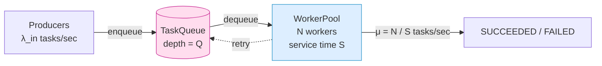
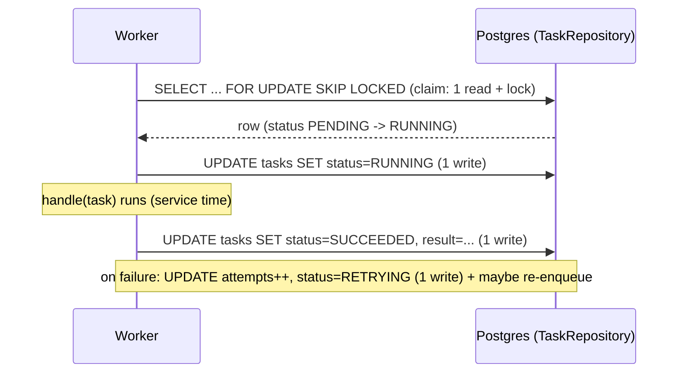
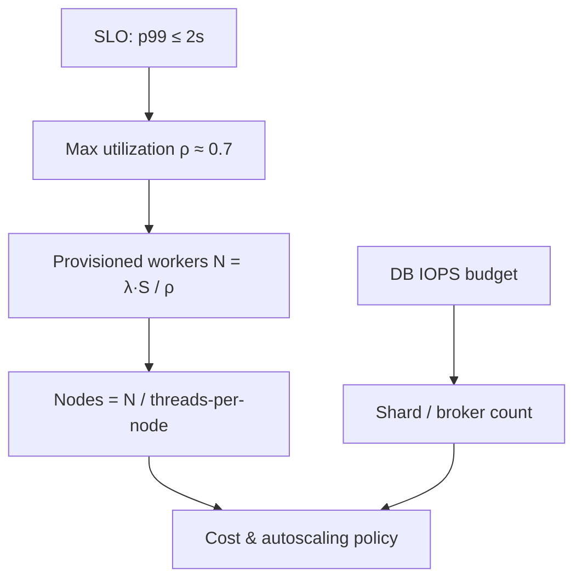

# Capacity Estimation and Performance

> Where this fits: this is the *quantitative spine* of designing our Distributed Task Queue. Before we draw boxes, we put numbers on them — tasks per second, payload bytes, DB IOPS, worker counts, queue depth. Capacity estimation is how a staff engineer turns "it should scale" into "it scales to 50k tasks/sec at p99 < 400 ms on 12 workers, and here is the math."

Every system-design interview and every real production incident eventually reduces to arithmetic. This chapter teaches you to do that arithmetic *fast, out loud, and defensibly*, using our canonical model (`Task`, `TaskQueue`, `Worker`, `WorkerPool`, `TaskRepository`) as the worked example.

---

## 1. Why Capacity Estimation Exists

You cannot size a system you have not measured or modeled. Three failure modes motivate this skill:

1. **Under-provisioning** — you ship 4 workers, traffic spikes to 30k tasks/sec, the queue grows unbounded, latency explodes, and the on-call engineer is paged at 03:00. The queue *did not crash* — it absorbed the load into latency, which is worse because it is silent until memory runs out.
2. **Over-provisioning** — you run 200 worker nodes "to be safe." The cloud bill is 50x what it needs to be, and nobody can justify it. Finance asks why; you have no model.
3. **Wrong-component scaling** — you add 100 workers to a system whose real bottleneck is a single Postgres primary doing 3k IOPS. The workers sit idle waiting on row locks. You scaled the wrong axis because you never found the binding constraint.

Capacity estimation is the discipline that prevents all three. Historically it comes from **queueing theory** (Erlang sizing telephone exchanges in 1909, Kleinrock formalizing it for packet networks in the 1960s). The single most useful result — **Little's Law** — is shockingly simple and applies directly to our `WorkerPool`.

> **The interview reality:** Interviewers do not want a precise number. They want to see that you (a) identify the right unit (tasks/sec, bytes, IOPS), (b) pick reasonable assumptions and state them, (c) compute to one significant figure, and (d) know which number is the bottleneck. Speed and structure beat precision.

---

## 2. The Vocabulary: Throughput, Latency, Concurrency, and Little's Law

Three numbers and one law tie everything together.

- **Throughput (λ, lambda)** — completed units per second. For us: *tasks processed per second*. Units: tasks/sec (often abbreviated TPS or RPS for requests).
- **Latency (W)** — time a single unit spends in the system, end to end. For us: time from `enqueue` to `SUCCEEDED`. Includes *queue wait* + *service time*. Units: seconds (we usually quote ms).
- **Service time (S)** — time a worker actually spends executing one task (the `TaskHandler.handle` call). This is **not** latency — latency includes waiting in the queue.
- **Concurrency / inventory (L)** — number of units *inside the system at once*. For us: tasks currently being worked on, i.e. busy workers (plus in-flight DB calls).

**Little's Law** relates them, and it holds for *any* stable system regardless of arrival distribution or service-time distribution:

```text
L = λ × W
```

> Average number of items in the system = arrival rate × average time each item spends in the system.

Two corollaries we use constantly:

- **Worker sizing:** the number of *busy* workers needed = throughput × service time. `L = λ × S`. If you process 10,000 tasks/sec and each task takes 0.02 s of CPU, you need `10000 × 0.02 = 200` busy worker-threads *on average*. (Then add headroom — section 8.)
- **Queue-depth → latency:** if the queue holds `Q` items and you drain at `λ`, the wait added is `Q / λ`. A queue of 5,000 items drained at 1,000 tasks/sec adds 5 seconds of latency. This is why a "healthy" queue with a deep backlog is a latency bomb.



The stability condition is **`λ_in < μ`** where `μ = N / S` is the maximum drain rate. If arrivals exceed drain capacity, `Q → ∞` and latency → ∞. A queue does not protect you from sustained overload; it only smooths *bursts*.

---

## 3. The Naive Estimate (and Why It's Wrong)

A first-cut sizing for our task queue often looks like this:

```text
"We have 1 million tasks per day. Each task is fast. Let's run 4 workers."
```

Three things are broken:

1. **Wrong time unit.** 1M/day sounds large but averages to `1,000,000 / 86,400 ≈ 11.6 tasks/sec`. That feels tiny — until you account for the **peak-to-average ratio**. Real traffic is bursty; a 5x daytime peak means ~58 tasks/sec, and a flash spike (a batch job submitting a backlog) can be 100x → ~1,160 tasks/sec for a few minutes.
2. **"Fast" is not a number.** Is service time 1 ms or 200 ms? With 4 workers and `S = 200 ms`, max throughput is `4 / 0.2 = 20 tasks/sec` — you cannot even hold the *average*, let alone the peak. With `S = 1 ms`, 4 workers do `4000 tasks/sec` easily.
3. **No bottleneck analysis.** Even if 4 workers suffice for CPU, do they overwhelm Postgres? If each task does 3 DB writes (claim row, update status, write result) and you run 20 tasks/sec, that is 60 write IOPS — fine. At 1,160 tasks/sec it is 3,480 write IOPS, which will saturate a small RDS instance.

The naive estimate fails because it skips the three mandatory steps: **convert to per-second**, **multiply peaks**, and **find the binding resource**.

---

## 4. The Improved Estimate: A Repeatable Procedure

Here is the procedure a staff engineer runs, every time, in order.

### Step 1 — Convert everything to per-second, at peak

| Period | Tasks | Tasks/sec (avg) |
|---|---|---|
| per day | 1,000,000 | ÷ 86,400 ≈ **11.6** |
| per day | 100,000,000 | ÷ 86,400 ≈ **1,160** |
| per hour | 1,000,000 | ÷ 3,600 ≈ **278** |

Memorize the magic divisors: **86,400 sec/day** (round to **100k** for mental math), **3,600 sec/hour**, **~2.6M sec/month**. A handy shortcut: *1 million per day ≈ 12/sec*; *1 billion per day ≈ 11,600/sec*.

### Step 2 — Apply a peak multiplier

Define **peak throughput** `λ_peak = λ_avg × peak_factor`. Typical peak factors:

- Steady internal pipeline: **2x–3x**.
- Consumer-facing with daily cycle: **5x**.
- Spiky/batch-driven (our common case — someone submits a 500k-task backlog): **10x–50x** for short windows.

Always size for `λ_peak`, then decide whether to absorb the difference with **queue buffering** (cheap, adds latency) or **capacity** (expensive, keeps latency flat). This is the core queue tradeoff.

### Step 3 — Estimate service time per task type

Service time depends on the `TaskHandler`. Bucket them:

| Task type | Work | Service time S |
|---|---|---|
| `email.send` | one HTTP call to SMTP API | ~50 ms (I/O-bound) |
| `image.resize` | CPU decode/encode | ~200 ms (CPU-bound) |
| `report.aggregate` | several DB queries | ~500 ms (DB-bound) |
| `webhook.deliver` | one HTTP POST + retries | ~120 ms (I/O-bound, tail-heavy) |

### Step 4 — Size workers with Little's Law (`N = λ_peak × S`)

For a mixed workload, compute per type and sum, or use a weighted average `S̄`.

### Step 5 — Compute downstream load (DB IOPS, network, storage)

Each task touches the database. Count the operations.

### Step 6 — Identify the bottleneck and add headroom

The system can only go as fast as its slowest resource. Find it, then leave 30–50% headroom (section 8).

---

## 5. Worked Example A — Sizing the WorkerPool

**Given:** 100M tasks/day, peak factor 8x, mixed workload averaging `S̄ = 80 ms` of *wall-clock* service time (mostly I/O), target p99 end-to-end latency ≤ 1 s.

**Step 1 — per-second average:**

```text
λ_avg = 100,000,000 / 86,400 ≈ 1,160 tasks/sec
```

**Step 2 — peak:**

```text
λ_peak = 1,160 × 8 ≈ 9,280 tasks/sec  (round to 9,300)
```

**Step 3/4 — busy workers needed (Little's Law):**

```text
N_busy = λ_peak × S̄ = 9,300 × 0.080 s = 744 busy worker-threads
```

So at peak we need **~744 concurrently-busy worker threads**. Two ways to provide them:

- **Platform threads:** 744 OS threads is heavy (each ~1 MB stack → ~744 MB just in stacks) but feasible. Spread across nodes: 6 nodes × ~150 threads each.
- **Virtual threads (Java 21 / Project Loom):** because `S̄` is I/O-bound, virtual threads shine. We can spawn thousands cheaply; the carrier pool stays small. See [../06-concurrency/executor-service.md](../06-concurrency/executor-service.md).

Here is how we express the sizing in our `WorkerPool` (the canonical class from the spec):

```java
public final class WorkerPoolSizing {

    /**
     * Little's Law: busy workers needed = throughput * service time.
     * Returns the number of *concurrently busy* worker threads at the given load.
     */
    public static int busyWorkers(double tasksPerSecond, Duration avgServiceTime) {
        double serviceSeconds = avgServiceTime.toNanos() / 1_000_000_000.0;
        return (int) Math.ceil(tasksPerSecond * serviceSeconds);
    }

    /** Add headroom so the pool is not pinned at 100% (queueing theory: utilization must stay < 1). */
    public static int provisionedWorkers(double tasksPerSecond, Duration avgServiceTime, double targetUtilization) {
        if (targetUtilization <= 0 || targetUtilization >= 1) {
            throw new IllegalArgumentException("targetUtilization must be in (0,1); got " + targetUtilization);
        }
        return (int) Math.ceil(busyWorkers(tasksPerSecond, avgServiceTime) / targetUtilization);
    }

    public static void main(String[] args) {
        double peakTps = 9_300;
        Duration s = Duration.ofMillis(80);

        System.out.printf("Busy workers @ peak:        %d%n",
                busyWorkers(peakTps, s));                          // 744
        System.out.printf("Provisioned @ 70%% util:     %d%n",
                provisionedWorkers(peakTps, s, 0.70));             // 1063
    }
}
```

Note the headroom step: if you provision exactly 744 workers, utilization `ρ = λ_peak / μ = 1.0`, and at `ρ → 1` queueing latency goes to infinity (the M/M/c approximation `W_q ≈ S × ρ / (c(1−ρ))` blows up). Target **ρ ≈ 0.70** → provision `744 / 0.70 ≈ 1063` threads. That is the difference between a stable system and a metastable one.

> **Loom note:** with virtual threads, the *thread count* is no longer the scarce resource — the scarce resource becomes the downstream dependency (DB connections, SMTP API rate limits). You still need ~744 in-flight tasks, but you provide them with a `Semaphore`-bounded virtual-thread pool rather than 744 OS threads. The Little's-Law number is identical; only the *implementation* of concurrency changes.

---

## 6. Worked Example B — Database IOPS and the Real Bottleneck

Workers are rarely the bottleneck for I/O-bound tasks — the **database** usually is. Let's count operations per task in `PostgresTaskQueue` / `TaskRepository`.

A task's lifecycle in Phase 2 touches Postgres several times:



So a **happy-path task = 1 claim read + 2 writes = 3 DB ops**. A retrying task adds 1–2 more.

**Given** the peak from Example A: `λ_peak = 9,300 tasks/sec`, assume a 5% retry rate so effective task-attempts ≈ `9,300 × 1.05 ≈ 9,765/sec`.

```text
Write IOPS   = 9,765 attempts/sec × 2 writes      ≈ 19,530 write IOPS
Read IOPS    = 9,765 attempts/sec × 1 claim read  ≈  9,765 read IOPS
Total IOPS   ≈ 29,300 IOPS at peak
```

Now compare to reality:

| Postgres deployment | Sustained IOPS ceiling (rough) |
|---|---|
| `db.t3.medium` + gp2 100 GB | ~300 IOPS (3 IOPS/GB) |
| `db.m6i.large` + gp3 (provisioned) | ~3,000–16,000 IOPS |
| `db.r6i.2xlarge` + io2 (provisioned) | ~64,000+ IOPS, with effort |

**29,300 write-heavy IOPS will crush a single primary** of almost any reasonable size, because writes also pay for WAL fsync, index updates, and (for our hot `status` column) frequent row updates → bloat + vacuum pressure. **This is the binding constraint, not workers.**

How we scale past it (each covered elsewhere):

1. **Reduce ops per task.** Batch status updates: claim N rows in one `SELECT ... FOR UPDATE SKIP LOCKED LIMIT N`, write results in a single `UPDATE ... FROM (VALUES ...)`. Going from 3 ops/task to ~1.3 ops/task cuts IOPS ~2.3x.
2. **Shard the queue table** by `hash(id)` across primaries → see [../08-distributed-systems/sharding.md](../08-distributed-systems/sharding.md). 8 shards → ~3,700 IOPS each, which fits a `gp3` instance.
3. **Move the queue out of the OLTP DB entirely.** This is exactly why Phase 4 introduces a **dedicated broker** (Redis / Kafka / RabbitMQ): brokers are built for millions of small ops/sec; relational primaries are not. Postgres then stores only *terminal* state (audit), not the hot polling path. See [../07-queues-and-messaging/broker-comparison.md](../07-queues-and-messaging/broker-comparison.md).
4. **Read replicas** absorb `GET /tasks/{id}` status lookups so they never compete with the write path.

> **The lesson:** capacity estimation found a bottleneck the architecture diagram hid. The workers looked expensive; the *database* was the actual ceiling. Always count downstream ops, not just CPU.

---

## 7. Worked Example C — Storage and Network Math

### Payload sizing

Our `Task.payload` is a JSON string. Estimate a representative size and the row footprint.

```text
Task row fields:
  id (UUID, 16 B stored / 36 B as text)   ~ 16 B
  type (varchar, e.g. "image.resize")      ~ 20 B
  payload (JSON)                            ~ 2 KB  (avg; could be 200 B to 1 MB)
  status, attempts, maxAttempts, priority   ~ 16 B
  createdAt, scheduledAt (timestamps)       ~ 16 B
  + Postgres per-row overhead (header,...)   ~ 40 B
  + index entries (PK, status, scheduledAt)  ~ 60 B
--------------------------------------------------------
  ~ 2.17 KB per task row, round to 2.2 KB
```

**Retention math.** If we keep completed tasks for 7 days for audit at `λ_avg = 1,160 tasks/sec`:

```text
Tasks retained = 1,160 tasks/sec × 86,400 sec/day × 7 days ≈ 701 million rows
Raw storage    = 701M × 2.2 KB ≈ 1.54 TB
+ WAL, bloat, vacuum slack (×1.5–2)  ≈ 2.3–3.1 TB
```

That is a lot for a *queue*. Mitigations: keep only metadata + an S3 pointer for large payloads (store the 1 MB payload as an object, keep a 100-byte URL in the row); move terminal tasks to a cold partition / object store after 24 h; or drop successful tasks immediately and keep only `DEAD`/`FAILED` for forensics.

```java
/** Quick storage model for the Task table. All sizes in bytes. */
public record StorageEstimate(long rowBytes, long indexBytes) {

    public long bytesPerTask() {
        return rowBytes + indexBytes;
    }

    /** Total stored bytes for a retention window at a given average throughput. */
    public long totalBytes(double tasksPerSecond, Duration retention, double overheadFactor) {
        long rows = (long) (tasksPerSecond * retention.toSeconds());
        return (long) (rows * bytesPerTask() * overheadFactor);
    }

    public static void main(String[] args) {
        var est = new StorageEstimate(2_100, 60);          // ~2.16 KB/task
        long bytes = est.totalBytes(1_160, Duration.ofDays(7), 1.6);
        System.out.printf("7-day storage: %.2f TB%n", bytes / 1e12);  // ~2.4 TB
    }
}
```

### Network sizing

If producers submit over HTTP and each `POST /tasks` carries a 2 KB payload at `λ_peak = 9,300/sec`:

```text
Ingress bandwidth = 9,300 req/sec × 2 KB ≈ 18.6 MB/sec ≈ 149 Mbps
```

Comfortable on a 1 Gbps NIC, but note that a 25 KB payload at the same rate is `~1.86 Gbps` — past a single NIC, forcing a load balancer fan-out or payload-in-S3. Always recompute when payload size assumptions change; bandwidth scales linearly with payload, and payload is the assumption people get most wrong.

---

## 8. Headroom, Utilization, and SLOs

### Why you never run at 100% utilization

Queueing theory says wait time grows as `1 / (1 − ρ)` where `ρ` is utilization. The penalty is non-linear and brutal near the top:

| Utilization ρ | Relative queue wait factor `ρ/(1−ρ)` |
|---|---|
| 0.50 | 1.0 |
| 0.70 | 2.3 |
| 0.80 | 4.0 |
| 0.90 | 9.0 |
| 0.95 | 19.0 |
| 0.99 | 99.0 |

Going from 70% to 90% utilization barely saves machines but **multiplies tail latency ~4x**. This is why mature platforms target **ρ ≈ 0.6–0.7** for latency-sensitive paths and accept the extra capacity as insurance. Batch/throughput-only systems (no latency SLO) can safely run hotter (0.85–0.95) because they trade latency for cost deliberately.

### SLOs make the target concrete

An **SLO (Service Level Objective)** turns "fast" into a measurable contract:

> 99% of tasks reach `SUCCEEDED` within 2 seconds of enqueue, measured over a rolling 28-day window; error budget = 1%.

The SLO drives the capacity number. To hold **p99 ≤ 2 s**, end-to-end latency `W = queue_wait + service + retries` must satisfy that *at the 99th percentile* — and tails are dominated by queue wait, which is governed by ρ. So the SLO → a max ρ → (via Little's Law) → a worker count → a node count. The chain is:



### Error budget and autoscaling

The 1% error budget is *permission to take risk* — deploy, run hotter, save money — until you start burning it. Autoscaling policy: scale the `WorkerPool` out when **queue depth** (a leading indicator) exceeds `λ × target_wait`, not when CPU is high (a lagging indicator). Queue depth predicts SLO breaches before latency does. Concretely: if target wait is 1 s and drain rate is 9,300/sec, alert/scale when depth crosses ~9,300 and page when it crosses ~46,500 (5 s of backlog).

```java
/** Decide whether to scale the worker pool based on queue depth, the leading indicator. */
public final class QueueDepthAutoscaler {

    private final double drainRatePerSec;   // current μ = N / S
    private final Duration targetWait;      // SLO-derived, e.g. 1 second

    public QueueDepthAutoscaler(double drainRatePerSec, Duration targetWait) {
        this.drainRatePerSec = drainRatePerSec;
        this.targetWait = targetWait;
    }

    public enum Action { SCALE_OUT, HOLD, SCALE_IN }

    public Action decide(int queueDepth) {
        double targetDepth = drainRatePerSec * targetWait.toSeconds();
        if (queueDepth > targetDepth * 1.5) return Action.SCALE_OUT;   // backlog building
        if (queueDepth < targetDepth * 0.25) return Action.SCALE_IN;   // over-provisioned
        return Action.HOLD;
    }
}
```

---

## 9. Putting It Together: A Capacity One-Pager for the Task Queue

This is the artifact you produce in an interview or design review. Numbers carried from the examples above.

| Dimension | Assumption | Computed | Bottleneck? |
|---|---|---|---|
| Avg throughput | 100M tasks/day | 1,160 tasks/sec | — |
| Peak throughput | 8x peak factor | 9,300 tasks/sec | drives all sizing |
| Service time | mixed, I/O-bound | S̄ = 80 ms | — |
| Busy workers | Little's Law `λ·S` | 744 | OK with Loom |
| Provisioned workers | ρ = 0.70 headroom | ~1,063 | OK |
| Nodes | ~150 vthreads/node | 7–8 nodes | OK |
| DB write IOPS | 2 writes/task | ~19,500 | **YES — shard or broker** |
| Storage (7-day) | 2.2 KB/row | ~2.4 TB | manage with S3 + TTL |
| Ingress bandwidth | 2 KB payload | ~150 Mbps | OK |

**Conclusion the one-pager forces:** the platform is **database-bound, not worker-bound.** The architectural decision that matters is *moving the hot queue path off the OLTP primary* (Phase 4's broker) and/or *sharding*. Everything else has comfortable headroom. You arrived at the single most important design decision through arithmetic, not opinion.

---

## 10. Tradeoffs

| Decision | Option A | Option B | When to pick which |
|---|---|---|---|
| Absorb peaks via... | **Buffering** (deep queue) | **Capacity** (more workers) | Buffer if latency-tolerant & spiky; capacity if latency-SLO is tight |
| Worker concurrency | **Platform threads** | **Virtual threads (Loom)** | Platform for CPU-bound; virtual for I/O-bound (our common case) |
| Utilization target | **High (0.9)** | **Low (0.65)** | High for batch/no-SLO; low for latency-sensitive |
| Queue location | **In OLTP Postgres** | **Dedicated broker** | Postgres for low scale/simplicity; broker past ~few k ops/sec |
| Payload storage | **Inline in row** | **S3 + pointer** | Inline if < ~4 KB; S3 if large/variable |
| Scaling trigger | **CPU %** (lagging) | **Queue depth** (leading) | Always prefer queue depth for latency SLOs |
| Estimate precision | **Detailed model** | **One-sig-fig BOTE** | BOTE for design/interview; detailed for capacity planning & budget |

The deepest tradeoff is **buffering vs. capacity**, and it is the same `push vs. pull` / `latency vs. cost` axis that runs through the whole platform: a queue converts a *throughput* problem into a *latency* problem. That is a feature for batch work and a liability for real-time work. Know which one you have before you size.

---

## 11. Common Mistakes and Pitfalls

- **Sizing for the average, not the peak.** The average never pages you; the peak does. Always multiply by a peak factor and state it.
- **Confusing service time with latency.** `S` (worker busy time) ≠ `W` (end-to-end). Little's Law uses `W` for inventory-in-system and `S` for busy-worker count — using the wrong one mis-sizes by the queue-wait factor.
- **Running at ρ = 1.0.** "We need exactly 744 workers" with no headroom guarantees unbounded tail latency. Divide by your target utilization.
- **Ignoring downstream amplification.** One task → 3 DB ops → the DB sees 3x your task rate. Count the fan-out.
- **Forgetting retries inflate load.** A 5% retry rate adds 5% throughput *and* extra DB writes; a retry *storm* (a bad deploy failing everything) can add 100%+. Size with the retry multiplier and cap it with a circuit breaker — see [../08-distributed-systems/circuit-breakers.md](../08-distributed-systems/circuit-breakers.md).
- **Averaging skewed service times.** If 99% of tasks take 10 ms and 1% take 5 s, the mean is misleading for tail SLOs. Model p99 separately, and isolate slow task types into their own pool so they cannot head-of-line-block fast ones.
- **Using GB vs GiB and bits vs bytes sloppily.** 150 Mbps ≠ 150 MB/s (off by 8x). State units every time.
- **Treating queue depth as healthy because it's "not crashing."** A growing queue is latency debt accruing silently. Alert on the *derivative* (is depth rising?), not just the level.

---

## 12. Refactoring Exercise: From Hand-Waving to a Sizing Tool

**Bad — magic numbers, no model:**

```java
// "Trust me, 50 workers is enough."
int workers = 50;
WorkerPool pool = new WorkerPool(workers, queue, handlers);
```

**Improved — derive from measured load, but still hard-codes utilization and ignores DB:**

```java
double peakTps = 9_300;
double serviceSec = 0.080;
int workers = (int) Math.ceil(peakTps * serviceSec);   // 744 via Little's Law
WorkerPool pool = new WorkerPool(workers, queue, handlers);
```

**Production-quality — explicit assumptions, headroom, and a bottleneck check:**

```java
public record CapacityPlan(
        double peakTps,
        Duration avgServiceTime,
        double targetUtilization,
        int dbOpsPerTask,
        int dbIopsCeiling) {

    public int provisionedWorkers() {
        double s = avgServiceTime.toNanos() / 1e9;
        return (int) Math.ceil((peakTps * s) / targetUtilization);
    }

    public double requiredDbIops() {
        return peakTps * dbOpsPerTask;
    }

    /** The honest part: tell the operator what will break first. */
    public String bottleneck() {
        return requiredDbIops() > dbIopsCeiling
                ? "DATABASE: need %.0f IOPS, ceiling is %d -> shard or move to broker"
                        .formatted(requiredDbIops(), dbIopsCeiling)
                : "WORKERS: provision %d threads at %.0f%% utilization"
                        .formatted(provisionedWorkers(), targetUtilization * 100);
    }

    public static void main(String[] args) {
        var plan = new CapacityPlan(9_300, Duration.ofMillis(80), 0.70, 3, 16_000);
        System.out.println("Workers:    " + plan.provisionedWorkers());     // 1063
        System.out.printf("DB IOPS:    %.0f%n", plan.requiredDbIops());      // 27900
        System.out.println("Bottleneck: " + plan.bottleneck());             // DATABASE...
    }
}
```

The production version *encodes the reasoning*: assumptions are fields, headroom is explicit, and the tool names the binding constraint instead of leaving the reader to guess.

---

## 13. Exercises

### Easy

1. **Knowledge check.** State Little's Law and define each term in the context of our `WorkerPool`. Why does `L = λ × W` hold regardless of the arrival distribution?
2. **Conversion drill.** A pipeline processes 2 billion tasks per day. What is the average tasks/sec? At a 4x peak factor, what is the peak?

### Medium

3. **Coding exercise.** Extend `CapacityPlan` with a `nodes(int threadsPerNode)` method and a `monthlyStorageTB(int payloadBytes, int retentionDays)` method. Print a full one-pager.
4. **Refactoring exercise.** Take the "Improved" snippet from section 12 (744 hard-coded workers, no DB check) and refactor it so that retries (assume 7% retry rate) and a target utilization of 0.65 are both modeled. By how much does the worker count change?

### Hard

5. **Design exercise.** Traffic is `λ_avg = 5,000 tasks/sec`, `S̄ = 150 ms` (DB-bound), each task does 4 DB ops, SLO is p99 ≤ 3 s. Single Postgres primary tops out at 8,000 IOPS. Decide: how many workers, how many DB shards (or do you switch to a broker?), and what utilization target? Justify every number.
6. **Interview-style exercise.** "Design capacity for a system that sends 1 billion notification tasks per day with a hard p99 ≤ 500 ms." Produce the one-pager out loud in under 5 minutes. State assumptions, find the bottleneck.
7. **Stretch challenge.** Model a **retry storm**: at t=0 a bad deploy makes 100% of tasks fail-retryable with exponential backoff (`base 1 s`, cap 60 s, max 5 attempts). Plot (in numbers or code) the extra queue depth and DB IOPS over the next 5 minutes versus steady-state. At what point does the DB saturate, and what mechanism (circuit breaker? rate limiter?) caps it?

---

## 14. Solutions

**1.** `L = λ × W`: `L` = avg tasks inside the system (busy workers + in-flight I/O), `λ` = arrival/throughput in tasks/sec, `W` = avg time a task spends in the system end-to-end. It holds for *any* distribution because it is a conservation/accounting identity over a long interval: total task-seconds accumulated inside the system per unit time equals arrivals/sec times seconds-each. No assumption about *how* arrivals or service times are distributed is needed — only that the system is stable (what goes in comes out).

**2.** `2,000,000,000 / 86,400 ≈ 23,148 tasks/sec` average; peak `× 4 ≈ 92,600 tasks/sec`. At that scale a single broker partition is insufficient — you are firmly in Kafka-partition / sharded-broker territory.

**3.** Add to `CapacityPlan`:

```java
public int nodes(int threadsPerNode) {
    return (int) Math.ceil((double) provisionedWorkers() / threadsPerNode);
}

public double monthlyStorageTB(int payloadBytes, int retentionDays) {
    long rowBytes = payloadBytes + 150;                       // payload + fixed overhead
    double rows = peakTps / 8.0 * 86_400.0 * retentionDays;   // use avg ≈ peak/peakFactor(8)
    return rows * rowBytes * 1.6 / 1e12;                       // 1.6x for WAL/bloat
}

public void printOnePager(int threadsPerNode, int payloadBytes, int retentionDays) {
    System.out.printf("""
        Peak TPS:        %.0f
        Workers:         %d
        Nodes:           %d
        DB IOPS:         %.0f
        Storage/%dd:     %.2f TB
        Bottleneck:      %s%n""",
        peakTps, provisionedWorkers(), nodes(threadsPerNode),
        requiredDbIops(), retentionDays,
        monthlyStorageTB(payloadBytes, retentionDays), bottleneck());
}
```

**4.** With a 7% retry rate, effective attempts `= 9,300 × 1.07 ≈ 9,951/sec`. Busy workers `= 9,951 × 0.080 ≈ 796`. With `ρ = 0.65`: `796 / 0.65 ≈ 1,225`. Versus the naive 744 (no retries, ρ=1.0), that is **+65%** — a clear illustration of why both retries and headroom must be modeled.

**5.** Workers: busy `= 5,000 × 0.150 = 750`; at ρ=0.65 → `~1,154` threads (use virtual threads, DB-bound so they block on I/O cheaply). DB: `5,000 × 4 = 20,000 IOPS` needed vs 8,000/primary → need `⌈20,000 / (8,000 × 0.7 headroom)⌉ = ⌈20,000/5,600⌉ = 4 shards`. Better long-term: move the hot dequeue path to a broker and keep Postgres for terminal audit only, dropping DB IOPS to ~`5,000` (1 final write/task) → fits 1 primary with headroom. Utilization target 0.65 because of the latency SLO. Recommendation: **broker + single Postgres for audit**, simpler to operate than 4 shards.

**6.** `1e9 / 86,400 ≈ 11,600/sec` avg; assume 5x peak → `58,000/sec`. Notifications are I/O-bound, `S ≈ 40 ms` → busy `= 58,000 × 0.04 = 2,320`; ρ=0.6 → `~3,870` virtual threads across ~26 nodes. p99 ≤ 500 ms is tight → run *cold* (low ρ), isolate slow providers, and the queue path **must** be a broker (Postgres cannot do `58,000 × 3 = 174,000` IOPS without heavy sharding). Bottleneck: downstream notification-provider rate limits, so add a `TokenBucketRateLimiter` per provider — see [../08-distributed-systems/rate-limiting.md](../08-distributed-systems/rate-limiting.md). State all assumptions aloud; the interviewer is grading structure.

**7.** Steady state: `λ_in ≈ 1,160/sec`, drained fully, depth ≈ 0. During the storm, every task fails and re-enqueues per the backoff schedule. With base-1 s exponential backoff the *first* retry wave hits ~1 s later, then 2 s, 4 s, 8 s, 16 s — so within the first 60 s you accumulate roughly the new arrivals *plus* up to 5 retry copies of each failed task still in flight. Effective enqueue rate climbs toward ~6x. DB write IOPS climb from ~3,500 toward ~21,000 and the primary saturates within tens of seconds. The fix is a **circuit breaker** on the failing dependency: once the failure rate crosses a threshold the breaker opens, tasks fail fast to `DEAD`/parked without hammering retries, and `λ_in` to the DB collapses back to ~the claim cost. A `RateLimiter` on re-enqueue caps the retry inflow as a second line of defense. The key insight: *retries amplify load exactly when the system is least able to absorb it*, so capacity for retries must be bounded by policy, not by Little's Law.

---

## 15. Interview Questions and Takeaways

1. **Q: How many workers to process 10k tasks/sec where each takes 50 ms?**
   A: Little's Law: `10,000 × 0.05 = 500` busy threads; provision `500 / 0.7 ≈ 715` for headroom. If I/O-bound, use virtual threads.

2. **Q: Our queue depth is steadily rising but nothing is erroring. Is that fine?**
   A: No — it is latency debt. Arrival rate exceeds drain rate (`λ_in > μ`), so latency is climbing and memory will eventually exhaust. Alert on the *slope* of depth and scale out or shed load.

3. **Q: Why not run workers at 100% utilization to save money?**
   A: Queue wait scales as `1/(1−ρ)`; at ρ=1 tail latency → ∞. The marginal machines you save at 0.9→1.0 cost you ~10x tail latency. Latency-sensitive systems target ρ≈0.7.

4. **Q: We added 50 workers and throughput didn't improve. Why?**
   A: The bottleneck is downstream (likely DB row-lock contention or connection-pool exhaustion), not worker count. Workers are blocked, not busy. Find the binding resource via IOPS/connection math.

5. **Q: How do you decide between deepening the queue and adding capacity for a traffic spike?**
   A: It's latency vs. cost. If the workload tolerates delay (batch), buffer — it's free. If there's a tight latency SLO, add capacity. A queue converts a throughput problem into a latency problem; pick based on whether latency is acceptable.

6. **Q: Estimate storage for 30 days of tasks at 1k/sec with 2 KB payloads.**
   A: `1,000 × 86,400 × 30 × 2 KB ≈ 5.2 TB` raw, `×1.6 ≈ 8.3 TB` with overhead. Mitigate by moving payloads to S3 and keeping pointers, or TTL-ing successful tasks.

7. **Q: What single metric best predicts an SLO breach for the task queue?**
   A: Queue depth (or its rate of change) — it's a leading indicator. CPU is lagging; by the time CPU is pegged, latency has already breached.

**Takeaways:** (1) Always convert to per-second at *peak*. (2) Little's Law (`L = λW`) sizes workers in one line. (3) Count downstream ops — the bottleneck is usually the DB, not the workers. (4) Never run at ρ=1; headroom is insurance against non-linear tail latency. (5) An SLO + error budget turns "fast" into a number that drives the whole capacity chain.

---

## What We Can Improve In Our Project Using This Concept

Our current `WorkerPool` takes a fixed thread count with no derivation. We can:

- Add a `CapacityPlan` value object that computes provisioned workers from measured `λ_peak`, `S̄`, and a target utilization, instead of a magic constant in config.
- Emit **queue depth** and **drain rate** as Micrometer gauges so the autoscaler (and dashboards) act on the leading indicator — wiring into [observability-and-ops.md](./observability-and-ops.md).
- Count DB ops per task and expose `requiredDbIops()` so a deploy that doubles writes per task is caught in review, not in production.
- Tag tasks by service-time bucket and route slow types to a dedicated pool, protecting fast-task p99.

## Project Refactoring Task

Replace the hard-coded worker count in `WorkerPool` construction with a `CapacityPlan`. Read `λ_peak` (or a recent measured rate from the `MetricsCollector`), `S̄`, target utilization, and `dbOpsPerTask` from configuration. On startup, log the one-pager (workers, nodes, DB IOPS, bottleneck) and **fail fast** if `requiredDbIops()` exceeds a configured `dbIopsCeiling` — surfacing the binding constraint before traffic does. Add a unit test asserting `provisionedWorkers()` for the Example A numbers equals 1,063.

## Git Commit For This Chapter

```text
feat(capacity): derive worker pool size via Little's Law and IOPS budget

- add CapacityPlan value object (peak TPS, service time, utilization, db ops)
- compute provisionedWorkers() with headroom and requiredDbIops()
- log capacity one-pager on WorkerPool startup; fail fast past IOPS ceiling
- expose queue-depth and drain-rate gauges for leading-indicator autoscaling

Files touched:
  src/main/java/.../capacity/CapacityPlan.java          (new)
  src/main/java/.../worker/WorkerPool.java               (wire CapacityPlan)
  src/main/java/.../metrics/MetricsCollector.java         (depth + drain gauges)
  src/test/java/.../capacity/CapacityPlanTest.java        (new)
```

## Architecture Impact

Capacity estimation is the lens that exposes the platform's true bottleneck: the system is **database-bound at scale**, not worker-bound. This validates Phase 4's move to a dedicated broker and motivates sharding (see [../08-distributed-systems/sharding.md](../08-distributed-systems/sharding.md)) and read replicas for status lookups. It also changes how we autoscale — on queue depth, not CPU — and how we set SLOs and headroom. Concretely, it ties together [./scaling-the-platform.md](./scaling-the-platform.md), [./designing-a-task-queue.md](./designing-a-task-queue.md), and [./observability-and-ops.md](./observability-and-ops.md): the same `λ`, `S`, and `ρ` numbers flow through architecture, scaling, and ops.

## Interview Takeaways

- Lead with **units and assumptions**, then compute to one significant figure — structure beats precision.
- `N = λ × S` (Little's Law) sizes workers in a single line; divide by target utilization for headroom.
- Always count **downstream amplification** (DB ops per task) — the bottleneck is rarely where the load arrives.
- Tail latency explodes as `1/(1−ρ)`; never plan for 100% utilization on a latency-SLO path.
- An **SLO + error budget** converts vague performance goals into the number that drives worker count, node count, and shard count.
