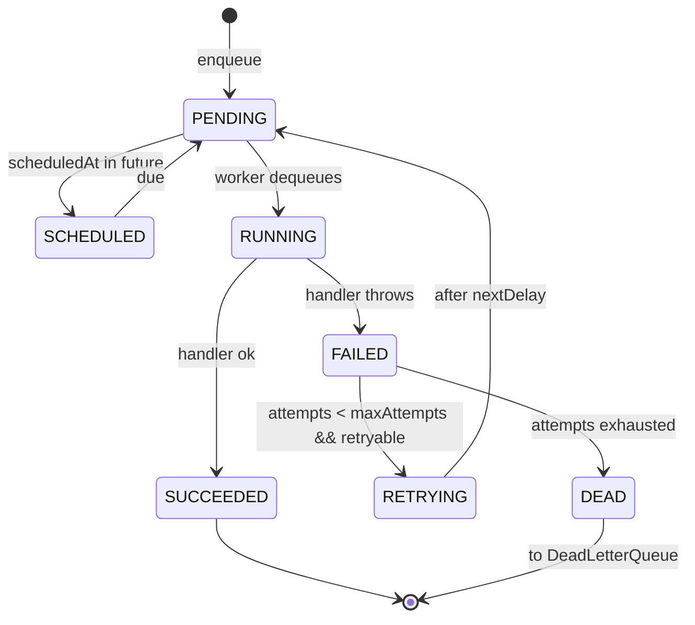
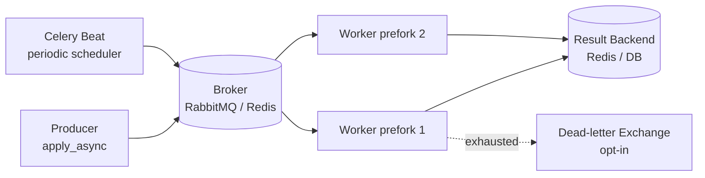
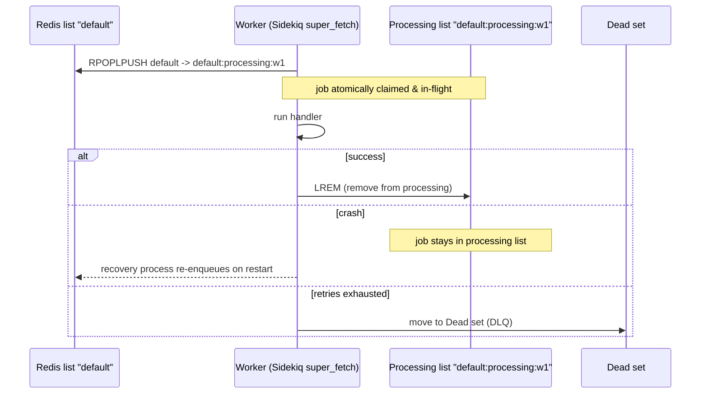
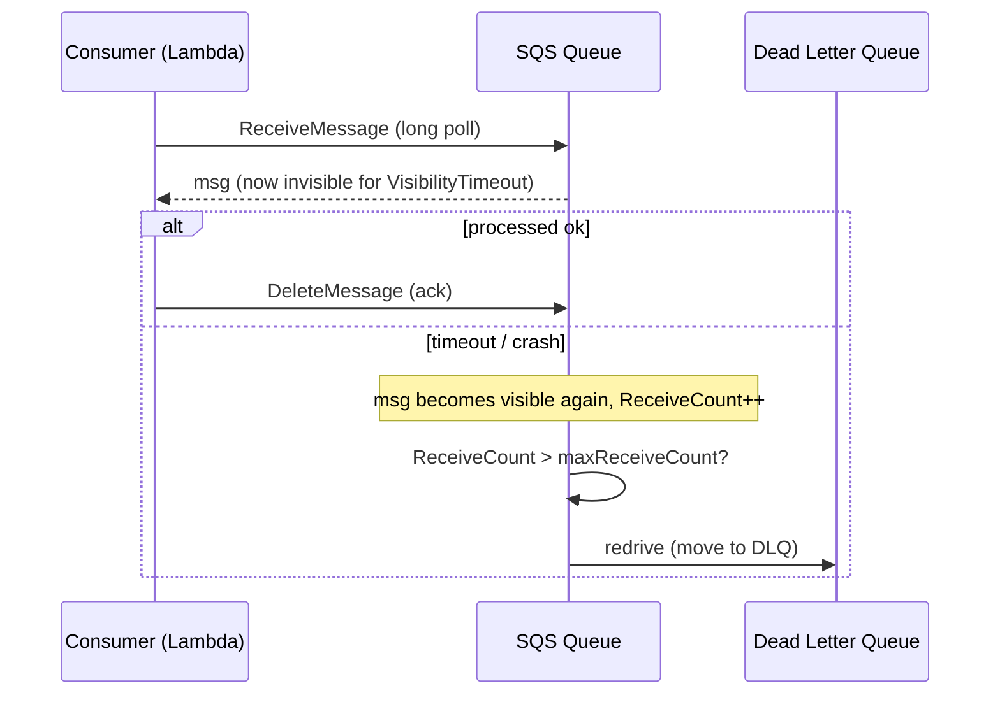
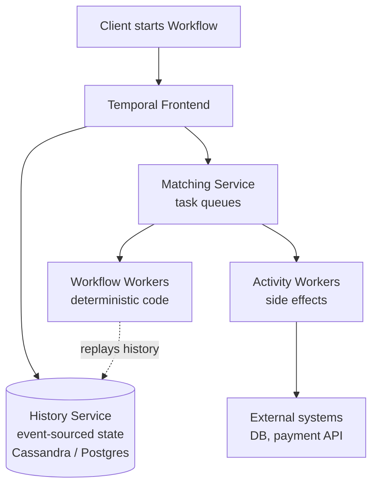
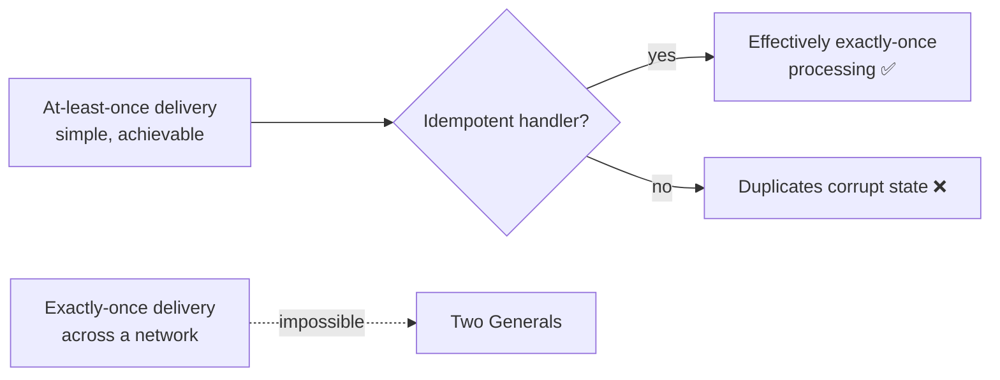
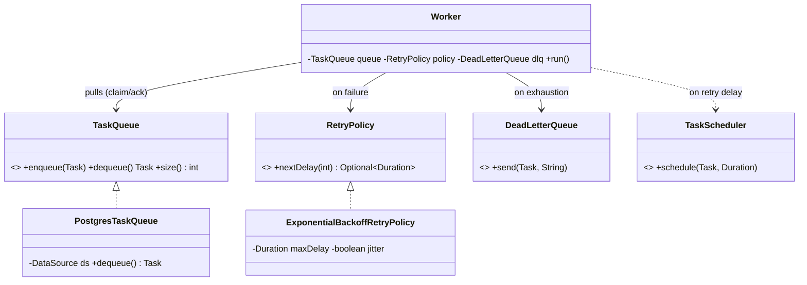

# Case Studies: Real Task and Queue Systems

> The cheapest way to design a great task queue is to study the half-dozen production systems that already solved it — then steal their good ideas and reject their mistakes on purpose.

You have now built our Distributed Task Queue from an in-memory `BlockingQueue` ([phase-1.md](../09-project/phase-1.md)) to a horizontally-scaled platform ([phase-4.md](../09-project/phase-4.md)), and reasoned about it from first principles in [system-design-fundamentals.md](./system-design-fundamentals.md) and [scaling-the-platform.md](./scaling-the-platform.md). This chapter does something different: it dissects **real systems that millions of engineers run in production** — Celery, Sidekiq, Resque, AWS SQS + Lambda, Kafka consumer groups, Temporal/Cadence, and Google Cloud Tasks — and maps every one of their design decisions back onto our canonical model (`Task`, `TaskQueue`, `Worker`, `RetryPolicy`, `DeadLetterQueue`, `TaskScheduler`).

The goal is not trivia. In an interview, "how would *you* design this?" is far stronger when you can say "Celery does X, SQS does Y, here's the tradeoff, and here's what I'd pick and why." In production, knowing that Sidekiq's reliability comes from a Lua-scripted `RPOPLPUSH` — not magic — is the difference between operating a queue and being operated *by* it.

---

## 1. Why This Exists — Learning By Theft

Every task queue answers the same five questions. The systems below answer them *differently*, and the differences are the entire design space:

1. **Delivery guarantee** — at-most-once, at-least-once, or effectively-exactly-once?
2. **Push vs pull** — does the broker push work to workers, or do workers poll?
3. **Scheduling** — how are delayed and future-dated tasks handled?
4. **Retries** — automatic? backoff? where does the retry state live?
5. **Dead-lettering** — what happens to tasks that exhaust retries?

Hold those five questions in your head for the whole chapter. Each case study is just a *set of answers* to them, shaped by the substrate the system was built on (Redis, a SQL database, a log, a managed cloud service, or a durable workflow engine).

> **Mental model:** A task queue is a state machine (`PENDING → RUNNING → SUCCEEDED | FAILED → RETRYING | DEAD`) wrapped around a durable store. The store you pick — Redis list, SQL row, append-only log, S3-backed managed queue, event-sourced history — determines almost every other property. Pick the store first; the rest follows.

Here is the state machine our `TaskStatus` enum encodes, which every system below implements in some form:



---

## 2. The Comparison Lens — Our Canonical Model

Before the case studies, pin down what "our design" *is*, so every comparison is concrete. This is the slice of the canonical model the rest of the chapter measures against.

```java
public enum TaskStatus { PENDING, SCHEDULED, RUNNING, SUCCEEDED, FAILED, RETRYING, DEAD }

public record Task(
        String id,            // UUID
        String type,          // routes to a TaskHandler
        String payload,       // JSON string
        TaskStatus status,
        int attempts,
        int maxAttempts,
        Instant createdAt,
        Instant scheduledAt,
        int priority) {}

@FunctionalInterface
public interface TaskHandler {
    TaskResult handle(Task task) throws Exception;
}

public record TaskResult(boolean success, String message, boolean retryable) {}

public interface TaskQueue {
    void enqueue(Task t);
    Task dequeue() throws InterruptedException;
    int size();
}

public interface RetryPolicy {
    Optional<Duration> nextDelay(int attempt);   // empty => give up
}

public interface DeadLetterQueue {
    void send(Task t, String reason);
}

public interface TaskScheduler {
    void schedule(Task t, Duration delay);
}
```

Our defaults (from [phase-2.md](../09-project/phase-2.md) onward): **at-least-once** delivery, **pull-based** workers polling a `PostgresTaskQueue`, **exponential backoff with jitter** via `ExponentialBackoffRetryPolicy`, and a `DeadLetterQueue` for tasks that exhaust `maxAttempts`. Keep this as the baseline; we will steal improvements from each system.

---

## 3. Case Study — Celery (Python + Redis/RabbitMQ)

**What it is:** The default async task queue of the Python world. Workers consume from a broker (RabbitMQ or Redis); a separate **result backend** stores outcomes. Celery is a *library on top of a broker* — it does not store tasks itself.

### How it answers the five questions

| Question | Celery's answer |
|---|---|
| Delivery | At-least-once by default. `acks_late=True` acks **after** the task runs, so a crash mid-task redelivers (and may double-run). Default `acks_late=False` acks on receipt — at-most-once on crash. |
| Push vs pull | Broker pushes; with RabbitMQ a `prefetch` (QoS) limit bounds in-flight tasks per worker. |
| Scheduling | `apply_async(countdown=, eta=)`. With Redis, delayed tasks sit in a sorted set; **Celery Beat** is a separate scheduler process for cron-style periodic tasks. |
| Retries | `task.retry()` with `max_retries`, `default_retry_delay`, and `retry_backoff`/`retry_jitter`. Retry state lives in the message re-published to the broker. |
| DLQ | Not first-class. You wire a RabbitMQ dead-letter exchange or catch the final failure and route manually. This is a real weakness. |

### Architecture



### What to steal

- **`acks_late` is the single most important knob.** It is exactly the difference between acking on `dequeue()` versus acking after `handle()` succeeds. Our `Worker` should ack-late so a crash redelivers:

```java
// Worker.run() — ack-late semantics, mirroring Celery acks_late=True
Task task = queue.dequeue();                 // claimed, NOT yet removed
try {
    TaskResult r = handlerFor(task.type()).handle(task);
    if (r.success()) {
        queue.ack(task);                     // remove only after success
    } else if (r.retryable() && task.attempts() + 1 < task.maxAttempts()) {
        retryPolicy.nextDelay(task.attempts() + 1)
                   .ifPresentOrElse(d -> scheduler.schedule(task, d),
                                    () -> dlq.send(task, "no retry budget"));
        queue.ack(task);                     // moved elsewhere, safe to remove
    } else {
        dlq.send(task, r.message());
        queue.ack(task);
    }
} catch (Exception e) {
    // crash / throw → do NOT ack → broker redelivers (at-least-once)
    log.error("task {} failed, will redeliver", task.id(), e);
}
```

- **Separate the result backend from the broker.** Celery learned the hard way that storing results in the same Redis you use for queuing causes memory blowups. Our `TaskRepository` (status/result) is already separate from our `TaskQueue` (work) — keep it that way.

### What to reject

- **No native DLQ** forces every team to reinvent dead-lettering. Our `DeadLetterQueue` being a first-class interface from [dead-letter-queues.md](../07-queues-and-messaging/dead-letter-queues.md) is a deliberate improvement.
- **Result backend in Redis with no TTL** is a classic outage. If you copy the result-backend pattern, set a TTL and treat results as ephemeral.

> **Interview line:** "Celery is at-least-once *only if you set `acks_late=True`* — most outages I've seen come from teams assuming exactly-once on a default config. Idempotent handlers are mandatory; see [idempotency.md](../08-distributed-systems/idempotency.md)."

---

## 4. Case Study — Sidekiq and Resque (Ruby + Redis)

**Resque** (2009, GitHub) and **Sidekiq** (2012) are the Ruby task queues. Both store jobs as JSON in **Redis lists**, one list per queue. The difference is the concurrency model and reliability, and that difference is instructive.

### Resque — the simple, lossy original

- Jobs are pushed with `LPUSH queue:default`, popped with a blocking `BRPOP`.
- **One job per forked process** (heavyweight, but bulletproof isolation — a memory leak dies with the fork).
- **At-most-once:** `BRPOP` removes the job from Redis *before* it runs. Worker crashes mid-job → job is gone. No automatic retries (the `resque-retry` plugin adds them).

### Sidekiq — concurrency + reliability bolted on

- **Threads, not forks** — far higher throughput per process.
- **Reliable fetch** (Sidekiq Pro / open-source `super_fetch`): instead of `BRPOP`, it does `RPOPLPUSH queue:default → queue:default:processing:<worker>`. The job is atomically moved to a per-worker "in-flight" list. On clean completion it is `LREM`'d. If the worker dies, a recovery process re-enqueues everything left in its processing list. **This is at-least-once via Redis primitives** — and it is exactly the claim/ack pattern we want.
- **Scheduling:** delayed jobs go into a Redis **sorted set** (`schedule`) scored by execution timestamp. A poller (`ZRANGEBYSCORE schedule 0 now`) moves due jobs into the work list. This is precisely our `TaskScheduler` backed by a `DelayQueue`, but distributed.
- **Retries:** automatic, with exponential backoff: roughly `attempts^4 + 15 + rand(30) * (attempts+1)` seconds, up to 25 attempts (~21 days), then the job moves to the **Dead set** — Sidekiq's first-class DLQ, browsable in the web UI.

### The reliable-fetch pattern in our terms



### What to steal

- **`RPOPLPUSH`-style claim/ack** is the canonical way to get at-least-once on a non-transactional store. In Postgres we get the same property with `SELECT ... FOR UPDATE SKIP LOCKED` — our `PostgresTaskQueue.dequeue()`:

```sql
-- PostgresTaskQueue.dequeue(): claim one due PENDING task atomically.
-- SKIP LOCKED is the Postgres equivalent of Sidekiq's RPOPLPUSH claim.
UPDATE tasks
SET status = 'RUNNING', attempts = attempts + 1, locked_at = now()
WHERE id = (
    SELECT id FROM tasks
    WHERE status = 'PENDING' AND scheduled_at <= now()
    ORDER BY priority DESC, scheduled_at ASC
    FOR UPDATE SKIP LOCKED
    LIMIT 1
)
RETURNING *;
```

- **Sorted-set scheduler poller** is the right model for delayed tasks at scale; our `pollDue(int n)` is the SQL version (`WHERE scheduled_at <= now()`).
- **A browsable Dead set** with a "retry" button. Operators need to *see* and *replay* dead tasks. Build a `GET /dlq` and `POST /dlq/{id}/retry` endpoint.

### What to reject

- **Resque's at-most-once `BRPOP`** is fine only for jobs you can afford to lose (cache warming). For our payments-grade tasks, never pop-before-run.
- **Sidekiq's retry curve (25 attempts / 21 days)** is too generous for most tasks and silently hides broken handlers. Make `maxAttempts` per-`type`, not global.

---

## 5. Case Study — AWS SQS + Lambda

**What it is:** A fully managed, virtually-infinite queue (SQS) feeding serverless functions (Lambda). You operate **nothing** — no broker, no workers. This is the "buy, don't build" end of the spectrum.

### How it answers the five questions

| Question | SQS answer |
|---|---|
| Delivery | **Standard queues:** at-least-once, best-effort ordering, virtually unlimited throughput. **FIFO queues:** exactly-once *processing* (5-min dedup window) and strict per-`MessageGroupId` ordering, capped ~3,000 msg/s with batching. |
| Push vs pull | SQS is **pull** (long-poll `ReceiveMessage`). The **Lambda event-source mapping** is a managed poller that pulls and pushes batches into your function, giving a push *feel*. |
| Scheduling | Per-message `DelaySeconds` up to **15 minutes** only. Longer delays need EventBridge Scheduler or a Step Functions `Wait`. This is a real limitation. |
| Retries | Visibility timeout. On `ReceiveMessage`, the message is *hidden* (not deleted) for the visibility-timeout window. The consumer must `DeleteMessage` on success; otherwise it reappears and `ApproximateReceiveCount` increments. |
| DLQ | First-class. A **redrive policy** moves a message to a designated DLQ after `maxReceiveCount` failed receives. Native, configurable, operable. |

### The visibility-timeout model is our lease

The single most important SQS concept is the **visibility timeout**, and it is exactly the `locked_at` lease in our Postgres queue. A received message is invisible — not deleted — until either deleted (ack) or the timeout expires (redeliver).



### What to steal

- **The redrive policy is the cleanest DLQ contract in the industry.** Move to DLQ after N *receives*, not N application-level failures — this catches "poison pill" tasks that crash the worker *before* your retry logic ever runs (e.g., a payload that OOMs the JSON parser). Our `Worker` should track a `receiveCount` separate from `attempts`:

```java
// Distinguish "the handler ran and failed" (attempts) from
// "the task crashed the worker before logic ran" (receiveCount).
if (task.receiveCount() > MAX_RECEIVES) {
    dlq.send(task, "poison pill: exceeded receive count " + task.receiveCount());
    queue.ack(task);                       // stop the bleeding
    return;
}
```

- **Visibility timeout > expected runtime, with heartbeat extension.** SQS lets a slow consumer call `ChangeMessageVisibility` to extend its lease. Our long-running tasks should renew `locked_at` (a lease heartbeat) so a 10-minute task isn't redelivered at the 5-minute mark.

### What to reject (or design around)

- **15-minute max delay** is the classic SQS gotcha. Our `scheduledAt` supports arbitrary future times by keeping `SCHEDULED` tasks in storage and only enqueueing them when due — strictly more capable than SQS delay.
- **No priority queues.** SQS has none; teams hack it with multiple queues. Our `priority` field in the `ORDER BY` gives real priority for free.
- **Standard-queue duplicate delivery is *frequent*, not rare.** "At-least-once" means *plan for duplicates on every message*. Idempotency keys are not optional.

> **Interview line:** "I'd reach for SQS+Lambda when the team is small and the work is embarrassingly parallel and idempotent. I'd build our own queue when we need >15-min scheduling, real priorities, custom retry curves, or sub-millisecond enqueue latency that managed pull-polling can't hit."

---

## 6. Case Study — Kafka Consumer Groups

**What it is:** Kafka is a partitioned, replicated, append-only **log** — not a queue in the classic sense. "Task queue on Kafka" means modeling tasks as log records and using **consumer groups** to distribute partitions across workers. Covered comparatively in [broker-comparison.md](../07-queues-and-messaging/broker-comparison.md) and [message-ordering.md](../08-distributed-systems/message-ordering.md).

### The mental shift: offsets, not deletes

A queue *removes* a message on ack. Kafka *never removes* on consume — it retains records for a time/size window, and each consumer group tracks a **committed offset** per partition. "Acking" is committing an offset. This single difference drives everything.

| Question | Kafka answer |
|---|---|
| Delivery | At-least-once if you commit *after* processing; at-most-once if you commit *before*. Exactly-once *within Kafka* via transactions (`read-process-write` with idempotent producer + `isolation.level=read_committed`) — but **not** for external side effects. |
| Push vs pull | Pull. Consumers `poll()` and the group coordinator assigns partitions; rebalancing redistributes on membership change. |
| Scheduling | **None natively.** Kafka has no per-message delay. You build delay with tiered "delay topics" (e.g., `retry-5s`, `retry-1m`, `retry-5m`) or an external scheduler that produces when due. |
| Retries | No built-in retry. Pattern: on failure, produce the record to a `retry` topic (often with a delay topic per backoff tier); after final failure, produce to a DLQ topic. |
| DLQ | A convention, not a feature: a dedicated `*.DLT` topic (Spring Kafka names it this) you produce poison records to. |

### Parallelism is bounded by partitions

The defining constraint: **a partition is consumed by exactly one consumer in a group**. So max parallelism = partition count. 12 partitions → at most 12 active workers per group. This is the opposite of SQS (unbounded competing consumers) and is the #1 thing to know for interviews.

```mermaid
flowchart LR
    subgraph Topic "tasks (12 partitions)"
        P0[P0]; P1[P1]; P2[P2]; P3[P3]
    end
    subgraph Group "consumer-group: workers"
        C1[Consumer 1]; C2[Consumer 2]; C3[Consumer 3]
    end
    P0 --> C1
    P1 --> C1
    P2 --> C2
    P3 --> C2
    P3 -.idle.-> C3
    Note["12 partitions, 3 consumers -> 4 partitions each;<br/>a 13th consumer would sit idle"]
```

### Retry/DLQ on Kafka, in our terms

```java
// Spring Kafka style: non-blocking retries via tiered delay topics, then DLT.
@RetryableTopic(
    attempts = "4",
    backoff = @Backoff(delay = 1000, multiplier = 3.0),   // 1s, 3s, 9s
    dltStrategy = DltStrategy.FAIL_ON_ERROR,
    autoCreateTopics = "true")                              // tasks-retry-0, -1, -2, tasks-dlt
@KafkaListener(topics = "tasks", groupId = "workers")
public void onTask(Task task) {
    TaskResult r = handlerFor(task.type()).handle(task);
    if (!r.success() && r.retryable()) {
        throw new RetryableTaskException(r.message());      // routed to next retry topic
    }
    // non-retryable or success: commit offset (handled by container)
}
```

### What to steal

- **Partition by a key that preserves the ordering you actually need.** Kafka guarantees order *within a partition*. If task ordering matters per-user, partition by `userId`. Our distributed queue should shard the same way — see [sharding.md](../08-distributed-systems/sharding.md).
- **Tiered delay topics** are a clean, replayable way to do backoff without a separate scheduler when you're already on a log.
- **Replayability.** Because Kafka retains records, you can reset a consumer group's offset and reprocess history — invaluable for fixing a bug and re-running. Our queue deletes on ack and loses this; consider an append-only audit log if replay matters.

### What to reject (for a *task queue*)

- **Kafka is a poor fit for heterogeneous, long-running, individually-retried tasks.** Head-of-line blocking within a partition means one slow/stuck task stalls everything behind it. Use Kafka for high-throughput *event streams*; use a real queue (SQS, our Postgres queue, RabbitMQ) for *jobs*.
- **No native scheduling or priority.** Building both on top is real work.

> **Interview line:** "Kafka is a log, not a queue. I reach for it when I need ordered, replayable, high-throughput event processing and the parallelism ceiling of partition-count is acceptable. For per-task retries, priorities, and arbitrary scheduling, a log fights me the whole way."

---

## 7. Case Study — Temporal and Cadence (Durable Execution)

**What it is:** A fundamentally different model. Temporal (the successor to Uber's Cadence) is a **durable execution / workflow engine**. You write ordinary code; Temporal persists every step's input and result as an **event-sourced history**, so the function can crash, the machine can die, and execution **resumes exactly where it left off** — sometimes days or months later.

### Why it's not "just a queue"

A task queue runs one unit of work and forgets it. Temporal runs a **workflow** — a long-lived, stateful orchestration of many activities — and remembers everything. The retry/timeout/scheduling logic you hand-build in our `Worker` is *built into the runtime*.

| Question | Temporal answer |
|---|---|
| Delivery | Effectively **exactly-once execution semantics** for *workflow logic*, via deterministic replay of an event history. Activities (side-effecting work) are at-least-once and must be idempotent. |
| Push vs pull | Workers pull from **task queues** (Temporal's term) by name; the server hands out workflow and activity tasks. |
| Scheduling | First-class: `workflow.sleep(Duration.ofDays(30))`, cron schedules, and timers — all durable. A workflow can sleep for a year and wake up correctly. |
| Retries | First-class per-activity `RetryPolicy` (initial interval, backoff coefficient, max attempts, non-retryable error types) enforced by the server, not your code. |
| DLQ | Workflows don't "dead-letter"; they **fail** with full history, or pause for manual intervention. The history *is* the audit trail. |

### Architecture



### Workflow vs our hand-rolled retry loop

```java
// Temporal (Java SDK): the retry/backoff we built by hand in RetryPolicy
// is now declarative and enforced by the server.
ActivityOptions opts = ActivityOptions.newBuilder()
    .setStartToCloseTimeout(Duration.ofMinutes(5))
    .setRetryOptions(RetryOptions.newBuilder()
        .setInitialInterval(Duration.ofSeconds(1))
        .setBackoffCoefficient(2.0)
        .setMaximumAttempts(5)
        .setDoNotRetry(IllegalArgumentException.class.getName())  // non-retryable
        .build())
    .build();

ProcessTaskActivity activity = Workflow.newActivityStub(ProcessTaskActivity.class, opts);

// This "looks" synchronous but survives worker crashes and can sleep for days.
public void runTask(Task task) {
    activity.process(task);                 // auto-retried per opts
    Workflow.sleep(Duration.ofHours(24));   // durable timer
    activity.sendReminder(task.id());
}
```

### What to steal

- **Per-activity retry policy with non-retryable error types.** Our `TaskResult.retryable()` flag is a *coarse* version of Temporal's `setDoNotRetry(...)`. Upgrade `RetryPolicy` to classify exceptions, not just a boolean.
- **Durable, arbitrary-length timers.** Temporal's `sleep(30 days)` is the gold standard for scheduling. Our `SCHEDULED` status in storage achieves the same; never use an in-memory `ScheduledExecutorService` for durable delays.
- **The history *is* the DLQ.** For complex multi-step tasks, an event-sourced audit trail beats a flat DLQ row — you can see exactly which step failed and why.

### What to reject (or be honest about)

- **Determinism constraints.** Workflow code must be deterministic (no `Random`, no `System.currentTimeMillis()`, no direct I/O in workflow code — only via activities). This is a steep learning curve and a real cost.
- **Operational heaviness.** Temporal is a distributed system you now run (or pay Temporal Cloud for). For simple fire-and-forget tasks it is massive overkill. Reach for it only when you have **long-running, multi-step, stateful** processes (order fulfillment, onboarding, sagas).

> **Interview line:** "If the unit of work is a single idempotent function, I use a task queue. If it's a long-lived multi-step process with timers, human approvals, and compensation, I use a durable execution engine like Temporal — it turns retry/timeout/state machinery into runtime guarantees instead of code I have to get right."

---

## 8. Case Study — Google Cloud Tasks

**What it is:** A managed queue specialized for **dispatching to HTTP endpoints** (or App Engine handlers). You enqueue an HTTP request; Cloud Tasks delivers it to your service with configurable rate, retry, and scheduling. It is the "push to your existing web app" model.

| Question | Cloud Tasks answer |
|---|---|
| Delivery | At-least-once. The target endpoint must return 2xx to ack; any other status (or timeout) triggers retry. |
| Push vs pull | **Push to HTTP.** Cloud Tasks calls *your* endpoint — your service needs no poller. (Pull mode is deprecated in favor of Cloud Pub/Sub.) |
| Scheduling | First-class `scheduleTime` for arbitrary future dispatch (up to 30 days). Cleaner than SQS's 15-minute cap. |
| Retries | Per-queue `RetryConfig`: `maxAttempts`, `minBackoff`, `maxBackoff`, `maxDoublings` (capped exponential backoff). Enforced by the service. |
| DLQ | No dedicated DLQ object; after `maxAttempts` the task is dropped. You implement dead-lettering in your endpoint on the final attempt (`X-CloudTasks-TaskRetryCount` header). |
| Rate control | **Killer feature:** `maxDispatchesPerSecond` and `maxConcurrentDispatches` per queue — built-in rate limiting and concurrency control. |

### What to steal

- **Built-in per-queue rate limiting** is exactly our `TokenBucketRateLimiter` ([rate-limiting.md](../08-distributed-systems/rate-limiting.md)) but operated by the platform. Per-`type` rate limits protect downstream dependencies — a flood of `send-email` tasks shouldn't melt your SMTP provider:

```java
// Per-task-type rate limiting, à la Cloud Tasks maxDispatchesPerSecond.
public final class TypeRateLimitedQueue implements TaskQueue {
    private final TaskQueue delegate;
    private final Map<String, RateLimiter> limiters;   // type -> TokenBucketRateLimiter

    @Override public Task dequeue() throws InterruptedException {
        Task t = delegate.dequeue();
        RateLimiter rl = limiters.get(t.type());
        if (rl != null) {
            while (!rl.tryAcquire()) Thread.sleep(10);  // throttle this type only
        }
        return t;
    }
    // enqueue/size delegate through
    @Override public void enqueue(Task t) { delegate.enqueue(t); }
    @Override public int size() { return delegate.size(); }
}
```

- **Push-to-HTTP decouples the worker from the queue protocol.** Your existing `TaskController` *is* the worker. Worth considering for our Phase 4 — a queue that POSTs to `/internal/execute` needs no separate worker fleet.
- **Capped exponential backoff (`maxDoublings`).** Pure exponential backoff explodes (2^25 seconds is centuries). Cap the doublings — our `ExponentialBackoffRetryPolicy` should take a `maxDelay`.

### What to reject

- **Drop-on-exhaustion with no DLQ object** repeats Cloud Tasks' (and Celery's) weakness. Our explicit `DeadLetterQueue` is better; keep it.

---

## 9. The Grand Comparison Table

This is the table to reproduce on a whiteboard. It is the chapter in one screen.

| System | Substrate | Delivery | Push/Pull | Scheduling | Retries | DLQ | Best for |
|---|---|---|---|---|---|---|---|
| **Celery** | RabbitMQ / Redis | At-least-once (`acks_late`) | Push | `eta`/`countdown` + Beat | Built-in, backoff+jitter | Opt-in (RMQ DLX) | Python async jobs |
| **Resque** | Redis list | **At-most-once** | Pull (`BRPOP`) | Plugin | Plugin | Plugin (Failed queue) | Simple, lossy-ok jobs |
| **Sidekiq** | Redis list + sorted set | At-least-once (reliable fetch) | Pull (`RPOPLPUSH`) | Sorted set + poller | Built-in, exp backoff | **First-class (Dead set)** | Ruby high-throughput |
| **SQS + Lambda** | Managed (S3-backed) | At-least-once (FIFO: ~exactly-once) | Pull (managed) | ≤15 min delay | Visibility timeout | **First-class (redrive)** | Serverless, idempotent |
| **Kafka groups** | Append-only log | At-least-once (offset commit) | Pull | None (delay topics) | Manual (retry topics) | Convention (`.DLT`) | Ordered event streams |
| **Temporal** | Event-sourced history | **~Exactly-once (logic)** | Pull (task queues) | **First-class, durable, unbounded** | **First-class per-activity** | History as audit | Long, multi-step workflows |
| **Cloud Tasks** | Managed | At-least-once | **Push to HTTP** | First-class (≤30 days) | First-class (capped exp) | Drop on exhaust | Push to existing HTTP service |
| **Our project** | Postgres (P2) / broker (P4) | At-least-once (`SKIP LOCKED` lease) | Pull | **First-class (`scheduledAt`)** | `RetryPolicy` (fixed/exp+jitter) | **First-class (`DeadLetterQueue`)** | The learning vehicle |

### Where our design lands, deliberately

Our project intentionally clones the **best ideas** from each: Sidekiq's claim/ack reliability (via `SKIP LOCKED`), SQS's redrive-style DLQ, Cloud Tasks' arbitrary scheduling and per-type rate limiting, and Temporal's typed-retryable classification. We *reject* Resque's at-most-once default, Celery/Cloud Tasks' missing DLQ, and Kafka's lack of native scheduling — while keeping the door open to a Kafka or broker backend in [phase-4.md](../09-project/phase-4.md) when throughput demands it.

---

## 10. The Central Tradeoff — At-Least-Once vs Exactly-Once

Every system above (except Temporal's *logic* layer) lands on **at-least-once**, because **exactly-once delivery is impossible** across a network with crashes (the Two Generals problem). What *is* achievable is **exactly-once *processing*** = at-least-once delivery + **idempotent handlers**. This is the most important sentence in the chapter.



Make handlers idempotent with a dedup key, exactly as SQS FIFO and Kafka transactions do internally:

```java
// Idempotent handler: the only honest answer to at-least-once delivery.
public final class IdempotentHandler implements TaskHandler {
    private final TaskHandler delegate;
    private final ProcessedKeys processed;   // e.g., a Postgres table or Redis SET with TTL

    @Override public TaskResult handle(Task task) throws Exception {
        // Dedup key = task id (or a business key inside the payload).
        if (!processed.markIfAbsent(task.id())) {
            return new TaskResult(true, "duplicate suppressed", false);  // already done
        }
        return delegate.handle(task);
    }
}
```

See [idempotency.md](../08-distributed-systems/idempotency.md) for the full treatment, and [retries.md](../08-distributed-systems/retries.md) for backoff math.

---

## 11. Common Mistakes and Pitfalls

- **Assuming exactly-once because the docs say "FIFO" or "exactly-once."** That guarantee is *within the broker only* and has windows (SQS FIFO: 5-min dedup). External side effects are still at-least-once. *Fix:* idempotent handlers, always.
- **Acking before processing (Resque/`BRPOP` pattern) for important work.** A crash loses the task silently. *Fix:* claim/ack — ack only after success.
- **Copying SQS's 15-minute delay limit into your own design.** It's a constraint of *their* implementation, not a law. *Fix:* store `SCHEDULED` tasks and enqueue when `scheduledAt <= now()`.
- **Uncapped exponential backoff.** `2^25` seconds is ~1 year; `2^40` is geologic. *Fix:* cap with `maxDelay` / `maxDoublings` and add jitter to avoid thundering herds.
- **No DLQ, or a DLQ nobody looks at.** A DLQ without alerting and a replay path is a silent graveyard. *Fix:* alert on DLQ depth, provide `POST /dlq/{id}/retry`.
- **Putting heterogeneous jobs on Kafka.** Head-of-line blocking stalls a partition. *Fix:* use a real queue for jobs; reserve the log for ordered event streams.
- **Reaching for Temporal for fire-and-forget tasks.** Determinism rules and operational weight are unjustified for one-shot work. *Fix:* match the tool to the work's *shape* (one-shot vs long multi-step).
- **One global `maxAttempts`.** A flaky email task and a deterministic-input validation task need different curves. *Fix:* per-`type` retry config.

---

## 12. How This Applies to Our Task Queue Project

Concretely, the case studies upgrade our canonical classes:

- **`PostgresTaskQueue.dequeue()`** uses `SELECT ... FOR UPDATE SKIP LOCKED` — the SQL form of Sidekiq's `RPOPLPUSH` claim and SQS's visibility timeout. Lease via `locked_at`; a recovery sweep re-enqueues tasks whose lease expired (`locked_at < now() - lease`).
- **`Worker.run()`** acks late (Celery `acks_late=True`): remove only after `handle()` succeeds or the task is safely moved to retry/DLQ.
- **`ExponentialBackoffRetryPolicy`** gains a `maxDelay` cap (Cloud Tasks `maxDoublings`) and jitter (Sidekiq), and `RetryPolicy` learns to classify *non-retryable* exception types (Temporal `setDoNotRetry`).
- **`DeadLetterQueue`** gets a redrive trigger on *receive count* (SQS), not just application failures, to catch poison pills — plus a browsable UI/endpoint (Sidekiq Dead set).
- **`TokenBucketRateLimiter`** is applied per-`type` (Cloud Tasks `maxDispatchesPerSecond`) to protect downstream dependencies.
- **`TaskScheduler`** keeps `SCHEDULED` tasks in storage with arbitrary `scheduledAt` (Temporal durable timers; Cloud Tasks `scheduleTime`), beating SQS's 15-minute cap.



---

## 13. How to Present This in an Interview

When asked "design a distributed task queue" or "how does <system> work," structure your answer as a *comparison*, not a monologue:

1. **State the five questions** (delivery, push/pull, scheduling, retries, DLQ). Signals you have a framework.
2. **Anchor on at-least-once + idempotency.** Say upfront: "exactly-once delivery is impossible; I'll do at-least-once with idempotent handlers." This alone separates senior from junior answers.
3. **Name a reference system and contrast.** "This is essentially SQS's visibility-timeout model" or "I'd avoid Kafka here because per-task retries fight the log abstraction." Concrete references show breadth.
4. **Pick your substrate explicitly and justify.** Postgres `SKIP LOCKED` for <10k tasks/sec with strong durability and easy ops; a dedicated broker beyond that. Tie it to capacity numbers from [capacity-estimation.md](./capacity-estimation.md).
5. **Close with operations.** DLQ alerting, retry replay, lease expiry recovery, and the metrics you'd watch (queue depth, age of oldest task, retry rate, DLQ depth) — see [observability-and-ops.md](./observability-and-ops.md).

> **The one-liner that lands:** "Every production task queue is at-least-once delivery plus a durable claim/ack lease plus idempotent handlers. Celery, Sidekiq, SQS, and our Postgres queue are the *same idea* on different substrates — the substrate dictates the scaling ceiling and the ops burden."

---

## 14. Production Considerations

- **Queue depth and oldest-task age are your two golden signals.** Throughput hides a growing backlog; *age of the oldest unprocessed task* does not. Alert on it.
- **Lease/visibility tuning is a balancing act.** Too short → premature redelivery and duplicate work. Too long → slow recovery from a dead worker. Set lease ≈ p99 task runtime, and heartbeat-extend for outliers.
- **Poison pills will happen.** A single malformed payload that crashes the worker before your logic runs can stall a partition or pin a lease. Receive-count-based DLQ (SQS redrive) is the defense.
- **Thundering herd on retry.** Without jitter, N tasks that failed together retry together and re-fail together. Always jitter backoff.
- **DLQ is not a trash can.** It needs ownership, alerting, dashboards, and a one-click replay. An unmonitored DLQ is data loss with extra steps.
- **Multi-region / DR.** Managed (SQS, Cloud Tasks) gets you regional durability for free; self-hosted (our Postgres queue) needs replication and a failover plan — see [scaling-the-platform.md](./scaling-the-platform.md).
- **Cost shape differs wildly.** SQS is per-request; Kafka is per-broker-hour; Temporal is per-action; self-hosted is ops headcount. The "cheapest" choice depends on volume and team size, not list price.

---

## 15. Tradeoffs Summary

| Axis | Buy (SQS / Cloud Tasks / Temporal Cloud) | Build (our Postgres / broker queue) |
|---|---|---|
| Time to first task | Minutes | Days–weeks |
| Ops burden | Near-zero | You own it |
| Scheduling flexibility | Capped (SQS 15 min) to rich (Temporal) | Arbitrary (`scheduledAt`) |
| Priority queues | Usually none | Free (`ORDER BY priority`) |
| Custom retry/DLQ logic | Constrained to vendor knobs | Total control |
| Cost at scale | Per-request can dominate | Mostly fixed infra + people |
| Lock-in | High | Low |
| Replayability | Vendor-dependent | You design it |

---

## Exercises

### Easy

1. **Knowledge check.** For each system — Celery (default config), Resque, Sidekiq with reliable fetch, SQS Standard — state the delivery guarantee and *one* sentence on why.
2. **Knowledge check.** Why is "exactly-once delivery" impossible across a network, and what *is* achievable instead? Name the relevant classic problem.
3. **Coding.** Add a `maxDelay` cap to `ExponentialBackoffRetryPolicy` so the returned `Duration` never exceeds it, with full jitter. Write a JUnit 5 + AssertJ test proving the cap holds for attempt 40.

### Medium

4. **Refactoring.** Take a `Worker` that acks on `dequeue()` (Resque-style, at-most-once) and refactor it to ack-late (Celery `acks_late=True`). Show both versions and explain what changes about crash behavior.
5. **Design.** Our queue needs a 30-day delayed task. SQS caps delay at 15 minutes. Describe the data-model and poller design that supports arbitrary `scheduledAt`, and why it beats chaining SQS delays.
6. **Coding.** Implement a receive-count-based poison-pill guard in `Worker` that sends a task to the `DeadLetterQueue` after `MAX_RECEIVES`, *independent* of `attempts`. Explain why this catches failures that `attempts` cannot.

### Hard

7. **Interview-style.** "Design a task queue for a payments company: 50k tasks/sec, strict per-account ordering, no lost tasks, ≤5-min p99 latency." Pick a substrate, justify it against Kafka and SQS, and specify delivery/scheduling/retries/DLQ.
8. **Design.** When would you replace our `Worker` + `RetryPolicy` + `TaskScheduler` with Temporal, and what specifically do you gain and lose? Give a concrete workflow that justifies it.
9. **Stretch.** Implement `RPOPLPUSH`-style reliable fetch on **Redis** in Java (Jedis or Lettuce): claim into a per-worker processing list, ack with `LREM`, and a recovery sweep that re-enqueues a dead worker's in-flight tasks. Discuss the failure window.

---

## Solutions

**1.** Celery default (`acks_late=False`): **at-most-once** on crash — acks on receipt, so a mid-task crash loses the task. (At-least-once only with `acks_late=True`.) Resque: **at-most-once** — `BRPOP` removes before running. Sidekiq reliable fetch: **at-least-once** — `RPOPLPUSH` keeps the job in a processing list until acked, recovered on crash. SQS Standard: **at-least-once** — visibility timeout hides but doesn't delete; non-ack reappears.

**2.** The Two Generals Problem: across an unreliable network with possible crashes, the sender can never *know* the receiver processed a message exactly once — any ack can be lost, forcing a choice between "send again" (≥once) or "don't" (≤once). Achievable instead: **exactly-once processing** = at-least-once delivery + idempotent handler (dedup key), which all production systems rely on.

**3.**

```java
public final class ExponentialBackoffRetryPolicy implements RetryPolicy {
    private final Duration base;
    private final Duration maxDelay;
    private final int maxAttempts;
    private final java.util.random.RandomGenerator rng =
            java.util.random.RandomGenerator.getDefault();

    public ExponentialBackoffRetryPolicy(Duration base, Duration maxDelay, int maxAttempts) {
        this.base = base; this.maxDelay = maxDelay; this.maxAttempts = maxAttempts;
    }

    @Override public Optional<Duration> nextDelay(int attempt) {
        if (attempt >= maxAttempts) return Optional.empty();
        // exp = base * 2^attempt, capped at maxDelay (prevents 2^40s overflow)
        long capMillis = maxDelay.toMillis();
        long expMillis = (attempt >= 62)                       // 2^62ms guard
                ? capMillis
                : Math.min(capMillis, base.toMillis() << attempt);
        long jittered = (long) (rng.nextDouble() * expMillis); // full jitter [0, exp]
        return Optional.of(Duration.ofMillis(jittered));
    }
}
```

```java
@Test
void capHoldsForLargeAttempt() {
    var policy = new ExponentialBackoffRetryPolicy(
            Duration.ofSeconds(1), Duration.ofMinutes(5), 100);
    for (int i = 0; i < 1000; i++) {
        Duration d = policy.nextDelay(40).orElseThrow();
        assertThat(d).isLessThanOrEqualTo(Duration.ofMinutes(5));  // cap never exceeded
        assertThat(d).isGreaterThanOrEqualTo(Duration.ZERO);
    }
}
```

The `<<` overflow guard and `Math.min` ensure `2^40` never blows past the cap; full jitter spreads retries to break thundering herds.

**4.** At-most-once (bad): `Task t = queue.dequeue(); queue.remove(t); handle(t);` — if `handle` crashes, the task is already gone. Ack-late (good): claim on dequeue, run `handle`, and only `queue.ack(t)` on success (move to retry/DLQ otherwise). A crash now leaves the task claimed-but-unacked; lease expiry redelivers it. This trades possible *duplicate execution* (handled by idempotency) for *no lost tasks* — the correct trade for important work.

**5.** Store `SCHEDULED` tasks in the `tasks` table with `status='SCHEDULED'` and an arbitrary `scheduled_at`. A poller runs `pollDue(n)`: `UPDATE ... WHERE status='SCHEDULED' AND scheduled_at <= now() ... SET status='PENDING'` on an interval (or `LISTEN/NOTIFY`). This supports any horizon (30 days, 30 years) with one row per task and one index on `scheduled_at`. Beating SQS: chaining 15-min delays for 30 days means ~2,880 hops, each a redelivery risk and a cost; storage-based scheduling is one durable row and one transition.

**6.**

```java
private static final int MAX_RECEIVES = 5;

void process(Task task) throws Exception {
    if (task.receiveCount() >= MAX_RECEIVES) {
        dlq.send(task, "poison pill: receiveCount=" + task.receiveCount());
        queue.ack(task);
        return;
    }
    handlerFor(task.type()).handle(task);   // may crash the worker entirely
    queue.ack(task);
}
```

`attempts` only increments when the handler *runs and reports* failure. A payload that OOMs the parser, segfaults a native lib, or hangs crashes the worker *before* `attempts` is touched — so it would redeliver forever. `receiveCount` (incremented on every claim by the queue, like SQS `ApproximateReceiveCount`) is the only signal that catches these.

**7.** Substrate: a **partitioned durable queue keyed by `accountId`** — either Kafka (partition = account hash) or a sharded Postgres queue sharded by account. Per-account ordering needs a single ordered lane per account → partition/shard by account. Reject plain SQS Standard (no ordering); SQS FIFO gives ordering but caps ~3k msg/s/group — at 50k/sec you'd need careful group-key spreading and still hit throughput walls. Kafka fits the *ordering + throughput* but you must add retry/delay topics and a DLT, and accept partition-count parallelism. Delivery: at-least-once + idempotency keyed on a payment idempotency-key. Scheduling: storage-based `scheduledAt` for any future-dated settlements. Retries: capped exp backoff + jitter, non-retryable on validation errors. DLQ: per-partition `.DLT` with alerting and manual replay. p99 ≤5 min is comfortable if backlog stays bounded — alert on oldest-task age, autoscale consumers up to partition count.

**8.** Replace with Temporal when the unit of work is a **long-lived, multi-step, stateful process** rather than a one-shot function. Concrete: customer onboarding — create account → send verification email → wait up to 7 days for click → provision resources → schedule a 30-day trial-end reminder → on no-payment, run dunning. With our primitives you'd hand-build durable timers, partial-failure compensation, and step-level state in the DB. Temporal gives all of it as runtime guarantees (durable `sleep`, per-activity retries, replay-based exactly-once *logic*, full history). You **gain** correctness and dramatically less custom state code; you **lose** simplicity (determinism rules: no `Random`/clock/IO in workflow code) and take on operating Temporal (or its cloud bill). Not worth it for fire-and-forget tasks.

**9.**

```java
public final class RedisReliableQueue {
    private final UnifiedJedis jedis;
    private final String work;        // "tasks"
    private final String processing;  // "tasks:processing:" + workerId

    public RedisReliableQueue(UnifiedJedis jedis, String work, String workerId) {
        this.jedis = jedis; this.work = work;
        this.processing = "tasks:processing:" + workerId;
    }

    /** Claim: atomically move one task from work list to this worker's in-flight list. */
    public String claim() {
        return jedis.rpoplpush(work, processing);   // null if empty
    }

    /** Ack: remove exactly this task from the in-flight list after success. */
    public void ack(String taskJson) {
        jedis.lrem(processing, 1, taskJson);
    }

    /** Recovery: re-enqueue everything a dead worker left in-flight. */
    public void recover() {
        String t;
        while ((t = jedis.rpoplpush(processing, work)) != null) { /* moved back */ }
    }
}
```

Failure window: a crash *between* `claim()` and `ack()` leaves the task in the processing list — safe, recovered by `recover()`. A crash *between* `lrem` succeeding and your DB commit can double-process — hence idempotency. A crash *during* `recover()` is safe (idempotent `rpoplpush`). The unavoidable window is "side effect committed but ack not yet sent," which only idempotent handlers close.

---

## What We Can Improve In Our Project Using This Concept

- Add a **`receiveCount`** column and SQS-style redrive (DLQ on `receiveCount >= N`) to catch poison pills.
- Cap `ExponentialBackoffRetryPolicy` with `maxDelay` + jitter (Cloud Tasks `maxDoublings`, Sidekiq jitter).
- Upgrade `RetryPolicy`/`TaskResult` to classify **non-retryable exception types** (Temporal `setDoNotRetry`).
- Apply `TokenBucketRateLimiter` **per task type** (Cloud Tasks `maxDispatchesPerSecond`).
- Add a **browsable DLQ** endpoint with one-click replay (Sidekiq Dead set).
- Add a **lease heartbeat** so long-running tasks extend `locked_at` instead of being redelivered (SQS `ChangeMessageVisibility`).

## Project Refactoring Task

Refactor `Worker` and `PostgresTaskQueue` to implement explicit **claim/ack** with a lease: `dequeue()` claims via `FOR UPDATE SKIP LOCKED` and sets `locked_at`; `ack(Task)` deletes/marks `SUCCEEDED`; a scheduled **recovery sweep** re-enqueues tasks where `locked_at < now() - lease`. Add a `receiveCount` increment on each claim and route to `DeadLetterQueue` past `MAX_RECEIVES`. Cover with a Testcontainers Postgres test that kills a worker mid-task and asserts redelivery exactly once at the logic level.

## Git Commit For This Chapter

```text
feat(queue): adopt reliable claim/ack lease + redrive DLQ from prod systems

- PostgresTaskQueue: FOR UPDATE SKIP LOCKED claim with locked_at lease (Sidekiq/SQS)
- Worker: ack-late semantics + receiveCount poison-pill guard
- ExponentialBackoffRetryPolicy: maxDelay cap + full jitter (Cloud Tasks/Sidekiq)
- RetryPolicy: non-retryable exception classification (Temporal)
- DeadLetterQueue: redrive on receiveCount, browsable replay endpoint

Files: PostgresTaskQueue.java, Worker.java, ExponentialBackoffRetryPolicy.java,
       RetryPolicy.java, DeadLetterQueue.java, DlqController.java,
       db/migration/V7__add_locked_at_receive_count.sql
```

## Architecture Impact

Moving to claim/ack-with-lease turns our queue from "hope the worker finishes" into a **self-healing at-least-once system** that matches SQS and Sidekiq in correctness while keeping Postgres's operational simplicity and free priority/scheduling. The redrive DLQ and per-type rate limiting protect downstream dependencies and make backlogs observable. The architecture stays pull-based and substrate-swappable: the same `TaskQueue` interface admits a Kafka or Redis backend in [phase-4.md](../09-project/phase-4.md) without touching `Worker` or handlers.

## Interview Takeaways

- Every production task queue is **at-least-once delivery + durable claim/ack lease + idempotent handlers** on a chosen substrate; the substrate sets the scaling ceiling and ops cost.
- **Exactly-once delivery is impossible** (Two Generals); exactly-once *processing* via idempotency is the real goal — say this first.
- Know the **five questions** (delivery, push/pull, scheduling, retries, DLQ) and one reference system per answer: Sidekiq `RPOPLPUSH`, SQS visibility timeout + redrive, Kafka partition-bounded parallelism, Temporal durable execution, Cloud Tasks push + rate limiting.
- **Match the tool to the work's shape:** one-shot idempotent → task queue; ordered high-throughput stream → Kafka; long multi-step stateful → Temporal; serverless + idempotent → SQS/Lambda; push-to-existing-HTTP → Cloud Tasks.
- Cap backoff, jitter it, alert on **oldest-task age and DLQ depth**, and never ship a DLQ without a replay path.
