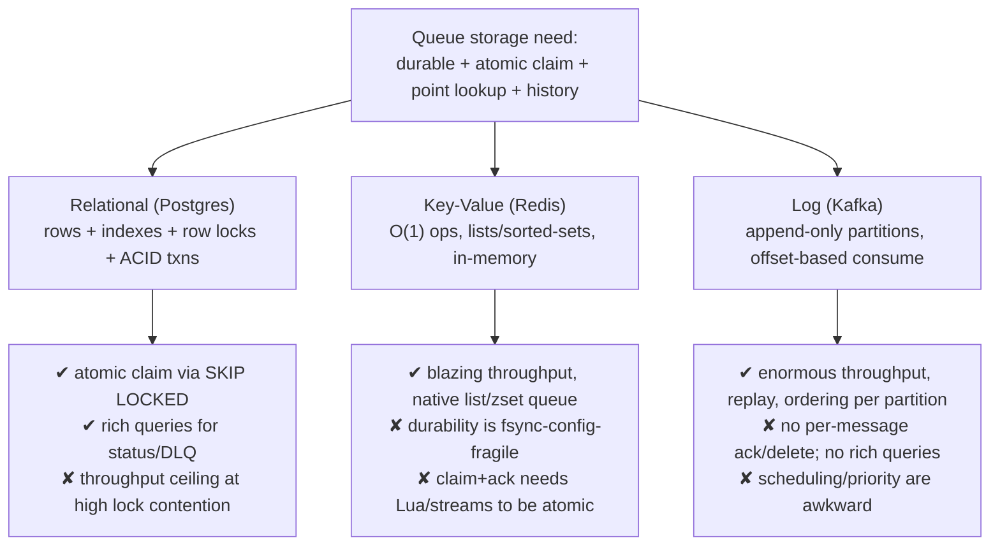
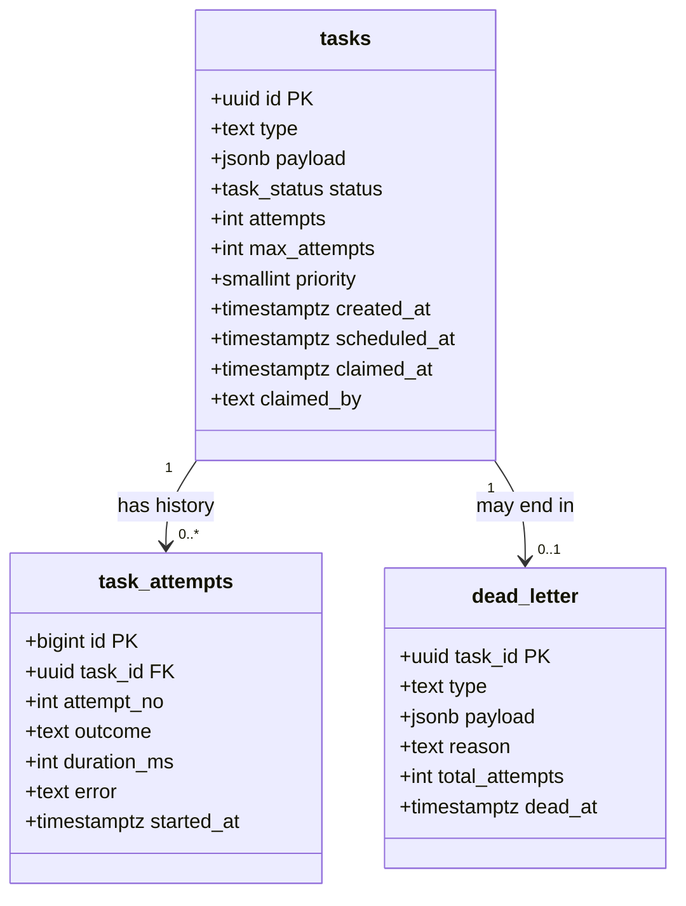
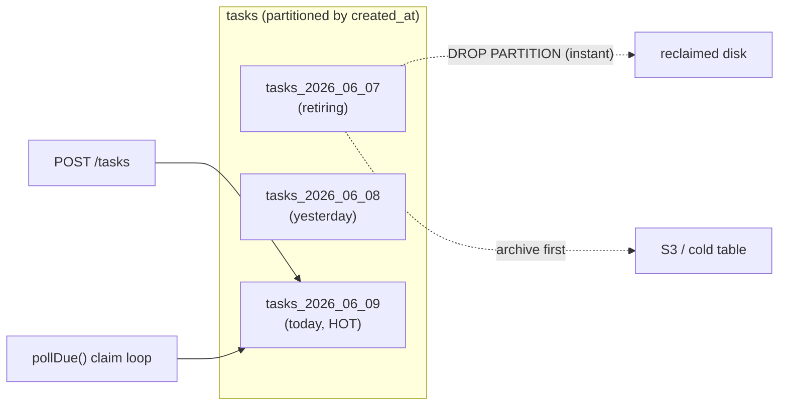
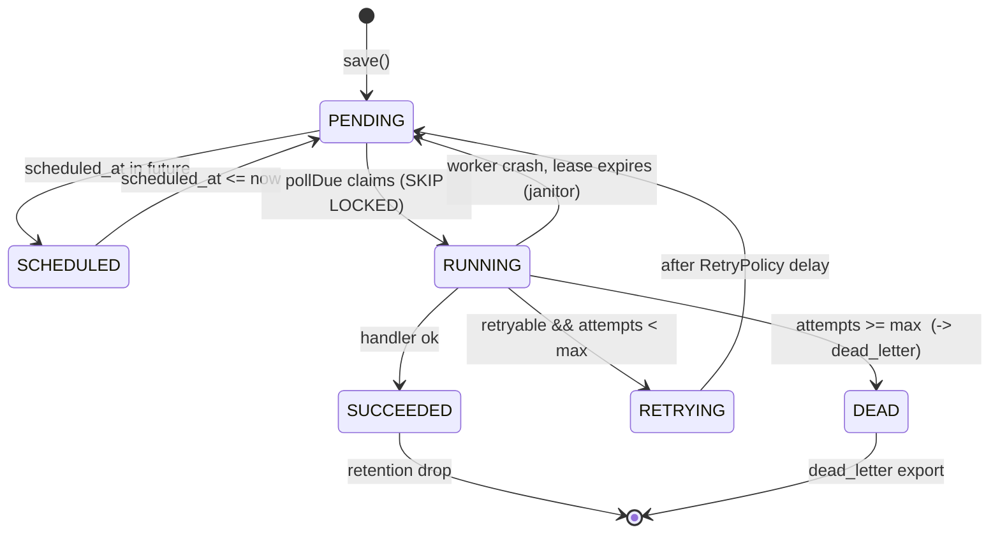
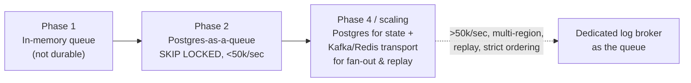

# Data Modeling and Storage Choices

> Where the `Task`, its `attempts`, and the `dead_letter` records actually *live* — the schema, the indexes, the partitioning, and the honest limits of using PostgreSQL as the durable backbone of our Distributed Task Queue.

Storage is the decision you regret slowest and fix hardest. A wrong handler is a one-line patch. A wrong primary-key choice, a missing index on the polling query, or a `dead_letter` table that grows unbounded until it eats your disk — those surface weeks later, under load, at 3am. This chapter picks the storage substrate for our project deliberately: it compares **relational vs key-value vs log-structured** storage for a queue, designs the concrete `tasks` / `task_attempts` / `dead_letter` schema, makes `SELECT ... FOR UPDATE SKIP LOCKED` polling fast with the right indexes, plans partitioning, retention, and archival, and is brutally honest about **why Postgres-as-a-queue works and exactly where it stops working**.

This builds on [designing-a-task-queue.md](./designing-a-task-queue.md) (the full design) and [capacity-estimation.md](./capacity-estimation.md) (the numbers). It is the storage deep-dive that [scaling-the-platform.md](./scaling-the-platform.md) later pushes past. For the broker alternatives it references, see [../07-queues-and-messaging/broker-comparison.md](../07-queues-and-messaging/broker-comparison.md).

---

## 1. Why This Exists — The Real Problem

In Phase 1 our queue is an `InMemoryTaskQueue` backed by a `LinkedBlockingQueue`. It is fast and simple and **loses every task the instant the JVM dies**. That is fine for a tutorial and unacceptable for anything a customer paid for. The moment the requirement becomes *"never lose an accepted task"*, the queue stops being a data structure and becomes a **durability problem** — which is to say, a *storage* problem.

The historical arc is instructive. Early job systems (cron, `at`, resque-on-Redis) treated the queue and the storage as separate concerns: Redis held the queue, a SQL database held the "real" data, and a background process reconciled them. That split creates a notorious failure mode — a task is in Redis but not the database, or committed to the database but lost from Redis — because **two stores cannot be updated atomically without a distributed transaction.** The modern insight (popularized by systems like Sidekiq-on-Postgres, `pg-boss`, river, and Oban) is: *if your database is already ACID and already where the task data lives, make the database the queue too.* One store, one transaction, one source of truth.

> **Mental model:** A task queue is a **durable, ordered-ish, claimable log of work**. "Durable" wants a database. "Claimable by exactly one worker" wants a lock. "Ordered-ish" wants an index. The storage question is: which engine gives me all three cheaply at *my* scale?

For our project the storage decision drives everything downstream: how `TaskRepository.save`, `findById`, and `pollDue(n)` are implemented, whether `Worker` instances can run on many nodes without double-executing a task, and how the `DeadLetterQueue` persists poison messages for later inspection.

---

## 2. Requirements — Functional and Non-Functional

Storage decisions are downstream of access patterns. Write the patterns first; the engine falls out of them.

### Functional requirements (what the store must support)

- **Persist a task** on `POST /tasks` so it survives process and node restarts (`TaskRepository.save`).
- **Look up a task by id** for `GET /tasks/{id}` (`findById`, point read on the primary key).
- **Claim due work**: atomically hand the next *N* `PENDING`/`SCHEDULED` tasks whose `scheduledAt <= now` to exactly one worker (`pollDue(n)` → the engine of the `TaskQueue`).
- **Record each attempt**: every execution of `Worker` writes an attempt row with outcome, duration, and error — the audit trail behind `attempts` and retries.
- **Dead-letter** poison tasks: `DeadLetterQueue.send(task, reason)` persists tasks that exhausted `maxAttempts` for human inspection and replay.
- **Scheduled/delayed delivery**: a task with a future `scheduledAt` must not be claimable until that time.
- **Retention/archival**: terminal tasks (`SUCCEEDED`, `DEAD`) must be removable so the hot tables stay small.

### Non-functional requirements (the ones that pick the engine)

| Requirement | Target | Why it constrains storage |
|---|---|---|
| **Durability** | No accepted task lost on single-node crash | Rules out pure in-memory; wants WAL + fsync + replication |
| **Exactly-once *claim*** | A task is handed to at most one worker at a time | Needs row-level locking or a single-consumer log |
| **Submit latency** | p99 `POST /tasks` < 20 ms | One indexed `INSERT`; no fan-out writes |
| **Poll throughput** | 5k–50k claims/sec | The hot path; the indexing chapter of this doc |
| **Consistency** | Read-your-writes for status | Strong/serializable for the claim, eventual is fine for `GET` |
| **Retention** | Hot set < ~50 GB, history archived | Partitioning + TTL + cold storage |
| **Operability** | One engine the team already runs | Don't add Kafka for 5k/sec; don't stay on PG at 5M/sec |

The headline non-functional fact: **the claim must be atomic and single-winner.** That single requirement is what separates "a database" from "a data structure," and it is what `SKIP LOCKED` (Section 7) exists to make cheap.

---

## 3. Capacity — Back-of-Envelope That Sizes the Schema

Numbers decide the engine. Assume the mid-scale target from [capacity-estimation.md](./capacity-estimation.md):

```text
Ingest rate:        5,000 tasks/sec sustained, 20,000/sec peak
Avg task lifetime:  ~3 s in the system (enqueue -> execute -> terminal)
Avg payload:        2 KB JSON
Avg attempts:       1.3 (most succeed first try)
Retention (hot):    terminal tasks kept 7 days, then archived
```

**Row sizing.** A `tasks` row: id (16 B uuid) + type (~32 B) + status (enum, 4 B) + counters (~16 B) + 3 timestamps (24 B) + 2 KB payload ≈ **~2.1 KB**. With Postgres tuple + index overhead, budget **~2.6 KB/row on disk.**

**In-flight working set.** 5,000/sec × 3 s avg lifetime = **~15,000 rows in flight** at any moment — tiny, fits in RAM trivially. This is the number that makes Postgres-as-a-queue viable: the *hot* set is small even when the *total* set is huge.

**Total volume.** 5,000/sec × 86,400 s = **432 M tasks/day**. At 2.6 KB → **~1.1 TB/day of `tasks`** plus 1.3× that in `task_attempts`. Without retention you fill any disk in days. This is why Sections 9–10 (partitioning, retention, archival) are not optional polish — at this rate they are load-bearing.

**Poll cost.** At peak, workers claim ~20,000 tasks/sec. If each claim is one indexed `SKIP LOCKED` query returning a batch of, say, 50 rows, that is **~400 claim-queries/sec** — well within a single well-tuned Postgres primary. Double it for safety and you are still nowhere near needing a second engine.

> **The estimate's verdict:** At 5k–20k/sec with a 15k-row working set and aggressive retention, **one PostgreSQL primary handles the queue.** The decision is "Postgres-as-a-queue," and the rest of this chapter is about doing it correctly. Past ~50k sustained claims/sec the lock contention and WAL pressure tip us toward a dedicated log broker — Section 12 draws that line.

---

## 4. The Storage Choice — Relational vs Key-Value vs Log

Three families of engines could back a queue. Each is *good at* exactly the thing the others are *bad at*. Map them to our three access patterns: point read (`findById`), atomic claim (`pollDue`), and append (attempts).



### Relational (PostgreSQL)

A `tasks` **table**; the queue is "rows where `status='PENDING'` ordered by priority/time." The claim is a `SELECT ... FOR UPDATE SKIP LOCKED`. You get ACID transactions for free, so `save` + status transition + attempt insert happen atomically. You get arbitrary queries: "how many `FAILED` of type `email`?" is one line of SQL. The cost is that the queue rides on row-level locks and the WAL; throughput is excellent (tens of thousands/sec) but not unbounded, and a hot, churning table needs autovacuum tuning.

### Key-Value (Redis)

A Redis `LIST` (`LPUSH`/`BRPOP`) or `STREAM` is a native, ferociously fast queue. But Redis is memory-first; durability depends on `appendfsync` settings and you can still lose the last few writes on a crash. Atomic claim-and-acknowledge needs Redis Streams consumer groups or hand-written Lua — doable, but you are reimplementing what SQL gives you for free, and you still need a *second* durable store for the task body, reintroducing the two-store atomicity problem from Section 1.

### Log (Kafka / append-only)

A log is an append-only, offset-indexed sequence partitioned for parallelism. It is the right tool at extreme throughput and when you want replay and strict per-partition ordering. But a log has **no concept of deleting or acking an individual message** — consumers advance an offset. Per-task retry-with-backoff, priority, arbitrary scheduling, and "show me one failed task by id" all fight the log model. Logs are excellent *transports* and poor *task stores*. Our Phase 4 uses a broker as a transport in front of, not instead of, durable task records — see [../07-queues-and-messaging/broker-comparison.md](../07-queues-and-messaging/broker-comparison.md).

### The decision table

| Capability we need | Relational (PG) | Key-Value (Redis) | Log (Kafka) |
|---|---|---|---|
| Durable on single-node crash | ✅ WAL+fsync | ⚠️ config-fragile | ✅ replicated log |
| Atomic single-winner claim | ✅ `SKIP LOCKED` | ⚠️ Lua/streams | ⚠️ partition = 1 consumer |
| Point read by id (`findById`) | ✅ PK index | ✅ GET | ❌ scan/external index |
| Per-task retry / DLQ / priority | ✅ trivial | ⚠️ manual | ❌ awkward |
| Rich status queries / dashboards | ✅ SQL | ❌ | ❌ |
| Raw claim throughput ceiling | ~50k/sec | ~1M/sec | millions/sec |
| One engine, no extra ops | ✅ already have it | ➖ extra service | ➖ heavy ops |

**Verdict for our scale: PostgreSQL.** It is the only column with a check in every row we care about until throughput crosses the relational ceiling. We adopt Postgres-as-a-queue and revisit at the scaling boundary.

---

## 5. The Data Model — Tables for tasks, attempts, dead_letter

The canonical `Task` (`id`, `type`, `payload`, `status`, `attempts`, `maxAttempts`, `createdAt`, `scheduledAt`, `priority`) maps to a `tasks` table. We deliberately **split** the per-execution history into `task_attempts` and the terminal poison records into `dead_letter`. Why split?

- `tasks` is the **hot, churning** table — read and updated constantly by the claim loop. Keep it narrow so more rows fit per page and indexes stay small.
- `task_attempts` is **append-only and wide** (it carries stack traces). Mixing it into `tasks` would bloat the hot rows and slow every poll.
- `dead_letter` is **cold and rarely read** — a triage queue for humans, not the hot path.



The relationship `tasks → task_attempts` is **composition** (an attempt has no meaning without its task; delete the task and its attempts go too). `tasks → dead_letter` is an **association**: a dead-lettered record is intentionally *copied* out of the hot table so it survives `tasks` retention/archival.

### The DDL (Flyway migration `V3__queue_schema.sql`)

```sql
-- Enum mirrors the canonical Java TaskStatus exactly.
CREATE TYPE task_status AS ENUM (
    'PENDING', 'SCHEDULED', 'RUNNING', 'SUCCEEDED', 'FAILED', 'RETRYING', 'DEAD'
);

CREATE TABLE tasks (
    id           uuid         PRIMARY KEY,
    type         text         NOT NULL,
    payload      jsonb        NOT NULL,
    status       task_status  NOT NULL DEFAULT 'PENDING',
    attempts     int          NOT NULL DEFAULT 0,
    max_attempts int          NOT NULL DEFAULT 3,
    priority     smallint     NOT NULL DEFAULT 0,   -- higher = sooner
    created_at   timestamptz  NOT NULL DEFAULT now(),
    scheduled_at timestamptz  NOT NULL DEFAULT now(),
    claimed_at   timestamptz,                       -- set on claim, for lease/recovery
    claimed_by   text                               -- worker/node id holding the lease
);

-- Append-only execution history. One row per Worker run.
CREATE TABLE task_attempts (
    id          bigint       GENERATED ALWAYS AS IDENTITY PRIMARY KEY,
    task_id     uuid         NOT NULL REFERENCES tasks(id) ON DELETE CASCADE,
    attempt_no  int          NOT NULL,
    outcome     text         NOT NULL,             -- SUCCEEDED | FAILED | RETRYABLE
    duration_ms int          NOT NULL,
    error       text,                              -- truncated stack/message
    started_at  timestamptz  NOT NULL DEFAULT now()
);

-- Cold triage table. Survives tasks-table retention deliberately.
CREATE TABLE dead_letter (
    task_id        uuid        PRIMARY KEY,
    type           text        NOT NULL,
    payload        jsonb       NOT NULL,
    reason         text        NOT NULL,
    total_attempts int         NOT NULL,
    dead_at        timestamptz NOT NULL DEFAULT now()
);
```

Design notes a reviewer will check:

- **`uuid` primary key, not `bigserial`.** The canonical `Task.id` is a client-visible UUID; sequential bigints would leak volume and invite enumeration. We use UUIDv7 (time-ordered) at the app layer so the PK is *still* roughly insertion-ordered — this matters for B-tree locality and avoids the random-write penalty of UUIDv4. (More in Section 8.)
- **`jsonb`, not `text`, for payload.** Validated on write, and indexable if a handler ever needs `payload->>'customerId'`. Costs a little on insert; pays off in queryability.
- **`claimed_at` / `claimed_by` are the lease.** They turn `SKIP LOCKED` (a transaction-scoped lock) into a *recoverable* claim: if a worker dies mid-task, a janitor can reclaim rows whose `claimed_at` is older than the lease (Section 11).
- **Enum mirrors `TaskStatus`.** Keep the database enum and the Java enum in lockstep; a migration adds new values to both or neither.

---

## 6. The Repository — Mapping the Java Contract to SQL

The canonical `TaskRepository` is the seam between domain and storage. Here is the Postgres-backed implementation that the `PostgresTaskQueue` and `Worker` use. It is plain JDBC for clarity; Spring Data JDBC wraps the same SQL.

```java
public interface TaskRepository {
    void save(Task t);
    Optional<Task> findById(String id);
    List<Task> pollDue(int n);   // the atomic claim — see Section 7
}
```

```java
public final class PostgresTaskRepository implements TaskRepository {

    private final DataSource ds;
    private final String workerId;   // e.g. hostname + pid, written into claimed_by

    public PostgresTaskRepository(DataSource ds, String workerId) {
        this.ds = ds;
        this.workerId = workerId;
    }

    @Override
    public void save(Task t) {
        var sql = """
            INSERT INTO tasks (id, type, payload, status, attempts,
                               max_attempts, priority, created_at, scheduled_at)
            VALUES (?, ?, ?::jsonb, ?::task_status, ?, ?, ?, ?, ?)
            ON CONFLICT (id) DO UPDATE SET
                status = EXCLUDED.status,
                attempts = EXCLUDED.attempts,
                scheduled_at = EXCLUDED.scheduled_at
            """;
        try (var c = ds.getConnection(); var ps = c.prepareStatement(sql)) {
            ps.setObject(1, java.util.UUID.fromString(t.id()));
            ps.setString(2, t.type());
            ps.setString(3, t.payload());
            ps.setString(4, t.status().name());
            ps.setInt(5, t.attempts());
            ps.setInt(6, t.maxAttempts());
            ps.setInt(7, t.priority());
            ps.setObject(8, t.createdAt().atOffset(java.time.ZoneOffset.UTC));
            ps.setObject(9, t.scheduledAt().atOffset(java.time.ZoneOffset.UTC));
            ps.executeUpdate();
        } catch (java.sql.SQLException e) {
            throw new StorageException("save failed for " + t.id(), e);
        }
    }

    @Override
    public Optional<Task> findById(String id) {
        var sql = "SELECT * FROM tasks WHERE id = ?";
        try (var c = ds.getConnection(); var ps = c.prepareStatement(sql)) {
            ps.setObject(1, java.util.UUID.fromString(id));
            try (var rs = ps.executeQuery()) {
                return rs.next() ? Optional.of(map(rs)) : Optional.empty();
            }
        } catch (java.sql.SQLException e) {
            throw new StorageException("findById failed for " + id, e);
        }
    }

    // pollDue is the atomic claim; full SQL in Section 7.
    @Override
    public List<Task> pollDue(int n) {
        var sql = """
            WITH claimed AS (
                SELECT id FROM tasks
                WHERE status IN ('PENDING', 'SCHEDULED')
                  AND scheduled_at <= now()
                ORDER BY priority DESC, scheduled_at ASC
                FOR UPDATE SKIP LOCKED
                LIMIT ?
            )
            UPDATE tasks t
               SET status = 'RUNNING', claimed_at = now(), claimed_by = ?
              FROM claimed
             WHERE t.id = claimed.id
            RETURNING t.*
            """;
        var out = new java.util.ArrayList<Task>(n);
        try (var c = ds.getConnection(); var ps = c.prepareStatement(sql)) {
            ps.setInt(1, n);
            ps.setString(2, workerId);
            try (var rs = ps.executeQuery()) {
                while (rs.next()) out.add(map(rs));
            }
        } catch (java.sql.SQLException e) {
            throw new StorageException("pollDue failed", e);
        }
        return out;
    }

    private static Task map(java.sql.ResultSet rs) throws java.sql.SQLException {
        return new Task(
            rs.getObject("id", java.util.UUID.class).toString(),
            rs.getString("type"),
            rs.getString("payload"),
            TaskStatus.valueOf(rs.getString("status")),
            rs.getInt("attempts"),
            rs.getInt("max_attempts"),
            rs.getObject("created_at", java.time.OffsetDateTime.class).toInstant(),
            rs.getObject("scheduled_at", java.time.OffsetDateTime.class).toInstant(),
            rs.getInt("priority"));
    }
}
```

The crucial property: `pollDue` is **one round-trip and one transaction** that *both* selects and marks the rows `RUNNING`. There is no window where a row is selected but not yet claimed, so no two workers — on the same node or different nodes — can ever pull the same task.

---

## 7. Indexing for `SKIP LOCKED` Polling

The claim query in Section 6 is the hottest query in the system. Get its index wrong and the whole platform crawls. Let's derive the right index from the query, not guess it.

The `WHERE`/`ORDER BY` of the claim is:

```sql
WHERE status IN ('PENDING','SCHEDULED') AND scheduled_at <= now()
ORDER BY priority DESC, scheduled_at ASC
```

A naive full index on the whole table would index `SUCCEEDED`, `DEAD`, and `RUNNING` rows we never poll — millions of dead rows bloating the index and slowing scans. The fix is a **partial, covering, correctly-ordered index** that matches the predicate exactly:

```sql
CREATE INDEX idx_tasks_claim
    ON tasks (priority DESC, scheduled_at ASC)
    WHERE status IN ('PENDING', 'SCHEDULED');
```

Why each piece matters:

- **Partial (`WHERE status IN ...`)** — the index only contains *claimable* rows. At any moment that is the ~15k-row working set from Section 3, **not** the billions of terminal rows. The index stays tiny and hot in cache, and — critically — when a task moves to `SUCCEEDED`/`DEAD`, it *leaves the index*, so the index does not grow with history.
- **Column order `(priority DESC, scheduled_at ASC)`** — matches the `ORDER BY` exactly, so Postgres reads rows in already-sorted order and `LIMIT n` stops after *n* index entries. No sort node, no scanning the whole working set.
- **`SKIP LOCKED` plays well with B-tree order** — workers walk the index head-first; the first worker locks the top *n* rows, the second `SKIP LOCKED`s past them to the next *n*, and so on. Contention is bounded by `(number of workers × batch size)`, not by table size.

The expected plan:

```text
EXPLAIN (ANALYZE) for pollDue(50):
  Update on tasks
    -> Index Scan using idx_tasks_claim on tasks
         Index Cond: (status = ANY('{PENDING,SCHEDULED}'))
         Filter: (scheduled_at <= now())
         Rows Removed by Filter: 0
       Limit: 50
  Planning Time: 0.1 ms
  Execution Time: 0.4 ms      <- sub-millisecond claim
```

Two supporting indexes complete the picture:

```sql
-- Lease recovery: find tasks stuck in RUNNING past their lease (Section 11).
CREATE INDEX idx_tasks_stuck
    ON tasks (claimed_at)
    WHERE status = 'RUNNING';

-- findById uses the PK already; no extra index needed.
-- task_attempts: look up a task's history.
CREATE INDEX idx_attempts_task ON task_attempts (task_id, attempt_no);
```

> **Pitfall — over-indexing the hot table.** Every index you add is a write you pay on every claim's `UPDATE`. The `tasks` table is write-heavy by nature; resist adding indexes for ad-hoc dashboard queries. Run dashboards off a read replica or a separate metrics store (Micrometer → Prometheus), not off more indexes on the hot table.

### Why not `LISTEN/NOTIFY` instead of polling?

Postgres `LISTEN/NOTIFY` lets workers be woken on new rows instead of polling on a timer. It removes idle-poll load and cuts latency. But it does **not** replace `SKIP LOCKED` — you still need the atomic claim; `NOTIFY` only tells workers *when* to run it. A robust design uses **both**: `LISTEN/NOTIFY` for low-latency wakeups plus a slow safety-net poll (every few seconds) so a missed notification (e.g., during a reconnect) never strands a task forever.

---

## 8. Primary Keys, Payload, and Write Amplification

Two modeling choices quietly dominate write performance on the hot table.

### UUIDv7 over UUIDv4 for the primary key

A B-tree primary key on a *random* UUIDv4 means every `INSERT` lands in a random leaf page — the classic "index thrash" that causes page splits, cache misses, and WAL bloat. UUIDv7 embeds a millisecond timestamp in the high bits, so new ids sort *after* existing ones and inserts append to the right edge of the B-tree, just like a sequence — but without leaking a guessable counter to clients.

```java
// Generate a time-ordered UUIDv7 for Task.id at creation time.
public final class TaskIds {
    private static final java.security.SecureRandom RNG = new java.security.SecureRandom();

    public static String newId() {
        byte[] b = new byte[16];
        RNG.nextBytes(b);
        long ms = System.currentTimeMillis();
        b[0] = (byte) (ms >>> 40);  b[1] = (byte) (ms >>> 32);
        b[2] = (byte) (ms >>> 24);  b[3] = (byte) (ms >>> 16);
        b[4] = (byte) (ms >>> 8);   b[5] = (byte) ms;
        b[6] = (byte) ((b[6] & 0x0F) | 0x70);              // version 7
        b[8] = (byte) ((b[8] & 0x3F) | 0x80);              // variant
        long hi = 0, lo = 0;
        for (int i = 0; i < 8; i++) hi = (hi << 8) | (b[i] & 0xFF);
        for (int i = 8; i < 16; i++) lo = (lo << 8) | (b[i] & 0xFF);
        return new java.util.UUID(hi, lo).toString();
    }
}
```

### Keep the hot table narrow

The 2 KB `payload` is the heaviest column. Postgres TOASTs large `jsonb` out of the main heap automatically, but you still pay to read it back. If a handler only needs the *type* to route, the claim query should **not** drag the payload around unnecessarily — fetch the payload only when the `Worker` actually executes. For very large payloads (images, multi-MB documents), store them in object storage (S3) and keep only a pointer in `payload`: the queue moves *references*, not blobs. This is the single biggest lever on write amplification at scale.

| Choice | Write amplification | Read cost | When |
|---|---|---|---|
| Inline payload in `tasks` | High (TOAST + WAL) | Low | Small payloads (< few KB) |
| Pointer to S3/blob store | Low | Extra network hop | Large/binary payloads |
| Separate `task_payloads` table | Medium | Join on execute | Payload rarely needed at claim |

---

## 9. Partitioning — Keeping the Hot Table Small

At 432 M rows/day (Section 3) a single unpartitioned `tasks` table becomes a problem not because Postgres can't hold the rows, but because **autovacuum, retention deletes, and index maintenance all scale with table size.** Deleting yesterday's 432 M terminal rows with a `DELETE` generates enormous WAL and bloat. The fix is **declarative range partitioning by time**, so "delete a day" becomes "drop a partition" — an instant metadata operation that generates almost no WAL.

```sql
-- Partition the hot table by creation day.
CREATE TABLE tasks (
    id uuid NOT NULL,
    -- ... same columns as Section 5 ...
    created_at timestamptz NOT NULL DEFAULT now(),
    PRIMARY KEY (id, created_at)            -- partition key must be in the PK
) PARTITION BY RANGE (created_at);

CREATE TABLE tasks_2026_06_07 PARTITION OF tasks
    FOR VALUES FROM ('2026-06-07') TO ('2026-06-08');
CREATE TABLE tasks_2026_06_08 PARTITION OF tasks
    FOR VALUES FROM ('2026-06-08') TO ('2026-06-09');
-- ...one partition per day, created ahead of time by pg_partman or a cron.
```



Why time-range and not hash partitioning here? Because our access is **temporal**: today's partition is hot, older partitions are cold, and retention is "drop the oldest." Hash partitioning spreads writes evenly (good for raw throughput) but ruins the "drop a whole day instantly" trick and forces every claim query to touch every partition. For a queue whose hot set is *recent* rows, **time-range partitioning wins**. (If you instead needed to spread by tenant for isolation, hash on `tenant_id` — see [../08-distributed-systems/sharding.md](../08-distributed-systems/sharding.md) for choosing a partition key.)

> **Subtlety:** the partial claim index (Section 7) is created on the parent and propagates to each partition. Postgres prunes partitions whose range can't satisfy `scheduled_at <= now()`, but because we claim *recent* tasks, the planner reads only the newest one or two partitions — keeping the claim sub-millisecond even with hundreds of partitions present.

---

## 10. Retention and Archival

Partitioning gives us cheap deletion; retention policy decides *what* and *when*. Three classes of data, three policies:

| Data | Hot retention | Then | Why |
|---|---|---|---|
| `SUCCEEDED` tasks | 24–72 h | drop partition | Nobody queries old successes; status was already reported |
| `FAILED`/`DEAD` in `tasks` | 7 d | archive to cold table/S3, then drop | Needed for debugging recent failures |
| `dead_letter` | 30–90 d | export to S3 (Parquet), then delete | Compliance/audit + replay window |
| `task_attempts` | match parent | drop with parent (`ON DELETE CASCADE`) | History is only as useful as the task |

The archival job — a scheduled Spring `@Scheduled` method or a cron-driven worker `type` — copies aging partitions to cold storage before the drop:

```java
@Component
public class PartitionMaintenance {

    private final JdbcTemplate jdbc;
    private final ColdArchiver archiver;   // streams rows to S3 as Parquet/NDJSON

    // Runs nightly; archives then drops partitions older than the retention window.
    @Scheduled(cron = "0 30 2 * * *")   // 02:30 every day
    public void rotate() {
        LocalDate cutoff = LocalDate.now().minusDays(7);
        for (String partition : jdbc.queryForList(
                "SELECT child FROM queue_partitions WHERE day < ? AND NOT archived",
                String.class, cutoff)) {
            archiver.archive(partition);                         // copy to S3
            jdbc.update("ALTER TABLE tasks DETACH PARTITION " + partition);
            jdbc.update("DROP TABLE " + partition);              // instant, low-WAL
        }
        jdbc.update("DELETE FROM dead_letter WHERE dead_at < now() - interval '90 days'");
    }
}
```

> **Pitfall — `DELETE` on the hot table for cleanup.** A `DELETE FROM tasks WHERE status='SUCCEEDED' AND created_at < ...` on a billion-row table will run for hours, balloon WAL, block autovacuum, and leave dead tuples that bloat the table until vacuumed. `DROP PARTITION` is O(metadata). If you take one operational lesson from this chapter, it is: **rotate partitions; do not bulk-delete from the hot path.**

---

## 11. Failure Modes and How the Schema Handles Them

A queue's correctness *is* its behavior under failure. Each mode maps to a schema feature.



- **Worker crashes mid-task.** The row sits in `RUNNING` with `claimed_at` set. A **janitor** query, using `idx_tasks_stuck`, finds rows whose lease expired and returns them to `PENDING`:
  ```sql
  UPDATE tasks SET status='PENDING', claimed_by=NULL, claimed_at=NULL
   WHERE status='RUNNING' AND claimed_at < now() - interval '5 minutes';
  ```
  This makes delivery **at-least-once**: a crash after work-done-but-before-commit re-runs the task, which is why every `TaskHandler` must be idempotent — see [../08-distributed-systems/idempotency.md](../08-distributed-systems/idempotency.md).
- **Duplicate claim across nodes.** Impossible by construction: `SKIP LOCKED` makes the select-and-mark atomic. This is the property a Redis-list queue must re-implement and frequently gets subtly wrong.
- **Poison task loops forever.** Bounded by `max_attempts`; on the final failure the `Worker` writes to `dead_letter` and sets `tasks.status='DEAD'` in one transaction. See [../07-queues-and-messaging/dead-letter-queues.md](../07-queues-and-messaging/dead-letter-queues.md).
- **Lost write on submit.** The `save` `INSERT` commits to the WAL with synchronous_commit; on a synchronous replica it survives primary loss. Durability is the WAL's job, not the application's.
- **Autovacuum can't keep up.** The signature failure of Postgres-as-a-queue: a churning table accumulates dead tuples faster than vacuum reclaims them, index scans slow, and the partial index bloats. Mitigations: aggressive per-table `autovacuum_vacuum_scale_factor`, partitioning so each partition is small, and keeping the hot working set tiny. This is the load-bearing operational concern — Section 12 covers when it becomes the breaking point.

---

## 12. Why Postgres-as-a-Queue Works — and Where It Stops

**Why it works (the honest case):**

1. **One store, one transaction.** `save`, status transitions, attempt inserts, and dead-lettering are all in the same ACID database — no two-store atomicity problem, no reconciliation job, no "in Redis but not the DB" drift.
2. **The claim is exactly the hard part, and `SKIP LOCKED` nails it** in sub-millisecond, multi-node-safe fashion with no extra infrastructure.
3. **Rich queries for free.** Dashboards, "show me failed `email` tasks from the last hour," DLQ triage, and replay are all plain SQL. A log broker gives you none of this.
4. **You already run it.** Zero new operational surface. The cheapest reliable system is the one your team already knows how to back up, fail over, and monitor.

**Where it stops (know the ceiling before you hit it):**

| Limit | Symptom | Threshold (rough) |
|---|---|---|
| **Lock contention** | Many workers fighting for the same hot rows; claim latency rises | thousands of concurrent claimers on one table |
| **WAL / write throughput** | Single primary's write bandwidth saturates | ~50k sustained claims+updates/sec |
| **Autovacuum lag** | Dead-tuple bloat outpaces vacuum; tables/indexes swell | extreme churn without partitioning |
| **Single-writer ceiling** | One primary; vertical scaling only | when one big box isn't enough |
| **Geo / replay** | Multi-region ordering, infinite replay | log-shaped requirements |



The transition is not "rip out Postgres." It is **add a transport for fan-out while keeping Postgres as the durable source of truth**, and only fully move the queue to a log broker when throughput or replay requirements genuinely exceed the relational ceiling. Most systems never need step D — and reaching for Kafka at 5k/sec is the classic over-engineering mistake. Match the engine to the number from Section 3.

---

## 13. How This Applies to Our Task Queue Project

- **`TaskRepository`** becomes `PostgresTaskRepository` (Section 6): `save` = upsert `INSERT`, `findById` = PK point read, `pollDue(n)` = the `SKIP LOCKED` claim.
- **`PostgresTaskQueue`** (canonical Phase 2 `TaskQueue`) delegates `dequeue()`/`enqueue()` to the repository's claim and save. The blocking semantics of Phase 1's `InMemoryTaskQueue` become a poll loop plus optional `LISTEN/NOTIFY`.
- **`Worker`** claims a batch, executes the matching `TaskHandler`, writes a `task_attempts` row, and transitions status in one transaction.
- **`DeadLetterQueue.send`** inserts into the `dead_letter` table and flips `tasks.status='DEAD'`.
- **`TaskScheduler.schedule`** sets `scheduled_at = now() + delay`; the claim's `scheduled_at <= now()` predicate enforces the delay for free — no separate `DelayQueue` needed once we're on Postgres.
- **Retention/archival** is the `PartitionMaintenance` component (Section 10), wired as a Spring `@Scheduled` job.

---

## 14. Tradeoffs

| Decision | We chose | Alternative | Why |
|---|---|---|---|
| Storage family | Relational (Postgres) | Redis / Kafka | Atomic claim + rich queries + one store, at our scale |
| Claim mechanism | `SELECT FOR UPDATE SKIP LOCKED` | advisory locks / `LISTEN-only` | Multi-node safe, sub-ms, no extra infra |
| Primary key | UUIDv7 | bigserial / UUIDv4 | Client-safe + B-tree-friendly insert locality |
| History storage | Separate `task_attempts` | columns on `tasks` | Keep hot table narrow & fast |
| Cleanup | Drop time partitions | `DELETE` | O(metadata) vs hours of WAL/bloat |
| Delivery guarantee | At-least-once + idempotent handlers | exactly-once | Exactly-once is a myth across process boundaries |
| Partition key | Range on `created_at` | hash on id/tenant | Hot set is recent rows; drop-a-day retention |
| Payload | jsonb inline (small) / S3 pointer (large) | always inline | Bound write amplification on the hot table |

---

## 15. Common Mistakes and Pitfalls

- **`SELECT FOR UPDATE` without `SKIP LOCKED`.** Workers *block* on each other's locked rows instead of skipping; throughput collapses to serial. Always add `SKIP LOCKED` for a competing-consumers queue.
- **A full index instead of a partial one.** Indexing terminal rows bloats the index with billions of entries you never poll. Partial-index on the claimable statuses.
- **`ORDER BY` columns not in the index order.** Forces a sort node over the working set; the `LIMIT` can't short-circuit. Match index column order to `ORDER BY` exactly.
- **Bulk `DELETE` for retention.** Hours of runtime, WAL explosion, vacuum starvation. Partition + `DROP`.
- **UUIDv4 primary key on a high-insert table.** Random B-tree inserts thrash cache and bloat WAL. Use UUIDv7 (or a sequence if ids needn't be opaque).
- **Forgetting the lease.** `SKIP LOCKED` only holds the lock for the transaction; if the worker crashes you need `claimed_at` + a janitor, or rows stick in `RUNNING` forever.
- **Treating Postgres-as-a-queue as infinitely scalable.** It has a real ceiling (~50k/sec, autovacuum). Know the number; plan the transition.
- **Two stores (Redis queue + SQL data) without a transaction.** Reintroduces the drift problem the single-store design exists to solve.

---

## 16. Refactoring Exercise

**Bad — blocking lock, full table scan, two round-trips, race window:**

```java
// Selects, then marks in a SEPARATE statement: two workers can grab the same row
// between the SELECT and the UPDATE. No SKIP LOCKED -> workers block serially.
List<Task> claim(int n) {
    var ids = jdbc.queryForList(
        "SELECT id FROM tasks WHERE status='PENDING' " +
        "ORDER BY created_at LIMIT " + n, String.class);   // also: SQL-injectable LIMIT
    for (String id : ids)
        jdbc.update("UPDATE tasks SET status='RUNNING' WHERE id=?", id);
    return load(ids);                                       // third round-trip
}
```

**Improved — single atomic claim with `SKIP LOCKED`, parameterized:**

```java
List<Task> claim(int n) {
    return jdbc.query("""
        WITH c AS (
            SELECT id FROM tasks
            WHERE status='PENDING' AND scheduled_at <= now()
            ORDER BY priority DESC, scheduled_at ASC
            FOR UPDATE SKIP LOCKED LIMIT ?)
        UPDATE tasks t SET status='RUNNING' FROM c
        WHERE t.id=c.id RETURNING t.*""", taskRowMapper, n);
}
```

**Production — adds the lease, batch tuning, and the supporting partial index:**

```sql
CREATE INDEX idx_tasks_claim ON tasks (priority DESC, scheduled_at ASC)
    WHERE status IN ('PENDING','SCHEDULED');
```

```java
List<Task> claim(int n) {                  // n tuned to ~ tasks/sec ÷ poll-rate
    return jdbc.query("""
        WITH c AS (
            SELECT id FROM tasks
            WHERE status IN ('PENDING','SCHEDULED') AND scheduled_at <= now()
            ORDER BY priority DESC, scheduled_at ASC
            FOR UPDATE SKIP LOCKED LIMIT ?)
        UPDATE tasks t
           SET status='RUNNING', claimed_at=now(), claimed_by=?
          FROM c WHERE t.id=c.id RETURNING t.*""",
        taskRowMapper, n, workerId);
}
```

The production version is multi-node-safe (`SKIP LOCKED`), crash-recoverable (`claimed_at`/`claimed_by` lease), index-backed (partial index → sub-ms), and a single round-trip.

---

## 17. Exercises

### Easy

1. **Knowledge check.** Why is `SELECT ... FOR UPDATE SKIP LOCKED` essential for a multi-worker queue, and what specifically goes wrong if you drop `SKIP LOCKED`?
2. **Coding.** Write the SQL for the partial index that makes `pollDue` fast, and explain in one sentence why a *partial* index beats a full index here.

### Medium

3. **Refactoring.** Given a `DELETE FROM tasks WHERE status='SUCCEEDED' AND created_at < now() - interval '7 days'` retention job that runs for hours and bloats the table, redesign the table and the job to make retention O(metadata).
4. **Design.** A handler's payload can be up to 20 MB. Redesign the data model so the `tasks` table stays narrow and the claim query stays fast. State the tradeoff you introduce.

### Hard

5. **Interview-style.** Your Postgres-as-a-queue is at 45k claims/sec and p99 claim latency is climbing. Walk through your diagnosis and the sequence of fixes, and identify the point at which you'd add a log broker — and what role each store plays after that.
6. **Stretch.** Implement the janitor that recovers leased-but-crashed tasks, plus the idempotency guarantee a `TaskHandler` needs so that at-least-once delivery is safe. Include the SQL and the Java.

---

## 18. Solutions

**1.** `SKIP LOCKED` lets each worker's claim transaction *skip past* rows another worker has already locked and grab the next unlocked ones. Without it, `FOR UPDATE` makes the second worker **block** on the first worker's locked row until that transaction commits — turning concurrent claims into serial execution and tanking throughput. (Plain `SELECT` without `FOR UPDATE` is worse: two workers select and run the *same* task.) `SKIP LOCKED` gives competing-consumer semantics: every worker makes progress, and no task is claimed twice.

**2.**
```sql
CREATE INDEX idx_tasks_claim ON tasks (priority DESC, scheduled_at ASC)
    WHERE status IN ('PENDING','SCHEDULED');
```
A partial index only stores *claimable* rows, so it equals the small in-flight working set (~15k rows) instead of the billions of terminal rows; it stays cache-resident and rows *leave* it on completion, so it never grows with history.

**3.** Partition `tasks` by range on `created_at`, one partition per day, and replace the `DELETE` with detach-and-drop:
```sql
CREATE TABLE tasks (... , PRIMARY KEY (id, created_at)) PARTITION BY RANGE (created_at);
-- nightly:
ALTER TABLE tasks DETACH PARTITION tasks_2026_05_31;
DROP TABLE tasks_2026_05_31;   -- O(metadata): no per-row WAL, no dead tuples, no vacuum
```
Archive the partition to S3 before dropping if history must be retained. Cost shifts from O(rows) to O(1).

**4.** Move the blob out of the row. Keep `tasks.payload` as a small `jsonb` pointer (`{"ref":"s3://bucket/key","size":20971520}`) and store the 20 MB body in object storage. On execute, the `Worker` fetches the body by ref. The hot table stays narrow (more rows per page, smaller indexes, less WAL) and the claim never touches the blob. **Tradeoff:** an extra network round-trip to S3 on execution, and you must handle the failure mode where the row exists but the blob fetch fails (treat as a retryable error).

**5.** Diagnosis sequence:
   1. Confirm the claim is index-only — `EXPLAIN ANALYZE pollDue`; check for a Sort node or Seq Scan (means the partial index regressed, e.g., from `ORDER BY` drift or vacuum bloat).
   2. Check autovacuum lag (`pg_stat_user_tables.n_dead_tup`); a churning queue often starves vacuum — tighten `autovacuum_vacuum_scale_factor` per-table and partition so each child is small.
   3. Increase batch size in `pollDue` so each claim does more work per round-trip, reducing lock acquisition frequency.
   4. Reduce contention: more partitions, or shard the queue by `type`/`tenant` so workers contend on different tables ([../08-distributed-systems/sharding.md](../08-distributed-systems/sharding.md)).
   5. When sustained throughput approaches ~50k/sec and a single primary's WAL/CPU saturates, **add a log broker (Kafka) as the transport** for fan-out while **Postgres remains the durable source of truth** for task state, attempts, and DLQ. Only if requirements demand infinite replay, strict per-partition ordering, or multi-region do you make the broker the queue itself.

**6.** Janitor SQL (backed by `idx_tasks_stuck`):
```sql
UPDATE tasks
   SET status='PENDING', claimed_by=NULL, claimed_at=NULL, attempts=attempts+1
 WHERE status='RUNNING' AND claimed_at < now() - interval '5 minutes';
```
```java
@Scheduled(fixedDelay = 60_000)            // run every minute
public void recoverStuck() {
    int recovered = jdbc.update("""
        UPDATE tasks
           SET status='PENDING', claimed_by=NULL, claimed_at=NULL, attempts=attempts+1
         WHERE status='RUNNING' AND claimed_at < now() - interval '5 minutes'""");
    if (recovered > 0) log.warn("Recovered {} stuck tasks", recovered);
}
```
Idempotency: because recovery re-runs a task that may have completed its side effect before crashing, the handler must be safe to repeat. Give each side effect a deterministic idempotency key derived from `Task.id` and check-or-upsert against it:
```java
TaskResult handle(Task t) {
    String key = "task:" + t.id();                 // deterministic, stable across retries
    if (sideEffectStore.alreadyApplied(key)) return TaskResult.success("dedup");
    doWork(t);                                      // the real, possibly external, effect
    sideEffectStore.markApplied(key);               // ideally in the same txn as doWork
    return new TaskResult(true, "ok", false);
}
```
At-least-once delivery + idempotent handlers = effectively-once *outcomes* without needing distributed exactly-once. See [../08-distributed-systems/idempotency.md](../08-distributed-systems/idempotency.md) and [../08-distributed-systems/retries.md](../08-distributed-systems/retries.md).

---

## 19. How to Present This in an Interview

A tight, senior-sounding 5-minute storage segment:

1. **Lead with access patterns, not engines** (30s): "Three patterns — point read by id, atomic claim of due work, append-only history. The claim is the hard one; it must be single-winner and durable."
2. **Justify relational from the patterns** (45s): "At our 5k–20k/sec with a ~15k-row working set, one Postgres primary handles it; `SKIP LOCKED` gives a multi-node-safe atomic claim and I get rich queries and one-store atomicity for free. I'd only reach for Kafka past ~50k/sec or for replay/ordering needs."
3. **Show the schema and the claim query** (60s): three tables, the partial claim index, and the `SELECT FOR UPDATE SKIP LOCKED ... RETURNING` CTE. Naming the index as *partial* and *ordered to match the query* is the detail that signals you've actually run this.
4. **Volunteer the failure modes** (60s): crash → lease + janitor → at-least-once → idempotent handlers; poison → `max_attempts` → DLQ.
5. **Volunteer the ceiling** (45s): lock contention, WAL, autovacuum at ~50k/sec; the transition is "Postgres for state + broker for transport," not a rewrite.
6. **Operations** (30s): partition by day, drop partitions for retention, archive to S3, run dashboards off a replica.

The signal you want to send: you picked the *simplest engine that meets the numbers*, you know exactly where it breaks, and you have a non-disruptive path past that point. That is the difference between memorizing "use Kafka" and engineering a storage layer.

---

## 20. Design Exercises with Model Answers

**Exercise A — Choose the engine for a 200/sec internal queue.**
*Answer:* Postgres-as-a-queue, unambiguously. At 200/sec the working set is a few hundred rows; `SKIP LOCKED` on a single table with a partial index is trivial, durability is the WAL's job, and you add zero new infrastructure. Reaching for Redis or Kafka here is over-engineering — you'd add an operational dependency and reintroduce the two-store atomicity problem to solve a problem you don't have.

**Exercise B — Add per-tenant fairness and isolation.**
*Answer:* Add `tenant_id` to `tasks` and include it in the claim's `ORDER BY` with a weighted/round-robin selection, or hash-partition by `tenant_id` so noisy tenants contend on separate partitions ([../08-distributed-systems/sharding.md](../08-distributed-systems/sharding.md)). Cap in-flight per tenant via a `RateLimiter` (`TokenBucketRateLimiter`) keyed by tenant to prevent one tenant starving others. Tradeoff: strict fairness complicates the single-claim query; a common compromise is per-tenant queues (partitions) plus a fair scheduler picking across them.

**Exercise C — Survive a primary failover without losing tasks.**
*Answer:* Run a synchronous standby (`synchronous_commit = on`, `synchronous_standby_names` set) so every committed `save`/claim is on at least two nodes before acknowledging the client. On failover, in-flight `RUNNING` rows whose worker lost its connection are recovered by the janitor (lease expiry → `PENDING`). Delivery stays at-least-once; idempotent handlers absorb the re-runs. Tradeoff: synchronous replication adds commit latency — acceptable for a queue where durability dominates, and you can keep it to one sync replica plus async replicas for reads.

**Exercise D — The `dead_letter` table is growing unbounded.**
*Answer:* DLQ records are for triage and replay, not permanent storage. Set a retention window (e.g., 90 days), export aging rows to S3 as Parquet for audit, then delete. Add a triage workflow: a dashboard query over `dead_letter` grouped by `reason`/`type` to spot systemic poison (a broken handler), plus a "replay" path that re-inserts a DLQ row into `tasks` as `PENDING` after a fix. Unbounded DLQ growth is almost always a *missing triage process*, not a storage problem.

---

## What We Can Improve In Our Project Using This Concept

Phase 1's `InMemoryTaskQueue` loses tasks on restart. Adopting the Postgres schema and `PostgresTaskRepository` from this chapter makes the queue durable, multi-node-safe (multiple `WorkerPool`s on different nodes claim without collision via `SKIP LOCKED`), and observable (status and history are queryable). It also unifies scheduling — `scheduled_at <= now()` replaces a separate in-memory `DelayQueue`.

## Project Refactoring Task

Implement `PostgresTaskRepository` (`save`, `findById`, `pollDue`) and `PostgresTaskQueue` against the `V3__queue_schema.sql` migration. Add the partial claim index, the `idx_tasks_stuck` lease index, and the `task_attempts` / `dead_letter` tables. Wire the `PartitionMaintenance` rotation job and the stuck-task janitor. Update `Worker` to claim a batch, write a `task_attempts` row, and transition status in a single transaction. Add Testcontainers integration tests that assert (a) no double-claim across two concurrent claimers and (b) a crashed worker's task is recovered to `PENDING` after the lease expires.

## Git Commit For This Chapter

```text
feat(storage): Postgres-as-a-queue schema with SKIP LOCKED claim, partitioning, and DLQ

- add V3__queue_schema.sql: tasks, task_attempts, dead_letter, task_status enum
- add partial claim index idx_tasks_claim and lease index idx_tasks_stuck
- implement PostgresTaskRepository (save/findById/pollDue via SKIP LOCKED CTE)
- add PostgresTaskQueue delegating to repository; UUIDv7 task ids
- add PartitionMaintenance (daily partition rotation + S3 archival) and stuck-task janitor
- Testcontainers tests: no double-claim, lease recovery, retention drop

Files: db/migration/V3__queue_schema.sql, PostgresTaskRepository.java,
PostgresTaskQueue.java, TaskIds.java, PartitionMaintenance.java, Worker.java,
PostgresTaskRepositoryIT.java
```

## Architecture Impact

The system gains a durable, queryable source of truth and the ability to run `Worker`s across many nodes safely. The queue and the data store collapse into one ACID engine, eliminating the two-store drift failure mode. The architecture now has a defined scaling ceiling (~50k claims/sec) and a documented, non-disruptive transition (add a log broker as transport, keep Postgres as state) for crossing it — see [scaling-the-platform.md](./scaling-the-platform.md).

## Interview Takeaways

- Pick storage from **access patterns and numbers**, not fashion: at 5k–20k/sec, Postgres-as-a-queue beats Kafka/Redis on simplicity, atomicity, and queryability.
- `SELECT ... FOR UPDATE SKIP LOCKED` + a **partial, query-ordered index** is the atomic, multi-node-safe, sub-millisecond claim — and the detail that signals real experience.
- Keep the hot table **narrow**, use **UUIDv7** keys, **partition by time**, and do retention by **dropping partitions**, never bulk `DELETE`.
- Durability is the WAL's job; correctness under crashes is the **lease + janitor + idempotent handlers** (at-least-once, not exactly-once).
- Know the **ceiling** (~50k/sec, autovacuum, single writer) and the graceful path past it.
