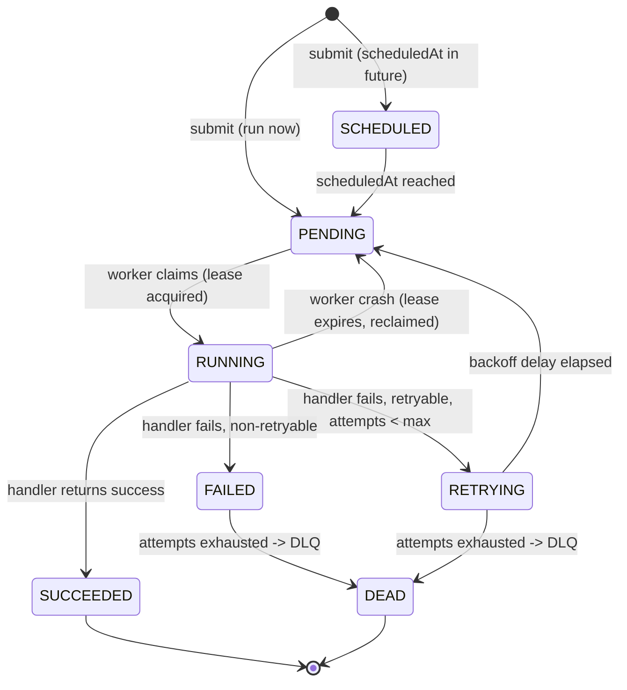
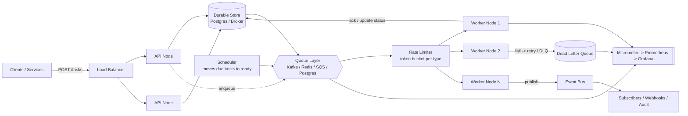
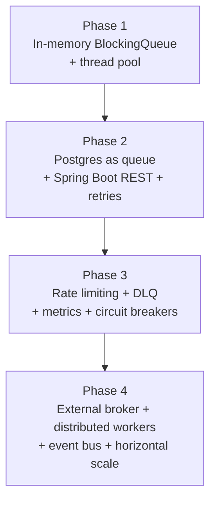
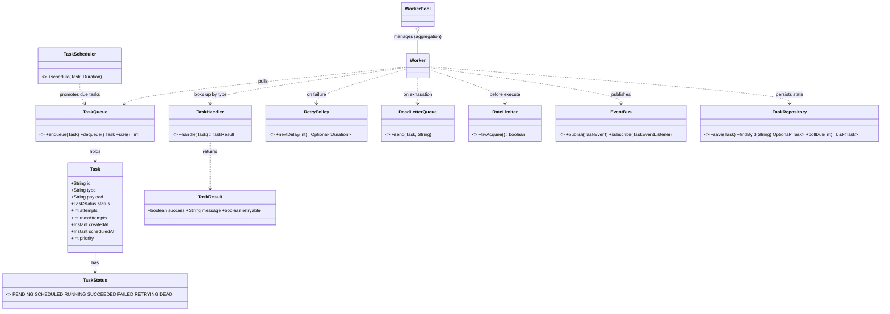

# Design a Distributed Task Queue (Interview Walkthrough)

> Where this fits in the project: this is the flagship system-design chapter. It takes the *exact* system we have been building across all four phases — the Distributed Task Queue and Event Processing Platform — and runs it as a 45-minute mock interview. Everything here maps to real classes in our canonical model (`Task`, `TaskQueue`, `Worker`, `WorkerPool`, `RetryPolicy`, `DeadLetterQueue`, `TaskScheduler`, `TaskRepository`, `EventBus`). You should be able to walk into an interview, get asked "design a distributed task/job queue," and reproduce this from memory.

This chapter assumes you already understand the building blocks. We will cross-link to them rather than re-explain:

- [Producer–Consumer](../07-queues-and-messaging/producer-consumer.md), [Task Queues](../07-queues-and-messaging/task-queues.md), [Priority Queues](../07-queues-and-messaging/priority-queues.md), [Delayed Queues](../07-queues-and-messaging/delayed-queues.md), [Dead-Letter Queues](../07-queues-and-messaging/dead-letter-queues.md), [Broker Comparison](../07-queues-and-messaging/broker-comparison.md)
- [BlockingQueue](../06-concurrency/blocking-queue.md), [ExecutorService](../06-concurrency/executor-service.md), [CompletableFuture](../06-concurrency/futures-and-completablefuture.md)
- [Idempotency](../08-distributed-systems/idempotency.md), [Retries](../08-distributed-systems/retries.md), [DLQ](../08-distributed-systems/dlq.md), [Rate Limiting](../08-distributed-systems/rate-limiting.md), [Backpressure](../08-distributed-systems/backpressure.md), [Message Ordering](../08-distributed-systems/message-ordering.md), [Sharding](../08-distributed-systems/sharding.md), [CAP Theorem](../08-distributed-systems/cap-theorem.md)
- [Capacity Estimation](./capacity-estimation.md), [Data Modeling and Storage](./data-modeling-and-storage.md), [Scaling the Platform](./scaling-the-platform.md), [Observability and Ops](./observability-and-ops.md)
- The project itself: [Phase 1](../09-project/phase-1.md), [Phase 2](../09-project/phase-2.md), [Phase 3](../09-project/phase-3.md), [Phase 4](../09-project/phase-4.md), [Architecture](../09-project/architecture.md)

---

## 1. Why this exists — the problem a task queue solves

Synchronous request/response breaks the moment work becomes slow, bursty, unreliable, or must outlive a single HTTP request. Consider a user clicking "Export my data" or "Send 50,000 emails." You cannot hold the HTTP connection open for ten minutes, you cannot lose the request if a server restarts, and you cannot let a traffic spike take down the database.

A **task queue** decouples *accepting* work from *doing* work:

- The API accepts a task, persists it durably, and returns `202 Accepted` in milliseconds.
- A pool of workers pulls tasks asynchronously and executes them at a controlled rate.
- Failures are retried with backoff; permanently-failed tasks go to a dead-letter queue (DLQ) instead of vanishing.
- The system absorbs spikes (the queue is a buffer), survives crashes (durability), and scales horizontally (add workers).

> Historical note: this pattern is everywhere. Celery (Python) over RabbitMQ/Redis, Sidekiq (Ruby) over Redis, Resque, AWS SQS + Lambda, Google Cloud Tasks, Temporal, and internal systems at every large company. They all share the same skeleton we are building: durable submission, a queue, competing consumers, retries, DLQ, and observability. The interview is testing whether you understand that skeleton and its tradeoffs — not whether you have memorized a vendor.

---

## 2. Interview framing — how to drive the conversation

A senior interviewer is grading *process* as much as the final box-diagram. Spend your first 5 minutes here, out loud:

```text
1. Clarify functional + non-functional requirements (ask, don't assume).
2. Estimate scale (back-of-envelope: QPS, storage, fan-out).
3. Define the API and data model (the contract pins everything down).
4. Draw the high-level architecture (one clean diagram).
5. Deep-dive the hard parts: delivery guarantees, idempotency, retries, DLQ,
   scheduling, ordering, rate limiting.
6. Identify bottlenecks and scale each one.
7. Discuss failure modes and operations.
8. Summarize tradeoffs you made and what you'd revisit.
```

The single best signal you can send: **state your assumptions and the tradeoff behind every choice.** "I'll go at-least-once delivery, not exactly-once, because exactly-once across a network is effectively impossible — instead I'll make handlers idempotent. Here's how." That one sentence is worth more than a beautiful diagram.

---

## 3. Clarifying requirements (functional + non-functional)

Always ask before designing. Here is the dialogue I would have, with the answers we will assume for the rest of the chapter.

### Functional requirements

| Question to ask | Assumed answer for this design |
| --- | --- |
| Who submits tasks? | Internal services and authenticated clients via REST. |
| What is a task? | A `type` (routing key) + a JSON `payload`. Handlers are registered per type. |
| Must we support delayed / scheduled tasks? | Yes — "run this in 30s" and "run at 09:00 UTC" (cron-like). |
| Priorities? | Yes — a small fixed set (e.g. 0–9), best-effort ordering. |
| Do clients query status / results? | Yes — `GET /tasks/{id}` returns status; results are optional. |
| Retries on failure? | Yes — bounded retries with backoff; then DLQ. |
| Delivery guarantee? | At-least-once. Handlers must be idempotent. |
| Strict ordering? | Not globally. Optional per-key (FIFO group) ordering as a stretch. |
| Cancellation? | Cancel a *pending/scheduled* task; running tasks are best-effort. |

### Non-functional requirements

| Property | Target | Why it matters |
| --- | --- | --- |
| **Durability** | A task acknowledged with `202` is never lost. | This is the core promise. Lose it and the queue is a toy. |
| **Availability** | Submission API ~99.9%; processing can lag during incidents. | Accepting > processing. Buffer absorbs the rest. |
| **Latency** | Submit p99 < 50 ms. Processing latency is SLA-per-type. | Submission is on the user's critical path; processing isn't. |
| **Throughput** | Design for ~10k tasks/s sustained, 50k/s burst. | Drives storage and queue choices. |
| **Scalability** | Horizontal: add API nodes, add workers, shard the store. | No single box should be the ceiling. |
| **Observability** | Per-type counters, latencies, queue depth, DLQ rate. | You cannot operate what you cannot see. |
| **Isolation** | A slow/poison task type must not starve others. | One bad handler shouldn't take down the platform. |

> Callout: notice we deliberately chose **at-least-once + idempotency** over **exactly-once**, and **eventual processing** over **strict ordering**. These two decisions remove 80% of the hard distributed-systems pain. If the interviewer pushes back ("I need exactly-once"), you pivot to "exactly-once *effect* via idempotency keys + dedup," which is the only honest way to deliver it.

---

## 4. Capacity estimation (back-of-envelope)

Do this even if rough — it justifies every later decision. (Deeper treatment in [Capacity Estimation](./capacity-estimation.md).)

**Assumptions:** 10,000 tasks/s sustained, average payload 1 KB, average task takes 200 ms of CPU/IO to process, tasks retained 7 days for status lookups.

```text
Write throughput (submission):
  10,000 tasks/s × 1 KB           = 10 MB/s of raw task body
  Each submit = 1 row insert      = 10,000 inserts/s

Worker count (Little's Law: L = λ × W):
  In-flight tasks  = arrival_rate × service_time
                   = 10,000/s × 0.2 s = 2,000 concurrent tasks
  With virtual threads, 2,000 in-flight is trivial per node.
  With OS threads at ~2,000 each, you'd need many nodes — a reason to
  prefer virtual threads / async IO for IO-bound handlers.

Storage (7-day retention):
  tasks/day  = 10,000 × 86,400      ≈ 864 M tasks/day
  7 days     ≈ 6 B rows
  row size   ≈ 1 KB payload + ~300 B metadata ≈ 1.3 KB
  total      ≈ 6 B × 1.3 KB ≈ 7.8 TB
  => single Postgres won't hold hot + history comfortably. Shard,
     and/or move terminal tasks to cold storage (object store) after N hours.

Queue depth at steady state:
  If consumers keep up, depth ≈ small. Size the buffer for the BURST:
  50,000/s burst − 10,000/s drain for 60 s ⇒ ~2.4 M backlog.
  => the queue/broker must hold millions of messages durably.

Read throughput (status checks):
  Assume 1 GET per task ⇒ 10,000 reads/s. Cache hot statuses; index by id.
```

**Takeaways that fall out of the numbers:** (1) single-node Postgres is fine for a demo but not for 10k/s sustained over 7 days — we shard and/or archive; (2) worker count is modest with virtual threads but large with OS threads — choose accordingly; (3) the buffer must be sized for *bursts*, not the steady state.

---

## 5. The API design

The contract pins down everything downstream. Keep it small and boring. (See also [Phase 2](../09-project/phase-2.md) where `TaskController` is introduced.)

### Endpoints

```text
POST   /tasks                 Submit a task. Returns 202 + task id.
GET    /tasks/{id}            Get task status (and result if present).
DELETE /tasks/{id}            Cancel a PENDING/SCHEDULED task. 409 if RUNNING/terminal.
POST   /tasks/{id}/retry      Manually requeue a FAILED/DEAD task (admin).
GET    /tasks?status=&type=   List/filter (admin/ops; paginated).
GET    /healthz  /metrics     Liveness + Prometheus scrape.
```

### Submit request/response

```json
// POST /tasks
// Header: Idempotency-Key: 9d1c... (client-generated; optional but recommended)
{
  "type": "send_email",
  "payload": { "to": "a@b.com", "template": "welcome" },
  "priority": 5,
  "maxAttempts": 5,
  "scheduledAt": "2026-06-11T09:00:00Z"   // optional; omit for "run now"
}
```

```json
// 202 Accepted
{ "id": "f47ac10b-58cc-4372-a567-0e02b2c3d479", "status": "PENDING" }
```

### Why these choices

- **`202 Accepted`, not `200`/`201`.** The work has not been done; it has been *accepted*. The body returns the id so the client can poll or subscribe.
- **`Idempotency-Key` header.** Networks retry. A client that times out and resubmits must not create two tasks. We dedup on this key (details in §8 and [Idempotency](../08-distributed-systems/idempotency.md)).
- **`payload` is opaque JSON to the platform.** The platform routes by `type`; only the handler interprets the payload. This is what makes the platform generic.
- **Status via polling first, push later.** `GET /tasks/{id}` is simple and cache-friendly. For real-time updates we add webhooks / SSE in Phase 4 via the [EventBus](../09-project/phase-4.md).

### The DTO in Java 21

We keep the API DTO separate from the domain `Task` so the wire format can evolve independently of internal storage.

```java
// Wire-level request. Validated, then mapped to a domain Task.
public record SubmitTaskRequest(
        @NotBlank String type,
        @NotNull  JsonNode payload,
        @Min(0) @Max(9) Integer priority,        // nullable -> default 5
        @Min(1) Integer maxAttempts,             // nullable -> default 3
        Instant scheduledAt                       // nullable -> run now
) {}

public record SubmitTaskResponse(String id, TaskStatus status) {}
```

```java
@RestController
@RequestMapping("/tasks")
public class TaskController {

    private final TaskSubmissionService submission;

    public TaskController(TaskSubmissionService submission) {
        this.submission = submission;
    }

    @PostMapping
    public ResponseEntity<SubmitTaskResponse> submit(
            @RequestHeader(value = "Idempotency-Key", required = false) String idemKey,
            @Valid @RequestBody SubmitTaskRequest req) {

        Task task = submission.submit(req, idemKey);   // persists + enqueues
        return ResponseEntity.accepted()
                .body(new SubmitTaskResponse(task.id(), task.status()));
    }

    @GetMapping("/{id}")
    public ResponseEntity<TaskView> get(@PathVariable String id) {
        return submission.find(id)
                .map(t -> ResponseEntity.ok(TaskView.from(t)))
                .orElse(ResponseEntity.notFound().build());
    }
}
```

---

## 6. The data model

This is the heart of a durable queue. Our canonical `Task` and `TaskStatus` map directly to a table. (Storage tradeoffs are explored in [Data Modeling and Storage](./data-modeling-and-storage.md).)

### Domain types (canonical model)

```java
public enum TaskStatus { PENDING, SCHEDULED, RUNNING, SUCCEEDED, FAILED, RETRYING, DEAD }

// Immutable domain record. Transitions produce a new Task (see §7 state machine).
public record Task(
        String id,            // UUID
        String type,          // routing key -> TaskHandler
        String payload,       // opaque JSON string
        TaskStatus status,
        int attempts,
        int maxAttempts,
        Instant createdAt,
        Instant scheduledAt,  // when it becomes eligible to run
        int priority          // 0 (low) .. 9 (high); higher runs first
) {
    public Task withStatus(TaskStatus s)       { return new Task(id, type, payload, s, attempts, maxAttempts, createdAt, scheduledAt, priority); }
    public Task incrementAttempt()             { return new Task(id, type, payload, status, attempts + 1, maxAttempts, createdAt, scheduledAt, priority); }
    public Task rescheduleAt(Instant when)     { return new Task(id, type, payload, status, attempts, maxAttempts, createdAt, when, priority); }
    public boolean attemptsExhausted()         { return attempts >= maxAttempts; }
}
```

### The Postgres schema (Phase 2 onward)

```sql
-- Flyway: V2__create_tasks.sql
CREATE TABLE tasks (
    id              UUID PRIMARY KEY,
    type            TEXT        NOT NULL,
    payload         JSONB       NOT NULL,
    status          TEXT        NOT NULL,          -- TaskStatus enum as text
    attempts        INT         NOT NULL DEFAULT 0,
    max_attempts    INT         NOT NULL DEFAULT 3,
    priority        SMALLINT    NOT NULL DEFAULT 5,
    created_at      TIMESTAMPTZ NOT NULL DEFAULT now(),
    scheduled_at    TIMESTAMPTZ NOT NULL DEFAULT now(),
    locked_by       TEXT,                          -- worker/lease owner, NULL if free
    locked_until    TIMESTAMPTZ,                   -- lease expiry (visibility timeout)
    idempotency_key TEXT,                          -- client dedup key
    last_error      TEXT,
    updated_at      TIMESTAMPTZ NOT NULL DEFAULT now()
);

-- The hot path: "give me the next due, runnable task by priority."
CREATE INDEX idx_tasks_dispatch
    ON tasks (status, priority DESC, scheduled_at)
    WHERE status IN ('PENDING', 'SCHEDULED', 'RETRYING');

-- Idempotent submission: one task per client key.
CREATE UNIQUE INDEX idx_tasks_idem ON tasks (idempotency_key)
    WHERE idempotency_key IS NOT NULL;

-- Reclaiming expired leases (crashed workers).
CREATE INDEX idx_tasks_lease ON tasks (locked_until)
    WHERE status = 'RUNNING';
```

### Design notes on the schema

- **Status + lease columns make the table itself a queue.** `locked_by` / `locked_until` implement a *visibility timeout*: when a worker claims a task it sets a lease; if the worker crashes, the lease expires and another worker reclaims it. This is exactly how SQS and the Postgres-as-a-queue pattern work.
- **Partial index `idx_tasks_dispatch`** keeps the dispatch query touching only *runnable* rows, not the 6 B terminal rows. This is the difference between a fast and an unusable queue.
- **`idempotency_key` unique index** turns "did I already accept this?" into a single constraint check.
- **`JSONB` not `TEXT`** so ops can query payloads, but the platform never depends on its shape.

> Pitfall: do **not** make this table do everything forever. Terminal tasks (`SUCCEEDED`/`DEAD`) accumulate to terabytes. Move them to a `tasks_archive` table or object storage after a few hours and keep the hot table small. A 10 GB hot table is fast; a 7 TB one is not.

---

## 7. The task lifecycle (state machine)

Every task walks a finite state machine. Getting this right is what makes the system correct under crashes and retries.



The crucial edges most candidates miss:

- **`RUNNING --> PENDING` on crash.** If a worker dies mid-task, the lease expires and the task becomes runnable again. This is *why* delivery is at-least-once and *why* handlers must be idempotent.
- **`RETRYING --> PENDING` after backoff.** A retrying task is not immediately runnable; it has a future `scheduled_at`. The same mechanism as scheduling. One mechanism, two uses — elegant and worth pointing out in the interview.
- **`* --> DEAD`.** Exhausted or non-retryable-and-final tasks land in the DLQ, never silently dropped.

---

## 8. High-level architecture

Here is the whole system in one diagram — this is the box you draw on the whiteboard. It is the Phase 4 architecture from our project ([architecture.md](../09-project/architecture.md)).



### Component responsibilities

| Component | Canonical class | Responsibility |
| --- | --- | --- |
| API layer | `TaskController`, `TaskSubmissionService` | Validate, dedup, persist, enqueue, return `202`. Stateless → scale horizontally. |
| Durable store | `TaskRepository` (`PostgresTaskQueue`) | Source of truth for task state. Survives crashes. |
| Queue layer | `TaskQueue` (in-mem → Postgres → broker) | Buffers work; competing consumers pull from it. |
| Scheduler | `TaskScheduler` | Moves `SCHEDULED`/`RETRYING` tasks to ready when due. |
| Rate limiter | `RateLimiter` (`TokenBucketRateLimiter`) | Caps per-type throughput; protects downstreams. |
| Workers | `Worker` (Runnable) in a `WorkerPool` | Pull, look up `TaskHandler` by type, execute, handle outcome. |
| Retry handler | `RetryPolicy` | Computes next delay; decides retry vs DLQ. |
| DLQ | `DeadLetterQueue` | Captures permanently-failed tasks with a reason. |
| Event bus | `EventBus` | Publishes `TaskEvent`s for audit, webhooks, downstream. |
| Metrics | `MetricsCollector` / `MeterRegistry` | Counters, timers, gauges for everything. |

### The evolution across phases (why we didn't start here)



This evolution *is* the interview answer to "how would you scale it." You start with the simplest thing that could work and refactor under load — each phase removes the previous bottleneck.

---

## 9. The naive version (and why it fails in production)

Start here in the interview — it earns trust to show you know the simple version and its limits. This is essentially Phase 1.

```java
// Phase 1: everything in one JVM. Submit, queue, workers.
public final class InMemoryTaskQueue implements TaskQueue {
    private final BlockingQueue<Task> queue = new LinkedBlockingQueue<>();

    @Override public void enqueue(Task t)                    { queue.add(t); }
    @Override public Task dequeue() throws InterruptedException { return queue.take(); }
    @Override public int size()                              { return queue.size(); }
}
```

```java
public final class Worker implements Runnable {
    private final TaskQueue queue;
    private final Map<String, TaskHandler> handlers;

    public Worker(TaskQueue queue, Map<String, TaskHandler> handlers) {
        this.queue = queue;
        this.handlers = handlers;
    }

    @Override public void run() {
        while (!Thread.currentThread().isInterrupted()) {
            try {
                Task task = queue.dequeue();              // blocks
                TaskHandler handler = handlers.get(task.type());
                TaskResult result = handler.handle(task); // BUG: no retry, no DLQ
                // BUG: nothing is persisted; status lives only in memory
            } catch (InterruptedException e) {
                Thread.currentThread().interrupt();
                return;
            } catch (Exception e) {
                // BUG: task is silently lost on any failure
            }
        }
    }
}
```

**What's wrong (call these out explicitly):**

1. **Not durable.** A JVM restart loses every queued task. The `202` we returned was a lie.
2. **Single point of failure.** One process = no horizontal scale, no fault tolerance.
3. **No retries, no DLQ.** Any handler exception drops the task forever.
4. **No backpressure.** An unbounded `LinkedBlockingQueue` will OOM under a burst. (See [Backpressure](../08-distributed-systems/backpressure.md).)
5. **No scheduling, no rate limiting, no observability.**

This is a fine *teaching* baseline and a fine MVP for a single-node side project. It is not a platform.

---

## 10. The improved version — durable, Postgres-backed (Phase 2)

The first real refactor: make the database the queue. Now a restart loses nothing, and multiple workers (even on different machines) can compete for tasks safely using row-level locking.

```java
// Postgres IS the queue. The magic is FOR UPDATE SKIP LOCKED.
public final class PostgresTaskQueue implements TaskQueue {

    private final JdbcTemplate jdbc;
    private final String workerId;
    private final Duration leaseDuration;

    public PostgresTaskQueue(JdbcTemplate jdbc, String workerId, Duration leaseDuration) {
        this.jdbc = jdbc;
        this.workerId = workerId;
        this.leaseDuration = leaseDuration;
    }

    @Override
    public void enqueue(Task t) {
        jdbc.update("""
            INSERT INTO tasks (id, type, payload, status, attempts, max_attempts,
                               priority, created_at, scheduled_at)
            VALUES (?, ?, ?::jsonb, ?, ?, ?, ?, ?, ?)
            """,
            t.id(), t.type(), t.payload(), t.status().name(), t.attempts(),
            t.maxAttempts(), t.priority(), Timestamp.from(t.createdAt()),
            Timestamp.from(t.scheduledAt()));
    }

    /**
     * Atomically claim ONE due task and lease it. SKIP LOCKED lets N workers
     * poll concurrently without blocking each other or claiming the same row.
     */
    @Override
    public Task dequeue() {
        return jdbc.query("""
            UPDATE tasks
               SET status      = 'RUNNING',
                   locked_by   = ?,
                   locked_until = now() + (? || ' seconds')::interval,
                   updated_at  = now()
             WHERE id = (
                 SELECT id FROM tasks
                  WHERE status IN ('PENDING', 'SCHEDULED', 'RETRYING')
                    AND scheduled_at <= now()
                  ORDER BY priority DESC, scheduled_at ASC
                  FOR UPDATE SKIP LOCKED
                  LIMIT 1
             )
         RETURNING *
            """,
            this::mapRow, workerId, leaseDuration.toSeconds())
          .stream().findFirst().orElse(null);
    }

    @Override
    public int size() {
        Integer n = jdbc.queryForObject(
            "SELECT count(*) FROM tasks WHERE status IN ('PENDING','SCHEDULED','RETRYING')",
            Integer.class);
        return n == null ? 0 : n;
    }

    private Task mapRow(ResultSet rs, int i) throws SQLException { /* map columns -> Task */ return null; }
}
```

**Why this is a real upgrade:**

- **`FOR UPDATE SKIP LOCKED`** is the key trick. It lets many workers poll concurrently; each grabs a *different* runnable row without lock contention. This is the standard "Postgres as a job queue" pattern. (Cross-link: [Task Queues](../07-queues-and-messaging/task-queues.md).)
- **Lease (`locked_until`)** gives at-least-once delivery with crash recovery. A reaper requeues expired leases.
- **Durable.** The `202` is now honest.

**Where it stops scaling (be honest in the interview):** a single Postgres primary tops out at low-tens-of-thousands of claim/update transactions per second, and the dispatch query contends on the same hot rows. Beyond that you shard the table by a key, or move the *queue* to a purpose-built broker while keeping Postgres as the *status* store. That's Phase 4.

---

## 11. The production version — pluggable broker + distributed workers (Phase 4)

At scale, separate the two jobs Postgres was doing: **durable state of record** (keep in Postgres, sharded) and **high-throughput delivery** (move to a broker — Kafka, Redis Streams, RabbitMQ, or SQS, chosen by the workload). The `TaskQueue` interface is what makes this swap a one-line wiring change. (Broker tradeoffs: [Broker Comparison](../07-queues-and-messaging/broker-comparison.md).)

```java
// Same interface, broker-backed. Workers consume; the broker handles fan-out,
// partitioning, and durable retention. Status still lands in Postgres.
public final class BrokerTaskQueue implements TaskQueue {

    private final MessageBroker broker;       // thin port over Kafka/Redis/SQS
    private final TaskRepository repository;   // source of truth for status
    private final ObjectMapper mapper;

    public BrokerTaskQueue(MessageBroker broker, TaskRepository repository, ObjectMapper mapper) {
        this.broker = broker;
        this.repository = repository;
        this.mapper = mapper;
    }

    @Override
    public void enqueue(Task t) {
        repository.save(t);                                   // 1. durable state
        broker.publish(partitionKey(t), serialize(t));        // 2. deliver
    }

    @Override
    public Task dequeue() throws InterruptedException {
        BrokerMessage msg = broker.poll(Duration.ofSeconds(1)); // long-poll
        if (msg == null) return null;
        Task t = deserialize(msg.body());
        // broker.ack happens AFTER successful processing (see Worker, §12)
        return t.withStatus(TaskStatus.RUNNING);
    }

    @Override
    public int size() { return broker.approximateBacklog(); }

    // Partition by type (and optionally a FIFO group key) for per-key ordering.
    private String partitionKey(Task t) { return t.type(); }

    private byte[] serialize(Task t)   { /* mapper.writeValueAsBytes */ return new byte[0]; }
    private Task deserialize(byte[] b) { /* mapper.readValue */ return null; }
}
```

```java
// A thin port keeps the broker pluggable. Phase 4 ships >=2 implementations.
public interface MessageBroker {
    void publish(String partitionKey, byte[] body);
    BrokerMessage poll(Duration timeout) throws InterruptedException;
    void ack(BrokerMessage msg);
    void nack(BrokerMessage msg);          // redeliver
    int approximateBacklog();
}
```

**The dual-write trap (and how to avoid it).** `enqueue` writes to *two* systems (DB + broker). If it crashes between them, state and delivery diverge. The robust fix is the **transactional outbox**: write the task *and* an outbox row in one DB transaction; a separate relay publishes outbox rows to the broker and marks them sent. This converts "two writes" into "one write + async replication," giving exactly-once *handoff* into the broker.

```sql
-- Outbox: written in the SAME transaction as the task insert.
CREATE TABLE outbox (
    id           BIGSERIAL PRIMARY KEY,
    task_id      UUID NOT NULL,
    payload      BYTEA NOT NULL,
    published    BOOLEAN NOT NULL DEFAULT false,
    created_at   TIMESTAMPTZ NOT NULL DEFAULT now()
);
CREATE INDEX idx_outbox_unpublished ON outbox (created_at) WHERE published = false;
```

```java
// Relay: a single leader (see leader-election.md) polls and publishes.
@Scheduled(fixedDelay = 200)
public void relayOutbox() {
    List<OutboxRow> batch = outboxRepo.pollUnpublished(500);
    for (OutboxRow row : batch) {
        broker.publish(row.partitionKey(), row.payload());
        outboxRepo.markPublished(row.id());   // idempotent: re-publish on crash is fine
    }
}
```

---

## 12. The Worker — the heart of correctness

The `Worker` ties together claim → execute → outcome → retry/DLQ/event. This is where at-least-once, idempotency, retries, and the DLQ all meet. (Retry theory: [Retries](../08-distributed-systems/retries.md). DLQ: [Dead-Letter Queues](../07-queues-and-messaging/dead-letter-queues.md).)

```java
public final class Worker implements Runnable {

    private final TaskQueue queue;
    private final Map<String, TaskHandler> handlers;
    private final RetryPolicy retryPolicy;
    private final DeadLetterQueue dlq;
    private final TaskRepository repository;
    private final EventBus eventBus;
    private final RateLimiter rateLimiter;
    private final MeterRegistry metrics;

    // (constructor omitted for brevity — all deps injected)

    @Override
    public void run() {
        while (!Thread.currentThread().isInterrupted()) {
            Task task = null;
            try {
                task = queue.dequeue();                 // claim + lease
                if (task == null) continue;             // long-poll returned empty

                if (!rateLimiter.tryAcquire()) {        // shed/backpressure per type
                    requeueShortly(task);               // give the token bucket time to refill
                    continue;
                }

                process(task);                          // execute + handle outcome
            } catch (InterruptedException e) {
                Thread.currentThread().interrupt();
                return;
            } catch (Exception fatal) {
                // Never let the loop die. Log, record, and (if we have a task) requeue it.
                metrics.counter("worker.loop.error").increment();
                if (task != null) requeueShortly(task);
            }
        }
    }

    private void process(Task task) {
        TaskHandler handler = handlers.get(task.type());
        if (handler == null) {                          // unknown type = poison
            deadLetter(task, "no handler registered for type " + task.type());
            return;
        }

        Timer.Sample sample = Timer.start(metrics);
        try {
            TaskResult result = handler.handle(task);   // <-- user code; may throw

            if (result.success()) {
                markSucceeded(task, result);
            } else if (result.retryable()) {
                scheduleRetryOrDeadLetter(task, result.message());
            } else {
                // non-retryable failure: terminal FAILED, then DLQ
                Task failed = task.withStatus(TaskStatus.FAILED);
                repository.save(failed);
                deadLetter(failed, "non-retryable: " + result.message());
            }
        } catch (Exception e) {
            // Treat thrown exceptions as retryable by default; the policy bounds it.
            scheduleRetryOrDeadLetter(task, e.toString());
        } finally {
            sample.stop(metrics.timer("task.duration", "type", task.type()));
        }
    }

    private void scheduleRetryOrDeadLetter(Task task, String reason) {
        Task attempted = task.incrementAttempt();
        Optional<Duration> delay = retryPolicy.nextDelay(attempted.attempts());

        if (attempted.attemptsExhausted() || delay.isEmpty()) {
            deadLetter(attempted.withStatus(TaskStatus.DEAD), "exhausted: " + reason);
            return;
        }
        // RETRYING with a future scheduled_at -> the scheduler/poller picks it up later.
        Task retrying = attempted
                .withStatus(TaskStatus.RETRYING)
                .rescheduleAt(Instant.now().plus(delay.get()));
        repository.save(retrying);
        eventBus.publish(TaskEvent.retrying(retrying, reason));
        metrics.counter("task.retried", "type", task.type()).increment();
    }

    private void markSucceeded(Task task, TaskResult result) {
        repository.save(task.withStatus(TaskStatus.SUCCEEDED));
        eventBus.publish(TaskEvent.succeeded(task));
        metrics.counter("task.succeeded", "type", task.type()).increment();
    }

    private void deadLetter(Task task, String reason) {
        repository.save(task.withStatus(TaskStatus.DEAD));
        dlq.send(task, reason);
        eventBus.publish(TaskEvent.dead(task, reason));
        metrics.counter("task.dead", "type", task.type()).increment();
    }

    private void requeueShortly(Task task) {
        repository.save(task.withStatus(TaskStatus.RETRYING)
                .rescheduleAt(Instant.now().plusSeconds(1)));
    }
}
```

**Reading the code as an interviewer would:**

- **The loop never dies.** Any exception is caught at the top; a worker that crashes its loop is a slow leak that silently reduces throughput. We requeue on fatal errors so no claimed task is lost.
- **Rate limiting is *before* execution**, per type, so a rate-limited type doesn't burn a handler call. (See [Rate Limiting](../08-distributed-systems/rate-limiting.md).)
- **`RetryResult.retryable`** lets the *handler* distinguish "transient (retry)" from "bad input (don't retry)". A `400` from a downstream is non-retryable; a `503` is. This is the single most important retry decision.
- **Retry == reschedule.** A `RETRYING` task is just a `SCHEDULED` task with a future time. One mechanism. (See [Delayed Queues](../07-queues-and-messaging/delayed-queues.md).)

### Workers and threads — virtual threads (Java 21)

For IO-bound handlers (most tasks: HTTP calls, DB writes, sending email), use **virtual threads** so 2,000 in-flight tasks cost ~nothing.

```java
public final class WorkerPool {
    private final ExecutorService executor;
    private final List<Worker> workers;

    public WorkerPool(List<Worker> workers) {
        this.workers = workers;
        // One virtual thread per worker loop; cheap to have thousands.
        this.executor = Executors.newVirtualThreadPerTaskExecutor();
    }

    public void start()    { workers.forEach(executor::submit); }
    public void shutdown() {                       // graceful: stop claiming, finish in-flight
        executor.shutdown();
        try {
            if (!executor.awaitTermination(30, TimeUnit.SECONDS)) executor.shutdownNow();
        } catch (InterruptedException e) {
            executor.shutdownNow();
            Thread.currentThread().interrupt();
        }
    }
}
```

> For CPU-bound handlers (image resize, compression), virtual threads don't help — use a bounded *platform*-thread pool sized to cores, and run those types on dedicated worker nodes so they don't starve IO tasks. This is **workload isolation** and a great point to raise unprompted.

---

## 13. Delivery guarantees, idempotency, and the exactly-once myth

This is the section interviewers probe hardest. Be precise.

### The three guarantees

| Guarantee | Meaning | How to get it | Cost |
| --- | --- | --- | --- |
| **At-most-once** | Each task runs 0 or 1 times. May be lost. | Ack *before* processing. | Loses work on crash. Rarely acceptable. |
| **At-least-once** | Each task runs ≥1 time. Never lost, may duplicate. | Ack *after* processing; lease + redelivery. | Duplicates → need idempotency. |
| **Exactly-once (delivery)** | Each task runs exactly 1 time. | **Impossible** across an unreliable network without a coordinated transaction across all systems. | N/A. |

**We choose at-least-once.** Then we achieve exactly-once *effect* (the observable result is as if it ran once) via **idempotency**.

### Why exactly-once delivery is impossible (the two-generals nutshell)

A worker processes a task, then must tell the queue "done" (ack). The ack can be lost in flight. The queue can't distinguish "worker did the work and the ack was lost" from "worker crashed before doing the work." So it must redeliver — or risk dropping work. You cannot have both no-loss and no-duplicate over a lossy channel without making the *effect* idempotent. (More: [Idempotency](../08-distributed-systems/idempotency.md), [Message Ordering](../08-distributed-systems/message-ordering.md).)

### Achieving exactly-once *effect* — three layers

1. **Dedup on submission** (`Idempotency-Key`): the same client request never creates two tasks.
2. **Dedup on processing**: before running, the handler checks "have I already produced this effect for this task id?" The cleanest version writes the result and a processed-marker in **one transaction**.

```java
// Idempotent handler: the EFFECT and the dedup marker commit atomically.
public final class ChargeCardHandler implements TaskHandler {
    private final JdbcTemplate jdbc;

    public ChargeCardHandler(JdbcTemplate jdbc) { this.jdbc = jdbc; }

    @Override
    public TaskResult handle(Task task) {
        String dedupKey = task.id();                      // stable per task

        // INSERT ... ON CONFLICT DO NOTHING: if we already processed this task,
        // the insert affects 0 rows and we short-circuit. One round trip, race-free.
        int inserted = jdbc.update("""
            INSERT INTO processed_tasks (task_id, processed_at)
            VALUES (?, now())
            ON CONFLICT (task_id) DO NOTHING
            """, dedupKey);

        if (inserted == 0) {
            return new TaskResult(true, "already processed (idempotent no-op)", false);
        }

        // Safe to perform the side effect exactly once now.
        chargeExternalPaymentGateway(task);
        return new TaskResult(true, "charged", false);
    }

    private void chargeExternalPaymentGateway(Task task) { /* call gateway with task.id() as idempotency key */ }
}
```

3. **Pass the idempotency key downstream.** When the side effect is an external API (Stripe, an email provider), send the task id *as that provider's idempotency key*. Now even a duplicate delivery results in one charge / one email. Idempotency is end-to-end or it is nothing.

> Interview gold: "I won't promise exactly-once delivery because it's not achievable across a network partition. I'll promise at-least-once delivery and exactly-once *effect*, enforced by idempotency keys at three layers: submission, processing dedup, and downstream provider keys."

---

## 14. Scheduling and delayed tasks

Two flavors: **"run after a delay"** and **"run at an absolute time / cron."** Both reduce to "make the task runnable when `scheduled_at <= now()`."

```java
public interface TaskScheduler {
    void schedule(Task t, Duration delay);
}
```

**Phase 1 (single node):** an in-memory `DelayQueue<Task>` or a `ScheduledExecutorService`. A `Task` becomes available from the `DelayQueue` exactly when its delay elapses. Great for one node, lost on restart. (See [Scheduling Queues](../07-queues-and-messaging/scheduling-queues.md).)

```java
public final class InMemoryScheduler implements TaskScheduler {
    private final DelayQueue<DelayedTask> delayed = new DelayQueue<>();
    private final TaskQueue ready;

    public InMemoryScheduler(TaskQueue ready) {
        this.ready = ready;
        Thread.ofVirtual().start(this::drainLoop);
    }

    @Override public void schedule(Task t, Duration delay) {
        delayed.put(new DelayedTask(t, Instant.now().plus(delay)));
    }

    private void drainLoop() {
        try {
            while (true) {
                DelayedTask due = delayed.take();   // blocks until something is due
                ready.enqueue(due.task());
            }
        } catch (InterruptedException e) { Thread.currentThread().interrupt(); }
    }
}
```

**Phase 2+ (durable, multi-node):** the scheduler is just a **due-poller** over the durable store. This is the same `pollDue` from `TaskRepository`:

```java
public interface TaskRepository {
    void save(Task t);
    Optional<Task> findById(String id);
    List<Task> pollDue(int n);   // SCHEDULED/RETRYING with scheduled_at <= now()
}
```

```java
// A leader-elected node runs this; it moves due tasks into the ready queue.
@Scheduled(fixedDelay = 500)
public void promoteDueTasks() {
    List<Task> due = repository.pollDue(500);
    for (Task t : due) {
        readyQueue.enqueue(t.withStatus(TaskStatus.PENDING));
    }
}
```

**Why a leader?** If every node polls and enqueues, you double-enqueue. Use [leader election](../08-distributed-systems/leader-election.md), or make the promotion query itself claim rows (`UPDATE ... SET status='PENDING' WHERE ... RETURNING`) so promotion is idempotent under concurrency. For cron-style schedules, a dedicated scheduler (Quartz with a JDBC store, or a single leader) computes next-fire-times and inserts a fresh `Task` per occurrence.

---

## 15. Bottlenecks and how to scale each one

For each component: where it breaks, and the fix. (Full treatment in [Scaling the Platform](./scaling-the-platform.md) and [Sharding](../08-distributed-systems/sharding.md).)

| Bottleneck | Symptom | Fix |
| --- | --- | --- |
| **API nodes** | Submit p99 rises under load. | Stateless nodes behind an LB; autoscale on CPU/RPS. Trivial — they hold no state. |
| **Single DB primary (writes)** | Insert/claim TPS plateaus; lock contention on hot rows. | (1) Move *delivery* to a broker, keep DB for *status*. (2) Shard the tasks table by `hash(id)` or by `type`. (3) Batch inserts. |
| **Dispatch query** | `dequeue` slows as table grows. | Partial index on runnable rows; archive terminal rows; `SKIP LOCKED`; partition table by time. |
| **Worker throughput** | Backlog grows; queue depth climbs. | Add worker nodes (competing consumers). Virtual threads for IO-bound. Partition broker so workers parallelize. |
| **Hot task type** | One type's backlog starves others. | Per-type queues/partitions + per-type worker quotas (workload isolation). |
| **Poison task** | Same task fails forever, blocks a partition. | Bounded retries → DLQ. Per-key (not global) head-of-line so one bad key can't block others. |
| **Downstream dependency** | Workers hammer a failing service. | [Circuit breaker](../08-distributed-systems/circuit-breakers.md) (Resilience4j) + per-type [rate limiter](../08-distributed-systems/rate-limiting.md). |
| **Burst overload** | Memory pressure / OOM. | [Backpressure](../08-distributed-systems/backpressure.md): bounded queues, reject/`429` at the API when backlog exceeds a watermark. |
| **Status reads** | `GET /tasks/{id}` load on DB. | Cache hot statuses; read replicas; CDN-cache terminal statuses (they're immutable). |

### The scaling story, told as an arc

> "I'd start single-node in-memory (Phase 1) to nail the model. Make it durable with Postgres-as-a-queue using `SKIP LOCKED` (Phase 2) — that alone handles a real product to maybe 5–10k tasks/s. Add rate limiting, DLQ, circuit breakers, and metrics (Phase 3) for production safety. When the DB becomes the write bottleneck, split delivery from state: a partitioned broker for throughput, sharded Postgres for status, with a transactional outbox to keep them consistent (Phase 4). Workers are stateless competing consumers — I scale throughput by adding nodes and partitions, capped only by the broker and downstreams."

That arc, delivered in 60 seconds, is the whole interview.

---

## 16. Failure modes (and how the design survives them)

| Failure | What happens | Why we survive |
| --- | --- | --- |
| **API node crashes mid-submit** | Either the task committed (client gets `202`) or it didn't (client retries with same `Idempotency-Key`). | Atomic DB insert + idempotency key → no dup, no loss. |
| **Worker crashes mid-task** | Lease (`locked_until`) expires; reaper requeues; another worker reruns. | At-least-once + idempotent handler → exactly-once effect. |
| **DB primary fails** | Submissions fail (availability hit), but no committed task is lost. | Synchronous replica + failover. We chose CP for the *state of record*. ([CAP](../08-distributed-systems/cap-theorem.md)) |
| **Broker partition / unavailable** | Outbox accumulates; relay catches up when broker returns. | Outbox decouples commit from delivery. |
| **Poison message** | Fails `maxAttempts` times → DLQ with reason; alerts fire. | Bounded retries + DLQ; never an infinite loop. |
| **Thundering retries (retry storm)** | Many tasks fail at once and all retry together, re-overloading the dependency. | Exponential backoff **with jitter** spreads retries. (See below.) |
| **Clock skew across nodes** | `scheduled_at` comparisons drift. | Use DB `now()` as the single clock for due-checks, not node wall-clocks. |
| **Slow consumer / unbounded growth** | Memory blows up. | Bounded queues + backpressure + autoscaling on queue depth. |

### Backoff with jitter — the canonical implementations

```java
public interface RetryPolicy {
    Optional<Duration> nextDelay(int attempt);   // empty -> stop retrying (DLQ)
}

public final class FixedDelayRetryPolicy implements RetryPolicy {
    private final Duration delay;
    private final int maxAttempts;
    public FixedDelayRetryPolicy(Duration delay, int maxAttempts) {
        this.delay = delay; this.maxAttempts = maxAttempts;
    }
    @Override public Optional<Duration> nextDelay(int attempt) {
        return attempt > maxAttempts ? Optional.empty() : Optional.of(delay);
    }
}

public final class ExponentialBackoffRetryPolicy implements RetryPolicy {
    private final Duration base;
    private final Duration cap;
    private final int maxAttempts;
    public ExponentialBackoffRetryPolicy(Duration base, Duration cap, int maxAttempts) {
        this.base = base; this.cap = cap; this.maxAttempts = maxAttempts;
    }
    @Override public Optional<Duration> nextDelay(int attempt) {
        if (attempt > maxAttempts) return Optional.empty();
        long expMillis = base.toMillis() * (1L << Math.min(attempt - 1, 30)); // 2^(n-1)
        long capped    = Math.min(expMillis, cap.toMillis());
        // Full jitter: random in [0, capped]. Decorrelates retries across tasks.
        long jittered  = ThreadLocalRandom.current().nextLong(capped + 1);
        return Optional.of(Duration.ofMillis(jittered));
    }
}
```

> Full jitter (random in `[0, capped]`) beats "exponential, no jitter" because synchronized retries are what *cause* the next outage. This is AWS's recommended strategy and a frequent interview follow-up. (See [Retries](../08-distributed-systems/retries.md).)

---

## 17. Observability — you can't operate what you can't see

Wire metrics from day one (Phase 3). Use Micrometer → Prometheus → Grafana. (Deeper: [Observability and Ops](./observability-and-ops.md).)

```java
public final class MetricsCollector {
    private final MeterRegistry registry;
    public MetricsCollector(MeterRegistry registry) { this.registry = registry; }

    public void recordSubmitted(String type)  { registry.counter("tasks.submitted", "type", type).increment(); }
    public void recordSucceeded(String type)  { registry.counter("tasks.succeeded", "type", type).increment(); }
    public void recordDead(String type)       { registry.counter("tasks.dead",      "type", type).increment(); }

    public Timer.Sample startTimer()          { return Timer.start(registry); }
    public void stopTimer(Timer.Sample s, String type) {
        s.stop(registry.timer("task.duration", "type", type));
    }

    // Queue depth as a gauge so we can alert + autoscale on backlog.
    public void registerQueueDepth(TaskQueue queue) {
        Gauge.builder("queue.depth", queue, TaskQueue::size).register(registry);
    }
}
```

**The four golden signals for a task queue:**

| Signal | Metric | Alert when |
| --- | --- | --- |
| **Latency** | `task.duration` p50/p95/p99 per type | p99 exceeds the type's SLA. |
| **Traffic** | `tasks.submitted` rate | Sudden drop (intake broken) or spike (capacity). |
| **Errors** | `tasks.dead` / `task.retried` rate | DLQ rate climbs — a handler or dependency broke. |
| **Saturation** | `queue.depth` gauge, worker utilization | Backlog grows faster than drain → scale workers. |

Add **distributed tracing** (OpenTelemetry): propagate a trace id from the submit request into the `Task`, so a single task's journey (submit → claim → retries → success) is one trace.

---

## 18. Tradeoffs — the honest table

| Decision | Option A | Option B | Our choice & why |
| --- | --- | --- | --- |
| **Delivery** | At-least-once | Exactly-once | A. Exactly-once delivery is impossible; we add idempotency for exactly-once effect. |
| **Queue substrate** | DB-as-queue (`SKIP LOCKED`) | Dedicated broker (Kafka/SQS) | Phase-dependent. DB first (simple, transactional), broker at scale (throughput). |
| **Worker dispatch** | **Pull** (workers poll) | **Push** (queue pushes) | Pull. Natural backpressure, simpler flow control, easy autoscale. Push needs explicit flow control. |
| **Consistency of state** | CP (consistent) | AP (available) | CP for the *state of record* — never lie about whether a task was accepted. AP-ish for processing lag. |
| **Ordering** | Global FIFO | No / per-key | Per-key optional. Global FIFO kills parallelism; few real workloads need it. ([Message Ordering](../08-distributed-systems/message-ordering.md)) |
| **Retry timing** | Fixed delay | Exp backoff + jitter | Backoff+jitter. Fixed delays cause retry storms. |
| **Threading** | OS threads | Virtual threads | Virtual threads for IO-bound; bounded platform pool for CPU-bound. |
| **Scheduling** | In-memory `DelayQueue` | Durable due-poller | Durable poller in prod; in-memory only single-node. |

### Push vs pull — worth a dedicated paragraph

**Pull** (our default): workers ask the queue for work when they have capacity. The number of in-flight tasks is naturally bounded by worker count — *automatic backpressure*. Long-polling avoids busy spin. Downside: a tiny bit of poll latency. **Push** (queue dispatches to workers): lower latency, but the queue must track each worker's capacity and implement flow control, or it overwhelms a slow worker. Most durable task queues (SQS, our design) are pull for exactly this reason. (See [Producer–Consumer](../07-queues-and-messaging/producer-consumer.md), [Backpressure](../08-distributed-systems/backpressure.md).)

---

## 19. How this maps to our project (the canonical model)

The whole point of building the project across four phases is that this interview *is* our codebase:



| Interview concept | Our class/interface | Phase introduced |
| --- | --- | --- |
| Submission API | `TaskController`, `TaskSubmissionService` | 2 |
| Durable queue | `PostgresTaskQueue` / `BrokerTaskQueue` | 2 / 4 |
| In-memory MVP queue | `InMemoryTaskQueue` (BlockingQueue) | 1 |
| Competing consumers | `Worker`, `WorkerPool` | 1 |
| Retries + backoff | `RetryPolicy`, `ExponentialBackoffRetryPolicy` | 2/3 |
| Dead-letter | `DeadLetterQueue` | 3 |
| Rate limiting | `TokenBucketRateLimiter` | 3 |
| Scheduling | `TaskScheduler`, `pollDue` | 1/2 |
| Idempotency / dedup | `idempotency_key`, `processed_tasks` | 2/3 |
| Events / fan-out | `EventBus`, `TaskEvent` | 4 |
| Metrics | `MetricsCollector` / `MeterRegistry` | 3 |

---

## 20. How to present this in an interview (script)

A timeboxed plan for a 45-minute slot:

```text
0:00–0:05  Clarify. Confirm: durable submission, async processing, retries,
           DLQ, scheduling, priorities. Pin guarantees: at-least-once + idempotent.
0:05–0:10  Estimate. 10k/s sustained, 50k/s burst, 7-day retention ≈ 8 TB,
           ~2k in-flight by Little's Law. Conclude: shard/archive at scale.
0:10–0:15  API + data model. POST /tasks -> 202 + id; GET /tasks/{id}.
           tasks table with status + lease + idempotency_key + partial index.
0:15–0:22  Architecture diagram. Walk the data flow: submit -> persist -> queue
           -> rate limit -> worker -> handler -> success/retry/DLQ -> events/metrics.
0:22–0:35  Deep dives (let the interviewer pick, have all ready):
           - Delivery guarantees + idempotency (the exactly-once myth).
           - Retries with backoff+jitter and the DLQ.
           - Scheduling = "make runnable when due"; leader/claim to avoid dup-enqueue.
           - SKIP LOCKED for safe concurrent claims; lease for crash recovery.
0:35–0:42  Bottlenecks + scaling: DB write ceiling -> broker + outbox + sharding;
           workload isolation for hot/poison/CPU-bound types.
0:42–0:45  Summary: restate the 2–3 key tradeoffs and what you'd revisit with more time.
```

**Things that make a strong impression:**

- Naming the **transactional outbox** when asked about the dual-write problem.
- `FOR UPDATE SKIP LOCKED` as the safe concurrent-claim trick.
- **Backoff with jitter** and *why* (retry storms).
- **Workload isolation**: per-type queues so one bad type can't starve the platform.
- Saying **"I'd start simple and scale by removing the next bottleneck"** instead of jumping to Kafka immediately.

**Red flags that lose points (avoid these):**

- Promising exactly-once delivery without qualification.
- An unbounded in-memory queue with no durability or backpressure.
- "Just add Kafka" as the answer to every problem, with no reasoning.
- Forgetting the DLQ → a poison message loops forever.
- No idempotency story for at-least-once delivery.

---

## 21. Common mistakes and pitfalls

- **Acking before processing.** Turns at-least-once into at-most-once; you silently drop work on crash. *Fix: ack only after success.*
- **Unbounded queues.** A burst OOMs the JVM. *Fix: bounded queues + backpressure + `429` at a backlog watermark.* ([Backpressure](../08-distributed-systems/backpressure.md))
- **Retrying non-retryable failures.** Re-charging a card on a `400` validation error. *Fix: `TaskResult.retryable` driven by the failure class.*
- **No jitter on backoff.** Synchronized retries re-trigger the outage. *Fix: full jitter.*
- **Polling without `SKIP LOCKED`.** Workers block each other or double-claim. *Fix: `FOR UPDATE SKIP LOCKED`.*
- **Every node promotes scheduled tasks.** Double-enqueue. *Fix: leader election or claim-on-promote.*
- **Trusting node wall-clocks for `scheduled_at`.** Skew causes early/late runs. *Fix: use DB `now()`.*
- **Letting terminal rows accumulate.** Dispatch query degrades. *Fix: archive `SUCCEEDED`/`DEAD` rows.*
- **No DLQ.** Poison messages loop forever and burn workers. *Fix: bounded retries → DLQ with reason + alert.*
- **Forgetting handler timeouts.** A hung handler holds a worker forever. *Fix: per-task timeout; on timeout, fail-retryable and release the lease.*

---

## 22. Refactoring exercise — from toy to production claim path

### Bad: ack-before-process, no durability, no dedup

```java
public void process(Task t) {
    queue.ack(t);                 // BUG: acked before doing the work
    handlers.get(t.type()).handle(t);   // if this throws, work is lost
}
```

### Improved: ack-after-process, persist outcome

```java
public void process(Task t) {
    try {
        TaskResult r = handlers.get(t.type()).handle(t);
        repository.save(t.withStatus(r.success() ? TaskStatus.SUCCEEDED : TaskStatus.FAILED));
        queue.ack(t);             // ack only after success is recorded
    } catch (Exception e) {
        queue.nack(t);            // redeliver; lease will expire if we crash
    }
}
```

### Production-quality: idempotent, retry-aware, observable, DLQ-terminating

```java
public void process(Task t) {
    Timer.Sample sample = metrics.startTimer();
    try {
        // 1. Idempotency guard: skip if this task's effect already happened.
        if (repository.alreadyProcessed(t.id())) { queue.ack(t); return; }

        // 2. Execute with a timeout so a hung handler can't hold the lease forever.
        TaskResult r = withTimeout(handlerTimeout, () -> handlers.get(t.type()).handle(t));

        if (r.success()) {
            repository.markProcessed(t.id());
            repository.save(t.withStatus(TaskStatus.SUCCEEDED));
            eventBus.publish(TaskEvent.succeeded(t));
            queue.ack(t);
        } else if (r.retryable()) {
            scheduleRetryOrDeadLetter(t, r.message());   // backoff or DLQ
            queue.ack(t);                                 // we own the requeue now
        } else {
            deadLetter(t.withStatus(TaskStatus.FAILED), "non-retryable: " + r.message());
            queue.ack(t);
        }
    } catch (TimeoutException te) {
        scheduleRetryOrDeadLetter(t, "handler timeout");
        queue.nack(t);
    } catch (Exception e) {
        scheduleRetryOrDeadLetter(t, e.toString());
        queue.nack(t);
    } finally {
        sample.stop(metrics.timer("task.duration", "type", t.type()));
    }
}
```

The production version is **durable** (state saved), **idempotent** (dedup guard + downstream keys), **bounded** (timeout + retry cap → DLQ), and **observable** (timer + events). That progression is exactly what an interviewer wants to see you reason through.

---

## 23. Exercises

### Easy

1. **(Knowledge check)** Why does the submission API return `202 Accepted` rather than `200 OK`? What guarantee must hold for that `202` to be honest?
2. **(Coding)** Implement `FixedDelayRetryPolicy` so it returns `Optional.empty()` once `attempt > maxAttempts`, and a fixed `Duration` otherwise. Write a JUnit 5 + AssertJ test proving the boundary.
3. **(Concept)** Draw the task state machine and mark which edge makes at-least-once delivery unavoidable.

### Medium

4. **(Coding)** Write the `dequeue()` SQL for `PostgresTaskQueue` using `FOR UPDATE SKIP LOCKED` that claims the *highest-priority, due* task and sets a lease. Explain what breaks if you omit `SKIP LOCKED`.
5. **(Design)** A new task type `resize_image` is CPU-bound and saturating worker nodes, starving IO-bound `send_email`. Redesign so the two don't compete. Name the principle.
6. **(Refactoring)** Given a handler that calls a payment gateway and is *not* idempotent, refactor it to exactly-once effect under at-least-once delivery. Show the SQL and the handler.

### Hard

7. **(Interview-style)** Walk through what happens, step by step, if a worker claims a task, charges a card, then crashes *before* writing `SUCCEEDED`. How does your design avoid a double charge? Which components participate?
8. **(Design)** Design priority *without* starving low-priority tasks under sustained high-priority load. Compare strict priority vs weighted fair queuing and give a concrete scheme.
9. **(Stretch)** Add **exactly-once handoff** from DB to broker via a transactional outbox. Write the schema, the same-transaction insert, the relay loop, and explain how a relay crash mid-publish stays correct.

---

## 24. Solutions

**1.** `202` says "accepted, not yet done"; the work happens asynchronously. For it to be honest, the task must be **durably persisted** before the response returns — a crash right after `202` must not lose the task. (`200`/`201` would imply the work or a final resource is already complete.)

**2.**

```java
public final class FixedDelayRetryPolicy implements RetryPolicy {
    private final Duration delay;
    private final int maxAttempts;
    public FixedDelayRetryPolicy(Duration delay, int maxAttempts) {
        this.delay = delay; this.maxAttempts = maxAttempts;
    }
    @Override public Optional<Duration> nextDelay(int attempt) {
        return attempt > maxAttempts ? Optional.empty() : Optional.of(delay);
    }
}
```

```java
class FixedDelayRetryPolicyTest {
    @Test void stopsAfterMaxAttempts() {
        var policy = new FixedDelayRetryPolicy(Duration.ofSeconds(2), 3);
        assertThat(policy.nextDelay(1)).contains(Duration.ofSeconds(2));
        assertThat(policy.nextDelay(3)).contains(Duration.ofSeconds(2));
        assertThat(policy.nextDelay(4)).isEmpty();   // boundary: 4 > 3 -> stop
    }
}
```

**3.** The edge `RUNNING --> PENDING` (worker crash / lease expiry → reclaim) forces redelivery: the queue can't know whether the crashed worker finished, so it must re-run. That is precisely why we get at-least-once, not exactly-once.

**4.**

```sql
UPDATE tasks
   SET status = 'RUNNING', locked_by = :worker,
       locked_until = now() + interval '30 seconds', updated_at = now()
 WHERE id = (
     SELECT id FROM tasks
      WHERE status IN ('PENDING','SCHEDULED','RETRYING') AND scheduled_at <= now()
      ORDER BY priority DESC, scheduled_at ASC
      FOR UPDATE SKIP LOCKED
      LIMIT 1)
RETURNING *;
```

Without `SKIP LOCKED`, concurrent workers block on the same locked row (serializing all dispatch), and in some isolation/ordering scenarios two workers can select-then-update the same task, causing duplicate processing. `SKIP LOCKED` makes each worker grab a *different* unlocked row, enabling parallel, contention-free claiming.

**5.** Apply **workload isolation**: give `resize_image` its **own queue/partition and its own pool of worker nodes** sized to CPU cores (bounded platform threads), while `send_email` runs on IO-optimized nodes using virtual threads. Optionally a per-type concurrency quota so no single type can consume all global capacity. The principle is *bulkheading / isolation* — one workload's saturation must not starve another's.

**6.**

```sql
CREATE TABLE processed_tasks (task_id UUID PRIMARY KEY, processed_at TIMESTAMPTZ NOT NULL);
```

```java
@Override public TaskResult handle(Task task) {
    int claimed = jdbc.update(
        "INSERT INTO processed_tasks (task_id, processed_at) VALUES (?, now()) " +
        "ON CONFLICT (task_id) DO NOTHING", task.id());
    if (claimed == 0) return new TaskResult(true, "duplicate; no-op", false);
    gateway.charge(task.amount(), /* provider idempotency key */ task.id());
    return new TaskResult(true, "charged", false);
}
```

The `ON CONFLICT DO NOTHING` insert is the dedup gate; passing `task.id()` as the gateway's idempotency key makes the external charge itself exactly-once even if our row commit and the gateway call race across a retry.

**7.** Step by step: worker claims task → lease set, status `RUNNING` → charges card (gateway call uses `task.id()` as idempotency key) → crashes before writing `SUCCEEDED`. The lease (`locked_until`) expires; the reaper requeues the task; a new worker claims it and re-runs the handler. The handler's `INSERT ... ON CONFLICT` finds the `processed_tasks` row **only if** that commit happened before the crash — but the safety net is the **gateway idempotency key**: even if our dedup row wasn't written, the gateway recognizes the repeat `task.id()` and does not double-charge. Participants: lease/reaper (redelivery), `processed_tasks` (local dedup), gateway idempotency key (end-to-end dedup). Net effect: at-least-once delivery, exactly-once charge.

**8.** Strict priority starves low-priority tasks under sustained high-priority load (they never reach the front). **Weighted fair queuing** fixes it: maintain separate queues per priority class and serve them by weight, e.g. for every 10 dispatches pull ~7 from high, ~2 from medium, ~1 from low (or use a deficit round-robin counter). This guarantees forward progress for every class while still favoring high priority. Concrete scheme: a dispatcher with per-class deficit counters incremented by each class's weight each round, dispatching from a class while its deficit allows. Optionally add aging: bump a task's effective priority the longer it waits, capping max wait.

**9.**

```sql
CREATE TABLE outbox (
  id BIGSERIAL PRIMARY KEY, task_id UUID NOT NULL, payload BYTEA NOT NULL,
  published BOOLEAN NOT NULL DEFAULT false, created_at TIMESTAMPTZ NOT NULL DEFAULT now());
CREATE INDEX idx_outbox_unpub ON outbox(created_at) WHERE published = false;
```

```java
@Transactional
public Task submit(SubmitTaskRequest req, String idemKey) {
    Task t = toTask(req, idemKey);
    taskRepo.save(t);                          // 1) task row
    outboxRepo.insert(t.id(), serialize(t));    // 2) outbox row  -- SAME transaction
    return t;                                   // both commit atomically or neither does
}
```

```java
@Scheduled(fixedDelay = 200)   // leader-only, or use claim-on-read
public void relay() {
    for (OutboxRow row : outboxRepo.pollUnpublished(500)) {
        broker.publish(row.partitionKey(), row.payload());  // may run twice on crash
        outboxRepo.markPublished(row.id());                  // idempotent marker
    }
}
```

Correctness on relay crash: if the relay crashes *after* `broker.publish` but *before* `markPublished`, the row stays `published = false` and is re-published next cycle — a **duplicate delivery**, which is fine because consumers are idempotent (the dedup guard and downstream keys absorb it). The task row and outbox row commit atomically, so there is never a task without its outbox row (or vice-versa). This converts the dual-write into "one DB transaction + at-least-once async replication," i.e. exactly-once *handoff* with idempotent re-delivery as the safety valve.

---

## 25. Interview questions and model answers

1. **"At-least-once or exactly-once?"** At-least-once delivery; exactly-once *effect* via idempotency (submission key, processing dedup, downstream provider keys). Exactly-once delivery is impossible across an unreliable network.
2. **"How do you not lose a task on crash?"** Persist durably before `202`; ack only after success; lease + reaper requeues tasks from crashed workers.
3. **"How do workers claim work concurrently without duplicates?"** `FOR UPDATE SKIP LOCKED` on Postgres (each worker grabs a different unlocked row), or partitioned consumption on a broker.
4. **"What happens to a task that always fails?"** Bounded retries with exponential backoff + jitter; on exhaustion it moves to the DLQ with a reason and an alert — never an infinite loop.
5. **"Push or pull, and why?"** Pull. Workers fetch when they have capacity, giving automatic backpressure and simple autoscaling; push requires the queue to manage per-worker flow control.
6. **"How do you implement delays/scheduling durably?"** A `scheduled_at` column + a due-poller that promotes tasks when `scheduled_at <= now()`; leader-elected or claim-on-promote to avoid double-enqueue. Retries reuse the same mechanism.
7. **"Where does this bottleneck first, and how do you scale it?"** The single DB write path. Split delivery (broker, partitioned) from state (sharded Postgres), keep them consistent with a transactional outbox; workers are stateless competing consumers you scale by adding nodes/partitions.
8. **"How do you stop one bad task type from taking down everything?"** Workload isolation: per-type queues/partitions, per-type rate limits and concurrency quotas, circuit breakers on downstreams, CPU-bound types on dedicated nodes.

---

## 26. Production considerations

- **DLQ is an operational surface, not a graveyard.** Build tooling to inspect, fix payloads, and *replay* DLQ tasks. Alert on DLQ rate, not just size.
- **Handler timeouts are mandatory.** A handler with no timeout will eventually hang and silently bleed worker capacity. Enforce per-type timeouts; on timeout, release the lease and retry.
- **Visibility timeout tuning.** Lease must exceed p99 handler time, or healthy long tasks get double-run. Too long, and crash recovery is slow. Make it per-type.
- **Schema migrations on a live queue.** Use Flyway, add columns nullable-with-default, never lock the hot `tasks` table for long. Backfill in batches.
- **Hot-partition skew.** If you partition by `type`, a single dominant type creates a hot partition. Add a secondary key (e.g. `type:userId`) or split that type across sub-partitions.
- **Poison-message detection.** Track per-task attempt counts; auto-quarantine a task (or a payload pattern) that repeatedly kills workers before it exhausts retries.
- **Exactly-once-effect depends on downstreams.** Your idempotency is only as good as the side effect's. If a downstream has no idempotency key, you cannot fully guarantee single effect — document that limitation.
- **Backpressure at the front door.** When backlog exceeds a watermark, return `429` with `Retry-After` rather than accepting work you can't drain. Honest overload beats silent collapse.
- **Capacity headroom.** Run workers at ~60–70% utilization so a node loss doesn't immediately cause backlog. Autoscale on `queue.depth`, not just CPU.

---

## What We Can Improve In Our Project Using This Concept

- Introduce the **transactional outbox** in Phase 4 so the DB→broker handoff stops being a lossy dual-write.
- Add an **idempotency layer**: `Idempotency-Key` header at submission + a `processed_tasks` dedup table so handlers are exactly-once-effect by default.
- Add **per-type workload isolation**: separate queues/partitions and worker quotas so a CPU-bound or poison type can't starve `send_email`.
- Replace any fixed retry with `ExponentialBackoffRetryPolicy` (full jitter) to eliminate retry storms.
- Wire `queue.depth` as a gauge and **autoscale workers on backlog**, not just CPU.

## Project Refactoring Task

Refactor `Worker.process` to the production-quality version in §22: (1) add an idempotency guard via `TaskRepository.alreadyProcessed`/`markProcessed`, (2) wrap handler execution in a per-type timeout, (3) ack-after-success / nack-on-failure semantics, (4) route exhausted/non-retryable tasks to the `DeadLetterQueue` with a reason, and (5) emit a Micrometer timer per type. Add `processed_tasks` and `outbox` Flyway migrations, and an `OutboxRelay` scheduled component guarded by leader election.

## Git Commit For This Chapter

```text
feat(reliability): exactly-once-effect via idempotency + outbox, isolated workers

- add Idempotency-Key handling in TaskController/TaskSubmissionService
- add processed_tasks dedup table + alreadyProcessed/markProcessed in TaskRepository
- add transactional outbox (outbox table, OutboxRelay) for DB->broker handoff
- switch default RetryPolicy to ExponentialBackoffRetryPolicy with full jitter
- per-type handler timeouts and ack-after-success in Worker.process
- per-type queues + worker quotas for workload isolation
- register queue.depth gauge; autoscale workers on backlog

Files touched:
  src/main/java/.../api/TaskController.java
  src/main/java/.../api/TaskSubmissionService.java
  src/main/java/.../core/Worker.java
  src/main/java/.../core/WorkerPool.java
  src/main/java/.../retry/ExponentialBackoffRetryPolicy.java
  src/main/java/.../outbox/OutboxRelay.java
  src/main/java/.../repo/TaskRepository.java
  src/main/resources/db/migration/V5__processed_tasks.sql
  src/main/resources/db/migration/V6__outbox.sql
```

## Architecture Impact

This chapter elevates the platform from "durable single-DB queue" (Phase 2/3) to "distributed, broker-backed, exactly-once-effect platform" (Phase 4). The outbox decouples commit from delivery (removing the dual-write failure mode); idempotency makes at-least-once safe end-to-end; workload isolation turns the worker tier from a single shared pool into bulkheaded, independently-scalable pools. The DB shifts from being both queue *and* state-of-record to being primarily state-of-record, with throughput moving to a partitioned broker. Net effect: the write bottleneck moves out of the critical path and the system scales horizontally on every tier.

## Interview Takeaways

- Drive the interview: clarify → estimate → API/data model → architecture → deep dives → bottlenecks → failure modes → tradeoffs.
- The two decisions that remove most pain: **at-least-once + idempotency** (not exactly-once) and **eventual processing** (not strict global ordering).
- Memorize the tricks: `FOR UPDATE SKIP LOCKED`, lease/visibility-timeout for crash recovery, exponential backoff **with jitter**, transactional **outbox**, and **DLQ** for poison messages.
- Scale by *removing the next bottleneck*, not by reaching for Kafka first. Tell it as the Phase 1→4 arc.
- Always state the tradeoff behind every choice — that is the single strongest signal you can send.
