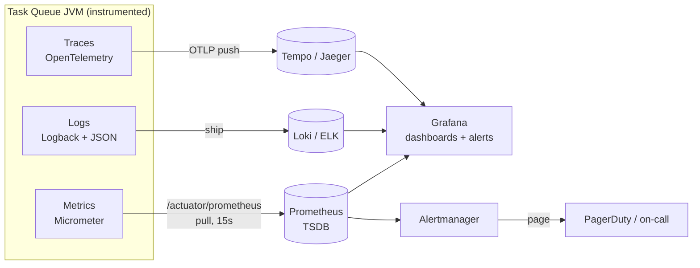
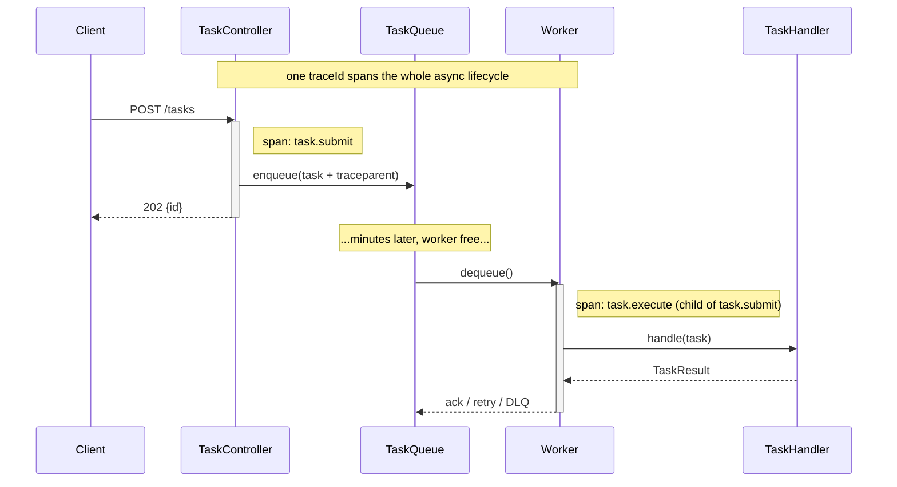
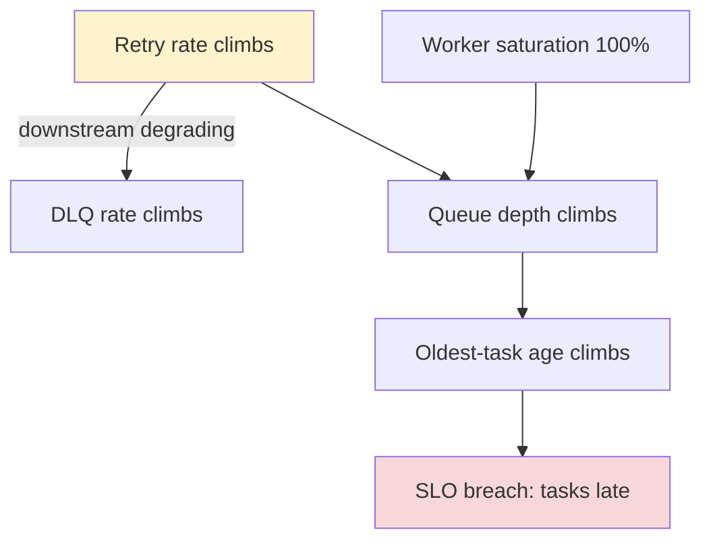
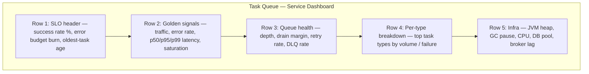
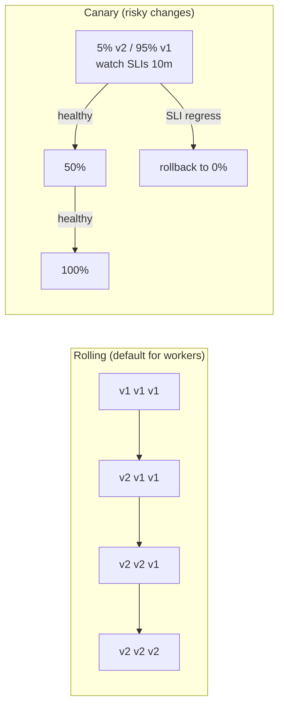

# Observability and Production Operations

> You cannot operate what you cannot see. This chapter turns our Distributed Task Queue from "it works on my machine" into a system an on-call engineer can run at 3 AM — instrumented, alerted, deployable, and survivable under chaos.

Observability is the discipline of being able to ask *arbitrary questions about your system's behavior from the outside*, without shipping new code to answer them. Monitoring tells you *whether* the system is healthy against predefined thresholds; observability lets you ask *why* it is unhealthy when something you never predicted happens. A task queue is an especially observability-hungry system: work is asynchronous, failures are deferred and retried, and the symptom (a task that ran late) is far away in time and space from the cause (a slow handler, a poisoned message, a starved worker pool). This chapter builds the three pillars — metrics, logs, traces — on top of our canonical `Task` / `TaskQueue` / `WorkerPool` model, defines the SLIs that actually matter for queues, and walks dashboards, alerting, runbooks, deploys/rollbacks, and chaos testing.

This sits at the end of `10-system-design/`. It assumes the architecture from [designing-a-task-queue.md](./designing-a-task-queue.md), the scale targets from [scaling-the-platform.md](./scaling-the-platform.md) and [capacity-estimation.md](./capacity-estimation.md), and the storage decisions from [data-modeling-and-storage.md](./data-modeling-and-storage.md). It draws on [dead-letter-queues.md](../07-queues-and-messaging/dead-letter-queues.md), [retries.md](../08-distributed-systems/retries.md), [circuit-breakers.md](../08-distributed-systems/circuit-breakers.md), [idempotency.md](../08-distributed-systems/idempotency.md), and [backpressure.md](../08-distributed-systems/backpressure.md).

---

## 1. Why This Exists — The Real Problem

In a synchronous request/response service, the user *is* your monitor: if the request is slow or errors, the caller knows immediately and so do you. A task queue breaks that feedback loop on purpose. A client does `POST /tasks`, gets a `202 Accepted` and a task `id`, and walks away. Whatever happens next — the task sits in the queue for 40 minutes because workers are starved, fails 5 times against a downstream that is rate-limiting you, then lands in the DLQ — happens *silently*. Nobody is watching the screen. The only way you learn about it is if you built the instrumentation to tell you, or if a customer opens a ticket asking why their export never arrived. The second is not a strategy.

The historical arc: ops started with **logs** (print statements scraped by humans, then by `grep`, then by the ELK stack), added **metrics** (counters and gauges, Graphite then Prometheus, around 2012-2015) because logs are too expensive to aggregate in real time, and finally added **distributed tracing** (Dapper 2010, then OpenZipkin, Jaeger, and OpenTelemetry) because in a system of many services neither logs nor metrics tell you *where in the call graph* a request spent its time. The three are complementary, not redundant — each answers a question the others answer poorly.

> **Mental model:** Metrics tell you *that* something is wrong (error rate up, queue depth climbing). Traces tell you *where* it is wrong (which span in which service is slow). Logs tell you *why* it is wrong (the stack trace, the offending payload, the downstream error message). An incident is a loop: metric fires an alert → trace localizes the hot component → log explains the root cause → you fix it → you add a metric so it never surprises you again.

For our platform the operational problem statement is: **detect degradation before customers do, localize it in minutes not hours, deploy fixes without dropping in-flight tasks, roll back instantly when a deploy regresses, and prove via chaos testing that the system actually survives the failures we claim it survives.**

---

## 2. Requirements

### Functional requirements

- Every component (`TaskController`, `TaskQueue`, `Worker`, `WorkerPool`, `RetryHandler`, `DeadLetterQueue`, `RateLimiter`) emits metrics, structured logs, and trace spans.
- A `correlationId` / `traceId` follows a task from `POST /tasks` through every retry to terminal state (`SUCCEEDED` or `DEAD`).
- Dashboards exist for: traffic, errors, latency, saturation, and the queue-specific SLIs (depth, oldest-task age, DLQ rate, success rate).
- Alerts fire on SLO burn, page a human, and link directly to a runbook.
- Deploys are zero-drop (no in-flight task is lost) and reversible (one-command rollback).
- Chaos experiments can be run against staging (and game-day against prod) to validate failure handling.

### Non-functional requirements

| Requirement | Target | Why |
|---|---|---|
| Metrics scrape interval | 15 s | Prometheus default; balances resolution vs. cardinality cost |
| Alert detection time (MTTD) | < 2 min for SLO-burning incidents | Customers notice within ~5 min; beat them |
| Time to localize (trace lookup) | < 5 min | Trace must be findable by `taskId` |
| Logging overhead | < 2% CPU, async | Logging must never become the bottleneck |
| Metric cardinality budget | < 1M active series per Prometheus | Cardinality is the #1 way to blow up a TSDB |
| Trace sampling | head 1% baseline + tail 100% of errors | Full tracing is too expensive; errors must never be dropped |
| Deploy → rollback | < 60 s | A bad deploy must be undoable faster than it spreads |
| Availability SLO | 99.9% successful task terminal outcomes / 28 days | ≈ 43 min error budget/month |

The cardinality and sampling lines are the ones engineers underestimate. They are covered in §7 and §9.

---

## 3. The Three Pillars



### Pillar 1 — Metrics (numbers over time)

Metrics are pre-aggregated numeric time series. Cheap to store (a counter is 8 bytes per scrape), cheap to query, and the right tool for "is the system healthy *right now* and *trending* which way." The four instrument types you need:

- **Counter** — monotonically increasing total (`tasks_submitted_total`). You graph its *rate*.
- **Gauge** — a value that goes up and down (`queue_depth`, `active_workers`).
- **Timer / Histogram** — distribution of durations (`task_execution_seconds`), so you can compute p50/p95/p99.
- **Summary** — client-side quantiles (rarely needed; histograms aggregate across instances, summaries do not — prefer histograms).

> **The cardinality rule:** every distinct combination of label values is a separate time series. `task_executions_total{type="email", status="SUCCEEDED"}` is fine — `type` has maybe 20 values and `status` has 7. Adding `taskId` as a label would create one series *per task* — millions of series, an out-of-memory Prometheus, and a six-figure bill. **Never put unbounded-cardinality values (taskId, userId, payload) in a metric label. Those belong in logs and traces.**

### Pillar 2 — Logs (discrete events with context)

Logs are timestamped, structured events. The single most important upgrade over a typical codebase is **structured (JSON) logging with a correlation id**, so logs are queryable (`taskId = "abc"`) rather than greppable. Logs carry the high-cardinality context that metrics cannot: the actual payload that poisoned a handler, the full stack trace, the downstream error body.

### Pillar 3 — Traces (the causal path of one request)

A trace is a tree of spans following one logical operation across threads, processes, and services. For us a trace begins at `POST /tasks`, includes the enqueue, the (possibly much later) dequeue by a worker, the handler execution, and every retry attempt. Tracing answers "*where* did this task spend its 40 minutes?" — was it queue wait, handler latency, or retry backoff? No metric or log answers that as directly.

| Pillar | Answers | Cost | Cardinality | Retention |
|---|---|---|---|---|
| Metrics | *Is* it broken? Trending? | Lowest | Must be low | Long (months) |
| Traces | *Where* is it broken? | Medium (sample) | High (per-request) | Short (days) |
| Logs | *Why* is it broken? | Highest (volume) | Highest | Medium (weeks) |

The three are joined by the **`traceId`**: it is a metric exemplar, a log field, and the trace's primary key. That join is what makes "metric alert → click to exemplar trace → click to logs for that trace" a 30-second workflow instead of a 30-minute one.

---

## 4. Instrumenting the Project — Metrics

We use **Micrometer**, the vendor-neutral metrics facade in Spring Boot (it is to metrics what SLF4J is to logging). It exposes a Prometheus endpoint at `/actuator/prometheus`.

### The naive version (and why it is wrong)

```java
// NAIVE: hand-rolled, racy, leaks cardinality, hard to query.
public class Worker implements Runnable {
    public static long tasksProcessed = 0;   // not thread-safe across workers
    public static Map<String, Long> perTaskTiming = new HashMap<>(); // taskId key = unbounded growth + not concurrent

    public void run() {
        Task t = queue.dequeue();
        long start = System.currentTimeMillis();
        handler.handle(t);
        tasksProcessed++;                                  // lost updates under concurrency
        perTaskTiming.put(t.id(), System.currentTimeMillis() - start); // OOM over time
    }
}
```

Problems: `tasksProcessed++` is a lost-update race across worker threads; `perTaskTiming` keyed by `taskId` grows without bound; there is no way to compute p99; and nothing exports it anywhere. This is the "we have metrics" that gives metrics a bad name.

### Production-quality version

A small, injected `TaskMetrics` component owns every meter. Meters are created once and reused; labels are strictly bounded.

```java
import io.micrometer.core.instrument.*;
import java.time.Duration;
import java.util.concurrent.atomic.AtomicInteger;

/** Single source of truth for task-queue metrics. Inject this everywhere. */
public final class TaskMetrics {

    private final MeterRegistry registry;
    private final AtomicInteger queueDepth = new AtomicInteger(0);
    private final AtomicInteger activeWorkers = new AtomicInteger(0);

    public TaskMetrics(MeterRegistry registry) {
        this.registry = registry;
        // Gauges read a live value on every scrape — no manual push needed.
        Gauge.builder("taskqueue_queue_depth", queueDepth, AtomicInteger::get)
             .description("Tasks currently waiting in the queue")
             .register(registry);
        Gauge.builder("taskqueue_active_workers", activeWorkers, AtomicInteger::get)
             .description("Workers currently executing a task")
             .register(registry);
    }

    // ---- Counters: bounded labels only (type, terminal status) ----
    public void recordSubmitted(String type) {
        Counter.builder("taskqueue_tasks_submitted_total")
               .tag("type", type)
               .register(registry)
               .increment();
    }

    public void recordTerminal(String type, String status) { // SUCCEEDED | DEAD
        Counter.builder("taskqueue_tasks_terminal_total")
               .tag("type", type).tag("status", status)
               .register(registry)
               .increment();
    }

    public void recordRetry(String type) {
        Counter.builder("taskqueue_task_retries_total")
               .tag("type", type)
               .register(registry).increment();
    }

    public void recordDeadLetter(String type, String reason) {
        Counter.builder("taskqueue_dead_letter_total")
               .tag("type", type).tag("reason", reason) // reason from a FIXED enum, never freeform
               .register(registry).increment();
    }

    // ---- Timer: distribution → p50/p95/p99 via histogram buckets ----
    public Timer.Sample startExecution() { return Timer.start(registry); }

    public void stopExecution(Timer.Sample sample, String type, String outcome) {
        sample.stop(Timer.builder("taskqueue_task_execution_seconds")
                .tag("type", type).tag("outcome", outcome)
                .publishPercentileHistogram() // emits buckets so Prometheus can do histogram_quantile()
                .register(registry));
    }

    // ---- Gauges: handed live setters; called by the queue/pool ----
    public void setQueueDepth(int n)   { queueDepth.set(n); }
    public void workerStarted()        { activeWorkers.incrementAndGet(); }
    public void workerFinished()       { activeWorkers.decrementAndGet(); }
}
```

The `Worker` becomes thin and instrumented, with timing recorded as a distribution:

```java
public final class Worker implements Runnable {
    private final TaskQueue queue;
    private final HandlerRegistry handlers;
    private final TaskMetrics metrics;
    private volatile boolean running = true;

    public Worker(TaskQueue queue, HandlerRegistry handlers, TaskMetrics metrics) {
        this.queue = queue; this.handlers = handlers; this.metrics = metrics;
    }

    @Override public void run() {
        while (running) {
            Task task;
            try { task = queue.dequeue(); }                 // blocks
            catch (InterruptedException e) { Thread.currentThread().interrupt(); return; }

            metrics.workerStarted();
            metrics.setQueueDepth(queue.size());
            var sample = metrics.startExecution();
            String outcome = "error";
            try {
                TaskHandler handler = handlers.lookup(task.type());
                TaskResult result = handler.handle(task);
                outcome = result.success() ? "success" : (result.retryable() ? "retry" : "fail");
                // ... status transition / retry / DLQ handled by an outcome handler ...
            } catch (Exception e) {
                outcome = "exception";
                // structured log carries the high-cardinality detail; see §5
            } finally {
                metrics.stopExecution(sample, task.type(), outcome);
                metrics.workerFinished();
            }
        }
    }

    public void stop() { running = false; }
}
```

> **Why a `Timer` not a manual stopwatch:** Micrometer's `Timer` with `publishPercentileHistogram()` emits fixed-boundary histogram buckets. Prometheus aggregates those buckets *across all worker instances* and computes `histogram_quantile(0.99, ...)` correctly. A client-side "average latency" gauge cannot be aggregated across instances and hides the tail — and the tail is where your customers live.

### The age-of-oldest-task gauge (the SLI most teams forget)

Queue *depth* tells you how many tasks wait; it does not tell you how *long* the worst one has waited. A queue of depth 10 where the oldest task is 2 hours old is a far worse incident than depth 100,000 that drains in 30 seconds. Expose **age of the oldest pending task** as a gauge:

```java
// Registered once; the lambda runs on every Prometheus scrape.
Gauge.builder("taskqueue_oldest_pending_task_age_seconds", taskRepository,
        repo -> repo.findOldestPending()                  // SELECT min(created_at) WHERE status='PENDING'
                    .map(t -> (double) Duration.between(t.createdAt(), Instant.now()).toSeconds())
                    .orElse(0.0))
     .description("Age of the oldest task still waiting to run")
     .register(registry);
```

This single gauge is the truest measure of whether the system is keeping up. It is what you alert on (§7).

---

## 5. Instrumenting the Project — Structured Logs

Plain-text logs are a tax you pay at incident time. Switch to JSON with a per-task correlation id propagated via MDC (Mapped Diagnostic Context).

```java
import org.slf4j.MDC;

public final class CorrelatedWorker implements Runnable {
    private static final org.slf4j.Logger log =
        org.slf4j.LoggerFactory.getLogger(CorrelatedWorker.class);

    private final TaskQueue queue;
    private final HandlerRegistry handlers;

    @Override public void run() {
        Task task;
        try { task = queue.dequeue(); }
        catch (InterruptedException e) { Thread.currentThread().interrupt(); return; }

        // Every log line within this scope automatically carries these fields.
        MDC.put("taskId", task.id());
        MDC.put("taskType", task.type());
        MDC.put("attempt", String.valueOf(task.attempts()));
        MDC.put("traceId", TraceContext.current()); // bridges logs <-> traces
        try {
            log.info("task_dequeued queue_wait_ms={}",
                     Duration.between(task.createdAt(), Instant.now()).toMillis());
            TaskResult r = handlers.lookup(task.type()).handle(task);
            log.info("task_completed outcome={} retryable={}", r.success(), r.retryable());
        } catch (Exception e) {
            // The full context — payload, stack — lives here, NOT in a metric label.
            log.error("task_failed payload={} ", task.payload(), e);
        } finally {
            MDC.clear(); // critical: pooled threads are reused; stale MDC leaks across tasks
        }
    }
}
```

`logback-spring.xml` emits one JSON object per line so Loki/ELK can index fields:

```xml
<configuration>
  <appender name="JSON" class="ch.qos.logback.core.ConsoleAppender">
    <encoder class="net.logstash.logback.encoder.LogstashEncoder">
      <includeMdcKeyName>taskId</includeMdcKeyName>
      <includeMdcKeyName>taskType</includeMdcKeyName>
      <includeMdcKeyName>traceId</includeMdcKeyName>
    </encoder>
  </appender>
  <!-- Async so logging I/O never blocks a worker thread on the hot path -->
  <appender name="ASYNC" class="ch.qos.logback.classic.AsyncAppender">
    <appender-ref ref="JSON"/>
    <queueSize>8192</queueSize>
    <discardingThreshold>0</discardingThreshold> <!-- never drop ERROR/WARN -->
  </appender>
  <root level="INFO"><appender-ref ref="ASYNC"/></root>
</configuration>
```

> **Logging discipline that survives scale:** log at **boundaries and state transitions**, not in tight loops. One line per task per state transition (`dequeued`, `completed`/`failed`, `retry_scheduled`, `dead_lettered`) is plenty and lets you reconstruct any task's lifecycle by querying `taskId`. Logging inside the handler's inner loop at 1M tasks/sec will cost more than the work itself. Use `MDC.clear()` in `finally` — the #1 structured-logging bug is stale MDC bleeding from one task into the next on a reused thread.

---

## 6. Instrumenting the Project — Distributed Tracing

A task's life spans threads and (later) processes. Naively, the `POST /tasks` span ends when the API returns `202`, and the worker's execution is a *separate, disconnected* trace — useless. The fix is to **propagate trace context across the async boundary** (the queue), so the worker's span is a child of the submission span.

```java
import io.opentelemetry.api.trace.*;
import io.opentelemetry.context.Context;

public final class TracedEnqueue {
    private final Tracer tracer;
    private final TaskQueue queue;

    /** API side: start a span, capture context, store it on the task envelope. */
    public Task submit(String type, String payload) {
        Span span = tracer.spanBuilder("task.submit").startSpan();
        try (var scope = span.makeCurrent()) {
            Task task = new Task(UUID.randomUUID().toString(), type, payload,
                                 TaskStatus.PENDING, 0, 5, Instant.now(), null, 0);
            // Inject W3C traceparent so the worker can continue THIS trace later.
            String traceparent = span.getSpanContext().getTraceId() + ":" +
                                 span.getSpanContext().getSpanId();
            queue.enqueue(task.withTraceContext(traceparent));
            span.setAttribute("task.id", task.id());
            span.setAttribute("task.type", type);
            return task;
        } finally { span.end(); }
    }
}

public final class TracedWorker {
    private final Tracer tracer;

    /** Worker side: resume the parent trace, so execution links back to submission. */
    public void execute(Task task, TaskHandler handler) {
        Context parent = TraceContextCodec.extract(task.traceContext());
        Span span = tracer.spanBuilder("task.execute")
                          .setParent(parent)              // <-- links across the queue
                          .setSpanKind(SpanKind.CONSUMER)
                          .startSpan();
        span.setAttribute("task.id", task.id());
        span.setAttribute("task.attempt", task.attempts());
        span.setAttribute("queue.wait_ms",
            Duration.between(task.createdAt(), Instant.now()).toMillis());
        try (var scope = span.makeCurrent()) {
            TaskResult r = handler.handle(task);
            span.setAttribute("task.outcome", r.success() ? "success" : "fail");
        } catch (Exception e) {
            span.recordException(e);
            span.setStatus(StatusCode.ERROR);
            throw new RuntimeException(e);
        } finally { span.end(); }
    }
}
```



Now a single trace shows: 5 ms submit, **38 minutes of queue wait** (the bar that's actually huge), 200 ms handler. The trace makes it visually obvious the bottleneck is worker starvation, not handler latency — a conclusion no dashboard alone hands you that fast.

> **Sampling:** trace every span at 1M tasks/sec and your tracing backend costs more than your compute. Use **head-based sampling** (~1%) for the happy path plus **tail-based sampling that keeps 100% of error/slow traces**. The errors are the ones you need; the boring successes are statistically redundant.

---

## 7. The Golden Signals and Queue-Specific SLIs

Google's SRE book defines four **golden signals** that catch most issues. We extend them with the SLIs specific to a queue.

### The four golden signals

| Signal | What it is | Our metric (PromQL) |
|---|---|---|
| **Traffic** | Demand on the system | `rate(taskqueue_tasks_submitted_total[5m])` |
| **Errors** | Rate of failed requests | `rate(taskqueue_tasks_terminal_total{status="DEAD"}[5m])` |
| **Latency** | Time to serve | `histogram_quantile(0.99, sum(rate(taskqueue_task_execution_seconds_bucket[5m])) by (le))` |
| **Saturation** | How "full" the system is | `taskqueue_active_workers / taskqueue_worker_pool_size` |

### Queue-specific SLIs (the ones an interviewer wants to hear)

A queue has SLIs a request/response service does not. These are the signals that distinguish someone who has operated a queue from someone who has only read about one.

1. **Queue depth** — `taskqueue_queue_depth`. *Rising and not draining* means producers outpace consumers. A spike that drains is fine; a monotonic climb is an incident.
2. **Age of the oldest pending task** — `taskqueue_oldest_pending_task_age_seconds`. The truest "are we keeping up" signal; immune to bursty depth. **This is usually your primary SLI.**
3. **DLQ rate** — `rate(taskqueue_dead_letter_total[5m])`. Tasks exhausting retries. A nonzero baseline is normal; a spike means a downstream broke or a poison-pill `type` is loose.
4. **Success rate** — `terminal{SUCCEEDED} / (terminal{SUCCEEDED} + terminal{DEAD})`. The headline SLO number.
5. **Retry rate** — `rate(taskqueue_task_retries_total[5m])`. Climbing retries are a *leading* indicator of a downstream degrading *before* it shows up as DLQ.
6. **Worker saturation** — busy/total workers. At 100% sustained, depth and age will climb next.
7. **Throughput vs. arrival (drain margin)** — `rate(submitted) - rate(terminal)`. Positive for long = you are falling behind; this predicts queue-depth blowups before they happen.



The diagram is the causal chain you teach your on-call: **retry rate is the earliest leaf**; by the time oldest-task age breaches SLO you are minutes (not seconds) from a customer-visible incident. Alert on the leading indicators.

### Defining the SLO and error budget

> **SLI** = the metric (success rate). **SLO** = the target (99.9% over 28 days). **Error budget** = 100% − SLO = 0.1% ≈ 43 minutes/month of allowed failure. **SLA** = the contractual promise with penalties (always looser than your internal SLO).

The error budget is not a vanity number — it is a *decision tool*. Budget remaining → ship features fast. Budget exhausted → freeze features, only reliability work ships until it recovers. That policy ends the eternal dev-vs-ops fight by making it data-driven.

---

## 8. Dashboards

A dashboard is a hypothesis about what you'll need to see during an incident. Structure it top-down so the eye flows from "is it healthy" to "why not."



Principles that separate a useful dashboard from a wall of graphs:

- **One screen, top-down.** Row 1 answers "page or not?" in two seconds. If you scroll past row 2 during a page, the dashboard failed.
- **Rates, not totals.** Graph `rate(...[5m])`, never raw counters — a counter is a meaningless ever-rising line.
- **Percentiles, never averages.** Show p50/p95/p99 as three lines. An average of 50 ms hides that 1% of tasks take 10 s.
- **Annotate deploys.** A vertical line per deploy (from CI) makes "the regression started at the 14:02 deploy" instantly visible.
- **Exemplars on.** Click a latency spike → jump straight to a slow trace. This is the metrics→traces join from §3 made operational.
- **RED for services, USE for resources.** Services: **R**ate, **E**rrors, **D**uration. Resources (CPU, disk, pool): **U**tilization, **S**aturation, **E**rrors.

A dashboard provisioned as code (a JSON file in the repo, applied by Grafana's provisioning) is reviewable, diffable, and survives a Grafana reinstall — treat it like any other source artifact.

---

## 9. Alerting

The art of alerting is **alert on symptoms, page on customer pain, and never page on a cause that has no customer impact.** Every page that isn't actionable trains the on-call to ignore pages — alert fatigue is how real incidents get missed.

### Symptom-based, SLO-burn alerts (Prometheus rules)

```yaml
groups:
- name: taskqueue-slo
  rules:
  # PAGE: oldest task aging past SLO — customers' work is late.
  - alert: OldestTaskTooOld
    expr: taskqueue_oldest_pending_task_age_seconds > 300
    for: 2m                       # must persist 2 min — kills flapping
    labels: { severity: page }
    annotations:
      summary: "Oldest pending task is {{ $value | humanizeDuration }} old (SLO 5m)"
      runbook: "https://runbooks/taskqueue/oldest-task-too-old"

  # PAGE: fast error-budget burn (multi-window burn-rate).
  - alert: ErrorBudgetBurnFast
    expr: |
      (1 - (sum(rate(taskqueue_tasks_terminal_total{status="SUCCEEDED"}[5m]))
            / sum(rate(taskqueue_tasks_terminal_total[5m])))) > (14.4 * 0.001)
      and
      (1 - (sum(rate(taskqueue_tasks_terminal_total{status="SUCCEEDED"}[1h]))
            / sum(rate(taskqueue_tasks_terminal_total[1h])))) > (14.4 * 0.001)
    for: 2m
    labels: { severity: page }
    annotations:
      summary: "Burning 30-day error budget 14x too fast"
      runbook: "https://runbooks/taskqueue/error-budget-burn"

  # TICKET (not page): DLQ trending up — investigate during business hours.
  - alert: DeadLetterRateElevated
    expr: rate(taskqueue_dead_letter_total[15m]) > 0.5
    for: 10m
    labels: { severity: ticket }
    annotations:
      summary: "DLQ ingest {{ $value }}/s — a downstream may be degraded"
      runbook: "https://runbooks/taskqueue/dlq-elevated"
```

> **Multi-window, multi-burn-rate alerting** (the modern SRE standard) requires the budget to be burning fast over *both* a long window (1 h, confirms it's real) and a short window (5 m, confirms it's still happening). The `14.4x` factor means: at this rate you'd exhaust a 30-day budget in ~2 days → page now. A slower `3x` burn becomes a ticket, not a page. This combination is what eliminates both false pages (short window alone flaps) and missed incidents (long window alone is too slow).

### Severity ladder

| Severity | Means | Routes to | Example |
|---|---|---|---|
| **page** | Customer-visible SLO breach happening *now* | Phone, wakes someone | Oldest-task age > SLO; fast budget burn |
| **ticket** | Degrading, not yet customer-visible | Slack/Jira, business hours | DLQ trending up; slow budget burn |
| **info** | FYI / capacity planning | Dashboard annotation only | Disk 70% full |

**Anti-patterns to refuse in review:** paging on CPU/heap (a *cause*, not a symptom — high CPU with healthy SLIs is fine); paging on a single failed task (noise); alerts with no `runbook` annotation; alerts without a `for:` clause (they flap). If an alert fires and the on-call's correct action is "acknowledge and go back to sleep," delete that alert.

---

## 10. On-Call Runbooks

A runbook is a written procedure for one specific alert, written so a sleep-deprived engineer who has never seen this alert can act. Every paging alert links to one. A good runbook has: **symptom, impact, dashboard links, diagnosis steps, mitigation, escalation.**

> ### Runbook: `OldestTaskTooOld`
>
> **Symptom:** `taskqueue_oldest_pending_task_age_seconds` > 300 s for 2 min.
> **Customer impact:** Submitted tasks are executing late; user-visible features (exports, emails, webhooks) are delayed.
> **Dashboard:** [Task Queue — Service Dashboard](https://grafana/d/taskqueue) → Row 3.
>
> **Diagnose (in order):**
> 1. Is **queue depth** climbing too? If yes → throughput problem (consumers slow / too few). If depth is *low* but age is high → a **stuck task** or a starved priority class (a low-priority task wedged behind a poison pill).
> 2. Check **worker saturation**. At 100% sustained → workers are the bottleneck → scale out (§11) or the handler slowed down.
> 3. Check **p99 handler latency per type**. A spike in one `type` → that handler's downstream is slow; consider tripping its circuit breaker (see [circuit-breakers.md](../08-distributed-systems/circuit-breakers.md)).
> 4. Check **retry rate**. High retries inflate effective load 5x; a downstream outage is multiplying your work.
>
> **Mitigate:**
> - Throughput-bound → scale the worker `replicas` (`kubectl scale deployment workers --replicas=N`); HPA should do this automatically but may lag a burst.
> - One bad `type` → temporarily pause that type's handler (feature flag) so it stops starving healthy types; let its tasks queue.
> - Downstream outage → trip the circuit breaker for that type; tasks fast-fail to retry-with-backoff instead of holding workers.
> - Poison pill (one task repeatedly failing and blocking) → identify via the oldest task's `taskId`, route it to the DLQ manually, unblock the queue.
>
> **Escalate:** If depth is still climbing after scaling 2x, page the platform team — likely a broker/DB bottleneck, not workers.

The runbook turns judgment learned during one incident into a checklist everyone can run during the next. The best runbooks shrink over time because their steps become automated (auto-scaling, auto-DLQ of poison pills) — **a runbook step you run more than three times is a bug report against your automation.**

---

## 11. Deploys and Rollbacks

A task queue makes deploys harder than a stateless web service: at any instant, workers hold **in-flight tasks**. Killing a pod mid-task must not lose that task. Two requirements: **graceful shutdown** (drain in-flight work) and **at-least-once delivery** (a task killed mid-flight is redelivered, not lost — which is why handlers must be idempotent; see [idempotency.md](../08-distributed-systems/idempotency.md)).

### Graceful shutdown — drain, don't drop

```java
public final class WorkerPool {
    private final ExecutorService executor;
    private final List<Worker> workers;

    public void shutdown() {
        workers.forEach(Worker::stop);     // 1) stop pulling NEW tasks from the queue
        executor.shutdown();               // 2) no new submissions
        try {
            // 3) give in-flight tasks time to finish (must exceed p99 handler time)
            if (!executor.awaitTermination(30, TimeUnit.SECONDS)) {
                // 4) tasks still running: interrupt. With at-least-once delivery,
                //    an un-acked task is redelivered to another node — not lost.
                executor.shutdownNow();
            }
        } catch (InterruptedException e) {
            executor.shutdownNow();
            Thread.currentThread().interrupt();
        }
    }
}
```

Spring Boot wires this to `SIGTERM` via `server.shutdown=graceful` and a `terminationGracePeriodSeconds` in Kubernetes that **exceeds your p99 handler duration** — otherwise the orchestrator `SIGKILL`s a pod mid-task and you lean entirely on redelivery (acceptable, but wasteful, and only correct if handlers are idempotent).

### Deploy strategies



| Strategy | How | Cost | Best for |
|---|---|---|---|
| **Rolling** | Replace pods N at a time | Cheap, no extra capacity | Routine worker deploys |
| **Canary** | Send small % to v2, watch SLIs, ramp | Medium | Risky handler/serialization changes |
| **Blue-green** | Full parallel stack, flip traffic | 2x capacity | The DB-touching API tier; instant rollback |

### Rollback — the deploy you'll actually be glad you built

Rollback must be **faster than the regression can spread** — under 60 s. Two non-obvious queue-specific hazards:

- **Schema/payload compatibility.** If v2 changed the `Task` payload serialization, a rollback to v1 must still deserialize tasks v2 enqueued, and vice-versa. **Always deploy schema changes in two phases** (expand: v2 reads old+new; contract: a *later* deploy removes old) so any single version can roll back safely. A one-shot breaking serialization change makes rollback impossible — the worst place to discover that is during an incident.
- **The poisoned-DLQ trap.** A buggy v2 may have shoved thousands of perfectly-good tasks into the DLQ. Rollback fixes new traffic but not the DLQ backlog; the runbook must include **replaying the DLQ** (see [dead-letter-queues.md](../07-queues-and-messaging/dead-letter-queues.md)) after the rollback stabilizes.

> **Make rollback boring.** Practice it. A rollback you've never run is a rollback that fails when you need it. Tie deploys to dashboard annotations so "did the deploy cause this?" is a glance, not an investigation.

---

## 12. Chaos Testing

Chaos engineering is the practice of **deliberately injecting failure to verify your system survives the failures you claim it survives** — before they happen for real at 3 AM. The discipline (Netflix's Chaos Monkey, 2011) rests on one insight: a failure path you have never exercised is a failure path that does not work. Your retry logic, circuit breakers, and graceful shutdown are all untested code until chaos exercises them.

The method is the scientific method: **(1) define steady state** as an SLI (e.g., success rate ≥ 99.9%, oldest-task age < 60 s); **(2) hypothesize** the SLI stays in bounds under a fault; **(3) inject the fault** in staging (then, with confidence, prod during a game-day); **(4) measure** whether the SLI held; **(5) fix** what broke and add a regression alert.

### Failure modes to test, and the expected survival

| Injected fault | What it tests | Expected survival behavior |
|---|---|---|
| Kill a worker pod mid-task | Graceful shutdown + at-least-once redelivery | Task redelivered & completed; no loss; idempotent handler dedupes |
| Downstream handler returns 500s | Retry policy + circuit breaker | Retries with backoff; breaker trips; tasks fast-fail to retry, workers not held |
| Add 2 s latency to the DB | Backpressure | Queue absorbs; depth rises then drains; no cascading timeout ([backpressure.md](../08-distributed-systems/backpressure.md)) |
| Poison-pill task (always throws) | DLQ routing | Lands in DLQ after `maxAttempts`; does NOT block the queue |
| Broker partition / unavailable | Persistence / failover | API returns backpressure (429/503), no silent task loss |
| Burst 10x submission rate | Saturation + autoscaling | HPA scales workers; oldest-task age recovers within minutes |
| Clock skew between nodes | Scheduled-task correctness | `scheduledAt` honored within tolerance; no duplicate fires |

### A chaos test as code (Testcontainers + Toxiproxy)

Chaos isn't only a prod game-day; encode the cheap experiments as integration tests so a regression *fails CI*.

```java
import org.junit.jupiter.api.Test;
import static org.assertj.core.api.Assertions.assertThat;

/** Verifies a poison-pill task is dead-lettered after maxAttempts and never blocks the queue. */
class PoisonPillChaosTest {

    @Test
    void poisonPill_isDeadLettered_andDoesNotBlockHealthyTasks() throws Exception {
        var dlq = new RecordingDeadLetterQueue();
        var queue = new InMemoryTaskQueue();
        var handlers = new HandlerRegistry();
        handlers.register("poison", t -> { throw new RuntimeException("always fails"); });
        handlers.register("healthy", t -> new TaskResult(true, "ok", false));

        var pool = new WorkerPool(queue, handlers, dlq,
                                  new ExponentialBackoffRetryPolicy(Duration.ofMillis(1), 3));
        pool.start();

        // Steady-state hypothesis: a healthy task completes even with a poison pill present.
        Task poison  = Task.of("poison",  "{}");   // maxAttempts = 3
        Task healthy = Task.of("healthy", "{}");
        queue.enqueue(poison);
        queue.enqueue(healthy);

        await().atMost(Duration.ofSeconds(5)).untilAsserted(() -> {
            assertThat(dlq.contains(poison.id())).isTrue();        // poison dead-lettered
            assertThat(dlq.reasonFor(poison.id())).contains("maxAttempts");
            assertThat(handlers.completed("healthy")).isTrue();    // healthy NOT starved
        });

        pool.shutdown();
    }
}
```

> **Start small, blast-radius first.** Run chaos in staging before prod. In prod, scope the blast radius (one pod, one AZ, off-peak), announce a game-day, and have the abort button ready. The goal is *confidence*, not heroics — a chaos experiment that takes down prod taught you something, but at a cost you should have paid in staging.

---

## 13. Tradeoffs

| Decision | Option A | Option B | When to pick which |
|---|---|---|---|
| Metrics collection | **Pull** (Prometheus scrapes) | **Push** (StatsD/OTLP) | Pull is simpler, gives free up/down detection (scrape fails = target down), and is the default; push suits short-lived jobs and serverless that vanish before a scrape |
| Trace sampling | Head (decide at start) | Tail (decide after seeing the whole trace) | Head is cheap and simple but blindly drops some errors; tail keeps all errors/slow traces but needs a buffering collector — use tail for error fidelity |
| Logging cost | Log everything | Log boundaries + sample the rest | Full logs are a debugging dream and a budget nightmare; sample INFO, keep 100% of WARN/ERROR |
| Delivery semantics | At-least-once | Exactly-once | At-least-once + idempotent handlers is the pragmatic default; true exactly-once is expensive and usually unnecessary (see [idempotency.md](../08-distributed-systems/idempotency.md)) |
| Alert philosophy | On symptoms (SLIs) | On causes (CPU, heap) | Symptom alerts catch unknown-unknowns and reduce noise; cause alerts are for capacity tickets, never pages |
| Deploy | Rolling | Canary/blue-green | Rolling for routine; canary/blue-green for risky or DB-touching changes where instant rollback matters |
| Metric resolution | High (5 s scrape) | Low (60 s) | Higher resolution catches fast spikes but multiplies storage cost; 15 s is the sweet spot |

The throughline: **observability is itself a system with cost, cardinality, and failure modes.** Over-instrument and your telemetry pipeline outcosts and outscales the service it watches. The skill is instrumenting *exactly enough* to answer the questions incidents actually ask.

---

## 14. Common Mistakes and Pitfalls

- **High-cardinality metric labels.** Putting `taskId`/`userId`/`payload` in a label. Fix: those go in logs/traces; labels carry only bounded dimensions (`type`, `status`, `reason`-from-enum).
- **Averages instead of percentiles.** "Average latency 50 ms" while p99 is 8 s. Fix: histograms + `histogram_quantile`, graph p50/p95/p99.
- **Alerting on causes.** Paging on 90% CPU while SLIs are green. Fix: page on symptoms (oldest-task age, budget burn); CPU is a ticket.
- **Flapping alerts.** No `for:` clause, alert toggles every scrape. Fix: `for: 2m` and multi-window burn-rate.
- **Stale MDC.** Forgetting `MDC.clear()` on a pooled thread leaks one task's `taskId` into the next. Fix: clear in `finally`.
- **Broken async traces.** The worker span isn't a child of the submit span. Fix: propagate trace context through the queue envelope.
- **Synchronous logging on the hot path.** Logging I/O blocks worker threads. Fix: `AsyncAppender`, log at boundaries only.
- **No graceful shutdown.** Deploy `SIGKILL`s pods mid-task. Fix: drain in `shutdown()`, grace period > p99 handler time, idempotent handlers.
- **Irreversible serialization change.** A breaking payload change blocks rollback. Fix: expand/contract two-phase schema changes.
- **Runbook-less pages.** Alert fires, on-call has no idea what to do. Fix: every page links a runbook.
- **Chaos only in prod (or never).** Fix: encode cheap experiments as CI integration tests; game-day the rest with a bounded blast radius.

---

## 15. Refactoring Exercise

**Bad** — un-observable worker:

```java
public class Worker {
    public void run() {
        while (true) {
            Task t = queue.dequeue();
            try { handler.handle(t); }
            catch (Exception e) { e.printStackTrace(); } // black hole
        }
    }
}
```

**Improved** — add structured logging + a counter:

```java
public class Worker {
    private static final Logger log = LoggerFactory.getLogger(Worker.class);
    private final Counter failures;
    public void run() {
        while (running) {
            Task t = queue.dequeue();
            MDC.put("taskId", t.id());
            try { handler.handle(t); log.info("completed"); }
            catch (Exception e) { failures.increment(); log.error("failed", e); }
            finally { MDC.clear(); }
        }
    }
}
```

**Production** — metrics + structured logs + traces + graceful stop, all three pillars joined by `traceId`:

```java
public final class ObservableWorker implements Runnable {
    private static final Logger log = LoggerFactory.getLogger(ObservableWorker.class);
    private final TaskQueue queue;
    private final HandlerRegistry handlers;
    private final TaskMetrics metrics;
    private final Tracer tracer;
    private volatile boolean running = true;

    public ObservableWorker(TaskQueue q, HandlerRegistry h, TaskMetrics m, Tracer t) {
        this.queue = q; this.handlers = h; this.metrics = m; this.tracer = t;
    }

    @Override public void run() {
        while (running) {
            Task task;
            try { task = queue.dequeue(); }
            catch (InterruptedException e) { Thread.currentThread().interrupt(); return; }

            Span span = tracer.spanBuilder("task.execute")
                    .setParent(TraceContextCodec.extract(task.traceContext()))
                    .startSpan();
            MDC.put("taskId", task.id());
            MDC.put("traceId", span.getSpanContext().getTraceId());
            metrics.workerStarted();
            metrics.setQueueDepth(queue.size());
            var sample = metrics.startExecution();
            String outcome = "exception";
            try (var scope = span.makeCurrent()) {
                TaskResult r = handlers.lookup(task.type()).handle(task);
                outcome = r.success() ? "success" : (r.retryable() ? "retry" : "fail");
                log.info("task_completed outcome={} attempt={}", outcome, task.attempts());
            } catch (Exception e) {
                span.recordException(e); span.setStatus(StatusCode.ERROR);
                log.error("task_failed payload={}", task.payload(), e);
            } finally {
                metrics.stopExecution(sample, task.type(), outcome);
                metrics.workerFinished();
                span.end();
                MDC.clear();
            }
        }
    }

    public void stop() { running = false; }
}
```

---

## 16. Exercises

### Easy

1. **Knowledge check.** Name the three pillars of observability and the single question each answers best. Which one would you use to find *where* in a task's lifecycle the time went?
2. **Coding.** Add a Micrometer `Counter` `taskqueue_tasks_submitted_total` tagged by `type` to `TaskController`, incremented on every accepted `POST /tasks`. State why `type` is a safe label and `id` is not.
3. **PromQL.** Write a query for the task success rate over the last 5 minutes from `taskqueue_tasks_terminal_total{status=...}`.

### Medium

4. **Coding.** Implement the `taskqueue_oldest_pending_task_age_seconds` gauge backed by `TaskRepository.findOldestPending()`. Ensure the lambda runs per-scrape and returns 0 when the queue is empty.
5. **Refactoring.** Take the *bad* worker from §15 and add structured JSON logging with a propagated `taskId` via MDC, ensuring no MDC leak across the pooled thread.
6. **Design.** Define a 99.9%/28-day SLO for task success rate. Compute the monthly error budget in minutes and write the error-budget policy (what happens when it's exhausted).

### Hard

7. **Interview-style.** Design end-to-end tracing for a task that is submitted, fails twice, and succeeds on the third attempt. How do you ensure all three execution spans link to the original submission span across the async queue boundary and across retries?
8. **Design.** Design a multi-window multi-burn-rate alert for the success-rate SLO that pages on fast burn and tickets on slow burn, without flapping. Justify the windows and burn-rate factors.
9. **Stretch.** Write a chaos experiment (as a Testcontainers + Toxiproxy integration test) that injects 2 s of latency into the downstream a handler calls, asserts the circuit breaker trips, and asserts queue depth recovers (drains) within 30 s of latency being removed.

---

## 17. Solutions

**1.** Metrics (*is* it broken / trending), traces (*where* is it broken), logs (*why* is it broken). To find *where* the time went in a lifecycle, use **traces** — a span tree shows queue-wait vs. handler vs. retry-backoff at a glance.

**2.**
```java
@PostMapping("/tasks")
public ResponseEntity<TaskCreated> submit(@RequestBody SubmitRequest req) {
    Task task = taskService.submit(req.type(), req.payload());
    meterRegistry.counter("taskqueue_tasks_submitted_total", "type", req.type()).increment();
    return ResponseEntity.accepted().body(new TaskCreated(task.id()));
}
```
`type` has a small, fixed set of values (one per registered handler) → bounded cardinality. `id` is unique per task → one new time series per task → unbounded → OOMs the TSDB. High-cardinality identity belongs in logs/traces, not labels.

**3.**
```promql
sum(rate(taskqueue_tasks_terminal_total{status="SUCCEEDED"}[5m]))
/
sum(rate(taskqueue_tasks_terminal_total[5m]))
```

**4.**
```java
Gauge.builder("taskqueue_oldest_pending_task_age_seconds", taskRepository,
        repo -> repo.findOldestPending()
                    .map(t -> (double) Duration.between(t.createdAt(), Instant.now()).toSeconds())
                    .orElse(0.0))              // empty queue -> age 0, not an error/NaN
     .description("Age of the oldest task still waiting to run")
     .register(registry);
```
Passing `taskRepository` as the gauge's state object and a lambda means Micrometer re-invokes the lambda **on every scrape**, so the value is always live. `orElse(0.0)` keeps an empty queue from emitting NaN (which breaks alerting comparisons).

**5.** See the *Improved* block in §15 — `MDC.put("taskId", t.id())` before, `MDC.clear()` in `finally`. The `finally` is the whole point: pooled worker threads are reused, so without `clear()` the previous task's `taskId` leaks onto the next task's log lines, sending you debugging the wrong task.

**6.** 0.1% of 28 days = `0.001 × 28 × 24 × 60` = **40.32 minutes/month** of allowed failed terminal outcomes. **Policy:** while budget remains, feature work ships normally. When the budget is exhausted, declare a **feature freeze** — only reliability and the postmortem-action-items work merges until the rolling-window budget recovers. This makes the ship-vs-stabilize decision data-driven instead of political.

**7.** At submission, start a `task.submit` span and serialize its W3C `traceparent` into the `Task` envelope (a `traceContext` field) before `enqueue`. On each execution attempt, the worker **extracts** that `traceparent` and starts a `task.execute` span with `setParent(extractedContext)`. Because every attempt extracts the *same* original `traceparent`, all three attempts (fail, fail, succeed) become children/links of the one `task.submit` trace. Add a `task.attempt` attribute per span so the trace clearly shows attempt 1, 2, 3, and use **span links** (not just parent) between consecutive attempts if you want the retry chain ordered. Result: one trace shows submission → attempt 1 (error) → backoff → attempt 2 (error) → backoff → attempt 3 (success), with queue-wait visible between each.

**8.**
```yaml
# Page: fast burn — 14.4x over a 1h AND 5m window (would exhaust 30d budget in ~2 days)
- alert: SLOErrorBudgetBurnFast
  expr: burnrate1h > (14.4*0.001) and burnrate5m > (14.4*0.001)
  for: 2m
  labels: { severity: page }
# Ticket: slow burn — 3x over 6h AND 30m window (exhaust in ~10 days)
- alert: SLOErrorBudgetBurnSlow
  expr: burnrate6h > (3*0.001) and burnrate30m > (3*0.001)
  for: 15m
  labels: { severity: ticket }
```
The **long window** (1 h / 6 h) confirms the burn is *real and sustained*; the **short window** (5 m / 30 m) confirms it's *still happening right now* (so a recovered blip auto-resolves). Requiring both eliminates flapping (short alone) and slowness-to-detect (long alone). Fast burn pages because at 14.4x you'd be out of budget in ~2 days; slow burn tickets because 3x is a degradation worth fixing but not worth waking someone.

**9.**
```java
@Test
void downstreamLatency_tripsBreaker_andQueueDrainsAfterRecovery() throws Exception {
    // Toxiproxy sits between the handler and a fake downstream.
    ToxiproxyContainer.ContainerProxy proxy = toxiproxy.getProxy(downstream, 8080);
    var breaker = CircuitBreaker.ofDefaults("downstream");
    var handlers = new HandlerRegistry();
    handlers.register("http", t -> breaker.executeSupplier(() -> callDownstream(proxy)));

    var queue = new InMemoryTaskQueue();
    var pool = new WorkerPool(queue, handlers, /*dlq*/ new RecordingDeadLetterQueue(),
                              new ExponentialBackoffRetryPolicy(Duration.ofMillis(10), 3));
    pool.start();

    // 1) Steady state: no latency, tasks drain.
    for (int i = 0; i < 100; i++) queue.enqueue(Task.of("http", "{}"));
    await().atMost(Duration.ofSeconds(5)).until(() -> queue.size() == 0);

    // 2) Inject 2s latency -> handler calls time out -> breaker opens.
    proxy.toxics().latency("lag", ToxicDirection.DOWNSTREAM, 2000);
    for (int i = 0; i < 100; i++) queue.enqueue(Task.of("http", "{}"));
    await().atMost(Duration.ofSeconds(10))
           .until(() -> breaker.getState() == CircuitBreaker.State.OPEN);

    // 3) Remove latency -> breaker half-opens, closes -> queue drains within 30s.
    proxy.toxics().get("lag").remove();
    await().atMost(Duration.ofSeconds(30)).until(() -> queue.size() == 0);
    assertThat(breaker.getState()).isEqualTo(CircuitBreaker.State.CLOSED);

    pool.shutdown();
}
```
The breaker opening is what *protects the workers* — instead of 100 threads each blocking 2 s on the dead downstream, calls fast-fail and the tasks retry-with-backoff, keeping workers free. When latency is removed the breaker's half-open probes succeed, it closes, and the backlog drains. The test fails (regression caught in CI) if the breaker never trips or the queue never recovers.

---

## 18. Interview Questions and Takeaways

1. **What are the three pillars and when do you reach for each?** Metrics for *is it broken / trending* (cheap, low cardinality, alert here); traces for *where* in the call graph (sampled, per-request); logs for *why* (high cardinality, the stack trace and payload). Joined by `traceId`.
2. **What SLIs would you monitor for a task queue specifically?** Beyond golden signals: **oldest-pending-task age** (the truest keeping-up signal), queue depth + drain margin, DLQ rate, retry rate (leading indicator), success rate (the SLO number), worker saturation.
3. **Why never put `taskId` in a metric label?** Unbounded cardinality → one series per task → TSDB OOM and cost explosion. Identity goes in logs/traces.
4. **Average vs. percentile latency — why does it matter?** Averages hide the tail where customers feel pain; p99 reveals that 1% of tasks take 100x the median. Use histograms so percentiles aggregate correctly across instances.
5. **Symptom vs. cause alerting?** Page on symptoms (SLO burn, oldest-task age) which catch unknown-unknowns; CPU/heap are causes → tickets, never pages. Every paging alert links a runbook and has a `for:` clause.
6. **How do you deploy without losing in-flight tasks?** Graceful shutdown (stop pulling, drain, grace period > p99 handler), at-least-once redelivery, idempotent handlers, and a termination grace period long enough to finish work.
7. **Why is exactly-once usually the wrong goal?** It's expensive and rarely necessary; at-least-once + idempotent handlers gives the same business outcome more cheaply.
8. **What is an error budget and how does it change behavior?** 100% − SLO; turns reliability into a number that gates feature velocity (budget left → ship; budget gone → freeze).
9. **What is chaos engineering and why bother?** Inject failure to verify survival; an unexercised failure path is broken code. Define steady state as an SLI, hypothesize, inject, measure, fix.

---

## 14b. Production Considerations

- **Telemetry has its own failure modes.** If Prometheus dies you go blind right when you need eyes; run it HA / federated and alert on *scrape failures themselves* (a target that stops being scraped looks "healthy" by absence). Cardinality explosions silently degrade query latency until a dashboard times out mid-incident — budget and monitor active series.
- **Clock skew breaks age/latency metrics.** `oldest-task age` and `queue wait` depend on `createdAt` vs. `now()` across nodes; without NTP discipline these go negative or lie. Use a single trusted clock source where the SLI is computed.
- **Logging can become the bottleneck.** At high throughput, synchronous logging or an undersized async queue stalls worker threads. Async appenders, boundary-only logging, and sampling INFO are not optional at scale.
- **Sampling can hide rare bugs.** Head sampling at 1% will miss a bug that hits 1-in-10,000 tasks. Keep 100% of error/slow traces (tail sampling) so the rare failures are never the ones you dropped.
- **Dashboards rot.** A metric gets renamed in a refactor and a panel silently goes blank; you discover it during an incident. Provision dashboards as code, reviewed alongside the instrumentation that feeds them.
- **Alert fatigue is an outage risk.** Every non-actionable page erodes trust in the system; track page volume and prune relentlessly — pages-per-week is itself an SLI of your alerting quality.

---

## What We Can Improve In Our Project Using This Concept

Our Phase 1-3 code executes tasks but is **operationally blind**: there is no way to know queue depth, oldest-task age, success rate, or where a slow task spent its time. We can introduce a `TaskMetrics` Micrometer component injected into `Worker`, `WorkerPool`, `RetryHandler`, and `DeadLetterQueue`; switch Logback to JSON with `taskId`/`traceId` MDC; add OpenTelemetry spans that propagate across the queue boundary; and expose `/actuator/prometheus`. That turns the platform from "it ran" into "we can see, alert on, and explain every task's lifecycle."

## Project Refactoring Task

1. Add Micrometer + the Prometheus registry to the Spring Boot app; expose `/actuator/prometheus`.
2. Implement `TaskMetrics` (§4) and inject it into `Worker`/`WorkerPool`; register the `queue_depth`, `active_workers`, and `oldest_pending_task_age_seconds` gauges.
3. Convert logging to JSON (`logstash-logback-encoder`) with an `AsyncAppender`; propagate `taskId`/`traceId` via MDC and clear it in `finally`.
4. Add OpenTelemetry; serialize `traceparent` into the `Task` envelope at submit, extract and `setParent` in the worker so retries link to one trace.
5. Provision a Grafana dashboard (golden signals + queue SLIs) and the §9 alert rules as code; write the `OldestTaskTooOld` runbook.
6. Add `WorkerPool.shutdown()` graceful drain and a `PoisonPillChaosTest`.

## Git Commit For This Chapter

```text
feat(observability): instrument task queue with metrics, structured logs, and traces

- add TaskMetrics (Micrometer) for queue depth, oldest-task age, success/DLQ/retry rates
- propagate taskId/traceId via MDC; switch Logback to async JSON encoder
- propagate OpenTelemetry trace context across the queue + retry boundary
- expose /actuator/prometheus; add Grafana dashboard + SLO burn-rate alerts as code
- graceful WorkerPool.shutdown() drain; add PoisonPillChaosTest

Files: TaskMetrics.java, Worker.java, WorkerPool.java, TaskController.java,
       logback-spring.xml, observability/dashboards/taskqueue.json,
       observability/alerts/taskqueue-slo.yml, runbooks/oldest-task-too-old.md,
       PoisonPillChaosTest.java, pom.xml
```

## Architecture Impact

Adds an **observability plane** alongside the data plane: every component emits to Prometheus (pull), Loki/ELK (logs), and Tempo/Jaeger (traces), unified in Grafana and routed through Alertmanager to PagerDuty. It introduces a per-task `traceContext` field on the `Task` envelope (a forward-compatible additive change) and a graceful-shutdown contract on `WorkerPool`. It hardens deploys (rolling/canary, graceful drain, two-phase schema changes) and adds a chaos-testing gate to CI. Crucially it does **not** change the core execution path's correctness — observability is additive and must stay off the critical hot path (async logging, sampled traces, cheap gauges).

## Interview Takeaways

- Lead queue observability with **oldest-pending-task age** and **drain margin** — they prove you've operated a queue, not just read about one.
- Metrics say *that*, traces say *where*, logs say *why*; join them by `traceId`. Never put unbounded identity in a metric label.
- Alert on **symptoms** with **multi-window burn-rate**, page on customer pain, link every page to a runbook, and gate feature velocity on the **error budget**.
- Deploys for a queue need **graceful drain + at-least-once + idempotency**; rollbacks need **two-phase schema changes**. Prove resilience with **chaos tests**, the cheap ones in CI.
