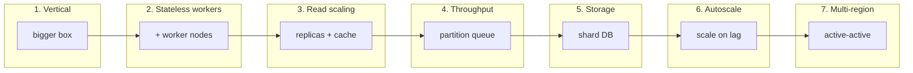
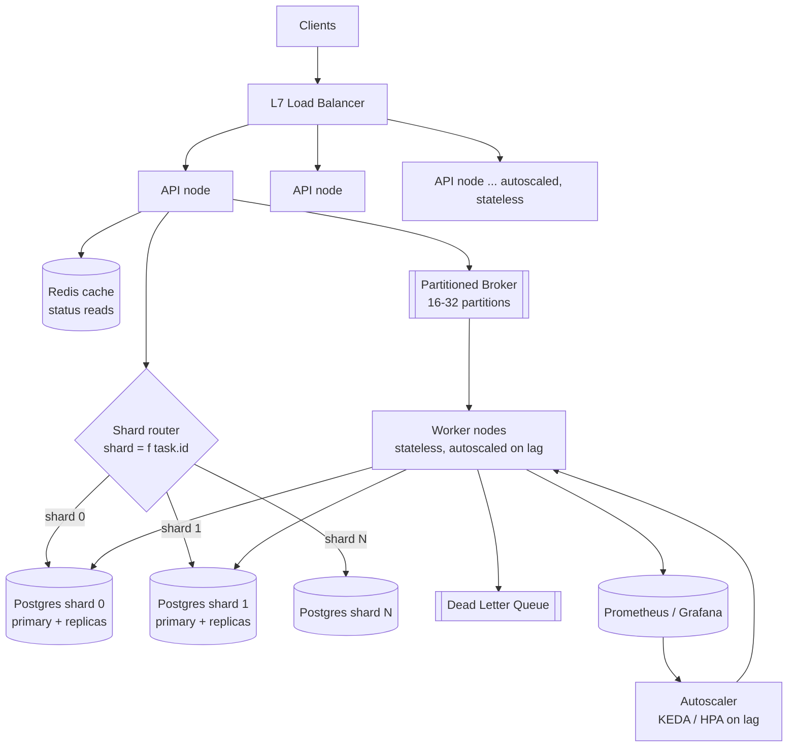
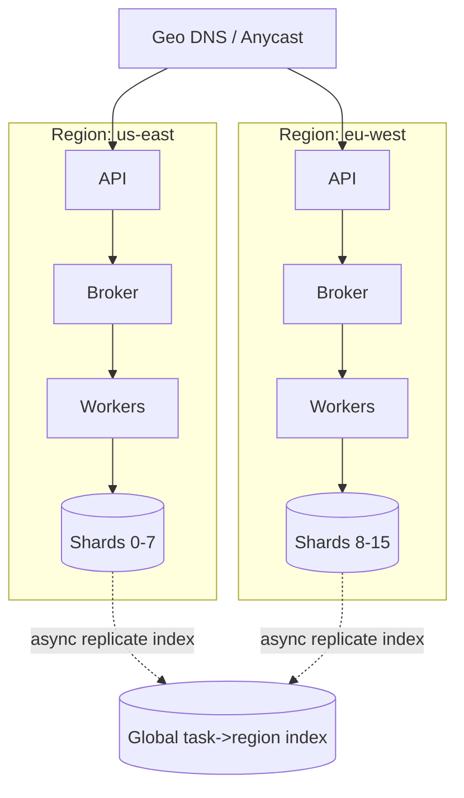
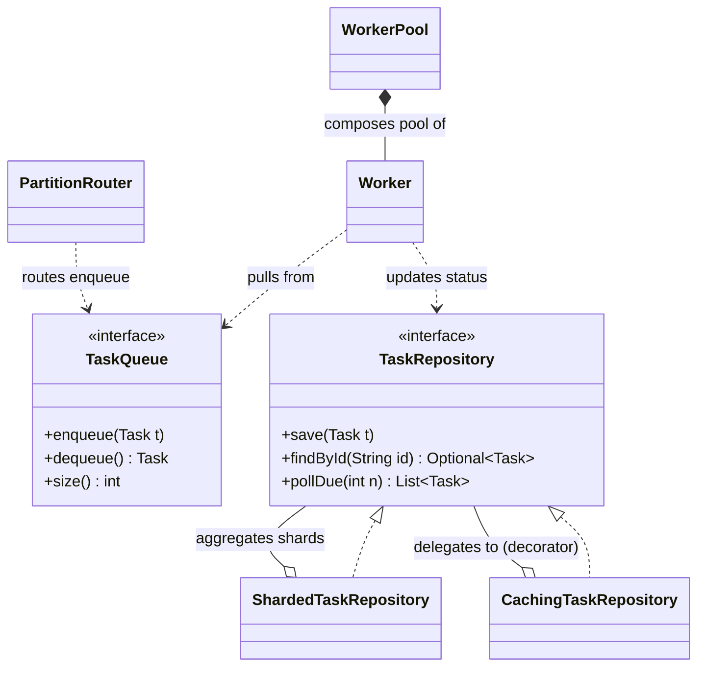

# Scaling the Platform

> Where this fits in the project: we have a working Task Queue. Phase 1 ran it in one JVM, Phase 2 put it behind a REST API on PostgreSQL, Phase 3 added rate limiting / DLQ / metrics, and Phase 4 swapped in a real broker. This chapter is the *bridge from one node to many*: how to take that single-box design and push it to thousands of tasks/second, billions of stored tasks, and multi-region availability — **and what each step costs you in money, latency, and complexity.** Scaling is not a switch you flip; it is a sequence of deliberate trades, each unlocked only when a specific bottleneck is actually measured.

---

## 1. Why this exists — the real problem

A single node has a ceiling on three independent axes, and they fill up at different times:

| Axis | What runs out | Symptom you'll see first |
|------|---------------|--------------------------|
| **Compute (workers)** | CPU / threads to execute `TaskHandler.handle` | Queue depth grows; p99 latency climbs; CPU pegged at 100% |
| **Throughput (queue)** | Enqueue/dequeue ops/sec the broker or DB can sustain | `enqueue` latency spikes; consumer lag grows even though workers are idle |
| **Storage (repository)** | Rows / bytes one Postgres can hold and index | Index bloat, slow `pollDue`, vacuum can't keep up, disk fills |

The cardinal rule of scaling: **scale the axis that is actually saturated, and only that axis.** Teams burn quarters sharding a database that was never the bottleneck while the real problem was a single-threaded JSON parser. So every section below starts with "how do you know this is the wall," then "how you move it," then "what it costs."

> **The scaling ladder.** Each rung is cheap until you need the next. Climb only when forced.
>
> 1. **Vertical scale** — bigger box. Free engineering, linear cost, hard ceiling, single blast radius.
> 2. **Stateless horizontal scale of workers** — add worker nodes behind a shared queue. Easy *if* workers hold no state.
> 3. **Read scaling** — replicas + cache for the read path (`GET /tasks/{id}`).
> 4. **Write/throughput scaling** — partition the queue (more broker partitions / shards).
> 5. **Storage scaling** — shard the database by task id.
> 6. **Autoscaling** — make rungs 2 and 4 elastic, driven by lag/queue depth.
> 7. **Multi-region** — survive a region loss; serve users closer; the most expensive rung.



---

## 2. Requirements (functional and non-functional)

We pin the requirements first, because "scale" is meaningless without a target.

**Functional**
- `POST /tasks` accepts a task, persists it durably, returns its `id`. Submission must not be lost.
- `GET /tasks/{id}` returns current `TaskStatus` and attempt count.
- Tasks are executed **at-least-once**; handlers must be idempotent (see [`../08-distributed-systems/idempotency.md`](../08-distributed-systems/idempotency.md)).
- Retries with backoff; exhausted tasks go to a DLQ (see [`../07-queues-and-messaging/dead-letter-queues.md`](../07-queues-and-messaging/dead-letter-queues.md)).
- Per-key ordering where requested (tasks sharing a key run in submission order).
- Priority and scheduled execution honored.

**Non-functional (the SLOs we will scale to)**
- **Throughput:** sustain 50,000 task submissions/sec at peak, 10,000 average.
- **Latency:** `POST /tasks` p99 < 50 ms (durable ack). End-to-end task start latency p99 < 2 s under normal load.
- **Durability:** no acknowledged task ever lost. RPO ≈ 0 within a region.
- **Availability:** 99.95% for submission API (≈ 4.4 h/yr down). Workers can lag without violating availability.
- **Elasticity:** absorb a 5× burst within 2 minutes without dropping work (queue absorbs the shock).
- **Cost:** scale should be *roughly linear* in tasks/sec; sub-linear is a win, super-linear is a design smell.

> Note the asymmetry: the **write/submission path must be highly available and low-latency**; the **processing path is allowed to lag**. This asymmetry is the single most important lever in the whole design — it lets the queue act as a shock absorber so we can scale producers and consumers independently.

---

## 3. Capacity and back-of-envelope estimates

Do these on a whiteboard in 3 minutes; they decide your architecture. (Full method in [`capacity-estimation.md`](capacity-estimation.md).)

**Throughput → partition count.**
A single Kafka/broker partition realistically sustains ~10 MB/s or ~10k small msgs/s for one consumer. Target 50k/s peak with headroom 2× → 100k/s ÷ 10k per partition = **≥ 10 partitions** minimum; round to **16–32** for rebalance headroom and future growth. With ~1 KB payloads, 50k/s = **50 MB/s** ingest — trivial network, but meaningful for the broker's disk.

**Storage → shard count.**
Assume avg row ≈ 1 KB (payload + metadata + indexes ≈ 2–3 KB on disk). At 10k/s average, that's 864M rows/day. If we retain terminal tasks 7 days: ~6B rows, ~15 TB on disk. One Postgres comfortably handles a few TB before `pollDue` and vacuum hurt → **≥ 8 shards** of ~2 TB each; pick **16** for headroom and clean power-of-two rebalancing.

**Compute → worker count.**
If a handler averages 20 ms CPU-light work, one worker thread does 50 tasks/s. With virtual threads (Project Loom) the limit is downstream I/O, not threads, but assume effective 50/s/worker for IO-bound handlers blocked on a DB. 50k/s ÷ 50 = **1,000 concurrent worker slots**. On 4-vCPU nodes running ~200 virtual-thread workers each (IO-bound), that's **~5 worker nodes**; provision **8–10** for headroom and rolling deploys.

**Cache.**
`GET /tasks/{id}` is read-heavy near submission time (clients poll status). If 30% of submitted tasks are polled 5× in their first minute, that's ~75k reads/s. A Redis cache with 60 s TTL on terminal/last-known status absorbs most of it; sizing 6B tasks is impossible to fully cache, but the *hot set* (recently submitted) is small — ~10k/s × 120 s window × 1 KB ≈ **1.2 GB hot set**, trivially cacheable.

> The numbers above are the *justification* for "16 partitions, 16 shards, ~10 worker nodes, a Redis cache, replicas." Never state a number in an interview without the arithmetic that produced it.

---

## 4. High-level architecture (the scaled platform)



The shape to memorize: **stateless edge (API + workers) in front of stateful, partitioned middle (broker + sharded DB), with a cache on the read path and an autoscaler driven by lag.** Everything stateless scales by adding copies; everything stateful scales by partitioning. The whole art is shrinking the stateful surface.

---

## 5. Scaling reads (the `GET /tasks/{id}` path)

The read path is the easy win and the right warm-up.

**5.1 Replicas.** Postgres streaming replication gives N read replicas per primary. Route `GET /tasks/{id}` to a replica, `POST` and worker status updates to the primary. This trades **read-your-writes consistency** for read throughput: a client that submits and *immediately* polls may hit a replica that hasn't caught up and see a 404 or stale `PENDING`. Fixes, in increasing cost:

- Read the just-written id from the **primary for a short window** (sticky-to-primary for N seconds via a per-id "write timestamp" cookie).
- Serve from **cache** on write (write-through), so the client's own submission is always visible.
- Accept eventual consistency and document that status may lag < 1 s.

**5.2 Cache.** Put Redis in front of `findById`. Status is the hot field and it's monotonic-ish, so cache it with a short TTL and update on write.

```java
public final class CachingTaskRepository implements TaskRepository {

    private final TaskRepository delegate;      // sharded Postgres behind this
    private final StringRedisTemplate cache;     // Spring Data Redis
    private static final Duration TTL = Duration.ofSeconds(60);

    public CachingTaskRepository(TaskRepository delegate, StringRedisTemplate cache) {
        this.delegate = delegate;
        this.cache = cache;
    }

    @Override
    public Optional<Task> findById(String id) {
        String cached = cache.opsForValue().get(key(id));
        if (cached != null) {
            return Optional.of(TaskJson.parse(cached));   // cache hit, no DB round trip
        }
        Optional<Task> fromDb = delegate.findById(id);
        // Cache-aside: only cache terminal/stable states longer; volatile states briefly.
        fromDb.ifPresent(t -> cache.opsForValue()
                .set(key(id), TaskJson.write(t), ttlFor(t)));
        return fromDb;
    }

    @Override
    public void save(Task t) {
        delegate.save(t);                          // write-through to DB
        cache.opsForValue().set(key(t.id()), TaskJson.write(t), ttlFor(t)); // keep cache fresh
    }

    @Override
    public List<Task> pollDue(int n) {
        return delegate.pollDue(n);                // never cache the poll-for-work scan
    }

    private static Duration ttlFor(Task t) {
        // Terminal states won't change again -> cache longer; running states change soon -> short TTL.
        return switch (t.status()) {
            case SUCCEEDED, FAILED, DEAD -> Duration.ofMinutes(10);
            default -> TTL;
        };
    }

    private static String key(String id) { return "task:" + id; }
}
```

> Pitfall: **never cache `pollDue`.** It is a write-side operation (claim work). Caching it duplicates work across workers. The cache is for the *idempotent read of a single task's status* only.

**Cost of read scaling:** replication lag (consistency), cache invalidation bugs (the "two hard problems"), and replica fan-out cost. It's the cheapest rung — do it first.

---

## 6. Scaling writes and throughput (partition the queue)

Reads are easy because they don't mutate. Writes are the hard half. Two distinct write paths exist and must be scaled separately.

**6.1 Submission writes** hit the durable store and the broker. Scale by **partitioning the broker**: each partition is an independent, ordered log consumed by one worker at a time. More partitions = more parallel consumers = more throughput. The partition key decides ordering and balance.

```java
// Partition selection: same key -> same partition -> per-key order preserved.
// Null/absent key -> spread by id hash for max parallelism.
public final class PartitionRouter {

    private final int partitions;   // e.g. 16

    public PartitionRouter(int partitions) { this.partitions = partitions; }

    public int partitionFor(Task task) {
        String key = orderingKey(task);                  // type or an explicit key in payload
        int h = (key != null) ? key.hashCode() : task.id().hashCode();
        return Math.floorMod(h, partitions);             // floorMod: never negative
    }

    private static String orderingKey(Task task) {
        // Tasks that must run in order share a key; independent tasks don't, so they fan out.
        return ORDERED_TYPES.contains(task.type()) ? task.type() : null;
    }

    private static final Set<String> ORDERED_TYPES = Set.of("account-ledger", "email-sequence");
}
```

**Push vs pull.** Two ways workers get work:

| | **Pull** (workers poll the queue) | **Push** (broker dispatches to workers) |
|---|---|---|
| Backpressure | Natural — slow worker just polls less | Needs explicit flow control or you overload workers |
| Load balance | Self-balancing; fast workers pull more | Broker must track worker capacity |
| Latency | Adds a poll interval | Lower, broker pushes immediately |
| Our choice | **Pull** for the DB-backed `pollDue` path (simple, self-throttling) and broker consumer groups (which are pull under the hood) | — |

Our `Worker` pulls via `TaskQueue.dequeue()` / `TaskRepository.pollDue(n)`. Pull is why backpressure is free here (see [`../08-distributed-systems/backpressure.md`](../08-distributed-systems/backpressure.md)).

**6.2 The `pollDue` thundering herd.** With many workers polling one DB shard, naive `SELECT ... WHERE status='PENDING' AND scheduledAt<=now()` makes every worker grab the same rows and collide. The production fix is `FOR UPDATE SKIP LOCKED`:

```sql
-- Each worker claims a disjoint batch atomically; SKIP LOCKED avoids lock waits.
UPDATE tasks
SET status = 'RUNNING', attempts = attempts + 1
WHERE id IN (
  SELECT id FROM tasks
  WHERE status = 'PENDING' AND scheduled_at <= now()
  ORDER BY priority DESC, scheduled_at ASC
  FOR UPDATE SKIP LOCKED
  LIMIT 100          -- batch size = n in pollDue(int n)
)
RETURNING *;
```

`SKIP LOCKED` turns the queue table into a contention-free work-distribution primitive: each poller gets its own 100 rows, no two workers fight. This is *the* trick that lets Postgres-as-a-queue scale to dozens of workers per shard before you need a real broker.

**Cost of throughput scaling:** more partitions = more open files, more rebalance churn, **lower per-key parallelism** (a hot key still pins to one partition). You cannot reduce partition count online in Kafka without pain, so over-provision modestly. Per-key ordering and parallelism are in direct tension — see [`../08-distributed-systems/message-ordering.md`](../08-distributed-systems/message-ordering.md).

---

## 7. Sharding the database

When one Postgres can't hold the rows (rung 5), shard `TaskRepository` by `task.id`. The router picks a shard; queries that have the id are local; queries that don't (cross-shard scans) become fan-out/scatter-gather.

```java
public final class ShardedTaskRepository implements TaskRepository {

    private final List<TaskRepository> shards;     // one per physical Postgres
    private final int shardCount;

    public ShardedTaskRepository(List<TaskRepository> shards) {
        this.shards = List.copyOf(shards);
        this.shardCount = shards.size();
    }

    private TaskRepository shardFor(String id) {
        // Hash the id, not a sequential counter, so load spreads evenly and stays stable.
        return shards.get(Math.floorMod(id.hashCode(), shardCount));
    }

    @Override public void save(Task t)            { shardFor(t.id()).save(t); }
    @Override public Optional<Task> findById(String id) { return shardFor(id).findById(id); }

    @Override
    public List<Task> pollDue(int n) {
        // No global id -> must scatter-gather across all shards, then merge by priority.
        // Spread the budget so we don't starve some shards.
        int per = Math.max(1, n / shardCount);
        return shards.parallelStream()
                .flatMap(s -> s.pollDue(per).stream())
                .sorted(Comparator.comparingInt(Task::priority).reversed()
                        .thenComparing(Task::scheduledAt))
                .limit(n)
                .toList();
    }
}
```

The cost is written into that code: `findById` is a clean single-shard hit, but `pollDue` (which has no id to route on) became a **scatter-gather** — it now touches every shard. This is the universal sharding tax: **queries on the shard key are cheap; queries on anything else fan out.** Choose the shard key to make your hottest query local. We shard by id because `findById` is on the hot path; we pay the fan-out on `pollDue`, which is amortized over a batch of 100.

**Rebalancing.** Plain `hash % N` reshuffles almost every key when N changes. Use **consistent hashing** or **fixed virtual buckets** (e.g. 1024 logical buckets mapped to physical shards) so adding a shard moves only `1/N` of the data. Full treatment in [`../08-distributed-systems/sharding.md`](../08-distributed-systems/sharding.md).

> Avoid cross-shard transactions. If a task and its child tasks must be atomic, **co-locate them on the same shard** by deriving children's ids from the parent (or carry a shard hint). Distributed transactions (2PC) kill throughput; design them out.

---

## 8. Stateless workers (the precondition for everything)

Horizontal scaling of workers is trivial *if and only if* a worker holds no state that another worker needs. A stateless `Worker` can be killed mid-task and another picks up the work because the **state lives in the task row**, not the worker's heap.

```java
public final class Worker implements Runnable {

    private final TaskQueue queue;
    private final Map<String, TaskHandler> handlers;   // type -> handler, looked up per task
    private final RetryPolicy retryPolicy;
    private final DeadLetterQueue dlq;
    private final MetricsCollector metrics;
    private volatile boolean running = true;

    public Worker(TaskQueue queue, Map<String, TaskHandler> handlers,
                  RetryPolicy retryPolicy, DeadLetterQueue dlq, MetricsCollector metrics) {
        this.queue = queue;
        this.handlers = handlers;
        this.retryPolicy = retryPolicy;
        this.dlq = dlq;
        this.metrics = metrics;
    }

    @Override
    public void run() {
        while (running) {
            try {
                Task task = queue.dequeue();                 // blocks until work; pull model
                TaskHandler handler = handlers.get(task.type());
                if (handler == null) { dlq.send(task, "no handler for type " + task.type()); continue; }

                var timer = metrics.startTimer("task.handle");
                try {
                    TaskResult result = handler.handle(task); // ALL state read from `task`, none from `this`
                    if (result.success()) {
                        metrics.increment("task.succeeded");
                    } else if (result.retryable() && task.attempts() < task.maxAttempts()) {
                        scheduleRetry(task);
                    } else {
                        dlq.send(task, result.message());
                    }
                } catch (Exception e) {
                    if (task.attempts() < task.maxAttempts()) scheduleRetry(task);
                    else dlq.send(task, "exhausted: " + e.getMessage());
                } finally {
                    timer.stop();
                }
            } catch (InterruptedException e) {
                Thread.currentThread().interrupt();
                running = false;                               // graceful shutdown on drain
            }
        }
    }

    private void scheduleRetry(Task task) {
        retryPolicy.nextDelay(task.attempts()).ifPresentOrElse(
            delay -> queue.enqueue(task.withStatus(TaskStatus.RETRYING).reschedule(delay)),
            ()    -> dlq.send(task, "retry policy exhausted"));
    }
}
```

Three rules make a worker scale-out-safe:

1. **No instance fields hold task state.** Everything comes from the `Task` argument. (`handlers`, `retryPolicy` are *configuration*, shared and immutable — that's fine.)
2. **At-least-once + idempotent handlers.** A worker may die after doing the work but before marking `SUCCEEDED`; another worker reruns it. The handler must be idempotent (dedup by `task.id()`).
3. **Lease / visibility timeout.** When a worker claims a task it gets a lease; if it dies, the lease expires and the task becomes claimable again. With Postgres-as-queue this is a `RUNNING` row with a `locked_until` timestamp that a reaper resets.

```java
// Reaper: requeue tasks whose worker died (lease expired). Runs on a schedule on every node.
public void reclaimStuckTasks() {
    String sql = """
        UPDATE tasks SET status = 'PENDING', locked_until = NULL
        WHERE status = 'RUNNING' AND locked_until < now()
        """;
    jdbc.update(sql);   // crashed-worker tasks return to the pool; idempotency makes re-run safe
}
```

> If you can make workers stateless, scaling them is `replicas: N` in a Deployment. If you can't, you've pushed state into the worker and lost horizontal scaling. The entire `Task` record exists so state lives in the data, not the process.

---

## 9. Autoscaling on lag or queue depth (not CPU)

The classic mistake: autoscale workers on **CPU**. For an IO-bound task queue, workers blocked on a downstream DB sit at 10% CPU while consumer lag explodes — CPU-based scaling never fires and the backlog grows unbounded. **Scale on the work signal: consumer lag or queue depth.**

The right metric is **lag in seconds**, i.e. `queue_depth / drain_rate`, or the broker's native consumer-group lag. Targets:

- **Scale up** when lag > 30 s sustained for 1 min.
- **Scale down** when lag ≈ 0 and CPU < 30% for 5 min (slow down to avoid flapping).

```java
// MetricsCollector exposes the gauges the autoscaler reads. Backed by Micrometer/Prometheus.
public final class QueueDepthGauge {

    public QueueDepthGauge(MeterRegistry registry, TaskQueue queue, WorkerPool pool) {
        // queue.size() and effective drain rate -> the autoscaler scales on these, never on CPU.
        registry.gauge("taskqueue.depth", queue, TaskQueue::size);
        registry.gauge("taskqueue.lag.seconds", List.of(),
            ignored -> estimateLagSeconds(queue.size(), pool.drainRatePerSecond()));
    }

    private static double estimateLagSeconds(int depth, double drainRate) {
        return drainRate <= 0 ? Double.MAX_VALUE : depth / drainRate;   // how far behind we are
    }
}
```

In Kubernetes, **KEDA** scales a worker Deployment directly from a Kafka/Redis/Postgres lag metric:

```yaml
apiVersion: keda.sh/v1alpha1
kind: ScaledObject
metadata:
  name: worker-pool-scaler
spec:
  scaleTargetRef:
    name: task-worker          # the worker Deployment (stateless pods)
  minReplicaCount: 4           # always-on baseline for steady traffic
  maxReplicaCount: 200         # ceiling = partition count or DB connection budget
  cooldownPeriod: 120          # don't scale down for 2 min -> avoid flapping
  triggers:
    - type: kafka
      metadata:
        topic: tasks
        consumerGroup: workers
        lagThreshold: "1000"   # add a pod per ~1000 msgs of lag
```

> **maxReplicaCount has two hard ceilings:** (1) you can't have more useful consumers than partitions — extra workers idle; (2) you can't exceed the DB's connection budget (use PgBouncer). Set the ceiling from whichever is smaller. Scaling workers past the partition count or connection pool buys nothing and can *reduce* throughput via thrashing.

**Cost of autoscaling:** cold-start latency (pods take seconds to schedule + warm JVM — keep a warm baseline `minReplicaCount`), flapping (cooldowns and hysteresis), and the operational complexity of a metrics pipeline that is now on the critical path of *scaling itself*. If Prometheus is down, KEDA can't scale. Make the lag metric path resilient.

---

## 10. Multi-region

The most expensive rung. You take it for two reasons only: **survive a full region outage** (availability/DR), or **serve users with lower latency** (geo-proximity). Both force you to confront the speed of light: cross-region round-trips are 30–150 ms, so synchronous cross-region writes are off the table for a low-latency `POST`.

Three patterns, increasing cost and complexity:

| Pattern | Write availability on region loss | Consistency | Use when |
|---|---|---|---|
| **Active-passive (warm standby)** | Promote standby (minutes, RPO≈replication lag) | Strong within region; async replicate cross-region | DR is the goal, single-region latency acceptable |
| **Active-active, partitioned by region** | Each region owns its shards; lose a region = lose its writes until failover | Strong per-shard, no cross-region write conflicts | Geo-locality + regional ownership of tasks |
| **Active-active, global (multi-master)** | Always available | Eventual; conflict resolution needed | Truly global, willing to pay for conflict handling |

For a task queue, **active-active partitioned by region** is usually the sweet spot: route a task to the region nearest the submitter, that region owns the task end-to-end (its own broker, its own DB shards, its own workers). No cross-region task hand-off on the hot path. A global async-replicated index lets `GET /tasks/{id}` find which region owns a task.



**The hard parts of multi-region** (be honest about these in an interview):
- **No global ordering** across regions — only per-region, per-key ordering. Don't promise global FIFO.
- **Exactly-once is even harder** — at-least-once + idempotency is the only sane contract.
- **Failover is rare and therefore untested** — run game days. The standby you never failover to is a standby that doesn't work.
- **Data residency / GDPR** — a task's payload may be legally pinned to a region; routing must respect it.
- **Cost roughly doubles** — duplicate infra, cross-region egress (expensive), and engineering time.

Relevant theory: which of consistency/availability you keep under a partition is a CAP choice (see [`../08-distributed-systems/cap-theorem.md`](../08-distributed-systems/cap-theorem.md)); for a queue we lean **AP on the read/index path, CP per-shard on the write path.**

---

## 11. The data model under scale

The schema barely changes from Phase 2; what changes is the *indexes and the columns that make sharding and leasing work*.

```sql
CREATE TABLE tasks (
    id            UUID PRIMARY KEY,            -- shard key; high-entropy -> even spread
    type          TEXT        NOT NULL,
    payload       JSONB       NOT NULL,
    status        TEXT        NOT NULL,        -- PENDING/SCHEDULED/RUNNING/SUCCEEDED/FAILED/RETRYING/DEAD
    attempts      INT         NOT NULL DEFAULT 0,
    max_attempts  INT         NOT NULL DEFAULT 5,
    priority      INT         NOT NULL DEFAULT 0,
    created_at    TIMESTAMPTZ NOT NULL DEFAULT now(),
    scheduled_at  TIMESTAMPTZ NOT NULL DEFAULT now(),
    locked_until  TIMESTAMPTZ,                 -- lease: NULL unless RUNNING; reaper resets expired
    ordering_key  TEXT                          -- co-locates ordered tasks on one partition
);

-- The poll-for-work index: this single index must serve pollDue efficiently per shard.
CREATE INDEX idx_tasks_due ON tasks (status, scheduled_at, priority DESC)
    WHERE status IN ('PENDING', 'SCHEDULED', 'RETRYING');   -- partial index = small & hot

-- Reaper index for expired leases.
CREATE INDEX idx_tasks_lease ON tasks (locked_until) WHERE status = 'RUNNING';
```

Design notes that matter at scale:
- **High-entropy id (UUIDv4/v7) as shard key** spreads load. A sequential id would hot-spot one shard.
- **Partial indexes** keep the hot index tiny: terminal tasks (the vast majority over time) aren't in `idx_tasks_due`, so the work-poll index stays small even with billions of rows.
- **Partition the table by `created_at`** (Postgres declarative partitioning) so you can **drop old partitions** instead of `DELETE`ing billions of terminal rows — retention becomes a metadata operation. See [`data-modeling-and-storage.md`](data-modeling-and-storage.md).

---

## 12. Bottlenecks and how to scale each

| Bottleneck | How you detect it | Fix | What it costs |
|---|---|---|---|
| Worker CPU saturated | CPU 100%, lag rising | Add worker nodes (rung 2) | Linear $; needs stateless workers |
| Single broker partition maxed | One consumer pinned, lag on one partition | More partitions; better key distribution | Lower per-key parallelism; can't shrink easily |
| `pollDue` contention | Lock waits, workers grabbing same rows | `FOR UPDATE SKIP LOCKED`, batch claims | None — pure win |
| DB write IOPS / WAL | `enqueue`/`save` latency up, disk busy | Shard the DB (rung 5) | Scatter-gather queries, no cross-shard txns |
| DB connections exhausted | "too many connections" | PgBouncer pooling; cap worker replicas | Pooler is a new dependency / SPOF |
| Read path overloads primary | Replica lag, primary CPU on reads | Read replicas + cache (rung 3) | Stale reads, cache invalidation |
| Status-poll storm | Redis/DB read QPS spikes near submit | Cache with TTL; long-poll/webhook instead of poll | Cache memory; webhook delivery infra |
| Hot key / hot shard | One partition/shard far busier | Add a sub-key (key + bucket); split the hot tenant | Breaks strict per-key order for that key |
| Autoscaler can't keep up | Lag grows faster than pods start | Warm baseline; pre-scale on schedule for known peaks | Idle capacity $ |
| Cross-region latency | p99 on `POST` from far region | Regional ownership, geo-route | Doubled infra, eventual consistency |

The meta-pattern: **stateless tiers scale by replication; stateful tiers scale by partitioning; the read path scales by replicas+cache; the elastic tiers scale on lag.** Memorize that sentence.

---

## 13. Failure modes at scale

- **Retry storm / thundering herd.** A downstream dependency hiccups; thousands of tasks fail and retry simultaneously, hammering it back down. Fix: exponential backoff **with jitter** (`ExponentialBackoffRetryPolicy`), circuit breakers (see [`../08-distributed-systems/circuit-breakers.md`](../08-distributed-systems/circuit-breakers.md)), and a DLQ ceiling.
- **Poison pill.** One malformed task crashes a worker, the task is requeued (at-least-once), crashes the next worker — an infinite crash loop that can take down the whole pool. Fix: cap attempts, catch broadly, route to DLQ; isolate handler crashes from the worker loop.
- **Cache stampede.** A hot task's cache entry expires and N concurrent reads all miss and hit the DB at once. Fix: request coalescing / single-flight, or jittered TTLs.
- **Replication-lag 404.** Submit then immediately poll → replica hasn't caught up → 404. Fix: read-your-writes via cache or sticky-primary window (§5).
- **Autoscaler death spiral.** Scale-down during a brief lull → lag returns → cold-start lag → scale up → repeat. Fix: hysteresis (long scale-down cooldown), warm baseline.
- **Partition skew after rebalance.** Adding a partition without rehashing keys leaves old keys stuck and new ones spread → uneven load. Fix: consistent hashing / virtual buckets.
- **Split brain on failover.** Two regions both think they own a shard. Fix: a single source of truth for ownership (leader election / a fencing token — see [`../08-distributed-systems/leader-election.md`](../08-distributed-systems/leader-election.md)).

---

## 14. Tradeoffs (the honest table)

| Decision | Option A | Option B | We choose | Why |
|---|---|---|---|---|
| Delivery | exactly-once | at-least-once + idempotent | **B** | Exactly-once is a myth across failures; idempotency is cheap and robust |
| Work distribution | push | pull | **Pull** | Free backpressure, self-balancing |
| Consistency on reads | strong (primary) | eventual (replica+cache) | **Eventual w/ read-your-writes escape hatch** | Read throughput dominates; correctness preserved for the submitter |
| DB scaling | vertical forever | shard by id | **Shard when storage forces it** | Don't pay sharding tax before you must |
| Ordering | global FIFO | per-key order | **Per-key** | Global FIFO doesn't scale; per-key satisfies real requirements |
| Autoscale signal | CPU | lag / queue depth | **Lag** | IO-bound workers idle on CPU while lag grows |
| Region topology | active-passive | active-active partitioned | **Depends on goal** | DR → passive; latency+ownership → active-active |

> The recurring theme: **every scaling step trades a guarantee (consistency, ordering, atomicity) or money for throughput/availability.** State the guarantee you're giving up, out loud, every time.

---

## 15. Common mistakes and pitfalls

- **Sharding before measuring.** Teams shard a DB doing 500 writes/s. Measure first; vertical + replicas + cache often buys years.
- **Stateful workers.** Caching task state in the worker heap silently breaks horizontal scaling and at-least-once recovery. Keep state in the `Task` row.
- **Autoscaling on CPU for IO-bound work.** The single most common autoscaling bug. Scale on lag.
- **`hash % N` for shards.** Reshuffles everything on resize. Use consistent hashing / virtual buckets.
- **Caching the work-poll.** `pollDue` is a claim, not a read; caching it double-processes tasks.
- **Promising exactly-once.** You can't deliver it across crashes; promise at-least-once + idempotency.
- **No lease / visibility timeout.** A crashed worker's in-flight tasks are lost forever. Add `locked_until` + a reaper.
- **Unbounded retries.** No `maxAttempts` cap → poison pills and retry storms. Cap and DLQ.
- **Ignoring connection limits.** Scaling workers to 500 pods × 10 connections = 5,000 DB connections = dead Postgres. Pool with PgBouncer; cap replicas.
- **One partition for an ordered type.** Forcing global order pins everything to one partition and kills throughput. Order per key, not per topic.

---

## 16. How this applies to our Task Queue project

Direct mapping from the canonical model to each scaling rung:

- **`TaskQueue`** → `InMemoryTaskQueue` (Phase 1) → `PostgresTaskQueue` with `SKIP LOCKED` (Phase 2) → partitioned broker (Phase 4). The *interface stays identical* (`enqueue`/`dequeue`/`size`), so workers don't change as we scale the implementation — that's the payoff of programming to the interface.
- **`Worker`** is already stateless by design (state in `Task`). Scaling = run more `Worker` instances across nodes; `WorkerPool.start()` on each node.
- **`WorkerPool`** maps to one autoscaled Deployment; KEDA sets its replica count from lag.
- **`TaskRepository`** → `ShardedTaskRepository` (fan-out `pollDue`, local `findById`) → `CachingTaskRepository` wrapping it on the read path.
- **`RetryPolicy`** (`ExponentialBackoffRetryPolicy` with jitter) prevents retry storms — the §13 failure mode.
- **`DeadLetterQueue`** is the backstop for poison pills and exhausted retries.
- **`RateLimiter`** (`TokenBucketRateLimiter`) protects downstreams as worker count grows — more workers must not mean more pressure on a fragile dependency.
- **`MetricsCollector` / Micrometer** emits the lag/queue-depth gauges the autoscaler consumes; closing the loop from observation → scaling.



---

## 17. How to present this in an interview

A 35-minute "scale the task queue" interview, in order:

1. **Clarify requirements (2 min).** Throughput target, latency SLO, durability, per-key ordering, multi-region? Pin down the write/read asymmetry. State your assumptions out loud.
2. **Back-of-envelope (3 min).** Derive partitions, shards, worker count, cache size from the target (§3). Numbers must come from arithmetic.
3. **Draw the single-node version, then scale it (5 min).** Start simple (API → queue → workers → DB). *Then* add LB, replicas, cache, partitions, shards — one rung at a time, saying what each unlocks.
4. **Name the bottleneck for each rung (10 min).** "Workers saturate → add nodes (they're stateless). Throughput caps → partition the broker. Storage caps → shard the DB by id; `findById` stays local, `pollDue` fans out." This is the meat — show you scale the *measured* bottleneck.
5. **Autoscaling (4 min).** Emphasize **lag, not CPU.** Mention KEDA/HPA, warm baseline, partition/connection ceilings.
6. **Failure modes (5 min).** Retry storm + jitter, poison pill → DLQ, replication-lag 404 → read-your-writes, lease/reaper for crashed workers.
7. **Multi-region (3 min) only if asked or time allows.** Active-active partitioned by region; no global ordering; at-least-once.
8. **Tradeoffs throughout (3 min).** Every step: "this buys X, costs Y." Interviewers score the *tradeoff articulation* more than the boxes.

> The signal senior interviewers look for: you **don't over-engineer**. Start at rung 1, climb only when you name the bottleneck that forces the next rung. Jumping straight to "global multi-master sharded everything" is a junior tell.

---

## 18. Exercises

### Easy
- **E1 (knowledge check).** Why is autoscaling worker pods on CPU usually wrong for an IO-bound task queue, and what should you scale on instead?
- **E2 (knowledge check).** What two properties must hold for a `Worker` to be horizontally scalable, and how does the canonical `Task` record enable them?
- **E3 (coding).** Implement `partitionFor(Task)` so tasks sharing an `ordering_key` land on the same partition while keyless tasks spread evenly. Use `Math.floorMod`. Explain why `%` alone is wrong.

### Medium
- **M1 (refactoring).** Given a `pollDue` that does `SELECT ... WHERE status='PENDING' LIMIT n` (no locking), rewrite it to be safe under many concurrent workers, and explain the bug in the original.
- **M2 (design).** Design read-your-writes for `GET /tasks/{id}` when reads go to a replica that can lag up to 1 s. Give two approaches and their tradeoffs.
- **M3 (coding).** Wrap `ShardedTaskRepository` in a write-through cache. State exactly which methods must *not* be cached and why.

### Hard
- **H1 (design / interview).** Your platform must absorb a predictable 10× spike every day at 09:00 (market open). Reactive lag-based autoscaling lags the spike by 90 s and you drop SLO. Design a scaling strategy that holds p99 < 2 s through the spike. Discuss cost.
- **H2 (design).** Go multi-region active-active. A task submitted in eu-west must be findable via `GET /tasks/{id}` from us-east within 1 s. Design the topology, the global index, and the ordering/consistency guarantees you can and cannot make.
- **H3 (stretch).** A single tenant ("acme") submits 40% of all traffic to one `ordering_key`, hot-spotting one partition and one shard. Keep per-key ordering *as much as possible* while spreading the load. Quantify what ordering guarantee you lose.

---

## 19. Solutions

**E1.** IO-bound workers spend most time blocked on the DB/broker, so CPU stays low (10–30%) while consumer lag grows unbounded — a CPU-target HPA never triggers. Scale on **consumer lag or queue depth** (`lag_seconds = depth / drain_rate`, or the broker's native group lag). KEDA reads that lag and scales the Deployment.

**E2.** (1) **Statelessness** — no task state in worker instance fields; everything read from the `Task` argument, so any worker can process any task and a killed worker loses nothing. (2) **At-least-once + idempotent handlers** — a worker may crash after doing work but before marking `SUCCEEDED`; another reruns it, so the handler must dedup on `task.id()`. The `Task` record carries `status`, `attempts`, `scheduledAt` etc., so all the state a handoff needs lives in the row, not the heap.

**E3.**
```java
public int partitionFor(Task task) {
    String key = task.orderingKey();                  // null when order doesn't matter
    int h = (key != null) ? key.hashCode() : task.id().hashCode();
    return Math.floorMod(h, partitions);              // floorMod, not %
}
```
`%` in Java can return a **negative** result for a negative `hashCode` (`-5 % 16 == -5`), which is an invalid partition index and throws/ mis-routes. `Math.floorMod` always returns `[0, partitions)`. Keyed tasks hash on the shared key → same partition → ordered; keyless tasks hash on the unique id → spread.

**M1.**
```sql
UPDATE tasks SET status='RUNNING', locked_until = now() + interval '60 seconds'
WHERE id IN (
  SELECT id FROM tasks
  WHERE status='PENDING' AND scheduled_at <= now()
  ORDER BY priority DESC, scheduled_at ASC
  FOR UPDATE SKIP LOCKED
  LIMIT 100
)
RETURNING *;
```
The original bug: with N concurrent workers, every worker's `SELECT` returns the *same* PENDING rows, so they all try to process the same tasks — duplicate work and lock contention. `FOR UPDATE SKIP LOCKED` makes each worker claim a **disjoint** batch atomically (locked rows are skipped, not waited on), and the status flip + `locked_until` lease means a crashed worker's rows are reclaimed by the reaper.

**M2.**
- *Approach A — write-through cache:* on `POST`, write the task to the cache as well as the DB. The submitter's `GET` hits the cache and always sees its own write. Tradeoff: cache must be highly available and consistent with the DB; works only for the submitter's own reads.
- *Approach B — sticky-to-primary window:* return a token/cookie with the write timestamp; for ~1 s of reads on that id, route to the primary instead of a replica. Tradeoff: adds primary read load and needs client cooperation, but gives true read-your-writes without a cache. Choose A for throughput, B when a cache isn't available. Document that *other* clients may still see ≤ 1 s stale status.

**M3.** Cache `findById` (read-through) and update on `save` (write-through). **Never cache `pollDue`** — it is a *claim/mutation*, not an idempotent read; caching it would let multiple workers process the same tasks. Cache only stable single-id reads; give terminal states a long TTL and live states a short TTL.

**H1.** Don't rely on reactive autoscaling for a *predictable* spike. **Pre-scale on a schedule:** a cron/scheduled scaling action raises `minReplicaCount` (and broker partitions if needed, though partitions are best fixed high) a few minutes *before* 09:00, then lets lag-based autoscaling fine-tune and scale back down after. Combine with a warm JVM baseline so there's no cold-start. The queue absorbs the leading edge; pre-warmed capacity drains it within SLO. Cost: you pay for idle capacity in the pre-scale window (minutes × max replicas) — cheap insurance vs. SLO breach. Reactive autoscaling is for *unpredictable* load; scheduled load deserves scheduled capacity.

**H2.** Active-active partitioned by region: geo-DNS routes the submitter to the nearest region; that region owns the task end-to-end (broker, shards, workers) so there's no cross-region hop on the hot path. Maintain a **global task→region index** (which region owns `id`), updated by async replication (CDC from each region's DB). `GET /tasks/{id}` in us-east: check local cache/index → if owned elsewhere, look up the global index → fetch from the owning region (or serve the replicated status if < 1 s staleness is acceptable). Guarantees you *can* make: per-region, per-key ordering; eventual global visibility (< 1 s typical). Guarantees you *cannot*: global FIFO ordering, exactly-once, strong cross-region read-your-writes. Contract: **at-least-once + idempotent**, eventual cross-region consistency.

**H3.** The hot `ordering_key` is the problem: strict per-key order pins it to one partition/shard. Split the key into **sub-keys/buckets**: `ordering_key = "acme:" + (subEntityId % B)` for B buckets, so acme's traffic spreads across B partitions. You keep ordering **within each sub-entity** (e.g. per-account, per-conversation) but lose **global ordering across all of acme's tasks**. As long as the real ordering requirement is per-account (almost always true) and not "all of acme in one line," this is correct and spreads the load B-fold. Quantify: ordering guarantee drops from "total order over acme" to "total order within each of B independent sub-streams"; pick B so the busiest sub-stream fits one partition.

---

## 20. Interview questions and takeaways

1. **"How do you scale a task queue from 1 node to 1000?"** Climb the ladder: vertical → stateless workers → read replicas+cache → partition the queue → shard the DB → autoscale on lag → multi-region. Name the bottleneck unlocking each rung.
2. **"Push or pull for work distribution?"** Pull — free backpressure, self-balancing; our `Worker.dequeue()` and `SKIP LOCKED` polling are pull.
3. **"At-least-once vs exactly-once?"** Exactly-once is unattainable across crashes; do at-least-once + idempotent handlers keyed on `task.id()`.
4. **"What do you autoscale on?"** Consumer lag / queue depth, not CPU, for IO-bound workers. Ceiling = min(partitions, connection budget).
5. **"How do you shard, and what breaks?"** Shard by high-entropy id via consistent hashing; `findById` stays local, non-key queries (`pollDue`) fan out; no cheap cross-shard transactions.
6. **"How do you avoid the `pollDue` thundering herd?"** `FOR UPDATE SKIP LOCKED` so each worker claims a disjoint batch.
7. **"Read-your-writes after a write to a replicated store?"** Write-through cache or sticky-primary window for the submitter.
8. **"When do you go multi-region, and what's the cost?"** Only for DR or geo-latency; cost ≈ 2× infra, no global ordering, eventual consistency, untested failover risk.

**Takeaways:** scale the *measured* bottleneck and only it; keep stateless tiers stateless so they scale by replication; partition stateful tiers; cache+replicas for reads; autoscale on lag; and every rung trades a guarantee or dollars for throughput — say which, out loud.

---

## What We Can Improve In Our Project Using This Concept

- Introduce `ShardedTaskRepository` and `CachingTaskRepository` as decorators over the existing `TaskRepository`, with no change to `Worker` — proving the interface paid off.
- Replace the naive `pollDue` SELECT with `FOR UPDATE SKIP LOCKED` and add a `locked_until` lease column plus a reaper job.
- Add a `PartitionRouter` so Phase 4's broker preserves per-key ordering while fanning out keyless tasks.
- Emit `taskqueue.depth` and `taskqueue.lag.seconds` gauges from `MetricsCollector` for autoscaling.

## Project Refactoring Task

1. Add `locked_until` and `ordering_key` columns via a Flyway migration; add the partial `idx_tasks_due` index.
2. Rewrite `PostgresTaskQueue.pollDue` / repository claim query to use `FOR UPDATE SKIP LOCKED` with a batch limit and lease.
3. Implement `ShardedTaskRepository` (fan-out `pollDue`, local `findById`) and wrap it with `CachingTaskRepository`.
4. Add a `Reaper` scheduled task that resets expired `RUNNING` leases to `PENDING`.
5. Expose lag/depth gauges and wire a KEDA `ScaledObject` for the worker Deployment.

## Git Commit For This Chapter

```text
feat(scaling): shard repository, SKIP LOCKED claims, leases, and lag-based autoscaling

- add ShardedTaskRepository (local findById, scatter-gather pollDue)
- add CachingTaskRepository write-through decorator (do not cache pollDue)
- rewrite claim query with FOR UPDATE SKIP LOCKED + locked_until lease
- add Reaper for expired leases; partial idx_tasks_due index
- emit taskqueue.depth / taskqueue.lag.seconds gauges; add KEDA ScaledObject

Files touched:
  src/main/java/.../repository/ShardedTaskRepository.java
  src/main/java/.../repository/CachingTaskRepository.java
  src/main/java/.../queue/PartitionRouter.java
  src/main/java/.../worker/Reaper.java
  src/main/java/.../metrics/QueueDepthGauge.java
  src/main/resources/db/migration/V7__lease_and_indexes.sql
  deploy/keda-worker-scaledobject.yaml
```

## Architecture Impact

The platform splits cleanly into **stateless edges** (API nodes, worker nodes — scale by replication, autoscaled on lag) and a **partitioned stateful core** (broker partitions + sharded Postgres — scale by partitioning), with a **cache + read-replica read path**. The `TaskQueue` / `TaskRepository` interfaces become seams across which we swap single-node, sharded, and cached implementations without touching `Worker`. Autoscaling closes an observe→scale control loop: `MetricsCollector` → Prometheus → KEDA → worker replicas. Multi-region (if adopted) makes a region the unit of ownership and failure isolation.

## Interview Takeaways

- Scale the axis that is actually saturated; measure before sharding.
- Stateless tiers scale by replication, stateful tiers by partitioning, reads by replicas+cache, elasticity by lag-based autoscaling.
- Pull beats push for backpressure; `SKIP LOCKED` makes a DB a contention-free queue.
- At-least-once + idempotency over exactly-once; per-key ordering over global FIFO.
- Every rung trades a guarantee (consistency/ordering/atomicity) or money for throughput/availability — articulate the trade every time. Don't over-engineer; climb only when forced.
