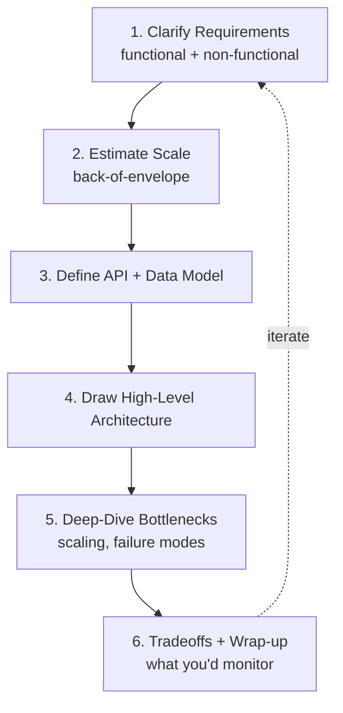
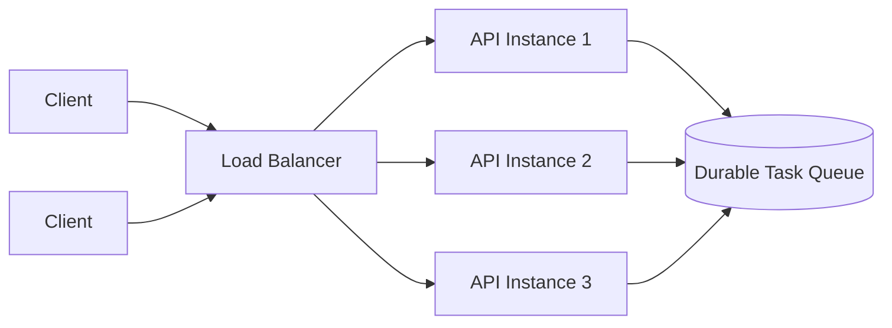
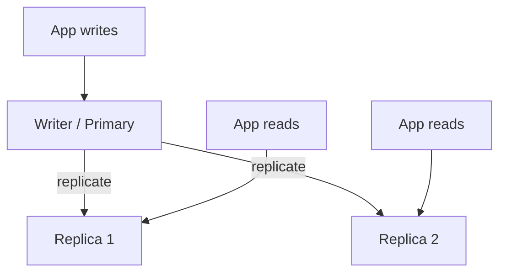
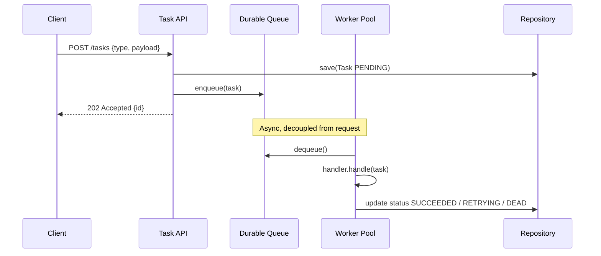
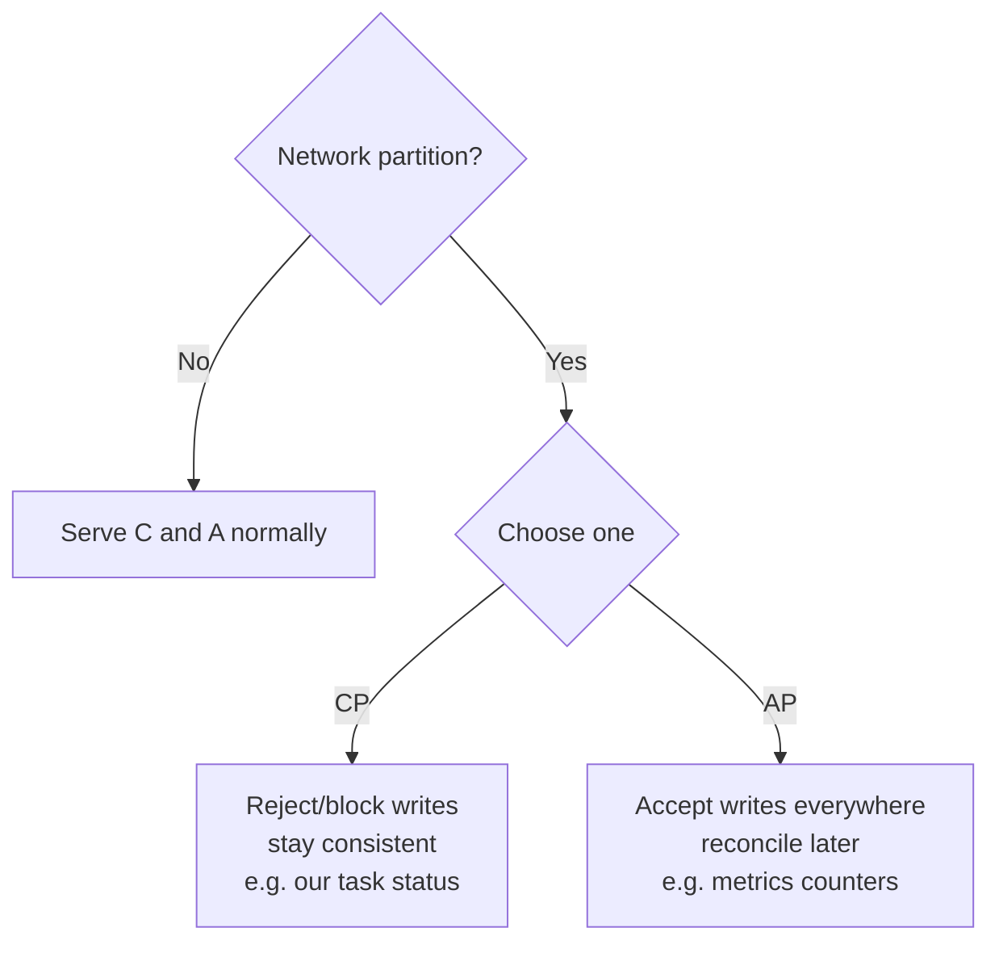
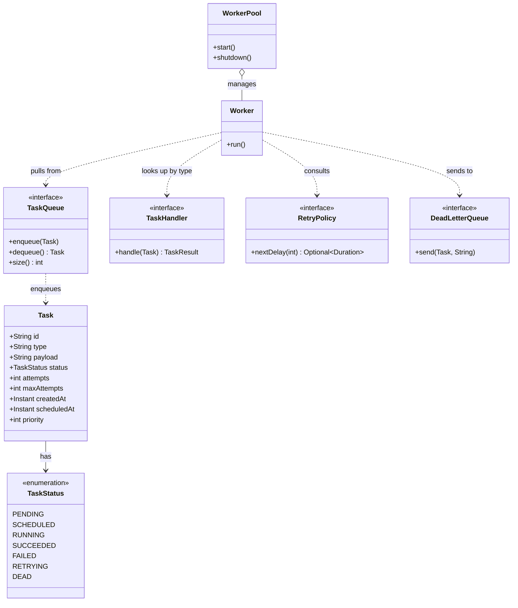

# System Design Fundamentals

> The toolkit that lets you reason about *any* backend system — and the lens we use to grow our Distributed Task Queue from a single JVM into a horizontally-scaled platform.

System design is not memorizing architectures. It is a small set of reusable tools — requirements gathering, capacity estimation, latency intuition, load balancing, caching, replication, partitioning, queues, and consistency tradeoffs — combined with a repeatable framework for applying them under pressure. This chapter teaches that toolkit and anchors every tool in our `Task` / `TaskQueue` / `WorkerPool` project so the abstractions stay concrete.

This is the foundation for the rest of `10-system-design/`. Once you internalize these primitives, [designing-a-task-queue.md](./designing-a-task-queue.md) walks the full interview, [capacity-estimation.md](./capacity-estimation.md) drills the math, [scaling-the-platform.md](./scaling-the-platform.md) pushes it to millions of tasks/sec, and [case-studies.md](./case-studies.md) dissects real systems.

---

## 1. Why This Exists — The Real Problem

A coding interview asks: *can you implement this correctly?* A system design interview asks: *can you make reasonable engineering decisions when nothing has a single right answer?* In production the second skill matters more. A wrong line of code throws an exception you can fix in minutes. A wrong architectural decision — choosing strong consistency where you needed availability, sharding on the wrong key, putting a synchronous call on the hot path — costs months and sometimes an outage.

The historical reason this discipline exists: in the early web, a single application server with a single database handled everything. As traffic crossed what one machine could serve (roughly the mid-2000s for large sites), engineers were forced to *spread state and work across machines*. Every tool below — load balancers, caches, replicas, shards, queues — is a specific answer to "one machine is not enough, and machines fail." System design is the art of composing these answers without creating a system nobody can operate.

> **Mental model:** A backend is a pipeline that moves *requests* and *data* between *compute* and *storage* under *constraints* (latency, throughput, cost, consistency, availability). Every design decision trades one constraint against another. There are no free wins; there are only tradeoffs you chose deliberately versus ones that ambushed you in production.

For our project, the problem statement is: **accept tasks via an API, never lose them, execute them asynchronously, retry the ones that fail, and keep doing this as load grows from 10 tasks/sec to 1,000,000 tasks/sec.** Every fundamental in this chapter is a building block of that answer.

---

## 2. The Repeatable Interview & Design Framework

Before the tools, you need the *order* in which to apply them. Improvising leads to designs that miss the actual requirement. Use this six-step framework — it works in a 45-minute interview and on a real design doc.



1. **Clarify requirements.** Never start drawing boxes. Ask what the system must *do* (functional) and how *well* (non-functional: scale, latency, availability, consistency, durability). Write them down.
2. **Estimate scale.** Convert requirements into numbers: QPS, storage, bandwidth. The numbers decide the architecture. A system at 100 QPS and one at 1M QPS are different systems.
3. **Define the API and data model.** Concrete contracts force clarity. The data model exposes access patterns, which drive your storage and partitioning choices.
4. **Draw the high-level architecture.** Client → load balancer → service → cache → datastore → queue → workers. Keep it to ~6-8 boxes first.
5. **Deep-dive the bottleneck.** Pick the component that breaks first at your estimated scale and scale it. Discuss failure modes for that component.
6. **State tradeoffs and operations.** What did you trade away? What would you monitor and alert on? Where would it break next?

> **Time budget (45-min interview):** 5 min requirements, 5 min estimation, 5 min API/data, 10 min architecture, 15 min deep-dive, 5 min wrap-up. Spending 20 minutes drawing boxes before clarifying requirements is the most common failure.

---

## 3. Tool #1 — Requirements Gathering

Requirements split into **functional** (what it does) and **non-functional** (the qualities). Non-functional requirements are what actually drive architecture, yet candidates skip them. Make them explicit and *quantified*.

### Functional requirements for our Task Queue

- Submit a task: `POST /tasks` with a `type` and a JSON `payload`; returns a task `id`.
- Query a task: `GET /tasks/{id}` returns its current `TaskStatus`.
- Tasks are executed asynchronously by workers, by `type`, via a registered `TaskHandler`.
- Failed tasks retry per a `RetryPolicy`; permanently-failed tasks go to a Dead Letter Queue.
- Support scheduled/delayed tasks (`scheduledAt`) and priorities (`priority`).

### Non-functional requirements (the ones that matter)

| Quality | Question to ask | Our target (example) |
|---|---|---|
| Scale / throughput | How many tasks per second? | 10k submit/sec, 50k execute/sec peak |
| Latency | How fast must submit return? | `POST /tasks` p99 < 50 ms |
| Durability | Can we lose a task? | **No** — once accepted, it must execute or land in DLQ |
| Consistency | Read-your-writes on status? | Eventually consistent reads OK; status transitions must be atomic |
| Availability | Tolerable downtime? | 99.9% (≈ 43 min/month) for submit API |
| Delivery semantics | At-least-once vs exactly-once? | At-least-once + idempotent handlers |
| Ordering | Must tasks run in order? | Per-key FIFO desirable; global order **not** required |

The single most important clarifying question for *this* system: **"Is losing a task acceptable?"** The answer (no) forces durable persistence before acknowledgment, which rules out a purely in-memory design at scale and drives us toward the Phase 2 `PostgresTaskQueue`.

### The naive version: skipping requirements

```java
// Naive: a candidate jumps straight to code with no requirements.
// This "works" but silently drops tasks on crash and cannot scale past one JVM.
TaskQueue queue = new InMemoryTaskQueue();   // tasks vanish on restart
queue.enqueue(new Task(/* ... */));          // no durability, no ack, no backpressure
```

The limitation is not the code — it is that nobody asked "can we lose tasks?" The in-memory queue is a *correct answer to a different question*. Requirements gathering is what tells you which question you are answering.

---

## 4. Tool #2 — Back-of-the-Envelope Estimation

Estimation turns vague scale into a concrete architecture. You do not need precision — you need the right *order of magnitude*. Round aggressively.

### Numbers worth memorizing

```text
Powers of 10 (storage / counts)
  1 thousand    = 10^3   (KB)
  1 million     = 10^6   (MB)
  1 billion     = 10^9   (GB)
  1 trillion    = 10^12  (TB)

Time per day
  1 day ≈ 86,400 s ≈ 10^5 s   (use 100k for mental math)

Common object sizes
  UUID (string)          ~36 bytes
  Small JSON payload      ~1 KB
  Our Task row           ~0.5 KB (id, type, payload, status, timestamps, ints)
```

### Estimating our Task Queue

Assume **10,000 task submissions per second** sustained.

```text
Write QPS      = 10,000 tasks/sec
Tasks/day      = 10,000 * 86,400 ≈ 8.64 * 10^8 ≈ ~1 billion tasks/day

Storage/day    = 1e9 tasks * 0.5 KB ≈ 5 * 10^8 KB = 500 GB/day (raw)
Storage/month  ≈ 15 TB/month  -> we MUST archive/purge completed tasks

Write bandwidth = 10,000 * 0.5 KB = 5 MB/s of inbound task data (trivial)

Read QPS       = status polls. If each task is polled ~5 times:
                 5 * 10,000 = 50,000 reads/sec -> cache GET /tasks/{id}

Worker math    = If average task takes 200 ms and we want 50k tasks/sec executed:
                 concurrency = throughput * latency = 50,000 * 0.2 s = 10,000 in-flight
                 -> ~10,000 concurrent workers. Virtual threads make this cheap.
```

The estimation immediately yields four architectural decisions:

1. **500 GB/day** means we cannot keep all tasks in the hot store forever → purge/archive completed tasks (TTL or move to cold storage).
2. **50k status reads/sec** vastly exceed writes → a **cache** in front of `GET /tasks/{id}`.
3. **10,000 concurrent in-flight tasks** → use **virtual threads** (cheap blocking) and a partitioned queue, not 10k OS threads.
4. **5 MB/s inbound** is trivial → the bottleneck is *not* bandwidth; it is **write IOPS to the durable store** and **worker concurrency**.

> **Little's Law** is the most useful single formula here: `L = λ × W`, where `L` is items in the system, `λ` is arrival rate, and `W` is time in system. Above, `concurrency (L) = throughput (λ) × latency (W)`. It tells you how many workers, connections, or buffer slots you need. Memorize it.

```java
// Capacity check expressed as code: how many in-flight tasks must we hold?
record Capacity(double arrivalPerSec, double avgLatencySeconds) {
    // Little's Law: L = lambda * W
    long requiredConcurrency() {
        return Math.round(arrivalPerSec * avgLatencySeconds);
    }
}

var peak = new Capacity(50_000, 0.200);   // 50k tasks/sec, 200ms each
System.out.println(peak.requiredConcurrency()); // 10_000 concurrent workers
```

---

## 5. Tool #3 — Latency Numbers Every Engineer Should Know

Architecture is constrained by physics. You cannot make a cross-continent round trip faster than the speed of light (~150 ms RTT around the globe). Knowing these magnitudes tells you *where to put data* and *what to do synchronously vs asynchronously*.

| Operation | Approx latency | Intuition |
|---|---|---|
| L1 cache reference | ~1 ns | CPU register-ish |
| Branch mispredict | ~3 ns | |
| L2 cache reference | ~4 ns | |
| Mutex lock/unlock (uncontended) | ~17 ns | cheap |
| Main memory reference | ~100 ns | 100× slower than L1 |
| Compress 1 KB (fast) | ~2 µs | |
| Send 1 KB over 1 Gbps network | ~10 µs | |
| Read 1 MB sequentially from memory | ~100 µs (0.1 ms) | |
| SSD random read | ~150 µs (0.15 ms) | |
| Round trip within same datacenter | ~0.5 ms | |
| Read 1 MB sequentially from SSD | ~1 ms | |
| Disk (HDD) seek | ~10 ms | |
| Read 1 MB from spinning disk | ~20 ms | |
| Round trip CA → Netherlands → CA | ~150 ms | speed of light, immovable |

### What these mean for our design

- A **memory cache hit (~100 ns)** vs a **Postgres SSD read (~0.15 ms + network ~0.5 ms ≈ 0.65 ms)** is a ~6,000× difference. That is exactly why we cache `GET /tasks/{id}`.
- A **same-DC round trip is ~0.5 ms**; a **cross-region round trip is ~150 ms**. So worker → queue → DB chatter must stay in one region; cross-region is for replication/DR, not the hot path.
- **Disk seek (~10 ms)** vs **sequential disk (fast)** is why durable queues and write-ahead logs use **append-only sequential writes** rather than random updates. Our `PostgresTaskQueue` benefits from this; Kafka in Phase 4 is built entirely on it.

> **Rule of thumb:** anything over ~10 ms on a hot path should be made asynchronous or cached. Submitting a task should *enqueue durably and return*; the actual execution (which may take seconds) happens off the request path. This is the founding reason our system is a *queue* and not a synchronous RPC.

---

## 6. Tool #4 — Load Balancing

A load balancer spreads requests across identical service instances so no single instance is a bottleneck or a single point of failure. It is the first thing you add when "one app server is not enough."



### Algorithms (know these)

| Algorithm | How it picks | Use when |
|---|---|---|
| Round robin | next instance in rotation | requests are uniform, instances identical |
| Least connections | instance with fewest active conns | request durations vary widely |
| Weighted | bigger instances get more | heterogeneous hardware |
| Consistent hashing | hash(key) → instance | you need *stickiness* (cache affinity, sharded workers) |
| Random (power of two) | pick 2 random, choose lesser-loaded | great cheap approximation of least-connections |

### L4 vs L7

- **L4 (transport)** balances by IP/port — fast, protocol-agnostic, no payload inspection.
- **L7 (application)** balances by HTTP path/header — can route `POST /tasks` and `GET /tasks/{id}` to different pools, do TLS termination, retries, and sticky sessions.

For our API tier, an **L7 balancer** is right: it can route writes vs reads differently and apply per-path rate limits. Crucially, our **API instances must be stateless** — any instance can serve any request because all state lives in the durable queue/DB. Statelessness is what makes load balancing *and* horizontal scaling possible.

```java
// API instances stay stateless: no in-memory task state survives a request.
// All durability is delegated to the TaskRepository / TaskQueue.
@RestController
class TaskController {
    private final TaskRepository repo;       // shared, durable, behind the LB
    private final TaskQueue queue;

    TaskController(TaskRepository repo, TaskQueue queue) {
        this.repo = repo; this.queue = queue;
    }

    @PostMapping("/tasks")
    ResponseEntity<Map<String, String>> submit(@RequestBody SubmitTask req) {
        Task t = new Task(UUID.randomUUID().toString(), req.type(), req.payload(),
                TaskStatus.PENDING, 0, 3, Instant.now(), Instant.now(), req.priority());
        repo.save(t);          // durable BEFORE we acknowledge
        queue.enqueue(t);      // make visible to workers
        return ResponseEntity.accepted().body(Map.of("id", t.id())); // 202, any instance
    }
}
```

> **Health checks** are the load balancer's other job: it must stop routing to an instance that fails `/health`. Without them, a crashed instance keeps receiving traffic. Always pair a load balancer with readiness/liveness probes ([observability-and-ops.md](./observability-and-ops.md)).

---

## 7. Tool #5 — Caching

Caching stores the result of an expensive operation close to where it is needed. It is the highest-leverage performance tool because reads usually dominate and data is usually re-read.

### Where caches live

- **Client-side / CDN:** for static or near-static responses.
- **Application in-memory:** Caffeine cache inside the JVM — nanosecond hits, but per-instance and lost on restart.
- **Distributed cache:** Redis/Memcached — shared across instances, survives restarts, single source of cache truth.

### Caching patterns

| Pattern | Read path | Write path | Tradeoff |
|---|---|---|---|
| Cache-aside (lazy) | check cache → miss → load DB → populate cache | write DB, **invalidate** cache | simple, but first read is slow; stale risk |
| Write-through | read cache | write cache **and** DB synchronously | always fresh, slower writes |
| Write-behind | read cache | write cache, async flush to DB | fast writes, risk of loss on crash |
| Read-through | cache loads from DB on miss itself | — | clean, needs cache that knows the DB |

For our **`GET /tasks/{id}`** at 50k reads/sec, **cache-aside with a short TTL** is the pragmatic choice: status changes over time, so we cache for a few seconds and let it expire rather than perfectly invalidating on every transition.

```java
// Cache-aside for task status lookups. Short TTL because status is mutable.
class CachedTaskRepository implements TaskRepository {
    private final TaskRepository delegate;             // Postgres-backed
    private final Cache<String, Task> cache;           // Caffeine, TTL 3s

    CachedTaskRepository(TaskRepository delegate) {
        this.delegate = delegate;
        this.cache = Caffeine.newBuilder()
                .expireAfterWrite(Duration.ofSeconds(3))
                .maximumSize(1_000_000)
                .build();
    }

    @Override public Optional<Task> findById(String id) {
        Task hit = cache.getIfPresent(id);
        if (hit != null) return Optional.of(hit);      // hot path: ~100 ns
        Optional<Task> loaded = delegate.findById(id); // miss: ~0.65 ms
        loaded.ifPresent(t -> cache.put(id, t));
        return loaded;
    }

    @Override public void save(Task t) {
        delegate.save(t);
        cache.invalidate(t.id());                      // never serve stale after our own write
    }

    @Override public List<Task> pollDue(int n) { return delegate.pollDue(n); }
}
```

### Cache pitfalls (the famous trio)

- **Thundering herd / cache stampede:** a popular key expires and 10k requests simultaneously hit the DB. Fix: request coalescing (one loader, others wait), or jittered TTLs.
- **Cache penetration:** queries for keys that don't exist bypass the cache every time. Fix: cache the negative ("not found") result briefly.
- **Stale data:** the cache says `RUNNING` after the DB moved to `SUCCEEDED`. Fix: short TTL + invalidate-on-write (above). Accept that a cache is *eventually* consistent with the store.

> **Cache hit ratio** is the metric that decides if caching helps. Below ~80% hit ratio, the cache may add latency (miss = cache lookup + DB) without paying off. Measure it before celebrating.

---

## 8. Tool #6 — Replication

Replication keeps copies of data on multiple machines for **durability** (survive a disk/node loss) and **read scaling** (serve reads from replicas). It is the foundation of every highly-available datastore.



### Synchronous vs asynchronous replication

| | Synchronous | Asynchronous |
|---|---|---|
| Write acknowledged | after replicas confirm | after primary writes locally |
| Durability on primary loss | **no data loss** | may lose last few writes |
| Write latency | higher (wait for replicas) | lower |
| Availability | a slow replica stalls writes | writes proceed regardless |

### Leader–follower (single-leader)

The common model: one **leader** takes writes, **followers** replicate and serve reads. Simple and strongly consistent on the leader, but the leader is a write bottleneck and a failover point. **Replication lag** means a read from a follower may not see your last write — a *read-your-writes* violation.

For our Task Queue: Postgres uses single-leader replication. We send **status writes to the leader** but can route **bulk read-only reporting queries to replicas**. We do *not* route `GET /tasks/{id}` immediately after a write to a lagging replica, or a user could submit a task and see "not found." This is the read-your-writes tradeoff in practice — another reason the short-TTL cache (fed by our own writes via `save`) is useful.

> **Quorum replication** (used by Cassandra/Dynamo-style stores) generalizes this: with `N` replicas, require `W` to ack a write and `R` to serve a read; if `W + R > N` you get overlap and strong-ish consistency without a single leader. This is the multi-leader/leaderless world we touch in [consistency-and-availability.md](../08-distributed-systems/consistency-and-availability.md).

---

## 9. Tool #7 — Partitioning (Sharding)

Replication copies the *same* data everywhere; partitioning splits *different* data across nodes so total dataset and write throughput exceed one machine. They are orthogonal and usually combined (each shard is itself replicated).

### Partitioning strategies

| Strategy | Mechanism | Strength | Weakness |
|---|---|---|---|
| Range | shard by key range (A–M, N–Z) | efficient range scans | hotspots if keys skew (e.g., timestamps) |
| Hash | shard = `hash(key) % N` | even distribution | range scans hit all shards; resharding moves most keys |
| Consistent hashing | hash onto a ring, nodes own arcs | adding a node moves only ~1/N keys | more complex; needs virtual nodes for balance |

### Choosing a partition key for our Task Queue

The partition key must (a) spread load evenly and (b) co-locate data accessed together. Candidates:

- Partition by `id` (hash): perfectly even, but tasks of one `type` scatter across shards.
- Partition by `type`: groups a handler's tasks together, but a hot type (say `email`) creates a hot shard.
- Partition by a **composite key** like `hash(type + bucket)`: spreads a hot type across `bucket` sub-shards while keeping ordering *within* a bucket.

```java
// Consistent-hashing router: maps a task to one of N queue shards.
// Adding/removing a shard moves only ~1/N of keys (with virtual nodes).
final class ShardRouter {
    private final NavigableMap<Long, String> ring = new TreeMap<>();
    private static final int VNODES = 200;          // virtual nodes per physical shard

    ShardRouter(List<String> shards) {
        for (String shard : shards)
            for (int v = 0; v < VNODES; v++)
                ring.put(hash(shard + "#" + v), shard);
    }

    String shardFor(String partitionKey) {
        long h = hash(partitionKey);
        var entry = ring.ceilingEntry(h);
        return (entry == null ? ring.firstEntry() : entry).getValue(); // wrap around the ring
    }

    private static long hash(String s) {
        // 64-bit FNV-1a, deterministic across JVMs
        long hash = 0xcbf29ce484222325L;
        for (int i = 0; i < s.length(); i++) { hash ^= s.charAt(i); hash *= 0x100000001b3L; }
        return hash & Long.MAX_VALUE;
    }
}

// Usage: route by type so one handler's work tends to co-locate, but the
// virtual-node ring keeps even physical-shard distribution.
var router = new ShardRouter(List.of("queue-shard-0", "queue-shard-1", "queue-shard-2"));
String shard = router.shardFor(task.type());
```

> **The hardest part of partitioning is rebalancing.** A naive `hash % N` remaps almost every key when `N` changes, triggering a massive data shuffle. **Consistent hashing** limits the moved fraction to ~`1/N`. This is exactly why Phase 4 brokers (Kafka partitions, Redis Cluster slots) use ring/slot models. See [sharding.md](../08-distributed-systems/sharding.md).

---

## 10. Tool #8 — Queues (Decoupling & Backpressure)

A queue between producers and consumers is the central pattern of our entire project, so it deserves its own fundamental. A queue gives you **decoupling** (producers don't wait for consumers), **buffering** (absorb traffic spikes), **load leveling** (workers consume at their own pace), and **backpressure** (when full, push back instead of collapsing).



The interface is the canonical one from our project:

```java
interface TaskQueue {
    void enqueue(Task t);
    Task dequeue() throws InterruptedException;   // blocks until a task is available
    int size();
}
```

### Push vs pull

| | Push (broker delivers to workers) | Pull (workers poll the queue) |
|---|---|---|
| Backpressure | broker must track consumer capacity | natural — slow workers just poll slower |
| Throughput | low latency delivery | slight polling overhead |
| Examples | RabbitMQ push, webhooks | Kafka, SQS, our `Worker` calling `dequeue()` |

Our `Worker` is **pull-based**: it calls `dequeue()` when ready, which means a slow handler automatically slows consumption — backpressure for free. See [producer-consumer.md](../07-queues-and-messaging/producer-consumer.md) and [backpressure.md](../08-distributed-systems/backpressure.md).

### Delivery semantics — the defining tradeoff

| Semantic | Guarantee | Cost | When |
|---|---|---|---|
| At-most-once | never duplicated, may be lost | cheapest | metrics samples, fire-and-forget |
| At-least-once | never lost, may be duplicated | needs idempotent consumers | **our default** |
| Exactly-once | never lost, never duplicated | expensive (dedup, txns) | financial ledgers |

True exactly-once delivery is impossible across a network failure; what systems call "exactly-once" is **at-least-once delivery + idempotent processing** (or transactional dedup). For our project we choose **at-least-once + idempotent handlers**: a task may be delivered twice (e.g., a worker crashed after executing but before acking), so every `TaskHandler` must be safe to run twice. See [idempotency.md](../08-distributed-systems/idempotency.md).

```java
// Idempotent handler: safe under at-least-once redelivery.
// Keyed on task.id() so a re-executed task is a no-op the second time.
final class IdempotentEmailHandler implements TaskHandler {
    private final Set<String> processed = ConcurrentHashMap.newKeySet(); // really: a DB/Redis dedup store

    @Override public TaskResult handle(Task task) {
        if (!processed.add(task.id())) {
            return new TaskResult(true, "duplicate ignored", false); // already done — no-op
        }
        sendEmail(task.payload());
        return new TaskResult(true, "sent", false);
    }
    private void sendEmail(String payload) { /* external call */ }
}
```

---

## 11. Tool #9 — Consistency Tradeoffs (CAP and beyond)

The deepest tradeoff in distributed systems. The **CAP theorem** states that during a **network partition (P)**, a system must choose between **Consistency (C)** — every read sees the latest write — and **Availability (A)** — every request gets a non-error response. You cannot have both while partitioned. Since partitions *will* happen, every distributed system is effectively **CP** or **AP** at heart.



### Applying CAP to our Task Queue

We make *different choices for different data*, which is the mark of a mature design:

- **Task status transitions (PENDING → RUNNING → SUCCEEDED)** are **CP**: we'd rather a status read briefly fail or block than show a wrong status that causes a double-execution decision. Status lives in Postgres with atomic transitions.
- **Metrics counters (tasks processed, queue depth)** are **AP**: an approximate, eventually-consistent count is fine; we never want metrics collection to block task processing. See [observability-and-ops.md](./observability-and-ops.md).

> **PACELC** extends CAP usefully: *if Partition then C-or-A, Else (normal operation) Latency-or-Consistency.* Even with no partition, synchronous replication trades latency for consistency. Our short-TTL cache is an explicit "Else: choose Latency over Consistency" decision. Full treatment in [cap-theorem.md](../08-distributed-systems/cap-theorem.md).

### Atomic status transitions

Whatever consistency model you pick for reads, **state transitions must be atomic** or two workers will both grab the same task. We use a conditional update (compare-and-set on status):

```sql
-- Atomically claim a PENDING task: only one worker's UPDATE affects a row.
-- The WHERE clause on status is the compare; SET is the swap.
UPDATE tasks
   SET status = 'RUNNING', attempts = attempts + 1
 WHERE id = :id AND status = 'PENDING'
RETURNING id;
-- If 0 rows returned, another worker already claimed it. No double-execution.
```

---

## 12. How This Applies To Our Task Queue Project (UML)

Pulling the tools together, here is how the canonical model composes into a scalable design. The class diagram shows the structural relationships; note the queue is an **interface** so we can swap in-memory → Postgres → broker as we scale.



Mapping each fundamental to the project:

| Fundamental | Project embodiment |
|---|---|
| Requirements | "never lose a task" → durable enqueue before ack |
| Estimation | 10k/s → cache reads, virtual-thread workers, purge completed tasks |
| Latency numbers | submit returns after durable enqueue; execution is async |
| Load balancing | stateless `TaskController` instances behind L7 LB |
| Caching | `CachedTaskRepository` for `GET /tasks/{id}` |
| Replication | Postgres leader for writes, replicas for reporting |
| Partitioning | `ShardRouter` distributes tasks across queue shards |
| Queues | `TaskQueue` interface; pull-based `Worker`; backpressure |
| Consistency | CP status transitions, AP metrics; atomic claim via conditional UPDATE |

---

## 13. Tradeoffs — The Honest Table

| Decision | Option A | Option B | We chose | Why |
|---|---|---|---|---|
| Submit semantics | Synchronous execute | Async enqueue + 202 | **Async** | execution can take seconds; keep submit p99 < 50 ms |
| Delivery | Exactly-once | At-least-once + idempotent | **At-least-once** | exactly-once is impractical across failures |
| Status reads | Always hit DB | Cache-aside, 3s TTL | **Cache** | 50k reads/sec, status changes slowly |
| Replication | Synchronous | Asynchronous | **Sync for task state** | a lost task is unacceptable; tolerate write latency |
| Partition key | `id` (hash) | `type+bucket` (composite) | **Composite** | co-locate by type, spread hot types via buckets |
| Queue store | In-memory | Durable (Postgres/broker) | **Durable** | survive crashes; in-memory is Phase 1 only |
| Consistency model | One model everywhere | Per-data (CP status, AP metrics) | **Per-data** | match cost to the requirement |

> The recurring theme: **there is no universal right answer; there is the answer that matches the requirement you wrote down in step 1.** A candidate who says "I'd use exactly-once everywhere" has not understood the cost; a candidate who says "at-least-once with idempotent handlers, because exactly-once across a network failure is impractical" has.

---

## 14. Common Mistakes and Pitfalls

- **Drawing boxes before clarifying requirements.** You'll design the wrong system. *Fix:* always do steps 1–2 first, out loud.
- **Skipping non-functional requirements.** "It scales" is meaningless without a target QPS. *Fix:* quantify scale, latency, durability up front.
- **Forgetting estimation drives architecture.** *Fix:* compute QPS and storage; let the numbers pick the components.
- **Synchronous work on the hot path.** Calling a 200 ms task handler inside `POST /tasks` destroys submit latency. *Fix:* enqueue and return 202.
- **Stateful API instances.** Storing task state in instance memory breaks load balancing and horizontal scaling. *Fix:* keep instances stateless; push all state to the durable store.
- **Assuming exactly-once delivery.** *Fix:* design for at-least-once and make handlers idempotent.
- **`hash % N` partitioning.** Adding a node reshuffles everything. *Fix:* consistent hashing with virtual nodes.
- **No cache invalidation strategy.** Stale status confuses clients. *Fix:* short TTL + invalidate on your own writes.
- **Treating CAP as "pick two forever."** It's "during a partition, pick C or A." *Fix:* choose per-data and state it.
- **No backpressure.** Unbounded queues turn a traffic spike into an OOM crash. *Fix:* bounded queue + reject/shed when full.

---

## 15. Refactoring Exercise — From Toy to Production

**Bad (synchronous, stateful, lossy):**

```java
// Executes work inside the request thread, keeps state in a HashMap.
// Submit latency = task latency; state lost on restart; cannot scale past one JVM.
class TaskService {
    private final Map<String, Task> tasks = new HashMap<>();      // in-memory state
    private final Map<String, TaskHandler> handlers;

    String submit(String type, String payload) {
        Task t = new Task(UUID.randomUUID().toString(), type, payload,
                TaskStatus.PENDING, 0, 3, Instant.now(), Instant.now(), 0);
        tasks.put(t.id(), t);
        TaskResult r = handlers.get(type).handle(t);             // BLOCKS the caller
        tasks.put(t.id(), t.withStatus(r.success() ? TaskStatus.SUCCEEDED : TaskStatus.FAILED));
        return t.id();
    }
}
```

**Improved (async via in-memory queue, still single-JVM):**

```java
// Decouples submit from execution with a BlockingQueue and a worker pool.
// Submit returns immediately; but state is still in-memory and lost on crash.
class TaskService {
    private final TaskQueue queue;                  // InMemoryTaskQueue (BlockingQueue)
    private final Map<String, Task> tasks = new ConcurrentHashMap<>();

    String submit(String type, String payload) {
        Task t = new Task(UUID.randomUUID().toString(), type, payload,
                TaskStatus.PENDING, 0, 3, Instant.now(), Instant.now(), 0);
        tasks.put(t.id(), t);
        queue.enqueue(t);                            // workers pull & execute asynchronously
        return t.id();                               // fast submit, but not durable
    }
}
```

**Production (durable, stateless, cached, idempotent-ready):**

```java
// Durable enqueue before ack; stateless service (no instance-local map);
// reads served via cache; safe behind a load balancer and horizontally scalable.
class TaskService {
    private final TaskRepository repo;              // Postgres-backed, replicated
    private final TaskQueue queue;                  // durable PostgresTaskQueue / broker
    private final CachedTaskRepository readPath;    // cache-aside for GET

    TaskService(TaskRepository repo, TaskQueue queue) {
        this.repo = repo;
        this.queue = queue;
        this.readPath = new CachedTaskRepository(repo);
    }

    String submit(String type, String payload, int priority) {
        Task t = new Task(UUID.randomUUID().toString(), type, payload,
                TaskStatus.PENDING, 0, 3, Instant.now(), Instant.now(), priority);
        repo.save(t);          // 1) durable — survives crash, replicated to followers
        queue.enqueue(t);      // 2) visible to workers (at-least-once delivery)
        return t.id();         // 3) return 202; execution is fully async
    }

    Optional<Task> status(String id) {
        return readPath.findById(id);   // cache hit ~100ns, miss ~0.65ms
    }
}
```

The progression is exactly the project's phase arc: in-memory (Phase 1) → durable + REST (Phase 2) → rate-limited, observable, DLQ-backed (Phase 3) → distributed, partitioned, horizontally scaled (Phase 4). See [phase-1.md](../09-project/phase-1.md) and [architecture.md](../09-project/architecture.md).

---

## 16. Exercises

### Easy

1. **Knowledge check.** State the CAP theorem precisely. For our task *status* reads, are we CP or AP, and why? For *metrics counters*?
2. **Latency intuition.** Order these by latency: SSD random read, main-memory reference, same-DC round trip, cross-continent round trip, L1 cache reference.
3. **Coding.** Implement `requiredConcurrency()` using Little's Law for an arrival rate of 8,000 tasks/sec and average latency 250 ms.

### Medium

4. **Estimation.** At 20,000 submissions/sec with 1 KB payloads, compute: tasks/day, raw storage/day, and inbound bandwidth. State one architectural consequence of each number.
5. **Coding/design.** Given the `ShardRouter`, explain what happens to key placement when you go from 3 shards to 4. Approximately what fraction of keys move, and why is that better than `hash % N`?
6. **Refactoring.** Take the "Improved" `TaskService` (in-memory queue) and make `submit` durable + the read path cached. Identify exactly which lines change and why each change is necessary.

### Hard

7. **Design.** Design `GET /tasks/{id}` to be correct under replication lag *and* cached, so a client never sees "not found" immediately after a successful submit. Describe your read-your-writes strategy.
8. **Interview-style.** You must support 1,000,000 tasks/sec. Walk the six-step framework end to end: requirements, estimates, API, architecture (with a partitioned, replicated durable queue), the bottleneck, and tradeoffs.
9. **Stretch.** Propose a scheme that gives *effectively-once* execution (at-least-once delivery + idempotent processing) for a task whose handler charges a credit card. What dedup store, key, and retention do you choose, and what happens on a worker crash mid-charge?

---

## 17. Solutions

**1.** CAP: during a network partition, a system can guarantee *either* consistency (every read sees the latest write) *or* availability (every request gets a non-error response), not both. Task *status* reads are **CP** — a wrong status could trigger a double-execution decision, so we prefer to block/fail rather than serve stale. Metrics counters are **AP** — an approximate count is acceptable and must never block processing.

**2.** Fastest → slowest: L1 cache reference (~1 ns) < main-memory reference (~100 ns) < SSD random read (~150 µs) < same-DC round trip (~0.5 ms) < cross-continent round trip (~150 ms).

**3.**

```java
record Capacity(double arrivalPerSec, double avgLatencySeconds) {
    long requiredConcurrency() { return Math.round(arrivalPerSec * avgLatencySeconds); }
}
System.out.println(new Capacity(8_000, 0.250).requiredConcurrency()); // 2_000
```

**4.** Tasks/day = `20,000 × 86,400 ≈ 1.73 × 10^9` (~1.7 billion). Storage/day = `1.73e9 × 1 KB ≈ 1.73 TB/day` → *consequence:* must purge/archive completed tasks; cannot keep all rows hot. Bandwidth = `20,000 × 1 KB = 20 MB/s` inbound → *consequence:* trivial for the network; the real limit is write IOPS to the durable store and worker concurrency.

**5.** Going from 3 → 4 shards with consistent hashing, only the keys whose hash falls in the arc newly owned by shard 4 move — roughly `1/4` of keys. With `hash % N`, changing `N` from 3 to 4 changes `key % 3` vs `key % 4` for almost every key, so ~`3/4` or more reshuffle. Consistent hashing limits movement to ~`1/N`, minimizing the data shuffle and cache invalidation during scaling.

**6.** Two changes to `submit`: (a) replace `tasks.put(...)` with `repo.save(t)` so the task is **durable before** `queue.enqueue(t)` — this is what makes "never lose a task" true across a crash; (b) replace the in-memory `tasks` map read with `readPath.findById(id)` (a `CachedTaskRepository`) so 50k reads/sec hit a nanosecond cache instead of the DB. The ordering save-then-enqueue is load-bearing: enqueueing first risks a worker dequeuing a task the repo hasn't persisted.

**7.** Strategy: on `submit`, after `repo.save`, immediately populate the cache with the just-written `Task` (write-through for our own writes). Subsequent `GET /tasks/{id}` hit the cache (fresh, read-your-writes satisfied) regardless of replica lag. For the rare cache miss right after a write, route the read to the **leader** for a short window (e.g., a "recently written" set with a few-seconds TTL) so it never lands on a lagging replica. Result: a client always sees its own just-submitted task. Cost: slightly more leader read load for recently-written keys, and a tiny in-memory recent-write set.

**8.** *Requirements:* never lose a task; submit p99 < 50 ms; at-least-once + idempotent. *Estimates:* 1e6/s × 0.5 KB = 500 MB/s inbound; `1e6 × 86,400 ≈ 8.6e10` tasks/day → aggressive purge; `L = 1e6 × 0.2 s = 200,000` in-flight workers → many partitions, virtual threads. *API:* unchanged `POST /tasks` / `GET /tasks/{id}` but behind an L7 LB across hundreds of stateless instances. *Architecture:* clients → L7 LB → stateless API tier → durable, **partitioned** broker (e.g., Kafka with N partitions via `ShardRouter`) → worker nodes per partition → status in a partitioned, replicated store → cache for reads → DLQ for poison tasks. *Bottleneck:* the durable queue's write throughput → fix by partitioning the queue and parallelizing workers per partition; status store sharded by `id`. *Tradeoffs:* at-least-once (cheaper than exactly-once) + idempotent handlers; per-partition FIFO instead of global ordering; metrics AP, status CP. See [scaling-the-platform.md](./scaling-the-platform.md).

**9.** Delivery is at-least-once; we make *execution* effectively-once with an idempotency key. Dedup store: a strongly-consistent KV (Postgres unique constraint or Redis with persistence). Key: the task `id` (the natural idempotency key) or a client-supplied idempotency key. Flow: before charging, atomically insert `(taskId, CHARGING)`; if the insert conflicts and the row is `CHARGED`, return success without re-charging. On a crash *mid-charge*, the row is left `CHARGING`; on redelivery, the worker must reconcile with the payment provider (which itself must accept an idempotency key) to learn whether the charge succeeded, then finalize the row. Retention: keep dedup rows at least as long as the maximum redelivery window plus retry horizon (e.g., 7 days). The payment provider's own idempotency key is what closes the last gap across the crash. See [idempotency.md](../08-distributed-systems/idempotency.md) and [retries.md](../08-distributed-systems/retries.md).

---

## 18. How To Present This In An Interview

A scripted, confident flow that signals seniority:

1. **Repeat and scope (1 min).** "So we're designing a task queue: accept tasks, execute async, retry failures, never lose a task. Let me confirm the non-functional bar — target QPS, latency, durability, delivery semantics."
2. **Quantify (2 min).** "Assume 10k submits/sec → ~1B tasks/day → 500 GB/day raw, so we'll purge completed tasks. Reads are ~5× writes, so we'll cache status. With 200 ms tasks, Little's Law gives ~10k concurrent workers — I'll use virtual threads."
3. **Contracts (2 min).** "`POST /tasks` returns 202 with an id; `GET /tasks/{id}` returns status. The `Task` row is id, type, payload, status, attempts, timestamps, priority."
4. **Architecture (3 min).** Draw: clients → L7 LB → stateless API → durable partitioned queue → worker pool → status store (+ cache) → DLQ. Narrate the request path and the async execution path.
5. **Deep-dive the bottleneck (the bulk).** "At 10k/s the first thing to break is durable-queue write throughput, so I'll partition with consistent hashing and replicate each shard. State transitions are atomic via a conditional UPDATE so two workers can't claim the same task."
6. **Tradeoffs + ops (2 min).** "At-least-once + idempotent handlers — exactly-once across failures is impractical. CP for status, AP for metrics. I'd monitor queue depth, p99 submit latency, worker saturation, and DLQ rate, alerting on growing queue depth as the leading indicator of a stuck pipeline."

> **What separates a strong answer:** stating *why* at every step ("I cache because reads are 5× writes," not just "add a cache"), naming the tradeoff you accepted, and proactively saying where it breaks next. Interviewers score *reasoning*, not box count.

---

## 19. Interview Questions and Takeaways

1. **Q: What's the difference between replication and partitioning?**
   A: Replication copies the *same* data to multiple nodes (durability + read scaling); partitioning splits *different* data across nodes (capacity + write scaling). They're orthogonal and usually combined — each shard is replicated.

2. **Q: Why can't you have exactly-once delivery?**
   A: Across a network, a consumer can crash after processing but before acking; the broker must redeliver. You get effectively-once via at-least-once delivery + idempotent processing or transactional dedup.

3. **Q: A popular cache key expires and the DB falls over. What happened and how do you fix it?**
   A: Cache stampede / thundering herd — thousands of concurrent misses hit the DB at once. Fix with request coalescing (single loader, others wait) and jittered TTLs.

4. **Q: When would you choose AP over CP?**
   A: When availability matters more than perfectly fresh data: metrics, recommendations, shopping-cart-style merges. Choose CP when staleness causes incorrect decisions, like our task status transitions.

5. **Q: How do you pick a partition key?**
   A: Even load distribution + co-location of data accessed together. Avoid monotonic keys (timestamps) that hotspot one shard. For a hot category, add a bucket suffix to spread it.

6. **Q: Why does our submit endpoint return 202 and not 200 with a result?**
   A: Execution is asynchronous and can take seconds; blocking the request would destroy submit latency and couple producer throughput to consumer speed. 202 + async queue decouples them and gives backpressure.

7. **Q: What's Little's Law and where do you use it?**
   A: `L = λ × W` — items in system equal arrival rate times time in system. We use it to size worker concurrency, connection pools, and buffer depths.

8. **Q: How do two workers avoid executing the same task?**
   A: An atomic conditional state transition — `UPDATE ... SET status='RUNNING' WHERE id=? AND status='PENDING'`. Only one worker's update affects the row; a 0-row result means it was already claimed.

---

## 20. Production Considerations

- **Backpressure is mandatory.** An unbounded queue converts a traffic spike into an OOM. Bound the queue; when full, reject (429) or shed load. Track queue depth as the leading indicator of pipeline health.
- **Hot partitions are the silent killer.** Even distribution on average can still hotspot one key (a celebrity user, one task type). Monitor per-shard throughput, not just aggregate.
- **Replication lag breaks read-your-writes.** A follower may not have your last write. Route just-written reads to the leader or the cache. Alert when lag exceeds a threshold.
- **Caches are a consistency liability.** Every cache is a place data can go stale. Keep TTLs short for mutable data and invalidate on your own writes.
- **Retries amplify load during incidents.** A failing dependency triggers retries that increase load and worsen the failure. Pair retries with exponential backoff + jitter and circuit breakers ([circuit-breakers.md](../08-distributed-systems/circuit-breakers.md), [retries.md](../08-distributed-systems/retries.md)).
- **Poison messages need a DLQ.** A task that always fails must not retry forever. After `maxAttempts`, route to the Dead Letter Queue with a reason ([dead-letter-queues.md](../07-queues-and-messaging/dead-letter-queues.md)).
- **Everything must be observable.** You cannot operate what you cannot measure: submit latency, queue depth, worker saturation, retry/DLQ rates, cache hit ratio, replication lag. See [observability-and-ops.md](./observability-and-ops.md).
- **Capacity is a moving target.** Re-run the back-of-envelope math quarterly; what was trivial at 10k/s is the bottleneck at 100k/s.

---

## What We Can Improve In Our Project Using This Concept

Today our Phase 1 project uses an `InMemoryTaskQueue` and stores task state in memory — correct for learning, but it loses tasks on restart and cannot scale past one JVM. Applying these fundamentals we can: (1) make submit **durable before ack** via `repo.save` then `queue.enqueue`; (2) add a **cache-aside read path** (`CachedTaskRepository`) for `GET /tasks/{id}`; (3) make `TaskController` instances **stateless** so they sit behind a load balancer; (4) introduce a **`ShardRouter`** so the queue can be partitioned in Phase 4; and (5) document explicit **per-data consistency choices** (CP status, AP metrics).

## Project Refactoring Task

Refactor `TaskService` (or the equivalent submit path) to the production form in section 15: durable `repo.save` before `queue.enqueue`, a `CachedTaskRepository` wrapping reads with a 3-second TTL, and an idempotency guard on at least one `TaskHandler`. Add a `Capacity` record using Little's Law and a unit test asserting `new Capacity(50_000, 0.2).requiredConcurrency() == 10_000`. Verify submit returns immediately (202-style) and that a simulated restart does not lose a previously-saved task.

## Git Commit For This Chapter

```text
docs(system-design): add system design fundamentals toolkit and framework

- Add 10-system-design/system-design-fundamentals.md covering requirements,
  estimation, latency numbers, load balancing, caching, replication,
  partitioning, queues, and consistency tradeoffs.
- Introduce ShardRouter (consistent hashing), CachedTaskRepository
  (cache-aside), Capacity (Little's Law), and IdempotentEmailHandler examples.
- Document the six-step interview framework and per-data CAP choices.

Files touched:
  10-system-design/system-design-fundamentals.md
```

## Architecture Impact

These fundamentals define the *shape* of every later phase. The submit path becomes save-then-enqueue (durability); the read path gains a cache layer (latency); the queue becomes an interface that can be in-memory, Postgres-backed, or a partitioned broker (scalability); state transitions become atomic conditional updates (correctness under concurrency); and the API tier becomes stateless behind a load balancer (horizontal scaling). The system moves from a single-JVM toy toward the Phase 4 distributed platform without changing its public contract.

## Interview Takeaways

- Always run the six-step framework: requirements → estimate → API/data → architecture → bottleneck → tradeoffs. Numbers pick the architecture.
- Replication = same data copied; partitioning = different data split. Combine them.
- Exactly-once delivery is impractical; use at-least-once + idempotent handlers.
- CAP is "during a partition, pick C or A" — choose *per data type* and say so.
- Little's Law (`L = λ × W`) sizes concurrency, pools, and buffers.
- State *why* at every step and name where it breaks next — that is what scores.
