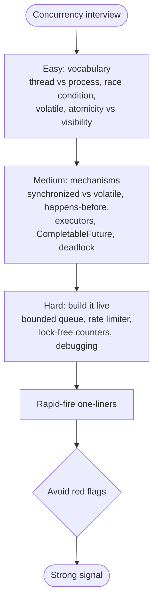
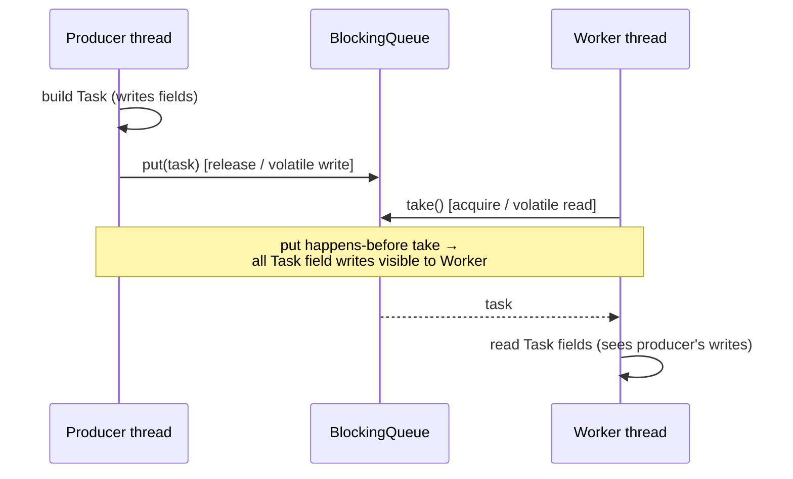
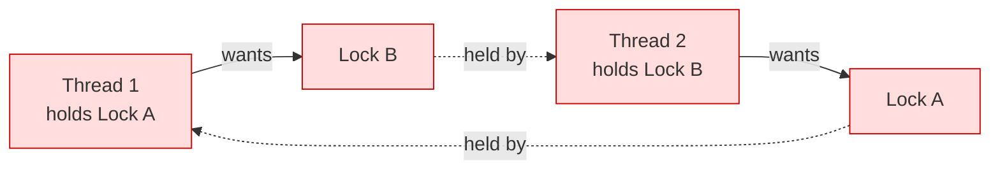
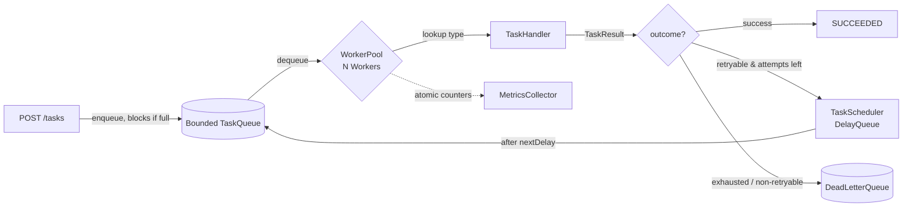

# Interview Prep: Concurrency

> Where this fits in the project: concurrency is the engine room of our Distributed Task Queue. Phase 1 is *literally* a producer-consumer system — request threads behind `POST /tasks` hand `Task` objects to a `WorkerPool` of `Worker` threads through a `TaskQueue`. Every interview question below maps to something we actually built: thread-safe counters in `MetricsCollector`, a bounded `InMemoryTaskQueue`, a `TokenBucketRateLimiter`, retry timing, and graceful `WorkerPool.shutdown()`. This file is a question bank you can drill before an interview, with model answers a staff engineer would accept — not hints.

This is a study aid, not a tutorial. For the full derivations, read the deep-dive chapters and come back here to test recall:

- [threads.md](../06-concurrency/threads.md) — threads, the JMM intro, lifecycle
- [executor-service.md](../06-concurrency/executor-service.md) — thread pools and `ExecutorService`
- [futures-and-completablefuture.md](../06-concurrency/futures-and-completablefuture.md) — async composition
- [blocking-queue.md](../06-concurrency/blocking-queue.md) — the producer-consumer core
- [locks.md](../06-concurrency/locks.md) — `synchronized`, `ReentrantLock`, conditions
- [semaphores.md](../06-concurrency/semaphores.md) — permits and rate limiting
- [atomics-and-thread-safety.md](../06-concurrency/atomics-and-thread-safety.md) — JMM, `volatile`, happens-before, CAS
- [concurrent-collections.md](../06-concurrency/concurrent-collections.md) — `ConcurrentHashMap` and friends

---

## How to Use This Bank

Each question lists: the **model answer**, what the **interviewer is really testing**, and common **follow-ups**. The two "build it live" questions (a bounded blocking queue and a token-bucket rate limiter) are the ones most likely to decide a loop — practice writing them from a blank editor in under ten minutes.



---

## Easy

### E1. What is the difference between a process and a thread?

**Model answer.** A process is an OS-level unit of execution with its own isolated virtual address space, file descriptors, and resources. A thread is a unit of scheduling *inside* a process; all threads in a process share the same heap and file descriptors but each has its own stack, program counter, and registers. Sharing memory is what makes threads cheap to communicate (no IPC) and dangerous (data races). In our platform, a single JVM process runs many `Worker` threads that share one `InMemoryTaskQueue` on the heap.

**Really testing.** Do you understand *why* concurrency bugs exist — shared mutable state — versus just reciting definitions.

**Follow-up: how is a virtual thread different from a platform thread?** A platform thread maps 1:1 to an OS thread (≈1 MB stack, expensive context switches). A virtual thread (Java 21, Project Loom) is scheduled by the JVM onto a small pool of carrier platform threads; it is cheap (a few hundred bytes) and you can have millions. Virtual threads shine for blocking I/O-bound work — exactly our `TaskHandler` calls that hit a database or HTTP endpoint.

---

### E2. What is a race condition? Give an example from a counter.

**Model answer.** A race condition is when the correctness of a program depends on the relative timing of threads. The classic example is `count++`, which is *not* atomic — it compiles to read, increment, write. Two threads can both read `5`, both write `6`, and one increment is lost.

```java
class LostUpdate {
    private int count = 0;          // BROKEN under concurrency
    void inc() { count++; }         // read-modify-write, not atomic
    int get() { return count; }
}
```

In our `MetricsCollector` this would silently undercount `tasksProcessed`. The fix is `AtomicInteger` (or `LongAdder`), or a lock.

**Really testing.** That you know `++` is three operations, not one.

**Follow-up: is `++` atomic on a `volatile int`?** No. `volatile` fixes *visibility*, not *atomicity*. Two threads can still interleave the read-modify-write. You need an atomic or a lock.

---

### E3. What does `volatile` guarantee, and what does it *not*?

**Model answer.** `volatile` guarantees **visibility** and ordering: a write to a volatile field is immediately visible to any subsequent read by another thread, and the JMM forbids reordering reads/writes across it (it establishes happens-before). It does **not** provide atomicity for compound operations like `x++`. Use it for a single flag or a reference that one thread writes and others read.

```java
class Worker implements Runnable {
    private volatile boolean running = true;   // visibility across threads

    public void run() {
        while (running) { processOneTask(); }  // sees the write from stop()
    }
    void stop() { running = false; }           // visible to the run() loop
}
```

Without `volatile`, the JIT could hoist `running` into a register and loop forever.

**Really testing.** Visibility vs atomicity — the single most common conceptual gap.

**Follow-ups.** *When is volatile enough?* When exactly one thread writes and the new value does not depend on the old value (a flag, a published reference). *What's the cost?* A volatile write inserts a memory barrier; cheaper than a lock but not free.

---

### E4. What is the difference between atomicity and visibility?

**Model answer.** Atomicity = "my read-modify-write happened as one indivisible step; no other thread interleaved." Visibility = "the write I made is actually seen by other threads rather than stuck in a CPU cache or register." They are orthogonal. `volatile` gives visibility but not atomicity. `synchronized` and atomics give both. A naive `count++` lacks both.

**Really testing.** Whether you can separate the two failure modes; many candidates blur them.

---

### E5. What is thread safety? When is a class thread-safe?

**Model answer.** A class is thread-safe if it behaves correctly when accessed from multiple threads, regardless of scheduling, with no external synchronization required by the caller. Strategies, cheapest to most expensive: (1) **immutability** — no mutable state, nothing to race on; (2) **confinement** — keep state on one thread; (3) **delegation** to thread-safe components like `ConcurrentHashMap` or `AtomicLong`; (4) explicit **locking**. Our `Task` is best modeled as an immutable record so it can be passed between producer and worker threads with zero synchronization.

```java
public record Task(
    String id, String type, String payload,
    TaskStatus status, int attempts, int maxAttempts,
    Instant createdAt, Instant scheduledAt, int priority
) {}
```

**Really testing.** Whether you reach for immutability first instead of locks.

---

### E6. Why are immutable objects inherently thread-safe?

**Model answer.** Because there is no mutable state to race on — once constructed, the object never changes, so all threads observe the same values and no synchronization is needed for reads. The one subtlety: the object must be *safely published* (e.g., via a `final` field, a volatile reference, or a thread-safe collection). Java guarantees that `final` fields are visible to any thread that sees the constructed object, provided `this` did not escape during construction. State transitions in our system create *new* `Task` instances (`task.withStatus(RUNNING)`) rather than mutating in place.

**Really testing.** Understanding safe publication and the `final` field guarantee, not just "immutable = good."

---

### E7. What is a daemon thread?

**Model answer.** A daemon thread does not keep the JVM alive — the JVM exits when only daemon threads remain. Background housekeeping (a metrics flusher, the scheduler tick) is often daemon so it never blocks shutdown. The catch: daemon threads are killed abruptly at JVM exit with no chance to run `finally` blocks or finish I/O, so never put work that must complete (like flushing a `Task` to Postgres) on a daemon thread. Use explicit graceful shutdown instead.

**Really testing.** Lifecycle awareness and the shutdown gotcha.

---

### E8. What is the difference between `Runnable` and `Callable`?

**Model answer.** `Runnable.run()` returns `void` and cannot throw checked exceptions. `Callable<V>.call()` returns a value and may throw checked exceptions. Submitting a `Callable` to an `ExecutorService` gives you a `Future<V>` to retrieve the result or the thrown exception. Our `TaskHandler.handle(Task)` returns a `TaskResult` and `throws Exception`, so it is conceptually `Callable`-shaped, not `Runnable`-shaped.

**Really testing.** Result/exception propagation — knowing how a worker reports failure back.

---

### E9. What is the difference between `sleep()` and `wait()`?

**Model answer.** `Thread.sleep(ms)` pauses the current thread for a duration and does **not** release any held lock. `Object.wait()` must be called while holding that object's monitor, **releases** the monitor, and parks the thread until another thread calls `notify()`/`notifyAll()` on the same object. `wait()` is for condition-based coordination; `sleep()` is for timing. Always call `wait()` in a loop that re-checks the condition because of spurious wakeups.

```java
synchronized (lock) {
    while (!conditionHolds()) {  // loop, not if — spurious wakeups
        lock.wait();
    }
    // proceed
}
```

**Really testing.** Monitor semantics and the "always loop around wait" rule.

---

### E10. What is the difference between `notify()` and `notifyAll()`?

**Model answer.** `notify()` wakes one arbitrary waiting thread; `notifyAll()` wakes all of them (they then re-contend for the monitor). `notify()` is an optimization that is only safe when all waiters are interchangeable and waiting on the same condition. If you have multiple distinct conditions on one monitor (producers waiting on "not full" and consumers on "not empty" in a hand-rolled queue), `notify()` can wake the wrong group and deadlock. Default to `notifyAll()` unless you can prove `notify()` is safe — or better, use `ReentrantLock` with separate `Condition` objects.

**Really testing.** The lost-wakeup trap, which is exactly why we use `BlockingQueue` instead of hand-rolled `wait/notify`.

---

## Medium

### M1. `volatile` vs `synchronized` — when do you use each?

**Model answer.** `volatile` gives visibility and ordering for a single variable but no atomicity and no mutual exclusion. `synchronized` gives mutual exclusion (one thread in the block at a time) **and** visibility (entering/exiting the monitor establishes happens-before) and supports compound atomic operations. Use `volatile` for a one-writer flag or a published reference; use `synchronized` (or `ReentrantLock`) when you need to make multiple operations atomic or coordinate complex invariants.

| Aspect | `volatile` | `synchronized` |
|---|---|---|
| Visibility | Yes | Yes |
| Atomicity of compound ops | **No** | Yes |
| Mutual exclusion | No | Yes |
| Blocking | Never | Threads block to enter |
| Cost | Memory barrier (cheap) | Monitor acquire (more) |
| Use for | Flags, published refs | Multi-step invariants |

**Really testing.** That you do not reach for `synchronized` reflexively, and that you know `volatile` is not a lock.

**Follow-up: replace this `synchronized` counter with `volatile`.** Trap question — you cannot, because the increment is compound. Use `AtomicLong` instead.

---

### M2. Explain the happens-before relationship.

**Model answer.** Happens-before is the JMM's ordering guarantee: if action A happens-before action B, then A's memory effects are visible to B and A is ordered before B. Without a happens-before edge between two actions on different threads, the JMM gives *no* visibility guarantee — the compiler and CPU may reorder freely. The key edges:

1. **Program order** — within a single thread, each action happens-before the next.
2. **Monitor lock** — unlocking a monitor happens-before any subsequent lock of the same monitor.
3. **Volatile** — a write to a volatile field happens-before every subsequent read of that field.
4. **Thread start** — `Thread.start()` happens-before any action in the started thread.
5. **Thread join** — all actions in a thread happen-before another thread's successful `join()` on it.
6. **Transitivity** — if A hb B and B hb C, then A hb C.

That transitivity is the magic: a `BlockingQueue.put` (a volatile/lock write) happens-before the matching `take`, so everything the producer did to the `Task` before `put` is visible to the worker after `take`. We never synchronize `Task` fields manually — the queue handoff carries the happens-before edge.



**Really testing.** The single most important JMM concept. Strong candidates name the specific edges; weak ones say "happens-before means it happens before."

---

### M3. What is the double-checked locking idiom and why did it need `volatile`?

**Model answer.** Double-checked locking lazily initializes a shared instance while avoiding locking on the hot path:

```java
class TaskQueueHolder {
    private static volatile TaskQueue instance;   // volatile is mandatory
    static TaskQueue get() {
        TaskQueue local = instance;               // read once
        if (local == null) {
            synchronized (TaskQueueHolder.class) {
                local = instance;
                if (local == null) {
                    instance = local = new InMemoryTaskQueue(1000);
                }
            }
        }
        return local;
    }
}
```

Pre-Java-5 this was broken because constructing the object and publishing the reference could be reordered: another thread could see a non-null reference pointing at a *partially constructed* object. `volatile` (with the JSR-133 memory model) forbids that reordering and makes the fully-constructed object visible. In practice, prefer the **initialization-on-demand holder** idiom (a static nested class) which gets laziness and thread safety from the classloader for free and needs no volatile.

**Really testing.** Deep JMM understanding and knowing the cleaner alternative.

---

### M4. How do you choose between `ExecutorService` and raw threads? How do you size a pool?

**Model answer.** Never `new Thread()` per task in production — thread creation is expensive, unbounded creation exhausts memory, and you lose lifecycle control. An `ExecutorService` pools and reuses threads, bounds concurrency, and gives you a queue, rejection policy, and orderly shutdown. Our `WorkerPool` wraps one.

Sizing depends on the workload:

- **CPU-bound** work: pool size ≈ number of cores (`Runtime.getRuntime().availableProcessors()`). More threads just add context-switch overhead.
- **I/O-bound** work (most `TaskHandler`s — DB/HTTP calls): pool can be much larger; a useful heuristic is `cores × (1 + waitTime/computeTime)`. Or, on Java 21, use **virtual threads** and stop sizing entirely.

Always use a **bounded** work queue with an explicit `RejectedExecutionHandler`, never an unbounded `LinkedBlockingQueue` that hides backpressure and OOMs under load.

```java
ExecutorService pool = new ThreadPoolExecutor(
    8, 8,                                   // core = max for fixed pool
    60L, TimeUnit.SECONDS,
    new ArrayBlockingQueue<>(1000),         // BOUNDED — real backpressure
    new ThreadPoolExecutor.CallerRunsPolicy() // throttle submitters
);
```

**Really testing.** That you know `Executors.newFixedThreadPool` uses an *unbounded* queue (a production landmine) and that you can reason about pool sizing. See [backpressure.md](../08-distributed-systems/backpressure.md).

**Follow-up: why is `Executors.newCachedThreadPool` dangerous?** It has an unbounded number of threads (`SynchronousQueue` + max `Integer.MAX_VALUE`); a burst can spawn thousands of threads and OOM.

---

### M5. Walk through a graceful `ExecutorService` shutdown.

**Model answer.** The idiom is shutdown → awaitTermination → shutdownNow → await again:

```java
void shutdown(ExecutorService pool) {
    pool.shutdown();                         // stop accepting new tasks
    try {
        if (!pool.awaitTermination(30, TimeUnit.SECONDS)) {
            pool.shutdownNow();              // interrupt running tasks
            if (!pool.awaitTermination(10, TimeUnit.SECONDS)) {
                log.error("pool did not terminate");
            }
        }
    } catch (InterruptedException e) {
        pool.shutdownNow();
        Thread.currentThread().interrupt();  // restore the flag
    }
}
```

`shutdown()` is graceful (lets queued tasks finish); `shutdownNow()` interrupts running tasks and returns the queued ones. For our `WorkerPool`, this means in-flight `Task`s get a chance to finish and report their `TaskResult` before we kill the pool, which matters for at-least-once delivery.

**Really testing.** Production maturity and correct interrupt handling.

---

### M6. What does `Future.get()` do, and what are its failure modes?

**Model answer.** `Future.get()` blocks until the task completes and returns its result. It throws: `ExecutionException` (wrapping whatever the task threw — you unwrap with `getCause()`), `InterruptedException` (the *waiting* thread was interrupted), `CancellationException` if the task was cancelled, and `TimeoutException` for the timed overload. **Always use the timed overload** `get(timeout, unit)` in production so one stuck `TaskHandler` cannot block the caller forever. A bare `future.get()` with no timeout is a classic way to hang a request thread.

```java
try {
    TaskResult r = future.get(5, TimeUnit.SECONDS);
} catch (TimeoutException e) {
    future.cancel(true);                     // interrupt the task
    throw new TaskTimeoutException(taskId);
} catch (ExecutionException e) {
    Throwable cause = e.getCause();          // the real failure
}
```

**Really testing.** Exception unwrapping and the always-timeout discipline.

---

### M7. What problem does `CompletableFuture` solve over `Future`?

**Model answer.** Plain `Future` only lets you block on `get()` or poll `isDone()` — you cannot *compose* asynchronous steps without blocking a thread. `CompletableFuture` is composable and non-blocking: you attach continuations (`thenApply`, `thenCompose`, `thenCombine`), handle errors (`exceptionally`, `handle`), and fan out/in (`allOf`, `anyOf`) without ever calling `get()` until the very end. This lets a pipeline run on the pool's threads instead of parking a caller.

```java
CompletableFuture
    .supplyAsync(() -> repository.findById(id).orElseThrow(), pool)
    .thenApply(task -> task.withStatus(TaskStatus.RUNNING))
    .thenCompose(task -> handlerFor(task).executeAsync(task))   // flatMap
    .thenAccept(result -> metrics.record(result))
    .exceptionally(ex -> { dlq.send(taskOf(ex), ex.getMessage()); return null; });
```

Key distinctions: `thenApply` maps a value; `thenCompose` flat-maps a future-returning function (avoids nested futures); `thenCombine` joins two independent futures. The `...Async` variants run the continuation on a supplied executor — **always pass your own executor**, because the default `ForkJoinPool.commonPool()` is shared JVM-wide and small.

**Really testing.** Composition, `thenApply` vs `thenCompose`, and the commonPool trap. See [futures-and-completablefuture.md](../06-concurrency/futures-and-completablefuture.md).

---

### M8. How does exception handling work in `CompletableFuture`?

**Model answer.** Exceptions short-circuit the chain: if a stage throws, downstream `thenApply`/`thenAccept` stages are skipped and the future completes exceptionally. You recover with:

- `exceptionally(fn)` — handle the throwable, supply a fallback value (recovery only).
- `handle(biFn)` — always runs, receives `(result, throwable)`; either may be null. Good for "log either way."
- `whenComplete(biAction)` — side effect on completion, does **not** alter the result/exception.

The throwable passed in is a `CompletionException` wrapping the cause, so unwrap with `getCause()`. In our retry path, `handle` decides whether the `TaskResult.retryable()` flag means reschedule or send to the [dead-letter queue](../08-distributed-systems/dlq.md).

**Really testing.** Knowing `exceptionally` vs `handle` vs `whenComplete` and the wrapping.

---

### M9. What is a deadlock? Give the four Coffman conditions and how to break them.

**Model answer.** A deadlock is a cycle of threads each holding a resource the next needs, so none can proceed. It requires all four Coffman conditions simultaneously:

1. **Mutual exclusion** — resources are non-shareable.
2. **Hold and wait** — a thread holds one resource while waiting for another.
3. **No preemption** — resources can't be forcibly taken.
4. **Circular wait** — a cycle exists in the wait-for graph.

Break any one to prevent deadlock. The practical, cheapest fix is to destroy **circular wait** by imposing a **global lock ordering** — always acquire locks in the same total order. Other fixes: use `tryLock` with a timeout (breaks hold-and-wait by backing off), reduce lock scope, or avoid locks via immutability and lock-free structures.

```java
// Classic deadlock: two threads, opposite lock order
void transfer(Account a, Account b, long amt) {
    Account first  = a.id() < b.id() ? a : b;   // GLOBAL ORDER by id
    Account second = a.id() < b.id() ? b : a;
    synchronized (first) {
        synchronized (second) { a.debit(amt); b.credit(amt); }
    }
}
```



**Really testing.** The lock-ordering fix specifically; everyone names the four conditions, fewer give the cure.

**Follow-ups.** *Livelock?* Threads keep changing state in response to each other but make no progress (two people stepping aside in a hallway). *Starvation?* A thread never gets the resource because others keep winning. *How do you detect a production deadlock?* A thread dump (`jstack` / `jcmd Thread.print`) — the JVM literally prints "Found one Java-level deadlock" with the cycle.

---

### M10. What is a `ReentrantLock` and when do you prefer it to `synchronized`?

**Model answer.** `ReentrantLock` is an explicit `Lock` with the same reentrant mutual-exclusion semantics as `synchronized`, plus capabilities `synchronized` lacks: **timed** acquisition (`tryLock(timeout)`), **interruptible** acquisition (`lockInterruptibly`), **fairness** (FIFO ordering), and multiple **`Condition`** objects on one lock (separate "not full"/"not empty" waitsets). The cost is you must `unlock()` in a `finally` block — `synchronized` can never leak a lock. Prefer `synchronized` for simple critical sections; reach for `ReentrantLock` when you need tryLock, fairness, or multiple conditions (exactly what a bounded blocking queue needs).

```java
lock.lock();
try { /* critical section */ }
finally { lock.unlock(); }   // MUST be in finally
```

**Really testing.** That you do not over-reach for `ReentrantLock` and that you know the `finally` discipline. See [locks.md](../06-concurrency/locks.md).

---

### M11. When do you use a `ReadWriteLock` or `StampedLock`?

**Model answer.** A `ReentrantReadWriteLock` allows many concurrent readers OR one exclusive writer — a win when reads vastly outnumber writes and the critical section is non-trivial. `StampedLock` (Java 8) adds an **optimistic read** mode: you read without acquiring, then validate the stamp; if a writer intervened you fall back to a real read lock. `StampedLock` is faster under read-heavy load but is **not reentrant** and trickier to use. For our `MetricsCollector` snapshot (many readers, occasional writer) a read-write lock fits — though `LongAdder`/`AtomicLong` per counter is usually simpler and faster.

**Really testing.** Knowing read-mostly optimizations exist and their gotchas (non-reentrancy of `StampedLock`).

---

### M12. Compare `AtomicInteger`, `synchronized`, and `LongAdder` for a counter.

**Model answer.** All three are correct; they differ in contention behavior. `synchronized` serializes every increment through one monitor — simple but a bottleneck under contention. `AtomicInteger` uses a lock-free **compare-and-swap** (CAS) loop — fast when contention is low, but under heavy contention many threads spin retrying the CAS. `LongAdder` spreads writes across multiple internal cells (one per contending thread, roughly), so increments rarely collide; `sum()` adds the cells. For a hot, high-throughput counter like `tasksProcessed` in our `MetricsCollector`, `LongAdder` wins because reads are rare and writes are constant.

| | Mechanism | Low contention | High contention | Exact read |
|---|---|---|---|---|
| `synchronized` | monitor | OK | Poor (serialized) | Yes |
| `AtomicLong` | CAS loop | Excellent | Degrades (CAS retries) | Yes |
| `LongAdder` | striped cells | Good | Excellent | `sum()` is a snapshot |

**Really testing.** Whether you understand CAS contention and that "atomic" is not automatically the fastest.

---

### M13. What is compare-and-swap (CAS) and the ABA problem?

**Model answer.** CAS is an atomic CPU instruction: "if this memory location still holds the expected value, set it to the new value, and tell me whether you succeeded." It is the foundation of lock-free algorithms — `AtomicInteger.incrementAndGet` is a `do { v = get(); } while (!compareAndSet(v, v+1))` loop. The **ABA problem**: a CAS checking only the value can succeed incorrectly if the value changed A→B→A between your read and your CAS — you think nothing changed but it did. The fix is a version stamp: `AtomicStampedReference` pairs the reference with a counter so A-with-stamp-1 ≠ A-with-stamp-3.

**Really testing.** Whether "lock-free" is real understanding or a buzzword.

---

### M14. What thread-safety guarantees does `ConcurrentHashMap` give? Where does it *not* help?

**Model answer.** `ConcurrentHashMap` provides thread-safe, high-concurrency reads and writes: individual operations (`put`, `get`, `remove`, `compute`, `merge`) are atomic, and reads generally proceed without locking. It does **not** make a sequence of operations atomic — a `get` then `put` is a race. For "do this once per key" you must use the atomic compound methods: `computeIfAbsent`, `compute`, `merge`, `putIfAbsent`. Our `Worker` looks up handlers in a `ConcurrentHashMap<String, TaskHandler>` and registers them with `computeIfAbsent` so two threads can't double-register.

```java
private final ConcurrentHashMap<String, TaskHandler> handlers = new ConcurrentHashMap<>();

TaskHandler handlerFor(String type) {
    return handlers.computeIfAbsent(type, this::buildHandler);   // atomic
}
```

A caveat: the function passed to `computeIfAbsent` must be short and must not modify the same map (it runs under a bin lock — re-entrant modification can deadlock or corrupt). Iteration is weakly consistent: it won't throw `ConcurrentModificationException` but may not reflect concurrent updates.

**Really testing.** The "atomic per op, not per sequence" subtlety and the compound-method fix. See [concurrent-collections.md](../06-concurrency/concurrent-collections.md).

---

### M15. What is `ThreadLocal` and where is it dangerous?

**Model answer.** `ThreadLocal<T>` gives each thread its own independent copy of a value — useful for per-thread context (a request/trace id, a non-thread-safe `SimpleDateFormat`). The danger in pooled environments: thread-pool threads are reused, so a `ThreadLocal` set during one task leaks into the next task on the same thread unless you `remove()` it in a `finally`. This causes data bleed (one user's trace id on another's request) and, with classloader-held values, memory leaks. Always clear it. With virtual threads, prefer `ScopedValue` (Java 21+) which is immutable and structurally scoped.

**Really testing.** The pooled-thread leak — a real production bug source.

---

### M16. What does interrupting a thread actually do?

**Model answer.** `thread.interrupt()` sets the thread's interrupt flag; it does **not** stop the thread. Blocking calls that are interrupt-aware (`sleep`, `wait`, `BlockingQueue.take`, `Future.get`) throw `InterruptedException` and clear the flag. Code that catches `InterruptedException` must either propagate it or **restore the flag** (`Thread.currentThread().interrupt()`) so callers up the stack can see it. Swallowing `InterruptedException` silently is one of the most common and damaging concurrency bugs — it breaks cancellation and graceful shutdown of our `WorkerPool`.

```java
try {
    Task t = queue.dequeue();            // BlockingQueue.take()
} catch (InterruptedException e) {
    Thread.currentThread().interrupt();  // restore — let the worker loop exit
    return;
}
```

**Really testing.** Cooperative cancellation — interrupts are requests, not kills.

---

### M17. What is false sharing and how do you avoid it?

**Model answer.** False sharing happens when two threads update *different* variables that happen to live on the *same* CPU cache line (typically 64 bytes). Every write invalidates the line in the other core's cache, causing cache-coherence ping-pong and silent slowdowns even though there's no logical contention. Avoidance: pad hot fields onto separate cache lines (`@Contended`, used internally by `LongAdder`/`ForkJoinPool`), or use striped structures. It's a "why is my lock-free code slow?" gotcha, mostly relevant in very hot loops.

**Really testing.** Hardware-level awareness — a strong senior/staff signal, not expected from juniors.

---

## Hard

### H1. Build a thread-safe bounded queue from scratch (no `BlockingQueue`).

**Model answer.** This is the canonical "build it live" question and the heart of our `InMemoryTaskQueue`. Use a `ReentrantLock` with two `Condition`s — `notFull` and `notEmpty` — so producers and consumers wait on distinct conditions. Always wait in a `while` loop (spurious wakeups), and `signal` the *other* side after each op.

```java
import java.util.concurrent.locks.*;
import java.util.ArrayDeque;

public final class BoundedTaskQueue<E> {
    private final ArrayDeque<E> items;
    private final int capacity;
    private final ReentrantLock lock = new ReentrantLock();
    private final Condition notFull  = lock.newCondition();
    private final Condition notEmpty = lock.newCondition();

    public BoundedTaskQueue(int capacity) {
        if (capacity <= 0) throw new IllegalArgumentException("capacity > 0");
        this.capacity = capacity;
        this.items = new ArrayDeque<>(capacity);
    }

    public void put(E e) throws InterruptedException {
        if (e == null) throw new NullPointerException();
        lock.lockInterruptibly();
        try {
            while (items.size() == capacity) {   // while, not if
                notFull.await();                 // releases lock, parks
            }
            items.addLast(e);
            notEmpty.signal();                   // wake one consumer
        } finally {
            lock.unlock();
        }
    }

    public E take() throws InterruptedException {
        lock.lockInterruptibly();
        try {
            while (items.isEmpty()) {
                notEmpty.await();
            }
            E e = items.removeFirst();
            notFull.signal();                    // wake one producer
            return e;
        } finally {
            lock.unlock();
        }
    }

    public int size() {
        lock.lock();
        try { return items.size(); }
        finally { lock.unlock(); }
    }
}
```

Critical points the interviewer wants spoken aloud:

- **`while` not `if`** around `await()` — spurious wakeups *and* a re-check after another waiter beats you to the slot.
- **Two conditions** so a `put` never wakes another waiting producer (the lost-wakeup bug of single-condition / `notify()` designs).
- **`unlock()` in `finally`** — never leak the lock on an exception.
- **`lockInterruptibly`** so a blocked producer/consumer participates in graceful shutdown.
- `await()` atomically releases the lock and parks, then re-acquires before returning — that's why the invariant holds.

In production you would just use `ArrayBlockingQueue<Task>(capacity)` (which is essentially this, battle-tested) — but the interviewer wants to see you *can* build it and explain the hazards.

**Really testing.** Conditions, the while-loop discipline, lock hygiene, and whether you know to use the JDK class in real life.

**Follow-ups.** *Add a timed `offer(e, timeout)`?* Use `notFull.awaitNanos(remaining)` in the loop, tracking remaining time. *Make it lock-free?* That's a `ConcurrentLinkedQueue` / Michael-Scott queue — much harder; mention CAS-based linking and that bounding lock-free is non-trivial.

---

### H2. Build a thread-safe token-bucket rate limiter live.

**Model answer.** This is our `TokenBucketRateLimiter`, the `RateLimiter` implementation guarding `POST /tasks`. A token bucket refills at a steady rate up to a capacity (burst allowance) and `tryAcquire()` succeeds only if a token is available. The clean implementation is **lazy refill**: don't run a background thread; compute how many tokens *should* have accrued since the last call, based on elapsed time.

```java
import java.util.concurrent.locks.ReentrantLock;

public final class TokenBucketRateLimiter implements RateLimiter {
    private final long capacity;        // max burst
    private final double refillPerNano; // tokens added per nanosecond
    private double tokens;              // current tokens (fractional)
    private long lastRefillNanos;
    private final ReentrantLock lock = new ReentrantLock();

    public TokenBucketRateLimiter(long permitsPerSecond, long burstCapacity) {
        this.capacity = burstCapacity;
        this.refillPerNano = permitsPerSecond / 1_000_000_000.0;
        this.tokens = burstCapacity;
        this.lastRefillNanos = System.nanoTime();
    }

    @Override
    public boolean tryAcquire() {
        lock.lock();
        try {
            refill();
            if (tokens >= 1.0) {
                tokens -= 1.0;
                return true;
            }
            return false;
        } finally {
            lock.unlock();
        }
    }

    private void refill() {
        long now = System.nanoTime();
        double accrued = (now - lastRefillNanos) * refillPerNano;
        if (accrued > 0) {
            tokens = Math.min(capacity, tokens + accrued);
            lastRefillNanos = now;
        }
    }
}
```

Points to articulate:

- **Lazy refill** beats a background scheduler thread: less overhead, no drift, and it self-corrects on each call using `System.nanoTime()` (monotonic — never `currentTimeMillis()`, which can jump backward on NTP adjustments).
- **`capacity` = burst** allowance; refill rate = steady-state throughput. They are tuned separately.
- **Fractional tokens** (`double`) so sub-token-per-call rates work; clamp with `Math.min` to the cap.
- The `ReentrantLock` keeps `refill()` + `tokens -= 1` atomic. The critical section is tiny.

**Lock-free variant.** Replace the lock with an `AtomicLong` holding packed state and a CAS loop, or — simplest in production — use **Resilience4j** or **Bucket4j**, or for distributed limiting move the bucket into Redis (atomic Lua script) so all API nodes share one limit. See [rate-limiting.md](../08-distributed-systems/rate-limiting.md) and [semaphores.md](../06-concurrency/semaphores.md).

**Really testing.** Whether you derive lazy refill (vs naively scheduling a thread), use a monotonic clock, and separate rate from burst.

**Follow-ups.** *Token bucket vs leaky bucket?* Token bucket allows bursts up to capacity; leaky bucket smooths output to a fixed rate with no bursts. *Sliding window vs fixed window counters?* Fixed window allows 2× burst at the boundary; sliding window log/counter fixes that at higher cost. *Make it distributed?* Centralize in Redis; trade a network hop for a shared limit, or use a local limiter per node sized to `globalLimit / nodeCount` with the accuracy tradeoff that implies.

---

### H3. Implement a thread-safe lazy singleton three correct ways.

**Model answer.** All three are correct; choose by need.

```java
// 1. Eager — simplest, thread-safe by classloader, no laziness
enum MetricsRegistry { INSTANCE; /* enum singleton, also serialization-safe */ }

// 2. Initialization-on-demand holder — lazy, no synchronization (PREFERRED)
final class Scheduler {
    private Scheduler() {}
    private static class Holder { static final Scheduler I = new Scheduler(); }
    static Scheduler get() { return Holder.I; }   // class init is thread-safe & lazy
}

// 3. Double-checked locking — only if you need runtime-parameterized lazy init
final class QueueHolder {
    private static volatile TaskQueue instance;     // volatile required
    static TaskQueue get() {
        TaskQueue r = instance;
        if (r == null) synchronized (QueueHolder.class) {
            if ((r = instance) == null) instance = r = new InMemoryTaskQueue(1000);
        }
        return r;
    }
}
```

The holder idiom is the right default: the JLS guarantees a class is initialized lazily, on first use, exactly once, with full happens-before — so `Holder` isn't loaded until `get()` is first called, and no `volatile`/`synchronized` is needed.

**Really testing.** That you know the holder idiom and don't reflexively write broken double-checked locking.

---

### H4. You have a production deadlock. Walk me through diagnosis and fix.

**Model answer.** 

1. **Symptom**: throughput drops to zero, threads stuck, CPU idle (deadlock) — distinct from a livelock (CPU busy, no progress).
2. **Capture a thread dump**: `jstack <pid>` or `jcmd <pid> Thread.print`. The JVM detects monitor deadlocks and prints "Found one Java-level deadlock" with the exact threads and the lock cycle. For `ReentrantLock` deadlocks it shows the parked threads and owners.
3. **Identify the cycle**: which two locks, acquired in opposite orders, by which code paths.
4. **Fix**: impose a **global lock ordering** so all paths acquire locks in the same order (destroys circular wait), or switch to `tryLock(timeout)` with a back-off/retry, or eliminate the nested locking via finer-grained design or immutability.
5. **Prevent regressions**: keep critical sections small, never call foreign/callback code while holding a lock (a `TaskHandler` callback that re-enters our lock is a classic re-entrancy deadlock), and add a stress test that hammers the contended paths.

**Really testing.** Operational competence — can you debug, not just theorize.

---

### H5. Design a concurrency model for our `WorkerPool` processing tasks with retries.

**Model answer.** The architecture is producer-consumer with bounded backpressure plus a separate timing wheel for retries:

- **Submission**: `POST /tasks` validates and `enqueue`s a `Task` into a **bounded** `TaskQueue` (`ArrayBlockingQueue`). Bounded so a flood applies backpressure (block or reject with `429`) instead of OOMing.
- **WorkerPool**: a fixed `ExecutorService` of N `Worker`s, each looping `dequeue()` → look up `TaskHandler` by `type` (in a `ConcurrentHashMap`) → execute → branch on `TaskResult`.
- **Outcome handling**: on `success` mark `SUCCEEDED`; on `retryable` failure with `attempts < maxAttempts`, ask the `RetryPolicy` for `nextDelay(attempt)` and hand the `Task` to a `TaskScheduler` (a `DelayQueue` or `ScheduledExecutorService`) which re-enqueues it after the delay (status `RETRYING`/`SCHEDULED`); on non-retryable or exhausted retries, `DeadLetterQueue.send(task, reason)` and mark `DEAD`.
- **Metrics**: `MetricsCollector` uses `LongAdder`/atomic counters and timers — lock-free on the hot path.
- **Shutdown**: stop accepting (`shutdown()`), drain in-flight, `interrupt` blocked workers, `awaitTermination`.



Concurrency guarantees: the `BlockingQueue` handoff carries happens-before so `Task` fields written by the producer are visible to the worker with no manual sync; `Task` is immutable so it crosses threads safely; counters are atomic; the scheduler is the only component holding timing state. See [task-queues.md](../07-queues-and-messaging/task-queues.md), [delayed-queues.md](../07-queues-and-messaging/delayed-queues.md), and [retries.md](../08-distributed-systems/retries.md).

**Really testing.** Whether you can compose primitives into a correct, backpressured, observable system — the actual job.

---

### H6. When would you use virtual threads vs a bounded thread pool for `Worker`s?

**Model answer.** Use a **bounded platform-thread pool** when work is CPU-bound or when the bound itself *is* the goal — limiting concurrency to protect a downstream (a DB connection pool of 20, an external API quota). Use **virtual threads** when `TaskHandler`s are I/O-bound and you want massive concurrency cheaply: a virtual thread parks during blocking I/O and releases its carrier, so 100,000 in-flight tasks waiting on HTTP cost almost nothing. The trap: virtual threads do **not** bound concurrency, so if downstream protection matters you still need a `Semaphore` or a connection pool to cap actual parallelism. Also avoid `synchronized` around blocking calls under virtual threads (it can "pin" the carrier thread, defeating the benefit) — use `ReentrantLock` instead. On Java 21, `Executors.newVirtualThreadPerTaskExecutor()` is the drop-in.

**Really testing.** Modern Java fluency and the "virtual threads don't limit concurrency" nuance — a current favorite.

---

### H7. How do you write a deterministic test for concurrent code?

**Model answer.** Naive thread tests are flaky because they depend on scheduling. Techniques:

- **`CountDownLatch`** to release all threads at once (maximize the chance of interleaving) and to await completion deterministically.
- **`CyclicBarrier`** to synchronize phases.
- Run the operation **many times / from many threads** and assert an invariant (e.g., final counter == total increments) — a single pass proves little.
- Use **`CompletableFuture.allOf`** or `invokeAll` to join and surface exceptions.
- Tools: `awaitility` for polling assertions, `jcstress` for true JMM stress testing, thread sanitizers.

```java
@Test void counterIsThreadSafe() throws Exception {
    var counter = new AtomicLong();
    int threads = 16, perThread = 100_000;
    var start = new CountDownLatch(1);
    var done  = new CountDownLatch(threads);
    var pool  = Executors.newFixedThreadPool(threads);
    for (int i = 0; i < threads; i++) pool.submit(() -> {
        try { start.await(); for (int j = 0; j < perThread; j++) counter.incrementAndGet(); }
        catch (InterruptedException e) { Thread.currentThread().interrupt(); }
        finally { done.countDown(); }
    });
    start.countDown();                       // fire all at once
    assertThat(done.await(10, TimeUnit.SECONDS)).isTrue();
    pool.shutdown();
    assertThat(counter.get()).isEqualTo((long) threads * perThread);
}
```

**Really testing.** That you know you *can't* prove thread safety by one run, and you know the latch/barrier toolkit.

---

### H8. Explain memory barriers and how `final` fields are special.

**Model answer.** A memory barrier (fence) is an instruction that constrains reordering of memory operations across it: a **store barrier** prevents earlier writes from being reordered after later ones; a **load barrier** prevents later reads from being reordered before earlier ones. The JMM expresses these abstractly via happens-before; `volatile` writes/reads, lock release/acquire, and `final` field freezes all insert the appropriate barriers. The `final` field guarantee: at the end of a constructor, a **freeze** ensures any thread that observes the fully constructed object (without `this` escaping) sees correctly initialized `final` fields *without* extra synchronization. This is precisely why our immutable `Task` record is safe to publish through any channel — its `final` fields are guaranteed visible once the object is seen.

**Really testing.** Staff-level JMM depth; rare to require, strong to have.

---

## Rapid-Fire One-Liners

- **Is `HashMap` thread-safe?** No — concurrent writes can corrupt it (historically even infinite-loop on resize). Use `ConcurrentHashMap`.
- **`StringBuilder` vs `StringBuffer`?** `StringBuffer` is synchronized (legacy); `StringBuilder` isn't and is faster — use `StringBuilder` unless genuinely shared.
- **Can two threads enter two different `synchronized` methods of the same object at once?** No — instance `synchronized` methods share the object's monitor.
- **Does a `static synchronized` method lock the instance?** No — it locks the `Class` object.
- **Is `volatile` enough for a flag?** Yes, if one thread writes and the value doesn't depend on its old value.
- **Default `CompletableFuture` executor?** `ForkJoinPool.commonPool()` — shared and small; pass your own.
- **Does `Future.cancel(true)` stop a running task?** It *interrupts* it; the task must be interrupt-aware to actually stop.
- **`Executors.newFixedThreadPool` queue type?** Unbounded `LinkedBlockingQueue` — a hidden OOM risk.
- **Is `ConcurrentHashMap` null-friendly?** No — null keys and values are rejected (ambiguous with "absent").
- **`CyclicBarrier` vs `CountDownLatch`?** Latch is one-shot and counts down; barrier is reusable and releases when all parties arrive.
- **`Semaphore(1)` vs a lock?** A semaphore isn't reentrant and has no ownership — any thread can release a permit; a lock is owned by the acquirer.
- **What clock for elapsed time?** `System.nanoTime()` (monotonic), never `currentTimeMillis()`.
- **Reentrant means?** The same thread can re-acquire a lock it already holds without deadlocking.
- **Does `synchronized` provide visibility?** Yes — monitor enter/exit establishes happens-before, not just mutual exclusion.

---

## Red Flags That Sink Candidates

- Claiming `volatile` makes `count++` thread-safe. (Atomicity vs visibility confusion — instant downgrade.)
- Using `if` instead of `while` around `wait()`/`await()`.
- Swallowing `InterruptedException` (empty catch) or not restoring the interrupt flag.
- Reaching for `synchronized` on everything; never mentioning immutability or atomics.
- `new Thread()` per request in a server; not knowing `newFixedThreadPool` uses an unbounded queue.
- `future.get()` with no timeout on a request path.
- "Just add `synchronized` to fix the deadlock" — without naming lock ordering.
- Writing a rate limiter with a background refill thread when lazy refill is simpler and drift-free; using `currentTimeMillis()` for elapsed time.
- Not knowing a thread dump (`jstack`) is how you diagnose a production deadlock.
- Forgetting `lock.unlock()` in a `finally`.
- Believing `ConcurrentHashMap` makes a `get`-then-`put` sequence atomic.
- Never mentioning *backpressure* when discussing producer-consumer at scale.

---

## What We Can Improve In Our Project Using This Concept

Treating concurrency as an interview *checklist* exposes latent risks in our own code:

- Audit every `catch (InterruptedException)` in `Worker` and `WorkerPool` to confirm we restore the flag or exit the loop — graceful shutdown depends on it.
- Verify `InMemoryTaskQueue` is genuinely bounded and that `POST /tasks` has a defined behavior when full (block vs `429`), wiring real backpressure.
- Convert `MetricsCollector` counters to `LongAdder` for the hot `tasksProcessed`/`tasksFailed` paths.
- Confirm `Task` is a fully immutable record so it crosses the producer→worker boundary with zero manual synchronization.
- Ensure every `ExecutorService` we create (workers, scheduler) has a documented bounded queue and a `RejectedExecutionHandler`.

## Project Refactoring Task

Pick one Worker outcome path and make it bulletproof under concurrency: (1) write the `BoundedTaskQueue` from H1 and prove via the H7 test harness it never loses or duplicates a `Task`; (2) drop in `TokenBucketRateLimiter` from H2 in front of `enqueue` and add a stress test asserting it never exceeds `permitsPerSecond` over a 5-second window; (3) replace `MetricsCollector`'s counters with `LongAdder` and benchmark increment throughput under 16 threads against the old `synchronized` version.

## Git Commit For This Chapter

```text
docs(interview-prep): add concurrency interview question bank with live-coding answers

Files touched:
  11-interview-prep/concurrency.md   (new)
```

## Architecture Impact

Nothing in the runtime changes, but the bank codifies the **invariants** our concurrent components must hold: bounded queues for backpressure, immutable `Task` for lock-free handoff, atomic counters for observability, lazy-refill token bucket for admission control, and global lock ordering / `tryLock` discipline to keep the `WorkerPool` deadlock-free. These are the properties a reviewer should check on every concurrency PR.

## Interview Takeaways

- Separate **atomicity** (did my update get clobbered) from **visibility** (did anyone see it). `volatile` fixes only the second.
- **Happens-before** is the one JMM concept to know cold; name the specific edges (program order, monitor, volatile, start/join, transitivity).
- Default to **immutability**, then atomics/concurrent collections, then locks — in that order.
- Always **bound** queues and pools; an unbounded queue is hidden, fatal backpressure debt.
- Be able to **build a bounded blocking queue and a token-bucket rate limiter live**, narrating the hazards (while-loops, two conditions, `finally` unlock, monotonic clock, lazy refill).
- Fix deadlocks with **lock ordering** or **`tryLock`**, and know `jstack` is how you find them in production.
- On Java 21, know **virtual threads** for I/O-bound tasks — and that they do *not* bound concurrency.
