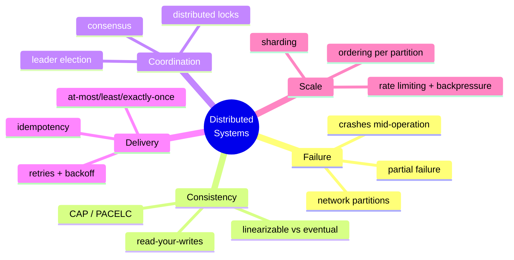
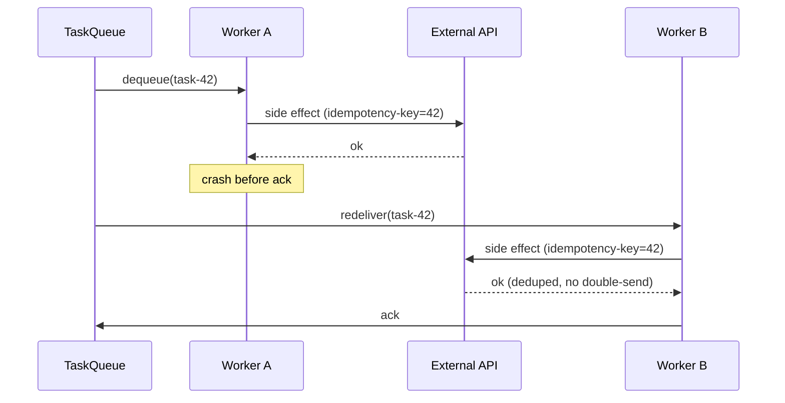
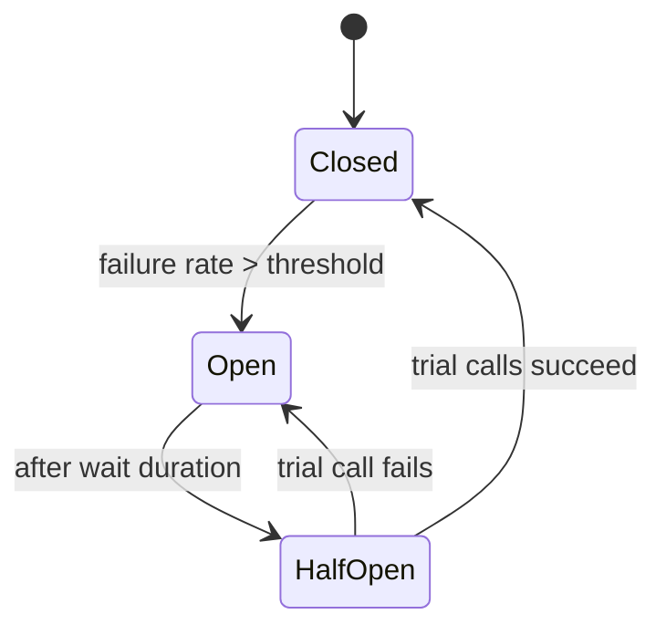
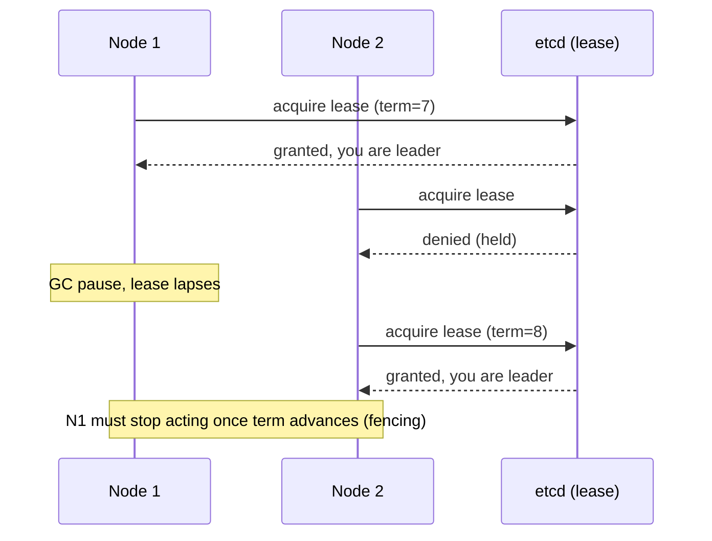
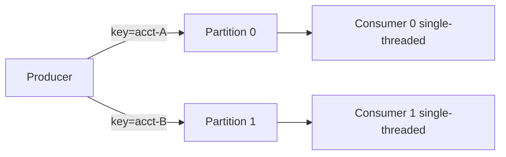
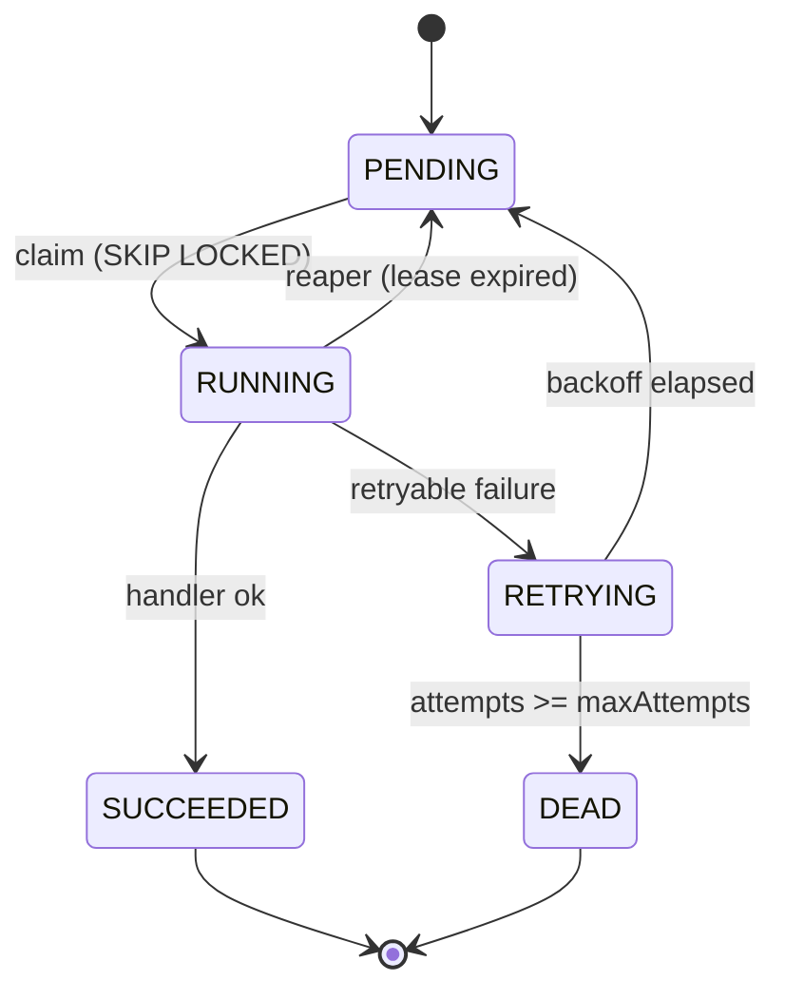
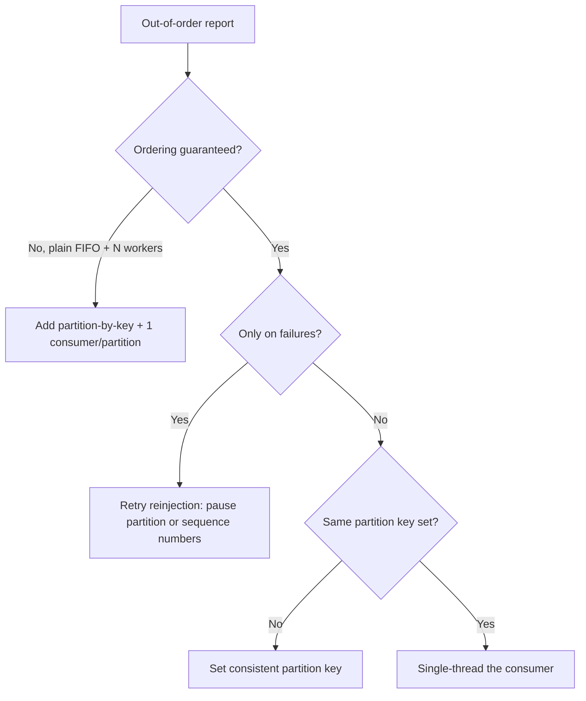
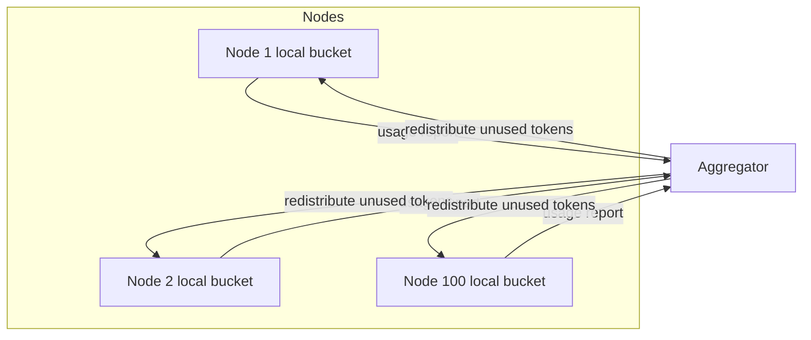
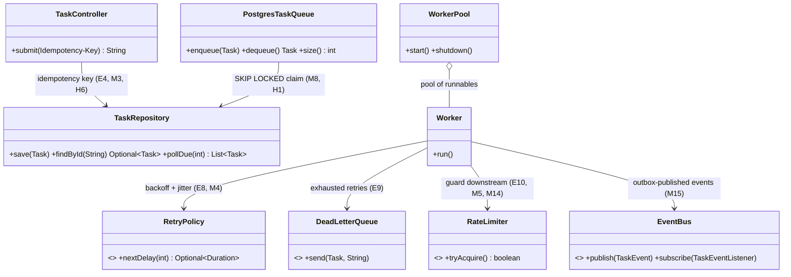

# Interview Prep: Distributed Systems

> Where this fits in the project: every hard question about our **Distributed Task Queue and Event Processing Platform** is a distributed-systems question in disguise. "What happens if a worker crashes mid-task?" is delivery guarantees. "Two API nodes accept the same task twice" is idempotency. "Tasks must run in order per user" is partitioned ordering. This bank turns the deep-dive chapters in [`../08-distributed-systems/`](../08-distributed-systems/) into crisp interview answers you can deliver out loud.

This is an **interview question bank**, not a tutorial. Each question gives a **model answer** (what you'd actually say), the **follow-ups** an interviewer will push on, and **what they're really testing**. Answers are tied back to the Task Queue project wherever it sharpens the point. Code is Java 21.

How to use it: cover the answers, speak yours out loud, then compare. If you can't explain *why* something is true (not just *that* it's true), you don't own it yet. For the underlying theory, follow the relative links into the deep-dive chapters.

---

## Mental model: the whole topic on one page

Almost every distributed-systems interview question is one of these five forces fighting each other:



The single most important sentence in distributed systems: **the network is not reliable, and you cannot tell the difference between a slow node and a dead one.** Every good answer below traces back to that. When you're stuck in an interview, ask yourself "what does a network partition do to this?" and the answer usually appears.

---

## Topic map → deep-dive chapters

| Topic | Deep-dive chapter |
|---|---|
| CAP, PACELC | [`../08-distributed-systems/cap-theorem.md`](../08-distributed-systems/cap-theorem.md) |
| Consistency models | [`../08-distributed-systems/consistency-and-availability.md`](../08-distributed-systems/consistency-and-availability.md) |
| Idempotency | [`../08-distributed-systems/idempotency.md`](../08-distributed-systems/idempotency.md) |
| Retries & backoff | [`../08-distributed-systems/retries.md`](../08-distributed-systems/retries.md) |
| Dead-letter queues | [`../08-distributed-systems/dlq.md`](../08-distributed-systems/dlq.md) |
| Rate limiting | [`../08-distributed-systems/rate-limiting.md`](../08-distributed-systems/rate-limiting.md) |
| Backpressure | [`../08-distributed-systems/backpressure.md`](../08-distributed-systems/backpressure.md) |
| Circuit breakers | [`../08-distributed-systems/circuit-breakers.md`](../08-distributed-systems/circuit-breakers.md) |
| Sharding | [`../08-distributed-systems/sharding.md`](../08-distributed-systems/sharding.md) |
| Distributed locks | [`../08-distributed-systems/distributed-locks.md`](../08-distributed-systems/distributed-locks.md) |
| Leader election | [`../08-distributed-systems/leader-election.md`](../08-distributed-systems/leader-election.md) |
| Service discovery & scaling | [`../08-distributed-systems/service-discovery-and-scaling.md`](../08-distributed-systems/service-discovery-and-scaling.md) |
| Message ordering | [`../08-distributed-systems/message-ordering.md`](../08-distributed-systems/message-ordering.md) |

---

# Easy

These check vocabulary and whether you can define a term cleanly without hand-waving. The trap: rambling. Define in one or two sentences, then give an example from the Task Queue.

### E1. What is the difference between horizontal and vertical scaling?

**Model answer.** Vertical scaling (scaling up) means giving one machine more resources — more CPU, RAM, faster disk. Horizontal scaling (scaling out) means adding more machines and distributing load across them. Vertical is simpler (no distributed-systems problems) but has a hard ceiling and a single point of failure. Horizontal is effectively unbounded and fault-tolerant but forces you to solve coordination, consistency, and partitioning.

In our platform, Phase 1 is vertical: one JVM, one `WorkerPool`, more threads. Phase 4 is horizontal: many worker nodes pulling from a shared broker. The moment we went horizontal we inherited idempotency, ordering, and leader-election problems we didn't have before.

**What they're testing:** do you know that horizontal scaling is not free — it *buys* throughput by *spending* simplicity.

---

### E2. What does "stateless service" mean and why do we want it?

**Model answer.** A stateless service keeps no client-specific state in its own memory between requests; any required state lives in a shared store (DB, cache, queue). Two consequences: (1) any instance can serve any request, so you can load-balance freely and add/remove nodes without draining sessions; (2) a crash loses nothing because there was nothing to lose.

Our `TaskController` is stateless — it validates the request, writes the `Task` to PostgreSQL via `TaskRepository`, and returns the id. The state lives in the DB and the queue, not in the API process. That's why we can run five API replicas behind a load balancer with no sticky sessions.

**Follow-up:** *"Where does the state actually go?"* Down into the stateful tier you can't avoid: the database and the broker. You don't eliminate state, you concentrate it where you've invested in replication and durability.

---

### E3. At-most-once vs at-least-once vs exactly-once delivery — define each.

**Model answer.**
- **At-most-once:** a message is delivered zero or one times. You never reprocess, but you may silently lose messages on failure. Fire-and-forget.
- **At-least-once:** a message is delivered one or more times. You never lose it, but you may process duplicates. Achieved by acking *after* processing and redelivering on missing ack.
- **Exactly-once delivery** over an unreliable network is impossible in the strict sense. What systems actually provide is **at-least-once delivery plus idempotent processing**, which yields *effectively-once* results. "Exactly-once" in Kafka means exactly-once *processing* within a transactional boundary, not magic network delivery.

Our workers use at-least-once: a `Task` is only marked `SUCCEEDED` after the handler returns, so a crash mid-task leaves it claimable again. Duplicates are tamed by making handlers idempotent.

**What they're testing:** that you don't believe in exactly-once delivery fairy dust. Deep dive: [`../08-distributed-systems/idempotency.md`](../08-distributed-systems/idempotency.md).

---

### E4. What is idempotency? Give an example.

**Model answer.** An operation is idempotent if applying it multiple times has the same effect as applying it once. `SET balance = 100` is idempotent; `balance = balance + 10` is not. Idempotency is the antidote to at-least-once delivery: if every operation is safe to repeat, duplicates stop mattering.

In our platform, the API accepts an `Idempotency-Key` header. We store it with a unique constraint; a retried submission with the same key returns the original `Task` id instead of creating a second task. On the worker side, handlers that, say, send an email use a dedup table keyed by task id so a redelivered task doesn't double-send.

```java
// Idempotent submission: the unique key makes the INSERT a no-op on retry.
public String submit(String idempotencyKey, String type, String payload) {
    return repository.findByIdempotencyKey(idempotencyKey)
        .map(Task::id)
        .orElseGet(() -> {
            Task task = Task.create(type, payload); // PENDING, attempts=0
            repository.saveWithKey(task, idempotencyKey); // unique constraint on key
            return task.id();
        });
}
```

**What they're testing:** can you distinguish idempotent *operations* from idempotency *keys* (the mechanism). Deep dive: [`../08-distributed-systems/idempotency.md`](../08-distributed-systems/idempotency.md).

---

### E5. What is a network partition?

**Model answer.** A network partition is when the network drops or delays messages between groups of nodes so they can't communicate, even though every node is alive and healthy. The cluster splits into islands that each think the others are dead. Partitions are not exotic — a flaky switch, a misconfigured firewall, or cloud-zone connectivity loss all produce them. CAP says when a partition happens you must choose: keep serving (availability, risk inconsistency) or refuse to serve (consistency, lose availability) on at least one side.

**Follow-up:** *"How is a partition different from a crashed node?"* A crashed node stops responding; a partition makes a *live* node *look* crashed to some peers while it keeps working. The danger is split-brain: two partitions both elect themselves leader.

---

### E6. What is the purpose of a heartbeat?

**Model answer.** A heartbeat is a periodic "I'm alive" signal a node sends so peers (or a coordinator) can detect failure by its absence. If N consecutive heartbeats are missed, the node is presumed dead and its work is reassigned. The hard part is tuning the timeout: too short and you false-positive on a GC pause or slow network, triggering needless failover; too long and you tolerate real failures for too long. This is the unsolvable core of failure detection — **you cannot distinguish slow from dead**, only choose a timeout that trades false positives against detection latency.

In our platform, worker nodes heartbeat into a coordination store; if a worker's heartbeat lapses, its in-flight tasks become eligible for reclaim by other workers (which is exactly why those tasks must be idempotent).

**What they're testing:** that you connect heartbeats to the fundamental impossibility of perfect failure detection.

---

### E7. What is eventual consistency?

**Model answer.** Eventual consistency guarantees that if no new writes happen, all replicas will *eventually* converge to the same value — but it makes no promise about *when*, and in the meantime different replicas can return different (stale) values. It's the default for AP systems (DynamoDB, Cassandra with low consistency levels, DNS). You accept temporary staleness in exchange for availability and low latency.

For our metrics dashboard, eventual consistency is fine — a count that's a few seconds stale is harmless. For "did this task already run?", it is not fine; we need a strongly consistent check, so that lives in PostgreSQL with `SELECT ... FOR UPDATE`, not in an eventually-consistent cache.

**Follow-up:** *"Name a consistency model stronger than eventual but weaker than linearizable."* Read-your-writes, monotonic reads, causal consistency. See [`../08-distributed-systems/consistency-and-availability.md`](../08-distributed-systems/consistency-and-availability.md).

---

### E8. Why retry with backoff instead of retrying immediately in a tight loop?

**Model answer.** Immediate, tight-loop retries make every failure worse. When a downstream is overloaded, hammering it with instant retries adds load exactly when it's struggling, turning a blip into an outage — a "retry storm." Backoff spaces retries out so the downstream gets room to recover. Exponential backoff (delay doubles each attempt) plus **jitter** (randomization) prevents the *thundering herd* where thousands of clients that failed at the same instant all retry at the same instant.

Our `ExponentialBackoffRetryPolicy` returns delays like 1s, 2s, 4s, 8s with full jitter, capped at a max:

```java
public final class ExponentialBackoffRetryPolicy implements RetryPolicy {
    private final Duration base;
    private final Duration max;
    private final int maxAttempts;

    @Override
    public Optional<Duration> nextDelay(int attempt) {
        if (attempt >= maxAttempts) return Optional.empty(); // give up -> DLQ
        long exp = base.toMillis() * (1L << Math.min(attempt, 30)); // 2^attempt
        long capped = Math.min(exp, max.toMillis());
        long jittered = ThreadLocalRandom.current().nextLong(capped + 1); // full jitter
        return Optional.of(Duration.ofMillis(jittered));
    }
}
```

**What they're testing:** do you know jitter exists and why. Saying "exponential backoff" without "jitter" is a partial answer. Deep dive: [`../08-distributed-systems/retries.md`](../08-distributed-systems/retries.md).

---

### E9. What is a dead-letter queue (DLQ)?

**Model answer.** A DLQ is a separate queue where messages go after they've exhausted their retries or are otherwise unprocessable (poison messages). It prevents one bad message from blocking the pipeline forever and from being retried infinitely, while preserving it for inspection, alerting, and manual replay. Without a DLQ, a single malformed `Task` either blocks the queue head or vanishes silently.

In our model, when `RetryPolicy.nextDelay` returns empty, the worker calls `DeadLetterQueue.send(task, reason)` and sets status `DEAD`. Operators inspect the DLQ, fix the root cause, and replay.

**Follow-up:** *"What goes in a DLQ entry?"* The original payload, the failure reason, the attempt count, timestamps, and ideally a stack trace — enough to debug without re-running. Deep dive: [`../08-distributed-systems/dlq.md`](../08-distributed-systems/dlq.md).

---

### E10. What is a token bucket rate limiter?

**Model answer.** A token bucket holds up to `capacity` tokens and refills at a steady `refillRate` tokens per second. Each request must take one token to proceed; if the bucket is empty, the request is rejected or throttled. It allows short bursts (up to bucket capacity) while bounding the long-run average rate to `refillRate`. That burst tolerance is why it's preferred over a fixed-window counter, which is rigid and suffers boundary spikes.

Our `TokenBucketRateLimiter` guards how fast a worker hands tasks to a fragile external API:

```java
public final class TokenBucketRateLimiter implements RateLimiter {
    private final long capacity;
    private final double refillPerNano;
    private double tokens;
    private long lastRefillNanos;

    public TokenBucketRateLimiter(long capacity, double refillPerSecond) {
        this.capacity = capacity;
        this.tokens = capacity;
        this.refillPerNano = refillPerSecond / 1_000_000_000.0;
        this.lastRefillNanos = System.nanoTime();
    }

    @Override
    public synchronized boolean tryAcquire() {
        long now = System.nanoTime();
        tokens = Math.min(capacity, tokens + (now - lastRefillNanos) * refillPerNano);
        lastRefillNanos = now;
        if (tokens >= 1.0) { tokens -= 1.0; return true; }
        return false;
    }
}
```

**What they're testing:** token bucket vs leaky bucket vs fixed/sliding window, and that you know token bucket permits bursts. Deep dive: [`../08-distributed-systems/rate-limiting.md`](../08-distributed-systems/rate-limiting.md).

---

# Medium

These check whether you can reason about tradeoffs and failure, not just recite definitions. The trap: giving a definition when they asked for a decision. Lead with the tradeoff.

### M1. Explain CAP. Where does our Task Queue sit, and why?

**Model answer.** CAP says that in the presence of a network **P**artition, a distributed system must choose between **C**onsistency (every read sees the latest write or an error) and **A**vailability (every request gets a non-error response, possibly stale). The classic phrasing "pick two of three" is misleading: partitions are not optional — they *will* happen — so the real choice is CP or AP *when a partition occurs*. When there's no partition you get both C and A.

Our **task submission and dequeue path is CP**: it's backed by PostgreSQL, and we'd rather reject a submission during a partition than accept a task we might lose or double-claim. Correctness of task state beats raw uptime here. Our **metrics/observability path is AP**: a Prometheus scrape returning slightly stale counters during a partition is fine; we never want the dashboard to take down the system.

The deeper lesson CAP under-sells: **even with no partition, you trade consistency for latency** — which is PACELC.

**Follow-up:** *"Is PostgreSQL CP or AP?"* A single primary with synchronous replication is CP — on partition the unreachable side can't commit. With async replication you've quietly become AP-ish for reads (replicas serve stale data). The configuration, not the product name, decides. Deep dive: [`../08-distributed-systems/cap-theorem.md`](../08-distributed-systems/cap-theorem.md).

---

### M2. What is PACELC and why is it a better lens than CAP?

**Model answer.** PACELC extends CAP: **if** there's a **P**artition, choose **A**vailability or **C**onsistency (the CAP choice); **E**lse (normal operation), choose **L**atency or **C**onsistency. CAP only describes behavior during the rare partition; PACELC also describes the common case, where the real, everyday tradeoff is latency vs consistency. Strong consistency requires coordination (quorum writes, synchronous replication), and coordination costs round trips, which costs latency.

Examples: DynamoDB is PA/EL (available under partition, low-latency normally, both at the cost of consistency). A spanner-style or fully-synchronous-quorum system is PC/EC (consistent always, paying latency). Cassandra is tunable.

For our platform: the task state store is **PC/EC** — we pay coordination latency on every claim to guarantee a task isn't double-run. The metrics store is **PA/EL**. Naming the "Else" branch is what separates a candidate who memorized CAP from one who understands it.

**What they're testing:** that you know consistency costs latency *even when nothing is broken*.

---

### M3. How do you make task processing idempotent end-to-end?

**Model answer.** Three layers, because duplicates can be injected at each:

1. **Submission (API):** client sends an `Idempotency-Key`; a unique constraint collapses retried submissions to one `Task` (see E4). This stops *duplicate creation*.
2. **Delivery (queue → worker):** at-least-once means a worker can receive the same task twice (e.g., the ack was lost). We don't fight this; we absorb it downstream.
3. **Execution (handler):** the handler's *side effects* must be idempotent. Strategies:
   - **Natural idempotency:** design the write so repetition is a no-op (`UPSERT` by task id, `SET` not increment).
   - **Dedup table:** record `task.id()` in a `processed_tasks` table inside the same transaction as the side effect; on a duplicate, the insert conflicts and you skip.
   - **Conditional / compare-and-set:** only act if status is still `RUNNING` for this attempt.

```java
@Transactional
public TaskResult handle(Task task) {
    // Insert-or-skip: unique PK on task.id() makes the second delivery a no-op.
    boolean firstTime = dedup.markProcessed(task.id()); // INSERT ... ON CONFLICT DO NOTHING -> rowcount
    if (!firstTime) {
        return new TaskResult(true, "duplicate ignored", false);
    }
    externalApi.send(task.payload()); // the side effect, in the same tx boundary
    return new TaskResult(true, "ok", false);
}
```

**Follow-up:** *"What if the side effect is a third-party call you can't make transactional with your DB?"* Then you have the dual-write problem. Use an outbox or make the third party itself idempotent via an idempotency key you pass along (most payment APIs support this). True transactionality across two systems requires the call to be retried-safe on the *other* side. Deep dive: [`../08-distributed-systems/idempotency.md`](../08-distributed-systems/idempotency.md).

---

### M4. A worker dies after running a task's side effect but before acking. What happens, and how do you keep it correct?

**Model answer.** This is the canonical at-least-once failure. Sequence: worker dequeues task, executes side effect (email sent), then crashes before marking `SUCCEEDED` and acking. The broker sees a missing ack, redelivers, another worker runs the side effect *again* → duplicate email.

You cannot prevent the redelivery — that's the whole point of at-least-once, and it's *correct* (you'd rather redeliver than lose it). You make the *effect* safe to repeat (M3): dedup table keyed by task id, or a natural-idempotent side effect. The "right" ordering is: do work, then commit the dedup marker and the ack in one atomic step relative to your own DB; the external side effect is made idempotent independently.



**What they're testing:** that you accept redelivery as inevitable and put correctness in idempotency, not in trying to make crash windows zero. Deep dive: [`../08-distributed-systems/retries.md`](../08-distributed-systems/retries.md).

---

### M5. Compare token bucket, leaky bucket, fixed window, and sliding window rate limiters.

**Model answer.**

| Algorithm | Burst behavior | Smoothness | Memory | Boundary spike? | Best for |
|---|---|---|---|---|---|
| Fixed window | Allows 2× burst at boundary | Bad | O(1) | Yes (worst flaw) | Crude API quotas |
| Sliding window log | Exact, no burst beyond limit | Good | O(requests) | No | Precise, low volume |
| Sliding window counter | Approximate | Good | O(1) | Minimal | High-volume APIs |
| Leaky bucket | No burst; constant drain rate | Excellent (shaping) | O(queue) | No | Smoothing output to a downstream |
| Token bucket | Allows controlled burst up to capacity | Good | O(1) | No | Most API rate limiting |

The key distinctions: **fixed window** is simplest but lets a client send 2× the limit across the window boundary (full burst at the end of one window plus full burst at the start of the next). **Token bucket** permits bursts up to bucket size, which matches real traffic. **Leaky bucket** *shapes* — it emits at a constant rate regardless of input burst — which is what you want when protecting a downstream that hates spikes.

For our worker→external-API guard we use **token bucket**: the external API tolerates short bursts, and we want to drain our queue quickly when we can. For protecting a *fragile* downstream we'd prefer **leaky bucket** to enforce a smooth rate.

**Follow-up:** *"How do you make a token bucket work across many API nodes?"* Centralize it in Redis (atomic Lua script decrementing tokens) or partition the rate by node. Per-node local buckets sum to N× the intended global limit. Deep dive: [`../08-distributed-systems/rate-limiting.md`](../08-distributed-systems/rate-limiting.md).

---

### M6. What is backpressure and how does our queue apply it?

**Model answer.** Backpressure is a feedback signal that flows *upstream* telling a fast producer to slow down because a downstream can't keep up. Without it, an overwhelmed component buffers without bound until it OOMs, or silently drops data. With it, the slowness propagates back so the system degrades gracefully instead of collapsing.

In our platform, backpressure shows up as a **bounded** `BlockingQueue` in `InMemoryTaskQueue`. When workers fall behind, the queue fills; `enqueue` then blocks (or, if we use `offer` with a timeout, fails fast). That blocking propagates to the API thread, which returns `429 Too Many Requests` to clients. The bound is the backpressure mechanism — an *unbounded* queue has no backpressure and just defers the OOM.

```java
public final class InMemoryTaskQueue implements TaskQueue {
    private final BlockingQueue<Task> queue;
    public InMemoryTaskQueue(int capacity) { this.queue = new LinkedBlockingQueue<>(capacity); }

    @Override
    public boolean enqueue(Task t) {
        // Fail fast instead of blocking forever -> lets the API return 429.
        return queue.offer(t);
    }
    @Override public Task dequeue() throws InterruptedException { return queue.take(); }
    @Override public int size() { return queue.size(); }
}
```

**Follow-up:** *"Bounded blocking vs shed load — which?"* Blocking propagates backpressure but can stall request threads; load shedding (reject early with 429) protects latency for the requests you *do* accept. Pick shedding for user-facing APIs, blocking for internal pipelines. Deep dive: [`../08-distributed-systems/backpressure.md`](../08-distributed-systems/backpressure.md).

---

### M7. Explain the circuit breaker pattern. When does it help and when does it hurt?

**Model answer.** A circuit breaker wraps calls to a flaky dependency and tracks failures. It has three states: **Closed** (calls pass through, failures counted), **Open** (after a failure threshold, calls fail immediately without even trying — "fail fast"), and **Half-Open** (after a cooldown, a few trial calls test recovery; success closes the breaker, failure re-opens it).

It helps when a dependency is *down or overloaded*: failing fast frees up threads, prevents cascading failure, and stops you from hammering a struggling service (giving it room to recover). It *hurts* when failures are due to a *single bad request* rather than a sick dependency — the breaker can trip on a poison input and block healthy traffic. It also hurts if your threshold is too sensitive (flapping) or if "fail fast" turns a recoverable slowdown into a hard outage for users.

In our platform, the worker's call to an external API is wrapped in a Resilience4j circuit breaker. When the external API degrades, the breaker opens, tasks fail fast and go to retry/backoff instead of piling up blocked threads.



**Follow-up:** *"Circuit breaker vs retry — aren't they opposites?"* They're complementary. Retry handles transient single-call failures; the breaker handles sustained dependency failure. Stack them: retry within a breaker, and have the breaker count exhausted-retry attempts as failures. Deep dive: [`../08-distributed-systems/circuit-breakers.md`](../08-distributed-systems/circuit-breakers.md).

---

### M8. How do you guarantee a scheduled task runs exactly once across many nodes?

**Model answer.** "Exactly once" across nodes means preventing two nodes from both claiming the same due task. Three common approaches:

1. **Leader-only scheduling:** elect one leader (M11) that polls due tasks and dispatches; followers do nothing. Simple, but the leader is a throughput bottleneck and you depend on correct leader election.
2. **Atomic claim in the database:** every node polls, but the claim is a conditional update so only one wins. This is what our `PostgresTaskQueue` does:

```sql
-- Each poller runs this; SKIP LOCKED means concurrent pollers grab disjoint rows.
UPDATE tasks
SET status = 'RUNNING', locked_by = :nodeId, locked_at = now()
WHERE id IN (
    SELECT id FROM tasks
    WHERE status = 'SCHEDULED' AND scheduled_at <= now()
    ORDER BY priority DESC, scheduled_at
    FOR UPDATE SKIP LOCKED
    LIMIT :n
)
RETURNING *;
```

3. **Distributed lock per task** (M10): acquire a lock keyed by task id before running. Heavier; usually the atomic DB claim is better because it's one round trip and the DB is already your source of truth.

The honest caveat: this gives *exactly-once dispatch under normal operation*, but if the claiming node crashes after the UPDATE and before finishing, a reaper will reclaim the stuck `RUNNING` row after a timeout and another node runs it — so the *effect* still needs idempotency (M3). There is no exactly-once without idempotent effects.

**What they're testing:** `FOR UPDATE SKIP LOCKED` knowledge and the humility to admit dispatch-once still needs idempotent effects. Deep dive: [`../07-queues-and-messaging/task-queues.md`](../07-queues-and-messaging/task-queues.md).

---

### M9. What is sharding, and how would you shard our `tasks` table?

**Model answer.** Sharding is horizontal partitioning: split one logical dataset across multiple physical nodes so no single node holds (or serves) all of it. It scales writes and storage beyond one machine. The critical decision is the **shard key**, because it determines load distribution and which queries stay single-shard.

For our `tasks` table, candidate keys:
- **Shard by `tenantId` (customer):** keeps a tenant's tasks together, good for per-tenant queries and fairness, but risks a hot shard if one tenant is huge ("celebrity problem").
- **Shard by hash of task `id`:** uniform load, but every "find all of tenant X's tasks" becomes a scatter-gather across all shards.
- **Shard by task `type`:** natural for routing to specialized workers, but skewed if one type dominates.

I'd shard by `tenantId` with **consistent hashing** so adding a shard only remaps ~1/N of keys instead of nearly all of them, and I'd special-case mega-tenants into their own shards. Range-based sharding (e.g., by time) is tempting for tasks but creates a hot shard on "now," so I'd avoid it for writes.

```mermaid
flowchart LR
    A[API node] -->|hash(tenantId)| R{Shard router}
    R --> S0[(Shard 0)]
    R --> S1[(Shard 1)]
    R --> S2[(Shard 2)]
```

**Follow-up:** *"Why consistent hashing instead of `id % N`?"* With `% N`, changing the shard count from N to N+1 remaps almost every key, forcing a massive data migration. Consistent hashing with virtual nodes remaps only the keys on the affected arc, keeping resharding cheap and balanced. Deep dive: [`../08-distributed-systems/sharding.md`](../08-distributed-systems/sharding.md).

---

### M10. How do you implement a distributed lock, and what can go wrong?

**Model answer.** A distributed lock lets multiple nodes agree that only one holds a resource at a time. Minimal recipe with Redis: `SET lockKey nodeToken NX PX 30000` — set only if absent (`NX`), with a 30s expiry (`PX`) so a crashed holder's lock self-releases. Release only if you still own it, via a compare-and-delete Lua script (delete only if value == your token), so you never delete someone else's lock.

What goes wrong:
- **No expiry → permanent deadlock** when the holder crashes. Always set a TTL.
- **TTL too short → two holders.** If the lock expires while node A is still working (paused by a long GC), node B acquires it, and now both run. This is the core problem Martin Kleppmann raised about Redlock: a lock with a timeout is not safe for *correctness*, only for *efficiency*, unless the protected resource itself checks a **fencing token**.
- **Releasing someone else's lock:** without the compare-and-delete, A's expired-then-reacquired-by-B lock gets deleted by A's late release.

```java
// Safe acquire + fenced release.
String token = UUID.randomUUID().toString();
boolean got = redis.set(key, token, SetParams.setParams().nx().px(30_000)); // NX PX
try {
    if (got) doWork(); // also pass a fencing token to the resource for true safety
} finally {
    // Atomic compare-and-delete so we only release our own lock.
    redis.eval("if redis.call('get',KEYS[1])==ARGV[1] then return redis.call('del',KEYS[1]) else return 0 end",
               List.of(key), List.of(token));
}
```

For our platform, we usually *avoid* distributed locks for task claiming and use `FOR UPDATE SKIP LOCKED` (M8) instead — the DB gives us atomicity without a separate lock service to fail.

**What they're testing:** fencing tokens, TTL pitfalls, and that locks-with-timeouts aren't safe for correctness alone. Deep dive: [`../08-distributed-systems/distributed-locks.md`](../08-distributed-systems/distributed-locks.md).

---

### M11. What is leader election and why might our platform need it?

**Model answer.** Leader election picks one node from a group to play a special role (coordinator, scheduler, dispatcher) and ensures the rest agree and follow. It's needed whenever a job must be done by *exactly one* node at a time — like a singleton scheduler that scans for due tasks, or a rebalancer that assigns queue partitions to workers.

Implementations:
- **Lease in a strongly consistent store** (etcd/ZooKeeper/Consul): the would-be leader acquires a lease key with a TTL and renews it; if it dies, the lease expires and another node grabs it. Simple and common.
- **Consensus protocols** (Raft, Paxos): leader election is a built-in step; gives strong guarantees but heavier.
- **Bully / ring algorithms:** classic textbook algorithms, rarely used directly in practice now that we have etcd/ZK.

The danger is **split-brain**: a partition makes two nodes each believe they're leader. The fix is the same strongly-consistent store providing the lease, plus **fencing tokens** — each leadership term gets a monotonically increasing number, and downstream systems reject actions stamped with an old term.



**Follow-up:** *"Do we strictly need a leader for scheduling?"* No — the leaderless `SKIP LOCKED` claim (M8) avoids leader election entirely, which is often simpler and more available. Reach for a leader only when work genuinely can't be partitioned. Deep dive: [`../08-distributed-systems/leader-election.md`](../08-distributed-systems/leader-election.md).

---

### M12. Why does message ordering break in distributed queues, and how do you preserve it where required?

**Model answer.** Ordering breaks because: multiple partitions deliver independently, multiple consumers process in parallel, and retries reinject a failed message *after* later messages already ran. A naive multi-worker queue gives no global order at all.

You almost never need *global* order — it kills parallelism. You need **per-key order** (per user, per entity). The standard technique: **partition by key** so all messages for a key land on one partition, and have **one consumer per partition** so within a key, order is preserved while different keys process in parallel. Kafka does exactly this: partition by key, one consumer per partition in a group.

For our platform, if "task A then task B for the same account" must hold, we route by `tenantId`/`accountId` to a partition and process that partition single-threaded. Cross-tenant tasks still run in parallel. We also need ordering-aware retries: a failed message must not let its successors in the same key jump ahead — so either pause the partition on failure or carry a sequence number and reorder.



**Follow-up:** *"What's the cost of strict per-key ordering?"* Head-of-line blocking — one slow message for a key stalls every later message for that key. And a hot key can't be parallelized. You trade throughput for order. Deep dive: [`../08-distributed-systems/message-ordering.md`](../08-distributed-systems/message-ordering.md).

---

### M13. What is the thundering herd / cache stampede, and how do you prevent it?

**Model answer.** A thundering herd is when many clients act simultaneously after a shared trigger and overwhelm a resource. Two classic flavors:
- **Cache stampede:** a hot cache key expires and thousands of concurrent requests all miss and slam the database to recompute the same value.
- **Retry herd:** thousands of clients fail at the same instant and retry at the same instant.

Fixes: **jitter** on retries and on cache TTLs (so expiries spread out); **request coalescing / single-flight** (only the first miss recomputes; others wait for its result); **stale-while-revalidate** (serve the stale value while one background task refreshes); and **probabilistic early expiration** (recompute slightly before expiry, randomized).

Our retry policy already adds full jitter (E8). For our metrics cache, single-flight prevents N workers from all recomputing the same aggregate.

**What they're testing:** that you reach for jitter and coalescing reflexively, not just "add more capacity."

---

### M14. How would you design rate limiting that's fair across tenants?

**Model answer.** Global rate limiting protects the *system*; per-tenant rate limiting protects *tenants from each other*. Without per-tenant limits, one abusive tenant consumes the whole global budget and starves everyone (the noisy-neighbor problem). I'd use a token bucket **per tenant** (keyed in Redis), plus a global ceiling. For genuine fairness in the worker pool I'd add **weighted fair queuing** — round-robin across tenant sub-queues so each gets a turn rather than first-come-first-served, which favors whoever floods.

In our platform: instead of one FIFO `TaskQueue`, maintain a queue per tenant and have workers pull round-robin across non-empty tenant queues, each gated by that tenant's token bucket. A tenant that exhausts its tokens is skipped, not allowed to block others.

**Follow-up:** *"How do you stop a tenant from starving when others are busy?"* Use weighted fairness with a minimum guaranteed share, and optionally let idle tenants' unused capacity be borrowed (max-min fairness). Deep dive: [`../08-distributed-systems/rate-limiting.md`](../08-distributed-systems/rate-limiting.md).

---

### M15. Explain the dual-write / outbox problem.

**Model answer.** The dual-write problem: you need to update your database *and* publish an event (or call another service), but you can't do both atomically. If you write the DB then publish and crash in between, the DB has the change but no event was sent — the two systems diverge. Doing it in the other order is equally broken.

The **transactional outbox** solves it: in the *same* DB transaction as your state change, insert a row into an `outbox` table. A separate relay process (or CDC like Debezium) reads the outbox and publishes to the broker, marking rows sent. Because the state change and the outbox insert commit atomically, you never lose an event; the relay's at-least-once publish plus consumer idempotency handles duplicates.

For our platform: when a `Task` transitions to `SUCCEEDED`, we write the status update and a `TaskCompleted` outbox row in one transaction; the relay publishes it to the `EventBus` for downstream subscribers. This is how `EventBus.publish` stays consistent with task state in Phase 4.

```java
@Transactional
public void complete(Task task) {
    repository.updateStatus(task.id(), TaskStatus.SUCCEEDED);     // state change
    outbox.insert(new OutboxRow(task.id(), "TaskCompleted", toJson(task))); // same tx
} // relay later publishes the outbox row to the EventBus, at-least-once
```

**What they're testing:** that you know not to "just publish after committing," and that you can name the outbox pattern. Deep dive: [`../08-distributed-systems/idempotency.md`](../08-distributed-systems/idempotency.md).

---

# Hard

These check senior judgment: you're expected to reason about consensus, deep failure modes, and design under conflicting constraints. The trap: false confidence. Strong candidates say "it depends, here are the cases" and quantify.

### H1. Walk me through how you'd guarantee no task is lost and none is run twice, end to end, including crashes.

**Model answer.** I'll be precise: "never lost" is achievable; "literally never run twice" is not — so I deliver **at-least-once delivery + idempotent effects = effectively-once**, and I'll show where each crash is handled.

1. **Submission durability.** API writes the `Task` to PostgreSQL (durable, `fsync`'d / WAL) before returning 2xx. If the API crashes before the commit, the client's retry (with the same `Idempotency-Key`) recreates it; the unique key prevents a duplicate. *No loss, no dup creation.*
2. **Claim atomically.** Workers claim via `UPDATE ... FOR UPDATE SKIP LOCKED` (M8), flipping `PENDING`→`RUNNING` and stamping `locked_by`/`locked_at`. Exactly one worker wins a row. *No double-claim under normal operation.*
3. **Execute with idempotent effect.** The handler's side effect is dedup-guarded by `task.id()` (M3) or naturally idempotent. *Redelivery is safe.*
4. **Commit outcome.** On success, status→`SUCCEEDED` in one transaction; on failure, increment `attempts` and reschedule per `RetryPolicy`, or `DEAD`→DLQ when exhausted.
5. **Crash recovery (the hard part).** If a worker crashes between claim and commit, the row is stuck in `RUNNING`. A **reaper** finds rows where `status='RUNNING' AND locked_at < now() - timeout` and resets them to `PENDING` for reclaim. That reclaim *may* re-run the effect — which step 3 made safe.



The single most important sentence: **durability + atomic claim gives no-loss; idempotent effects give no-double-effect; the crash window between them is covered by the reaper plus idempotency, not by trying to shrink the window to zero.**

**Follow-up:** *"Why not shorten the lease to reduce duplicate risk?"* Short leases false-positive on GC pauses and reclaim tasks that are still running, *increasing* duplicates. You can't win on lease tuning; you win on idempotency.

---

### H2. Why is consensus (Paxos/Raft) needed, and what does it actually cost?

**Model answer.** Consensus lets a group of nodes agree on a single value (or an ordered log of values) despite failures and message loss, such that all correct nodes decide the *same* value and never decide conflicting ones. You need it for anything that must be globally agreed: leader election, replicated state machines, distributed config, commit decisions. Raft and Paxos are the practical algorithms; Raft trades some theoretical generality for understandability (leader-based log replication with terms).

What it costs:
- **Latency:** a write isn't committed until a **majority quorum** acknowledges it — at least one extra round trip, and across regions that's tens to hundreds of ms per commit.
- **Availability math:** you survive failures only while a majority is reachable. With 3 nodes you tolerate 1 failure; with 5, you tolerate 2. An even number buys you nothing extra (4 still tolerates only 1) and costs more, so cluster sizes are odd.
- **Throughput ceiling:** all writes funnel through the leader and its replication, so you can't scale writes by adding voters — you add voters for *fault tolerance*, not throughput.
- **The FLP impossibility** says no deterministic protocol can guarantee consensus in a fully asynchronous network with even one crash; real systems sidestep it with timeouts/randomization, which is why a partition can stall progress (favoring safety over liveness).

For our platform, we deliberately avoid running our own consensus — we *delegate* it to PostgreSQL (its replication/commit) and, if needed, to etcd/ZooKeeper for leases. Rolling your own Paxos is a senior-level "don't."

**What they're testing:** quorum math, the latency cost, FLP awareness, and the wisdom to delegate consensus to proven systems. Related: [`../08-distributed-systems/leader-election.md`](../08-distributed-systems/leader-election.md).

---

### H3. Linearizability vs serializability vs causal consistency — define and contrast.

**Model answer.** People conflate these; they're different axes.
- **Linearizability** is a *single-object*, real-time guarantee: operations appear to take effect instantaneously at some point between their invocation and response, consistent with real-time order. If write W completes before read R starts (wall clock), R sees W. It's about recency for *one* object.
- **Serializability** is a *multi-object* transaction guarantee: the result of executing transactions concurrently equals *some* serial order of them. It says nothing about real-time — that serial order needn't match wall-clock order.
- **Strict serializability** = serializability **+** linearizability: transactions are serializable *and* respect real-time order. This is the gold standard (Spanner-class).
- **Causal consistency** is weaker and *available under partition*: operations that are causally related (A "happened-before" B) are seen in that order by everyone; concurrent (unrelated) operations may be seen in different orders by different nodes. It's the strongest consistency you can have while staying available (no global coordination needed).

Mapping to our platform: the task-claim check ("is this row still `PENDING`?") needs **linearizability** on that row — `SELECT ... FOR UPDATE` gives it. Reading "all tasks for a tenant in a consistent snapshot" needs **serializability** (a repeatable-read/serializable transaction). The activity feed of task events only needs **causal** ordering — "created before completed" must hold, but unrelated tasks' relative order is irrelevant.

**Follow-up:** *"Can you have serializability without linearizability?"* Yes — a serializable system using stale snapshots (snapshot isolation pushed to serializable) can produce a valid serial order that lags real time. They're orthogonal until you combine them into strict serializability. Deep dive: [`../08-distributed-systems/consistency-and-availability.md`](../08-distributed-systems/consistency-and-availability.md).

---

### H4. Design back-of-envelope: 50k tasks/sec, each ~2KB, retried up to 3×, retained 7 days. Size it.

**Model answer.** I'll narrate the estimate so the interviewer follows the reasoning, not just the number.

- **Ingest throughput:** 50,000 tasks/sec. With up to 3 retries, *processing* attempts peak higher — but retries are a fraction of traffic in steady state; if 5% need retries, attempts ≈ 50k × 1.05 ≈ 52.5k/sec. I'll size workers for ~60k/sec to leave headroom.
- **Worker count:** if a task takes 50ms of wall time, one thread does 20 tasks/sec; 60k/sec needs ~3,000 concurrent task slots. With **virtual threads** that's trivial within a handful of JVMs; with platform threads it's ~30 nodes × 100 threads. I'd use virtual threads (Project Loom) since tasks are I/O-bound — see [`../06-concurrency/futures-and-completablefuture.md`](../06-concurrency/futures-and-completablefuture.md).
- **Write bandwidth:** 50k × 2KB = 100 MB/sec of task payload writes. That's 8.64 TB/day raw. No single Postgres primary handles 100 MB/s of sustained random writes comfortably → **shard** by tenant across, say, 8–16 shards, and offload large payloads to object storage (store a pointer, not the 2KB blob, if they grow).
- **Storage for 7-day retention:** 8.64 TB/day × 7 = ~60 TB, before replication. At 3× replication ≈ 180 TB. That argues for tiering: hot store (recent, fast) in Postgres/Redis, cold store (older) in S3/Parquet, with a TTL/archival job.
- **Queue depth / backpressure:** at 50k/s in and 60k/s out we're fine; if workers stall for 60s, backlog = 3M tasks × 2KB = 6 GB — must live in a durable broker (Kafka), not an in-memory `BlockingQueue`, which is why Phase 4 swaps to a persistent broker.

The headline: **bandwidth (100 MB/s) and 7-day storage (~60 TB) force sharding and tiering; throughput forces virtual threads or ~30 nodes; durability forces a persistent broker.** Always state assumptions (task duration, retry rate, payload size) — the interviewer cares more about your method than the exact TB. Deep dive: [`../10-system-design/capacity-estimation.md`](../10-system-design/capacity-estimation.md).

---

### H5. A tenant complains tasks run out of order intermittently. Diagnose.

**Model answer.** I'd work the pipeline stage by stage, because "out of order" has several distinct causes:

1. **Are we even supposed to guarantee order?** If the queue is plain FIFO with N parallel workers, there is *no* per-tenant ordering guarantee — parallelism reorders. If the tenant assumed order we never promised, that's the bug. Fix: partition by tenant + single consumer per partition (M12).
2. **Retries reinjecting late.** A failed task that's retried with backoff comes back *after* its successors already ran. This produces exactly the "intermittent" symptom (only happens on failures). Fix: pause the tenant's partition on failure, or sequence-number messages and refuse to process out-of-sequence.
3. **Clock skew on `scheduledAt`.** If ordering relies on timestamps from different nodes with unsynchronized clocks, NTP skew (or non-monotonic wall clocks) reorders. Fix: order by a monotonic sequence/log offset, not wall-clock time.
4. **Multiple producers, no partition key.** If the producer doesn't set a consistent partition key, two messages for the same tenant land on different partitions and race. Fix: set partition key = tenantId.
5. **Consumer-side concurrency.** Even one partition processed by a multi-threaded consumer reorders. Fix: single-thread per partition.

The "intermittent" clue strongly points at **#2 (retries)** or **#1+#5 (parallel consumers)** — those only misbehave under load or failure. I'd reproduce by injecting a forced failure on the first message of a key and watching the second overtake it.



**What they're testing:** structured failure diagnosis and that you immediately suspect retries + parallelism, not "the queue is buggy." Deep dive: [`../08-distributed-systems/message-ordering.md`](../08-distributed-systems/message-ordering.md).

---

### H6. Two API nodes both accept "create task X" in the same millisecond. How do you prevent a double?

**Model answer.** This is a race that no amount of application-level checking ("read-then-write": check if exists, then insert) can fix — between the check and the insert, the other node inserts. The check-then-act pattern is the bug. You must push the atomicity into a single operation backed by a strongly consistent authority:

1. **Unique constraint (preferred):** put a `UNIQUE` index on the idempotency key (or a natural business key). Both nodes `INSERT`; the database lets exactly one succeed and raises a unique-violation on the other, which catches it and returns the existing row. The DB is the single arbiter; no app-level coordination needed.

```java
try {
    repository.saveWithKey(task, idempotencyKey); // UNIQUE(idempotency_key)
    return task.id();
} catch (DuplicateKeyException dup) {
    // The other node won the race; return the canonical task.
    return repository.findByIdempotencyKey(idempotencyKey).orElseThrow().id();
}
```

2. **Upsert (`INSERT ... ON CONFLICT DO NOTHING ... RETURNING`):** same idea, race-free in one statement.
3. **Distributed lock (worse):** acquire a lock on the key before inserting. Heavier, another failure mode (M10), and unnecessary when the DB already gives you atomic uniqueness.

The principle: **make the conflicting operation a single atomic step in one consistent store; never coordinate with a read-then-write across nodes.** This is the same lesson as M8's `SKIP LOCKED` — let the database be the synchronization point.

**Follow-up:** *"What if there's no single database — the key space is sharded?"* Ensure the idempotency key routes to a deterministic shard (hash the key), so both nodes contend on the *same* shard's unique constraint. If the key could land on different shards, you've lost the single arbiter and must add one (a coordination service keyed by the idempotency key). Deep dive: [`../08-distributed-systems/idempotency.md`](../08-distributed-systems/idempotency.md).

---

### H7. Your leader-elected scheduler had a 40-second GC pause. What could go wrong and how do you make it safe?

**Model answer.** During a 40s stop-the-world pause, the leader's lease (say 30s TTL) **expires** while it's frozen. etcd hands leadership to node B. Then the old leader unfreezes, *still believing it's leader*, and dispatches tasks — now **two schedulers** dispatch concurrently. Classic split-brain caused not by a network partition but by a process pause (which is indistinguishable from a partition to everyone else).

Mitigations, in order of strength:
1. **Fencing tokens.** Each leadership term carries a monotonically increasing token. Every dispatch is stamped with the leader's token; the downstream (the task store) records the highest token seen and **rejects** any action with a lower token. When the old leader wakes and dispatches with token 7, the store already saw token 8 and refuses it. This makes the pause *harmless* — the only bulletproof fix.
2. **Check lease validity *after* the pause, before acting.** The leader re-verifies it still holds the lease immediately before each dispatch. Reduces the window but is racy (it can be paused right after the check) — necessary but not sufficient without fencing.
3. **Lease TTL > worst-case pause.** Tune GC (use a low-pause collector like ZGC, cap heap) and set the lease longer than the worst pause. Fragile — you're betting on never exceeding it, which fails eventually.

The senior answer leads with **fencing tokens** and treats GC pauses as just another partition. The deeper point: *a process pause is observationally identical to a network partition*, so any design that's safe under partition is automatically safe under GC pause — and vice versa.

**What they're testing:** that you recognize GC pause == partition, and that fencing tokens (not lease tuning) are the real fix. Deep dive: [`../08-distributed-systems/leader-election.md`](../08-distributed-systems/leader-election.md) and [`../08-distributed-systems/distributed-locks.md`](../08-distributed-systems/distributed-locks.md).

---

### H8. Design a globally consistent rate limiter for 1M req/s across 100 API nodes.

**Model answer.** The tension: a truly *global* limit needs a shared counter, but a shared counter at 1M/s is itself a bottleneck and a single point of failure. I'd present a tiered design and its tradeoffs:

1. **Naive central counter (Redis INCR):** every request does an atomic op against one Redis. Exact, but 1M ops/s to one node is at its limit and adds a network round trip to every request — latency and SPOF. Use a Redis cluster sharded by the rate-limit key (per-tenant buckets shard naturally), and a Lua script for atomic check-and-decrement.
2. **Local bucket + global reconciliation (best for scale):** each node holds a *local* token bucket sized to its fair share (global_limit / 100), refilled locally. No per-request network hop → low latency. Periodically (every few hundred ms) nodes report consumption to a central aggregator that redistributes unused capacity (so an idle node's tokens flow to a busy one). This is approximate at the boundaries but scales linearly and degrades gracefully — if the aggregator dies, nodes keep enforcing their last-known share.
3. **Sliding-window approximation in Redis** for accuracy-sensitive limits where the central hop is acceptable.

I'd choose **#2** for 1M/s: exactness at the edges isn't worth a per-request network round trip and a SPOF. I'd state the tradeoff explicitly: we accept up to ~one-node's-worth of overshoot during redistribution lag in exchange for latency and availability. If the business demands *hard* exactness (billing), I'd shard the central counter by key (#1) and accept the latency.



**What they're testing:** that you weigh exactness vs latency/SPOF and don't reflexively centralize at 1M/s. Deep dive: [`../08-distributed-systems/rate-limiting.md`](../08-distributed-systems/rate-limiting.md).

---

### H9. How do you detect and recover stuck/zombie tasks without re-running good work?

**Model answer.** A "stuck" task is one in `RUNNING` whose worker died (crash, network loss, OOM-kill) so it'll never complete or ack. A "zombie" is worse: the worker is *alive but partitioned* — it thinks it's still working while the system gave up on it.

Detection: a **reaper** job periodically scans `WHERE status='RUNNING' AND locked_at < now() - lease`. The lease must exceed the legitimate max task duration plus a safety margin, or you'll reap healthy long-running tasks. For variable-duration tasks, have the worker **renew its lease** (heartbeat) while running — `UPDATE locked_at = now() WHERE id = ? AND locked_by = ?` — so only genuinely dead workers get reaped, and slow-but-alive ones keep their claim.

Recovery without re-running good work: this is exactly where **idempotency earns its keep** (M3). The reaper resets the row to `PENDING`; reclaiming it *may* re-run the side effect, which is safe because the effect is dedup-guarded. For the zombie case, **fencing**: the reclaim bumps a `lease_epoch`; when the zombie finally tries to commit, its stale epoch is rejected — its work is discarded, the fresh attempt is authoritative.

```java
// Worker renews its lease so long-running tasks aren't falsely reaped.
boolean renewed = jdbc.update("""
    UPDATE tasks SET locked_at = now()
    WHERE id = ? AND locked_by = ? AND lease_epoch = ?
    """, taskId, nodeId, myEpoch) == 1;
if (!renewed) abortQuietly(); // we were reaped & fenced; stop, don't commit
```

**What they're testing:** lease renewal/heartbeating, fencing to neutralize zombies, and idempotency as the recovery foundation. Deep dive: [`../08-distributed-systems/distributed-locks.md`](../08-distributed-systems/distributed-locks.md).

---

### H10. When is "exactly-once" actually achievable, and what does Kafka's exactly-once give you?

**Model answer.** Strict exactly-once *delivery* over an unreliable network is impossible — the Two Generals problem shows you can never be certain a message was received exactly once when acks can be lost. What's achievable is **exactly-once *processing*** within a controlled boundary: you make the *effect* happen once even though delivery is at-least-once.

Kafka's "exactly-once semantics" (EOS) gives you exactly-once for the specific pattern **consume → process → produce** *within Kafka*: idempotent producers (dedup by producer id + sequence number, killing duplicate appends from retries) plus transactions that atomically commit the consumer offset *and* the output records. So a read-process-write loop that stays inside Kafka can be exactly-once. The moment your "process" step touches an *external* system (send an email, charge a card), Kafka's transaction can't cover it — you're back to needing idempotent effects or an outbox on that external boundary.

For our platform, where effects hit external APIs and Postgres, I don't claim exactly-once. I claim **at-least-once delivery + idempotent effects = effectively-once**, which is the honest and achievable guarantee. Saying "we'll just use exactly-once" for arbitrary external side effects is a red flag.

**What they're testing:** that you know exactly-once is a *processing*-within-a-boundary property, not a delivery miracle, and where the boundary breaks. Deep dive: [`../08-distributed-systems/idempotency.md`](../08-distributed-systems/idempotency.md).

---

# Rapid-fire one-liners

Quick-recall pairs. An interviewer fires these to fill gaps; answer in one breath.

- **CAP's real choice?** CP or AP *when partitioned*; you get both when not.
- **PACELC adds what?** Latency-vs-consistency in the *normal* (no-partition) case.
- **Exactly-once delivery exists?** No. At-least-once + idempotency = effectively-once.
- **Antidote to at-least-once duplicates?** Idempotent operations / idempotency keys.
- **Why jitter on retries?** Break synchronized retry storms (thundering herd).
- **Token bucket vs leaky bucket?** Token allows bursts; leaky shapes to a constant rate.
- **Fixed-window flaw?** 2× burst across the window boundary.
- **SKIP LOCKED does what?** Lets concurrent pollers claim disjoint rows without blocking.
- **`% N` sharding flaw?** Resharding remaps nearly all keys; use consistent hashing.
- **Distributed lock without TTL?** Permanent deadlock on holder crash.
- **Lock with TTL but no fencing?** Two holders during a GC pause; unsafe for correctness.
- **Split-brain fix?** Strongly-consistent lease + fencing tokens.
- **GC pause is like a…?** Network partition — design for one and you cover the other.
- **Per-key ordering recipe?** Partition by key, one consumer per partition.
- **Cost of strict ordering?** Head-of-line blocking; no parallelism within a key.
- **Outbox pattern solves?** Dual-write — atomic DB change + event via one transaction.
- **Quorum size for f failures?** 2f+1 nodes (majority); clusters are odd.
- **FLP says?** No guaranteed consensus in a fully async network with one crash.
- **Backpressure mechanism in our queue?** A *bounded* blocking queue.
- **Circuit breaker states?** Closed, Open, Half-Open.
- **Linearizable vs serializable?** Single-object real-time recency vs multi-txn serial order.
- **Reaper exists to?** Reclaim `RUNNING` tasks whose worker died (lease expired).
- **Heartbeat tuning tradeoff?** False positives (too short) vs slow detection (too long).
- **Noisy-neighbor fix?** Per-tenant limits + weighted fair queuing.

---

# Red flags that sink candidates

What interviewers quietly downgrade you for:

- **Claiming exactly-once delivery** as if it's a checkbox. It's the fastest way to lose senior credibility. Say at-least-once + idempotency.
- **"Just add a distributed lock"** for everything, with no TTL, no fencing token, and no awareness that the DB's `SKIP LOCKED` often beats it.
- **Reciting CAP as "pick two of three"** and stopping there. Partitions aren't optional; the choice is CP/AP *during a partition*. Bonus penalty for never mentioning PACELC.
- **Exponential backoff with no jitter.** Reveals you've never run into a retry storm.
- **Sharding with `id % N`** and no plan for resharding. Consistent hashing should be reflexive.
- **Ignoring the GC pause / zombie case.** If your design "works" only because nodes never pause, it doesn't work.
- **Read-then-write to avoid duplicates** ("check if exists, then insert") — it's a race. Use a unique constraint / atomic upsert.
- **Treating slow and dead as distinguishable.** They aren't; every failure-detection answer must respect this.
- **Unbounded queues / unbounded retries.** No backpressure, no DLQ, no max attempts = an outage waiting to happen.
- **Hand-waving consistency.** Mixing up linearizability and serializability, or calling eventual consistency "basically strong, just a bit delayed."
- **Over-engineering:** proposing Raft/your-own-consensus when a unique constraint or `SKIP LOCKED` solves it. Knowing what *not* to build is senior signal.
- **No numbers in capacity questions.** Always state assumptions and estimate; method beats memorized figures.

---

# How this applies to our Task Queue project

The interview answers above are not hypothetical — they map directly onto canonical classes:



| Interview concept | Canonical artifact |
|---|---|
| Idempotency key | `TaskController.submit` + unique index |
| At-least-once + reaper | `PostgresTaskQueue` + `RUNNING` lease + reaper job |
| Backoff + jitter | `ExponentialBackoffRetryPolicy.nextDelay` |
| Dead-letter | `DeadLetterQueue.send`, status `DEAD` |
| Rate limiting | `TokenBucketRateLimiter.tryAcquire` |
| Backpressure | bounded `InMemoryTaskQueue` / `BlockingQueue` |
| Outbox / dual-write | `EventBus.publish` fed by an outbox table |
| Ordering per key | partitioned dispatch by `tenantId` |
| Fencing / split-brain | `lease_epoch` on the `tasks` row |

---

## What We Can Improve In Our Project Using This Concept

Studying these answers exposes concrete gaps to harden:

- Add a **fencing `lease_epoch`** column to the `tasks` table so reclaimed zombie tasks (H7, H9) can't commit stale work.
- Make every shipped `TaskHandler` **provably idempotent** via a `processed_tasks` dedup table written in the handler's transaction (M3, H1).
- Replace any naive metrics recompute with **single-flight** caching to kill stampedes (M13).
- Move event publication to a **transactional outbox** so `EventBus` stays consistent with task state (M15).
- Introduce **per-tenant token buckets + weighted fair queuing** so one tenant can't starve others (M14).

## Project Refactoring Task

Refactor task claiming and recovery to be partition-safe end-to-end:

1. Add `lease_epoch BIGINT NOT NULL DEFAULT 0` and `locked_at TIMESTAMPTZ` to the `tasks` table (Flyway migration).
2. Change the claim query to `UPDATE ... FOR UPDATE SKIP LOCKED` and bump `lease_epoch` on each (re)claim.
3. Add a worker **lease-renewal** heartbeat (`UPDATE locked_at=now() WHERE id=? AND locked_by=? AND lease_epoch=?`); abort the task if renewal returns 0 rows (it was fenced).
4. Add a **reaper** scheduled job that resets `RUNNING` rows whose `locked_at` is older than the lease.
5. Add a `processed_tasks(task_id PRIMARY KEY)` dedup table and gate every handler's side effect on a successful insert.
6. Write a JUnit 5 + Testcontainers test that kills a worker mid-task and asserts the effect runs exactly once after reclaim.

## Git Commit For This Chapter

```text
docs(interview-prep): add distributed-systems interview question bank

Adds 11-interview-prep/distributed-systems.md: 30 model-answered questions
(CAP/PACELC, consistency models, idempotency, delivery guarantees, retries
& backoff, rate limiting, distributed locks, leader election, sharding,
ordering), rapid-fire one-liners, red flags, and project-integration footer.
Cross-links the 08-distributed-systems deep-dive chapters.

Files touched:
- 11-interview-prep/distributed-systems.md (new)
```

## Architecture Impact

These answers cement the platform's core invariant: **the database (PostgreSQL) is the single synchronization authority** — atomic claims via `SKIP LOCKED`, idempotency via unique constraints, fencing via `lease_epoch`, and durability via WAL. By delegating consensus and atomicity to Postgres (and etcd only where a true singleton is unavoidable), we avoid running our own Paxos/Raft (H2) while still getting effectively-once processing (H1, H10). The broker (Phase 4 Kafka) supplies partitioned ordering (M12) and durable backpressure (M6); the API stays stateless and horizontally scalable (E2). The recurring architectural decision is *push coordination down into a system that already solved it*, rather than coordinating in application code.

## Interview Takeaways

- Lead every answer with the **tradeoff or failure mode**, not the definition.
- Never claim **exactly-once delivery**; say at-least-once + idempotency = effectively-once.
- **Partitions, GC pauses, and zombies are the same problem** — fence with monotonic tokens.
- Make conflicting writes **atomic in one consistent store**; never read-then-write across nodes.
- Reflexes that signal seniority: **jitter** on retries, **consistent hashing** for shards, **`SKIP LOCKED`** over distributed locks, **outbox** over dual-write, and **PACELC** over bare CAP.
- Knowing **what not to build** (your own consensus) is as valuable as knowing what to build.
