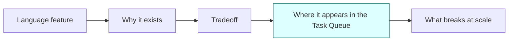
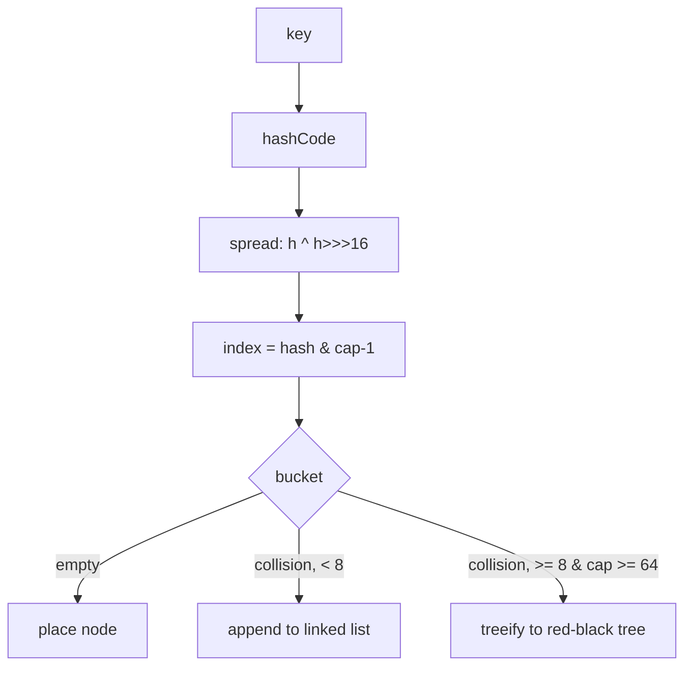
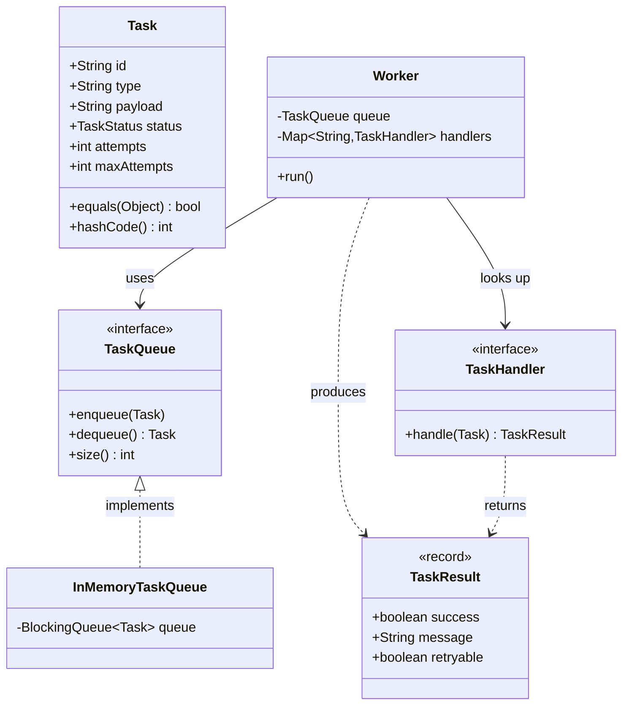

# Interview Prep: Core Java

> Where this fits: this is the Core Java question bank for the **Distributed Task Queue and Event Processing Platform**. Every answer below is grounded in the canonical domain model (`Task`, `TaskStatus`, `TaskQueue`, `Worker`, `WorkerPool`, `RetryPolicy`, `TaskResult`) so that when an interviewer asks an abstract Java question, you can answer it *and* point at where it shows up in real backend code.

This file is a **bank of model answers**, not a tutorial. For the deep mechanics behind each topic, follow the relative links into the curriculum:

- OOP and references: [`../02-core-oop/chapter-09-polymorphism.md`](../02-core-oop/chapter-09-polymorphism.md), [`../02-core-oop/chapter-01-objects-and-references.md`](../02-core-oop/chapter-01-objects-and-references.md)
- Generics: [`../01-java-fundamentals/chapter-04-generics.md`](../01-java-fundamentals/chapter-04-generics.md)
- Collections: [`../01-java-fundamentals/chapter-05-collections.md`](../01-java-fundamentals/chapter-05-collections.md), [`../06-concurrency/concurrent-collections.md`](../06-concurrency/concurrent-collections.md)
- Memory model and GC: [`../03-java-memory-model/garbage-collection.md`](../03-java-memory-model/garbage-collection.md), [`../03-java-memory-model/stack-vs-heap.md`](../03-java-memory-model/stack-vs-heap.md), [`../03-java-memory-model/immutable-objects.md`](../03-java-memory-model/immutable-objects.md), [`../03-java-memory-model/string-pool.md`](../03-java-memory-model/string-pool.md), [`../03-java-memory-model/pass-by-value.md`](../03-java-memory-model/pass-by-value.md)
- Exceptions and streams: [`../01-java-fundamentals/chapter-06-exceptions.md`](../01-java-fundamentals/chapter-06-exceptions.md), [`../01-java-fundamentals/chapter-07-streams.md`](../01-java-fundamentals/chapter-07-streams.md)
- Concurrency primitives behind the JMM: [`../06-concurrency/atomics-and-thread-safety.md`](../06-concurrency/atomics-and-thread-safety.md), [`../06-concurrency/locks.md`](../06-concurrency/locks.md)

---

## How to use this bank

Each question lists three things: a tight **model answer**, the **follow-ups** an interviewer typically chains, and **what they're really testing**. Read the model answer out loud once — if you can't reproduce the reasoning (not the words), you don't own it yet. The strongest signal you can send is connecting a language feature to a production decision in the Task Queue.



A great candidate walks that whole chain unprompted. A weak candidate stops at A.

---

## Easy

### E1. What is the difference between `==` and `.equals()` for objects?

**Model answer.** `==` compares references (identity) for objects and raw values for primitives. `.equals()` compares logical equality as defined by the class. The default `Object.equals` is reference equality, so unless a class overrides it, `==` and `.equals()` behave the same. We override `equals` (and `hashCode`) when we want value semantics.

In the project, two `Task` objects with the same `id` should be considered equal even if they are distinct heap objects (e.g., one loaded from Postgres, one held in memory). So `Task.equals` is keyed on `id`:

```java
@Override
public boolean equals(Object o) {
    if (this == o) return true;
    if (!(o instanceof Task other)) return false; // enhanced instanceof, Java 16+
    return id.equals(other.id);
}

@Override
public int hashCode() {
    return id.hashCode();
}
```

**Follow-ups.** "When does `==` on `Integer` surprise you?" (autoboxing cache, -128..127). "What if `id` is null?" (use `Objects.equals`).
**Really testing.** Whether you know identity vs. equality and won't write `if (taskA == taskB)` to dedupe tasks.

### E2. What does `final` mean on a variable, method, and class?

**Model answer.** On a variable: it can be assigned exactly once (the *reference* is fixed, not the object's internal state). On a method: it cannot be overridden by subclasses. On a class: it cannot be subclassed. `final` is about preventing reassignment/extension, not about deep immutability.

```java
final List<String> types = new ArrayList<>();
types.add("email"); // legal — the list contents are mutable
// types = new ArrayList<>(); // compile error — reference is final
```

**Follow-ups.** "Does `final` make an object immutable?" (No — see [`../03-java-memory-model/immutable-objects.md`](../03-java-memory-model/immutable-objects.md).) "Why mark a class `final`?" (security, design intent, JIT can devirtualize).
**Really testing.** Whether you conflate `final` with immutability — a very common mix-up.

### E3. What is the difference between a checked and an unchecked exception?

**Model answer.** Checked exceptions extend `Exception` (but not `RuntimeException`) and must be declared or handled — the compiler enforces it. Unchecked exceptions extend `RuntimeException` and are not enforced. Checked = recoverable conditions the caller should anticipate (I/O failure). Unchecked = programming errors (null deref, bad argument).

Our `TaskHandler` deliberately declares a checked exception because handlers do real I/O (HTTP calls, DB writes) and failure is *expected*, not a bug:

```java
@FunctionalInterface
public interface TaskHandler {
    TaskResult handle(Task task) throws Exception;
}
```

The `Worker` catches it and converts it into a retry decision rather than crashing the pool.

**Follow-ups.** "Why do many modern APIs avoid checked exceptions?" (they don't compose with lambdas/streams). "Where does `Error` fit?" (JVM-level, don't catch).
**Really testing.** Knowing the categories and that checked exceptions leak into functional code.

### E4. What is autoboxing, and when does it bite you?

**Model answer.** Autoboxing converts a primitive to its wrapper (`int` → `Integer`) automatically; unboxing reverses it. It bites in three places: (1) `NullPointerException` when unboxing a `null` `Integer`, (2) silent performance cost in hot loops (allocation + GC pressure), and (3) `==` comparing wrapper identity instead of value.

```java
Integer a = 127, b = 127;   // cached -> a == b is true
Integer c = 128, d = 128;   // not cached -> c == d is false (!)
```

In the worker hot path we keep attempt counters as primitive `int` inside `Task` to avoid boxing on every dequeue.

**Follow-ups.** "What's the cache range and can you change it?" (-128..127, `-XX:AutoBoxCacheMax`). "How does this interact with collections?" (`List<Integer>` always boxes).
**Really testing.** Performance awareness and a classic gotcha.

### E5. What is the difference between an interface and an abstract class?

**Model answer.** An abstract class can hold state (fields), constructors, and a mix of concrete and abstract methods; a class extends exactly one. An interface (since Java 8) can have `default` and `static` methods but no instance state, and a class can implement many. Use an interface to declare a capability/contract (`TaskQueue`, `RetryPolicy`); use an abstract class to share implementation + state across a family of related types.

Our `TaskQueue` is an interface precisely because we want to swap implementations — `InMemoryTaskQueue`, `PostgresTaskQueue`, and a broker-backed one in Phase 4 — without changing `Worker`.

**Follow-ups.** "What problem do default methods solve and create?" (API evolution; the diamond problem, resolved by explicit override). "Can interfaces have private methods?" (Yes, Java 9+.)
**Really testing.** Composition vs. inheritance instincts. See [`../02-core-oop/chapter-17-composition-vs-inheritance.md`](../02-core-oop/chapter-17-composition-vs-inheritance.md).

### E6. What is a `record`, and what does it generate for you?

**Model answer.** A `record` is a transparent carrier for immutable data. The compiler generates a canonical constructor, private final fields, accessors (`id()`, not `getId()`), and value-based `equals`, `hashCode`, and `toString`. Records are implicitly `final` and cannot extend a class.

`TaskResult` is a textbook record — a value with no identity:

```java
public record TaskResult(boolean success, String message, boolean retryable) {
    public static TaskResult ok()                 { return new TaskResult(true, "ok", false); }
    public static TaskResult retry(String why)    { return new TaskResult(false, why, true); }
    public static TaskResult fail(String why)     { return new TaskResult(false, why, false); }
}
```

**Follow-ups.** "Can a record have validation?" (Yes — compact constructor.) "Can record fields be mutable?" (The reference is final, but a `List` field can still be mutated — defensively copy.)
**Really testing.** Knowing records are about *value semantics*, not just less typing.

### E7. What is the difference between `String`, `StringBuilder`, and `StringBuffer`?

**Model answer.** `String` is immutable — every concatenation creates a new object. `StringBuilder` is a mutable, non-synchronized buffer for building strings efficiently. `StringBuffer` is the same but synchronized (legacy; rarely the right choice today). For building a JSON `payload` or a log line in a loop, use `StringBuilder`.

```java
// Bad: O(n^2) garbage in a loop
String s = "";
for (var t : tasks) s += t.id() + ",";

// Good
var sb = new StringBuilder();
for (var t : tasks) sb.append(t.id()).append(',');
```

**Follow-ups.** "Where do string literals live?" (the string pool — see [`../03-java-memory-model/string-pool.md`](../03-java-memory-model/string-pool.md)). "Does the compiler optimize `+`?" (Single-line concatenation, yes; across loop iterations, no.)
**Really testing.** Immutability cost awareness.

### E8. What is the contract between `equals` and `hashCode`?

**Model answer.** If `a.equals(b)` is true, then `a.hashCode() == b.hashCode()` must be true. The reverse is not required (collisions are allowed). Violating this breaks every hash-based collection: a `Task` you `put` into a `HashMap` may be unfindable. `equals` must also be reflexive, symmetric, transitive, consistent, and `x.equals(null)` must be false.

**Follow-ups.** "What if you override `equals` but not `hashCode`?" (Map lookups silently fail.) "Can hashCode change over an object's lifetime?" (Only if no map holds it — better: derive from immutable fields like `Task.id`.)
**Really testing.** The single most common subtle bug in Java code.

---

## Medium

### M1. Explain how `HashMap` works internally.

**Model answer.** A `HashMap` is an array of buckets. `put(key, value)`:
1. Compute `key.hashCode()`, then *spread* the bits (`h ^ (h >>> 16)`) so high bits influence the bucket index — cheap defense against weak hash functions.
2. Index = `hash & (capacity - 1)` (capacity is a power of two, so this is a fast mask instead of modulo).
3. If the bucket is empty, insert. On collision, walk the bucket comparing with `equals`; replace on match, append otherwise.
4. Buckets are linked lists, but once a single bucket exceeds **8** entries (and table capacity is at least 64), it **treeifies** into a red-black tree, turning worst-case lookup from O(n) to O(log n).
5. When `size > capacity * loadFactor` (default 0.75), the table **resizes** to double capacity and rehashes.



**Follow-ups.** "Why power-of-two capacity?" (mask trick). "Why 0.75 load factor?" (space/time tradeoff — fewer collisions vs. memory). "What changed in Java 8?" (treeification). "Is iteration order guaranteed?" (No — use `LinkedHashMap` for insertion order.)
**Really testing.** Whether you understand the data structure you reach for daily. Deep dive: [`../01-java-fundamentals/chapter-05-collections.md`](../01-java-fundamentals/chapter-05-collections.md).

### M2. How is `ConcurrentHashMap` different from `HashMap` and from `Collections.synchronizedMap`?

**Model answer.** `synchronizedMap` wraps a map with a single lock on every method — correct but a bottleneck, and compound operations ("check then put") still aren't atomic. `ConcurrentHashMap` (Java 8+) locks at the granularity of an individual bin/bucket using CAS for the common case and `synchronized` on the first node of a contended bin, so independent buckets proceed in parallel. Reads are mostly lock-free. It rejects `null` keys and values (so a `null` can't be ambiguous between "absent" and "mapped to null" under concurrency).

In the project we register handlers in a `ConcurrentHashMap<String, TaskHandler>` keyed by task type, because workers on many threads look up handlers concurrently while the registry may still be mutated at startup:

```java
private final ConcurrentMap<String, TaskHandler> handlers = new ConcurrentHashMap<>();

public void register(String type, TaskHandler handler) {
    if (handlers.putIfAbsent(type, handler) != null) {
        throw new IllegalStateException("Duplicate handler for type: " + type);
    }
}
```

For atomic read-modify-write we use `compute`/`merge`/`putIfAbsent`, never get-then-put.

**Follow-ups.** "How does `computeIfAbsent` help?" (atomic lazy init). "Pre-Java-8 segments vs. now?" (segmented locking → per-bin CAS). "Is `size()` exact under concurrency?" (an estimate).
**Really testing.** Concurrency correctness. See [`../06-concurrency/concurrent-collections.md`](../06-concurrency/concurrent-collections.md).

### M3. Why must you override `hashCode` whenever you override `equals`? Show what breaks.

**Model answer.** Hash collections find an object by first hashing to a bucket, *then* using `equals` within that bucket. If two equal objects produce different hash codes, they land in different buckets and the map never finds the match.

```java
record BadKey(String id) {
    // equals uses id, but we "forgot" hashCode (pretend record didn't generate it)
}
// Simulating the bug with a class:
class Key {
    final String id;
    Key(String id) { this.id = id; }
    @Override public boolean equals(Object o) {
        return o instanceof Key k && id.equals(k.id);
    }
    // no hashCode override -> uses Object identity hash
}

var map = new HashMap<Key, String>();
map.put(new Key("t-1"), "v");
map.get(new Key("t-1")); // returns null! different identity hash -> wrong bucket
```

Records avoid this because they generate both consistently. This is exactly why we let `Task` rely on `Objects.hash(id)` or a record — so deduping a re-submitted task by `id` actually works.

**Follow-ups.** "Why is a constant `hashCode` legal but terrible?" (correct but O(n) — everything collides into one bucket). "How do you write a good hashCode?" (`Objects.hash(...)` over the same fields `equals` uses).
**Really testing.** The contract from E8, demonstrated under pressure.

### M4. What is an immutable object and how do you build one correctly?

**Model answer.** An immutable object's observable state cannot change after construction. Recipe: (1) make the class `final` (or use a record/sealed type), (2) make all fields `private final`, (3) set them only in the constructor, (4) don't expose mutators, and (5) **defensively copy** mutable inputs/outputs (collections, `Date`, arrays). Immutability gives you free thread-safety, safe map keys, and easy reasoning.

```java
public final class TaskSnapshot {
    private final String id;
    private final TaskStatus status;
    private final List<String> tags;

    public TaskSnapshot(String id, TaskStatus status, List<String> tags) {
        this.id = id;
        this.status = status;
        this.tags = List.copyOf(tags); // defensive copy -> caller can't mutate later
    }
    public List<String> tags() { return tags; } // already unmodifiable
}
```

We treat a `Task`'s identity (`id`, `type`, `createdAt`) as immutable; only its mutable lifecycle (`status`, `attempts`) changes, and in Phase 2+ we prefer producing a new `Task` with updated status rather than mutating shared state across threads.

**Follow-ups.** "Why is `String` immutable?" (pooling, security, hashcode caching, thread-safety). "Records and defensive copies?" (compact constructor must still copy mutable fields). Deep dive: [`../03-java-memory-model/immutable-objects.md`](../03-java-memory-model/immutable-objects.md).
**Really testing.** Whether you can ship thread-safe code by design instead of by locking.

### M5. Is Java pass-by-value or pass-by-reference?

**Model answer.** Java is **always pass-by-value**. For objects, the *value passed is the reference* (a copy of the pointer). So a method can mutate the object the reference points to, but reassigning the parameter inside the method does not affect the caller's variable.

```java
void retry(Task t)  { t.incrementAttempts(); }     // caller sees the change (same object)
void reset(Task t)  { t = new Task(...); }          // caller sees NOTHING (local copy reassigned)
```

**Follow-ups.** "Then why does mutating a list inside a method affect the caller?" (same object, copied reference). "How would you swap two objects in a method?" (you can't via parameters — return them or use a holder).
**Really testing.** A genuine understanding test that trips even experienced devs. Deep dive: [`../03-java-memory-model/pass-by-value.md`](../03-java-memory-model/pass-by-value.md).

### M6. Explain generics, type erasure, and bounded wildcards.

**Model answer.** Generics give compile-time type safety and remove casts. The JVM uses **type erasure**: generic type parameters are erased to their bound (`Object` by default) at runtime, so `List<String>` and `List<Integer>` are the same class at runtime. Consequences: you can't do `new T[]`, can't call `instanceof List<String>`, and overloads can't differ only by type parameter.

Wildcards encode variance. Mnemonic **PECS — Producer `extends`, Consumer `super`**:

```java
// Producer of tasks -> read with ? extends
double avgPriority(List<? extends Task> source) {
    return source.stream().mapToInt(Task::priority).average().orElse(0);
}

// Consumer of tasks -> write with ? super
void drainInto(TaskQueue q, List<? super Task> sink) throws InterruptedException {
    sink.add(q.dequeue());
}
```

`TaskQueue` is itself generic-friendly: we could declare `interface TaskQueue` over `Task`, and a generic `RetryPolicy` registry stores handlers without unchecked casts.

**Follow-ups.** "What's a bridge method?" (synthetic method the compiler adds to preserve polymorphism under erasure). "Why does `List<Object>` not accept a `List<String>`?" (invariance — would break type safety on writes). "How do you get the runtime type back?" (pass a `Class<T>` token).
**Really testing.** Whether you can write reusable, type-safe APIs. Deep dive: [`../01-java-fundamentals/chapter-04-generics.md`](../01-java-fundamentals/chapter-04-generics.md).

### M7. What is the difference between `Comparable` and `Comparator`?

**Model answer.** `Comparable<T>` defines a type's *natural ordering* via `compareTo`, baked into the class. `Comparator<T>` is an external strategy you pass in, so you can sort the same type many ways without touching it. Our priority queue orders tasks by `priority` (high first), then by `scheduledAt` (earliest first):

```java
Comparator<Task> byPriority =
    Comparator.comparingInt(Task::priority).reversed()
              .thenComparing(Task::scheduledAt);

var pq = new PriorityQueue<>(byPriority);
```

**Follow-ups.** "Why prefer `Comparator` for domain objects?" (avoids coupling ordering to the entity; supports multiple orderings). "What breaks if `compareTo` is inconsistent with `equals`?" (`TreeSet`/`TreeMap` may drop entries). "Integer subtraction in a comparator?" (overflow — use `Integer.compare`).
**Really testing.** Strategy pattern instincts and ordering correctness. See [`../07-queues-and-messaging/priority-queues.md`](../07-queues-and-messaging/priority-queues.md).

### M8. Walk through the Java Stream API: intermediate vs. terminal operations, and laziness.

**Model answer.** A stream is a pipeline: a source, zero+ **intermediate** operations (`map`, `filter`, `sorted` — lazy, return a new stream), and exactly one **terminal** operation (`collect`, `forEach`, `reduce` — eager, triggers execution). Nothing runs until the terminal op. Streams are single-use, don't mutate the source, and favor stateless, side-effect-free functions.

```java
Map<TaskStatus, Long> counts = tasks.stream()
    .filter(t -> t.attempts() > 0)
    .collect(Collectors.groupingBy(Task::status, Collectors.counting()));
```

**Follow-ups.** "What is short-circuiting?" (`findFirst`, `anyMatch`, `limit` stop early). "When is parallel stream a bad idea?" (small data, ordered work, blocking I/O, shared mutable state — workers should use an `ExecutorService` instead). "`map` vs `flatMap`?" (one-to-one vs one-to-many flattening).
**Really testing.** Functional fluency and knowing parallel streams are *not* a worker pool. Deep dive: [`../01-java-fundamentals/chapter-07-streams.md`](../01-java-fundamentals/chapter-07-streams.md).

### M9. What are sealed classes/interfaces and why use them?

**Model answer.** A `sealed` type explicitly lists its permitted subtypes with `permits`. It models a *closed* set of variants — the opposite of an open interface. Combined with records and `switch` pattern matching, you get exhaustive, compiler-checked handling: add a variant, and every non-exhaustive switch fails to compile.

```java
public sealed interface TaskOutcome
        permits Succeeded, Failed, Retry, DeadLettered {}

public record Succeeded(String message) implements TaskOutcome {}
public record Failed(String reason)     implements TaskOutcome {}
public record Retry(int nextAttempt)    implements TaskOutcome {}
public record DeadLettered(String why)  implements TaskOutcome {}

String describe(TaskOutcome o) {
    return switch (o) {                       // no default needed -> exhaustive
        case Succeeded s    -> "ok: " + s.message();
        case Failed f       -> "failed: " + f.reason();
        case Retry r        -> "retry #" + r.nextAttempt();
        case DeadLettered d -> "dead: " + d.why();
    };
}
```

This is how we model what the `Worker` does after a `TaskResult` — a finite, exhaustively-handled set of outcomes.

**Follow-ups.** "Sealed vs. enum?" (enum = fixed *instances*; sealed = fixed *types* that can carry data). "Why does exhaustiveness matter?" (refactor safety — the compiler finds every switch when you add `Throttled`).
**Really testing.** Modern Java modeling and algebraic-data-type thinking. See [`../02-core-oop/chapter-13-interfaces.md`](../02-core-oop/chapter-13-interfaces.md).

### M10. Explain `try-with-resources` and the `AutoCloseable` contract.

**Model answer.** `try-with-resources` deterministically closes any `AutoCloseable` at the end of the block, even on exception, in reverse order of acquisition. It also handles **suppressed exceptions** (if both the body and `close()` throw, the body's exception is primary and `close`'s is attached via `getSuppressed()`), which the old `finally` idiom got wrong.

```java
try (var conn = dataSource.getConnection();
     var ps = conn.prepareStatement("UPDATE tasks SET status=? WHERE id=?")) {
    ps.setString(1, TaskStatus.RUNNING.name());
    ps.setString(2, task.id());
    ps.executeUpdate();
} // ps then conn closed automatically, even on SQLException
```

In `PostgresTaskQueue` (Phase 2) every connection, statement, and result set is managed this way to prevent connection-pool leaks.

**Follow-ups.** "Order of closing?" (reverse — LIFO). "Can you use an existing variable?" (Java 9+ effectively-final resources). "What's a connection leak's symptom?" (pool exhaustion under load).
**Really testing.** Resource discipline — the difference between a demo and production.

### M11. Compare `ArrayList` and `LinkedList`. When would you actually pick `LinkedList`?

**Model answer.** `ArrayList` is a contiguous array: O(1) random access, O(1) amortized append, cache-friendly, but O(n) inserts/removes in the middle and resize copies. `LinkedList` is a doubly-linked list: O(1) insert/remove *given a node*, but O(n) random access and poor cache locality plus per-node object overhead. In practice `ArrayList` wins almost always. `LinkedList`'s only real edge is as a `Deque`/queue when you frequently add/remove at both ends — and even then `ArrayDeque` usually beats it.

For the in-memory task queue we don't use either directly — we use a `BlockingQueue` (`LinkedBlockingQueue` / `ArrayBlockingQueue`) for the producer-consumer handoff.

**Follow-ups.** "Default `ArrayList` capacity and growth?" (10, grows ~1.5×). "Why is `ArrayDeque` preferred over `Stack` and `LinkedList`?" (no sync overhead, better locality).
**Really testing.** Big-O *and* mechanical sympathy (cache behavior), not just textbook complexity.

### M12. What is the difference between `wait/notify` and a `BlockingQueue`?

**Model answer.** `wait`/`notify`/`notifyAll` are low-level monitor primitives: you must hold the object's lock, loop on a condition (always `while`, never `if`, to defend against spurious wakeups), and manually coordinate. A `BlockingQueue` is a high-level, correct, reusable implementation of exactly the producer-consumer handshake — `put` blocks when full, `take` blocks when empty — so you almost never hand-roll `wait/notify` in application code.

```java
public final class InMemoryTaskQueue implements TaskQueue {
    private final BlockingQueue<Task> queue = new LinkedBlockingQueue<>();
    @Override public void enqueue(Task t)            { queue.offer(t); }
    @Override public Task dequeue() throws InterruptedException { return queue.take(); }
    @Override public int  size()                     { return queue.size(); }
}
```

**Follow-ups.** "Why `while` not `if` around `wait`?" (spurious wakeups + condition may no longer hold). "`notify` vs `notifyAll`?" (notify can deadlock with multiple condition predicates). "Bounded vs unbounded queue?" (bounded gives backpressure — see [`../08-distributed-systems/backpressure.md`](../08-distributed-systems/backpressure.md)).
**Really testing.** Whether you reach for the right abstraction. Deep dive: [`../06-concurrency/blocking-queue.md`](../06-concurrency/blocking-queue.md).

---

## Hard

### H1. Explain the Java Memory Model: happens-before, `volatile`, and why double-checked locking was broken.

**Model answer.** The JMM defines *when* a write by one thread becomes visible to a read by another. Without synchronization, threads may observe stale or reordered values because of CPU caches and compiler/JIT reordering. The JMM gives you **happens-before** edges; if action A happens-before action B, A's effects are visible to B. Key edges: program order within a thread; unlock-then-lock on the same monitor; a `volatile` write happens-before a subsequent `volatile` read of the same field; `Thread.start()` and `Thread.join()`; and writes to `final` fields are visible after construction completes (the *final-field freeze*).

`volatile` guarantees visibility and prevents reordering of that field's reads/writes, but **not atomicity** of compound operations (`count++` is read-modify-write — still racy; use `AtomicInteger`).

Double-checked locking (lazy singleton without `volatile`) was broken pre-Java-5 and is still subtly wrong without `volatile`: the publishing thread can make the reference visible *before* the constructor's writes are visible, so another thread sees a non-null but partially-constructed object. The fix is a `volatile` field — or just use the holder idiom:

```java
// Correct, lazy, lock-free: initialization-on-demand holder
final class Metrics {
    private Metrics() {}
    private static final class Holder { static final Metrics INSTANCE = new Metrics(); }
    static Metrics instance() { return Holder.INSTANCE; } // JVM guarantees class-init safety
}
```

For our `MetricsCollector` counters shared across worker threads, we use `LongAdder`/`AtomicLong` rather than a `volatile long`, because increments are read-modify-write.

**Follow-ups.** "Does `volatile` make `i++` atomic?" (No.) "What is safe publication?" (publishing a reference such that readers see fully-constructed state — via final fields, volatile, locks, or concurrent collections). "Why is the holder idiom safe and lazy?" (class init happens-before any access, and the class loads only on first use).
**Really testing.** The deepest correctness topic in Java. See [`../06-concurrency/atomics-and-thread-safety.md`](../06-concurrency/atomics-and-thread-safety.md) and [`../06-concurrency/locks.md`](../06-concurrency/locks.md).

### H2. How does garbage collection work, and what GC would you choose for a low-latency task processor?

**Model answer.** The JVM heap is **generationally** managed on the *weak generational hypothesis*: most objects die young. New objects go in the **young generation** (Eden + two survivor spaces); a fast **minor GC** copies survivors and promotes long-lived objects to the **old generation**, collected by a slower **major/full GC**. GCs are *tracing* collectors — they start from GC roots (stack frames, statics, JNI) and reclaim anything unreachable. Reference equality to "live" is reachability, not reference count, so cycles are collected fine.

Collector choices on modern JDKs:

| Collector | Strength | Use when |
|---|---|---|
| G1 (default) | Balanced, region-based, predictable pauses | General server workloads |
| ZGC | Sub-millisecond pauses, scales to TBs, concurrent | Latency-sensitive, large heaps |
| Shenandoah | Low pause, concurrent compaction | Latency-sensitive (RedHat builds) |
| Parallel | Max throughput, longer pauses | Batch jobs, throughput over latency |
| Serial | Tiny footprint | Small containers/CLIs |

For a task processor where API tail latency matters and worker threads churn many short-lived `Task`/`TaskResult` objects, I'd start with **G1** and set a pause target (`-XX:MaxGCPauseMillis`), then move to **ZGC** if p99 pauses hurt SLOs on a large heap. I'd also reduce allocation pressure (reuse buffers, avoid boxing) so minor GCs stay cheap, and size the young gen for the high allocation rate.


**Follow-ups.** "What is a memory leak in a GC'd language?" (unintentional reachability — e.g., a static `Map` cache that never evicts holding dead `Task`s). "What are GC roots?" "Soft/weak/phantom references?" (cache eviction, canonicalizing maps, cleanup). "How do you diagnose GC issues?" (GC logs, `jstat`, heap dumps, allocation profiler).
**Really testing.** Production memory thinking. Deep dive: [`../03-java-memory-model/garbage-collection.md`](../03-java-memory-model/garbage-collection.md).

### H3. Where do objects, references, and primitives live — stack vs. heap — and how does this affect the worker pool?

**Model answer.** Local variables and method parameters (including object *references* and primitive locals) live on each thread's **stack**; the objects they point to live on the shared **heap**. Each thread has its own stack (default ~512KB–1MB), so deep recursion blows the stack (`StackOverflowError`), while too many large objects exhaust the heap (`OutOfMemoryError`).

This matters directly for the `WorkerPool`: each `Worker` thread has its own stack, so per-task locals (the dequeued `Task` reference, loop counters) are inherently thread-confined and need no synchronization. The *objects* (`Task`, shared `TaskQueue`, `handlers` map) live on the heap and ARE shared — those are the only things that need thread-safety. Thread confinement (keep mutable state on the stack) is the cheapest concurrency strategy and the reason a clean worker body is naturally safe.

```java
public final class Worker implements Runnable {
    private final TaskQueue queue;                 // shared (heap) reference
    private final Map<String, TaskHandler> handlers;

    @Override public void run() {
        while (!Thread.currentThread().isInterrupted()) {
            try {
                Task task = queue.dequeue();        // 'task' ref is stack-confined per thread
                TaskHandler h = handlers.get(task.type());
                TaskResult r = h.handle(task);      // locals confined -> no locking needed
                // outcome handling...
            } catch (InterruptedException e) {
                Thread.currentThread().interrupt();
                return;
            } catch (Exception e) {
                // convert to retry/DLQ decision
            }
        }
    }
}
```

**Follow-ups.** "Can objects ever live on the stack?" (escape analysis may scalar-replace/stack-allocate non-escaping objects — an optimization, not a guarantee). "Why is each thread's stack separate?" (isolation; enables thread confinement). "How big is a default stack and how do you change it?" (`-Xss`).
**Really testing.** Mental model behind every concurrency bug. Deep dive: [`../03-java-memory-model/stack-vs-heap.md`](../03-java-memory-model/stack-vs-heap.md).

### H4. What are virtual threads (Project Loom) and when do they change your worker design?

**Model answer.** Virtual threads (stable in Java 21) are lightweight threads scheduled by the JVM onto a small pool of OS carrier threads. Blocking a virtual thread (on I/O, `BlockingQueue.take`, JDBC) *unmounts* it from its carrier instead of blocking an OS thread, so you can have millions of them. They make the simple "thread-per-task, blocking code" style scale — you write straightforward sequential code and get high concurrency.

For our worker pool: classic platform threads are bounded by OS thread cost, so a fixed pool (say 16–64 threads) limits in-flight I/O-bound tasks. With virtual threads, the bottleneck shifts to the *real* resource (DB connections, downstream rate limits), not thread count:

```java
// Phase 4 option: a virtual-thread-per-task executor for I/O-bound handlers
ExecutorService workers = Executors.newVirtualThreadPerTaskExecutor();
for (int i = 0; i < concurrency; i++) {
    workers.submit(new Worker(queue, handlers));
}
```

But virtual threads are *not* a free lunch: they don't speed up CPU-bound work (you still need cores), you must avoid **pinning** (holding a `synchronized` block across a blocking call pins the carrier — prefer `ReentrantLock`), and unbounded fan-out can overwhelm downstreams, so you still need a `RateLimiter`/`Semaphore` for backpressure.

**Follow-ups.** "Platform vs virtual thread cost?" (~1MB stack + OS resource vs. a few hundred bytes, JVM-managed). "What causes pinning?" (`synchronized`, native frames). "Do virtual threads replace reactive programming?" (largely, for readability — same scalability with sequential code).
**Really testing.** Whether you track modern Java and won't over-thread CPU-bound code. See [`../06-concurrency/executor-service.md`](../06-concurrency/executor-service.md).

### H5. Design `equals`/`hashCode`/`Comparable` for `Task` such that it's correct as a `HashMap` key AND in a `PriorityQueue`. What are the traps?

**Model answer.** The trap is that **map/set semantics and ordering semantics must not be conflated**. Hash-based collections rely on `equals`/`hashCode`; ordered collections (`TreeSet`, `PriorityQueue`) rely on ordering. If `compareTo` and `equals` disagree, `TreeSet`/`TreeMap` treat "compares equal" as "equal" and silently drop elements — so they must be *consistent* there. A `PriorityQueue` doesn't require that consistency (it permits duplicates and uses ordering only for the heap), so it's fine for `compareTo` to be a partial ordering by priority while `equals` uses `id`.

My design: identity = `id` (immutable, unique). Ordering for scheduling = priority then time. Keep them separate — equality by `id`, ordering by an external `Comparator`, *not* `Comparable`, so I never accidentally feed an `id`-inconsistent natural ordering into a `TreeSet`.

```java
public record Task(String id, String type, String payload, TaskStatus status,
                   int attempts, int maxAttempts, Instant createdAt,
                   Instant scheduledAt, int priority) {

    // Record already generates equals/hashCode over ALL components — too broad for identity.
    // Override to key on id only, matching "same task" semantics:
    @Override public boolean equals(Object o) {
        return o instanceof Task t && id.equals(t.id);
    }
    @Override public int hashCode() { return id.hashCode(); }

    // Ordering lives OUTSIDE the type, as a Comparator:
    public static final Comparator<Task> SCHEDULING_ORDER =
        Comparator.comparingInt(Task::priority).reversed()
                  .thenComparing(Task::scheduledAt)
                  .thenComparing(Task::id); // tie-break -> total order, safe for TreeSet
}
```

Traps: (1) letting the record's default `equals` (all fields) be your identity — then a status change makes "the same task" unequal and breaks dedupe; (2) using `Integer` priority subtraction in a comparator (overflow); (3) a non-total `compareTo` in a `TreeSet`; (4) mutating a field used in `hashCode` while the object is a live map key.

**Follow-ups.** "Why add `id` as the final tie-breaker?" (guarantees a total order, so `TreeSet` never drops distinct tasks). "Is overriding a record's `equals` legal?" (Yes, but document why — it's surprising.) "Could you instead use a wrapper key?" (Yes — a `TaskId` value object is cleaner long-term.)
**Really testing.** Mastery of equality, ordering, and the interaction with every collection.

### H6. You see `OutOfMemoryError: GC overhead limit exceeded` in production worker nodes. How do you diagnose and fix it?

**Model answer.** That error means the JVM spends >98% of time in GC reclaiming <2% of heap — effectively a memory leak or undersized heap. My process:

1. **Confirm the symptom.** Check GC logs (`-Xlog:gc*`) and metrics — is heap-after-GC trending upward (leak) or just saturated (undersizing/spike)?
2. **Capture evidence.** Take a heap dump on OOM (`-XX:+HeapDumpOnOutOfMemoryError -XX:HeapDumpPath=...`) and analyze with Eclipse MAT — find the dominator tree and the biggest retained set.
3. **Find the leak's root.** Common culprits in a task processor: an unbounded in-memory queue (no backpressure), a `Map` cache of `Task`/results that never evicts, accumulating `CompletableFuture`s, `ThreadLocal`s not cleaned in a pooled thread, or listeners/subscriptions on the `EventBus` never unsubscribed.
4. **Fix structurally.** Bound the queue (`new LinkedBlockingQueue<>(capacity)`) to get backpressure; evict caches (size/TTL via Caffeine or `LinkedHashMap` LRU); clean `ThreadLocal` in `finally`; unsubscribe listeners. Only *then* consider raising `-Xmx`.
5. **Prevent regression.** Add a heap-utilization alert, a queue-depth gauge in `MetricsCollector`, and a load test that holds steady-state memory.

For us, the classic cause is an **unbounded `InMemoryTaskQueue`** under a producer faster than the workers — the queue grows without limit. The real fix is backpressure (bounded queue + caller throttling/`RateLimiter`), not a bigger heap.

**Follow-ups.** "Leak vs. spike — how do you tell?" (heap-after-full-GC trend). "Why is bounding the queue the right fix?" (it makes overload a controlled rejection, not a crash — see [`../08-distributed-systems/backpressure.md`](../08-distributed-systems/backpressure.md)). "What's a `ThreadLocal` leak in a pool?" (value survives across reused tasks).
**Really testing.** End-to-end production debugging methodology, not just a flag.

### H7. Explain `final`-field semantics and safe publication. Why can a "thread-safe-looking" object still be seen half-constructed?

**Model answer.** When a constructor finishes, the JMM guarantees that any thread that sees the object *through a properly published reference* will see correctly-initialized **`final`** fields (the *freeze* action at end of construction prevents those writes from being reordered after publication). Non-final fields get no such guarantee. So an object can be seen half-constructed when (a) it has non-final mutable fields and (b) its reference is published via a data race (a plain write another thread reads without synchronization), OR when the constructor leaks `this` to another thread before completing.

```java
// DANGER: leaking 'this' from a constructor
class Worker {
    Worker(EventBus bus) {
        bus.subscribe(this::onEvent); // 'this' escapes before construction finishes!
    }
}
```

Safe publication options: initialize into a `final` field; store through a `volatile` field; use a `synchronized` lock for the handoff; or place it in a thread-safe collection (`ConcurrentHashMap`, `BlockingQueue`) whose internal synchronization establishes happens-before. We rely on the last one constantly: a `Task` published into the `BlockingQueue` by a producer is safely visible — fully constructed — to the consuming `Worker`, with no extra locking, precisely because `put`/`take` create happens-before edges.

**Follow-ups.** "Why are immutable objects (all-final) automatically thread-safe to share?" (final-field guarantee + no mutation). "What's wrong with publishing via a non-volatile static field?" (race; reader may see null or stale). "Why is leaking `this` in a constructor dangerous?" (others see a partially built object).
**Really testing.** The bridge between the JMM (H1) and real concurrent code. See [`../03-java-memory-model/object-references.md`](../03-java-memory-model/object-references.md).

### H8. `String` interning and the string pool: what happens, and when does it help or hurt?

**Model answer.** String literals are automatically interned in a pool (in modern JVMs the pool lives in the heap, backed by a native hash table), so identical literals share one object. `new String("x")` creates a *distinct* heap object; `.intern()` returns the pooled canonical instance. Interning saves memory when you have massive duplication of the same strings and lets you compare with `==` — but interning *uncontrolled* data (e.g., every incoming `Task.payload`) can bloat the pool, cause hash collisions, and pin memory, since interned strings are only collected with their entry. So: rely on literal interning, use `.equals` for comparison, and intern user data only deliberately with bounded cardinality.

```java
String a = "email";
String b = "email";
System.out.println(a == b);                 // true  -> same pooled literal
String c = new String("email");
System.out.println(a == c);                 // false -> distinct object
System.out.println(a == c.intern());        // true  -> canonicalized
```

In the Task Queue, `task.type()` values are a small fixed set ("email", "report", ...), so they're effectively pooled and cheap to compare; `task.payload()` is arbitrary JSON and must never be interned.

**Follow-ups.** "Where does the pool live now?" (heap since Java 7; tunable with `-XX:StringTableSize`). "Compact strings?" (Java 9 stores Latin-1 as bytes to halve memory). "Why not `==` for general string comparison?" (only literals/interned strings are guaranteed shared).
**Really testing.** Memory internals and a security/perf footgun. Deep dive: [`../03-java-memory-model/string-pool.md`](../03-java-memory-model/string-pool.md).

### H9. Compare exception-handling strategies in the `Worker`: what should it catch, and what should it never swallow?

**Model answer.** The `Worker` runs an unbounded loop and must survive any *task* failure without dying, while never hiding *infrastructure* failures. The discipline:

- **Catch `Exception` from `handler.handle(task)`** and convert it into a retry/DLQ decision via `TaskResult`/`RetryPolicy`. A bad handler must not kill the worker.
- **Never catch `Error`** (`OutOfMemoryError`, `StackOverflowError`) — these are JVM-fatal; let them propagate and let the process restart.
- **Treat `InterruptedException` specially** — it's a shutdown signal, not a task failure. Restore the interrupt flag and exit the loop (don't log-and-continue, or shutdown hangs).
- **Never swallow silently** — an empty `catch {}` is the cardinal sin; always record to `MetricsCollector` and route to the `DeadLetterQueue` when retries are exhausted.

```java
try {
    Task task = queue.dequeue();
    TaskResult result = handlers.get(task.type()).handle(task);
    if (result.success()) {
        metrics.succeeded(task.type());
    } else if (result.retryable() && task.attempts() < task.maxAttempts()) {
        scheduleRetry(task);                 // RetryPolicy.nextDelay(...)
    } else {
        deadLetterQueue.send(task, result.message());
        metrics.deadLettered(task.type());
    }
} catch (InterruptedException e) {
    Thread.currentThread().interrupt();      // restore flag, honor shutdown
    return;
} catch (Exception e) {                       // any handler failure -> retry/DLQ, keep looping
    metrics.errored();
    handleUnexpectedFailure(task, e);
}
```

**Follow-ups.** "Why restore the interrupt flag?" (so the pool can shut down cleanly — see [`../06-concurrency/executor-service.md`](../06-concurrency/executor-service.md)). "Catch-and-rethrow vs wrap?" (preserve cause: `new TaskException(msg, e)`). "Where do retries and DLQ live conceptually?" ([`../08-distributed-systems/retries.md`](../08-distributed-systems/retries.md), [`../07-queues-and-messaging/dead-letter-queues.md`](../07-queues-and-messaging/dead-letter-queues.md)).
**Really testing.** Whether you can write a fault-tolerant loop, not just `try/catch`. Deep dive: [`../01-java-fundamentals/chapter-06-exceptions.md`](../01-java-fundamentals/chapter-06-exceptions.md).

### H10. What is the difference between fail-fast and fail-safe iterators, and why does it matter for shared state?

**Model answer.** Fail-fast iterators (most `java.util` collections — `ArrayList`, `HashMap`) track a `modCount` and throw `ConcurrentModificationException` if the collection is structurally modified during iteration (even from the same thread via `list.remove` in a for-each). It's a *best-effort* bug detector, not a thread-safety guarantee. Fail-safe iterators (`CopyOnWriteArrayList`, `ConcurrentHashMap`) iterate over a snapshot or tolerate concurrent modification without throwing, at the cost of possibly not reflecting the latest writes.

For the `EventBus` (Phase 4), listeners are added/removed while events are being published to them concurrently, so the subscriber list is a `CopyOnWriteArrayList` — reads (publishes) are lock-free and never throw, and the rare write (subscribe) pays a copy:

```java
private final List<TaskEventListener> listeners = new CopyOnWriteArrayList<>();
public void publish(TaskEvent e) {
    for (var l : listeners) l.onEvent(e); // safe even if someone subscribes mid-iteration
}
```

**Follow-ups.** "Is CME guaranteed?" (No — best effort.) "Why is `CopyOnWriteArrayList` bad for write-heavy data?" (every write copies — O(n)). "How do you remove safely from `java.util`?" (`Iterator.remove` or `removeIf`).
**Really testing.** Understanding shared-state hazards beyond just "use locks."

---

## Rapid-fire one-liners

- **`int` default vs `Integer` default?** `0` vs `null`.
- **Is `String` thread-safe?** Yes — it's immutable.
- **Can you override a `static` method?** No — static methods are hidden, not overridden.
- **`finally` after `return`?** It runs; a `return` in `finally` overrides earlier returns (avoid it).
- **Marker interface example?** `Serializable`, `Cloneable` — no methods, just a tag.
- **`hashCode` of a record?** Generated from all components (override if identity is narrower).
- **`equals` symmetric requirement?** `a.equals(b)` ⇔ `b.equals(a)` — broken by subclassing across types.
- **Default `HashMap` capacity / load factor?** 16 / 0.75.
- **`Optional` field in an entity?** Avoid — `Optional` is for return types, not fields or params.
- **`ConcurrentHashMap` null key?** Forbidden (ambiguity under concurrency).
- **Checked exception in a `Stream` lambda?** Doesn't compile — wrap or use a custom functional interface.
- **`volatile` makes `count++` atomic?** No — use `AtomicInteger`/`LongAdder`.
- **Diamond problem with default methods?** Compiler forces you to override and pick `Iface.super.method()`.
- **Record can extend a class?** No — records are implicitly `final` and extend `Record`.
- **`switch` on a sealed type needs `default`?** No, if it's exhaustive.
- **Garbage collect by reference count?** No — by reachability, so cycles are reclaimed.

---

## Red flags that sink candidates

- Saying Java is **pass-by-reference**. (It is always pass-by-value; the value can be a reference.)
- Overriding `equals` but **not** `hashCode` (or vice versa) and not knowing it breaks `HashMap`.
- Claiming `final` makes an object **immutable**, or that immutable means "can't be reassigned."
- Thinking `volatile` provides **atomicity**, or that `synchronized`/`AtomicInteger` are interchangeable.
- Reaching for `Vector`/`Hashtable`/`StringBuffer`/`Stack` by default ("synchronized = safe").
- Using a **parallel stream** as a substitute for a worker pool / for blocking I/O.
- An **empty `catch` block** or swallowing `InterruptedException` without restoring the flag.
- Believing the GC can **leak nothing** — not recognizing reachable-but-dead objects as leaks.
- Comparing strings (or any objects) with `==` for **value** equality.
- Treating `Optional` as a general-purpose null replacement for fields and parameters.
- Not knowing the difference between **stack** (per-thread locals) and **heap** (shared objects) when reasoning about thread-safety.

---

## How this applies to our Task Queue project



Every Core Java concept in this bank shows up in the diagram above: `equals`/`hashCode` on `Task`, the `record` `TaskResult`, the `interface` `TaskQueue` with swappable implementations, generics on the handler map, the `BlockingQueue` inside `InMemoryTaskQueue`, and the JMM guarantees that let a `Worker` consume safely without locks.

---

## Easy / Medium / Hard exercises

### Easy
1. **Knowledge check.** Without running it, state what `new String("a") == "a"` and `"a" == "a"` print, and why.
2. **Coding.** Write `equals` and `hashCode` for a `TaskId(String value)` value object so it works as a `HashMap` key.

### Medium
3. **Refactoring.** The snippet below has a hidden bug — a `HashMap` lookup that always misses. Identify and fix it.

```java
class TaskKey {
    final String id;
    TaskKey(String id) { this.id = id; }
    @Override public boolean equals(Object o) {
        return o instanceof TaskKey k && id.equals(k.id);
    }
}
var seen = new HashMap<TaskKey, Integer>();
seen.put(new TaskKey("t1"), 1);
Integer n = seen.get(new TaskKey("t1")); // why is n null?
```

4. **Design.** Decide whether `Task` should be a `record` or a class, given that `status` and `attempts` change over its lifecycle. Justify in 4–5 sentences, then sketch the chosen shape.

### Hard
5. **Interview-style.** Explain why publishing a `Task` through a `BlockingQueue` is safe without any extra synchronization, citing the specific JMM happens-before edge.
6. **Stretch challenge.** Implement a thread-safe, bounded LRU cache (`Map<String, TaskResult>`) for recently-completed tasks using `LinkedHashMap` access-order + external synchronization, then describe one way it could still leak memory and how you'd cap it.

---

## Solutions

**1.** `new String("a") == "a"` prints `false` — `new String` forces a distinct heap object, so reference equality fails. `"a" == "a"` prints `true` — both are the same interned pool literal. Lesson: compare strings with `.equals`. (See [`../03-java-memory-model/string-pool.md`](../03-java-memory-model/string-pool.md).)

**2.**
```java
public record TaskId(String value) {
    public TaskId {
        if (value == null || value.isBlank())
            throw new IllegalArgumentException("TaskId must be non-blank");
    }
    // record auto-generates equals/hashCode/toString over 'value' — already a correct map key
}
```
A record is ideal here: it's an immutable value, and the generated `equals`/`hashCode` over `value` satisfy the contract. No manual overrides needed.

**3.** The bug: `TaskKey` overrides `equals` but **not** `hashCode`, so the two `new TaskKey("t1")` instances get different identity hash codes, land in different buckets, and the lookup misses. Fix:
```java
class TaskKey {
    final String id;
    TaskKey(String id) { this.id = id; }
    @Override public boolean equals(Object o) {
        return o instanceof TaskKey k && id.equals(k.id);
    }
    @Override public int hashCode() { return id.hashCode(); } // restore the contract
}
```

**4.** Either works, but I'd model `Task` as a **record with an immutable identity and value-based mutation**: keep all fields final, and instead of mutating `status`/`attempts` in place, produce a new `Task` via a `withStatus(...)` / `withAttempt(...)` helper. Rationale: across worker threads, a mutable shared `Task` invites visibility bugs and requires synchronization, whereas an immutable record is trivially safe to publish through the `BlockingQueue`. The lifecycle "change" becomes a new immutable snapshot that the repository persists.
```java
public record Task(String id, String type, String payload, TaskStatus status,
                   int attempts, int maxAttempts, Instant createdAt,
                   Instant scheduledAt, int priority) {
    public Task withStatus(TaskStatus s) {
        return new Task(id, type, payload, s, attempts, maxAttempts, createdAt, scheduledAt, priority);
    }
    public Task incrementAttempt() {
        return new Task(id, type, payload, TaskStatus.RETRYING, attempts + 1, maxAttempts,
                        createdAt, scheduledAt, priority);
    }
}
```

**5.** A producer thread's `BlockingQueue.put(task)` *happens-before* the consumer thread's `take()` returning that task, because the queue's internal lock/`compareAndSet` operations establish the happens-before edge (an unlock by the producer happens-before the consumer's matching lock). Therefore all writes the producer made to construct the `Task` — including non-final fields — are visible to the consuming `Worker`. This is **safe publication via a thread-safe collection**: no extra `volatile` or `synchronized` is needed in application code. (See [`../06-concurrency/blocking-queue.md`](../06-concurrency/blocking-queue.md).)

**6.**
```java
public final class CompletedTaskCache {
    private static final int MAX = 10_000;
    private final Map<String, TaskResult> cache =
        Collections.synchronizedMap(new LinkedHashMap<>(16, 0.75f, true) { // access-order
            @Override protected boolean removeEldestEntry(Map.Entry<String, TaskResult> e) {
                return size() > MAX; // evict least-recently-used beyond cap
            }
        });

    public void put(String id, TaskResult r) { cache.put(id, r); }
    public TaskResult get(String id)         { return cache.get(id); }
}
```
It could still leak if `MAX` is large and `TaskResult.message` holds big strings/stack traces, or if the cache is one of many per-tenant maps — bounded *count* doesn't bound *bytes*. Cap it with a size-aware/weight-based eviction (e.g., Caffeine's `maximumWeight`) and a TTL so stale entries expire even under low traffic. (See [`../06-concurrency/concurrent-collections.md`](../06-concurrency/concurrent-collections.md).)

---

## Interview questions and takeaways

1. **"Walk me through what happens on `HashMap.put` when two keys collide."** Bucket index via spread hash → linked list → treeify at 8 entries / capacity 64 → resize at 0.75 load. (M1)
2. **"Why are immutable objects easier in concurrent code?"** Final-field publication guarantee + no mutation = safe to share without locks. (M4, H7)
3. **"Is `volatile` enough for a shared counter?"** No — increments are read-modify-write; use `AtomicInteger`/`LongAdder`. (H1)
4. **"Explain pass-by-value with an example that surprises juniors."** Reassigning a parameter doesn't affect the caller; mutating the pointed-to object does. (M5)
5. **"When would you NOT use a parallel stream?"** Small data, ordered work, blocking I/O, shared mutable state — use an executor/worker pool. (M8, H4)
6. **"What GC would you run for a latency-sensitive service and why?"** G1 by default with a pause target; ZGC/Shenandoah for sub-ms pauses on large heaps. (H2)
7. **"How do you debug an OutOfMemoryError in production?"** Heap dump on OOM → MAT dominator tree → find unbounded reachable state → fix structurally (bound queues, evict caches) before raising `-Xmx`. (H6)

**Takeaways.** Identity vs. equality, the `equals`/`hashCode` contract, immutability as a concurrency tool, the JMM's happens-before edges, and "reachable ≠ alive" for GC are the five ideas that separate a senior Java engineer from someone who merely writes Java. Tie each back to a concrete decision in the Task Queue and you'll out-signal most candidates.

---

## Production considerations

- **Allocation pressure drives GC.** Workers churn short-lived `Task`/`TaskResult` objects; keep counters primitive, avoid boxing in hot loops, and watch minor-GC frequency. (H2, E4)
- **Backpressure is a memory-safety feature.** An unbounded queue is the most common OOM cause in a task processor; bound it and shed/throttle. (H6)
- **Safe publication is silent until it isn't.** Rely on `ConcurrentHashMap`/`BlockingQueue`/immutability for cross-thread handoffs; don't publish mutable objects through plain fields. (H7)
- **Interrupt handling is shutdown correctness.** Swallowing `InterruptedException` makes `WorkerPool.shutdown()` hang. (H9)
- **Monitor what these answers imply:** queue depth gauge, GC pause p99, heap-after-GC trend, handler error rate, DLQ rate. Wire them through `MetricsCollector`/Micrometer (Phase 3+).

---

## What We Can Improve In Our Project Using This Concept

- Narrow `Task`'s `equals`/`hashCode` to `id` so re-submitted tasks dedupe correctly across the API and persistence layers.
- Make `Task` an immutable record with `withStatus`/`incrementAttempt` copy-helpers, eliminating cross-thread visibility bugs by construction.
- Replace any plain shared `HashMap` of handlers with `ConcurrentHashMap` and use `putIfAbsent`/`computeIfAbsent` for atomic registration.
- Bound `InMemoryTaskQueue` to introduce backpressure and prevent the OOM failure mode from H6.

## Project Refactoring Task

Refactor `Task` into an immutable record keyed on `id`, add `withStatus`/`incrementAttempt`, switch the handler registry to `ConcurrentHashMap` with `putIfAbsent`, and change `InMemoryTaskQueue` to a bounded `LinkedBlockingQueue` with a configurable capacity. Add a JUnit 5 + AssertJ test proving (a) two `Task`s with the same `id` are equal and collide-free as `HashMap` keys, and (b) the bounded queue blocks the producer when full.

## Git Commit For This Chapter

```text
docs(interview): add core-java interview bank tied to task-queue model

- 11-interview-prep/java.md: 30+ Q&A (OOP, generics, collections internals,
  equals/hashCode, immutability, exceptions, streams, records, sealed types,
  GC, JMM), rapid-fire, red flags, exercises+solutions, project footer
```

Files touched: `11-interview-prep/java.md`.

## Architecture Impact

Treating `Task` as an immutable, `id`-keyed value and using concurrent collections for shared registries removes a class of visibility and dedupe bugs at the data-model level, which ripples through every later phase: the Postgres-backed queue (Phase 2), the rate-limited worker nodes (Phase 3), and the event-bus-driven distributed workers (Phase 4) all inherit safe publication and correct equality for free.

## Interview Takeaways

Own these five and you can answer most Core Java rounds: (1) identity vs. equality and the `equals`/`hashCode` contract, (2) immutability + final-field/safe publication as the cheapest concurrency strategy, (3) `HashMap`/`ConcurrentHashMap` internals, (4) the JMM happens-before model and why `volatile` ≠ atomic, and (5) GC by reachability plus how to diagnose an OOM. Anchor each to a concrete Task Queue decision and you'll signal staff-level depth.
