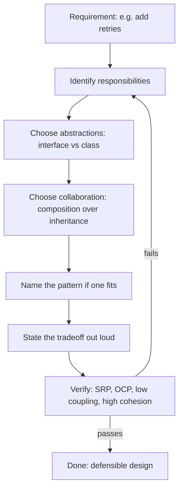
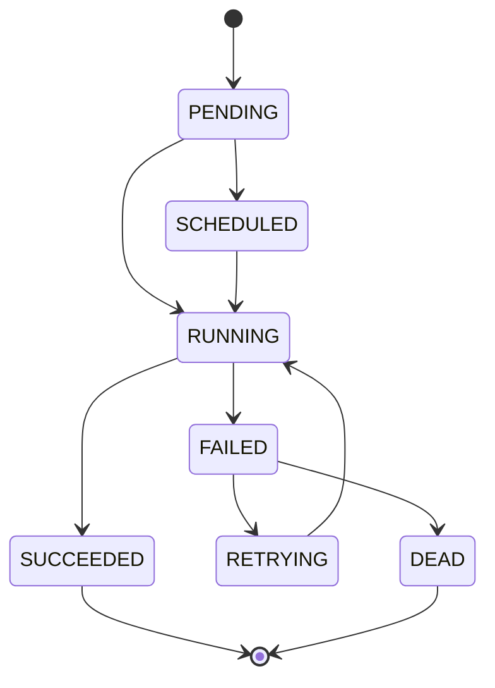
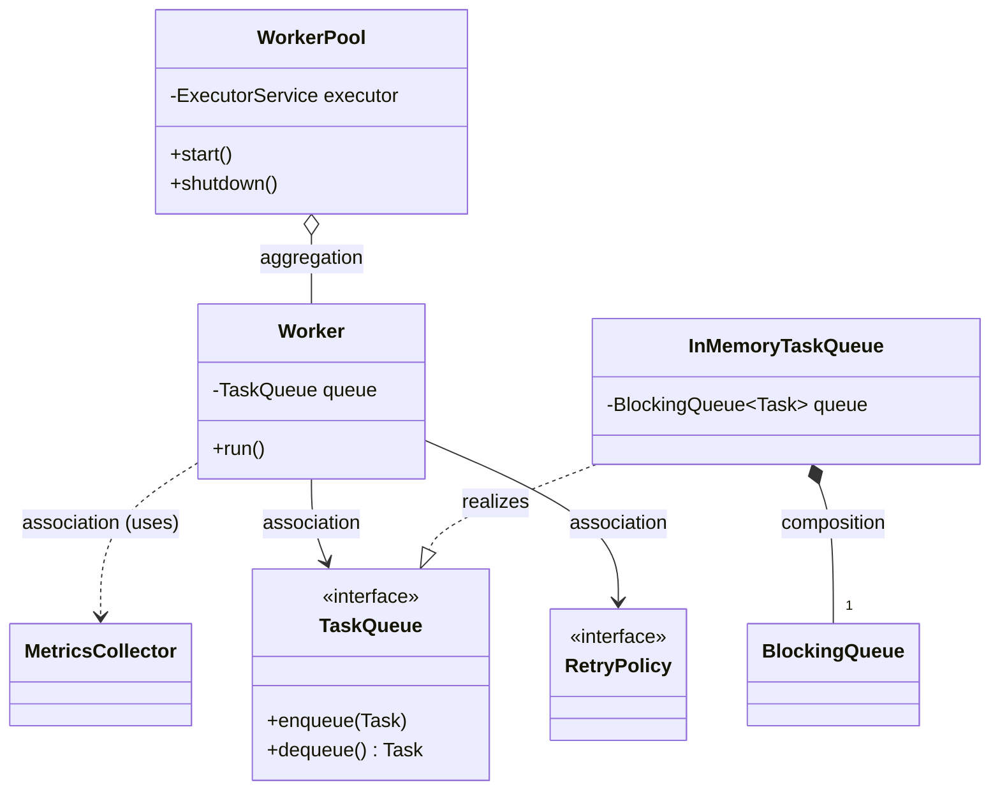
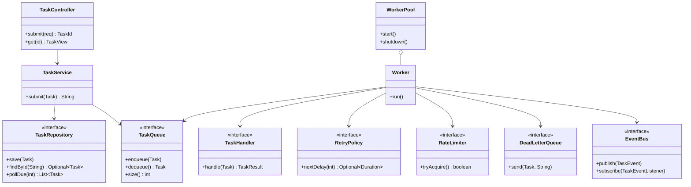

# Interview Prep: OOD and Design

> Where this fits: this is the consolidation chapter for everything in [`02-core-oop`](../02-core-oop/chapter-13-interfaces.md), [`04-oop-and-ood`](../04-oop-and-ood/solid.md), and [`05-design-patterns`](../05-design-patterns/strategy.md). The questions below are the ones that actually get asked in design-heavy backend rounds, and every example is wired back to our Distributed Task Queue project so you answer with concrete code instead of textbook definitions.

OOD interviews are not vocabulary quizzes. The interviewer is checking whether you can take a vague requirement ("we need retries with backoff"), model it as objects with clear responsibilities, choose the right abstraction boundary, and defend your tradeoffs out loud. Reciting "Single Responsibility Principle means one reason to change" gets you nothing. Showing that you'd split `Worker` from `RetryPolicy` *because they change for different reasons* gets you the offer.

This bank has 36 questions grouped Easy / Medium / Hard, each with a full model answer (not a hint), the hidden thing the interviewer is testing, and common follow-ups. There are rapid-fire one-liners and a red-flags section at the end.

## How to read these answers

For every question:

- **Model answer** is what you should say/write. It is correct and complete.
- **What they're really testing** is the subtext. Answer *that*, not just the literal question.
- **Follow-up** is where the interview goes next; pre-empt it.



---

## Easy

### E1. What is the difference between abstraction and encapsulation?

**Model answer.** Abstraction is *what* an object does and hiding the rest; encapsulation is *how* you enforce that hiding by bundling state with the methods that guard it. Abstraction is a design activity (choosing the interface), encapsulation is the mechanism (private fields, access modifiers, invariants).

In our project, `TaskQueue` is the abstraction:

```java
public interface TaskQueue {
    void enqueue(Task t);
    Task dequeue() throws InterruptedException;
    int size();
}
```

A caller knows it can enqueue and dequeue; it does not know or care that `InMemoryTaskQueue` wraps a `BlockingQueue` while `PostgresTaskQueue` runs SQL. The encapsulation is inside the implementation:

```java
public final class InMemoryTaskQueue implements TaskQueue {
    private final BlockingQueue<Task> queue = new PriorityBlockingQueue<>(
        64, Comparator.comparingInt(Task::priority).reversed());

    @Override public void enqueue(Task t) { queue.put(t); }
    @Override public Task dequeue() throws InterruptedException { return queue.take(); }
    @Override public int size() { return queue.size(); }
}
```

The `queue` field is `private final` — that is encapsulation. The interface is abstraction.

**What they're really testing.** Whether you conflate the two. Most candidates say "hiding details" for both. The crisp distinction (design vs mechanism) signals maturity.

**Follow-up:** "Can you have encapsulation without abstraction?" Yes — a class with private fields and getters but no meaningful interface. The reverse (abstraction with leaky encapsulation) is worse: a public field defeats the abstraction.

See [`chapter-03-abstraction.md`](../01-java-fundamentals/chapter-03-abstraction.md) and [`chapter-02-encapsulation.md`](../01-java-fundamentals/chapter-02-encapsulation.md).

---

### E2. State the SOLID principles in one line each, with a project example.

**Model answer.**

| Principle | One-liner | Task Queue example |
|-----------|-----------|--------------------|
| **S**RP | One reason to change. | `Worker` executes; `RetryPolicy` decides delays. Separate classes. |
| **O**CP | Open to extension, closed to modification. | Add a new `TaskHandler` for a new task type without touching `Worker`. |
| **L**SP | Subtypes substitutable for their base. | Any `RetryPolicy` can replace any other; none throws where the contract forbids it. |
| **I**SP | Many small interfaces over one fat one. | `TaskQueue` doesn't force `enqueue`-only callers to depend on `dequeue`. |
| **D**IP | Depend on abstractions, not concretions. | `Worker` depends on `TaskQueue`, not `InMemoryTaskQueue`. |

**What they're really testing.** Memorization is the floor; the project example is what separates you. Always pair each principle with a concrete class.

**Follow-up:** "Which is most violated in real code?" SRP and DIP. SRP because "God classes" accrete responsibilities; DIP because people `new` concrete classes inside business logic. Deep dive: [`solid.md`](../04-oop-and-ood/solid.md).

---

### E3. What is cohesion? What is coupling? Why do we want high cohesion and low coupling?

**Model answer.** Cohesion measures how focused a single module is — do its parts belong together? Coupling measures how much one module depends on the internals of another. We want **high cohesion** (each class does one well-defined job) and **low coupling** (classes interact through small, stable interfaces) because that combination localizes change: a modification touches one cohesive unit and doesn't ripple through tightly-coupled neighbors.

Low-cohesion smell in our project — a `TaskManager` that enqueues, executes, retries, logs metrics, and talks to Postgres. High-cohesion fix — split into `TaskQueue`, `Worker`, `RetryPolicy`, `MetricsCollector`, `TaskRepository`.

Low coupling example — `Worker` holds a `TaskQueue` reference, not a `PriorityBlockingQueue`, so swapping the queue implementation never touches `Worker`.

**What they're really testing.** Whether you understand these are *the* two metrics that drive most design decisions. Patterns and principles are just tactics to improve them.

**Follow-up:** "Name a type of coupling that's especially bad." Content coupling (reaching into another object's internals) and temporal coupling (call A must precede call B with no enforcement). See [`cohesion.md`](../04-oop-and-ood/cohesion.md) and [`coupling.md`](../04-oop-and-ood/coupling.md).

---

### E4. When would you use an interface vs an abstract class in Java?

**Model answer.** Use an **interface** when you're defining a capability/contract that unrelated types can implement, when you want multiple inheritance of type, or when the contract has no shared state. Use an **abstract class** when subclasses share state and a partial implementation, and there's a genuine "is-a" hierarchy.

In our project:
- `TaskHandler`, `TaskQueue`, `RetryPolicy`, `RateLimiter` are **interfaces** — pure contracts, often with several unrelated implementations, and `TaskHandler` is a functional interface so a lambda can implement it.
- A hypothetical `AbstractRetryPolicy` could be an **abstract class** if `FixedDelayRetryPolicy` and `ExponentialBackoffRetryPolicy` shared bounded-attempt logic:

```java
abstract class AbstractRetryPolicy implements RetryPolicy {
    protected final int maxAttempts;
    protected AbstractRetryPolicy(int maxAttempts) { this.maxAttempts = maxAttempts; }

    @Override public final Optional<Duration> nextDelay(int attempt) {
        if (attempt >= maxAttempts) return Optional.empty();   // shared guard
        return Optional.of(computeDelay(attempt));             // varies by subclass
    }
    protected abstract Duration computeDelay(int attempt);
}
```

**What they're really testing.** Whether you reach for abstract classes by default (a Java-newcomer habit). Modern Java favors interfaces with `default` methods for shared behavior, reserving abstract classes for shared *state*.

**Follow-up:** "Java 8+ interfaces have default methods — does that kill abstract classes?" No. Interfaces still can't hold instance state. The moment you need protected mutable fields, you want an abstract class. See [`chapter-12-abstract-classes.md`](../02-core-oop/chapter-12-abstract-classes.md) and [`chapter-13-interfaces.md`](../02-core-oop/chapter-13-interfaces.md).

---

### E5. What does "program to an interface, not an implementation" mean?

**Model answer.** Declare variables, parameters, and return types in terms of the most general type that satisfies your need, so the concrete type can change without breaking callers. It's the Dependency Inversion Principle applied at the API surface.

```java
// Good: callers depend on the abstraction
public WorkerPool(TaskQueue queue, RetryPolicy retryPolicy) { ... }

// Bad: now the pool is welded to one queue implementation
public WorkerPool(InMemoryTaskQueue queue, ExponentialBackoffRetryPolicy retryPolicy) { ... }
```

The good version lets Phase 1 inject `InMemoryTaskQueue` and Phase 2 inject `PostgresTaskQueue` with zero changes to `WorkerPool`.

**What they're really testing.** Whether you understand this is what makes the four-phase project evolvable at all.

**Follow-up:** "Where do you *not* program to an interface?" When there's exactly one implementation and no foreseeable second — premature abstraction is a YAGNI violation. See [`dry-kiss-yagni.md`](../04-oop-and-ood/dry-kiss-yagni.md).

---

### E6. What is the Law of Demeter and how does it show up in our codebase?

**Model answer.** "Only talk to your immediate friends." A method should call methods on: itself, its parameters, objects it creates, and its direct fields — not on objects returned by those calls. It limits coupling by preventing train-wreck chains.

```java
// Violation: Worker knows the queue's internal structure
worker.getQueue().getInternalDeque().peekFirst().getStatus();

// Compliant: ask the collaborator to do the work
queue.dequeue();   // queue manages its own internals
```

**What they're really testing.** Whether you recognize `a.getB().getC().doThing()` as a coupling smell.

**Follow-up:** "Isn't a fluent builder a Demeter violation?" No — builders return `this` (the same object), so you're still talking to one friend. See [`law-of-demeter.md`](../04-oop-and-ood/law-of-demeter.md).

---

### E7. Why are the `Task` fields modeled as a record, and what does that buy you?

**Model answer.** `Task` is value-like data that flows across the queue and workers, often across threads. A record gives you immutability, a canonical constructor, `equals`/`hashCode`/`toString` for free, and a clear signal "this is data, not behavior."

```java
public record Task(
    String id, String type, String payload, TaskStatus status,
    int attempts, int maxAttempts, Instant createdAt, Instant scheduledAt, int priority) {

    public Task withStatus(TaskStatus newStatus) {
        return new Task(id, type, payload, newStatus, attempts, maxAttempts,
                        createdAt, scheduledAt, priority);
    }
    public Task incrementAttempts() {
        return new Task(id, type, payload, status, attempts + 1, maxAttempts,
                        createdAt, scheduledAt, priority);
    }
}
```

Immutability means a `Task` handed to two workers can't be mutated underneath either — critical for concurrency. State transitions return *new* tasks via `with*` methods.

**What they're really testing.** Whether you understand value semantics and why immutability simplifies concurrent reasoning. See [`immutable-objects.md`](../03-java-memory-model/immutable-objects.md).

**Follow-up:** "Records are final and can't extend classes — is that a problem?" Rarely for data. If you need polymorphic data, use a `sealed interface` with record implementations (see M7).

---

### E8. What is the difference between overloading and overriding?

**Model answer.** Overloading is *compile-time* — same method name, different parameter lists, resolved by the static types of arguments. Overriding is *runtime* — a subclass replaces a superclass method with the same signature, resolved by the actual object type (dynamic dispatch).

```java
class Worker {
    void process(Task t) { ... }                 // overload A
    void process(Task t, RetryPolicy p) { ... }   // overload B — chosen at compile time
}

interface TaskQueue { void enqueue(Task t); }
class InMemoryTaskQueue implements TaskQueue {
    @Override public void enqueue(Task t) { ... } // override — chosen at runtime
}
```

**What they're really testing.** That you know overloading is not polymorphism, and that `@Override` catches signature mistakes at compile time.

**Follow-up:** "Why does overloaded resolution sometimes surprise people?" Because `null` and autoboxing make the most-specific-method rules subtle. See [`chapter-06-method-overloading.md`](../02-core-oop/chapter-06-method-overloading.md) and [`chapter-07-method-overriding.md`](../02-core-oop/chapter-07-method-overriding.md).

---

## Medium

### M1. Design a class hierarchy for retry policies. Walk me through it.

**Model answer.** I start from the contract, not the classes. The variation point is "given the attempt number, how long do I wait, and should I even retry?" That's an `Optional<Duration>`: empty means stop.

```java
public interface RetryPolicy {
    /** @return delay before the next attempt, or empty to stop retrying. */
    Optional<Duration> nextDelay(int attempt);
}
```

Two implementations. I deliberately use **composition over a deep hierarchy** — they share a contract, not state:

```java
public final class FixedDelayRetryPolicy implements RetryPolicy {
    private final Duration delay;
    private final int maxAttempts;

    public FixedDelayRetryPolicy(Duration delay, int maxAttempts) {
        this.delay = delay;
        this.maxAttempts = maxAttempts;
    }
    @Override public Optional<Duration> nextDelay(int attempt) {
        return attempt < maxAttempts ? Optional.of(delay) : Optional.empty();
    }
}

public final class ExponentialBackoffRetryPolicy implements RetryPolicy {
    private final Duration base;
    private final Duration cap;
    private final int maxAttempts;
    private final RandomGenerator rng;   // injected for testability

    public ExponentialBackoffRetryPolicy(Duration base, Duration cap, int maxAttempts, RandomGenerator rng) {
        this.base = base; this.cap = cap; this.maxAttempts = maxAttempts; this.rng = rng;
    }
    @Override public Optional<Duration> nextDelay(int attempt) {
        if (attempt >= maxAttempts) return Optional.empty();
        long exp = base.toMillis() * (1L << Math.min(attempt, 30));  // 2^attempt, guarded against overflow
        long capped = Math.min(exp, cap.toMillis());
        long jittered = ThreadLocalRandom.current().nextLong(0, capped + 1); // full jitter
        return Optional.of(Duration.ofMillis(jittered));
    }
}
```

I'd offer a decorator if we wanted to add jitter orthogonally, but full jitter is the documented best practice so I bake it in. This is the **Strategy pattern**: `Worker` holds a `RetryPolicy` and never branches on policy type.

**What they're really testing.** Whether you over-engineer (a 4-level `AbstractRetryPolicy` tree) or under-engineer (an `if (type == EXPONENTIAL)` switch). The right answer is a thin interface + Strategy.

**Follow-ups commonly asked:**
- "Where does jitter come from?" Thundering-herd avoidance — without it, all failed tasks retry at the same instant. Full jitter (random in `[0, capped]`) is the AWS-recommended form.
- "Why `Optional` instead of a boolean + duration?" One return value can't be misused; you can't accidentally read a stale delay when retrying is over.

Deep dives: [`strategy.md`](../05-design-patterns/strategy.md), [`retries.md`](../08-distributed-systems/retries.md).

---

### M2. Composition vs inheritance — when do you choose which? Give a concrete refactor.

**Model answer.** Default to composition. Use inheritance only for a genuine, stable "is-a" where the subclass is fully substitutable (LSP). The classic failure is using inheritance for code reuse, which couples you to the parent's implementation forever.

**Bad — inheritance for reuse:**

```java
// We want a worker that also rate-limits. Tempting but wrong:
class RateLimitedWorker extends Worker {
    private final RateLimiter limiter;
    @Override public void run() {
        while (running) {
            if (limiter.tryAcquire()) super.run(); // fragile: depends on Worker.run() internals
        }
    }
}
```

This breaks the moment `Worker.run()` changes its loop structure, and you can only mix in one such behavior.

**Good — composition:**

```java
public final class Worker implements Runnable {
    private final TaskQueue queue;
    private final Map<String, TaskHandler> handlers;
    private final RetryPolicy retryPolicy;
    private final RateLimiter rateLimiter;   // composed dependency
    private final DeadLetterQueue dlq;
    private volatile boolean running = true;

    public Worker(TaskQueue queue, Map<String, TaskHandler> handlers,
                  RetryPolicy retryPolicy, RateLimiter rateLimiter, DeadLetterQueue dlq) {
        this.queue = queue; this.handlers = handlers;
        this.retryPolicy = retryPolicy; this.rateLimiter = rateLimiter; this.dlq = dlq;
    }

    @Override public void run() {
        while (running) {
            try {
                if (!rateLimiter.tryAcquire()) { Thread.sleep(10); continue; }
                Task task = queue.dequeue();
                execute(task);
            } catch (InterruptedException e) {
                Thread.currentThread().interrupt();
                return;
            }
        }
    }
    // execute(...) elided — looks up handler, runs, applies retry/DLQ
}
```

Now rate limiting, retry, and dead-lettering are independent collaborators you can swap, mock, or disable. No fragile base class.

**What they're really testing.** The single most important OOD judgment call. The phrase they want to hear: "inheritance couples me to the *implementation* of the parent; composition couples me only to its *interface*."

**Follow-up:** "When is inheritance still right?" Sealed type hierarchies for data (`sealed interface TaskEvent`), framework template methods, and true substitutable subtypes. See [`chapter-17-composition-vs-inheritance.md`](../02-core-oop/chapter-17-composition-vs-inheritance.md).

---

### M3. Identify the pattern: a `Worker` looks up a `TaskHandler` by `task.type()` and calls `handle`. What pattern is the handler, and what pattern is the lookup?

**Model answer.** The `TaskHandler` is the **Strategy** pattern — interchangeable algorithms behind one interface, selected at runtime. The type-keyed lookup map is a lightweight **Registry** (sometimes a **Factory**/Service Locator).

```java
public interface TaskHandler {                 // Strategy contract (functional interface)
    TaskResult handle(Task task) throws Exception;
}

// Registry of strategies, keyed by task type
Map<String, TaskHandler> handlers = Map.of(
    "email",   task -> { /* send email */ return new TaskResult(true, "sent", false); },
    "resize",  task -> { /* resize image */ return new TaskResult(true, "ok", false); }
);

TaskHandler handler = handlers.get(task.type());
if (handler == null) {
    dlq.send(task, "no handler for type " + task.type());
    return;
}
TaskResult result = handler.handle(task);
```

The win: adding a "report" task type means adding one map entry and one lambda — `Worker` never changes (OCP).

**What they're really testing.** Pattern recognition without forcing a GoF class diagram where a map suffices. Strong candidates name Strategy *and* note that the registry avoids a giant `switch (type)`.

**Follow-up:** "Why a map instead of `switch`?" The switch violates OCP (edit on every new type), can't be extended by other modules, and can't be populated from configuration/Spring beans. See [`strategy.md`](../05-design-patterns/strategy.md).

---

### M4. Our task processing needs: logging, metrics, and tracing wrapped around handlers. Which pattern, and show it.

**Model answer.** **Decorator.** Each cross-cutting concern is a wrapper implementing the same `TaskHandler` interface, so they stack in any order and the core handler stays oblivious.

```java
public final class MetricsHandler implements TaskHandler {
    private final TaskHandler delegate;
    private final MetricsCollector metrics;

    public MetricsHandler(TaskHandler delegate, MetricsCollector metrics) {
        this.delegate = delegate; this.metrics = metrics;
    }
    @Override public TaskResult handle(Task task) throws Exception {
        long start = System.nanoTime();
        try {
            TaskResult r = delegate.handle(task);
            metrics.recordSuccess(task.type(), System.nanoTime() - start);
            return r;
        } catch (Exception e) {
            metrics.recordFailure(task.type());
            throw e;
        }
    }
}

// Compose: metrics(logging(coreHandler))
TaskHandler decorated = new MetricsHandler(new LoggingHandler(coreHandler), metrics);
```

Decorator over inheritance here because concerns are orthogonal — you'd need `2^n` subclasses to cover every combination with inheritance.

**What they're really testing.** Whether you reach for Decorator (composition-friendly) instead of subclassing or a tangled try/catch in the core handler. Bonus points for noting Spring AOP does this for you in Phase 2.

**Follow-up:** "Decorator vs Proxy — same shape, what's the difference?" Intent. Decorator *adds behavior*; Proxy *controls access* (lazy init, remoting, access checks). Same structure, different purpose. See [`decorator.md`](../05-design-patterns/decorator.md) and [`proxy.md`](../05-design-patterns/proxy.md).

---

### M5. The `Task` moves PENDING → RUNNING → SUCCEEDED/FAILED → RETRYING → DEAD. How do you model these transitions cleanly?

**Model answer.** Two valid approaches; I'll state the tradeoff.

For our system the transitions are simple and centrally validated, so I'd start with a **guarded enum + a transition table**, not the full State pattern (which shines when each state has rich, divergent behavior):

```java
public enum TaskStatus {
    PENDING, SCHEDULED, RUNNING, SUCCEEDED, FAILED, RETRYING, DEAD;

    private static final Map<TaskStatus, Set<TaskStatus>> ALLOWED = Map.of(
        PENDING,   EnumSet.of(SCHEDULED, RUNNING),
        SCHEDULED, EnumSet.of(RUNNING),
        RUNNING,   EnumSet.of(SUCCEEDED, FAILED),
        FAILED,    EnumSet.of(RETRYING, DEAD),
        RETRYING,  EnumSet.of(RUNNING),
        SUCCEEDED, EnumSet.noneOf(TaskStatus.class),
        DEAD,      EnumSet.noneOf(TaskStatus.class));

    public boolean canTransitionTo(TaskStatus next) {
        return ALLOWED.getOrDefault(this, Set.of()).contains(next);
    }
}
```

`Task.withStatus` consults it:

```java
public Task withStatus(TaskStatus next) {
    if (!status.canTransitionTo(next))
        throw new IllegalStateException(status + " -> " + next + " is not allowed");
    return new Task(id, type, payload, next, attempts, maxAttempts, createdAt, scheduledAt, priority);
}
```

If the per-state behavior grew (different timeout, different metrics, different side effects per state), I'd promote this to the **State pattern** — one class per state implementing a `TaskState` interface.

**What they're really testing.** Whether you can match pattern weight to problem weight. Jumping straight to a 7-class State hierarchy for a transition table is over-engineering; allowing illegal transitions is under-engineering. The state diagram is part of the answer:



**Follow-up:** "Where does this validation live — entity or service?" In the entity, so the invariant can't be bypassed. The service orchestrates; the entity protects itself. See [`state.md`](../05-design-patterns/state.md).

---

### M6. Singleton — when is it justified, and what's wrong with the textbook version?

**Model answer.** A Singleton is justified for a genuinely single, stateless-or-carefully-shared resource: a `MetricsCollector` registry, a connection pool, a config holder. It's *abused* as a global variable, which creates hidden coupling and untestable code.

The textbook eager/lazy singleton has problems: thread-safety bugs in lazy init, hard-to-mock global state, and serialization/reflection attacks. The robust Java idiom is an **enum singleton**:

```java
public enum MetricsRegistry {
    INSTANCE;
    private final ConcurrentMap<String, AtomicLong> counters = new ConcurrentHashMap<>();
    public void increment(String name) {
        counters.computeIfAbsent(name, k -> new AtomicLong()).incrementAndGet();
    }
    public long get(String name) {
        AtomicLong c = counters.get(name);
        return c == null ? 0 : c.get();
    }
}
```

**But** in a Spring Boot app (Phase 2+) you almost never write a Singleton — the container manages one bean instance and *injects* it, giving you the single-instance benefit with testability and explicit dependencies. So my real answer: "prefer DI-scoped singletons over the Singleton pattern."

**What they're really testing.** Whether you know Singleton is the most over-used and most criticized pattern, and whether you'd default to DI instead. Saying "I'd use a Spring singleton-scoped bean" is the senior answer.

**Follow-up:** "Why is Singleton bad for testing?" Global mutable state leaks between tests; you can't substitute a fake. DI hands you a seam. See [`singleton.md`](../05-design-patterns/singleton.md) and [`dependency-injection.md`](../04-oop-and-ood/dependency-injection.md).

---

### M7. Model the set of task events flowing on the EventBus so the compiler enforces exhaustive handling.

**Model answer.** A **sealed interface** with record implementations gives a closed type hierarchy. Switch pattern matching is then exhaustive — add a case and the compiler forces every switch to handle it.

```java
public sealed interface TaskEvent
    permits TaskEvent.Submitted, TaskEvent.Started, TaskEvent.Succeeded,
            TaskEvent.Failed, TaskEvent.DeadLettered {

    String taskId();
    Instant at();

    record Submitted(String taskId, Instant at, int priority) implements TaskEvent {}
    record Started(String taskId, Instant at, String workerId) implements TaskEvent {}
    record Succeeded(String taskId, Instant at, long durationMillis) implements TaskEvent {}
    record Failed(String taskId, Instant at, String reason, boolean retryable) implements TaskEvent {}
    record DeadLettered(String taskId, Instant at, String reason) implements TaskEvent {}
}
```

A listener handles them exhaustively:

```java
String describe(TaskEvent e) {
    return switch (e) {
        case TaskEvent.Submitted s    -> "queued " + s.taskId() + " p=" + s.priority();
        case TaskEvent.Started st     -> "running on " + st.workerId();
        case TaskEvent.Succeeded ok   -> "done in " + ok.durationMillis() + "ms";
        case TaskEvent.Failed f       -> "failed: " + f.reason() + (f.retryable() ? " (retry)" : "");
        case TaskEvent.DeadLettered d -> "DLQ: " + d.reason();
        // no default needed — compiler verifies exhaustiveness
    };
}
```

**What they're really testing.** Modern Java 21 fluency *and* the design insight that sealed types replace the Visitor pattern's double-dispatch with compiler-checked switches. If you'd reached for an `enum eventType` + downcasts, that's the weaker answer.

**Follow-up:** "Sealed interface vs Visitor — when each?" Sealed + switch for closed, data-centric hierarchies you control. Visitor when the hierarchy is stable but you frequently add new *operations* and want them grouped. See [`visitor.md`](../05-design-patterns/visitor.md) and [`observer.md`](../05-design-patterns/observer.md) for the EventBus pub/sub side.

---

### M8. Live-coding: implement a thread-safe `TokenBucketRateLimiter` with `boolean tryAcquire()`.

**Model answer.** Token bucket: refill at a steady rate up to a capacity; each acquire spends one token. I compute refill lazily on each call (no background thread) and guard the shared state.

```java
public final class TokenBucketRateLimiter implements RateLimiter {
    private final long capacity;
    private final double refillPerNano;     // tokens added per nanosecond
    private double tokens;
    private long lastRefillNanos;

    public TokenBucketRateLimiter(long capacity, long refillPerSecond) {
        this.capacity = capacity;
        this.refillPerNano = refillPerSecond / 1_000_000_000.0;
        this.tokens = capacity;
        this.lastRefillNanos = System.nanoTime();
    }

    @Override public synchronized boolean tryAcquire() {
        refill();
        if (tokens >= 1.0) {
            tokens -= 1.0;
            return true;
        }
        return false;
    }

    private void refill() {
        long now = System.nanoTime();
        double newTokens = (now - lastRefillNanos) * refillPerNano;
        if (newTokens > 0) {
            tokens = Math.min(capacity, tokens + newTokens);
            lastRefillNanos = now;
        }
    }
}
```

Design notes I'd say out loud: `synchronized` is fine because the critical section is tiny; for very high contention I'd move to a `ReentrantLock` with `tryLock`, or an atomics-based CAS loop. Lazy refill avoids a timer thread. The limiter implements the `RateLimiter` interface so `Worker` depends only on the abstraction.

**What they're really testing.** Correctness under concurrency (the refill-then-check must be atomic), and clean abstraction. A common bug is computing refill outside the lock — a data race.

**Follow-up:** "How would you make this distributed across worker nodes?" Move the bucket to Redis with an atomic Lua script, or use a leaky-bucket counter per key. See [`rate-limiting.md`](../08-distributed-systems/rate-limiting.md) and [`atomics-and-thread-safety.md`](../06-concurrency/atomics-and-thread-safety.md).

---

### M9. What is the Liskov Substitution Principle, with a violation from queue design?

**Model answer.** A subtype must be usable anywhere its supertype is expected, without the caller knowing. Concretely: don't strengthen preconditions, don't weaken postconditions, don't throw new checked exceptions, preserve invariants.

**Violation:**

```java
class BoundedTaskQueue implements TaskQueue {
    private final BlockingQueue<Task> q = new ArrayBlockingQueue<>(100);
    @Override public void enqueue(Task t) {
        if (!q.offer(t))                              // silently drops when full
            throw new IllegalStateException("full");  // surprises callers who expected enqueue to always succeed
    }
    ...
}
```

If `TaskQueue.enqueue` is documented as "always accepts," this subtype breaks substitutability — code written against `TaskQueue` now fails unexpectedly. The fix is to make the contract honest: either `enqueue` blocks (so the bound is invisible) or change the interface to `boolean offer(Task t)` so bounded behavior is part of the contract everyone codes against.

**What they're really testing.** Whether you understand LSP is about *behavioral* contracts, not just signatures. The classic "Square extends Rectangle" answer is fine but project-specific examples impress more.

**Follow-up:** "How do `Optional`/exceptions relate to LSP?" Throwing where the base promises not to is the most common real violation. Document and honor contracts. See [`solid.md`](../04-oop-and-ood/solid.md), [`upcasting-and-downcasting`](../02-core-oop/chapter-10-upcasting-and-downcasting.md).

---

### M10. Distinguish association, aggregation, and composition. Show each in our model with UML.

**Model answer.**
- **Association** — "uses-a," a loose reference, independent lifecycles. `Worker` uses a `MetricsCollector`.
- **Aggregation** — "has-a," shared ownership, parts outlive the whole. A `WorkerPool` aggregates `Worker`s that could be shared/reused conceptually.
- **Composition** — "owns-a," exclusive ownership, parts die with the whole. A `Task` composes its `TaskResult` history; `InMemoryTaskQueue` composes its internal `BlockingQueue`.



In UML: `*--` is composition (filled diamond), `o--` is aggregation (hollow diamond), `-->` is association, `..|>` is interface realization.

**What they're really testing.** Whether you can read/draw UML correctly and, more importantly, reason about *lifecycle ownership* — the real distinction between aggregation and composition.

**Follow-up:** "Why does ownership matter in practice?" It dictates who creates and destroys the part, and whether sharing is safe (mutable shared parts cause aliasing bugs). See [`association.md`](../02-core-oop/chapter-14-association.md), [`aggregation.md`](../02-core-oop/chapter-15-aggregation.md), [`composition.md`](../02-core-oop/chapter-16-composition.md).

---

### M11. What's the difference between the Factory Method and Abstract Factory patterns? Where would our project use a factory?

**Model answer.** **Factory Method** is one method that creates one product, often overridden by subclasses. **Abstract Factory** is an object that creates a *family* of related products through several methods.

In our project, a `QueueFactory` that returns the right `TaskQueue` per environment is essentially a (static) factory method:

```java
public final class QueueFactory {
    public static TaskQueue create(QueueConfig cfg) {
        return switch (cfg.backend()) {
            case IN_MEMORY -> new InMemoryTaskQueue();
            case POSTGRES  -> new PostgresTaskQueue(cfg.dataSource());
            case REDIS     -> new RedisTaskQueue(cfg.redisClient());
        };
    }
}
```

An Abstract Factory appears in Phase 4 when a *broker family* must agree: a `BrokerFactory` that produces a matching `TaskQueue`, `DeadLetterQueue`, and `EventBus` all backed by the same technology (all-Kafka or all-Redis) so they're never mixed.

```java
public interface BrokerFactory {
    TaskQueue taskQueue();
    DeadLetterQueue deadLetterQueue();
    EventBus eventBus();
}
```

**What they're really testing.** That you don't blur the two. The keyword is *family*: Abstract Factory guarantees the produced objects are compatible.

**Follow-up:** "Isn't this just DI?" Spring's `@Configuration` + `@Bean` methods *are* a factory; the container is the ultimate abstract factory. See [`factory-method.md`](../05-design-patterns/factory-method.md) and [`abstract-factory.md`](../05-design-patterns/abstract-factory.md).

---

### M12. The retry pipeline must try a handler, then a fallback, then dead-letter. Which pattern?

**Model answer.** **Chain of Responsibility.** Each link decides whether it handles the task or passes it on; the client doesn't know which link succeeds.

```java
public abstract class TaskProcessor {
    protected TaskProcessor next;
    public TaskProcessor setNext(TaskProcessor next) { this.next = next; return next; }
    public abstract TaskResult process(Task task);

    protected TaskResult passOn(Task task) {
        return next == null
            ? new TaskResult(false, "unhandled", false)
            : next.process(task);
    }
}
```

Concrete links: a `PrimaryHandlerProcessor`, a `FallbackProcessor`, and a `DeadLetterProcessor` that always terminates by calling `dlq.send`. You assemble the chain once and the order is data, not branching logic.

**What they're really testing.** Recognizing a sequential "try until one handles it" requirement maps to CoR, not a pile of nested `if/else`. Note CoR keeps each link cohesive and the chain reconfigurable.

**Follow-up:** "Spring Security filter chains, servlet filters, Netty pipelines — same pattern?" Yes, all CoR. See [`chain-of-responsibility.md`](../05-design-patterns/chain-of-responsibility.md) and [`dead-letter-queues.md`](../07-queues-and-messaging/dead-letter-queues.md).

---

## Hard

### H1. Design the object model for the whole task submission and execution flow. Drive it.

**Model answer.** I'll narrate responsibilities, then collaborators, then the diagram. I keep each type cohesive and depend on interfaces at every seam.

Responsibilities:
- **`TaskController`** (Phase 2) — HTTP boundary. Validates input, builds a `Task`, hands it to a service. No business logic.
- **`TaskService`** — application logic: assign id, set `PENDING`, persist via `TaskRepository`, enqueue via `TaskQueue`. Orchestrator.
- **`TaskRepository`** — persistence abstraction (`save`, `findById`, `pollDue`). JDBC-backed in Phase 2.
- **`TaskQueue`** — handoff buffer between producers and workers.
- **`WorkerPool`** — owns an `ExecutorService` of `Worker`s; `start`/`shutdown`.
- **`Worker`** — pulls from queue, looks up `TaskHandler` by type, applies `RateLimiter`, runs, then on outcome consults `RetryPolicy` and possibly `DeadLetterQueue`, emitting `TaskEvent`s on the `EventBus`.
- **`TaskScheduler`** — for `scheduledAt` tasks, delays enqueue via `DelayQueue`/`ScheduledExecutorService`.
- **`MetricsCollector`** — counters/timers/gauges.



Every dependency points at an interface (DIP). Each class has one reason to change (SRP). New task types extend the system via new `TaskHandler`s without modifying `Worker` (OCP). That's the whole pitch.

**What they're really testing.** Can you carve a system into cohesive, loosely-coupled objects and justify each boundary? The trap is a `TaskManager` God class. The win is naming *why* each seam is an interface.

**Follow-ups:** "Where's the transaction boundary?" In `TaskService.submit` — persist and enqueue must be consistent; in Phase 2 the outbox pattern decouples DB commit from queue publish. "How do you test `Worker` in isolation?" Inject fakes for every collaborator — that's the payoff of DI. See [`domain-modeling.md`](../04-oop-and-ood/domain-modeling.md), [`layered-architecture.md`](../04-oop-and-ood/layered-architecture.md), [`hexagonal-architecture.md`](../04-oop-and-ood/hexagonal-architecture.md), and the project chapters [`phase-1.md`](../09-project/phase-1.md), [`phase-2.md`](../09-project/phase-2.md).

---

### H2. Refactoring exercise: here's a God class. Walk me from bad → improved → production.

**Model answer.**

**Bad — everything in one class:**

```java
class TaskManager {
    private final List<Task> tasks = new ArrayList<>();
    private final Connection db;

    void submit(String type, String payload) {
        Task t = new Task(UUID.randomUUID().toString(), type, payload,
                          TaskStatus.PENDING, 0, 3, Instant.now(), null, 0);
        tasks.add(t);
        // persist inline
        try (var ps = db.prepareStatement("INSERT INTO tasks ...")) { ps.execute(); }
        catch (SQLException e) { throw new RuntimeException(e); }
        // execute inline
        if (type.equals("email")) { /* send */ }
        else if (type.equals("resize")) { /* resize */ }
        // retry inline
        // metrics inline
        System.out.println("processed " + t.id());
    }
}
```

Problems: violates SRP (queueing, persistence, dispatch, retry, metrics, logging), OCP (new type = edit `submit`), DIP (concrete `Connection`, `System.out`), untestable, not thread-safe.

**Improved — extract collaborators:**

```java
class TaskService {
    private final TaskRepository repository;
    private final TaskQueue queue;

    TaskService(TaskRepository repository, TaskQueue queue) {
        this.repository = repository; this.queue = queue;
    }
    String submit(String type, String payload) {
        Task t = new Task(UUID.randomUUID().toString(), type, payload,
                          TaskStatus.PENDING, 0, 3, Instant.now(), null, 0);
        repository.save(t);
        queue.enqueue(t);
        return t.id();
    }
}
```

Dispatch moves to a `Map<String, TaskHandler>` (Strategy + registry); execution to `Worker`; retry to `RetryPolicy`; metrics to `MetricsCollector`. Each is injected.

**Production — full separation with events and observability:**

```java
public final class TaskService {
    private final TaskRepository repository;
    private final TaskQueue queue;
    private final EventBus eventBus;
    private final MeterRegistry meters;
    private final Clock clock;

    public TaskService(TaskRepository repository, TaskQueue queue,
                       EventBus eventBus, MeterRegistry meters, Clock clock) {
        this.repository = repository; this.queue = queue;
        this.eventBus = eventBus; this.meters = meters; this.clock = clock;
    }

    public String submit(SubmitTaskCommand cmd) {
        Task t = new Task(UUID.randomUUID().toString(), cmd.type(), cmd.payload(),
                          TaskStatus.PENDING, 0, cmd.maxAttempts(),
                          clock.instant(), cmd.scheduledAt(), cmd.priority());
        repository.save(t);                         // transactional outbox in real impl
        queue.enqueue(t);
        eventBus.publish(new TaskEvent.Submitted(t.id(), clock.instant(), t.priority()));
        meters.counter("tasks.submitted", "type", t.type()).increment();
        return t.id();
    }
}
```

Now SRP, OCP, DIP all hold; `Clock` is injected for deterministic tests; metrics and events are first-class. Each removed responsibility lives in its own cohesive class.

**What they're really testing.** Disciplined incremental refactoring — can you name *which* principle each step satisfies and avoid rewriting everything at once?

**Follow-up:** "What test would you write first?" A characterization test pinning current behavior before refactoring. See [`dependency-injection.md`](../04-oop-and-ood/dependency-injection.md).

---

### H3. When does a design pattern become an anti-pattern? Give three from this project.

**Model answer.**

1. **Singleton as global state.** A `MetricsRegistry.INSTANCE` mutated from everywhere becomes hidden global coupling and breaks test isolation. Fix: inject a `MeterRegistry` bean.
2. **Strategy explosion.** If you create a `RetryPolicy` per microscopic variation (`ThreeSecondFixedRetryPolicy`, `FiveSecondFixedRetryPolicy`), you've turned configuration into classes. Fix: parameterize `FixedDelayRetryPolicy(Duration, int)`.
3. **Decorator/wrapper soup.** Stacking ten handler decorators makes stack traces and ordering bugs unbearable. Fix: at some depth, switch to Spring AOP or a small explicit pipeline object with declared order.

General rule: a pattern is an anti-pattern when it adds indirection without removing a real, *present* cost — that's a YAGNI/over-engineering violation.

**What they're really testing.** Senior judgment — patterns are tools with costs, not goals. Candidates who think "more patterns = better design" fail here.

**Follow-up:** "How do you decide?" Apply a pattern when you feel the pain it solves (a real second implementation, a real cross-cutting concern), not speculatively. See [`dry-kiss-yagni.md`](../04-oop-and-ood/dry-kiss-yagni.md).

---

### H4. Live-coding: design an extensible `TaskScheduler` that delays enqueue by a `Duration`. Make it testable.

**Model answer.** The contract: `schedule(Task, Duration)` puts the task on the real queue after the delay elapses. I depend on an injected `ScheduledExecutorService` and `TaskQueue` so the whole thing is testable.

```java
public interface TaskScheduler {
    void schedule(Task t, Duration delay);
}

public final class ExecutorTaskScheduler implements TaskScheduler {
    private final ScheduledExecutorService scheduler;
    private final TaskQueue queue;
    private final EventBus eventBus;
    private final Clock clock;

    public ExecutorTaskScheduler(ScheduledExecutorService scheduler, TaskQueue queue,
                                 EventBus eventBus, Clock clock) {
        this.scheduler = scheduler; this.queue = queue;
        this.eventBus = eventBus; this.clock = clock;
    }

    @Override public void schedule(Task t, Duration delay) {
        if (delay.isNegative() || delay.isZero()) {
            queue.enqueue(t);
            return;
        }
        Task scheduled = t.withStatus(TaskStatus.SCHEDULED);
        scheduler.schedule(
            () -> {
                queue.enqueue(scheduled.withStatus(TaskStatus.PENDING));
                eventBus.publish(new TaskEvent.Submitted(t.id(), clock.instant(), t.priority()));
            },
            delay.toMillis(), TimeUnit.MILLISECONDS);
    }
}
```

Testability notes I'd state: inject the executor so a test can pass a deterministic/immediate one; inject `Clock` for timestamps; the `TaskQueue` is a fake `InMemoryTaskQueue` so the test asserts the task lands after scheduling. For large scale I'd back it with a `DelayQueue<DelayedTask>` consumed by a dedicated thread, or push the schedule into Postgres (`scheduledAt`) and `pollDue` it — that survives process restarts, which an in-JVM scheduler does not.

**What they're really testing.** Can you design for testability (inject time and executors) and recognize the durability limitation of an in-memory scheduler?

**Follow-up:** "Why is `ScheduledExecutorService`-based scheduling dangerous in production?" Schedules are lost on restart and don't span nodes. Persistent `scheduledAt` + `pollDue` is the durable design. See [`scheduling-queues.md`](../07-queues-and-messaging/scheduling-queues.md), [`delayed-queues.md`](../07-queues-and-messaging/delayed-queues.md), [`executor-service.md`](../06-concurrency/executor-service.md).

---

### H5. Open/Closed in practice: a new task type needs a different timeout and a different DLQ destination. How do you extend without modifying core classes?

**Model answer.** I push the variation behind interfaces the core already depends on, so extension means *adding* implementations, never *editing* `Worker`.

Make `TaskHandler` carry its own policy via a small companion interface, or attach per-type config in a registry:

```java
public record HandlerSpec(TaskHandler handler, Duration timeout, DeadLetterQueue dlq) {}

public final class HandlerRegistry {
    private final Map<String, HandlerSpec> specs = new ConcurrentHashMap<>();
    public void register(String type, HandlerSpec spec) { specs.put(type, spec); }
    public Optional<HandlerSpec> lookup(String type) { return Optional.ofNullable(specs.get(type)); }
}
```

`Worker` reads the spec generically:

```java
HandlerSpec spec = registry.lookup(task.type())
    .orElseThrow(() -> new NoHandlerException(task.type()));
TaskResult r = runWithTimeout(spec.handler(), task, spec.timeout());
if (!r.success() && !r.retryable()) spec.dlq().send(task, r.message());
```

Adding the new type = one `registry.register(...)` call (often a Spring `@Bean` or a config entry). `Worker` is untouched: closed for modification, open for extension.

**What they're really testing.** Whether you can turn a "we'll just add another `if`" instinct into a data-driven, extensible design. The registry + spec record is the senior move.

**Follow-up:** "Where does registration happen in Spring?" Auto-wire all `TaskHandler` beans into a `Map<String, TaskHandler>` keyed by bean name/qualifier — Spring populates the registry for you. See [`solid.md`](../04-oop-and-ood/solid.md).

---

### H6. Critique this interface for ISP and cohesion, then fix it.

```java
interface TaskComponent {
    void enqueue(Task t);
    Task dequeue() throws InterruptedException;
    void save(Task t);
    Optional<Task> findById(String id);
    void send(Task t, String reason);   // DLQ
    boolean tryAcquire();               // rate limit
    void recordMetric(String name);
}
```

**Model answer.** This is a fat interface — a textbook ISP violation. It forces every implementer to provide queueing, persistence, dead-lettering, rate limiting, *and* metrics, even when it only needs one. A producer that just enqueues now depends on `tryAcquire` and `findById` it will never call. Cohesion is near zero: these methods change for entirely different reasons.

Fix: split along reasons-to-change into the canonical interfaces, each cohesive and minimal:

```java
interface TaskQueue        { void enqueue(Task t); Task dequeue() throws InterruptedException; int size(); }
interface TaskRepository   { void save(Task t); Optional<Task> findById(String id); List<Task> pollDue(int n); }
interface DeadLetterQueue  { void send(Task t, String reason); }
interface RateLimiter      { boolean tryAcquire(); }
interface MetricsCollector { void increment(String name); }
```

Now a producer depends only on `TaskQueue`; a worker composes exactly the few it needs; tests mock one tiny interface at a time. Each interface has a single, clear responsibility — high cohesion, and clients depend only on what they use — ISP satisfied.

**What they're really testing.** Whether you can *spot* the smell and *justify* the split by reasons-to-change, not just mechanically break it apart.

**Follow-up:** "How small is too small?" When splitting creates interfaces always implemented and consumed together (needless ceremony). Cohesion of *usage* is the guide. See [`coupling.md`](../04-oop-and-ood/coupling.md), [`solid.md`](../04-oop-and-ood/solid.md).

---

### H7. Compare Strategy, State, and Template Method. They look similar — when each?

**Model answer.** All three vary behavior, but for different reasons:

| Pattern | What varies | Who chooses | Project fit |
|---------|-------------|-------------|-------------|
| **Strategy** | Interchangeable algorithm, chosen by the client | Client/config injects it | `RetryPolicy`, `TaskHandler` |
| **State** | Behavior changes as the object's *own state* changes; states trigger transitions | The object/state, internally | Full `TaskStatus` machine *if* states diverge in behavior |
| **Template Method** | Skeleton fixed; specific steps overridden by subclasses | Subclass, at compile time | `AbstractRetryPolicy.nextDelay` calling `computeDelay` |

Key distinctions to state aloud: Strategy and State have the same *structure* (object delegates to a sub-object), but Strategy's strategies are independent and externally selected, whereas State's states know about each other and drive transitions. Template Method uses *inheritance* (a fixed algorithm with holes) while Strategy uses *composition* (swap the whole algorithm).

**What they're really testing.** Deep pattern fluency — these three are the most-confused trio. Naming "composition (Strategy) vs inheritance (Template Method)" and "externally selected (Strategy) vs self-transitioning (State)" is the differentiator.

**Follow-up:** "Convert our `AbstractRetryPolicy` Template Method to Strategy — why might you?" To swap delay computation at runtime and avoid an inheritance hierarchy entirely. See [`strategy.md`](../05-design-patterns/strategy.md), [`state.md`](../05-design-patterns/state.md), [`template-method.md`](../05-design-patterns/template-method.md).

---

### H8. Design `equals`/`hashCode` for `Task` and explain the contract pitfalls in a concurrent queue.

**Model answer.** A `Task` is identified by its `id` (a UUID) — two `Task` objects with the same id are the same task even if status/attempts differ over time. Records auto-generate `equals`/`hashCode` over *all* components, which is wrong here because a status change would make a task "not equal" to its earlier self, breaking set/map membership across a state transition.

So I override to use identity = `id` only:

```java
public record Task(String id, String type, /* ... */ ) {
    @Override public boolean equals(Object o) {
        return o instanceof Task t && id.equals(t.id);
    }
    @Override public int hashCode() { return id.hashCode(); }
}
```

Contract pitfalls, especially with a `PriorityBlockingQueue` / `Set`:
- **Consistency with ordering:** a `PriorityBlockingQueue` orders by a comparator (priority), independent of `equals`. That's fine — but mixing a mutable ordering key with a structure that assumes stability corrupts the heap. We keep `Task` immutable, so the priority never changes underfoot.
- **`equals`/`hashCode` must agree:** both based on `id`.
- **Don't key on mutable fields:** since `status`/`attempts` change across transitions (via `with*` producing new objects), keying on them would lose map entries.

**What they're really testing.** Whether you understand identity vs value equality for entities, and the concurrency hazard of mutable keys in ordered/hashed structures.

**Follow-up:** "Entity vs value object?" `Task` is an *entity* (identity by id); `TaskResult` is a *value object* (equal by content) — so `TaskResult` keeps record-default equality. See [`aggregates.md`](../04-oop-and-ood/aggregates.md), [`concurrent-collections.md`](../06-concurrency/concurrent-collections.md), [`blocking-queue.md`](../06-concurrency/blocking-queue.md).

---

### H9. The `WorkerPool` must shut down cleanly without losing in-flight tasks. Design it with lifecycle responsibilities.

**Model answer.** Lifecycle is a cohesive responsibility I keep in `WorkerPool`, separate from `Worker`'s per-task logic. I use a graceful two-phase shutdown.

```java
public final class WorkerPool {
    private final ExecutorService executor;
    private final List<Worker> workers;
    private final int size;

    public WorkerPool(int size, Supplier<Worker> workerFactory) {
        this.size = size;
        this.executor = Executors.newFixedThreadPool(size);
        this.workers = IntStream.range(0, size).mapToObj(i -> workerFactory.get()).toList();
    }

    public void start() { workers.forEach(executor::submit); }

    public void shutdown(Duration grace) {
        workers.forEach(Worker::requestStop);   // 1) stop pulling new tasks
        executor.shutdown();                     // 2) no new submissions
        try {
            if (!executor.awaitTermination(grace.toMillis(), TimeUnit.MILLISECONDS)) {
                executor.shutdownNow();          // 3) interrupt stragglers
            }
        } catch (InterruptedException e) {
            executor.shutdownNow();
            Thread.currentThread().interrupt();
        }
    }
}
```

`Worker` cooperates by checking a `volatile boolean running` and handling interruption:

```java
public void requestStop() { running = false; }
```

Responsibility split: `WorkerPool` owns thread lifecycle and orchestration; `Worker` owns "process one task and respond to a stop signal." In-flight tasks finish during the grace window; truly stuck ones get interrupted. With Java 21 virtual threads I'd use `Executors.newVirtualThreadPerTaskExecutor()` for the worker loops if tasks are I/O-bound.

**What they're really testing.** Cohesive lifecycle design plus correct cooperative cancellation (the `volatile` flag + interrupt handling), and not losing work on shutdown.

**Follow-up:** "What if a handler ignores interrupts?" `shutdownNow` can't force-kill a thread; you need cancellation-aware handlers and timeouts. This is why per-task timeouts (H5) matter. See [`executor-service.md`](../06-concurrency/executor-service.md), [`threads.md`](../06-concurrency/threads.md).

---

### H10. Interview-style: "Design a parking lot / elevator / vending machine." How do you approach any unfamiliar OOD prompt?

**Model answer.** I use a repeatable framework, then map it onto whatever the prompt is:

1. **Clarify scope & requirements.** Ask 3–4 questions to bound it: functional (what operations?), non-functional (scale, concurrency?), out-of-scope. *Don't design in silence.*
2. **Identify the core entities (nouns).** For a parking lot: `ParkingLot`, `Level`, `Spot`, `Vehicle`, `Ticket`. Map nouns → classes, but prune anemic ones.
3. **Identify behaviors (verbs) and assign them to the most cohesive owner.** `park(vehicle)`, `unpark(ticket)`, `findSpot(vehicleType)`.
4. **Find the variation points → choose patterns.** Pricing strategy → Strategy. Spot allocation policy → Strategy. State of a spot/ticket → State/enum.
5. **Define interfaces at the seams** (pricing, allocation) so they're swappable and testable — DIP.
6. **Draw a class diagram, state the relationships** (composition vs aggregation), and **call out tradeoffs and concurrency** (two cars racing for the last spot → need atomic allocation).

I'd explicitly tie it back: "This is the same skeleton as our Task Queue — entities (`Task`), a queue/allocator, pluggable policies (`RetryPolicy`/pricing), and a concurrency hazard at the contended resource."

**What they're really testing.** Process over trivia. They want to see you clarify, decompose, choose abstractions deliberately, and discuss tradeoffs — not memorize "the parking lot answer." Silence and jumping to code are the failure modes.

**Follow-up:** "How do you handle the last-spot race?" Atomic claim — `compareAndSet` on the spot, or a lock per level — same reasoning as our `TokenBucketRateLimiter` (M8). See [`domain-modeling.md`](../04-oop-and-ood/domain-modeling.md), [`system-design-fundamentals.md`](../10-system-design/system-design-fundamentals.md).

---

### H11. DIP in depth: "depend on abstractions" — but someone has to create the concrete object. Where does it live?

**Model answer.** DIP says high-level policy and low-level detail both depend on an abstraction; it does *not* abolish construction. The trick is to push construction to the **edge** — the composition root (a `main` method, or Spring's container) — so business classes only *receive* dependencies, never *create* them.

```java
// Composition root (Phase 1 main, or @Configuration in Phase 2)
public static void main(String[] args) {
    TaskQueue queue = new InMemoryTaskQueue();
    RetryPolicy retry = new ExponentialBackoffRetryPolicy(
        Duration.ofMillis(100), Duration.ofSeconds(30), 5, RandomGenerator.getDefault());
    DeadLetterQueue dlq = new InMemoryDeadLetterQueue();
    MetricsCollector metrics = new SimpleMetricsCollector();
    Map<String, TaskHandler> handlers = Map.of("email", new EmailHandler());

    WorkerPool pool = new WorkerPool(4,
        () -> new Worker(queue, handlers, retry, new TokenBucketRateLimiter(100, 50), dlq, metrics));
    pool.start();
}
```

Inside `Worker`, `WorkerPool`, `TaskService` — only abstractions. The concrete graph is assembled once, at the boundary. In Spring this becomes `@Bean` methods; the container *is* the composition root.

**What they're really testing.** Whether you understand DIP doesn't mean "no `new`," it means "no `new` of policy-relevant collaborators *inside* business logic." The composition-root concept is the senior insight.

**Follow-up:** "Service Locator vs Constructor Injection?" Prefer constructor injection — dependencies are explicit, the object is always valid, and it's trivially testable. Service Locator hides dependencies and re-introduces global coupling. See [`dependency-injection.md`](../04-oop-and-ood/dependency-injection.md), [`clean-architecture.md`](../04-oop-and-ood/clean-architecture.md).

---

### H12. Sealed types + pattern matching vs the Visitor pattern: implement event handling both ways and argue.

**Model answer.** Visitor solves the "I want to add operations to a fixed type hierarchy without touching the types" problem via double dispatch. Java 21 sealed interfaces + switch patterns solve the same problem with a compiler-checked switch and far less ceremony.

**Visitor (classic):**

```java
interface TaskEventVisitor<R> {
    R visit(Submitted s);
    R visit(Failed f);
}
interface TaskEvent { <R> R accept(TaskEventVisitor<R> v); }
record Submitted(String taskId) implements TaskEvent {
    public <R> R accept(TaskEventVisitor<R> v) { return v.visit(this); }
}
record Failed(String taskId, String reason) implements TaskEvent {
    public <R> R accept(TaskEventVisitor<R> v) { return v.visit(this); }
}
```

**Sealed + switch (modern):**

```java
sealed interface TaskEvent permits Submitted, Failed {}
record Submitted(String taskId) implements TaskEvent {}
record Failed(String taskId, String reason) implements TaskEvent {}

String render(TaskEvent e) {
    return switch (e) {
        case Submitted s -> "queued " + s.taskId();
        case Failed f    -> "failed " + f.taskId() + ": " + f.reason();
    };   // exhaustive — compiler errors if a permitted type is unhandled
}
```

Argument: when the hierarchy is *closed and under my control* (it is — I own `TaskEvent`), sealed + switch wins: no `accept`/`visit` boilerplate, exhaustiveness is compiler-enforced, and adding a new event type produces compile errors at exactly the switches that must change. Visitor still wins when you *can't* edit the element classes or want operations grouped into reusable visitor objects, and in languages without pattern matching.

**What they're really testing.** Cutting-edge Java knowledge plus the design tradeoff (open operations vs open types — the Expression Problem). Naming the Expression Problem is a strong signal.

**Follow-up:** "Which axis is easy to extend in each?" Sealed types: easy to add operations (new switches), hard to add types (touches every switch). Visitor: easy to add types? No — adding an element forces every visitor to change; Visitor makes adding *operations* easy. That asymmetry is the Expression Problem. See [`visitor.md`](../05-design-patterns/visitor.md), [`chapter-11-instanceof.md`](../02-core-oop/chapter-11-instanceof.md).

---

## Rapid-fire one-liners

Use these when an interviewer wants quick recall. One breath each.

- **"Favor composition over inheritance."** Inheritance couples you to the parent's implementation; composition couples you only to its interface.
- **"What's the dependency rule?"** Source-code dependencies point inward, toward higher-level policy; details depend on abstractions.
- **"SRP in one sentence?"** A class should have one reason to change.
- **"Is a record mutable?"** No — components are final; "mutation" returns a new instance.
- **"Interface or abstract class for shared *state*?"** Abstract class — interfaces can't hold instance state.
- **"Strategy vs Template Method?"** Strategy swaps the algorithm via composition; Template Method overrides steps via inheritance.
- **"Decorator vs Proxy?"** Same structure; Decorator adds behavior, Proxy controls access.
- **"What does `Optional<Duration>` from `RetryPolicy` mean when empty?"** Stop retrying.
- **"Why enum for Singleton?"** Thread-safe, serialization-safe, reflection-safe by construction.
- **"Aggregation vs composition?"** Composition = exclusive ownership, part dies with the whole; aggregation = shared, part outlives the whole.
- **"What's a God class?"** A class that violates SRP by accumulating unrelated responsibilities; low cohesion, high coupling.
- **"Open/Closed in one move?"** Add a new implementation; never edit the dispatcher.
- **"Entity vs value object?"** Entity has identity (`Task` by id); value object is equal by content (`TaskResult`).
- **"LSP violation smell?"** A subtype that throws where the base promised success, or strengthens a precondition.
- **"Why constructor injection?"** Dependencies are explicit and the object is never half-built.

---

## Red flags that sink candidates

Interviewers eliminate people for these. Avoid them deliberately.

- **Designing in silence / jumping straight to code.** Not clarifying requirements first signals you'll build the wrong thing. Ask 3–4 scoping questions.
- **Reciting definitions with no example.** "SRP means one reason to change" without a concrete class is a memorized-flashcard tell.
- **Pattern-stuffing.** Forcing Factory + Singleton + Observer into a problem that needs none. Patterns are tools, not trophies; over-engineering is a real failure.
- **Inheritance for code reuse.** Extending a class just to grab its methods, creating a fragile base class. Senior candidates reach for composition.
- **A God class / `TaskManager` that does everything.** The clearest SRP/cohesion failure.
- **`if (type == "email") ... else if (type == "resize")` dispatch.** Violates OCP; should be a Strategy registry.
- **Ignoring concurrency in a system that's obviously concurrent.** Our queue is multi-threaded; not mentioning thread-safety, immutability, or the last-resource race is disqualifying.
- **`new`-ing concrete dependencies inside business logic.** Breaks DIP and testability. Inject them.
- **No tradeoffs.** Presenting one design as obviously correct with no costs named. Every design has tradeoffs; state them.
- **Confusing overloading with polymorphism**, or **abstraction with encapsulation** — basic-fluency tells.
- **Mutable keys in hashed/ordered collections.** Signals shaky understanding of `equals`/`hashCode` and concurrency.
- **Can't say when *not* to apply a principle.** YAGNI matters; premature abstraction is also a mistake.

---

## Exercises

### Easy
1. **Knowledge check.** In one sentence each, distinguish abstraction from encapsulation, and aggregation from composition, using types from our model.
2. **Coding.** Implement `FixedDelayRetryPolicy` so `nextDelay` returns empty once `attempt >= maxAttempts`. Write two AssertJ assertions.
3. **Spot the principle.** Given a `Worker` that contains `if (task.type().equals("email"))` dispatch, name the violated principle and the one-line fix.

### Medium
4. **Refactoring.** Take the fat `TaskComponent` interface from H6 and split it into cohesive interfaces; justify each split by reason-to-change.
5. **Design.** Add a `priority` boost feature: tasks waiting longer than N seconds get higher effective priority. Which class owns this, and does it change `Task`'s immutability story?
6. **Identify the pattern.** You wrap a `TaskHandler` to add a per-task timeout. Name the pattern and write the wrapper.

### Hard
7. **Design exercise.** Design the full object model for a *scheduled, rate-limited, retrying* task pipeline (use H1 as the skeleton) and draw the class diagram. Mark every interface seam and justify it with a SOLID principle.
8. **Interview-style.** "Design a notification service that sends email/SMS/push, supports retries and a do-not-disturb window." Apply the H10 framework; name three patterns you'd use and why.
9. **Stretch.** Convert the `TaskStatus` transition table (M5) into a full State pattern with one class per state, then argue in 4 lines whether the State pattern was worth it for *our* system.

---

## Solutions

**1.** Abstraction: `TaskQueue` exposes *what* (enqueue/dequeue), hiding *how*; encapsulation: `InMemoryTaskQueue`'s `private final BlockingQueue` enforces that hiding. Aggregation: `WorkerPool o-- Worker` (workers could be conceptually reused, shared lifecycle); composition: `InMemoryTaskQueue *-- BlockingQueue` (the queue dies with its owner).

**2.**

```java
public final class FixedDelayRetryPolicy implements RetryPolicy {
    private final Duration delay; private final int maxAttempts;
    public FixedDelayRetryPolicy(Duration delay, int maxAttempts) {
        this.delay = delay; this.maxAttempts = maxAttempts;
    }
    @Override public Optional<Duration> nextDelay(int attempt) {
        return attempt < maxAttempts ? Optional.of(delay) : Optional.empty();
    }
}
// Tests:
// assertThat(new FixedDelayRetryPolicy(Duration.ofSeconds(1), 3).nextDelay(0)).contains(Duration.ofSeconds(1));
// assertThat(new FixedDelayRetryPolicy(Duration.ofSeconds(1), 3).nextDelay(3)).isEmpty();
```

**3.** Violates **OCP** (every new type edits `Worker`). Fix: a `Map<String, TaskHandler>` registry — `handlers.get(task.type()).handle(task)`.

**4.** Split into `TaskQueue` (changes when queueing semantics change), `TaskRepository` (when persistence changes), `DeadLetterQueue` (when failure routing changes), `RateLimiter` (when throttling changes), `MetricsCollector` (when observability changes). Five independent reasons-to-change ⇒ five interfaces; each client depends only on what it uses (ISP).

**5.** Ownership: the *queue's comparator* (or a `PriorityCalculator` strategy injected into `InMemoryTaskQueue`), computing effective priority as `priority + agingBonus(now - createdAt)`. `Task` stays immutable — the boost is computed at comparison time from immutable `createdAt`, not stored on `Task`. This keeps value semantics intact and avoids mutable ordering keys (see H8).

**6.** **Decorator.**

```java
public final class TimeoutHandler implements TaskHandler {
    private final TaskHandler delegate; private final Duration timeout;
    private final ExecutorService exec;
    public TimeoutHandler(TaskHandler delegate, Duration timeout, ExecutorService exec) {
        this.delegate = delegate; this.timeout = timeout; this.exec = exec;
    }
    @Override public TaskResult handle(Task task) throws Exception {
        Future<TaskResult> f = exec.submit(() -> delegate.handle(task));
        try {
            return f.get(timeout.toMillis(), TimeUnit.MILLISECONDS);
        } catch (TimeoutException e) {
            f.cancel(true);
            return new TaskResult(false, "timed out after " + timeout, true);
        }
    }
}
```

**7.** Use the H1 diagram. Seams and their principles: `TaskQueue` (DIP — swap in-memory/Postgres/broker), `TaskHandler` (OCP — new types add handlers), `RetryPolicy` (Strategy/OCP — swap fixed/exponential), `RateLimiter` (DIP — swap local/distributed), `TaskScheduler` (DIP — swap executor/persistent), `DeadLetterQueue` (DIP/ISP — tiny focused contract), `TaskRepository` (DIP — swap JDBC/JPA), `EventBus` (DIP/Observer). Each interface keeps `Worker`/`TaskService` closed for modification.

**8.** Framework applied: clarify (channels? volume? retry semantics? DND timezone?). Entities: `Notification`, `Recipient`, `Channel`, `DeliveryAttempt`. Patterns: **Strategy** for per-channel senders (`EmailChannel`, `SmsChannel`, `PushChannel` behind a `Channel` interface), **Chain of Responsibility** for the send→retry→fallback-channel→DLQ pipeline, and **Decorator** for cross-cutting DND-window enforcement and metrics. Concurrency: rate-limit per recipient; idempotency key per notification to avoid duplicate sends on retry. This mirrors our Task Queue: `Channel` ≈ `TaskHandler`, the pipeline ≈ retry/DLQ flow.

**9.** Promote each `TaskStatus` to a `TaskState` interface with `onSuccess`, `onFailure`, `next()` per state class (`PendingState`, `RunningState`, `FailedState`, …). Verdict: **not worth it for our system** — our states share almost all behavior and differ only in *allowed transitions*, which a transition table expresses in 10 lines. The State pattern pays off only when each state has substantially different *behavior* (different side effects, timeouts, allowed operations). Applying it here is over-engineering — exactly the YAGNI red flag above.

---

## Interview questions and takeaways

A compact set you should be able to answer crisply, with the model answer in one or two lines:

1. **"Why composition over inheritance?"** Inheritance couples to the parent's implementation and is single-axis; composition couples only to interfaces and mixes freely. Reach for inheritance only on stable, substitutable "is-a."
2. **"How do you keep `Worker` closed for modification when new task types arrive?"** Strategy registry: `Map<String, TaskHandler>`; new type = new entry, `Worker` untouched (OCP).
3. **"Where does object construction live under DIP?"** The composition root (`main` / Spring `@Configuration`). Business classes receive, never create, policy collaborators.
4. **"Name a real LSP violation."** A bounded queue subtype that throws on `enqueue` where the interface promises acceptance.
5. **"When is a pattern an anti-pattern?"** When it adds indirection without removing a *present* cost — speculative abstraction, Strategy explosion, Singleton-as-global.
6. **"Entity vs value object in our model?"** `Task` = entity (equals by `id`); `TaskResult` = value object (equals by content).
7. **"Sealed interface or Visitor for `TaskEvent`?"** Sealed + exhaustive switch — we own the closed hierarchy and want compiler-checked handling.
8. **"How do you make a design testable?"** Inject every collaborator (queue, clock, executor, metrics) behind interfaces so tests pass fakes.

Takeaways: lead with responsibilities, choose abstractions at every seam, prefer composition, match pattern weight to problem weight, and *always* state the tradeoff out loud.

---

## What We Can Improve In Our Project Using This Concept

Auditing the codebase against this interview bank surfaces concrete improvements: (1) ensure `Worker` dispatches via a `Map<String, TaskHandler>` registry rather than any type-branching; (2) confirm every collaborator in `Worker`/`WorkerPool`/`TaskService` is an injected interface (DIP) so Phase 2's `PostgresTaskQueue` drops in without edits; (3) add transition validation in `Task.withStatus` (M5) so illegal `TaskStatus` moves throw; (4) override `Task.equals`/`hashCode` on `id` only (H8) to keep identity stable across state changes; (5) split any fat helper interfaces into the cohesive canonical set (H6); (6) wrap handlers with `MetricsHandler`/`TimeoutHandler` decorators instead of inlining cross-cutting concerns.

## Project Refactoring Task

Refactor `Worker` and `TaskService` to: pass a `HandlerRegistry` (type → `HandlerSpec`) instead of branching on `task.type()`; inject `Clock`, `MeterRegistry`, and `EventBus`; move all construction to a single composition root (`AppConfig`); add `Task.withStatus` transition guards; and add a decorator chain (`MetricsHandler(LoggingHandler(coreHandler))`). Add unit tests that inject fakes for `TaskQueue`, `RetryPolicy`, `RateLimiter`, and `DeadLetterQueue` to prove `Worker` is testable in isolation.

## Git Commit For This Chapter

```text
docs(interview-prep): add OOD and design interview question bank

Files touched:
- 11-interview-prep/ood.md  (new: 36 Q&A across Easy/Medium/Hard, rapid-fire,
  red flags, exercises+solutions, project-integration footer)
```

## Architecture Impact

Nothing here changes the runtime architecture, but it codifies the architectural *rules* the rest of the repo must obey: interfaces at every seam (`TaskQueue`, `TaskHandler`, `RetryPolicy`, `RateLimiter`, `DeadLetterQueue`, `TaskRepository`, `EventBus`), composition over inheritance for behavior, a single composition root for wiring, and immutable `Task` value semantics. These constraints are exactly what make the Phase 1 → Phase 4 evolution (in-memory → Postgres → distributed broker) possible without rewriting `Worker` or `TaskService`.

## Interview Takeaways

- Answer the *subtext*: pair every principle with a concrete class from this project; never recite a bare definition.
- Default to composition and interface seams; justify inheritance only for stable, substitutable hierarchies and sealed data types.
- Match pattern weight to problem weight — a transition table beats a 7-class State machine when behavior doesn't diverge.
- Clarify requirements, decompose by responsibility, state tradeoffs aloud, and call out concurrency — those four habits separate a hire from a no-hire.
