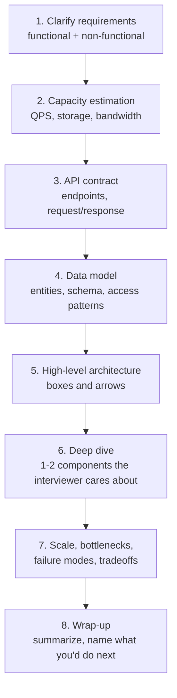
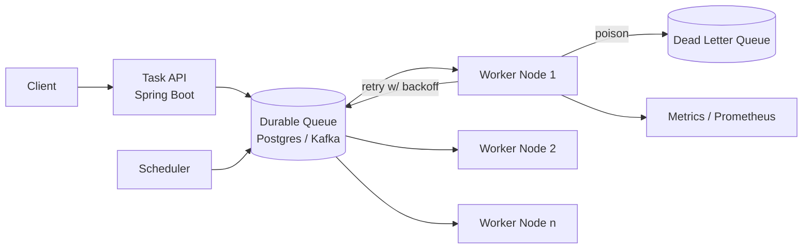
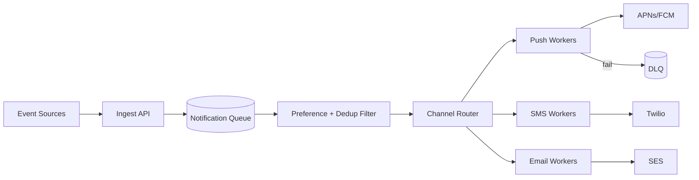
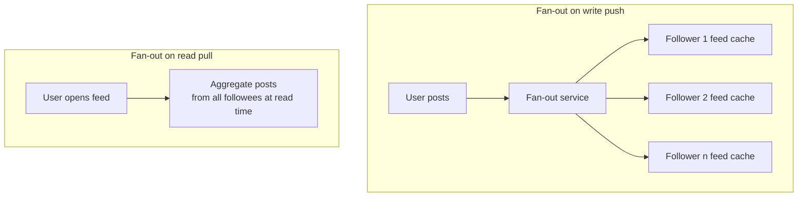
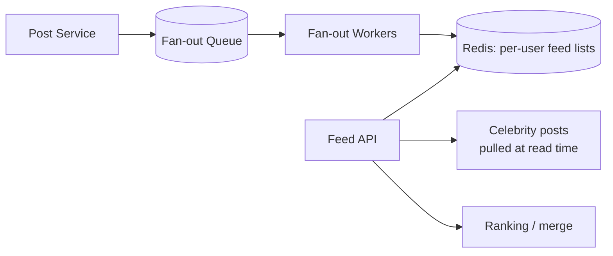
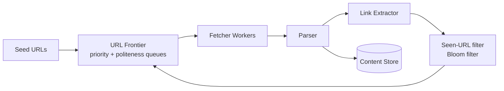
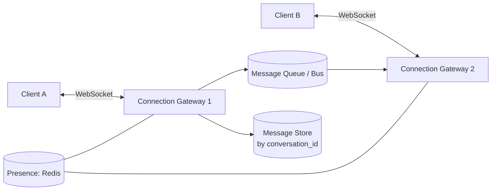
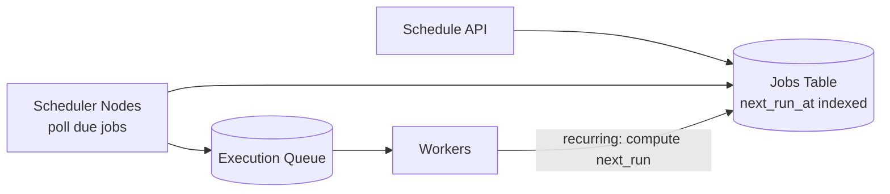
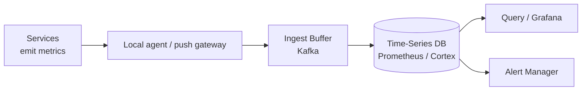
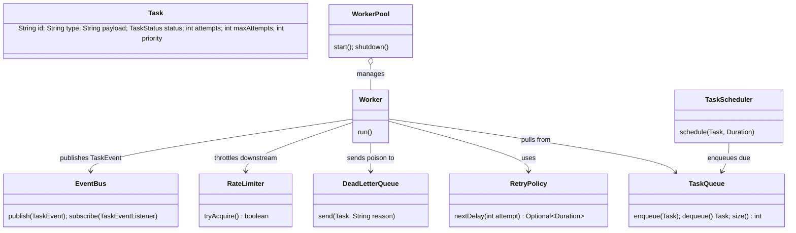

# Interview Prep: System Design

> Where this fits: this is the capstone interview bank for the whole roadmap. It assumes you have built the [Distributed Task Queue](../09-project/architecture.md) and read the deep-dive chapters in [10-system-design](../10-system-design/system-design-fundamentals.md). Here we drill the *interview performance*: the framework you run on every question, 8–10 full design prompts with model solutions, and the tradeoffs interviewers actually probe.

A system-design interview is not a knowledge quiz. It is a **simulation of a design review** at the company. The interviewer is asking: *if I gave this person an ambiguous problem and a whiteboard, would I trust the result?* You are graded on how you scope, how you reason about tradeoffs, how you handle scale, and whether you notice the failure modes that bite in production. Memorizing one "correct" architecture loses. Driving a structured conversation wins.

This file gives you:

1. A **repeatable framework** (the same one for every prompt) so you never freeze.
2. **8–10 design prompts** with structured model solutions, capacity math, schemas, and the follow-ups interviewers push on.
3. **25–40 graded interview questions** (Easy / Medium / Hard) with crisp model answers.
4. **Rapid-fire one-liners** and a **red-flags** list that sink candidates.

---

## 1. The Framework — Run This Every Time

Do not start drawing boxes. Spend the first 5–8 minutes scoping. The single biggest differentiator between mid-level and senior candidates is that seniors *refuse to design before they understand the requirements*.



| Step | Time budget (45-min interview) | What you produce | What it signals |
| --- | --- | --- | --- |
| 1. Requirements | 5–8 min | Bulleted functional + non-functional list, scope cuts | Maturity, product sense |
| 2. Estimation | 3–5 min | QPS, storage/yr, bandwidth, a few "this number drives X" insights | Quantitative reasoning |
| 3. API | 3 min | 3–5 endpoints with shapes | Interface thinking |
| 4. Data model | 4–6 min | Entities + schema + access patterns + index choices | Storage fluency |
| 5. High-level arch | 5 min | One clean diagram | Systems thinking |
| 6. Deep dive | 10–12 min | The hard part, in detail | Depth, the real signal |
| 7. Scale + failures | 5–8 min | Bottlenecks, sharding, replication, DLQ, idempotency | Production thinking |
| 8. Wrap-up | 2 min | Summary + "next I'd do…" | Communication |

**The meta-rule:** *narrate your tradeoffs out loud.* "I'll use a pull-based queue because workers can pace themselves under backpressure, at the cost of polling latency — I'll mitigate with long-polling." That single sentence is worth more than a perfect diagram drawn in silence.

### How to drive the conversation

- **Ask, then assume.** "Are we read-heavy or write-heavy? … I'll assume 100:1 read:write." Stating the assumption lets you proceed even if the interviewer doesn't answer.
- **Lead with the dominant constraint.** For a news feed it's fan-out; for a rate limiter it's atomicity and latency; for a URL shortener it's read scale and key generation. Name it early.
- **Offer options, recommend one.** "We could fan-out-on-write or fan-out-on-read. For our follower distribution I'd go hybrid — push for normal users, pull for celebrities. Here's why."
- **Let the interviewer steer the deep dive.** After the high-level diagram, ask: "Which part should I go deep on?" This is collaborative and shows seniority.
- **Manage time yourself.** If you're 25 minutes in and still on the data model, say "let me lock this and move to architecture" — owning the clock is a senior signal.

> **Functional vs non-functional, fast:** *Functional* = what the system does (submit task, get status). *Non-functional* = how well (latency p99 < 50ms, 99.9% availability, durable, scales to 50k QPS). Non-functional requirements drive 80% of the architecture.

---

## 2. Reusable Building Blocks (know cold)

Every prompt is assembled from the same parts. Memorize the tradeoff for each. Deep dives live in [10-system-design](../10-system-design/system-design-fundamentals.md) and [08-distributed-systems](../08-distributed-systems/cap-theorem.md).

| Block | Use it for | Key tradeoff | Deep dive |
| --- | --- | --- | --- |
| Load balancer (L4/L7) | Spread traffic, TLS, routing | L7 = smart but costs CPU; L4 = fast but dumb | [fundamentals](../10-system-design/system-design-fundamentals.md) |
| Cache (Redis/CDN) | Read scale, hot keys | Stale data, invalidation, thundering herd | [fundamentals](../10-system-design/system-design-fundamentals.md) |
| Relational DB (Postgres) | Transactions, joins, ACID | Vertical scale ceiling, harder to shard | [data modeling](../10-system-design/data-modeling-and-storage.md) |
| NoSQL (Cassandra/Dynamo) | Massive write scale, simple access | No joins, eventual consistency | [data modeling](../10-system-design/data-modeling-and-storage.md) |
| Message queue (Kafka/Rabbit/SQS) | Decouple, buffer, backpressure | Ordering, delivery semantics, lag | [message queues](../07-queues-and-messaging/message-queues.md) |
| Sharding | Horizontal data scale | Cross-shard queries, rebalancing, hot shards | [sharding](../08-distributed-systems/sharding.md) |
| Replication | Read scale, HA | Replication lag, read-your-writes | [consistency](../08-distributed-systems/consistency-and-availability.md) |
| Rate limiter | Protect downstreams, fairness | Accuracy vs latency vs distributed state | [rate limiting](../08-distributed-systems/rate-limiting.md) |
| CDC / outbox | Reliable event publish | Extra moving parts, eventual delivery | [idempotency](../08-distributed-systems/idempotency.md) |

**Delivery semantics** is the single most probed concept across all queue/stream/event prompts:

- **At-most-once:** fire and forget. Fast, can lose messages. (Metrics, logs.)
- **At-least-once:** retry until acked. Can duplicate → **consumers must be idempotent**. (The default for task queues.)
- **Exactly-once *delivery*** is impossible across a network (two-generals). You get exactly-once *effect* via at-least-once delivery + idempotent consumers + dedup keys. Say this sentence verbatim and you've passed a checkpoint.

---

## 3. Design Prompts (Structured Model Solutions)

Each prompt follows the framework. They're ordered by how commonly they appear. Prompt 1 (the task queue) is the deepest because it's *our project* — the others reuse its primitives.

---

### Prompt 1 — Design a Distributed Task Queue (our project)

> This is the home-field prompt. Full standalone walkthrough lives in [designing-a-task-queue.md](../10-system-design/designing-a-task-queue.md); here is the interview-paced version.

**1. Requirements.**
- Functional: submit a task (`POST /tasks`), get status (`GET /tasks/{id}`), async execution by typed handlers, retries with backoff, scheduled/delayed tasks, dead-letter for poison messages, priorities.
- Non-functional: durable (never lose an accepted task), at-least-once execution, p99 submit latency < 50 ms, process 10k tasks/s, horizontally scalable workers, observable.

**2. Capacity.** 10k tasks/s sustained, payload ~1 KB. Storage: `10k × 1KB × 86400 ≈ 864 GB/day` of raw payload if retained; in practice we keep terminal tasks ~7 days then archive → ~6 TB hot. Queue depth at peak (workers down 5 min): `10k × 300 = 3M` tasks buffered — must fit in the broker.

**3. API.**

```text
POST /tasks         {type, payload, maxAttempts, priority, scheduledAt?} -> 202 {id}
GET  /tasks/{id}    -> 200 {id, status, attempts, ...}
POST /tasks/{id}/cancel -> 200
```

`POST` is `202 Accepted` (work isn't done yet) and supports an `Idempotency-Key` header so client retries don't double-submit.

**4. Data model (canonical).**

```java
enum TaskStatus { PENDING, SCHEDULED, RUNNING, SUCCEEDED, FAILED, RETRYING, DEAD }

record Task(String id, String type, String payload, TaskStatus status,
            int attempts, int maxAttempts, Instant createdAt,
            Instant scheduledAt, int priority) {}
```

```sql
CREATE TABLE tasks (
  id            UUID PRIMARY KEY,
  type          TEXT NOT NULL,
  payload       JSONB NOT NULL,
  status        TEXT NOT NULL,
  attempts      INT  NOT NULL DEFAULT 0,
  max_attempts  INT  NOT NULL DEFAULT 3,
  priority      INT  NOT NULL DEFAULT 0,
  created_at    TIMESTAMPTZ NOT NULL DEFAULT now(),
  scheduled_at  TIMESTAMPTZ NOT NULL DEFAULT now()
);
-- the index that makes the queue a queue:
CREATE INDEX idx_due ON tasks (status, scheduled_at, priority DESC)
  WHERE status IN ('PENDING','SCHEDULED','RETRYING');
```

**5. High-level architecture.**



**6. Deep dive — the worker dequeue (the correctness core).** Use `SELECT ... FOR UPDATE SKIP LOCKED` so N workers pull disjoint rows without blocking each other:

```sql
UPDATE tasks SET status='RUNNING', attempts = attempts + 1
WHERE id = (
  SELECT id FROM tasks
  WHERE status IN ('PENDING','RETRYING') AND scheduled_at <= now()
  ORDER BY priority DESC, scheduled_at
  FOR UPDATE SKIP LOCKED
  LIMIT 1
) RETURNING *;
```

On success → `SUCCEEDED`. On retryable failure with attempts left → `RETRYING`, `scheduled_at = now() + backoff(attempts)`. On exhausted/non-retryable → `DEAD` + push to DLQ.

**7. Scale & failures.**
- **Backpressure:** workers pull, so a slow consumer just polls slower; the queue absorbs the burst (bounded by storage). See [backpressure](../08-distributed-systems/backpressure.md).
- **Retries with jitter** to avoid thundering herds; exponential backoff. See [retries](../08-distributed-systems/retries.md).
- **Idempotency:** at-least-once means a task can run twice (worker crashes after side-effect, before ack). Handlers must be idempotent via the dedup key. See [idempotency](../08-distributed-systems/idempotency.md).
- **Scaling the queue:** Postgres taps out around low-tens-of-thousands/s; swap to Kafka (partition by `type` or `id`) for higher throughput, accepting per-partition (not global) ordering.

**The follow-ups interviewers love:** "What happens if a worker dies mid-task?" (visibility timeout / lease expiry re-queues it). "How do you guarantee a scheduled task fires exactly once across 10 schedulers?" (leader election or a `FOR UPDATE SKIP LOCKED` poll so only one grabs it). "Priority starvation?" (aging: bump priority by waiting time).

---

### Prompt 2 — Design a Rate Limiter

**1. Requirements.** Limit a client to N requests per window; per-user and per-API-key; distributed across many app servers; low added latency (< 1 ms); fail-open or fail-closed (a decision, not a default).

**2. The algorithm choice is the whole interview.**

| Algorithm | Burst behavior | Memory | Accuracy | Notes |
| --- | --- | --- | --- | --- |
| Fixed window | Allows 2× burst at window edge | O(1) counter | Coarse | Simple, edge bug |
| Sliding window log | Exact | O(N) timestamps | Exact | Memory-heavy |
| Sliding window counter | Smooths edges | O(1) | Good approx | Common production pick |
| Token bucket | Allows controlled bursts | O(1) | Good | Our project default |
| Leaky bucket | Smooths output rate | O(1) | Good | Shapes traffic |

**3. Token bucket — the canonical implementation.** Matches our `RateLimiter` interface:

```java
interface RateLimiter { boolean tryAcquire(); }

final class TokenBucketRateLimiter implements RateLimiter {
    private final long capacity;
    private final double refillPerSec;
    private double tokens;
    private long lastRefillNanos;

    TokenBucketRateLimiter(long capacity, double refillPerSec) {
        this.capacity = capacity;
        this.refillPerSec = refillPerSec;
        this.tokens = capacity;
        this.lastRefillNanos = System.nanoTime();
    }

    public synchronized boolean tryAcquire() {
        long now = System.nanoTime();
        double elapsedSec = (now - lastRefillNanos) / 1_000_000_000.0;
        tokens = Math.min(capacity, tokens + elapsedSec * refillPerSec);
        lastRefillNanos = now;
        if (tokens >= 1.0) { tokens -= 1.0; return true; }
        return false;
    }
}
```

**4. The distributed twist (where most candidates stumble).** Per-server buckets let a client exceed the global limit by hitting different servers. Options:

- **Centralized Redis** with an atomic Lua script (read-modify-write in one round trip) — correct, adds ~0.5 ms, Redis becomes a dependency.
- **Sticky routing** (hash client → server) — no shared state, but uneven load and rebalancing pain.
- **Local + async reconciliation** — each server keeps a local bucket sized to `globalLimit / serverCount`, periodically corrected. Approximate, very fast, fails gracefully.

```lua
-- atomic token bucket in Redis (called via EVALSHA)
local tokens = tonumber(redis.call('get', KEYS[1]) or ARGV[1])
local now = tonumber(ARGV[3]); local last = tonumber(redis.call('get', KEYS[2]) or now)
tokens = math.min(tonumber(ARGV[1]), tokens + (now-last)*tonumber(ARGV[2]))
if tokens >= 1 then redis.call('set', KEYS[1], tokens-1); redis.call('set', KEYS[2], now); return 1
else redis.call('set', KEYS[1], tokens); redis.call('set', KEYS[2], now); return 0 end
```

**5. Production calls.** Return `429` with a `Retry-After` header. **Fail-open** if the limiter (Redis) is down — better to admit extra traffic than to take down the API; but **fail-closed** for security-critical limits (login attempts). Deep dive: [rate limiting](../08-distributed-systems/rate-limiting.md).

> **In our project:** the `TokenBucketRateLimiter` sits in front of the `WorkerPool` to cap how fast we hit a downstream API a `TaskHandler` calls — protecting *them*, not us.

---

### Prompt 3 — Design a Notification System

**1. Requirements.** Send notifications across channels (push, SMS, email, in-app) triggered by events; fan-out to millions; respect user preferences and quiet hours; dedupe; retries; track delivery; rate-limit per provider.

**2. Architecture — this *is* our task queue, specialized.**



**3. The key decisions.**
- **Each channel = a `TaskHandler` type.** A notification is a `Task` with `type = "push" | "sms" | "email"`. Reuse retries, DLQ, backoff for free.
- **Idempotency / dedup:** a `(userId, eventId, channel)` dedup key in Redis (TTL) prevents "you got the same email 3 times" — the most-reported notification bug.
- **Per-provider rate limiting:** a `TokenBucketRateLimiter` per provider; Twilio caps you, so the queue absorbs the overflow.
- **Fan-out:** one event → many users → enqueue one task per `(user, channel)`. For a 10M-user broadcast, fan-out asynchronously in batches so the ingest call returns fast.
- **Preferences + quiet hours:** filtered before enqueue or in the handler; quiet-hours → reschedule via `scheduledAt` (our scheduler primitive).

**4. Follow-ups.** "How do you guarantee at-least-once but not spam?" (at-least-once delivery + dedup key = effectively once). "Priority?" (transactional OTP > marketing — use our `priority` field + separate worker pools so marketing can't starve OTP).

---

### Prompt 4 — Design a URL Shortener (TinyURL / bit.ly)

**1. Requirements.** `POST /shorten {longUrl}` → short code; `GET /{code}` → 301 redirect; custom aliases; analytics (click counts); ~100:1 read:write; codes never collide; optional expiry.

**2. Capacity.** 100M new URLs/month ≈ 40 writes/s; reads 100× → 4k reads/s, bursty. Over 5 years: ~6B URLs. Code length: base62 (`[A-Za-z0-9]`), `62^7 ≈ 3.5 trillion` → **7 chars** is plenty. Storage: `6B × ~500 bytes ≈ 3 TB`.

**3. Key generation — the heart of the prompt.**

| Approach | Pro | Con |
| --- | --- | --- |
| Hash(longUrl) → base62, take first 7 | Stateless, dedup identical URLs | Collisions need check-and-retry |
| Auto-increment ID → base62 encode | No collisions, dense | Sequential = guessable/enumerable; single counter is a bottleneck |
| Pre-generated key pool (KGS) | No collision check at write time, fast | Needs a key service + storage |
| Snowflake-style ID | Distributed, no coordination | 64-bit → longer codes |

**Recommended:** a **Key Generation Service** that pre-mints unique 7-char codes into a pool; app servers grab a batch (say 1000) at a time. No write-path collision check, no single hot counter.

**4. Data model.** Read-dominated and key-value shaped → use a KV store (Dynamo/Cassandra) or sharded Postgres keyed by `code`.

```sql
CREATE TABLE urls (
  code       VARCHAR(7) PRIMARY KEY,
  long_url   TEXT NOT NULL,
  created_at TIMESTAMPTZ DEFAULT now(),
  expires_at TIMESTAMPTZ
);
```

**5. Scale.** Cache the hottest codes (Redis/CDN) — a tiny fraction of links get most clicks; cache hit serves the redirect in ~1 ms. Shard by `code` (consistent hashing). Analytics: don't write a row per click synchronously — emit a click event to a queue and aggregate async (this is literally our task queue's job).

**6. Follow-ups.** "301 vs 302?" (301 = permanent, browser caches → fewer hits but no analytics on cached; 302 = temporary, every click reaches you → analytics but more load — pick based on whether you need per-click data). "Custom alias collision?" (unique constraint, return 409).

---

### Prompt 5 — Design a News Feed (Twitter/Instagram feed)

**1. Requirements.** Users follow others; feed = recent posts from followees, reverse-chron (or ranked); post → appears in followers' feeds quickly; read-heavy; handle celebrities with 100M followers.

**2. The central decision: fan-out-on-write vs fan-out-on-read.**



| | Fan-out on write (push) | Fan-out on read (pull) |
| --- | --- | --- |
| Read latency | Fast (feed pre-built) | Slow (gather + merge) |
| Write cost | High (write to every follower) | Cheap |
| Celebrity problem | Catastrophic (100M writes per post) | Fine |
| Best for | Most users (few followers) | Celebrities |

**Recommended: hybrid.** Push for normal users (pre-compute their feed cache). For celebrities, **pull** their posts at read time and merge into the cached feed. This avoids the 100M-write fan-out storm while keeping reads fast for the common case.

**3. Architecture.**



**4. Data + storage.** Feeds as Redis lists/sorted-sets per user (the post-IDs, capped at ~800). Posts in a sharded store keyed by `postId`. The fan-out is — again — our task queue: each "deliver post P to follower F" is a `Task`.

**5. Follow-ups.** "Ranking vs reverse-chron?" (reverse-chron is simpler; ranking adds an ML scoring stage at read time). "New follow — backfill?" (pull recent posts of the new followee at read time until next fan-out). "Feed staleness?" (acceptable; eventual consistency is fine here — nobody needs strict ordering of a feed).

---

### Prompt 6 — Design a Web Crawler

**1. Requirements.** Fetch billions of pages; respect `robots.txt` and politeness (don't hammer one host); dedupe URLs; bounded depth/freshness; extensible (parse links, index content).

**2. Architecture = producer/consumer at planet scale.**



**3. Key decisions.**
- **URL Frontier** = a politeness-aware priority queue (one sub-queue per host so we rate-limit per domain) — a specialized version of our scheduling/priority queues ([priority queues](../07-queues-and-messaging/priority-queues.md), [scheduling queues](../07-queues-and-messaging/scheduling-queues.md)).
- **Dedup at scale:** a **Bloom filter** answers "have I seen this URL?" in O(1) with tiny memory and no false negatives (false positives just skip a page — acceptable).
- **Politeness:** per-host token bucket; respect `Crawl-delay`.
- **Workers** are `TaskHandler`s of type `fetch`; failures retry with backoff, dead hosts go to DLQ.

**4. Follow-ups.** "Crawler trap / infinite URL space?" (depth limit + URL pattern detection). "Freshness?" (re-crawl priority by change rate). "Bloom filter false positive?" (we skip a real page — tune to ~1% and accept it).

---

### Prompt 7 — Design a Chat / Messaging System (WhatsApp-lite)

**1. Requirements.** 1:1 and group messaging; delivery + read receipts; online presence; ordered messages within a conversation; offline delivery; ~at-least-once with dedup.

**2. Architecture.**



**3. Key decisions.**
- **Persistent connections** (WebSocket) held by stateless gateways; a routing layer (Redis pub/sub or a bus) routes "message for user X" to whichever gateway holds X's connection.
- **Ordering** within a conversation via a per-conversation sequence number (`conversation_id` as partition key — same trick as Kafka partitions, see [message ordering](../08-distributed-systems/message-ordering.md)).
- **Offline:** undelivered messages persist; deliver on reconnect (pull from store since last-acked seq).
- **Dedup:** client message-id makes retries idempotent.

**4. Follow-ups.** "Group of 1000?" (write once, fan-out delivery — our task queue again). "Read receipts at scale?" (batch + async; don't write a row per receipt synchronously). "Presence flapping?" (heartbeat + TTL in Redis, debounce).

---

### Prompt 8 — Design a Distributed Job Scheduler (cron-as-a-service)

**1. Requirements.** Schedule one-off and recurring jobs (cron expressions); fire at the right time across a cluster; **exactly-once trigger** despite many scheduler nodes; at-least-once execution; survive node crashes.

**2. Architecture.** This is our `TaskScheduler` + `TaskQueue`, distributed.



**3. The exactly-once-trigger problem (the whole point).** If 10 scheduler nodes all poll "jobs where next_run_at <= now", they'll all fire the same job. Two clean answers:

- **`SELECT ... FOR UPDATE SKIP LOCKED`** on the due jobs — only one node grabs each row. Simple, correct, scales to moderate fleets. (Same primitive as our task queue dequeue.)
- **Leader election** (one scheduler is the active poller via [distributed locks](../08-distributed-systems/distributed-locks.md) / [leader election](../08-distributed-systems/leader-election.md)) — simpler reasoning, but the leader is a throughput bottleneck and a failover gap.

```sql
UPDATE jobs SET status='ENQUEUED', next_run_at = next_run_at + interval
WHERE id IN (
  SELECT id FROM jobs WHERE status='SCHEDULED' AND next_run_at <= now()
  FOR UPDATE SKIP LOCKED LIMIT 100
) RETURNING *;
```

**4. Follow-ups.** "Node fires then crashes before enqueue?" (the row is locked in a transaction — on rollback it stays due; on commit it's enqueued. Atomic.) "Clock skew?" (use NTP; tolerate seconds of jitter; never assume perfectly synced clocks). "Missed window (cluster down 1h)?" (policy: fire-all-missed, fire-once, or skip — make it configurable per job).

---

### Prompt 9 — Design a Metrics / Monitoring System

**1. Requirements.** Ingest time-series metrics from thousands of services; store efficiently; query for dashboards + alerts; high write throughput; retention with downsampling.

**2. Architecture.**



**3. Key decisions.**
- **Write path is the constraint:** millions of points/s. Buffer in Kafka, batch-write to a TSDB; never write one HTTP request per data point.
- **Storage:** time-series DBs use delta-of-delta + compression (Gorilla) — ~1.3 bytes/point vs ~16 raw. Retention: raw for 2 weeks, then downsample to 1-min/1-hour rollups.
- **Cardinality is the killer:** high-cardinality labels (e.g. `userId` as a label) explode the series count. The #1 metrics-system mistake — call it out.
- **Pull vs push:** Prometheus pulls (scrapes) for liveness signal + simplicity; push gateways for short-lived jobs (our batch workers).

**4. Tie-in.** Our `MetricsCollector` / Micrometer `MeterRegistry` exports counters (tasks processed), gauges (queue depth), and timers (handler latency) to Prometheus. Deep dive: [observability-and-ops](../10-system-design/observability-and-ops.md).

---

### Prompt 10 — Design a Distributed Cache (Redis-like)

**1. Requirements.** Low-latency KV store; scale beyond one machine's RAM; survive node loss; eviction; optional persistence.

**2. Key decisions.**
- **Partitioning:** consistent hashing so adding/removing a node remaps only `1/N` of keys (not all). Virtual nodes smooth hot spots. See [sharding](../08-distributed-systems/sharding.md).
- **Replication:** each shard has replicas for HA; async replication = fast but a window of data loss on failover.
- **Eviction:** LRU/LFU when full; TTLs for freshness.
- **Consistency:** caches are usually AP — stale reads are acceptable; the app tolerates it.

**3. The famous cache pitfalls (interviewers will ask).**
- **Thundering herd / cache stampede:** key expires, 10k requests miss simultaneously and hammer the DB. Fix: request coalescing (single-flight), early/probabilistic refresh, or a short lock.
- **Hot key:** one key gets 90% of traffic → one shard melts. Fix: replicate the hot key across nodes or add a local L1 cache.
- **Cache penetration:** queries for nonexistent keys bypass cache to DB. Fix: cache negative results / Bloom filter.

---

## 4. Interview Questions — Graded with Model Answers

### Easy

**Q1. What's the difference between horizontal and vertical scaling?**
Vertical = bigger machine (more CPU/RAM); simple but has a ceiling and a single point of failure. Horizontal = more machines behind a load balancer; near-unlimited but needs statelessness, partitioning, and coordination. *Testing:* do you reach for "buy a bigger box" or "design for distribution"? Real systems do both — scale up until it's uneconomical, then out.

**Q2. What does a load balancer do, and L4 vs L7?**
Distributes requests across servers, removes dead ones (health checks), terminates TLS. L4 routes on IP/port (fast, protocol-agnostic); L7 routes on HTTP content — paths, headers, cookies (smart routing, sticky sessions, but more CPU). *Testing:* basic traffic-distribution literacy.

**Q3. When would you pick NoSQL over a relational database?**
When you need massive horizontal write scale with simple key-based access and can tolerate eventual consistency, and you don't need joins or multi-row transactions. Pick relational when you need ACID, ad-hoc queries, joins, and your data fits the scale a sharded Postgres can handle. *Testing:* whether you treat "NoSQL" as a buzzword or a tradeoff. Red flag: "NoSQL because it's faster."

**Q4. What is caching and why use it?**
Storing the result of an expensive operation close to the consumer to serve repeats cheaply. Cuts latency and offloads the origin. The hard part isn't the cache — it's **invalidation** and **staleness**. *Testing:* do you know caching's cost (consistency) not just its benefit?

**Q5. What's a CDN?**
A geographically distributed cache for static (and increasingly dynamic) content, serving users from the nearest edge. Cuts latency and origin load. *Testing:* edge-vs-origin awareness.

**Q6. What's an idempotent operation? Give one.**
An operation that produces the same result whether applied once or many times. `PUT /user/5 {name: X}` is idempotent; `POST /tasks` (creates a new row each time) is not — which is why we add an `Idempotency-Key`. *Testing:* this concept underpins all retry logic. See [idempotency](../08-distributed-systems/idempotency.md).

**Q7. Why use a message queue between services?**
To **decouple** producer and consumer (different rates, independent failure), **buffer** bursts (backpressure), and enable async processing. The producer doesn't wait for the work. *Testing:* do you understand decoupling vs just "it's a pipe"? This is the spine of our project ([message queues](../07-queues-and-messaging/message-queues.md)).

**Q8. What's the difference between a primary key and a sharding key?**
Primary key uniquely identifies a row within a table. Sharding (partition) key determines *which node* holds the row. They can differ; choosing the shard key badly creates hot shards or forces cross-shard queries. *Testing:* partitioning fundamentals.

### Medium

**Q9. Explain the three delivery semantics. Which does a task queue use?**
At-most-once (fire and forget; may lose), at-least-once (retry until acked; may duplicate), exactly-once (no loss, no dup). A task queue uses **at-least-once** delivery and makes consumers idempotent to get exactly-once *effect*. *Testing:* the single most important queue concept. Bonus: explain that exactly-once *delivery* is impossible across a network (two-generals). Follow-up: "How do you dedup?" → dedup key in a store with TTL.

**Q10. Walk me through CAP. Which does our task queue pick?**
Under a network partition you must choose Consistency (reject/block to avoid stale data) or Availability (serve possibly-stale data). It's a choice *only during a partition*; normally you have both. Our task *submission* path leans CP for the durable write (we must not lose an accepted task — better to 503 than silently drop), while the *worker/queue* read path can lean AP. *Testing:* do you parrot "pick 2 of 3" or understand it's a partition-time tradeoff? See [cap-theorem](../08-distributed-systems/cap-theorem.md). Red flag: "we'll have all three."

**Q11. How do you prevent two workers from processing the same task?**
Atomic claim. In Postgres: `SELECT ... FOR UPDATE SKIP LOCKED` flips status `PENDING → RUNNING` so only one worker wins the row. In a broker: a visibility timeout hides the message from others while leased; if the worker dies without acking, the lease expires and it's redelivered. *Testing:* concurrency-under-distribution. This is the literal core of our `Worker` dequeue.

**Q12. Compare fan-out-on-write vs fan-out-on-read for a feed. When hybrid?**
Write (push): pre-build each follower's feed → fast reads, expensive writes; dies on celebrities (100M writes/post). Read (pull): gather followees' posts at read time → cheap writes, slow reads. Hybrid: push for normal users, pull for high-fan-out celebrities. *Testing:* the defining news-feed tradeoff. Follow-up: "Where's the threshold?" → empirically, follower count above ~10k–100k.

**Q13. Design the key-generation scheme for a URL shortener. Tradeoffs?**
Options: hash-and-truncate (stateless, collisions need retry), counter-to-base62 (no collision but sequential/guessable + hot counter), pre-generated key pool via a KGS (no write-path collision check, needs a service), Snowflake IDs (distributed, longer codes). Recommend KGS-batched pool. *Testing:* uniqueness + scale + a hidden security angle (don't make codes enumerable). See [data modeling](../10-system-design/data-modeling-and-storage.md).

**Q14. How does a token bucket rate limiter work, and how do you make it distributed?**
A bucket holds up to `capacity` tokens, refilled at `rate`/sec; each request takes one or is rejected — allowing controlled bursts. Distributed: a centralized Redis bucket updated atomically (Lua script) for correctness, or per-server local buckets sized to `limit/serverCount` for speed at the cost of accuracy. Fail-open if the limiter is down (usually). *Testing:* algorithm + the distributed-state problem. Our `TokenBucketRateLimiter` is exactly this. See [rate limiting](../08-distributed-systems/rate-limiting.md).

**Q15. What is a dead-letter queue and when does a message go there?**
A separate queue for messages that can't be processed — after exhausting retries, or on non-retryable errors (bad schema, poison payload). It keeps poison messages from blocking the main queue and preserves them for inspection/replay. In our model: `attempts >= maxAttempts` or a `TaskResult` with `retryable=false` → status `DEAD` + `DeadLetterQueue.send(task, reason)`. *Testing:* failure-handling maturity. See [dead-letter-queues](../07-queues-and-messaging/dead-letter-queues.md).

**Q16. How do you handle retries without making things worse?**
Exponential backoff with **jitter** to avoid synchronized retry storms (thundering herd); a max attempt cap → DLQ; only retry **retryable** errors (timeouts, 503), never 400s; make the operation idempotent so a retry of a partially-applied op is safe; add a circuit breaker so you stop hammering a dead downstream. *Testing:* the difference between "add retries" and "add retries correctly." See [retries](../08-distributed-systems/retries.md), [circuit-breakers](../08-distributed-systems/circuit-breakers.md).

**Q17. What's backpressure and how does your design apply it?**
A mechanism for a slow consumer to signal a fast producer to slow down, instead of unbounded buffering → OOM. Pull-based consumers apply it naturally (they pull when ready). Bounded queues apply it by blocking/rejecting producers when full (`BlockingQueue.put` blocks; or return 429). *Testing:* do you know unbounded queues are a latent outage? See [backpressure](../08-distributed-systems/backpressure.md), [blocking-queue](../06-concurrency/blocking-queue.md).

**Q18. How would you estimate the storage for 100M new records/day at 1KB each over a year?**
`100M × 1KB = 100 GB/day`. `× 365 ≈ 36.5 TB/year` raw, before replication (×3 ≈ 110 TB) and indexes (+20–40%). Decide retention (hot vs archived). *Testing:* can you do back-of-envelope math out loud without a calculator and round sanely? See [capacity-estimation](../10-system-design/capacity-estimation.md).

**Q19. Sync vs async replication — what do you lose with each?**
Sync: the write isn't acked until replicas confirm → no data loss on failover, but higher write latency and reduced availability (a slow/down replica blocks writes). Async: ack immediately, replicate in background → fast and available, but a failover can lose the un-replicated tail. Most systems pick async + tolerate a small loss window, or semi-sync (ack after 1 replica). *Testing:* durability-vs-latency tradeoff literacy. See [consistency-and-availability](../08-distributed-systems/consistency-and-availability.md).

**Q20. How do you choose a shard key? What goes wrong?**
Pick a key with high cardinality and even access distribution that matches your dominant query (so most queries hit one shard). Wrong choices cause **hot shards** (low-cardinality or skewed key, e.g. shard by country), **cross-shard scatter-gather** (queries don't include the key), and painful **rebalancing**. Consistent hashing limits resharding blast radius. *Testing:* the hardest part of sharding is the key. See [sharding](../08-distributed-systems/sharding.md).

**Q21. When do you choose a SQL database vs a queue for the "queue"?**
Postgres-as-a-queue (`FOR UPDATE SKIP LOCKED`) is great up to low-tens-of-thousands/s: one system, transactional, easy ops, exact-once claim. Move to Kafka/Rabbit/SQS when you exceed that, need long retention/replay, or need many independent consumer groups — accepting per-partition (not global) ordering and an extra system to operate. *Testing:* "use the boring tech until it hurts." This is exactly our Phase 2 → Phase 4 evolution.

### Hard

**Q22. Design exactly-once trigger for a distributed cron with 20 scheduler nodes. Prove correctness.**
Each node runs `UPDATE jobs SET status='ENQUEUED' WHERE id IN (SELECT id FROM jobs WHERE due AND status='SCHEDULED' FOR UPDATE SKIP LOCKED LIMIT N) RETURNING *`. `SKIP LOCKED` means concurrent transactions claim **disjoint** rows; the row-level lock + the `status='SCHEDULED'` predicate inside one transaction guarantees no two nodes claim the same job. If a node crashes mid-transaction, the lock releases on rollback and the job stays `SCHEDULED` (still due) for another node — **at-least-once trigger, never-double within commit**. Recurring jobs compute `next_run_at` in the same transaction. Alternative: leader election (one active poller) — simpler reasoning but a throughput bottleneck and a failover gap. *Testing:* can you reason about correctness under concurrency + crashes, not just draw boxes? See [leader-election](../08-distributed-systems/leader-election.md), [distributed-locks](../08-distributed-systems/distributed-locks.md).

**Q23. Your task queue is at 8k tasks/s on Postgres and p99 latency is climbing. Walk me through diagnosis and the path to 80k/s.**
Diagnose first: is it the queue claim query (lock contention on the hot due-rows index), the write path (WAL/IO), connection pool exhaustion, or worker count? Check `pg_stat_activity`, lock waits, index bloat. Quick wins: claim in batches (`LIMIT 50`) to amortize round trips; partition the table by status or hash; add read replicas for `GET /tasks/{id}`; tune autovacuum (status churn bloats the index). When Postgres genuinely caps: introduce Kafka, partition by `type`, run a consumer group per worker pool — now throughput scales with partitions, ordering becomes per-partition, and Postgres becomes the system-of-record updated async (outbox/CDC). *Testing:* methodical diagnosis before rewrite; do you reach for "rewrite in Kafka" prematurely (a red flag) or measure first? See [scaling-the-platform](../10-system-design/scaling-the-platform.md).

**Q24. How do you publish an event reliably when you also write to your DB (the dual-write problem)?**
Don't write to the DB and publish to the bus separately — a crash between them loses the event or fakes one. Use the **transactional outbox**: in the *same DB transaction* that updates the task, insert a row into an `outbox` table. A separate relay (or CDC like Debezium) reads the outbox and publishes to the bus, marking rows sent. The DB transaction is the single atomic commit point; the relay is at-least-once → consumers dedup. *Testing:* the canonical distributed-systems trap. In our project this is how a `Task` status change reliably becomes a `TaskEvent` on the `EventBus`. See [idempotency](../08-distributed-systems/idempotency.md).

**Q25. A single hot key gets 95% of your cache traffic and melts one shard. Fixes?**
Detect via per-key metrics. Fixes, escalating: (1) **replicate the hot key** to multiple nodes and read a random replica; (2) add a small **local in-process L1 cache** on each app server (short TTL) so most reads never hit the shard; (3) **key-splitting** for counters (`hotkey:0..N`, sum on read); (4) for stampede on expiry, **request coalescing / single-flight** + probabilistic early refresh. *Testing:* do you know that even-hashing doesn't save you from skewed *access*?

**Q26. Design read-your-own-writes consistency on top of async replication.**
The problem: user writes to the leader, immediately reads from a lagging replica, sees stale data. Fixes: (1) route a user's reads to the **leader for a short window** after a write (sticky); (2) track the write's **log sequence number**, and only serve the read from a replica that has caught up to that LSN; (3) keep recent writes in a session cache and read-through it. *Testing:* nuanced consistency reasoning beyond "eventual is fine." See [consistency-and-availability](../08-distributed-systems/consistency-and-availability.md).

**Q27. How do you guarantee message ordering when you also want parallelism?**
Global ordering and parallelism are in tension. The standard answer: **partition by an ordering key** (e.g. `conversationId`, `userId`) so all messages that must be ordered land in the same partition, processed by one consumer in order — while *different* keys process in parallel. You get per-key order + cross-key parallelism. If you need strict global order you give up parallelism (single partition/consumer). *Testing:* the ordering-vs-throughput tradeoff. In our queue, ordering within a `type`+key but not globally. See [message-ordering](../08-distributed-systems/message-ordering.md).

**Q28. Your downstream dependency (a payment API a `TaskHandler` calls) starts timing out. Walk me through protecting the system.**
Layered defense: (1) **timeouts** on every call (never infinite); (2) **retries with backoff + jitter**, but only for retryable errors; (3) a **circuit breaker** — after a failure threshold, open the circuit and fail fast (don't pile up threads waiting on a dead service), with a half-open probe to recover; (4) **bulkheads** — isolate the failing handler's thread pool so it can't exhaust workers serving healthy task types; (5) shed load / DLQ the affected tasks for later replay. *Testing:* cascading-failure prevention — the difference between one slow dependency and a full outage. See [circuit-breakers](../08-distributed-systems/circuit-breakers.md), [retries](../08-distributed-systems/retries.md).

**Q29. Estimate the infrastructure for 50k task submissions/sec, then justify each number.**
QPS write 50k, 1KB payload. Ingest: ~`50k × 1KB = 50 MB/s` write bandwidth; at ~2k accepted-writes/s per Postgres node you'd need sharding or a broker — pick Kafka (one broker handles this on a few partitions). Storage: `50k/s × 86400 × 1KB ≈ 4.3 TB/day`; retain terminal tasks 7 days → ~30 TB hot, ×3 replication ≈ 90 TB. Workers: if a handler averages 50 ms, one worker does 20 tasks/s; `50k / 20 = 2500` worker threads — with virtual threads, a few dozen nodes. App tier: 50k QPS / ~5k QPS per node ≈ 10 API nodes + headroom. *Testing:* end-to-end quantitative reasoning that drives the architecture. See [capacity-estimation](../10-system-design/capacity-estimation.md).

**Q30. How would you make the entire task queue multi-region active-active?**
Hardest tier. Options: (1) **region-local queues** — submit and process in the same region, replicate the system-of-record async cross-region for DR; simple, but a region outage loses in-flight work in that region until failover. (2) **global durable log** (Kafka MirrorMaker / a globally-replicated store) — stronger but adds cross-region latency and conflict resolution. Key decisions: where is the source of truth, how do you avoid double-processing a task in two regions (region-affinity via the task's home region + idempotency), and what's your RPO/RTO. Most teams pick region-local + async DR replication and accept a small RPO. *Testing:* can you reason about the hardest scaling tier without hand-waving "just replicate everything"? See [scaling-the-platform](../10-system-design/scaling-the-platform.md).

---

## 5. Rapid-Fire One-Liners

Memorize these; interviewers fire them as quick checks between deeper questions.

- **202 vs 201?** 202 Accepted = work queued, not done (our `POST /tasks`); 201 Created = resource exists now.
- **301 vs 302?** 301 permanent (cached by browser); 302 temporary (every hit reaches you — needed for click analytics).
- **Idempotent HTTP methods?** GET, PUT, DELETE, HEAD are idempotent; POST is not.
- **What makes a write durable?** It survives a crash — committed to disk (fsync'd WAL), ideally replicated.
- **Bloom filter guarantee?** No false negatives, possible false positives. "Definitely not present" or "maybe present."
- **Consistent hashing buys you?** Adding/removing a node remaps only ~1/N keys, not all of them.
- **Why jitter on backoff?** To desynchronize retries and avoid a thundering herd.
- **WAL is for?** Write-ahead log — durability + crash recovery + replication source.
- **p50 vs p99?** Median vs tail. Tail latency is what users feel and what SLOs guard.
- **Strong vs eventual consistency?** Strong: every read sees the latest write. Eventual: reads converge over time.
- **Push vs pull queue?** Push = low latency, broker controls pace (can overwhelm consumer). Pull = consumer paces itself (natural backpressure), at the cost of polling latency.
- **Why not exactly-once delivery?** Two-generals problem; you get exactly-once *effect* = at-least-once + idempotency.
- **Hot partition cause?** Low-cardinality or skewed shard key, or skewed access to one key.
- **Sidecar / outbox in one line?** Write the event in the same DB transaction as the data, relay it out async.
- **CAP during normal operation?** No partition → you have both C and A; the tradeoff only bites during a partition.

---

## 6. Red Flags That Sink Candidates

Interviewers debrief on these. Avoid them.

- **Jumping straight to a diagram** without clarifying requirements or estimating load. Looks junior every time.
- **"We'll have all three of CAP."** Instant credibility loss.
- **Unbounded queues / unbounded retries** with no backpressure, no max attempts, no DLQ. Reveals you've never run something in production.
- **Premature scale.** Designing for 1B users when asked for 1M, or reaching for Kafka/microservices/sharding before measuring. Senior engineers use the boring solution until it hurts.
- **Buzzword-driven design.** "I'll use Kafka and Cassandra and Kubernetes" with no *why*. Always justify with the constraint it solves.
- **Ignoring failure modes.** Not asking "what if a worker dies mid-task?" / "what if the DB is down?" Reliability is the real test.
- **No numbers.** Hand-waving "it'll scale" instead of estimating QPS/storage/bandwidth.
- **Silent thinking.** The interview is graded on your reasoning; if you don't narrate, you get no credit for it.
- **Refusing to make a decision.** Listing five options and never recommending one. Seniors commit and own the tradeoff.
- **Treating idempotency / delivery semantics as optional.** In any queue/event prompt, not mentioning at-least-once + idempotency is a fail.
- **Not managing time.** Spending 30 minutes on the data model and never reaching architecture.
- **Designing for a problem you weren't asked.** Gold-plating with features the requirements didn't include.

---

## 7. How This Maps to Our Project (the canonical model)

Every prompt above reuses primitives you built. The interview advantage of having built the project is that you can speak from experience, not theory.



| Prompt | Reuses from our project |
| --- | --- |
| Task queue | The whole thing — `Task`, `TaskQueue`, `Worker`, `WorkerPool`, `RetryPolicy`, `DeadLetterQueue` |
| Rate limiter | `TokenBucketRateLimiter`, the `RateLimiter` interface |
| Notification system | A `TaskHandler` per channel; retries, DLQ, dedup keys, per-provider rate limiting |
| News feed fan-out | Each "deliver post to follower" is a `Task`; the fan-out queue is our `TaskQueue` |
| Web crawler | Politeness queue = priority + scheduling queues; fetchers are `TaskHandler`s |
| Job scheduler | `TaskScheduler` + `FOR UPDATE SKIP LOCKED` claim, exactly our worker dequeue |
| Metrics system | `MetricsCollector` / Micrometer exporting to Prometheus |
| Event publishing | `EventBus` + transactional outbox for reliable `TaskEvent` delivery |

---

## What We Can Improve In Our Project Using This Concept

The interview prompts surface gaps worth closing in the real codebase:

- **Add an `Idempotency-Key` to `POST /tasks`** so client retries don't create duplicate `Task` rows — directly from the rate-limiter/notification prompts.
- **Add a transactional outbox** so `Task` status changes reliably become `TaskEvent`s on the `EventBus` (Q24), eliminating the dual-write risk in Phase 4.
- **Add per-`type` worker pools** so a slow/failing handler (e.g. a flaky `email` type) can't starve other task types — the bulkhead idea from Q28.
- **Add priority aging** to the dequeue query so low-priority tasks don't starve forever (Prompt 1 follow-up).

## Project Refactoring Task

Implement the idempotency key end to end: extend the `POST /tasks` controller to read an `Idempotency-Key` header, store it in a unique-indexed `idempotency_keys` table within the same transaction as the `Task` insert, and on a duplicate key return the original task's `id` (200) instead of creating a new one. Add a JUnit 5 + AssertJ test that submits the same key twice concurrently (two virtual threads) and asserts exactly one `Task` row exists. This is the production answer to Q6/Q9 and the most common real-world task-queue bug.

## Git Commit For This Chapter

```text
docs(interview-prep): add system-design interview bank with 10 design prompts

Files touched:
- 11-interview-prep/system-design.md (new)
```

## Architecture Impact

This chapter is a *lens*, not a new component — but acting on it changes the architecture. The idempotency key adds a table and a uniqueness constraint on the write path. The transactional outbox introduces an `outbox` table plus a relay/CDC process, converting the `EventBus` from best-effort to at-least-once. Per-`type` worker pools turn the single `WorkerPool` into a set of bulkheaded pools, isolating failure domains. Each change trades a little operational complexity for a meaningful reliability gain — exactly the tradeoffs you'll be asked to defend.

## Interview Takeaways

- **Run the framework every time:** requirements → estimation → API → data model → architecture → deep dive → scale/failures → wrap-up. Never start with a box.
- **Narrate tradeoffs out loud** and **commit to a recommendation** — silent perfection scores zero; reasoned decisions score high.
- **Delivery semantics + idempotency** is the most-probed concept in any queue/event prompt: at-least-once delivery + idempotent consumers = exactly-once effect.
- **The hard part is always failure and scale:** worker death, dual writes, hot keys, thundering herds, cascading failures. Volunteer these before you're asked.
- **Use the boring solution until it hurts** (Postgres `FOR UPDATE SKIP LOCKED` before Kafka), and be able to say exactly when and why you'd graduate.
- **Having built the project is your edge** — speak from the `Task`, `Worker`, `RetryPolicy`, and `DeadLetterQueue` you actually wrote, not from textbook abstractions.
