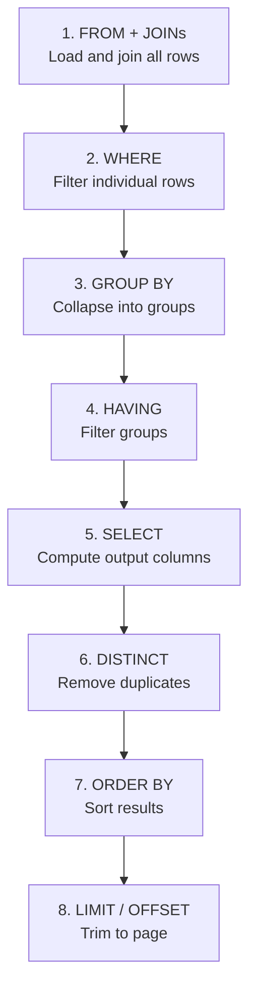
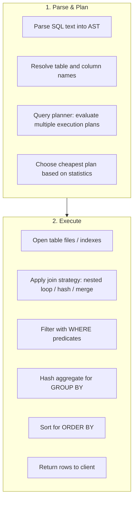

# How SQL Actually Executes

> Where this fits in the project: Every phase touches SQL. Phase 2 uses `SELECT ... FOR UPDATE SKIP LOCKED` to lease tasks. Phase 3 uses `INSERT ... ON CONFLICT DO NOTHING` for idempotency. Phase 4 queries the outbox table. If you write SQL by guessing keyword order, you will write slow queries, misunderstand errors, and fail the exact kind of interview question Zomato asks ("find the top 5 delivery partners in an area"). This chapter gives you the mental model that makes every SQL query writable from first principles — no memorization required.

---

## 1. Why this exists

Most developers learn SQL backwards. They learn the *syntax order* — `SELECT ... FROM ... WHERE ... GROUP BY ... ORDER BY` — and assume that is also the *execution order*. It is not. The database engine processes your query in a completely different sequence, and not understanding that sequence is why developers write queries that:

- Return wrong results (filtering after aggregation when they meant before)
- Are catastrophically slow (filtering in `HAVING` instead of `WHERE`)
- Fail with cryptic errors ("column not found in WHERE clause" when it exists in SELECT)
- Can't be reasoned about under interview pressure

The good news: the actual execution order has a logic to it that, once learned, makes every query obvious.

> Historical context: SQL was designed in the 1970s at IBM by Donald Chamberlin and Raymond Boyce, intentionally made to read like English sentences. The syntax `SELECT name FROM employees WHERE salary > 50000` reads like English — "select name from employees where salary is over 50,000." But English reading order is not computation order. The database has to *know what table to read from* before it can *select columns* from it. The execution order is the computational reality underneath the English surface.

---

## 2. The SQL execution order — the single most important mental model

Write this down. Internalize it. Every query you ever write follows this order:

```
1. FROM          — which table(s) am I reading from? (including JOINs)
2. WHERE         — filter individual rows BEFORE any grouping
3. GROUP BY      — collapse rows into groups
4. HAVING        — filter GROUPS (like WHERE but after grouping)
5. SELECT        — compute the output columns (aliases defined here)
6. DISTINCT      — remove duplicates from output
7. ORDER BY      — sort the result (can use SELECT aliases)
8. LIMIT/OFFSET  — trim to page size
```



This order explains three otherwise mysterious rules:

**Rule 1: You cannot use a SELECT alias in a WHERE clause.**
```sql
-- WRONG: 'full_name' is defined in SELECT (step 5) but WHERE runs at step 2
SELECT first_name || ' ' || last_name AS full_name
FROM employees
WHERE full_name LIKE 'John%';  -- ERROR: column "full_name" does not exist

-- CORRECT: repeat the expression in WHERE
SELECT first_name || ' ' || last_name AS full_name
FROM employees
WHERE first_name || ' ' || last_name LIKE 'John%';
```

**Rule 2: You CAN use a SELECT alias in ORDER BY** (ORDER BY runs after SELECT).
```sql
SELECT first_name || ' ' || last_name AS full_name, salary
FROM employees
ORDER BY full_name;  -- works fine: ORDER BY runs at step 7, after SELECT at step 5
```

**Rule 3: WHERE filters rows; HAVING filters groups. Never use HAVING where WHERE will do.**
```sql
-- WRONG: HAVING runs after GROUP BY, so every row gets grouped before filtering
-- This is correct but slower than it needs to be
SELECT department_id, COUNT(*) AS headcount
FROM employees
GROUP BY department_id
HAVING department_id = 10;  -- why group ALL departments just to throw them away?

-- CORRECT: WHERE runs before GROUP BY, filters first, groups less data
SELECT department_id, COUNT(*) AS headcount
FROM employees
WHERE department_id = 10    -- filter rows first
GROUP BY department_id;
```

---

## 3. The mental model for writing any query from scratch

When given a question in English, translate it to SQL in this exact order — the execution order, not the syntax order:

```
Step 1: What table(s) do I need?           → FROM / JOIN
Step 2: Which rows do I care about?        → WHERE
Step 3: Do I need to group?                → GROUP BY
Step 4: Do I need to filter groups?        → HAVING
Step 5: What do I want to see?             → SELECT
Step 6: What order should it appear in?    → ORDER BY
Step 7: Do I need to limit results?        → LIMIT
```

### Worked example: Zomato-style interview question

**Question:** *"Find the top 5 delivery partners in Delhi who have delivered the most 'express' orders in the last 30 days."*

Apply the 7-step translation:

```
Step 1: What tables?
        → delivery_partners, orders
        → joined on delivery_partner_id

Step 2: Which rows?
        → only orders in Delhi (city = 'Delhi')
        → only 'express' order type
        → only last 30 days

Step 3: Do I group?
        → Yes, group by delivery partner (to count their orders)

Step 4: Filter groups?
        → No filter on groups needed here

Step 5: What to show?
        → partner name, count of orders

Step 6: Order?
        → by count DESC (highest first)

Step 7: Limit?
        → TOP 5 → LIMIT 5
```

Now write it:

```sql
-- Naive version: works, but we'll improve it
SELECT
    dp.id,
    dp.name,
    COUNT(o.id) AS express_order_count
FROM delivery_partners dp
JOIN orders o ON o.delivery_partner_id = dp.id
WHERE o.city = 'Delhi'
  AND o.order_type = 'express'
  AND o.delivered_at >= NOW() - INTERVAL '30 days'
GROUP BY dp.id, dp.name
ORDER BY express_order_count DESC
LIMIT 5;
```

**Why `dp.id, dp.name` in GROUP BY?** Because `GROUP BY` says "collapse all rows with the same value of these columns into one group." If you group by only `dp.id` but select `dp.name`, the database has to figure out which `dp.name` to show for that group. Postgres will error. MySQL silently picks a random one (this is a MySQL footgun).

**Why not `HAVING` here?** We're not filtering groups — we want all groups (all delivery partners), just sorted and trimmed. `LIMIT` handles the "top 5" part, not `HAVING`.

---

## 4. What the database engine actually does under the hood

Understanding this makes `EXPLAIN` readable and makes you dangerous in interviews.



The **query planner** is the key piece. It looks at your SQL, looks at table statistics (row counts, value distributions, index existence), and chooses a physical plan. Two logically equivalent queries can have 1000x different performance based on which plan the planner chooses. This is why `EXPLAIN ANALYZE` exists — it shows you the plan the planner actually chose.

```sql
-- Run this on any query to see the plan
EXPLAIN ANALYZE
SELECT dp.name, COUNT(o.id)
FROM delivery_partners dp
JOIN orders o ON o.delivery_partner_id = dp.id
WHERE o.order_type = 'express'
GROUP BY dp.id, dp.name
ORDER BY 2 DESC
LIMIT 5;
```

```
-- Sample output (read bottom-up):
Limit  (cost=1240.55..1240.57 rows=5 width=36)
  ->  Sort  (cost=1240.55..1243.05 rows=1000 width=36)
        Sort Key: (count(o.id)) DESC
        ->  HashAggregate  (cost=1185.00..1195.00 rows=1000 width=36)
              Group Key: dp.id
              ->  Hash Join  (cost=450.00..1160.00 rows=5000 width=20)
                    Hash Cond: (o.delivery_partner_id = dp.id)
                    ->  Seq Scan on orders o  (cost=0.00..500.00 rows=5000 width=12)
                          Filter: (order_type = 'express')
                    ->  Hash  (cost=250.00..250.00 rows=1000 width=16)
                          ->  Seq Scan on delivery_partners dp
```

**Read bottom-up, left-to-right.** The innermost, rightmost nodes execute first. `Seq Scan` = full table scan (potentially slow). `Index Scan` = using an index (fast). The numbers in parentheses are `(startup_cost..total_cost rows=estimate width=bytes)`. After `ANALYZE`, you also get `actual time` to compare against estimates.

---

## 5. How this applies to the project

### The Phase 2 leasing query — understanding it fully now

```sql
-- This is PostgresTaskQueue.dequeue() — the most important query in the project
SELECT id, type, payload, status, attempts, max_attempts,
       created_at, scheduled_at, priority
  FROM tasks
 WHERE status IN ('PENDING', 'SCHEDULED', 'RETRYING')
   AND scheduled_at <= now()
 ORDER BY priority DESC, created_at ASC
 LIMIT ?
 FOR UPDATE SKIP LOCKED;
```

Walk through the execution order:
1. **FROM** `tasks` — load the tasks table
2. **WHERE** `status IN (...)` AND `scheduled_at <= now()` — filter to only runnable rows
3. **No GROUP BY** — we want individual rows, not aggregates
4. **No HAVING**
5. **SELECT** the columns we need
6. **ORDER BY** `priority DESC, created_at ASC` — highest priority first, then FIFO within same priority
7. **LIMIT** — grab a batch
8. **FOR UPDATE SKIP LOCKED** — lock the grabbed rows; if a row is already locked by another transaction, skip it and take the next one

`FOR UPDATE SKIP LOCKED` runs at the storage layer, after `LIMIT` has identified the rows. It is *not* a filter — it is a lock modifier. This is why it cannot appear in a subquery the same way `WHERE` can.

### The Phase 3 DLQ query — finding stuck tasks

```sql
-- StuckTaskReaper: reclaim tasks stuck in RUNNING past visibility timeout
UPDATE tasks
SET status = 'RETRYING',
    scheduled_at = now() + INTERVAL '30 seconds',
    updated_at = now()
WHERE status = 'RUNNING'
  AND updated_at < now() - INTERVAL '5 minutes'
RETURNING id, type;
```

The `RETURNING` clause is a PostgreSQL extension to `UPDATE` that returns the affected rows. Execution order: `FROM tasks` → `WHERE` (filter RUNNING rows older than 5 min) → `UPDATE` (flip status) → `RETURNING` (hand back the modified rows). This is how the `StuckTaskReaper` knows which tasks it reclaimed.

---

## 6. Common mistakes

### Mistake 1: Filtering in HAVING when WHERE works

```sql
-- WRONG: groups all rows, then throws away 999 groups
SELECT department_id, COUNT(*) 
FROM employees
GROUP BY department_id
HAVING department_id IN (10, 20);

-- CORRECT: filters rows first, groups less data
SELECT department_id, COUNT(*)
FROM employees  
WHERE department_id IN (10, 20)
GROUP BY department_id;
```

### Mistake 2: SELECT * in production

```sql
-- WRONG: fetches all columns, including large TEXT/JSONB fields
SELECT * FROM tasks WHERE status = 'PENDING';

-- CORRECT: fetch only what you need
SELECT id, type, scheduled_at FROM tasks WHERE status = 'PENDING';
```

In our `tasks` table, `payload` is a `JSONB` column that can be kilobytes. Selecting `*` means shipping kilobytes per row when you only needed the `id`.

### Mistake 3: Implicit column in GROUP BY (MySQL trap)

```sql
-- Works in MySQL (returns random value for name), FAILS in Postgres
SELECT department_id, name, COUNT(*)
FROM employees
GROUP BY department_id;  -- 'name' is not in GROUP BY

-- CORRECT: every non-aggregate in SELECT must appear in GROUP BY
SELECT department_id, name, COUNT(*)
FROM employees
GROUP BY department_id, name;
```

### Mistake 4: Using NOT IN with NULLs

```sql
-- WRONG: returns zero rows if any manager_id is NULL
-- because NULL IN (...) = NULL, and NOT NULL = NULL, not TRUE
SELECT * FROM employees
WHERE manager_id NOT IN (SELECT id FROM managers);

-- CORRECT: use NOT EXISTS, which handles NULLs correctly
SELECT * FROM employees e
WHERE NOT EXISTS (
    SELECT 1 FROM managers m WHERE m.id = e.manager_id
);
```

---

## 7. Production considerations

**Query planning is statistic-dependent.** The planner's estimates are only as good as the table statistics. Run `ANALYZE tasks;` (or let `autovacuum` do it) after large bulk inserts. If the planner consistently picks bad plans, check `pg_stats` to see if statistics are stale.

**Avoid `SELECT COUNT(*) FROM large_table`.** Postgres has to scan the entire table (no shortcut for exact count). For dashboards that just need "approximately how many tasks are queued," use `pg_class`:
```sql
SELECT reltuples::bigint AS approx_count
FROM pg_class
WHERE relname = 'tasks';
```

**`EXPLAIN` costs are not wall-clock time.** Cost units are abstract (roughly disk page fetches). Always use `EXPLAIN ANALYZE` — with `ANALYZE` it actually runs the query and reports real timings. Never run `EXPLAIN ANALYZE` on a destructive query (`DELETE`, `UPDATE`) without wrapping in a transaction you roll back.

---

## 8. Interview questions

**Q: Why can't I use a SELECT alias in a WHERE clause?**
> Because WHERE executes before SELECT. The alias doesn't exist yet when WHERE runs.

**Q: What's the difference between WHERE and HAVING?**
> WHERE filters individual rows before grouping. HAVING filters groups after grouping. If you can express a condition in WHERE, always prefer it — it reduces the data before GROUP BY does expensive work.

**Q: What does FOR UPDATE SKIP LOCKED do?**
> `FOR UPDATE` locks selected rows so no other transaction can modify or lock them. `SKIP LOCKED` says "if a row is already locked, don't wait — skip it and take the next available row." Together they turn Postgres into a concurrent task queue where N workers can lease N different rows simultaneously without blocking each other.

**Q: What's a sequential scan vs an index scan?**
> A sequential scan reads every page of the table in order. An index scan follows the index B-tree to find matching rows directly. Sequential scans are sometimes faster for large fractions of the table (less random I/O than index jumps). The planner decides based on the estimated selectivity of the WHERE clause.

**Q: Walk me through what happens when I run a SQL query.**
> The client sends SQL text → the parser converts it to an AST → the planner resolves names, generates candidate plans, and picks the cheapest using statistics → the executor runs the physical plan (opening tables, applying join strategies, filtering, sorting) → rows stream back to the client.

---

## 9. Key takeaways

1. **Execution order is not syntax order.** FROM → WHERE → GROUP BY → HAVING → SELECT → ORDER BY → LIMIT.
2. **Translate English to SQL using execution order**, not syntax order. Ask: what table? what rows? what groups? what output?
3. **WHERE filters rows. HAVING filters groups.** Use WHERE whenever possible.
4. **`EXPLAIN ANALYZE` is how you debug slow queries.** Read it bottom-up.
5. **`SELECT *` is a debt.** Always name your columns in production.
6. **`NOT IN` with NULLs is a trap.** Use `NOT EXISTS` instead.
