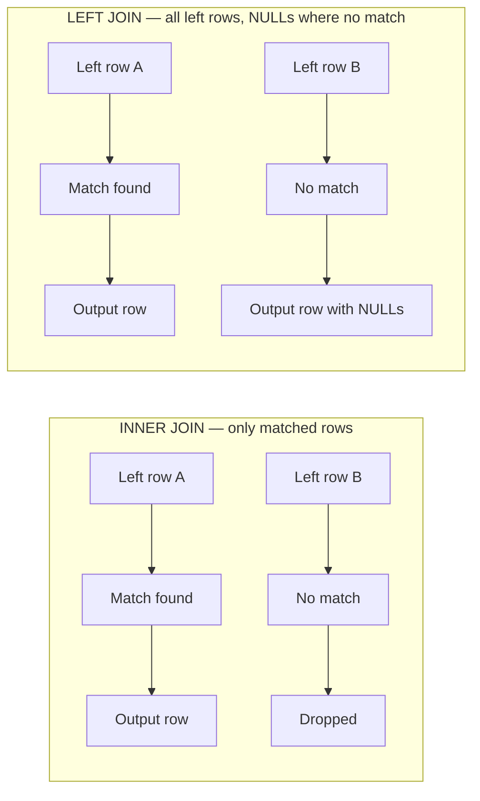

# Querying and Joins

> Where this fits in the project: Phase 2 introduces `JdbcTaskRepository` which queries the `tasks` table in multiple ways — find by id, poll due tasks, find by idempotency key. Phase 4 joins the `outbox` table against `tasks`. If you can only write simple `SELECT * FROM table WHERE id = ?`, you will hit a wall the moment you need to join, aggregate, or write the "top 5 delivery partners" style question that ended real interviews. This chapter teaches you how to think about JOINs and subqueries — not just their syntax.

---

## 1. Why this exists

Tables are normalized. That is not an accident — it is a deliberate design decision to store each fact exactly once. The `tasks` table stores task data. The (hypothetical) `task_handlers` table stores handler metadata. The `dead_letter` table stores failed tasks. They are separate because repeating the same handler name across 10,000 task rows wastes space and creates update anomalies ("I renamed the handler, now I have to update 10,000 rows").

But the moment you normalize, you pay a retrieval cost: to answer "show me all failed tasks with their handler name," you need to recombine data from multiple tables. **JOINs are how you pay that cost at query time.** Understanding them physically — not just syntactically — is what makes you able to write them confidently.

---

## 2. The four JOIN types — what they actually mean physically

Every JOIN is a question: *"For each row in the left table, which rows in the right table match?"* The JOIN type controls what happens when there is **no match**.



| JOIN type | Left no match | Right no match | When to use |
|---|---|---|---|
| `INNER JOIN` | Row dropped | Row dropped | You only want rows that exist on both sides |
| `LEFT JOIN` | Row kept with NULLs | Row dropped | You want all left rows, optionally enriched by right |
| `RIGHT JOIN` | Row dropped | Row kept with NULLs | Rare — usually rewrite as LEFT JOIN |
| `FULL OUTER JOIN` | Row kept with NULLs | Row kept with NULLs | Find rows missing from either side |
| `CROSS JOIN` | N/A | N/A | Every combination (N×M rows) — dangerous, rarely intentional |

### The one rule that eliminates 80% of JOIN confusion

> Use `LEFT JOIN` when you want "all rows from the left table, with optional data from the right."
> Use `INNER JOIN` when both sides must have a matching row for the result to be meaningful.

**Interview question it answers:** "Find all delivery partners, including those with zero orders."

```sql
-- WRONG: INNER JOIN — partners with zero orders are dropped
SELECT dp.name, COUNT(o.id) AS order_count
FROM delivery_partners dp
JOIN orders o ON o.delivery_partner_id = dp.id
GROUP BY dp.id, dp.name;

-- CORRECT: LEFT JOIN — partners with no orders get order_count = 0
SELECT dp.name, COUNT(o.id) AS order_count
FROM delivery_partners dp
LEFT JOIN orders o ON o.delivery_partner_id = dp.id
GROUP BY dp.id, dp.name;
```

`COUNT(o.id)` counts non-NULL values of `o.id`. When a partner has no orders, `o.id` is NULL (from the LEFT JOIN), so `COUNT(o.id)` = 0. If you wrote `COUNT(*)`, you would get 1 for partners with no orders because `COUNT(*)` counts rows, not values — and the LEFT JOIN produces one row (with all NULLs on the right side).

---

## 3. How JOINs are executed physically

The database engine has three strategies to execute a JOIN. Knowing which one it picks (and why) makes `EXPLAIN` readable.

### Nested Loop Join
```
For each row in left table:
    For each row in right table:
        If join condition matches, output the combined row
```
- **Cost:** O(N × M) in the worst case
- **Good for:** Small tables, or when the right side is accessed via an index (cost drops to O(N × log M))
- **In `EXPLAIN`:** `Nested Loop`

### Hash Join
```
Phase 1 (build): Read the smaller table, build a hash map keyed on the join column
Phase 2 (probe): For each row in the larger table, look up the hash map
```
- **Cost:** O(N + M) — linear, much faster than nested loop for large tables
- **Good for:** Large equi-joins with no useful index
- **Memory:** Needs to fit the hash table in `work_mem`; if it doesn't fit, spills to disk (slow)
- **In `EXPLAIN`:** `Hash Join` + `Hash`

### Merge Join
```
Sort both tables on the join column
Walk both sorted sequences simultaneously, outputting matches
```
- **Cost:** O(N log N + M log M) — dominated by sort cost
- **Good for:** Both tables already sorted (e.g., both have indexes on join column)
- **In `EXPLAIN`:** `Merge Join`

**Rule of thumb:** If your JOIN is slow, first check if the join column has an index. If not, add one. The planner will likely switch from Nested Loop to Index-assisted Nested Loop or Hash Join.

---

## 4. Subqueries — three forms, one mental model

A subquery is a `SELECT` inside another `SELECT`. There are three forms and they are NOT interchangeable:

### Scalar subquery — returns exactly one value
```sql
-- Scalar: returns one number, used like a column value
SELECT 
    id,
    type,
    (SELECT COUNT(*) FROM tasks WHERE status = 'PENDING') AS total_pending
FROM tasks
WHERE id = '123';
```
Danger: if placed in `SELECT`, this runs **once per output row**. For 10,000 rows, that is 10,000 executions of the subquery. This is the "N+1 problem" in pure SQL form.

### EXISTS subquery — returns true/false
```sql
-- EXISTS: short-circuits as soon as one match is found
-- "Find all delivery partners who have at least one 'premium' order"
SELECT dp.name
FROM delivery_partners dp
WHERE EXISTS (
    SELECT 1          -- the value doesn't matter, just existence
    FROM orders o
    WHERE o.delivery_partner_id = dp.id
      AND o.order_type = 'premium'
);
```
`EXISTS` is often faster than `IN` on large datasets because it stops as soon as the first match is found. `IN` evaluates the full subquery result.

### Table subquery (derived table / CTE) — returns a result set used as a table
```sql
-- Derived table: subquery in FROM clause
SELECT partner_name, order_count
FROM (
    SELECT dp.name AS partner_name, COUNT(o.id) AS order_count
    FROM delivery_partners dp
    JOIN orders o ON o.delivery_partner_id = dp.id
    GROUP BY dp.id, dp.name
) AS partner_stats
WHERE order_count > 100;
```

The inner query runs first, produces a virtual table named `partner_stats`, and the outer query filters it. This solves the "WHERE can't use GROUP BY aliases" limitation — you filter the grouped result in the outer WHERE.

---

## 5. CTEs — making complex queries readable

A Common Table Expression (CTE, written with `WITH`) gives a subquery a name and lets you reference it multiple times. It is a readability tool, not a performance tool (unless you use `WITH MATERIALIZED`).

```sql
-- WITHOUT CTE: nested, hard to read, hard to debug
SELECT partner_name, express_count, total_count,
       (express_count * 100.0 / total_count) AS express_pct
FROM (
    SELECT dp.name AS partner_name,
           COUNT(CASE WHEN o.order_type = 'express' THEN 1 END) AS express_count,
           COUNT(*) AS total_count
    FROM delivery_partners dp
    JOIN orders o ON o.delivery_partner_id = dp.id
    GROUP BY dp.id, dp.name
) sub
WHERE total_count >= 50
ORDER BY express_pct DESC
LIMIT 10;
```

```sql
-- WITH CTE: same query, readable
WITH partner_stats AS (
    SELECT 
        dp.id,
        dp.name AS partner_name,
        COUNT(CASE WHEN o.order_type = 'express' THEN 1 END) AS express_count,
        COUNT(*) AS total_count
    FROM delivery_partners dp
    JOIN orders o ON o.delivery_partner_id = dp.id
    GROUP BY dp.id, dp.name
),
qualified_partners AS (
    SELECT * FROM partner_stats
    WHERE total_count >= 50
)
SELECT 
    partner_name,
    express_count,
    total_count,
    ROUND((express_count * 100.0 / total_count), 2) AS express_pct
FROM qualified_partners
ORDER BY express_pct DESC
LIMIT 10;
```

CTEs make the query debuggable: you can run each CTE independently to check its output before adding the next layer.

**When CTEs are NOT just readability:** `WITH MATERIALIZED` forces the CTE result to be computed once and stored. By default (in Postgres 12+), the planner may inline a CTE. `MATERIALIZED` is useful when you use a CTE twice and want to compute it once:
```sql
WITH MATERIALIZED expensive_subquery AS (
    SELECT ... FROM large_table WHERE ...
)
SELECT * FROM expensive_subquery WHERE condition_a
UNION ALL
SELECT * FROM expensive_subquery WHERE condition_b;
```

---

## 6. How this applies to the project

### The tasks + outbox join (Phase 4)
```sql
-- Find tasks that are in the outbox but not yet published
-- (diagnostic query — helps you find relay failures)
SELECT 
    t.id,
    t.type,
    t.status,
    ob.created_at AS outbox_created,
    ob.published_at
FROM tasks t
INNER JOIN outbox ob ON ob.aggregate_id = t.id
WHERE ob.published_at IS NULL
  AND ob.created_at < NOW() - INTERVAL '5 minutes'
ORDER BY ob.created_at ASC;
```

This uses `INNER JOIN` (not LEFT) because we only want tasks that have an outbox row — tasks without an outbox entry don't need investigation. The `published_at IS NULL` check uses the partial index we created on the `outbox` table.

### Tasks with their dead-letter entries
```sql
-- Find tasks that were dead-lettered in the last 24 hours
-- for the ops dashboard
SELECT 
    t.id,
    t.type,
    t.attempts,
    t.max_attempts,
    dl.reason,
    dl.failed_at
FROM tasks t
INNER JOIN dead_letter dl ON dl.task_id = t.id
WHERE dl.failed_at >= NOW() - INTERVAL '24 hours'
ORDER BY dl.failed_at DESC;
```

---

## 7. Common mistakes

### Mistake 1: Joining without filtering — the Cartesian product trap

```sql
-- WRONG: missing the JOIN condition — produces N×M rows (Cartesian product)
SELECT * FROM delivery_partners, orders;  -- 1000 partners × 1M orders = 1B rows

-- CORRECT:
SELECT * FROM delivery_partners dp
JOIN orders o ON o.delivery_partner_id = dp.id;
```

### Mistake 2: Filtering in the wrong place with LEFT JOIN

```sql
-- WRONG: the WHERE clause turns LEFT JOIN into INNER JOIN
-- because WHERE o.order_type = 'express' filters out NULL right-side rows
SELECT dp.name, o.id
FROM delivery_partners dp
LEFT JOIN orders o ON o.delivery_partner_id = dp.id
WHERE o.order_type = 'express';  -- NULLs filtered here → same as INNER JOIN

-- CORRECT: filter in the ON clause to keep it a true LEFT JOIN
SELECT dp.name, o.id
FROM delivery_partners dp
LEFT JOIN orders o ON o.delivery_partner_id = dp.id
                   AND o.order_type = 'express';
-- Now partners with no express orders appear with o.id = NULL
```

### Mistake 3: Scalar subquery in SELECT (the N+1 trap)

```sql
-- WRONG: runs the subquery once per task row
SELECT 
    id,
    type,
    (SELECT name FROM handlers WHERE type = tasks.type) AS handler_name
FROM tasks;

-- CORRECT: JOIN — computed once
SELECT t.id, t.type, h.name AS handler_name
FROM tasks t
LEFT JOIN handlers h ON h.type = t.type;
```

### Mistake 4: `COUNT(*)` vs `COUNT(column)` in LEFT JOINs

```sql
-- Returns 1 for partners with no orders (counts the NULL row)
SELECT dp.name, COUNT(*) AS order_count
FROM delivery_partners dp
LEFT JOIN orders o ON o.delivery_partner_id = dp.id
GROUP BY dp.id, dp.name;

-- Returns 0 for partners with no orders (COUNT skips NULLs)
SELECT dp.name, COUNT(o.id) AS order_count  -- o.id is NULL when no orders
FROM delivery_partners dp
LEFT JOIN orders o ON o.delivery_partner_id = dp.id
GROUP BY dp.id, dp.name;
```

---

## 8. Interview questions

**Q: What is the difference between INNER JOIN and LEFT JOIN?**
> INNER JOIN returns only rows where a match exists in both tables. LEFT JOIN returns all rows from the left table and matching rows from the right; where no match exists, right-side columns are NULL.

**Q: When would you use EXISTS instead of IN?**
> Use EXISTS when checking for the presence of at least one matching row — it short-circuits on the first match. IN evaluates the full subquery. For large subquery results, EXISTS is faster. Also, `NOT IN` behaves incorrectly if the subquery returns any NULLs; `NOT EXISTS` handles NULLs correctly.

**Q: What is a CTE and when would you use it over a subquery?**
> A CTE (`WITH` clause) gives a name to a subquery, improving readability and allowing reuse within the same query. Performance-wise they are often equivalent, but `WITH MATERIALIZED` forces single evaluation. Use CTEs for complex multi-step queries where you need intermediate results.

**Q: A JOIN query is slow. What do you check first?**
> 1. Run `EXPLAIN ANALYZE` to see the plan. 2. Check if the join column has an index — a missing index causes sequential scans. 3. Check if the planner chose a nested loop over a hash join for large tables (might need to increase `work_mem`). 4. Check if the WHERE clause filters happen before or after the join.

---

## 9. Key takeaways

1. **Use `LEFT JOIN` for optional relationships, `INNER JOIN` for required ones.** When you switch and the row count changes, you understand why.
2. **Filtering a `LEFT JOIN` in `WHERE` converts it to an `INNER JOIN`.** Filter optional data in the `ON` clause instead.
3. **`COUNT(column)` skips NULLs; `COUNT(*)` counts rows.** Always know which you want.
4. **Scalar subqueries in SELECT are the SQL N+1 problem.** Replace with JOINs.
5. **CTEs are for readability and debugging.** Run each CTE independently when a complex query gives wrong results.
6. **EXISTS handles NULLs correctly; IN does not.** Default to `NOT EXISTS` when excluding rows.
