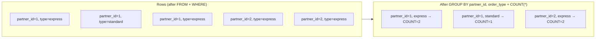
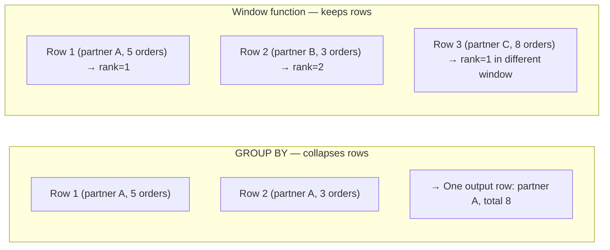

# Aggregations and Analytics

> Where this fits in the project: The exact question asked at Zomato — "find the top 5 delivery partners by express order count" — is an aggregation query. Phase 3 dashboard queries aggregate task counts by status. Phase 4 asks "which handler type has the highest failure rate?" — that's a ratio aggregation with filtering. This chapter teaches `GROUP BY`, `HAVING`, and window functions: the three tools that turn raw row data into answers to business questions.

---

## 1. Why this exists

Raw rows are facts. Businesses ask questions. Questions almost always involve aggregation: *how many*, *what's the total*, *what's the average*, *who is at the top*, *what changed over time*. The gap between storing data and answering questions about that data is what aggregation fills.

Two different mechanics serve these questions:

- **`GROUP BY` + aggregate functions** — collapse many rows into one summary row per group
- **Window functions** — compute values across a set of rows *without* collapsing them (each row keeps its identity)

Understanding when to use which is the difference between a developer who can write queries and one who can answer business questions.

---

## 2. GROUP BY and aggregate functions

### The mental model

`GROUP BY` says: *"treat all rows with the same value(s) of these columns as a single group, and apply an aggregate function to compute one value for the group."*



The rule: **every column in SELECT must either be in GROUP BY or be inside an aggregate function.** If a column is in neither, the database doesn't know which row's value to use for the group.

### The five essential aggregate functions

```sql
COUNT(*)          -- count of rows in the group (including NULLs)
COUNT(column)     -- count of non-NULL values
SUM(column)       -- total sum (NULLs ignored)
AVG(column)       -- arithmetic mean (NULLs ignored)
MAX(column)       -- highest value
MIN(column)       -- lowest value
```

### Conditional aggregation — the CASE trick

This is used constantly in analytics and interviews. It lets you compute multiple counts in one pass:

```sql
-- Count of each order type per delivery partner — ONE query, ONE scan
SELECT 
    dp.name,
    COUNT(*) AS total_orders,
    COUNT(CASE WHEN o.order_type = 'express'  THEN 1 END) AS express_count,
    COUNT(CASE WHEN o.order_type = 'standard' THEN 1 END) AS standard_count,
    COUNT(CASE WHEN o.order_type = 'scheduled' THEN 1 END) AS scheduled_count,
    ROUND(
        COUNT(CASE WHEN o.order_type = 'express' THEN 1 END) * 100.0 / COUNT(*),
        2
    ) AS express_pct
FROM delivery_partners dp
JOIN orders o ON o.delivery_partner_id = dp.id
GROUP BY dp.id, dp.name
ORDER BY total_orders DESC;
```

`COUNT(CASE WHEN condition THEN 1 END)` evaluates the `CASE` expression per row. When the condition is false, `CASE` returns `NULL`, and `COUNT` skips `NULL` — so only rows matching the condition are counted.

---

## 3. The full Zomato interview query — built step by step

**Question:** *"Find the top 5 delivery partners in Delhi who delivered the most express orders in the last 30 days."*

Apply the 7-step translation from Chapter 1:

```
1. FROM:     delivery_partners JOIN orders
2. WHERE:    city = 'Delhi', order_type = 'express', last 30 days, status = 'delivered'
3. GROUP BY: delivery_partner (to count their orders)
4. HAVING:   (none needed — we want all partners, just sorted)
5. SELECT:   partner name, count
6. ORDER BY: count DESC
7. LIMIT:    5
```

```sql
-- Production-quality version
SELECT 
    dp.id,
    dp.name,
    dp.phone,
    COUNT(o.id)                    AS express_deliveries,
    MIN(o.delivered_at)            AS first_delivery,
    MAX(o.delivered_at)            AS last_delivery
FROM delivery_partners dp
INNER JOIN orders o 
    ON  o.delivery_partner_id = dp.id
    AND o.order_type           = 'express'    -- filter in ON clause: applied during join
    AND o.status               = 'delivered'
    AND o.delivered_at        >= NOW() - INTERVAL '30 days'
WHERE dp.city = 'Delhi'                       -- filter on left table: before join
GROUP BY dp.id, dp.name, dp.phone
ORDER BY express_deliveries DESC
LIMIT 5;
```

**Why the order-related filters are in `ON` and city filter in `WHERE`?**

Both work, but the `ON` clause filters apply during the join — the database never builds pairs for non-matching rows. The `WHERE` clause on the left table (`dp.city`) is also a pre-join filter. Placing order filters in `ON` keeps the intent clear: these are join conditions, not result filters.

**Follow-up: What if each delivery also had a weight/cost and you wanted to rank by total cost, not count?**

```sql
SELECT 
    dp.id,
    dp.name,
    COUNT(o.id)        AS delivery_count,
    SUM(o.weight_kg)   AS total_weight,
    SUM(o.cost)        AS total_cost
FROM delivery_partners dp
INNER JOIN orders o ON o.delivery_partner_id = dp.id
WHERE dp.city = 'Delhi'
  AND o.order_type = 'express'
  AND o.delivered_at >= NOW() - INTERVAL '30 days'
GROUP BY dp.id, dp.name
ORDER BY total_cost DESC    -- changed: rank by total cost now
LIMIT 5;
```

The change is only in the `SELECT` (add `SUM(o.cost)`) and `ORDER BY`. The join and grouping structure is identical.

---

## 4. HAVING — filtering on groups

`HAVING` is `WHERE` for groups. It filters the output of `GROUP BY` before rows reach `SELECT`.

```sql
-- "Find delivery partners with more than 100 express orders in the last 30 days"
SELECT 
    dp.name,
    COUNT(o.id) AS express_count
FROM delivery_partners dp
JOIN orders o ON o.delivery_partner_id = dp.id
WHERE o.order_type = 'express'
  AND o.delivered_at >= NOW() - INTERVAL '30 days'
GROUP BY dp.id, dp.name
HAVING COUNT(o.id) > 100     -- filter groups: only high-performers
ORDER BY express_count DESC;
```

You can use the aggregate function directly in `HAVING` (not the alias — `HAVING` runs before `SELECT`).

**The common `HAVING` + subquery pattern:**
```sql
-- Partners whose express order count exceeds the average across all partners
WITH partner_counts AS (
    SELECT dp.id, dp.name, COUNT(o.id) AS express_count
    FROM delivery_partners dp
    JOIN orders o ON o.delivery_partner_id = dp.id
    WHERE o.order_type = 'express'
    GROUP BY dp.id, dp.name
)
SELECT name, express_count
FROM partner_counts
WHERE express_count > (SELECT AVG(express_count) FROM partner_counts)
ORDER BY express_count DESC;
```

---

## 5. Window functions — aggregate without collapsing

Window functions compute a value for each row based on a *window* of related rows, without collapsing those rows into a single group. This is the piece most developers don't know, and it comes up in senior engineering interviews constantly.



### Syntax

```sql
function_name() OVER (
    PARTITION BY column    -- defines the window (like GROUP BY for the window)
    ORDER BY column        -- order within the window
    ROWS/RANGE frame       -- which rows are "in scope" for the computation
)
```

### The four window functions you must know

#### ROW_NUMBER() — unique sequential number per partition

```sql
-- Rank delivery partners within each city by order count
SELECT 
    dp.name,
    dp.city,
    COUNT(o.id) AS order_count,
    ROW_NUMBER() OVER (
        PARTITION BY dp.city
        ORDER BY COUNT(o.id) DESC
    ) AS rank_in_city
FROM delivery_partners dp
JOIN orders o ON o.delivery_partner_id = dp.id
GROUP BY dp.id, dp.name, dp.city;
```

Note: window functions apply *after* GROUP BY. The `PARTITION BY` here operates on the already-grouped rows.

#### RANK() and DENSE_RANK() — tied rows get the same rank

```sql
-- RANK(): tied rows get the same rank; next rank skips (1, 1, 3)
-- DENSE_RANK(): tied rows get the same rank; no skips (1, 1, 2)
SELECT 
    name,
    order_count,
    RANK()       OVER (ORDER BY order_count DESC) AS rank_with_gap,
    DENSE_RANK() OVER (ORDER BY order_count DESC) AS rank_no_gap
FROM partner_order_counts;
```

#### LAG() and LEAD() — previous and next row values

```sql
-- Daily order count with the previous day's count for comparison
SELECT 
    date,
    daily_orders,
    LAG(daily_orders, 1) OVER (ORDER BY date) AS prev_day_orders,
    daily_orders - LAG(daily_orders, 1) OVER (ORDER BY date) AS day_over_day_change
FROM daily_order_stats;
```

#### SUM() / AVG() / COUNT() as window functions — running totals

```sql
-- Running total of tasks processed per day
SELECT 
    DATE(created_at) AS day,
    COUNT(*)         AS daily_count,
    SUM(COUNT(*)) OVER (ORDER BY DATE(created_at)) AS running_total
FROM tasks
WHERE status = 'SUCCEEDED'
GROUP BY DATE(created_at)
ORDER BY day;
```

`SUM(COUNT(*)) OVER (ORDER BY DATE(created_at))` — the inner `COUNT(*)` is the aggregate function for `GROUP BY`; the outer `SUM(...) OVER (...)` is the window function applied to the grouped result. This is the "nested aggregate in window" pattern.

---

## 6. The top-N-per-group pattern — the hardest common interview question

**Question:** "Find the top 3 delivery partners in each city by order count."

This cannot be solved with just `LIMIT` (which is global, not per-group). You need window functions:

```sql
-- Step 1: Rank partners within each city
WITH ranked_partners AS (
    SELECT 
        dp.id,
        dp.name,
        dp.city,
        COUNT(o.id) AS order_count,
        DENSE_RANK() OVER (
            PARTITION BY dp.city      -- rank within each city separately
            ORDER BY COUNT(o.id) DESC
        ) AS city_rank
    FROM delivery_partners dp
    JOIN orders o ON o.delivery_partner_id = dp.id
    GROUP BY dp.id, dp.name, dp.city
)
-- Step 2: Filter to top 3 per city
SELECT id, name, city, order_count, city_rank
FROM ranked_partners
WHERE city_rank <= 3
ORDER BY city, city_rank;
```

Why `DENSE_RANK` and not `ROW_NUMBER`? If two partners are tied at rank 2, `ROW_NUMBER` arbitrarily picks one as 2 and the other as 3. `DENSE_RANK` gives them both rank 2, and there is no rank 3 (it goes 1, 2, 2, 4). Use `ROW_NUMBER` if you truly want exactly 3 rows per city regardless of ties; use `DENSE_RANK` if you want all tied partners at the cutoff.

---

## 7. How this applies to the project

### Task failure rate per handler type (Phase 3 dashboard)
```sql
SELECT 
    type AS handler_type,
    COUNT(*)                                                       AS total,
    COUNT(CASE WHEN status = 'SUCCEEDED'  THEN 1 END)             AS succeeded,
    COUNT(CASE WHEN status = 'FAILED'     THEN 1 END)             AS failed,
    COUNT(CASE WHEN status = 'DEAD'       THEN 1 END)             AS dead_lettered,
    ROUND(
        COUNT(CASE WHEN status = 'FAILED' OR status = 'DEAD' THEN 1 END) 
        * 100.0 / NULLIF(COUNT(*), 0),
        2
    ) AS failure_rate_pct
FROM tasks
WHERE created_at >= NOW() - INTERVAL '24 hours'
GROUP BY type
ORDER BY failure_rate_pct DESC;
```

`NULLIF(COUNT(*), 0)` prevents division-by-zero — returns NULL instead of error when count is 0, and `ROUND(NULL, 2)` = NULL.

### Queue depth over time — running count (Phase 4 ops)
```sql
SELECT 
    DATE_TRUNC('hour', created_at) AS hour,
    COUNT(*)                        AS tasks_submitted,
    COUNT(CASE WHEN status = 'PENDING' THEN 1 END) AS pending,
    SUM(COUNT(*)) OVER (ORDER BY DATE_TRUNC('hour', created_at)) AS cumulative_submitted
FROM tasks
WHERE created_at >= NOW() - INTERVAL '7 days'
GROUP BY DATE_TRUNC('hour', created_at)
ORDER BY hour;
```

`DATE_TRUNC('hour', created_at)` truncates the timestamp to the hour boundary — grouping all tasks submitted in the same hour together.

---

## 8. Common mistakes

### Mistake 1: Using a SELECT alias in HAVING

```sql
-- WRONG: 'express_count' is defined in SELECT (step 5) but HAVING runs at step 4
SELECT dp.name, COUNT(o.id) AS express_count
FROM delivery_partners dp
JOIN orders o ON o.delivery_partner_id = dp.id
GROUP BY dp.id, dp.name
HAVING express_count > 100;  -- ERROR in Postgres

-- CORRECT: repeat the aggregate expression
HAVING COUNT(o.id) > 100;
```

### Mistake 2: Window function in WHERE

```sql
-- WRONG: window functions are computed at step 5 (SELECT), WHERE runs at step 2
SELECT name, ROW_NUMBER() OVER (ORDER BY order_count DESC) AS rn
FROM partners
WHERE rn <= 5;  -- ERROR: rn doesn't exist yet

-- CORRECT: use a CTE or subquery
WITH ranked AS (
    SELECT name, ROW_NUMBER() OVER (ORDER BY order_count DESC) AS rn
    FROM partners
)
SELECT * FROM ranked WHERE rn <= 5;
```

### Mistake 3: Dividing by zero in rate calculations

```sql
-- WRONG: crashes when no tasks of that type exist
SELECT type, COUNT(CASE WHEN status='FAILED' THEN 1 END) * 100.0 / COUNT(*) AS failure_rate
FROM tasks GROUP BY type;

-- CORRECT: use NULLIF to convert zero denominator to NULL
SELECT type, COUNT(CASE WHEN status='FAILED' THEN 1 END) * 100.0 / NULLIF(COUNT(*), 0)
FROM tasks GROUP BY type;
```

---

## 9. Interview questions

**Q: What is the difference between GROUP BY and window functions?**
> `GROUP BY` collapses rows — you get one output row per group. Window functions compute across a set of rows without collapsing — you get one output row per input row, enriched with the window computation. Use `GROUP BY` when you want summaries. Use window functions when you want per-row computations that reference other rows.

**Q: How would you find the top 3 records per group?**
> Use `DENSE_RANK()` (or `ROW_NUMBER()`) with `PARTITION BY` the group column and `ORDER BY` the ranking column, wrapped in a CTE, then filter with `WHERE rank <= 3`.

**Q: What does PARTITION BY do in a window function?**
> It defines the "window" — the set of rows considered for the computation. `PARTITION BY city` means the window function resets for each city. Without `PARTITION BY`, the window is the entire result set.

**Q: How would you compute a running total in SQL?**
> `SUM(column) OVER (ORDER BY date_column)` — the `ORDER BY` inside the window function defines the cumulative order. By default, the frame is "from the beginning to the current row."

**Q: What does NULLIF do and when do you use it?**
> `NULLIF(a, b)` returns NULL if `a = b`, otherwise returns `a`. Used to prevent division by zero: `value / NULLIF(denominator, 0)` returns NULL instead of throwing an error when denominator is zero.

---

## 10. Key takeaways

1. **`GROUP BY` collapses; window functions don't.** When you need per-row context (rank, running total, previous value), use window functions.
2. **Conditional aggregation (`COUNT(CASE WHEN ...)`) is one scan, multiple counts.** Prefer it over multiple queries or subqueries.
3. **`RANK()` has gaps; `DENSE_RANK()` doesn't; `ROW_NUMBER()` is always unique.** Know when ties matter.
4. **Top-N-per-group = window function + CTE + WHERE rank <= N.** This pattern appears in almost every analytics interview.
5. **`NULLIF(x, 0)` is the division-by-zero guard.** Always wrap rate calculations.
6. **Window functions cannot appear in `WHERE`.** Use a CTE or subquery to filter on window function results.
