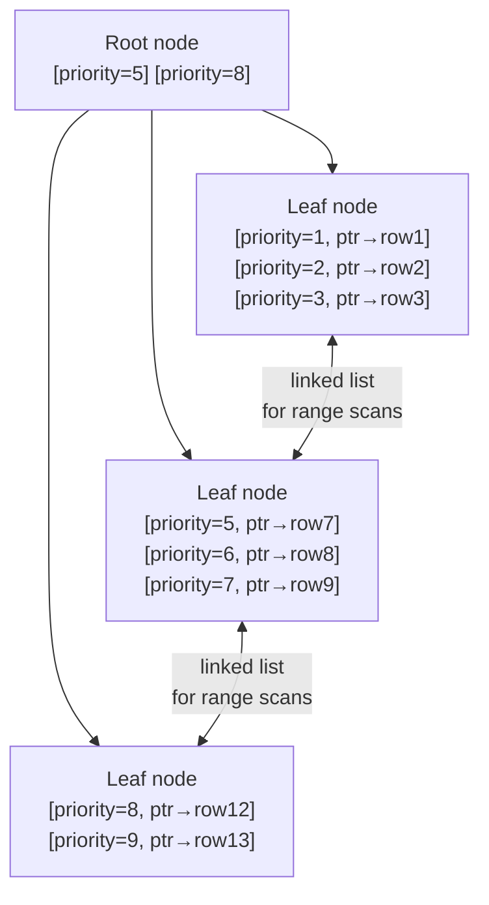

# Indexes and Query Performance

> Where this fits in the project: Phase 2 creates two indexes on the `tasks` table — `idx_tasks_lease` and `idx_tasks_status`. Phase 4 adds a partial index on the `outbox` table. These are not decoration — without `idx_tasks_lease`, the Phase 2 dequeue query scans the entire `tasks` table on every poll (every 200ms × 8 workers = hundreds of full table scans per second). This chapter teaches you how indexes work physically, how to read `EXPLAIN ANALYZE`, and how to make slow queries fast — the skills behind "how would you optimize this query?" in every senior backend interview.

---

## 1. Why this exists

A database table is stored as pages on disk. Without an index, finding rows that match a `WHERE` clause means reading every page — a **sequential scan**. For a `tasks` table with 1 million rows, that is 1 million row comparisons per query.

An index is a separate data structure (usually a B-tree) that stores a sorted copy of one or more columns with pointers back to the actual rows. Instead of scanning 1 million rows, the database walks the B-tree in O(log N) steps to find the matching rows directly.

The tradeoff is explicit: indexes make reads faster at the cost of write speed (every `INSERT`, `UPDATE`, `DELETE` must also update the index) and storage (indexes are additional data on disk).

---

## 2. How a B-tree index works physically



The B-tree has two properties that matter:
1. **Balanced** — every leaf is the same depth, so every lookup is O(log N)
2. **Leaf nodes are linked** — once you find the first matching row, scanning forward (for `ORDER BY`, for range queries) is cheap — just follow the linked list

This is why an index on `(priority DESC, created_at ASC)` makes the dequeue query fast: the B-tree is already sorted in the order we need, so the database can walk it and grab the top N rows without sorting.

---

## 3. Types of indexes in PostgreSQL

### Single-column index — the default
```sql
CREATE INDEX idx_tasks_status ON tasks (status);
-- Speeds up: WHERE status = 'PENDING'
-- Does NOT speed up: WHERE type = 'email' (wrong column)
```

### Composite (multi-column) index — order matters
```sql
CREATE INDEX idx_tasks_lease ON tasks (priority DESC, created_at ASC);
-- Speeds up: ORDER BY priority DESC, created_at ASC  (column order matches)
-- Speeds up: WHERE ... ORDER BY priority DESC, created_at ASC
-- Does NOT speed up: ORDER BY created_at ASC (leftmost column not used)
```

The **leftmost prefix rule**: a composite index on `(A, B, C)` can be used for queries filtering/ordering on `A`, or `A + B`, or `A + B + C` — but NOT on just `B` or just `C` without `A`. The B-tree is sorted by A first, then B within A, then C within B.

### Partial index — index only a subset of rows
```sql
-- Index only rows where status is a runnable state
-- Rows with status='SUCCEEDED' or 'FAILED' are NOT in this index
CREATE INDEX idx_tasks_lease
    ON tasks (priority DESC, created_at ASC)
    WHERE status IN ('PENDING', 'SCHEDULED', 'RETRYING');
```

This is the most important index in the project. Why?
- The `tasks` table accumulates millions of rows over time
- 99% of them are `SUCCEEDED` (terminal state)
- The dequeue query only ever cares about `PENDING`, `SCHEDULED`, `RETRYING`
- Without a partial index: the B-tree contains all 1M+ rows
- With a partial index: the B-tree contains only the few thousand currently runnable rows → orders of magnitude smaller → much faster

### Unique index — enforces uniqueness at storage level
```sql
-- V2 migration: idempotency_key must be unique (when not null)
CREATE UNIQUE INDEX uq_tasks_idem
    ON tasks (idempotency_key)
    WHERE idempotency_key IS NOT NULL;
```

`ON CONFLICT` clauses in `INSERT` statements target unique indexes. This is how `INSERT ... ON CONFLICT (idempotency_key) DO NOTHING` works — the unique index is the conflict detector.

### Expression index — index on a computed value
```sql
-- Index on the lower-case version of task type for case-insensitive lookup
CREATE INDEX idx_tasks_type_lower ON tasks (lower(type));
-- Now: WHERE lower(type) = 'email' uses the index
-- Without this: WHERE lower(type) = 'email' causes a sequential scan (function applied to every row)
```

---

## 4. Reading EXPLAIN ANALYZE

This is the most practical skill in this chapter. Every performance problem starts with `EXPLAIN ANALYZE`.

```sql
EXPLAIN ANALYZE
SELECT id, type, payload, status, attempts, max_attempts, created_at, scheduled_at, priority
FROM tasks
WHERE status IN ('PENDING', 'SCHEDULED', 'RETRYING')
  AND scheduled_at <= now()
ORDER BY priority DESC, created_at ASC
LIMIT 16
FOR UPDATE SKIP LOCKED;
```

**With the partial index (Phase 2 — what we have):**
```
Limit  (cost=0.43..12.50 rows=16 width=200) (actual time=0.021..0.089 rows=16 loops=1)
  ->  LockRows  (cost=0.43..1205.43 rows=1547 width=200) (actual time=0.019..0.085 rows=16 loops=1)
        ->  Index Scan using idx_tasks_lease on tasks
              (cost=0.43..1205.43 rows=1547 width=200) (actual time=0.015..0.074 rows=16 loops=1)
              Index Cond: (scheduled_at <= now())
Planning Time: 0.142 ms
Execution Time: 0.103 ms
```

**Without the index (what happens before migration):**
```
Limit  (cost=14820.00..14820.04 rows=16 width=200) (actual time=185.23..185.24 rows=16 loops=1)
  ->  Sort  (cost=14820.00..14823.87 rows=1547 width=200) (actual time=185.22..185.22 rows=16 loops=1)
        Sort Key: priority DESC, created_at ASC
        ->  Seq Scan on tasks
              (cost=0.00..14735.00 rows=1547 width=200) (actual time=0.021..152.14 rows=1547 loops=1)
              Filter: ((status = ANY ('{PENDING,SCHEDULED,RETRYING}'::text[]))
                      AND (scheduled_at <= now()))
              Rows Removed by Filter: 998453
Planning Time: 0.210 ms
Execution Time: 185.31 ms
```

**0.1ms vs 185ms — 1850x difference.** That is the index.

### How to read EXPLAIN output

```
Node type (cost=startup..total rows=estimate width=bytes)
           (actual time=startup..total rows=actual loops=count)
```

| Term | Meaning |
|---|---|
| `cost` | Planner's estimate (abstract units, not ms) |
| `actual time` | Real wall-clock time in ms (only with ANALYZE) |
| `rows` | Planner estimate vs actual rows processed |
| `loops` | How many times this node was executed |
| `Seq Scan` | Full table scan — **red flag** on large tables |
| `Index Scan` | B-tree lookup — **good** |
| `Index Only Scan` | All needed columns are in the index — **best** |
| `Bitmap Heap Scan` | Index for addresses, then heap for values — medium |
| `Hash Join` | Join via hash map — good for large tables |
| `Nested Loop` | Join via loops — good when inner side is indexed |
| `Sort` | Explicit sort step — means no useful index for ORDER BY |
| `Rows Removed by Filter` | Rows scanned but not returned — high number = wasted work |

---

## 5. Index design for the tasks table — the full picture

```sql
-- Phase 2: V1 migration creates these two indexes

-- 1. The lease index — the most critical index in the project
--    Covers: WHERE status IN (...) AND scheduled_at <= now()
--    Covers: ORDER BY priority DESC, created_at ASC
--    Partial: only runnable rows (PENDING, SCHEDULED, RETRYING) in the B-tree
CREATE INDEX idx_tasks_lease
    ON tasks (priority DESC, created_at ASC)
    WHERE status IN ('PENDING', 'SCHEDULED', 'RETRYING');

-- 2. The status dashboard index
--    Covers: WHERE status = 'FAILED' (ops queries, DLQ dashboard)
--    General: all statuses included (needed for dashboard queries on completed tasks)
CREATE INDEX idx_tasks_status ON tasks (status);
```

**Why not one combined index?** The lease query and dashboard queries have different access patterns:
- Lease query: always filters on runnable statuses + needs ORDER BY priority/created_at → partial index wins
- Dashboard: queries any status, no ORDER BY needed → simple status index wins

**Why does the primary key `id` (UUID) not help dequeue?** The dequeue query doesn't filter by `id` — it filters by `status` and `scheduled_at` and orders by `priority`. The primary key index only helps `WHERE id = ?` queries.

---

## 6. When NOT to add an index

Indexes are not free. Every `INSERT`, `UPDATE`, or `DELETE` must update all indexes on the table. A table with 10 indexes has 10x the write overhead of a table with no indexes.

**Do NOT index:**
- Columns with very low cardinality (e.g., a boolean column — half the rows match `true`, the planner will prefer a sequential scan anyway)
- Columns never used in `WHERE`, `JOIN ON`, or `ORDER BY`
- Tables with very few rows (sequential scan is faster than B-tree traversal for < ~1000 rows)
- Columns that change very frequently (every UPDATE rewrites the index entry)

**The status column is low-cardinality — why do we index it?**

Because it is used in `WHERE status = 'FAILED'` by the dashboard, and the query is highly selective when combined with time filters. Also, the partial index on `idx_tasks_lease` is tiny (only runnable rows), making B-tree traversal cheap even though the full `status` cardinality is low.

---

## 7. The VACUUM problem — dead tuples and index bloat

PostgreSQL uses MVCC (Multi-Version Concurrency Control). When you `UPDATE` a row, the old version is kept ("dead tuple") until `VACUUM` cleans it up. Dead tuples waste disk space and inflate indexes.

For our `tasks` table, every status transition (`PENDING → RUNNING → SUCCEEDED`) creates two dead tuples. A busy task queue can accumulate millions of dead tuples quickly.

```sql
-- Check dead tuple count (run on your tasks table)
SELECT 
    schemaname, tablename,
    n_live_tup, n_dead_tup,
    ROUND(n_dead_tup * 100.0 / NULLIF(n_live_tup + n_dead_tup, 0), 2) AS dead_pct,
    last_autovacuum
FROM pg_stat_user_tables
WHERE tablename = 'tasks';
```

If `dead_pct` is consistently above 10-20%, `autovacuum` is not keeping up. Solutions:
1. Tune `autovacuum_vacuum_scale_factor` for this table
2. Run `VACUUM ANALYZE tasks;` manually after bulk operations
3. Use `FILLFACTOR < 100` so UPDATE can use the same page (reducing dead tuple count)

```sql
-- Set fillfactor=70 so 30% of each page is left for updates
-- Reduces dead tuples for frequently-updated tables like tasks
ALTER TABLE tasks SET (fillfactor = 70);
```

---

## 8. Common mistakes

### Mistake 1: Index exists but query doesn't use it

```sql
-- Index on status exists, but this query does a Seq Scan:
SELECT * FROM tasks WHERE lower(status) = 'pending';

-- The index is on status, not lower(status). Create an expression index:
CREATE INDEX idx_tasks_status_lower ON tasks (lower(status));
-- OR: don't call lower() on indexed columns — store consistently
```

### Mistake 2: Adding an index that duplicates the primary key prefix

```sql
-- REDUNDANT: id is already the primary key (unique index)
CREATE INDEX idx_tasks_id ON tasks (id);  -- wastes space, no benefit
```

### Mistake 3: Indexing a foreign key column only when the join is infrequent

```sql
-- If you JOIN tasks to outbox on outbox.aggregate_id = tasks.id frequently,
-- index outbox.aggregate_id:
CREATE INDEX idx_outbox_aggregate_id ON outbox (aggregate_id);
-- Without this, every join does a Seq Scan on outbox
```

### Mistake 4: Running EXPLAIN without ANALYZE

```sql
-- EXPLAIN alone shows the plan with planner estimates — not real timing
EXPLAIN SELECT ...;        -- estimates only, no actual execution

-- EXPLAIN ANALYZE actually runs the query — you see real timings
-- WARNING: do not use ANALYZE on destructive queries outside a transaction
BEGIN;
EXPLAIN ANALYZE DELETE FROM tasks WHERE status = 'SUCCEEDED';
ROLLBACK;  -- undo the delete, but keep the timing information
```

---

## 9. Interview questions

**Q: What is an index and why does it make queries faster?**
> An index is a separate B-tree data structure storing a sorted copy of one or more columns with pointers to the actual rows. Instead of scanning every row (O(N)), the database walks the B-tree in O(log N) steps to find matches. The tradeoff: indexes speed up reads but slow down writes (every write must update all indexes).

**Q: What is a partial index and when would you use one?**
> A partial index only includes rows matching a `WHERE` clause. Use it when queries always filter on a subset of rows (e.g., only `PENDING` tasks in a task queue). The index is smaller, so reads are faster. Writes that update rows outside the partial index condition don't update the index at all.

**Q: What is the leftmost prefix rule for composite indexes?**
> A composite index on `(A, B, C)` can serve queries filtering/ordering on `A`, `(A, B)`, or `(A, B, C)`, but not on `B` alone or `C` alone — because the B-tree is sorted by A first. The optimizer can only use the index when the leftmost column(s) are constrained.

**Q: A query is slow. Walk me through your debugging process.**
> 1. Run `EXPLAIN ANALYZE` to see the actual plan and timings. 2. Look for `Seq Scan` on large tables — sign of missing index. 3. Check `Rows Removed by Filter` — high number means data is read then thrown away. 4. Check if the join columns are indexed. 5. Check if `Sort` appears — means no index covers the `ORDER BY`. 6. Check for function calls on indexed columns in `WHERE` (prevents index use).

**Q: Why would adding an index make a query slower?**
> For queries that return a large fraction of the table (low selectivity), a sequential scan is faster than an index scan — sequential reads are physically sequential (good for disk prefetching), while index scans do random I/O (jumping around the heap for each row pointer). The planner should detect this automatically, but stale statistics can fool it.

---

## 10. Key takeaways

1. **Sequential scan = full table read. Index scan = B-tree lookup.** The difference is O(N) vs O(log N).
2. **Partial indexes are the most powerful optimization for task queues.** Only index the rows your hot query touches.
3. **Composite index column order matters.** Leftmost column must be constrained for the index to be used.
4. **`EXPLAIN ANALYZE` is your only source of truth.** Estimates lie; actual timings don't.
5. **Every index slows down writes.** Index reads that are hot; don't index everything.
6. **Dead tuples bloat indexes.** Monitor `pg_stat_user_tables` and tune `autovacuum` for write-heavy tables.
7. **Function calls on indexed columns break index usage.** `WHERE lower(status)` won't use an index on `status` — create an expression index or store consistently cased data.
