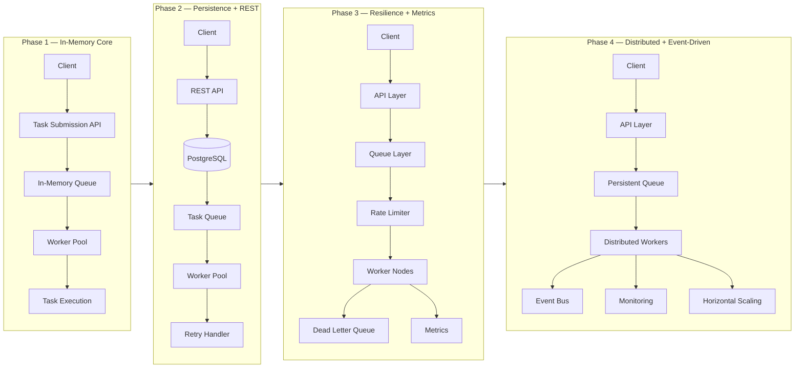
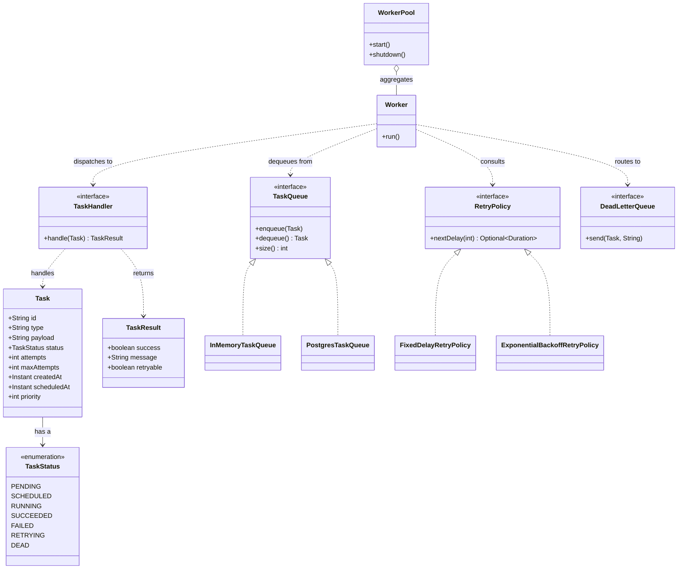
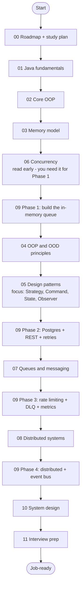

# Backend Engineering Roadmap: Build a Distributed Task Queue While Mastering Java and Backend

> One project. Twelve modules. Zero throwaway toy code. You will build a production-inspired **Distributed Task Queue and Event Processing Platform** in Java 21, and every concept — OOP, design patterns, concurrency, queues, distributed systems, system design — is taught *through* that one evolving codebase.

This is the master entry point. If you read only one file, read this one: it tells you what you are building, why the curriculum is structured the way it is, and the exact order to walk the 130 files.

---

## The Pitch

Most backend tutorials teach concepts in isolation. You learn `synchronized` from a counter example, the Strategy pattern from a payment toy, and "distributed systems" from a slide deck. Then you sit down to build something real and none of it connects.

This roadmap refuses that. We pick **one hard, real problem** — a task queue that accepts work over an API, persists it, runs it on worker pools, retries failures, rate-limits, schedules, dead-letters, emits metrics, and scales horizontally — and we build it for real. Every chapter earns its place by moving that system forward.

By the end you can answer, with code you wrote:

- *"How do you model a domain cleanly in Java?"* — you modeled `Task`, `TaskStatus`, `TaskHandler`, `TaskQueue`.
- *"How does a thread pool actually consume a queue safely?"* — you wrote `Worker`, `WorkerPool`, and debugged the races.
- *"How do retries with exponential backoff and a dead-letter queue work?"* — you shipped `RetryPolicy`, `DeadLetterQueue`.
- *"Design a job processing system at scale."* — you have done it, in four phases, and can whiteboard the tradeoffs.

That is the difference between *knowing about* backend engineering and *being* a backend engineer.

---

## Who This Is For (Prerequisites)

This curriculum is written for a very specific person. Read this honestly before you start.

| You should already have | You do NOT need |
| --- | --- |
| Strong data structures and algorithms (1000+ problems solved) | Any Java experience — we start from `class`/`object` |
| Comfort programming in *some* language (Python, C++, JS, Go) | Formal OOD / design-pattern knowledge — we teach it |
| Some backend exposure (you've built an API or two) | Spring, Kafka, Postgres knowledge — introduced gradually |
| Willingness to build and refactor, not just read | A CS degree or prior "system design" study |

**The learner profile in one line:** algorithmically strong, programming-comfortable, but new to Java and new to formal object-oriented design, aiming to become a strong backend / software engineer who thinks about tradeoffs, modeling, extensibility, scalability, and production.

We do **not** explain what a variable is. We **do** explain *why* Java has checked exceptions, *why* composition usually beats inheritance, and *why* a `BlockingQueue` is the backbone of a worker pool. We move fast, but we never hand-wave the *why*.

### Tooling prerequisites

```bash
# Java 21 LTS (Temurin recommended)
java -version          # expect: openjdk version "21.x"

# Maven 3.9+ (Gradle is a fine alternative; we show Maven)
mvn -version

# Docker + docker-compose (needed from Phase 3/4 onward)
docker --version
docker compose version

# Optional but recommended: an IDE with great Java support
# IntelliJ IDEA Community is free and excellent for this stack.
```

---

## What You Will Build: The Project

**Distributed Task Queue and Event Processing Platform.** A backend that accepts tasks via an API, persists them, processes them asynchronously with worker pools, and survives the messy reality of production: retries, partial failures, poison messages, rate limits, scheduling, observability, and horizontal scale.

It grows across **four phases**. Each phase is a working system; later phases refactor earlier ones rather than restarting.



### The four phases at a glance

| Phase | Architecture | New tech introduced | What you master | Build chapter |
| --- | --- | --- | --- | --- |
| **1** | Client → Task Submission API → In-Memory Queue → Worker Pool → Execution | Core Java 21, `BlockingQueue`, `ExecutorService`, virtual threads | OOP, domain modeling, producer/consumer, thread safety | [phase-1.md](09-project/phase-1.md) |
| **2** | Client → REST API → PostgreSQL → Task Queue → Worker Pool → Retry Handler | Spring Boot 3, Spring Web, Spring Data JDBC, Flyway, Postgres | Persistence, REST, repository pattern, retries | [phase-2.md](09-project/phase-2.md) |
| **3** | Client → API → Queue → Rate Limiter → Worker Nodes → DLQ → Metrics | Micrometer + Prometheus + Grafana, Resilience4j, token bucket | Rate limiting, dead-letter queues, observability, circuit breakers | [phase-3.md](09-project/phase-3.md) |
| **4** | Client → API → Persistent Queue → Distributed Workers → Event Bus → Monitoring → Scaling | Redis / Kafka / RabbitMQ (pluggable), Docker Compose | Distributed workers, event-driven design, horizontal scaling | [phase-4.md](09-project/phase-4.md) |

> The full evolving picture lives in [09-project/architecture.md](09-project/architecture.md).

---

## The Canonical Domain Model

Every one of the 130 files uses **these exact names**, so the code composes across modules. Skim this now; you will see these types everywhere. Early Java chapters use just the simplest slice (`Task`, `TaskStatus`) and extend later.

```java
// The lifecycle a task moves through.
public enum TaskStatus {
    PENDING, SCHEDULED, RUNNING, SUCCEEDED, FAILED, RETRYING, DEAD
}

// The unit of work. A record once we reach immutability; a class while we teach mutation.
public record Task(
        String id,           // a UUID
        String type,         // dispatch key for the handler
        String payload,      // JSON string
        TaskStatus status,
        int attempts,
        int maxAttempts,
        java.time.Instant createdAt,
        java.time.Instant scheduledAt,
        int priority
) {}

// What ran, and whether it is worth retrying.
public record TaskResult(boolean success, String message, boolean retryable) {}

// Functional interface: one task type -> one handler.
@FunctionalInterface
public interface TaskHandler {
    TaskResult handle(Task task) throws Exception;
}

// The queue abstraction. InMemoryTaskQueue (Phase 1), PostgresTaskQueue (Phase 2),
// a distributed broker (Phase 4) all implement this.
public interface TaskQueue {
    void enqueue(Task t);
    Task dequeue() throws InterruptedException;
    int size();
}
```

The supporting cast — introduced exactly when a phase needs it:

```java
// Worker pulls from a TaskQueue, looks up a TaskHandler by task.type(), executes, handles the outcome.
public final class Worker implements Runnable { /* ... */ }

// WorkerPool owns an ExecutorService of Workers.
public final class WorkerPool {
    public void start() { /* ... */ }
    public void shutdown() { /* ... */ }
}

// Retry strategy. FixedDelayRetryPolicy and ExponentialBackoffRetryPolicy (with jitter).
public interface RetryPolicy {
    java.util.Optional<java.time.Duration> nextDelay(int attempt);
}

public interface DeadLetterQueue { void send(Task t, String reason); }

public interface RateLimiter { boolean tryAcquire(); }                       // TokenBucketRateLimiter

public interface TaskScheduler { void schedule(Task t, java.time.Duration delay); } // DelayQueue / ScheduledExecutorService

public interface TaskRepository {                                            // JDBC-backed in Phase 2
    void save(Task t);
    java.util.Optional<Task> findById(String id);
    java.util.List<Task> pollDue(int n);
}

public interface EventBus {                                                  // Phase 4
    void publish(TaskEvent e);
    void subscribe(TaskEventListener l);
}
```

And the relationships between the core types, as UML:



> Reading classDiagram arrows: `<|..` is *implements*, `o--` is *aggregation* (the part can outlive the whole), `*--` is *composition* (part dies with the whole), and `..>` is a *dependency*. We use these precisely throughout [04-oop-and-ood](04-oop-and-ood/) and [05-design-patterns](05-design-patterns/).

---

## The Implementation-First Philosophy

Every concept chapter walks the same path, on purpose:


You never get the polished answer first. You get the bad version, you *feel* why it hurts, and then you refactor it — because that is exactly how you will work as an engineer. We optimize for the muscle of *improving code*, not the trivia of *recognizing patterns*.

Three rules keep this honest:

1. **No placeholders.** Every code block compiles (conceptually) and is realistic. No `// TODO`, no "left as an exercise" without the actual content.
2. **Tradeoffs are mandatory.** Every design choice comes with what it costs. There is rarely a free lunch, and we name the bill.
3. **It all ties back to the project.** If a concept can't move the Task Queue forward, we question whether it belongs.

---

## The Chapter Template (Legend)

Every **concept** chapter follows this 15-section structure. When you open any file in modules 01–08, you can navigate by these headings. Project and pattern chapters adapt it sensibly.

| # | Section | What you get |
| --- | --- | --- |
| 1 | **Title + placement** | One line on where this fits in the project |
| 2 | **Why this exists** | The real problem it solves (with history where it helps) |
| 3 | **The naive version** | A bad/first-cut implementation, limits called out |
| 4 | **Improved version** | Refactor toward a better design |
| 5 | **Production-quality version** | What a staff engineer would actually ship |
| 6 | **Code walkthrough** | Beginner → intermediate → production-inspired Java |
| 7 | **How this applies to our Task Queue** | Concrete canonical-model classes |
| 8 | **Tradeoffs** | Honest engineering tradeoffs, comparison tables |
| 9 | **Common mistakes and pitfalls** | Bullet list, each with a fix |
| 10 | **Refactoring exercise** | Bad → improved → production code |
| 11 | **Exercises** | Easy / Medium / Hard, including interview + stretch |
| 12 | **Solutions** | Complete, compilable, explained |
| 13 | **Interview questions and takeaways** | 5–10 real questions with model answers |
| 14 | **Production considerations** | What breaks at scale, monitoring, gotchas |
| 15 | **Project-integration footer** | See below |

The footer always closes with these exact subheadings, so you can connect theory to the build:

- `## What We Can Improve In Our Project Using This Concept`
- `## Project Refactoring Task`
- `## Git Commit For This Chapter` (a concrete conventional-commit message + files touched)
- `## Architecture Impact`
- `## Interview Takeaways`

---

## The Full Module Map

Twelve modules, 130 files. Every link is relative and points at a real file. Work top-to-bottom for the default path, or jump using the suggested order further down.

### 00 — Roadmap and planning

| File | What it covers |
| --- | --- |
| [roadmap.md](00-roadmap/roadmap.md) | The full learning arc, module by module |
| [study-plan.md](00-roadmap/study-plan.md) | A week-by-week pace you can actually keep |
| [milestones.md](00-roadmap/milestones.md) | Checkpoints that prove you're progressing |

### 01 — Java fundamentals (you are new to Java; start here)

| File | What it covers |
| --- | --- |
| [chapter-01-classes-and-objects.md](01-java-fundamentals/chapter-01-classes-and-objects.md) | Classes, objects, and the first `Task` |
| [chapter-02-encapsulation.md](01-java-fundamentals/chapter-02-encapsulation.md) | Hiding state behind behavior |
| [chapter-03-abstraction.md](01-java-fundamentals/chapter-03-abstraction.md) | Modeling with interfaces and abstractions |
| [chapter-04-generics.md](01-java-fundamentals/chapter-04-generics.md) | Type parameters; a typed `TaskQueue` |
| [chapter-05-collections.md](01-java-fundamentals/chapter-05-collections.md) | Lists, maps, sets, queues |
| [chapter-06-exceptions.md](01-java-fundamentals/chapter-06-exceptions.md) | Checked vs unchecked; failure as data |
| [chapter-07-streams.md](01-java-fundamentals/chapter-07-streams.md) | Stream pipelines over tasks |
| [chapter-08-functional-interfaces.md](01-java-fundamentals/chapter-08-functional-interfaces.md) | Lambdas; `TaskHandler` as a functional interface |
| [exercises.md](01-java-fundamentals/exercises.md) · [solutions.md](01-java-fundamentals/solutions.md) | Module drills + full solutions |

### 02 — Core OOP

| File | What it covers |
| --- | --- |
| [chapter-01-objects-and-references.md](02-core-oop/chapter-01-objects-and-references.md) | Identity vs value |
| [chapter-02-fields-and-methods.md](02-core-oop/chapter-02-fields-and-methods.md) | State and behavior |
| [chapter-03-constructors.md](02-core-oop/chapter-03-constructors.md) | Constructing valid objects |
| [chapter-04-access-modifiers.md](02-core-oop/chapter-04-access-modifiers.md) | `public`/`private`/`protected`/package |
| [chapter-05-static-members.md](02-core-oop/chapter-05-static-members.md) | Class-level state and utilities |
| [chapter-06-method-overloading.md](02-core-oop/chapter-06-method-overloading.md) | Compile-time dispatch |
| [chapter-07-method-overriding.md](02-core-oop/chapter-07-method-overriding.md) | Runtime dispatch |
| [chapter-08-inheritance.md](02-core-oop/chapter-08-inheritance.md) | `extends`, and when not to |
| [chapter-09-polymorphism.md](02-core-oop/chapter-09-polymorphism.md) | One interface, many handlers |
| [chapter-10-upcasting-and-downcasting.md](02-core-oop/chapter-10-upcasting-and-downcasting.md) | Reference conversions |
| [chapter-11-instanceof.md](02-core-oop/chapter-11-instanceof.md) | Pattern matching `instanceof` |
| [chapter-12-abstract-classes.md](02-core-oop/chapter-12-abstract-classes.md) | Partial implementations |
| [chapter-13-interfaces.md](02-core-oop/chapter-13-interfaces.md) | Contracts; sealed interfaces |
| [chapter-14-association.md](02-core-oop/chapter-14-association.md) | "uses-a" relationships |
| [chapter-15-aggregation.md](02-core-oop/chapter-15-aggregation.md) | "has-a", part outlives whole |
| [chapter-16-composition.md](02-core-oop/chapter-16-composition.md) | "owns-a", part dies with whole |
| [chapter-17-composition-vs-inheritance.md](02-core-oop/chapter-17-composition-vs-inheritance.md) | The defining OOP tradeoff |
| [exercises.md](02-core-oop/exercises.md) · [solutions.md](02-core-oop/solutions.md) | Module drills + full solutions |

### 03 — Java memory model

| File | What it covers |
| --- | --- |
| [stack-vs-heap.md](03-java-memory-model/stack-vs-heap.md) | Where objects and frames live |
| [object-references.md](03-java-memory-model/object-references.md) | References, not pointers |
| [pass-by-value.md](03-java-memory-model/pass-by-value.md) | Java is pass-by-value (of references) |
| [garbage-collection.md](03-java-memory-model/garbage-collection.md) | GC algorithms and tuning |
| [object-lifecycle.md](03-java-memory-model/object-lifecycle.md) | From `new` to collected |
| [immutable-objects.md](03-java-memory-model/immutable-objects.md) | Why `Task` becomes a record |
| [string-pool.md](03-java-memory-model/string-pool.md) | Interning and `==` traps |
| [exercises.md](03-java-memory-model/exercises.md) · [solutions.md](03-java-memory-model/solutions.md) | Module drills + full solutions |

### 04 — OOP and OOD (design principles)

| File | What it covers |
| --- | --- |
| [cohesion.md](04-oop-and-ood/cohesion.md) | Keeping classes focused |
| [coupling.md](04-oop-and-ood/coupling.md) | Minimizing dependencies |
| [dependency-injection.md](04-oop-and-ood/dependency-injection.md) | Wiring without `new` everywhere |
| [domain-modeling.md](04-oop-and-ood/domain-modeling.md) | Turning a problem into types |
| [aggregates.md](04-oop-and-ood/aggregates.md) | Consistency boundaries |
| [layered-architecture.md](04-oop-and-ood/layered-architecture.md) | Controller/service/repository |
| [hexagonal-architecture.md](04-oop-and-ood/hexagonal-architecture.md) | Ports and adapters |
| [clean-architecture.md](04-oop-and-ood/clean-architecture.md) | Dependency rule |
| [solid.md](04-oop-and-ood/solid.md) | The five principles, applied |
| [dry-kiss-yagni.md](04-oop-and-ood/dry-kiss-yagni.md) | Pragmatic restraint |
| [law-of-demeter.md](04-oop-and-ood/law-of-demeter.md) | Don't talk to strangers |
| [exercises.md](04-oop-and-ood/exercises.md) · [solutions.md](04-oop-and-ood/solutions.md) | Module drills + full solutions |

### 05 — Design patterns (all 23 GoF, applied to the queue)

| File | File | File | File |
| --- | --- | --- | --- |
| [singleton.md](05-design-patterns/singleton.md) | [factory-method.md](05-design-patterns/factory-method.md) | [abstract-factory.md](05-design-patterns/abstract-factory.md) | [adapter.md](05-design-patterns/adapter.md) |
| [decorator.md](05-design-patterns/decorator.md) | [facade.md](05-design-patterns/facade.md) | [composite.md](05-design-patterns/composite.md) | [proxy.md](05-design-patterns/proxy.md) |
| [strategy.md](05-design-patterns/strategy.md) | [observer.md](05-design-patterns/observer.md) | [command.md](05-design-patterns/command.md) | [state.md](05-design-patterns/state.md) |
| [template-method.md](05-design-patterns/template-method.md) | [chain-of-responsibility.md](05-design-patterns/chain-of-responsibility.md) | [iterator.md](05-design-patterns/iterator.md) | [mediator.md](05-design-patterns/mediator.md) |
| [memento.md](05-design-patterns/memento.md) | [visitor.md](05-design-patterns/visitor.md) | [interpreter.md](05-design-patterns/interpreter.md) | [exercises.md](05-design-patterns/exercises.md) |
| [solutions.md](05-design-patterns/solutions.md) | | | |

> Highlights for this project: **Strategy** powers `RetryPolicy`, **Command** *is* `Task`, **Observer** becomes the `EventBus`, **State** models `TaskStatus` transitions, **Chain of Responsibility** wires the processing pipeline, and **Factory Method** builds `TaskHandler`s by type.

### 06 — Concurrency (the heart of the worker pool)

| File | What it covers |
| --- | --- |
| [threads.md](06-concurrency/threads.md) | Platform vs virtual threads (Loom) |
| [executor-service.md](06-concurrency/executor-service.md) | `ExecutorService`; the `WorkerPool` engine |
| [futures-and-completablefuture.md](06-concurrency/futures-and-completablefuture.md) | Async results and composition |
| [blocking-queue.md](06-concurrency/blocking-queue.md) | The backbone of `InMemoryTaskQueue` |
| [locks.md](06-concurrency/locks.md) | `ReentrantLock`, conditions |
| [semaphores.md](06-concurrency/semaphores.md) | Bounding concurrency |
| [atomics-and-thread-safety.md](06-concurrency/atomics-and-thread-safety.md) | CAS, `AtomicInteger`, memory visibility |
| [concurrent-collections.md](06-concurrency/concurrent-collections.md) | `ConcurrentHashMap` and friends |
| [exercises.md](06-concurrency/exercises.md) · [solutions.md](06-concurrency/solutions.md) | Module drills + full solutions |

### 07 — Queues and messaging

| File | What it covers |
| --- | --- |
| [producer-consumer.md](07-queues-and-messaging/producer-consumer.md) | The foundational pattern |
| [message-queues.md](07-queues-and-messaging/message-queues.md) | What a broker buys you |
| [task-queues.md](07-queues-and-messaging/task-queues.md) | Tasks vs generic messages |
| [priority-queues.md](07-queues-and-messaging/priority-queues.md) | Ordering by `priority` |
| [delayed-queues.md](07-queues-and-messaging/delayed-queues.md) | `DelayQueue` and visibility delays |
| [scheduling-queues.md](07-queues-and-messaging/scheduling-queues.md) | `TaskScheduler` internals |
| [dead-letter-queues.md](07-queues-and-messaging/dead-letter-queues.md) | Where poison tasks go |
| [broker-comparison.md](07-queues-and-messaging/broker-comparison.md) | Redis vs Kafka vs RabbitMQ |
| [exercises.md](07-queues-and-messaging/exercises.md) · [solutions.md](07-queues-and-messaging/solutions.md) | Module drills + full solutions |

### 08 — Distributed systems

| File | What it covers |
| --- | --- |
| [cap-theorem.md](08-distributed-systems/cap-theorem.md) | Consistency, availability, partitions |
| [consistency-and-availability.md](08-distributed-systems/consistency-and-availability.md) | The spectrum in practice |
| [idempotency.md](08-distributed-systems/idempotency.md) | Exactly-once is a lie; idempotency is the fix |
| [retries.md](08-distributed-systems/retries.md) | Backoff, jitter, retry storms |
| [dlq.md](08-distributed-systems/dlq.md) | Dead-letter queues, distributed |
| [rate-limiting.md](08-distributed-systems/rate-limiting.md) | Token bucket, distributed limits |
| [backpressure.md](08-distributed-systems/backpressure.md) | Shedding load gracefully |
| [circuit-breakers.md](08-distributed-systems/circuit-breakers.md) | Resilience4j; failing fast |
| [sharding.md](08-distributed-systems/sharding.md) | Partitioning work |
| [distributed-locks.md](08-distributed-systems/distributed-locks.md) | Leases and fencing tokens |
| [leader-election.md](08-distributed-systems/leader-election.md) | Coordinating a cluster |
| [service-discovery-and-scaling.md](08-distributed-systems/service-discovery-and-scaling.md) | Finding and adding nodes |
| [message-ordering.md](08-distributed-systems/message-ordering.md) | Ordering guarantees |
| [exercises.md](08-distributed-systems/exercises.md) · [solutions.md](08-distributed-systems/solutions.md) | Module drills + full solutions |

### 09 — The project (the spine)

| File | What it covers |
| --- | --- |
| [phase-1.md](09-project/phase-1.md) | In-memory queue + worker pool |
| [phase-2.md](09-project/phase-2.md) | Postgres, REST, retries |
| [phase-3.md](09-project/phase-3.md) | Rate limiting, DLQ, metrics |
| [phase-4.md](09-project/phase-4.md) | Distributed workers + event bus |
| [architecture.md](09-project/architecture.md) | The whole system, end to end |
| [exercises.md](09-project/exercises.md) · [solutions.md](09-project/solutions.md) | Project drills + full solutions |

### 10 — System design

| File | What it covers |
| --- | --- |
| [system-design-fundamentals.md](10-system-design/system-design-fundamentals.md) | The vocabulary and method |
| [designing-a-task-queue.md](10-system-design/designing-a-task-queue.md) | Our system, as an interview |
| [scaling-the-platform.md](10-system-design/scaling-the-platform.md) | From one box to many |
| [capacity-estimation.md](10-system-design/capacity-estimation.md) | Back-of-envelope math |
| [data-modeling-and-storage.md](10-system-design/data-modeling-and-storage.md) | Schema and storage choices |
| [observability-and-ops.md](10-system-design/observability-and-ops.md) | Metrics, logs, traces, alerts |
| [case-studies.md](10-system-design/case-studies.md) | Real queue systems compared |

### 11 — Interview prep

| File | What it covers |
| --- | --- |
| [java.md](11-interview-prep/java.md) | Java language and JVM questions |
| [ood.md](11-interview-prep/ood.md) | Object-oriented design rounds |
| [concurrency.md](11-interview-prep/concurrency.md) | Threading and synchronization |
| [distributed-systems.md](11-interview-prep/distributed-systems.md) | Distributed-systems questions |
| [system-design.md](11-interview-prep/system-design.md) | Full design interviews |

---

## Suggested Learning Order

You can read modules 01–11 straight through. But the **recommended order interleaves theory with building**, so concepts land while you have a reason to use them.



In words:

1. **[00-roadmap](00-roadmap/roadmap.md)** — orient, then commit to a pace via [study-plan.md](00-roadmap/study-plan.md).
2. **[01-java-fundamentals](01-java-fundamentals/chapter-01-classes-and-objects.md)** — you are new to Java; this is non-negotiable.
3. **[02-core-oop](02-core-oop/chapter-01-objects-and-references.md)** then **[03-java-memory-model](03-java-memory-model/stack-vs-heap.md)** — how Java objects truly behave.
4. **[06-concurrency](06-concurrency/blocking-queue.md)** *early* — Phase 1 needs `BlockingQueue` and `ExecutorService`. Read at least `threads.md`, `executor-service.md`, and `blocking-queue.md` before building.
5. **Build [Phase 1](09-project/phase-1.md).** Now you have a running queue.
6. **[04-oop-and-ood](04-oop-and-ood/solid.md)** and the key **[05-design-patterns](05-design-patterns/strategy.md)** — refactor what you just built into something clean.
7. **Build [Phase 2](09-project/phase-2.md)** (persistence + REST + retries), then read **[07-queues-and-messaging](07-queues-and-messaging/producer-consumer.md)**.
8. **Build [Phase 3](09-project/phase-3.md)** (rate limiting, DLQ, metrics), then read **[08-distributed-systems](08-distributed-systems/idempotency.md)**.
9. **Build [Phase 4](09-project/phase-4.md)** (distributed, event-driven, scaled).
10. **[10-system-design](10-system-design/designing-a-task-queue.md)** to zoom out, then **[11-interview-prep](11-interview-prep/system-design.md)** to convert it all into offers.

> If you are time-boxed, the *critical path* is: 01 → 06 → 09/phase-1 → 05 (Strategy/Command/Observer/State) → 09/phase-2 → 08 → 09/phase-4 → 10. Everything else deepens that spine.

---

## How to Use This Repo

A few habits that make the difference between reading and learning:

- **Type the code, don't copy it.** The naive→improved→production progression only builds intuition if your hands do it.
- **Build the project in a separate working repo** (call it `taskqueue/`), and commit per chapter. Every concept chapter ends with a concrete `## Git Commit For This Chapter` line — use it.
- **Do the Hard exercise.** Easy/Medium confirm understanding; Hard exposes the gaps. The Solutions are complete and compilable, so check yourself honestly.
- **When a chapter links elsewhere, follow it once.** Cross-links (like [composition-vs-inheritance](02-core-oop/chapter-17-composition-vs-inheritance.md) ↔ [strategy](05-design-patterns/strategy.md)) are how the mental model knits together.
- **Keep the canonical model open.** Whenever you write code, name things `Task`, `TaskQueue`, `Worker`, `RetryPolicy`. Consistency is what makes the whole repo feel like one system.

A minimal first run to confirm your toolchain works:

```bash
# Scaffold the project repo you'll grow across all four phases
mvn -q archetype:generate \
  -DgroupId=dev.roadmap.taskqueue \
  -DartifactId=taskqueue \
  -DarchetypeArtifactId=maven-archetype-quickstart \
  -DarchetypeVersion=1.4 \
  -DinteractiveMode=false

cd taskqueue
mvn -q -DskipTests package      # confirms Java 21 + Maven are wired up
```

```java
// src/main/java/dev/roadmap/taskqueue/Main.java
// The smallest slice of the model that proves the toolchain — extended heavily from Phase 1 on.
package dev.roadmap.taskqueue;

import java.time.Instant;
import java.util.UUID;

enum TaskStatus { PENDING, SCHEDULED, RUNNING, SUCCEEDED, FAILED, RETRYING, DEAD }

record Task(String id, String type, String payload, TaskStatus status,
            int attempts, int maxAttempts, Instant createdAt,
            Instant scheduledAt, int priority) {}

public class Main {
    public static void main(String[] args) {
        var now = Instant.now();
        var task = new Task(
                UUID.randomUUID().toString(), "send-email", "{\"to\":\"a@b.com\"}",
                TaskStatus.PENDING, 0, 3, now, now, 5);
        System.out.println("Created " + task.type() + " task " + task.id()
                + " in state " + task.status());
    }
}
```

```text
Created send-email task 3f1c... in state PENDING
```

If that prints, you are ready. Open [00-roadmap/roadmap.md](00-roadmap/roadmap.md) and begin.

---

## What "Done" Looks Like

You have finished this roadmap when you can, without notes:

- Write idiomatic, modern Java 21 (records, sealed interfaces, pattern-matching `switch`, virtual threads) and explain the tradeoffs of each.
- Model a domain into cohesive, loosely-coupled types and defend `composition over inheritance` with concrete examples from your own code.
- Implement a thread-safe worker pool over a blocking queue, reason about visibility and races, and pick the right concurrency primitive.
- Design retries with exponential backoff + jitter, idempotency keys, rate limiting, and a dead-letter queue — and say *why* each exists.
- Take "design a distributed task queue" in an interview and drive it: API, storage, queue, workers, scaling, failure modes, capacity math.

That is a strong backend engineer. Let's build it. Start at **[00-roadmap/roadmap.md](00-roadmap/roadmap.md)**.

---

> **License & contributions:** This is a learning repository. Fork it, build your own `taskqueue/` alongside it, and open issues where a chapter's tradeoffs could go deeper. The best contribution is a better refactoring exercise.
